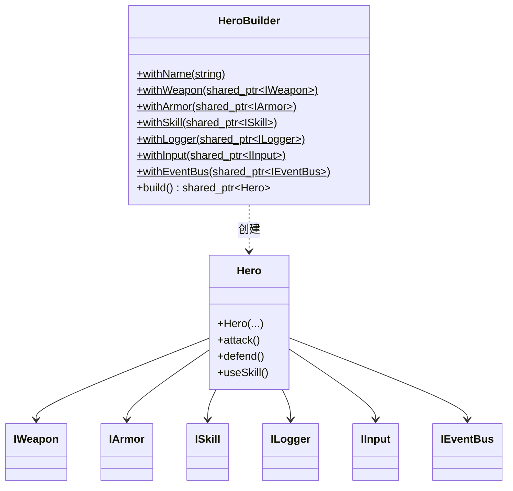
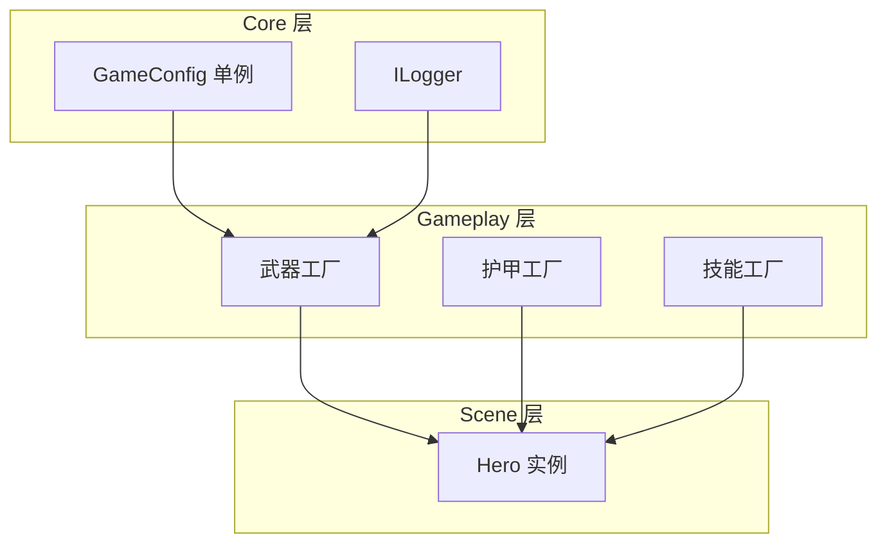

# 现代手动 DI 模式：Builder 与分层装配

> 所属计划: [[plan|C++ 依赖注入完整学习计划]]
> 预计耗时: 60min
> 前置知识: [[07-composition-root-wiring]]

---

## 1. 概念讲解

### 1.1 先用一个游戏场景理解「装备栏」

想象一款 ARPG：你创建一个新角色时，系统要为他装配武器、护甲、技能、日志、输入、事件总线等。如果所有这些选项都塞进一个长长的构造器参数列表，策划想调整默认值、测试想只换一个 Mock 日志、Mod 作者想省略某个可选组件，都会变得非常痛苦。

这一节要解决的问题正是：当 [[07-composition-root-wiring]] 里的对象图变大、单个类依赖变多时，手动 DI 该如何组织代码，才能既保持可测试，又不让组合根变成「意大利面条」。

> 关键词是**组织**，不是「换一种注入技术」。

### 1.2 构造器膨胀：六参数构造器为什么难读

当 `Hero` 需要武器、护甲、技能、日志、输入、事件总线六个依赖时，构造器会变成这样：

```cpp
Hero(const std::string& name,
     std::shared_ptr<IWeapon> weapon,
     std::shared_ptr<IArmor> armor,
     std::shared_ptr<ISkill> skill,
     std::shared_ptr<ILogger> logger,
     std::shared_ptr<IInput> input,
     std::shared_ptr<IEventBus> events);
```

问题不只是「参数多」：

- **位置依赖**：调用者必须按顺序填对七个参数，少一个或错一个类型，编译期错误信息往往指向实现而非意图。
- **测试负担**：单元测试里只要测 `attack()`，也得构造护甲、输入、事件总线等无关对象。
- **默认值难表达**：可选技能不传？要传 `nullptr`，但每个调用点都要决策。
- **扩展破坏签名**：新增一个「天赋树」依赖，所有调用点、所有 Mock 构造都得改。

CppCon 2024 上 Peter Muldoon 在讨论 C++ 依赖注入重构时，把这种现象称为 **constructor bloat（构造器膨胀）**。 Builder、Parameter Object 与分层装配，正是应对手动 DI 膨胀的三种常见组织模式。

### 1.3 Builder 模式：流式装配

Builder 把构造过程拆成一组有名字的步骤：

```cpp
auto hero = HeroBuilder()
    .withName("森林骑士")
    .withWeapon(std::make_shared<Sword>())
    .withArmor(std::make_shared<PlateArmor>())
    .withSkill(std::make_shared<FireballSkill>())
    .withLogger(std::make_shared<ConsoleLogger>())
    .withInput(std::make_shared<KeyboardInput>())
    .withEventBus(std::make_shared<EventBus>())
    .build();
```

好处显而易见：

- 每个依赖都有名字，不必记顺序。
- 可选依赖直接省略，Builder 在 `build()` 里给默认值。
- 新增依赖只需新增一个 `withXxx()`，不破坏已有调用点。
- 测试时只覆盖关心的依赖，其余走默认实现。



> [!note] C# 中的 Builder 风味
> 在 .NET/Unity 代码里，你经常能看到完全相同的链式调用：`new HeroBuilder().WithWeapon(new Sword()).WithArmor(new LeatherArmor()).Build();`。思想一致，只是命名习惯带大写前缀。

### 1.4 参数对象：把相关依赖打包

Builder 适合「逐步配置」，但如果一组依赖总是一起出现——比如武器、护甲、技能都属于**战斗配置**——更好的做法是先把它们打包成一个结构体：

```cpp
struct CombatConfig {
    std::shared_ptr<IWeapon> weapon;
    std::shared_ptr<IArmor> armor;
    std::shared_ptr<ISkill> skill; // 可为空
};
```

然后让 `Hero` 提供一个以 `CombatConfig` 为参数的构造器：

```cpp
Hero(const std::string& name,
     const CombatConfig& combat,
     std::shared_ptr<ILogger> logger,
     std::shared_ptr<IInput> input,
     std::shared_ptr<IEventBus> events);
```

七个参数瞬间变成「1 个名字 + 1 个参数对象 + 3 个横切依赖」。这也是「把变化频率相同的依赖放在一起」的设计直觉：武器/护甲/技能经常一起替换，而日志/输入/事件总线通常由组合根统一提供。

| 模式 | 适合解决的问题 | 不适合的场景 |
|------|----------------|--------------|
| Builder | 依赖多、可选多、想流式配置 | 只有两三个简单参数 |
| Parameter Object | 多参数天然属于同一概念（如战斗配置、音频配置） | 参数之间毫无关联 |
| 分层装配 | 对象图太大，需要按生命周期/领域拆分 | 只有十几个对象的小项目 |

### 1.5 分层组合根：Core / Gameplay / Scene

当游戏规模继续扩大，单个 Builder 也不够用时。常见的做法是把对象图按**生命周期和领域**分成几层：

- **Core 层**：整个进程生命周期内稳定存在，例如 `GameConfig`、全局 `ILogger`。
- **Gameplay 层**：按玩法规则创建对象，例如武器工厂、护甲工厂、技能工厂。
- **Scene 层**：随关卡/场景创建和销毁，例如当前关卡的 `Hero`、`Enemy`。

每一层只依赖下一层，组合根从外到内逐层调用：



对应代码模式通常是：

```cpp
auto core = assembleCore();
auto gp   = assembleGameplay(core);
auto scene = assembleScene(gp, "forest");
```

这样 `main()` 或入口点不需要知道 `Hero` 有六个依赖，它只关心「装配到 Scene 层」。

### 1.6 门面：对外暴露简单入口

分层装配的调用链如果暴露给上层（例如关卡加载器、编辑器工具），仍然略显啰嗦。这时可以用一个 **Facade（门面）** 把 `assembleCore -> assembleGameplay -> assembleScene` 藏起来：

```cpp
class GameFacade {
public:
    GameFacade();
    void run();
private:
    CoreServices core_;
    GameplayServices gp_;
    Scene scene_;
};
```

使用者只需 `GameFacade game; game.run();`，内部依赖关系对外不可见。

---

## 2. 代码示例

下面的完整程序把本节所有模式串在一起：

- 先用**六参数构造器**直接创建 `Hero`，展示膨胀问题。
- 再用 `HeroBuilder` 做**流式装配**。
- 再用 `CombatConfig` 做**参数对象装配**。
- 最后展示 `assembleCore -> assembleGameplay -> assembleScene` 的**分层装配 + 门面**。

```cpp
#include <iostream>
#include <memory>
#include <string>
#include <stdexcept>
#include <vector>

// ---------- 核心接口 ----------
class IWeapon {
public:
    virtual ~IWeapon() = default;
    virtual int damage() const = 0;
    virtual std::string name() const = 0;
};

class Sword : public IWeapon {
public:
    int damage() const override { return 15; }
    std::string name() const override { return "铁剑"; }
};

class Bow : public IWeapon {
public:
    int damage() const override { return 12; }
    std::string name() const override { return "长弓"; }
};

class IArmor {
public:
    virtual ~IArmor() = default;
    virtual int defense() const = 0;
    virtual std::string name() const = 0;
};

class LeatherArmor : public IArmor {
public:
    int defense() const override { return 5; }
    std::string name() const override { return "皮甲"; }
};

class PlateArmor : public IArmor {
public:
    int defense() const override { return 10; }
    std::string name() const override { return "板甲"; }
};

class ISkill {
public:
    virtual ~ISkill() = default;
    virtual std::string name() const = 0;
    virtual void cast() = 0;
};

class FireballSkill : public ISkill {
public:
    std::string name() const override { return "火球术"; }
    void cast() override { std::cout << "  轰！火球飞了出去。\n"; }
};

class HealSkill : public ISkill {
public:
    std::string name() const override { return "治疗术"; }
    void cast() override { std::cout << "  柔和的光芒笼罩全身。\n"; }
};

class IInput {
public:
    virtual ~IInput() = default;
    virtual std::string readCommand() const = 0;
};

class KeyboardInput : public IInput {
public:
    std::string readCommand() const override { return "attack"; }
};

class IEventBus {
public:
    virtual ~IEventBus() = default;
    virtual void publish(const std::string& event) = 0;
};

class EventBus : public IEventBus {
public:
    void publish(const std::string& event) override {
        std::cout << "  [事件总线] " << event << "\n";
    }
};

class ILogger {
public:
    virtual ~ILogger() = default;
    virtual void log(const std::string& msg) = 0;
};

class ConsoleLogger : public ILogger {
public:
    void log(const std::string& msg) override { std::cout << "[log] " << msg << "\n"; }
};

// ---------- 参数对象 ----------
struct CombatConfig {
    std::shared_ptr<IWeapon> weapon;
    std::shared_ptr<IArmor> armor;
    std::shared_ptr<ISkill> skill; // 可为空
};

// ---------- Hero ----------
class Hero {
public:
    // 六参数版本：直接暴露所有依赖
    Hero(const std::string& name,
         std::shared_ptr<IWeapon> weapon,
         std::shared_ptr<IArmor> armor,
         std::shared_ptr<ISkill> skill,
         std::shared_ptr<ILogger> logger,
         std::shared_ptr<IInput> input,
         std::shared_ptr<IEventBus> events)
        : name_(name)
        , weapon_(weapon ? weapon : throw std::invalid_argument("weapon required"))
        , armor_(armor ? armor : throw std::invalid_argument("armor required"))
        , skill_(skill)
        , logger_(logger ? logger : throw std::invalid_argument("logger required"))
        , input_(input ? input : throw std::invalid_argument("input required"))
        , events_(events ? events : throw std::invalid_argument("events required"))
    {}

    // 参数对象版本：把战斗相关依赖打包
    Hero(const std::string& name,
         const CombatConfig& combat,
         std::shared_ptr<ILogger> logger,
         std::shared_ptr<IInput> input,
         std::shared_ptr<IEventBus> events)
        : Hero(name, combat.weapon, combat.armor, combat.skill, logger, input, events)
    {}

    void attack() {
        logger_->log(name_ + " 使用 " + weapon_->name() + " 造成 " + std::to_string(weapon_->damage()) + " 点伤害");
        events_->publish("hero.attack");
    }

    void defend() {
        logger_->log(name_ + " 进入防御姿态，" + armor_->name() + " 提供 " + std::to_string(armor_->defense()) + " 点护甲");
        events_->publish("hero.defend");
    }

    void useSkill() {
        if (skill_) {
            logger_->log(name_ + " 施放 " + skill_->name());
            skill_->cast();
            events_->publish("hero.skill");
        } else {
            logger_->log(name_ + " 没有装备技能");
        }
    }

private:
    std::string name_;
    std::shared_ptr<IWeapon> weapon_;
    std::shared_ptr<IArmor> armor_;
    std::shared_ptr<ISkill> skill_;
    std::shared_ptr<ILogger> logger_;
    std::shared_ptr<IInput> input_;
    std::shared_ptr<IEventBus> events_;
};

// ---------- Builder ----------
class HeroBuilder {
public:
    HeroBuilder& withName(const std::string& name) { name_ = name; return *this; }
    HeroBuilder& withWeapon(std::shared_ptr<IWeapon> w) { weapon_ = std::move(w); return *this; }
    HeroBuilder& withArmor(std::shared_ptr<IArmor> a) { armor_ = std::move(a); return *this; }
    HeroBuilder& withSkill(std::shared_ptr<ISkill> s) { skill_ = std::move(s); return *this; }
    HeroBuilder& withLogger(std::shared_ptr<ILogger> l) { logger_ = std::move(l); return *this; }
    HeroBuilder& withInput(std::shared_ptr<IInput> i) { input_ = std::move(i); return *this; }
    HeroBuilder& withEventBus(std::shared_ptr<IEventBus> e) { events_ = std::move(e); return *this; }

    std::shared_ptr<Hero> build() const {
        // 未设置的依赖使用合理的默认实现，避免半成品
        auto w = weapon_ ? weapon_ : std::make_shared<Sword>();
        auto a = armor_ ? armor_ : std::make_shared<LeatherArmor>();
        auto l = logger_ ? logger_ : std::make_shared<ConsoleLogger>();
        auto i = input_ ? input_ : std::make_shared<KeyboardInput>();
        auto e = events_ ? events_ : std::make_shared<EventBus>();
        return std::make_shared<Hero>(name_, w, a, skill_, l, i, e);
    }

private:
    std::string name_ = "Hero";
    std::shared_ptr<IWeapon> weapon_;
    std::shared_ptr<IArmor> armor_;
    std::shared_ptr<ISkill> skill_;
    std::shared_ptr<ILogger> logger_;
    std::shared_ptr<IInput> input_;
    std::shared_ptr<IEventBus> events_;
};

// ---------- 分层装配 ----------
struct GameConfig {
    std::string difficulty = "normal";
};

struct CoreServices {
    std::shared_ptr<GameConfig> config;
    std::shared_ptr<ILogger> logger;
};

struct GameplayServices {
    std::shared_ptr<CoreServices> core;

    std::shared_ptr<IWeapon> makeWeapon(const std::string& type) const {
        core->logger->log("工厂：创建武器 " + type);
        if (type == "bow") return std::make_shared<Bow>();
        return std::make_shared<Sword>();
    }

    std::shared_ptr<IArmor> makeArmor(const std::string& type) const {
        core->logger->log("工厂：创建护甲 " + type);
        if (type == "plate") return std::make_shared<PlateArmor>();
        return std::make_shared<LeatherArmor>();
    }

    std::shared_ptr<ISkill> makeSkill(const std::string& type) const {
        core->logger->log("工厂：创建技能 " + type);
        if (type == "heal") return std::make_shared<HealSkill>();
        return std::make_shared<FireballSkill>();
    }
};

struct Scene {
    std::shared_ptr<Hero> hero;
};

std::shared_ptr<CoreServices> assembleCore() {
    auto config = std::make_shared<GameConfig>();
    auto logger = std::make_shared<ConsoleLogger>();
    auto core   = std::make_shared<CoreServices>(CoreServices{config, logger});
    logger->log("Core 层装配完成");
    return core;
}

GameplayServices assembleGameplay(std::shared_ptr<CoreServices> core) {
    GameplayServices gp{core};
    core->logger->log("Gameplay 层装配完成");
    return gp;
}

Scene assembleScene(const GameplayServices& gp, const std::string& level) {
    auto hero = HeroBuilder()
        .withName(level + "_骑士")
        .withWeapon(gp.makeWeapon("sword"))
        .withArmor(gp.makeArmor("plate"))
        .withSkill(gp.makeSkill("fireball"))
        .withLogger(gp.core->logger)
        .withInput(std::make_shared<KeyboardInput>())
        .withEventBus(std::make_shared<EventBus>())
        .build();
    return Scene{hero};
}

// 门面：对外隐藏分层细节
class GameFacade {
public:
    GameFacade() {
        core_ = assembleCore();
        gp_   = assembleGameplay(core_);
        scene_ = assembleScene(gp_, "森林关卡");
    }

    void run() {
        scene_.hero->attack();
        scene_.hero->defend();
        scene_.hero->useSkill();
    }

private:
    std::shared_ptr<CoreServices> core_;
    GameplayServices gp_;
    Scene scene_;
};

// ---------- main ----------
int main() {
    std::cout << "=== 六参数构造器 ===\n";
    auto manualHero = std::make_shared<Hero>(
        "手动骑士",
        std::make_shared<Sword>(),
        std::make_shared<PlateArmor>(),
        std::make_shared<FireballSkill>(),
        std::make_shared<ConsoleLogger>(),
        std::make_shared<KeyboardInput>(),
        std::make_shared<EventBus>());
    manualHero->attack();
    manualHero->useSkill();

    std::cout << "\n=== Builder 流式构造 ===\n";
    auto builtHero = HeroBuilder()
        .withName("建造者骑士")
        .withWeapon(std::make_shared<Bow>())
        .withArmor(std::make_shared<LeatherArmor>())
        .withSkill(std::make_shared<HealSkill>())
        .withLogger(std::make_shared<ConsoleLogger>())
        .withInput(std::make_shared<KeyboardInput>())
        .withEventBus(std::make_shared<EventBus>())
        .build();
    builtHero->attack();
    builtHero->useSkill();

    std::cout << "\n=== 参数对象构造 ===\n";
    CombatConfig cfg{
        std::make_shared<Sword>(),
        std::make_shared<LeatherArmor>(),
        nullptr // 不装备技能
    };
    auto cfgHero = std::make_shared<Hero>(
        "参数对象骑士",
        cfg,
        std::make_shared<ConsoleLogger>(),
        std::make_shared<KeyboardInput>(),
        std::make_shared<EventBus>());
    cfgHero->attack();
    cfgHero->useSkill();

    std::cout << "\n=== 分层装配 + 门面 ===\n";
    GameFacade game;
    game.run();

    return 0;
}

```

> 本章示例统一使用 `std::shared_ptr`，便于在 Builder 与分层结构中共享多态依赖。实际项目中，独享所有权可用 `std::unique_ptr`，非所有权观察者可用裸指针或引用。

**运行方式：**

```bash
g++ -std=c++17 10-builder-layered-wiring.cpp -o demo
./demo
```

**预期输出：**

```text
=== 六参数构造器 ===
[log] 手动骑士 使用 铁剑 造成 15 点伤害
  [事件总线] hero.attack
[log] 手动骑士 施放 火球术
  轰！火球飞了出去。
  [事件总线] hero.skill

=== Builder 流式构造 ===
[log] 建造者骑士 使用 长弓 造成 12 点伤害
  [事件总线] hero.attack
[log] 建造者骑士 施放 治疗术
  柔和的光芒笼罩全身。
  [事件总线] hero.skill

=== 参数对象构造 ===
[log] 参数对象骑士 使用 铁剑 造成 15 点伤害
  [事件总线] hero.attack
[log] 参数对象骑士 没有装备技能

=== 分层装配 + 门面 ===
[log] Core 层装配完成
[log] Gameplay 层装配完成
[log] 工厂：创建武器 sword
[log] 工厂：创建护甲 plate
[log] 工厂：创建技能 fireball
[log] 森林关卡_骑士 使用 铁剑 造成 15 点伤害
  [事件总线] hero.attack
[log] 森林关卡_骑士 进入防御姿态，板甲 提供 10 点护甲
  [事件总线] hero.defend
[log] 森林关卡_骑士 施放 火球术
  轰！火球飞了出去。
  [事件总线] hero.skill
```

---

## 3. 练习

### 练习 1: 基础

给定下面这个七参数构造器：

```cpp
Hero(const std::string& name,
     std::shared_ptr<IWeapon> weapon,
     std::shared_ptr<IArmor> armor,
     std::shared_ptr<ISkill> skill,
     std::shared_ptr<ILogger> logger,
     std::shared_ptr<IInput> input,
     std::shared_ptr<IEventBus> events);
```

请用 `HeroBuilder` 创建一个名为 `"测试骑士"`、只装备 `Bow` 和 `ConsoleLogger`，其余全部走默认实现的角色，并调用 `attack()`。

### 练习 2: 进阶

假设你要为游戏增加一个 **Audio 层**，包含 `IAudio` 接口和 `ConsoleAudio` 实现，`GameplayServices` 的工厂在创建武器时要用 `IAudio` 播放音效。

请回答：

1. `IAudio` 应该放在 Core 层还是 Gameplay 层？为什么？
2. `IEventBus` 应该放在 Core 层还是 Scene 层？为什么？
3. 写出 `assembleCore()` 返回 `CoreServices` 时需要做的最小改动。

### 练习 3: 挑战（可选）

当前 `HeroBuilder::build()` 对未设置的依赖使用默认值。请修改它，使**武器和日志必须显式设置**，否则抛出 `std::runtime_error`；其余依赖仍使用默认值。并写一个测试用例验证：

- 只设置武器和日志时，能正常 `build()`。
- 不设置武器时，`build()` 抛出异常。

---

## 3.5 参考答案

> [!tip]- 练习 1 参考答案
> ```cpp
> auto hero = HeroBuilder()
>     .withName("测试骑士")
>     .withWeapon(std::make_shared<Bow>())
>     .withLogger(std::make_shared<ConsoleLogger>())
>     .build();
> hero->attack();
> ```
> 其余依赖由 Builder 提供默认实现：铁剑、皮甲、无技能、键盘输入、默认事件总线。

> [!tip]- 练习 2 参考答案
> 1. `IAudio` 适合放在 **Core 层**。音频服务通常是全局单例，生命周期与进程一致，多个 Gameplay 工厂都会使用。
> 2. `IEventBus` 视情况而定：如果是**全局事件总线**（跨场景、跨系统），放在 Core 层；如果只想让当前关卡内对象通信，放在 Scene 层，由 `assembleScene()` 创建。本例代码里 `EventBus` 是在 Scene 层新建的，属于后一种。
> 3. 最小改动示例：
> ```cpp
> struct CoreServices {
>     std::shared_ptr<GameConfig> config;
>     std::shared_ptr<ILogger> logger;
>     std::shared_ptr<IAudio> audio; // 新增
> };
> ```
> 然后在 `assembleCore()` 中初始化 `audio`，在工厂里通过 `gp.core->audio->play("sword_swipe")` 调用。

> [!tip]- 练习 3 参考答案（可选）
> ```cpp
> std::shared_ptr<Hero> build() const {
>     if (!weapon_) throw std::runtime_error("HeroBuilder: weapon is required");
>     if (!logger_) throw std::runtime_error("HeroBuilder: logger is required");
> 
>     auto a = armor_ ? armor_ : std::make_shared<LeatherArmor>();
>     auto i = input_ ? input_ : std::make_shared<KeyboardInput>();
>     auto e = events_ ? events_ : std::make_shared<EventBus>();
>     return std::make_shared<Hero>(name_, weapon_, a, skill_, logger_, i, e);
> }
> ```
> 测试思路：
> ```cpp
> auto ok = HeroBuilder()
>     .withWeapon(std::make_shared<Sword>())
>     .withLogger(std::make_shared<ConsoleLogger>())
>     .build();
> assert(ok != nullptr);
> 
> try {
>     HeroBuilder().withLogger(std::make_shared<ConsoleLogger>()).build();
>     assert(false); // 应该抛异常
> } catch (const std::runtime_error& e) {
>     std::cout << "caught: " << e.what() << std::endl;
> }
> ```

> [!note] 答案使用方式
> 先独立完成练习，再展开查看参考答案。参考答案不是唯一解——如果你的实现通过了测试或达到了题目要求，就是正确的。

---

## 4. 扩展阅读

- [Peter Muldoon - Refactoring C++ Code for Unit Testing with Dependency Injection, CppCon 2024](https://henrywu.bearblog.dev/video-refactoring-c-code-for-unit-testing-with-dependency-injection-peter-muldoon-cppcon-2024/)
- [Martin Fowler: Parameter Object](https://martinfowler.com/bliki/ParameterObject.html)
- [Martin Fowler: Fluent Interface](https://martinfowler.com/bliki/FluentInterface.html)
- 下一节将用 .NET 内置容器自动完成类似装配：[[11-di-containers-csharp]]
- 再下一节看 C++ 侧的现代 DI 容器：[[12-boost-di-cpp]]
- 服务生命周期（Singleton/Scoped/Transient）与本节分层思想直接相关：[[13-service-lifetimes-scopes]]

---

## 5. 常见陷阱

- **Builder 滥用**：只有两三个参数时硬上 Builder，会让 API 显得冗余。Builder 的甜蜜点是「依赖多、可选多、配置步骤多」。
- **build() 返回半成品**：如果 Builder 允许关键依赖缺失且没有合理默认值，调用者可能拿到行为异常的对象。正确做法是在 `build()` 中校验必填项，或为可选依赖提供明确的默认实现。
- **把 Builder 当成 Service Locator**：Builder 应该只负责**创建对象图**，不应该在运行期被到处调用去「抓取」依赖。否则你又退回到了反模式。
- **分层过细导致传递依赖**：不要为了分层而分层。如果 Scene 层里每个工厂都要 Core 层里的五个对象，说明分层边界需要调整，或者应引入参数对象把 Core 层服务打包。
- **忽视所有权语义**：Builder 里默认使用 `std::shared_ptr` 会让共享所有权的语义变弱。如果某个依赖明确由组合根拥有，考虑用 `std::unique_ptr` 或引用，避免生命周期模糊不清。
