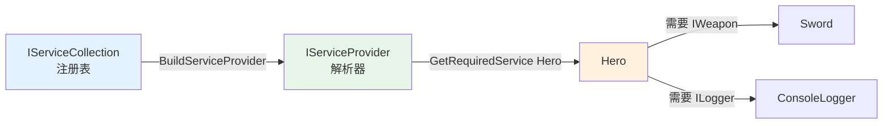

# DI 容器概念与 C# 内置容器

> 所属计划: [[plan|C++ 依赖注入完整学习计划]]
> 预计耗时: 75min
> 前置知识: [[03-three-forms-of-di|依赖注入的三种形式]]

---

## 1. 概念讲解

### 1.1 先用一个游戏类比理解“容器”

想象你正在开发一款 RPG。玩家在城镇里创建角色，系统需要给这个角色分配武器、护甲、药水、日志记录器、输入处理器、网络同步组件……如果每次创建角色都手动写一堆 `new`，你的 `main()` 或者 `GameManager` 很快会变成这样：

```csharp
var logger = new ConsoleLogger();
var weapon = new Sword();
var input = new KeyboardInput();
var net = new NetworkClient(logger);
var hero = new Hero(weapon, logger, input, net);
// 还有 Enemy、UI、任务系统……
```

依赖一多，装配代码就会膨胀成“意大利面条”。更麻烦的是，当你想换成 `Bow`、换成 `FileLogger`、或者给测试环境换成 `MockWeapon` 时，得在装配代码的各个角落去改。

**DI 容器（Dependency Injection Container）** 就是来解决这个问题的：它像一个“装备锻造与分发中心”。你提前在一张“登记表”上写好规则——“凡是需要 `IWeapon` 的地方，都发一把 `Sword`；凡是需要 `ILogger` 的地方，都发一个 `ConsoleLogger`”。等到有人需要 `Hero` 时，容器会翻看 `Hero` 的构造函数，发现它需要 `IWeapon` 和 `ILogger`，于是自动把对应的实现塞进去。这个过程叫做 **auto-wiring（自动装配）**。

### 1.2 容器 = 注册表 + 解析器

把容器拆开看，它只有两个核心职责：

1. **注册（Register）**：告诉容器“接口 → 实现”的映射，以及这条映射的生命周期策略。
2. **解析（Resolve）**：当有人请求某个类型时，容器根据注册信息创建对象，并递归满足其所有依赖。



> 容器不是“工厂模式”的替代品，而是**工厂的管理者**。它管理的是“整个对象图的创建规则”。

### 1.3 容器为什么有用

在游戏开发中，容器通常带来四个好处：

| 好处 | 手动组合根的痛点 | 容器如何解决 |
|------|------------------|--------------|
| 减少样板 | 每个对象都要手动 `new` 并传参 | 一次注册，处处解析 |
| 集中配置 | 实现散落在 `main()`、场景初始化、MonoBehaviour | 集中在 `IServiceCollection` 或组合根函数 |
| 自动解析整条依赖链 | `Hero` 依赖 `IWeapon`，`IWeapon` 又依赖 `IDurability`，手动构造容易漏 | 容器递归构造整个对象图 |
| 生命周期管理 | 自己判断某个系统是单例、每局新建还是每次新建 | `AddTransient` / `AddScoped` / `AddSingleton` 一键声明 |

本章侧重 C# 体验，C++ 手动组合根的细节可回顾 [[07-composition-root-wiring]]；C++ 的容器方案将在 [[12-boost-di-cpp]] 中展开。

### 1.4 C# 内置容器：`IServiceCollection` 与 `IServiceProvider`

.NET 生态（包括 Unity 中常用的 `Microsoft.Extensions.DependencyInjection` 包）提供了官方内置容器。核心 API 只有两组：

- `IServiceCollection`：注册表。通常用 `ServiceCollection` 实现。
- `IServiceProvider`：解析器。通过 `services.BuildServiceProvider()` 生成。

注册一条映射：

```csharp
services.AddTransient<IWeapon, Sword>();
```

这句话的含义是：当有人请求 `IWeapon` 时，容器会新建一个 `Sword` 实例并返回（Transient 表示“每次请求都新建”）。

解析一个服务：

```csharp
var hero = provider.GetRequiredService<Hero>();
```

`GetRequiredService<T>()` 会要求容器必须能解析 `T`；如果注册表里没有 `Hero`，会抛出异常。如果想允许为空，可以用 `GetService<T>()`。

### 1.5 三种生命周期：先见一面，细节留到第 13 节

C# 内置容器提供三种主要生命周期方法：

| 方法 | 含义 | 游戏场景类比 |
|------|------|--------------|
| `AddTransient<TService, TImpl>()` | 每次解析都新建实例 | 子弹、伤害数字、临时 Buff |
| `AddScoped<TService, TImpl>()` | 同一个作用域内共享一个实例 | 一局战斗、一个关卡、一个网络会话 |
| `AddSingleton<TService, TImpl>()` | 整个应用生命周期内唯一 | 全局配置、音频管理器、成就系统 |

本节只需要记住注册时的调用方式。`Scoped` 的最佳实践、作用域的创建与释放、在 C++ 中如何对应 `std::shared_ptr` / `std::unique_ptr`，会在 [[13-service-lifetimes-scopes]] 中深入讨论。

### 1.6 构造器注入是 .NET 容器的默认方式

在 [[03-three-forms-of-di]] 中我们讲过构造器注入、Setter 注入、接口注入三种形式。在 .NET 内置容器中，**构造器注入是默认且推荐的方式**：

```csharp
public sealed class Hero
{
    private readonly IWeapon _weapon;
    private readonly ILogger _logger;

    public Hero(IWeapon weapon, ILogger logger)
    {
        _weapon = weapon;
        _logger = logger;
    }
}
```

容器解析 `Hero` 时，会自动检查构造函数参数，然后到注册表里找 `IWeapon` 和 `ILogger` 的实现。只要这两个接口都注册过，对象就能被自动创建。

> 尽量让依赖字段是 `readonly`（C#）或 `const`/引用（C++），避免对象创建后再被替换，这样依赖关系更稳定。

---

## 2. 代码示例

下面是一个完整的 .NET 8 控制台程序，演示如何注册 `IWeapon → Sword`、`ILogger → ConsoleLogger`、`Hero`，然后从容器解析 `Hero` 并调用 `Attack()`。

```csharp
using Microsoft.Extensions.DependencyInjection;

// 武器接口
public interface IWeapon
{
    int Damage { get; }
    string Name { get; }
}

// 日志接口
public interface ILogger
{
    void Log(string msg);
}

// 具体武器：铁剑
public sealed class Sword : IWeapon
{
    public int Damage => 15;
    public string Name => "铁剑";
}

// 具体武器：长弓（后面练习会用到）
public sealed class Bow : IWeapon
{
    public int Damage => 12;
    public string Name => "长弓";
}

// 控制台日志实现
public sealed class ConsoleLogger : ILogger
{
    public void Log(string msg) => Console.WriteLine($"[log] {msg}");
}

// 角色：依赖通过构造器注入
public sealed class Hero
{
    private readonly IWeapon _weapon;
    private readonly ILogger _logger;

    public Hero(IWeapon weapon, ILogger logger)
    {
        _weapon = weapon;
        _logger = logger;
    }

    public string Name => "勇者";

    public void Attack()
    {
        _logger.Log($"{Name} 使用 {_weapon.Name}，造成 {_weapon.Damage} 点伤害");
    }
}

// 游戏启动器 / 组合根
public static class GameBootstrapper
{
    public static IServiceProvider Build()
    {
        var services = new ServiceCollection();

        // 注册接口到实现的映射
        services.AddTransient<IWeapon, Sword>();
        services.AddTransient<ILogger, ConsoleLogger>();

        // 注册具体类型本身，让容器也能自动创建 Hero
        services.AddTransient<Hero>();

        return services.BuildServiceProvider();
    }
}

class Program
{
    static void Main(string[] args)
    {
        // 在程序入口处一次性构建容器
        var provider = GameBootstrapper.Build();

        // 从容器解析 Hero；IWeapon 和 ILogger 会自动注入
        var hero = provider.GetRequiredService<Hero>();
        hero.Attack();
    }
}
```

**运行方式：**

```bash
# 1. 创建 .NET 8+ 控制台项目（如果本地是 .NET 10，可改为 -f net10.0）
dotnet new console -n DiContainerDemo -f net8.0
cd DiContainerDemo

# 2. 添加内置 DI 包
dotnet add package Microsoft.Extensions.DependencyInjection

# 3. 将上方代码覆盖到 Program.cs，然后运行
dotnet run
```

**预期输出：**

```text
[log] 勇者 使用 铁剑，造成 15 点伤害
```

如果你把 `services.AddTransient<IWeapon, Sword>()` 改成 `services.AddTransient<IWeapon, Bow>()`，不需要修改 `Hero` 的任何代码，输出会自动变成“勇者 使用 长弓，造成 12 点伤害”。这就是容器带来的**可替换性**。

### 2.1 与 C++ 手动组合根的对照

下面这张表把 C++ 手动组合根（[[07-composition-root-wiring]]）和 C# 内置容器放在一起对比，帮助你理解它们各自擅长的场景：

| 维度 | C++ 手动组合根 | C# 内置容器 |
|------|----------------|-------------|
| 绑定方式 | 代码中显式 `new` 并传参 | `services.AddTransient<IWeapon, Sword>()` |
| 依赖图解析 | 程序员手动按拓扑顺序构造 | 容器通过反射自动递归构造 |
| 生命周期控制 | 自己管理 `std::unique_ptr` / `std::shared_ptr` | `AddTransient` / `AddScoped` / `AddSingleton` |
| 配置集中性 | 集中在 `compositionRoot()` 函数 | 集中在 `IServiceCollection` |
| 运行时开销 | 编译期确定，零额外反射开销 | 解析时依赖反射，有微小运行时开销 |
| 典型使用场景 | 游戏引擎核心、性能敏感热循环 | 游戏业务系统、Unity 服务层、Web API |

> C++ 没有内置反射，所以 C++ 的 DI 容器（例如 [[12-boost-di-cpp]] 要讲的 boost::di）需要用模板和宏显式写出 `bind<IWeapon>.to<Sword>()` 这类绑定，而不是像 C# 那样靠运行时类型信息自动扫描。

---

## 3. 练习

### 练习 1: 基础

把示例中的武器从 `Sword` 换成 `Bow`，只修改 `GameBootstrapper.Build()` 里的注册代码，不要改 `Hero` 类。运行后验证输出是否变为长弓。

### 练习 2: 进阶

给 `Sword` 添加一个只读属性 `InstanceId`（类型 `Guid`），在构造函数中初始化为 `Guid.NewGuid()`。注册 `IWeapon` 为 `Singleton`，然后在 `Main` 中连续解析两次 `IWeapon` 并打印 `InstanceId`。观察两次打印是否相同；再改为 `Transient` 观察差异。请用文字说明 `Singleton` 与 `Transient` 的区别。

### 练习 3: 挑战（可选）

在 Unity 风格的场景中，通常会在一个 `GameBootstrapper` MonoBehaviour 的 `Awake()` 中完成容器注册，然后把解析出的 `Hero` 交给场景管理器。请写一个伪代码级别的 `UnityGameBootstrapper` 类，展示如何在 `Awake()` 里构建 `IServiceProvider` 并把 `Hero` 注入给某个 `GameSession` 类（不需要真正编译，重点是体现 Unity 场景初始化与 DI 容器结合的思路）。

---

## 3.5 参考答案

> [!tip]- 练习 1 参考答案
> 只改这一行即可：
>
> ```csharp
> services.AddTransient<IWeapon, Bow>();
> ```
>
> 输出：
>
> ```text
> [log] 勇者 使用 长弓，造成 12 点伤害
> ```
>
> 关键点：`Hero` 依赖的是 `IWeapon` 抽象，而不是具体武器。换注册就等于换实现，符合 [[02-ioc-dip-di-principles|依赖倒置原则]]。

> [!tip]- 练习 2 参考答案
> `Sword` 改造：
>
> ```csharp
> public sealed class Sword : IWeapon
> {
>     public Guid InstanceId { get; } = Guid.NewGuid();
>     public int Damage => 15;
>     public string Name => "铁剑";
> }
> ```
>
> `Main` 中的观察代码：
>
> ```csharp
> var w1 = provider.GetRequiredService<IWeapon>();
> var w2 = provider.GetRequiredService<IWeapon>();
> Console.WriteLine(((Sword)w1).InstanceId);
> Console.WriteLine(((Sword)w2).InstanceId);
> ```
>
> - 当使用 `services.AddSingleton<IWeapon, Sword>()` 时，`w1` 和 `w2` 指向同一个对象，`InstanceId` 相同。
> - 当使用 `services.AddTransient<IWeapon, Sword>()` 时，每次解析都会创建新的 `Sword`，`InstanceId` 不同。
>
> `Singleton` 适合全局唯一系统（如配置、音频管理器），`Transient` 适合短期对象（如子弹、伤害数字）。

> [!tip]- 练习 3 参考答案（可选）
> ```csharp
> using Microsoft.Extensions.DependencyInjection;
> using UnityEngine;
>
> public class UnityGameBootstrapper : MonoBehaviour
> {
>     public static IServiceProvider ServiceProvider { get; private set; }
>
>     void Awake()
>     {
>         var services = new ServiceCollection();
>         services.AddSingleton<ILogger, ConsoleLogger>();
>         services.AddTransient<IWeapon, Sword>();
>         services.AddTransient<Hero>();
>         services.AddSingleton<GameSession>();
>
>         ServiceProvider = services.BuildServiceProvider();
>
>         // 把 Hero 注入给场景管理器
>         var session = ServiceProvider.GetRequiredService<GameSession>();
>         session.InitializeHero(ServiceProvider.GetRequiredService<Hero>());
>     }
> }
> ```
>
> 设计要点：
> - `Awake()` 是最早执行的生命周期之一，适合作为组合根。
> - 把 `IServiceProvider` 暴露为静态属性，方便其他 MonoBehaviour 在需要时解析服务（但应避免滥用，否则容易滑向 Service Locator 反模式，详见 [[15-antipatterns-when-not]]）。
> - 更推荐的做法是：让需要依赖的 MonoBehaviour 在 `Awake()` 中通过构造器不可行时，从暴露的 provider 中只解析一次并缓存到字段。

> [!note] 答案使用方式
> 先独立完成练习，再展开查看参考答案。参考答案不是唯一解——如果你的实现通过了测试或达到了题目要求，就是正确的。

---

## 4. 扩展阅读

- [Microsoft.Extensions.DependencyInjection 官方文档](https://learn.microsoft.com/en-us/dotnet/core/extensions/dependency-injection)
- [Dependency injection in ASP.NET Core](https://learn.microsoft.com/en-us/aspnet/core/fundamentals/dependency-injection)
- [Unity 中使用 Microsoft.Extensions.DependencyInjection 的社区实践](https://docs.unity3d.com/Packages/com.unity.services.core@1.12/manual/DependencyInjection.html)
- [boost::di 文档](https://boost-ext.github.io/di/)（预告：[[12-boost-di-cpp]] 将深入）

---

## 常见陷阱

- **在容器外 `new` 依赖**：如果你在业务代码里直接 `new Sword()`，就绕过了容器的注册和生命周期管理。正确做法是：需要 `IWeapon` 的地方都通过构造器注入，由容器统一创建。
- **循环依赖**：`Hero` 依赖 `IWeapon`，而 `IWeapon` 的实现又反向依赖 `Hero`，会导致容器无法完成解析。正确做法是：重新审视依赖方向，必要时引入事件、消息总线或第三方抽象来打破循环。
- **只注册了接口，没注册具体类型**：如果你只写了 `services.AddTransient<IWeapon, Sword>()` 但没写 `services.AddTransient<Hero>()`，解析 `Hero` 会失败。正确做法是：每个需要容器自动创建的类型都要注册，或者使用工厂委托 `services.AddTransient<Hero>(sp => new Hero(...))`。
- **混淆 `Transient` / `Scoped` / `Singleton`**：在 Unity 游戏循环里滥用 `Singleton` 会让测试变困难；在需要每局独立的系统里误用 `Singleton` 会导致状态残留。正确做法是：先判断对象应该“每次新建 / 每局一个 / 全局唯一”，再选生命周期。
- **把容器当 Service Locator 到处用**：虽然 `provider.GetService<T>()` 很方便，但如果业务代码里到处直接调用 `provider`，就退回到了 Service Locator 反模式。正确做法是：尽量通过构造器注入，把 `GetService` 限制在组合根和极少数边界层。
