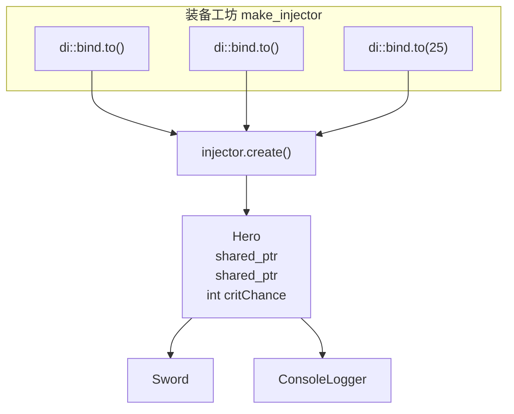

# C++ DI 容器：boost::di 实战

> 所属计划: [[plan|C++ 依赖注入完整学习计划]]
> 预计耗时: 75min
> 前置知识: [[07-composition-root-wiring]]

---

## 1. 概念讲解

### 1.1 先从「自动装备工坊」说起

想象你正在做一款 RPG。玩家创建角色时，系统要给他装配：武器、防具、日志记录器、输入处理器、任务管理器……在 [[07-composition-root-wiring]] 里，我们把这些 `new` 和组装逻辑集中写进 `main()`，像一位老工匠亲手把零件一件件拧上去。

但当角色越来越复杂——武器可以切换、日志要区分文件/网络、输入要支持键鼠/手柄——手写组合根会变成一份长长的「装配清单」。你每新增一个依赖，就要在组合根里多写一行 `new` 和一次构造器传参。

`boost::di` 就像一个**自动装备工坊**：你把「接口对应哪种实现」告诉它，它就能按构造器参数类型，自动把依赖图一层层拼装出来。你不再需要手动把 `Sword` 塞进 `Hero`，而是说「我要一个 `Hero`」，工坊自动从货架上取一把剑、一个日志器，组装好递给你。

### 1.2 为什么 C++ 的 DI 容器特别难做

C#、Java 的 DI 容器之所以强大，很大程度上依赖**运行时反射**：容器能在运行时扫描程序集，找到 `IWeapon` 有哪些实现类，自动完成注册。

C++ 没有标准反射（C++23/26 正在逐步引入，但远未普及），因此传统做法难以实现「自动发现实现类」。早期 C++ DI 容器要么：

- 靠宏或代码生成器扫描源码；
- 像 Google Fruit 一样在运行时维护类型映射表；
- 像 `boost::di` 一样，把解析工作搬到**编译期**，用模板元编程自动推导构造器签名。

`boost::di`（boost::ext DI）选择了第 `#3` 条路：它是一个**C++14 单头文件库**，通过模板和 SFINAE 在编译期构建依赖图。好处是运行时零开销、错误在编译期暴露；代价是模板推导失败时的错误信息可能非常长。

> [!note] 关于 boost::di 的归属
> `boost::di` 又称 `boost::ext::di`，是原 Boost.DI 的独立维护版本，仓库地址为 [boost-ext/di](https://github.com/boost-ext/di)。它并非传统 Boost 库的一部分，但 API 风格一致。

### 1.3 核心 API 速查表

把下面这张表记熟，本节内容就过了一半：

| API | 作用 | 游戏开发类比 |
|-----|------|--------------|
| `namespace di = boost::di;` | 起别名，减少打字 | — |
| `di::make_injector(...)` | 创建注入器（容器） | 开启一座装备工坊 |
| `di::bind<IWeapon>.to<Sword>()` | 把接口绑定到实现 | 「武器接口」的货架上放「铁剑」 |
| `di::bind<int>.to(42)` | 把类型绑定到值 | 「暴击率」参数固定为 `42%` |
| `injector.create<Hero>()` | 让容器自动创建对象图 | 「给我造一个英雄」 |

注入器一旦创建，调用 `create<Hero>()` 时它会：

1. 查看 `Hero` 的构造器需要哪些类型；
2. 在已注册绑定中查找对应实现或值；
3. 递归解析这些依赖的依赖；
4. 按所有权语义（`unique_ptr`/`shared_ptr`/引用）返回对象。

### 1.4 注入约定：构造器即契约

`boost::di` 的默认策略是**构造器参数类型自动匹配**。只要你在 `Hero` 的构造器里写了 `std::shared_ptr<IWeapon>`，容器就会到绑定表里找 `IWeapon` 的实现，然后返回一个 `shared_ptr`。

推荐用智能指针表达所有权：

- `std::unique_ptr<IWeapon>`：这是 `Hero` 独占的武器，容器会转移所有权。
- `std::shared_ptr<IWeapon>`：多个对象共享同一把武器（比如全队共享同一柄传说之剑）。
- `IWeapon&`：也能注入，但通常需要绑定到单例实例，否则容器不知道生命周期由谁管理。

> [!warning] 不要用裸指针表达所有权
> 裸指针会让 `boost::di` 无法判断「谁负责 delete」。在 C++ 游戏中，这很容易与引擎的对象池、场景生命周期冲突。注入依赖时优先用 `std::unique_ptr<T>` 或 `std::shared_ptr<T>`。

### 1.5 何时用 `boost::di`，何时坚持手动组合根

| 维度 | 手动组合根（第 `#7` 节） | `boost::di` | C# 内置容器 |
|------|--------------------------|-------------|-------------|
| 依赖数量 | 少到中等时很清晰 | 多时减少样板 | 多时很舒服 |
| 外部依赖 | 零 | 需引入单头文件 | 框架自带 |
| 可读性 | 直观，一目了然 | 错误信息可能晦涩 | 社区熟悉度高 |
| 运行时开销 | 零 | 编译期解析，运行期零额外开销 | 反射/字典有一定开销 |
| 生命周期控制 | 完全手动 | 通过 scope 配置 | Singleton/Scoped/Transient |
| 与引擎集成 | 灵活 | 可能与引擎对象生命周期冲突 | Unity 有 Scene/Play 模式 |
| 团队接受度 | 游戏 C++ 团队最常用 | 中小型项目/工具链可用 | .NET/Unity 团队标配 |

在真实的 C++ 游戏工程中，**手动组合根仍是主流**：它零依赖、与引擎生命周期对齐、新人也能直接看懂。`boost::di` 更适合：

- 工具链、服务器、独立逻辑模块；
- 依赖图复杂且频繁变化的中小型项目；
- 团队愿意承受「模板错误信息」这一学习成本。

把它理解为 C++ 里的「轻量 DI 容器选项」，而不是 Unity 里 `ServiceProvider` 那种默认必选项。

---

## 2. 代码示例

### 2.1 安装 `boost::di`

`boost::di` 是单头文件库，只需把 `boost/di.hpp` 放到你的 include 路径即可。

**下载方式：**

```bash
# 在项目根目录创建 include/boost 目录并下载
mkdir -p include/boost
curl -L -o include/boost/di.hpp https://raw.githubusercontent.com/boost-ext/di/cpp14/include/boost/di.hpp
```

Windows 下可用 PowerShell：

```powershell
New-Item -ItemType Directory -Force -Path include/boost
Invoke-WebRequest -Uri https://raw.githubusercontent.com/boost-ext/di/cpp14/include/boost/di.hpp -OutFile include/boost/di.hpp
```

> [!tip] 也可用 git 克隆
> 如果你希望跟踪版本，可以 `git clone https://github.com/boost-ext/di.git`，然后加 `-I di/include` 编译。

### 2.2 完整可编译示例

下面的例子复用贯穿全计划的 `IWeapon`/`Sword`/`Bow`、`ILogger`/`ConsoleLogger` 和 `Hero`。与手动组合根不同，这里只需要声明绑定，容器会自动把 `Sword` 和 `ConsoleLogger` 注入 `Hero`。

```cpp
// main.cpp
#include <boost/di.hpp>
#include <iostream>
#include <memory>
#include <string>

namespace di = boost::di;

// ========== 武器接口与实现 ==========
class IWeapon {
public:
    virtual ~IWeapon() = default;
    virtual int damage() const = 0;
    virtual std::string name() const = 0;
};

class Sword : public IWeapon {
public:
    int damage() const override { return 15; }
    std::string name() const override { return "铁剑"; }
};

class Bow : public IWeapon {
public:
    int damage() const override { return 12; }
    std::string name() const override { return "长弓"; }
};

// ========== 日志接口与实现 ==========
class ILogger {
public:
    virtual ~ILogger() = default;
    virtual void log(const std::string& msg) = 0;
};

class ConsoleLogger : public ILogger {
public:
    void log(const std::string& msg) override {
        std::cout << "[log] " << msg << "\n";
    }
};

// ========== 角色：依赖通过构造器表达 ==========
class Hero {
public:
    Hero(std::shared_ptr<IWeapon> weapon,
         std::shared_ptr<ILogger> logger,
         int critChance)
        : weapon_(std::move(weapon))
        , logger_(std::move(logger))
        , critChance_(critChance) {}

    void attack() {
        int dmg = weapon_->damage();
        logger_->log("英雄举起 " + weapon_->name());
        logger_->log("造成 " + std::to_string(dmg) + " 点伤害");
        if (critChance_ > 0) {
            logger_->log("暴击率: " + std::to_string(critChance_) + "%");
        }
    }

private:
    std::shared_ptr<IWeapon> weapon_;
    std::shared_ptr<ILogger> logger_;
    int critChance_;
};

// ========== 组合根：声明绑定，容器自动装配 ==========
int main() {
    auto injector = di::make_injector(
        di::bind<IWeapon>.to<Sword>(),          // 武器接口 → 铁剑
        di::bind<ILogger>.to<ConsoleLogger>(),  // 日志接口 → 控制台日志
        di::bind<int>.to(25)                    // critChance = 25
    );

    // 容器自动解析 Hero 的依赖图：
    // Hero -> IWeapon -> Sword
    // Hero -> ILogger -> ConsoleLogger
    // Hero -> int -> 25
    auto hero = injector.create<Hero>();
    hero.attack();

    return 0;
}
```

**运行方式：**

```bash
# 假设 di.hpp 已在 include/ 目录下
g++ -std=c++17 -I include main.cpp -o boost_di_demo
./boost_di_demo
```

**预期输出：**

```text
[log] 英雄举起 铁剑
[log] 造成 15 点伤害
[log] 暴击率: 25%
```

> [!note] `create<Hero>()` 的返回值
> `injector.create<Hero>()` 按值返回一个 `Hero` 对象，其内部成员 `weapon_` 和 `logger_` 已经是容器注入的 `std::shared_ptr<IWeapon>` 和 `std::shared_ptr<ILogger>`。如果你希望容器直接返回智能指针，也可以写 `injector.create<std::shared_ptr<Hero>>()` 或 `injector.create<std::unique_ptr<Hero>>()`，具体取决于你希望 `Hero` 本身由谁拥有。

### 2.3 依赖图示意



---

## 3. 练习

### 练习 1: 基础

把上面示例中的 `di::bind<IWeapon>.to<Sword>()` 改成 `di::bind<IWeapon>.to<Bow>()`，重新编译运行，观察输出变化。

### 练习 2: 进阶

新增一个 `IArmor` 接口和一个 `LeatherArmor` 实现（提供 `int defense() const` 和 `std::string name() const`），并让 `Hero` 的构造器多接收一个 `std::shared_ptr<IArmor>`。在注入器里添加对应绑定，让 `attack()` 同时打印护甲信息。

### 练习 3: 挑战（可选）

不修改 `IWeapon` 接口，通过「值绑定」给 `Hero` 注入一个 `int baseStrength`。在 `attack()` 里把 `baseStrength` 加到武器伤害上，实现「基础力量 + 武器伤害 = 最终伤害」。

---

## 3.5 参考答案

> [!tip]- 练习 1 参考答案
> 只需改绑定那一行：
>
> ```cpp
> di::bind<IWeapon>.to<Bow>(),
> ```
>
> 重新编译运行后输出变为：
>
> ```text
> [log] 英雄举起 长弓
> [log] 造成 12 点伤害
> [log] 暴击率: 25%
> ```
>
> 这体现了 DI 的核心价值：换实现不需要改 `Hero`，只需改组合根里的绑定。

> [!tip]- 练习 2 参考答案
> 新增接口与实现：
>
> ```cpp
> class IArmor {
> public:
>     virtual ~IArmor() = default;
>     virtual int defense() const = 0;
>     virtual std::string name() const = 0;
> };
>
> class LeatherArmor : public IArmor {
> public:
>     int defense() const override { return 5; }
>     std::string name() const override { return "皮甲"; }
> };
> ```
>
> 修改 `Hero`：
>
> ```cpp
> class Hero {
> public:
>     Hero(std::shared_ptr<IWeapon> weapon,
>          std::shared_ptr<ILogger> logger,
>          std::shared_ptr<IArmor> armor,
>          int critChance)
>         : weapon_(std::move(weapon))
>         , logger_(std::move(logger))
>         , armor_(std::move(armor))
>         , critChance_(critChance) {}
>
>     void attack() {
>         logger_->log("英雄装备 " + armor_->name() +
>                      "（防御 " + std::to_string(armor_->defense()) + "）");
>         logger_->log("举起 " + weapon_->name());
>         logger_->log("造成 " + std::to_string(weapon_->damage()) + " 点伤害");
>     }
>
> private:
>     std::shared_ptr<IWeapon> weapon_;
>     std::shared_ptr<ILogger> logger_;
>     std::shared_ptr<IArmor> armor_;
>     int critChance_;
> };
> ```
>
> 修改注入器：
>
> ```cpp
> auto injector = di::make_injector(
>     di::bind<IWeapon>.to<Sword>(),
>     di::bind<ILogger>.to<ConsoleLogger>(),
>     di::bind<IArmor>.to<LeatherArmor>(),
>     di::bind<int>.to(25)
> );
> ```

> [!tip]- 练习 3 参考答案（可选）
> 注意 `boost::di` 默认按类型匹配。如果构造器里只有一个 `int`，`di::bind<int>.to(42)` 就能正确注入；如果有多个 `int` 参数，需要用 `di::named` 区分名称，这超出本节范围，将在 [[13-service-lifetimes-scopes]] 进一步展开。
>
> 单 `int` 版本的实现：
>
> ```cpp
> class Hero {
> public:
>     Hero(std::shared_ptr<IWeapon> weapon,
>          std::shared_ptr<ILogger> logger,
>          int baseStrength)
>         : weapon_(std::move(weapon))
>         , logger_(std::move(logger))
>         , baseStrength_(baseStrength) {}
>
>     void attack() {
>         int total = weapon_->damage() + baseStrength_;
>         logger_->log("基础力量: " + std::to_string(baseStrength_));
>         logger_->log("举起 " + weapon_->name());
>         logger_->log("最终伤害: " + std::to_string(total));
>     }
>
> private:
>     std::shared_ptr<IWeapon> weapon_;
>     std::shared_ptr<ILogger> logger_;
>     int baseStrength_;
> };
> ```
>
> 注入器：
>
> ```cpp
> auto injector = di::make_injector(
>     di::bind<IWeapon>.to<Sword>(),
>     di::bind<ILogger>.to<ConsoleLogger>(),
>     di::bind<int>.to(8)   // baseStrength = 8
> );
> ```

> [!note] 答案使用方式
> 先独立完成练习，再展开查看参考答案。参考答案不是唯一解——如果你的实现通过了编译并达到了题目要求，就是正确的。

---

## 4. 扩展阅读

- [boost-ext/di 官方仓库](https://github.com/boost-ext/di) —— 单头文件下载、文档、示例。
- [Boost.DI - C++ Dependency Injection（作者演讲）](https://www.youtube.com/watch?v=yVogS4NbL6U) —— 理解模板元编程如何驱动编译期装配。
- [reyesr/injection](https://github.com/reyesr/injection) —— 一个不足 100 行的极简 C++ DI 实现，适合阅读源码理解原理。
- [[11-di-containers-csharp]] —— 对照 C# `Microsoft.Extensions.DependencyInjection` 的注册方式。
- [[13-service-lifetimes-scopes]] —— 深入 Singleton/Scoped/Transient 生命周期，以及 `boost::di` 中的 `di::singleton` 用法。

---

## 常见陷阱

- **模板编译错误难读**：当某个接口忘记绑定实现，或构造器参数类型与绑定不匹配时，`boost::di` 会报出几十行模板实例化回溯。正确做法是**从错误信息最底部往上找**，通常能看到 `"type is not bound, did you forget to add: 'di::bind<interface>.to<implementation>()'?"` 这类提示。

- **与游戏引擎生命周期管理冲突**：虚幻引擎的 `AActor`、Unity 的 `MonoBehaviour` 都有引擎控制的生命周期。如果用 `boost::di` 创建这些对象，可能导致 `delete` 时机与引擎不一致。正确做法是**让 DI 容器只管理纯逻辑对象**，把引擎对象交给引擎自己创建。

- **用引用注入却未绑定实例**：`Hero(IWeapon&)` 需要注入器知道「这个引用的生命周期由谁管」。如果你确实想用引用，需要把实现绑定到单例或已有实例，否则容器推导会失败。

- **误以为它能自动发现实现类**：C++ 没有反射，`boost::di` 不会自动扫描目录里的 `Sword`/`Bow`。所有绑定必须显式写在 `make_injector` 里，漏写一个就编译失败——这其实是优点，依赖关系完全透明。

- **把 `boost::di` 当成银弹**：在依赖图简单、团队不熟悉模板元编程、或需要与引擎紧密集成的项目中，坚持 [[07-composition-root-wiring]] 的手动组合根往往是更务实的选择。
