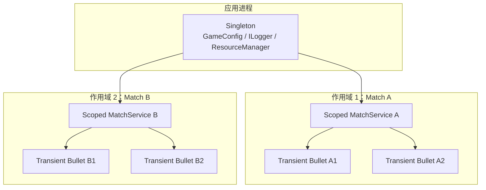
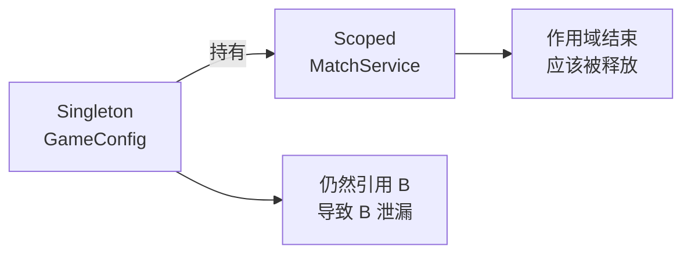

# 服务生命周期与作用域管理

> 所属计划: [[plan|C++ 依赖注入完整学习计划]]
> 预计耗时: 60min
> 前置知识: [[11-di-containers-csharp]]

---

## 1. 概念讲解

### 1.1 从一场游戏对战说起

想象你正在开发一款多人对战游戏。有些对象从游戏启动到关闭只应该存在一份：

- 全局配置 `GameConfig`（分辨率、伤害倍率、网络 tick 率）
- 日志器 `ILogger`（统一输出目标、过滤级别）
- 资源管理器 `ResourceManager`（缓存已加载的模型、贴图、音效）

而另一些对象只应该存活「一场对战」：

- 当前对战的 `MatchService`（比分、存活玩家、回合状态）
- 本关卡的 `SceneManager`（当前场景内的实体、光照、触发器）

还有一些对象则是「用一次就扔」：

- 射出的子弹 `Bullet`
- 爆炸产生的伤害事件
- 玩家输入采样帧

这些「一个依赖实例存活多久、被谁共享」的问题，就是依赖注入里的**生命周期（lifetime）**问题。

### 1.2 三种生命周期

主流 DI 容器（如 .NET 的 `Microsoft.Extensions.DependencyInjection`）把生命周期分为三类。C++ 没有内置容器，但我们在组合根里用所有权语义也能一一对应。



#### Singleton（单例）

**整个应用 / 容器只有一个实例**，所有解析者拿到的是同一个对象。

- 游戏例子：`GameConfig`、`ILogger`、`ResourceManager`。
- C# 容器：`services.AddSingleton<TInterface, TImpl>()`。
- C++ 对应：全局对象、`static` 局部对象，或长期持有的一份 `std::shared_ptr`。

> [!warning] 单例不是「全局变量万岁」
> 单例强调的是「实例共享」，不是「到处直接访问」。仍然通过构造器注入，方便测试时替换为 stub/mock。

#### Scoped（作用域）

**每个作用域一个实例**，作用域内共享，作用域结束后释放。

- 游戏例子：一场 `Match`、一次 HTTP 请求、一个关卡 `SceneManager`。
- C# 容器：`services.AddScoped<TInterface, TImpl>()`，通过 `IServiceScopeFactory.CreateScope()` 创建作用域。
- C++ 对应：在组合根中显式控制的一段生命周期，例如 `main()` 里用栈对象、`std::unique_ptr`，或一个作用域函数内的局部变量。

#### Transient（瞬时）

**每次请求都新建一个实例**。

- 游戏例子：子弹 `Bullet`、投射物、一次性伤害事件对象。
- C# 容器：`services.AddTransient<TInterface, TImpl>()`。
- C++ 对应：每次解析都 `std::make_unique<T>()` 或栈上新建。

> [!tip] 瞬时不等于「每帧大量 new」
> 瞬时的语义是「每次解析新实例」，但游戏热循环里如果每帧或每发子弹都走堆分配，会带来分配压力和 GC/碎片问题。后面会专门讲这一点。

### 1.3 生命周期不匹配的陷阱：Captive Dependency（俘获依赖）

**Captive Dependency** 是指一个长生命周期的服务，错误地持有了一个短生命周期服务的引用，从而把短生命周期服务「拉长」成自己的生命周期。

典型游戏场景：



- `GameConfig` 是 Singleton，整个游戏进程都在。
- `MatchService` 是 Scoped，本局结束后应该被销毁。
- 如果 `GameConfig` 在构造函数里接收了 `MatchService` 的引用，单例就会一直攥着 `MatchService`，导致上一局的比分、玩家状态泄漏到下一局。

正确做法：

- Singleton 只能依赖 Singleton 或 Transient 工厂（工厂本身可以是 Singleton，但工厂每次创建的新实例是瞬时的）。
- Scoped 服务可以依赖 Singleton，也可以依赖同作用域内的 Scoped。
- 不要让高层级服务直接持有低层级服务的长期引用。

### 1.4 生命周期与性能

在游戏开发里，生命周期的选择直接影响帧率和内存。

| 场景 | 容器语义 | 游戏实际做法 |
|------|----------|--------------|
| 每发子弹都 `new Bullet()` | Transient | 高频射击时改用**对象池**，分配压力从 `O(n)` 降到接近 `O(1)` |
| 每帧创建伤害事件对象 | Transient | 优先用值类型 / ECS 组件 / 环形缓冲 |
| 全局配置每次读取都 new | Transient | 显然是 Singleton，避免重复解析和内存浪费 |
| 一局对战内共享状态 | Scoped | 在局开始时创建，局结束时统一释放 |

> [!info] DI 容器的 Transient 与游戏对象池是两个世界
> DI 容器的 Transient 解决的是「语义上每次需要新实例」。游戏对象池解决的是「运行时高频分配回收」。
> 你可以让池子本身以 Singleton 注入，然后从池子租借对象；不要把「每发子弹都走容器解析」当成对象池的替代品。

### 1.5 C# 容器的作用域 vs C++ 手动管理

C# 里，作用域是容器的一等公民：

```csharp
using var scope = provider.GetRequiredService<IServiceScopeFactory>().CreateScope();
var match = scope.ServiceProvider.GetRequiredService<IMatchService>();
```

作用域结束（`using` 离开）时，容器会自动调用 `IDisposable` 的 `Dispose()`。

C++ 没有等价内置容器，生命周期由你在组合根里用手动所有权表达：

| 生命周期 | C# 容器 | C++ 手动组合根 |
|----------|---------|----------------|
| Singleton | `AddSingleton` | 全局 / `static` / 长期 `std::shared_ptr` |
| Scoped | `AddScoped` + `CreateScope()` | 一段作用域内的栈对象或 `std::unique_ptr` |
| Transient | `AddTransient` | 每次 `make_unique` / 栈上新建 |

这与 [[06-smart-pointers-lifetime]] 和 [[07-composition-root-wiring]] 里的所有权选择是同一枚硬币的两面：C++ 用 `unique_ptr`/`shared_ptr`/引用决定「谁活多久」，容器用语义标签决定「谁被共享多久」。

### 1.6 决策表：游戏对象该选什么生命周期

| 游戏对象 | 推荐生命周期 | 理由 |
|----------|--------------|------|
| `GameConfig` / 全局配置 | Singleton | 整个进程共享，读取后基本不变 |
| `ILogger` / 日志器 | Singleton | 统一输出目标、缓冲、过滤策略 |
| `ResourceManager` | Singleton | 缓存已加载资源，避免重复 IO |
| `MatchService` / 一场对战状态 | Scoped | 局内共享，局后必须重置 |
| `SceneManager` / 当前关卡 | Scoped | 同一场景内共享，切换场景释放 |
| `Bullet` / 投射物 | Transient / 对象池 | 每次射击新建；高频时改为池化 |
| 伤害事件对象 | Transient / 值类型 | 事件一次性，避免状态泄漏 |
| 玩家输入采样 | Transient / 栈对象 | 每帧新建，生命周期极短 |

---

## 2. 代码示例

### 2.1 C# 容器演示三种生命周期

下面这段代码注册了 Singleton、Scoped、Transient 三种服务，并创建两个作用域，打印每个解析到的实例的 HashCode 和内部 `Guid`，验证共享与新建行为。

```csharp
using System;
using Microsoft.Extensions.DependencyInjection;

public interface IHasId
{
    Guid InstanceId { get; }
}

public interface IGameConfig : IHasId { }
public interface IMatchState : IHasId { }
public interface IBullet : IHasId { }

public sealed class GameConfig : IGameConfig
{
    public Guid InstanceId { get; } = Guid.NewGuid();
}

public sealed class MatchState : IMatchState
{
    public Guid InstanceId { get; } = Guid.NewGuid();
}

public sealed class Bullet : IBullet
{
    public Guid InstanceId { get; } = Guid.NewGuid();
}

class Program
{
    static void Main()
    {
        var services = new ServiceCollection();
        services.AddSingleton<IGameConfig, GameConfig>();
        services.AddScoped<IMatchState, MatchState>();
        services.AddTransient<IBullet, Bullet>();

        var provider = services.BuildServiceProvider();

        Console.WriteLine("=== Scope 1 ===");
        using (var scope1 = provider.CreateScope())
        {
            var sp = scope1.ServiceProvider;
            Print<IGameConfig>(sp, "config A");
            Print<IGameConfig>(sp, "config B");
            Print<IMatchState>(sp, "match A");
            Print<IMatchState>(sp, "match B");
            Print<IBullet>(sp, "bullet A");
            Print<IBullet>(sp, "bullet B");
        }

        Console.WriteLine("=== Scope 2 ===");
        using (var scope2 = provider.CreateScope())
        {
            var sp = scope2.ServiceProvider;
            Print<IGameConfig>(sp, "config C");
            Print<IMatchState>(sp, "match C");
            Print<IBullet>(sp, "bullet C");
            Print<IBullet>(sp, "bullet D");
        }
    }

    static void Print<T>(IServiceProvider sp, string label) where T : class, IHasId
    {
        var svc = sp.GetRequiredService<T>();
        Console.WriteLine($"{label}: hash={svc.GetHashCode()}, id={svc.InstanceId}");
    }
}
```

**运行方式：**

```bash
# 创建 .NET 8 控制台项目
dotnet new console -n LifetimeDemo -o LifetimeDemo
cd LifetimeDemo

# 添加 DI 容器包
dotnet add package Microsoft.Extensions.DependencyInjection

# 把上面代码写入 Program.cs 后运行
dotnet run
```

**预期输出：**

```text
=== Scope 1 ===
config A: hash=12345678, id=aaaaaaaa-...
config B: hash=12345678, id=aaaaaaaa-...
match A: hash=23456789, id=bbbbbbbb-...
match B: hash=23456789, id=bbbbbbbb-...
bullet A: hash=34567890, id=cccccccc-...
bullet B: hash=45678901, id=dddddddd-...
=== Scope 2 ===
config C: hash=12345678, id=aaaaaaaa-...
match C: hash=56789012, id=eeeeeeee-...
bullet C: hash=67890123, id=ffffffff-...
bullet D: hash=78901234, id=11111111-...
```

观察要点：

- `config A/B/C` 的 hash 完全相同 —— Singleton。
- `match A/B` 相同，`match C` 不同 —— Scoped，作用域内共享。
- 每个 `bullet` 的 hash 都不同 —— Transient。

### 2.2 C++ 手动组合根模拟三种生命周期

C++ 里没有 `IServiceScopeFactory`，但我们在组合根里用所有权就能表达同样的语义。

```cpp
#include <iostream>
#include <memory>
#include <string>

class ILogger {
public:
    virtual ~ILogger() = default;
    virtual void log(const std::string& msg) = 0;
};

// Singleton 语义：整个应用一份
class ConsoleLogger : public ILogger {
public:
    ConsoleLogger() {
        std::cout << "ConsoleLogger created at " << this << "\n";
    }
    void log(const std::string& msg) override {
        std::cout << "[log] " << msg << "\n";
    }
};

std::shared_ptr<ILogger> getGameLogger() {
    static auto logger = std::make_shared<ConsoleLogger>();
    return logger;
}

// Scoped 语义：一局对战一份
class MatchService {
public:
    explicit MatchService(ILogger& logger) : logger_(logger) {
        std::cout << "MatchService created at " << this << "\n";
    }
    void tick() {
        logger_.log("Match tick");
    }
private:
    ILogger& logger_;
};

// Transient 语义：每次解析都新建
class Bullet {
public:
    Bullet() {
        std::cout << "Bullet created at " << this << "\n";
    }
    void fire() {
        std::cout << "Bullet fired: " << this << "\n";
    }
};

std::unique_ptr<Bullet> createBullet() {
    return std::make_unique<Bullet>();
}

void playMatch() {
    // 组合根：在本作用域内装配
    auto logger = getGameLogger();                 // Singleton
    MatchService match(*logger);                    // Scoped（栈对象）

    match.tick();

    auto b1 = createBullet();                       // Transient
    auto b2 = createBullet();                       // Transient
    b1->fire();
    b2->fire();

    std::cout << "--- match ends, MatchService destroyed ---\n";
}

int main() {
    std::cout << "=== Match 1 ===\n";
    playMatch();

    std::cout << "\n=== Match 2 ===\n";
    playMatch();

    return 0;
}
```

**运行方式：**

```bash
g++ -std=c++17 main.cpp -o lifetime_demo
./lifetime_demo
```

**预期输出：**

```text
=== Match 1 ===
ConsoleLogger created at 0x...
MatchService created at 0x...
[log] Match tick
Bullet created at 0x...
Bullet created at 0x...
Bullet fired: 0x...
Bullet fired: 0x...
--- match ends, MatchService destroyed ---

=== Match 2 ===
MatchService created at 0x...
[log] Match tick
Bullet created at 0x...
Bullet created at 0x...
Bullet fired: 0x...
Bullet fired: 0x...
--- match ends, MatchService destroyed ---
```

观察要点：

- `ConsoleLogger` 只创建一次 —— Singleton。
- 每次进入 `playMatch()` 都新建 `MatchService`，离开函数时自动销毁 —— Scoped。
- 每颗 `Bullet` 都是新地址 —— Transient。

> [!note] 这里的 `getGameLogger()` 用 `static` 局部变量实现进程级单例。它仍然通过接口暴露，单元测试时可以换成从组合根传入的 `std::shared_ptr<ILogger>`，避免硬编码全局访问。

---

## 3. 练习

### 练习 1：基础

下面哪些对象适合 Singleton、Scoped、Transient？把每行填到对应的生命周期，并简要说明理由。

1. 全局音效配置表
2. 当前对战的计分板
3. 玩家每帧生成的输入帧
4. 资源缓存管理器
5. 每次施法产生的火球

### 练习 2：进阶

下面这段 C# 注册代码存在 Captive Dependency 风险，请指出问题并给出修复后的注册方式。

```csharp
services.AddSingleton<IGameConfig, GameConfig>();
services.AddScoped<IMatchState, MatchState>();

// GameConfig 的构造函数：
// public GameConfig(IMatchState matchState) { ... }
```

### 练习 3：挑战（可选）

在 C++ 示例的基础上，实现一个「作用域工厂」：

- `ScopedMatchFactory` 是一个 Singleton；
- 它提供 `createMatch()`，每次调用返回一个独立的 `std::unique_ptr<MatchService>`；
- `MatchService` 仍然共享同一个 `ILogger` Singleton；
- 在 `main()` 中创建两局对战，验证 `MatchService` 地址不同、但 `ConsoleLogger` 只创建一次。

---

## 3.5 参考答案

> [!tip]- 练习 1 参考答案
> 1. **全局音效配置表** → **Singleton**。进程级共享，加载后基本只读。
> 2. **当前对战的计分板** → **Scoped**。局内共享，下一局必须重置。
> 3. **玩家每帧生成的输入帧** → **Transient / 栈对象**。生命周期只有一帧，用完即丢。
> 4. **资源缓存管理器** → **Singleton**。缓存已加载资源，避免重复磁盘 IO。
> 5. **每次施法产生的火球** → **Transient / 对象池**。语义上是新的投射物；高频时改为对象池复用。

> [!tip]- 练习 2 参考答案
> 问题：`GameConfig` 是 Singleton，`IMatchState` 是 Scoped。`GameConfig` 一旦注入 `IMatchState`，单例就会长期持有某一局的 `MatchState`，形成 **Captive Dependency**。
>
> 修复：Singleton 只能依赖 Singleton。把 `GameConfig` 对 `IMatchState` 的依赖移除，或者把 `IMatchState` 也提升为 Singleton（通常不推荐，因为局状态不该全局共享）。
>
> ```csharp
> services.AddSingleton<IGameConfig, GameConfig>();
> services.AddScoped<IMatchState, MatchState>();
> // GameConfig 不应依赖 IMatchState
> public GameConfig() { /* 只读取静态配置 */ }
> ```

> [!tip]- 练习 3 参考答案（可运行）
> ```cpp
> #include <iostream>
> #include <memory>
>
> class ILogger {
> public:
>     virtual ~ILogger() = default;
>     virtual void log(const std::string& msg) = 0;
> };
>
> class ConsoleLogger : public ILogger {
> public:
>     ConsoleLogger() { std::cout << "ConsoleLogger created at " << this << "\n"; }
>     void log(const std::string& msg) override { std::cout << "[log] " << msg << "\n"; }
> };
>
> class MatchService {
> public:
>     explicit MatchService(ILogger& logger) : logger_(logger) {
>         std::cout << "MatchService created at " << this << "\n";
>     }
>     void start() { logger_.log("Match started"); }
> private:
>     ILogger& logger_;
> };
>
> class ScopedMatchFactory {
> public:
>     std::unique_ptr<MatchService> createMatch() {
>         return std::make_unique<MatchService>(*logger_);
>     }
> private:
>     std::shared_ptr<ILogger> logger_ = getLogger();
>     static std::shared_ptr<ILogger> getLogger() {
>         static auto logger = std::make_shared<ConsoleLogger>();
>         return logger;
>     }
> };
>
> int main() {
>     ScopedMatchFactory factory;
>     auto m1 = factory.createMatch();
>     m1->start();
>     auto m2 = factory.createMatch();
>     m2->start();
>     return 0;
> }
> ```
>
> 预期行为：`ConsoleLogger` 只创建一次；`m1` 和 `m2` 的 `MatchService` 地址不同。

> [!note] 答案使用方式
> 先独立完成练习，再展开查看参考答案。参考答案不是唯一解——如果你的实现通过了测试或达到了题目要求，就是正确的。

---

## 4. 扩展阅读

- [.NET 依赖注入指南](https://learn.microsoft.com/aspnet/core/fundamentals/dependency-injection)
- [Captive Dependency 反模式（Mark Seemann）](https://blog.ploeh.dk/2014/06/02/captive-dependency/)
- [Game Programming Patterns：Object Pool](https://gameprogrammingpatterns.com/object-pool.html)
- [[06-smart-pointers-lifetime]] —— C++ 所有权与智能指针
- [[07-composition-root-wiring]] —— 手动装配的组合根
- [[14-testing-with-di-mocks]] —— 下一节：用 DI 做测试

---

## 常见陷阱

- **Captive Dependency（俘获依赖）**：Singleton 直接或间接持有 Scoped 引用，把短生命周期对象拉长。正确做法：Singleton 只依赖 Singleton 或 Transient 工厂。
- **Transient 滥用导致分配压力**：把每帧、每发子弹都做成「从 DI 容器解析的 Transient」，在热循环里会造成 GC/碎片。正确做法：高频对象走对象池或 ECS 组件，DI 只负责装配池子本身。
- **单例线程安全**：Singleton 被多线程并发访问时，内部状态需要加锁或无锁设计。`GameConfig` 如果只读可以安全共享；`ResourceManager` 的加载缓存需要同步。
- **把 Scoped 当成 Singleton 跨作用域共享**：例如把 HTTP 请求作用域里的 `DbContext` 或 `MatchState` 缓存到静态字典里，会导致状态泄漏。
- **混淆「实例共享」与「全局可访问」**：Singleton 解决的是共享，不是全局变量。仍然优先通过构造器注入，方便替换和测试。
