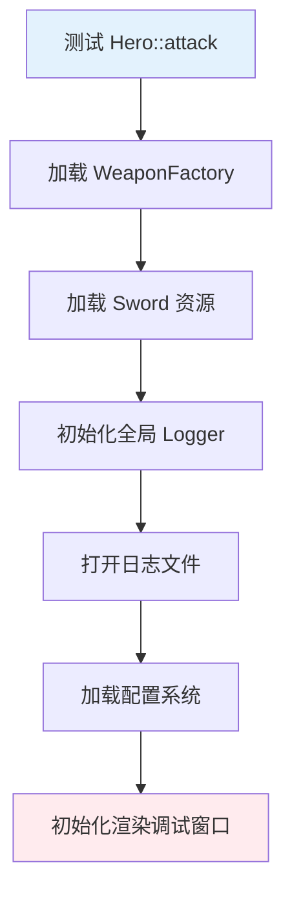

# 用 DI 做测试：Mock 与桩

> 所属计划: [[plan|C++ 依赖注入完整学习计划]]
> 预计耗时: 75min
> 前置知识: [[06-smart-pointers-lifetime]]

---

## 1. 概念讲解

### 1.1 从「 Pocket Universe Testing 」说起

想象你要测试游戏里一个简单的方法：`Hero::attack()` 到底会不会正确触发伤害并写日志。

如果没有依赖注入，`Hero` 内部很可能是这样写的：

```cpp
void Hero::attack() {
    auto weapon = WeaponFactory::getHeroWeapon();   // 从全局工厂拿
    int dmg = weapon->damage();
    Logger::instance().log("造成 " + std::to_string(dmg) + " 点伤害");
}
```

为了测这一行逻辑，测试框架被迫做下面这些事：

1. 启动武器工厂。
2. 加载真实资源（模型、音效、配表）。
3. 初始化全局日志器，可能还要打开文件或连接网络。
4. 如果日志器内部又依赖配置系统、渲染调试输出，那还得继续加载。

Peter Muldoon 在 CppCon 2024 的演讲 *Refactoring C++ Code for Unit testing with Dependency Injection* 里，把这种现象叫做 **Pocket Universe Testing**——为了测一个小函数，你不得不先造出一个微缩宇宙。启动慢、反馈慢、失败时根本不知道是 `Hero` 的错，还是渲染或资源加载的错。

依赖注入把这个问题拆解了：`Hero` 的依赖从外部注入，测试时就可以换成「假实现」，只验证 `Hero` 自己的逻辑。

> DI 不是测试的充分条件，但它是可测试性的**必要基础设施**。没有它，单元测试就会变成 Pocket Universe。

---

### 1.2 测试替身（Test Doubles）的四种身份

在游戏开发里，我们经常需要「假装」某个依赖。测试替身的分类很多，下面是最常用的四种，以及各自在游戏里的典型用途。

| 类型 | 核心职责 | 游戏场景示例 |
|------|----------|--------------|
| **Stub（桩）** | 返回固定数据，不验证调用 | 武器桩永远返回 `damage() == 10`，用来测 Hero 的伤害公式分支 |
| **Mock（模拟对象）** | 预设行为并验证交互 | MockLogger 验证 `log()` 被调用了一次，且消息内容是 `"英雄造成 15 点伤害"` |
| **Fake（伪实现）** | 有可工作的简化实现，但非生产级 | 内存版排行榜 FakeLeaderboard 替代真实的 Redis/数据库 |
| **Spy（间谍）** | 记录真实依赖的调用信息 | 在真实音效系统外包一层，记录 `play()` 被调用了几次 |

它们的关系不是互斥的。一个对象可能既是 Stub 又是 Spy。关键是：**你引入替身的目的是什么**——是为了给被测单元一个稳定环境，还是为了断言它与其协作者的交互。

> [!note] 命名的混乱
> 很多团队把所有测试替身都叫「Mock」。严格来说，Mock 只是其中一种。本节尽量按上表区分，但在日常交流中说「Mock」也可以理解。

---

### 1.3 DI 如何让小单元测试成为可能

没有 DI 时，测试一张依赖图是这样的：



有了 DI 后，我们可以直接把依赖替换成可控的测试替身：

```mermaid
flowchart TB
    A[测试 Hero::attack] --> B[注入 MockWeapon]
    A --> C[注入 MockLogger]
    B --> D[验证 damage() 被调用]
    C --> E[验证 log() 消息正确]
    style A fill:#e3f2fd
    style B fill:#e8f5e9
    style C fill:#e8f5e9
```

`Hero` 的代码不需要知道传入的是真剑还是 Mock 剑、是文件日志还是内存日志。这正是我们在 [[04-cpp-interfaces-abc]] 和 [[05-constructor-injection-ownership]] 里讲的：**依赖抽象，而不是依赖具体实现**。

---

### 1.4 手写 Mock  vs  使用 gMock

C++ 里实现 Mock 有两种主流方式：

1. **手写 Mock**：自己写一个类继承 `IWeapon` / `ILogger`，覆写虚函数。零依赖，适合轻量场景或 CI 环境不方便拉外部库的项目。
2. **GoogleTest / gMock**：用宏 `MOCK_METHOD` 自动生成桩类，用 `EXPECT_CALL` / `ON_CALL` 描述行为和断言。适合大型项目、交互复杂的测试。

本节先给出手写版，确保你理解底层机制；再给 gMock 版作为进阶。

---

## 2. 代码示例

### 2.1 手写 Mock 版（纯 C++17，无需任何框架）

下面的代码复用全计划统一的 `IWeapon` / `ILogger` / `Hero` 命名。`MockWeapon` 和 `MockLogger` 都是手写替身：一个返回固定伤害并记录调用次数，一个记录所有日志消息。

```cpp
#include <iostream>
#include <memory>
#include <string>
#include <vector>
#include <cstdlib>

// 抽象基类：武器
class IWeapon {
public:
    virtual ~IWeapon() = default;
    virtual int damage() const = 0;
    virtual std::string name() const = 0;
};

// 抽象基类：日志
class ILogger {
public:
    virtual ~ILogger() = default;
    virtual void log(const std::string& msg) = 0;
};

// 英雄：依赖武器和日志
class Hero {
public:
    Hero(IWeapon& weapon, ILogger& logger)
        : weapon_(weapon), logger_(logger) {}

    void attack() {
        int dmg = weapon_.damage();
        logger_.log("英雄使用" + weapon_.name() + "造成" + std::to_string(dmg) + "点伤害");
    }

private:
    IWeapon& weapon_;
    ILogger& logger_;
};

// 手写 MockWeapon：返回固定值并记录 damage() 被调用次数
class MockWeapon : public IWeapon {
public:
    MockWeapon(int damage = 15, std::string name = "MockSword")
        : fixedDamage_(damage), fixedName_(std::move(name)) {}

    int damage() const override {
        ++damageCalls_;
        return fixedDamage_;
    }

    std::string name() const override {
        return fixedName_;
    }

    int damageCallCount() const { return damageCalls_; }

private:
    int fixedDamage_;
    std::string fixedName_;
    mutable int damageCalls_ = 0;
};

// 手写 MockLogger：记录所有 log() 调用
class MockLogger : public ILogger {
public:
    void log(const std::string& msg) override {
        messages_.push_back(msg);
    }

    const std::vector<std::string>& messages() const { return messages_; }
    int callCount() const { return static_cast<int>(messages_.size()); }

private:
    std::vector<std::string> messages_;
};

// 极简断言宏
#define ASSERT_EQ(expected, actual) \
    do { \
        if ((expected) != (actual)) { \
            std::cerr << "ASSERT_EQ failed at line " << __LINE__ \
                      << ": expected \"" << (expected) << "\", got \"" << (actual) << "\"\n"; \
            std::exit(1); \
        } \
    } while (0)

#define ASSERT_TRUE(cond) \
    do { \
        if (!(cond)) { \
            std::cerr << "ASSERT_TRUE failed at line " << __LINE__ << "\n"; \
            std::exit(1); \
        } \
    } while (0)

int main() {
    MockWeapon weapon;   // damage=15, name="MockSword"
    MockLogger logger;
    Hero hero(weapon, logger);

    hero.attack();

    // 验证武器被使用了一次
    ASSERT_EQ(1, weapon.damageCallCount());

    // 验证日志被记录了一次，且内容正确
    ASSERT_EQ(1, logger.callCount());
    ASSERT_EQ(std::string("英雄使用MockSword造成15点伤害"), logger.messages()[0]);

    std::cout << "All tests passed.\n";
    return 0;
}
```

**运行方式：**

```bash
g++ -std=c++17 hero_test_handwritten.cpp -o hero_test_handwritten
./hero_test_handwritten
```

**预期输出：**

```text
All tests passed.
```

> 这个例子没有任何外部依赖，CI 环境里只要有 `g++` 就能跑。手写 Mock 的关键是：**只暴露你关心的状态**，例如调用次数、参数值，不要给测试替身塞太多真实逻辑。

---

### 2.2 GoogleTest / gMock 进阶版

当项目已经使用 GoogleTest 时，gMock 可以显著减少样板代码。你需要先安装 gMock/gTest：

- **Ubuntu/Debian**：`sudo apt-get install libgtest-dev libgmock-dev`
- **macOS**：`brew install googletest`
- **Windows（vcpkg）**：`vcpkg install gtest`
- **源码编译**：[google/googletest](https://github.com/google/googletest)

```cpp
#include <gmock/gmock.h>
#include <gtest/gtest.h>
#include <string>

class IWeapon {
public:
    virtual ~IWeapon() = default;
    virtual int damage() const = 0;
    virtual std::string name() const = 0;
};

class ILogger {
public:
    virtual ~ILogger() = default;
    virtual void log(const std::string& msg) = 0;
};

class Hero {
public:
    Hero(IWeapon& weapon, ILogger& logger)
        : weapon_(weapon), logger_(logger) {}

    void attack() {
        int dmg = weapon_.damage();
        logger_.log("英雄使用" + weapon_.name() + "造成" + std::to_string(dmg) + "点伤害");
    }

private:
    IWeapon& weapon_;
    ILogger& logger_;
};

class MockWeapon : public IWeapon {
public:
    MOCK_METHOD(int, damage, (), (const, override));
    MOCK_METHOD(std::string, name, (), (const, override));
};

class MockLogger : public ILogger {
public:
    MOCK_METHOD(void, log, (const std::string& msg), (override));
};

TEST(HeroTest, AttackLogsDamage) {
    MockWeapon weapon;
    MockLogger logger;
    Hero hero(weapon, logger);

    // 期望 attack() 里依次调用 weapon.damage() 和 weapon.name()
    EXPECT_CALL(weapon, damage()).WillOnce(::testing::Return(15));
    EXPECT_CALL(weapon, name()).WillOnce(::testing::Return(std::string("MockSword")));

    // 期望 logger.log() 被调用一次，参数严格匹配
    EXPECT_CALL(logger, log("英雄使用MockSword造成15点伤害")).Times(1);

    hero.attack();
}

int main(int argc, char** argv) {
    ::testing::InitGoogleTest(&argc, argv);
    return RUN_ALL_TESTS();
}
```

**编译方式：**

```bash
g++ -std=c++17 hero_test_gmock.cpp -o hero_test_gmock -lgtest -lgmock -pthread
./hero_test_gmock
```

**预期输出：**

```text
[==========] Running 1 test from 1 test suite.
[----------] Global test environment set-up.
[----------] 1 test from HeroTest
[ RUN      ] HeroTest.AttackLogsDamage
[       OK ] HeroTest.AttackLogsDamage (0 ms)
[----------] 1 test from HeroTest (0 ms total)

[==========] 1 test from 1 test suite ran. (0 ms total)
[  PASSED  ] 1 test.
```

> `ON_CALL` 用于设置默认行为，`EXPECT_CALL` 用于设置带验证的期望。两者不要混用目的：如果只想「让它返回 15」，用 `ON_CALL`；如果还想断言「必须被调用一次」，用 `EXPECT_CALL`。

---

## 3. 练习

### 练习 1: 基础

在上面的手写 Mock 示例中，把 `MockWeapon` 的默认伤害改成 `25`，名字改成 `"测试大剑"`。修改断言，验证 `Hero::attack()` 产生的日志消息是否正确。

### 练习 2: 进阶

扩展 `Hero`，增加一个 `attackTwice()` 方法：连续攻击两次，每次调用 `weapon.damage()` 并分别记录日志。手写一个测试，断言：

- `MockWeapon::damageCallCount()` 等于 `2`。
- `MockLogger` 收到了两条消息。
- 两条消息内容符合预期。

### 练习 3: 挑战（可选）

不使用 GoogleTest，写一个 Stub 版的 `IWeapon`：

```cpp
class StubWeapon : public IWeapon {
    int damage() const override { return 7; }
    std::string name() const override { return "StubSpear"; }
};
```

再写一个 `FakeLogger`：它把日志写入内存，并提供一个 `bool contains(const std::string& substring)` 方法，判断某条日志是否包含指定子串。用它测试 `Hero::attack()` 的输出是否包含伤害值 `"7"`。

---

## 3.5 参考答案

> [!tip]- 练习 1 参考答案
> 修改 `MockWeapon` 构造默认参数：
>
> ```cpp
> MockWeapon weapon(25, "测试大剑");
> ```
>
> 断言改为：
>
> ```cpp
> ASSERT_EQ(std::string("英雄使用测试大剑造成25点伤害"), logger.messages()[0]);
> ```
>
> 关键点：Stub/Mock 的返回值直接决定被测单元的输出，测试因此变得确定且可重复。

> [!tip]- 练习 2 参考答案
> `Hero` 新增方法：
>
> ```cpp
> void attackTwice() {
>     attack();
>     attack();
> }
> ```
>
> 测试断言：
>
> ```cpp
> hero.attackTwice();
> ASSERT_EQ(2, weapon.damageCallCount());
> ASSERT_EQ(2, logger.callCount());
> ASSERT_EQ(std::string("英雄使用MockSword造成15点伤害"), logger.messages()[0]);
> ASSERT_EQ(std::string("英雄使用MockSword造成15点伤害"), logger.messages()[1]);
> ```
>
> 注意：`name()` 也会被调用两次。如果 `MockWeapon` 也记录 `name()` 调用次数，断言时要一并考虑。

> [!tip]- 练习 3 参考答案（可选）
> FakeLogger 实现示例：
>
> ```cpp
> class FakeLogger : public ILogger {
> public:
>     void log(const std::string& msg) override {
>         messages_.push_back(msg);
>     }
>
>     bool contains(const std::string& substring) const {
>         for (const auto& msg : messages_) {
>             if (msg.find(substring) != std::string::npos) return true;
>         }
>         return false;
>     }
>
> private:
>     std::vector<std::string> messages_;
> };
> ```
>
> 测试用法：
>
> ```cpp
> StubWeapon weapon;
> FakeLogger logger;
> Hero hero(weapon, logger);
> hero.attack();
> ASSERT_TRUE(logger.contains("7"));
> ASSERT_TRUE(logger.contains("StubSpear"));
> ```
>
> Fake 与 Mock 的区别：这里我们并不验证 `log()` 被调用了几次，而是验证 Fake 内部状态是否包含期望内容。

> [!note] 答案使用方式
> 先独立完成练习，再展开查看参考答案。参考答案不是唯一解——如果你的实现通过了测试或达到了题目要求，就是正确的。

---

## 4. 扩展阅读

- Peter Muldoon, *Refactoring C++ Code for Unit testing with Dependency Injection*, CppCon 2024. [YouTube](https://www.youtube.com/watch?v=as5Z45G59Ws)
- GoogleTest / gMock 官方文档：[https://google.github.io/googletest/](https://google.github.io/googletest/)
- Meszaros, *xUnit Test Patterns: Test Doubles* — 测试替身分类的经典来源。
- 前序章节：[[04-cpp-interfaces-abc]]、[[05-constructor-injection-ownership]]、[[06-smart-pointers-lifetime]]。
- 后续实践：[[15-antipatterns-when-not]]、[[16-capstone-game-combat]]。

---

## 常见陷阱

- **Mock 一切**：连简单的值对象、纯函数、无外部依赖的工具类也强行 Mock，会让测试比实现还复杂。正确做法：只 Mock 跨越边界的行为——I/O、网络、文件、渲染、数据库、随机源。

- **测试与实现细节耦合太紧**：用 `EXPECT_CALL` 严格断言调用顺序和精确字符串，一旦实现微调（例如日志格式加了一个空格）测试就全红。正确做法：优先断言「状态结果」和「关键交互」，对不影响语义的格式放宽匹配；可用 `::testing::HasSubstr` 或自定义 Matcher。

- **过度依赖 gMock 导致测试脆弱**：gMock 很强大，但每一行 `EXPECT_CALL` 都是一份关于实现的契约。当代码重构时，这些契约可能变成阻碍。正确做法：手写 Mock 足以覆盖 80% 场景；只有交互复杂、状态难观察时才请出 gMock。

- **用 Fake 替代真实依赖后忘记补集成测试**：Fake 再好也只是简化模型。正确做法：单元测试用替身保证快速反馈，集成测试用真实依赖验证替身没有偏离现实。

- **在析构或全局状态里隐藏依赖**：即使构造函数注入了依赖，如果 `Hero::attack()` 内部还调用全局 `Audio::play()`，测试依然会触发 Pocket Universe。正确做法：把所有外部副作用都变成可注入的接口。
