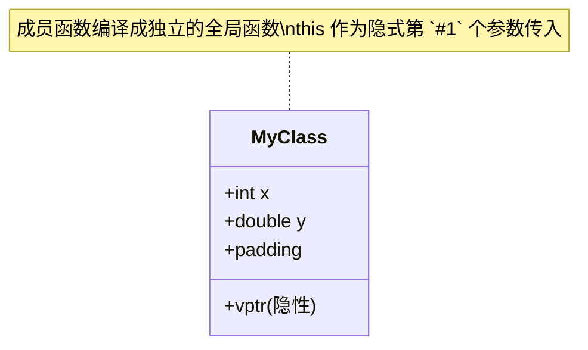

> 所属计划: [[plan|C++ 内存模型]]
> 预计耗时: 55 分钟
> 前置知识: [[02-struct-and-array-layout|struct 与数组的内存布局]]

---

## 1. 概念讲解

### 为什么需要这个？

C++ 的 `class` 和 `struct` 在内存层面几乎没有区别——但 class 引入了成员函数、访问控制、构造/析构。这些特性在内存中是如何体现的？

理解这个能让你回答：
- 成员函数不占对象空间，那它们存在哪里？
- `this` 指针到底是什么？
- 静态成员变量和普通成员变量的内存位置有何不同？
- 为什么空类的大小不是 0？

### 核心思想

**对象内存 = 非静态数据成员 (+ 虚表指针 vptr) + padding。**



关键事实：
1. **非静态成员函数** = 编译成普通函数，`this` 作为隐藏的第 `#1` 个参数
2. **静态成员变量** = 全局变量，所有实例共享
3. **静态成员函数** = 不接收 `this`，和实例无关
4. **空类** = 大小至少为 1，确保不同对象有唯一地址

> [!tip] 类比
> 可以把 class 对象想象成一张**表格**（数据），外加一张**说明书**（代码）。所有相同类型的对象共用同一份说明书，但每张表格的数据不同。工作人员（CPU）拿到表格后，按照说明书上的"步骤 `#1`"找到表格左下角的数据，"步骤 `#2`"找到右上角的数据……`this` 就是"这张表格的地址"。

---

## 2. 代码示例

```cpp
#include <cstddef>
#include <cstdint>
#include <iostream>

// --- 基础类布局 ---
class Empty {};

class Simple {
    int x_;
    double y_;
public:
    void set(int x, double y) { x_ = x; y_ = y; }
    double sum() const { return x_ + y_; }
};

class WithStatic {
    int x_;
    static int count_;   // 不在这里分配
public:
    WithStatic() { ++count_; }
    static int count() { return count_; }
};
int WithStatic::count_ = 0;

// --- this 指针的本质 ---
class ThisDemo {
    int value_ = 42;
public:
    void print() {
        std::cout << "this = " << this
                  << ", value_ addr = " << &value_
                  << ", value_ = " << value_ << "\n";
    }
};

// --- 内存布局可视化 ---
template <typename T>
void dump(const char* name) {
    std::cout << name << ": sizeof=" << sizeof(T)
              << ", alignof=" << alignof(T) << "\n";
}

int main() {
    dump<Empty>("Empty");
    dump<Simple>("Simple");
    dump<WithStatic>("WithStatic");

    std::cout << "\n--- 空类的地址唯一性 ---\n";
    Empty e1, e2;
    std::cout << "&e1 = " << &e1 << ", &e2 = " << &e2 << "\n";
    std::cout << "(&e1 != &e2) = " << (&e1 != &e2) << "\n";

    std::cout << "\n--- this 指针验证 ---\n";
    ThisDemo td;
    td.print();  // this == &td, &value_ == &td + offsetof(value_)

    std::cout << "\n--- 静态成员的位置 ---\n";
    WithStatic ws1, ws2;
    std::cout << "ws1 sizeof=" << sizeof(ws1)
              << ", &ws1.x_ offset implied by sizeof \n";
    std::cout << "WithStatic::count() = " << WithStatic::count() << "\n";

    return 0;
}
```

**运行方式:**
```bash
g++ -std=c++17 -o class_layout class_layout.cpp && ./class_layout
```

**预期输出:**
```text
Empty: sizeof=1, alignof=1
Simple: sizeof=16, alignof=8
WithStatic: sizeof=4, alignof=4

--- 空类的地址唯一性 ---
&e1 = 0x7ffd..., &e2 = 0x7ffd...
(&e1 != &e2) = 1

--- this 指针验证 ---
this = 0x7ffd..., value_ addr = 0x7ffd..., value_ = 42

--- 静态成员的位置 ---
ws1 sizeof=4, &ws1.x_ offset implied by sizeof
WithStatic::count() = 2
```

> [!info] 布局图
> ```
> Empty (1 byte，实际不存任何数据):
> ┌────────┐
> │ padding│  // 至少 1 字节使得 &e1 != &e2
> └────────┘
>
> Simple (16 bytes):
> ┌────────────────┬────────────────────────┐
> │ x_ (int, 4B)   │ y_ (double, 8B)        │
> │ at offset 0    │ at offset 8            │
> └────────────────┴────────────────────────┘
> │ padding after x_: 4 bytes               │
> │ tail padding: 0 (already aligned)       │
> └─────────────────────────────────────────┘
>
> WithStatic (4 bytes):
> ┌────────────────┐
> │ x_ (int, 4B)   │  // static count_ 在 .data/.bss 段
> └────────────────┘
> ```

---

## 3. 练习

### 练习 1: 空基类优化 (EBO)
```cpp
class Empty {};
class Derived : public Empty {
    int x;
};
```
`sizeof(Derived)` 是多少？如果改成 `class Derived { Empty e; int x; };` 呢？为什么两者不同？这个特性在标准库中哪里被利用了？

### 练习 2: 成员指针的大小
```cpp
class Foo { int a; double b; void f(); };
int Foo::* pmi = &Foo::a;
void (Foo::* pmf)() = &Foo::f;
```
在 x86-64 上，通常 `sizeof(pmi)` 是多少？`sizeof(pmf)` 是多少？为什么会有区别？（提示：成员函数可能不是普通函数地址）

### 练习 3: 手写 `offsetof`（可选）
不使用 `<cstddef> ` 中的 `offsetof` 宏，用纯 C++ 实现一个 `my_offsetof(Class, member)`。注意：你的实现必须在编译期求值（可用 `constexpr`），并且不能触发 UB。

---
## 3.5 参考答案

> [!tip]- 练习 1 参考答案
> **继承方式 `Derived : public Empty`：** `sizeof(Derived) == sizeof(int) == 4`。
>
> **组合方式 `Derived { Empty e; int x; }`：** `sizeof(Derived) == 8`（`Empty e` 占 1 字节 + 3 字节 padding 到 int 对齐边界 + `int x` 4 字节）。
>
> **为什么不同：** 这是**空基类优化（Empty Base Optimization, EBO）**。C++ 标准允许（但非强制）编译器在派生类中不为空基类子对象分配空间——空基类的 size 虽为 1，但作为基类时可以"折叠"进派生类的起始地址，不占用额外空间。如果作为成员（组合），空类必须占至少 1 字节来保证地址唯一性（`&obj.e1 != &obj.e2`），连带触发对齐 padding。
>
> **标准库中的应用：**
> - `std::unique_ptr<T, Deleter>` 利用 EBO 存储删除器：当 `Deleter` 是空类（如 `std::default_delete<T>`）时，不增加 `unique_ptr` 的大小
> - `std::vector<T, Allocator>` 同理存储分配器
> - `std::tuple` 对空类型利用 EBO 减少总大小
> - 所有标准库容器在存储无状态函数对象或分配器时都受益于 EBO

> [!tip]- 练习 2 参考答案
> 在 x86-64 Itanium ABI (GCC/Clang) 上：
>
> - `sizeof(pmi)`（指向 `int` 成员的指针）= **4 或 8 字节**（取决于编译器实现，通常等于 `ptrdiff_t` 的大小——它本质上是一个偏移量）
> - `sizeof(pmf)`（指向成员函数的指针）= **16 字节**（通常）
>
> **为什么有区别：**
> 1. **成员数据指针（pointer-to-member-data）**：本质是"该成员在对象中的偏移量"。对一个简单类，`&Foo::a` 就是 `offsetof(Foo, a) = 0`，`&Foo::b` 就是 `offsetof(Foo, b) = 8`。因此 `sizeof(pmi)` 只需存储一个偏移量，通常 4 或 8 字节。
> 2. **成员函数指针（pointer-to-member-function）**：比数据指针复杂得多——它可能需要存储：
>    - 函数地址（8 字节）
>    - `this` 指针调整量（虚继承/多继承时需要调整 this）
>    - 虚函数偏移（如果是虚函数，存储的是虚表中的索引而非实际地址）
>
>    在 Itanium ABI 中，`sizeof(pmf)` 通常是 16 字节（两个指针大小），以支持上述所有情况。MSVC 上，单继承下可能是 4/8 字节，多继承或未知继承时扩大到 12/16 字节。
>
> **验证代码：**
> ```cpp
> #include <iostream>
> class Foo { int a; double b; void f(); };
> int main() {
>     int Foo::* pmi = &Foo::a;
>     void (Foo::* pmf)() = &Foo::f;
>     std::cout << "sizeof(pmi) = " << sizeof(pmi) << "\n";
>     std::cout << "sizeof(pmf) = " << sizeof(pmf) << "\n";
> }
> ```

> [!tip]- 练习 3 参考答案（可选）
> ```cpp
> #include <cstddef>
>
> template<typename Class, typename Member>
> constexpr size_t my_offsetof(Member Class::* member) {
>     // 核心技巧：将 nullptr 强制转为 Class*，再加上成员偏移，
>     // 再转为 char* 得到字节偏移
>     // 注意：reinterpret_cast 不能用于 constexpr，所以用以下方式：
>
>     // 用 0 作为假想的对象地址（标准布局类型有效）
>     Class* null_obj = nullptr; // 或 reinterpret_cast<Class*>(0)，但 nullptr 更安全
>
>     // 取成员的地址：成员指针解引用需要一个对象
>     // &(null_obj->*member) 在标准布局类型上定义良好
>     auto* member_addr = &(null_obj->*member);
>
>     // 将绝对地址转为 size_t：对于地址 0 上的对象，成员地址 = 偏移
>     return reinterpret_cast<const char*>(member_addr)
>          - reinterpret_cast<const char*>(null_obj);
> }
>
> // 使用 macro 封装模板函数的 constexpr 用法
> #define MY_OFFSETOF(Class, Member) \
>     my_offsetof<Class, decltype(Class::Member)>(&Class::Member)
>
> // 测试
> #include <iostream>
> struct Test { char a; int b; double c; };
>
> int main() {
>     constexpr size_t off = MY_OFFSETOF(Test, b);
>     std::cout << "offsetof(Test, b) = " << off << "\n";
>     // off 在 x86-64 上应为 4
>     static_assert(off == 4);  // 编译期验证
> }
> ```
>
> **注意：** 上述实现依赖 "nullptr 解引用成员指针" 这一技巧，在 C++ 标准中属于有条件支持（标准布局类型 + Itanium ABI）。`nullptr->*member` 形式上是 UB，但在三大编译器（GCC/Clang/MSVC）的 `offsetof` 宏实现中均使用此技巧。更严格的实现需要 `reinterpret_cast<Class*>(0)` ——这同样不是严格符合标准的，但这是 `offsetof` 的 `#define` 宏版本用了几十年的技巧。C++20 的 `std::is_standard_layout_v` 和 C++23 的 `std::offsetof` 替代了自定义实现的需要。

> [!note] 答案使用方式
> 先独立完成练习，再展开查看参考答案。参考答案不是唯一解——如果你的实现通过了测试或达到了题目要求，就是正确的。


## 4. 扩展阅读

- [cppreference — Classes](https://en.cppreference.com/w/cpp/language/classes)
- [cppreference — `this` pointer](https://en.cppreference.com/w/cpp/language/this)
- [cppreference — Empty base optimization](https://en.cppreference.com/w/cpp/language/ebo)
- [Itanium C++ ABI](https://itanium-cxx-abi.github.io/cxx-abi/abi.html)（GCC / Clang 使用的 ABI 规范）

---

## 常见陷阱

- **陷阱 1: 认为空类大小为 0。** C++ 标准规定空类至少 1 字节，这样 `&obj1 != &obj2` 恒成立。数组中相邻元素也因此有不同地址。
- **陷阱 2: 用 `offsetof` 访问非标准布局类型的成员。** `offsetof` 只对标准布局类型（standard-layout）有效。包含虚函数、虚继承或非静态引用成员的 class 不是标准布局。
- **陷阱 3: 混淆成员变量的生命周期和静态变量的生命周期。** 静态成员在程序启动时构造（before `main()`），在 `main()` 结束后销毁。如果析构依赖其他静态对象，可能出现静态析构顺序问题（Static Initialization Order Fiasco）。
- **陷阱 4: 成员函数指针和普通函数指针混用。** `void(*)()` 和 `void (Foo::*)()` 是完全不同的类型。成员函数指针通常比普通指针大（因为可能包含 `this` 调整或虚函数信息）。
