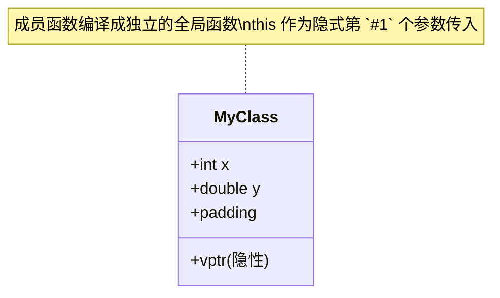

> 所属计划: [[plan|C++ 内存模型]]
> 预计耗时: 55 分钟
> 前置知识: [[02-struct-and-array-layout|struct 与数组的内存布局]]

---

## 1. 概念讲解

### 为什么需要这个？

C++ 的 `class` 和 `struct` 在内存层面几乎没有区别——但 class 引入了成员函数、访问控制、构造/析构。这些特性在内存中是如何体现的？

理解这个能让你回答：
- 成员函数不占对象空间，那它们存在哪里？
- `this` 指针到底是什么？
- 静态成员变量和普通成员变量的内存位置有何不同？
- 为什么空类的大小不是 0？

### 核心思想

**对象内存 = 非静态数据成员 (+ 虚表指针 vptr) + padding。**



关键事实：
1. **非静态成员函数** = 编译成普通函数，`this` 作为隐藏的第 `#1` 个参数
2. **静态成员变量** = 全局变量，所有实例共享
3. **静态成员函数** = 不接收 `this`，和实例无关
4. **空类** = 大小至少为 1，确保不同对象有唯一地址

> [!tip] 类比
> 可以把 class 对象想象成一张**表格**（数据），外加一张**说明书**（代码）。所有相同类型的对象共用同一份说明书，但每张表格的数据不同。工作人员（CPU）拿到表格后，按照说明书上的"步骤 `#1`"找到表格左下角的数据，"步骤 `#2`"找到右上角的数据……`this` 就是"这张表格的地址"。

---

## 2. 代码示例

```cpp
#include <cstddef>
#include <cstdint>
#include <iostream>

// --- 基础类布局 ---
class Empty {};

class Simple {
    int x_;
    double y_;
public:
    void set(int x, double y) { x_ = x; y_ = y; }
    double sum() const { return x_ + y_; }
};

class WithStatic {
    int x_;
    static int count_;   // 不在这里分配
public:
    WithStatic() { ++count_; }
    static int count() { return count_; }
};
int WithStatic::count_ = 0;

// --- this 指针的本质 ---
class ThisDemo {
    int value_ = 42;
public:
    void print() {
        std::cout << "this = " << this
                  << ", value_ addr = " << &value_
                  << ", value_ = " << value_ << "\n";
    }
};

// --- 内存布局可视化 ---
template <typename T>
void dump(const char* name) {
    std::cout << name << ": sizeof=" << sizeof(T)
              << ", alignof=" << alignof(T) << "\n";
}

int main() {
    dump<Empty>("Empty");
    dump<Simple>("Simple");
    dump<WithStatic>("WithStatic");

    std::cout << "\n--- 空类的地址唯一性 ---\n";
    Empty e1, e2;
    std::cout << "&e1 = " << &e1 << ", &e2 = " << &e2 << "\n";
    std::cout << "(&e1 != &e2) = " << (&e1 != &e2) << "\n";

    std::cout << "\n--- this 指针验证 ---\n";
    ThisDemo td;
    td.print();  // this == &td, &value_ == &td + offsetof(value_)

    std::cout << "\n--- 静态成员的位置 ---\n";
    WithStatic ws1, ws2;
    std::cout << "ws1 sizeof=" << sizeof(ws1)
              << ", &ws1.x_ offset implied by sizeof \n";
    std::cout << "WithStatic::count() = " << WithStatic::count() << "\n";

    return 0;
}
```

**运行方式:**
```bash
g++ -std=c++17 -o class_layout class_layout.cpp && ./class_layout
```

**预期输出:**
```text
Empty: sizeof=1, alignof=1
Simple: sizeof=16, alignof=8
WithStatic: sizeof=4, alignof=4

--- 空类的地址唯一性 ---
&e1 = 0x7ffd..., &e2 = 0x7ffd...
(&e1 != &e2) = 1

--- this 指针验证 ---
this = 0x7ffd..., value_ addr = 0x7ffd..., value_ = 42

--- 静态成员的位置 ---
ws1 sizeof=4, &ws1.x_ offset implied by sizeof
WithStatic::count() = 2
```

> [!info] 布局图
> ```
> Empty (1 byte，实际不存任何数据):
> ┌────────┐
> │ padding│  // 至少 1 字节使得 &e1 != &e2
> └────────┘
>
> Simple (16 bytes):
> ┌────────────────┬────────────────────────┐
> │ x_ (int, 4B)   │ y_ (double, 8B)        │
> │ at offset 0    │ at offset 8            │
> └────────────────┴────────────────────────┘
> │ padding after x_: 4 bytes               │
> │ tail padding: 0 (already aligned)       │
> └─────────────────────────────────────────┘
>
> WithStatic (4 bytes):
> ┌────────────────┐
> │ x_ (int, 4B)   │  // static count_ 在 .data/.bss 段
> └────────────────┘
> ```

---

## 3. 练习

### 练习 1: 空基类优化 (EBO)
```cpp
class Empty {};
class Derived : public Empty {
    int x;
};
```
`sizeof(Derived)` 是多少？如果改成 `class Derived { Empty e; int x; };` 呢？为什么两者不同？这个特性在标准库中哪里被利用了？

### 练习 2: 成员指针的大小
```cpp
class Foo { int a; double b; void f(); };
int Foo::* pmi = &Foo::a;
void (Foo::* pmf)() = &Foo::f;
```
在 x86-64 上，通常 `sizeof(pmi)` 是多少？`sizeof(pmf)` 是多少？为什么会有区别？（提示：成员函数可能不是普通函数地址）

### 练习 3: 手写 `offsetof`（可选）
不使用 `<cstddef> ` 中的 `offsetof` 宏，用纯 C++ 实现一个 `my_offsetof(Class, member)`。注意：你的实现必须在编译期求值（可用 `constexpr`），并且不能触发 UB。

---

## 4. 扩展阅读

- [cppreference — Classes](https://en.cppreference.com/w/cpp/language/classes)
- [cppreference — `this` pointer](https://en.cppreference.com/w/cpp/language/this)
- [cppreference — Empty base optimization](https://en.cppreference.com/w/cpp/language/ebo)
- [Itanium C++ ABI](https://itanium-cxx-abi.github.io/cxx-abi/abi.html)（GCC / Clang 使用的 ABI 规范）

---

## 常见陷阱

- **陷阱 1: 认为空类大小为 0。** C++ 标准规定空类至少 1 字节，这样 `&obj1 != &obj2` 恒成立。数组中相邻元素也因此有不同地址。
- **陷阱 2: 用 `offsetof` 访问非标准布局类型的成员。** `offsetof` 只对标准布局类型（standard-layout）有效。包含虚函数、虚继承或非静态引用成员的 class 不是标准布局。
- **陷阱 3: 混淆成员变量的生命周期和静态变量的生命周期。** 静态成员在程序启动时构造（before `main()`），在 `main()` 结束后销毁。如果析构依赖其他静态对象，可能出现静态析构顺序问题（Static Initialization Order Fiasco）。
- **陷阱 4: 成员函数指针和普通函数指针混用。** `void(*)()` 和 `void (Foo::*)()` 是完全不同的类型。成员函数指针通常比普通指针大（因为可能包含 `this` 调整或虚函数信息）。
