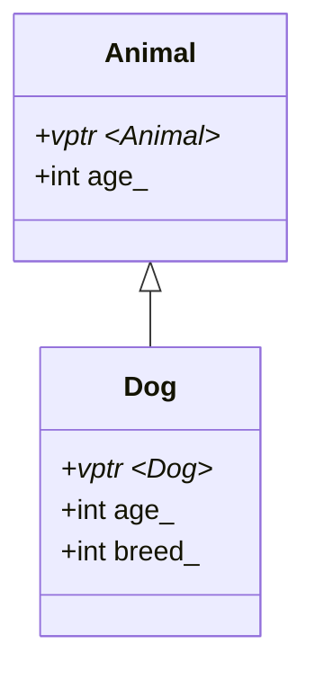

> 所属计划: [[plan|C++ 内存模型]]
> 预计耗时: 60 分钟
> 前置知识: [[03-class-memory-layout|类对象的内存模型]]

---

## 1. 概念讲解

### 为什么需要这个？

虚函数是 C++ 多态的基石，也是游戏引擎中组件系统、渲染抽象层的核心机制。不了解虚函数在内存中的实现，你无法优化虚函数调用开销、无法诊断多重继承中的指针转换 bug、也无法理解为什么 `dynamic_cast` 需要有运行时类型信息。

### 核心思想

**虚函数 = 函数指针数组（虚表）+ 每个对象一个指向该数组的指针（vptr）。**



单继承时：
- 基类对象在派生类对象内存的起始位置
- 派生类只需追加自己的数据成员
- 派生类有自己的虚表，前几个条目和基类相同（覆盖则替换）

多继承时：
- 每个非虚基类都有自己的子对象，按声明顺序排列
- 每个有虚函数的基类子对象可能有自己的 vptr
- `static_cast` 到第二个基类时，需要对 `this` 指针做偏移调整

虚继承时：
- 虚基类子对象放在派生类对象的最末尾（只存一份）
- 中间类中包含一个指向虚基类偏移的指针（vbptr）
- 最复杂的情况：虚表 + 虚基类表双重间接

> [!tip] 类比
> 虚表就像剧院的节目单。观众（对象）人手一张节目单索引卡（vptr），告诉 TA 今天演什么节目（调用哪个函数）。
> - 单继承：子剧院继承了母剧院的节目单，追加了自己的节目。
> - 多继承：一个剧院同时属于两个连锁品牌，它有两张节目单索引卡——分别指向两个品牌的节目单。
> - 虚继承：两个子剧院共享同一个母剧院的设施，但各自有各自的节目单。

---

## 2. 代码示例

```cpp
#include <cstdint>
#include <iostream>

// --- 单继承 + 虚函数 ---
class Animal {
public:
    virtual void speak() { std::cout << "Animal\n"; }
    virtual ~Animal() = default;
    int age_ = 0;
};

class Dog : public Animal {
public:
    void speak() override { std::cout << "Dog\n"; }
    int breed_ = 1;
};

// --- 多继承 ---
class Flyable {
public:
    virtual void fly() { std::cout << "Flying\n"; }
    virtual ~Flyable() = default;
    int wingSpan_ = 10;
};

class Bat : public Animal, public Flyable {
public:
    void speak() override { std::cout << "Squeak\n"; }
    void fly() override { std::cout << "Bat flying\n"; }
    int echolocation_ = 1;
};

// --- 内存布局可视化 ---
template <typename T>
void inspect(const char* name, T* obj) {
    std::cout << "\n=== " << name << " ===\n";
    std::cout << "sizeof=" << sizeof(T)
              << " alignof=" << alignof(T) << "\n";

    uint8_t* base = reinterpret_cast<uint8_t*>(obj);
    for (size_t i = 0; i < sizeof(T); ++i) {
        if (i % 8 == 0) std::cout << "\n  [" << i << "] ";
        std::cout << std::hex << static_cast<int>(base[i]) << " ";
    }
    std::cout << std::dec << "\n";
}

// --- 虚表探测（高度依赖 ABI，仅用于教学演示） ---
using VFunc = void(*)();
void peek_vtable(const char* label, Animal* a) {
    // Itanium ABI: vptr 在对象起始处
    void** vptr = *reinterpret_cast<void***>(a);
    std::cout << label << " vptr=" << vptr << "\n";
    std::cout << "  slot 0 (typeinfo): " << vptr[0] << "\n";
    std::cout << "  slot 1 (destructor): " << vptr[1] << "\n";
    std::cout << "  slot 2 (speak): " << vptr[2] << "\n";
}

int main() {
    Animal a;
    Dog d;
    std::cout << "--- Single inheritance ---\n";
    inspect("Animal", &a);
    inspect("Dog", &d);
    peek_vtable("Animal", &a);
    peek_vtable("Dog", &d);

    std::cout << "\n--- Pointer slicing check ---\n";
    Animal* pa = &d;
    std::cout << "&d      = " << static_cast<void*>(&d) << "\n";
    std::cout << "pa      = " << static_cast<void*>(pa) << "\n";
    pa->speak();  // 多态调用 → Dog::speak

    std::cout << "\n--- Multiple inheritance ---\n";
    Bat bat;
    inspect("Bat", &bat);

    Animal* pa2 = &bat;
    Flyable* pf = &bat;
    std::cout << "&bat          = " << static_cast<void*>(&bat) << "\n";
    std::cout << "Animal*       = " << static_cast<void*>(pa2) << "\n";
    std::cout << "Flyable*      = " << static_cast<void*>(pf) << "\n";
    std::cout << "Flyable offset = "
              << reinterpret_cast<uint8_t*>(pf) - reinterpret_cast<uint8_t*>(&bat)
              << " bytes\n";

    return 0;
}
```

**运行方式:**
```bash
g++ -std=c++17 -o virtual_layout virtual_layout.cpp && ./virtual_layout
```

**预期输出 (Itanium ABI, x86-64):**
```text
--- Single inheritance ---
=== Animal ===
sizeof=16 alignof=8
  [0] f0 e0 ...   // vptr (8 bytes, 地址因 ASLR 而异)
  [8] 00 00 00 00 // age_ (4 bytes)
  [12] 00 00 00 00 // padding (4 bytes)

=== Dog ===
sizeof=24 alignof=8
  [0] f0 d0 ...   // vptr (Dog 的虚表)
  [8] 00 00 00 00 // age_
  [12] 00 00 00 00 // padding
  [16] 01 00 00 00 // breed_
  [20] 00 00 00 00 // padding

Animal vptr=0x55...
  slot 0 (typeinfo): 0x55...
  slot 1 (destructor): 0x55...
  slot 2 (speak): 0x55...
Dog vptr=0x55...
  slot 0: ...
  slot 1: ...
  slot 2: ...  // 指向 Dog::speak，不同于 Animal::speak

--- Pointer slicing check ---
&d      = 0x7ffd...
pa      = 0x7ffd...  // 相同：Dog 的 Animal 子对象在开头
Dog

--- Multiple inheritance ---
=== Bat ===
sizeof=40 alignof=8
  [0] ...     // Animal vptr
  [8] 00...   // Animal::age_
  [16] ...    // Flyable vptr (或 vbptr，取决于具体布局)
  [24] 0a...  // Flyable::wingSpan_
  [32] 01...  // Bat::echolocation_

&bat          = 0x7ffd...
Animal*       = 0x7ffd...  // 同 &bat
Flyable*      = 0x7ffd...  // 偏移 +16 bytes
Flyable offset = 16 bytes
```

> [!warning] 虚表探测的 ABI 依赖
> 上面的 `peek_vtable` 使用 `vptr[0]` 为 typeinfo 的假设只适用于 Itanium ABI（GCC/Clang on Linux/macOS）。MSVC 上 typeinfo 可能不在 `vptr[0]`，甚至可能使用不同的虚表布局（虚表指针前可能有 adjusting thunk）。这段代码在 MSVC 上编译通过但 slot 解读可能不同。这是**示例级代码**，不要在生产环境中依赖虚表布局。

---

## 3. 练习

### 练习 1: 虚表大小预测
```cpp
class A { virtual void f(); virtual void g(); };
class B : public A { virtual void h(); };
class C : public B { virtual void f() override; };
```
在单继承、Itanium ABI 下，`A`、`B`、`C` 的虚表各有多少个 slot？C 的虚表中哪个 slot 被覆盖了？请手绘虚表内容。

### 练习 2: `dynamic_cast` 为什么需要 RTTI？
给定多继承场景：
```cpp
class Base1 { virtual ~Base1(); };
class Base2 { virtual ~Base2(); };
class Derived : public Base1, public Base2 {};
```
如果只有 `Base2* p`，如何安全地把它转回 `Derived*`？为什么 `static_cast` 在这种情况下可能不安全（或说不够通用）？`dynamic_cast` 是如何找到正确的偏移量的？

### 练习 3: 虚继承的空间代价（可选）
```cpp
class Top { int x; };
class Left : virtual public Top { int y; };
class Right : virtual public Top { int z; };
class Bottom : public Left, public Right { int w; };
```
分别计算 `sizeof(Left)`、`sizeof(Bottom)`。如果去掉 `virtual`，再计算一遍。解释 `virtual` 带来的额外空间开销的来源（vbptr）。在菱形继承中，为什么虚继承能避免 `Top` 被重复包含？

---

## 4. 扩展阅读

- [cppreference — Virtual functions](https://en.cppreference.com/w/cpp/language/virtual)
- [cppreference — Abstract classes](https://en.cppreference.com/w/cpp/language/abstract_class)
- [Itanium C++ ABI — Virtual Base Classes](https://itanium-cxx-abi.github.io/cxx-abi/abi.html#vtable)
- [cppcon: Understanding Compiler Optimization](https://www.youtube.com/watch?v=FnGCDLhaxKU)
- 《Inside the C++ Object Model》by Stanley B. Lippman

---

## 常见陷阱

- **陷阱 1: 构造函数中调用虚函数。** 构造函数执行时，对象的动态类型是正在构造的类，不是最终派生类。调用虚函数不会走多态——它调用的是当前类的版本。
- **陷阱 2: 忘记给基类析构函数加 `virtual`。** `Base* p = new Derived(); delete p;` 如果 `~Base()` 不是虚函数，`Derived` 的析构函数不会被调用 → 资源泄漏 + 未定义行为。
- **陷阱 3: 多继承中 `static_cast` 到兄弟类。** `static_cast<Base2*>(derived_ptr)` 需要 `this` 指针偏移编译器已知。但如果通过 `Base1*` 转 `Base2*`，无法静态确定偏移（可能有更深层的派生类），必须用 `dynamic_cast`。
- **陷阱 4: 虚继承的性能问题。** 每次访问虚基类成员时，都需要通过 vbptr 做一次间接寻址。虚继承有运行时开销，在性能敏感路径上（如 ECS 系统）应避免使用。
