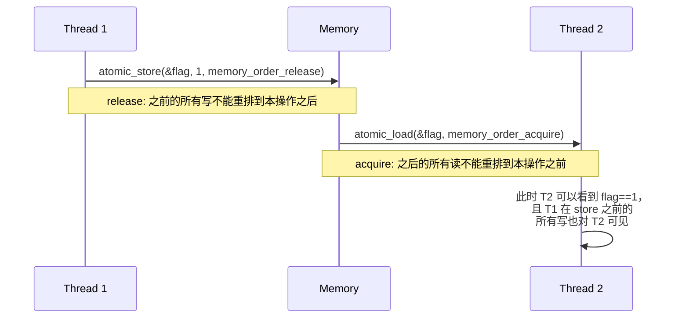

> 所属计划: [[plan|C++ 内存模型]]
> 预计耗时: 60 分钟
> 前置知识: [[07-low-level-memory-operations|底层内存操作（memcpy 等）]]

---

## 1. 概念讲解

### 为什么需要这个？

多线程编程是游戏引擎、服务器、操作系统开发者的 daily bread。但"代码看起来按顺序执行"的直觉在多核 CPU + 编译器优化 + CPU 乱序执行的现实中完全失效。

C++11 引入了标准化的内存模型，定义了：
- 什么是"线程间可见"的写操作
- 编译器可以对代码做什么重排
- 什么样的同步能保证数据竞争不导致 UB

不学这个，你写的"无锁队列"可能是数据竞争炸弹。

### 核心思想

**C++ 内存模型 = "指定哪些内存操作的可见性顺序"。**

三个核心概念：
1. **Sequenced-before**：同一线程内，表达式按程序顺序执行（但编译器可能重排，只要不改变单线程可观测行为）
2. **Happens-before**：跨线程的因果关系。如果 A happens-before B，线程 B 中能看到 A 的结果
3. **Synchronizes-with**：原子操作之间的"发布-订阅"关系。`release` 写和 `acquire` 读配对，建立 happens-before



六种内存序：

| 内存序 | 语义 | 适用场景 |
|--------|------|---------|
| `memory_order_relaxed` | 无同步，只保证原子性 | 计数器（不要求顺序） |
| `memory_order_consume` | 依赖关系同步（少用） | 数据依赖链读取 |
| `memory_order_acquire` | 之后的读不能重排到本操作之前 | 锁的 `lock()` |
| `memory_order_release` | 之前的写不能重排到本操作之后 | 锁的 `unlock()` |
| `memory_order_acq_rel` | 同时 acquire + release | CAS 循环 |
| `memory_order_seq_cst` | 全局顺序一致性（最严格） | 默认，最简单但有时过强 |

> [!tip] 类比
> 想象两个办公室（线程）通过公告板（共享内存）通信。
> - `relaxed`：你写了公告，但不保证对方什么时候看到。消息最终会到，但顺序不定。
> - `release`/`acquire`：你在公告上贴了一张"已更新"标签（release）。对方看到标签后（acquire），知道标签之前的所有内容都已经贴好了。
> - `seq_cst`：全公司只有一个麦克风。谁拿到麦克风谁才能广播，所有人听到的顺序完全一致。

---

## 2. 代码示例

```cpp
#include <atomic>
#include <iostream>
#include <thread>
#include <vector>

// --- 基础原子操作 ---
void demo_atomic_basics() {
    std::cout << "=== Atomic basics ===\n";
    std::atomic<int> counter{0};

    std::vector<std::thread> threads;
    for (int i = 0; i < 4; ++i) {
        threads.emplace_back([&counter] {
            for (int j = 0; j < 100000; ++j) {
                counter.fetch_add(1, std::memory_order_relaxed);
            }
        });
    }
    for (auto& t : threads) t.join();
    std::cout << "counter = " << counter.load() << " (expected 400000)\n";
}

// --- Release/Acquire 同步 ---
std::atomic<int> data{0};
std::atomic<bool> ready{false};

void producer() {
    data.store(42, std::memory_order_relaxed);
    ready.store(true, std::memory_order_release);  // 之前的写对 acquire 方可见
}

void consumer() {
    while (!ready.load(std::memory_order_acquire)) {
        // 自旋等待
    }
    // 到这里，data 必然等于 42
    std::cout << "data = " << data.load(std::memory_order_relaxed) << "\n";
}

void demo_release_acquire() {
    std::cout << "\n=== Release/Acquire ===\n";
    data = 0;
    ready = false;
    std::thread t1(producer);
    std::thread t2(consumer);
    t1.join(); t2.join();
}

// --- 有锁 vs 无锁 ---
class Spinlock {
    std::atomic<bool> locked_{false};
public:
    void lock() {
        while (locked_.exchange(true, std::memory_order_acquire)) {
            // 自旋：已被锁定，继续尝试
        }
    }
    void unlock() {
        locked_.store(false, std::memory_order_release);
    }
};

int shared_counter = 0;
Spinlock spin;

void demo_spinlock() {
    std::cout << "\n=== Spinlock ===\n";
    shared_counter = 0;
    std::vector<std::thread> threads;
    for (int i = 0; i < 4; ++i) {
        threads.emplace_back([] {
            for (int j = 0; j < 100000; ++j) {
                spin.lock();
                ++shared_counter;  // 临界区
                spin.unlock();
            }
        });
    }
    for (auto& t : threads) t.join();
    std::cout << "shared_counter = " << shared_counter << "\n";
}

// --- 内存序对比：内存序过强/过弱的后果 ---
std::atomic<int> x{0};
std::atomic<int> y{0};
std::atomic<int> r1{0};
std::atomic<int> r2{0};

void memory_order_demo() {
    std::cout << "\n=== Memory order comparison ===\n";
    int reorder_count = 0;
    for (int trial = 0; trial < 100000; ++trial) {
        x = 0; y = 0;
        std::thread t1([] {
            x.store(1, std::memory_order_relaxed);
            y.store(1, std::memory_order_relaxed);
        });
        std::thread t2([] {
            int a = y.load(std::memory_order_relaxed);
            int b = x.load(std::memory_order_relaxed);
            r1 = a;
            r2 = b;
        });
        t1.join(); t2.join();
        if (r1 == 1 && r2 == 0) {
            ++reorder_count;  // 观察到 reorder!
        }
    }
    std::cout << "Observed reorder (r1=1, r2=0) in "
              << reorder_count << "/100000 trials\n";
}

int main() {
    demo_atomic_basics();
    demo_release_acquire();
    demo_spinlock();
    memory_order_demo();
    return 0;
}
```

**运行方式:**
```bash
g++ -std=c++17 -pthread -o atomics atomics.cpp && ./atomics
```

**预期输出:**
```text
=== Atomic basics ===
counter = 400000 (expected 400000)

=== Release/Acquire ===
data = 42

=== Spinlock ===
shared_counter = 400000

=== Memory order comparison ===
Observed reorder (r1=1, r2=0) in .../100000 trials
  // 在 x86-64 上可能很少观察到，因为 x86 本身有较强一致性
  // 但在 ARM/POWER 上 reorder 非常常见
```

> [!info] x86 与 ARM 差异
> x86-64 架构本身提供较强的内存一致性（所有写操作自动具有 release 语义，所有读具有 acquire 语义），所以 `relaxed` 在 x86 上往往"看起来"工作正常。但编译器重排仍然可能发生。ARM 和 POWER 是弱内存序架构——如果你不正确使用内存序，100% 会触发数据竞争。
>
> **编写平台无关的并发代码：始终显式指定内存序，不要依赖 x86 的"宽容"。**

---

## 3. 练习

### 练习 1: 正确的双检查锁 (DCLP)
经典的"双检查锁"单例模式在 C++11 前是 broken 的：
```cpp
// 错误版本（C++11 前 broken）
Singleton* getInstance() {
    if (!instance_) {                    // `#1`
        std::lock_guard<std::mutex> lock(mutex_);
        if (!instance_) {
            instance_ = new Singleton(); // `#2` 可能重排！
        }
    }
    return instance_;                    // `#3`
}
```
问题：第 `#2` 步中，指针赋值可能先于构造函数完成，导致 `#3` 返回一个未完全构造的对象。用 `std::atomic` 和正确的内存序修复这个问题。（提示：`std::memory_order_acquire` + `std::memory_order_release`，或直接用 `std::call_once`/`magic static`）

### 练习 2: 无锁栈 (Treiber Stack)
实现一个最简单的无锁栈：
```cpp
class LockFreeStack {
    struct Node { int data; Node* next; };
    std::atomic<Node*> head_{nullptr};
public:
    void push(int value);
    bool pop(int& value);  // 返回 false 表示栈空
};
```
使用 `compare_exchange_weak` 实现 `push` 和 `pop`。注意 ABA 问题会在本练习中存在——描述它，并说明 `std::atomic` 的 `compare_exchange` 不解决 ABA。（高阶方案：使用 hazard pointer 或 tagged pointer）

### 练习 3: 伪共享 (False Sharing) 实验（可选）
```cpp
struct alignas(64) PaddedCounter {
    std::atomic<int> value{0};
    char pad[64 - sizeof(std::atomic<int>)];
};
```
创建两个线程，一个只写 `counter[0]`，另一个只写 `counter[1]`。分别测试 `counter` 有 padding 和没有 padding 时的性能差异。解释为什么无 padding 时变慢（缓存行竞争）。

---

## 4. 扩展阅读

- [cppreference — Memory order](https://en.cppreference.com/w/cpp/atomic/memory_order)
- [cppreference — std::atomic](https://en.cppreference.com/w/cpp/atomic/atomic)
- [cppreference — compare_exchange_weak](https://en.cppreference.com/w/cpp/atomic/atomic/compare_exchange)
- [Herb Sutter: atomic Weapons](https://www.youtube.com/watch?v=A8eCGOqgvH4) (CppCon 2012)
- [Jeff Preshing: Memory Barrier](https://preshing.com/20120710/memory-barriers-are-like-source-control-operations/)
- 《C++ Concurrency in Action》by Anthony Williams

---

## 常见陷阱

- **陷阱 1: 用 `volatile` 做线程同步。** `volatile` 只阻止编译器优化（确保每次都读写内存），不保证原子性、不保证内存序、不阻止 CPU 乱序执行。对 `volatile int` 做 `++` 不是原子的。线程间同步用 `std::atomic`。
- **陷阱 2: 假设 `std::atomic<int>` 的默认操作是顺序一致性。** `counter++` 使用 `memory_order_seq_cst`（最安全但最慢）。在热路径上应该显式使用 `fetch_add(..., memory_order_relaxed)` 如果语义允许。
- **陷阱 3: Release/Acquire 配对不完整。** `store(..., release)` 后必须有对应的 `load(..., acquire)`。如果读方用 `relaxed`，happens-before 不建立，之前的写可能不可见。
- **陷阱 4: 对有依赖的数据用 `relaxed`。** 如果线程 B 读取一个指针（`relaxed`），然后解引用该指针读取数据，`relaxed` 不保证数据的可见性。应该用 `acquire`/`consume`。
