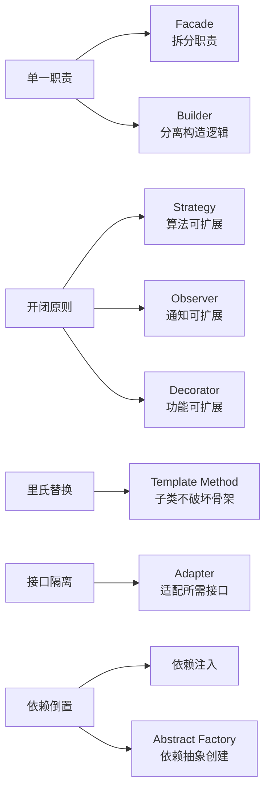

# 设计模式概述 + SOLID 原则

> 所属计划: [[design-patterns-csharp|设计模式 (C#)]]
> 预计耗时: 60 分钟
> 前置知识: C# 基础语法、面向对象基本概念

---

## 1. 概念讲解

### 什么是设计模式？

设计模式是对软件设计中**反复出现的问题**的**可复用解决方案**。它不是可以直接复制粘贴的代码，而是解决特定问题的**通用模板**——你需要根据自身项目进行调整。

1994 年，Erich Gamma、Richard Helm、Ralph Johnson、John Vlissides（合称 GoF，Gang of Four）出版了《Design Patterns: Elements of Reusable Object-Oriented Software》，系统整理了 23 种设计模式，按用途分为三大类：

```mermaid
graph TD
    DP[设计模式 23 种] --> C[创建型 5 种]
    DP --> S[结构型 7 种]
    DP --> B[行为型 11 种]
    C --> C1[单例 Singleton]
    C --> C2[工厂方法 Factory Method]
    C --> C3[抽象工厂 Abstract Factory]
    C --> C4[建造者 Builder]
    C --> C5[原型 Prototype]
    S --> S1[适配器 Adapter]
    S --> S2[桥接 Bridge]
    S --> S3[组合 Composite]
    S --> S4[装饰器 Decorator]
    S --> S5[外观 Facade]
    S --> S6[享元 Flyweight]
    S --> S7[代理 Proxy]
    B --> B1[责任链 Chain of Responsibility]
    B --> B2[命令 Command]
    B --> B3[迭代器 Iterator]
    B --> B4[中介者 Mediator]
    B --> B5[备忘录 Memento]
    B --> B6[观察者 Observer]
    B --> B7[状态 State]
    B --> B8[策略 Strategy]
    B --> B9[模板方法 Template Method]
    B --> B10[访问者 Visitor]
```



### 为什么需要设计模式？

- **沟通语言**：团队说"用策略模式"，所有人理解相同的结构
- **经过验证**：这些方案已被无数项目验证过，不是纸上谈兵
- **应对变化**：好的设计让代码对扩展开放、对修改关闭

> [!warning] 不要过度设计
> 设计模式是工具，不是目标。如果一个简单 `if` 就能解决的问题，不需要用策略模式。先用最简单的方式实现，当你看到代码的**变化方向**时，再引入模式重构。

### 设计模式分类速查

| 分类 | 关注点 | 类比 |
|------|--------|------|
| 创建型 | 如何创建对象 | 不同方式的工厂 |
| 结构型 | 如何组合对象 | 不同方式的积木拼装 |
| 行为型 | 对象间如何通信 | 不同方式的团队协作 |

---

## 2. SOLID 原则

设计模式的底层哲学是 SOLID 原则——五个面向对象设计的基本准则。理解 SOLID 是理解所有设计模式的前提。

### S — 单一职责原则 (Single Responsibility Principle)

> 一个类应该只有一个引起它变化的原因。

```csharp
// ❌ 违反 SRP：一个类同时处理数据持久化和报告生成
public class Employee
{
    public string Name { get; set; }
    public decimal Salary { get; set; }

    public void SaveToDatabase() { /* ... */ }
    public string GenerateReport() { /* ... */ }
}

// ✅ 符合 SRP：拆分为两个类，各自只有一个变化原因
public class Employee
{
    public string Name { get; set; }
    public decimal Salary { get; set; }
}

public class EmployeeRepository
{
    public void Save(Employee employee) { /* ... */ }
}

public class ReportGenerator
{
    public string Generate(Employee employee) { /* ... */ }
}
```

### O — 开闭原则 (Open/Closed Principle)

> 软件实体应该对扩展开放，对修改关闭。

```csharp
// ❌ 违反 OCP：每新增一种折扣就要修改这个方法
public decimal CalculateDiscount(string customerType, decimal total)
{
    if (customerType == "Regular") return total * 0.95m;
    if (customerType == "VIP") return total * 0.90m;
    // 新增类型要改这里！
    return total;
}

// ✅ 符合 OCP：通过扩展而非修改来支持新类型
public interface IDiscountStrategy
{
    decimal ApplyDiscount(decimal total);
}

public class RegularDiscount : IDiscountStrategy
{
    public decimal ApplyDiscount(decimal total) => total * 0.95m;
}

public class VipDiscount : IDiscountStrategy
{
    public decimal ApplyDiscount(decimal total) => total * 0.90m;
}

// 使用方无需修改
public class DiscountCalculator
{
    private readonly IDiscountStrategy _strategy;
    public DiscountCalculator(IDiscountStrategy strategy) => _strategy = strategy;
    public decimal Calculate(decimal total) => _strategy.ApplyDiscount(total);
}
```

### L — 里氏替换原则 (Liskov Substitution Principle)

> 子类型必须能够替换其基类型，而不影响程序正确性。

```csharp
// ❌ 违反 LSP：正方形继承矩形，但 SetWidth 改变了 Height 的行为
public class Rectangle
{
    public virtual int Width { get; set; }
    public virtual int Height { get; set; }
    public int Area => Width * Height;
}

public class Square : Rectangle
{
    public override int Width { set { base.Width = base.Height = value; } }
    public override int Height { set { base.Width = base.Height = value; } }
}

// 测试：期望矩形面积 = 5 * 10 = 50，但 Square 返回 100
Rectangle r = new Square { Width = 5, Height = 10 };
Console.WriteLine(r.Area); // 输出 100，违反直觉！

// ✅ 符合 LSP：不要让 Square 继承 Rectangle，而是两者都实现 IShape
public interface IShape
{
    int Area { get; }
}
```

### I — 接口隔离原则 (Interface Segregation Principle)

> 客户端不应该依赖它不使用的接口。

```csharp
// ❌ 违反 ISP：胖接口强迫所有实现者提供不需要的方法
public interface IWorker
{
    void Work();
    void Eat();
    void Sleep();
}

// 机器人不需要 Eat 和 Sleep！
public class Robot : IWorker
{
    public void Work() { /* ... */ }
    public void Eat() => throw new NotImplementedException(); // 被迫实现
    public void Sleep() => throw new NotImplementedException(); // 被迫实现
}

// ✅ 符合 ISP：拆分为小接口
public interface IWorkable { void Work(); }
public interface IFeedable { void Eat(); }
public interface ISleepable { void Sleep(); }

public class Robot : IWorkable
{
    public void Work() { /* ... */ }
    // 不需要实现 Eat/Sleep
}
```

### D — 依赖倒置原则 (Dependency Inversion Principle)

> 高层模块不应依赖低层模块，两者都应依赖抽象。

```csharp
// ❌ 违反 DIP：高层直接依赖低层具体类
public class EmailService
{
    public void Send(string message) { /* ... */ }
}

public class Notification
{
    private readonly EmailService _email = new(); // 直接依赖具体类
    public void Notify(string message) => _email.Send(message);
}

// ✅ 符合 DIP：高层和低层都依赖抽象
public interface IMessageService
{
    void Send(string message);
}

public class EmailService : IMessageService
{
    public void Send(string message) { /* SMTP 实现 */ }
}

public class SmsService : IMessageService
{
    public void Send(string message) { /* SMS 实现 */ }
}

public class Notification
{
    private readonly IMessageService _service;
    public Notification(IMessageService service) => _service = service;
    public void Notify(string message) => _service.Send(message);
}
```

### SOLID 与设计模式的对应关系



---

## 3. 练习

### 练习 1：识别 SOLID 违反

以下代码违反了哪条 SOLID 原则？请指出并修正。

```csharp
public class UserService
{
    public void CreateUser(string name, string email)
    {
        // 验证
        if (string.IsNullOrEmpty(name)) throw new ArgumentException();
        if (!email.Contains("@")) throw new ArgumentException();

        // 保存到数据库
        var connection = new SqlConnection("...");
        connection.Open();
        var command = new SqlCommand("INSERT INTO Users ...", connection);
        command.ExecuteNonQuery();

        // 发送欢迎邮件
        var smtp = new SmtpClient("smtp.example.com");
        smtp.Send("welcome@example.com", email, "Welcome", $"Hi {name}!");
    }
}
```

> [!tip] 提示
> 这个方法至少违反了三条原则。分别从"变化原因"、"依赖方向"和"接口职责"角度分析。

### 练习 2：用 OCP 重构

为以下折扣计算器引入开闭原则，使其支持新增折扣类型时无需修改已有代码：

```csharp
public decimal GetDiscount(string type, decimal amount)
{
    if (type == "Student") return amount * 0.8m;
    if (type == "Senior") return amount * 0.7m;
    return amount;
}
```

### 练习 3：SOLID 综合重构（可选）

将练习 1 的 `UserService` 完整重构为符合所有 SOLID 原则的版本。考虑：
- 拆分职责（SRP）
- 用接口解耦（DIP）
- 对新通知方式可扩展（OCP）
- 不强迫实现不需要的方法（ISP）

---

## 4. 扩展阅读

- [Refactoring.Guru — SOLID 原则](https://refactoring.guru/design-principles) — 每条原则配有详细图解
- [Microsoft — SOLID Principles in C#](https://learn.microsoft.com/en-us/dotnet/csharp/programming-guide/) — C# 官方设计指南
- 《Clean Architecture》— Robert C. Martin — SOLID 原则在架构层面的应用
- [Dofactory — SOLID 原则](https://www.dofactory.com/net/solid-principles) — 含 C# 代码示例

---

## 常见陷阱

- **把 SRP 理解为"一个类只有一个方法"**：SRP 是指一个变化原因，不是方法数量。一个类有 5 个私有辅助方法但只为一个业务功能服务，仍然符合 SRP
- **为了 OCP 到处用继承**：OCP 的核心是对扩展开放，组合（`interface` + 注入）通常比继承更灵活
- **LSP 只看编译通过**：LSP 要求的是**行为兼容**，不仅是签名兼容。子类不应强化前置条件或弱化后置条件
- **ISP 拆得太细**：一个方法的接口没有意义，接口粒度应以使用者的需要为准
- **DIP 导致所有类都依赖接口**：稳定的工具类（如 `System.IO.File`）不需要抽象，只有**可能变化**的依赖才需要倒置
