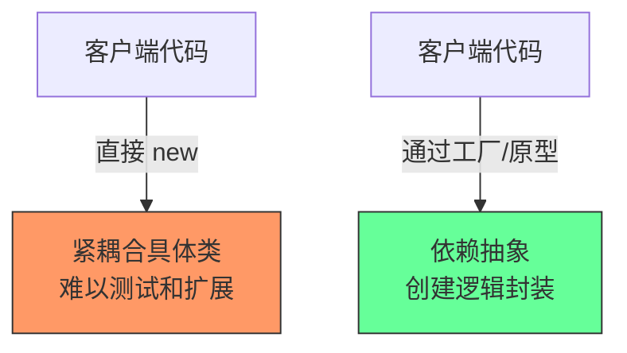
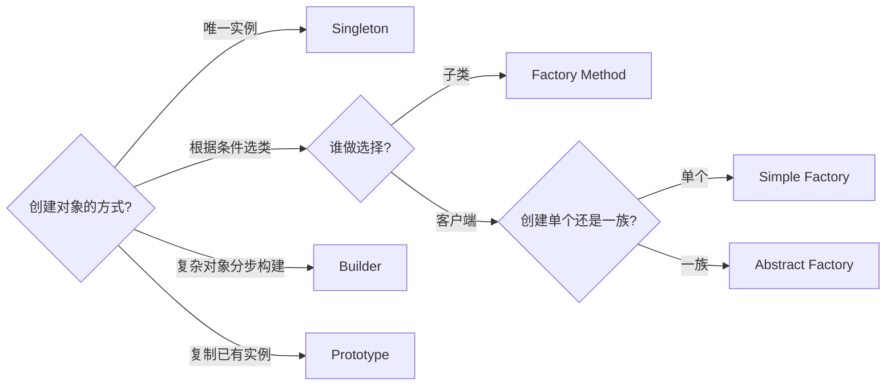
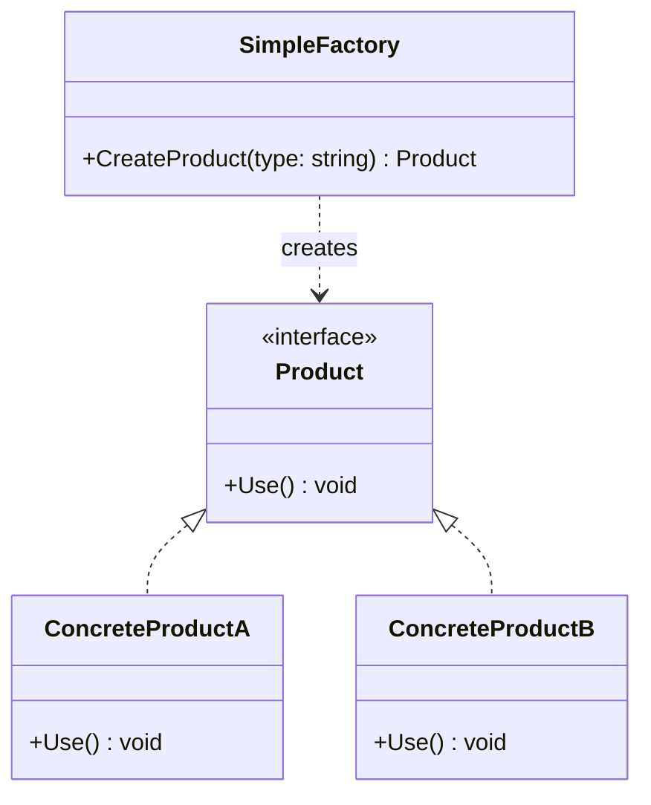

# 创建型模式总览 + 简单工厂

> 所属计划: [[design-patterns-csharp|设计模式 (C#)]]
> 预计耗时: 50 分钟
> 前置知识: [[01-design-patterns-overview|设计模式概述 + SOLID 原则]]

---

## 1. 概念讲解

### 创建型模式解决什么问题？

对象创建看似简单（`new` 一下），但在真实项目中：
- 创建逻辑可能很复杂（依赖配置、条件分支、对象池）
- 客户端不应关心"用哪个具体类"
- 系统需要控制实例数量、创建时机

**创建型模式的核心思想**：将"对象创建"从"对象使用"中分离出来。



### 五种创建型模式速查

| 模式 | 核心意图 | 关键区别 |
|------|---------|---------|
| [[03-singleton\|Singleton]] | 保证全局唯一实例 | 控制数量 |
| [[04-factory-method\|Factory Method]] | 子类决定创建哪个类 | 推迟到子类 |
| [[05-abstract-factory\|Abstract Factory]] | 创建产品族 | 产品族约束 |
| [[06-builder\|Builder]] | 分步骤构建复杂对象 | 关注构造过程 |
| [[07-prototype\|Prototype]] | 克隆已有对象 | 关注复制已有实例 |



### 简单工厂 (Simple Factory)

> [!note] 简单工厂不是 GoF 23 种模式之一
> 它是一种常用的惯用写法，是理解 Factory Method 和 Abstract Factory 的基础。

简单工厂将创建逻辑集中在一个类中，客户端只需传入参数即可获得对象，无需知道具体类名。



---

## 2. 代码示例

### 简单工厂：日志记录器

```csharp
// 产品接口
public interface ILogger
{
    void Log(string message);
}

// 具体产品
public class ConsoleLogger : ILogger
{
    public void Log(string message) => Console.WriteLine($"[Console] {message}");
}

public class FileLogger : ILogger
{
    private readonly string _filePath;
    public FileLogger(string filePath) => _filePath = filePath;

    public void Log(string message)
        => File.AppendAllText(_filePath, $"{DateTime.Now:O} - {message}{Environment.NewLine}");
}

public class NullLogger : ILogger
{
    public void Log(string message) { /* 什么都不做 — 空对象模式 */ }
}

// 简单工厂
public static class LoggerFactory
{
    public static ILogger Create(string type, string? filePath = null)
    {
        return type.ToLowerInvariant() switch
        {
            "console" => new ConsoleLogger(),
            "file"    => new FileLogger(filePath ?? "app.log"),
            "null"    => new NullLogger(),
            _         => throw new ArgumentException($"Unknown logger type: {type}")
        };
    }
}

// 使用
var logger = LoggerFactory.Create("console");
logger.Log("Hello, Design Patterns!");
```

**运行方式:**
```bash
dotnet new console -n SimpleFactoryDemo
# 将上述代码放入 Program.cs
dotnet run --project SimpleFactoryDemo
```

**预期输出:**
```text
[Console] Hello, Design Patterns!
```

### 简单工厂的 C# 进阶：泛型工厂

```csharp
// 利用泛型和反射，避免 switch 分支
public static class GenericFactory
{
    public static T Create<T>() where T : new()
    {
        return new T();
    }

    // 从类型名称创建
    public static object Create(Type type, params object[] args)
    {
        return Activator.CreateInstance(type, args)
            ?? throw new InvalidOperationException($"Cannot create instance of {type.Name}");
    }
}

// 使用
var logger = GenericFactory.Create<ConsoleLogger>();
```

> [!warning] 反射工厂的性能
> `Activator.CreateInstance` 比直接 `new` 慢约 10-50 倍。在性能敏感场景，可改用 `Expression<Func<T>>` 编译表达式树缓存，或使用 `Source Generator` 在编译期生成工厂代码。

---


---

## C++ 实现

C++ 中简单工厂常用 `enum class` 配合 `switch` 做类型分发；也可利用模板在编译期决定具体类型，零运行时开销。

```cpp
#include <iostream>
#include <memory>
#include <stdexcept>
#include <string>

using namespace std;

// === 产品接口 ===
struct IShape {
    virtual void draw() const = 0;
    virtual ~IShape() = default;
};

// === 具体产品 ===
struct Circle : IShape {
    void draw() const override { cout << "Drawing Circle" << endl; }
};

struct Rectangle : IShape {
    void draw() const override { cout << "Drawing Rectangle" << endl; }
};

struct Triangle : IShape {
    void draw() const override { cout << "Drawing Triangle" << endl; }
};

// === 版本 1: enum class + switch ===
enum class ShapeType { Circle, Rectangle, Triangle };

class ShapeFactory {
public:
    static unique_ptr<IShape> create(ShapeType type) {
        switch (type) {
            case ShapeType::Circle:    return make_unique<Circle>();
            case ShapeType::Rectangle: return make_unique<Rectangle>();
            case ShapeType::Triangle:  return make_unique<Triangle>();
        }
        throw invalid_argument("Unknown shape type");
    }
};

// === 版本 2: 模板工厂（编译期绑定，零运行时分支） ===
template <typename T>
unique_ptr<T> createShape() {
    static_assert(is_base_of_v<IShape, T>, "T must implement IShape");
    return make_unique<T>();
}

// === 版本 3: 注册表工厂（运行时注册，符合 OCP） ===
class RegisteredFactory {
    using Creator = function<unique_ptr<IShape>()>;
    unordered_map<string, Creator> registry;
public:
    void reg(const string& name, Creator c) { registry[name] = move(c); }
    unique_ptr<IShape> create(const string& name) {
        auto it = registry.find(name);
        if (it == registry.end())
            throw invalid_argument("Unknown shape: " + name);
        return it->second();
    }
};

// === main / usage ===
int main() {
    // enum + switch
    auto s1 = ShapeFactory::create(ShapeType::Circle);
    s1->draw();

    // 模板版本 — 编译期确定类型
    auto s2 = createShape<Rectangle>();
    s2->draw();

    // 注册表版本 — 运行时扩展
    RegisteredFactory rf;
    rf.reg("triangle", [] { return make_unique<Triangle>(); });
    auto s3 = rf.create("triangle");
    s3->draw();
}
```

**编译运行:**
```bash
g++ -std=c++17 -o prog main.cpp && ./prog
```

> [!note] C++ 特点
> 模板版本利用 `static_assert` 在编译期校验类型约束，`make_unique<T>()` 比 C# 的 `new T()` 更安全（无反射开销）。注册表版本使用 `std::function` + lambda，新增产品无需修改工厂代码——天然符合 OCP。
## 3. 练习

### 练习 1：简单工厂实战

为以下需求实现简单工厂：

> 一个文档导出系统，支持 PDF、Excel、CSV 三种格式。每种导出器实现 `IExporter` 接口，包含 `Export(string data, string outputPath)` 方法。

```csharp
public interface IExporter
{
    void Export(string data, string outputPath);
}

// 实现三种导出器，然后写 ExporterFactory.Create(string format)
```

### 练习 2：消除 if-else

将 `LoggerFactory` 中的 `switch` 替换为**字典注册**方式，使新增 Logger 类型时无需修改工厂代码（符合 OCP）：

```csharp
public static class LoggerFactory
{
    private static readonly Dictionary<string, Func<ILogger>> _creators = new();

    public static void Register(string type, Func<ILogger> creator) { /* ... */ }
    public static ILogger Create(string type) { /* ... */ }
}
```

### 练习 3：配置驱动工厂（可选）

从 `appsettings.json` 读取 Logger 类型配置，用反射创建实例。思考如何处理配置错误的情况。

---
## 3.5 参考答案

> [!tip]- 练习 1 参考答案
> 实现三种导出器和 `ExporterFactory`：
>
> ```csharp
> public interface IExporter
> {
>     void Export(string data, string outputPath);
> }
>
> public class PdfExporter : IExporter
> {
>     public void Export(string data, string outputPath)
>     {
>         // 实际实现中会使用 PDF 库（如 iTextSharp、PdfSharp）
>         Console.WriteLine($"[PDF] 导出数据到 {outputPath}");
>         Console.WriteLine($"[PDF] 内容预览: {data[..Math.Min(50, data.Length)]}...");
>         // 模拟写入文件
>         File.WriteAllText(outputPath, $"%PDF-1.4\n...{data}...\n%%EOF");
>     }
> }
>
> public class ExcelExporter : IExporter
> {
>     public void Export(string data, string outputPath)
>     {
>         Console.WriteLine($"[Excel] 导出数据到 {outputPath}");
>         // 实际实现中会使用 EPPlus 或 ClosedXML
>         File.WriteAllText(outputPath, $"<Workbook><Sheet>{data}</Sheet></Workbook>");
>     }
> }
>
> public class CsvExporter : IExporter
> {
>     public void Export(string data, string outputPath)
>     {
>         Console.WriteLine($"[CSV] 导出数据到 {outputPath}");
>         // CSV 格式：多行用 Environment.NewLine 分隔
>         var csvContent = string.Join(Environment.NewLine,
>             data.Split('\n').Select(line => $"\"{line.Trim()}\""));
>         File.WriteAllText(outputPath, csvContent);
>     }
> }
>
> // 简单工厂
> public static class ExporterFactory
> {
>     public static IExporter Create(string format)
>     {
>         return format.ToLowerInvariant() switch
>         {
>             "pdf"   => new PdfExporter(),
>             "excel" => new ExcelExporter(),
>             "csv"   => new CsvExporter(),
>             _ => throw new ArgumentException($"Unknown export format: {format}")
>         };
>     }
> }
>
> // === 使用 ===
> var exporter = ExporterFactory.Create("csv");
> exporter.Export("Name,Age,City\nAlice,30,NYC", "output.csv");
> ```

> [!tip]- 练习 2 参考答案
> 用字典注册取代 `switch`，符合 OCP——新增 Logger 只需注册，无需修改工厂：
>
> ```csharp
> public static class LoggerFactory
> {
>     private static readonly Dictionary<string, Func<ILogger>> _creators = new();
>
>     // 注册新的 Logger 类型 — 可在程序启动时调用
>     public static void Register(string type, Func<ILogger> creator)
>     {
>         if (string.IsNullOrWhiteSpace(type))
>             throw new ArgumentException("Type cannot be empty.", nameof(type));
>         _creators[type.ToLowerInvariant()] = creator
>             ?? throw new ArgumentNullException(nameof(creator));
>     }
>
>     public static ILogger Create(string type)
>     {
>         if (_creators.TryGetValue(type.ToLowerInvariant(), out var creator))
>             return creator();
>
>         throw new ArgumentException(
>             $"Unknown logger type: {type}. Available: {string.Join(", ", _creators.Keys)}");
>     }
>
>     // 批量注册默认 Logger
>     public static void RegisterDefaults()
>     {
>         Register("console", () => new ConsoleLogger());
>         Register("file",    () => new FileLogger("app.log"));
>         Register("null",    () => new NullLogger());
>     }
> }
>
> // === 使用示例 ===
> LoggerFactory.RegisterDefaults();
> var logger = LoggerFactory.Create("console");
> logger.Log("Hello from dictionary-based factory!");
>
> // 扩展：新增 DatabaseLogger — 不改 LoggerFactory 代码
> LoggerFactory.Register("database", () => new DatabaseLogger("connStr"));
> ```
>
> **OCP 体现：** 新增 Logger 只需调一次 `Register`，`Create` 方法无需任何修改。字典键用小写实现大小写不敏感匹配，错误信息列出可用类型便于调试。

> [!tip]- 练习 3 参考答案（可选）
> 从 `appsettings.json` 读取 Logger 配置，使用反射创建实例：
>
> ```csharp
> using Microsoft.Extensions.Configuration;
>
> // appsettings.json 示例内容:
> // {
> //   "Logging": {
> //     "LoggerType": "ConsoleLogger, MyApp",
> //     "FilePath": "logs/app.log"
> //   }
> // }
>
> public static class ConfigDrivenLoggerFactory
> {
>     public static ILogger CreateFromConfig()
>     {
>         var config = new ConfigurationBuilder()
>             .SetBasePath(Directory.GetCurrentDirectory())
>             .AddJsonFile("appsettings.json", optional: false)
>             .Build();
>
>         var typeName = config["Logging:LoggerType"];
>         if (string.IsNullOrWhiteSpace(typeName))
>             throw new InvalidOperationException(
>                 "Logging:LoggerType is missing in appsettings.json");
>
>         // 类型名称格式: "Namespace.ClassName, AssemblyName"
>         var type = Type.GetType(typeName);
>         if (type == null)
>             throw new InvalidOperationException(
>                 $"Cannot find type: {typeName}. Ensure the assembly is loaded.");
>
>         if (!typeof(ILogger).IsAssignableFrom(type))
>             throw new InvalidOperationException(
>                 $"{type.FullName} does not implement ILogger.");
>
>         // 检查是否有接受 filePath 参数的构造函数
>         var filePath = config["Logging:FilePath"];
>         if (filePath != null)
>         {
>             var ctorWithPath = type.GetConstructor(new[] { typeof(string) });
>             if (ctorWithPath != null)
>                 return (ILogger)ctorWithPath.Invoke(new object[] { filePath });
>         }
>
>         // 降级：无参构造函数
>         return (ILogger)Activator.CreateInstance(type)!;
>     }
> }
> ```
>
> **错误处理策略：**
> - 配置缺失 → 抛 `InvalidOperationException` 并说明缺失的键名
> - 类型未找到 → 检查程序集名称是否正确、是否已加载
> - 类型不匹配 → 验证 `IsAssignableFrom`，发现不兼容立即抛异常
> - **生产环境建议：** 为关键组件（如日志）提供默认回退（Fallback Logger），确保即使配置错误系统也不会完全无日志
>
> > [!warning] 反射的性能开销
> > `Activator.CreateInstance` 可比直接 `new` 慢 10-50 倍。如果 Logger 被高频创建（如每次请求），应使用 `Expression<Func<ILogger>>` 编译表达式树后缓存，或使用 Source Generator 在编译期生成工厂代码。

> [!note] 答案使用方式
> 先独立完成练习，再展开查看参考答案。参考答案不是唯一解——如果你的实现通过了测试或达到了题目要求，就是正确的。

## 4. 扩展阅读

- [[03-singleton|单例模式]] — 另一种控制对象创建的方式
- [[04-factory-method|工厂方法模式]] — 简单工厂的"正规化"版本
- [Refactoring.Guru — Factory Method](https://refactoring.guru/design-patterns/factory-method) — 简单工厂与工厂方法的对比
- [Dofactory — Simple Factory](https://www.dofactory.com/net/factory-method-design-pattern) — 含 .NET 优化写法

---

## 常见陷阱

- **简单工厂违反 OCP**：每新增一种产品都要修改工厂的 `switch` 分支。解决方案：练习 2 的字典注册或使用 Factory Method 模式
- **工厂返回 `object` 而非接口**：失去类型安全，客户端被迫强制转换。工厂应返回抽象接口
- **简单工厂变成"上帝类"**：如果工厂创建的对象类型太多（>10），应拆分为多个专职工厂或使用 Factory Method
- **忽略 `null` 返回值**：工厂方法不应返回 `null`，未知类型应抛异常或返回 Null Object
