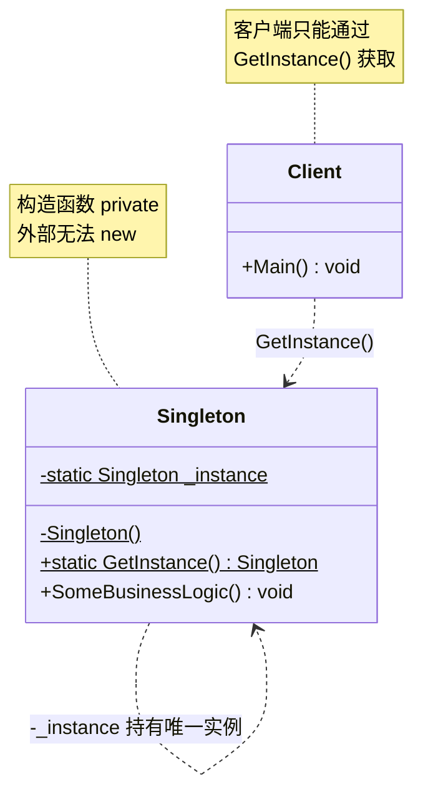
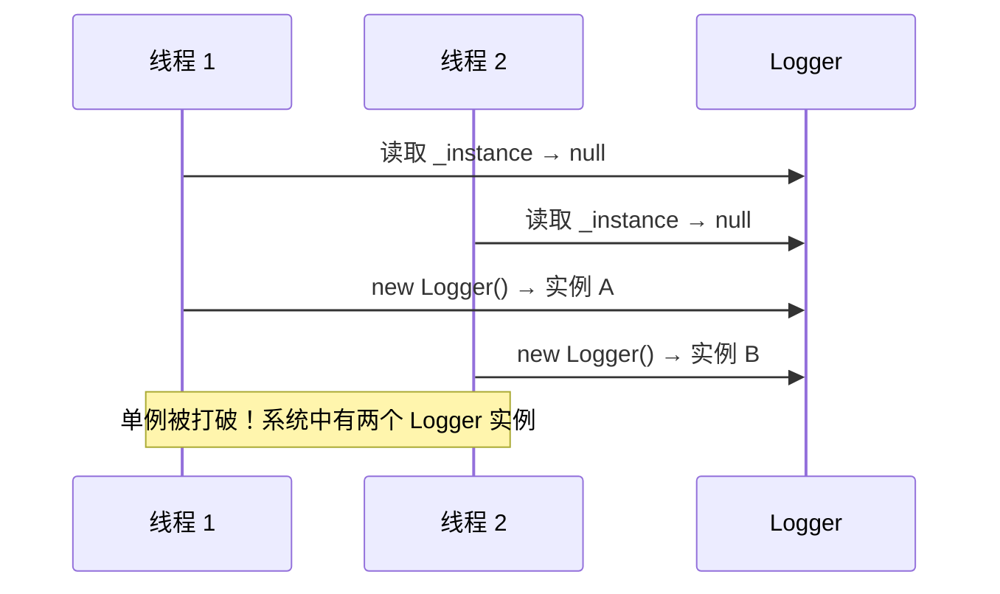
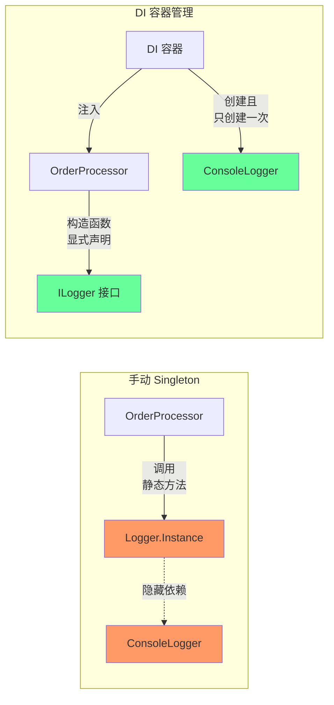
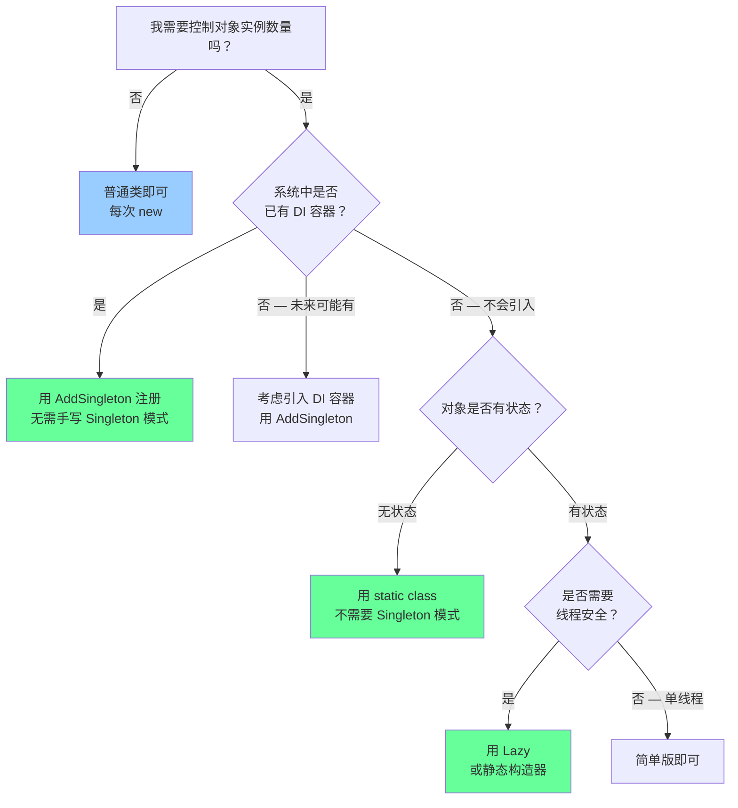

# 单例模式 Singleton

> 所属计划: [[design-patterns-csharp|设计模式 (C#)]]
> 预计耗时: 50 分钟
> 前置知识: [[02-creational-intro|创建型模式总览 + 简单工厂]]

---

## 1. 概念讲解

### 为什么需要单例？

有些对象在整个系统中**只需要一个实例**：

| 场景 | 原因 |
|------|------|
| 配置管理器 | 所有模块读同一份配置，多份副本会导致不一致 |
| 数据库连接池 | 池本身就是共享资源，多个池会耗尽连接数 |
| 日志记录器 | 多实例导致日志写入冲突、文件锁竞争 |
| 硬件管理器 | 物理设备只有一个，抽象对象也只能有一个 |
| 缓存 | 全局缓存必须在同一份数据上操作 |

如果用普通类，每次都 `new`，问题在于：

```csharp
// ❌ 每次新建实例 — 配置不一致、连接池重复、日志乱序
var config1 = new AppConfig("config.json");  // 加载了一次
var config2 = new AppConfig("config.json");  // 又加载了一次 — 浪费 I/O
// config1 和 config2 是不同对象，修改 config1 不影响 config2
```

**单例模式的核心思想**：确保一个类只有一个实例，并提供全局访问点。



### 单例的基本结构

```csharp
public class Singleton
{
    // 1. 私有静态字段 — 持有唯一实例
    private static Singleton? _instance;

    // 2. 私有构造函数 — 外部无法 new
    private Singleton() { }

    // 3. 公共静态方法 — 全局访问点
    public static Singleton GetInstance()
    {
        _instance ??= new Singleton();
        return _instance;
    }
}
```

三个关键要素：
- **私有构造函数**：阻止外部 `new Singleton()`
- **静态实例字段**：持有唯一实例，属于类而非对象
- **公共静态访问方法**：控制实例的创建与返回

---

## 2. 代码示例

### 2.1 版本一：经典单例（非线程安全）

```csharp
/// <summary>
/// 最简单的单例 — 非线程安全，仅适合单线程场景。
/// </summary>
public sealed class Logger
{
    private static Logger? _instance;

    // 私有构造器：外部不能 new Logger()
    private Logger()
    {
        Console.WriteLine("Logger instance created.");
    }

    public static Logger Instance
    {
        get
        {
            if (_instance is null)
            {
                _instance = new Logger();
            }
            return _instance;
        }
    }

    public void Log(string message)
    {
        Console.WriteLine($"[{DateTime.Now:HH:mm:ss.fff}] {message}");
    }
}

// 使用
var log1 = Logger.Instance;
var log2 = Logger.Instance;
Console.WriteLine(ReferenceEquals(log1, log2)); // True — 同一个实例
```

> [!warning] 为什么这是"错误"版本？
> 在多线程环境中，两个线程可能**同时**通过 `_instance is null` 检查，然后各自 `new Logger()`，最终产生**两个实例**。这就是 race condition。

时序：



### 2.2 版本二：线程安全（`lock`）

```csharp
/// <summary>
/// 线程安全版本 — 使用 lock 保证只有一个线程创建实例。
/// 缺陷：每次获取都要竞争锁，性能开销较大。
/// </summary>
public sealed class Logger
{
    private static Logger? _instance;
    private static readonly object _lock = new();

    private Logger()
    {
        Console.WriteLine("Logger instance created.");
    }

    public static Logger Instance
    {
        get
        {
            lock (_lock)
            {
                if (_instance is null)
                {
                    _instance = new Logger();
                }
                return _instance;
            }
        }
    }

    public void Log(string message)
    {
        Console.WriteLine($"[{DateTime.Now:HH:mm:ss.fff}] {message}");
    }
}
```

> [!tip] `lock` 的性能问题
> 即使实例已创建，每次访问 `Instance` 仍要获取锁。高频调用场景（如日志记录器每秒写数千条）下，锁竞争成为瓶颈。解决方案见下一个版本。

### 2.3 版本三：双重检查锁定 (Double-Check Locking)

```csharp
/// <summary>
/// 双重检查锁定 — 只在实例为 null 时加锁，创建后无需锁。
/// 注意：volatile 关键字确保编译器不会重排指令。
/// </summary>
public sealed class Logger
{
    // volatile 防止编译器/CPU 指令重排导致的"半初始化对象"问题
    private static volatile Logger? _instance;
    private static readonly object _lock = new();

    private Logger()
    {
        Console.WriteLine("Logger instance created.");
    }

    public static Logger Instance
    {
        get
        {
            // 第一重检查 — 无锁，快速路径
            if (_instance is not null)
                return _instance;

            lock (_lock)
            {
                // 第二重检查 — 锁内，确保只有一个线程创建
                if (_instance is null)
                {
                    _instance = new Logger();
                }
                return _instance;
            }
        }
    }

    public void Log(string message)
    {
        Console.WriteLine($"[{DateTime.Now:HH:mm:ss.fff}] {message}");
    }
}
```

```mermaid
flowchart TD
    Start([调用 Instance]) --> Check1{_instance != null?}
    Check1 -->|是 — 快速返回| Return1[返回 _instance]
    Check1 -->|否| AcquireLock[获取 lock]
    AcquireLock --> Check2{_instance == null?}
    Check2 -->|否 — 别的线程先创建了| ReleaseLock1[释放锁]
    ReleaseLock1 --> Return2[返回 _instance]
    Check2 -->|是 — 首次创建| Create[new Logger()]
    Create --> Assign[_instance = new Logger()]
    Assign --> ReleaseLock2[释放锁]
    ReleaseLock2 --> Return3[返回 _instance]

    style Check1 fill:#6f9
    style Check2 fill:#f96
```

> [!info] 为什么需要 `volatile`？
> 在没有 `volatile` 的情况下，编译器或 CPU 可能重排指令顺序：**先赋值 `_instance` 引用，再执行构造函数**。此时另一个线程通过第一重检查，拿到的是一个**尚未完成构造**的"半初始化"对象。`volatile` 禁止这种重排，保证写入操作对所有 CPU 核心立即可见。在 **.NET Framework 4.0+** 和 **.NET Core+** 中，`Lazy<T>` 内部已处理这些问题，推荐使用。

### 2.4 版本四：`Lazy<T>` — 最佳实践

```csharp
/// <summary>
/// 推荐方式 — 利用 Lazy&lt;T&gt; 的线程安全保证。
/// LazyThreadSafetyMode.ExecutionAndPublication 是默认值，无需显式指定。
/// </summary>
public sealed class Logger
{
    // Lazy<T> 内部已处理双重检查、volatile、异常缓存等所有细节
    private static readonly Lazy<Logger> _lazy =
        new(() => new Logger());

    private Logger()
    {
        Console.WriteLine("Logger instance created.");
    }

    public static Logger Instance => _lazy.Value;

    public void Log(string message)
    {
        Console.WriteLine($"[{DateTime.Now:HH:mm:ss.fff}] {message}");
    }
}
```

`Lazy<T>` 的三种线程安全模式：

| 模式 | 枚举值 | 行为 |
|------|--------|------|
| 完全线程安全 | `ExecutionAndPublication`（默认） | 只有一个线程执行工厂，所有线程等结果 |
| 无锁，需外部保证单线程 | `None` | 不保证线程安全，但无锁开销 |
| 每个线程一个实例 | `PublicationOnly` | 多个线程可同时执行工厂，以第一个完成的为准 |

> [!tip] `Lazy<T>` 的异常处理
> 如果工厂方法抛出异常，`Lazy<T>` 默认缓存异常（`LazyThreadSafetyMode.ExecutionAndPublication`），后续访问会重复抛出该异常。如需重试，使用 `LazyThreadSafetyMode.PublicationOnly`。

### 2.5 版本五：静态构造器 — C# 语言级保证

```csharp
/// <summary>
/// 利用 C# 静态构造器的线程安全保证 — 最简洁的写法。
/// CLR 保证静态构造器在 AppDomain 生命周期内只执行一次，且是线程安全的。
/// </summary>
public sealed class Logger
{
    // 静态字段在静态构造器完成后立即初始化
    // .NET 的 beforefieldinit 优化：在 static 方法首次被调用时才初始化
    private static readonly Logger _instance = new();

    // 显式静态构造器禁用 beforefieldinit，保证在首次引用类型时初始化。
    // 如果没有这个构造器，实例可能在 Instance getter 首次调用时才创建。
    static Logger() { }

    private Logger()
    {
        Console.WriteLine("Logger instance created.");
    }

    public static Logger Instance => _instance;

    public void Log(string message)
    {
        Console.WriteLine($"[{DateTime.Now:HH:mm:ss.fff}] {message}");
    }
}
```

> [!info] `beforefieldinit` 的两种语义
>
> | 有无显式静态构造器 | beforefieldinit 标记 | 初始化时机 |
> |---|---|---|
> | 无显式静态构造器（仅 `static readonly` 字段） | 标记 | 在静态方法首次调用**之前**，JIT 可推迟到调用点 |
> | 有显式静态构造器（`static Logger() { }`） | 不标记 | 在首次引用类型的**精确时刻** |
>
> 差异主要在性能：无显式静态构造器（带 beforefieldinit）允许 JIT 更激进的优化。对于单例，两端的结果相同——都是线程安全且只创建一次。

### 2.6 完整可运行示例：配置管理器

```csharp
using System;
using System.Collections.Generic;
using System.IO;
using System.Text.Json;

/// <summary>
/// 线程安全的配置管理器单例 — 使用 Lazy&lt;T&gt;。
/// </summary>
public sealed class AppConfig
{
    private readonly Dictionary<string, string> _settings;
    private static readonly Lazy<AppConfig> _lazy =
        new(() => new AppConfig("appsettings.json"));

    private AppConfig(string filePath)
    {
        _settings = File.Exists(filePath)
            ? JsonSerializer.Deserialize<Dictionary<string, string>>(
                File.ReadAllText(filePath)) ?? new()
            : new();
    }

    public static AppConfig Instance => _lazy.Value;

    public string Get(string key, string defaultValue = "")
        => _settings.TryGetValue(key, out var value) ? value : defaultValue;

    public void Set(string key, string value)
    {
        _settings[key] = value;
        File.WriteAllText("appsettings.json",
            JsonSerializer.Serialize(_settings, new JsonSerializerOptions { WriteIndented = true }));
    }
}

// 使用
public static class Program
{
    public static void Main()
    {
        var config = AppConfig.Instance;
        Console.WriteLine(config.Get("Theme", "light"));

        config.Set("Theme", "dark");
        Console.WriteLine(config.Get("Theme"));
    }
}
```

**运行方式：**
```bash
dotnet new console -n SingletonDemo
# 将上述代码和 appsettings.json 放入项目文件夹
dotnet run --project SingletonDemo
```

**`appsettings.json`（初始）：**
```json
{
    "Theme": "light",
    "Language": "zh-CN",
    "MaxConnections": "100"
}
```

### 2.7 反模式：为什么 Singleton 有争议

```csharp
/// <summary>
/// ⚠️ 反模式示例：Singleton 混入业务逻辑，且不可测试。
/// </summary>
public sealed class OrderService
{
    private static readonly Lazy<OrderService> _lazy = new(() => new OrderService());
    private readonly SqlConnection _connection;

    // 直接依赖具体数据库连接 — 无法替换、无法测试
    private OrderService()
    {
        _connection = new SqlConnection("Server=prod;Database=Orders;...");
        _connection.Open();
    }

    public static OrderService Instance => _lazy.Value;

    public decimal CalculateTotal(int orderId)
    {
        // 直接查数据库 — 单元测试必须连数据库！
        var cmd = new SqlCommand($"SELECT SUM(Price) FROM Items WHERE OrderId = {orderId}",
            _connection);
        return (decimal)(cmd.ExecuteScalar() ?? 0m);
    }
}

// 测试时的困境：
// ❌ 无法 mock SqlConnection（私有构造器无法注入）
// ❌ 测试之间状态残留（_connection 是静态的）
// ❌ 并行测试互相干扰
// ❌ 测试执行顺序影响结果
```

Singleton 的主要争议：

| 问题 | 说明 |
|------|------|
| **隐藏依赖** | 调用 `OrderService.Instance.CalculateTotal(42)` 的代码，无法从签名看出它依赖了什么 |
| **测试困难** | 无法替换为 mock/stub，单元测试变成集成测试 |
| **全局可变状态** | 测试之间互相污染，必须手动重置 |
| **违反 SRP** | 如果 Singleton 包含业务逻辑，它同时负责"实例管理"和"业务功能" |

---

## 3. Singleton vs 依赖注入

DI 容器可以声明式地管理单例生命周期，彻底解耦"单例"与"获取得"语义。

```csharp
// === DI 方式：服务注册为 Singleton 生命周期 ===

// 接口定义
public interface ILogger
{
    void Log(string message);
}

// 实现 — 只是普通类，不关心自己的生命周期
public class ConsoleLogger : ILogger
{
    public void Log(string message)
        => Console.WriteLine($"[{DateTime.Now:HH:mm:ss.fff}] {message}");
}

// 注册（以 Microsoft.Extensions.DependencyInjection 为例）
var services = new ServiceCollection();
services.AddSingleton<ILogger, ConsoleLogger>();  // 容器管理单例
var provider = services.BuildServiceProvider();

// 使用 — 通过构造函数注入，依赖关系显式可见
public class OrderProcessor
{
    private readonly ILogger _logger;

    // 依赖从签名看得很清楚！
    public OrderProcessor(ILogger logger) => _logger = logger;

    public void Process(int orderId)
    {
        _logger.Log($"Processing order {orderId}");
    }
}
```



> [!important] 什么时候用 DI 单例 vs 手写 Singleton？
>
> | 场景 | 推荐方案 |
> |------|---------|
> | 新项目，使用 DI 容器 | DI `AddSingleton` |
> | 需要可测试性 | DI `AddSingleton` |
> | 静态工具类（无状态）| 直接用 `static class`，不需要模式 |
> | 第三方库暴露 API（如日志抽象）| DI `AddSingleton` |
> | 遗留代码，无 DI 容器 | 手写 Singleton（用 `Lazy<T>`） |
> | 资源类需要 `IDisposable` | DI 容器自动管理 `Dispose` |

### 决策流程：我需要 Singleton 吗？



---


---

## C++ 实现

C++11 起提供了语言级的线程安全保证：函数内静态局部变量的初始化由编译器保证只执行一次（Meyers' Singleton）。这是 C++ 中最推荐的方式。此外 `std::call_once` + `std::once_flag` 和 `std::atomic` 提供了更精细的控制。

```cpp
#include <iostream>
#include <memory>
#include <mutex>
#include <atomic>
#include <string>

using namespace std;

// === 版本 1: Meyers' Singleton（C++11 起线程安全，最推荐） ===
// 函数内的 static 局部变量初始化由编译器保证线程安全
// 且只在首次调用时初始化（lazy initialization）
class Logger {
    string name;
    Logger(const string& n) : name(n) {
        cout << "Logger '" << name << "' created." << endl;
    }
public:
    // 禁止拷贝和移动
    Logger(const Logger&) = delete;
    Logger& operator=(const Logger&) = delete;

    static Logger& instance() {
        static Logger inst("Meyers");  // C++11: 线程安全初始化
        return inst;
    }

    void log(const string& msg) {
        cout << "[LOG] " << msg << endl;
    }
};

// === 版本 2: std::call_once + std::once_flag ===
// 适合需要在初始化时执行更复杂逻辑的场景
class ConfigManager {
    static unique_ptr<ConfigManager> instance_;
    static once_flag initFlag_;

    ConfigManager() { cout << "ConfigManager created." << endl; }
public:
    ConfigManager(const ConfigManager&) = delete;
    ConfigManager& operator=(const ConfigManager&) = delete;

    static ConfigManager& instance() {
        call_once(initFlag_, [] {
            instance_ = unique_ptr<ConfigManager>(new ConfigManager());
        });
        return *instance_;
    }

    string get(const string& key) { return "value_for_" + key; }
};
unique_ptr<ConfigManager> ConfigManager::instance_;
once_flag ConfigManager::initFlag_;

// === 版本 3: std::atomic 无锁版本（适用于高频读取场景） ===
// 使用 acquire/release 内存序保证可见性，无锁开销
class DatabasePool {
    static atomic<DatabasePool*> instance_;
    static mutex mtx_;

    DatabasePool() { cout << "DatabasePool created." << endl; }
public:
    DatabasePool(const DatabasePool&) = delete;
    DatabasePool& operator=(const DatabasePool&) = delete;

    static DatabasePool& instance() {
        // 快速路径: atomic acquire 读取
        auto* p = instance_.load(memory_order_acquire);
        if (p == nullptr) {
            lock_guard<mutex> lock(mtx_);
            p = instance_.load(memory_order_relaxed);
            if (p == nullptr) {
                p = new DatabasePool();
                instance_.store(p, memory_order_release);
            }
        }
        return *p;
    }

    void query(const string& sql) {
        cout << "Executing: " << sql << endl;
    }
};
atomic<DatabasePool*> DatabasePool::instance_{nullptr};
mutex DatabasePool::mtx_;

// === main / usage ===
int main() {
    // Meyers' Singleton — 最简洁
    Logger::instance().log("Hello via Meyers");
    Logger::instance().log("Same instance");
    cout << boolalpha
         << (&Logger::instance() == &Logger::instance()) << endl;  // true

    // call_once 版本
    cout << ConfigManager::instance().get("db.host") << endl;

    // atomic 无锁版本 — 高并发友好
    DatabasePool::instance().query("SELECT 1");
}
```

**编译运行:**
```bash
g++ -std=c++17 -o prog main.cpp -lpthread && ./prog
```

> [!note] C++ 单例要点
> - **Meyers' Singleton** 是 C++11 后的事实标准——简洁、线程安全、lazy init，编译器替你处理好了一切。
> - **`call_once`** 适合初始化逻辑复杂或需要异常安全的场景（`once_flag` 可重置）。
> - **`atomic` 版本**的原理是 acquire/release 语义代替锁，但实现复杂；现代编译器对 Meyers' Singleton 的优化已经足够好，手动 `atomic` 版本通常不是必须的。
> - C++ 中单例的销毁顺序问题（static destruction order fiasco）需注意：多个编译单元中的静态对象析构顺序不确定。避免在析构函数中访问其他单例。
## 4. 练习

### 练习 1：实现线程安全的数据库连接池单例

实现一个 `ConnectionPool` 单例，管理一组数据库连接：

```csharp
public sealed class ConnectionPool
{
    // 你的实现：
    // 1. 使用 Lazy&lt;T&gt; 保证线程安全
    // 2. 构造函数创建 N 个 SqlConnection 放入队列（用 int poolSize 参数）
    // 3. AcquireConnection() 从队列取出一个连接（队列为空时等待）
    // 4. ReleaseConnection(SqlConnection) 将连接放回队列
    // 5. 实现 IDisposable，关闭所有连接
}
```

> [!tip] 提示
> 使用 `ConcurrentQueue<SqlConnection>` 和 `SemaphoreSlim` 控制并发获取。

### 练习 2：将 Singleton 重构为 DI 管理

现有代码使用手写 Singleton：

```csharp
public sealed class PaymentGateway
{
    private static readonly Lazy<PaymentGateway> _lazy = new(() => new PaymentGateway());
    private readonly HttpClient _http = new();

    private PaymentGateway() { }

    public static PaymentGateway Instance => _lazy.Value;

    public async Task<bool> Charge(string cardToken, decimal amount)
    {
        // 调用第三方支付 API
        var response = await _http.PostAsync("https://api.pay.example/charge", ...);
        return response.IsSuccessStatusCode;
    }
}
```

**任务：**
1. 提取 `IPaymentGateway` 接口
2. 移除 Singleton 模式
3. 用 `Microsoft.Extensions.DependencyInjection` 注册为 Singleton
4. 写一个单元测试，用 `Mock<IHttpClientFactory>` 验证 `Charge` 的逻辑（不实际调用 API）

### 练习 3：手动实现双重检查锁定（可选）

不使用 `volatile`、`Lazy<T>` 或 `static` 构造器，用普通 `object` + `lock` 实现双重检查锁定版本的单例，然后解释在什么情况下它会失败（提示：思考 CPU 缓存和指令重排）。

---

## 5. 扩展阅读

- [[04-factory-method|工厂方法模式]] — 工厂方法返回的可能是单例实例
- [[28-dependency-injection|依赖注入 + DI 容器]] — DI 容器如何管理对象生命周期
- [[07-prototype|原型模式]] — Singleton 的反面：每次返回新副本
- `[Microsoft: Lazy<T>` Class](https://learn.microsoft.com/en-us/dotnet/api/system.lazy-1) — `Lazy<T>` 的完整 API 文档
- [Microsoft: Dependency Injection in .NET](https://learn.microsoft.com/en-us/dotnet/core/extensions/dependency-injection) — DI 容器管理 Singleton 生命周期
- [Jon Skeet — Implementing the Singleton Pattern in C#](https://csharpindepth.com/Articles/Singleton) — 权威的 C# 单例实现对比（含性能分析）
- [Refactoring.Guru — Singleton](https://refactoring.guru/design-patterns/singleton) — 含 UML 和多语言实现

---

## 常见陷阱

> [!danger] `#1` — 非线程安全的 Singleton
> 多线程环境下使用"检查—创建"模式而不加锁，会导致创建多个实例。
>
> ```csharp
> // ❌ 多线程下不安全的 Singleton
> public static Logger Instance
> {
>     get
>     {
>         if (_instance is null)        // 两个线程同时到达这里
>             _instance = new Logger(); // 各创建一个实例
>         return _instance;
>     }
> }
> // ✅ 使用 Lazy&lt;T&gt; 或静态构造器
> ```

> [!danger] `#2` — Singleton 导致测试不可行
> 全局静态状态在测试间残留，导致测试相互影响：
>
> ```csharp
> // ❌ 测试 1 修改了配置，测试 2 的断言基于旧配置而失败
> [Fact]
> public void Test1() { AppConfig.Instance.Set("key", "foo"); }
> [Fact]
> public void Test2() { Assert.Equal("bar", AppConfig.Instance.Get("key")); } // 失败！
>
> // ✅ DI 方式：每个测试创建新的 ServiceCollection
> ```

> [!danger] `#3` — 全局可变状态引入隐式耦合
> 任何代码都可以修改 Singleton 的状态，导致难以追踪的 bug：
>
> ```csharp
> // ❌ 任何模块都能改全局配置
> AppConfig.Instance.Set("ConnectionString", "wrong_value");
> // 另一个模块在毫不知情的情况下使用错误的连接字符串
>
> // ✅ 只读配置 + DI 注入
> // ✅ 或使用 options pattern 的 IOptionsSnapshot&lt;T&gt;
> ```

> [!danger] `#4` — 在 Singleton 中包含业务逻辑（违反 SRP）
> Singleton 负责**实例管理**，业务逻辑应委托给独立类：
>
> ```csharp
> // ❌ Singleton 又是实例管理器，又是业务逻辑
> public sealed class ReportGenerator
> {
>     private static readonly Lazy<ReportGenerator> _lazy = new(() => new ReportGenerator());
>     public static ReportGenerator Instance => _lazy.Value;
>
>     public string GeneratePdf(string data) { /* 复杂的 PDF 生成逻辑... */ }
>     public string GenerateExcel(string data) { /* 复杂的 Excel 逻辑... */ }
> }
>
> // ✅ 分离关注点：Singleton 只暴露接口，业务逻辑在独立类中
> public interface IReportGenerator { string GeneratePdf(string data); }
> public class ReportGenerator : IReportGenerator { /* 纯业务逻辑 */ }
> // DI 容器中注册：services.AddSingleton<IReportGenerator, ReportGenerator>();
> ```

> [!danger] `#5` — 忘记处理 `IDisposable`
> 如果 Singleton 持有非托管资源（数据库连接、文件句柄），忘记 `Dispose` 会导致资源泄漏：
>
> ```csharp
> // ❌ Singleton 持有 SqlConnection 但未实现 IDisposable
> public sealed class Database
> {
>     private static readonly Lazy<Database> _lazy = new(() => new Database());
>     private readonly SqlConnection _conn;
>     private Database() { _conn = new SqlConnection("..."); _conn.Open(); }
>     public static Database Instance => _lazy.Value;
> }
>
> // ✅ 实现 IDisposable，并在应用程序关闭时释放
> // 更好的方案：用 DI 容器，容器会自动调用 Dispose
> ```

> [!warning] `#6` — Singleton 在 AppDomain 中唯一，进程内唯一
> 在负载均衡场景（多个服务器实例）中，Singleton 只保证**单进程内**唯一。跨进程的"全局唯一"需要分布式锁、数据库约束等机制。Singleton 模式不能替代分布式协调。
