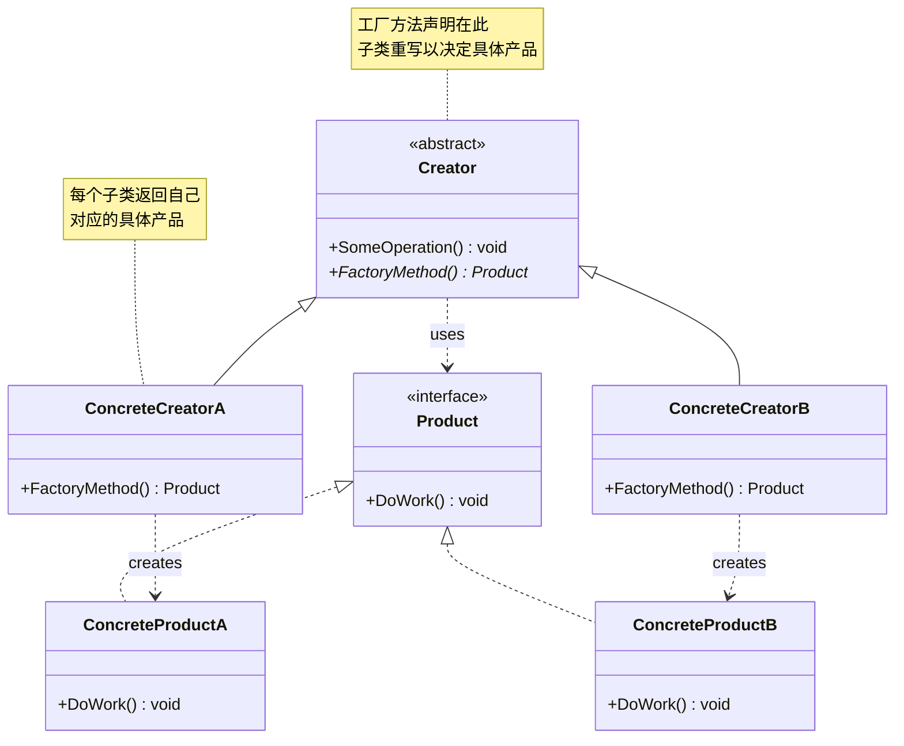
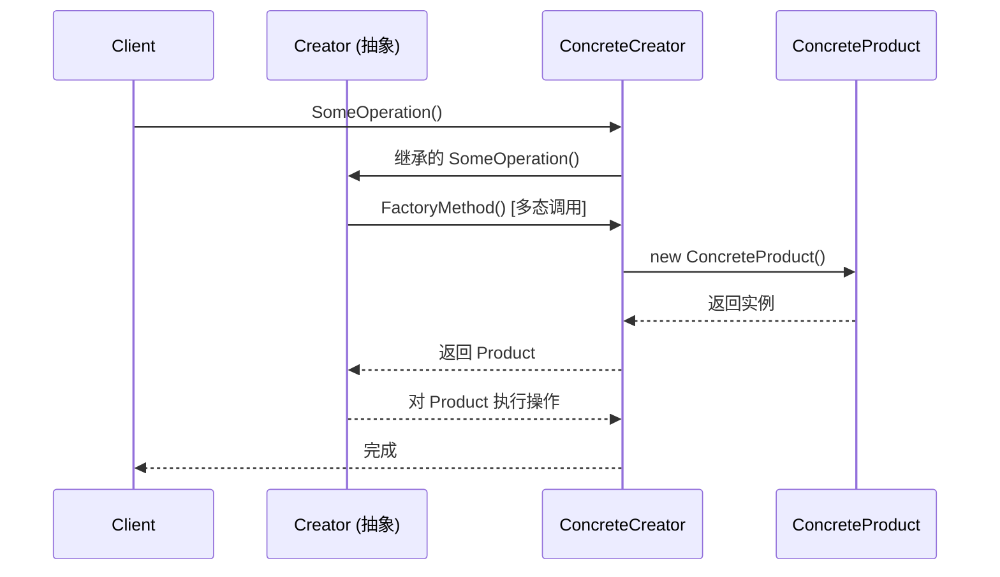
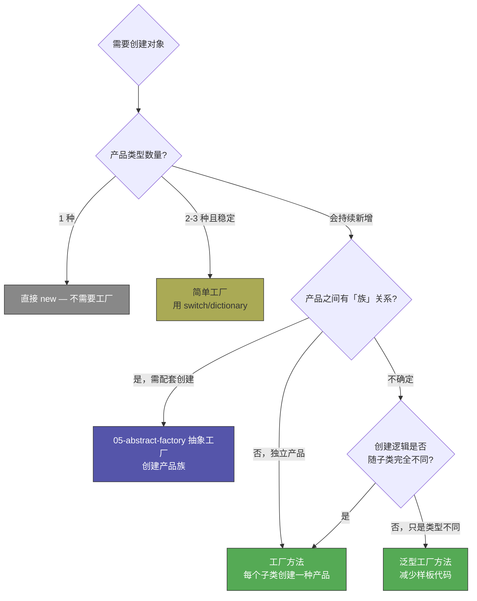

# 工厂方法模式

> 所属计划: [[design-patterns-csharp|设计模式 (C#)]]
> 预计耗时: 60 分钟
> 前置知识: [[02-creational-intro|创建型模式总览 + 简单工厂]]

---

## 1. 概念讲解

### 简单工厂的问题

[[02-creational-intro|上一篇]]介绍了简单工厂模式。简单工厂的核心是**一个工厂类根据参数决定创建哪个具体产品**。但它存在一个致命缺陷：违反开闭原则（OCP）。

```csharp
// 简单工厂：每新增一种文档格式，就要修改 switch 分支
public static class DocumentFactory
{
    public static IDocument Create(string format)
    {
        return format switch
        {
            "pdf"   => new PdfDocument(),
            "word"  => new WordDocument(),
            "excel" => new ExcelDocument(),
            // 新增 HTML？改这里——违反 OCP
            _ => throw new ArgumentException($"Unknown format: {format}")
        };
    }
}
```

每次新增产品类型都要修改工厂类的判断逻辑——这就是 OCP 所说的"对修改开放"。

### 工厂方法的核心思想

> 定义一个用于创建对象的接口，但**让子类决定**实例化哪一个类。工厂方法让类的实例化**推迟到子类**。

关键差异：

| 维度 | 简单工厂 | 工厂方法 |
|------|---------|---------|
| 谁做决定 | 工厂类（集中的 `switch`/`if`） | 子类（通过重写方法） |
| 新增产品 | 修改工厂类 | 新增子类，不修改已有代码 |
| OCP 符合性 | 违反 | 符合 |
| 类数量 | 少（1 个工厂 + N 个产品） | 多（N 个创建者 + N 个产品） |
| 适用场景 | 产品类型少且稳定 | 产品类型会持续扩展 |

### 结构



- **`Product`**（产品接口）：定义工厂方法所创建对象的接口
- **`ConcreteProduct`**（具体产品）：实现 `Product` 接口
- **`Creator`**（创建者抽象类）：声明工厂方法（返回 `Product`），可包含依赖工厂方法的业务逻辑
- **`ConcreteCreator`**（具体创建者）：重写工厂方法，返回一个具体的 `ConcreteProduct` 实例

> [!tip] Creator 不一定只有工厂方法
> 创建者通常还包含其他方法，这些方法调用工厂方法来获取产品，然后对产品执行操作。这种"骨架方法"实际上是**模板方法模式**的思想——两者经常一起出现。

### 运行时流程



---

## 2. 代码示例

### 示例 1：文档处理系统

完整可运行示例——文档创建器层次结构：

```csharp
using System;

#region 产品层次结构

/// <summary>产品接口 — 所有文档类型必须实现的契约</summary>
public interface IDocument
{
    string Format { get; }
    void Open(string path);
    void Save(string path);
    string Content { get; set; }
}

public class PdfDocument : IDocument
{
    public string Format => "PDF";
    public string Content { get; set; } = string.Empty;

    public void Open(string path)
        => Console.WriteLine($"[PDF] 打开文档: {path}");

    public void Save(string path)
        => Console.WriteLine($"[PDF] 保存文档到: {path} (Content: {Content})");
}

public class WordDocument : IDocument
{
    public string Format => "Word";
    public string Content { get; set; } = string.Empty;

    public void Open(string path)
        => Console.WriteLine($"[Word] 打开文档: {path}");

    public void Save(string path)
        => Console.WriteLine($"[Word] 保存文档到: {path} (Content: {Content})");
}

public class ExcelDocument : IDocument
{
    public string Format => "Excel";
    public string Content { get; set; } = string.Empty;

    public void Open(string path)
        => Console.WriteLine($"[Excel] 打开文档: {path}");

    public void Save(string path)
        => Console.WriteLine($"[Excel] 保存文档到: {path} (Content: {Content})");
}

#endregion

#region 创建者层次结构

/// <summary>抽象创建者 — 声明工厂方法，包含使用工厂方法的模板逻辑</summary>
public abstract class DocumentCreator
{
    // ═══ 工厂方法 ═══
    // 子类重写此方法以决定创建哪个具体产品
    protected abstract IDocument CreateDocument();

    // ═══ 模板方法 ═══
    // 使用工厂方法，但自身不关心具体产品类型
    public IDocument NewDocument(string path)
    {
        var doc = CreateDocument();          // 多态：子类决定类型

        Console.WriteLine($"创建了新 {doc.Format} 文档");
        doc.Open(path);
        doc.Content = $"由 {GetType().Name} 生成";
        return doc;
    }
}

public class PdfCreator : DocumentCreator
{
    protected override IDocument CreateDocument()
    {
        Console.WriteLine("  → PdfCreator 正在创建 PDF 文档...");
        return new PdfDocument();
    }
}

public class WordCreator : DocumentCreator
{
    protected override IDocument CreateDocument()
    {
        Console.WriteLine("  → WordCreator 正在创建 Word 文档...");
        return new WordDocument();
    }
}

public class ExcelCreator : DocumentCreator
{
    protected override IDocument CreateDocument()
    {
        Console.WriteLine("  → ExcelCreator 正在创建 Excel 文档...");
        return new ExcelDocument();
    }
}

#endregion

#region 客户端代码

public static class Program
{
    public static void Main()
    {
        // 客户端依赖抽象创建者，不关心具体文档类型
        ProcessDocument(new PdfCreator(),   "report.pdf");
        ProcessDocument(new WordCreator(),  "letter.docx");
        ProcessDocument(new ExcelCreator(), "data.xlsx");

        // 扩展：新增 HTML 导出只需新增一个 HtmlCreator，无需修改任何已有代码！
    }

    static void ProcessDocument(DocumentCreator creator, string path)
    {
        // 客户端不知道 creator 具体是哪个子类
        // 也不关心 NewDocument 内部创建了什么类型的 IDocument
        var doc = creator.NewDocument(path);
        doc.Save(path);
        Console.WriteLine();
    }
}

#endregion
```

**运行方式：**
```bash
dotnet new console -n FactoryMethodDemo
# 将上述代码放入 Program.cs（替换默认内容）
dotnet run --project FactoryMethodDemo
```

**预期输出：**
```text
  → PdfCreator 正在创建 PDF 文档...
创建了新 PDF 文档
[PDF] 打开文档: report.pdf
[PDF] 保存文档到: report.pdf (Content: 由 PdfCreator 生成)

  → WordCreator 正在创建 Word 文档...
创建了新 Word 文档
[Word] 打开文档: letter.docx
[Word] 保存文档到: letter.docx (Content: 由 WordCreator 生成)

  → ExcelCreator 正在创建 Excel 文档...
创建了新 Excel 文档
[Excel] 打开文档: data.xlsx
[Excel] 保存文档到: data.xlsx (Content: 由 ExcelCreator 生成)
```

> [!note] 观察 OCP 的体现
> 想支持 HTML 格式？只需新增 `HtmlDocument : IDocument` 和 `HtmlCreator : DocumentCreator`，**不需要修改** `DocumentCreator`、`IDocument`、`Program` 或任何已有的 `PdfCreator`/`WordCreator`/`ExcelCreator`。这就是"对扩展开放，对修改关闭"。

---

### 示例 2：泛型工厂方法

当具体产品和创建者是一一对应关系，且创建逻辑可以泛型化时，用泛型消除样板代码：

```csharp
using System;

public interface IReport
{
    string Generate();
}

public class SalesReport : IReport
{
    public string Generate() => "=== 销售报告 ===\nQ1 收入: $1.2M";
}

public class InventoryReport : IReport
{
    public string Generate() => "=== 库存报告 ===\nSKU 数量: 3,421";
}

public class HrReport : IReport
{
    public string Generate() => "=== 人事报告 ===\n员工总数: 248";
}

/// <summary>
/// 泛型创建者 — 使用 C# 泛型约束替代继承层次结构
/// 适用于"每个具体产品对应一个创建者，且创建逻辑一致"的场景
/// </summary>
public abstract class ReportCreator<TReport> where TReport : IReport, new()
{
    // 工厂方法返回具体类型（而非 IReport），调用方可获得强类型
    public virtual TReport CreateReport()
    {
        var report = new TReport();
        Console.WriteLine($"[{GetType().Name}] 正在生成 {typeof(TReport).Name}...");

        // 可以在这里做公共的初始化工作
        // 例如：注入数据源、设置配置、注册事件等

        return report;
    }

    // 如果子类需要自定义创建逻辑，重写此方法即可
}

// 简单场景下可以直接使用，无需子类
public class DefaultReportCreator<TReport> : ReportCreator<TReport>
    where TReport : IReport, new()
{
}

// 复杂场景下可以重写以添加额外逻辑
public class SalesReportCreator : ReportCreator<SalesReport>
{
    public override SalesReport CreateReport()
    {
        Console.WriteLine("应用销售报告特殊配置...");
        return base.CreateReport();
    }
}

public static class Program
{
    public static void Main()
    {
        // 方式一：默认创建者（无需编写子类）
        var inventoryCreator = new DefaultReportCreator<InventoryReport>();
        var report1 = inventoryCreator.CreateReport();
        Console.WriteLine(report1.Generate());
        Console.WriteLine();

        // 方式二：自定义创建者（可重写添加逻辑）
        var salesCreator = new SalesReportCreator();
        var report2 = salesCreator.CreateReport();
        Console.WriteLine(report2.Generate());
    }
}
```

**预期输出：**
```text
[DefaultReportCreator`1] 正在生成 InventoryReport...
=== 库存报告 ===
SKU 数量: 3,421

应用销售报告特殊配置...
[SalesReportCreator] 正在生成 SalesReport...
=== 销售报告 ===
Q1 收入: $1.2M
```

> [!tip] 泛型 vs 经典继承
> 当创建逻辑在多个子类中**完全相同**（只是产品类型不同），用泛型基类消除重复。当每个子类的创建逻辑**各不相同**（需要不同的构造参数、初始化步骤），用经典继承并各自重写工厂方法。

---

### 示例 3：异步工厂方法

现代 C# 中，工厂方法经常涉及 I/O 操作（读配置、调 API、连数据库）。这时需要返回 `Task<T>`：

```csharp
using System;
using System.Threading;
using System.Threading.Tasks;

public interface IConnection
{
    Task<string> ExecuteAsync(string command, CancellationToken ct = default);
}

public class SqlConnection : IConnection
{
    private readonly string _connectionString;

    public SqlConnection(string connectionString) => _connectionString = connectionString;

    public async Task<string> ExecuteAsync(string command, CancellationToken ct = default)
    {
        // 模拟数据库操作
        await Task.Delay(100, ct);
        return $"[SQL] 执行 '{command}' @ {_connectionString} → 结果集 (3 rows)";
    }
}

public class RedisConnection : IConnection
{
    private readonly string _connectionString;

    public RedisConnection(string connectionString) => _connectionString = connectionString;

    public async Task<string> ExecuteAsync(string command, CancellationToken ct = default)
    {
        await Task.Delay(50, ct);
        return $"[Redis] 执行 '{command}' @ {_connectionString} → OK";
    }
}

/// <summary>异步创建者 — 工厂方法返回 Task&lt;IProduct&gt;</summary>
public abstract class ConnectionFactory
{
    // 异步工厂方法：子类负责异步初始化连接
    protected abstract Task<IConnection> CreateConnectionAsync(CancellationToken ct = default);

    // 模板方法：获取连接 → 执行操作 → 清理
    public async Task<string> ExecuteCommandAsync(string command, CancellationToken ct = default)
    {
        // 异步创建（可能包含网络握手、认证等）
        var connection = await CreateConnectionAsync(ct);

        var result = await connection.ExecuteAsync(command, ct);
        Console.WriteLine($"  ✓ 操作完成");
        return result;
    }
}

public class SqlConnectionFactory : ConnectionFactory
{
    private readonly string _connStr;

    public SqlConnectionFactory(string connStr) => _connStr = connStr;

    protected override async Task<IConnection> CreateConnectionAsync(CancellationToken ct = default)
    {
        Console.WriteLine("  → 正在连接 SQL Server...");
        await Task.Delay(200, ct); // 模拟网络延迟 + 认证
        Console.WriteLine("  → SQL 连接已建立");
        return new SqlConnection(_connStr);
    }
}

public class RedisConnectionFactory : ConnectionFactory
{
    private readonly string _connStr;

    public RedisConnectionFactory(string connStr) => _connStr = connStr;

    protected override async Task<IConnection> CreateConnectionAsync(CancellationToken ct = default)
    {
        Console.WriteLine("  → 正在连接 Redis...");
        await Task.Delay(80, ct); // Redis 通常连接更快
        Console.WriteLine("  → Redis 连接已建立");
        return new RedisConnection(_connStr);
    }
}

public static class Program
{
    public static async Task Main()
    {
        using var cts = new CancellationTokenSource(TimeSpan.FromSeconds(5));

        var sqlFactory = new SqlConnectionFactory("Server=.;Database=AppDb");
        var result1 = await sqlFactory.ExecuteCommandAsync("SELECT * FROM Users", cts.Token);
        Console.WriteLine(result1);
        Console.WriteLine();

        var redisFactory = new RedisConnectionFactory("localhost:6379");
        var result2 = await redisFactory.ExecuteCommandAsync("GET user:42", cts.Token);
        Console.WriteLine(result2);
    }
}
```

**预期输出：**
```text
  → 正在连接 SQL Server...
  → SQL 连接已建立
  ✓ 操作完成
[SQL] 执行 'SELECT * FROM Users' @ Server=.;Database=AppDb → 结果集 (3 rows)

  → 正在连接 Redis...
  → Redis 连接已建立
  ✓ 操作完成
[Redis] 执行 'GET user:42' @ localhost:6379 → OK
```

> [!warning] 异步工厂方法不能是构造函数
> C# 构造函数不能是 `async`。工厂方法的优势之一就是可以包含异步初始化逻辑。如果需要 `async` 创建，工厂方法是最自然的选择。

---

### 决策流程图



> [!tip] 经验法则
> 当你发现自己在工厂类里写 `switch`，且每次加新功能就要加 `case` 时——考虑工厂方法。当你发现自己在为每种组合写工厂类，且工厂类数量 = 产品数量 × 产品族数量时——考虑抽象工厂。

---


---

## C++ 实现

C++ 中用纯虚函数声明工厂方法，子类重写以返回具体产品。使用 `std::unique_ptr` 管理所有权，避免手动 `delete`。

```cpp
#include <iostream>
#include <memory>
#include <string>
#include <vector>

using namespace std;

// === 产品接口 ===
struct Document {
    virtual string format() const = 0;
    virtual void open(const string& path) = 0;
    virtual void save(const string& path) = 0;
    virtual ~Document() = default;
};

// === 具体产品 ===
struct PdfDocument : Document {
    string format() const override { return "PDF"; }
    void open(const string& path) override {
        cout << "[PDF] 打开文档: " << path << endl;
    }
    void save(const string& path) override {
        cout << "[PDF] 保存文档到: " << path << endl;
    }
};

struct WordDocument : Document {
    string format() const override { return "Word"; }
    void open(const string& path) override {
        cout << "[Word] 打开文档: " << path << endl;
    }
    void save(const string& path) override {
        cout << "[Word] 保存文档到: " << path << endl;
    }
};

struct ExcelDocument : Document {
    string format() const override { return "Excel"; }
    void open(const string& path) override {
        cout << "[Excel] 打开文档: " << path << endl;
    }
    void save(const string& path) override {
        cout << "[Excel] 保存文档到: " << path << endl;
    }
};

// === 抽象创建者 ===
// 纯虚工厂方法 — 子类决定具体产品类型
class DocumentCreator {
public:
    virtual ~DocumentCreator() = default;

    // 工厂方法：子类重写决定具体产品
    virtual unique_ptr<Document> factoryMethod() = 0;

    // 模板方法：使用工厂方法，自身不关心具体类型
    unique_ptr<Document> newDocument(const string& path) {
        auto doc = factoryMethod();  // 多态调用
        cout << "创建了新 " << doc->format() << " 文档" << endl;
        doc->open(path);
        return doc;
    }
};

// === 具体创建者 ===
class PdfCreator : public DocumentCreator {
public:
    unique_ptr<Document> factoryMethod() override {
        return make_unique<PdfDocument>();
    }
};

class WordCreator : public DocumentCreator {
public:
    unique_ptr<Document> factoryMethod() override {
        return make_unique<WordDocument>();
    }
};

class ExcelCreator : public DocumentCreator {
public:
    unique_ptr<Document> factoryMethod() override {
        return make_unique<ExcelDocument>();
    }
};

// === 客户端 ===
void processDocument(DocumentCreator& creator, const string& path) {
    auto doc = creator.newDocument(path);  // 不知道具体类型
    doc->save(path);
    cout << endl;
}

// === main / usage ===
int main() {
    PdfCreator   pdfCreator;
    WordCreator  wordCreator;
    ExcelCreator excelCreator;

    processDocument(pdfCreator,   "report.pdf");
    processDocument(wordCreator,  "letter.docx");
    processDocument(excelCreator, "data.xlsx");

    // 扩展：新增 HtmlDocument + HtmlCreator 无需修改任何已有代码
}
```

**编译运行:**
```bash
g++ -std=c++17 -o prog main.cpp && ./prog
```

> [!note] C++ 特点
> - 工厂方法返回 `unique_ptr<Document>`，调用者获得独占所有权，RAII 保证不会泄漏。
> - `creator.newDocument()` 是模板方法模式的体现：骨架在基类，变化点（`factoryMethod()`）推迟到子类。
> - 新增产品只需添加新子类，不需修改 `DocumentCreator` 或 `processDocument`——符合 OCP。
## 3. 练习

### 练习 1：扩展文档工厂 — 添加 HTML 导出器

基于示例 1 的文档处理系统，添加 HTML 格式支持：

- 实现 `HtmlDocument : IDocument`（`Format` 返回 `"HTML"`）
- 实现 `HtmlCreator : DocumentCreator`（重写 `CreateDocument`）
- 在 `Main` 中调用 `ProcessDocument(new HtmlCreator(), "page.html")` 验证
- **关键约束**：不允许修改 `DocumentCreator`、`IDocument` 或任何已有的 Creator/Document 类

```csharp
// 你的任务：只添加新类，不修改已有代码
public class HtmlDocument : IDocument
{
    // 完成实现...
}

public class HtmlCreator : DocumentCreator
{
    // 完成实现...
}
```

### 练习 2：参数化工厂方法

示例 1 的工厂方法 `CreateDocument()` 不接受参数。在实际项目中，创建产品可能需要外部参数。实现一个**参数化工厂方法**：

```csharp
// 场景：文档创建需要指定页面大小和加密密码
public abstract class ParameterizedDocumentCreator
{
    // 工厂方法接受参数
    protected abstract IDocument CreateDocument(DocumentOptions options);

    public IDocument NewDocument(string path, DocumentOptions options)
    {
        var doc = CreateDocument(options);
        doc.Open(path);
        return doc;
    }
}

public class DocumentOptions
{
    public string PageSize { get; set; } = "A4";
    public string? Password { get; set; }
    public bool IsLandscape { get; set; }
}

// 你的任务：实现 PdfCreator 和 WordCreator（接受参数化选项）
// 要求：PdfCreator 使用 Password 参数设置文档加密
//       WordCreator 忽略 Password（Word 有自己的加密机制）
```

> [!tip] 提示
> 参数化工厂方法的一个陷阱是：不同子类需要的参数不同，导致抽象工厂方法签名过于宽泛。解决方案：使用配置对象（如上面的 `DocumentOptions`）或构造函数注入子类特定参数。

### 练习 3：工厂方法 + 依赖注入（可选挑战）

将工厂方法模式与 .NET 依赖注入容器集成。场景：一个报告生成服务需要根据配置动态选择报告类型。

```csharp
// 目标架构
public interface IReportGenerator
{
    string Generate(SalesData data);
}

// 多个实现：PdfReportGenerator, ExcelReportGenerator, HtmlReportGenerator

// 工厂接口
public interface IReportGeneratorFactory
{
    IReportGenerator Create(string format);
}

// 你的任务：
// 1. 实现 IReportGeneratorFactory，从 IServiceProvider 获取子工厂
// 2. 在 DI 容器中注册所有类型
// 3. 编写完整的 Program.cs（含 Host.CreateApplicationBuilder）

// 框架提示：
// - 使用 IEnumerable<IReportGenerator> 注入所有实现
// - 或使用 Keyed Services（.NET 8+）简化选择
// - 工厂本身也注册为 Singleton
```

> [!tip] .NET 8+ Keyed Services
> 使用 `builder.Services.AddKeyedSingleton<IReportGenerator, PdfReportGenerator>("pdf")` 可以避免手动写工厂的 switch/dictionary。但仍需理解工厂方法原理，才能判断何时用 Keyed Services、何时用自定义工厂。

---

## 4. 扩展阅读

- [[02-creational-intro|创建型模式总览 + 简单工厂]] — 简单工厂是理解工厂方法的前置知识
- [[05-abstract-factory|抽象工厂模式]] — 当产品有"族"关系时，工厂方法的自然升级
- [[06-builder|建造者模式]] — 当对象的创建步骤比类型选择更复杂时
- [Refactoring.Guru — Factory Method](https://refactoring.guru/design-patterns/factory-method) — 含伪代码和多语言对比
- [Microsoft — `IHttpClientFactory` 源码](https://github.com/dotnet/runtime/blob/main/src/libraries/Microsoft.Extensions.Http/src/DefaultHttpClientFactory.cs) — .NET 中最经典的工厂方法实践之一
- [Enterprise Integration Patterns — Message Factory](https://www.enterpriseintegrationpatterns.com/patterns/messaging/) — 工厂方法在消息队列、事件驱动架构中的应用
- [Dofactory — Factory Method in C#](https://www.dofactory.com/net/factory-method-design-pattern) — 含 .NET 优化写法

---

## 常见陷阱

### 陷阱 1：只有 1-2 种产品时使用工厂方法

```csharp
// ❌ 过度工程：只有两种产品，直接 if/switch 更清晰
public abstract class LoggerCreator
{
    protected abstract ILogger CreateLogger();
}

public class ConsoleLoggerCreator : LoggerCreator
{
    protected override ILogger CreateLogger() => new ConsoleLogger();
}

public class FileLoggerCreator : LoggerCreator
{
    protected override ILogger CreateLogger() => new FileLogger("app.log");
}

// ✅ 这种规模用简单工厂或直接 new 即可
public static class LoggerFactory
{
    public static ILogger Create(string type) => type switch
    {
        "console" => new ConsoleLogger(),
        "file"    => new FileLogger("app.log"),
        _ => throw new ArgumentException($"Unknown logger type: {type}")
    };
}
```

> [!warning] 判断标准
> 如果你能确定产品类型**在可预见的未来不会超过 3 种**，且新增类型时会同时修改配套基础设施（不只是工厂），那么简单工厂足够。工厂方法的价值在类型数量 ≥ 4 且持续增长时才会体现。

### 陷阱 2：创建者层次结构爆炸

```csharp
// ❌ 创建者层次结构失控 — 每种组合一个子类
public abstract class ReportCreator { protected abstract IReport CreateReport(); }
public class PdfSalesReportCreator : ReportCreator { /* ... */ }
public class PdfInventoryReportCreator : ReportCreator { /* ... */ }
public class PdfHrReportCreator : ReportCreator { /* ... */ }
public class ExcelSalesReportCreator : ReportCreator { /* ... */ }
public class ExcelInventoryReportCreator : ReportCreator { /* ... */ }
public class ExcelHrReportCreator : ReportCreator { /* ... */ }
// 3 种格式 × 3 种报告 = 9 个 Creator 子类 —— 组合爆炸！

// ✅ 解决方案：泛型工厂方法 + 参数化
public class ReportCreator<TFormat, TReport>
    where TFormat : IReportFormat, new()
    where TReport : IReportData
{
    public IReport CreateReport(TReport data)
    {
        var format = new TFormat();
        return format.Render(data);
    }
}

// 或使用抽象工厂（见下一章）
```

### 陷阱 3：工厂方法不返回接口

```csharp
// ❌ 工厂方法返回具体类型 — 失去多态性
public abstract class DocumentCreator
{
    // 返回 PdfDocument 而不是 IDocument！
    protected abstract PdfDocument CreateDocument();
}

// 子类被锁定为只能创建 PdfDocument，工厂方法失去意义

// ✅ 返回抽象/接口
public abstract class DocumentCreator
{
    protected abstract IDocument CreateDocument(); // 子类可以返回任何 IDocument
}
```

> [!important] 工厂方法的灵魂是接口
> 如果工厂方法返回具体类型，那它只是一个普通的 `new` 包装器，完全失去了"子类可以替换产品类型"的灵活性。**工厂方法的返回类型必须是抽象（接口或抽象类）**。

### 陷阱 4：把参数放进工厂方法签名

```csharp
// ❌ 工厂方法签名过于具体，限制子类
public abstract class DocumentCreator
{
    protected abstract IDocument CreateDocument(
        string filePath, string author, DateTime created,
        int pageCount, bool encrypted, string watermark);
}
// 子类可能不需要某些参数 → 违反 ISP

// ✅ 方案一：构造时注入创建者特定的参数
public abstract class DocumentCreator
{
    protected abstract IDocument CreateDocument();
}

public class PdfCreator : DocumentCreator
{
    private readonly PdfOptions _options;
    public PdfCreator(PdfOptions options) => _options = options;
    // 构造时提供参数，工厂方法保持干净
    protected override IDocument CreateDocument()
        => new PdfDocument(_options.EncryptionKey, _options.Watermark);
}

// ✅ 方案二：使用配置对象（见练习 2）
protected abstract IDocument CreateDocument(DocumentOptions options);
```

### 陷阱 5：在 Creator 基类中写死产品类型

```csharp
// ❌ 基类直接 new 具体产品 — 这不是工厂方法
public abstract class DocumentCreator
{
    public IDocument NewDocument()
    {
        var doc = new PdfDocument(); // 写死了 PDF！
        return doc;
    }
}

// ✅ 工厂方法必须由子类决定
public abstract class DocumentCreator
{
    public IDocument NewDocument()
    {
        var doc = CreateDocument(); // 调用抽象方法，多态分发
        return doc;
    }

    protected abstract IDocument CreateDocument();
}
```
