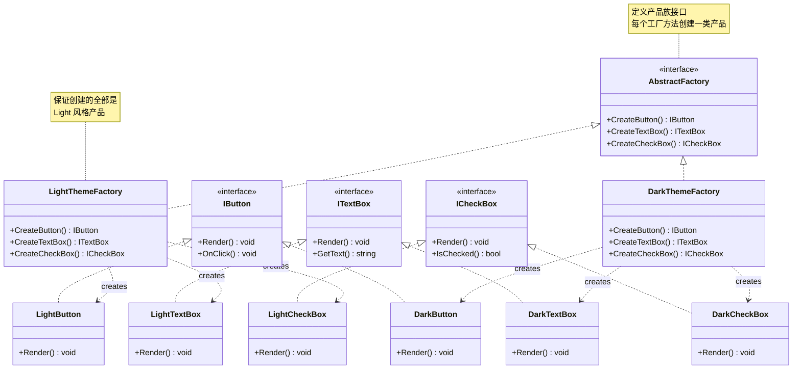
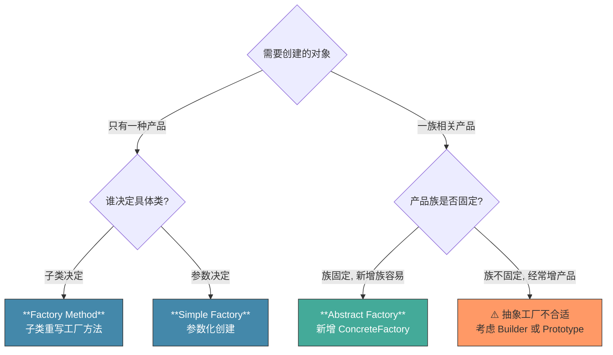

# 抽象工厂模式 Abstract Factory

> 所属计划: [[design-patterns-csharp|设计模式 (C#)]]
> 预计耗时: 60 分钟
> 前置知识: [[04-factory-method|工厂方法模式]]

---

## 1. 概念讲解

### 从工厂方法到抽象工厂

[[04-factory-method|工厂方法模式]]解决的是"**创建哪个具体产品**"的问题 — 一个工厂层次只生产**一种**产品。但现实项目中，产品往往成**族**出现：

- **UI 主题**：Light 主题的按钮、文本框、复选框 **必须配套**；混搭 Light 按钮 + Dark 文本框是灾难
- **数据库访问**：SQL Server 的 `Connection` 必须搭配 `SqlCommand`，塞给 `NpgsqlConnection` 会炸
- **跨平台 UI**：Windows 按钮 + macOS 菜单 = 不可用

**核心问题**：如何保证客户端创建的是一族**相互匹配**的产品，而不是"东拼西凑"？

### 什么是抽象工厂？

抽象工厂提供一个接口，用于创建**一系列相关或相互依赖的对象**，而无需指定它们的具体类。



### 四个关键角色

| 角色 | 职责 | 示例 |
|------|------|------|
| **AbstractFactory** | 声明创建**所有**抽象产品的接口 | `IThemeFactory` |
| **ConcreteFactory** | 实现创建**一整套**具体产品的方法 | `LightThemeFactory` |
| **AbstractProduct** | 声明**一类**产品的接口 | `IButton` |
| **ConcreteProduct** | 具体产品，由对应 ConcreteFactory 创建 | `LightButton` |

### 什么时候用抽象工厂 vs 工厂方法？



> [!tip] 关键判断标准
> 如果新增一个"产品类型"（比如 UI 组件族里加一个 `ISlider`）需要修改**所有**已有 ConcreteFactory，那抽象工厂不是好选择。抽象工厂擅长：**产品类型固定，但需要换整套实现**（换数据库、换主题、换平台）。

---

## 2. 代码示例

### 示例 1：UI 主题工厂

完整可运行的控制台程序：

```csharp
// ============================================================
// 抽象产品接口 — 一族 UI 组件
// ============================================================
public interface IButton
{
    void Render();
}

public interface ITextBox
{
    void Render();
}

public interface ICheckBox
{
    void Render();
}

// ============================================================
// 抽象工厂接口 — 创建一族产品
// ============================================================
public interface IThemeFactory
{
    IButton CreateButton();
    ITextBox CreateTextBox();
    ICheckBox CreateCheckBox();
}

// ============================================================
// Light 主题 — 具体产品
// ============================================================
public class LightButton : IButton
{
    public void Render() => Console.WriteLine("  [ Light Button ] — #FFFFFF bg, #333333 text");
}

public class LightTextBox : ITextBox
{
    public void Render() => Console.WriteLine("  [ Light TextBox ] — #F5F5F5 bg, #333333 border");
}

public class LightCheckBox : ICheckBox
{
    public void Render() => Console.WriteLine("  [ Light CheckBox ] — ☐ with #333333 label");
}

// ============================================================
// Dark 主题 — 具体产品
// ============================================================
public class DarkButton : IButton
{
    public void Render() => Console.WriteLine("  [ Dark Button ] — #333333 bg, #E0E0E0 text");
}

public class DarkTextBox : ITextBox
{
    public void Render() => Console.WriteLine("  [ Dark TextBox ] — #1E1E1E bg, #888888 border");
}

public class DarkCheckBox : ICheckBox
{
    public void Render() => Console.WriteLine("  [ Dark CheckBox ] — ☐ with #E0E0E0 label");
}

// ============================================================
// 具体工厂 — 保证一族产品配套
// ============================================================
public class LightThemeFactory : IThemeFactory
{
    public IButton CreateButton() => new LightButton();
    public ITextBox CreateTextBox() => new LightTextBox();
    public ICheckBox CreateCheckBox() => new LightCheckBox();
}

public class DarkThemeFactory : IThemeFactory
{
    public IButton CreateButton() => new DarkButton();
    public ITextBox CreateTextBox() => new DarkTextBox();
    public ICheckBox CreateCheckBox() => new DarkCheckBox();
}

// ============================================================
// 客户端 — 只依赖抽象，不知道具体主题
// ============================================================
public class LoginForm
{
    private readonly IButton _loginButton;
    private readonly ITextBox _usernameBox;
    private readonly ITextBox _passwordBox;
    private readonly ICheckBox _rememberMe;

    public LoginForm(IThemeFactory factory)
    {
        _loginButton = factory.CreateButton();
        _usernameBox = factory.CreateTextBox();
        _passwordBox = factory.CreateTextBox();
        _rememberMe = factory.CreateCheckBox();
    }

    public void Render()
    {
        Console.WriteLine("=== Login Form ===");
        _usernameBox.Render();
        _passwordBox.Render();
        _rememberMe.Render();
        _loginButton.Render();
        Console.WriteLine("===================");
    }
}

// ============================================================
// 运行入口
// ============================================================
Console.WriteLine("--- Light Theme ---");
new LoginForm(new LightThemeFactory()).Render();

Console.WriteLine();
Console.WriteLine("--- Dark Theme ---");
new LoginForm(new DarkThemeFactory()).Render();
```

**运行方式:**
```bash
dotnet new console -n AbstractFactoryDemo
# 将上述代码放入 Program.cs
dotnet run --project AbstractFactoryDemo
```

**预期输出:**
```text
--- Light Theme ---
=== Login Form ===
  [ Light TextBox ] — #F5F5F5 bg, #333333 border
  [ Light TextBox ] — #F5F5F5 bg, #333333 border
  [ Light CheckBox ] — ☐ with #333333 label
  [ Light Button ] — #FFFFFF bg, #333333 text
===================

--- Dark Theme ---
=== Login Form ===
  [ Dark TextBox ] — #1E1E1E bg, #888888 border
  [ Dark TextBox ] — #1E1E1E bg, #888888 border
  [ Dark CheckBox ] — ☐ with #E0E0E0 label
  [ Dark Button ] — #333333 bg, #E0E0E0 text
===================
```

### 示例 2：数据库提供者工厂

更接近真实项目的抽象工厂 — 切换数据库时，`Connection`、`Command`、`DataAdapter` 全部配套：

```csharp
// ============================================================
// 抽象产品
// ============================================================
public interface IDbConnection
{
    void Open();
    void Close();
}

public interface IDbCommand
{
    void Execute(string sql);
    object? GetResult();
}

public interface IDataAdapter
{
    System.Data.DataSet Fill(string query);
}

// ============================================================
// 抽象工厂
// ============================================================
public interface IDatabaseFactory
{
    IDbConnection CreateConnection(string connectionString);
    IDbCommand CreateCommand(string sql, IDbConnection connection);
    IDataAdapter CreateDataAdapter(IDbCommand command);
}

// ============================================================
// SQL Server 产品族
// ============================================================
public class SqlConnection : IDbConnection
{
    private readonly string _connStr;
    public SqlConnection(string connStr) => _connStr = connStr;

    public void Open() => Console.WriteLine($"[SQL] Opening connection to {_connStr[..Math.Min(20, _connStr.Length)]}...");
    public void Close() => Console.WriteLine("[SQL] Connection closed.");
}

public class SqlCommand : IDbCommand
{
    private readonly string _sql;
    private readonly IDbConnection _connection;

    public SqlCommand(string sql, IDbConnection connection)
    {
        _sql = sql;
        _connection = connection;
    }

    public void Execute(string sql) => Console.WriteLine($"[SQL] Executing: {sql}");
    public object? GetResult() => "SQL Server result set";
}

public class SqlDataAdapter : IDataAdapter
{
    private readonly IDbCommand _command;

    public SqlDataAdapter(IDbCommand command) => _command = command;

    public System.Data.DataSet Fill(string query)
    {
        Console.WriteLine($"[SQL] Filling DataSet from: {query}");
        return new System.Data.DataSet("SQL_Result");
    }
}

// ============================================================
// PostgreSQL 产品族
// ============================================================
public class NpgsqlConnection : IDbConnection
{
    private readonly string _connStr;
    public NpgsqlConnection(string connStr) => _connStr = connStr;

    public void Open() => Console.WriteLine($"[PG] Opening connection to {_connStr[..Math.Min(20, _connStr.Length)]}...");
    public void Close() => Console.WriteLine("[PG] Connection closed.");
}

public class NpgsqlCommand : IDbCommand
{
    private readonly string _sql;
    private readonly IDbConnection _connection;

    public NpgsqlCommand(string sql, IDbConnection connection)
    {
        _sql = sql;
        _connection = connection;
    }

    public void Execute(string sql) => Console.WriteLine($"[PG] Executing: {sql}");
    public object? GetResult() => "PostgreSQL result set";
}

public class NpgsqlDataAdapter : IDataAdapter
{
    private readonly IDbCommand _command;

    public NpgsqlDataAdapter(IDbCommand command) => _command = command;

    public System.Data.DataSet Fill(string query)
    {
        Console.WriteLine($"[PG] Filling DataSet from: {query}");
        return new System.Data.DataSet("PG_Result");
    }
}

// ============================================================
// 具体工厂
// ============================================================
public class SqlServerFactory : IDatabaseFactory
{
    public IDbConnection CreateConnection(string connStr) => new SqlConnection(connStr);
    public IDbCommand CreateCommand(string sql, IDbConnection conn) => new SqlCommand(sql, conn);
    public IDataAdapter CreateDataAdapter(IDbCommand cmd) => new SqlDataAdapter(cmd);
}

public class PostgreSqlFactory : IDatabaseFactory
{
    public IDbConnection CreateConnection(string connStr) => new NpgsqlConnection(connStr);
    public IDbCommand CreateCommand(string sql, IDbConnection conn) => new NpgsqlCommand(sql, conn);
    public IDataAdapter CreateDataAdapter(IDbCommand cmd) => new NpgsqlDataAdapter(cmd);
}

// ============================================================
// 客户端 — 数据仓储
// ============================================================
public class UserRepository
{
    private readonly IDatabaseFactory _dbFactory;
    private readonly string _connStr;

    public UserRepository(IDatabaseFactory dbFactory, string connStr)
    {
        _dbFactory = dbFactory;
        _connStr = connStr;
    }

    public System.Data.DataSet GetActiveUsers()
    {
        var conn = _dbFactory.CreateConnection(_connStr);
        conn.Open();

        var cmd = _dbFactory.CreateCommand("SELECT * FROM Users WHERE Active = 1", conn);
        var adapter = _dbFactory.CreateDataAdapter(cmd);

        var result = adapter.Fill("SELECT * FROM Users WHERE Active = 1");

        conn.Close();
        return result;
    }
}

// 使用
var repo = new UserRepository(new SqlServerFactory(), "Server=.;Database=App;");
repo.GetActiveUsers();
```

### 示例 3：用 C# `record` 类型做不可变产品

抽象工厂创建的产品不一定是服务类——配合 `record` 可创建**不可变配置对象族**：

```csharp
// ============================================================
// 抽象产品 — 用 record 确保不可变
// ============================================================
public abstract record ConnectionConfig(string Host, int Port, string Database);

public record SqlServerConfig(string Host, int Port, string Database, bool TrustedConnection)
    : ConnectionConfig(Host, Port, Database);

public record PostgreSqlConfig(string Host, int Port, string Database, string Schema)
    : ConnectionConfig(Host, Port, Database);

// ============================================================
// 抽象工厂 — 创建一族配置对象
// ============================================================
public interface IDbConfigFactory
{
    ConnectionConfig CreateConfig(string host, int port, string db);
    string BuildConnectionString(ConnectionConfig config);
}

public class SqlServerConfigFactory : IDbConfigFactory
{
    public ConnectionConfig CreateConfig(string host, int port, string db)
        => new SqlServerConfig(host, port, db, TrustedConnection: true);

    public string BuildConnectionString(ConnectionConfig config)
    {
        var cfg = (SqlServerConfig)config;
        return $"Server={cfg.Host},{cfg.Port};Database={cfg.Database};Trusted_Connection={cfg.TrustedConnection}";
    }
}

public class PostgreSqlConfigFactory : IDbConfigFactory
{
    public ConnectionConfig CreateConfig(string host, int port, string db)
        => new PostgreSqlConfig(host, port, db, Schema: "public");

    public string BuildConnectionString(ConnectionConfig config)
    {
        var cfg = (PostgreSqlConfig)config;
        return $"Host={cfg.Host};Port={cfg.Port};Database={cfg.Database};SearchPath={cfg.Schema}";
    }
}

// 使用
IDbConfigFactory factory = new SqlServerConfigFactory();
var config = factory.CreateConfig("localhost", 1433, "MyApp");
Console.WriteLine(factory.BuildConnectionString(config));
// Output: Server=localhost,1433;Database=MyApp;Trusted_Connection=True
```

> [!tip] `record` 的优势
> - **值相等**：`record` 按值比较，不是引用 — 适合做配置快照
> - **不可变**：`init` 属性默认不可变，避免工厂创建后被意外修改
> - **`with` 表达式**：客户端可以用 `config with { Port = 5432 }` 创建变体而不影响原对象

---


---

## C++ 实现

C++ 中用纯虚基类定义抽象工厂接口，具体工厂实现整套产品的创建。`unique_ptr` 管理产品生命周期，移动语义避免拷贝。

```cpp
#include <iostream>
#include <memory>
#include <string>

using namespace std;

// === 抽象产品 ===
struct Button {
    virtual void render() const = 0;
    virtual ~Button() = default;
};

struct Checkbox {
    virtual void render() const = 0;
    virtual ~Checkbox() = default;
};

// === 抽象工厂 ===
struct GUIFactory {
    virtual unique_ptr<Button> createButton() = 0;
    virtual unique_ptr<Checkbox> createCheckbox() = 0;
    virtual ~GUIFactory() = default;
};

// === Windows 具体产品 ===
struct WindowsButton : Button {
    void render() const override {
        cout << "  [Windows Button] — Win32 style" << endl;
    }
};

struct WindowsCheckbox : Checkbox {
    void render() const override {
        cout << "  [Windows Checkbox] — Win32 check" << endl;
    }
};

// === Mac 具体产品 ===
struct MacButton : Button {
    void render() const override {
        cout << "  [Mac Button] — Cocoa aqua style" << endl;
    }
};

struct MacCheckbox : Checkbox {
    void render() const override {
        cout << "  [Mac Checkbox] — Cocoa check" << endl;
    }
};

// === 具体工厂 ===
class WindowsFactory : public GUIFactory {
public:
    unique_ptr<Button> createButton() override {
        return make_unique<WindowsButton>();
    }
    unique_ptr<Checkbox> createCheckbox() override {
        return make_unique<WindowsCheckbox>();
    }
};

class MacFactory : public GUIFactory {
public:
    unique_ptr<Button> createButton() override {
        return make_unique<MacButton>();
    }
    unique_ptr<Checkbox> createCheckbox() override {
        return make_unique<MacCheckbox>();
    }
};

// === 客户端 — 只依赖抽象，不关心具体平台 ===
class LoginForm {
    unique_ptr<Button>   loginBtn_;
    unique_ptr<Checkbox> rememberMe_;
public:
    explicit LoginForm(GUIFactory& factory)
        : loginBtn_(factory.createButton())
        , rememberMe_(factory.createCheckbox()) {}

    void render() const {
        cout << "=== Login Form ===" << endl;
        loginBtn_->render();
        rememberMe_->render();
        cout << "===================" << endl;
    }
};

// === main / usage ===
int main() {
    cout << "--- Windows Theme ---" << endl;
    WindowsFactory winFactory;
    LoginForm(winFactory).render();

    cout << endl << "--- Mac Theme ---" << endl;
    MacFactory macFactory;
    LoginForm(macFactory).render();
}
```

**编译运行:**
```bash
g++ -std=c++17 -o prog main.cpp && ./prog
```

> [!note] C++ 特点
> - 产物是完整的一族对象（Button + Checkbox），通过同一个 `GUIFactory` 创建，杜绝混搭。
> - 新增平台（如 Linux）只需新增 `LinuxFactory` + `LinuxButton` + `LinuxCheckbox`，`LoginForm` 无需修改。
> - 抽象工厂的接口"宽度"是设计关键：新增一个产品（如 `Slider`）需修改所有工厂类——不适合产品类型频繁变化的场景。
## 3. 练习

### 练习 1：添加 High Contrast 主题

在示例 1 的基础上，添加第三种主题 `HighContrastThemeFactory`，要求：

- 每类控件渲染时带有 `[HC]` 前缀
- 按钮用亮黄色背景 (`#FFFF00`)、黑色文字
- `LoginForm` 无需修改任何代码即可切换主题

**验证**：
```csharp
// 只需改这一行，整个表单切换到高对比主题
new LoginForm(new HighContrastThemeFactory()).Render();
```

### 练习 2：泛型抽象工厂

改造数据库工厂，用泛型约束让编译器帮你检查"产品族约束"：

```csharp
// 提示：用泛型约束工厂只生产一族产品
public interface IGenericFactory<TConnection, TCommand, TAdapter>
    where TConnection : IDbConnection
    where TCommand : IDbCommand
    where TAdapter : IDataAdapter
{
    TConnection CreateConnection(string connStr);
    TCommand CreateCommand(string sql, TConnection connection);
    TAdapter CreateDataAdapter(TCommand command);
}
```

思考：
- 泛型版本相比接口版本，优势和劣势分别是什么？
- 什么时候用泛型约束比接口更合适？

### 练习 3：配置驱动工厂选择（可选）

实现一个 `ThemeFactoryProvider`，从 `appsettings.json` 读取当前主题名，动态创建对应的 ConcreteFactory：

```json
{
  "UI": {
    "Theme": "Dark"
  }
}
```

```csharp
public static class ThemeFactoryProvider
{
    public static IThemeFactory CreateFromConfig()
    {
        // 读取配置，根据 "Light" / "Dark" / "HighContrast" 返回对应工厂
        // 提示：可用反射或字典注册避免 switch
    }
}
```

额外挑战：让新增主题时只需加一行字典注册，不改 `CreateFromConfig` 方法（符合 OCP）。

---
## 3.5 参考答案

> [!tip]- 练习 1 参考答案
> 添加 High Contrast 主题——完全通过新增代码实现，不改动已有类：
>
> ```csharp
> // ═══════════════════════════════════════════════
> // High Contrast 具体产品 — 每类控件带 [HC] 前缀
> // ═══════════════════════════════════════════════
> public class HighContrastButton : IButton
> {
>     public void Render()
>         => Console.WriteLine("  [HC] [ Button ] — #FFFF00 bg, #000000 text");
> }
>
> public class HighContrastTextBox : ITextBox
> {
>     public void Render()
>         => Console.WriteLine("  [HC] [ TextBox ] — #000000 bg, #FFFF00 border, #FFFFFF text");
> }
>
> public class HighContrastCheckBox : ICheckBox
> {
>     public void Render()
>         => Console.WriteLine("  [HC] [ CheckBox ] — ☑ with #FFFF00 mark, #FFFFFF label");
> }
>
> // ═══════════════════════════════════════════════
> // High Contrast 具体工厂 — 保证全套 HC 风格产品
> // ═══════════════════════════════════════════════
> public class HighContrastThemeFactory : IThemeFactory
> {
>     public IButton CreateButton() => new HighContrastButton();
>     public ITextBox CreateTextBox() => new HighContrastTextBox();
>     public ICheckBox CreateCheckBox() => new HighContrastCheckBox();
> }
>
> // ═══════════════════════════════════════════════
> // 验证 — LoginForm 一行不改
> // ═══════════════════════════════════════════════
> Console.WriteLine("--- High Contrast Theme ---");
> new LoginForm(new HighContrastThemeFactory()).Render();
> // 输出:
> // === Login Form ===
> //   [HC] [ TextBox ] — #000000 bg, #FFFF00 border, #FFFFFF text
> //   [HC] [ TextBox ] — #000000 bg, #FFFF00 border, #FFFFFF text
> //   [HC] [ CheckBox ] — ☑ with #FFFF00 mark, #FFFFFF label
> //   [HC] [ Button ] — #FFFF00 bg, #000000 text
> // ===================
> ```
>
> **OCP 验证：** `LoginForm` 的构造函数接受 `IThemeFactory`，渲染逻辑完全不变。新增主题只需实现 `IThemeFactory` + 3 个具体产品（4 个新类），已有的 `LightThemeFactory`、`DarkThemeFactory` 及其产品类全部无需修改。

> [!tip]- 练习 2 参考答案
> **泛型抽象工厂的实现：**
>
> ```csharp
> // ═══ 泛型数据库工厂 ═══
> public interface IGenericFactory<TConnection, TCommand, TAdapter>
>     where TConnection : IDbConnection
>     where TCommand : IDbCommand
>     where TAdapter : IDataAdapter
> {
>     TConnection CreateConnection(string connStr);
>     TCommand CreateCommand(string sql, TConnection connection);
>     TAdapter CreateDataAdapter(TCommand command);
> }
>
> // ═══ SQL Server 族 — 编译器保证返回类型配套 ═══
> public class SqlGenericFactory : IGenericFactory<SqlConnection, SqlCommand, SqlDataAdapter>
> {
>     public SqlConnection CreateConnection(string connStr) => new SqlConnection(connStr);
>     public SqlCommand CreateCommand(string sql, SqlConnection conn) => new SqlCommand(sql, conn);
>     public SqlDataAdapter CreateDataAdapter(SqlCommand cmd) => new SqlDataAdapter(cmd);
> }
>
> // ═══ PostgreSQL 族 ═══
> public class PostgreSqlGenericFactory
>     : IGenericFactory<NpgsqlConnection, NpgsqlCommand, NpgsqlDataAdapter>
> {
>     public NpgsqlConnection CreateConnection(string connStr) => new NpgsqlConnection(connStr);
>     public NpgsqlCommand CreateCommand(string sql, NpgsqlConnection conn)
>         => new NpgsqlCommand(sql, conn);
>     public NpgsqlDataAdapter CreateDataAdapter(NpgsqlCommand cmd)
>         => new NpgsqlDataAdapter(cmd);
> }
>
> // ═══ 使用泛型工厂的客户端 — 获得编译期类型安全 ═══
> public class GenericUserRepository<TConnection, TCommand, TAdapter>
>     where TConnection : IDbConnection
>     where TCommand : IDbCommand
>     where TAdapter : IDataAdapter
> {
>     private readonly IGenericFactory<TConnection, TCommand, TAdapter> _factory;
>     private readonly string _connStr;
>
>     public GenericUserRepository(
>         IGenericFactory<TConnection, TCommand, TAdapter> factory,
>         string connStr)
>     {
>         _factory = factory;
>         _connStr = connStr;
>     }
>
>     public DataSet GetActiveUsers()
>     {
>         var conn = _factory.CreateConnection(_connStr);  // 返回 TConnection，非 IDbConnection
>         conn.Open();
>
>         // 编译器保证 TCommand 和 TConnection 配套！
>         // 不会出现 SqlCommand 传 NpgsqlConnection 的情况
>         var cmd = _factory.CreateCommand("SELECT * FROM Users", conn);
>         var adapter = _factory.CreateDataAdapter(cmd);
>
>         var result = adapter.Fill("SELECT * FROM Users WHERE Active = 1");
>         conn.Close();
>         return result;
>     }
> }
>
> // 使用
> var repo = new GenericUserRepository<SqlConnection, SqlCommand, SqlDataAdapter>(
>     new SqlGenericFactory(), "Server=.;Database=App;");
> repo.GetActiveUsers();
> ```
>
> **思考分析：**
>
> **泛型版本的优势：**
> - **编译期类型安全**：`CreateCommand` 返回 `TCommand`，参数也要求 `TConnection`——编译器阻止了"拿 SqlConnection 传给 NpgsqlCommand"这种运行时才能发现的错误
> - **消除运行时类型转换**：调用方获得具体类型而非接口，可以访问产品特有的方法/属性（如果暴露的话），无需 `is`/`as`/强制转换
> - **更清晰的 API 契约**：泛型约束 `where TConnection : IDbConnection` 明确声明"这个工厂只创建实现这些接口的一组类型"
>
> **泛型版本的劣势：**
> - **客户端也变成泛型**：`GenericUserRepository<TConnection, TCommand, TAdapter>` 的类型参数传播到所有使用方，增加模板代码
> - **DI 注册复杂**：容器注册 `IGenericFactory<SqlConnection, SqlCommand, SqlDataAdapter>` 不如 `IDatabaseFactory` 直接
> - **早期绑定限制灵活性**：运行时根据配置切换数据库需要反射或条件注册；接口版本只需 `IDatabaseFactory factory = GetFromConfig()` 更简单
>
> **适用场景判断：**
> - **用泛型**：当调用方确实需要具体类型（如访问 `SqlCommand` 特有的 `Parameters` 集合），且工厂族在编译期就能确定
> - **用接口**：当需要运行时动态切换工厂（配置驱动），且调用方只依赖抽象接口的方法
> - **经验法则**：大多数业务代码用接口版本即可；泛型版本适合编写**基础设施/框架层**代码，为上层提供类型安全的工厂抽象

> [!tip]- 练习 3 参考答案（可选）
> 配置驱动工厂选择——支持动态切换主题，且新增主题只需注册，不改 `CreateFromConfig`：
>
> ```csharp
> using Microsoft.Extensions.Configuration;
>
> public static class ThemeFactoryProvider
> {
>     // ═══ 字典注册：新增主题只需加一行 ═══
>     private static readonly Dictionary<string, Func<IThemeFactory>> _factories = new()
>     {
>         ["Light"]         = () => new LightThemeFactory(),
>         ["Dark"]          = () => new DarkThemeFactory(),
>         ["HighContrast"]  = () => new HighContrastThemeFactory(),
>     };
>
>     /// <summary>
>     /// 外部可注册自定义主题（OCP：不改 CreateFromConfig）
>     /// </summary>
>     public static void Register(string name, Func<IThemeFactory> factory)
>     {
>         _factories[name] = factory;
>     }
>
>     /// <summary>
>     /// 从 appsettings.json 读取 UI:Theme 配置项，返回对应工厂
>     /// </summary>
>     public static IThemeFactory CreateFromConfig()
>     {
>         var config = new ConfigurationBuilder()
>             .SetBasePath(Directory.GetCurrentDirectory())
>             .AddJsonFile("appsettings.json", optional: false)
>             .Build();
>
>         var theme = config["UI:Theme"];
>         if (string.IsNullOrWhiteSpace(theme))
>             throw new InvalidOperationException(
>                 "UI:Theme is missing in appsettings.json. Expected one of: " +
>                 string.Join(", ", _factories.Keys));
>
>         if (!_factories.TryGetValue(theme, out var factory))
>             throw new InvalidOperationException(
>                 $"Unknown theme: '{theme}'. Available themes: " +
>                 string.Join(", ", _factories.Keys));
>
>         return factory();
>     }
> }
>
> // ═══ 使用 ═══
> // appsettings.json:
> // {
> //   "UI": {
> //     "Theme": "Dark"
> //   }
> // }
>
> IThemeFactory themeFactory = ThemeFactoryProvider.CreateFromConfig();
> new LoginForm(themeFactory).Render();
>
> // ═══ 扩展：新增 "Blue" 主题，不改 CreateFromConfig ═══
> // 1. 实现 BlueThemeFactory : IThemeFactory
> // 2. 注册一行：
> ThemeFactoryProvider.Register("Blue", () => new BlueThemeFactory());
> // 3. 修改 appsettings.json: "Theme": "Blue"
> ```
>
> **OCP + 错误处理：**
> - 字典注册机制让新增主题无需修改 `CreateFromConfig` 的逻辑——真正对扩展开放
> - 配置缺失时抛出的异常包含所有可用主题名，帮助排查配置错误
> - 未知主题名不会静默降级（可能导致 UI 不一致），而是立即抛异常

> [!note] 答案使用方式
> 先独立完成练习，再展开查看参考答案。参考答案不是唯一解——如果你的实现通过了测试或达到了题目要求，就是正确的。

## 4. 扩展阅读

- [[04-factory-method|工厂方法模式]] — 抽象工厂的"基础单元"，理解工厂方法才能理解抽象工厂
- [[06-builder|建造者模式]] — 当产品族不固定、需要分步构建时，Builder 比 Abstract Factory 更合适
- [[07-prototype|原型模式]] — 用原型注册替代工厂类，在运行时动态决定产品族
- [Refactoring.Guru — Abstract Factory](https://refactoring.guru/design-patterns/abstract-factory) — 含多种语言实现的详细讲解
- [DoFactory — Abstract Factory in C#](https://www.dofactory.com/net/abstract-factory-design-pattern) — .NET 惯用写法
- [Microsoft — IHttpClientFactory](https://learn.microsoft.com/en-us/dotnet/core/extensions/httpclient-factory) — .NET 内置的抽象工厂实例：创建一族 `HttpClient` 实例
- [Microsoft — DbProviderFactories](https://learn.microsoft.com/en-us/dotnet/api/system.data.common.dbproviderfactories) — ADO.NET 中抽象工厂的真实应用

---

## 常见陷阱

### 1. 产品族爆炸

**问题**：每种 ConcreteFactory 要创建 N 种产品，M 个工厂 = M × N 个类。

```
3 个主题 × 5 种控件 = 15 个具体产品类 + 3 个工厂类 = 18 个类
```

**缓解**：
- 用带有默认实现的抽象基类减少样板代码
- 产品类型控制在 3-5 种以内；超过考虑拆分为多个较小的抽象工厂（接口隔离原则）

### 2. 新增产品类型破坏所有工厂

**问题**：在 `IThemeFactory` 中添加 `ISlider CreateSlider()` 后，**所有**已有 ConcreteFactory 都必须修改，否则编译不过。

```csharp
// 加了 ISlider 后，LightThemeFactory、DarkThemeFactory、HighContrastThemeFactory
// 全部报错 —— 缺少 CreateSlider() 实现
```

**解决思路**：
- 如果产品类型频繁变动，不要用抽象工厂 — 改用 Builder 或 Prototype
- C# 8+ 可以在接口中提供默认实现，旧工厂不强制实现新方法
- 或者拆分为多个小接口：`IButtonFactory`、`ITextBoxFactory`...然后用组合

### 3. 工厂接口太大

**问题**：把所有创建方法塞到一个接口里，违反接口隔离原则：

```csharp
// ❌ 接口太大 — 臃肿且难实现
public interface IBigFactory
{
    IButton CreateButton();
    ITextBox CreateTextBox();
    ICheckBox CreateCheckBox();
    ISlider CreateSlider();
    IDropdown CreateDropdown();
    IDatePicker CreateDatePicker();
    ITable CreateTable();
    // ... 10+ 方法
}
```

**正确做法**：

```csharp
// ✅ 按职责拆分
public interface IInputFactory
{
    ITextBox CreateTextBox();
    IButton CreateButton();
}

public interface ISelectionFactory
{
    ICheckBox CreateCheckBox();
    IDropdown CreateDropdown();
}

// 客户端按需依赖
public class SimpleForm
{
    public SimpleForm(IInputFactory inputFactory, ISelectionFactory selectionFactory) { /* ... */ }
}
```

### 4. 创建逻辑分散在具体工厂中

**问题**：每个 ConcreteFactory 的 `CreateXxx()` 方法重复相同的创建逻辑（日志、缓存、依赖注入）。

```csharp
// LightThemeFactory:
public IButton CreateButton()
{
    var btn = new LightButton();
    _logger.Log("Button created");          // 重复
    _metrics.Increment("button_count");     // 重复
    return btn;
}

// DarkThemeFactory — 完全相同的日志/指标代码！
```

**解决**：用**模板方法**或**装饰器**抽取公共逻辑：

```csharp
public abstract class ThemeFactoryBase : IThemeFactory
{
    private readonly ILogger _logger;

    protected ThemeFactoryBase(ILogger logger) => _logger = logger;

    public IButton CreateButton()
    {
        var btn = CreateButtonCore();
        _logger.Log("Button created");
        return btn;
    }

    protected abstract IButton CreateButtonCore(); // 子类只实现核心创建
    // ... TextBox, CheckBox 同理
}
```

### 5. 混淆抽象工厂与工厂方法

| 维度 | Factory Method | Abstract Factory |
|------|---------------|------------------|
| 解决的问题 | 创建**一个**产品，推迟决策 | 创建**一族**相关产品 |
| 扩展方式 | 新增 ConcreteCreator | 新增 ConcreteFactory |
| 产品数量 | 1 种 | 多种（≥2） |
| 工厂接口 | 1 个方法 | 多个方法（每种产品一个） |
| C# 简化 | `Func<T>` 委托即可 | 需要 DI 容器协助 |

如果只有一种产品，用 `Func<T>` 或工厂方法就够了 — 不要过度设计。
