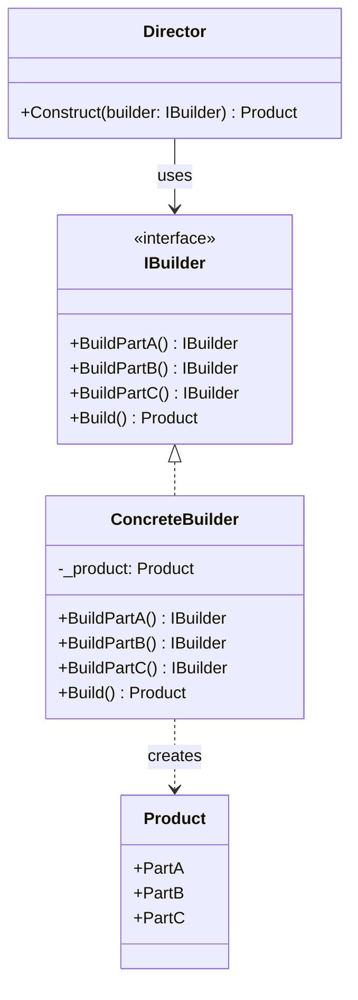
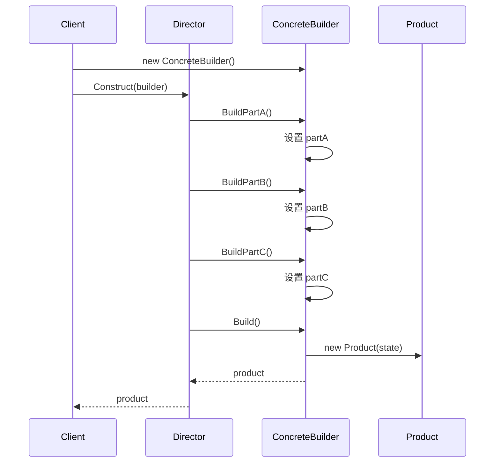

# 建造者模式 (Builder)

> 所属计划: [[design-patterns-csharp|设计模式 (C#)]]
> 预计耗时: 60 分钟
> 前置知识: [[02-creational-intro|创建型模式总览 + 简单工厂]]

---

## 1. 概念讲解

### 构造函数的痛点：Telescoping Constructor 问题

设想你要创建一个 `HttpRequest` 对象，它有很多可选配置：URL、方法、超时时间、请求头、请求体、认证令牌、是否压缩、代理地址……

如果只用构造函数，代码马上变成：

```csharp
// 为了支持各种可选组合，你不得不写一堆重载：
var req1 = new HttpRequest("https://api.example.com");
var req2 = new HttpRequest("https://api.example.com", HttpMethod.Post);
var req3 = new HttpRequest("https://api.example.com", HttpMethod.Post, TimeSpan.FromSeconds(30));
var req4 = new HttpRequest("https://api.example.com", HttpMethod.Post, TimeSpan.FromSeconds(30), headers);
// ... 每新增一个参数，重载数量爆炸增长
```

这就是**可伸缩构造函数反模式 (Telescoping Constructor Anti-Pattern)**：

- 参数列表越来越长，调用者很难记住参数顺序
- `new HttpRequest(null, null, TimeSpan.FromSeconds(5), null, token)` — 大量 `null` 占位
- 新增参数时所有重载都要改
- 编译器不会提示哪个参数对应哪个含义

### Builder 模式的核心思想

> [!note] GoF 定义
> 将一个复杂对象的构建与它的表示分离，使得同样的构建过程可以创建不同的表示。

Builder 把"参数堆积"换成"逐步配置"，每一步都有明确的语义：

```csharp
// Builder 方式：每个字段都有名称，顺序无关
var request = new HttpRequestBuilder()
    .WithUrl("https://api.example.com/users")
    .WithMethod(HttpMethod.Post)
    .WithTimeout(TimeSpan.FromSeconds(30))
    .WithHeader("Authorization", "Bearer xxx")
    .WithBody(jsonBody)
    .Build();
```

**Builder 的四个参与者：**

| 角色 | 职责 | 对应代码 |
|------|------|---------|
| **Product** | 最终构建出的复杂对象 | `HttpRequest` |
| **Builder 接口** | 定义构建步骤的抽象 | `IHttpRequestBuilder` |
| **ConcreteBuilder** | 实现构建步骤，持有临时状态 | `HttpRequestBuilder` |
| **Director** | 使用 Builder 来按特定流程构建 | `RequestDirector`（可选） |



> [!tip] Director 是可选的
> 对于大多数 C# 场景，**Fluent API** 的 Builder（客户端直接调用 Builder 方法）已经够用。Director 适用于需要**复用**特定构建步骤的场景——比如反复构建格式统一的报表。

### 调用流程



---

## 2. 代码示例

### 示例 1：HTTP 请求构建器（Fluent API）

```csharp
using System.Net.Http;

// === Product ===
public class HttpRequest
{
    public string Url { get; }
    public HttpMethod Method { get; }
    public TimeSpan Timeout { get; }
    public IReadOnlyDictionary<string, string> Headers { get; }
    public string? Body { get; }

    public HttpRequest(
        string url,
        HttpMethod? method = null,
        TimeSpan? timeout = null,
        IReadOnlyDictionary<string, string>? headers = null,
        string? body = null)
    {
        Url = !string.IsNullOrWhiteSpace(url)
            ? url
            : throw new ArgumentException("URL is required", nameof(url));
        Method = method ?? HttpMethod.Get;
        Timeout = timeout ?? TimeSpan.FromSeconds(30);
        Headers = headers ?? new Dictionary<string, string>();
        Body = body;
    }
}

// === Fluent Builder ===
public class HttpRequestBuilder
{
    private string _url = string.Empty;
    private HttpMethod _method = HttpMethod.Get;
    private TimeSpan _timeout = TimeSpan.FromSeconds(30);
    private readonly Dictionary<string, string> _headers = new();
    private string? _body;

    public HttpRequestBuilder WithUrl(string url)
    {
        _url = url;
        return this;
    }

    public HttpRequestBuilder WithMethod(HttpMethod method)
    {
        _method = method;
        return this;
    }

    public HttpRequestBuilder Get() => WithMethod(HttpMethod.Get);
    public HttpRequestBuilder Post() => WithMethod(HttpMethod.Post);
    public HttpRequestBuilder Put() => WithMethod(HttpMethod.Put);
    public HttpRequestBuilder Delete() => WithMethod(HttpMethod.Delete);

    public HttpRequestBuilder WithTimeout(TimeSpan timeout)
    {
        _timeout = timeout;
        return this;
    }

    public HttpRequestBuilder WithHeader(string key, string value)
    {
        _headers[key] = value;
        return this;
    }

    public HttpRequestBuilder WithBearerToken(string token)
    {
        _headers["Authorization"] = $"Bearer {token}";
        return this;
    }

    public HttpRequestBuilder WithJsonBody(object body)
    {
        _body = System.Text.Json.JsonSerializer.Serialize(body);
        _headers["Content-Type"] = "application/json";
        return this;
    }

    public HttpRequest Build()
    {
        // 验证 — Build() 是确保一致性的最后关口
        if (string.IsNullOrWhiteSpace(_url))
            throw new InvalidOperationException("URL is required. Call WithUrl() before Build().");

        return new HttpRequest(
            _url,
            _method,
            _timeout,
            new Dictionary<string, string>(_headers), // 防御性拷贝
            _body);
    }
}

// === 使用 ===
var request = new HttpRequestBuilder()
    .WithUrl("https://api.github.com/repos/dotnet/runtime")
    .Get()
    .WithTimeout(TimeSpan.FromSeconds(10))
    .WithHeader("Accept", "application/vnd.github.v3+json")
    .WithBearerToken("ghp_xxxxxxxxxxxx")
    .Build();

Console.WriteLine($"{request.Method} {request.Url}");
Console.WriteLine($"Timeout: {request.Timeout.TotalSeconds}s");
Console.WriteLine($"Headers: {request.Headers.Count}");
```

**运行方式:**
```bash
dotnet new console -n BuilderDemo
# 将上述代码放入 Program.cs，在 .Build() 后加打印语句
dotnet run --project BuilderDemo
```

**预期输出:**
```text
GET https://api.github.com/repos/dotnet/runtime
Timeout: 10s
Headers: 3
```

### 示例 2：SQL 查询构建器

```csharp
public class SqlQuery
{
    public string SelectClause { get; }
    public string FromClause { get; }
    public string? WhereClause { get; }
    public string? OrderByClause { get; }
    public int? Limit { get; }
    public IReadOnlyList<object> Parameters { get; }

    public SqlQuery(
        string select, string from, string? where,
        string? orderBy, int? limit,
        IReadOnlyList<object> parameters)
    {
        SelectClause = select;
        FromClause = from;
        WhereClause = where;
        OrderByClause = orderBy;
        Limit = limit;
        Parameters = parameters;
    }

    public override string ToString()
    {
        var sql = $"SELECT {SelectClause} FROM {FromClause}";
        if (WhereClause != null) sql += $" WHERE {WhereClause}";
        if (OrderByClause != null) sql += $" ORDER BY {OrderByClause}";
        if (Limit.HasValue) sql += $" LIMIT {Limit.Value}";
        return sql;
    }
}

public class SqlQueryBuilder
{
    private string _select = "*";
    private string _from = string.Empty;
    private string? _where;
    private string? _orderBy;
    private int? _limit;
    private readonly List<object> _parameters = new();

    public SqlQueryBuilder Select(string columns)
    {
        _select = columns;
        return this;
    }

    public SqlQueryBuilder From(string table)
    {
        _from = table;
        return this;
    }

    public SqlQueryBuilder Where(string condition)
    {
        _where = condition;
        return this;
    }

    public SqlQueryBuilder AndWhere(string condition)
    {
        _where = _where == null ? condition : $"({_where}) AND ({condition})";
        return this;
    }

    public SqlQueryBuilder OrderBy(string column, bool descending = false)
    {
        _orderBy = descending ? $"{column} DESC" : column;
        return this;
    }

    public SqlQueryBuilder Take(int limit)
    {
        _limit = limit;
        return this;
    }

    public SqlQueryBuilder AddParameter(object value)
    {
        _parameters.Add(value);
        return this;
    }

    public SqlQuery Build()
    {
        if (string.IsNullOrWhiteSpace(_from))
            throw new InvalidOperationException("FROM clause is required.");

        return new SqlQuery(
            _select, _from, _where, _orderBy, _limit,
            _parameters.AsReadOnly());
    }
}

// === 使用 ===
var query = new SqlQueryBuilder()
    .Select("Id, Name, Email")
    .From("Users")
    .Where("IsActive = 1")
    .AndWhere("CreatedAt > @minDate")
    .OrderBy("Name")
    .Take(50)
    .Build();

Console.WriteLine(query);
// 输出: SELECT Id, Name, Email FROM Users WHERE (IsActive = 1) AND (CreatedAt > @minDate) ORDER BY Name LIMIT 50
```

### 示例 3：C# 惯用法 — `record` + `with` 表达式 vs Builder

C# 9 引入的 `record` 类型是不可变的，配合 `with` 表达式可以实现"拷贝并修改"：

```csharp
// === record 方式 ===
public record Person(string Name, int Age, string? Email, string? Phone);

var base = new Person("张三", 30, null, null);
var withEmail = base with { Email = "zhangsan@example.com" };
var complete = withEmail with { Phone = "13800138000" };

// === 等价 Builder 方式 ===
public class PersonBuilder
{
    private string _name = string.Empty;
    private int _age;
    private string? _email;
    private string? _phone;

    public PersonBuilder WithName(string name) { _name = name; return this; }
    public PersonBuilder WithAge(int age) { _age = age; return this; }
    public PersonBuilder WithEmail(string? email) { _email = email; return this; }
    public PersonBuilder WithPhone(string? phone) { _phone = phone; return this; }

    public Person Build() => new(_name, _age, _email, _phone);
}

var person = new PersonBuilder()
    .WithName("张三")
    .WithAge(30)
    .WithEmail("zhangsan@example.com")
    .WithPhone("13800138000")
    .Build();
```

**何时用 `record` + `with`，何时用 Builder？**

| 场景 | 推荐 |
|------|------|
| 简单 DTO（≤5 个字段，无验证） | `record` + `with` |
| 有默认值、需要分步积累可选字段 | `record` + `with` |
| 复杂验证逻辑（字段互斥、条件必填） | **Builder** — 在 `Build()` 中集中验证 |
| 构建步骤有依赖顺序 | **Builder** |
| 需要对外隐藏内部状态 | **Builder** |
| 需要生成不同"表示"（如 XML/JSON 双输出） | **Builder** — 用 `Director` |

> [!tip] 两者可以结合
> Builder 的 `Build()` 返回一个 `record`：Builder 负责验证和收集状态，`record` 保证不可变性。

### 示例 4：C# 惯用法 — `init` 属性 + 对象初始化器 vs Builder

C# 9 的 `init` 属性允许对象初始化器设置属性，但构造完成后不可变：

```csharp
// === init 属性方式 ===
public class ServerConfig
{
    public string Host { get; init; } = "localhost";
    public int Port { get; init; } = 8080;
    public bool UseTls { get; init; } = false;
    public string? ConnectionString { get; init; }
}

var config = new ServerConfig
{
    Host = "prod-server",
    Port = 443,
    UseTls = true,
    ConnectionString = "Server=prod-server;..."
};

// === 等价 Builder ===
public class ServerConfigBuilder
{
    private string _host = "localhost";
    private int _port = 8080;
    private bool _useTls = false;
    private string? _connectionString;

    public ServerConfigBuilder WithHost(string host) { _host = host; return this; }
    public ServerConfigBuilder WithPort(int port) { _port = port; return this; }
    public ServerConfigBuilder WithTls(bool useTls) { _useTls = useTls; return this; }
    public ServerConfigBuilder WithConnectionString(string cs) { _connectionString = cs; return this; }

    public ServerConfig Build()
    {
        if (_useTls && _port != 443)
            throw new InvalidOperationException("TLS enabled but port is not 443.");

        return new ServerConfig
        {
            Host = _host,
            Port = _port,
            UseTls = _useTls,
            ConnectionString = _connectionString
        };
    }
}
```

**何时用 `init` + 对象初始化器，何时用 Builder？**

| 场景 | 推荐 |
|------|------|
| 纯配置对象、无跨字段验证 | `init` + 对象初始化器 |
| 简单 DTO（字段独立，无副作用） | `init` + 对象初始化器 |
| 需要跨字段验证（TLS + 端口） | **Builder** — 在 `Build()` 验证 |
| 需要条件/循环逐步添加字段 | **Builder** |
| 构建过程需日志/埋点/副作用 | **Builder** |
| 需要从多个数据源逐步填充 | **Builder** |

> [!warning] `init` 无法完全替代 Builder
> `init` + 对象初始化器在构造时**无法做跨字段验证**——`{ Host = "...", Port = 80, UseTls = true }` 这样的非法组合会静默通过。Builder 的 `Build()` 方法是执行复杂验证的最佳地点。

---


---

## C++ 实现

C++ 中通过返回 `HttpRequestBuilder&` 引用实现方法链（fluent API）。`Build()` 作为最后一步，执行验证并转移 Builder 内部状态到最终产品。

```cpp
#include <iostream>
#include <string>
#include <unordered_map>
#include <memory>
#include <stdexcept>

using namespace std;

// === Product ===
struct HttpRequest {
    string url;
    string method;
    int timeoutMs;
    unordered_map<string, string> headers;
    string body;

    void print() const {
        cout << method << " " << url << endl;
        cout << "Timeout: " << timeoutMs << "ms" << endl;
        cout << "Headers: " << headers.size() << endl;
        if (!body.empty())
            cout << "Body: " << body.substr(0, 50) << "..." << endl;
    }
};

// === Fluent Builder ===
class HttpRequestBuilder {
    string url_;
    string method_ = "GET";
    int timeoutMs_ = 30000;
    unordered_map<string, string> headers_;
    string body_;
public:
    // 每个 with* 方法返回 *this 引用，支持链式调用
    HttpRequestBuilder& withUrl(const string& url) {
        url_ = url;
        return *this;
    }

    HttpRequestBuilder& withMethod(const string& method) {
        method_ = method;
        return *this;
    }

    // 便捷方法
    HttpRequestBuilder& get()    { return withMethod("GET"); }
    HttpRequestBuilder& post()   { return withMethod("POST"); }
    HttpRequestBuilder& put()    { return withMethod("PUT"); }
    HttpRequestBuilder& del()    { return withMethod("DELETE"); }

    HttpRequestBuilder& withTimeout(int ms) {
        timeoutMs_ = ms;
        return *this;
    }

    HttpRequestBuilder& withHeader(const string& key, const string& value) {
        headers_[key] = value;
        return *this;
    }

    HttpRequestBuilder& withBearerToken(const string& token) {
        headers_["Authorization"] = "Bearer " + token;
        return *this;
    }

    HttpRequestBuilder& withBody(const string& body) {
        body_ = body;
        return *this;
    }

    // Build(): 验证并转移所有权
    HttpRequest build() && {  // 右值引用限定: 只能对临时/移动后的 builder 调用
        if (url_.empty())
            throw runtime_error("URL is required. Call withUrl() before Build().");
        if (method_ == "POST" && body_.empty()) {
            // 可选警告
        }
        // 移动 Builder 内部状态到 Product（避免拷贝）
        return HttpRequest{
            move(url_),
            move(method_),
            timeoutMs_,
            move(headers_),
            move(body_)
        };
    }
};

// === main / usage ===
int main() {
    auto request = HttpRequestBuilder()
        .withUrl("https://api.github.com/repos/torvalds/linux")
        .get()
        .withTimeout(10000)
        .withHeader("Accept", "application/vnd.github.v3+json")
        .withBearerToken("ghp_xxxxxxxxxxxx")
        .build();  // 右值引用限定的 build()
    request.print();

    // 也可以分步构建
    HttpRequestBuilder builder;
    builder.withUrl("https://httpbin.org/post")
           .post()
           .withBody(R"({"name":"Alice"})")
           .withHeader("Content-Type", "application/json");
    auto req2 = move(builder).build();  // 显式 move 后可调用 &&
    req2.print();
}
```

**编译运行:**
```bash
g++ -std=c++17 -o prog main.cpp && ./prog
```

> [!note] C++ 特点
> - `build() &&` 使用**右值引用限定**（ref-qualifier）：只能在临时对象或 `std::move()` 后的 Builder 上调用，防止 Builder 被重复 Build。
> - 方法链通过返回 `HttpRequestBuilder&` 实现；`move()` 将 Builder 内部数据高效转移至 Product，避免拷贝大字符串。
> - `Build()` 集中验证：URL 非空、方法合法等，确保产出的 Product 始终处于一致状态。
## 3. 练习

### 练习 1：实现 Email 构建器（Fluent API）

实现一个邮件构建器，支持：

- 必填：`To`（多个收件人）
- 可选：`From`, `CC`, `BCC`, `Subject`, `Body`（纯文本或 HTML）
- Priority（`Low`, `Normal`, `High`，默认 `Normal`）
- `Attachments`（文件路径列表）
- `Build()` 时验证：至少有一个收件人，非空

```csharp
public enum EmailPriority { Low, Normal, High }

public class Email
{
    public IReadOnlyList<string> To { get; }
    public string? From { get; }
    public IReadOnlyList<string> CC { get; }
    public IReadOnlyList<string> BCC { get; }
    public string? Subject { get; }
    public string? Body { get; }
    public bool IsHtml { get; }
    public EmailPriority Priority { get; }
    public IReadOnlyList<string> Attachments { get; }

    // 构造函数 — 留给练习者
}

// 接口让 Builder 可 mock / 可替换
public interface IEmailBuilder
{
    IEmailBuilder To(params string[] recipients);
    IEmailBuilder From(string sender);
    IEmailBuilder CC(params string[] recipients);
    IEmailBuilder BCC(params string[] recipients);
    IEmailBuilder WithSubject(string subject);
    IEmailBuilder WithBody(string body, bool isHtml = false);
    IEmailBuilder WithPriority(EmailPriority priority);
    IEmailBuilder Attach(params string[] filePaths);
    Email Build();
}

// === 目标使用方式 ===
var email = new EmailBuilder()
    .To("alice@example.com", "bob@example.com")
    .From("noreply@myapp.com")
    .WithSubject("Welcome!")
    .WithBody("<h1>Hello</h1><p>Thanks for signing up.</p>", isHtml: true)
    .WithPriority(EmailPriority.High)
    .Build();
```

### 练习 2：带验证的配置构建器

实现一个 `DatabaseConfig` 和对应的 Builder，需要以下验证逻辑：

- `Host` 和 `Database` 必填
- `Port` 必须在 1-65535 范围内
- 使用连接池时 (`UsePooling = true`)，`MaxPoolSize` 必须 `> 0` 且 `<= 1000`
- 如果 `Encrypt = true`，`TrustServerCertificate` 不能同时为 `true`（互斥）
- 所有验证集中在 `Build()` 中

```csharp
public class DatabaseConfig
{
    public string Host { get; }
    public int Port { get; }
    public string Database { get; }
    public string? Username { get; }
    public string? Password { get; }
    public bool UsePooling { get; }
    public int MaxPoolSize { get; }
    public bool Encrypt { get; }
    public bool TrustServerCertificate { get; }

    // 构造函数 — 留给练习者
}

public class DatabaseConfigBuilder
{
    // 实现 Builder，Build() 抛出有意义的异常信息
    // 提示：用异常消息明确指出哪个条件不满足
}

// === 测试边界条件 ===
// 应成功:
var valid = new DatabaseConfigBuilder()
    .WithHost("db.example.com")
    .WithDatabase("MyApp")
    .Build();

// 应抛出 InvalidOperationException("Host is required"):
var noHost = new DatabaseConfigBuilder()
    .WithDatabase("MyApp")
    .Build();

// 应抛出异常（Encrypt 和 TrustServerCertificate 互斥）:
var conflict = new DatabaseConfigBuilder()
    .WithHost("db.example.com")
    .WithDatabase("MyApp")
    .WithEncrypt(true)
    .WithTrustServerCertificate(true)
    .Build();
```

### 练习 3（可选）：Builder 生成不可变 `record`

设计一个 `Order` 的 `record` 类型和对应的 Builder，要求：

- `Order` 是 `record`，不可变
- Builder 支持逐步添加 `OrderItem`（`AddItem(product, quantity, price)`）
- `Build()` 验证至少有一条 OrderItem，且 `TotalAmount` 由所有 item 计算得来
- 使用 `IReadOnlyList<OrderItem>` 而非可变 `List<T>`

```csharp
public record OrderItem(string Product, int Quantity, decimal UnitPrice);

public record Order(
    string OrderId,
    IReadOnlyList<OrderItem> Items,
    decimal TotalAmount,
    DateTime CreatedAt);

public class OrderBuilder
{
    // 实现：内部用 List<OrderItem> 收集，Build() 时转 IReadOnlyList
    // Build() 自动计算 TotalAmount
}

// === 目标使用 ===
var order = new OrderBuilder()
    .WithOrderId("ORD-2026-001")
    .AddItem("键盘", 2, 299.00m)
    .AddItem("鼠标", 1, 149.00m)
    .Build();

Console.WriteLine($"Order {order.OrderId}: {order.Items.Count} items, Total: ¥{order.TotalAmount}");
// 输出: Order ORD-2026-001: 2 items, Total: ¥747.00
```

---
## 3.5 参考答案

> [!tip]- 练习 1 参考答案
> 完整 Email 构建器实现：
>
> ```csharp
> public enum EmailPriority { Low, Normal, High }
>
> public class Email
> {
>     public IReadOnlyList<string> To { get; }
>     public string? From { get; }
>     public IReadOnlyList<string> CC { get; }
>     public IReadOnlyList<string> BCC { get; }
>     public string? Subject { get; }
>     public string? Body { get; }
>     public bool IsHtml { get; }
>     public EmailPriority Priority { get; }
>     public IReadOnlyList<string> Attachments { get; }
>
>     public Email(
>         IReadOnlyList<string> to,
>         string? from,
>         IReadOnlyList<string> cc,
>         IReadOnlyList<string> bcc,
>         string? subject,
>         string? body,
>         bool isHtml,
>         EmailPriority priority,
>         IReadOnlyList<string> attachments)
>     {
>         To = to;
>         From = from;
>         CC = cc;
>         BCC = bcc;
>         Subject = subject;
>         Body = body;
>         IsHtml = isHtml;
>         Priority = priority;
>         Attachments = attachments;
>     }
> }
>
> public interface IEmailBuilder
> {
>     IEmailBuilder To(params string[] recipients);
>     IEmailBuilder From(string sender);
>     IEmailBuilder CC(params string[] recipients);
>     IEmailBuilder BCC(params string[] recipients);
>     IEmailBuilder WithSubject(string subject);
>     IEmailBuilder WithBody(string body, bool isHtml = false);
>     IEmailBuilder WithPriority(EmailPriority priority);
>     IEmailBuilder Attach(params string[] filePaths);
>     Email Build();
> }
>
> public class EmailBuilder : IEmailBuilder
> {
>     private readonly List<string> _to = new();
>     private string? _from;
>     private readonly List<string> _cc = new();
>     private readonly List<string> _bcc = new();
>     private string? _subject;
>     private string? _body;
>     private bool _isHtml;
>     private EmailPriority _priority = EmailPriority.Normal;
>     private readonly List<string> _attachments = new();
>
>     public IEmailBuilder To(params string[] recipients)
>     {
>         _to.AddRange(recipients);
>         return this;
>     }
>
>     public IEmailBuilder From(string sender)
>     {
>         _from = sender;
>         return this;
>     }
>
>     public IEmailBuilder CC(params string[] recipients)
>     {
>         _cc.AddRange(recipients);
>         return this;
>     }
>
>     public IEmailBuilder BCC(params string[] recipients)
>     {
>         _bcc.AddRange(recipients);
>         return this;
>     }
>
>     public IEmailBuilder WithSubject(string subject)
>     {
>         _subject = subject;
>         return this;
>     }
>
>     public IEmailBuilder WithBody(string body, bool isHtml = false)
>     {
>         _body = body;
>         _isHtml = isHtml;
>         return this;
>     }
>
>     public IEmailBuilder WithPriority(EmailPriority priority)
>     {
>         _priority = priority;
>         return this;
>     }
>
>     public IEmailBuilder Attach(params string[] filePaths)
>     {
>         // 验证文件存在（可选，取决于业务需求）
>         foreach (var path in filePaths)
>         {
>             if (!File.Exists(path))
>                 throw new FileNotFoundException($"Attachment not found: {path}");
>         }
>         _attachments.AddRange(filePaths);
>         return this;
>     }
>
>     public Email Build()
>     {
>         // 必填验证：至少一个收件人
>         if (_to.Count == 0)
>             throw new InvalidOperationException(
>                 "At least one recipient is required. Call To() before Build().");
>
>         // 验证收件人邮箱格式（可选增强）
>         ValidateEmails(_to, "To");
>         ValidateEmails(_cc, "CC");
>         ValidateEmails(_bcc, "BCC");
>
>         return new Email(
>             _to.AsReadOnly(),
>             _from,
>             _cc.AsReadOnly(),
>             _bcc.AsReadOnly(),
>             _subject,
>             _body,
>             _isHtml,
>             _priority,
>             _attachments.AsReadOnly());
>     }
>
>     private static void ValidateEmails(List<string> emails, string field)
>     {
>         foreach (var email in emails)
>         {
>             if (!email.Contains('@'))
>                 throw new InvalidOperationException(
>                     $"Invalid email in {field}: '{email}'");
>         }
>     }
> }
>
> // ═══ 使用 ═══
> var email = new EmailBuilder()
>     .To("alice@example.com", "bob@example.com")
>     .From("noreply@myapp.com")
>     .CC("manager@example.com")
>     .WithSubject("Welcome!")
>     .WithBody("<h1>Hello</h1><p>Thanks for signing up.</p>", isHtml: true)
>     .WithPriority(EmailPriority.High)
>     .Attach("welcome-guide.pdf")
>     .Build();
>
> Console.WriteLine($"To: {string.Join(", ", email.To)}");
> Console.WriteLine($"Subject: {email.Subject}");
> Console.WriteLine($"Priority: {email.Priority}");
> ```
>
> **设计要点：**
> - `To` 支持多次调用逐步添加收件人（`params` + `AddRange`）
> - `Build()` 是唯一验证关口——至少一个收件人、邮箱格式检查
> - 所有集合使用 `.AsReadOnly()` 防御性拷贝，防止构造后外部修改 Builder 内部状态
> - `IEmailBuilder` 接口允许未来替换 Builder 实现（如测试 mock）

> [!tip]- 练习 2 参考答案
> 带完整跨字段验证的 `DatabaseConfigBuilder`：
>
> ```csharp
> public class DatabaseConfig
> {
>     public string Host { get; }
>     public int Port { get; }
>     public string Database { get; }
>     public string? Username { get; }
>     public string? Password { get; }
>     public bool UsePooling { get; }
>     public int MaxPoolSize { get; }
>     public bool Encrypt { get; }
>     public bool TrustServerCertificate { get; }
>
>     public DatabaseConfig(
>         string host, int port, string database,
>         string? username, string? password,
>         bool usePooling, int maxPoolSize,
>         bool encrypt, bool trustServerCertificate)
>     {
>         Host = host;
>         Port = port;
>         Database = database;
>         Username = username;
>         Password = password;
>         UsePooling = usePooling;
>         MaxPoolSize = maxPoolSize;
>         Encrypt = encrypt;
>         TrustServerCertificate = trustServerCertificate;
>     }
> }
>
> public class DatabaseConfigBuilder
> {
>     private string? _host;
>     private int _port = 1433;           // SQL Server 默认端口
>     private string? _database;
>     private string? _username;
>     private string? _password;
>     private bool _usePooling = true;
>     private int _maxPoolSize = 100;      // 默认连接池大小
>     private bool _encrypt;
>     private bool _trustServerCertificate;
>
>     public DatabaseConfigBuilder WithHost(string host)
>     {
>         _host = host;
>         return this;
>     }
>
>     public DatabaseConfigBuilder WithPort(int port)
>     {
>         _port = port;
>         return this;
>     }
>
>     public DatabaseConfigBuilder WithDatabase(string database)
>     {
>         _database = database;
>         return this;
>     }
>
>     public DatabaseConfigBuilder WithCredentials(string username, string password)
>     {
>         _username = username;
>         _password = password;
>         return this;
>     }
>
>     public DatabaseConfigBuilder WithPooling(bool usePooling, int maxPoolSize = 100)
>     {
>         _usePooling = usePooling;
>         _maxPoolSize = maxPoolSize;
>         return this;
>     }
>
>     public DatabaseConfigBuilder WithEncrypt(bool encrypt)
>     {
>         _encrypt = encrypt;
>         return this;
>     }
>
>     public DatabaseConfigBuilder WithTrustServerCertificate(bool trust)
>     {
>         _trustServerCertificate = trust;
>         return this;
>     }
>
>     /// <summary>
>     /// 集中验证所有字段和跨字段约束，抛出精确的错误信息
>     /// </summary>
>     public DatabaseConfig Build()
>     {
>         var errors = new List<string>();
>
>         // 1. 必填字段
>         if (string.IsNullOrWhiteSpace(_host))
>             errors.Add("Host is required. Call WithHost() before Build().");
>         if (string.IsNullOrWhiteSpace(_database))
>             errors.Add("Database name is required. Call WithDatabase() before Build().");
>
>         // 2. 端口范围
>         if (_port < 1 || _port > 65535)
>             errors.Add($"Port must be between 1 and 65535, got {_port}.");
>
>         // 3. 连接池约束
>         if (_usePooling && (_maxPoolSize <= 0 || _maxPoolSize > 1000))
>             errors.Add(
>                 $"MaxPoolSize must be > 0 and <= 1000 when pooling is enabled, got {_maxPoolSize}.");
>
>         // 4. 加密互斥约束
>         if (_encrypt && _trustServerCertificate)
>             errors.Add(
>                 "Encrypt and TrustServerCertificate cannot both be true. " +
>                 "Either disable encryption or use a trusted certificate.");
>
>         if (errors.Count > 0)
>             throw new InvalidOperationException(
>                 $"DatabaseConfig validation failed with {errors.Count} error(s):\n" +
>                 string.Join("\n", errors.Select((e, i) => $"  {i + 1}. {e}")));
>
>         return new DatabaseConfig(
>             _host!, _port, _database!,
>             _username, _password,
>             _usePooling, _maxPoolSize,
>             _encrypt, _trustServerCertificate);
>     }
> }
>
> // ═══ 测试边界条件 ═══
> // 1. 成功用例
> var valid = new DatabaseConfigBuilder()
>     .WithHost("db.example.com")
>     .WithDatabase("MyApp")
>     .Build();
> Console.WriteLine($"OK: {valid.Host}/{valid.Database}");
>
> // 2. 缺少 Host → InvalidOperationException
> try
> {
>     var noHost = new DatabaseConfigBuilder()
>         .WithDatabase("MyApp")
>         .Build();
> }
> catch (InvalidOperationException ex)
> {
>     Console.WriteLine($"Expected error: {ex.Message}");
> }
>
> // 3. Encrypt + TrustServerCertificate 互斥 → InvalidOperationException
> try
> {
>     var conflict = new DatabaseConfigBuilder()
>         .WithHost("db.example.com")
>         .WithDatabase("MyApp")
>         .WithEncrypt(true)
>         .WithTrustServerCertificate(true)
>         .Build();
> }
> catch (InvalidOperationException ex)
> {
>     Console.WriteLine($"Expected error: {ex.Message}");
> }
> ```
>
> **设计要点：**
> - `Build()` 收集所有验证错误后统一抛出，而非逐个失败——用户一次看到所有问题，减少调试往返
> - 错误信息包含具体值和操作指引（如 "Call WithHost() before Build()"），不止于"无效"
> - 跨字段约束（`Encrypt` + `TrustServerCertificate`）只可能在 `Build()` 中验证——在 `WithEncrypt` 中检查时 `TrustServerCertificate` 可能还没设置

> [!tip]- 练习 3 参考答案（可选）
> Builder 生成不可变 `record`——`Build()` 自动计算 `TotalAmount`：
>
> ```csharp
> public record OrderItem(string Product, int Quantity, decimal UnitPrice);
>
> public record Order(
>     string OrderId,
>     IReadOnlyList<OrderItem> Items,
>     decimal TotalAmount,
>     DateTime CreatedAt);
>
> public class OrderBuilder
> {
>     private string _orderId = string.Empty;
>     private readonly List<OrderItem> _items = new();
>     private DateTime _createdAt = DateTime.UtcNow;
>
>     public OrderBuilder WithOrderId(string orderId)
>     {
>         _orderId = orderId;
>         return this;
>     }
>
>     public OrderBuilder AddItem(string product, int quantity, decimal unitPrice)
>     {
>         if (string.IsNullOrWhiteSpace(product))
>             throw new ArgumentException("Product name is required.", nameof(product));
>         if (quantity <= 0)
>             throw new ArgumentException(
>                 $"Quantity must be positive, got {quantity}.", nameof(quantity));
>         if (unitPrice < 0)
>             throw new ArgumentException(
>                 $"Unit price cannot be negative, got {unitPrice}.", nameof(unitPrice));
>
>         _items.Add(new OrderItem(product, quantity, unitPrice));
>         return this;
>     }
>
>     public OrderBuilder WithCreatedAt(DateTime createdAt)
>     {
>         _createdAt = createdAt;
>         return this;
>     }
>
>     /// <summary>
>     /// 构建不可变 Order record。TotalAmount 由所有 OrderItem 自动计算。
>     /// </summary>
>     public Order Build()
>     {
>         if (string.IsNullOrWhiteSpace(_orderId))
>             throw new InvalidOperationException(
>                 "OrderId is required. Call WithOrderId() before Build().");
>
>         if (_items.Count == 0)
>             throw new InvalidOperationException(
>                 "Order must contain at least one item. Call AddItem() before Build().");
>
>         // 自动计算总金额（防御性拷贝转为只读列表）
>         var items = _items.AsReadOnly();
>         var totalAmount = _items.Sum(i => i.Quantity * i.UnitPrice);
>
>         return new Order(_orderId, items, totalAmount, _createdAt);
>     }
> }
>
> // ═══ 使用 ═══
> var order = new OrderBuilder()
>     .WithOrderId("ORD-2026-001")
>     .AddItem("键盘", 2, 299.00m)
>     .AddItem("鼠标", 1, 149.00m)
>     .AddItem("显示器", 1, 2499.00m)
>     .Build();
>
> Console.WriteLine($"Order {order.OrderId}: {order.Items.Count} items, Total: ¥{order.TotalAmount:N2}");
> // 输出: Order ORD-2026-001: 3 items, Total: ¥3,246.00
>
> // record 不可变验证
> // order with { TotalAmount = 0 };  // ✓ 创建新对象，原对象不变
> // order.Items.Add(...);            // ✗ IReadOnlyList 禁止修改
> ```
>
> **设计要点：**
> - `Build()` 自动计算 `TotalAmount`——调用方无需手动求和，避免遗漏/计算错误
> - `record` 类型提供值相等和 `with` 表达式支持，适合需要比较订单快照或创建变体的场景
> - `AddItem` 在每次调用时验证参数合法性（提前失败），与 `Build()` 的必填验证（最后关口）相互补充
> - `IReadOnlyList<OrderItem>` 确保订单一旦创建，明细不可修改——符合订单不可变语义

> [!note] 答案使用方式
> 先独立完成练习，再展开查看参考答案。参考答案不是唯一解——如果你的实现通过了测试或达到了题目要求，就是正确的。

## 4. 扩展阅读

- [[02-creational-intro|创建型模式总览 + 简单工厂]] — 与其他创建型模式对比选择
- [[04-factory-method|工厂方法模式]] — Factory 负责"创建哪个类"，Builder 负责"如何构造"
- [[05-abstract-factory|抽象工厂模式]] — Abstract Factory 可返回 Builder 对象实现多步构建
- [Refactoring.Guru — Builder](https://refactoring.guru/design-patterns/builder) — 含多种语言实现
- [Microsoft Docs — record types](https://learn.microsoft.com/en-us/dotnet/csharp/language-reference/builtin-types/record) — `record` 和 `with` 表达式的完整文档
- [C# 9.0 — init-only properties](https://learn.microsoft.com/en-us/dotnet/csharp/language-reference/proposals/csharp-9.0/init) — `init` 属性的设计提案
- [Fluent Interface (Martin Fowler)](https://www.martinfowler.com/bliki/FluentInterface.html) — Fluent API 设计理念

---

## 常见陷阱

### 1. Builder 变成可变的"上帝对象"

Builder 持有所有要设置的字段，很容易不知不觉塞入太多东西：

```csharp
// ❌ Builder 承担了太多职责
public class GodBuilder
{
    public GodBuilder WithServerConfig(...) { /* ... */ return this; }
    public GodBuilder WithLoggingConfig(...) { /* ... */ return this; }
    public GodBuilder WithAuthConfig(...) { /* ... */ return this; }
    // ... 15 个不同领域的方法
    public Application Build() { /* ... */ }
}

// ✅ 拆分为多个 Builder，再组合
var app = new Application(
    server: new ServerConfigBuilder()...Build(),
    logging: new LoggingConfigBuilder()...Build(),
    auth: new AuthConfigBuilder()...Build()
);
```

> [!tip] 拆分信号
> 当 Builder 要构建的 Product 本身应该拆分为多个子对象时，Builder 也应该跟着拆。

### 2. 忘记在 `Build()` 中验证

Builder 的 `Build()` 是唯一保证对象一致性的关口。如果跳过验证，用户可能构造出无效对象：

```csharp
// ❌ Build() 不验证
public class BadBuilder
{
    private string _url = "";
    private int _retryCount = -1;

    public HttpRequest Build()
    {
        return new HttpRequest(_url, _retryCount); // _retryCount = -1 是非法值！
    }
}

// ✅ Build() 集中验证
public HttpRequest Build()
{
    if (string.IsNullOrWhiteSpace(_url))
        throw new InvalidOperationException("URL is required.");

    if (_retryCount < 0 || _retryCount > 10)
        throw new InvalidOperationException(
            $"Retry count must be 0-10, got {_retryCount}.");

    return new HttpRequest(_url, _retryCount);
}
```

> [!warning] 验证时机
> 不要在每次 `WithXxx()` 方法中验证跨字段约束——那时其他字段可能还没设置。所有跨字段验证放在 `Build()` 中。

### 3. Fluent API 返回 `void` 而非 `this`

Fluent API 的核心是链式调用，如果方法返回 `void`，链就断了：

```csharp
// ❌ 返回 void → 无法链式调用
public class BrokenBuilder
{
    public void WithHost(string host) { _host = host; }
    public void WithPort(int port) { _port = port; }
}

// 无法写: new BrokenBuilder().WithHost("x").WithPort(80) — 编译错误！

// ✅ 返回 this（或 IBuilder 接口）
public class FluentBuilder
{
    public FluentBuilder WithHost(string host) { _host = host; return this; }
    public FluentBuilder WithPort(int port) { _port = port; return this; }
}
```

### 4. 忘记防御性拷贝

Builder 持有可变集合（如 `Dictionary<string, string>`、`List<T>`），传递给 Product 后，产品"不可变"的保证可能被破坏：

```csharp
// ❌ 直接传递内部集合引用
public Product Build()
{
    return new Product(_headers); // _headers 仍是 Builder 的引用！
}

// 用户修改 Builder 后，已构建的产品也会变
var product = builder.Build();
builder.WithHeader("X-Evil", "true"); // product 内部的 _headers 也变了！

// ✅ 防御性拷贝
public Product Build()
{
    return new Product(new Dictionary<string, string>(_headers));
}
```

### 5. 为简单对象滥用 Builder

Builder 引入了一个额外类 + 调用链，对简单对象是过度设计：

```csharp
// ❌ 过度设计：只有 2 个字段，不需要 Builder
var point = new PointBuilder().WithX(10).WithY(20).Build();

// ✅ 直接构造或用 record with 表达式
var point = new Point(10, 20);
var moved = point with { X = 30 };
```

> [!tip] Builder 适用判定
> 当满足以下**至少两项**时考虑 Builder：
> - 对象有 4+ 个可选字段
> - 存在跨字段验证/约束
> - 构建步骤有依赖顺序
> - 需要生成不同"表示"（同一数据，不同输出格式）
