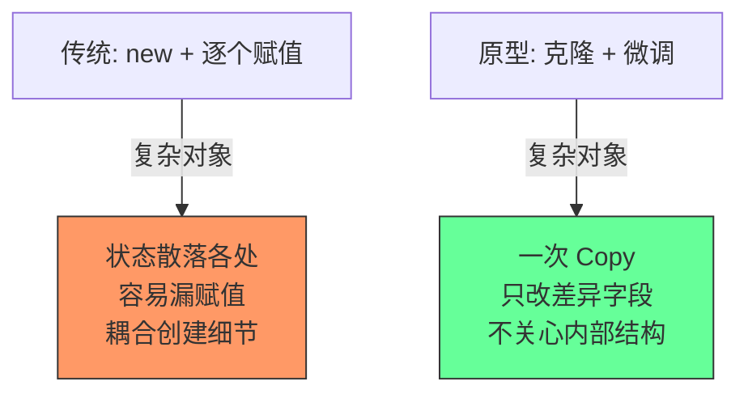
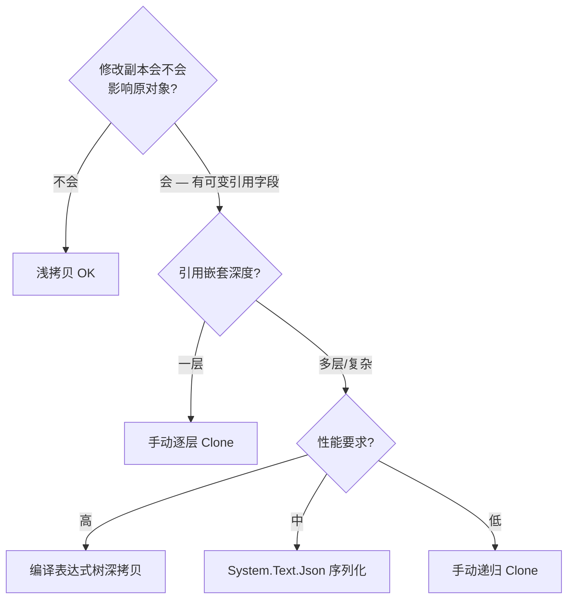
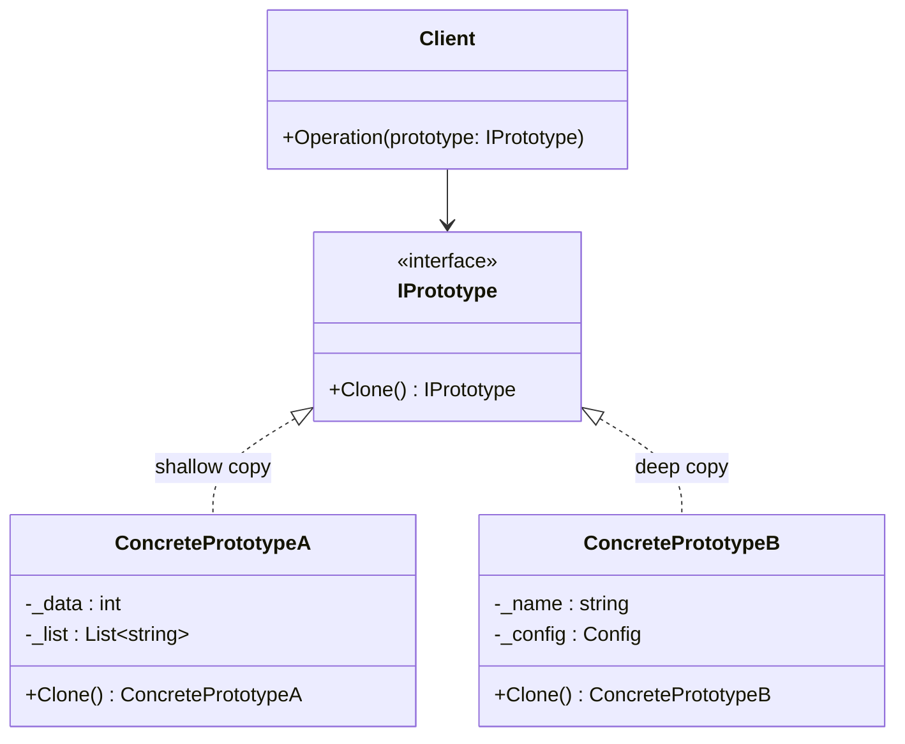
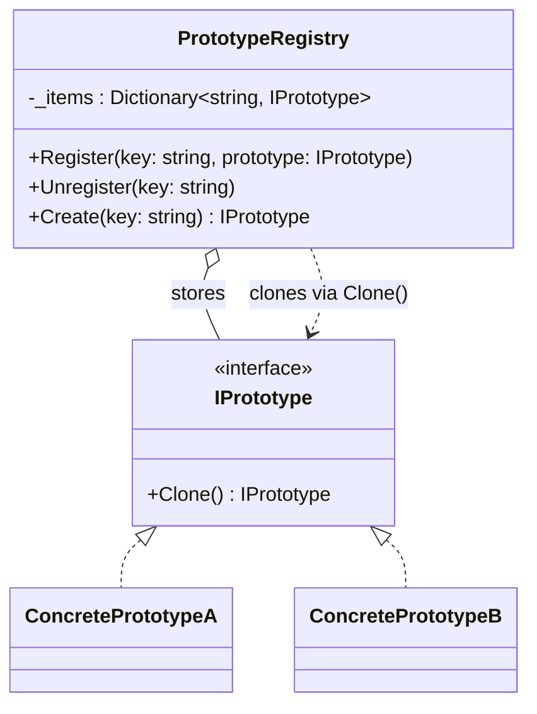

# 原型模式 Prototype

> 所属计划: [[design-patterns-csharp|设计模式 (C#)]]
> 预计耗时: 50 分钟
> 前置知识: [[02-creational-intro|创建型模式总览 + 简单工厂]]

---

## 1. 概念讲解

### 为什么需要克隆？

大多数创建型模式围绕 `new` 展开——工厂决定"new 哪个类"、Builder 决定"new 的步骤"。但有一种场景它们处理不好：

> 你需要一个和现有对象**几乎一样**但略有不同的新对象，"从零 new + 赋值"太繁琐，而对象的状态又是在运行时逐步累积的。

**原型模式的核心思想**：不通过 `new` 创建对象，而是**复制（克隆）一个已有对象（原型）**，然后按需调整。



### 浅拷贝 vs 深拷贝

这是原型模式最核心的抉择，**搞错代价巨大**：

| | 浅拷贝 (Shallow Copy) | 深拷贝 (Deep Copy) |
|------|---------|--------|
| **复制内容** | 值类型字段 + 引用（不复制引用指向的对象） | 值类型字段 + 递归复制引用指向的对象 |
| **效果** | 新旧对象**共享**引用类型成员 | 新旧对象**完全独立** |
| **性能** | 极快（一次内存拷贝） | 慢（递归遍历对象图） |
| **适用** | 对象没有可变引用类型字段 | 需要完全独立的副本 |



> [!warning] MemberwiseClone 是浅拷贝
> `object.MemberwiseClone()` 只做浅拷贝。新手最常见的 bug：以为 `Clone()` 返回的是独立副本，结果修改副本的 `List<T>.Items` 把原对象也改了。

### GoF 经典结构



### Prototype Registry 变体

当系统中有多种预配置的原型时，用 Registry（通常是一个 `Dictionary<string, IPrototype>`）集中管理：



---

## 2. 代码示例

### 示例 1：经典 ICloneable + MemberwiseClone（浅拷贝）

```csharp
using System.Text.Json;

// ============================================
// 1. ICloneable 浅拷贝 — 最简单的原型
// ============================================
public class Resume : ICloneable
{
    public string Name { get; set; } = "";
    public string Email { get; set; } = "";
    public int Age { get; set; }
    public List<string> Skills { get; set; } = new();

    public object Clone()
    {
        // MemberwiseClone() 是浅拷贝：Skills 引用被共享！
        return MemberwiseClone();
    }

    // 类型安全的克隆方法
    public Resume CloneTyped() => (Resume)MemberwiseClone();

    public void Print()
    {
        Console.WriteLine($"Name: {Name}, Email: {Email}, Age: {Age}");
        Console.WriteLine($"Skills: [{string.Join(", ", Skills)}]");
    }
}

// 演示浅拷贝的问题
var original = new Resume
{
    Name = "张三",
    Email = "zhangsan@example.com",
    Age = 28,
    Skills = new List<string> { "C#", "SQL" }
};

var shallow = original.CloneTyped();
Console.WriteLine("=== 浅拷贝演示 ===");
Console.WriteLine("--- 修改值类型字段 (int Age) ---");
shallow.Age = 30;
Console.WriteLine($"original.Age = {original.Age}"); // 28 — 独立，OK
Console.WriteLine($"shallow.Age   = {shallow.Age}"); // 30

Console.WriteLine("\n--- 修改引用类型字段 (List<string> Skills) ---");
shallow.Skills.Add("JavaScript");
// Skills 被共享！两者指向同一个 List
Console.WriteLine($"original.Skills = [{string.Join(", ", original.Skills)}]");
Console.WriteLine($"shallow.Skills   = [{string.Join(", ", shallow.Skills)}]");
// 输出：两者都有 "JavaScript"！
```

**运行方式:**
```bash
dotnet new console -n PrototypeShallowDemo
# 将上述代码放入 Program.cs
dotnet run --project PrototypeShallowDemo
```

**预期输出:**
```text
=== 浅拷贝演示 ===
--- 修改值类型字段 (int Age) ---
original.Age = 28
shallow.Age   = 30

--- 修改引用类型字段 (List<string> Skills) ---
original.Skills = [C#, SQL, JavaScript]
shallow.Skills   = [C#, SQL, JavaScript]
```

### 示例 2：System.Text.Json 深拷贝

`BinaryFormatter` 在 .NET 5+ 已被标记为 `[Obsolete]` 且在 .NET 8+ 默认禁用（安全漏洞 CVE）。现代替代方案：**System.Text.Json 序列化往返**。

```csharp
using System.Text.Json;

// ============================================
// 2. System.Text.Json 深拷贝
// ============================================
public class Document : ICloneable
{
    public string Title { get; set; } = "";
    public string Content { get; set; } = "";
    public List<string> Tags { get; set; } = new();
    public DocumentMetadata Metadata { get; set; } = new();

    // 浅拷贝（有问题）
    public object Clone() => MemberwiseClone();

    // System.Text.Json 深拷贝
    public Document DeepClone()
    {
        var json = JsonSerializer.Serialize(this);
        return JsonSerializer.Deserialize<Document>(json)
            ?? throw new InvalidOperationException("Deserialization returned null");
    }

    public void Print()
    {
        Console.WriteLine($"Title: {Title}");
        Console.WriteLine($"Tags: [{string.Join(", ", Tags)}]");
        Console.WriteLine($"Metadata.Author: {Metadata.Author}");
    }
}

public class DocumentMetadata
{
    public string Author { get; set; } = "";
    public DateTime CreatedAt { get; set; } = DateTime.Now;
}

// 演示
var doc = new Document
{
    Title = "设计模式笔记",
    Content = "原型模式...",
    Tags = new List<string> { "design-patterns", "csharp" },
    Metadata = new DocumentMetadata { Author = "张三" }
};

var deep = doc.DeepClone();
Console.WriteLine("=== System.Text.Json 深拷贝演示 ===");
Console.WriteLine("--- 修改 Tags ---");
deep.Tags.Add("dotnet");
Console.WriteLine($"doc.Tags  = [{string.Join(", ", doc.Tags)}]");  // 没有 "dotnet"
Console.WriteLine($"deep.Tags = [{string.Join(", ", deep.Tags)}]"); // 有 "dotnet"

Console.WriteLine("\n--- 修改 Metadata ---");
deep.Metadata.Author = "李四";
Console.WriteLine($"doc.Metadata.Author  = {doc.Metadata.Author}");  // 张三
Console.WriteLine($"deep.Metadata.Author = {deep.Metadata.Author}"); // 李四
```

> [!tip] JsonSerializer 深拷贝的代价
> 序列化往返比 `MemberwiseClone` 慢 50-200 倍。但它简单、可靠、无需手写递归 Clone，适合非热路径的对象复制。

**其他深度拷贝方案：**
- **表达式树编译** (`Expression<Func<T, T>>`)：最快的手写方案，无反射开销，适合性能敏感场景
- **手写递归 Clone**：完全控制，零依赖，但维护成本高
- **第三方库**：`DeepCloner`（NuGet: `Force.DeepCloner`）用 IL emit 生成高性能深拷贝

### 示例 3：C# `record` 的 `with` 表达式 — 现代原型

C# 9+ 的 `record` 类型天然是原型模式的最佳实现：不可变 + `with` 表达式 = 克隆并修改。

```csharp
// ============================================
// 3. record + with 表达式 — 现代 C# 原型
// ============================================

// record 默认是不可变的引用类型
public record EmployeeRecord(
    string Name,
    string Department,
    decimal Salary,
    List<string>? Certifications = null  // 注意：List 仍是引用类型！
);

// 演示
var emp1 = new EmployeeRecord("张三", "Engineering", 50000m);
Console.WriteLine("=== record with 表达式演示 ===");

// with 创建副本，只改 Department
var emp2 = emp1 with { Department = "Architecture" };
Console.WriteLine($"emp1: {emp1}");
Console.WriteLine($"emp2: {emp2}");

// with 表达式在 record 中是浅拷贝！
// 如果 record 包含可变引用类型字段，仍然共享引用
var emp3 = new EmployeeRecord("李四", "DevOps", 60000m,
    new List<string> { "AWS", "Kubernetes" });
var emp4 = emp3 with { Name = "李四 (升职)" };

emp4.Certifications!.Add("Docker");
Console.WriteLine($"\nemp3.Certifications: [{string.Join(", ", emp3.Certifications)}]");
Console.WriteLine($"emp4.Certifications: [{string.Join(", ", emp4.Certifications)}]");
// 两者都有 "Docker" — with 做的是浅拷贝！

// 解决方案：在 with 中手动深拷贝引用字段
var emp5 = emp3 with
{
    Name = "李四 (安全副本)",
    Certifications = new List<string>(emp3.Certifications!)  // 手动深拷贝 List
};
emp5.Certifications.Add("Terraform");
Console.WriteLine($"\nemp3.Certifications (after safe copy): [{string.Join(", ", emp3.Certifications)}]");
Console.WriteLine($"emp5.Certifications (modified):         [{string.Join(", ", emp5.Certifications)}]");
```

**运行方式:**
```bash
# record 需要 .NET 6+ 且启用 C# 10
dotnet new console -n PrototypeRecordDemo --framework net8.0
dotnet run --project PrototypeRecordDemo
```

**预期输出:**
```text
=== record with 表达式演示 ===
emp1: EmployeeRecord { Name = 张三, Department = Engineering, Salary = 50000, Certifications =  }
emp2: EmployeeRecord { Name = 张三, Department = Architecture, Salary = 50000, Certifications =  }

emp3.Certifications: [AWS, Kubernetes, Docker]
emp4.Certifications: [AWS, Kubernetes, Docker]

emp3.Certifications (after safe copy): [AWS, Kubernetes, Docker]
emp5.Certifications (modified):         [AWS, Kubernetes, Docker, Terraform]
```

> [!tip] record vs class 的选择
> - **需要频繁克隆 + 不可变语义** → `record` + `with`
> - **需要深拷贝嵌套对象** → 手写 Clone 或用 JsonSerializer
> - **记录 DTO / 消息 / 值对象** → `record` 是 C# 的首选
> - **record struct** (C# 10+) → 值类型，`with` 表达式也是值拷贝（天然深拷贝），但有 16 字节以上不宜复制的限制

### 示例 4：Prototype Registry（原型注册表）

```csharp
// ============================================
// 4. Prototype Registry — 预配置原型的字典
// ============================================

public interface IShape : ICloneable
{
    string Name { get; }
    void Draw();
    new IShape Clone();  // 隐藏 object.Clone()，返回类型安全的 IShape
}

public class Circle : IShape
{
    public string Name => "Circle";
    public int Radius { get; set; }
    public string Color { get; set; } = "Black";

    public Circle(int radius, string color)
    {
        Radius = radius;
        Color = color;
    }

    public object Clone() => MemberwiseClone();
    IShape IShape.Clone() => (Circle)MemberwiseClone();
    public void Draw() => Console.WriteLine($"  ○ Circle (r={Radius}, color={Color})");
}

public class Rectangle : IShape
{
    public string Name => "Rectangle";
    public int Width { get; set; }
    public int Height { get; set; }
    public string Color { get; set; } = "Black";

    public Rectangle(int width, int height, string color)
    {
        Width = width;
        Height = height;
        Color = color;
    }

    public object Clone() => MemberwiseClone();
    IShape IShape.Clone() => (Rectangle)MemberwiseClone();
    public void Draw() => Console.WriteLine($"  ▭ Rectangle (w={Width}, h={Height}, color={Color})");
}

// --- 原型注册表 ---
public class ShapeRegistry
{
    private readonly Dictionary<string, IShape> _prototypes = new();

    public void Register(string key, IShape prototype)
    {
        _prototypes[key] = prototype;
    }

    public void Unregister(string key)
    {
        _prototypes.Remove(key);
    }

    public IShape Create(string key)
    {
        if (!_prototypes.TryGetValue(key, out var prototype))
        {
            throw new ArgumentException($"No prototype registered for key: {key}");
        }
        return prototype.Clone();
    }

    public IEnumerable<string> Keys => _prototypes.Keys;
}

// --- 使用 ---
var registry = new ShapeRegistry();

// 注册预配置原型 (只注册一次)
registry.Register("small-red-circle",   new Circle(5, "Red"));
registry.Register("big-blue-circle",     new Circle(20, "Blue"));
registry.Register("green-square",         new Rectangle(10, 10, "Green"));
registry.Register("yellow-wide-rect",     new Rectangle(30, 10, "Yellow"));

Console.WriteLine("=== Prototype Registry 演示 ===\n");

// 创建时只需指定 key，通过 Clone 获取
var shape1 = registry.Create("small-red-circle");
var shape2 = registry.Create("big-blue-circle");
var shape3 = registry.Create("yellow-wide-rect");

// 克隆后可以修改，不影响原型
var customCircle = registry.Create("small-red-circle");
((Circle)customCircle).Radius = 8;
((Circle)customCircle).Color = "Purple";

Console.WriteLine("Cloned shapes:");
shape1.Draw();
shape2.Draw();
shape3.Draw();
Console.WriteLine("Customized clone:");
customCircle.Draw();

// 验证原型未被修改
Console.WriteLine("\nOriginal prototype still intact:");
var fresh = registry.Create("small-red-circle");
fresh.Draw(); // 仍然是 r=5, Red
```

**运行方式:**
```bash
dotnet new console -n PrototypeRegistryDemo
dotnet run --project PrototypeRegistryDemo
```

**预期输出:**
```text
=== Prototype Registry 演示 ===

Cloned shapes:
  ○ Circle (r=5, color=Red)
  ○ Circle (r=20, color=Blue)
  ▭ Rectangle (w=30, h=10, color=Yellow)
Customized clone:
  ○ Circle (r=8, color=Purple)

Original prototype still intact:
  ○ Circle (r=5, color=Red)
```

---


---

## C++ 实现

C++ 中用纯虚 `clone()` 声明原型接口。`unique_ptr` 返回克隆体所有权。需特别注意深拷贝 vs 浅拷贝：`std::vector` 等容器的拷贝构造是深拷贝（值语义），但裸指针成员只拷贝指针本身。

```cpp
#include <iostream>
#include <memory>
#include <string>
#include <vector>

using namespace std;

// === 抽象原型 ===
struct Shape {
    virtual unique_ptr<Shape> clone() const = 0;
    virtual void draw() const = 0;
    virtual string describe() const = 0;
    virtual ~Shape() = default;
};

// === 具体原型: Rectangle ===
struct Rectangle : Shape {
    int width, height;
    string color;

    Rectangle(int w, int h, string c)
        : width(w), height(h), color(move(c)) {}

    unique_ptr<Shape> clone() const override {
        // 拷贝构造产生独立副本 — 所有成员是值类型，天然深拷贝
        return make_unique<Rectangle>(*this);
    }

    void draw() const override {
        cout << "Rectangle(" << width << "x" << height
             << ", " << color << ")" << endl;
    }

    string describe() const override {
        return "Rectangle " + to_string(width) + "x" + to_string(height);
    }
};

// === 具体原型: Circle ===
struct Circle : Shape {
    int radius;
    string fillColor;

    Circle(int r, string c) : radius(r), fillColor(move(c)) {}

    unique_ptr<Shape> clone() const override {
        return make_unique<Circle>(*this);
    }

    void draw() const override {
        cout << "Circle(r=" << radius << ", " << fillColor << ")" << endl;
    }

    string describe() const override {
        return "Circle r=" + to_string(radius);
    }
};

// === 示例: 带容器的原型 — 理解深拷贝 vs 浅拷贝 ===
struct Polygon : Shape {
    vector<pair<int, int>> points;   // vector 的拷贝构造是深拷贝
    string* label = nullptr;          // 裸指针 — 默认拷贝只复制指针！

    Polygon(initializer_list<pair<int, int>> pts)
        : points(pts) {}

    // 自定义拷贝构造: 对裸指针做深拷贝
    Polygon(const Polygon& other)
        : points(other.points)  // vector 自动深拷贝
        , label(other.label ? new string(*other.label) : nullptr) {}

    Polygon& operator=(const Polygon& other) {
        if (this != &other) {
            points = other.points;
            delete label;
            label = other.label ? new string(*other.label) : nullptr;
        }
        return *this;
    }

    ~Polygon() { delete label; }

    unique_ptr<Shape> clone() const override {
        return make_unique<Polygon>(*this);  // 调用拷贝构造 → 深拷贝
    }

    void draw() const override {
        cout << "Polygon(" << points.size() << " vertices";
        if (label) cout << ", label: " << *label;
        cout << ")" << endl;
    }

    string describe() const override {
        return "Polygon(" + to_string(points.size()) + " pts)";
    }
};

// === 原型注册表 ===
class ShapeRegistry {
    unordered_map<string, unique_ptr<Shape>> prototypes;
public:
    void add(const string& key, unique_ptr<Shape> proto) {
        prototypes[key] = move(proto);
    }

    unique_ptr<Shape> create(const string& key) {
        auto it = prototypes.find(key);
        if (it == prototypes.end())
            throw runtime_error("Unknown shape: " + key);
        return it->second->clone();
    }
};

// === main / usage ===
int main() {
    // 直接克隆
    auto rect1 = make_unique<Rectangle>(100, 50, "red");
    auto rect2 = rect1->clone();  // 独立副本
    rect1->draw();  // Rectangle(100x50, red)
    rect2->draw();  // Rectangle(100x50, red)

    auto circle1 = make_unique<Circle>(30, "blue");
    auto circle2 = circle1->clone();
    circle2->draw();  // Circle(r=30, blue)

    // 容器深拷贝演示
    auto poly1 = make_unique<Polygon>(
        initializer_list<pair<int, int>>{{0,0}, {10,0}, {10,10}});
    poly1->label = new string("Triangle");

    auto poly2 = poly1->clone();  // 深拷贝 — 新的 vector + 新的 string
    *poly2->label = "Copy";       // 修改克隆体的 label 不影响原对象

    poly1->draw();  // Polygon(3 vertices, label: Triangle)
    poly2->draw();  // Polygon(3 vertices, label: Copy)

    // 注册表模式
    ShapeRegistry registry;
    registry.add("rect", make_unique<Rectangle>(200, 100, "green"));
    registry.add("circle", make_unique<Circle>(15, "yellow"));

    auto s1 = registry.create("rect");
    auto s2 = registry.create("circle");
    s1->draw();
    s2->draw();
}
```

**编译运行:**
```bash
g++ -std=c++17 -o prog main.cpp && ./prog
```

> [!note] C++ 深浅拷贝要点
> - **值类型成员**（`int`, `string`, `vector<T>`, `unique_ptr<T>`）的默认拷贝构造是深拷贝——C++ 的值语义天然安全。
> - **裸指针**（`T*`）和 `shared_ptr<T>` 是浅拷贝——它们共享指向的对象。如需深拷贝裸指针，必须自定义拷贝构造/赋值。
> - `make_unique<Rectangle>(*this)` 调用 `Rectangle` 的拷贝构造，生成完全独立的副本。
> - 与 C# 的 `MemberwiseClone()` 是浅拷贝不同，C++ 的默认拷贝构造对所有成员逐成员拷贝——`vector` 成员是完整的深拷贝。
## 3. 练习

### 练习 1：实现复杂嵌套对象的深拷贝

有一份游戏角色配置对象，包含嵌套的装备、技能列表。请实现它的深拷贝。

```csharp
public class GameCharacter
{
    public string Name { get; set; } = "";
    public int Level { get; set; }
    public Equipment Weapon { get; set; } = new();
    public Equipment Armor { get; set; } = new();
    public List<Skill> Skills { get; set; } = new();
}

public class Equipment
{
    public string Name { get; set; } = "";
    public int Durability { get; set; }
    public List<string> Enchantments { get; set; } = new();
}

public class Skill
{
    public string Name { get; set; } = "";
    public int Level { get; set; }
}
```

**要求：**
1. 实现 `GameCharacter DeepClone()` 方法（用手写递归，不用 JsonSerializer）
2. 编写测试：修改副本的 `Weapon.Enchantments` 和 `Skills` 列表，验证原对象不受影响
3. 处理 `null` 引用（例如 Armor 可以为空）

### 练习 2：构建文档模板的原型注册表

设计一个文档模板系统，支持从预定义模板创建新文档。

```csharp
public interface IDocumentTemplate : ICloneable
{
    string TemplateName { get; }
    string Category { get; }
    IDocumentTemplate CloneTemplate();
}
```

**要求：**
1. 实现三种模板：`InvoiceTemplate`（含公司信息、税率）、`ReportTemplate`（含页眉页脚）、`ContractTemplate`（含双方信息）
2. 实现 `TemplateRegistry`，支持按 Category 查询和按名称创建
3. 克隆后的模板应能独立修改（浅拷贝即可，因为模板字段都是值类型或 `string`）
4. 添加"预置模板加载"功能（启动时从配置加载默认模板集）

### 练习 3：性能对比 Benchmark（可选）

创建一个 BenchmarkDotNet 基准测试，比较三种深拷贝方式对同一个复杂对象的性能：

1. `MemberwiseClone()`（浅拷贝，但可测量原生性能基线）
2. `JsonSerializer` 往返
3. 手写递归 `Clone()` 方法

**要求：**
1. 使用 `BenchmarkDotNet` NuGet 包
2. 测试对象至少包含 5 层嵌套，含 `List<T>`、`Dictionary<K,V>`、自定义引用类型
3. 同时测量内存分配（`MemoryDiagnoser`）
4. 分析结果，说明何时该用哪种方案

> [!tip] BenchmarkDotNet 快速上手
> ```csharp
> [MemoryDiagnoser]
> public class CloneBenchmark
> {
>     private ComplexObject _source = null!;
>
>     [GlobalSetup]
>     public void Setup() { _source = CreateComplexObject(); }
>
>     [Benchmark(Baseline = true)]
>     public ComplexObject MemberwiseClone() => _source.ShallowClone();
>
>     [Benchmark]
>     public ComplexObject JsonClone() => _source.JsonDeepClone();
>
>     [Benchmark]
>     public ComplexObject ManualClone() => _source.ManualDeepClone();
> }
> ```

> 使用 BenchmarkDotNet 的结果来回答：是否值得为原型模式引入序列化依赖？

---

## 4. 扩展阅读

- [[06-builder|建造者模式]] — Builder 分步构建 vs Prototype 一次克隆，两种"复杂对象创建"的不同思路
- [[03-singleton|单例模式]] — 原型模式的 Registry 变体常与 Singleton 结合使用
- [[04-factory-method|工厂方法模式]] — Factory Method + Prototype：用工厂产出原型，用 Clone 生产实例
- [Refactoring.Guru — Prototype](https://refactoring.guru/design-patterns/prototype) — UML 类图与时序图的权威解读
- [Microsoft Docs — ICloneable](https://learn.microsoft.com/en-us/dotnet/api/system.icloneable) — `ICloneable` 的官方设计说明（含为什么不推荐）
- [Microsoft Docs — Records](https://learn.microsoft.com/en-us/dotnet/csharp/language-reference/builtin-types/record) — C# `record` 和 `with` 表达式详解
- [.NET Blog — BinaryFormatter 弃用](https://devblogs.microsoft.com/dotnet/binaryformatter-security-guide/) — 官方安全指南和迁移建议
- [SharpLab — `with` 表达式编译结果](https://sharplab.io/) — 在线查看 C# 编译器如何生成 Clone 代码

---

## 常见陷阱

### 1. `ICloneable` 不指定浅/深拷贝

> `ICloneable` 接口只要求实现 `Clone()`，但**不规定是浅拷贝还是深拷贝**，调用者无法从接口得知行为。

**错误做法：** 依赖 `ICloneable` 并假设它做了深拷贝。
```csharp
public void Process(ICloneable source)
{
    var copy = (MyType)source.Clone();
    copy.Items.Clear(); // 可能清空了原对象的 Items！
}
```

**正确做法：** 在自己定义的接口中明确语义或改用泛型方法：
```csharp
public interface IDeepCloneable<T>
{
    T DeepClone();
}

public interface IShallowCloneable<T>
{
    T ShallowClone();
}
```

### 2. `MemberwiseClone` 只做浅拷贝

`object.MemberwiseClone()` 逐位复制值类型字段，但对引用类型只复制引用——新旧对象共享同一个 `List<T>`、`Dictionary<K,V>`、自定义类等引用成员。

**正确做法：** 在 `Clone()` 中显式处理引用类型字段：
```csharp
public MyClass DeepClone()
{
    var clone = (MyClass)MemberwiseClone();
    clone.Items = new List<string>(this.Items);          // 浅拷贝 List 元素
    clone.Config = this.Config.DeepClone();               // 递归深拷贝嵌套对象
    clone.Map = new Dictionary<string, int>(this.Map);   // 浅拷贝 Dictionary
    return clone;
}
```

### 3. `BinaryFormatter` 已在 .NET 中被弃用

`BinaryFormatter` 从 .NET 5 开始标记 `[Obsolete]`，.NET 8+ 默认抛出 `PlatformNotSupportedException`（安全漏洞 CVE：反序列化可执行任意代码）。

**替代方案：**
| 方案 | 性能 | 适用场景 |
|------|------|---------|
| `System.Text.Json` | 中 | 通用深拷贝、跨平台 |
| 手写递归 Clone | 快 | 对象结构已知且简单 |
| 表达式树编译 | 最快 | 性能敏感路径 |
| `Force.DeepCloner` (NuGet) | 快 | 第三方依赖可接受 |
| `record` + `with` | 最快 | 不可变对象、DTO |

### 4. 循环引用导致深拷贝卡死

当对象图中存在循环引用（A 引用 B，B 也引用 A），递归深拷贝会陷入无限循环。

```csharp
public class Node
{
    public string Name { get; set; } = "";
    public Node? Parent { get; set; }
    public List<Node> Children { get; set; } = new();

    // ❌ 递归深拷贝：Parent → Children → Parent → ... StackOverflow!
    public Node DeepClone()
    {
        var clone = (Node)MemberwiseClone();
        clone.Children = Children.Select(c => c.DeepClone()).ToList();
        foreach (var child in clone.Children)
            child.Parent = clone;
        return clone;
    }
}
```

**解决方案：** 维护已克隆对象映射表（`Dictionary<object, object>` 或 `ConditionalWeakTable<object, object>`），遇到已克隆对象时直接返回引用：

```csharp
public Node DeepClone(Dictionary<object, object>? cloneMap = null)
{
    cloneMap ??= new Dictionary<object, object>(ReferenceEqualityComparer.Instance);

    if (cloneMap.TryGetValue(this, out var existing))
        return (Node)existing;

    var clone = (Node)MemberwiseClone();
    cloneMap[this] = clone;

    clone.Children = Children.Select(c => c.DeepClone(cloneMap)).ToList();
    foreach (var child in clone.Children)
        child.Parent = clone;

    return clone;
}
```

> 使用 `ReferenceEqualityComparer.Instance` 避免 Equals 被重写时误判（例如某个类重写了 Equals 导致两个不同实例被判为"相同"）。

### 5. 将 `record` 的 `with` 当作深拷贝

`with` 表达式在 `record` 中做的是**浅拷贝**。如果 record 包含可变引用类型属性，`with` 后的新对象仍与原对象共享该引用：

```csharp
var a = new MyRecord(new List<string> { "x" });
var b = a with { };  // 浅拷贝！
b.Items.Add("y");
// a.Items 也变成了 ["x", "y"]
```

### 6. 原型注册表泄露可变状态

注册表中的原型被多方克隆使用，如果原型的引用类型成员被意外修改，所有后续 Clone 都会继承被污染的状态。

**正确做法：** 注册原型后将它们视为**只读**；或使用不可变类型（`record`、`IReadOnlyList<T>`、`ImmutableArray<T>`）作为原型。
