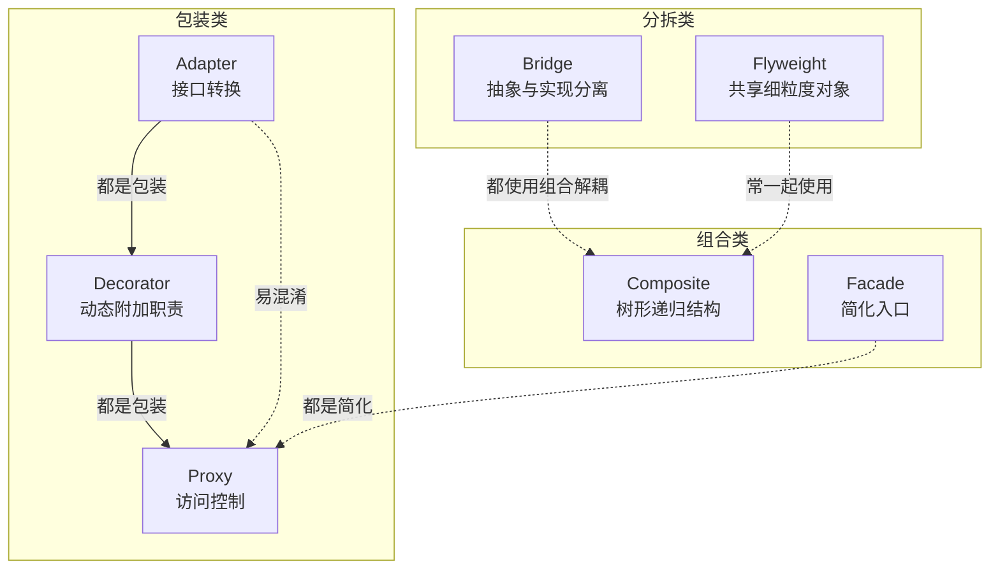
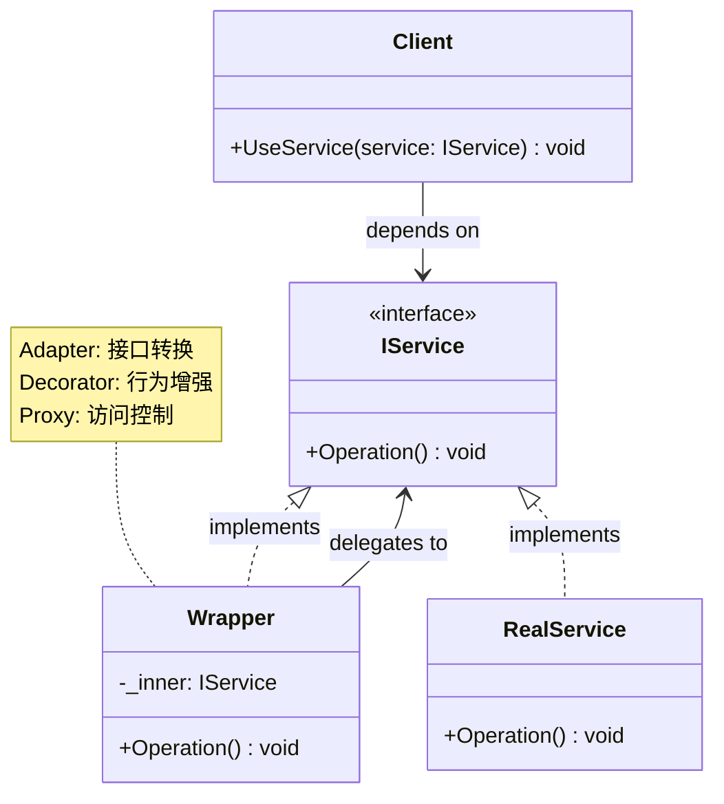
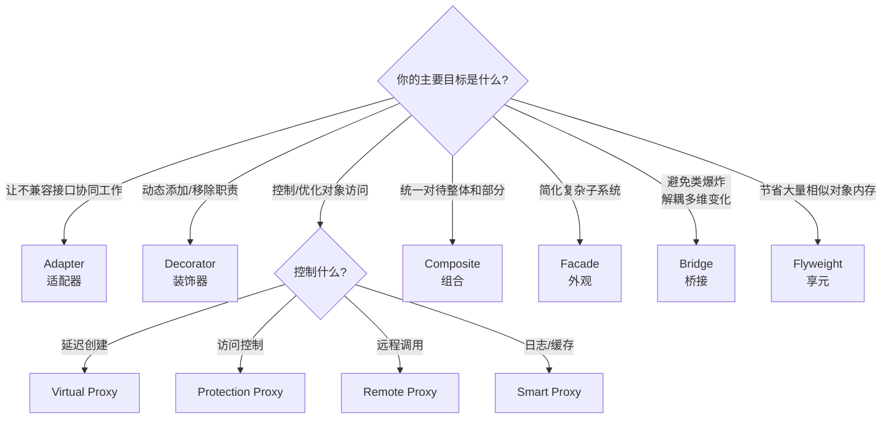

# 结构型模式总览

> 所属计划: [[design-patterns-csharp|设计模式 (C#)]]
> 预计耗时: 50 分钟
> 前置知识: [[01-design-patterns-overview|设计模式概述 + SOLID 原则]]

---

## 1. 概念讲解

### 结构型模式解决什么问题？

创建型模式回答"怎么创建对象"，而结构型模式回答——
**"怎么把类和对象拼装成更大的结构，同时保持灵活和可扩展"**。

真实项目中的典型问题：
- 两个已有接口不兼容，但无法修改其中任一个 → [[09-adapter|Adapter]]
- 一个类需要在其行为和接口之间建立多重变体 → [[10-bridge|Bridge]]
- 客户端需要统一对待单个对象和对象组合 → [[11-composite|Composite]]
- 需要给对象动态附加职责，且不修改其代码 → [[12-decorator|Decorator]]
- 一个复杂子系统有几十个类，客户端只需一个简单入口 → [[13-facade|Facade]]
- 需要创建成千上万个相似对象，内存撑不住 → [[14-flyweight|Flyweight]]
- 需要控制对某对象的访问（延迟加载、权限检查、远程代理）→ [[15-proxy|Proxy]]

**结构型模式的核心思想**：通过**组合**和**包装**来扩展功能，而非通过**继承**。





> [!tip] 结构型模式的记忆口诀
> **"适桥组装外享代"** — 适配器、桥接、组合、装饰、外观、享元、代理。七种模式全都是用"一个对象包着另一个对象"来实现结构上的灵活性。

### 七种结构型模式速查

| 模式 | 核心意图 | 关键 C# 特性 |
|------|---------|-------------|
| [[09-adapter\|Adapter]] | 将不兼容接口转换为客户端期望的接口 | 包装类 + 委托调用 |
| [[10-bridge\|Bridge]] | 将抽象与实现分离，使两者可独立变化 | 接口注入 + 组合 |
| [[11-composite\|Composite]] | 将对象组合成树形结构，统一对待叶子与组合 | `IEnumerable<T>` + 递归 |
| [[12-decorator\|Decorator]] | 动态给对象添加职责，不修改原始类 | 包装类实现相同接口 |
| [[13-facade\|Facade]] | 为子系统提供统一的高层入口 | 聚合多个服务类 |
| [[14-flyweight\|Flyweight]] | 共享大量细粒度对象以减少内存 | `Dictionary` 缓存 + 不可变对象 |
| [[15-proxy\|Proxy]] | 控制对对象的访问（延迟、权限、远程） | 包装类实现相同接口 |

### 各模式概要

**[[09-adapter\|Adapter 适配器]]**：当你有一个现成的类，但它的接口与客户端期望的不匹配时，Adapter 像一个电源转换插头——不改原有类，只加一层包装做接口翻译。C# 中常用在集成第三方库、对接遗留系统。

**[[10-bridge\|Bridge 桥接]]**：当某个概念有多个独立变化的维度时（比如形状有"圆形/方形"，渲染方式有"矢量/位图"），Bridge 将抽象和实现拆成两条继承线，用组合桥接。避免"圆形+矢量"、"圆形+位图"、"方形+矢量"……的类爆炸。

**[[11-composite\|Composite 组合]]**：当你需要像操作单个对象一样操作一组对象时（文件系统中的文件夹和文件、UI 中的面板和按钮），Composite 用递归结构让客户端"一视同仁"。`IEnumerable<T>` 和 `foreach` 是 C# 中 Composite 的天然盟友。

**[[12-decorator\|Decorator 装饰器]]**：给一个对象"穿衣服"——运行时动态附加功能，且可以多层嵌套。与 Adapter 不同，Decorator 不改接口，只增强行为。C# 中 `Stream` 体系（`BufferedStream`、`GZipStream`、`CryptoStream`）是最经典的 Decorator 实现。

**[[13-facade\|Facade 外观]]**：一个复杂子系统可能有十几个类，Facade 提供一个"前台小姐"——客户端只需跟 Facade 打交道，内部复杂调用链被封装起来。C# 中典型的 MVC `Controller` 就是 Facade。

**[[14-flyweight\|Flyweight 享元]]**：当需要大量创建相似对象而内存告急时，Flyweight 将"不变的内在状态"共享、"变化的外在状态"由客户端传入。C# 的 `string.Intern()` 是一种享元。游戏中的粒子系统、文字编辑器的字符格式也常用。

**[[15-proxy\|Proxy 代理]]**：原封不动地暴露与真实对象相同的接口，但在调用前后插入控制逻辑——延迟初始化（Virtual Proxy）、权限校验（Protection Proxy）、远程调用（Remote Proxy）。C# 中 `Lazy<T>` 就是轻量级的 Virtual Proxy。

---

## 2. 决策流程

面对一个结构型问题，按以下流程选择模式：



---

## 3. 代码示例：Adapter vs Decorator——同是包装，意图迥异

以下示例展示两者最根本的区别：Adapter 改变接口，Decorator 不改接口。

```csharp
// ============================================================
// 场景：第三方日志库使用 "WriteLog(level, msg)" 风格，
// 但项目约定使用 ILogger.Log(msg) 风格。
// ============================================================

// --- 第三方库（无法修改）---
public class ThirdPartyLogger
{
    public void WriteLog(int level, string message)
        => Console.WriteLine($"[Level {level}] {message}");
}

// --- 项目约定的接口 ---
public interface ILogger
{
    void Log(string message);
}

// ============================================================
// Adapter：接口转换 —— 对外暴露 ILogger，内部翻译为 WriteLog
// ============================================================
public class LoggerAdapter : ILogger
{
    private readonly ThirdPartyLogger _adaptee = new();

    public void Log(string message)
        => _adaptee.WriteLog(1, message); // 将 ILogger.Log 适配到 WriteLog
}

// 使用 Adapter
ILogger adapter = new LoggerAdapter();
adapter.Log("通过 Adapter 写入");  // 客户端只认识 ILogger

// ============================================================
// Decorator：不改接口 —— 给已有 ILogger 附加时间戳功能
// ============================================================
public class TimestampLogger : ILogger
{
    private readonly ILogger _inner;

    public TimestampLogger(ILogger inner) => _inner = inner;

    public void Log(string message)
    {
        var stamped = $"[{DateTime.Now:HH:mm:ss}] {message}";
        _inner.Log(stamped);  // 增强后委托给内部对象
    }
}

// 使用 Decorator
ILogger console = new ConsoleLogger();            // 基础实现
ILogger withTs  = new TimestampLogger(console);   // 加上时间戳
ILogger withTsAndFile = new FileLoggerDecorator(withTs); // 再加文件写入
withTsAndFile.Log("多层装饰的消息");
```

> [!tip] 一眼识别 Adapter vs Decorator
> | 维度 | Adapter | Decorator |
> |------|---------|-----------|
> | 构造器参数 | 被适配对象（类型通常与输出接口**不同**） | 被装饰对象（类型与输出接口**相同**） |
> | 接口是否改变 | **是** —— 输入 ≠ 输出 | **否** —— 输入 = 输出 |
> | 设计时机 | 通常是事后补救 | 可以事前设计 |
> | 典型 .NET 示例 | `DbDataAdapter`（将 `DataReader` 适配为 `DataSet`） | `BufferedStream`（装饰 `Stream`） |

---

## 4. 练习

### 练习 1：场景匹配

将以下场景与最合适的结构型模式配对：

| 场景 | 应选模式 |
|------|---------|
| (a) 需要在每次数据库查询前后记录日志 | |
| (b) 一个报表系统支持 PDF/Excel/HTML 三种输出，三种绘制引擎 | |
| (c) GUI 中，Panel 可以包含 Button 和子 Panel | |
| (d) 集成一个第三方支付 SDK，但它的 API 签名与你的 `IPaymentGateway` 不匹配 | |
| (e) 游戏中有 10000 棵树，每棵树的纹理和模型数据相同，只是位置不同 | |
| (f) 一个订单处理系统涉及库存、支付、物流、通知四个子系统 | |

可选模式：Adapter, Bridge, Composite, Decorator, Facade, Flyweight, Proxy

### 练习 2：解释 Adapter 与 Decorator 的区别

阅读以下代码，回答：
1. `LoggingRepository` 是 Adapter 还是 Decorator？为什么？
2. 如果改为 Adapter，代码哪些地方需要修改？

```csharp
public interface IRepository<T>
{
    T GetById(int id);
    void Save(T entity);
}

public class SqlRepository<T> : IRepository<T>
{
    public T GetById(int id) { /* 数据库查询 */ }
    public void Save(T entity) { /* 数据库写入 */ }
}

public class LoggingRepository<T> : IRepository<T>
{
    private readonly IRepository<T> _inner;
    public LoggingRepository(IRepository<T> inner) => _inner = inner;

    public T GetById(int id)
    {
        Console.WriteLine($"[LOG] GetById({id}) called");
        return _inner.GetById(id);
    }

    public void Save(T entity)
    {
        Console.WriteLine($"[LOG] Save({entity}) called");
        _inner.Save(entity);
    }
}
```

### 练习 3：解释 Bridge 与 Adapter 的区别

两者都是在两个东西之间建立连接，但设计意图完全不同。

请用你自己的话回答：以下场景分别适用 Bridge 还是 Adapter？为什么？

- (a) 你已经有一个 `OldPaymentApi` 类，但新系统要求 `IPaymentProcessor` 接口。
- (b) 你正在从头设计一个通知系统：通知方式（Push/Email/SMS）和通知内容格式（Text/HTML/Markdown）是独立变化的两个维度。
- (c) Bridge 能否在项目中期引入？如果可以，什么信号表明"是时候引入 Bridge 了"？

> [!tip] 提示
> 一句话区分：Adapter 是**已有东西的翻译**，Bridge 是**设计时的预防**。Adapter 解决"两个已有东西不兼容"的问题，Bridge 解决"如果按继承设计，未来会类爆炸"的问题。

---

## 5. 扩展阅读

- 七篇模式详解: [[09-adapter]], [[10-bridge]], [[11-composite]], [[12-decorator]], [[13-facade]], [[14-flyweight]], [[15-proxy]]
- [[02-creational-intro|创建型模式总览]] — 对比创建型模式如何与之配合
- [Refactoring.Guru — Structural Patterns](https://refactoring.guru/design-patterns/structural-patterns)
- [.NET 中的 Decorator 与 Adapter 实际案例](https://learn.microsoft.com/en-us/dotnet/architecture/modern-web-apps-azure/architectural-principles#dependency-inversion)
- [DoFactory — Structural Design Patterns](https://www.dofactory.com/net/design-patterns) — C# 优化写法参考

---

## 常见陷阱

### 陷阱 1：把 Adapter 当 Decorator 用

```csharp
// ❌ 错误：本来只需要 Adapter 做接口转换，却引入了 Decorator 的多层嵌套
public class PaymentAdapter : IPaymentProcessor, IOldPaymentApi  // 同时实现两个接口？
{
    // 接口转换 + 附加行为的职责混在一起
}

// ✅ 正确：Adapter 只管翻译，职责单一
public class PaymentAdapter : IPaymentProcessor
{
    private readonly OldPaymentApi _adaptee;
    public PaymentAdapter(OldPaymentApi adaptee) => _adaptee = adaptee;
    // 只做方法签名翻译，不附加日志/缓存等行为
}
```

> **判断方法**：如果包装前后接口**不同**，就是 Adapter；如果接口**相同**，就是 Decorator 或 Proxy。

### 陷阱 2：用 Proxy 替代 Facade

```csharp
// ❌ 过度设计：子系统很简单，却为每个服务类创建了 Proxy
// 导致客户端需要管理 N 个 Proxy 对象，没有简化任何东西
var inventoryProxy = new InventoryProxy(realInventory);
var paymentProxy = new PaymentProxy(realPayment);
var shippingProxy = new ShippingProxy(realShipping);
// 客户端仍然要知道三个对象的存在和调用顺序

// ✅ 正确：Facade 封装整个流程
var orderFacade = new OrderFacade();
orderFacade.PlaceOrder(order);  // 内部协调 inventory → payment → shipping
```

> **判断方法**：如果客户端的目的是"简化入口"，用 Facade；如果目的是"控制/优化对某个特定对象的访问"，用 Proxy。

### 陷阱 3：把 Bridge 当成银弹

Bridge 解决的是"两个独立维度同时变化"的问题。如果只有一个维度在变，继承就足够——不要为了用模式而用模式。

```csharp
// ❌ 过度设计：颜色的变化维度并不存在
public interface IColor { string Name { get; } }
public class Red : IColor { public string Name => "Red"; }
public interface IShape { void Draw(IColor color); }
// 实际上颜色可能只有 3 种固定值，用 enum 就够了

// ✅ 务实：一个维度用继承，另一个维度用 enum
public enum Color { Red, Green, Blue }
public abstract class Shape
{
    public abstract void Draw(Color color);
}
```

### 陷阱 4：Decorator 嵌套过深

```csharp
// ❌ 7 层装饰器——调试时你根本不知道真正的行为来自哪一层
var service = new LoggingDecorator(
    new CachingDecorator(
        new RetryDecorator(
            new MetricsDecorator(
                new ValidationDecorator(
                    new EncryptionDecorator(
                        new RealService()))))));

// ✅ 考虑：将所有横切关注点合并到一个 Facade 或使用 AOP（如 PostSharp/Castle DynamicProxy）
```

### 陷阱 5：Composite 中叶子节点和组合节点的行为不一致

```csharp
// ❌ Leaf 的 Add/Remove 抛异常，客户端必须 try-catch
public class File : IFileSystemNode
{
    public void Add(IFileSystemNode node) => throw new NotSupportedException();
    public void Remove(IFileSystemNode node) => throw new NotSupportedException();
}

// ✅ 或使用更安全的做法：接口只暴露通用操作，Add/Remove 仅在 Composite 类中定义
public interface IFileSystemNode
{
    string Name { get; }
    int GetSize();
}
public class Directory : IFileSystemNode
{
    // Add/Remove 是 Directory 的特有方法，不在接口中
    public void Add(IFileSystemNode node) { /* ... */ }
}
```
