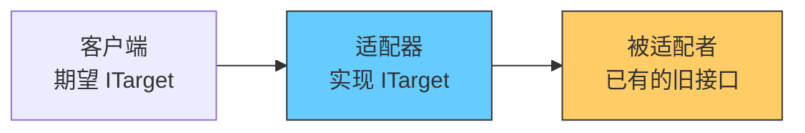
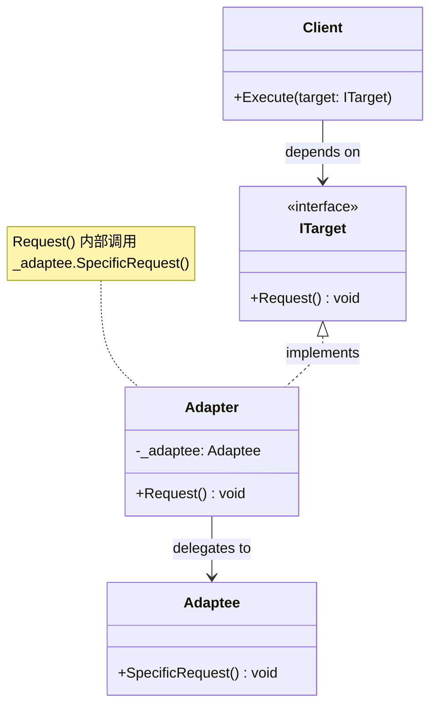
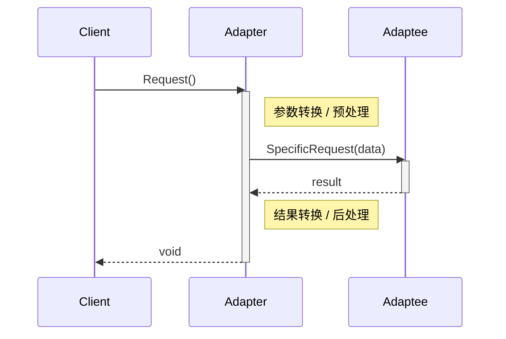

# 适配器模式 (Adapter)

> 所属计划: [[design-patterns-csharp|设计模式 (C#)]]
> 预计耗时: 50 分钟
> 前置知识: [[08-structural-intro|结构型模式总览]]

---

## 1. 概念讲解

### 问题场景：插头不匹配

你在国外旅行，带了国标三脚插头的笔记本电脑，但酒店只有欧标两孔插座。你不需要拆开电脑换电源线，而是用一个**转接头**把两者适配起来。

这就是适配器模式：**将已有的不兼容接口，转换成客户端期望的目标接口，使原本无法协作的类能一起工作。**



在 C# 项目中，适配器最常见的场景：
- 你引入了第三方库（日志、支付、缓存），想统一成项目自己的接口
- 遗留代码的 API 和新系统不兼容，但无法修改遗留代码
- 不同模块各自定义了类似但略有差异的接口，需要桥接

> [!note] GoF 定义
> 将一个类的接口转换成客户端期望的另一个接口。Adapter 使原本因接口不兼容而无法合作的类能一起工作。

### GoF 经典结构



| 角色          | 职责                           | 谁定义            |
| ----------- | ---------------------------- | -------------- |
| **Client**  | 调用 `ITarget` 接口，不关心背后是谁      | 你的业务代码         |
| **ITarget** | 客户端期望的接口                     | **你**（或你的项目规范） |
| **Adapter** | 实现 `ITarget`，内部转发到 `Adaptee` | **你**          |
| **Adaptee** | 已有的、不能改的类（第三方库、遗留代码）         | 第三方 / 遗留系统     |

**核心原则**：Client 依赖的是 `ITarget`，Adapter 是 `ITarget` 的一个实现；Client 从不知道 `Adaptee` 的存在。

### 调用流程



适配器在这个流程中承担三件事：
1. **参数映射**：把 `ITarget.Request()` 的参数翻译成 `Adaptee.SpecificRequest()` 能接受的格式
2. **委托调用**：调用 Adaptee 的实际方法
3. **结果转换**：把 Adaptee 的返回值 / 异常翻译成 Client 期望的格式

### 两种变体：类适配器 vs 对象适配器

|                    | 类适配器 (Class Adapter)    | 对象适配器 (Object Adapter) |
| ------------------ | ----------------------- | ---------------------- |
| **实现方式**           | 继承 Adaptee，同时实现 ITarget | 组合 Adaptee，实现 ITarget  |
| **C# 可行性**         | ⚠️ 几乎不可用 — C# 不允许多重继承类  | ✅ 标准做法                 |
| **能覆写 Adaptee 行为** | ✅ 可以 override           | ❌ 不能（但可以包装）            |
| **能适配 Adaptee 子类** | ❌ 只能适配具体的 Adaptee 类     | ✅ Adaptee 可以是接口，支持所有实现 |
| **耦合度**            | 高（继承 = 白盒复用）            | 低（组合 = 黑盒复用）           |

> [!warning] C# 中类适配器几乎不可用
> 因为 C# 不允许多重继承类。如果你的 Client 已经期望一个**抽象类**而非**接口**，且 Adapter 又需要继承 Adaptee，就会冲突。**永远默认用对象适配器（组合）。**

---

## 2. 代码示例

### 示例 1：类适配器 — 仅用于演示，实际请回避

此示例纯粹演示概念。由于 C# 没有类的多重继承，类适配器只能在 `ITarget` 是**接口**的前提下工作。

```csharp
// ============================================
// Adaptee: 第三方的旧日志库（你不能修改它）
// ============================================
public class LegacyLogger
{
    public void WriteLog(string severity, string message)
    {
        Console.WriteLine($"[{severity}] {DateTime.Now:HH:mm:ss} {message}");
    }
}

// ============================================
// ITarget: 你的项目定义的日志接口
// ============================================
public interface ILogger
{
    void LogInfo(string message);
    void LogError(string message);
}

// ============================================
// Class Adapter: 继承 Adaptee + 实现 ITarget
// ⚠️ 这能编译，但一旦 ILogger 需要同时继承
//    其他基类时就崩溃。仅作讲解用。
// ============================================
public class LegacyLoggerClassAdapter : LegacyLogger, ILogger
{
    public void LogInfo(string message)
    {
        base.WriteLog("INFO", message);
    }

    public void LogError(string message)
    {
        base.WriteLog("ERROR", message);
    }
}

// === 使用 ===
ILogger logger = new LegacyLoggerClassAdapter();
logger.LogInfo("服务已启动");
logger.LogError("连接数据库失败");

// 输出：
// [INFO] 14:32:05 服务已启动
// [ERROR] 14:32:05 连接数据库失败
```

> [!warning] 什么时候类适配器会直接编译失败
> 如果你的 `ITarget` 不是 `interface` 而是 `abstract class`（如 `LoggerBase`），并且 Adapter 还要继承另一个 `ServiceBase`，C# 直接拒绝编译。这就是为什么 **.NET 生态里几乎见不到类适配器**。

### 示例 2：对象适配器 — 标准做法：包装第三方 ILogger

这是 C# 项目中最实用的场景。你用 Serilog / NLog / log4net，但想在业务代码中依赖自己定义的 `IAppLogger` 接口，这样换日志库时只改 DI 注册。

```csharp
// ============================================
// Adaptee: 第三方日志库（模拟 Serilog 风格）
// ============================================
public class SerilogLogger  // 你无法修改的第三方类
{
    public void Information(string template, params object[] args)
    {
        Console.WriteLine($"[INF] {string.Format(template, args)}");
    }

    public void Error(Exception? ex, string template, params object[] args)
    {
        var msg = string.Format(template, args);
        Console.WriteLine($"[ERR] {msg}");
        if (ex != null) Console.WriteLine($"      Exception: {ex.Message}");
    }

    public void Debug(string template, params object[] args)
    {
        Console.WriteLine($"[DBG] {string.Format(template, args)}");
    }
}

// ============================================
// ITarget: 项目统一的日志接口
// ============================================
public interface IAppLogger
{
    void LogInformation(string message);
    void LogError(string message, Exception? ex = null);
    void LogDebug(string message);
}

// ============================================
// Object Adapter: 组合 Adaptee
// ============================================
public class SerilogAdapter : IAppLogger
{
    private readonly SerilogLogger _logger; // 组合，不是继承

    public SerilogAdapter(SerilogLogger logger)
    {
        _logger = logger ?? throw new ArgumentNullException(nameof(logger));
    }

    public void LogInformation(string message)
    {
        // 参数映射：IAppLogger 的简单 string → Serilog 的 template + args
        _logger.Information(message);
    }

    public void LogError(string message, Exception? ex = null)
    {
        // 参数映射 + 异常转发
        _logger.Error(ex, message);
    }

    public void LogDebug(string message)
    {
        _logger.Debug(message);
    }
}

// === DI 注册（ASP.NET Core 风格） ===
// services.AddSingleton<SerilogLogger>();
// services.AddSingleton<IAppLogger, SerilogAdapter>();

// === 使用 ===
var realLogger = new SerilogLogger();
IAppLogger logger = new SerilogAdapter(realLogger);

logger.LogInformation("用户 {UserId} 登录成功", "u_12345");
try
{
    throw new InvalidOperationException("余额不足");
}
catch (Exception ex)
{
    logger.LogError("支付失败", ex);
}
```

**运行方式:**
```bash
dotnet new console -n AdapterObjectDemo
# 将上述代码放入 Program.cs
dotnet run --project AdapterObjectDemo
```

**预期输出:**
```text
[INF] 用户 {UserId} 登录成功
[ERR] 支付失败
      Exception: 余额不足
```

> [!tip] 换日志库只改一行
> 将来如果 Serilog 换成 NLog，只需写一个新的 `NLogAdapter : IAppLogger`，然后在 DI 中换掉注册即可。所有业务代码对 `IAppLogger` 的调用保持不变。

### 示例 3：C# 特定 — 显式接口实现做适配器

当一个类需要以**不同方式**暴露同一方法给不同接口时，C# 的显式接口实现（Explicit Interface Implementation）是完美工具。

```csharp
// ============================================
// 场景: 从两个不同的第三方 SDK 读取配置
// ============================================

// Adaptee A: Azure App Configuration SDK 的接口风格
public class AzureConfigProvider
{
    public string GetSetting(string key) =>
        key switch
        {
            "connString" => "Server=prod.db;...",
            "maxRetries" => "5",
            _ => throw new KeyNotFoundException($"Key '{key}' not found")
        };
}

// Adaptee B: AWS Systems Manager 的接口风格
public class AwsParameterStore
{
    public string FetchParameter(string name) =>
        name switch
        {
            "connection_string" => "Server=prod.db;...",
            "max_retries" => "5",
            _ => throw new KeyNotFoundException($"Parameter '{name}' not found")
        };
}

// ITarget: 项目统一的配置接口
public interface IConfigurationService
{
    string GetValue(string key);
}

// ============================================
// 统一适配器：用显式接口实现分别适配两个源
// ============================================
public class HybridConfigAdapter : IConfigurationService
{
    private readonly AzureConfigProvider _azure;
    private readonly AwsParameterStore _aws;

    public HybridConfigAdapter(AzureConfigProvider azure, AwsParameterStore aws)
    {
        _azure = azure;
        _aws = aws;
    }

    // 显式实现：Client 只能通过 IConfigurationService 接口访问
    string IConfigurationService.GetValue(string key)
    {
        // 适配逻辑：键名映射 + 尝试多个源
        return key switch
        {
            "ConnectionString" =>
                TryAll(key, () => _azure.GetSetting("connString"),
                           () => _aws.FetchParameter("connection_string")),
            "MaxRetries" =>
                TryAll(key, () => _azure.GetSetting("maxRetries"),
                           () => _aws.FetchParameter("max_retries")),
            _ => throw new ArgumentException($"Unknown config key: {key}")
        };
    }

    private static string TryAll(string key, params Func<string>[] fetchers)
    {
        List<Exception> errors = new();
        foreach (var fetch in fetchers)
        {
            try { return fetch(); }
            catch (Exception ex) { errors.Add(ex); }
        }
        throw new AggregateException(
            $"All sources failed for key '{key}'", errors);
    }
}

// === 使用 ===
IConfigurationService config = new HybridConfigAdapter(
    new AzureConfigProvider(),
    new AwsParameterStore());

Console.WriteLine(config.GetValue("ConnectionString"));
Console.WriteLine(config.GetValue("MaxRetries"));

// HybridConfigAdapter 实例本身不能直接调用 GetValue——
// 必须通过 IConfigurationService 接口访问（显式实现的语义）
```

> [!tip] 显式接口实现的适配器优势
> 当 Adaptee 有**多个**异构数据源时，适配器可以将"尝试多个源、key 映射、容错"全部封装在 `IConfigurationService` 背后。Client 只需要 `config.GetValue("ConnectionString")` 一行。

### 示例 4：C# 特定 — 扩展方法做轻量适配器

当"适配"只是**类型转换**或**添加少量便利方法**，且不需要状态 / 依赖注入时，扩展方法是最轻量的方案——无需新建类。

```csharp
using System.Text.Json;

// ============================================
// Adaptee: 外部 API 返回的原始数据格式
// ============================================
public record ExternalUserDto(
    string first_name,    // snake_case
    string last_name,
    string email_address,
    string created_at     // ISO 8601 string
);

// ============================================
// ITarget: 项目内部需要的模型
// ============================================
public record UserModel(
    string FullName,
    string Email,
    DateTime CreatedAt
);

// ============================================
// 扩展方法适配：ExternalUserDto → UserModel
// ============================================
public static class ExternalUserDtoExtensions
{
    /// <summary>
    /// 将外部 API 的 DTO 适配为内部领域模型。
    /// </summary>
    public static UserModel ToDomain(this ExternalUserDto dto)
    {
        return new UserModel(
            FullName: $"{dto.first_name} {dto.last_name}",
            Email: dto.email_address,
            CreatedAt: DateTime.Parse(dto.created_at)
        );
    }

    /// <summary>
    /// 批量适配。注意：ToList() 是热切求值。
    /// </summary>
    public static IReadOnlyList<UserModel> ToDomain(
        this IEnumerable<ExternalUserDto> dtos)
    {
        return dtos.Select(d => d.ToDomain()).ToList();
    }

    /// <summary>
    /// 把外部 API JSON 字符串直接适配为领域模型列表。
    /// </summary>
    public static IReadOnlyList<UserModel> ParseAndAdapt(
        this string json)
    {
        var dtos = JsonSerializer.Deserialize<List<ExternalUserDto>>(json)
            ?? throw new InvalidOperationException("Deserialization returned null");
        return dtos.ToDomain();
    }
}

// === 使用 — 调用方完全感知不到 ExternalUserDto ===
// 模拟外部 API 返回的 JSON
string apiResponse = """
[
    {"first_name":"三","last_name":"张","email_address":"zhang@ex.com","created_at":"2026-01-15T08:30:00Z"},
    {"first_name":"四","last_name":"李","email_address":"li@ex.com","created_at":"2026-03-20T14:00:00Z"}
]
""";

IReadOnlyList<UserModel> users = apiResponse.ParseAndAdapt();

foreach (var u in users)
{
    Console.WriteLine($"{u.FullName} <{u.Email}> 创建于 {u.CreatedAt:yyyy-MM-dd}");
}
```

**运行方式:**
```bash
dotnet new console -n AdapterExtensionDemo
# 将上述代码放入 Program.cs
dotnet run --project AdapterExtensionDemo
```

**预期输出:**
```text
三 张 <zhang@ex.com> 创建于 2026-01-15
四 李 <li@ex.com> 创建于 2026-03-20
```

> [!tip] 扩展方法 vs 对象适配器的选择
> - **扩展方法**：纯数据映射、无状态、不需要 DI — 如 `ToDomain()`、`ToLegacyFormat()`
> - **对象适配器**：需要依赖注入、需要状态管理、需要实现接口以参与多态 — 如日志、支付网关、缓存

---


---

## C++ 实现

C++ 支持多重继承，因此**类适配器**和**对象适配器**两种变体均可使用。对象适配器（组合）更解耦，类适配器（多继承）可覆写 Adaptee 行为。以下演示经典"圆孔与方钉"场景。

```cpp
#include <iostream>
#include <cmath>
#include <memory>
using namespace std;

// ============================================
// Target: 圆孔期望的接口 — 所有钉子必须是"圆的"
// ============================================
class RoundPeg {
protected:
    double radius;
public:
    RoundPeg(double r = 0) : radius(r) {}
    virtual ~RoundPeg() = default;
    virtual double getRadius() const { return radius; }
};

// 圆孔只接受 RoundPeg
class RoundHole {
    double radius;
public:
    RoundHole(double r) : radius(r) {}
    bool fits(const RoundPeg& peg) const {
        return radius >= peg.getRadius();
    }
};

// ============================================
// Adaptee: 已有的方钉 — 与 RoundPeg 接口不兼容
// ============================================
class SquarePeg {
    double width;
public:
    SquarePeg(double w) : width(w) {}
    double getWidth() const { return width; }
};

// ============================================
// 对象适配器: 组合 SquarePeg，继承 RoundPeg
// 将方钉宽度换算为等效圆半径（对角线的一半）
// ============================================
class SquarePegAdapter : public RoundPeg {
    SquarePeg peg;       // 组合 — 持有 Adaptee
public:
    SquarePegAdapter(const SquarePeg& sp) : peg(sp) {}

    double getRadius() const override {
        // 能容纳方钉的最小圆半径 = 对角线 / 2
        return peg.getWidth() * sqrt(2.0) / 2.0;
    }
};

// ============================================
// [可选] 类适配器 — C++ 特有，利用多重继承
// ============================================
class SquarePegClassAdapter : public RoundPeg, private SquarePeg {
public:
    SquarePegClassAdapter(double w) : SquarePeg(w) {}
    double getRadius() const override {
        return getWidth() * sqrt(2.0) / 2.0;
    }
};

// === main / usage ===
int main() {
    RoundHole hole(5.0);                     // 半径 5 的圆孔

    RoundPeg roundPeg(4.0);                  // 半径 4 的圆钉
    SquarePeg smallSquare(5.0);              // 宽 5 的方钉 → 等效半径 ≈ 3.54
    SquarePeg bigSquare(10.0);               // 宽 10 → 等效半径 ≈ 7.07

    SquarePegAdapter smallAdapter(smallSquare);
    SquarePegAdapter bigAdapter(bigSquare);
    SquarePegClassAdapter classSmall(5.0);

    cout << boolalpha;
    cout << "roundPeg  fits: " << hole.fits(roundPeg)    << endl;  // true
    cout << "smallSquare fits: " << hole.fits(smallAdapter) << endl;  // true
    cout << "bigSquare   fits: " << hole.fits(bigAdapter)   << endl;  // false
    cout << "classAdapter fits: " << hole.fits(classSmall)  << endl;  // true
}
```

**编译与运行：**
```bash
g++ -std=c++17 -o prog main.cpp && ./prog
```

**预期输出：**
```text
roundPeg  fits: true
smallSquare fits: true
bigSquare   fits: false
classAdapter fits: true
```

> [!note] C++ 中类适配器 vs 对象适配器
> C++ 允许多重继承，因此类适配器技术上可行。但实践中**对象适配器更推荐**：它通过组合减少耦合，且能适配 Adaptee 的任何子类。类适配器仅在需要覆写 Adaptee 方法时考虑。

---
## 3. 练习

### 练习 1（基础）：适配遗留支付网关

背景：系统定义了一个新的支付接口 `IPaymentService`，但公司目前只有一个旧的支付系统 `LegacyPaymentGateway`（你不能改它）。

```csharp
// 不能修改的遗留代码
public class LegacyPaymentGateway
{
    // 返回 "SUCCESS:txn_xxx" 或 "FAILED:reason"
    public string ProcessPayment(string cardNumber, decimal amount, string currency)
    {
        if (string.IsNullOrEmpty(cardNumber) || cardNumber.Length != 16)
            return "FAILED:InvalidCardNumber";
        if (amount <= 0)
            return "FAILED:InvalidAmount";
        if (currency != "CNY")
            return "FAILED:UnsupportedCurrency";
        return $"SUCCESS:txn_{Guid.NewGuid():N}"[..12];
    }
}

// 你的新接口
public interface IPaymentService
{
    PaymentResult Pay(PaymentRequest request);
}

public record PaymentRequest(string CardNumber, decimal Amount);
public record PaymentResult(bool Success, string TransactionId, string? ErrorMessage);
```

**任务**：编写 `LegacyPaymentAdapter : IPaymentService`，使其：
- 将 `PaymentRequest` 映射到遗留 API 的参数
- 将遗留 API 的返回字符串解析为 `PaymentResult`
- 硬编码 `currency = "CNY"`（遗留系统只支持人民币）

```csharp
// TODO: 实现 LegacyPaymentAdapter
public class LegacyPaymentAdapter : IPaymentService
{
    private readonly LegacyPaymentGateway _gateway = new();
    // 你的代码...
}
```


### 练习 2（进阶）：用扩展方法适配 `List<T>` 到分页结果

背景：你需要把内存中的 `List<T>` 包装成分页查询的结果格式，以便统一处理 UI 分页。

```csharp
// 目标格式 — UI 层期望的接口
public record PagedResult<T>(
    IReadOnlyList<T> Items,
    int TotalCount,
    int Page,
    int PageSize)
{
    public int TotalPages => (int)Math.Ceiling((double)TotalCount / PageSize);
    public bool HasPrevious => Page > 1;
    public bool HasNext => Page < TotalPages;
}
```

**任务**：为 `IReadOnlyList<T>` 编写扩展方法 `ToPagedResult`，实现分页。同时编写一个重载接受 `IQueryable<T>` 做真分页（数据库场景）。

```csharp
// TODO
public static class PagingExtensions
{
    /// <summary>内存集合分页适配</summary>
    public static PagedResult<T> ToPagedResult<T>(
        this IReadOnlyList<T> source, int page, int pageSize)
    {
        // 你的代码...
    }

    /// <summary>IQueryable 分页适配（可用于 EF Core）</summary>
    public static PagedResult<T> ToPagedResult<T>(
        this IQueryable<T> query, int page, int pageSize)
    {
        // 你的代码...
    }
}
```


### 练习 3（挑战）：双向适配器

背景：系统内部用 `IMetricCollector` 收集指标，但你同时对接了 Prometheus 和 StatsD 两个监控后端。你需要一个**双向适配器**：
- 实现 `IMetricCollector`（正向：接收指标）
- 同时把数据转发到 Prometheus 和 StatsD 两个不同的 SDK

```csharp
// 你的统一接口
public interface IMetricCollector
{
    void IncrementCounter(string name, double value = 1);
    void RecordGauge(string name, double value);
    void RecordTiming(string name, TimeSpan duration);
}

// Adaptee A: Prometheus SDK 模拟（你无法修改）
public class PrometheusClient
{
    public void CounterInc(string metricName, double incValue, 
        Dictionary<string, string> labels) 
        => Console.WriteLine($"[Prometheus] counter {metricName} += {incValue}");

    public void ObserveHistogram(string metricName, double val)
        => Console.WriteLine($"[Prometheus] histogram {metricName} = {val}");
}

// Adaptee B: StatsD SDK 模拟（你无法修改）
public class StatsDClient
{
    public void Send(string stat, double value, string type)
        => Console.WriteLine($"[StatsD] {stat}:{value}|{type}");
}
```

**任务**：编写 `MetricsAdapter : IMetricCollector`，将统一接口调用同时转发到两个后端。

```csharp
// TODO
public class MetricsAdapter : IMetricCollector
{
    // 你的代码...
}
```

---

## 3.5 参考答案

> [!tip]- 练习 1 参考答案
> ```csharp
> using System;
>
> // ============================================
> // 遗留支付网关适配器
> // ============================================
> public class LegacyPaymentAdapter : IPaymentService
> {
>     private readonly LegacyPaymentGateway _gateway;
>
>     public LegacyPaymentAdapter(LegacyPaymentGateway gateway)
>     {
>         _gateway = gateway ?? throw new ArgumentNullException(nameof(gateway));
>     }
>
>     public PaymentResult Pay(PaymentRequest request)
>     {
>         // 参数映射：PaymentRequest → 遗留 API 的 (cardNumber, amount, currency)
>         var response = _gateway.ProcessPayment(
>             request.CardNumber,
>             request.Amount,
>             "CNY");  // 硬编码 — 适配器的职责：隐藏差异
>
>         // 结果转换：遗留字符串 → PaymentResult
>         if (response.StartsWith("SUCCESS:"))
>         {
>             var txnId = response["SUCCESS:".Length..];
>             return new PaymentResult(true, txnId, null);
>         }
>
>         var errorMsg = response["FAILED:".Length..];
>         return new PaymentResult(false, string.Empty, errorMsg);
>     }
> }
>
>
> // ============================================
> // 验证测试
> // ============================================
> static void TestPaymentAdapter()
> {
>     var gateway = new LegacyPaymentGateway();
>     IPaymentService payment = new LegacyPaymentAdapter(gateway);
>
>     // 成功支付
>     var result1 = payment.Pay(new PaymentRequest("1234567890123456", 100m));
>     Console.WriteLine($"成功: {result1.Success}, TxnId: {result1.TransactionId}");
>
>     // 无效卡号
>     var result2 = payment.Pay(new PaymentRequest("1234", 100m));
>     Console.WriteLine($"成功: {result2.Success}, Error: {result2.ErrorMessage}");
>
>     // 无效金额
>     var result3 = payment.Pay(new PaymentRequest("1234567890123456", -50m));
>     Console.WriteLine($"成功: {result3.Success}, Error: {result3.ErrorMessage}");
> }
> ```
> **设计要点：**
> - `LegacyPaymentGateway` 通过构造函数注入，便于单元测试时 mock 或替换
> - `currency` 硬编码为 `"CNY"`：这是适配器的核心职责——**隐藏 Adaptee 的差异细节**
> - 结果转换将字符串协议解析为强类型 `PaymentResult`，让调用方不需要关心遗留 API 的字符串格式
> - 如果未来换成另一个支付网关，只需写一个新 Adapter 实现 `IPaymentService`，客户端代码零改动

> [!tip]- 练习 2 参考答案
> ```csharp
> using System;
> using System.Collections.Generic;
> using System.Linq;
>
> public static class PagingExtensions
> {
>     /// <summary>内存集合分页适配（IReadOnlyList&lt;T&gt;）</summary>
>     public static PagedResult<T> ToPagedResult<T>(
>         this IReadOnlyList<T> source, int page, int pageSize)
>     {
>         if (page < 1)
>             throw new ArgumentOutOfRangeException(nameof(page),
>                 $"页码必须 >= 1，当前值: {page}");
>         if (pageSize < 1)
>             throw new ArgumentOutOfRangeException(nameof(pageSize),
>                 $"每页大小必须 >= 1，当前值: {pageSize}");
>
>         var items = source
>             .Skip((page - 1) * pageSize)
>             .Take(pageSize)
>             .ToList();
>
>         return new PagedResult<T>(items, source.Count, page, pageSize);
>     }
>
>     /// <summary>IQueryable 分页适配（EF Core / 数据库场景）</summary>
>     public static PagedResult<T> ToPagedResult<T>(
>         this IQueryable<T> query, int page, int pageSize)
>     {
>         if (page < 1)
>             throw new ArgumentOutOfRangeException(nameof(page),
>                 $"页码必须 >= 1，当前值: {page}");
>         if (pageSize < 1)
>             throw new ArgumentOutOfRangeException(nameof(pageSize),
>                 $"每页大小必须 >= 1，当前值: {pageSize}");
>
>         // 注意：这会产生两次数据库查询（Count + ToList）
>         // 生产环境中可考虑一次查询同时获取 total 和 items
>         var totalCount = query.Count();
>         var items = query
>             .Skip((page - 1) * pageSize)
>             .Take(pageSize)
>             .ToList();
>
>         return new PagedResult<T>(items, totalCount, page, pageSize);
>     }
> }
>
>
> // ============================================
> // 验证测试
> // ============================================
> static void TestPaging()
> {
>     var data = Enumerable.Range(1, 100)
>         .Select(i => $"Item-{i}")
>         .ToList();
>
>     // 内存分页
>     var page1 = data.ToPagedResult(page: 1, pageSize: 10);
>     Console.WriteLine($"第 {page1.Page}/{page1.TotalPages} 页，" +
>         $"共 {page1.TotalCount} 条，当前 {page1.Items.Count} 条");
>     Console.WriteLine($"  Items: [{string.Join(", ", page1.Items)}]");
>     Console.WriteLine($"  HasNext: {page1.HasNext}, HasPrevious: {page1.HasPrevious}");
>
>     // 边界测试：最后一页不足 pageSize
>     var lastPage = data.ToPagedResult(page: 10, pageSize: 10);
>     Console.WriteLine($"\n第 {lastPage.Page}/{lastPage.TotalPages} 页，" +
>         $"共 {lastPage.TotalCount} 条，当前 {lastPage.Items.Count} 条");
>     Console.WriteLine($"  HasNext: {lastPage.HasNext}, HasPrevious: {lastPage.HasPrevious}");
> }
> ```
> **设计要点：**
> - 扩展方法是对"适配器模式"的轻量级 C# 实现——不需要单独的 Adapter 类，直接用静态方法把 `IReadOnlyList<T>` / `IQueryable<T>` "适配"成 `PagedResult<T>`
> - 参数校验（`page >= 1`）放在方法入口，遵循 fail-fast 原则
> - `IQueryable<T>` 重载适用于 EF Core：`Skip/Take` 会被翻译成 SQL `OFFSET/FETCH`，只从数据库取需要的行
> - `PagedResult<T>` 的 `TotalPages`、`HasPrevious`、`HasNext` 是计算属性，零额外存储

> [!tip]- 练习 3 参考答案（挑战）
> ```csharp
> using System;
> using System.Collections.Generic;
>
> // ============================================
> // 双向适配器：同时对接 Prometheus + StatsD
> // ============================================
> public class MetricsAdapter : IMetricCollector
> {
>     private readonly PrometheusClient _prometheus;
>     private readonly StatsDClient _statsd;
>
>     public MetricsAdapter(PrometheusClient prometheus, StatsDClient statsd)
>     {
>         _prometheus = prometheus ?? throw new ArgumentNullException(nameof(prometheus));
>         _statsd = statsd ?? throw new ArgumentNullException(nameof(statsd));
>     }
>
>     public void IncrementCounter(string name, double value = 1)
>     {
>         // Prometheus: counter 指标 — 只增不减
>         _prometheus.CounterInc(name, value,
>             new Dictionary<string, string>());
>
>         // StatsD: counter 类型用 "c" 后缀
>         _statsd.Send(name, value, "c");
>     }
>
>     public void RecordGauge(string name, double value)
>     {
>         // Prometheus 没有原生 gauge 方法，用 counter inc 模拟
>         // （实际项目中 Prometheus 有专门的 Gauge API）
>         _prometheus.CounterInc(name + "_gauge", value,
>             new Dictionary<string, string>());
>
>         // StatsD: gauge 类型用 "g" 后缀
>         _statsd.Send(name, value, "g");
>     }
>
>     public void RecordTiming(string name, TimeSpan duration)
>     {
>         // Prometheus: 用 histogram 记录，单位统一为秒
>         _prometheus.ObserveHistogram(
>             name + "_seconds",
>             duration.TotalSeconds);
>
>         // StatsD: timing 类型用 "ms" 后缀，单位为毫秒
>         _statsd.Send(name, duration.TotalMilliseconds, "ms");
>     }
> }
>
>
> // ============================================
> // 验证测试
> // ============================================
> static void TestMetricsAdapter()
> {
>     IMetricCollector metrics = new MetricsAdapter(
>         new PrometheusClient(), new StatsDClient());
>
>     Console.WriteLine("=== 计数器 ===");
>     metrics.IncrementCounter("http_requests_total");
>     metrics.IncrementCounter("http_errors_total", value: 3);
>
>     Console.WriteLine("\n=== 仪表盘 ===");
>     metrics.RecordGauge("active_connections", value: 42);
>
>     Console.WriteLine("\n=== 计时器 ===");
>     metrics.RecordTiming("db_query_duration", TimeSpan.FromMilliseconds(42));
>     metrics.RecordTiming("api_latency", TimeSpan.FromSeconds(1.5));
> }
>
> // 预期输出:
> // [Prometheus] counter http_requests_total += 1
> // [StatsD] http_requests_total:1|c
> // [Prometheus] counter http_errors_total += 3
> // [StatsD] http_errors_total:3|c
> // [Prometheus] counter active_connections_gauge += 42
> // [StatsD] active_connections:42|g
> // [Prometheus] histogram db_query_duration_seconds = 0.042
> // [StatsD] db_query_duration:42|ms
> // [Prometheus] histogram api_latency_seconds = 1.5
> // [StatsD] api_latency:1500|ms
> ```
> **设计要点：**
> - 这是一个"一对多"适配器：一个统一的 `IMetricCollector` 接口，同时桥接到两个不同的监控后端
> - 参数映射是核心：Prometheus 用秒、StatsD 用毫秒；Prometheus 用 histogram 记录 timing、StatsD 用 `|ms` 类型
> - 每个方法同时调用两个后端，确保**两个系统都能收到相同指标数据**
> - 这不是"双向"（bidirectional）而是"多路复用"（multiplexing）——但练习的意图是理解"一个适配器同时对接多个 Adaptee"的场景

> [!note] 答案使用方式
> 先独立完成练习，再展开查看参考答案。参考答案不是唯一解——如果你的实现通过了测试或达到了题目要求，就是正确的。


## 4. 扩展阅读

### 设计模式关系

- [[08-structural-intro|结构型模式总览]] — 适配器在结构型模式族谱中的位置
- **Facade** — 当适配器太多时，可能需要的是一个 Facade 来统一子系统入口，而不是逐个包装
- **Bridge** — Adapter 解决"已有的不同接口"，Bridge 在**设计阶段**就分离抽象与实现
- **Decorator** — 两者都是"包装"模式，但 Decorator 增强原有接口，Adapter 改变原有接口

### GoF 原书

- *Design Patterns: Elements of Reusable Object-Oriented Software* — Gamma, Helm, Johnson, Vlissides (1994)
  - Chapter 4: Structural Patterns — Adapter (139–150)

### .NET 中的适配器实例

- `System.IO.StreamReader` / `StreamWriter` — 把字节流 `Stream` 适配成字符流 `TextReader` / `TextWriter`
- `DbDataAdapter` — 把 `DataSet` 和数据库之间的数据同步适配起来
- `System.Linq.Enumerable.ToList()` / `.ToArray()` — 把 `IEnumerable<T>` 适配为具体集合类型

### 外部资源

- <https://refactoring.guru/design-patterns/adapter>
- <https://learn.microsoft.com/en-us/dotnet/standard/microservices-architecture/microservice-ddd-cqrs-patterns/implement-value-objects> — DDD 中的适配器实践（防腐层 Anti-Corruption Layer）

---

## 常见陷阱

### 1. 适配器变成"纯透传"——没有价值

```csharp
// ❌ 错误：适配器没有任何转换逻辑，纯粹传递调用
public class UselessAdapter : IAppLogger
{
    private readonly SerilogLogger _logger;
    public UselessAdapter(SerilogLogger logger) => _logger = logger;
    
    public void LogInformation(string message)
        => _logger.Information(message); // 参数一模一样
    public void LogError(string message, Exception? ex = null)
        => _logger.Error(ex, message);    // 参数一模一样
    public void LogDebug(string message)
        => _logger.Debug(message);        // 参数一模一样
}
// 问题：如果接口签名完全一样，为什么不直接让 Client 依赖 SerilogLogger？
// 这种适配器只是多了间接层，没有任何抽象收益。
```

**正确做法**：如果接口签名一样，考虑是否可以直接用 Adaptee 的接口，或者让 Adaptee 实现你的接口（如果 Adaptee 是你自己的代码）。只在实际有**参数映射、格式转换、协议适配**时才引入 Adapter。

### 2. 适配器太多——考虑 Facade

```csharp
// ❌ 问题：每个子系统接口都单独适配，导致 N 个 Adapter 类
public class PaymentAdapter : IPaymentService { ... }
public class InventoryAdapter : IInventoryService { ... }
public class ShippingAdapter : IShippingService { ... }
public class NotificationAdapter : INotificationService { ... }
// ... 20 more

// ✅ 如果这 20 个 Adapter 都封装同一个遗留 ERP 系统，
//    用一个 Facade 更好：一次封装整个子系统
public class LegacyErpFacade
{
    public PaymentResult ProcessPayment(...) { ... }
    public InventoryStatus CheckStock(...) { ... }
    public ShippingLabel CreateShipment(...) { ... }
    // 一个入口，内部处理所有差异
}
```

> [!tip] Adapter vs Facade 的判断标准
> - **Adapter**：你的接口和 Adaptee 接口是一对一的映射关系（一个 `ILogger` 对应一个 `Serilog`）
> - **Facade**：你的接口是对整个子系统的**简化入口**（一个 `LegacyErpFacade` 背后是 20 个类）

### 3. 不处理 Adaptee 的异常

```csharp
// ❌ 错误：Adaptee 的异常直接穿透到 Client
public class PaymentAdapter : IPaymentService
{
    private readonly LegacyPaymentGateway _gateway;
    
    public PaymentResult Pay(PaymentRequest request)
    {
        var response = _gateway.ProcessPayment(/* ... */);
        return ParseResult(response);
    }
    // 如果 LegacyPaymentGateway 抛出 SocketException 或 TimeoutException，
    // Client 被迫知道它会依赖一个"网络调用"的遗留系统 —
    // 这恰好是 Adapter 应该屏蔽的细节。
}

// ✅ 正确：捕获 Adaptee 异常，翻译为 Client 能理解的异常
public PaymentResult Pay(PaymentRequest request)
{
    try
    {
        var response = _gateway.ProcessPayment(/* ... */);
        return ParseResult(response);
    }
    catch (TimeoutException ex)
    {
        throw new PaymentServiceException(
            "支付网关响应超时，请稍后重试", ex);
    }
    catch (Exception ex) when (ex is not PaymentServiceException)
    {
        throw new PaymentServiceException(
            "支付服务暂时不可用", ex);
    }
}

public class PaymentServiceException : Exception
{
    public PaymentServiceException(string message, Exception? inner = null)
        : base(message, inner) { }
}
```

**为什么这很重要**：适配器的核心承诺是**隔离变化**。如果 Adaptee 的异常类型直接暴露给 Client，将来换 Adaptee 时 Client 的 `catch` 块也必须改——适配器失去了价值。

### 4. 双向适配器中的无限递归

```csharp
// ❌ 危险：两个适配器互相引用
public class AtoBAdapter : IBService
{
    private readonly IAService _a;
    private readonly IBService _b; // AtoBAdapter 又引用 IBService?!
    // ... 如果 B 的实现恰好又是 BtoAAdapter，调用会无限递归
}
```

如果确实需要双向适配（如练习 3），确保每个方向是**独立的委托路径**，不要让适配器互相持有对方的接口。

### 5. 适配器承担了太多逻辑

```csharp
// ❌ 适配器里有业务逻辑
public class PaymentAdapter : IPaymentService
{
    public PaymentResult Pay(PaymentRequest request)
    {
        // 参数映射 — OK
        // ...
        // 风控检查 — 这不是适配器的事！
        if (request.Amount > 10000)
            throw new InvalidOperationException("超过限额");
        // 日志 — 这不是适配器的事！
        _logger.LogInformation("处理支付...");
        // 调用 Adaptee — OK
        var result = _gateway.ProcessPayment(...);
        // 发邮件通知 — 这不是适配器的事！
        _emailService.Send("支付成功", ...);
        return ParseResult(result);
    }
}
```

适配器的**唯一职责**是接口转换。业务逻辑、日志、通知应该由其他服务通过组合/装饰器来处理。
