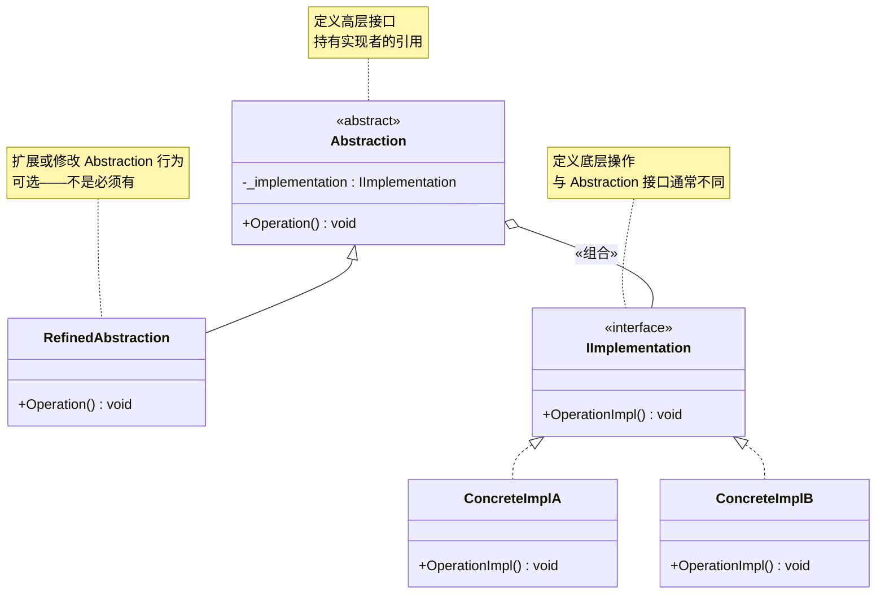
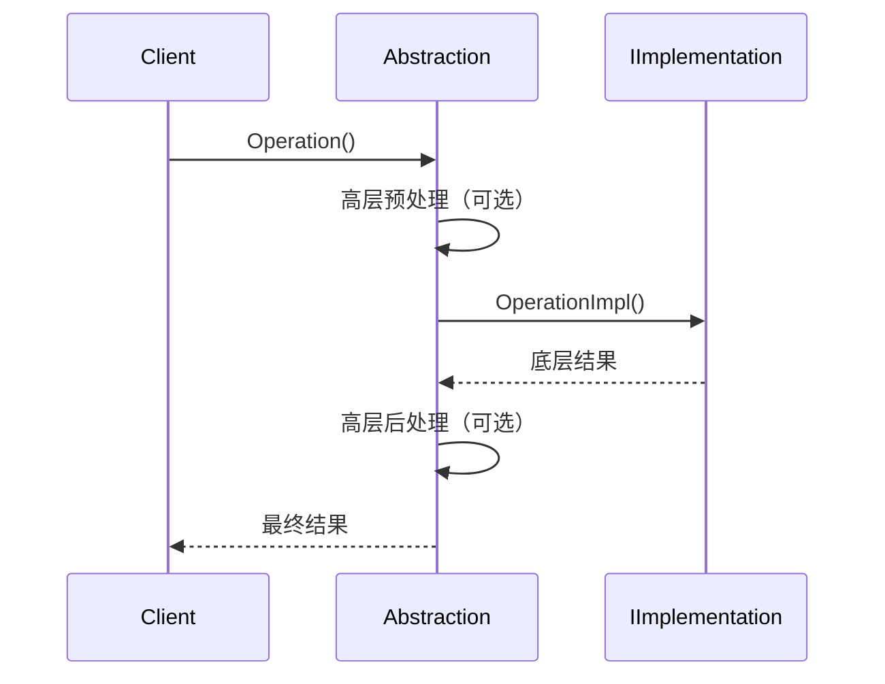

# 桥接模式

> 所属计划: [[design-patterns-csharp|设计模式 (C#)]]
> 预计耗时: 75 分钟
> 前置知识: [[08-structural-intro|结构型模式总览]]

---

## 1. 概念讲解

### 问题：多维度变化导致的类爆炸

假设你在开发一个跨平台 UI 框架，需要同时支持多种控件（Button、TextBox、Checkbox）和多种操作系统（Windows、macOS、Linux）。如果为每种组合创建一个类：

```
WindowsButton、WindowsTextBox、WindowsCheckbox、
macOSButton、macOSTextBox、macOSCheckbox、
LinuxButton、LinuxTextBox、LinuxCheckbox
```

3 种控件 × 3 种平台 = **9 个类**。增加一个控件 → 新增 3 个类；增加一个平台 → 新增 3 个类。组合爆炸。

这就是**继承的局限性**：继承把两个独立变化的维度捆绑在了一起。

### 桥接模式的核心思想

> 将抽象与实现解耦，使两者可以**独立变化**。

桥接模式把一个类的两个变化维度拆分为**两个独立的层次结构**：

- **Abstraction**（抽象层）：面向客户端的高级接口——"做什么"（控件的逻辑）
- **Implementation**（实现层）：底层具体实现——"怎么做"（平台的绘制细节）

两者通过**组合**（而非继承）连接：Abstraction 持有 Implementation 的引用，调用 Implementation 的方法完成工作。

```
不能继承两个维度 → 继承一个维度，组合另一个维度
```

### 关键差异：Bridge vs Adapter

| 维度 | Bridge（桥接） | Adapter（适配器） |
|------|---------------|-------------------|
| 设计时机 | **设计时**：为未来变化提前分离接口 | **改造时**：让不兼容接口协同工作 |
| 解决的问题 | 多维度独立变化的组合爆炸 | 接口不匹配 |
| 参与者关系 | Abstraction ↔ Implementation 是**对等**的两个层次 | Adapter **单向**适配 Adaptee 到 Target |
| 变化方向 | 两个层次各自独立变化 | Adaptee 不变，Adapter 做翻译 |
| 代码位置 | 通常在同一个代码库内 | 常常跨库/跨系统 |

> [!tip] 记忆口诀
> Bridge 是"先把桥墩修好"，Adapter 是"给旧船配新码头"。

详细对比见 [[09-adapter|适配器模式]]。

### 结构



- **`Abstraction`**（抽象类）：定义上层操作接口，持有 `IImplementation` 引用
- **`RefinedAbstraction`**（精化抽象）：扩展 Abstraction 的行为（可选）
- **`IImplementation`**（实现接口）：定义底层操作接口——通常与 `Abstraction` 的方法**不同**
- **`ConcreteImplA/B`**（具体实现）：提供平台相关/底层具体实现

> [!warning] Abstraction 接口 ≠ Implementation 接口
> 桥接模式的 Abstraction 和 Implementation 的接口通常**完全不同**——前者面向客户端需求，后者面向底层实现细节。这正是它区别于简单"接口 + 实现"的地方。



### Bridge + DI：现代 C# 的最佳实践

在 .NET 中，桥接模式通常表现为：**通过构造函数注入 Implementation，Abstraction 不关心具体是哪个实现**。

```csharp
// 抽象层不创建实现——由 DI 容器注入
public class ReportGenerator
{
    private readonly IDataExporter _exporter; // ← Implementation

    public ReportGenerator(IDataExporter exporter) // ← 注入
        => _exporter = exporter;

    public void Generate(ReportData data)
        => _exporter.Export(data); // 委托给实现层
}
```

这与 [[09-adapter|适配器模式]] 的 DI 用法有本质区别：Bridge 的 Implementation **天生就是接口设计的目标消费者**，而 Adapter 是被动适配。

---

## 2. 代码示例

### 示例 1：渲染 API（Shape + IRenderer）

这是桥接模式的经典示例——形状（Shape）和渲染器（Renderer）是两个独立变化的维度。

```csharp
using System;

#region Implementation 层次结构 — 渲染器

/// <summary>实现接口：所有渲染器必须遵守的契约</summary>
public interface IRenderer
{
    void RenderCircle(double radius);
    void RenderRectangle(double width, double height);
    void RenderTriangle(double a, double b, double c);
}

/// <summary>矢量渲染器 — 用线条和路径描述图形</summary>
public class VectorRenderer : IRenderer
{
    public void RenderCircle(double radius)
        => Console.WriteLine($"  [矢量] 绘制圆形 (r={radius}) — SVG path + stroke");

    public void RenderRectangle(double width, double height)
        => Console.WriteLine($"  [矢量] 绘制矩形 ({width}×{height}) — <rect> 元素");

    public void RenderTriangle(double a, double b, double c)
        => Console.WriteLine($"  [矢量] 绘制三角形 ({a},{b},{c}) — <polygon> 元素");
}

/// <summary>光栅渲染器 — 用像素填充图形</summary>
public class RasterRenderer : IRenderer
{
    public void RenderCircle(double radius)
        => Console.WriteLine($"  [光栅] 绘制圆形 (r={radius}) — 像素填充，抗锯齿边缘");

    public void RenderRectangle(double width, double height)
        => Console.WriteLine($"  [光栅] 绘制矩形 ({width}×{height}) — 逐行扫描填充");

    public void RenderTriangle(double a, double b, double c)
        => Console.WriteLine($"  [光栅] 绘制三角形 ({a},{b},{c}) — 三角形光栅化 + 重心坐标");
}

#endregion

#region Abstraction 层次结构 — 形状

/// <summary>抽象层基类：所有形状共用，通过组合持有渲染器</summary>
public abstract class Shape
{
    protected readonly IRenderer Renderer;

    protected Shape(IRenderer renderer)
        => Renderer = renderer;

    /// <summary>绘制自身 — 模板方法骨架</summary>
    public void Draw()
    {
        Console.WriteLine($"--- 开始绘制 {Name} ---");
        DrawShape(); // 子类决定形状 → 委托给 Renderer
        Console.WriteLine($"--- {Name} 绘制完成 ---");
    }

    protected abstract void DrawShape();
    protected abstract string Name { get; }
}

public class Circle : Shape
{
    private readonly double _radius;

    public Circle(IRenderer renderer, double radius = 50)
        : base(renderer) => _radius = radius;

    protected override string Name => $"圆形 (r={_radius})";

    protected override void DrawShape()
        => Renderer.RenderCircle(_radius);
}

public class Rectangle : Shape
{
    private readonly double _width;
    private readonly double _height;

    public Rectangle(IRenderer renderer, double width = 100, double height = 60)
        : base(renderer)
    {
        _width = width;
        _height = height;
    }

    protected override string Name => $"矩形 ({_width}×{_height})";

    protected override void DrawShape()
        => Renderer.RenderRectangle(_width, _height);
}

#endregion

#region 客户端代码

public static class Program
{
    public static void Main()
    {
        // 维度 1：选择渲染器
        IRenderer vectorRenderer = new VectorRenderer();
        IRenderer rasterRenderer = new RasterRenderer();

        // 维度 2：选择形状 — 两个维度在构造时组合（笛卡尔积）
        Shape[] shapes =
        {
            new Circle(vectorRenderer, 30),
            new Rectangle(vectorRenderer, 80, 40),
            new Circle(rasterRenderer, 45),
            new Rectangle(rasterRenderer, 120, 70),
        };

        foreach (var shape in shapes)
            shape.Draw();

        Console.WriteLine();
        Console.WriteLine($"共绘制 {shapes.Length} 个形状");
        Console.WriteLine("2 种渲染器 × 2 种形状 = 4 种组合 — 仅 5 个类（不是 4 个）");
    }
}

#endregion
```

**运行方式：**
```bash
dotnet new console -n BridgeShapeDemo
# 将上述代码放入 Program.cs（替换默认内容）
dotnet run --project BridgeShapeDemo
```

**预期输出：**
```text
--- 开始绘制 圆形 (r=30) ---
  [矢量] 绘制圆形 (r=30) — SVG path + stroke
--- 圆形 (r=30) 绘制完成 ---
--- 开始绘制 矩形 (80×40) ---
  [矢量] 绘制矩形 (80×40) — <rect> 元素
--- 矩形 (80×40) 绘制完成 ---
--- 开始绘制 圆形 (r=45) ---
  [光栅] 绘制圆形 (r=45) — 像素填充，抗锯齿边缘
--- 圆形 (r=45) 绘制完成 ---
--- 开始绘制 矩形 (120×70) ---
  [光栅] 绘制矩形 (120×70) — 逐行扫描填充
--- 矩形 (120×70) 绘制完成 ---

共绘制 4 个形状
2 种渲染器 × 2 种形状 = 4 种组合 — 仅 5 个类（不是 4 个）
```

> [!note] 类数量分析
> 用继承：Shape × Renderer = 2 × 2 = 4 个具体类（VectorCircle, RasterCircle, VectorRectangle, RasterRectangle）。添加第 3 种渲染器 → 再新增 2 个类。
>
> 用 Bridge：只需要 1 个 `IRenderer` + 2 个 Renderer + 1 个 `Shape` 抽象 + 2 个 Shape 子类 = 6 个声明。添加第 3 种渲染器 → 只需新增 1 个类，Shape 层零改动。

---

### 示例 2：通知系统（Message + ISender）

真实业务场景：消息类型（普通消息、紧急消息）和发送渠道（邮件、短信）是两个独立的变化维度。

```csharp
using System;
using System.Collections.Generic;

#region Implementation 层次结构 — 发送渠道

public interface ISender
{
    void Send(string recipient, string title, string body);
}

public class EmailSender : ISender
{
    public void Send(string recipient, string title, string body)
    {
        Console.WriteLine($"[Email → {recipient}]");
        Console.WriteLine($"  主题: {title}");
        Console.WriteLine($"  正文: {body}");
        Console.WriteLine($"  (SMTP 发送完成)");
    }
}

public class SmsSender : ISender
{
    public void Send(string recipient, string title, string body)
    {
        Console.WriteLine($"[SMS → {recipient}]");
        // SMS 通常不展示 title，但对调用方透明
        Console.WriteLine($"  内容: {body}");
        Console.WriteLine($"  (短信网关发送完成)");
    }
}

public class WechatSender : ISender
{
    public void Send(string recipient, string title, string body)
    {
        Console.WriteLine($"[微信 → {recipient}]");
        Console.WriteLine($"  标题: {title}");
        Console.WriteLine($"  {body}");
        Console.WriteLine($"  (企业微信 API 调用完成)");
    }
}

#endregion

#region Abstraction 层次结构 — 消息类型

/// <summary>抽象消息 — 持有发送者引用</summary>
public abstract class Message
{
    protected readonly ISender Sender;

    protected Message(ISender sender) => Sender = sender;

    public string Recipient { get; set; } = string.Empty;

    /// <summary>发送消息 — 模板方法</summary>
    public void Send()
    {
        if (string.IsNullOrEmpty(Recipient))
            throw new InvalidOperationException("收件人不能为空");

        string title = BuildTitle();
        string body = BuildBody();

        Console.WriteLine($"=== [{GetType().Name}] ===");
        Sender.Send(Recipient, title, body);
        Console.WriteLine();
    }

    protected abstract string BuildTitle();
    protected abstract string BuildBody();
}

/// <summary>普通消息</summary>
public class NormalMessage : Message
{
    private readonly string _content;

    public NormalMessage(ISender sender, string content)
        : base(sender) => _content = content;

    protected override string BuildTitle() => "通知";

    protected override string BuildBody()
        => $"【普通通知】{_content}\n时间: {DateTime.Now:yyyy-MM-dd HH:mm:ss}";
}

/// <summary>紧急消息 — RefinedAbstraction：扩展了行为（添加优先级标记）</summary>
public class UrgentMessage : Message
{
    private readonly string _content;
    private readonly int _priority;

    public UrgentMessage(ISender sender, string content, int priority = 1)
        : base(sender)
    {
        _content = content;
        _priority = priority;
    }

    protected override string BuildTitle()
        => $"[紧急 P{_priority}] 重要通知";

    protected override string BuildBody()
        => $"【紧急通知 — 优先级 {_priority}】\n{_content}\n\n⚠️ 请立即处理！";
}

#endregion

#region 客户端代码

public static class Program
{
    public static void Main()
    {
        // 构建发送渠道池
        ISender email = new EmailSender();
        ISender sms = new SmsSender();
        ISender wechat = new WechatSender();

        // 组合：消息类型 × 发送渠道
        var messages = new List<Message>
        {
            new NormalMessage(email, "你的月度报告已生成")   { Recipient = "user@company.com" },
            new NormalMessage(sms, "验证码: 481023")         { Recipient = "13800138000" },
            new UrgentMessage(email, "服务器 CPU 使用率超过 95%", 1) { Recipient = "ops@company.com" },
            new UrgentMessage(sms, "数据库连接池耗尽", 2)    { Recipient = "13900139000" },
            new UrgentMessage(wechat, "安全漏洞 CVE-2026-1234 需立即修复", 1) { Recipient = "dev-team" },
        };

        foreach (var msg in messages)
            msg.Send();

        Console.WriteLine("3 种渠道 × 2 种消息类型 = 6 种组合，仅定义 6 个类（比继承方案少 6 个）");
    }
}

#endregion
```

**运行方式：**
```bash
dotnet new console -n BridgeNotificationDemo
# 将上述代码放入 Program.cs（替换默认内容）
dotnet run --project BridgeNotificationDemo
```

**预期输出：**
```text
=== [NormalMessage] ===
[Email → user@company.com]
  主题: 通知
  正文: 【普通通知】你的月度报告已生成
时间: 2026-06-08 ...
  (SMTP 发送完成)

=== [NormalMessage] ===
[SMS → 13800138000]
  内容: 【普通通知】验证码: 481023
时间: 2026-06-08 ...
  (短信网关发送完成)

=== [UrgentMessage] ===
[Email → ops@company.com]
  主题: [紧急 P1] 重要通知
  正文: 【紧急通知 — 优先级 1】
服务器 CPU 使用率超过 95%

⚠️ 请立即处理！
  (SMTP 发送完成)

=== [UrgentMessage] ===
[SMS → 13900139000]
  内容: 【紧急通知 — 优先级 2】
数据库连接池耗尽

⚠️ 请立即处理！
  (短信网关发送完成)

=== [UrgentMessage] ===
[微信 → dev-team]
  标题: [紧急 P1] 重要通知
  【紧急通知 — 优先级 1】
安全漏洞 CVE-2026-1234 需立即修复

⚠️ 请立即处理！
  (企业微信 API 调用完成)

3 种渠道 × 2 种消息类型 = 6 种组合，仅定义 6 个类（比继承方案少 6 个）
```

> [!tip] 为什么并非所有组合都需要 RefinedAbstraction？
> `NormalMessage` 和 `UrgentMessage` 都是 `Message` 的子类，但它们改造的是**消息本身的行为**（标题格式、正文模板），与发送渠道无关。每个 Message 子类都能与任何 `ISender` 组合——这是 Bridge 的关键价值。

---

### 示例 3：C# 惯用法——依赖注入集成

在真实 .NET 应用中，桥接模式通常通过 DI 容器实现：

```csharp
using Microsoft.Extensions.DependencyInjection;
using Microsoft.Extensions.Hosting;
using System;

#region 接口定义（与示例 2 相同）

public interface ISender
{
    void Send(string recipient, string title, string body);
}

public class EmailSender : ISender
{
    public void Send(string recipient, string title, string body)
        => Console.WriteLine($"[Email] → {recipient}: {title} — {body}");
}

public class SmsSender : ISender
{
    public void Send(string recipient, string title, string body)
        => Console.WriteLine($"[SMS] → {recipient}: {body}");
}

#endregion

#region 通过 DI 注入 Implementation 的 Abstraction

public interface INotificationService
{
    void Notify(string recipient, string message);
}

/// <summary>
/// Abstraction — 接收 INotificationService 的客户端不需要知道
/// 底层用的是 Email 还是 SMS。
/// ISender 通过构造函数注入。
/// </summary>
public class NotificationService : INotificationService
{
    private readonly ISender _sender;             // ← Implementation（注入）
    private readonly string _appName;

    public NotificationService(ISender sender, string appName = "MyApp")
    {
        _sender = sender;
        _appName = appName;
    }

    public void Notify(string recipient, string message)
    {
        // 高层逻辑：格式化消息
        var title = $"[{_appName}] 系统通知";
        var body = $"{message}\n\n—— 此消息由 {_appName} 自动发送";

        // 委托给底层实现
        _sender.Send(recipient, title, body);
    }
}

#endregion

#region 应用入口

public static class Program
{
    public static void Main()
    {
        using var host = Host.CreateDefaultBuilder(args)
            .ConfigureServices((context, services) =>
            {
                // ═══ Bridge 的 Implementation 维度：注册发送渠道 ═══
                services.AddTransient<EmailSender>();
                services.AddTransient<SmsSender>();

                // 根据配置决定使用哪个 ISender（Bridge 的"实现选择"推迟到运行时）
                services.AddTransient<ISender>(sp =>
                {
                    var channel = context.Configuration["Notification:Channel"] ?? "email";
                    return channel switch
                    {
                        "sms"   => sp.GetRequiredService<SmsSender>(),
                        _       => sp.GetRequiredService<EmailSender>(),
                    };
                });

                // ═══ Bridge 的 Abstraction 维度：注册服务 ═══
                // NotificationService 不关心 ISender 是什么，由 DI 容器决定
                services.AddTransient<INotificationService>(sp =>
                {
                    var sender = sp.GetRequiredService<ISender>();
                    var appName = context.Configuration["App:Name"] ?? "MyApp";
                    return new NotificationService(sender, appName);
                });
            })
            .Build();

        // 从 DI 获取——客户端完全解耦
        var notifier = host.Services.GetRequiredService<INotificationService>();
        notifier.Notify("admin@corp.com", "服务健康检查通过");
        notifier.Notify("ops@corp.com", "夜间备份完成");
    }
}

#endregion
```

**运行方式：**
```bash
dotnet new console -n BridgeDIDemo
# 将上述代码放入 Program.cs（替换默认内容）
cd BridgeDIDemo
dotnet add package Microsoft.Extensions.Hosting
dotnet run
```

**预期输出：**
```text
[Email] → admin@corp.com: [MyApp] 系统通知 — 服务健康检查通过...

[Email] → ops@corp.com: [MyApp] 系统通知 — 夜间备份完成...
```

**切换到 SMS（通过配置文件 appsettings.json）：**
```json
{
  "Notification": {
    "Channel": "sms"
  }
}
```

```text
[SMS] → admin@corp.com: 服务健康检查通过...
[SMS] → ops@corp.com: 夜间备份完成...
```

> [!important] DI + Bridge = 终极解耦
> 在 DI 容器中，`INotificationService` 的客户端根本不知道 `ISender` 的存在，也不知道它的具体类型。Bridge 的两层抽象完全由 DI 容器在启动时"搭桥"。切换实现只需修改配置，零代码改动。

---


---

## C++ 实现

C++ 中桥接模式用 `unique_ptr` 持有实现层引用，清晰表达"Shape 独占 Renderer"的所有权语义。RAII 自动管理资源，无需手动 delete。

```cpp
#include <iostream>
#include <memory>
#include <string>
using namespace std;

// ============================================
// Implementation 层次 — 渲染器（平台/底层实现）
// ============================================
class Renderer {
public:
    virtual ~Renderer() = default;
    virtual void renderCircle(double radius) = 0;
    virtual void renderRectangle(double w, double h) = 0;
};

class VectorRenderer : public Renderer {
public:
    void renderCircle(double r) override {
        cout << "  [矢量] 圆形(r=" << r << ") — SVG path + stroke" << endl;
    }
    void renderRectangle(double w, double h) override {
        cout << "  [矢量] 矩形(" << w << "×" << h << ") — <rect> 元素" << endl;
    }
};

class RasterRenderer : public Renderer {
public:
    void renderCircle(double r) override {
        cout << "  [光栅] 圆形(r=" << r << ") — 像素填充，抗锯齿" << endl;
    }
    void renderRectangle(double w, double h) override {
        cout << "  [光栅] 矩形(" << w << "×" << h << ") — 逐行扫描填充" << endl;
    }
};

// ============================================
// Abstraction 层次 — 形状（通过 unique_ptr 桥接 Renderer）
// ============================================
class Shape {
protected:
    unique_ptr<Renderer> renderer;   // Bridge: 独占所有权
public:
    Shape(unique_ptr<Renderer> r) : renderer(move(r)) {}
    virtual ~Shape() = default;
    virtual void draw() = 0;
};

class Circle : public Shape {
    double radius;
public:
    Circle(unique_ptr<Renderer> r, double rad)
        : Shape(move(r)), radius(rad) {}
    void draw() override {
        cout << "--- 圆形(r=" << radius << ") ---" << endl;
        renderer->renderCircle(radius);
    }
};

class Square : public Shape {
    double side;
public:
    Square(unique_ptr<Renderer> r, double s)
        : Shape(move(r)), side(s) {}
    void draw() override {
        cout << "--- 方形(边=" << side << ") ---" << endl;
        renderer->renderRectangle(side, side);
    }
};

// === main / usage ===
int main() {
    // 两个维度在构造时自由组合（笛卡尔积）
    auto shapes = {
        make_unique<Circle>(make_unique<VectorRenderer>(), 5.0),
        make_unique<Circle>(make_unique<RasterRenderer>(), 5.0),
        make_unique<Square>(make_unique<VectorRenderer>(), 4.0),
        make_unique<Square>(make_unique<RasterRenderer>(), 4.0),
    };

    for (auto& s : shapes)
        s->draw();

    cout << "\n2 种渲染器 × 2 种形状 = 4 种组合 — 仅 5 个类（不是 4 个）" << endl;
}
```

**编译与运行：**
```bash
g++ -std=c++17 -o prog main.cpp && ./prog
```

**预期输出：**
```text
--- 圆形(r=5) ---
  [矢量] 圆形(r=5) — SVG path + stroke
--- 圆形(r=5) ---
  [光栅] 圆形(r=5) — 像素填充，抗锯齿
--- 方形(边=4) ---
  [矢量] 矩形(4×4) — <rect> 元素
--- 方形(边=4) ---
  [光栅] 矩形(4×4) — 逐行扫描填充

2 种渲染器 × 2 种形状 = 4 种组合 — 仅 5 个类（不是 4 个）
```

> [!tip] C++ 独有优势
> `unique_ptr<Renderer>` 比 raw pointer 更安全：析构时自动释放，禁止拷贝防止悬挂引用。外加 `std::make_unique`，无 `new`/`delete` 痕迹。

---
## 3. 练习

### 练习 1：添加 Triangle 形状和 OpenGL 渲染器（基础）

在示例 1 的基础上，添加：
1. 一个 `Triangle` 类（继承 `Shape`，接收三边 `a` `b` `c`）
2. 一个 `OpenGLRenderer` 类（实现 `IRenderer`，输出 `[OpenGL]` 前缀）

```csharp
// 你的任务：实现以下代码，并在 Main 中测试 Triangle × Vector/Raster/OpenGL

public class Triangle : Shape
{
    private readonly double _a, _b, _c;

    // TODO: 构造函数、Name、DrawShape()
}

public class OpenGLRenderer : IRenderer
{
    // TODO: 实现 RenderCircle / RenderRectangle / RenderTriangle
    // 输出格式："  [OpenGL] 绘制圆形 (r={radius}) — glDrawArrays + GL_TRIANGLE_FAN"
}
```

> [!tip] 验证点
> 测试 `new Triangle(new OpenGLRenderer(), 3, 4, 5)`, `new Triangle(new VectorRenderer(), 5, 6, 7)` 等组合。成功后，你新增了 2 个类，但 `Shape` 基类零改动——这就是 Bridge 的扩展能力。

---

### 练习 2：Bridge + Strategy 混合使用（进阶）

Bridge 和 Strategy 常常被混淆，实际上它们可以**协作**。在以下场景中，Bridge 分离"消息平台"，Strategy 分离"发送策略"。

**场景：** 消息系统需要根据业务规则选择不同的**发送策略**（即时发送、批量发送、延迟发送），而每种策略都可以通过**任何渠道**（Email/SMS/微信）执行。

```csharp
// Bridge 的 Implementation 接口
public interface ISender { void Send(string recipient, string title, string body); }

// Strategy 接口 — "如何发送"
public interface ISendStrategy { void Execute(ISender sender, IReadOnlyList<Message> messages); }

// 你的任务：
// 1. 实现至少 2 种 ISender（如 EmailSender, SmsSender）
// 2. 实现至少 2 种 ISendStrategy：
//    - ImmediateStrategy：逐条立即发送
//    - BatchStrategy：攒够 N 条或超时后批量发送
// 3. 在 Main 中组合验证：ImmediateStrategy × SmsSender, BatchStrategy × EmailSender

// 提示：Strategy 持有 ISender（Bridge 的 Implementation），
// Bridge 的 Abstraction 持有 ISendStrategy（Strategy 的抽象）
// —— 这叫"桥接 + 策略"双重解耦。
```

```csharp
// 参考框架
public class NotificationDispatcher
{
    private readonly ISendStrategy _strategy; // ← Strategy（如何发）
    private readonly ISender _sender;         // ← Bridge Implementation（用什么发）

    // 你的实现...
}
```

> [!tip] 关键区别
> Bridge 分离**两个正交的维度**（渠道 vs 消息类型），Strategy 分离**同一维度内可互换的算法**（发送方式）。两者组合时，Bridge 的外层维度持有 Strategy，Strategy 使用 Bridge 的内层实现。这是设计模式中少见的"模式组合"场景。

---

### 练习 3：Bridge vs Adapter 代码对比（可选挑战）

编写一个同时包含 Bridge 和 Adapter 的完整示例，清晰展示两者的差异。

**场景：** 一个日志系统。旧版日志库 `LegacyFileLogger` 有一个不兼容的接口（需要 Adapter），同时日志系统本身有多种输出目标（需要 Bridge）。

```csharp
// === 第三方旧库（不可修改） — 需要 Adapter ===
public class LegacyFileLogger
{
    public void WriteLine(string text) { /* 写入文件 */ }
    public void Flush() { /* 刷新缓冲区 */ }
}

// === 新系统的 Bridge 接口 ===
public interface ILogWriter   // Bridge 的 Implementation
{
    void WriteLog(string level, string message);
}

// === 你的任务 ===
// 1. 实现 LegacyFileLoggerAdapter : ILogWriter  — Adapter：将 LegacyFileLogger 适配到 ILogWriter
// 2. 实现 ConsoleLogWriter : ILogWriter          — Bridge 的原生实现
// 3. 实现 DatabaseLogWriter : ILogWriter         — Bridge 的另一个原生实现
// 4. 实现 Logger : ILogger（Bridge 的 Abstraction）
//    - Logger 通过 DI 接收 ILogWriter
//    - 不同 ILogWriter 代表不同输出目标
// 5. 在 Main 中演示：
//    - new Logger(new ConsoleLogWriter())  → 原生 Bridge
//    - new Logger(new LegacyFileLoggerAdapter(new LegacyFileLogger()))  → Bridge + Adapter 组合
//    - new Logger(new DatabaseLogWriter()) → 原生 Bridge

// 输出格式：
// [Bridge] ConsoleLogWriter → 直接实现 ILogWriter，天然兼容
// [Adapter] LegacyFileLoggerAdapter → 将 LegacyFileLogger 转换为 ILogWriter
// 两者在 Logger（Bridge Abstraction）看来完全一样！
```

**关键分析点：**
- `ConsoleLogWriter` 是 Bridge 的 Implementation——它是**为了这个接口而设计的**
- `LegacyFileLoggerAdapter` 是 Adapter——`LegacyFileLogger` **不是为了 `ILogWriter` 而设计的**，是后期适配的
- Bridge 解决"多实现如何共存"；Adapter 解决"不兼容的旧实现如何接入"
- 两者可以组合：`Logger`（Bridge Abstraction）← `LegacyFileLoggerAdapter`（Adapter）← `LegacyFileLogger`（Adaptee）

---

## 3.5 参考答案

> [!tip]- 练习 1 参考答案
> ```csharp
> using System;
>
> // ============================================
> // Triangle — 扩展 Bridge 的 Abstraction 维度
> // ============================================
> public class Triangle : Shape
> {
>     private readonly double _a, _b, _c;
>
>     public Triangle(IRenderer renderer, double a, double b, double c)
>         : base(renderer)
>     {
>         _a = a; _b = b; _c = c;
>     }
>
>     protected override string Name =>
>         $"三角形 (a={_a}, b={_b}, c={_c})";
>
>     protected override void DrawShape() =>
>         Renderer.RenderTriangle(_a, _b, _c);
> }
>
> // ============================================
> // OpenGLRenderer — 扩展 Bridge 的 Implementation 维度
> // ============================================
> public class OpenGLRenderer : IRenderer
> {
>     public void RenderCircle(double radius)
>         => Console.WriteLine(
>             $"  [OpenGL] 绘制圆形 (r={radius}) — glDrawArrays + GL_TRIANGLE_FAN");
>
>     public void RenderRectangle(double width, double height)
>         => Console.WriteLine(
>             $"  [OpenGL] 绘制矩形 ({width}×{height}) — glDrawArrays + GL_TRIANGLE_STRIP");
>
>     public void RenderTriangle(double a, double b, double c)
>         => Console.WriteLine(
>             $"  [OpenGL] 绘制三角形 ({a},{b},{c}) — glDrawArrays + GL_TRIANGLES");
> }
>
>
> // ============================================
> // 验证：Triangle × 全部 3 种 Renderer 组合
> // ============================================
> static void TestExercise1()
> {
>     IRenderer vector = new VectorRenderer();
>     IRenderer raster = new RasterRenderer();
>     IRenderer openGL = new OpenGLRenderer();
>
>     Shape[] shapes =
>     {
>         new Triangle(vector, 3, 4, 5),
>         new Triangle(raster, 5, 6, 7),
>         new Triangle(openGL, 6, 8, 10),
>     };
>
>     foreach (var shape in shapes)
>         shape.Draw();
>
>     Console.WriteLine();
>     Console.WriteLine("新增 2 个类 — Shape 基类零改动");
>     Console.WriteLine("3 种 Shape × 3 种 Renderer = 9 种组合");
>     Console.WriteLine("仅需: 1+3+1+3+3 = 11 个类型声明");
>     Console.WriteLine("若用继承: 9 个具体类（Circle+Rectangle+Triangle × Vector+Raster+OpenGL）");
> }
> ```
> **验证点：**
> 1. `Triangle` 只依赖 `IRenderer` 接口，不关心具体是哪种 Renderer
> 2. `OpenGLRenderer` 只实现 `IRenderer` 契约，不关心被哪个 Shape 调用
> 3. 新增两个维度各增加一个类，原有代码（`Shape`、`Circle`、`Rectangle`、`VectorRenderer`、`RasterRenderer`）**一行不改**
> 4. 这就是 Bridge 的核心收益：两个维度独立扩展，笛卡尔积组合在运行时通过构造函数完成

> [!tip]- 练习 2 参考答案
> ```csharp
> using System;
> using System.Collections.Generic;
> using System.Linq;
>
> // ============================================
> // Message 数据类
> // ============================================
> public record Message(string Recipient, string Title, string Body);
>
> // ============================================
> // Bridge 的 Implementation：发送渠道（ISender）
> // ============================================
> public class EmailSender : ISender
> {
>     public void Send(string recipient, string title, string body)
>     {
>         Console.WriteLine($"[Email] To: {recipient}");
>         Console.WriteLine($"         Subject: {title}");
>         Console.WriteLine($"         Body: {body}");
>     }
> }
>
> public class SmsSender : ISender
> {
>     public void Send(string recipient, string title, string body)
>     {
>         // SMS 没有 Title 的概念 — 不同渠道的差异由 Bridge 隔离
>         Console.WriteLine($"[SMS]  To: {recipient}");
>         Console.WriteLine($"        Text: [{title}] {body}");
>     }
> }
>
> // ============================================
> // Strategy：发送策略（ISendStrategy）
> // ============================================
>
> /// <summary>立即发送策略 — 逐条立即发送</summary>
> public class ImmediateStrategy : ISendStrategy
> {
>     public void Execute(ISender sender, IReadOnlyList<Message> messages)
>     {
>         Console.WriteLine("--- 即时发送策略 ---");
>         foreach (var msg in messages)
>         {
>             sender.Send(msg.Recipient, msg.Title, msg.Body);
>         }
>     }
> }
>
> /// <summary>批量发送策略 — 攒够 batchSize 条后统一发送</summary>
> public class BatchStrategy : ISendStrategy
> {
>     private readonly int _batchSize;
>
>     public BatchStrategy(int batchSize = 5)
>     {
>         if (batchSize < 1)
>             throw new ArgumentOutOfRangeException(nameof(batchSize));
>         _batchSize = batchSize;
>     }
>
>     public void Execute(ISender sender, IReadOnlyList<Message> messages)
>     {
>         Console.WriteLine($"--- 批量发送策略 (batchSize={_batchSize}) ---");
>         for (int i = 0; i < messages.Count; i += _batchSize)
>         {
>             var batch = messages
>                 .Skip(i)
>                 .Take(_batchSize)
>                 .ToList();
>
>             Console.WriteLine($"  [批次 {i / _batchSize + 1}] 发送 {batch.Count} 条:");
>             foreach (var msg in batch)
>             {
>                 sender.Send(msg.Recipient, msg.Title, msg.Body);
>             }
>         }
>     }
> }
>
> // ============================================
> // NotificationDispatcher: Bridge Abstraction + Strategy
> // ============================================
> public class NotificationDispatcher
> {
>     private readonly ISendStrategy _strategy; // Strategy — 如何发
>     private readonly ISender _sender;         // Bridge Implementation — 用什么发
>
>     public NotificationDispatcher(ISendStrategy strategy, ISender sender)
>     {
>         _strategy = strategy ?? throw new ArgumentNullException(nameof(strategy));
>         _sender = sender ?? throw new ArgumentNullException(nameof(sender));
>     }
>
>     public void Dispatch(IReadOnlyList<Message> messages)
>     {
>         _strategy.Execute(_sender, messages);
>     }
> }
>
>
> // ============================================
> // 验证：Strategy × Sender 笛卡尔积组合
> // ============================================
> static void TestExercise2()
> {
>     var messages = new List<Message>
>     {
>         new("alice@corp.com", "会议通知", "明天 10:00 开会"),
>         new("bob@corp.com",   "系统维护", "今晚 22:00 维护"),
>         new("13900001111",    "验证码",   "您的验证码: 8842"),
>         new("13900002222",    "物流通知", "快递已发出"),
>         new("carol@corp.com", "周报提醒", "请提交本周周报"),
>         new("13900003333",    "扣款通知", "本月扣款 ¥59.9"),
>         new("dave@corp.com",  "安全告警", "检测到异常登录"),
>     };
>
>     Console.WriteLine("===== 组合 1: ImmediateStrategy × SmsSender =====");
>     new NotificationDispatcher(
>         new ImmediateStrategy(), new SmsSender()
>     ).Dispatch(messages);
>
>     Console.WriteLine("\n===== 组合 2: BatchStrategy × EmailSender =====");
>     new NotificationDispatcher(
>         new BatchStrategy(batchSize: 3), new EmailSender()
>     ).Dispatch(messages);
> }
> ```
> **设计要点：**
> - **Bridge 维度**：`ISender`（Email / SMS）— 两种发送渠道，未来可以加 `WeChatSender` 而不影响 Strategy 层
> - **Strategy 维度**：`ISendStrategy`（Immediate / Batch）— 两种发送方式，未来可以加 `ThrottledStrategy` 而不影响 Sender 层
> - `NotificationDispatcher` 是 Bridge 的 Abstraction：它持有 `ISender`（Implementation），同时持有 `ISendStrategy`（Strategy）——两者同时解耦
> - 关键区别记忆：Bridge 分离"不同种类的东西"（渠道 vs 是否渠道相关）；Strategy 分离"同种东西的不同做法"（怎么发）


> [!tip]- 练习 3 参考答案（可选）
> ```csharp
> using System;
> using System.Collections.Generic;
> using System.IO;
>
> // ============================================
> // 第三方旧库（不可修改）— Adaptee
> // ============================================
> public class LegacyFileLogger
> {
>     private readonly string _filePath;
>
>     public LegacyFileLogger(string filePath) => _filePath = filePath;
>
>     public void WriteLine(string text)
>     {
>         File.AppendAllText(_filePath, text + Environment.NewLine);
>         Console.WriteLine($"[LegacyFile] {text}");
>     }
>
>     public void Flush()
>     {
>         Console.WriteLine("[LegacyFile] 缓冲区已刷新");
>     }
> }
>
> // ============================================
> // Bridge 的 Implementation 接口
> // ============================================
> public interface ILogWriter
> {
>     void WriteLog(string level, string message);
> }
>
> // ============================================
> // 原生 Bridge Implementation: ConsoleLogWriter
> // ============================================
> public class ConsoleLogWriter : ILogWriter
> {
>     public void WriteLog(string level, string message)
>     {
>         var color = level switch
>         {
>             "ERROR" => ConsoleColor.Red,
>             "WARN"  => ConsoleColor.Yellow,
>             _       => ConsoleColor.Gray
>         };
>         Console.ForegroundColor = color;
>         Console.WriteLine($"[{level}] {DateTime.Now:HH:mm:ss} {message}");
>         Console.ResetColor();
>     }
> }
>
> // ============================================
> // 原生 Bridge Implementation: DatabaseLogWriter
> // ============================================
> public class DatabaseLogWriter : ILogWriter
> {
>     public void WriteLog(string level, string message)
>     {
>         // 真实项目中会写入数据库，这里模拟
>         Console.WriteLine($"[DB] INSERT INTO Logs VALUES ('{level}', '{message}', '{DateTime.Now:O}')");
>     }
> }
>
> // ============================================
> // Adapter: 将 LegacyFileLogger 适配为 ILogWriter
> // ============================================
> public class LegacyFileLoggerAdapter : ILogWriter
> {
>     private readonly LegacyFileLogger _adaptee;
>
>     public LegacyFileLoggerAdapter(LegacyFileLogger adaptee)
>     {
>         _adaptee = adaptee ?? throw new ArgumentNullException(nameof(adaptee));
>     }
>
>     public void WriteLog(string level, string message)
>     {
>         // Adapter 的职责：参数映射 + 格式转换
>         _adaptee.WriteLine($"[{level}] {DateTime.Now:HH:mm:ss} {message}");
>         _adaptee.Flush();
>     }
> }
>
> // ============================================
> // Bridge 的 Abstraction: Logger
> // ============================================
> public interface ILogger
> {
>     void Info(string message);
>     void Warn(string message);
>     void Error(string message);
> }
>
> public class Logger : ILogger
> {
>     private readonly ILogWriter _writer;
>
>     public Logger(ILogWriter writer)
>     {
>         _writer = writer ?? throw new ArgumentNullException(nameof(writer));
>     }
>
>     public void Info(string message)  => _writer.WriteLog("INFO", message);
>     public void Warn(string message)  => _writer.WriteLog("WARN", message);
>     public void Error(string message) => _writer.WriteLog("ERROR", message);
> }
>
>
> // ============================================
> // 验证：Bridge vs Adapter 的组合使用
> // ============================================
> static void TestExercise3()
> {
>     Console.WriteLine("===== 原生 Bridge: ConsoleLogWriter =====");
>     // ConsoleLogWriter 是为 ILogWriter 接口设计的 → 纯 Bridge
>     ILogger consoleLogger = new Logger(new ConsoleLogWriter());
>     consoleLogger.Info("系统启动");
>     consoleLogger.Error("数据库连接失败");
>
>     Console.WriteLine("\n===== 原生 Bridge: DatabaseLogWriter =====");
>     ILogger dbLogger = new Logger(new DatabaseLogWriter());
>     dbLogger.Warn("磁盘使用率 85%");
>
>     Console.WriteLine("\n===== Bridge + Adapter 组合: LegacyFileLogger =====");
>     // LegacyFileLogger 不是为 ILogWriter 设计的 → 需要 Adapter 桥接
>     var legacyFileLogger = new LegacyFileLogger("app.log");
>     ILogger hybridLogger = new Logger(
>         new LegacyFileLoggerAdapter(legacyFileLogger));
>     hybridLogger.Info("通过 Adapter 写入文件日志");
>     hybridLogger.Error("严重错误 — 已写入文件");
>
>     Console.WriteLine("\n===== 关键分析 =====");
>     Console.WriteLine("ConsoleLogWriter / DatabaseLogWriter:");
>     Console.WriteLine("  → 天生为 ILogWriter 设计 → 纯 Bridge");
>     Console.WriteLine("LegacyFileLoggerAdapter:");
>     Console.WriteLine("  → LegacyFileLogger 不是为 ILogWriter 设计");
>     Console.WriteLine("  → Adapter 负责接口转换: WriteLine + Flush → WriteLog");
>     Console.WriteLine("Logger (Bridge Abstraction):");
>     Console.WriteLine("  → 对所有 ILogWriter 一视同仁");
>     Console.WriteLine("  → 不知道背后是原生实现还是 Adapter 包装");
> }
> ```
> **关键分析：**
> 1. **ConsoleLogWriter** 是 Bridge 的 Implementation —— 它**天生为 `ILogWriter` 而设计**，接口方法名、参数语义完全匹配
> 2. **LegacyFileLoggerAdapter** 是 Adapter —— `LegacyFileLogger` **不是为了 `ILogWriter` 而设计的**（它只有 `WriteLine` + `Flush`），是后期适配的
> 3. 两者在 `Logger`（Bridge Abstraction）看来**完全一样**：都实现了 `ILogWriter`，都可以通过构造函数注入
> 4. **Bridge 解决"多实现如何共存"**（Console / DB / File 三个 Writer 各自独立变化）、**Adapter 解决"不兼容的旧实现如何接入"**（`LegacyFileLogger` 加入 Bridge 体系）
> 5. 两者可以组合：`Logger`（Abstraction）← `LegacyFileLoggerAdapter`（Adapter）← `LegacyFileLogger`（Adaptee）— 适配器成了桥的一部分

> [!note] 答案使用方式
> 先独立完成练习，再展开查看参考答案。参考答案不是唯一解——如果你的实现通过了测试或达到了题目要求，就是正确的。


## 4. 扩展阅读

- [[08-structural-intro|结构型模式总览]] — 理解结构型模式分类和 Bridge 在其中的定位
- [[09-adapter|适配器模式]] — Bridge 最常被混淆的模式，必读对比
- [[11-decorator|装饰器模式]] — 也是用组合而非继承，但目的是动态添加职责而非分离维度
- [[12-composite|组合模式]] — 处理树形结构，与 Bridge 的"两层分离"形成对比
- [[14-strategy|策略模式]] — 与 Bridge 结构相似但意图不同：Strategy 封装算法，Bridge 分离维度
- [Refactoring.Guru — Bridge](https://refactoring.guru/design-patterns/bridge) — 多语言实现对比
- [Microsoft — Cross-platform UI with Bridge pattern](https://learn.microsoft.com/en-us/dotnet/maui/) — MAUI 框架本身就是 Bridge 模式的体现（控件 Abstraction × 平台 Implementation）
- [Entity Framework Core — Provider Model](https://learn.microsoft.com/en-us/ef/core/providers/) — EF Core 的数据库 Provider（SQL Server、PostgreSQL、SQLite 等）是 Bridge 模式的经典工程实践
- [Dofactory — Bridge in C#](https://www.dofactory.com/net/bridge-design-pattern) — 含 .NET 优化写法
- [Design Patterns: Elements of Reusable Object-Oriented Software](https://www.amazon.com/Design-Patterns-Elements-Reusable-Object-Oriented/dp/0201633612) — GoF 原版第 4 章，Bridge 的核心论述

---

## 常见陷阱

### 陷阱 1：把 Bridge 和 Adapter 搞混

这是**最常见**的错误。判断标准：

```
问题是"两个维度独立变化"还是"接口不兼容"？
```

```csharp
// ❌ 这是 Adapter 场景，不要用 Bridge
// 第三方库的 IExternalEmailService 和我们系统的 INotifier 接口不同
public interface INotifier { void Notify(string msg); }
public interface IExternalEmailService { void SendEmail(string to, string subject, string body); }

// ✅ 用 Adapter — 不需要分离维度，只需要接口转换
public class EmailServiceAdapter : INotifier
{
    private readonly IExternalEmailService _external;
    public EmailServiceAdapter(IExternalEmailService external) => _external = external;
    public void Notify(string msg)
        => _external.SendEmail("default@corp.com", "通知", msg);
}

// ═══════════════════════════════════════════════════

// ✅ 这才是 Bridge — 形状和渲染器是两个独立变化的维度
public abstract class Shape
{
    protected IRenderer Renderer { get; }
    protected Shape(IRenderer renderer) => Renderer = renderer;
    public abstract void Draw();
}
// Shape 可以扩展（Circle, Rectangle, Triangle...）
// IRenderer 也可以独立扩展（Vector, Raster, OpenGL...）
// 两者变化互不影响
```

### 陷阱 2：只有一个 Implementation 时使用 Bridge

```csharp
// ❌ 过度工程：只有一个 IRenderer 实现，Bridge 是浪费
public interface IRenderer
{
    void RenderCircle(double r);
    void RenderRectangle(double w, double h);
}

public class VectorRenderer : IRenderer { /* ... */ }
// 只有这一个实现！没有第二个维度需要独立变化

// ✅ 只有一个实现 → 不需要 Bridge
public class Shape
{
    public virtual void Draw() { /* 直接用硬编码的渲染逻辑 */ }
}

// ✅ 或者：等真的有了第二个实现再重构 —— YAGNI（You Aren't Gonna Need It）
```

> [!warning] Bridge 的成本
> 每引入一个 Bridge，就多了一个接口 + 抽象类 + N 个具体类。如果只有一个 Implementation，这些类的维护成本远大于收益。**Bridge 的价值在第二个 Implementation 出现时才开始体现。**

### 陷阱 3：创建不必要的 RefinedAbstraction

```csharp
// ❌ BarShape 什么也没加，纯粹是多余类
public abstract class Shape
{
    protected IRenderer Renderer { get; }
    protected Shape(IRenderer r) => Renderer = r;
    public abstract void Draw();
}

public class Circle : Shape { /* ... */ }
public class Rectangle : Shape { /* ... */ }

// 不需要再搞一个 RefinedAbstraction！
// Circle 和 Rectangle 本身就是 Abstraction 的具体化。

// ✅ RefinedAbstraction 只在需要"扩展 Abstraction 行为"时才引入
// 例如：BorderedShape 在 Draw 前后添加了边框逻辑
public class BorderedShape : Shape
{
    private readonly Shape _inner;
    public BorderedShape(Shape inner) : base(inner.Renderer) => _inner = inner;
    public override void Draw()
    {
        Console.WriteLine("绘制边框...");
        _inner.Draw();
        Console.WriteLine("边框绘制完成");
    }
}
```

### 陷阱 4：让 Abstraction 知道 Implementation 的具体类型

```csharp
// ❌ Abstraction 直接依赖具体 Renderer — 桥断了
public class Circle
{
    private readonly VectorRenderer _renderer; // 具体类型！
    // 现在 Circle 只能和 VectorRenderer 组合，失去 Bridge 的意义
}

// ✅ Abstraction 只知道接口 — 桥完好
public class Circle : Shape
{
    public Circle(IRenderer renderer, double radius) : base(renderer)
    { /* ... */ }
    // Circle 可以和任何 IRenderer 组合
}
```

> [!important] Bridge 的核心约束
> Abstraction **绝对不能**知道 Implementation 的具体类型。一旦 Abstraction 中出现 `is VectorRenderer`、`as RasterRenderer` 或直接 `new ConcreteImpl()`，桥就断了——两个维度的独立性不复存在。

### 陷阱 5：把 Implementation 接口设计成 Abstraction 接口的副本

```csharp
// ❌ 两个接口完全一样 — 这不是 Bridge，只是多了一层转发
public interface IShape
{
    void DrawCircle(double r);
    void DrawRectangle(double w, double h);
}

public interface IRenderer // 和 IShape 完全一样！
{
    void DrawCircle(double r);
    void DrawRectangle(double w, double h);
}

// ✅ Bridge 的两层接口应该有不同的抽象层次
public abstract class Shape        // 高层：面向最终用户
{
    public abstract void Draw();   // 概念级操作："画这个形状"
}

public interface IRenderer         // 低层：面向平台/引擎
{
    void RenderCircle(double r);   // 技术级操作："用像素画圆"
    void RenderRectangle(double w, double h);
}
```

> [!tip] 判断接口是否不同
> 如果 `Abstraction` 的方法 = `Implementation` 的方法，说明你不需要 Bridge——你需要的可能只是一个普通的接口或 Strategy 模式。

### 陷阱 6：在 DI 注册时绑定具体 Implementation

```csharp
// ❌ 硬编码 — 失去运行时切换能力
services.AddTransient<ISender, EmailSender>(); // Bridge 被锁死了

// ✅ 根据配置/环境动态注册（见示例 3）
services.AddTransient<ISender>(sp =>
{
    var channel = Environment.GetEnvironmentVariable("NOTIFICATION_CHANNEL") ?? "email";
    return channel switch
    {
        "sms"   => sp.GetRequiredService<SmsSender>(),
        "email" => sp.GetRequiredService<EmailSender>(),
        _       => throw new InvalidOperationException($"Unknown channel: {channel}")
    };
});
```
