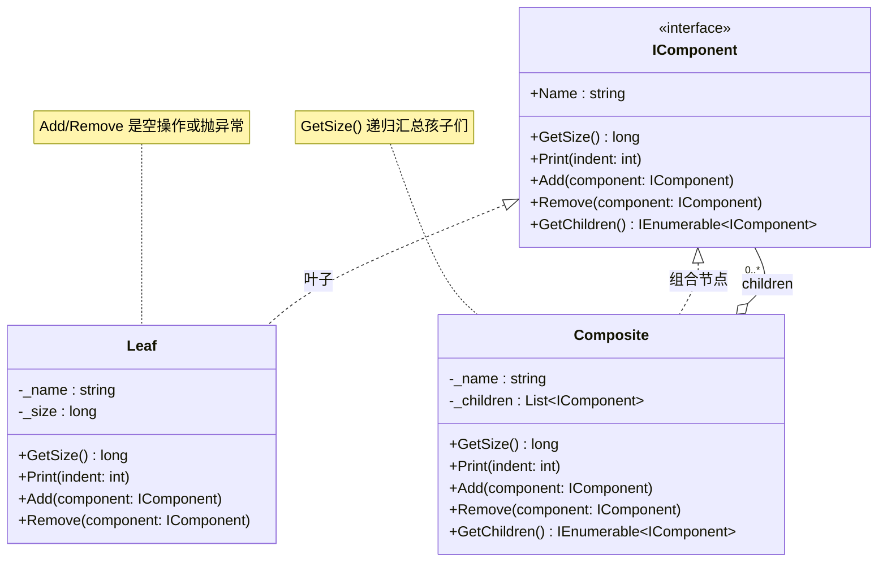
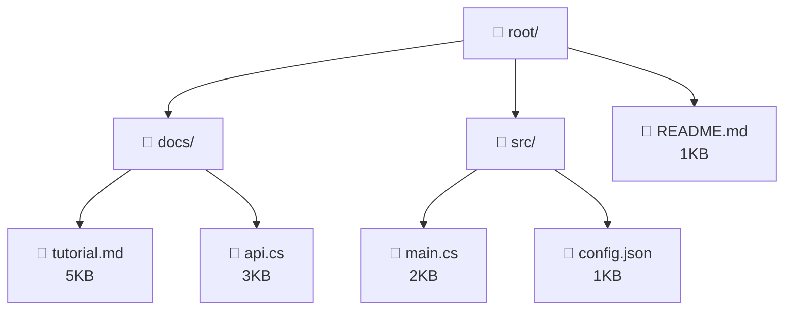
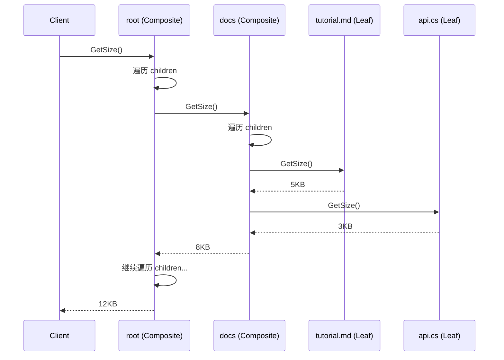

# 组合模式 Composite

> 所属计划: [[design-patterns-csharp|设计模式 (C#)]]
> 预计耗时: 70 分钟
> 前置知识: [[08-structural-intro|结构型模式总览]], C# 继承/多态, `IEnumerable<T>`

---

## 1. 概念讲解

### 为什么需要组合模式？

考虑两个现实场景：

- **文件系统**：文件夹可以包含文件和子文件夹，子文件夹又能继续嵌套
- **UI 框架**：面板可以包含按钮、标签、子面板，子面板再包含更多控件

这两者有一个共同特征：**树形层级结构**。你需要在不知道节点是叶子还是分支的情况下，统一地对整棵树执行操作——比如获取文件系统的总大小、渲染整个 UI 界面、统计所有员工数。

没有组合模式时，客户端代码通常是这样的灾难：

```csharp
// 每次操作都要区分类型 — 到处是 if/else 和类型判断
if (node is File f)
    total += f.Size;
else if (node is Folder dir)
{
    foreach (var child in dir.Children)
    {
        // 递归下去，又是同样的 if/else...
        if (child is File f2) total += f2.Size;
        else if (child is Folder dir2) { /* ... */ }
    }
}
```

> [!note] GoF 定义
> 将对象组合成树形结构以表示"部分-整体"的层次结构。Composite 使得客户端对单个对象和组合对象的使用具有一致性。

### 核心思想

定义一个**统一接口**（Component），让叶子节点（Leaf）和组合节点（Composite）都实现它。所有操作（获取大小、渲染、遍历）在接口层声明，客户端只依赖接口，不关心具体是 Leaf 还是 Composite。



**Leaf 上的 Add/Remove 如何处理？** 这是组合模式最经典的权衡——详见下方"常见陷阱"中的完整分析。

### 树结构示例：文件系统



- `root.GetSize()` → 递归汇总所有后代 → 1+5+3+2+1 = 12KB
- `docs.GetSize()` → 5+3 = 8KB
- `readme.GetSize()` → 1KB（叶子直接返回自身大小）

无论调用者是 `root`（Composite）、`docs`（Composite）还是 `readme`（Leaf），都是同一个 `GetSize()` 调用——**统一接口**。

### 运行时流程



---

## 2. 代码示例

### 示例 1：文件系统（IFileSystemItem → File / Folder）

```csharp
// ============================================
// 1. 文件系统 — 组合模式经典演示
// ============================================

// 统一接口
public interface IFileSystemItem
{
    string Name { get; }
    long GetSize();
    void Print(int indent = 0);
}

// Leaf — 文件
public class FileItem : IFileSystemItem
{
    public string Name { get; }
    public long Size { get; }

    public FileItem(string name, long size)
    {
        Name = name;
        Size = size;
    }

    public long GetSize() => Size;

    public void Print(int indent = 0)
    {
        Console.WriteLine($"{new string(' ', indent)}📄 {Name} ({Size} bytes)");
    }
}

// Composite — 文件夹
public class Folder : IFileSystemItem
{
    private readonly List<IFileSystemItem> _children = new();

    public string Name { get; }

    public Folder(string name)
    {
        Name = name;
    }

    public void Add(IFileSystemItem item) => _children.Add(item);
    public void Remove(IFileSystemItem item) => _children.Remove(item);

    public long GetSize()
    {
        // 递归汇总所有子节点的大小
        long total = 0;
        foreach (var child in _children)
            total += child.GetSize();
        return total;
    }

    public void Print(int indent = 0)
    {
        Console.WriteLine($"{new string(' ', indent)}📁 {Name}/ ({GetSize()} bytes)");
        foreach (var child in _children)
            child.Print(indent + 2);
    }
}

// === 使用 ===
var root = new Folder("root");
var docs = new Folder("docs");
var src = new Folder("src");

docs.Add(new FileItem("readme.md", 1024));
docs.Add(new FileItem("tutorial.md", 5120));
docs.Add(new FileItem("api-reference.md", 3072));

src.Add(new FileItem("Program.cs", 2048));
src.Add(new FileItem("Utils.cs", 1536));
src.Add(new FileItem("appsettings.json", 1024));

root.Add(docs);
root.Add(src);
root.Add(new FileItem(".gitignore", 256));

Console.WriteLine("=== 文件系统树 ===");
root.Print();

Console.WriteLine($"\n根目录总大小: {root.GetSize()} bytes");
Console.WriteLine($"docs 目录大小: {docs.GetSize()} bytes");
Console.WriteLine($"src 目录大小:  {src.GetSize()} bytes");
```

**运行方式:**
```bash
dotnet new console -n CompositeFileSystem
# 将上述代码放入 Program.cs
dotnet run --project CompositeFileSystem
```

**预期输出:**
```text
=== 文件系统树 ===
📁 root/ (14080 bytes)
  📁 docs/ (9216 bytes)
    📄 readme.md (1024 bytes)
    📄 tutorial.md (5120 bytes)
    📄 api-reference.md (3072 bytes)
  📁 src/ (4608 bytes)
    📄 Program.cs (2048 bytes)
    📄 Utils.cs (1536 bytes)
    📄 appsettings.json (1024 bytes)
  📄 .gitignore (256 bytes)

根目录总大小: 14080 bytes
docs 目录大小: 9216 bytes
src 目录大小:  4608 bytes
```

### 示例 2：UI 组件树（IUIComponent → Button/Label / Panel）

```csharp
// ============================================
// 2. UI 组件树 — 组合模式的另一个经典场景
// ============================================

public interface IUIComponent
{
    string Name { get; }
    void Render(int depth = 0);
    IEnumerable<IUIComponent> GetChildren();
}

// Leaf — 按钮
public class Button : IUIComponent
{
    public string Name { get; }
    public string Text { get; }
    public Action? OnClick { get; set; }

    public Button(string name, string text)
    {
        Name = name;
        Text = text;
    }

    public void Render(int depth = 0)
    {
        var indent = new string(' ', depth * 2);
        Console.WriteLine($"{indent}[Button: {Name}] \"{Text}\"");
    }

    public IEnumerable<IUIComponent> GetChildren()
        => Enumerable.Empty<IUIComponent>();
}

// Leaf — 标签
public class Label : IUIComponent
{
    public string Name { get; }
    public string Text { get; }

    public Label(string name, string text)
    {
        Name = name;
        Text = text;
    }

    public void Render(int depth = 0)
    {
        var indent = new string(' ', depth * 2);
        Console.WriteLine($"{indent}[Label: {Name}] \"{Text}\"");
    }

    public IEnumerable<IUIComponent> GetChildren()
        => Enumerable.Empty<IUIComponent>();
}

// Leaf — 文本框
public class TextBox : IUIComponent
{
    public string Name { get; }
    public string Value { get; set; }

    public TextBox(string name, string value = "")
    {
        Name = name;
        Value = value;
    }

    public void Render(int depth = 0)
    {
        var indent = new string(' ', depth * 2);
        Console.WriteLine($"{indent}[TextBox: {Name}] value=\"{Value}\"");
    }

    public IEnumerable<IUIComponent> GetChildren()
        => Enumerable.Empty<IUIComponent>();
}

// Composite — 面板
public class Panel : IUIComponent
{
    private readonly List<IUIComponent> _children = new();

    public string Name { get; }

    public Panel(string name)
    {
        Name = name;
    }

    public void Add(IUIComponent component) => _children.Add(component);
    public void Remove(IUIComponent component) => _children.Remove(component);

    public void Render(int depth = 0)
    {
        var indent = new string(' ', depth * 2);
        Console.WriteLine($"{indent}┌─ [Panel: {Name}]");
        foreach (var child in _children)
            child.Render(depth + 1);
        Console.WriteLine($"{indent}└─");
    }

    public IEnumerable<IUIComponent> GetChildren() => _children;
}

// === 使用 ===
var mainPanel = new Panel("MainWindow");

var toolbar = new Panel("Toolbar");
toolbar.Add(new Button("btnSave", "保存"));
toolbar.Add(new Button("btnCancel", "取消"));

var formPanel = new Panel("FormPanel");
formPanel.Add(new Label("lblName", "姓名:"));
formPanel.Add(new TextBox("txtName", "张三"));
formPanel.Add(new Label("lblEmail", "邮箱:"));
formPanel.Add(new TextBox("txtEmail", "zhangsan@example.com"));

var footer = new Panel("Footer");
footer.Add(new Label("lblStatus", "就绪"));

mainPanel.Add(toolbar);
mainPanel.Add(formPanel);
mainPanel.Add(footer);

Console.WriteLine("=== UI 组件树渲染 ===");
mainPanel.Render();
```

**运行方式:**
```bash
dotnet new console -n CompositeUI
# 将上述代码放入 Program.cs
dotnet run --project CompositeUI
```

**预期输出:**
```text
=== UI 组件树渲染 ===
┌─ [Panel: MainWindow]
  ┌─ [Panel: Toolbar]
    [Button: btnSave] "保存"
    [Button: btnCancel] "取消"
  └─
  ┌─ [Panel: FormPanel]
    [Label: lblName] "姓名:"
    [TextBox: txtName] value="张三"
    [Label: lblEmail] "邮箱:"
    [TextBox: txtEmail] value="zhangsan@example.com"
  └─
  ┌─ [Panel: Footer]
    [Label: lblStatus] "就绪"
  └─
└─
```

### 示例 3：C# 惯用法 — `IEnumerable<T>` + LINQ 树遍历

C# 的组合模式可以借助 `IEnumerable<T>` 和 `yield return` 写出非常简洁的树遍历代码：

```csharp
// ============================================
// 3. C# 惯用法：IEnumerable<T> + LINQ 树遍历
// ============================================

public interface ITreeNode
{
    string Name { get; }
    IEnumerable<ITreeNode> Children { get; }
}

public class TreeNode : ITreeNode
{
    public string Name { get; }
    private readonly List<ITreeNode> _children = new();

    public TreeNode(string name) => Name = name;

    public void Add(ITreeNode child) => _children.Add(child);
    public IEnumerable<ITreeNode> Children => _children;
}

// 扩展方法：放在静态类中即可全局使用
public static class TreeNodeExtensions
{
    /// <summary>
    /// 深度优先遍历（前序）
    /// </summary>
    public static IEnumerable<ITreeNode> DepthFirst(this ITreeNode node)
    {
        yield return node;
        foreach (var child in node.Children)
        foreach (var descendant in child.DepthFirst())
            yield return descendant;
    }

    /// <summary>
    /// 广度优先遍历
    /// </summary>
    public static IEnumerable<ITreeNode> BreadthFirst(this ITreeNode node)
    {
        var queue = new Queue<ITreeNode>();
        queue.Enqueue(node);

        while (queue.Count > 0)
        {
            var current = queue.Dequeue();
            yield return current;
            foreach (var child in current.Children)
                queue.Enqueue(child);
        }
    }

    /// <summary>
    /// 获取所有叶子节点
    /// </summary>
    public static IEnumerable<ITreeNode> Leaves(this ITreeNode node)
        => node.DepthFirst().Where(n => !n.Children.Any());

    /// <summary>
    /// 查找指定名称的节点（深度优先）
    /// </summary>
    public static ITreeNode? FindByName(this ITreeNode node, string name)
        => node.DepthFirst().FirstOrDefault(n => n.Name == name);

    /// <summary>
    /// 计算树的最大深度
    /// </summary>
    public static int MaxDepth(this ITreeNode node)
    {
        if (!node.Children.Any()) return 1;
        return 1 + node.Children.Max(c => c.MaxDepth());
    }

    /// <summary>
    /// 获取从根到目标节点的路径
    /// </summary>
    public static IEnumerable<ITreeNode> AncestorsOf(
        this ITreeNode root, ITreeNode target)
    {
        var stack = new Stack<(ITreeNode node, List<ITreeNode> path)>();
        stack.Push((root, new List<ITreeNode> { root }));

        while (stack.Count > 0)
        {
            var (current, path) = stack.Pop();
            if (current == target)
                return path;
            foreach (var child in current.Children)
            {
                var newPath = new List<ITreeNode>(path) { child };
                stack.Push((child, newPath));
            }
        }
        return Enumerable.Empty<ITreeNode>();
    }
}

// === 使用 ===
var company = new TreeNode("公司");
var tech = new TreeNode("技术部");
var product = new TreeNode("产品部");
var frontend = new TreeNode("前端组");
var backend = new TreeNode("后端组");

company.Add(tech);
company.Add(product);
tech.Add(frontend);
tech.Add(backend);
frontend.Add(new TreeNode("张三"));
frontend.Add(new TreeNode("李四"));
backend.Add(new TreeNode("王五"));
product.Add(new TreeNode("赵六"));

Console.WriteLine("=== 深度优先遍历（前序）===");
foreach (var node in company.DepthFirst())
    Console.WriteLine($"  {new string('-', node.MaxDepth())} {node.Name}");

Console.WriteLine("\n=== 广度优先遍历 ===");
foreach (var node in company.BreadthFirst())
    Console.WriteLine($"  {node.Name}");

Console.WriteLine("\n=== 所有叶子节点（没有子节点的员工）===");
foreach (var leaf in company.Leaves())
    Console.WriteLine($"  🍃 {leaf.Name}");

Console.WriteLine($"\n=== 树的最大深度: {company.MaxDepth()} ===");

var found = company.FindByName("王五");
Console.WriteLine($"\n查找"王五": {(found != null ? "✔ 找到" : "✗ 未找到")}");

// LINQ 聚合：统计总节点数
var totalNodes = company.DepthFirst().Count();
Console.WriteLine($"总节点数: {totalNodes}");

// LINQ 过滤：所有深度 > 2 的节点
var deep = company.DepthFirst().Where(n => n.MaxDepth() > 2);
Console.WriteLine($"深度 > 2 的节点:");
foreach (var n in deep) Console.WriteLine($"  {n.Name}");
```

**运行方式:**
```bash
dotnet new console -n CompositeTraversal
# 将上述代码放入 Program.cs
dotnet run --project CompositeTraversal
```

**预期输出:**
```text
=== 深度优先遍历（前序）===
  - 公司
  -- 技术部
  --- 前端组
  ---- 张三
  --- 李四
  --- 后端组
  ---- 王五
  -- 产品部
  --- 赵六

=== 广度优先遍历 ===
  公司
  技术部
  产品部
  前端组
  后端组
  赵六
  张三
  李四
  王五

=== 所有叶子节点（没有子节点的员工）===
  🍃 张三
  🍃 李四
  🍃 王五
  🍃 赵六

=== 树的最大深度: 4 ===

查找"王五": ✔ 找到
总节点数: 9
深度 > 2 的节点:
  前端组
  后端组
  技术部
  公司
```

> [!tip] `yield return` 使遍历变成惰性求值
> `DepthFirst()` 只在 `foreach` 枚举时才展开节点，不会一次性拷贝整棵树。结合 LINQ 的 `FirstOrDefault`、`Where` 等，可以做到提前终止——找到匹配就停止遍历，不再访问剩余节点。这对大型树是巨大的性能优势。

> [!tip] C# 迭代器 vs 显式递归
> `yield return` 写出的树遍历比手动维护 `Stack<T>` 的递归代码更可读，且在深层树中避免了 `StackOverflowException`（C# 迭代器由状态机驱动，不消耗调用栈）。

---


---

## C++ 实现

C++ 用 `std::vector<std::shared_ptr<GraphicObject>>` 管理子节点，`shared_ptr` 确保叶子可以在多个 Composite 间共享。叶子的 `add`/`remove` 在 C++ 中通常不放在基类接口里——要么抛异常，要么只定义在 Composite 上（安全性变体）。

```cpp
#include <iostream>
#include <memory>
#include <vector>
#include <string>
#include <algorithm>
using namespace std;

// ============================================
// Component — 统一接口
// ============================================
class GraphicObject {
public:
    virtual ~GraphicObject() = default;
    virtual void draw(int indent = 0) const = 0;
};

// ============================================
// Leaf — 方形（叶子节点，不持有子对象）
// ============================================
class Square : public GraphicObject {
    string name;
public:
    explicit Square(string n) : name(move(n)) {}
    void draw(int indent = 0) const override {
        cout << string(indent, ' ') << "□ " << name << endl;
    }
};

// ============================================
// Composite — 可包含子 GraphicObject 的组合节点
// ============================================
class CompositeGraphic : public GraphicObject {
    string name;
    vector<shared_ptr<GraphicObject>> children;
public:
    explicit CompositeGraphic(string n) : name(move(n)) {}

    void add(shared_ptr<GraphicObject> obj) {
        children.push_back(move(obj));
    }

    void remove(const shared_ptr<GraphicObject>& obj) {
        children.erase(
            remove(children.begin(), children.end(), obj),
            children.end());
    }

    void draw(int indent = 0) const override {
        cout << string(indent, ' ') << "◆ " << name << "/" << endl;
        for (const auto& child : children)
            child->draw(indent + 2);
    }
};

// === main / usage ===
int main() {
    auto root   = make_shared<CompositeGraphic>("root");
    auto group1 = make_shared<CompositeGraphic>("group1");
    auto group2 = make_shared<CompositeGraphic>("group2");

    group1->add(make_shared<Square>("squareA"));
    group1->add(make_shared<Square>("squareB"));
    group2->add(make_shared<Square>("squareC"));
    group2->add(make_shared<Square>("squareD"));

    root->add(group1);
    root->add(group2);
    root->add(make_shared<Square>("squareE"));  // 叶子直接挂在根下

    cout << "=== 图形树 ===" << endl;
    root->draw();

    // 移除一个叶子
    auto sq = make_shared<Square>("temp");
    root->add(sq);
    root->remove(sq);
    cout << "\n移除后：" << endl;
    root->draw();
}
```

**编译与运行：**
```bash
g++ -std=c++17 -o prog main.cpp && ./prog
```

**预期输出：**
```text
=== 图形树 ===
◆ root/
  ◆ group1/
    □ squareA
    □ squareB
  ◆ group2/
    □ squareC
    □ squareD
  □ squareE

移除后：
◆ root/
  ◆ group1/
    □ squareA
    □ squareB
  ◆ group2/
    □ squareC
    □ squareD
  □ squareE
```

> [!tip] shared_ptr vs unique_ptr
> 组合模式中 `shared_ptr` 是自然选择：一个子节点可能被多个 Composite 共享（如 DAG），`unique_ptr` 只适合严格的树形结构。

---
## 3. 练习

### 练习 1（基础）：组织架构图

实现一个组织架构系统：

- 接口 `IOrganizationUnit`，包含 `Name`、`GetHeadcount()`、`GetBudget()`、`Print(indent)`
- Leaf：`Employee`，有 `Title`、`Headcount`（固定为 1）、`Salary`（即 Budget）
- Composite：`Department`，有 `_units` 列表
  - `GetHeadcount()` 返回所有下属员工的总人数
  - `GetBudget()` 返回所有下属员工的总薪资

要求构造如下组织架构并打印：

```
公司 (CEO: 张三)
├── 技术部 (CTO: 李四)
│   ├── 王五 (高级工程师, $120000)
│   └── 赵六 (工程师, $85000)
├── 产品部 (CPO: 钱七)
│   └── 孙八 (产品经理, $100000)
```

**要点：** `Department` 本身也是一个 `IOrganizationUnit`（负责人也算一个 Head,有薪资），但它是 Composite 而非 Leaf——所以 Department 的 `GetHeadcount()` 和 `GetBudget()` 应该汇总**负责人 + 所有后代**。

<details>
<summary>提示</summary>

Department 除了维护下属列表，还需要持有负责人（一个 Employee）。`GetHeadcount()` = 1（负责人自身）+ 所有 `_units` 的 `GetHeadcount()`。同理 `GetBudget()`。

</details>

### 练习 2（进阶）：访问者模式 + 组合树

在练习 1 的组织架构基础上，添加 Visitor 模式：

1. 定义 `IOrganizationVisitor` 接口：
   - `Visit(Employee employee)`
   - `Visit(Department department)`
2. 在 `IOrganizationUnit` 中添加 `Accept(IOrganizationVisitor visitor)` 方法
3. 实现两个具体 Visitor：
   - `BudgetReportVisitor`：收集所有 Employee 的 `Name` 和 `Salary`，生成薪资报表
   - `HighEarnerVisitor`：找出所有年薪 > $100000 的员工，输出名单

**要点：** Visitor 利用多态分发 (`employee.Accept(visitor)` → `visitor.Visit(this)`) 避免在遍历代码中写 `if (unit is Employee e) ... else if (unit is Department d) ...`。

<details>
<summary>提示</summary>

```csharp
public interface IOrganizationVisitor
{
    void Visit(Employee employee);
    void Visit(Department department);
}

// Employee 中的实现
public void Accept(IOrganizationVisitor visitor) => visitor.Visit(this);

// Department 中的实现
public void Accept(IOrganizationVisitor visitor)
{
    visitor.Visit(this);
    foreach (var unit in _units)
        unit.Accept(visitor);
}
```

</details>

### 练习 3（挑战）：`yield return` 树遍历工具

实现一个泛型组合模式框架，使其支持 `yield return` 惰性遍历：

1. 定义抽象基类 `TreeNode<T>` where `T : TreeNode<T>`
2. `TreeNode<T>` 包含 `Parent` 属性、`Children` 列表、`Add(T child)` 方法
3. `Add` 方法自动设置 `child.Parent = this`
4. 实现扩展方法：
   - `Descendants()` — 深度优先所有后代
   - `Ancestors()` — 从自身向上到根的所有祖先
   - `Siblings()` — 同一父节点下的其他节点（不含自身）
   - `IsLeaf` — 是否有子节点

**要求：** 所有遍历方法使用 `yield return`，支持 LINQ 链式操作。

<details>
<summary>提示</summary>

```csharp
public abstract class TreeNode<T> where T : TreeNode<T>
{
    private readonly List<T> _children = new();
    public T? Parent { get; private set; }
    public IReadOnlyList<T> Children => _children;

    public void Add(T child)
    {
        _children.Add(child);
        child.Parent = (T)this;
    }

    public bool IsLeaf => _children.Count == 0;
}

public static class TreeNodeExtensions
{
    public static IEnumerable<T> Descendants<T>(this T node) where T : TreeNode<T>
    {
        foreach (var child in node.Children)
        {
            yield return child;
            foreach (var descendant in child.Descendants())
                yield return descendant;
        }
    }

    public static IEnumerable<T> Ancestors<T>(this T node) where T : TreeNode<T>
    {
        var current = node.Parent;
        while (current != null)
        {
            yield return current;
            current = current.Parent;
        }
    }

    public static IEnumerable<T> Siblings<T>(this T node) where T : TreeNode<T>
    {
        if (node.Parent == null) yield break;
        foreach (var child in node.Parent.Children)
            if (child != node)
                yield return child;
    }
}
```

</details>

---

## 4. 扩展阅读

- [[08-structural-intro|结构型模式总览]] — 组合模式在设计模式谱系中的位置
- **GoF 原书 (Design Patterns)**：第 4 章 "Composite"（pp. 163-173）— 讨论了透明性 vs 安全性的经典权衡
- [Microsoft Docs: Iterators (C#)](https://learn.microsoft.com/en-us/dotnet/csharp/iterators) — `yield return` 的深入机制
- [Microsoft Docs: LINQ to Objects](https://learn.microsoft.com/en-us/dotnet/csharp/linq/get-started/introduction-to-linq-queries) — LINQ 与树遍历的结合用法
- [Refactoring Guru: Composite](https://refactoring.guru/design-patterns/composite) — 含精美图解和多语言实现
- **.NET BCL 中的组合模式**：
  - `System.Xml.XmlNode` / `XmlElement` / `XmlText` — .NET XML DOM 是组合模式的经典应用
  - `Microsoft.AspNetCore.Mvc.Filters.IFilterMetadata` — ASP.NET Core 过滤器管线中的组合结构
  - WPF / WinUI 的 `UIElement` 体系（`Panel` 含 `Children`，`Control` 为叶子）
- **相关模式**：
  - [[decorator-pattern|装饰模式]] — 装饰器只有一个组件，Composite 有多个子节点
  - [[flyweight-pattern|享元模式]] — 常与 Composite 结合，在叶子层共享状态
  - [[chain-of-responsibility|责任链模式]] — 将事件沿树向上冒泡（如 UI 事件路由）

---

## 常见陷阱

### 陷阱 1：违反里氏替换原则 — Leaf 的 Add/Remove 抛异常

这是组合模式最经典的争议。三种方案对比：

| 方案 | 做法 | 优点 | 缺点 |
|------|------|------|------|
| **透明式** | 接口声明 `Add`/`Remove`，Leaf 空实现（do nothing） | 客户端完全统一，不需要类型判断 | Leaf 的 `Add` 静默失败，bug 难排查 |
| **安全式** | `Add`/`Remove` 只在 Composite 上声明，不在接口中 | 编译期阻止错误调用 | 客户端需要类型判断 `if (node is Composite) …` — 这就是组合模式要消除的 |
| **混合式** | 接口声明 `Add`/`Remove`，Leaf 抛出 `NotSupportedException` | 接口统一 + 错误可发现 | 运行时异常，调用者需要 try/catch 或事先检查 |

> [!warning] 没有完美的答案
> 组合模式本身就是"用安全性换统一性"的权衡。推荐做法：**在应用层（ViewModel、DTO 等）用安全式，在框架/基础设施层用透明式**。C# 中如果选择混合式，在 Leaf 的 `Add`/`Remove` 中抛出 `NotSupportedException`，并在 XML doc 中明确标注。

**正确示例 — 混合式：**

```csharp
public interface IComponent
{
    string Name { get; }
    void Print(int indent);

    // 声明但不强制所有实现都"真正支持"
    void Add(IComponent component);
    void Remove(IComponent component);
}

public class Leaf : IComponent
{
    public string Name { get; }

    public Leaf(string name) => Name = name;

    public void Print(int indent)
        => Console.WriteLine($"{new string(' ', indent)}- {Name}");

    // Leaf 不支持子树操作
    public void Add(IComponent component)
        => throw new NotSupportedException($"Cannot add to leaf '{Name}'");

    public void Remove(IComponent component)
        => throw new NotSupportedException($"Cannot remove from leaf '{Name}'");
}

public class Composite : IComponent
{
    private readonly List<IComponent> _children = new();

    public string Name { get; }

    public Composite(string name) => Name = name;

    public void Add(IComponent component) => _children.Add(component);

    public void Remove(IComponent component) => _children.Remove(component);

    public void Print(int indent)
    {
        Console.WriteLine($"{new string(' ', indent)}+ {Name}");
        foreach (var child in _children)
            child.Print(indent + 2);
    }
}
```

### 陷阱 2：不维护父节点引用

如果你需要从某个节点向上遍历（如"我的上级部门是谁"、"获取完整路径"），但组合树中没有 `Parent` 引用，你只能从根开始搜索——O(n) 每次。

**错误做法：**

```csharp
public class Department
{
    public List<Department> SubDepartments { get; } = new();
    // 没有 Parent！要查找上级部门只能从根遍历整棵树
}
```

**正确做法：**

```csharp
public class Department
{
    public Department? Parent { get; private set; }
    public List<Department> SubDepartments { get; } = new();

    public void AddSubDepartment(Department sub)
    {
        SubDepartments.Add(sub);
        sub.Parent = this;  // 🔑 关键：自动建立反向引用
    }

    public bool RemoveSubDepartment(Department sub)
    {
        var removed = SubDepartments.Remove(sub);
        if (removed) sub.Parent = null;  // 断开引用
        return removed;
    }

    // 现在 O(1) 就能获取完整路径
    public string GetFullPath()
    {
        var parts = new Stack<string>();
        Department? current = this;
        while (current != null)
        {
            parts.Push(current.Name);
            current = current.Parent;
        }
        return string.Join("/", parts);
    }
}
```

### 陷阱 3：内存泄漏 — 循环引用阻止 GC

如果组合树中的节点被外部持有引用，且 `Parent` 属性形成双向链表，当移除子树时忘记清空 `Parent`，子树的 GC Root 可能仍然可达。

**泄漏场景：**

```csharp
var root = new Department("root");
var child = new Department("child");
root.AddSubDepartment(child);

// 从 root 移除 child
root.SubDepartments.Remove(child);
// ❌ child.Parent 仍然指向 root！
// root 如果被某个静态集合或事件处理器持有 → child 永远不会被 GC
```

**解决方案：**

```csharp
public class Department
{
    public Department? Parent { get; private set; }

    public bool RemoveSubDepartment(Department sub)
    {
        var removed = SubDepartments.Remove(sub);
        if (removed)
        {
            sub.Parent = null;           // ✅ 断开反向引用
            sub.OnDetached?.Invoke(sub); // ✅ 通知清理资源
        }
        return removed;
    }

    // 实现 IDisposable 清理整棵子树
    public void Dispose()
    {
        Parent?.RemoveSubDepartment(this);
        foreach (var sub in SubDepartments.ToList())
            sub.Dispose();
    }
}
```

> [!tip] 诊断内存泄漏
> 使用 `dotnet-dump` 或 Visual Studio 的 "Diagnostic Tools" → "Memory Usage" 截图对比。如果移除子树后，子树节点在 GC 后仍然存在，检查 `Parent` 引用是否已清空。

### 陷阱 4：在 Composite 中直接暴露可变 `List<T>`

```csharp
// ❌ 坏 — 调用者可以随意修改内部列表
public List<IComponent> Children { get; } = new();

// ✅ 好 — 通过方法控制访问
private readonly List<IComponent> _children = new();
public IReadOnlyList<IComponent> Children => _children;
public void Add(IComponent child) { /* 可以加验证、设置 Parent */ }
public bool Remove(IComponent child) { /* 可以清理 Parent */ }
```

封装 `Add`/`Remove` 方法不仅保护内部状态，还能在方法内部做额外工作（设置 `Parent`、触发事件、验证唯一性等）。

### 陷阱 5：递归太深 — `StackOverflowException`

```csharp
// ❌ 对于极深或无限递归的树结构
public long GetTotalSize()
{
    long total = 0;
    foreach (var child in Children)
        total += child.GetTotalSize(); // 普通递归 → 栈溢出
    return total;
}
```

**解决方案 — 用显式栈替代递归：**

```csharp
// ✅ 迭代版，不受调用栈深度限制
public long GetTotalSizeIterative()
{
    long total = 0;
    var stack = new Stack<IComponent>();
    stack.Push(this);

    while (stack.Count > 0)
    {
        var current = stack.Pop();
        if (current is Leaf leaf)
            total += leaf.Size;
        else if (current is Composite comp)
            foreach (var child in comp.Children)
                stack.Push(child);
    }
    return total;
}
```

或者使用 C# 迭代器的天然优势——`yield return` 遍历不消耗调用栈：

```csharp
public static IEnumerable<IComponent> AllNodes(this IComponent root)
{
    var stack = new Stack<IComponent>();
    stack.Push(root);
    while (stack.Count > 0)
    {
        var current = stack.Pop();
        yield return current;
        if (current is Composite comp)
            foreach (var child in comp.Children)
                stack.Push(child);
    }
}

// 使用
var totalSize = root.AllNodes().OfType<Leaf>().Sum(l => l.Size);
```
