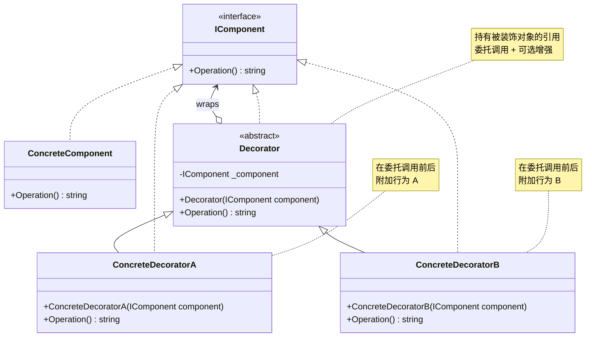
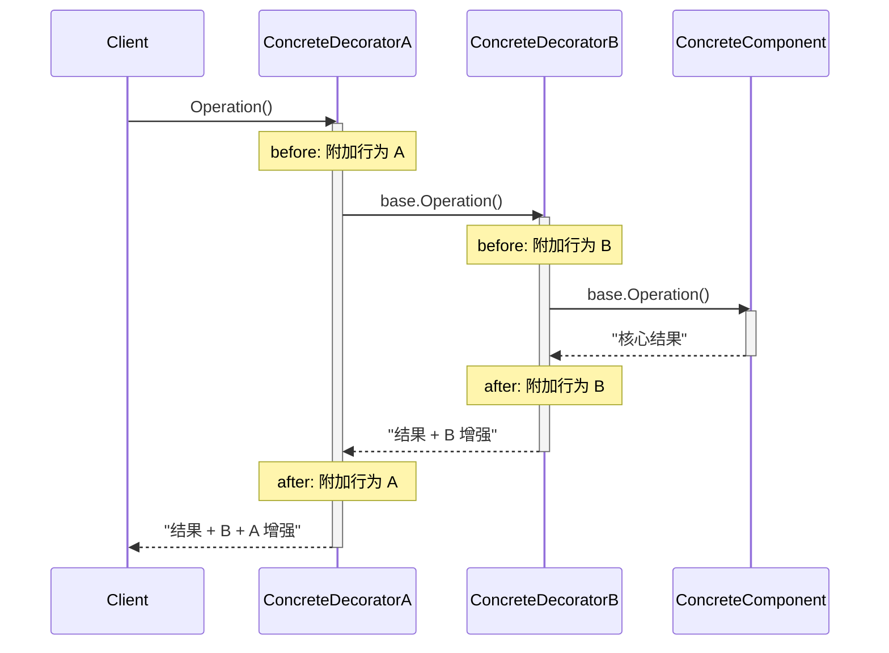

# 装饰器模式 Decorator

> 所属计划: [[design-patterns-csharp|设计模式 (C#)]]
> 预计耗时: 75 分钟
> 前置知识: [[08-structural-intro|结构型模式总览]]

---

## 1. 概念讲解

### 为什么需要装饰器？

继承是静态的——在**编译时**就确定了行为组合。假设你有一个 `ICoffee` 接口：

```csharp
// 用继承来组合咖啡 + 配料：
class Espresso { }
class EspressoWithMilk { }         // 牛奶
class EspressoWithWhip { }         // 奶油
class EspressoWithMilkAndWhip { }  // 牛奶 + 奶油
class EspressoWithMilkAndWhipAndCaramel { } // ...
```

3 种配料 → 2^3 = 8 个子类。每增加一种配料，子类数量**翻倍**——这就是类爆炸（class explosion）。

**装饰器模式的本质**：用**组合 + 委托**替代继承，在运行时动态地给对象附加职责。你不再需要 `EspressoWithMilkAndWhip` 类，而是 `new WhipDecorator(new MilkDecorator(new Espresso()))`。

### 核心思想

装饰器的精髓在于**装饰器与被装饰对象实现同一个接口**：

1. 定义抽象组件接口（`IComponent`）
2. 具体组件实现核心功能（`ConcreteComponent`）
3. 装饰器基类**同时**实现接口 + 持有被装饰对象的引用
4. 每个具体装饰器在委托调用的**前/后**附加新行为



### 调用流程



每一次调用沿装饰器链逐层向前（before），到达核心组件后逐层返回（after）。装饰器的顺序决定了 before/after 行为的执行顺序。

### 四个关键角色

| 角色 | 职责 | 示例 |
|------|------|------|
| **Component**（抽象组件） | 定义被装饰对象的统一接口 | `ICoffee` |
| **ConcreteComponent**（具体组件） | 实现核心功能——被装饰的对象 | `Espresso` |
| **Decorator**（装饰器基类） | 实现接口 + 持有 Component 引用，委托所有调用 | `CoffeeDecorator` |
| **ConcreteDecorator**（具体装饰器） | 在委托前/后添加特定行为 | `MilkDecorator` |

### 装饰器 vs 类继承

| 维度 | 类继承 | 装饰器 |
|------|--------|--------|
| 组合时机 | 编译时固定 | **运行时动态** |
| 类数量 | O(2^n) — 指数爆炸 | O(n) — 线性增长 |
| 组合能力 | 继承链固定 | 可任意顺序、任意层数叠加 |
| 粒度 | 整个类的所有方法 | 可只装饰特定方法 |
| 类型身份 | `EspressoWithMilk` 是独立类型 | 始终 `ICoffee`，无额外类型信息 |

### 装饰器 vs 代理模式

[[13-proxy|代理模式]] 与装饰器在结构上几乎一模一样（都持有被代理/被装饰对象的引用），但**意图**完全不同：

| 维度 | 装饰器 Decorator | 代理 Proxy |
|------|-------------------|-----------|
| 意图 | **增强**行为——在原功能之上加东西 | **控制**访问——拦截请求，代劳 |
| 行为变化 | 是——每次加一层，行为变了 | 否——代理只是转发（或缓存/延迟加载） |
| 创建时机 | 由**客户端**显式包装 | 通常对客户端**透明** |
| 典型场景 | 加日志、加密、压缩、格式化 | 延迟加载、访问控制、远程代理 |

> [!tip] 一句话区分
> 装饰器让对象"更强大"；代理让对象"更廉价"或"更安全"。装饰器是**增强**，代理是**控制**。

---

## 2. 代码示例

### 示例 1：咖啡店 — 经典教科书案例

```csharp
// ============================================================
// 1. 抽象组件 — 一杯咖啡
// ============================================================
public interface ICoffee
{
    string GetDescription();
    decimal GetCost();
}

// ============================================================
// 2. 具体组件 — Espresso（基础饮品）
// ============================================================
public class Espresso : ICoffee
{
    public string GetDescription() => "Espresso";
    public decimal GetCost() => 2.50m;
}

// ============================================================
// 3. 装饰器基类 — 所有配料装饰器的共同祖先
// ============================================================
public abstract class CoffeeDecorator : ICoffee
{
    protected readonly ICoffee _coffee;

    protected CoffeeDecorator(ICoffee coffee) => _coffee = coffee;

    // virtual：子类可以 override 来增强
    public virtual string GetDescription() => _coffee.GetDescription();
    public virtual decimal GetCost() => _coffee.GetCost();
}

// ============================================================
// 4. 具体装饰器 — 牛奶
// ============================================================
public class MilkDecorator : CoffeeDecorator
{
    public MilkDecorator(ICoffee coffee) : base(coffee) { }

    public override string GetDescription() => _coffee.GetDescription() + " + Milk";
    public override decimal GetCost() => _coffee.GetCost() + 0.80m;
}

// ============================================================
// 5. 具体装饰器 — 奶油
// ============================================================
public class WhipDecorator : CoffeeDecorator
{
    public WhipDecorator(ICoffee coffee) : base(coffee) { }

    public override string GetDescription() => _coffee.GetDescription() + " + Whip";
    public override decimal GetCost() => _coffee.GetCost() + 0.60m;
}

// ============================================================
// 6. 具体装饰器 — 焦糖
// ============================================================
public class CaramelDecorator : CoffeeDecorator
{
    public CaramelDecorator(ICoffee coffee) : base(coffee) { }

    public override string GetDescription() => _coffee.GetDescription() + " + Caramel";
    public override decimal GetCost() => _coffee.GetCost() + 0.90m;
}

// ============================================================
// 运行入口
// ============================================================
static void Demo1()
{
    // 纯 Espresso
    ICoffee coffee = new Espresso();
    Console.WriteLine($"{coffee.GetDescription()} = ¥{coffee.GetCost()}");

    // Espresso + 牛奶
    coffee = new MilkDecorator(new Espresso());
    Console.WriteLine($"{coffee.GetDescription()} = ¥{coffee.GetCost()}");

    // Espresso + 牛奶 + 奶油（注意顺序：先包 Milk，再在外部包 Whip）
    coffee = new WhipDecorator(new MilkDecorator(new Espresso()));
    Console.WriteLine($"{coffee.GetDescription()} = ¥{coffee.GetCost()}");

    // Espresso + 牛奶 + 奶油 + 焦糖
    coffee = new CaramelDecorator(
                new WhipDecorator(
                    new MilkDecorator(
                        new Espresso())));
    Console.WriteLine($"{coffee.GetDescription()} = ¥{coffee.GetCost()}");
}
```

**运行方式：**
```bash
dotnet new console -n DecoratorCoffee
# 将上述代码放入 Program.cs（将 Demo1() 包装到合适的 class 中，或使用 top-level statements）
dotnet run --project DecoratorCoffee
```

**预期输出：**
```text
Espresso = ¥2.50
Espresso + Milk = ¥3.30
Espresso + Milk + Whip = ¥3.90
Espresso + Milk + Whip + Caramel = ¥4.80
```

### 示例 2：Stream 装饰 — 真实 .NET 框架中的装饰器

这是 .NET 中最经典的装饰器应用。`Stream` 是抽象组件，`FileStream` / `MemoryStream` 是具体组件，`BufferedStream` / `CryptoStream` / `GZipStream` / `DeflateStream` 都是**装饰器**：

```csharp
using System.Security.Cryptography;

// ============================================================
// Stream 体系本身就是装饰器模式
// ============================================================
static void Demo2()
{
    // FileStream 是 ConcreteComponent — 提供基础的字节读写
    using var fs = new FileStream("data.bin", FileMode.Create, FileAccess.Write);

    // CryptoStream 是 ConcreteDecorator — 加密层包裹文件流
    using var aes = Aes.Create();
    aes.GenerateKey();
    aes.GenerateIV();

    // 注意：CryptoStream 的构造函数签名为：
    //   CryptoStream(Stream innerStream, ICryptoTransform transform, CryptoStreamMode mode)
    // 它接收一个 Stream = 典型的装饰器模式！
    using var cs = new CryptoStream(fs, aes.CreateEncryptor(), CryptoStreamMode.Write);

    // BufferedStream 再包一层 — 缓冲层包裹加密流
    using var bs = new BufferedStream(cs, 8192);

    // 最终调用链：BufferedStream → CryptoStream → FileStream
    byte[] data = System.Text.Encoding.UTF8.GetBytes("Hello, Decorator!");
    bs.Write(data, 0, data.Length);

    Console.WriteLine($"写入的装饰链: BufferedStream → CryptoStream → FileStream");
    Console.WriteLine("数据被 缓冲 → 加密 → 写入磁盘");

    // ---- 反向装饰链：解密读取 ----
    using var fsIn = new FileStream("data.bin", FileMode.Open, FileAccess.Read);
    using var csIn = new CryptoStream(fsIn, aes.CreateDecryptor(), CryptoStreamMode.Read);
    using var reader = new StreamReader(csIn);

    string decrypted = reader.ReadToEnd();
    Console.WriteLine($"解密结果: {decrypted}");
}
```

**预期输出：**
```text
写入的装饰链: BufferedStream → CryptoStream → FileStream
数据被 缓冲 → 加密 → 写入磁盘
解密结果: Hello, Decorator!
```

> [!tip] .NET IO 管道
> .NET 的 `Stream` 体系是装饰器模式最成功的工业级应用。`GZipStream`、`CryptoStream`、`BufferedStream` 都是装饰器——它们接收一个 `Stream`，自己也是 `Stream`，在内部委托的基础上叠加了压缩、加密、缓冲等功能。你可以**任意顺序、任意层数**组合它们。

### 示例 3：C# 惯用写法 — 扩展方法 vs 装饰器

C# 的扩展方法是另一条"附加行为"的路径。什么时候用哪个？

```csharp
// ============================================================
// 场景：为 ILogger 添加行为
// ============================================================

// -- 方式 A：扩展方法（静态附加，无状态）--
public static class LoggerExtensions
{
    // 扩展方法不能保存状态（不能加字段），只能做纯函数式增强
    public static void LogWithTimestamp(this ILogger logger, string message)
    {
        logger.Log($"[{DateTime.Now:HH:mm:ss}] {message}");
    }

    // 可以给不同实现类使用——无运行时开销
    public static void LogIfDebug(this ILogger logger, string message)
    {
        if (Debugger.IsAttached)
            logger.Log($"[DEBUG] {message}");
    }
}

// -- 方式 B：装饰器（有状态，可组合）--
public class TimingLoggerDecorator : ILogger
{
    private readonly ILogger _inner;

    public TimingLoggerDecorator(ILogger inner) => _inner = inner;

    public void Log(string message)
    {
        var sw = Stopwatch.StartNew();
        _inner.Log(message);
        sw.Stop();
        // 装饰器可以持有状态——这是扩展方法做不到的
        Console.WriteLine($"  ⏱ Log 耗时 {sw.ElapsedMilliseconds}ms");
    }

    // 保存日志计数——扩展方法无法做到的有状态行为
    public int LogCount { get; private set; }
}
```

**决策指南：**

| 需求 | 用扩展方法 | 用装饰器 |
|------|-----------|----------|
| 纯无状态的前/后处理 | ✅ 首选 | ⚠️ 过度设计 |
| 需要**保存状态**（计数/缓存/计时） | ❌ 做不到 | ✅ |
| 需要**多个行为可组合** | ❌ 只有静态方法 | ✅ 运行时嵌套 |
| 需要**拦截并修改原始参数** | ❌ 参数是值拷贝 | ✅ 可以在委托前修改 |
| 被装饰对象由 DI 注入 | ❌ 不适用 | ✅ |

```csharp
// ============================================================
// 决策示例
// ============================================================
static void Demo3()
{
    // ✅ 扩展方法 — 只是加个时间戳，不需要状态
    ILogger logger = new ConsoleLogger();
    logger.LogWithTimestamp("订单已创建");

    // ✅ 装饰器 — 需要计时 + 计数 LogCount 状态
    var timed = new TimingLoggerDecorator(new ConsoleLogger());
    timed.Log("查询数据库");
    timed.Log("返回结果");
    Console.WriteLine($"共记录 {timed.LogCount} 条日志");
}
```

### 示例 4：C# 惯用写法 — 用 `record` 实现不可变装饰

C# 9+ 的 `record` 天生支持不可变、with 表达式和值语义——非常适合实现不可变的装饰器：

```csharp
// ============================================================
// 组件：可序列化的数据结构
// ============================================================
public interface IData
{
    string Serialize();
}

// 具体组件：原始 JSON 数据
public record JsonData(string Raw) : IData
{
    public string Serialize() => Raw;
}

// ============================================================
// 不可变装饰器 — 用 record 实现（自动生成 Equals/GetHashCode）
// ============================================================

// 加密装饰器
public record EncryptedData(IData Inner) : IData
{
    public string Serialize()
    {
        var raw = Inner.Serialize();
        var encrypted = Convert.ToBase64String(
            System.Text.Encoding.UTF8.GetBytes(raw));
        return $"ENC({encrypted})";
    }
}

// 压缩装饰器（模拟）
public record CompressedData(IData Inner) : IData
{
    public string Serialize()
    {
        var raw = Inner.Serialize();
        return $"ZIP({raw})";
    }
}

// 签名装饰器
public record SignedData(IData Inner, string Signer = "System") : IData
{
    public string Serialize()
    {
        var raw = Inner.Serialize();
        var hash = raw.GetHashCode().ToString("X8");
        return $"{raw} | SIG[{Signer}:{hash}]";
    }
}

// ============================================================
// 运行
// ============================================================
static void Demo4()
{
    // 不可变链式包装——每一层都是新 record 实例
    IData data = new JsonData("{\"user\":\"Alice\"}");
    Console.WriteLine($"原始: {data.Serialize()}");

    data = new EncryptedData(data);
    Console.WriteLine($"加密后: {data.Serialize()}");

    data = new CompressedData(new EncryptedData(new JsonData("{\"user\":\"Alice\"}")));
    Console.WriteLine($"压缩+加密: {data.Serialize()}");

    var full = new SignedData(
        new CompressedData(
            new EncryptedData(
                new JsonData("{\"user\":\"Alice\"}"))),
        Signer: "AuthService");
    Console.WriteLine($"完整链: {full.Serialize()}");

    // record 的值语义：相同数据 = 相等
    var a = new CompressedData(new EncryptedData(new JsonData("x")));
    var b = new CompressedData(new EncryptedData(new JsonData("x")));
    Console.WriteLine($"a == b: {a == b}"); // True — record 的值比较
}
```

**预期输出：**
```text
原始: {"user":"Alice"}
加密后: ENC(eyJ1c2VyIjoiQWxpY2UifQ==)
压缩+加密: ZIP(ENC(eyJ1c2VyIjoiQWxpY2UifQ==))
完整链: ZIP(ENC(eyJ1c2VyIjoiQWxpY2UifQ==)) | SIG[AuthService:XXXXXXX]
a == b: True
```

> [!tip] record 的优势
> - 不可变：每一层包装都创造新实例，不修改原始对象
> - 值语义：相同装饰链自动 ``==`` 比较
> - `with` 表达式可以只修改某一层而不重建整条链

---


---

## C++ 实现

C++ 装饰器用纯虚接口 + 组合方式实现。基类 `CoffeeDecorator` 持有一个 `Coffee&` 引用（或 `unique_ptr`），避免继承具体咖啡类。通过嵌套构造实现动态装饰链。

```cpp
#include <iostream>
#include <memory>
#include <string>
using namespace std;

// ============================================
// Component — 抽象咖啡接口
// ============================================
class Coffee {
public:
    virtual ~Coffee() = default;
    virtual string getDescription() const = 0;
    virtual double getCost() const = 0;
};

// ============================================
// ConcreteComponent — 基础咖啡
// ============================================
class SimpleCoffee : public Coffee {
public:
    string getDescription() const override { return "Simple Coffee"; }
    double getCost() const override { return 2.50; }
};

// ============================================
// Decorator 基类 — 实现接口 + 持有被装饰者
// ============================================
class CoffeeDecorator : public Coffee {
protected:
    shared_ptr<Coffee> coffee;  // 组合 — 持有被装饰对象
public:
    explicit CoffeeDecorator(shared_ptr<Coffee> c) : coffee(move(c)) {}
};

// ============================================
// ConcreteDecorator — 加牛奶
// ============================================
class MilkDecorator : public CoffeeDecorator {
public:
    explicit MilkDecorator(shared_ptr<Coffee> c) : CoffeeDecorator(move(c)) {}

    string getDescription() const override {
        return coffee->getDescription() + " + Milk";
    }
    double getCost() const override {
        return coffee->getCost() + 0.80;
    }
};

// ============================================
// ConcreteDecorator — 加糖
// ============================================
class SugarDecorator : public CoffeeDecorator {
public:
    explicit SugarDecorator(shared_ptr<Coffee> c) : CoffeeDecorator(move(c)) {}

    string getDescription() const override {
        return coffee->getDescription() + " + Sugar";
    }
    double getCost() const override {
        return coffee->getCost() + 0.30;
    }
};

// === main / usage ===
int main() {
    // 纯咖啡
    auto coffee = make_shared<SimpleCoffee>();
    cout << coffee->getDescription() << " = ¥" << coffee->getCost() << endl;

    // 动态装饰：咖啡 + 牛奶
    auto withMilk = make_shared<MilkDecorator>(coffee);
    cout << withMilk->getDescription() << " = ¥" << withMilk->getCost() << endl;

    // 多层嵌套：咖啡 + 牛奶 + 糖
    auto withMilkSugar = make_shared<SugarDecorator>(
        make_shared<MilkDecorator>(
            make_shared<SimpleCoffee>()));
    cout << withMilkSugar->getDescription() << " = ¥" << withMilkSugar->getCost() << endl;

    // 不同装饰顺序
    auto withSugarMilk = make_shared<MilkDecorator>(
        make_shared<SugarDecorator>(
            make_shared<SimpleCoffee>()));
    cout << withSugarMilk->getDescription() << " = ¥" << withSugarMilk->getCost() << endl;
}
```

**编译与运行：**
```bash
g++ -std=c++17 -o prog main.cpp && ./prog
```

**预期输出：**
```text
Simple Coffee = ¥2.5
Simple Coffee + Milk = ¥3.3
Simple Coffee + Milk + Sugar = ¥3.6
Simple Coffee + Sugar + Milk = ¥3.6
```

> [!tip] C++ 装饰器模式要点
> 装饰器基类 `CoffeeDecorator` 不覆写任何 Coffee 方法——只持有被装饰者引用，由子类选择性覆写。这与 C# 中用 `virtual` 委托所有调用的模式等价，但更简洁。

---
## 3. 练习

### 练习 1（基础）：为 `IRepository` 实现日志装饰器

**场景**：你有一个 `IRepository<T>` 数据访问接口，现在需要给所有 CRUD 操作加日志（记录操作名 + 耗时），但不能改动已有的 `SqlRepository<T>` 实现。

```csharp
// 给定接口
public interface IRepository<T> where T : class
{
    T? GetById(int id);
    IEnumerable<T> GetAll();
    void Add(T entity);
    void Update(T entity);
    void Delete(int id);
}
```

**要求：**
1. 创建 `LoggingRepository<T>` 装饰器，给每个方法包裹日志 + 计时
2. 日志格式：`[操作名] 开始` → 调用 `_inner` → `[操作名] 完成，耗时 Xms`
3. 写一个小测试：用 `SqlRepository<User>` 和 `LoggingRepository<User>` 分别操作，观察控制台输出

**提示：**
```csharp
public class LoggingRepository<T> : IRepository<T> where T : class
{
    private readonly IRepository<T> _inner;
    private readonly Action<string> _log;

    // 构造函数接收 inner + 日志输出委托
    // ...
}
```

### 练习 2（高级）：三层管道处理器

**场景**：构建一个文本处理管道。基础处理器 `PlainTextProcessor` 直接返回原文；装饰器按**明确的顺序**执行：压缩 → 加密 → Base64 编码。

```csharp
public interface ITextProcessor
{
    string Process(string input);
}
```

**要求：**
1. 实现 `PlainTextProcessor`（直接返回 `input`）
2. 实现 `CompressProcessor`（在原文前加 `[COMPRESSED]` 前缀，模拟压缩）
3. 实现 `EncryptProcessor`（将原文 ROT13 变换，模拟加密）
4. 实现 `Base64Processor`（将原文转为 Base64 编码）
5. 堆叠装饰器为管道：`Compress → Encrypt → Base64`
6. **重点**：交换装饰器顺序（如 `Encrypt → Compress → Base64`），观察输出差异——验证"顺序决定结果"

**预期行为：**
```text
原文:         Hello World
压缩→加密→Base64:  SGVsbG8gV29ybGQ=                    (假设值)
加密→压缩→Base64:  [COMPRESSED]Uryyb Jbeyq              (假设值)
```
——**顺序不同，结果完全不同**。

### 练习 3（挑战）：DI 容器中注册装饰器

**场景**：使用 `Microsoft.Extensions.DependencyInjection`（或你熟悉的 DI 容器），通过装饰器注册模式给 `IMessageSender` 添加 `RetryMessageSender` 和 `LoggingMessageSender` 两个装饰器。

```csharp
public interface IMessageSender
{
    Task SendAsync(string recipient, string message);
}

public class SmtpMessageSender : IMessageSender { /* 真实的邮件发送 */ }
public class RetryMessageSender : IMessageSender { /* 失败重试 3 次 */ }
public class LoggingMessageSender : IMessageSender { /* 日志记录 */ }
```

**要求：**
1. 用 **Microsoft.Extensions.DependencyInjection**（或 `Scrutor` 的 `Decorate<T>()` 方法）注册装饰器链
2. 最终解析出的 `IMessageSender` 应该是 `LoggingMessageSender → RetryMessageSender → SmtpMessageSender`
3. 写一个 DI 容器解析 + 调用的测试

**提示 — 原生 DI（无 Scrutor）的手动注册：**
```csharp
// 逐层注册，每一层引用上一层的服务
services.AddScoped<SmtpMessageSender>();
services.AddScoped<IMessageSender>(sp =>
    new RetryMessageSender(sp.GetRequiredService<SmtpMessageSender>()));
services.AddScoped<IMessageSender>(sp =>
    new LoggingMessageSender(sp.GetRequiredService<RetryMessageSender>()));
```

**提示 — 使用 Scrutor（推荐）：**
```csharp
services.AddScoped<IMessageSender, SmtpMessageSender>();
services.Decorate<IMessageSender, RetryMessageSender>();
services.Decorate<IMessageSender, LoggingMessageSender>();
// 解析出来 = LoggingMessageSender → RetryMessageSender → SmtpMessageSender
```

---

## 3.5 参考答案

> [!tip]- 练习 1 参考答案
> ```csharp
> using System;
> using System.Collections.Generic;
> using System.Diagnostics;
> using System.Linq;
>
> // ============================================
> // IRepository&lt;T&gt; 接口（题目给定）
> // ============================================
> public interface IRepository<T> where T : class
> {
>     T? GetById(int id);
>     IEnumerable<T> GetAll();
>     void Add(T entity);
>     void Update(T entity);
>     void Delete(int id);
> }
>
> // ============================================
> // 装饰器基类：默认委托所有调用到 _inner
> // 减少子类样板代码 — 子类只需 override 需要增强的方法
> // ============================================
> public abstract class RepositoryDecorator<T> : IRepository<T> where T : class
> {
>     protected readonly IRepository<T> Inner;
>
>     protected RepositoryDecorator(IRepository<T> inner)
>     {
>         Inner = inner ?? throw new ArgumentNullException(nameof(inner));
>     }
>
>     public virtual T? GetById(int id) => Inner.GetById(id);
>     public virtual IEnumerable<T> GetAll() => Inner.GetAll();
>     public virtual void Add(T entity) => Inner.Add(entity);
>     public virtual void Update(T entity) => Inner.Update(entity);
>     public virtual void Delete(int id) => Inner.Delete(id);
> }
>
> // ============================================
> // LoggingRepository&lt;T&gt; — 日志 + 计时装饰器
> // ============================================
> public class LoggingRepository<T> : RepositoryDecorator<T> where T : class
> {
>     private readonly Action<string> _log;
>
>     public LoggingRepository(IRepository<T> inner, Action<string>? log = null)
>         : base(inner)
>     {
>         _log = log ?? Console.WriteLine;
>     }
>
>     public override T? GetById(int id)
>         => ExecuteWithLog($"GetById({id})", () => base.GetById(id));
>
>     public override IEnumerable<T> GetAll()
>         => ExecuteWithLog("GetAll", () => base.GetAll());
>
>     public override void Add(T entity)
>         => ExecuteWithLog("Add", () => base.Add(entity));
>
>     public override void Update(T entity)
>         => ExecuteWithLog("Update", () => base.Update(entity));
>
>     public override void Delete(int id)
>         => ExecuteWithLog($"Delete({id})", () => base.Delete(id));
>
>     private void ExecuteWithLog(string operationName, Action action)
>     {
>         _log($"[{operationName}] 开始");
>         var sw = Stopwatch.StartNew();
>         try
>         {
>             action();
>             sw.Stop();
>             _log($"[{operationName}] 完成，耗时 {sw.ElapsedMilliseconds}ms");
>         }
>         catch (Exception ex)
>         {
>             sw.Stop();
>             _log($"[{operationName}] 失败 (耗时 {sw.ElapsedMilliseconds}ms): {ex.Message}");
>             throw;
>         }
>     }
>
>     private TReturn ExecuteWithLog<TReturn>(
>         string operationName, Func<TReturn> func)
>     {
>         _log($"[{operationName}] 开始");
>         var sw = Stopwatch.StartNew();
>         try
>         {
>             var result = func();
>             sw.Stop();
>             _log($"[{operationName}] 完成，耗时 {sw.ElapsedMilliseconds}ms");
>             return result;
>         }
>         catch (Exception ex)
>         {
>             sw.Stop();
>             _log($"[{operationName}] 失败 (耗时 {sw.ElapsedMilliseconds}ms): {ex.Message}");
>             throw;
>         }
>     }
> }
>
> // ============================================
> // 模拟的 SqlRepository&lt;T&gt;（用于测试）
> // ============================================
> public class SqlRepository<T> : IRepository<T> where T : class
> {
>     private readonly List<T> _store = new();
>     private int _nextId = 1;
>
>     public T? GetById(int id)
>     {
>         // 模拟数据库查询
>         Thread.Sleep(10); // 模拟延迟
>         return id <= _store.Count ? _store[id - 1] : null;
>     }
>
>     public IEnumerable<T> GetAll()
>     {
>         Thread.Sleep(15);
>         return _store.ToList();
>     }
>
>     public void Add(T entity)
>     {
>         Thread.Sleep(5);
>         _store.Add(entity);
>     }
>
>     public void Update(T entity)
>     {
>         Thread.Sleep(8);
>         // 模拟更新
>     }
>
>     public void Delete(int id)
>     {
>         Thread.Sleep(5);
>         if (id <= _store.Count)
>             _store.RemoveAt(id - 1);
>     }
> }
>
> // ============================================
> // 验证测试
> // ============================================
> public class User
> {
>     public int Id { get; set; }
>     public string Name { get; set; } = "";
>     public override string ToString() => $"User({Id}, {Name})";
> }
>
> static void TestLoggingRepository()
> {
>     Console.WriteLine("===== 原始 SqlRepository（无日志） =====");
>     IRepository<User> rawRepo = new SqlRepository<User>();
>     rawRepo.Add(new User { Id = 1, Name = "Alice" });
>     Console.WriteLine("（无日志输出）");
>
>     Console.WriteLine("\n===== LoggingRepository 装饰 =====");
>     IRepository<User> loggingRepo = new LoggingRepository<User>(
>         new SqlRepository<User>());
>     loggingRepo.Add(new User { Id = 1, Name = "Bob" });
>     var user = loggingRepo.GetById(1);
>     loggingRepo.GetAll();
>     loggingRepo.Delete(1);
> }
> ```
> **设计要点：**
> 1. **装饰器基类 `RepositoryDecorator<T>`** 提供虚拟默认委托——子类只 override 需要增强的方法，避免为 5 个方法手写样板代码
> 2. **日志委托 `Action<string>`** 通过构造函数注入，便于单元测试时捕获日志，也便于切换到 Serilog/NLog 等框架
> 3. **`Stopwatch` 计时** 包裹在 `ExecuteWithLog` 模板方法中，统一日志格式，避免每个方法重复 try-catch-stopwatch 样板
> 4. **异常处理**：记录失败日志后 `throw`，保持原有异常传播路径——装饰器不吞异常
> 5. `LoggingRepository<T>` 的泛型约束 `where T : class` 与原接口一致，装饰器和被装饰者的类型签名完全对齐

> [!tip]- 练习 2 参考答案
> ```csharp
> using System;
> using System.Text;
>
> // ============================================
> // ITextProcessor 接口
> // ============================================
> public interface ITextProcessor
> {
>     string Process(string input);
> }
>
> // ============================================
> // 1. 基础处理器（核心组件）
> // ============================================
> public class PlainTextProcessor : ITextProcessor
> {
>     public string Process(string input) => input;
> }
>
> // ============================================
> // 2. 装饰器基类（减少样板代码）
> // ============================================
> public abstract class TextProcessorDecorator : ITextProcessor
> {
>     protected readonly ITextProcessor _inner;
>
>     protected TextProcessorDecorator(ITextProcessor inner)
>     {
>         _inner = inner ?? throw new ArgumentNullException(nameof(inner));
>     }
>
>     public abstract string Process(string input);
> }
>
> // ============================================
> // 3. 压缩装饰器（模拟：加前缀 [COMPRESSED]）
> // ============================================
> public class CompressProcessor : TextProcessorDecorator
> {
>     public CompressProcessor(ITextProcessor inner) : base(inner) { }
>
>     public override string Process(string input)
>     {
>         // 委托 inner 处理 → 在结果前后附加自己的行为
>         var processed = _inner.Process(input);
>         return $"[COMPRESSED]{processed}[/COMPRESSED]";
>     }
> }
>
> // ============================================
> // 4. 加密装饰器（ROT13 变换 — 只处理字母）
> // ============================================
> public class EncryptProcessor : TextProcessorDecorator
> {
>     public EncryptProcessor(ITextProcessor inner) : base(inner) { }
>
>     public override string Process(string input)
>     {
>         var processed = _inner.Process(input);
>         return Rot13(processed);
>     }
>
>     private static string Rot13(string s)
>     {
>         var sb = new StringBuilder(s.Length);
>         foreach (char c in s)
>         {
>             if (c >= 'a' && c <= 'z')
>                 sb.Append((char)((c - 'a' + 13) % 26 + 'a'));
>             else if (c >= 'A' && c <= 'Z')
>                 sb.Append((char)((c - 'A' + 13) % 26 + 'A'));
>             else
>                 sb.Append(c);
>         }
>         return sb.ToString();
>     }
> }
>
> // ============================================
> // 5. Base64 编码装饰器
> // ============================================
> public class Base64Processor : TextProcessorDecorator
> {
>     public Base64Processor(ITextProcessor inner) : base(inner) { }
>
>     public override string Process(string input)
>     {
>         var processed = _inner.Process(input);
>         var bytes = Encoding.UTF8.GetBytes(processed);
>         return Convert.ToBase64String(bytes);
>     }
> }
>
>
> // ============================================
> // 验证：顺序决定结果
> // ============================================
> static void TestTextPipeline()
> {
>     const string original = "Hello World";
>
>     Console.WriteLine($"原文:                   {original}\n");
>
>     // 管道 1: Compress → Encrypt → Base64
>     ITextProcessor pipeline1 =
>         new Base64Processor(
>             new EncryptProcessor(
>                 new CompressProcessor(
>                     new PlainTextProcessor())));
>     var result1 = pipeline1.Process(original);
>     Console.WriteLine($"Compress→Encrypt→Base64: {result1}");
>
>     // 管道 2: Encrypt → Compress → Base64（顺序不同！）
>     ITextProcessor pipeline2 =
>         new Base64Processor(
>             new CompressProcessor(
>                 new EncryptProcessor(
>                     new PlainTextProcessor())));
>     var result2 = pipeline2.Process(original);
>     Console.WriteLine($"Encrypt→Compress→Base64: {result2}");
>
>     // 验证顺序的差异
>     Console.WriteLine($"\n结果相同? {result1 == result2}");
>
>     // Pipeline 1 内部分解：
>     //   PlainTextProcessor:       "Hello World"
>     //   CompressProcessor:        "[COMPRESSED]Hello World[/COMPRESSED]"
>     //   EncryptProcessor:         "[PBZCERFFRQ]Uryyb Jbeyq[/PBZCERFFRQ]"
>     //   Base64Processor:          base64(...)
>
>     // Pipeline 2 内部分解：
>     //   PlainTextProcessor:       "Hello World"
>     //   EncryptProcessor:         "Uryyb Jbeyq"
>     //   CompressProcessor:        "[COMPRESSED]Uryyb Jbeyq[/COMPRESSED]"
>     //   Base64Processor:          base64(...)
>
>     Console.WriteLine("\n=== 单层验证 ===");
>     var compress = new CompressProcessor(new PlainTextProcessor());
>     Console.WriteLine($"仅压缩:      {compress.Process(original)}");
>
>     var encrypt = new EncryptProcessor(new PlainTextProcessor());
>     Console.WriteLine($"仅加密:      {encrypt.Process(original)}");
>
>     var base64 = new Base64Processor(new PlainTextProcessor());
>     Console.WriteLine($"仅Base64:    {base64.Process(original)}");
> }
> ```
> **设计要点：**
> 1. **装饰器铁律**：每个 ConcreteDecorator 的 `Process` 方法都先调用 `_inner.Process(input)`，再对结果附加自己的行为——正是"增强"而非"替换"
> 2. **顺序决定语义**：`Compress → Encrypt` 是"先压缩再加密"（合理），`Encrypt → Compress` 是"先加密再压缩"（压缩加密后的高熵数据几乎无效）——输出完全不同
> 3. **`PlainTextProcessor`** 是整个管道的"核心组件"（ConcreteComponent），没有它装饰链无处终止
> 4. **装饰器基类 `TextProcessorDecorator`** 持有 `_inner`，子类只需实现 `Process` 方法——减少重复代码

> [!tip]- 练习 3 参考答案（挑战）
> ```csharp
> using System;
> using System.Threading.Tasks;
> using Microsoft.Extensions.DependencyInjection;
>
> // ============================================
> // IMessageSender 接口
> // ============================================
> public interface IMessageSender
> {
>     Task SendAsync(string recipient, string message);
> }
>
> // ============================================
> // 核心实现：真实邮件发送
> // ============================================
> public class SmtpMessageSender : IMessageSender
> {
>     public async Task SendAsync(string recipient, string message)
>     {
>         // 模拟 SMTP 发送（真实项目中会用 SmtpClient）
>         Console.WriteLine($"[SMTP] 正在发送邮件到 {recipient}...");
>         await Task.Delay(50); // 模拟网络延迟
>         Console.WriteLine($"[SMTP] 发送成功: {message}");
>     }
> }
>
> // ============================================
> // 装饰器 1：失败重试
> // ============================================
> public class RetryMessageSender : IMessageSender
> {
>     private readonly IMessageSender _inner;
>     private readonly int _maxRetries;
>     private readonly TimeSpan _delay;
>
>     public RetryMessageSender(IMessageSender inner,
>         int maxRetries = 3, TimeSpan? delay = null)
>     {
>         _inner = inner ?? throw new ArgumentNullException(nameof(inner));
>         _maxRetries = maxRetries;
>         _delay = delay ?? TimeSpan.FromMilliseconds(100);
>     }
>
>     public async Task SendAsync(string recipient, string message)
>     {
>         for (int attempt = 1; attempt <= _maxRetries; attempt++)
>         {
>             try
>             {
>                 Console.WriteLine($"  [Retry] 第 {attempt}/{_maxRetries} 次尝试...");
>                 await _inner.SendAsync(recipient, message);
>                 return; // 成功，退出
>             }
>             catch (Exception ex) when (attempt < _maxRetries)
>             {
>                 Console.WriteLine(
>                     $"  [Retry] 失败: {ex.Message}，" +
>                     $"等待 {_delay.TotalMilliseconds}ms 后重试");
>                 await Task.Delay(_delay);
>             }
>         }
>
>         // 最后一次尝试不捕获异常 — 让它向上传播
>         await _inner.SendAsync(recipient, message);
>     }
> }
>
> // ============================================
> // 装饰器 2：日志记录
> // ============================================
> public class LoggingMessageSender : IMessageSender
> {
>     private readonly IMessageSender _inner;
>     private readonly Action<string> _log;
>
>     public LoggingMessageSender(IMessageSender inner,
>         Action<string>? log = null)
>     {
>         _inner = inner ?? throw new ArgumentNullException(nameof(inner));
>         _log = log ?? Console.WriteLine;
>     }
>
>     public async Task SendAsync(string recipient, string message)
>     {
>         var startTime = DateTime.UtcNow;
>         _log($"[Log] 开始发送 → {recipient}: {message}");
>
>         try
>         {
>             await _inner.SendAsync(recipient, message);
>             var elapsed = (DateTime.UtcNow - startTime).TotalMilliseconds;
>             _log($"[Log] 发送成功 → {recipient} (耗时 {elapsed:F0}ms)");
>         }
>         catch (Exception ex)
>         {
>             var elapsed = (DateTime.UtcNow - startTime).TotalMilliseconds;
>             _log($"[Log] 发送失败 → {recipient}: {ex.Message} (耗时 {elapsed:F0}ms)");
>             throw;
>         }
>     }
> }
>
> // ============================================
> // 方案 A：原生 DI 手动注册（无 Scrutor）
> // ============================================
> static void SetupWithNativeDI()
> {
>     var services = new ServiceCollection();
>
>     // 逐层注册，每一层引用上一层的实例
>     services.AddTransient<SmtpMessageSender>();
>
>     // RetryMessageSender 包装 SmtpMessageSender
>     services.AddTransient<IMessageSender>(sp =>
>         new RetryMessageSender(
>             sp.GetRequiredService<SmtpMessageSender>(),
>             maxRetries: 3));
>
>     // LoggingMessageSender 包装 RetryMessageSender
>     // 注意：这里需要"替换"之前注册的 IMessageSender
>     // 原生 DI 不支持 Decorate，需要手动构建链
>
>     // 推荐方式：一次注册完整链条
>     services.AddTransient<IMessageSender>(sp =>
>     {
>         var smtp = new SmtpMessageSender();
>         var retry = new RetryMessageSender(smtp, maxRetries: 3);
>         var logging = new LoggingMessageSender(retry);
>         return logging;
>     });
>
>     var provider = services.BuildServiceProvider();
>     var sender = provider.GetRequiredService<IMessageSender>();
>
>     // 解析出的链条: LoggingMessageSender → RetryMessageSender → SmtpMessageSender
>     sender.SendAsync("alice@corp.com", "Hello from DI!").GetAwaiter().GetResult();
> }
>
> // ============================================
> // 方案 B：使用 Scrutor（推荐）
> // ============================================
> // 安装: dotnet add package Scrutor
> static void SetupWithScrutor()
> {
>     // using Scrutor;  // 需要添加 NuGet 引用
>
>     var services = new ServiceCollection();
>
>     // 1. 注册核心实现
>     services.AddTransient<IMessageSender, SmtpMessageSender>();
>
>     // 2. 逐层装饰 — 注册顺序 = 外层→内层
>     services.Decorate<IMessageSender, RetryMessageSender>();
>     services.Decorate<IMessageSender, LoggingMessageSender>();
>
>     var provider = services.BuildServiceProvider();
>     var sender = provider.GetRequiredService<IMessageSender>();
>
>     // Scrutor 内部自动解析依赖链：
>     //   LoggingMessageSender(RetryMessageSender(SmtpMessageSender))
>
>     Console.WriteLine($"解析类型: {sender.GetType().Name}");
>     sender.SendAsync("bob@corp.com", "Hello from Scrutor!").GetAwaiter().GetResult();
> }
>
> // ============================================
> // 验证测试
> // ============================================
> static async Task TestDecorators()
> {
>     Console.WriteLine("===== 直接使用 SmtpMessageSender =====");
>     IMessageSender smtp = new SmtpMessageSender();
>     await smtp.SendAsync("test@corp.com", "直接发送");
>
>     Console.WriteLine("\n===== 装饰链: Logging → Retry → Smtp =====");
>     IMessageSender chain = new LoggingMessageSender(
>         new RetryMessageSender(
>             new SmtpMessageSender(),
>             maxRetries: 3));
>     await chain.SendAsync("test@corp.com", "装饰器发送");
>
>     Console.WriteLine("\n===== 验证装饰器顺序 =====");
>     // 验证链条包装顺序: 外层 Logger 的日志在 Retry 的外围
>     // 输出会显示:
>     //   [Log] 开始...
>     //     [Retry] 第 1/3 次尝试...
>     //       [SMTP] 正在发送...
>     //       [SMTP] 发送成功
>     //   [Log] 发送成功
> }
> ```
>
> **方案 A（原生 DI）说明：**
> ```csharp
> // 原生 DI 不支持 Decorate 模式，推荐手动构建完整链条：
> services.AddTransient<IMessageSender>(sp =>
> {
>     var smtp = new SmtpMessageSender();
>     var retry = new RetryMessageSender(smtp, maxRetries: 3);
>     var logging = new LoggingMessageSender(retry);
>     return logging;
> });
> ```
>
> **方案 B（Scrutor）说明：**
> ```csharp
> // dotnet add package Scrutor
> using Scrutor;
>
> services.AddTransient<IMessageSender, SmtpMessageSender>();
> services.Decorate<IMessageSender, RetryMessageSender>();
> services.Decorate<IMessageSender, LoggingMessageSender>();
> // Decorate 注册顺序 = 从外层到内层
> // 解析结果: LoggingMessageSender(RetryMessageSender(SmtpMessageSender))
> ```
>
> **设计要点：**
> 1. **装饰器链方向**：`LoggingMessageSender` 是最外层，`RetryMessageSender` 是中间层，`SmtpMessageSender` 是最内层——日志包裹重试，重试包裹真实发送
> 2. **装饰器独立性**：`RetryMessageSender` 和 `LoggingMessageSender` 各自只依赖 `IMessageSender` 接口，不依赖具体实现——符合 LSP（里氏替换原则）
> 3. **`Scrutor.Decorate<T>`** 是 .NET 生态中装饰器注册的标准方案：自动解析 `IMessageSender` 的当前注册，创建包装实例并替换 DI 容器中的注册——比手动构建链更可维护
> 4. **原生 DI 限制**：没有内置 `Decorate` 语义，每次注册 `AddTransient<IMessageSender, ...>()` 会覆盖前一次注册——所以要么手动构建完整链，要么引入 Scrutor

> [!note] 答案使用方式
> 先独立完成练习，再展开查看参考答案。参考答案不是唯一解——如果你的实现通过了测试或达到了题目要求，就是正确的。


## 4. 扩展阅读

- [[09-adapter|适配器模式]] — 改变接口（适配），装饰器保持接口不变；两者可以组合使用
- [[13-proxy|代理模式]] — 结构相同但意图不同：代理控制，装饰器增强
- [[11-composite|组合模式]] — 装饰器 + 组合经常一起出现（装饰器包装组合树节点）
- [Refactoring.Guru — Decorator](https://refactoring.guru/design-patterns/decorator) — 含多语言实现的详细讲解
- [Microsoft — Stream 类文档](https://learn.microsoft.com/en-us/dotnet/api/system.io.stream) — .NET 中装饰器模式最核心的应用
- [Scrutor — Decorate](https://github.com/khellang/Scrutor) — .NET DI 容器的装饰器注册扩展
- [Decorator Pattern with C# Records](https://learn.microsoft.com/en-us/dotnet/csharp/language-reference/builtin-types/record) — record 的不可变特性与装饰器的天然契合

---

## 常见陷阱

### 1. 装饰器顺序决定行为

**问题**：`new Encrypt(new Compress(data))` 和 `new Compress(new Encrypt(data))` 结果完全不同。

```csharp
// ✅ 正确的加密管道：先压缩（减少明文冗余） → 再加密
var pipeline = new EncryptProcessor(new CompressProcessor(new PlainTextProcessor()));

// ❌ 如果颠倒：先加密 → 再压缩 —— 加密后的数据熵很高，压缩率极低
var wrongOrder = new CompressProcessor(new EncryptProcessor(new PlainTextProcessor()));
```

**教训**：装饰器的顺序不是随便排的。必须理解每一层的**输入/输出语义**——压缩期望低熵输入，加密期望明文。

### 2. 太多小装饰器 → 调试噩梦

**问题**：10 层装饰器嵌套，出错时堆栈深不见底，单步调试来回跳转：

```csharp
// ❌ 8 层装饰器——某个中间层出错时，需要逐层"剥洋葱"
var svc = new LoggingDecorator(
            new RetryDecorator(
                new CircuitBreakerDecorator(
                    new CachingDecorator(
                        new MetricsDecorator(
                            new ValidationDecorator(
                                new AuthorizationDecorator(
                                    new RealService())))))));
```

**缓解策略**：
- 装饰器不超过 3-4 层；必要时合并功能接近的装饰器
- 在装饰器的 before/after 代码中用**明确标签**输出日志（`[LoggingDecorator.Before]` / `[RetryDecorator.After]`）
- 使用诊断工具（`ActivitySource` / `OpenTelemetry Span`）标记每一层的边界
- 考虑用**中间件管道**（middleware pipeline）模式代替深层嵌套的装饰器

### 3. 装饰后丢失了具体类型信息

**问题**：装饰器返回的是接口类型，原始具体类型的信息被"抹除"：

```csharp
var espresso = new Espresso();
var coffee = new MilkDecorator(espresso);

// ❌ 编译错误——coffee 是 ICoffee，没有 Espresso 特有的方法
// var intensity = coffee.Intensity;

// ❌ 类型检查失败——coffee 现在是 MilkDecorator，不是 Espresso
Console.WriteLine(coffee is Espresso); // False
```

**正确的做法**：如果需要访问被装饰对象的特定接口，**不应该**用装饰器——因为装饰器的核心承诺就是"对所有组件一视同仁"。如果需要保留类型身份，考虑以下替代方案：

- 用**组合**而非装饰器——显式持有 `Espresso` 引用
- 用 `record` 装饰器（见示例 4）在编译时保持类型——每一层有不同的 record 类型
- 如果业务真的需要"知道我包装了什么"，暴露一个 `TInner Inner { get; }` 属性

```csharp
// ✅ 设计一个 DebuggableDecorator 暴露内层
public abstract class TransparentDecorator<TInner> : ICoffee where TInner : ICoffee
{
    protected readonly TInner Inner;
    public TInner GetInner() => Inner; // 允许下游按需unwrap
    // ...
}
```

### 4. 接口太大导致装饰器样板代码爆炸

**问题**：如果 `IComponent` 有 20 个方法，每个 `ConcreteDecorator` 都要**全量委托**：

```csharp
// ❌ 接口太大——每个装饰器都要实现 20 个方法
public class RetryRepository<T> : IRepository<T> where T : class
{
    private readonly IRepository<T> _inner;
    // 要为 20 个方法逐个写 try-catch 重试逻辑...噩梦
}
```

**缓解策略**：
- 用接口隔离原则（ISP）拆分大接口——装饰小接口而不是大接口
- 在装饰器基类中提供 **virtual** 默认委托实现，子类只 override 需要增强的方法
- 考虑用 **DispatchProxy** 或 **Castle DynamicProxy** 动态生成装饰器——用 AOP 代替手写样板代码

```csharp
// ✅ 基类提供默认委托——子类只覆盖需要增强的方法
public abstract class RepositoryDecorator<T> : IRepository<T> where T : class
{
    protected readonly IRepository<T> Inner;

    protected RepositoryDecorator(IRepository<T> inner) => Inner = inner;

    public virtual T? GetById(int id) => Inner.GetById(id);
    public virtual IEnumerable<T> GetAll() => Inner.GetAll();
    public virtual void Add(T entity) => Inner.Add(entity);
    public virtual void Update(T entity) => Inner.Update(entity);
    public virtual void Delete(int id) => Inner.Delete(id);
}

// 子类只需 override 感兴趣的：
public class LoggingRepository<T> : RepositoryDecorator<T> where T : class
{
    public LoggingRepository(IRepository<T> inner) : base(inner) { }

    public override void Add(T entity)
    {
        Console.WriteLine($"[Log] Add {typeof(T).Name}");
        base.Add(entity); // 委托
    }
    // 其他 4 个方法自动委托，无需手写！
}
```

### 5. 混淆装饰器与策略模式

**问题**：有人把"换一个算法"也写成装饰器——那是策略模式：

```csharp
// ❌ 这不是装饰器——这是策略模式！
// 因为 Md5Hash 和 Sha256Hash 是"替换"行为，不是"增强"
public class Md5HashDecorator : IHasher { /* 替换为 MD5 算法 */ }
public class Sha256HashDecorator : IHasher { /* 替换为 SHA256 算法 */ }
```

**判断标准**：如果新类**替代**了原对象的行为（不再调用 `_inner`），那是策略模式；如果新类**增强**了原对象的行为（仍然调用 `_inner`），才是装饰器模式。

**装饰器的铁律**：`ConcreteDecorator` **必须**调用被装饰对象的同名方法，然后在前后做文章。如果不调用 `_inner`，你就是在**代替**而不是**装饰**——那是策略，不是装饰器。
