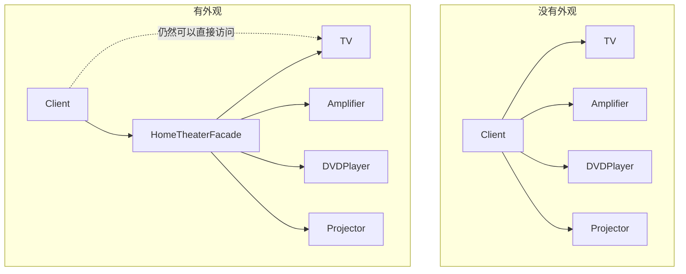
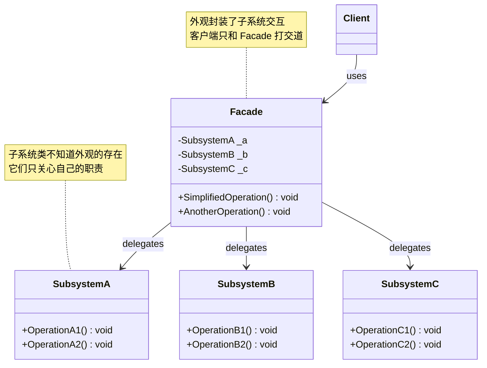

# 外观模式 Facade

> 所属计划: [[design-patterns-csharp|设计模式 (C#)]]
> 预计耗时: 50 分钟
> 前置知识: [[08-structural-intro|结构型模式总览]]

---

## 1. 概念讲解

### 为什么需要外观？

假设你在写一个家庭影院系统。一个"看电影"操作需要：

```csharp
var tv = new TV();
tv.PowerOn();
tv.SetInput("HDMI1");

var amp = new Amplifier();
amp.PowerOn();
amp.SetVolume(11);
amp.SetSurroundSound(true);

var dvd = new DVDPlayer();
dvd.PowerOn();
dvd.InsertDisc("Inception");
dvd.Play();

var projector = new Projector();
projector.PowerOn();
projector.SetWideScreenMode();
projector.OpenLens();
```

**问题很明显**：客户端需要了解 4 个子系统的内部 API、初始化顺序、参数细节。这不仅耦合重，而且看一场电影要写 12 行代码——换个客户端又得重写一遍。

### 外观模式的核心思想

> 为子系统中的一组接口提供一个**统一的简化接口**。外观定义了一个高层接口，让子系统更容易使用。

外观不是"禁止客户端直接访问子系统"——它是**提供一条捷径**。客户端可以走捷径（Facade），也可以直接走子系统。



### 结构



- **`Facade`**（外观）：知道哪些子系统类负责处理请求，将客户端请求代理给合适的子系统对象
- **`Subsystem`**（子系统类）：实现子系统功能，处理 Facade 指派的工作。子系统**不知道**外观的存在，外观对子系统是透明的
- **`Client`**（客户端）：通过 Facade 与子系统交互，大幅减少依赖面

> [!tip] Facade ≠ 单一入口
> 外观可以提供多个方法（`WatchMovie()`、`ListenMusic()`、`EndMovie()`），每个方法封装一组子系统调用序列。外观不是"只有一个方法"，而是"每个方法都是一条捷径"。

### Facade 与 Proxy 的区别

| 维度 | Facade | [[15-proxy\|Proxy]] |
|------|--------|------|
| 目的 | **简化**——给复杂子系统提供简单接口 | **控制**——给原对象添加访问控制/延迟加载/日志 |
| 接口形态 | 新接口（可能和子系统完全不同） | 与原对象**相同接口**（透明代理） |
| 客户端视角 | 知道自己在用 Facade | 不知道自己用的是 Proxy |
| 子系统感知 | 子系统**不感知** Facade | 代理**包裹**原对象 |

> [!warning] 容易混淆
> 两者都是"中间层"模式，但动机截然不同。Facade 因为**太复杂**而加层，Proxy 因为**需要控制访问**而加层。

---

## 2. 代码示例

### 示例 1：家庭影院外观

完整可运行的经典示例——用 Facade 封装 4 个子系统的看电影流程：

```csharp
using System;

#region 子系统类 —— 各自独立，互不知道 Facade 的存在

public class TV
{
    public void PowerOn()
        => Console.WriteLine("  [TV] 开机");
    public void PowerOff()
        => Console.WriteLine("  [TV] 关机");
    public void SetInput(string input)
        => Console.WriteLine($"  [TV] 输入源 → {input}");
}

public class Amplifier
{
    public void PowerOn()
        => Console.WriteLine("  [Amplifier] 开机");
    public void PowerOff()
        => Console.WriteLine("  [Amplifier] 关机");
    public void SetVolume(int level)
        => Console.WriteLine($"  [Amplifier] 音量 → {level}");
    public void SetSurroundSound(bool enabled)
        => Console.WriteLine($"  [Amplifier] 环绕声 → {(enabled ? "开启" : "关闭")}");
}

public class DVDPlayer
{
    public void PowerOn()
        => Console.WriteLine("  [DVDPlayer] 开机");
    public void PowerOff()
        => Console.WriteLine("  [DVDPlayer] 关机");
    public void InsertDisc(string movie)
        => Console.WriteLine($"  [DVDPlayer] 放入碟片: {movie}");
    public void Play()
        => Console.WriteLine("  [DVDPlayer] 播放 ▶");
    public void Stop()
        => Console.WriteLine("  [DVDPlayer] 停止 ■");
    public void Eject()
        => Console.WriteLine("  [DVDPlayer] 弹出碟片");
}

public class Projector
{
    public void PowerOn()
        => Console.WriteLine("  [Projector] 开机");
    public void PowerOff()
        => Console.WriteLine("  [Projector] 关机");
    public void SetWideScreenMode()
        => Console.WriteLine("  [Projector] 宽屏模式");
    public void OpenLens()
        => Console.WriteLine("  [Projector] 打开镜头");
    public void CloseLens()
        => Console.WriteLine("  [Projector] 关闭镜头");
}

#endregion

#region Facade —— 封装复杂的子系统交互序列

/// <summary>
/// 家庭影院外观 — 将多步骤操作封装为两个简单方法
/// </summary>
public class HomeTheaterFacade
{
    private readonly TV _tv;
    private readonly Amplifier _amp;
    private readonly DVDPlayer _dvd;
    private readonly Projector _projector;

    public HomeTheaterFacade(
        TV tv, Amplifier amp, DVDPlayer dvd, Projector projector)
    {
        _tv = tv;
        _amp = amp;
        _dvd = dvd;
        _projector = projector;
    }

    /// <summary>看电影：一条方法搞定全部子系统</summary>
    public void WatchMovie(string movie)
    {
        Console.WriteLine($"\n═══ 准备看电影: {movie} ═══");
        _tv.PowerOn();
        _tv.SetInput("HDMI1");
        _amp.PowerOn();
        _amp.SetSurroundSound(true);
        _amp.SetVolume(11);
        _dvd.PowerOn();
        _dvd.InsertDisc(movie);
        _projector.PowerOn();
        _projector.SetWideScreenMode();
        _projector.OpenLens();
        _dvd.Play();
        Console.WriteLine("═══ 享受电影吧！ ═══\n");
    }

    /// <summary>结束观影：按正确顺序关闭所有设备</summary>
    public void EndMovie()
    {
        Console.WriteLine("\n═══ 结束观影 ═══");
        _dvd.Stop();
        _dvd.Eject();
        _dvd.PowerOff();
        _projector.CloseLens();
        _projector.PowerOff();
        _amp.PowerOff();
        _tv.PowerOff();
        Console.WriteLine("═══ 设备已全部关闭 ═══\n");
    }
}

#endregion

#region 客户端代码

public static class Program
{
    public static void Main()
    {
        // 构造子系统（可以来自 DI 容器，但这里直接 new）
        var tv = new TV();
        var amp = new Amplifier();
        var dvd = new DVDPlayer();
        var projector = new Projector();

        var theater = new HomeTheaterFacade(tv, amp, dvd, projector);

        // 客户端只需两行——完全不关心子系统细节
        theater.WatchMovie("Inception");
        theater.EndMovie();

        // 如果客户端确实需要直接控制某个子系统，仍然可以：
        // tv.SetInput("HDMI2");  ← 外观不阻止直接访问
    }
}

#endregion
```

**运行方式：**
```bash
dotnet new console -n FacadeHomeTheater
# 将上述代码放入 Program.cs
dotnet run --project FacadeHomeTheater
```

**预期输出：**
```text

═══ 准备看电影: Inception ═══
  [TV] 开机
  [TV] 输入源 → HDMI1
  [Amplifier] 开机
  [Amplifier] 环绕声 → 开启
  [Amplifier] 音量 → 11
  [DVDPlayer] 开机
  [DVDPlayer] 放入碟片: Inception
  [Projector] 开机
  [Projector] 宽屏模式
  [Projector] 打开镜头
  [DVDPlayer] 播放 ▶
═══ 享受电影吧！ ═══


═══ 结束观影 ═══
  [DVDPlayer] 停止 ■
  [DVDPlayer] 弹出碟片
  [DVDPlayer] 关机
  [Projector] 关闭镜头
  [Projector] 关机
  [Amplifier] 关机
  [TV] 关机
═══ 设备已全部关闭 ═══
```

> [!note] 外观的价值在于序列化
> 上面 12 个步骤缩减为 2 个方法调用。外观封装的不只是"调用哪些子系统"，还有**调用顺序、参数默认值、状态之间的依赖**。这些知识如果散落在每个客户端，改一处就要改 N 处。

---

### 示例 2：订单处理外观

实际业务场景——电商下单涉及库存扣减、支付扣款、物流发货三个服务：

```csharp
using System;
using System.Collections.Generic;

#region 子系统服务 —— 模拟真实服务的延迟和验证

public class InventoryService
{
    private readonly Dictionary<string, int> _stock = new()
    {
        ["SKU-001"] = 10,
        ["SKU-002"] = 5,
    };

    public bool Reserve(string sku, int quantity)
    {
        if (!_stock.TryGetValue(sku, out var available))
        {
            Console.WriteLine($"  [库存] SKU {sku} 不存在");
            return false;
        }
        if (available < quantity)
        {
            Console.WriteLine($"  [库存] SKU {sku} 库存不足 (需要 {quantity}, 剩 {available})");
            return false;
        }
        _stock[sku] -= quantity;
        Console.WriteLine($"  [库存] SKU {sku} 预留 {quantity} 件 (剩余 {_stock[sku]})");
        return true;
    }

    public void Release(string sku, int quantity)
    {
        _stock[sku] += quantity;
        Console.WriteLine($"  [库存] SKU {sku} 释放 {quantity} 件 (恢复至 {_stock[sku]})");
    }
}

public class PaymentService
{
    public bool Charge(string accountId, decimal amount)
    {
        // 模拟：金额 > 10000 需要额外风控
        if (amount > 10000m)
        {
            Console.WriteLine($"  [支付] 大额交易 ({amount:C})，触发风控校验...");
        }
        Console.WriteLine($"  [支付] 从账户 {accountId} 扣款 {amount:C} 成功");
        return true;
    }

    public void Refund(string accountId, decimal amount)
    {
        Console.WriteLine($"  [支付] 退款 {amount:C} 到账户 {accountId}");
    }
}

public class ShippingService
{
    public string CreateShipment(string address, string sku, int quantity)
    {
        var trackingNumber = $"SF{DateTime.Now:yyyyMMddHHmmss}";
        Console.WriteLine($"  [物流] 创建运单 → {trackingNumber}");
        Console.WriteLine($"  [物流] 收货地址: {address}");
        Console.WriteLine($"  [物流] 商品: {sku} × {quantity}");
        return trackingNumber;
    }

    public void CancelShipment(string trackingNumber)
    {
        Console.WriteLine($"  [物流] 取消运单 {trackingNumber}");
    }
}

#endregion

#region Facade —— 封装下单的完整事务流程

/// <summary>
/// 订单外观 — 将下单的三个步骤封装为一个原子操作。
/// 任一子步骤失败时自动回滚已完成的步骤。
/// </summary>
public class OrderFacade
{
    private readonly InventoryService _inventory;
    private readonly PaymentService _payment;
    private readonly ShippingService _shipping;

    public OrderFacade(
        InventoryService inventory,
        PaymentService payment,
        ShippingService shipping)
    {
        _inventory = inventory;
        _payment = payment;
        _shipping = shipping;
    }

    /// <summary>
    /// 下单：预留库存 → 扣款 → 发货。失败时自动回滚。
    /// </summary>
    /// <returns>成功返回运单号，失败返回 null</returns>
    public string? PlaceOrder(
        string sku, int quantity, string accountId,
        decimal amount, string address)
    {
        Console.WriteLine($"\n═══ 开始下单: {sku} × {quantity} ═══");

        // Step 1: 预留库存
        if (!_inventory.Reserve(sku, quantity))
        {
            Console.WriteLine("  ⚠ 下单失败：库存不足\n");
            return null;
        }

        // Step 2: 扣款
        if (!_payment.Charge(accountId, amount))
        {
            Console.WriteLine("  ⚠ 下单失败：支付失败，回滚库存...");
            _inventory.Release(sku, quantity);
            Console.WriteLine();
            return null;
        }

        // Step 3: 创建运单
        var tracking = _shipping.CreateShipment(address, sku, quantity);
        Console.WriteLine("═══ 下单成功！ ═══\n");
        return tracking;
    }
}

#endregion

#region 客户端代码

public static class Program
{
    public static void Main()
    {
        var facade = new OrderFacade(
            new InventoryService(),
            new PaymentService(),
            new ShippingService());

        // 正常下单
        var tracking1 = facade.PlaceOrder(
            "SKU-001", 2, "acc-42", 199.99m, "北京市朝阳区 xxx");
        Console.WriteLine($"运单号: {tracking1}");

        // 库存不足——自动回滚
        facade.PlaceOrder(
            "SKU-002", 99, "acc-77", 500m, "上海市浦东新区 xxx");
    }
}

#endregion
```

**运行方式：**
```bash
dotnet new console -n FacadeOrder
# 将上述代码放入 Program.cs
dotnet run --project FacadeOrder
```

**预期输出：**
```text

═══ 开始下单: SKU-001 × 2 ═══
  [库存] SKU-001 预留 2 件 (剩余 8)
  [支付] 从账户 acc-42 扣款 ¥199.99 成功
  [物流] 创建运单 → SF20260608120000
  [物流] 收货地址: 北京市朝阳区 xxx
  [物流] 商品: SKU-001 × 2
═══ 下单成功！ ═══

运单号: SF20260608120000

═══ 开始下单: SKU-002 × 99 ═══
  [库存] SKU-002 库存不足 (需要 99, 剩 5)
  ⚠ 下单失败：库存不足
```

> [!tip] Facade 内的补偿逻辑
> 虽然 Facade 不负责完整的分布式事务（那是 Saga 模式的领域），但为客户端封装**失败回滚**是 Facade 的常见职责——客户端调用 `PlaceOrder()`，要么成功要么恢复原状，不必知道回滚细节。

---

### 示例 3：C# 惯用技法 —— Minimal API 与扩展方法

Facade 模式在 C# 生态中的两个现代体现：

#### 3a. Minimal API 作为 Facade

ASP.NET Core 的 Minimal API 本质是**为 HTTP 管线提供 Facade 接口**——它隐藏了 Middleware、Routing、Endpoint 等子系统的复杂性：

```csharp
// ============================================
// Minimal API = HTTP 管线的 Facade
// ============================================

// ❌ 没有 Facade —— 直接配置底层管线（繁琐）
var builder = WebApplication.CreateBuilder(args);
var app = builder.Build();

// 手动配置中间件管线
app.UseRouting();
app.UseEndpoints(endpoints =>
{
    endpoints.MapGet("/hello", async context =>
    {
        context.Response.StatusCode = 200;
        context.Response.ContentType = "text/plain";
        await context.Response.WriteAsync("Hello");
    });
});
app.Run();

// ✅ Minimal API 作为 Facade —— 一行搞定
var app = WebApplication.CreateBuilder(args).Build();
app.MapGet("/hello", () => "Hello");  // ← Facade 隐藏了 HTTP 管线细节
app.Run();
```

> [!note] ASP.NET Core 本身就是 Facade 的集合
> `WebApplication.CreateBuilder()` 封装了 Host、Configuration、Logging、DI 等子系统；`MapGet()` 封装了路由注册、端点构建、管道配置。开发者不需要知道 `EndpointDataSource`、`RequestDelegate`、`RouteEndpoint` 等底层类型的存在。

#### 3b. 扩展方法作为微外观（Micro-Facade）

当你不希望修改子系统类，又想为特定客户端提供简化调用时，扩展方法是最轻量的 Facade：

```csharp
// ============================================
// 扩展方法 = 零耦合的微型 Facade
// ============================================

// 假设这些是第三方库或遗留代码——你不能修改它们
public class LegacyLogger
{
    public void Open(string filePath) { /* ... */ }
    public void WriteRaw(byte[] data) { /* ... */ }
    public void Close() { /* ... */ }
}

public class LegacyMetrics
{
    public void StartTimer(string name) { /* ... */ }
    public long StopTimer(string name) => 42;
}

// ═══ 扩展方法 = 给现有子系统添加 Facade 接口 ═══
public static class LoggingFacadeExtensions
{
    /// <summary>一行写日志：自动打开 → 写入 → 关闭</summary>
    public static void WriteMessage(
        this LegacyLogger logger, string message, string filePath = "app.log")
    {
        logger.Open(filePath);
        logger.WriteRaw(System.Text.Encoding.UTF8.GetBytes(
            $"[{DateTime.Now:O}] {message}\n"));
        logger.Close();
    }

    /// <summary>计时包装：自动开始/结束，返回耗时</summary>
    public static long TimeOperation(
        this LegacyMetrics metrics, string name, Action operation)
    {
        metrics.StartTimer(name);
        operation();
        return metrics.StopTimer(name);
    }
}

// 使用
var logger = new LegacyLogger();
logger.WriteMessage("服务启动");  // 一行替代 Open/WriteRaw/Close

var metrics = new LegacyMetrics();
var elapsed = metrics.TimeOperation("db-query", () =>
{
    // 被测操作
});
```

> [!tip] 扩展方法 Facade 的约束
> 扩展方法只能访问类型的公有成员。如果子系统方法都是 `internal`/`private`，需要用包装类 Facade（示例 1、2 的做法）。扩展方法最适合**给没有源码的第三方类型添加便捷操作**。

---


---

## C++ 实现

C++ 中用 RAII 风格实现 Facade：子系统对象可被 Facade 独占（`unique_ptr`）或外部注入（raw pointer / reference）。以下示例将多步操作封装为 `watchMovie()` 和 `endMovie()`。

```cpp
#include <iostream>
#include <memory>
#include <string>
using namespace std;

// ============================================
// 子系统类 — 各自独立，互不知道 Facade 的存在
// ============================================
class Amplifier {
public:
    void on()           { cout << "  [Amplifier] 开机" << endl; }
    void off()          { cout << "  [Amplifier] 关机" << endl; }
    void setVolume(int v){ cout << "  [Amplifier] 音量 → " << v << endl; }
    void setSurround()  { cout << "  [Amplifier] 环绕声开启" << endl; }
};

class DVDPlayer {
public:
    void on()              { cout << "  [DVDPlayer] 开机" << endl; }
    void off()             { cout << "  [DVDPlayer] 关机" << endl; }
    void play(const string& movie) {
        cout << "  [DVDPlayer] 播放 ▶ " << movie << endl;
    }
    void stop()            { cout << "  [DVDPlayer] 停止 ■" << endl; }
};

class Projector {
public:
    void on()          { cout << "  [Projector] 开机" << endl; }
    void off()         { cout << "  [Projector] 关机" << endl; }
    void wideScreen()  { cout << "  [Projector] 宽屏模式" << endl; }
};

// ============================================
// Facade — 封装复杂的子系统交互序列
// ============================================
class HomeTheaterFacade {
    Amplifier amp;
    DVDPlayer dvd;
    Projector projector;  // 值语义 — Facade 独占子系统
public:
    void watchMovie(const string& movie) {
        cout << "\n═══ 准备看电影: " << movie << " ═══" << endl;
        amp.on();
        amp.setSurround();
        amp.setVolume(11);
        dvd.on();
        projector.on();
        projector.wideScreen();
        dvd.play(movie);
        cout << "═══ 享受电影吧！ ═══\n" << endl;
    }

    void endMovie() {
        cout << "═══ 结束观影 ═══" << endl;
        dvd.stop();
        dvd.off();
        projector.off();
        amp.off();
        cout << "═══ 设备已全部关闭 ═══\n" << endl;
    }
};

// === main / usage ===
int main() {
    HomeTheaterFacade theater;

    // 客户端只需两行 — 完全不关心子系统细节
    theater.watchMovie("Inception");
    theater.endMovie();
}
```

**编译与运行：**
```bash
g++ -std=c++17 -o prog main.cpp && ./prog
```

**预期输出：**
```text

═══ 准备看电影: Inception ═══
  [Amplifier] 开机
  [Amplifier] 环绕声开启
  [Amplifier] 音量 → 11
  [DVDPlayer] 开机
  [Projector] 开机
  [Projector] 宽屏模式
  [DVDPlayer] 播放 ▶ Inception
═══ 享受电影吧！ ═══

═══ 结束观影 ═══
  [DVDPlayer] 停止 ■
  [DVDPlayer] 关机
  [Projector] 关机
  [Amplifier] 关机
═══ 设备已全部关闭 ═══
```

> [!tip] C++ Facade 风格选择
> 若需要替换子系统实现（如测试 mock），可将子系统通过构造函数注入 `unique_ptr`；若子系统固定不变，直接用值成员更简单且零开销。

---
## 3. 练习

### 练习 1：实现智能家居外观

设计并实现一个 **`SmartHomeFacade`** 类，控制三个子系统：

```csharp
// 子系统 1：灯光控制
public interface ILightController
{
    void TurnOn(string room);      // 开灯
    void TurnOff(string room);     // 关灯
    void Dim(string room, int pct);// 调光 (0-100)
}

// 子系统 2：恒温器
public interface IThermostat
{
    void SetTemperature(int celsius);
    int GetCurrentTemperature();
    void SetMode(string mode);     // "heat" / "cool" / "off"
}

// 子系统 3：安防系统
public interface ISecuritySystem
{
    void Arm();                    // 布防
    void Disarm(string pin);       // 撤防 (需要密码)
    bool IsArmed();
}
```

**实现要求：**

1. 为三个接口提供具体实现类（不需要真实硬件，`Console.WriteLine` 即可）
2. 在 `SmartHomeFacade` 上实现以下方法：
   - **`LeaveHome()`**：关闭所有灯 → 恒温器设为节能模式 (18°C) → 布防
   - **`ArriveHome(string pin)`**：撤防（验证 PIN）→ 开客厅灯 → 恒温器设为舒适模式 (23°C)
   - **`GoodNight()`**：只保留走廊灯（调至 20% 亮度）→ 关闭其余灯 → 恒温器设为睡眠模式 (20°C) → 布防
3. PIN 错误时 `ArriveHome()` 应抛出异常且不改变任何子系统状态

```csharp
// 框架提示：实现 SmartHomeFacade
public class SmartHomeFacade
{
    private readonly ILightController _lights;
    private readonly IThermostat _thermostat;
    private readonly ISecuritySystem _security;

    // 完成构造函数和方法实现...
}
```

### 练习 2：可选子系统调用 —— 带默认值的 Facade

Facede 不要求所有调用都命中所有子系统。实现一个**可选子系统**的 Facade：

```csharp
// 场景：通知服务 Facade，根据配置多渠道发送通知
public class NotificationFacade
{
    private readonly IEmailService? _email;         // 可选
    private readonly ISmsService? _sms;             // 可选
    private readonly IPushNotificationService? _push; // 可选
    private readonly ILogService _log;              // 必选

    // 你的任务：
    // 1. 构造函数接受可选服务（可能为 null）
    // 2. 实现 SendNotification(message, channels)：
    //    - channels 是 Flags enum: None, Email, SMS, Push, All
    //    - 只调用已配置的渠道，跳过 null 的服务
    //    - 如果 channels 要求的渠道未配置，记录警告日志但不抛异常
    //    - 所有渠道都不可用时抛 InvalidOperationException
}

[Flags]
public enum NotificationChannel
{
    None  = 0,
    Email = 1,
    SMS   = 2,
    Push  = 4,
    All   = Email | SMS | Push
}

// 接口定义（你需要实现这些服务）
public interface IEmailService { void Send(string to, string body); }
public interface ISmsService { void Send(string phone, string body); }
public interface IPushNotificationService { void Send(string deviceToken, string body); }
public interface ILogService { void Log(string message); }
```

> [!tip] 提示
> 使用 C# 的 `?.` null-conditional operator 简洁处理可选服务调用：`_email?.Send(...)`。

### 练习 3：比较 Facade vs Mediator（可选挑战）

[[14-mediator|中介者模式]] 和 Facade 都"在中间加一层"。写出你对以下场景的分析：

**场景**：一个在线会议系统，包含 `VideoStreamService`、`AudioService`、`ChatService`、`ScreenShareService`。系统需要支持：

- A. 一键"开始会议"（初始化音频+视频，打开聊天面板）
- B. 多子系统之间的实时交互（如：当某人开始屏幕共享时，自动降低其他人的视频码率）

**问题：**

1. 场景 A 用 Facade 更合适还是 Mediator？为什么？
2. 场景 B 用 Facade 更合适还是 Mediator？为什么？
3. 如果同时存在 A 和 B，你会怎么设计？（用代码或伪代码表达）

> [!note] 思考方向
> Facade 是**单向简化**（Client → Facade → Subsystems），Mediator 是**多向解耦**（ComponentA ↔ Mediator ↔ ComponentB）。关键区别在于：封装的是"调用序列"还是"交互关系"。

---

## 3.5 参考答案

> [!tip]- 练习 1 参考答案
>
> ```csharp
> using System;
>
> // ============================================
> // 子系统实现
> // ============================================
> public class LightController : ILightController
> {
>     public void TurnOn(string room)
>         => Console.WriteLine($"  [灯光] {room} — 开灯 💡");
>     public void TurnOff(string room)
>         => Console.WriteLine($"  [灯光] {room} — 关灯");
>     public void Dim(string room, int pct)
>         => Console.WriteLine($"  [灯光] {room} — 调光至 {pct}%");
> }
>
> public class Thermostat : IThermostat
> {
>     private int _currentTemp = 22;
>     private string _mode = "off";
>
>     public void SetTemperature(int celsius)
>     {
>         _currentTemp = celsius;
>         Console.WriteLine($"  [恒温器] 设定温度 → {celsius}°C");
>     }
>     public int GetCurrentTemperature()
>         => _currentTemp;
>     public void SetMode(string mode)
>     {
>         _mode = mode;
>         Console.WriteLine($"  [恒温器] 模式 → {mode}");
>     }
> }
>
> public class SecuritySystem : ISecuritySystem
> {
>     private bool _isArmed;
>
>     public void Arm()
>     {
>         _isArmed = true;
>         Console.WriteLine("  [安防] 🔒 已布防");
>     }
>     public void Disarm(string pin)
>     {
>         if (pin != "1234")
>             throw new UnauthorizedAccessException($"PIN 错误: {pin}");
>         _isArmed = false;
>         Console.WriteLine("  [安防] 🔓 已撤防");
>     }
>     public bool IsArmed()
>         => _isArmed;
> }
>
> // ============================================
> // SmartHomeFacade
> // ============================================
> public class SmartHomeFacade
> {
>     private readonly ILightController _lights;
>     private readonly IThermostat _thermostat;
>     private readonly ISecuritySystem _security;
>
>     public SmartHomeFacade(
>         ILightController lights,
>         IThermostat thermostat,
>         ISecuritySystem security)
>     {
>         _lights = lights;
>         _thermostat = thermostat;
>         _security = security;
>     }
>
>     /// <summary>离家：关闭所有灯 → 节能温控 → 布防</summary>
>     public void LeaveHome()
>     {
>         Console.WriteLine("\n═══ 离家模式 ═══");
>         _lights.TurnOff("客厅");
>         _lights.TurnOff("卧室");
>         _lights.TurnOff("走廊");
>         _lights.TurnOff("厨房");
>         _thermostat.SetMode("heat");
>         _thermostat.SetTemperature(18);
>         _security.Arm();
>         Console.WriteLine("═══ 已离家，安防已布防 ═══\n");
>     }
>
>     /// <summary>回家：撤防 → 开客厅灯 → 舒适温控</summary>
>     public void ArriveHome(string pin)
>     {
>         Console.WriteLine("\n═══ 回家模式 ═══");
>         // PIN 验证失败时直接抛异常，不改变任何状态
>         _security.Disarm(pin);
>         _lights.TurnOn("客厅");
>         _thermostat.SetMode("heat");
>         _thermostat.SetTemperature(23);
>         Console.WriteLine("═══ 欢迎回家！ ═══\n");
>     }
>
>     /// <summary>晚安：走廊微光 → 关其余灯 → 睡眠温控 → 布防</summary>
>     public void GoodNight()
>     {
>         Console.WriteLine("\n═══ 晚安模式 ═══");
>         _lights.TurnOff("客厅");
>         _lights.TurnOff("卧室");
>         _lights.TurnOff("厨房");
>         _lights.Dim("走廊", 20);   // 走廊保留 20% 微光
>         _thermostat.SetMode("heat");
>         _thermostat.SetTemperature(20);
>         _security.Arm();
>         Console.WriteLine("═══ 晚安！ ═══\n");
>     }
> }
>
> // ============================================
> // 验证代码
> // ============================================
> var smartHome = new SmartHomeFacade(
>     new LightController(),
>     new Thermostat(),
>     new SecuritySystem());
>
> smartHome.LeaveHome();
> smartHome.ArriveHome("1234");
> smartHome.GoodNight();
>
> // 测试 PIN 错误
> try
> {
>     smartHome.ArriveHome("0000");
> }
> catch (UnauthorizedAccessException ex)
> {
>     Console.WriteLine($"  ❌ 被拦截: {ex.Message}");
> }
> ```
>
> **关键点**：
> - `ArriveHome` 中 `Disarm(pin)` 是第一步——PIN 错误时立即抛异常，不改变任何灯光/温控状态
> - `GoodNight` 中走廊灯先调到 20% 再关闭其余灯，顺序不影响最终结果
> - 外观只做编排，不持有状态

> [!tip]- 练习 2 参考答案
>
> ```csharp
> using System;
>
> // ============================================
> // 服务实现
> // ============================================
> public class EmailService : IEmailService
> {
>     public void Send(string to, string body)
>         => Console.WriteLine($"  [Email] 发往 {to}: {body}");
> }
>
> public class SmsService : ISmsService
> {
>     public void Send(string phone, string body)
>         => Console.WriteLine($"  [SMS] 发往 {phone}: {body}");
> }
>
> public class PushNotificationService : IPushNotificationService
> {
>     public void Send(string deviceToken, string body)
>         => Console.WriteLine($"  [Push] 发往设备 {deviceToken[..Math.Min(8, deviceToken.Length)]}...: {body}");
> }
>
> public class ConsoleLogService : ILogService
> {
>     public void Log(string message)
>         => Console.WriteLine($"  [Log] {DateTime.Now:HH:mm:ss} {message}");
> }
>
> // ============================================
> // NotificationFacade — 核心实现
> // ============================================
> public class NotificationFacade
> {
>     private readonly IEmailService? _email;
>     private readonly ISmsService? _sms;
>     private readonly IPushNotificationService? _push;
>     private readonly ILogService _log;
>
>     public NotificationFacade(
>         ILogService log,
>         IEmailService? email = null,
>         ISmsService? sms = null,
>         IPushNotificationService? push = null)
>     {
>         _log = log;
>         _email = email;
>         _sms = sms;
>         _push = push;
>     }
>
>     /// <summary>按渠道掩码发送通知。全部不可用时抛异常。</summary>
>     public void SendNotification(string message, NotificationChannel channels)
>     {
>         // 前置：检查是否至少有一个已配置的渠道可用
>         bool anyConfigured = false;
>
>         if (channels.HasFlag(NotificationChannel.Email))
>         {
>             if (_email != null)
>             {
>                 _email.Send("user@example.com", message);
>                 anyConfigured = true;
>             }
>             else
>             {
>                 _log.Log("Email 渠道未配置，跳过");
>             }
>         }
>
>         if (channels.HasFlag(NotificationChannel.SMS))
>         {
>             if (_sms != null)
>             {
>                 _sms.Send("+86-13800000000", message);
>                 anyConfigured = true;
>             }
>             else
>             {
>                 _log.Log("SMS 渠道未配置，跳过");
>             }
>         }
>
>         if (channels.HasFlag(NotificationChannel.Push))
>         {
>             if (_push != null)
>             {
>                 _push.Send("device-token-abc123", message);
>                 anyConfigured = true;
>             }
>             else
>             {
>                 _log.Log("Push 渠道未配置，跳过");
>             }
>         }
>
>         if (!anyConfigured)
>             throw new InvalidOperationException(
>                 $"所有请求的渠道 ({channels}) 均未配置或不可用");
>
>         _log.Log($"通知已发送 (渠道: {channels})");
>     }
> }
>
> // ============================================
> // 验证代码
> // ============================================
> // 场景 1：全部渠道可用
> var fullFacade = new NotificationFacade(
>     new ConsoleLogService(),
>     new EmailService(), new SmsService(), new PushNotificationService());
> fullFacade.SendNotification("系统维护通知", NotificationChannel.All);
>
> // 场景 2：仅 Email 可用
> var emailOnly = new NotificationFacade(
>     new ConsoleLogService(),
>     email: new EmailService());
> emailOnly.SendNotification("邮件通知", NotificationChannel.Email | NotificationChannel.SMS);
> // SMS 未配置 → 记录警告，Email 正常发送，不抛异常
>
> // 场景 3：全部不可用（抛异常）
> try
> {
>     var none = new NotificationFacade(new ConsoleLogService());
>     none.SendNotification("无渠道通知", NotificationChannel.Email);
> }
> catch (InvalidOperationException ex)
> {
>     Console.WriteLine($"  ❌ {ex.Message}");
> }
> ```
>
> **关键点**：
> - 构造函数使用可选参数，让调用方只传已实现的服务
> - `?.` null-conditional operator 简洁处理可选服务：`_email?.Send(...)` 等价于 `if (_email != null) _email.Send(...)`
> - `HasFlag` 判断 Flags enum——Email | SMS 两个标志同时设时，两次 `HasFlag` 都返回 `true`
> - 渠道未配置时记录警告日志而非抛异常——外观容忍部分缺失，只在实际要用的渠道全空时才抛

> [!tip]- 练习 3 参考答案（可选）
>
> > **1. 场景 A 用 Facade 更合适还是 Mediator？为什么？**
> >
> > Facade 更合适。场景 A 的需求是**单向简化**：Client 需要一键执行初始化音频+视频+打开聊天面板的固定序列。这是典型的"封装调用序列"——客户端不需要知道子系统间的交互顺序，只需一个 `StartMeeting()` 方法。Facade 正好提供这种面向客户端的简化入口，而 Mediator 关注的是子系统之间的多向通信，在场景 A 中属于过度设计。
> >
> > **2. 场景 B 用 Facade 更合适还是 Mediator？为什么？**
> >
> > Mediator 更合适。场景 B 是**多向实时交互**：`ScreenShareService` 的状态变化需要通知 `VideoStreamService` 调整码率——这是子系统之间的协作。如果让子系统互相引用，会形成网状依赖；Mediator 将交互逻辑集中在一个中介者对象中，各组件只依赖 Mediator，实现星型拓扑。Facade 不懂"当 A 发生某事时 B 该做什么"——那不是它的职责。
> >
> > **3. 如果同时存在 A 和 B，你会怎么设计？**
> >
> > Facade 和 Mediator **可以共存且互补**：
> >
> > ```csharp
> > // Mediator 处理子系统间的交互
> > public class MeetingMediator
> > {
> >     private readonly VideoStreamService _video;
> >     private readonly AudioService _audio;
> >     private readonly ScreenShareService _screenShare;
> >
> >     public MeetingMediator(/* 注入各子系统 */) { /* ... */ }
> >
> >     // 场景 B：屏幕共享开始时，通知视频降码率
> >     public void OnScreenShareStarted()
> >     {
> >         _video.SetBitrate(VideoQuality.Low);
> >     }
> >     public void OnScreenShareStopped()
> >     {
> >         _video.SetBitrate(VideoQuality.High);
> >     }
> > }
> >
> > // Facade 提供客户端的统一入口
> > public class MeetingFacade
> > {
> >     private readonly VideoStreamService _video;
> >     private readonly AudioService _audio;
> >     private readonly ChatService _chat;
> >     private readonly MeetingMediator _mediator; // 复用 Mediator
> >
> >     public MeetingFacade(/* 注入子系统 + mediator */) { /* ... */ }
> >
> >     // 场景 A：一键开始会议
> >     public void StartMeeting()
> >     {
> >         _audio.Initialize();
> >         _video.Initialize();
> >         _chat.OpenPanel();
> >         // 子系统间的交互规则交给 Mediator，Facade 不关心
> >     }
> > }
> > ```
> >
> > **总结**：Facade 面向上层（Client → Facade → Subsystem），Mediator 面向内部（ComponentA ↔ Mediator ↔ ComponentB）。两者职责正交，组合使用时 Facade 负责"启动序列"，Mediator 负责"运行时协调"。

> [!note] 答案使用方式
> 先独立完成练习，再展开查看参考答案。参考答案不是唯一解——如果你的实现通过了测试或达到了题目要求，就是正确的。

## 4. 扩展阅读

- [[08-structural-intro|结构型模式总览]] — 七种结构型模式的对比和选择指南
- [[15-proxy|代理模式]] — 与 Facade 最容易混淆的模式，重点看对比表
- [[09-adapter|适配器模式]] — 同样是"换个接口"，但目标是兼容而非简化
- [[14-mediator|中介者模式]] — Facade 封装子系统对客户端的复杂度，Mediator 封装子系统之间的交互
- [Refactoring.Guru — Facade Pattern](https://refactoring.guru/design-patterns/facade) — 含多语言实现的伪代码
- [Microsoft — `WebApplication` 源码](https://github.com/dotnet/aspnetcore/blob/main/src/DefaultBuilder/src/WebApplication.cs) — ASP.NET Core 中最经典的 Facade 实现，`WebApplication` 封装了 Host、Configuration、Middleware 管线
- [Microsoft — Extension Methods (C# Programming Guide)](https://learn.microsoft.com/en-us/dotnet/csharp/programming-guide/classes-and-structs/extension-methods) — 扩展方法作为微 Facade 的官方指南
- [Head First Design Patterns — Ch.7 Adapter and Facade](https://www.oreilly.com/library/view/head-first-design/) — 书中用"家庭影院"讲解了 Facade（本书示例 1 的灵感来源）

---

## 常见陷阱

### 陷阱 1：Facade 变成 God Class

```csharp
// ❌ Facade 变成了整个系统的"万能入口"——50 个方法，3 千行
public class SystemFacade
{
    public void DoEverythingForModuleA() { /* 200 行 */ }
    public void DoEverythingForModuleB() { /* 200 行 */ }
    // ... 48 more methods
}

// ✅ 按子系统边界拆分成多个 Facade
public class OrderFacade { /* 只负责下单相关 */ }
public class UserFacade { /* 只负责用户相关 */ }
public class ReportFacade { /* 只负责报表相关 */ }
```

**判断标准**：如果你的 Facade 有超过 10 个公共方法或者超过 300 行，拆分它。Facade 的目的是简化，不是集权。

### 陷阱 2：外观隐藏了客户端需要的功能

```csharp
// ❌ 外观过度简化——客户端想调节音量但 Facade 不暴露
public class HomeTheaterFacade
{
    public void WatchMovie(string movie)
    {
        _amp.SetVolume(11); // 写死音量
        // ...
    }
    // 没有 SetVolume 方法！
}

// ✅ 保留必要的细粒度控制
public class HomeTheaterFacade
{
    public void WatchMovie(string movie, int? volume = null)
    {
        _amp.SetVolume(volume ?? 11); // 允许覆盖
        // ...
    }

    // 或者暴露子系统引用
    public Amplifier Amplifier => _amp; // 允许高级用户直接操作
}
```

> [!tip] 原则：Facade 是"推荐路径"，不是"唯一路径"
> 提供快捷方式的同时，不要锁死用户。三种方案按需选择：① Facade 方法接受可选参数 ② 暴露子系统引用（get-only） ③ 用户绕过 Facade 直接 new 子系统（反正 Facade 不阻止直接访问）。

### 陷阱 3：Facade 持有状态

```csharp
// ❌ Facade 变成了有状态的服务——"当前是否在看电影"状态由 Facade 管理
public class HomeTheaterFacade
{
    private bool _isWatching;

    public void WatchMovie(string movie)
    {
        if (_isWatching)
            throw new InvalidOperationException("已经在看电影了");
        _isWatching = true;
        // ...
    }
}
// 问题：如果用户直接操作了 TV.PowerOff()，Facade 的状态就错乱了

// ✅ Facade 应保持无状态，状态由子系统自己管理
public class HomeTheaterFacade
{
    public void WatchMovie(string movie)
    {
        // 直接执行操作，不跟踪"是否在看"
        _tv.PowerOn();
        // ...
    }
}
```

**原因**：外观是"通道"而非"管理器"。如果外观持有状态，它就必须与子系统的真实状态保持同步——这引入了分布式状态一致性问题，而 Facade 的设计根本不考虑这一点。如果业务需要状态管理，考虑引入专门的服务/状态管理器。

### 陷阱 4：为简单子系统添加 Facade

```csharp
// ❌ 子系统只有一个类两个方法，不需要 Facade
public class SimpleLogger
{
    public void LogInfo(string msg) => Console.WriteLine($"[INFO] {msg}");
    public void LogError(string msg) => Console.WriteLine($"[ERROR] {msg}");
}

public class SimpleLoggerFacade // 多余的包装
{
    private readonly SimpleLogger _logger = new();
    public void Info(string msg) => _logger.LogInfo(msg);
    public void Error(string msg) => _logger.LogError(msg);
}

// ✅ 直接使用即可
var logger = new SimpleLogger();
logger.LogInfo("done");
```

**判断标准**：子系统类数量 ≥ 3 或调用步骤 ≥ 5 时，Facade 才开始产生价值。为简单东西加外观只是增加了一层无意义的间接。
