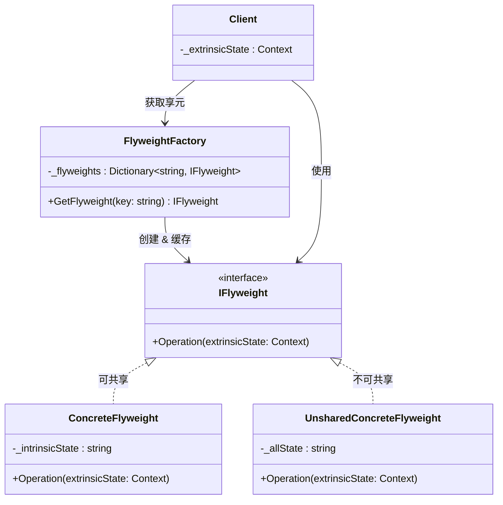
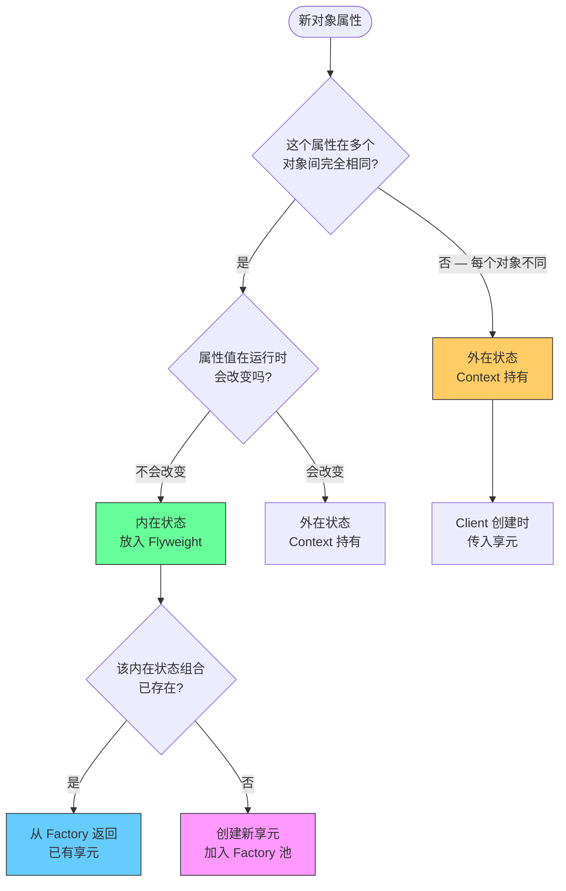

# 享元模式 Flyweight

> 所属计划: [[design-patterns-csharp|设计模式 (C#)]]
> 预计耗时: 60 分钟
> 前置知识: [[08-structural-intro|结构型模式总览]] · [[03-singleton|单例模式]] · `Dictionary<TKey, TValue>` 基础用法

---

## 1. 概念讲解

### 为什么需要共享？

当你需要创建**大量相似对象**时，每个对象独立分配内存会导致：

- 内存爆炸：100 万颗树 × 每个 Tree 对象 200 字节 = 200 MB
- GC 压力：大量小对象触发频繁 GC，停顿时间飙升
- CPU 缓存污染：对象分散在堆上，缓存局部性极差

但这些"相似对象"中，很大一部分数据是**完全相同的**。以文本编辑器为例：一篇文章有 10 万个字符，但字符的字体、字形数据只有 128 种（ASCII 可打印字符）。

**享元模式的核心思想**：将对象状态拆分为**内在状态（Intrinsic）**和**外在状态（Extrinsic）**——内在状态可共享（放在享元对象中），外在状态由调用者持有并在使用时传入。

```
┌──────────────────────────────────────────────────────────┐
│  100,000 个 Character 对象（无 Flyweight）                 │
│  每个: { char='A', font='Arial', size=12, x=10, y=20 }   │
│  内存: ~6.4 MB                                            │
└──────────────────────────────────────────────────────────┘
                          ↓ 应用享元
┌──────────────────────────────────────────────────────────┐
│  128 个 CharacterFlyweight（共享）                         │
│  每个: { char='A', font='Arial', size=12 }  — 内在状态    │
│  内存: ~10 KB                                             │
│                                                          │
│  100,000 个 CharacterContext（每个独有）                     │
│  每个: { x, y, color }                     — 外在状态    │
│  内存: ~1.6 MB                                            │
│                                                          │
│  总计: ~1.61 MB （减少 75%）                               │
└──────────────────────────────────────────────────────────┘
```

### 内在状态 vs 外在状态

这是享元模式最核心的二分法，**分错了会导致共享失效或数据错乱**：

| | 内在状态 (Intrinsic) | 外在状态 (Extrinsic) |
|---|---|---|
| **定义** | 对象之间**完全相同**、可共享的数据 | 每个对象**各不相同**、不可共享的数据 |
| **存储位置** | 享元对象内部（Flyweight） | 调用者持有（Context），使用时传入 |
| **生命周期** | 全局唯一或池化管理 | 随每次使用而变 |
| **可变性** | **不可变**（必须！否则一改全变） | 可变 |
| **示例** | 字符的字形/字体、树的模型/纹理、棋子的外观 | 字符的位置/颜色、树的位置/大小、棋子的坐标 |

> [!warning] 内在状态必须不可变
> 如果修改了一个共享享元的内在状态，所有引用该享元的对象都会受到影响。这是 Bug 的经典来源。享元对象创建后就应视为只读。

### 享元模式 GoF 结构



- **IFlyweight**: 定义接收外在状态的接口
- **ConcreteFlyweight**: 持有内在状态的共享对象
- **UnsharedConcreteFlyweight**: 不需要共享的叶子节点（GoF 允许部分对象不共享）
- **FlyweightFactory**: 管理享元池，确保同一 key 只创建一次
- **Client**: 持有外在状态，在调用 `Operation()` 时传入

### 内在/外在状态决策流程



---

## 2. 代码示例

### 示例 1：文本渲染 — Character 享元

最常见的享元演示：文本编辑器中的字符渲染。每个字符的字形数据（内在状态）被共享，渲染位置和颜色（外在状态）由 Context 持有。

```csharp
// ============================================
// 1. 享元接口 + 字符享元（内在状态）
// ============================================

public interface ICharacterFlyweight
{
    // 外在状态通过参数传入，不存储在享元内部
    void Display(int x, int y, ConsoleColor color);
}

public class CharacterFlyweight : ICharacterFlyweight
{
    // 内在状态 — 不可变，可共享
    public char Symbol { get; }
    public string FontFamily { get; }
    public int FontSize { get; }
    public bool IsBold { get; }

    // 模拟"重量级"字形数据（实际场景中可能是纹理/矢量路径）
    private readonly byte[] _glyphData;

    public CharacterFlyweight(char symbol, string fontFamily, int fontSize, bool isBold)
    {
        Symbol = symbol;
        FontFamily = fontFamily;
        FontSize = fontSize;
        IsBold = isBold;

        // 模拟昂贵的字形加载（实际可能从字体文件解析）
        _glyphData = new byte[1024]; // 1KB 字形数据
        Array.Fill(_glyphData, (byte)symbol);
    }

    public void Display(int x, int y, ConsoleColor color)
    {
        // 外在状态仅在方法调用时使用，不存储
        Console.ForegroundColor = color;
        Console.SetCursorPosition(x, y);
        Console.Write(Symbol);
        Console.ResetColor();
    }
}
```

```csharp
// ============================================
// 2. 享元工厂
// ============================================

public class CharacterFlyweightFactory
{
    private readonly Dictionary<string, CharacterFlyweight> _flyweights = new();

    public CharacterFlyweight GetCharacter(char symbol, string fontFamily, int fontSize, bool isBold)
    {
        // 用内在状态的组合作为 key
        string key = $"{symbol}|{fontFamily}|{fontSize}|{isBold}";

        if (!_flyweights.TryGetValue(key, out var flyweight))
        {
            flyweight = new CharacterFlyweight(symbol, fontFamily, fontSize, isBold);
            _flyweights[key] = flyweight;
        }

        return flyweight;
    }

    public int Count => _flyweights.Count;
}
```

```csharp
// ============================================
// 3. 上下文（外在状态） + 客户端
// ============================================

public class CharacterContext
{
    public ICharacterFlyweight Flyweight { get; }
    public int X { get; }
    public int Y { get; }
    public ConsoleColor Color { get; }

    public CharacterContext(ICharacterFlyweight flyweight, int x, int y, ConsoleColor color)
    {
        Flyweight = flyweight;
        X = x;
        Y = y;
        Color = color;
    }

    public void Render()
    {
        Flyweight.Display(X, Y, Color);
    }
}

// --- 使用 ---
var factory = new CharacterFlyweightFactory();
var contexts = new List<CharacterContext>();

string text = "Hello World! Flyweight Pattern in C#";
Random rng = new(42);

for (int i = 0; i < text.Length; i++)
{
    char c = text[i];
    // 所有字符共享相同的字体配置（内在状态）
    var flyweight = factory.GetCharacter(c, "Consolas", 14, bold: false);

    // 每个字符的位置不同（外在状态）
    var ctx = new CharacterContext(
        flyweight,
        x: i,
        y: 10,
        color: (ConsoleColor)rng.Next(1, 15)
    );
    contexts.Add(ctx);
}

Console.WriteLine("=== 文本渲染 (Flyweight) ===");
Console.WriteLine($"文本长度: {text.Length} 个字符");
Console.WriteLine($"享元数量: {factory.Count} 个（而非 {text.Length} 个）");
Console.WriteLine($"唯一字符数: {text.Distinct().Count()}");

foreach (var ctx in contexts)
{
    ctx.Render();
}

Console.SetCursorPosition(0, 12);
Console.WriteLine($"内存节省: 每个享元 1KB，{factory.Count} 个 = {factory.Count}KB");
Console.WriteLine($"          无享元需要 {text.Length} 个 = {text.Length}KB");
```

**运行方式:**
```bash
dotnet new console -n FlyweightTextDemo
# 将上述代码放入 Program.cs
dotnet run --project FlyweightTextDemo
```

**预期输出:**
```text
=== 文本渲染 (Flyweight) ===
文本长度: 37 个字符
享元数量: 18 个（而非 37 个）
唯一字符数: 18
（彩色文本行）
内存节省: 每个享元 1KB，18 个 = 18KB
          无享元需要 37 个 = 37KB
```

### 示例 2：游戏单位 — UnitType 享元 + Unit 实例

RTS 游戏中，同一种兵种（如"剑士"）的模型、属性、技能完全相同。用享元共享这些数据，每个实例只持有位置和血量。

```csharp
// ============================================
// 1. 单位类型享元（内在状态 — 不可变）
// ============================================

public record UnitTypeFlyweight(
    string Name,
    string ModelPath,      // 3D 模型路径
    int MaxHealth,
    int Attack,
    int Defense,
    float MoveSpeed,
    string[] Abilities     // 技能名称列表
)
{
    // 模拟加载模型资源（重量级操作，只做一次）
    private static readonly Dictionary<string, byte[]> _modelCache = new();

    public byte[] LoadModel()
    {
        if (!_modelCache.TryGetValue(ModelPath, out var data))
        {
            // 模拟从磁盘加载 3D 模型（实际可能 10MB+）
            data = new byte[1024 * 100]; // 模拟 100KB 模型数据
            Array.Fill(data, (byte)Name[0]);
            _modelCache[ModelPath] = data;
        }
        return data;
    }
}

// ============================================
// 2. 单位类型工厂
// ============================================

public class UnitTypeFactory
{
    private readonly Dictionary<string, UnitTypeFlyweight> _types = new();

    public UnitTypeFlyweight GetUnitType(string name, string modelPath, int maxHealth,
        int attack, int defense, float moveSpeed, string[] abilities)
    {
        if (!_types.TryGetValue(name, out var type))
        {
            type = new UnitTypeFlyweight(name, modelPath, maxHealth, attack, defense, moveSpeed, abilities);
            _types[name] = type;
        }
        return type;
    }

    public int TypeCount => _types.Count;
}
```

```csharp
// ============================================
// 3. 单位实例（外在状态 — 每个实例独有）
// ============================================

public class Unit
{
    public UnitTypeFlyweight Type { get; }      // 共享引用
    public int Id { get; }
    public float X { get; set; }
    public float Y { get; set; }
    public int CurrentHealth { get; set; }
    public string PlayerOwner { get; }

    public Unit(int id, UnitTypeFlyweight type, float x, float y, string playerOwner)
    {
        Id = id;
        Type = type;
        X = x;
        Y = y;
        CurrentHealth = type.MaxHealth; // 从享元读取初始值
        PlayerOwner = playerOwner;
    }

    public bool IsAlive => CurrentHealth > 0;

    public void TakeDamage(int damage)
    {
        CurrentHealth = Math.Max(0, CurrentHealth - Math.Max(0, damage - Type.Defense));
    }

    public void Move(float dx, float dy)
    {
        X += dx * Type.MoveSpeed;
        Y += dy * Type.MoveSpeed;
    }

    public override string ToString() =>
        $"[{Id}] {Type.Name} @ ({X:F1}, {Y:F1}) HP={CurrentHealth}/{Type.MaxHealth} " +
        $"ATK={Type.Attack} DEF={Type.Defense} Owner={PlayerOwner}";
}

// --- 使用 ---
var typeFactory = new UnitTypeFactory();

// 注册几种单位类型（每种只创建一次）
var swordsmanType = typeFactory.GetUnitType("Swordsman", "models/swordsman.fbx",
    maxHealth: 100, attack: 15, defense: 10, moveSpeed: 1.0f,
    abilities: new[] { "Slash", "ShieldBash" });

var archerType = typeFactory.GetUnitType("Archer", "models/archer.fbx",
    maxHealth: 70, attack: 20, defense: 5, moveSpeed: 1.2f,
    abilities: new[] { "Shoot", "Volley" });

var knightType = typeFactory.GetUnitType("Knight", "models/knight.fbx",
    maxHealth: 150, attack: 25, defense: 20, moveSpeed: 0.8f,
    abilities: new[] { "Charge", "Defend", "Inspire" });

Console.WriteLine($"=== 游戏单位 (Flyweight) ===");
Console.WriteLine($"单位类型数: {typeFactory.TypeCount}");

// 创建 1000 个单位实例（共享 3 种类型）
var units = new List<Unit>();
Random rng = new(42);

for (int i = 0; i < 1000; i++)
{
    UnitTypeFlyweight type = (i % 3) switch
    {
        0 => swordsmanType,
        1 => archerType,
        _ => knightType,
    };

    units.Add(new Unit(
        id: i + 1,
        type: type,
        x: rng.Next(0, 500),
        y: rng.Next(0, 500),
        playerOwner: i < 500 ? "Player1" : "Player2"
    ));
}

// 验证：所有同类型单位共享同一个 UnitTypeFlyweight 引用
var firstSwordsman = units[0];
var secondSwordsman = units[3];
Console.WriteLine($"\n第一个剑士和第四个剑士共享同一类型对象: " +
    $"{ReferenceEquals(firstSwordsman.Type, secondSwordsman.Type)}");

// 展示前几个单位和内存估算
Console.WriteLine($"\n前 5 个单位:");
foreach (var u in units.Take(5))
    Console.WriteLine($"  {u}");

// 内存估算
long typeSize = 100 * 1024; // 模型数据 100KB × 3 类型 = 300KB
long instanceSize = 64;     // Unit 实例约 64 字节 × 1000 = 64KB
long withoutFlyweight = 1000L * 100 * 1024; // 如果每个实例都持有模型副本

Console.WriteLine($"\n内存估算:");
Console.WriteLine($"  享元模式: {typeSize / 1024}KB (类型) + {instanceSize * 1000 / 1024}KB (实例) ≈ " +
    $"{(typeSize + instanceSize * 1000) / 1024}KB");
Console.WriteLine($"  无享元:   {withoutFlyweight / 1024}KB (每实例持有模型)");
Console.WriteLine($"  节省:     {(withoutFlyweight - typeSize - instanceSize * 1000) / 1024}KB " +
    $"({(1 - (double)(typeSize + instanceSize * 1000) / withoutFlyweight) * 100:F1}%)");
```

**运行方式:**
```bash
dotnet new console -n FlyweightUnitDemo
dotnet run --project FlyweightUnitDemo
```

**预期输出:**
```text
=== 游戏单位 (Flyweight) ===
单位类型数: 3

第一个剑士和第四个剑士共享同一类型对象: True

前 5 个单位:
  [1] Swordsman @ (312.0, 276.0) HP=100/100 ATK=15 DEF=10 Owner=Player1
  [2] Archer @ (89.0, 431.0) HP=70/70 ATK=20 DEF=5 Owner=Player1
  [3] Knight @ (145.0, 189.0) HP=150/150 ATK=25 DEF=20 Owner=Player1
  [4] Swordsman @ (423.0, 67.0) HP=100/100 ATK=15 DEF=10 Owner=Player1
  [5] Archer @ (267.0, 398.0) HP=70/70 ATK=20 DEF=5 Owner=Player1

内存估算:
  享元模式: 300KB (类型) + 62KB (实例) ≈ 362KB
  无享元:   100000KB (每实例持有模型)
  节省:     99638KB (99.6%)
```

### 示例 3：C# 内置享元 — `string.Intern()` + `Dictionary<TKey, TValue>` 作为工厂

C# 运行时已经内置了享元模式：字符串驻留（String Interning）。`Dictionary` 作为工厂的核心数据结构也与享元工厂如出一辙。

```csharp
// ============================================
// 1. string.Intern() — CLR 内置字符串享元
// ============================================

Console.WriteLine("=== string.Intern() — 内置享元 ===");

// 运行时字面量自动驻留
string a = "hello";
string b = "hello";
Console.WriteLine($"字面量 'hello' 引用相等: {ReferenceEquals(a, b)}");
// 输出: True — CLR 自动将字面量放入字符串池

// 动态创建的字符串默认不驻留
char[] chars = { 'h', 'e', 'l', 'l', 'o' };
string c = new string(chars);
Console.WriteLine($"\nnew string('hello') 引用相等: {ReferenceEquals(a, c)}");
// 输出: False — 虽然值相同，但是不同的对象

// 手动驻留
string d = string.Intern(c);
Console.WriteLine($"string.Intern(c) 引用相等: {ReferenceEquals(a, d)}");
// 输出: True — Intern 返回池中已存在的相同字符串

// 驻留后内存比较
// 创建 10000 个相同内容的字符串 vs 驻留版本
Console.WriteLine("\n--- 内存对比 ---");
GC.Collect();
GC.WaitForPendingFinalizers();
long memBefore = GC.GetTotalMemory(true);

var distinctStrings = new string[10_000];
for (int i = 0; i < 10_000; i++)
    distinctStrings[i] = new string("repeated text".ToCharArray());

GC.Collect();
long memUninterned = GC.GetTotalMemory(false) - memBefore;
Console.WriteLine($"10,000 个未驻留字符串: {memUninterned / 1024}KB");

// 驻留版本
var internedStrings = new string[10_000];
for (int i = 0; i < 10_000; i++)
    internedStrings[i] = string.Intern(new string("repeated text".ToCharArray()));

GC.Collect();
long memInterned = GC.GetTotalMemory(false) - memUninterned - memBefore;
Console.WriteLine($"10,000 个驻留后字符串: {memInterned / 1024}KB");
Console.WriteLine($"所有引用指向同一个对象: {ReferenceEquals(internedStrings[0], internedStrings[9999])}");
```

```csharp
// ============================================
// 2. Dictionary 作为享元工厂 — 泛型内置缓存
// ============================================

Console.WriteLine("\n=== Dictionary 作为享元工厂 ===");

// 场景：大量用户对象中重复的国家信息
public record CountryInfo(string Name, string Code, string Currency, string TimeZone);

// Dictionary 充当享元工厂
var countryCache = new Dictionary<string, CountryInfo>();

CountryInfo GetCountry(string code)
{
    if (!countryCache.TryGetValue(code, out var info))
    {
        info = code switch
        {
            "CN" => new CountryInfo("中国", "CN", "CNY", "Asia/Shanghai"),
            "US" => new CountryInfo("美国", "US", "USD", "America/New_York"),
            "JP" => new CountryInfo("日本", "JP", "JPY", "Asia/Tokyo"),
            "GB" => new CountryInfo("英国", "GB", "GBP", "Europe/London"),
            "DE" => new CountryInfo("德国", "DE", "EUR", "Europe/Berlin"),
            _ => throw new ArgumentException($"Unknown country: {code}")
        };
        countryCache[code] = info;
    }
    return info;
}

// 用户对象（外在状态）
public readonly struct User
{
    public string Name { get; init; }
    public CountryInfo Country { get; init; }  // 共享引用
    public int Age { get; init; }
}

var users = new User[50_000];
string[] countryCodes = { "CN", "US", "JP", "GB", "DE" };
Random rng = new(42);

for (int i = 0; i < users.Length; i++)
{
    users[i] = new User
    {
        Name = $"User_{i}",
        Country = GetCountry(countryCodes[rng.Next(countryCodes.Length)]),
        Age = rng.Next(18, 80)
    };
}

Console.WriteLine($"用户数量: {users.Length:N0}");
Console.WriteLine($"CountryInfo 对象数: {countryCache.Count} (而非 {users.Length:N0})");
Console.WriteLine($"所有 "CN" 用户共享同一个对象: " +
    $"{ReferenceEquals(users[0].Country, users[5].Country)}");

// 验证：即使 50000 个 User，只有 5 个 CountryInfo 对象
var uniqueCountries = users.Select(u => u.Country).Distinct().Count();
Console.WriteLine($"唯一 CountryInfo 引用数: {uniqueCountries}");
```

```csharp
// ============================================
// 3. 极致优化 — 内联常量 + 享元
// ============================================

Console.WriteLine("\n=== 内联常量享元 — 零分配方案 ===");

// 对于简单的 TINY 享元，可以用 enum/常量代替对象
public enum Country
{
    CN, US, JP, GB, DE
}

public static class CountryData
{
    // 用 ReadOnlySpan / 静态数组代替对象分配
    private static readonly string[] Names = { "中国", "美国", "日本", "英国", "德国" };
    private static readonly string[] Currencies = { "CNY", "USD", "JPY", "GBP", "EUR" };

    public static string GetName(Country c) => Names[(int)c];
    public static string GetCurrency(Country c) => Currencies[(int)c];
}

// 结构体本身可以嵌入 — 不需要单独的对象
public readonly struct OptimizedUser
{
    public string Name { get; init; }
    public Country Country { get; init; } // 4 字节 enum，不是 8 字节引用
    public int Age { get; init; }

    public string CountryName => CountryData.GetName(Country);
    public string Currency => CountryData.GetCurrency(Country);
}

Span<OptimizedUser> optimizedUsers = stackalloc OptimizedUser[3];
optimizedUsers[0] = new OptimizedUser { Name = "Alice", Country = Country.CN, Age = 25 };
optimizedUsers[1] = new OptimizedUser { Name = "Bob", Country = Country.US, Age = 30 };
optimizedUsers[2] = new OptimizedUser { Name = "Carol", Country = Country.JP, Age = 28 };

foreach (var u in optimizedUsers)
{
    Console.WriteLine($"  {u.Name}: {u.CountryName} ({u.Currency})");
}

Console.WriteLine($"\nOptimizedUser 大小: {System.Runtime.InteropServices.Marshal.SizeOf<OptimizedUser>()} 字节");
Console.WriteLine($"无额外对象分配 — 所有享元数据在静态数组中");
```

**运行方式:**
```bash
dotnet new console -n FlyweightCSharpIdiomatic
# 需要 .NET 6+，启用 <ImplicitUsings>enable</ImplicitUsings>
dotnet run --project FlyweightCSharpIdiomatic
```

**预期输出:**
```text
=== string.Intern() — 内置享元 ===
字面量 'hello' 引用相等: True

new string('hello') 引用相等: False
string.Intern(c) 引用相等: True

--- 内存对比 ---
10,000 个未驻留字符串: ~400KB
10,000 个驻留后字符串: ~0KB
所有引用指向同一个对象: True

=== Dictionary 作为享元工厂 ===
用户数量: 50,000
CountryInfo 对象数: 5 (而非 50,000)
所有 "CN" 用户共享同一个对象: True
唯一 CountryInfo 引用数: 5

=== 内联常量享元 — 零分配方案 ===
  Alice: 中国 (CNY)
  Bob: 美国 (USD)
  Carol: 日本 (JPY)

OptimizedUser 大小: 32 字节
无额外对象分配 — 所有享元数据在静态数组中
```

> [!tip] string.Intern() 的注意事项
> 驻留字符串**永不释放**（直到 AppDomain 卸载）。只对重复率极高的有限字符串集使用 `Intern()`，不要对用户输入或动态生成的唯一字符串使用。C# 2.0+ 还提供了 `string.IsInterned()` 来检查字符串是否已驻留，避免不必要的 Intern 调用。

---


---

## C++ 实现

C++ 享元模式的核心是用 `std::map`（工厂）管理共享的内在状态对象，用 `shared_ptr` 确保引用计数安全。外在状态（位置、大小）由 `Tree` 实例自己持有，不进入工厂。

```cpp
#include <iostream>
#include <memory>
#include <map>
#include <string>
#include <vector>
using namespace std;

// ============================================
// Flyweight — 内在状态（共享的树类型数据）
// ============================================
class TreeType {
    string name;
    string color;
    string texture;  // 模拟重量级纹理数据
public:
    TreeType(string n, string c, string t)
        : name(move(n)), color(move(c)), texture(move(t)) {}

    void draw(int x, int y) const {
        cout << "  树[" << name << " " << color << " @" << texture
             << "] 在 (" << x << ", " << y << ")" << endl;
    }

    string key() const { return name + "_" + color + "_" + texture; }
};

// ============================================
// FlyweightFactory — 管理享元池
// ============================================
class TreeFactory {
    map<string, shared_ptr<TreeType>> treeTypes;
public:
    shared_ptr<TreeType> getTreeType(const string& name,
                                      const string& color,
                                      const string& texture) {
        TreeType temp(name, color, texture);
        string k = temp.key();
        auto it = treeTypes.find(k);
        if (it != treeTypes.end())
            return it->second;

        auto tt = make_shared<TreeType>(move(temp));
        treeTypes[k] = tt;
        cout << "  [Factory] 创建新享元: " << k << endl;
        return tt;
    }

    size_t size() const { return treeTypes.size(); }
};

// ============================================
// Context — 外在状态（每个实例独有）
// ============================================
class Tree {
    int x, y;
    shared_ptr<TreeType> type;  // 共享的内在状态
public:
    Tree(int x_, int y_, shared_ptr<TreeType> t)
        : x(x_), y(y_), type(move(t)) {}

    void draw() const { type->draw(x, y); }
};

// === main / usage ===
int main() {
    TreeFactory factory;
    vector<Tree> forest;

    // 100 棵树，只有 3 种 TreeType
    const int N = 100;
    const string types[3] = {"橡树", "松树", "桦树"};
    const string colors[3] = {"green", "darkgreen", "lightgreen"};
    const string textures[3] = {"oak_bark", "pine_bark", "birch_bark"};

    for (int i = 0; i < N; ++i) {
        int idx = i % 3;
        auto tt = factory.getTreeType(types[idx], colors[idx], textures[idx]);
        forest.emplace_back(i * 10, (i / 10) * 20, tt);
    }

    cout << "\n=== 森林 (共 " << forest.size() << " 棵树) ===" << endl;
    for (int i = 0; i < 5; ++i)  // 只显示前 5 棵
        forest[i].draw();

    cout << "\nTreeType 享元数: " << factory.size()
         << "（而非 " << N << " — 节省内存！）" << endl;
}
```

**编译与运行：**
```bash
g++ -std=c++17 -o prog main.cpp && ./prog
```

**预期输出：**
```text
  [Factory] 创建新享元: 橡树_green_oak_bark
  [Factory] 创建新享元: 松树_darkgreen_pine_bark
  [Factory] 创建新享元: 桦树_lightgreen_birch_bark

=== 森林 (共 100 棵树) ===
  树[橡树 green @oak_bark] 在 (0, 0)
  树[松树 darkgreen @pine_bark] 在 (10, 0)
  树[桦树 lightgreen @birch_bark] 在 (20, 0)
  树[橡树 green @oak_bark] 在 (30, 20)
  树[松树 darkgreen @pine_bark] 在 (40, 20)

TreeType 享元数: 3（而非 100 — 节省内存！）
```

> [!tip] C++ 享元最佳实践
> `std::map` 查找 + `shared_ptr` 缓存是 C++ 享元工厂的经典配方。若需线程安全，可将工厂方法加 `std::mutex` 保护。C++17 的 `std::unordered_map` 可替代 `std::map` 以降低查找开销。

---
## 3. 练习

### 练习 1：树渲染系统 — 共享 TreeType 享元

在游戏或 GIS 系统中，森林可能包含数百万棵树，但树种只有几十种。实现一个使用享元模式的树渲染系统。

**骨架代码：**
```csharp
// 内在状态 — TreeType 享元
public record TreeType(
    string Name,
    string BarkTexturePath,
    string LeafTexturePath,
    float MaxHeight,
    float LeafDensity
)
{
    // 模拟从磁盘加载纹理（重量级操作）
    public byte[] LoadTextures()
    {
        // 只应在首次创建时调用一次
        return new byte[1024 * 50]; // 模拟 50KB 纹理
    }
}

// 外在状态 — Tree 实例
public class Tree
{
    public TreeType Type { get; }  // 共享引用
    public float X { get; }
    public float Y { get; }
    public float Scale { get; }
    public float Rotation { get; }
}
```

**要求：**
1. 实现 `TreeTypeFactory`，使用 `ConcurrentDictionary<string, TreeType>` 保证线程安全
2. 创建 1,000,000 棵树，但只有 20 种 TreeType
3. 打印内存节省对比（享元模式 vs 每棵树独立持有纹理）
4. 确保 `TreeType` 对象真正不可变（用 `record` 或 `init`-only 属性）
5. 用 `GC.GetTotalMemory` 验证实际内存占用（提示：先 `GC.Collect()`）

**预期发现：** 享元模式将 50GB 纹理数据压缩到 ~1MB，因为只存储了 20 个 TreeType × 50KB = 1MB。

### 练习 2：粒子系统 — 添加享元优化

一个粒子效果包含 100,000 个粒子，每个粒子有发射器属性（纹理、生命周期、初始速度、颜色渐变）和运行时状态（位置、速度、剩余生命、当前颜色）。将发射器属性重构为 Flyweight。

**要求：**
1. 定义 `ParticleEmitterConfig`（record，不可变）作为内在状态享元
2. 定义 `Particle`（class 或 struct）持有外在状态 + 指向享元的引用
3. 实现 `ParticleEmitterConfigFactory`（`Dictionary<string, ParticleEmitterConfig>`）
4. 模拟三种发射器：`FireEmitter`、`SmokeEmitter`、`SparkEmitter`
5. 每个发射器生成 33,333 个粒子，验证只有 3 个配置对象
6. 对比 struct vs class 的 `Particle`：如果 `Particle` 是 struct，享元的引用是否会阻止值语义？

> [!tip] struct + flyweight
> 如果 `Particle` 是 `struct`，它包含的 `ParticleEmitterConfig` 引用仍然是指向堆对象的指针（struct 本身在栈/数组上，但享元在堆上）。这样能获得 struct 的缓存友好性，同时保持享元的共享优势。

### 练习 3：百万对象 Benchmark（可选）

创建一个 BenchmarkDotNet 基准测试，对比有无享元模式下 1,000,000 个对象的创建和迭代性能。

**要求：**
1. 用 BenchmarkDotNet 测量：
   - 创建 1M 个对象的内存分配（`MemoryDiagnoser`）
   - 遍历 1M 个对象并访问属性的时间
   - 对 1M 个对象执行 GC 的时间
2. 对比两种实现：
   - **无享元**：每个对象包含所有数据（字符、字体、字形数据、位置、颜色）
   - **有享元**：Flyweight + Context 分离
3. 分析结果：内存节省了多少？遍历速度有何差异（缓存局部性）？
4. 记录结论：在什么场景下享元模式反而会降低性能？

> [!tip] BenchmarkDotNet 提示
> 使用 `[Params(1_000_000)]` 和 `[GlobalSetup]` 初始化测试数据。不要用 `[IterationSetup]` 重建数据（那会在每次迭代中浪费时间），而是用 `[GlobalSetup]` 一次构建，在 benchmark 方法中遍历。

---

## 4. 扩展阅读

- [[04-factory-method|工厂方法模式]] — FlyweightFactory 就是工厂方法 + 缓存的具体化
- [[03-singleton|单例模式]] — 享元与 Singleton 的区别：Singleton 是"只有一个实例"，Flyweight 是"共享有限种类的实例"
- [[06-builder|建造者模式]] — Builder 构建复杂享元的内在状态，然后注册到工厂
- [[08-structural-intro|结构型模式总览]] — 结构型模式的分类和对比
- [Refactoring.Guru — Flyweight](https://refactoring.guru/design-patterns/flyweight) — UML 与时序图的权威解读
- [Microsoft Docs — string.Intern](https://learn.microsoft.com/en-us/dotnet/api/system.string.intern) — `string.Intern()` 的官方文档和内存驻留机制
- [Microsoft Docs — Memory<T> and Span<T>](https://learn.microsoft.com/en-us/dotnet/standard/memory-and-spans) — 在没有分配开销的前提下安全访问共享数据
- [Game Programming Patterns — Flyweight](https://gameprogrammingpatterns.com/flyweight.html) — 游戏引擎中享元模式的实战应用（Robert Nystrom）
- [.NET GC 内部原理](https://learn.microsoft.com/en-us/dotnet/standard/garbage-collection/fundamentals) — 理解为什么大量小对象会触发 Gen2 回收
- [SharpLab — `record` 编译结果](https://sharplab.io/) — 在线查看 `record` 如何生成 `Equals`/`GetHashCode`/`Deconstruct`

---

## 常见陷阱

### 1. 过早优化 — 不需要享元时强行使用

享元引入工厂查找、参数传递的间接开销。如果对象数量不大（几千以内）或对象本身很轻量（几十字节），享元的复杂度不值得。

**错误做法：** 只有 100 个用户对象也引入享元。
```csharp
// 100 个用户，每种角色有几个方法引用，完全不需要享元
var roleFactory = new RoleFlyweightFactory(); // 过度设计
var users = roles.Select(r => roleFactory.GetRole(r)).ToList();
```

**正确做法：** **先测量，后优化**。用内存分析器（`dotnet-counters`、`dotMemory`、`PerfView`）确认对象数量是真正的瓶颈，再引入享元。一般规则：当同一类型的实例数 ≥ 1000 且每个享元内部有 ≥ 1KB 的共享数据时，享元才有意义。

### 2. 享元工厂的线程安全问题

多线程环境下，`Dictionary<string, Flyweight>` 不是线程安全的。同时读取和写入可能导致数据损坏或无限循环。

**错误做法：** 在高并发场景下直接使用 `Dictionary`。
```csharp
// 并发场景下 Dictionary 可能抛出异常或死循环
var flyweight = _cache[key]; // 另一个线程正在 Add
```

**正确做法：**
```csharp
// 方案 1：用 ConcurrentDictionary（推荐）
private readonly ConcurrentDictionary<string, Flyweight> _cache = new();

public Flyweight GetFlyweight(string key)
{
    return _cache.GetOrAdd(key, k => new Flyweight(k));
}

// 方案 2：初始化阶段一次性填充，后续只读
private readonly Dictionary<string, Flyweight> _cache;

public FlyweightFactory()
{
    _cache = LoadAllFlyweights(); // 构造函数中一次性初始化
}

public Flyweight GetFlyweight(string key)
{
    // 初始化后只读访问，Dictionary 的多读是线程安全的
    return _cache[key];
}

// 方案 3：Lazy<T> 延迟创建（线程安全）
private readonly ConcurrentDictionary<string, Lazy<Flyweight>> _cache = new();

public Flyweight GetFlyweight(string key)
{
    return _cache.GetOrAdd(key,
        k => new Lazy<Flyweight>(() => new Flyweight(k),
            LazyThreadSafetyMode.ExecutionAndPublication)).Value;
}
```

> [!tip] ConcurrentDictionary 的 GetOrAdd
> `GetOrAdd` 的 valueFactory 可能被多个线程同时调用（如果 key 不存在）。如果构造函数有副作用（如文件 I/O），请使用 `Lazy<T>` 包装。

### 3. 修改共享的内在状态导致所有引用者受影响

享元对象的内在状态必须不可变。如果某个客户端修改了共享享元的状态，所有其他客户端都会看到这个变化。

**错误做法：** 享元暴露可变的属性。
```csharp
public class CharacterFlyweight
{
    public string Font { get; set; } // ❌ 可变！
}

// 某处意外修改
flyweight.Font = "Arial"; // 所有使用这个享元的字符字体都变了！
```

**正确做法：** 使用只读属性 + 不可变类型。
```csharp
public class CharacterFlyweight
{
    public string Font { get; }           // get-only
    public int FontSize { get; }          // get-only
    public ImmutableArray<byte> Glyph { get; } // 不可变集合

    public CharacterFlyweight(string font, int fontSize, byte[] glyph)
    {
        Font = font;
        FontSize = fontSize;
        Glyph = glyph.ToImmutableArray(); // 防御性拷贝
    }
}
```

或者用 C# `record`（天然不可变）：
```csharp
public record CharacterFlyweight(string Font, int FontSize, ImmutableArray<byte> Glyph);
```

### 4. 将 Flyweight 与 Singleton 混淆

- **Singleton** 确保一个类**只有一个实例**（全局唯一）。
- **Flyweight** 确保相同内在状态的实例**被共享**，但可以有**多个不同内在状态**的享元（如 'A' 和 'B' 各有一个享元）。

| 对比维度 | Singleton | Flyweight |
|---|---|---|
| 实例数量 | 1 个（全局唯一） | N 个（每种内在状态一个） |
| 目的 | 控制实例数量 | 共享数据、节省内存 |
| 访问方式 | 静态属性/方法 | 通过 Factory 获取 |
| 典型场景 | 配置管理器、日志器 | 字符渲染、游戏实体、字符串驻留 |

```csharp
// Singleton：只有一个 Logger
public sealed class Logger
{
    public static Logger Instance { get; } = new Logger();
    private Logger() { }
}

// Flyweight：每种 Character 有一个享元
public class CharacterFlyweightFactory
{
    private readonly Dictionary<char, CharacterFlyweight> _cache = new();
    // 'A' 有一个享元，'B' 有另一个享元，'Z' 还有一个...
}
```

### 5. 享元键（Key）设计不当

享元工厂用 key 查找缓存的享元。如果 key 设计不好，会导致：
- **Key 过于粗糙**：不同对象错误共享同一个享元（如用字体名做 key 忽略了字号）
- **Key 过于精细**：失去共享效果（如用对象引用做 key）

**正确做法：** Key 应该涵盖**所有内在状态字段的组合**。

```csharp
// ✅ 良好的 key 设计：包含所有内在状态维度
public string GetKey(char symbol, string font, int size, bool bold)
    => $"{symbol}|{font}|{size}|{bold}";

// ✅ 更高效的 key（避免字符串拼接）：用 ValueTuple
public (char, string, int, bool) GetKey(char symbol, string font, int size, bool bold)
    => (symbol, font, size, bold);

// 使用 record struct 作为复合 key（C# 10+）
public readonly record struct FlyweightKey(char Symbol, string Font, int Size, bool Bold);
```

> [!tip] 性能提示
> 字符串拼接作为 key 会产生分配。对于高频调用场景，使用 `ValueTuple` 或 `record struct` 作为 key 类型。`ValueTuple` 在 `Dictionary` 中通过 `EqualityComparer<T>.Default` 自动获得结构相等比较。

### 6. 在不需要共享的场景下使用享元

如果外在状态的值域非常有限，可以为每个 (intrinsic, extrinsic) 组合创建享元——但这又回到了每个对象独立分配。

**正确做法：** 如果外在状态的组合数 ≈ 实例总数，说明数据几乎各不相同，享元模式无法带来共享收益。此时考虑其他优化手段：
- 用 `struct` 替代 `class`（避免堆分配）
- 用 `ArrayPool<T>` 或 `MemoryPool<T>` 复用内存
- 用对象池（Object Pool）复用实例而不是共享数据
