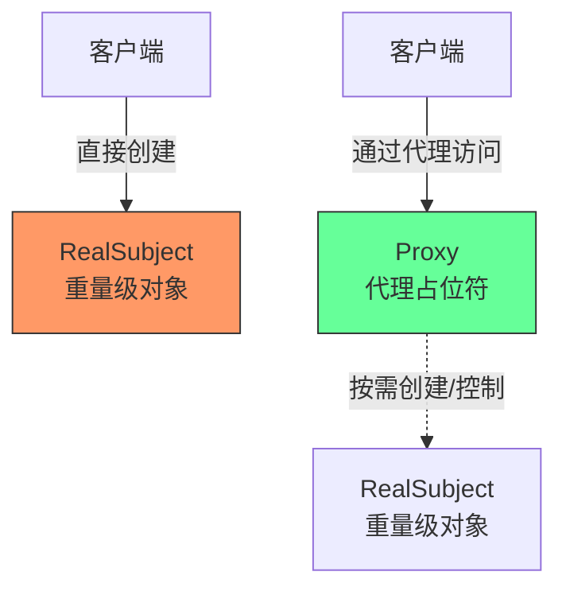
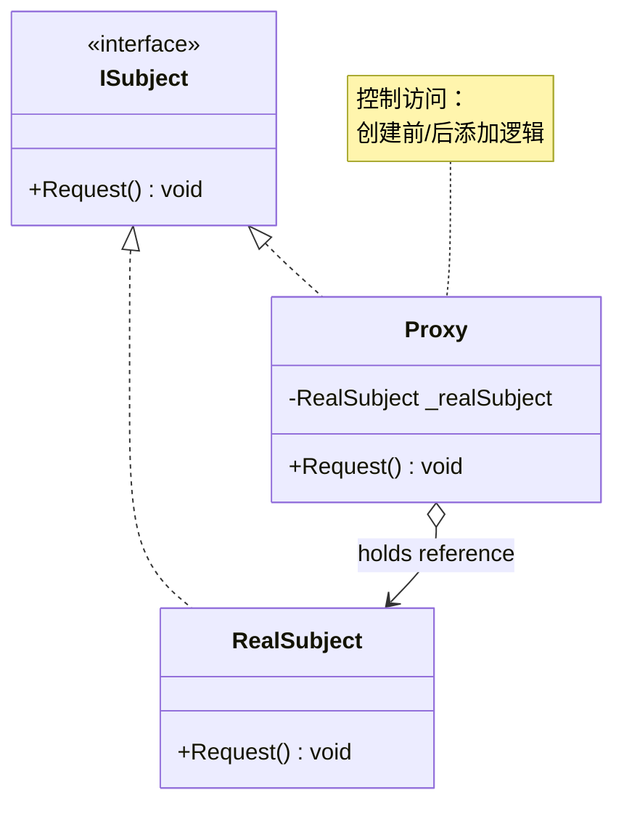
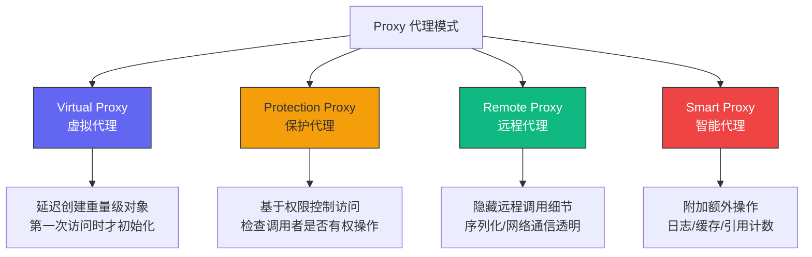
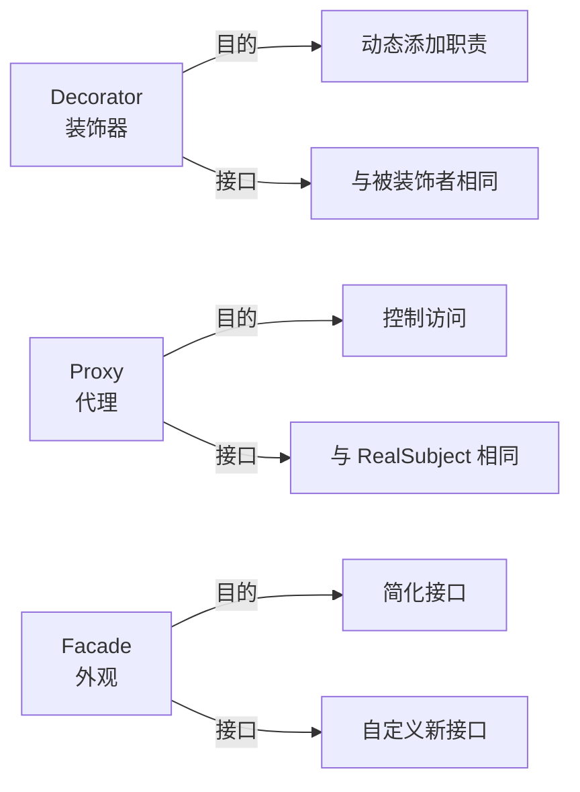
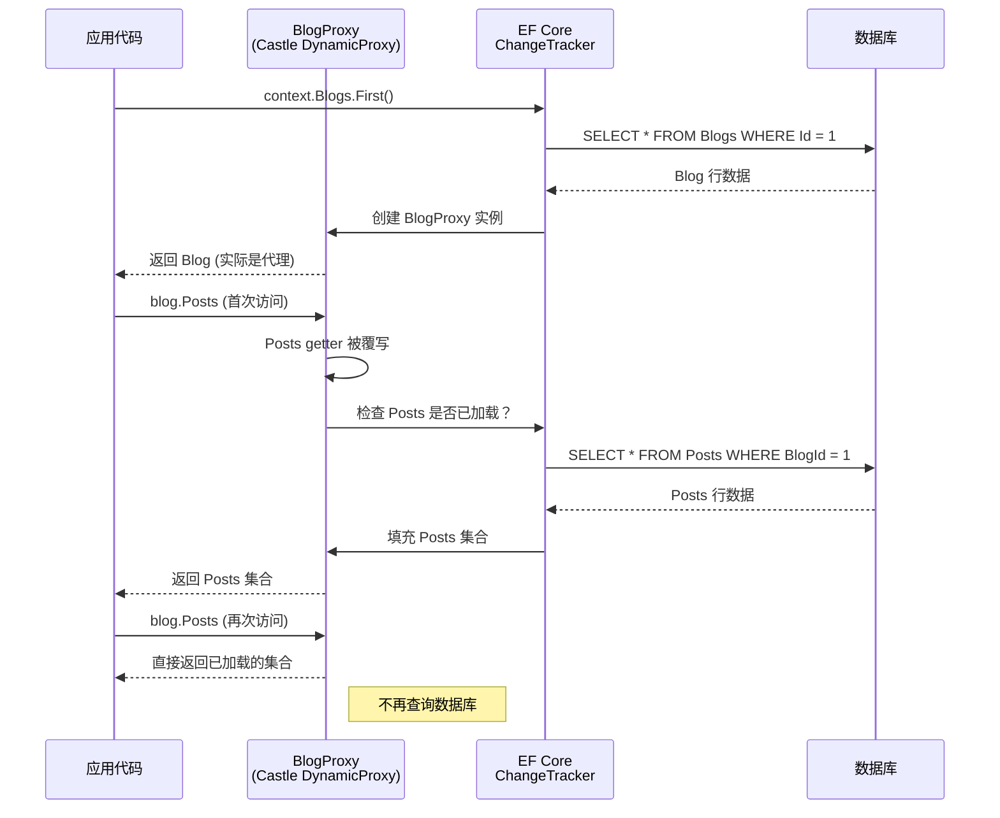

# 代理模式 (Proxy Pattern)

> 所属计划: [[design-patterns-csharp|设计模式 (C#)]]
> 预计耗时: 45 分钟
> 前置知识: [[08-structural-intro|结构型模式总览]]、C# 接口与继承、依赖注入基础

---

## 1. 概念讲解

### 代理模式解决什么问题？

假设你有一个重量级对象——比如要从磁盘加载的高分辨率图片、远程服务器上的服务、或需要权限控制的敏感文档。你希望：

- 推迟创建这个重量级对象（懒加载）
- 在访问前后添加额外逻辑（日志、缓存、权限检查）
- 让客户端无需感知"真正干活的"对象在哪里（远程透明）

但这些关注点不应该混入业务逻辑中——它们属于**横切关注点**。

**代理模式的核心思想**：提供一个代理（Proxy）作为其他对象的占位符，代理控制对真实对象的访问。



### 代理模式结构

代理和真实对象实现**相同的接口**——这是代理能够"冒充"真实对象、对客户端透明的前提。



**关键角色：**

| 角色 | 职责 |
|------|------|
| `ISubject` | 定义 RealSubject 和 Proxy 的共同接口 |
| `RealSubject` | 真正执行业务逻辑的对象 |
| `Proxy` | 持有 RealSubject 引用，控制对其的访问 |

### 代理模式的四种变体

不同场景下的"控制访问"有不同含义，由此衍生出四种典型变体：



| 变体 | 核心问题 | 代理做什么 | 典型场景 |
|------|---------|-----------|---------|
| **Virtual Proxy** | 对象创建成本高 | 推迟到首次使用 | 图片加载、大文件解析 |
| **Protection Proxy** | 访问需要权限 | 验证权限再放行 | 文档系统、API 网关 |
| **Remote Proxy** | 对象在另一台机器 | 封装网络通信 | gRPC stub、WCF client |
| **Smart Proxy** | 需要附加行为 | 添加日志/缓存/统计 | AOP 日志、ORM 懒加载 |

### 代理 vs 装饰器 vs 外观

这是一个常见的困惑点——三者都是"包一层"，但动机和用法不同：



> [!tip] 判断标准
> 问自己：**"这一层存在的首要目的是什么？"**
> - 如果是为了**控制**对某物的访问（延迟、权限、远程）→ 代理
> - 如果是为了**扩展**功能，且可以层层叠加 → [[12-decorator|装饰器]]
> - 如果是为了**简化**一组复杂接口为统一入口 → [[13-facade|外观]]

---

## 2. 代码示例

### 2.1 Virtual Proxy：图片延迟加载

**场景**：高分辨率图片从磁盘加载很耗时。用户打开相册时，缩略图应该立即显示，原图只在用户点击放大时才加载。

```csharp
// 共同接口
public interface IImage
{
    void Display();
    string GetMetadata();
}

// 真实对象 — 从磁盘加载完整图片
public class HighResolutionImage : IImage
{
    private readonly string _filePath;
    private byte[] _pixelData = Array.Empty<byte>();

    public HighResolutionImage(string filePath)
    {
        _filePath = filePath;
        LoadFromDisk(); // 构造时立即加载，成本高！
    }

    private void LoadFromDisk()
    {
        Console.WriteLine($"  [RealImage] 正在从磁盘加载 {_filePath}...");
        Thread.Sleep(1500); // 模拟 I/O 开销
        _pixelData = File.ReadAllBytes(_filePath);
        Console.WriteLine($"  [RealImage] 加载完成: {_pixelData.Length} 字节");
    }

    public void Display()
    {
        Console.WriteLine($"  [RealImage] 显示图片: {_filePath} ({_pixelData.Length} 字节)");
    }

    public string GetMetadata()
    {
        return $"文件: {_filePath}, 大小: {_pixelData.Length} 字节";
    }
}

// 虚拟代理 — 延迟创建真实对象
public class ImageProxy : IImage
{
    private readonly string _filePath;
    private HighResolutionImage? _realImage;
    private readonly Lazy<HighResolutionImage> _lazyImage;

    public ImageProxy(string filePath)
    {
        _filePath = filePath;
        // Lazy<T> 是 .NET 内置的线程安全懒加载原语
        _lazyImage = new Lazy<HighResolutionImage>(
            () => new HighResolutionImage(_filePath));
    }

    public void Display()
    {
        Console.WriteLine($">> [Proxy] Display() 被调用");
        // 代理决定何时创建真实对象 — 仅在首次访问时
        _lazyImage.Value.Display();
    }

    public string GetMetadata()
    {
        // 即使是获取元数据，也触发加载
        // 优化：可以只读取 EXIF 头而不加载完整像素数据
        Console.WriteLine($">> [Proxy] GetMetadata() 被调用");
        return _lazyImage.Value.GetMetadata();
    }
}

// ===== 运行演示 =====
Console.WriteLine("=== Virtual Proxy 演示 ===\n");

// 创建代理很快 — 不触发任何 I/O
Console.WriteLine("1. 创建 ImageProxy（此时不应加载图片）...");
IImage image = new ImageProxy("photo.jpg");
Console.WriteLine("   代理创建完成 ✓\n");

// 获取元数据 — 首次访问，触发真实加载
Console.WriteLine("2. 调用 GetMetadata()（首次访问，触发加载）...");
Console.WriteLine("   " + image.GetMetadata() + "\n");

// 再次访问 — 复用已加载的对象
Console.WriteLine("3. 再次调用 Display()（已加载，直接使用）...");
image.Display();

/* 输出:
=== Virtual Proxy 演示 ===

1. 创建 ImageProxy（此时不应加载图片）...
   代理创建完成 ✓

2. 调用 GetMetadata()（首次访问，触发加载）...
>> [Proxy] GetMetadata() 被调用
  [RealImage] 正在从磁盘加载 photo.jpg...
  [RealImage] 加载完成: 102400 字节
   文件: photo.jpg, 大小: 102400 字节

3. 再次调用 Display()（已加载，直接使用）...
>> [Proxy] Display() 被调用
  [RealImage] 显示图片: photo.jpg (102400 字节)
*/
```

> [!tip] `Lazy<T>` 是 Virtual Proxy 的捷径
> .NET 内置的 `Lazy<T>` 本质上就是一个通用的虚拟代理——它在第一次访问 `Value` 时才调用工厂委托，且线程安全。对于简单的懒加载场景，直接用 `Lazy<T>` 比自己写代理更简洁。

### 2.2 Protection Proxy：基于权限的文档访问

**场景**：文档管理系统中，不同用户有不同的读写权限。我们希望在对象层面控制访问，而非在每个方法里写 `if (user.HasPermission(...))`。

```csharp
// 权限模型
public enum Permission { Read, Write, Delete }

public record User(string Name, HashSet<Permission> Permissions);

// 共同接口
public interface IDocument
{
    string Title { get; }
    string ReadContent();
    void WriteContent(string content);
}

// 真实对象
public class RealDocument : IDocument
{
    public string Title { get; }
    private string _content;

    public RealDocument(string title, string initialContent = "")
    {
        Title = title;
        _content = initialContent;
    }

    public string ReadContent()
    {
        Console.WriteLine($"  [RealDoc] 读取文档内容...");
        return _content;
    }

    public void WriteContent(string content)
    {
        Console.WriteLine($"  [RealDoc] 写入文档内容...");
        _content = content;
    }
}

// 保护代理 — 在访问前检查权限
public class DocumentProxy : IDocument
{
    private readonly RealDocument _document;
    private readonly User _user;

    public DocumentProxy(RealDocument document, User user)
    {
        _document = document;
        _user = user;
    }

    public string Title => _document.Title;

    public string ReadContent()
    {
        EnsurePermission(Permission.Read);
        return _document.ReadContent();
    }

    public void WriteContent(string content)
    {
        EnsurePermission(Permission.Write);
        _document.WriteContent(content);
    }

    private void EnsurePermission(Permission required)
    {
        if (!_user.Permissions.Contains(required))
        {
            throw new UnauthorizedAccessException(
                $"用户 '{_user.Name}' 没有 {required} 权限");
        }
    }
}

// ===== 运行演示 =====
Console.WriteLine("=== Protection Proxy 演示 ===\n");

var doc = new RealDocument("年度财务报告", "保密数据...");

// 有读写权限的管理员
var admin = new User("管理员", new() { Permission.Read, Permission.Write });
var adminProxy = new DocumentProxy(doc, admin);

Console.WriteLine("1. 管理员读取文档:");
Console.WriteLine($"   内容: {adminProxy.ReadContent()}\n");

Console.WriteLine("2. 管理员修改文档:");
adminProxy.WriteContent("更新后的保密数据...");
Console.WriteLine($"   新内容: {adminProxy.ReadContent()}\n");

// 只有读权限的普通用户
var viewer = new User("访客", new() { Permission.Read });
var viewerProxy = new DocumentProxy(doc, viewer);

Console.WriteLine("3. 访客读取文档:");
Console.WriteLine($"   内容: {viewerProxy.ReadContent()}\n");

Console.WriteLine("4. 访客尝试修改文档:");
try
{
    viewerProxy.WriteContent("我想改数据...");
}
catch (UnauthorizedAccessException ex)
{
    Console.WriteLine($"   ❌ 被拦截: {ex.Message}");
}

/* 输出:
=== Protection Proxy 演示 ===

1. 管理员读取文档:
  [RealDoc] 读取文档内容...
   内容: 保密数据...

2. 管理员修改文档:
  [RealDoc] 写入文档内容...
  [RealDoc] 读取文档内容...
   新内容: 更新后的保密数据...

3. 访客读取文档:
  [RealDoc] 读取文档内容...
   内容: 更新后的保密数据...

4. 访客尝试修改文档:
   ❌ 被拦截: 用户 '访客' 没有 Write 权限
*/
```

### 2.3 C# 进阶：`DispatchProxy` 实现 AOP 日志代理

`DispatchProxy` 是 .NET 内置的轻量级动态代理机制（`System.Reflection.DispatchProxy`），可以拦截所有方法调用，非常适合实现 AOP 横切关注点——日志、性能监控、事务管理等。

```csharp
using System.Reflection;

// 目标接口
public interface IOrderService
{
    Order GetOrder(int id);
    void PlaceOrder(Order order);
    Task<Order> GetOrderAsync(int id);
}

public record Order(int Id, string Product, decimal Amount);

// 真实实现
public class OrderService : IOrderService
{
    private readonly Dictionary<int, Order> _orders = new()
    {
        [1] = new(1, "机械键盘", 599m),
        [2] = new(2, "4K 显示器", 3299m),
    };

    public Order GetOrder(int id)
    {
        return _orders.TryGetValue(id, out var order)
            ? order
            : throw new KeyNotFoundException($"订单 #{id} 不存在");
    }

    public void PlaceOrder(Order order)
    {
        Console.WriteLine($"  [Real] 下单成功: {order.Product} x {order.Amount:C}");
        _orders[order.Id] = order;
    }

    public async Task<Order> GetOrderAsync(int id)
    {
        await Task.Delay(100); // 模拟数据库查询
        return GetOrder(id);
    }
}

// DispatchProxy 日志代理
public class LoggingProxy<T> : DispatchProxy where T : class
{
    private T? _target;

    // 工厂方法 — 创建代理实例
    public static T Create(T target)
    {
        // DispatchProxy.Create 返回一个运行时生成的代理对象
        // 它和 T 实现相同接口，将调用转发给 Invoke
        object proxy = Create<T, LoggingProxy<T>>();
        var loggingProxy = (LoggingProxy<T>)proxy;
        loggingProxy._target = target;
        return (T)proxy;
    }

    protected override object? Invoke(MethodInfo? targetMethod, object?[]? args)
    {
        if (targetMethod == null)
            return null;

        var methodName = $"{typeof(T).Name}.{targetMethod.Name}";
        var timestamp = DateTime.Now;

        Console.WriteLine($"[LOG] {timestamp:HH:mm:ss.fff} → 调用 {methodName}");

        try
        {
            // 转发到真实对象
            object? result = targetMethod.Invoke(_target, args);

            // 处理异步方法
            if (result is Task task)
            {
                // 如果是 Task<T>，需要解包返回值
                if (targetMethod.ReturnType.IsGenericType)
                {
                    return InterceptAsync(task, methodName);
                }
                // 无返回值的 Task
                return InterceptVoidAsync(task, methodName);
            }

            Console.WriteLine($"[LOG] {timestamp:HH:mm:ss.fff} ← {methodName} 完成 → {result}");
            return result;
        }
        catch (TargetInvocationException ex) when (ex.InnerException != null)
        {
            Console.WriteLine($"[LOG] {timestamp:HH:mm:ss.fff} ← {methodName} 异常: {ex.InnerException.Message}");
            throw ex.InnerException; // 重新抛出原始异常
        }
    }

    private async Task<object?> InterceptAsync(Task task, string methodName)
    {
        await task;
        // 通过反射获取 Task<T>.Result
        var resultProperty = task.GetType().GetProperty("Result");
        var result = resultProperty?.GetValue(task);
        Console.WriteLine($"[LOG] ← {methodName} 异步完成 → {result}");
        return result;
    }

    private async Task InterceptVoidAsync(Task task, string methodName)
    {
        await task;
        Console.WriteLine($"[LOG] ← {methodName} 异步完成");
    }
}

// ===== 运行演示 =====
Console.WriteLine("=== DispatchProxy AOP 日志代理演示 ===\n");

// 创建真实服务
var realService = new OrderService();

// 用代理包装
IOrderService proxy = LoggingProxy<IOrderService>.Create(realService);

Console.WriteLine("1. 同步调用 GetOrder:");
var order = proxy.GetOrder(1);
Console.WriteLine($"   → 返回: {order}\n");

Console.WriteLine("2. 异步调用 GetOrderAsync:");
var asyncOrder = await proxy.GetOrderAsync(2);
Console.WriteLine($"   → 返回: {asyncOrder}\n");

Console.WriteLine("3. 调用不存在的方法（触发异常）:");
try { proxy.GetOrder(999); }
catch (Exception ex) { Console.WriteLine($"   → 捕获: {ex.Message}\n"); }

Console.WriteLine("4. PlaceOrder:");
proxy.PlaceOrder(new Order(3, "人体工学椅", 2499m));

/* 输出:
=== DispatchProxy AOP 日志代理演示 ===

1. 同步调用 GetOrder:
[LOG] 14:32:01.123 → 调用 IOrderService.GetOrder
[LOG] 14:32:01.123 ← IOrderService.GetOrder 完成 → Order { Id = 1, Product = 机械键盘, Amount = 599 }
   → 返回: Order { Id = 1, Product = 机械键盘, Amount = 599 }

2. 异步调用 GetOrderAsync:
[LOG] 14:32:01.234 → 调用 IOrderService.GetOrderAsync
[LOG] ← IOrderService.GetOrderAsync 异步完成 → Order { Id = 2, Product = 4K 显示器, Amount = 3299 }
   → 返回: Order { Id = 2, Product = 4K 显示器, Amount = 3299 }

3. 调用不存在的方法（触发异常）:
[LOG] 14:32:01.345 → 调用 IOrderService.GetOrder
[LOG] 14:32:01.345 ← IOrderService.GetOrder 异常: 订单 #999 不存在
   → 捕获: 订单 #999 不存在

4. PlaceOrder:
[LOG] 14:32:01.456 → 调用 IOrderService.PlaceOrder
  [Real] 下单成功: 人体工学椅 x ¥2,499.00
[LOG] 14:32:01.456 ← IOrderService.PlaceOrder 完成 →
*/
```

> [!tip] `DispatchProxy` 的限制
> 1. **必须基于接口** — `T` 必须是接口，不能代理具体类
> 2. **不能代理非虚方法** — 接口方法天然是虚的，所以没问题
> 3. **性能开销** — 每次调用都经过反射 (`MethodInfo.Invoke`)，比直接调用慢 10-50 倍。高频热路径上谨慎使用
> 4. **生命周期** — `DispatchProxy` 生成的代理对象会持有 `_target` 引用，要管理好生命周期避免内存泄漏

### 2.4 真实 .NET 案例：EF Core 懒加载代理

Entity Framework Core 支持通过**动态代理**实现导航属性的懒加载——这是 Virtual Proxy 在生产代码中的经典应用。

```csharp
// ===== 数据模型 =====
// 注意：导航属性必须标记为 virtual
public class Blog
{
    public int BlogId { get; set; }
    public string Name { get; set; } = "";

    // virtual 是关键 — EF Core 代理通过覆写此属性实现懒加载
    public virtual ICollection<Post> Posts { get; set; } = new List<Post>();
}

public class Post
{
    public int PostId { get; set; }
    public string Title { get; set; } = "";
    public string Content { get; set; } = "";

    public int BlogId { get; set; }

    // virtual — 允许代理覆写以延迟加载 Blog
    public virtual Blog Blog { get; set; } = null!;
}

// ===== DbContext 配置 =====
public class BlogContext : DbContext
{
    public DbSet<Blog> Blogs => Set<Blog>();
    public DbSet<Post> Posts => Set<Post>();

    protected override void OnConfiguring(DbContextOptionsBuilder options)
    {
        options
            .UseSqlServer("your-connection-string")
            // 启用懒加载代理 — 核心配置
            .UseLazyLoadingProxies();
        // 可选：发生懒加载时抛出异常（用于调试）
        // .UseLazyLoadingProxies(b => b.IgnoreNonVirtualNavigations());
    }
}

// ===== 使用示例 =====
using var context = new BlogContext();

// 只查询 Blog，不查询 Posts
var blog = context.Blogs.First(b => b.BlogId == 1);
Console.WriteLine($"博客: {blog.Name}");
// SQL: SELECT TOP 1 * FROM Blogs WHERE BlogId = 1

// 首次访问 Posts → 代理触发第二次数据库查询！
var postCount = blog.Posts.Count;
Console.WriteLine($"文章数: {postCount}");
// SQL: SELECT * FROM Posts WHERE BlogId = 1  ← 此时才执行

// 再次访问 → 已加载，不再查询
foreach (var post in blog.Posts)
{
    Console.WriteLine($"  - {post.Title}");
}
// 不产生 SQL

// 反向导航也同理 — 代理模式
var firstPost = blog.Posts.First();
var author = firstPost.Blog; // ← 触发的不是数据库查询，而是已跟踪的同一 Blog 实例
```

**EF Core 代理的工作原理：**



---


---

## C++ 实现

C++ 代理模式通过共享接口 + 组合实现。以下展示 Virtual Proxy（延迟加载图片），并附带一个简单的智能引用计数代理。

```cpp
#include <iostream>
#include <memory>
#include <string>
#include <thread>
#include <chrono>
using namespace std;

// ============================================
// Subject — 共同接口
// ============================================
class Image {
public:
    virtual ~Image() = default;
    virtual void display() const = 0;
};

// ============================================
// RealSubject — 重量级对象：从磁盘加载图片
// ============================================
class RealImage : public Image {
    string filename;
public:
    explicit RealImage(string file) : filename(move(file)) {
        loadFromDisk();
    }

    void display() const override {
        cout << "  [RealImage] 显示: " << filename << endl;
    }

private:
    void loadFromDisk() {
        cout << "  [RealImage] 从磁盘加载 " << filename << "..." << endl;
        this_thread::sleep_for(chrono::milliseconds(500)); // 模拟 I/O
        cout << "  [RealImage] 加载完成" << endl;
    }
};

// ============================================
// Virtual Proxy — 延迟创建 RealImage
// ============================================
class ProxyImage : public Image {
    string filename;
    mutable shared_ptr<RealImage> realImage;  // mutable: 延迟初始化
public:
    explicit ProxyImage(string file) : filename(move(file)) {}

    void display() const override {
        if (!realImage) {
            cout << "  [Proxy] 首次访问，触发加载..." << endl;
            realImage = make_shared<RealImage>(filename);
        } else {
            cout << "  [Proxy] 复用已加载的图片" << endl;
        }
        realImage->display();
    }
};

// ============================================
// [可选] 引用计数代理 — 统计访问次数
// ============================================
class RefCountProxy : public Image {
    shared_ptr<Image> inner;
    mutable int accessCount = 0;
public:
    explicit RefCountProxy(shared_ptr<Image> img) : inner(move(img)) {}

    void display() const override {
        ++accessCount;
        cout << "  [RefCountProxy] 第 " << accessCount << " 次访问" << endl;
        inner->display();
    }

    int count() const { return accessCount; }
};

// === main / usage ===
int main() {
    cout << "=== Virtual Proxy ===" << endl;
    cout << "1. 创建代理（不应加载图片）..." << endl;
    ProxyImage proxy("photo.jpg");
    cout << "   代理创建完成 ✓\n" << endl;

    cout << "2. 首次 display() — 触发加载..." << endl;
    proxy.display();

    cout << "\n3. 再次 display() — 不复加载..." << endl;
    proxy.display();

    // --- 引用计数代理 ---
    cout << "\n=== 引用计数代理 ===" << endl;
    auto real = make_shared<RealImage>("doc.png");
    RefCountProxy refProxy(real);
    refProxy.display();
    refProxy.display();
    refProxy.display();
    cout << "总访问次数: " << refProxy.count() << endl;
}
```

**编译与运行：**
```bash
g++ -std=c++17 -o prog main.cpp && ./prog
```

**预期输出：**
```text
=== Virtual Proxy ===
1. 创建代理（不应加载图片）...
   代理创建完成 ✓

2. 首次 display() — 触发加载...
  [Proxy] 首次访问，触发加载...
  [RealImage] 从磁盘加载 photo.jpg...
  [RealImage] 加载完成
  [RealImage] 显示: photo.jpg

3. 再次 display() — 不复加载...
  [Proxy] 复用已加载的图片
  [RealImage] 显示: photo.jpg

=== 引用计数代理 ===
  [RealImage] 从磁盘加载 doc.png...
  [RealImage] 加载完成
  [RefCountProxy] 第 1 次访问
  [RealImage] 显示: doc.png
  [RefCountProxy] 第 2 次访问
  [RealImage] 显示: doc.png
  [RefCountProxy] 第 3 次访问
  [RealImage] 显示: doc.png
总访问次数: 3
```

> [!tip] C++ Proxy 要点
> `mutable` 关键字允许在 `const` 方法中修改 `realImage`——这是延迟初始化的标准惯用法。引用计数代理展示了 C++ 中如何在不侵入原类的情况下附加横切关注点。

---
## 3. 练习

### 练习 1：实现缓存代理

为以下 `IRepository<T>` 接口实现一个 **CachingProxy**（智能代理的一种）：

```csharp
public interface IRepository<T> where T : class
{
    T? GetById(int id);
    IEnumerable<T> GetAll();
    void Add(T entity);
    void Update(T entity);
    void Delete(int id);
}

// 真实仓库（模拟数据库）
public class InMemoryRepository<T> : IRepository<T> where T : class
{
    private readonly Dictionary<int, T> _storage = new();
    private readonly Func<T, int> _idSelector;

    public InMemoryRepository(Func<T, int> idSelector)
    {
        _idSelector = idSelector;
    }

    public T? GetById(int id) { /* ... */ }
    public IEnumerable<T> GetAll() { /* ... */ }
    public void Add(T entity) { /* ... */ }
    public void Update(T entity) { /* ... */ }
    public void Delete(int id) { /* ... */ }
}
```

**要求：**
- `GetById` 和 `GetAll` 使用缓存（返回缓存副本，避免外部修改）
- `Add` / `Update` / `Delete` 使缓存失效（写穿透策略）
- 使用 `ConcurrentDictionary` 保证线程安全

> [!tip] 提示
> 缓存的 key 可以是一个 `string`：对 `GetById` 使用 `$"byId_{id}"`，对 `GetAll` 使用 `"all"`。`Add`/`Update`/`Delete` 时清空所有缓存是最简单的策略。

### 练习 2：角色权限保护代理

基于 2.2 节的 `DocumentProxy`，扩展为支持**多角色权限系统**：

```csharp
// 角色定义
public enum Role { Viewer, Editor, Owner, Admin }

// 每个操作需要的最低角色
// Viewer:  只能 Read
// Editor:  可以 Read + Write
// Owner:   可以 Read + Write + GrantAccess
// Admin:   全部操作
```

**要求：**
- 实现 `RoleBasedDocumentProxy`，在构造时传入用户角色
- 定义一个 `Permissions` 策略表（`Dictionary<string, Role>` 映射操作→所需角色），代理从策略表读取，而非硬编码
- 非法操作抛出自定义 `DocumentAccessException`，包含操作名和用户角色信息

### 练习 3：`DispatchProxy` 性能监控代理（可选）

使用 `DispatchProxy` 实现一个 `MetricsProxy<T>`，记录每个方法的**调用次数**和**总耗时**。

```csharp
// 期望用法
var service = MetricsProxy<IOrderService>.Create(new OrderService());
service.GetOrder(1);
service.PlaceOrder(new Order(4, "鼠标", 299m));

// 打印统计
MetricsProxy<IOrderService>.PrintStats();
// IOrderService.GetOrder: 调用 1 次, 总耗时 0.5ms
// IOrderService.PlaceOrder: 调用 1 次, 总耗时 1.2ms
```

**挑战点：**
- 正确处理 `async` 方法的耗时统计（使用 `Stopwatch`，异步方法等 `Task` 完成后才记录）
- 线程安全的统计收集（`ConcurrentDictionary<string, (long Count, long TotalMs)>`）

---

## 4. 扩展阅读

- [[12-decorator|装饰器模式]] — 代理和装饰器结构相似但意图不同。装饰器**扩展功能**（可层层叠加），代理**控制访问**（通常一层）。实践中两者的边界有时模糊
- [[13-facade|外观模式]] — 外观模式简化复杂子系统的接口，而代理保持相同接口。外观可以包含多个子系统；代理通常只对应一个 RealSubject
- [Refactoring.Guru — Proxy](https://refactoring.guru/design-patterns/proxy) — 四种代理变体的图文详解
- [Microsoft Docs — DispatchProxy](https://learn.microsoft.com/en-us/dotnet/api/system.reflection.dispatchproxy) — `DispatchProxy` 官方文档和源码
- [EF Core Lazy Loading](https://learn.microsoft.com/en-us/ef/core/querying/related-data/lazy) — EF Core 懒加载的三种方式（代理 / `ILazyLoader` / 委托）
- [Castle DynamicProxy](https://github.com/castle-project/Core) — .NET 生态最成熟的动态代理库，EF Core 内部也使用了它；比 `DispatchProxy` 更强大（支持类代理、拦截器链、混合 mixin）

---

## 常见陷阱

### 1. 代理增加过多延迟

代理本身引入了一层间接调用。如果代理每次都做大量额外工作（日志序列化、网络检查），对高频调用可能是灾难。

**正确做法：** 
- 对热路径，考虑在代理内部使用批量操作或异步日志
- Virtual Proxy 的懒加载只应在创建成本明显高于代理开销时才使用
- 使用 `Stopwatch` 测量代理引入的实际开销，而非凭感觉判断

### 2. 代理和真实对象的接口不一致

当 `ISubject` 发生变化时，必须同步修改 `RealSubject` 和所有 `Proxy` 实现。如果某处漏掉了，编译器可能不会报错——因为代理可能直接调用 `RealSubject` 的方法，而非通过接口。

**正确做法：**
```csharp
// ❌ 危险：Proxy 直接持有 RealSubject 类型，绕过接口
public class BadProxy
{
    private RealSubject _real;  // 具体类型！
    public void Request() => _real.Request();
    // 如果 RealSubject 添加了 NewMethod()，
    // Proxy 不会被迫更新 — 但它可能也需要代理那个方法
}

// ✅ 安全：通过接口持有
public interface ISubject { void Request(); void NewMethod(); }
public class GoodProxy : ISubject
{
    private readonly ISubject _real;  // 接口类型！
    // 接口加了 NewMethod() → 编译直接报错 → 强制你处理
}
```

### 3. `DispatchProxy` 的性能开销

`DispatchProxy.Invoke` 每次调用都经过反射 (`MethodInfo.Invoke`)，比直接方法调用慢 10-50 倍。在一秒钟调用几万次的热路径上，这个开销会让系统不可用。

**缓解方案：**
- 对于高频路径，缓存 `MethodInfo` 并编译为委托：使用 `Expression<Func<...>>` 或 `Reflection.Emit` 将反射调用转换为直接调用
- 考虑使用 **Source Generator** 在编译期生成代理代码——零运行时反射开销
- 或者使用 Castle DynamicProxy，它在这方面做了更多优化

### 4. 懒加载代理的 N+1 问题

EF Core 懒加载代理是 Virtual Proxy 的经典应用，但它也是 N+1 查询问题的常见来源：

```csharp
// ❌ N+1 问题：
var blogs = context.Blogs.ToList();           // 1 次查询
foreach (var blog in blogs)
{
    Console.WriteLine($"{blog.Name}: {blog.Posts.Count} 篇文章");
    // 每次访问 Posts → 触发 1 次新查询
    // 100 个 Blog = 101 次查询！
}

// ✅ 解决：提前加载
var blogs = context.Blogs
    .Include(b => b.Posts)  // JOIN 一次查出所有
    .ToList();              // 总共 1 次查询
```

> [!warning] 识别 N+1
> 大部分 ORM 都提供查询日志功能。开启 EF Core 的 `LogTo(Console.WriteLine)`，如果你在日志中看到大量相似的 SQL 语句在一个循环中被重复执行——这就是 N+1。
