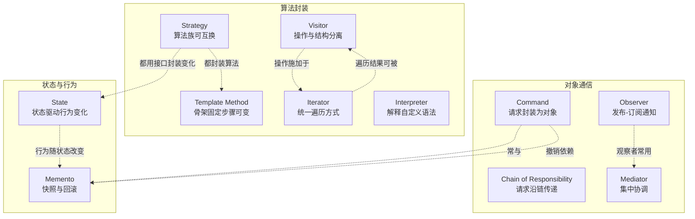
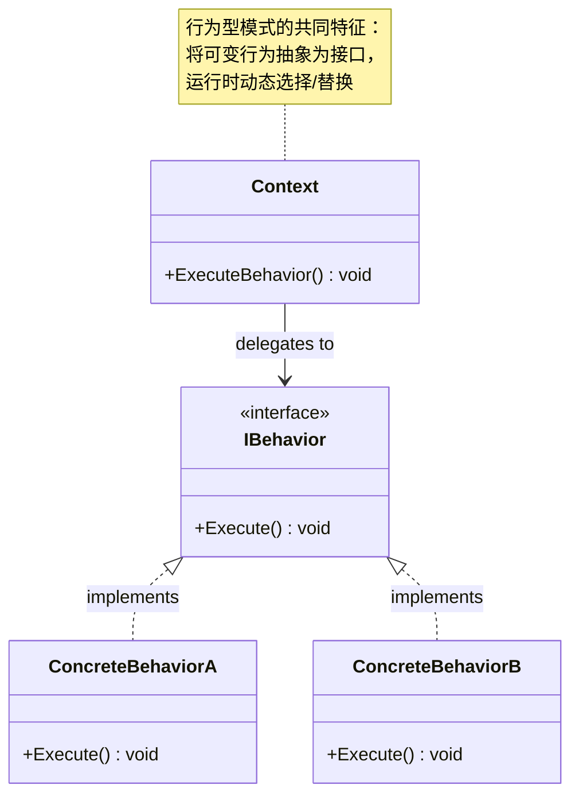
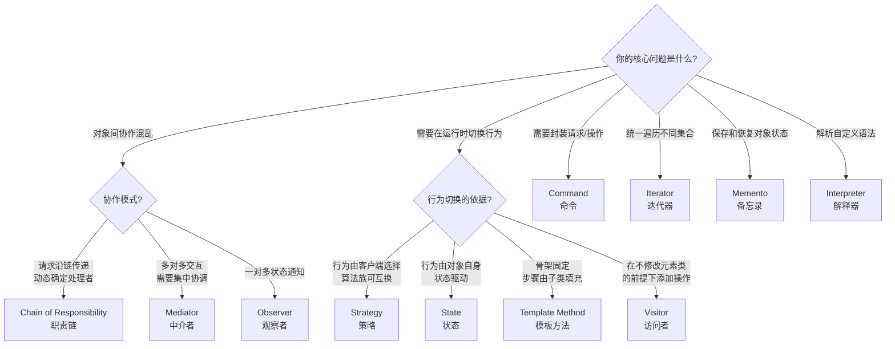

# 行为型模式总览

> 所属计划: [[design-patterns-csharp|设计模式 (C#)]]
> 预计耗时: 60 分钟
> 前置知识: [[01-design-patterns-overview|设计模式概述 + SOLID 原则]]

---

## 1. 概念讲解

### 行为型模式解决什么问题？

创建型模式解决"怎么创建对象"，结构型模式解决"怎么拼装对象"——
**行为型模式解决"对象之间怎么协作、怎么分配职责"**。

真实项目中的典型问题：
- 一个请求需要经过多个处理者，但发送者不应知道最终由谁处理 → [[17-chain-of-responsibility|Chain of Responsibility]]
- 需要把请求封装为对象，支持撤销、队列、日志 → [[18-command|Command]]
- 需要提供统一的方式遍历不同类型的集合 → [[19-iterator|Iterator]]
- 多个对象之间交互错综复杂，需要集中协调 → [[20-mediator|Mediator]]
- 需要保存并恢复对象的历史状态，支持撤销 → [[21-memento|Memento]]
- 一个对象的状态变化需要自动通知所有依赖者 → [[22-observer|Observer]]
- 对象的行为随内部状态改变而改变 → [[23-state|State]]
- 需要在运行时切换算法族 → [[24-strategy|Strategy]]
- 算法的骨架固定，但某些步骤留给子类实现 → [[25-template-method|Template Method]]
- 需要在不修改元素类的前提下定义新的操作 → [[26-visitor|Visitor]]
- 需要定义一种小语言的语法并解释执行 → **Interpreter**（解释器）

**行为型模式的核心思想**：将**行为**从**持有行为的对象**中分离出来，让算法、通信、职责分配各自独立变化。





> [!tip] 行为型模式的记忆口诀
> **"责命解观状策模访迭备"** — 职责链(Chain of Responsibility)、命令(Command)、解释器(Interpreter)、中介者(Mediator)、备忘录(Memento)、观察者(Observer)、状态(State)、策略(Strategy)、模板方法(Template Method)、访问者(Visitor)、迭代器(Iterator)。十一种模式的核心都是"行为的分派与封装"。

### 十一种行为型模式速查

| 模式 | 核心意图 | 关键 C# 特性 |
|------|---------|-------------|
| [[17-chain-of-responsibility\|Chain of Responsibility]] | 多个对象依次处理请求，发送者无需知道最终处理者 | 链表 + `?.` 短路 |
| [[18-command\|Command]] | 将请求封装为对象，支持参数化、排队、撤销 | `Action<T>` / `Func<T>` 委托 |
| **Interpreter** | 定义语言的文法规则并解释执行 | `Expression<T>` / `Func<T, R>` |
| [[19-iterator\|Iterator]] | 提供统一方式遍历集合，不暴露内部结构 | `IEnumerable<T>` + `yield return` |
| [[20-mediator\|Mediator]] | 用一个中介对象封装一组对象的交互方式 | 事件聚合器 + DI 注入 |
| [[21-memento\|Memento]] | 捕获对象内部状态，以便后续恢复 | `record` / `readonly struct` |
| [[22-observer\|Observer]] | 定义一对多依赖，状态变化自动通知依赖者 | `event` / `IObservable<T>` |
| [[23-state\|State]] | 对象行为随内部状态改变，看起来像换了类 | 状态接口 + 上下文切换 |
| [[24-strategy\|Strategy]] | 定义算法族，使其可以互相替换 | 接口注入 + DI 切换 |
| [[25-template-method\|Template Method]] | 定义算法骨架，某些步骤推迟到子类 | `abstract` / `virtual` 方法 |
| [[26-visitor\|Visitor]] | 在不修改元素类的前提下定义新的操作 | `dynamic` / 双分派 |

### 各模式概要

**[[17-chain-of-responsibility\|Chain of Responsibility 职责链]]**：请求沿着处理者链传递，每个处理者决定是自己处理还是传给下一个。就像客服工单升级——前端客服无法解决时转给技术专家，再转给经理。C# 中 ASP.NET Core 的 Middleware 管道就是职责链的典型实现。

**[[18-command\|Command 命令]]**：将"执行一个动作"封装为独立对象，实现请求的排队、日志、撤销。就像餐厅点菜——服务员把点菜单（Command）交给厨房，厨房不必知道是谁下的单。C# 的 `Action`/`Func` 委托是轻量级 Command。

**Interpreter 解释器**：为某种小语言定义文法，并提供一个解释器来解析和执行语句。正则表达式引擎、SQL 解析器、计算器都是 Interpreter 的例子。C# 的 `Expression<T>` 树是 Interpreter 思想在语言层的体现。它在 GoF 23 中用法最少，现代 C# 中常被 Strategy 或 Visitor 替代。

**[[19-iterator\|Iterator 迭代器]]**：提供一种方法，顺序访问聚合对象的每个元素，而不暴露其底层表示。就像遥控器的"下一个频道"按键——你不需要知道频道表是怎么存的。C# 的 `foreach`/`IEnumerable<T>`/`yield return` 已经把 Iterator 内建为语言特性。

**[[20-mediator\|Mediator 中介者]]**：用一个中介对象来封装一组对象的交互方式，避免对象之间显式的互相引用。就像航空管制塔——飞机之间不直接通信，都跟塔台联系。C# 中 MediatR 库是实践 Mediator 的典型。

**[[21-memento\|Memento 备忘录]]**：在不破坏封装的前提下，捕获一个对象的内部状态，以便将来恢复到该状态。就像游戏中的存档——你可以随时回到存档点。C# 9+ 的 `record` 类型天然适合做不可变快照。

**[[22-observer\|Observer 观察者]]**：定义对象间的一对多依赖，当一个对象改变状态时，所有依赖它的对象都会被自动通知。就像公众号订阅——你关注后，新文章自动推送。C# 的 `event` 关键字让 Observer 成为原生支持的特性。

**[[23-state\|State 状态]]**：当一个对象的内部状态改变时，允许它改变其行为，看起来好像修改了它的类。就像自动售货机的行为取决于当前状态——有钱/无钱、有货/无货时，按下按钮的结果完全不同。C# 中每个状态实现同一接口，上下文持有当前状态引用。

**[[24-strategy\|Strategy 策略]]**：定义一组算法，将每个算法封装起来，并使它们可以互换。就像导航 App——同样的起点终点，可以选择"最快"、"最短"、"躲避拥堵"三种策略。C# 中通过接口注入实现，DI 容器一键切换。

**[[25-template-method\|Template Method 模板方法]]**：在一个方法中定义算法的骨架，将某些步骤推迟到子类实现。就像做菜的菜谱——步骤（备菜→炒→装盘）是固定的，但"放什么食材"（步骤 2）由子类决定。C# 的 `virtual`/`abstract` 方法天然支持 Template Method。

**[[26-visitor\|Visitor 访问者]]**：表示一个作用于某对象结构中各元素的操作，使你可以在不改变各元素的类的前提下定义新的操作。就像税务局派人（Visitor）到不同企业（Element）查账——企业类不改，但查账逻辑可以变。C# 的 `dynamic` 关键字可以简化 Visitor 的双分派实现。

---

## 2. 决策流程

面对一个行为型设计问题，按以下流程选择模式：



---

## 3. 代码示例：Strategy vs State vs Template Method——都改行为，改法不同

这三种模式都可以让同一个方法调用产生不同行为，但**切换的时机和负责人**完全不同。

```csharp
// ============================================================
// 场景：一个订单处理系统，不同场景下 CalculateTotal 的行为不同
// ============================================================

// --- 共享接口/基类 ---
public class Order
{
    public decimal SubTotal { get; set; }
    public string CustomerType { get; set; } = "Normal";
}

// ============================================================
// ① Strategy：算法族可互换 —— 由客户端在运行时选择策略
// ============================================================
public interface IDiscountStrategy
{
    decimal Calculate(Order order);
}

public class NoDiscount : IDiscountStrategy
{
    public decimal Calculate(Order order) => order.SubTotal;
}

public class VipDiscount : IDiscountStrategy
{
    public decimal Calculate(Order order) => order.SubTotal * 0.8m;
}

public class SeasonalDiscount : IDiscountStrategy
{
    public decimal Calculate(Order order) => order.SubTotal * 0.7m;
}

public class OrderCalculator
{
    private readonly IDiscountStrategy _strategy;

    public OrderCalculator(IDiscountStrategy strategy) => _strategy = strategy;

    public decimal CalculateTotal(Order order) => _strategy.Calculate(order);
}

// --- Strategy 使用：客户端显式选择算法 ---
var order = new Order { SubTotal = 100 };
var calc = new OrderCalculator(new VipDiscount());
Console.WriteLine(calc.CalculateTotal(order)); // 80
// 换成新策略只需 new OrderCalculator(new SeasonalDiscount())

// ============================================================
// ② State：行为随内部状态变化 —— 对象自己根据状态改行为
// ============================================================
public interface IOrderState
{
    IOrderState Next(OrderStateContext ctx);
    string GetStatus();
}

public class PendingState : IOrderState
{
    public IOrderState Next(OrderStateContext ctx)
    {
        Console.WriteLine("支付完成 → 转为 Shipped");
        return new ShippedState();
    }
    public string GetStatus() => "待支付";
}

public class ShippedState : IOrderState
{
    public IOrderState Next(OrderStateContext ctx)
    {
        Console.WriteLine("签收确认 → 转为 Completed");
        return new CompletedState();
    }
    public string GetStatus() => "已发货";
}

public class CompletedState : IOrderState
{
    public IOrderState Next(OrderStateContext ctx)
    {
        Console.WriteLine("已是终态");
        return this;
    }
    public string GetStatus() => "已完成";
}

public class OrderStateContext
{
    private IOrderState _state = new PendingState();

    public string Status => _state.GetStatus();

    public void Advance()
    {
        _state = _state.Next(this);  // State 自己决定下一个状态是什么
    }
}

// --- State 使用：状态机自己流转，客户端只触发事件 ---
var ctx = new OrderStateContext();
Console.WriteLine(ctx.Status); // 待支付
ctx.Advance();                  // 支付完成 → 转为 Shipped
Console.WriteLine(ctx.Status); // 已发货

// ============================================================
// ③ Template Method：骨架固定 —— 基类定流程，子类填细节
// ============================================================
public abstract class OrderProcessor
{
    // Template Method — 步骤顺序不可变
    public void Process(Order order)
    {
        Validate(order);       // 步骤 1
        var total = Calculate(order);  // 步骤 2 — 子类决定
        Save(order, total);    // 步骤 3
        Notify(order);         // 步骤 4
    }

    protected virtual void Validate(Order order)
    {
        if (order.SubTotal <= 0)
            throw new ArgumentException("Invalid amount");
    }

    protected abstract decimal Calculate(Order order);  // 子类必须实现

    protected virtual void Save(Order order, decimal total)
        => Console.WriteLine($"订单 {order.SubTotal} 总计 {total} 已保存");

    protected virtual void Notify(Order order)
        => Console.WriteLine("订单处理完成通知");
}

public class NormalOrderProcessor : OrderProcessor
{
    protected override decimal Calculate(Order order)
        => order.SubTotal;  // 无折扣
}

public class VipOrderProcessor : OrderProcessor
{
    protected override decimal Calculate(Order order)
        => order.SubTotal * 0.8m;  // VIP 8 折
}

// --- Template Method 使用：子类型决定行为 ---
var normalProcessor = new NormalOrderProcessor();
normalProcessor.Process(order);  // 骨架流程固定，计算由子类实现
```

**预期输出：**
```text
80
待支付
支付完成 → 转为 Shipped
已发货
订单 100 总计 80 已保存
订单处理完成通知
```

**运行方式：**
```bash
dotnet new console -n BehavioralDemo
# 将上述代码放入 Program.cs，用 Console.WriteLine 输出
dotnet run --project BehavioralDemo
```

> [!tip] Strategy vs State vs Template Method 一眼识别
> | 维度 | Strategy | State | Template Method |
> |------|----------|-------|-----------------|
> | **谁决定行为** | 客户端注入策略 | 对象自身内部状态 | 子类型（编译期决定） |
> | **行为切换时机** | 运行时，显式替换 | 运行时，状态机流转 | 编译期，不同子类 |
> | **关键机制** | 接口 + 组合 | 接口 + 上下文持有状态引用 | 继承 + `virtual`/`abstract` |
> | **策略/状态是否感知彼此** | 互不感知 | 感知下一个状态 | 子类不需要感知兄弟类 |
> | **典型场景** | 支付方式、排序算法 | 订单生命周期、TCP 连接 | 数据导入框架、测试基类 |

---

## 4. 练习

### 练习 1：场景匹配

将以下场景与最合适的行为型模式配对：

| 场景 | 应选模式 |
|------|---------|
| (a) UI 框架中，按钮点击事件需要通知多个监听者（日志、埋点、业务逻辑） | |
| (b) 一个审批流程：员工→经理→总监→CEO，报销金额越大需要审批的级别越高 | |
| (c) 一个文本编辑器，支持 Ctrl+Z 撤销和 Ctrl+Y 重做 | |
| (d) 同一个数据报表，用户可以选择导出为 PDF / Excel / CSV 三种格式 | |
| (e) 一个连接池，连接处于 Idle / Active / Broken 三种状态，不同状态下 Close() 的行为不同 | |
| (f) 文件系统扫描器需要一个通用的遍历方式，不区分目录和文件的内部结构 | |
| (g) 一个智能家居系统，灯、空调、窗帘之间互相联动，当温度升高时关窗帘并开空调 | |
| (h) 需要对一组 Shape（Circle, Rectangle, Triangle）元素添加 `GetArea()`、`ExportSvg()` 操作，但不修改 Shape 类 | |

可选模式：Chain of Responsibility, Command, Interpreter, Iterator, Mediator, Memento, Observer, State, Strategy, Template Method, Visitor

### 练习 2：解释 Strategy 与 State 的核心区别

阅读以下代码：

```csharp
// 场景 A
public class PaymentService
{
    private readonly IPaymentMethod _method;
    public PaymentService(IPaymentMethod method) => _method = method;
    public void Pay(decimal amount) => _method.Pay(amount);
}
// 运行时选择: new PaymentService(new CreditCard())

// 场景 B
public class Connection
{
    private IConnectionState _state;
    public void Send(byte[] data)
    {
        _state.Send(this, data);  // _state 可能是 Open/Closed/HalfOpen
    }
    internal void ChangeState(IConnectionState newState) => _state = newState;
}
```

请回答：
1. 场景 A 和场景 B 分别使用了什么模式？
2. 在场景 A 中，谁决定使用哪个 `IPaymentMethod`？
3. 在场景 B 中，谁决定 `_state` 何时变化？
4. 如果错误地把场景 B 实现为 Strategy（由客户端直接 `conn.SetState(new OpenState())` ），会出现什么问题？

### 练习 3：解释 Command 与 Strategy 的区别（可选挑战）

两者都通过接口封装行为，但意图完全不同。

```csharp
// 片段 A
public interface ITaxStrategy { decimal Calculate(decimal income); }
public class ChinaTax : ITaxStrategy { /* ... */ }
public class UsaTax : ITaxStrategy { /* ... */ }

// 片段 B
public interface ICommand { void Execute(); }
public class CopyCommand : ICommand { /* ... */ }
public class PasteCommand : ICommand { /* ... */ }
```

请回答：
1. 片段 A 和片段 B 各是什么模式？
2. `ITaxStrategy` 的接口方法返回值是什么？`ICommand` 的接口方法返回值是什么？这暗示了什么本质区别？
3. Strategy 关注"做同一件事的不同方法"，Command 关注"把一个动作变成可操纵的对象"——请用一个具体场景说明这个区别。
4. 什么情况下一个类既像 Strategy 又像 Command？这种情况应该优先按哪个模式命名和理解？

---

## 5. 扩展阅读

- 十一篇模式详解: [[17-chain-of-responsibility]], [[18-command]], [[19-iterator]], [[20-mediator]], [[21-memento]], [[22-observer]], [[23-state]], [[24-strategy]], [[25-template-method]], [[26-visitor]]
- [[02-creational-intro|创建型模式总览]] — Command 常与 Factory 配合创建请求对象
- [[08-structural-intro|结构型模式总览]] — Decorator 和 Strategy 都是"改变行为"的模式，但出发点不同
- [Refactoring.Guru — Behavioral Patterns](https://refactoring.guru/design-patterns/behavioral-patterns)
- [.NET 中的 MediatR 库](https://github.com/jbogard/MediatR) — Mediator 模式在 C# 中的工业级实践
- [.NET 中的 IObservable\<T\> / Reactive Extensions](https://learn.microsoft.com/en-us/dotnet/api/system.iobservable-1) — Observer 模式的现代演进
- [DoFactory — Behavioral Design Patterns](https://www.dofactory.com/net/design-patterns) — C# 优化写法参考

---

## 常见陷阱

### 陷阱 1：把 Strategy 用成了 State

```csharp
// ❌ 错误：客户端手动切换状态，破坏了 State 的封装
public class VendingMachine
{
    public IVendingState State { get; set; }  // 暴露 setter 给客户端

    public void InsertCoin()
    {
        State.InsertCoin(this);  // State 自己管理转换，但客户端也能乱改
    }
}
// 外部代码：machine.State = new SoldOutState();  // 越权修改！

// ✅ 正确：状态的转换完全由 State 子类控制
public class VendingMachine
{
    private IVendingState _state = new NoCoinState();

    internal void SetState(IVendingState newState) => _state = newState;  // internal

    public void InsertCoin() => _state.InsertCoin(this);
}
```

> **判断方法**：如果"谁在切换行为"这个问题的答案是"客户端"，那就是 Strategy；如果答案是"对象自身"，那就是 State。

### 陷阱 2：该用 Strategy 却用了 Template Method

```csharp
// ❌ 每个支付方式都需创建一个子类，子类的唯一区别是 Calculate 方法
public abstract class OrderProcessor
{
    public void Process(Order order)
    {
        Validate(order);
        var total = Calculate(order);  // 唯一变化点
        Save(order, total);
    }
    protected abstract decimal Calculate(Order order);
}
// 导致: NormalOrderProcessor, VipOrderProcessor, SeasonalOrderProcessor...
// 每加一种折扣方式就要新建一个子类

// ✅ 正确：行为变化点独立为一个 Strategy 接口
public interface IDiscountStrategy { decimal Calculate(Order order); }

public class OrderProcessor  // 不再需要 abstract
{
    private readonly IDiscountStrategy _discount;

    public OrderProcessor(IDiscountStrategy discount) => _discount = discount;

    public void Process(Order order)
    {
        Validate(order);
        var total = _discount.Calculate(order);  // 策略可运行时切换
        Save(order, total);
    }
}
```

> **判断方法**：如果行为变化的频率远高于骨架变化的频率 → Strategy；如果骨架是核心、少数子类重写固定步骤 → Template Method。

### 陷阱 3：滥用 Observer 导致事件风暴

```csharp
// ❌ 所有模块都通过事件通信，一段代码的调用链完全不可追踪
public class OrderService
{
    public event Action<Order> OrderCreated;

    public void Create(Order order)
    {
        // 保存订单...
        OrderCreated?.Invoke(order);  // 谁知道这里触发了多少 handler？
    }
}
// 当 10+ 个 handler 订阅同一个事件，且 handler 之间还有隐形依赖时，
// 调试成本急剧上升——谁先执行？某个 handler 抛异常会影响后面的吗？

// ✅ 考虑：核心流程保持显式调用，仅非关键的横切关注点使用事件
public class OrderService
{
    private readonly INotificationService _notifier;
    private readonly IInventoryService _inventory;

    public void Create(Order order)
    {
        // 核心业务：显式依赖，调用链清晰
        _inventory.Reserve(order.Items);
        Save(order);

        // 非关键通知：使用事件
        OrderCreated?.Invoke(order);  // 发邮件、写日志——失败不影响主流程
    }

    public event Action<Order>? OrderCreated;
}
```

### 陷阱 4：为"以后可能需要"引入 Visitor

```csharp
// ❌ 只有一个操作，却引入了完整的 Visitor 双分派结构
public interface IShapeVisitor
{
    void VisitCircle(Circle c);
    void VisitRectangle(Rectangle r);
}

// ✅ 如果操作数量少或固定，直接在每个元素类中加方法更简单
// Visitor 的价值在操作频繁变化而元素类型稳定时才体现
// 判断标准：元素类型数量 < 3 或操作数量 < 2 → 不要用 Visitor
```
