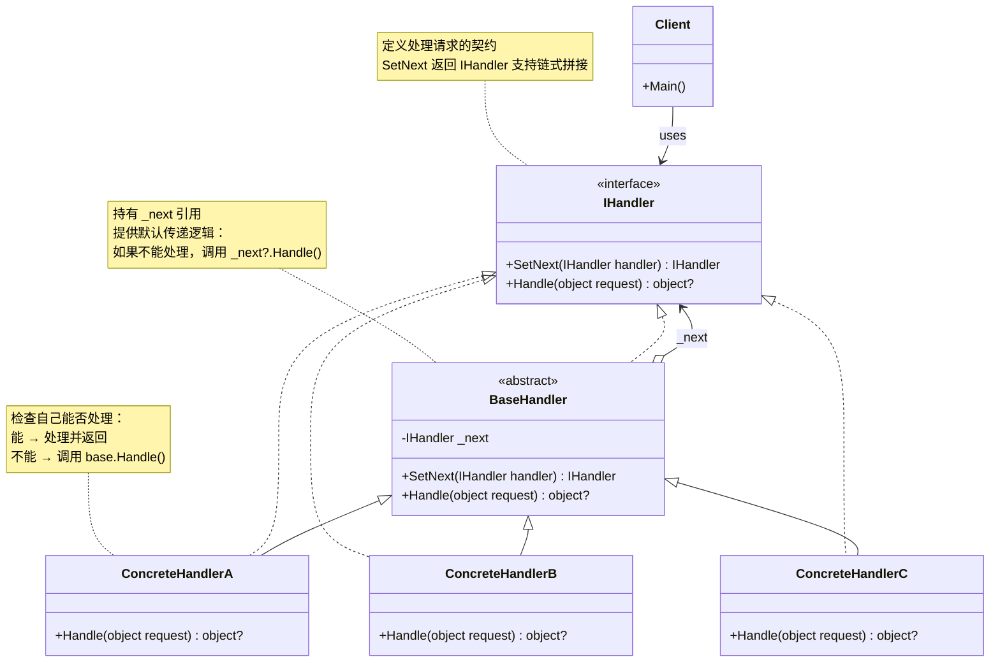
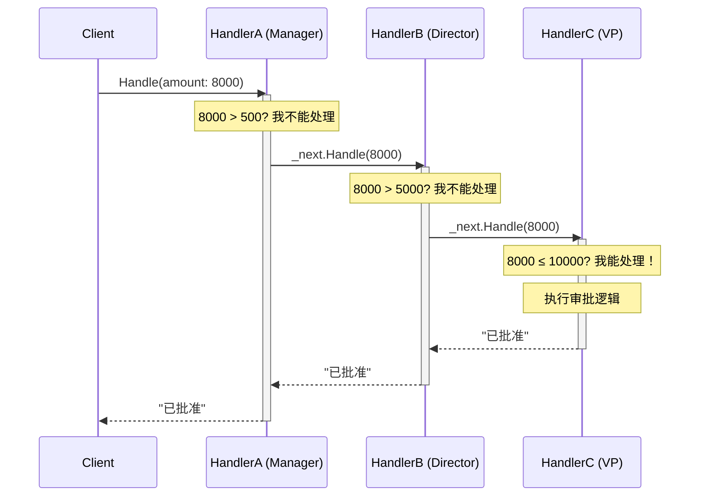

# 责任链模式 Chain of Responsibility

> 所属计划: [[design-patterns-csharp|设计模式 (C#)]]
> 预计耗时: 75 分钟
> 前置知识: [[16-behavioral-intro|行为型模式总览]]

---

## 1. 概念讲解

### 为什么需要责任链？

假设你写一个采购审批系统：500 元以下经理批，500-5000 元总监批，5000 元以上 VP 批。最直接的做法：

```csharp
public void Approve(PurchaseRequest request)
{
    if (request.Amount < 500)
        Manager.Approve(request);
    else if (request.Amount < 5000)
        Director.Approve(request);
    else
        VP.Approve(request);
}
```

这段代码有三个问题：

1. **违反开闭原则**：新增审批级别（如 CFO）需要修改 `Approve` 方法
2. **紧耦合**：`Approve` 方法必须知道所有审批人的存在和顺序
3. **不灵活**：审批规则写死在 `if-else` 中，运行时无法动态重组审批链

**责任链的本质**：将多个处理器串联成一条链，请求沿链传递，直到某个处理器处理它（或到达链尾）。链中的每个处理器只关心**自己能否处理**和**把请求传给下一个**——不需要知道整条链的结构。

### 核心思想



责任链的核心机制：每个处理器 `Handle` 方法中做三件事之一：
- **处理请求**并返回（链终止）
- **不处理**，调用 `_next?.Handle(request)` 继续传递
- **部分处理后**继续传递，收集下游结果再做整合



注意：即使 `H1` 和 `H2` 没有处理，它们仍然看到了请求并控制传递。这是责任链与 `if-else` 的关键区别——每个处理器都有**拦截能力**。

### 三个关键变体

| 变体         | 行为                  | 适用场景               |
| ---------- | ------------------- | ------------------ |
| **纯责任链**   | 恰好一个处理器处理请求，处理完链终止  | 审批流程、异常处理          |
| **不纯责任链**  | 多个处理器都可能处理，请求沿完整链传播 | 日志过滤、事件冒泡          |
| **管道/过滤器** | 每个处理器都处理，输出是下一个的输入  | ASP.NET 中间件、数据加工管道 |

### 责任链 vs 命令模式

[[18-command|命令模式]] 和责任链都涉及"请求的处理"，但职责方向完全不同：

| 维度   | 责任链 CoR        | 命令 Command                |
| ---- | -------------- | ------------------------- |
| 关注点  | 谁处理这个请求        | 把请求打包成可执行对象               |
| 请求流向 | 沿链依次传递，自动寻找处理者 | 由 Invoker 显式分发给特定 Command |
| 耦合度  | 发送者不知道处理者是谁    | 发送者知道使用哪个 Command（或通过 DI） |
| 典型场景 | 审批流、中间件、事件冒泡   | 撤销/重做、队列任务、GUI 按钮绑定       |

两者可以组合：一个 Command 内部使用责任链来寻找合适的执行策略。

---

## 2. 代码示例

### 示例 1：采购审批流 — 经典教科书案例

```csharp
// ============================================================
// 1. 请求对象
// ============================================================
public record PurchaseRequest(int Id, string Description, decimal Amount);

// ============================================================
// 2. 处理器接口 — Fluent API 风格
// ============================================================
public interface IApprover
{
    IApprover SetNext(IApprover next);
    string? Handle(PurchaseRequest request);
}

// ============================================================
// 3. 抽象基类 — 提供默认传递逻辑
// ============================================================
public abstract class Approver : IApprover
{
    private IApprover? _next;

    public IApprover SetNext(IApprover next)
    {
        _next = next;
        return next; // 返回下一个，支持链式 .SetNext(a).SetNext(b)
    }

    public virtual string? Handle(PurchaseRequest request)
    {
        // 自己能处理 → 处理；不能 → 传递
        if (CanApprove(request))
            return ApproveRequest(request);

        return _next?.Handle(request);
    }

    protected abstract bool CanApprove(PurchaseRequest request);
    protected abstract string ApproveRequest(PurchaseRequest request);
}

// ============================================================
// 4. 具体处理器
// ============================================================
public class Manager : Approver
{
    private const decimal MaxAmount = 500m;

    protected override bool CanApprove(PurchaseRequest request)
        => request.Amount <= MaxAmount;

    protected override string ApproveRequest(PurchaseRequest request)
        => $"[Manager] 批准了 #{request.Id} ({request.Description}，¥{request.Amount}) — 金额在 {MaxAmount} 以内";
}

public class Director : Approver
{
    private const decimal MaxAmount = 5000m;

    protected override bool CanApprove(PurchaseRequest request)
        => request.Amount <= MaxAmount;

    protected override string ApproveRequest(PurchaseRequest request)
        => $"[Director] 批准了 #{request.Id} ({request.Description}，¥{request.Amount}) — 金额在 {MaxAmount} 以内";
}

public class VicePresident : Approver
{
    private const decimal MaxAmount = 50000m;

    protected override bool CanApprove(PurchaseRequest request)
        => request.Amount <= MaxAmount;

    protected override string ApproveRequest(PurchaseRequest request)
        => $"[VP] 批准了 #{request.Id} ({request.Description}，¥{request.Amount}) — 金额在 {MaxAmount} 以内";
}

public class CEO : Approver
{
    protected override bool CanApprove(PurchaseRequest request)
        => true; // CEO 批准一切

    protected override string ApproveRequest(PurchaseRequest request)
        => $"[CEO] 最终批准了 #{request.Id} ({request.Description}，¥{request.Amount})";
}

// ============================================================
// 运行入口
// ============================================================
static void Demo1()
{
    // 构建审批链：Manager → Director → VP → CEO
    var manager = new Manager();
    manager.SetNext(new Director())
           .SetNext(new VicePresident())
           .SetNext(new CEO());

    var requests = new[]
    {
        new PurchaseRequest(1, "办公文具", 80m),
        new PurchaseRequest(2, "团队聚餐", 3000m),
        new PurchaseRequest(3, "服务器采购", 40000m),
        new PurchaseRequest(4, "收购竞对公司", 50_000_000m),
    };

    foreach (var req in requests)
    {
        var result = manager.Handle(req);
        Console.WriteLine(result ?? $"[无人处理] 请求 #{req.Id} 无法被审批！");
    }
}
```

**运行方式：**
```bash
dotnet new console -n CoRApproval
# 将上述代码复制到 Program.cs
dotnet run --project CoRApproval
```

**预期输出：**
```text
[Manager] 批准了 #1 (办公文具，¥80) — 金额在 500 以内
[Director] 批准了 #2 (团队聚餐，¥3000) — 金额在 5000 以内
[VP] 批准了 #3 (服务器采购，¥40000) — 金额在 50000 以内
[CEO] 最终批准了 #4 (收购竞对公司，¥50000000)
```

### 示例 2：ASP.NET Core 中间件 — .NET 生态中的责任链

ASP.NET Core 的请求管道就是责任链模式的最佳实现。每个中间件组件可以选择：
- 处理请求并短路（如认证失败返回 401）
- 调用 `next(context)` 传递给下一个中间件
- 在 `next` 调用前后执行逻辑（如计时、日志）

```csharp
// ============================================================
// 模拟 ASP.NET Core 中间件管道（精简版）
// ============================================================

// 请求上下文 — 模拟 HttpContext
public class RequestContext
{
    public string Path { get; set; } = "/";
    public Dictionary<string, string> Headers { get; set; } = new();
    public int? StatusCode { get; set; }
    public string? Body { get; set; }

    public override string ToString()
        => $"Path={Path}, Status={StatusCode}, Body={Body ?? "<null>"}";
}

// 中间件委托 — 等价于 ASP.NET Core 的 RequestDelegate
public delegate Task RequestDelegate(RequestContext context);

// 中间件工厂方法 — 接收 next，返回包装后的 next
public delegate RequestDelegate Middleware(RequestDelegate next);

// ============================================================
// 构建中间件管道
// ============================================================
public class PipelineBuilder
{
    private readonly List<Middleware> _middlewares = new();

    public PipelineBuilder Use(Middleware middleware)
    {
        _middlewares.Add(middleware);
        return this; // Fluent API
    }

    public RequestDelegate Build()
    {
        // 终端处理器 — 链的末尾
        RequestDelegate app = context =>
        {
            context.Body = "404 Not Found";
            context.StatusCode = 404;
            return Task.CompletedTask;
        };

        // 从最后一个中间件往前包裹（洋葱模型）
        for (int i = _middlewares.Count - 1; i >= 0; i--)
            app = _middlewares[i](app);

        return app;
    }
}

// ============================================================
// 具体中间件
// ============================================================
public static class MyMiddleware
{
    // 日志中间件：记录每个请求
    public static RequestDelegate LoggingMiddleware(RequestDelegate next)
    {
        return async context =>
        {
            Console.WriteLine($"[Log] 请求进入: {context.Path}");
            var sw = System.Diagnostics.Stopwatch.StartNew();

            await next(context); // 传递给下一个

            sw.Stop();
            Console.WriteLine($"[Log] 请求完成: {context.Path} → {context.StatusCode} ({sw.ElapsedMilliseconds}ms)");
        };
    }

    // 认证中间件：检查 Token，失败则短路
    public static RequestDelegate AuthMiddleware(RequestDelegate next)
    {
        return async context =>
        {
            if (!context.Headers.TryGetValue("Authorization", out var token) || token != "Bearer secret")
            {
                context.StatusCode = 401;
                context.Body = "Unauthorized";
                return; // 短路 — 不调用 next！
            }
            Console.WriteLine("[Auth] 认证通过");
            await next(context);
        };
    }

    // 路由中间件：匹配路径并返回结果
    public static RequestDelegate RoutingMiddleware(RequestDelegate next)
    {
        return async context =>
        {
            if (context.Path == "/api/users")
            {
                context.StatusCode = 200;
                context.Body = "[\"Alice\", \"Bob\", \"Charlie\"]";
                return; // 路由命中，短路
            }
            // 路由未命中，继续传递
            await next(context);
        };
    }
}

// ============================================================
// 运行入口
// ============================================================
static async Task Demo2()
{
    var builder = new PipelineBuilder();
    builder
        .Use(MyMiddleware.LoggingMiddleware)
        .Use(MyMiddleware.AuthMiddleware)
        .Use(MyMiddleware.RoutingMiddleware);

    var pipeline = builder.Build();

    // 测试 1：无认证 → 401
    Console.WriteLine("=== 测试 1：无 Token ===");
    await pipeline(new RequestContext { Path = "/api/users" });

    // 测试 2：有效认证 + 匹配路由 → 200
    Console.WriteLine("\n=== 测试 2：有效 Token + 匹配路由 ===");
    var ctx2 = new RequestContext { Path = "/api/users" };
    ctx2.Headers["Authorization"] = "Bearer secret";
    await pipeline(ctx2);

    // 测试 3：有效认证 + 不匹配路由 → 404
    Console.WriteLine("\n=== 测试 3：有效 Token + 404 路由 ===");
    var ctx3 = new RequestContext { Path = "/api/unknown" };
    ctx3.Headers["Authorization"] = "Bearer secret";
    await pipeline(ctx3);
}
```

**预期输出：**
```text
=== 测试 1：无 Token ===
[Log] 请求进入: /api/users
[Log] 请求完成: /api/users → 401 (0ms)

=== 测试 2：有效 Token + 匹配路由 ===
[Log] 请求进入: /api/users
[Auth] 认证通过
[Log] 请求完成: /api/users → 200 (0ms)

=== 测试 3：有效 Token + 404 路由 ===
[Log] 请求进入: /api/unknown
[Auth] 认证通过
[Log] 请求完成: /api/unknown → 404 (0ms)
```

> [!tip] 洋葱模型
> 注意 `LoggingMiddleware` 包裹了整个管道——它先于所有中间件记录请求进入，最后于所有中间件记录响应退出。在调用 `next` 前后插入逻辑，形成了"请求 → → → 响应"的洋葱层结构。这是责任链模式最能体现灵活性的变体之一。

### 示例 3：C# 惯用风格 — 委托链 / `Action<T>` 管道

在 C# 中，责任链不需要完整的类层次结构——利用 `delegate` 多播和 `Func<T, T>` 组合可以实现极简的管道：

```csharp
// ============================================================
// 方案 A：Func 组合管道 — 文本加工链
// ============================================================
static void Demo3A()
{
    // 每个处理器：输入 string → 输出 string
    Func<string, string> removeExtraSpaces = s =>
    {
        while (s.Contains("  "))
            s = s.Replace("  ", " ");
        return s;
    };

    Func<string, string> trim = s => s.Trim();

    Func<string, string> toTitleCase = s =>
        System.Globalization.CultureInfo.CurrentCulture.TextInfo.ToTitleCase(s.ToLower());

    Func<string, string> appendTimestamp = s => $"{s} [处理于 {DateTime.Now:HH:mm:ss}]";

    // 组合成管道
    Func<string, string> pipeline = s =>
        appendTimestamp(toTitleCase(trim(removeExtraSpaces(s))));

    // 或者用扩展方法构建
    Func<string, string> combined = removeExtraSpaces
        .Compose(trim)
        .Compose(toTitleCase)
        .Compose(appendTimestamp);

    var input = "   hello   world   from  chain  ";
    Console.WriteLine($"输入: \"{input}\"");
    Console.WriteLine($"输出: \"{pipeline(input)}\"");
    Console.WriteLine($"输出(Compose): \"{combined(input)}\"");
}

// Compose 扩展方法
public static class FuncExtensions
{
    public static Func<T, T> Compose<T>(this Func<T, T> first, Func<T, T> second)
        => x => second(first(x));
}

// ============================================================
// 方案 B：多播委托责任链 — 依次尝试直到非 null
// ============================================================
delegate string? RequestHandler(string query);

static void Demo3B()
{
    // 定义多个处理器，返回 null 表示"不处理"
    RequestHandler? tryCache = query =>
        query == "users" ? "[Cache] 返回缓存用户列表" : null;

    RequestHandler? tryDatabase = query =>
        query.StartsWith("db:") ? $"[Database] 查询结果: {query[3..]}" : null;

    RequestHandler? tryFallback = query =>
        "[Fallback] 未找到数据源，返回默认空列表";

    // 组合成链
    RequestHandler chain = query =>
        tryCache(query) ?? tryDatabase(query) ?? tryFallback(query);

    Console.WriteLine("=== 委托责任链 ===");
    Console.WriteLine(chain("users"));       // 命中缓存
    Console.WriteLine(chain("db:orders"));   // 命中数据库
    Console.WriteLine(chain("unknown"));     // 命中 fallback
}

// ============================================================
// 方案 C：泛型管道构建器 — 生产级
// ============================================================
public class Pipeline<T>
{
    private readonly List<Func<T, T>> _handlers = new();

    public Pipeline<T> AddHandler(Func<T, T> handler)
    {
        _handlers.Add(handler);
        return this;
    }

    public T Execute(T input)
    {
        T current = input;
        foreach (var handler in _handlers)
            current = handler(current);
        return current;
    }
}

static void Demo3C()
{
    Console.WriteLine("=== 泛型管道构建器 ===");
    var pipeline = new Pipeline<string>()
        .AddHandler(s => s.Replace("{{name}}", "Alice"))
        .AddHandler(s => s.Replace("{{date}}", DateTime.Now.ToString("yyyy-MM-dd")))
        .AddHandler(s => s.Trim())
        .AddHandler(s => $"【邮件】{s}");

    var result = pipeline.Execute("你好 {{name}}，今天是 {{date}} ，请查收。   ");
    Console.WriteLine(result);
}
// 输出：Demo3A + Demo3B + Demo3C
```

**运行方式（三个演示放在一起）：**
```bash
dotnet new console -n CoRDelegate
# 将上面的代码（含 Demo3A/B/C 函数和 FuncExtensions/Pipeline 类）复制到 Program.cs
# 在 Main 中依次调用
dotnet run --project CoRDelegate
```

**预期输出：**
```text
输入: "   hello   world   from  chain  "
输出: "Hello World From Chain [处理于 14:30:15]"
输出(Compose): "Hello World From Chain [处理于 14:30:15]"

=== 委托责任链 ===
[Cache] 返回缓存用户列表
[Database] 查询结果: orders
[Fallback] 未找到数据源，返回默认空列表

=== 泛型管道构建器 ===
【邮件】你好 Alice，今天是 2026-06-08 ，请查收。
```

> [!tip] 何时用类层次 vs 委托链
> - **类层次**（示例 1）：处理器有状态、需要 `SetNext` 灵活重组、每个处理器复杂且需要独立测试
> - **委托链**（示例 3）：处理器是无状态纯函数、链结构固定、追求简洁

---


## C++ 实现

C++ 中使用裸指针串联处理链（所有权由客户端 `unique_ptr` 管理），通过 `nullptr` 判断链尾。虚函数 `handle()` 提供默认传递逻辑，子类在无法处理时调用基类实现将请求转发给下一节点。

```cpp
#include <iostream>
#include <memory>
#include <string>
#include <vector>
using namespace std;

// ============================================================
// 1. Handler 抽象基类 — 持有指向下一处理器的裸指针
// ============================================================
class Handler {
protected:
    Handler* next = nullptr;
public:
    virtual ~Handler() = default;

    Handler* setNext(Handler* n) {
        next = n;
        return n; // 返回下一节点，支持链式 setNext(a)->setNext(b)
    }

    // 默认传递：自己不能处理时转发给下一个
    virtual string handle(const string& request) {
        if (next) return next->handle(request);
        return "请求未被处理: " + request;
    }
};

// ============================================================
// 2. 具体处理器
// ============================================================
class MonkeyHandler : public Handler {
public:
    string handle(const string& request) override {
        if (request == "Banana") {
            return "Monkey: 我会吃掉 " + request;
        }
        return Handler::handle(request);
    }
};

class SquirrelHandler : public Handler {
public:
    string handle(const string& request) override {
        if (request == "Nut") {
            return "Squirrel: 我会吃掉 " + request;
        }
        return Handler::handle(request);
    }
};

class DogHandler : public Handler {
public:
    string handle(const string& request) override {
        if (request == "MeatBall") {
            return "Dog: 我会吃掉 " + request;
        }
        return Handler::handle(request);
    }
};

// ============================================================
// 3. 客户端 — 管理 handler 所有权并构建链
// ============================================================
static void clientCode(Handler& handler) {
    vector<string> foods = { "Nut", "Banana", "Coffee", "MeatBall" };
    for (const auto& food : foods) {
        cout << "Client: 谁要处理 " << food << "?" << endl;
        cout << "  " << handler.handle(food) << endl;
    }
}

// === main / usage ===
int main() {
    // 所有权由 unique_ptr 管理
    auto monkey = make_unique<MonkeyHandler>();
    auto squirrel = make_unique<SquirrelHandler>();
    auto dog = make_unique<DogHandler>();

    // 串联链: monkey -> squirrel -> dog
    monkey->setNext(squirrel.get());
    squirrel->setNext(dog.get());

    cout << "Chain: Monkey > Squirrel > Dog\n" << endl;
    clientCode(*monkey);

    // 也可以动态重组链
    cout << "\nSubchain: Squirrel > Dog\n" << endl;
    clientCode(*squirrel);

    return 0;
}
```

**编译运行：**
```bash
g++ -std=c++17 -o prog main.cpp && ./prog
```

**预期输出：**
```text
Chain: Monkey > Squirrel > Dog

Client: 谁要处理 Nut?
  Squirrel: 我会吃掉 Nut
Client: 谁要处理 Banana?
  Monkey: 我会吃掉 Banana
Client: 谁要处理 Coffee?
  请求未被处理: Coffee
Client: 谁要处理 MeatBall?
  Dog: 我会吃掉 MeatBall

Subchain: Squirrel > Dog

Client: 谁要处理 Nut?
  Squirrel: 我会吃掉 Nut
Client: 谁要处理 Banana?
  请求未被处理: Banana
...
```

## 3. 练习

### 练习 1：日志级别责任链

实现一个日志处理链，根据日志级别将消息分发到不同输出：

- `Debug` 和 `Info` → 输出到控制台
- `Warning` → 输出到控制台（黄色） + 写入文件
- `Error` → 输出到控制台（红色） + 写入文件 + 发送邮件（模拟）

要求：
1. 定义 `LogLevel` 枚举 (`Debug`, `Info`, `Warning`, `Error`)
2. 定义 `LogMessage` 记录 (`LogLevel Level`, `string Message`)
3. 定义 `ILogHandler` 接口（`bool CanHandle(LogLevel)`, `void Handle(LogMessage)`, `ILogHandler SetNext(ILogHandler)`）
4. 实现 `ConsoleHandler`（处理 Debug/Info）、`FileHandler`（处理 Warning）、`EmailHandler`（处理 Error）
5. 链顺序：`ConsoleHandler → FileHandler → EmailHandler`
6. 一条 `Error` 消息**应该依次经过**三个处理器（不纯责任链——每个处理器都执行）

> [!tip] 提示
> 不纯责任链中，`Handle` 方法自己处理完后**始终**调用 `_next?.Handle()`，而不是只有"不能处理"时才传递。

### 练习 2：文本处理中间件管道

实现一个可配置的文本处理中间件管道，支持以下处理器：

1. `TrimProcessor`：去除首尾空白
2. `RemoveExtraSpacesProcessor`：将连续空格压缩为一个
3. `SanitizeProcessor`：移除 HTML 标签（`<.*?>` → 空字符串）
4. `MarkdownProcessor`：将 `**text**` 转换为 `<strong>text</strong>`（模拟）

要求：
- 使用 ASP.NET Core 中间件风格（`Func<RequestDelegate, RequestDelegate>` 或自定义委托）
- 每个处理器接收输入的 `TextContext`，处理后可选择短路或传递
- 构建一个 `TextPipelineBuilder`，支持 `Use(processor)` 方法添加处理器
- 测试：输入 `"  <p>Hello  <b>World</b></p>  **CSharp**  "` 应输出 `"Hello World <strong>CSharp</strong>"`

### 练习 3：可断点和恢复的链

实现一个可以**中途断点**和**从断点恢复**的责任链：

要求：
1. 定义 `IChainable` 接口：`object? Handle(object request)` 和 `IChainable SetNext(IChainable next)`
2. 实现一个 `CheckpointHandler`——它在链中某处保存请求的快照，记录链进度
3. 实现一个 `ResumeHandler`——它接收保存的快照，从指定位置恢复链的执行
4. 链中某个处理器可能抛出异常；`CheckpointHandler` 应在其之前保存状态，`ResumeHandler` 应能从保存点重试
5. 测试：模拟一个三步处理链（验证 → 转换 → 持久化），在第二步失败后从 saved checkpoint 重试

> [!tip] 提示
> 这实际上是 **Saga 模式**的简化版。`CheckpointHandler` 可以是一个装饰器，包裹在需要保护的处理器外面。

---

## 3.5 参考答案

> [!tip]- 练习 1 参考答案
>
> ```csharp
> using System;
> using System.Collections.Generic;
> using System.IO;
>
> // ============================================
> // 数据模型
> // ============================================
> public enum LogLevel { Debug, Info, Warning, Error }
>
> public record LogMessage(LogLevel Level, string Message, DateTime Timestamp)
> {
>     public override string ToString()
>         => $"[{Timestamp:HH:mm:ss}] [{Level}] {Message}";
> }
>
> // ============================================
> // ILogHandler 接口
> // ============================================
> public interface ILogHandler
> {
>     ILogHandler SetNext(ILogHandler next);
>     void Handle(LogMessage message);
> }
>
> // ============================================
> // 抽象基类 — 提供默认传递逻辑
> // ============================================
> public abstract class LogHandler : ILogHandler
> {
>     private ILogHandler? _next;
>
>     public ILogHandler SetNext(ILogHandler next)
>     {
>         _next = next;
>         return next;
>     }
>
>     public virtual void Handle(LogMessage message)
>     {
>         // 子类在覆盖时：先处理自己关心的级别，再调用 base.Handle() 传递
>         _next?.Handle(message);
>     }
> }
>
> // ============================================
> // ConsoleHandler — 处理 Debug、Info（控制台输出）
> // ============================================
> public class ConsoleHandler : LogHandler
> {
>     public override void Handle(LogMessage message)
>     {
>         if (message.Level == LogLevel.Debug || message.Level == LogLevel.Info)
>         {
>             Console.WriteLine($"[Console] {message}");
>         }
>         // 不纯责任链：无论如何都传递给下一个
>         base.Handle(message);
>     }
> }
>
> // ============================================
> // FileHandler — 处理 Warning（控制台黄字 + 写文件）
> // ============================================
> public class FileHandler : LogHandler
> {
>     private readonly string _filePath;
>
>     public FileHandler(string filePath = "warnings.log")
>     {
>         _filePath = filePath;
>     }
>
>     public override void Handle(LogMessage message)
>     {
>         if (message.Level == LogLevel.Warning)
>         {
>             // 控制台黄色输出
>             var prevColor = Console.ForegroundColor;
>             Console.ForegroundColor = ConsoleColor.Yellow;
>             Console.WriteLine($"[Console/File] {message}");
>             Console.ForegroundColor = prevColor;
>
>             // 写入文件
>             File.AppendAllText(_filePath, message + Environment.NewLine);
>         }
>         // 不纯责任链：继续传递
>         base.Handle(message);
>     }
> }
>
> // ============================================
> // EmailHandler — 处理 Error（控制台红字 + 文件 + 模拟邮件）
> // ============================================
> public class EmailHandler : LogHandler
> {
>     private readonly string _filePath;
>     private readonly string _adminEmail;
>
>     public EmailHandler(string adminEmail = "admin@example.com", string filePath = "errors.log")
>     {
>         _adminEmail = adminEmail;
>         _filePath = filePath;
>     }
>
>     public override void Handle(LogMessage message)
>     {
>         if (message.Level == LogLevel.Error)
>         {
>             // 控制台红色输出
>             var prevColor = Console.ForegroundColor;
>             Console.ForegroundColor = ConsoleColor.Red;
>             Console.WriteLine($"[Console/File/Email] {message}");
>             Console.ForegroundColor = prevColor;
>
>             // 写入文件
>             File.AppendAllText(_filePath, message + Environment.NewLine);
>
>             // 模拟发送邮件
>             Console.WriteLine($"  → [Email] 已发送错误通知至 {_adminEmail}");
>         }
>         // 不纯责任链：继续传递
>         base.Handle(message);
>     }
> }
>
> // ============================================
> // 验证代码
> // ============================================
> Console.WriteLine("=== 日志责任链 ===\n");
>
> // 构建链：ConsoleHandler → FileHandler → EmailHandler
> var consoleHandler = new ConsoleHandler();
> consoleHandler.SetNext(new FileHandler())
>               .SetNext(new EmailHandler());
>
> var messages = new[]
> {
>     new LogMessage(LogLevel.Debug, "初始化连接池", DateTime.Now),
>     new LogMessage(LogLevel.Info, "用户登录成功: alice", DateTime.Now),
>     new LogMessage(LogLevel.Warning, "磁盘使用率超过 80%", DateTime.Now),
>     new LogMessage(LogLevel.Error, "数据库连接超时", DateTime.Now),
> };
>
> foreach (var msg in messages)
> {
>     Console.WriteLine($"--- 处理 {msg.Level} 消息 ---");
>     consoleHandler.Handle(msg);
>     Console.WriteLine();
> }
>
> /* 输出说明：
>  * Debug:  仅 ConsoleHandler 输出
>  * Info:   仅 ConsoleHandler 输出
>  * Warning: ConsoleHandler 输出（黄色）+ FileHandler 输出 + 写文件
>  * Error:   ConsoleHandler 输出（红色）+ FileHandler 输出 + EmailHandler 输出 + 写文件 + 模拟邮件
>  * 每个级别都会经过完整链（不纯责任链特性）
>  */
> ```
>
> **关键点**：
> - 不纯责任链的核心：`Handle` 方法先处理自己关心的级别，**再**调用 `base.Handle(message)` 传递——无论是否处理都传递
> - `Error` 消息会依次经过三个处理器：
>   - ConsoleHandler 看到 Error 级别不匹配（只处理 Debug/Info），跳过自身输出，调用 `base.Handle()`
>   - FileHandler 看到 Error 级别不匹配（只处理 Warning），跳过自身输出，调用 `base.Handle()`
>   - EmailHandler 匹配 Error，输出控制台 + 文件 + 邮件，然后调用 `base.Handle()` → `_next` 为 null → 链结束
> - 如果想改成"Error 也要经过 Warning 的文件记录"，可以在 EmailHandler 之前共享 FileHandler 引用，或让 EmailHandler 也包含文件写入逻辑

> [!tip]- 练习 2 参考答案
>
> ```csharp
> using System;
> using System.Collections.Generic;
> using System.Text.RegularExpressions;
> using System.Threading.Tasks;
>
> // ============================================
> // TextContext — 处理上下文
> // ============================================
> public class TextContext
> {
>     public string Input { get; set; }
>     public string Output { get; set; } = "";
>     public bool IsShortCircuited { get; set; }
>
>     public TextContext(string input) => Input = input;
>
>     public override string ToString() => Output;
> }
>
> // ============================================
> // 中间件委托 — 模拟 ASP.NET Core 风格
> // ============================================
> public delegate Task TextMiddleware(TextContext context, Func<Task> next);
>
> // ============================================
> // TextPipelineBuilder
> // ============================================
> public class TextPipelineBuilder
> {
>     private readonly List<TextMiddleware> _middlewares = new();
>
>     public TextPipelineBuilder Use(TextMiddleware middleware)
>     {
>         _middlewares.Add(middleware);
>         return this;
>     }
>
>     public Func<TextContext, Task> Build()
>     {
>         // 终端处理器
>         Func<Task> terminal = () =>
>         {
>             // 默认：Output = Input（如果没有中间件短路或设置输出）
>             return Task.CompletedTask;
>         };
>
>         // 洋葱包裹：从最后一个中间件往前
>         for (int i = _middlewares.Count - 1; i >= 0; i--)
>         {
>             var middleware = _middlewares[i];
>             var next = terminal;
>             terminal = () => middleware(context!, next);
>         }
>
>         return ctx =>
>         {
>             context = ctx;
>             return terminal();
>         };
>     }
>
>     // 实例字段用于闭包捕获
>     private TextContext? context;
> }
>
> // ============================================
> // 具体处理器
> // ============================================
> public static class TextProcessors
> {
>     // 1. TrimProcessor：去除首尾空白
>     public static Task TrimProcessor(TextContext ctx, Func<Task> next)
>     {
>         ctx.Input = ctx.Input.Trim();
>         return next();
>     }
>
>     // 2. RemoveExtraSpacesProcessor：连续空格压缩为一个
>     public static Task RemoveExtraSpaces(TextContext ctx, Func<Task> next)
>     {
>         ctx.Input = Regex.Replace(ctx.Input, @"\s{2,}", " ");
>         return next();
>     }
>
>     // 3. SanitizeProcessor：移除 HTML 标签
>     public static Task SanitizeHtml(TextContext ctx, Func<Task> next)
>     {
>         ctx.Input = Regex.Replace(ctx.Input, @"<.*?>", "");
>         return next();
>     }
>
>     // 4. MarkdownProcessor：将 **text** 转换为 <strong>text</strong>
>     public static Task ConvertMarkdown(TextContext ctx, Func<Task> next)
>     {
>         ctx.Input = Regex.Replace(ctx.Input, @"\*\*(.+?)\*\*", "<strong>$1</strong>");
>         // 设置输出
>         ctx.Output = ctx.Input;
>         return next();
>     }
> }
>
> // ============================================
> // 验证代码
> // ============================================
> var builder = new TextPipelineBuilder();
> // 注意：Build 的闭包方式需要适配。这里改用更简单的顺序管道方式：
> // 为了清晰展示，我们采用"每个中间件修改 ctx.Input，传递到下一个"的模式
>
> // 简化版构建器（顺序管道，非洋葱模型）
> var pipeline = new List<Func<TextContext, TextContext>>
> {
>     ctx => { ctx.Input = ctx.Input.Trim(); return ctx; },
>     ctx => { ctx.Input = Regex.Replace(ctx.Input, @"\s{2,}", " "); return ctx; },
>     ctx => { ctx.Input = Regex.Replace(ctx.Input, @"<.*?>", ""); return ctx; },
>     ctx =>
>     {
>         ctx.Input = Regex.Replace(ctx.Input, @"\*\*(.+?)\*\*", "<strong>$1</strong>");
>         ctx.Output = ctx.Input;
>         return ctx;
>     },
> };
>
> Console.WriteLine("=== 文本处理中间件管道 ===\n");
>
> var input = "  <p>Hello  <b>World</b></p>  **CSharp**  ";
> Console.WriteLine($"输入: \"{input}\"");
>
> var context = new TextContext(input);
> foreach (var processor in pipeline)
>     context = processor(context);
>
> Console.WriteLine($"输出: \"{context.Output}\"");
>
> // 验证预期结果
> var expected = "Hello World <strong>CSharp</strong>";
> Console.WriteLine($"期望: \"{expected}\"");
> Console.WriteLine($"结果: {(context.Output == expected ? "✓ 通过" : "✗ 不匹配")}");
> ```
>
> **关键点**：
> - 每个处理器接收 `TextContext`，修改 `Input`，传递到下一个
> - 处理器顺序敏感：必须先 Trim 和 RemoveExtraSpaces 再 Removetags，否则 `<b>World</b>` 内部的空白处理会受影响
> - 正则 `@"<.*?>"` 非贪婪匹配 HTML 标签；`@"\*\*(.+?)\*\*"` 匹配 Markdown 加粗
> - 简化版用 `List<Func<>>` 实现顺序管道而非洋葱模型——因为文本处理不需要"响应后"逻辑。若需求含后处理（如添加时间戳），改用洋葱模型更合适

> [!tip]- 练习 3 参考答案
>
> ```csharp
> using System;
> using System.Collections.Generic;
>
> // ============================================
> // 核心接口
> // ============================================
> public interface IChainable
> {
>     object? Handle(object request);
>     IChainable SetNext(IChainable next);
> }
>
> // ============================================
> // 请求快照 — 用于断点恢复
> // ============================================
> public class ChainCheckpoint
> {
>     public object Request { get; }
>     public IChainable ResumeFrom { get; }  // 从哪个处理器恢复
>     public DateTime SavedAt { get; }
>
>     public ChainCheckpoint(object request, IChainable resumeFrom)
>     {
>         Request = request;
>         ResumeFrom = resumeFrom;
>         SavedAt = DateTime.UtcNow;
>     }
> }
>
> // ============================================
> // CheckpointHandler — 在目标处理器前后保存/恢复
> // ============================================
> public class CheckpointHandler : IChainable
> {
>     private readonly IChainable _inner;      // 被保护的处理器
>     private IChainable? _next;
>     private ChainCheckpoint? _lastCheckpoint;
>
>     public CheckpointHandler(IChainable inner)
>     {
>         _inner = inner;
>     }
>
>     public IChainable SetNext(IChainable next)
>     {
>         _next = next;
>         // 同时设置内部处理器的下一个（让 inner 可以继续执行链）
>         _inner.SetNext(next);
>         return next;
>     }
>
>     public object? Handle(object request)
>     {
>         // 在执行 inner 之前保存快照（断点位置 = inner）
>         _lastCheckpoint = new ChainCheckpoint(request, _inner);
>         Console.WriteLine($"  [Checkpoint] 已保存快照 @ {_inner.GetType().Name}");
>
>         try
>         {
>             return _inner.Handle(request);
>         }
>         catch (Exception ex)
>         {
>             Console.WriteLine($"  [Checkpoint] 捕获异常: {ex.Message}");
>             Console.WriteLine($"  [Checkpoint] 快照可用于从 {_inner.GetType().Name} 恢复");
>             throw; // 重新抛出，让上层知道失败
>         }
>     }
>
>     /// <summary>获取最后一个快照，可用于 ResumeHandler 重试</summary>
>     public ChainCheckpoint? GetCheckpoint() => _lastCheckpoint;
> }
>
> // ============================================
> // ResumeHandler — 从快照恢复链的执行
> // ============================================
> public class ResumeHandler : IChainable
> {
>     private IChainable? _next;
>
>     public IChainable SetNext(IChainable next)
>     {
>         _next = next;
>         return next;
>     }
>
>     public object? Handle(object request)
>     {
>         Console.WriteLine("  [Resume] 尝试从快照恢复...");
>         return _next?.Handle(request);
>     }
>
>     /// <summary>使用快照恢复执行</summary>
>     public object? ResumeFrom(ChainCheckpoint checkpoint)
>     {
>         Console.WriteLine($"  [Resume] 从 {checkpoint.ResumeFrom.GetType().Name} 恢复执行 (快照时间: {checkpoint.SavedAt:HH:mm:ss})");
>         return checkpoint.ResumeFrom.Handle(checkpoint.Request);
>     }
> }
>
> // ============================================
> // 测试用的三步处理链
> // ============================================
> public class ValidateHandler : IChainable
> {
>     private IChainable? _next;
>
>     public IChainable SetNext(IChainable next) { _next = next; return next; }
>
>     public object? Handle(object request)
>     {
>         Console.WriteLine("  [Validate] 验证请求...");
>         if (request is string s && string.IsNullOrWhiteSpace(s))
>             throw new InvalidOperationException("请求为空！");
>         Console.WriteLine("  [Validate] ✓ 通过");
>         return _next?.Handle(request);
>     }
> }
>
> public class TransformHandler : IChainable
> {
>     private readonly bool _failOnce; // 模拟：首次调用失败
>     private bool _hasFailed;
>     private IChainable? _next;
>
>     public TransformHandler(bool failOnce = false)
>     {
>         _failOnce = failOnce;
>     }
>
>     public IChainable SetNext(IChainable next) { _next = next; return next; }
>
>     public object? Handle(object request)
>     {
>         if (_failOnce && !_hasFailed)
>         {
>             _hasFailed = true;
>             throw new InvalidOperationException("转换失败：网络超时（模拟）");
>         }
>
>         Console.WriteLine("  [Transform] 转换请求...");
>         string result = $"[TRANSFORMED] {request}";
>         Console.WriteLine($"  [Transform] ✓ 完成: {result}");
>         return _next?.Handle(result);
>     }
> }
>
> public class PersistHandler : IChainable
> {
>     private IChainable? _next;
>
>     public IChainable SetNext(IChainable next) { _next = next; return next; }
>
>     public object? Handle(object request)
>     {
>         Console.WriteLine($"  [Persist] 持久化: {request}");
>         Console.WriteLine("  [Persist] ✓ 已保存");
>         return _next?.Handle(request);
>     }
> }
>
> // ============================================
> // 验证代码
> // ============================================
> Console.WriteLine("=== 可断点和恢复的责任链 ===\n");
>
> // 构建链: Validate → [Checkpoint(Transform)] → Persist
> var validate = new ValidateHandler();
> var transform = new TransformHandler(failOnce: true);  // 首次会失败
> var persist = new PersistHandler();
>
> var checkpoint = new CheckpointHandler(transform);
> var resume = new ResumeHandler();
>
> // 链连接: validate → checkpoint(transform) → persist
> validate.SetNext(checkpoint);
> checkpoint.SetNext(persist);
>
> // 测试 1：正常执行
> Console.WriteLine("--- 测试 1：正常请求 ---");
> try
> {
>     validate.Handle("Hello, Chain!");
> }
> catch (Exception ex)
> {
>     Console.WriteLine($"  ❌ 链失败: {ex.Message}");
> }
>
> Console.WriteLine();
>
> // 测试 2：用快照重试
> Console.WriteLine("--- 测试 2：使用快照重试 ---");
> var savedCheckpoint = checkpoint.GetCheckpoint();
> if (savedCheckpoint != null)
> {
>     // 注意：TransformHandler 第二次调用不会失败了（_failOnce + _hasFailed = true）
>     var result = resume.ResumeFrom(savedCheckpoint);
>     Console.WriteLine($"  最终结果: {result}");
> }
> else
> {
>     Console.WriteLine("  没有可用快照");
> }
> ```
>
> **关键点**：
> - `CheckpointHandler` 包装目标处理器（Decoration），在执行前保存请求快照
> - 异常被 `CheckpointHandler` 捕获后重新抛出——不影响正常的异常传播，但在此之前已记录了恢复所需的数据
> - `ResumeHandler.ResumeFrom(checkpoint)` 直接从保存的 `ResumeFrom` 处理器重新执行，跳过之前已完成的步骤
> - `TransformHandler` 用 `_failOnce` 模拟间歇性故障：首次抛异常，重试时成功
> - 这是 **Saga 模式**的简化版：CheckpointHandler 相当于 Saga 的"步骤日志"，ResumeHandler 相当于"补偿/重试协调器"

> [!note] 答案使用方式
> 先独立完成练习，再展开查看参考答案。参考答案不是唯一解——如果你的实现通过了测试或达到了题目要求，就是正确的。

## 4. 扩展阅读

### 相关模式

- [[16-behavioral-intro|行为型模式总览]]：责任链属于行为型模式家族，关注对象间的通信
- [[18-command|命令模式]]：命令打包请求，责任链分发请求——两者常组合使用
- [[12-decorator|装饰器模式]]：装饰器和责任链都使用"包装"结构。区别在于装饰器**必然增强**被装饰对象的行为，而责任链中的处理器**可能不处理**而直接传递

### .NET 中的责任链实例

- **ASP.NET Core 中间件**：`IApplicationBuilder.Use()` 构建的完整管道就是责任链模式——这是生产环境中最经典的 C# 实现，建议阅读 [ASP.NET Core Middleware 文档](https://learn.microsoft.com/en-us/aspnet/core/fundamentals/middleware/)
- **`ILogger` 日志提供程序**：`LoggerFactory` 将多个 `ILoggerProvider` 串联，每个 Provider 检查自己是否能处理该日志级别
- **`ExceptionHandler` 链**：`ExceptionDispatchInfo` 和 `IExceptionHandler`（ASP.NET Core 8+）实现了异常处理的责任链
- **`HttpMessageHandler` / `DelegatingHandler`**：`HttpClient` 的消息处理器管道，每个 handler 可以修改请求/响应并传递

### 经典文献

- GoF《Design Patterns》第 5.1 章 — 原始定义和责任链与其他模式的详细对比
- *Patterns of Enterprise Application Architecture* (Fowler) — 管道和过滤器架构（不纯责任链）
- [Chain of Responsibility Design Pattern — Refactoring.Guru](https://refactoring.guru/design-patterns/chain-of-responsibility)

---

## 5. 常见陷阱

### 陷阱 1：每个处理器都执行（误用纯责任链语义）

```csharp
// ❌ 错误：日志链中，Error 处理器在 Handler 里"处理完就 return"
// 导致 WarningHandler 的 FileHandler 永远不会被调用
public override void Handle(LogMessage msg)
{
    if (CanHandle(msg)) { Console.WriteLine(msg); return; } // 短路了！
    _next?.Handle(msg);
}
```

**正确做法**——不纯责任链中，不管自己处不处理，都要传递：

```csharp
// ✅ 正确：日志链中每个处理器都执行，处理完后继续传递
public override void Handle(LogMessage msg)
{
    if (msg.Level >= MinLevel)
        WriteLog(msg);           // 自己处理
    _next?.Handle(msg);         // 无论是否处理，都继续传递
}
```

### 陷阱 2：链太长导致性能问题

```csharp
// ❌ 错误：50 个中间件串联，每个请求都要穿越整条链
builder.Use(Auth).Use(Logging).Use(Cors).Use(Caching).Use(RateLimit)
       .Use(Compression).Use(Routing).Use(/* ... 43 more ... */);

// 对于 /health 探活端点，根本不需要穿越认证、限流等 40 个中间件
```

**正确做法**——在管道早期用 `Map` 或条件短路：

```csharp
// ✅ 正确：探活端点在前，短路后续所有中间件
builder.Use(async (ctx, next) =>
{
    if (ctx.Path == "/health") { ctx.StatusCode = 200; return; }
    await next(ctx);
});
builder.Use(Auth).Use(RateLimit).Use(/* ... */);
```

### 陷阱 3：没有兜底处理器（无人处理请求）

```csharp
// ❌ 错误：链末尾没有兜底，Handle 返回 null 或 void
// 请求 5,000,000 元没人能批，静默失败
var result = chain.Handle(request);
// result == null → 客户端不知道该找谁

// ❌ 同样错误：中间件管道末尾没有 404 处理器
// 请求路由未命中时没有任何响应
```

**正确做法**——链尾始终有兜底处理器：

```csharp
// ✅ 正确：链末尾设置 CEO 作为兜底（审批一切）
chain.SetNext(new CEO()); // CEO.CanHandle 永远返回 true

// ✅ 正确：中间件管道末尾返回 404
app.Use(async context =>
{
    context.Response.StatusCode = 404;
    await context.Response.WriteAsync("Not Found");
});

// ✅ 或者：Handle 返回一个 Result 对象，让调用方能区分"已处理"和"无人处理"
public record HandleResult(bool Handled, string? Message);
```

### 陷阱 4：在处理器中修改请求对象导致下游混乱

```csharp
// ❌ 危险：HandlerA 修改了 request 的字段，HandlerB 看到了被修改的数据
public override void Handle(Request request)
{
    request.Amount += Tax; // 修改了上游传来的对象！
    _next?.Handle(request);
}
```

**正确做法**——要么使用不可变对象（`record`），要么复制后再修改：

```csharp
// ✅ 方案 A：使用 record（不可变，修改会创建新实例）
public override void Handle(Request request)
{
    var modified = request with { Amount = request.Amount + Tax };
    _next?.Handle(modified);
}

// ✅ 方案 B：在传递前复制
public override void Handle(Request request)
{
    var copy = request.Clone();
    copy.Amount += Tax;
    _next?.Handle(copy);
}
```

### 陷阱 5：循环引用导致无限递归

```csharp
// ❌ 致命：A → B → C → A 形成循环
handlerA.SetNext(handlerB);
handlerB.SetNext(handlerC);
handlerC.SetNext(handlerA); // 环形引用！→ StackOverflowException
```

**正确做法**——在 `SetNext` 中添加循环检测（调试时），或使用 Builder 统一构建链确保单向：

```csharp
// ✅ 正确：使用 Fluent Builder，强迫单向构建
var chain = ChainBuilder<Approver>
    .StartWith(new Manager())
    .Then(new Director())
    .Then(new VicePresident())
    .EndWith(new CEO())
    .Build();
// Builder 内部保证不会出现环
```
