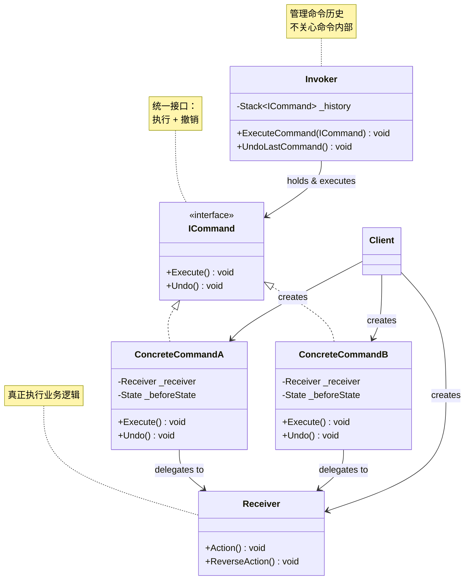
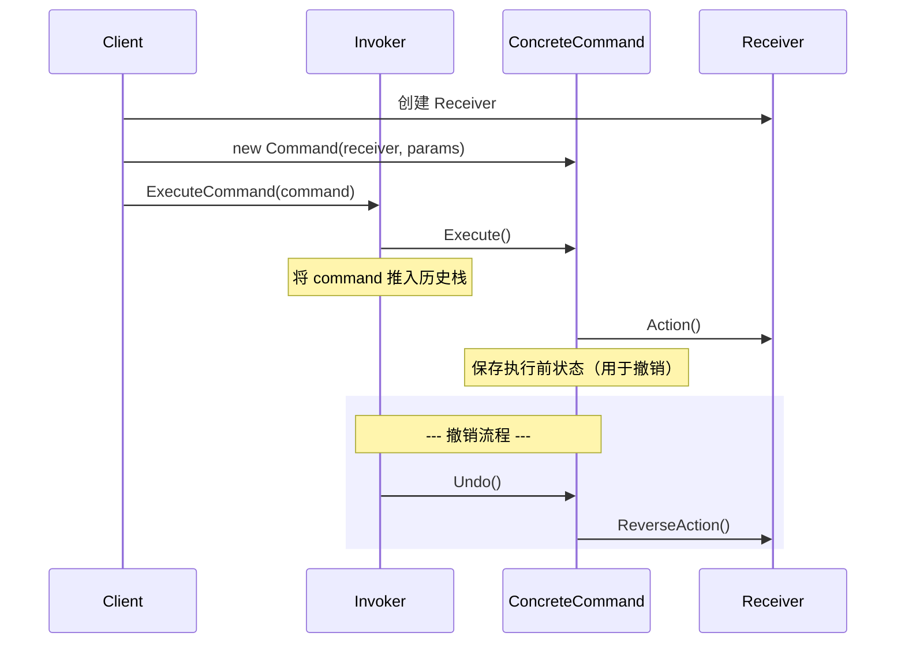

# 命令模式 (Command Pattern)

> 所属计划: [[design-patterns-csharp|设计模式 (C#)]]
> 预计耗时: 60 分钟
> 前置知识: [[16-behavioral-intro|行为型模式总览]]、C# 接口/委托、`Stack<T>` 基础用法

---

## 1. 概念讲解

### 命令模式解决什么问题？

假设你正在开发一个文本编辑器。用户的操作 — 插入文字、加粗、删除 — 需要在以下场景中**被当作对象来对待**：

- **撤销/重做**：需要记住"做了什么"以及"如何恢复"
- **操作队列**：批量执行、异步调度、节流
- **操作日志**：审计、重放、崩溃恢复
- **宏命令**：将一组操作打包成单个操作

如果每个操作都写成方法调用 — `document.Insert(text)`、`document.Bold()` — 你没有任何统一的方式来存储、排队或撤销它们。

**命令模式的核心思想**：将请求（方法调用）封装为一个独立的对象，从而使你可以参数化客户端、排队或记录请求日志、以及支持可撤销的操作。

```
┌──────────────────────────────────────────────────────────┐
│  无命令模式                                               │
│  Client ──→ document.Insert(text)                        │
│            → document.Bold()                             │
│            → document.Delete()                           │
│  问题：无法统一存储/排队/撤销这些调用                        │
└──────────────────────────────────────────────────────────┘
                          ↓
┌──────────────────────────────────────────────────────────┐
│  有命令模式                                               │
│  Client ──→ new InsertCommand(text)                      │
│            → new BoldCommand()                           │
│            → new DeleteCommand()                         │
│              ↓                                           │
│         command.Execute()  统一接口                       │
│         command.Undo()     统一撤销                       │
│  每个命令是一个对象，可以被存储、排队、延迟、重放             │
└──────────────────────────────────────────────────────────┘
```

### 命令模式 GoF 结构



**关键角色：**

| 角色 | 职责 |
|------|------|
| `ICommand` | 声明执行操作的接口（`Execute` / `Undo`） |
| `ConcreteCommand` | 绑定 Receiver 和操作，实现 `Execute` 调用 Receiver 的方法 |
| `Invoker` | 持有命令对象，在适当时机调用 `command.Execute()` |
| `Receiver` | 知道如何执行业务逻辑（真正干活的对象） |
| `Client` | 创建 ConcreteCommand 并设置其 Receiver |

### 命令模式交互流程



> [!tip] 解耦的关键
> `Invoker` 只知道 `ICommand` 接口 — 它不知道 Receiver 的存在，也不知道具体做了什么操作。这就是命令模式的核心解耦：**调用者与执行者完全隔离**。

### 命令模式 vs 策略模式

这是一个经典混淆点，两份模式都有一个"可替换的操作对象"，但意图完全不同：

| 维度 | 命令模式 | [[24-strategy|策略模式]] |
|------|---------|------|
| **核心问题** | **何时/什么**：将操作封装为对象以便存储、排队、撤销 | **如何做**：在运行时选择算法实现 |
| **关注点** | 操作的**生命周期管理**（undo/redo/queue/log） | 算法的**可替换性** |
| **调用方向** | Client → Invoker → Command → Receiver | Client → Context → Strategy |
| **典型操作** | `Execute()` / `Undo()` | `Execute()` / `Calculate()` |
| **状态** | 命令通常**持有执行所需的状态**（撤销用） | 策略通常**无状态**（纯算法） |
| **C# 惯用** | `ICommand`、`Action<T>` + 撤销逻辑 | `Func<T, TResult>`、委托注入 |

> [!warning] 判断标准
> 如果你需要 undo/redo/队列/日志 → 命令模式。如果只是想在运行时切换算法 → 策略模式。

---

## 2. 代码示例

### 2.1 文本编辑器：可撤销命令 + 撤销栈

**场景**：文本编辑器支持插入、删除、加粗操作，每种操作都可以撤销。Invoker 维护一个命令历史栈。

```csharp
// ============================================
// 1. Receiver — 文档（真正的业务逻辑）
// ============================================
public class Document
{
    public string Text { get; private set; } = "";
    public List<int> BoldPositions { get; } = new();

    public void Insert(int position, string text)
    {
        Text = Text.Insert(position, text);
    }

    public void Delete(int position, int length)
    {
        Text = Text.Remove(position, length);
    }

    public void Bold(int position, int length)
    {
        for (int i = position; i < position + length; i++)
            if (!BoldPositions.Contains(i))
                BoldPositions.Add(i);
    }

    public void Unbold(int position, int length)
    {
        for (int i = position; i < position + length; i++)
            BoldPositions.Remove(i);
    }
}
```

```csharp
// ============================================
// 2. ICommand 接口
// ============================================
public interface ICommand
{
    void Execute();
    void Undo();
    string Description { get; } // 用于日志/UI 显示
}
```

```csharp
// ============================================
// 3. Concrete Commands
// ============================================

// 插入命令 — 记录插入的位置和内容，以便撤销时删除
public class InsertCommand : ICommand
{
    private readonly Document _document;
    private readonly int _position;
    private readonly string _text;

    public string Description => $"插入 \"{_text}\" 于位置 {_position}";

    public InsertCommand(Document document, int position, string text)
    {
        _document = document;
        _position = position;
        _text = text;
    }

    public void Execute()
    {
        _document.Insert(_position, _text);
    }

    public void Undo()
    {
        _document.Delete(_position, _text.Length);
    }
}

// 删除命令 — 记录删除前的内容，以便撤销时恢复
public class DeleteCommand : ICommand
{
    private readonly Document _document;
    private readonly int _position;
    private readonly int _length;
    private string _deletedText = ""; // 执行时保存，用于撤销

    public string Description => $"删除 {_length} 字符于位置 {_position}";

    public DeleteCommand(Document document, int position, int length)
    {
        _document = document;
        _position = position;
        _length = length;
    }

    public void Execute()
    {
        // 保存被删除的内容，以便 Undo 时恢复
        _deletedText = _document.Text.Substring(_position, _length);
        _document.Delete(_position, _length);
    }

    public void Undo()
    {
        _document.Insert(_position, _deletedText);
    }
}

// 加粗命令
public class BoldCommand : ICommand
{
    private readonly Document _document;
    private readonly int _position;
    private readonly int _length;

    public string Description => $"加粗 {_length} 字符于位置 {_position}";

    public BoldCommand(Document document, int position, int length)
    {
        _document = document;
        _position = position;
        _length = length;
    }

    public void Execute()
    {
        _document.Bold(_position, _length);
    }

    public void Undo()
    {
        _document.Unbold(_position, _length);
    }
}
```

```csharp
// ============================================
// 4. Invoker — 命令历史管理
// ============================================
public class CommandInvoker
{
    private readonly Stack<ICommand> _history = new();
    private readonly Document _document;

    public CommandInvoker(Document document)
    {
        _document = document;
    }

    public void ExecuteCommand(ICommand command)
    {
        command.Execute();
        _history.Push(command);
    }

    public void Undo()
    {
        if (_history.Count == 0)
        {
            Console.WriteLine("  [Invoker] 没有可撤销的操作");
            return;
        }

        ICommand command = _history.Pop();
        command.Undo();
        Console.WriteLine($"  [Invoker] 已撤销: {command.Description}");
    }

    public void UndoAll()
    {
        while (_history.Count > 0)
            Undo();
    }

    public int HistoryCount => _history.Count;
}
```

```csharp
// ============================================
// 5. Client — 使用演示
// ============================================
var document = new Document();
var invoker = new CommandInvoker(document);

Console.WriteLine("=== 命令模式：文本编辑器撤销演示 ===\n");

// 执行一系列操作
Console.WriteLine("1. 插入 Hello");
invoker.ExecuteCommand(new InsertCommand(document, 0, "Hello"));
Console.WriteLine($"   文档: \"{document.Text}\"");
Console.WriteLine($"   历史深度: {invoker.HistoryCount}\n");

Console.WriteLine("2. 插入 World");
invoker.ExecuteCommand(new InsertCommand(document, 5, " World"));
Console.WriteLine($"   文档: \"{document.Text}\"");
Console.WriteLine($"   历史深度: {invoker.HistoryCount}\n");

Console.WriteLine("3. 加粗 World");
invoker.ExecuteCommand(new BoldCommand(document, 6, 5));
Console.WriteLine($"   文档: \"{document.Text}\"");
Console.WriteLine($"   加粗位置: [{string.Join(", ", document.BoldPositions)}]");
Console.WriteLine($"   历史深度: {invoker.HistoryCount}\n");

// 撤销操作
Console.WriteLine("4. 撤销最后操作（加粗）");
invoker.Undo();
Console.WriteLine($"   文档: \"{document.Text}\"");
Console.WriteLine($"   加粗位置: [{string.Join(", ", document.BoldPositions)}]\n");

Console.WriteLine("5. 撤销（删除 World）");
invoker.Undo();
Console.WriteLine($"   文档: \"{document.Text}\"\n");

Console.WriteLine("6. 撤销（删除 Hello）");
invoker.Undo();
Console.WriteLine($"   文档: \"{document.Text}\"\n");

Console.WriteLine("7. 再次撤销（应提示无操作）");
invoker.Undo();

/* 输出:
=== 命令模式：文本编辑器撤销演示 ===

1. 插入 Hello
   文档: "Hello"
   历史深度: 1

2. 插入 World
   文档: "Hello World"
   历史深度: 2

3. 加粗 World
   文档: "Hello World"
   加粗位置: [6, 7, 8, 9, 10]
   历史深度: 3

4. 撤销最后操作（加粗）
  [Invoker] 已撤销: 加粗 5 字符于位置 6
   文档: "Hello World"
   加粗位置: []

5. 撤销（删除 World）
  [Invoker] 已撤销: 插入 " World" 于位置 5
   文档: "Hello"

6. 撤销（删除 Hello）
  [Invoker] 已撤销: 插入 "Hello" 于位置 0
   文档: ""

7. 再次撤销（应提示无操作）
  [Invoker] 没有可撤销的操作
*/
```

**运行方式：**
```bash
dotnet new console -n CommandTextEditor
# 将上述所有代码按顺序放入 Program.cs
dotnet run --project CommandTextEditor
```

### 2.2 遥控器：设备开关命令

**场景**：一个万能遥控器可以控制多个设备（灯、电视、音响）。每个按钮绑定一个命令对象。支持撤销上一次操作。

```csharp
// ============================================
// 1. Receiver — 各种设备
// ============================================
public class Light
{
    private bool _isOn;

    public void TurnOn()
    {
        _isOn = true;
        Console.WriteLine("  [Light] 💡 灯已开启");
    }

    public void TurnOff()
    {
        _isOn = false;
        Console.WriteLine("  [Light] 🌑 灯已关闭");
    }
}

public class TV
{
    private int _volume = 10;

    public void PowerOn() =>
        Console.WriteLine("  [TV] 📺 电视已开启");

    public void PowerOff() =>
        Console.WriteLine("  [TV] 📺 电视已关闭");

    public void VolumeUp()
    {
        _volume++;
        Console.WriteLine($"  [TV] 🔊 音量增至 {_volume}");
    }

    public void VolumeDown()
    {
        _volume--;
        Console.WriteLine($"  [TV] 🔉 音量降至 {_volume}");
    }
}

public class Stereo
{
    public void On() =>
        Console.WriteLine("  [Stereo] 🎵 音响已开启");

    public void Off() =>
        Console.WriteLine("  [Stereo] 🔇 音响已关闭");
}
```

```csharp
// ============================================
// 2. ICommand + 具体命令
// ============================================
public interface IDeviceCommand
{
    void Execute();
    void Undo();
    string Label { get; }
}

public class LightOnCommand : IDeviceCommand
{
    private readonly Light _light;
    public string Label => "开灯";

    public LightOnCommand(Light light) => _light = light;
    public void Execute() => _light.TurnOn();
    public void Undo() => _light.TurnOff();
}

public class LightOffCommand : IDeviceCommand
{
    private readonly Light _light;
    public string Label => "关灯";

    public LightOffCommand(Light light) => _light = light;
    public void Execute() => _light.TurnOff();
    public void Undo() => _light.TurnOn();
}

public class TVOnCommand : IDeviceCommand
{
    private readonly TV _tv;
    public string Label => "开电视";

    public TVOnCommand(TV tv) => _tv = tv;
    public void Execute() => _tv.PowerOn();
    public void Undo() => _tv.PowerOff();
}

public class TVOffCommand : IDeviceCommand
{
    private readonly TV _tv;
    public string Label => "关电视";

    public TVOffCommand(TV tv) => _tv = tv;
    public void Execute() => _tv.PowerOff();
    public void Undo() => _tv.PowerOn();
}

public class NoCommand : IDeviceCommand
{
    public string Label => "（空）";
    public void Execute() { }
    public void Undo() { }
}
```

```csharp
// ============================================
// 3. Invoker — 遥控器
// ============================================
public class RemoteControl
{
    private readonly IDeviceCommand[] _onCommands;
    private readonly IDeviceCommand[] _offCommands;
    private readonly Stack<IDeviceCommand> _history = new();

    public RemoteControl(int slots)
    {
        _onCommands = new IDeviceCommand[slots];
        _offCommands = new IDeviceCommand[slots];

        var noCommand = new NoCommand();
        for (int i = 0; i < slots; i++)
        {
            _onCommands[i] = noCommand;
            _offCommands[i] = noCommand;
        }
    }

    public void SetCommand(int slot, IDeviceCommand onCommand, IDeviceCommand offCommand)
    {
        _onCommands[slot] = onCommand;
        _offCommands[slot] = offCommand;
    }

    public void PressOn(int slot)
    {
        Console.Write($"  [Remote] 按下插槽 {slot} ON: ");
        _onCommands[slot].Execute();
        _history.Push(_onCommands[slot]);
    }

    public void PressOff(int slot)
    {
        Console.Write($"  [Remote] 按下插槽 {slot} OFF: ");
        _offCommands[slot].Execute();
        _history.Push(_offCommands[slot]);
    }

    public void PressUndo()
    {
        if (_history.Count > 0)
        {
            var cmd = _history.Pop();
            Console.Write("  [Remote] 撤销: ");
            cmd.Undo();
        }
        else
        {
            Console.WriteLine("  [Remote] 没有可撤销的操作");
        }
    }

    public override string ToString()
    {
        var sb = new System.Text.StringBuilder();
        sb.AppendLine("\n===== 遥控器配置 =====");
        for (int i = 0; i < _onCommands.Length; i++)
        {
            sb.AppendLine($"  插槽 {i}: [{_onCommands[i].Label}] / [{_offCommands[i].Label}]");
        }
        return sb.ToString();
    }
}
```

```csharp
// ============================================
// 4. Client — 使用演示
// ============================================
var light = new Light();
var tv = new TV();
var remote = new RemoteControl(2);

// 配置遥控器
remote.SetCommand(0, new LightOnCommand(light), new LightOffCommand(light));
remote.SetCommand(1, new TVOnCommand(tv), new TVOffCommand(tv));

Console.WriteLine(remote);

Console.WriteLine("=== 遥控器命令模式演示 ===\n");

Console.WriteLine("1. 按下插槽 0 ON（开灯）:");
remote.PressOn(0);

Console.WriteLine("\n2. 按下插槽 0 OFF（关灯）:");
remote.PressOff(0);

Console.WriteLine("\n3. 撤销（重新开灯）:");
remote.PressUndo();

Console.WriteLine("\n4. 按下插槽 1 ON（开电视）:");
remote.PressOn(1);

Console.WriteLine("\n5. 按下插槽 1 OFF（关电视）:");
remote.PressOff(1);

Console.WriteLine("\n6. 撤销（重新开电视）:");
remote.PressUndo();

/* 输出:
===== 遥控器配置 =====
  插槽 0: [开灯] / [关灯]
  插槽 1: [开电视] / [关电视]

=== 遥控器命令模式演示 ===

1. 按下插槽 0 ON（开灯）:
  [Remote] 按下插槽 0 ON:   [Light] 💡 灯已开启

2. 按下插槽 0 OFF（关灯）:
  [Remote] 按下插槽 0 OFF:   [Light] 🌑 灯已关闭

3. 撤销（重新开灯）:
  [Remote] 撤销:   [Light] 💡 灯已开启

4. 按下插槽 1 ON（开电视）:
  [Remote] 按下插槽 1 ON:   [TV] 📺 电视已开启

5. 按下插槽 1 OFF（关电视）:
  [Remote] 按下插槽 1 OFF:   [TV] 📺 电视已关闭

6. 撤销（重新开电视）:
  [Remote] 撤销:   [TV] 📺 电视已开启
*/
```

**运行方式：**
```bash
dotnet new console -n CommandRemoteControl
# 将上述代码按顺序放入 Program.cs
dotnet run --project CommandRemoteControl
```

### 2.3 C# 惯用：`System.Windows.Input.ICommand`（WPF / MAUI）

在 WPF 和 .NET MAUI 中，命令模式是 UI 架构的核心。`ICommand` 接口（位于 `System.Windows.Input`）将用户操作（按钮点击、菜单项）封装为命令对象，实现 **View 和 ViewModel 的解耦**。

```csharp
// ============================================
// WPF / MAUI 中的 ICommand 定义（示意）
// ============================================
// 框架内置接口（你不需要自己定义，直接引用即可）：
//
// public interface ICommand
// {
//     event EventHandler? CanExecuteChanged;
//     bool CanExecute(object? parameter);
//     void Execute(object? parameter);
// }

// RelayCommand — MVVM 中最常见的 ICommand 实现
public class RelayCommand : System.Windows.Input.ICommand
{
    private readonly Action<object?> _execute;
    private readonly Func<object?, bool>? _canExecute;

    public RelayCommand(Action<object?> execute, Func<object?, bool>? canExecute = null)
    {
        _execute = execute ?? throw new ArgumentNullException(nameof(execute));
        _canExecute = canExecute;
    }

    public event EventHandler? CanExecuteChanged
    {
        add => System.Windows.Input.CommandManager.RequerySuggested += value;
        remove => System.Windows.Input.CommandManager.RequerySuggested -= value;
    }

    public bool CanExecute(object? parameter)
        => _canExecute?.Invoke(parameter) ?? true;

    public void Execute(object? parameter)
        => _execute(parameter);

    // 便捷重载：无参数版本
    public RelayCommand(Action execute, Func<bool>? canExecute = null)
        : this(_ => execute(), canExecute != null ? _ => canExecute() : null)
    {
    }
}
```

```csharp
// ============================================
// ViewModel — 使用 RelayCommand
// ============================================
public class TextEditorViewModel
{
    private string _text = "";
    private readonly Stack<ICommand> _undoStack = new();

    public string Text
    {
        get => _text;
        set
        {
            _text = value;
            Console.WriteLine($"  [ViewModel] 文本: \"{_text}\"");
        }
    }

    // 这些命令可以直接绑定到 WPF Button 的 Command 属性
    public RelayCommand InsertHelloCommand { get; }
    public RelayCommand ClearCommand { get; }
    public RelayCommand UndoCommand { get; }

    public TextEditorViewModel()
    {
        InsertHelloCommand = new RelayCommand(InsertHello, CanInsertHello);
        ClearCommand = new RelayCommand(Clear, CanClear);
        UndoCommand = new RelayCommand(Undo, CanUndo);
    }

    private void InsertHello()
    {
        var cmd = new InsertTextCommand(this, "Hello");
        cmd.Execute();
        _undoStack.Push(cmd);
    }

    private bool CanInsertHello() => true;

    private void Clear()
    {
        var cmd = new ClearTextCommand(this);
        cmd.Execute();
        _undoStack.Push(cmd);
    }

    private bool CanClear() => !string.IsNullOrEmpty(Text);

    private void Undo()
    {
        if (_undoStack.Count > 0)
        {
            var cmd = _undoStack.Pop();
            // ICommand.Execute 没有 Undo — 这里需要自定义 IUndoableCommand
            if (cmd is IUndoableCommand undoable)
                undoable.Undo();
        }
    }

    private bool CanUndo() => _undoStack.Count > 0;

    // 自定义可撤销命令接口
    private interface IUndoableCommand { void Undo(); }

    private class InsertTextCommand : ICommand, IUndoableCommand
    {
        private readonly TextEditorViewModel _vm;
        private readonly string _text;
        private string _previous = "";

        public InsertTextCommand(TextEditorViewModel vm, string text)
        {
            _vm = vm; _text = text;
        }

        public event EventHandler? CanExecuteChanged;
        public bool CanExecute(object? p) => true;
        public void Execute(object? p)
        {
            _previous = _vm.Text;
            _vm.Text = _vm.Text + _text;
        }
        public void Undo() => _vm.Text = _previous;
    }

    private class ClearTextCommand : ICommand, IUndoableCommand
    {
        private readonly TextEditorViewModel _vm;
        private string _previous = "";

        public ClearTextCommand(TextEditorViewModel vm) { _vm = vm; }

        public event EventHandler? CanExecuteChanged;
        public bool CanExecute(object? p) => !string.IsNullOrEmpty(_vm.Text);
        public void Execute(object? p)
        {
            _previous = _vm.Text;
            _vm.Text = "";
        }
        public void Undo() => _vm.Text = _previous;
    }
}
```

```csharp
// ============================================
// 使用演示（模拟 WPF 绑定）
// ============================================
Console.WriteLine("=== WPF ICommand 模拟演示 ===\n");

var vm = new TextEditorViewModel();

Console.WriteLine("1. 点击「插入 Hello」按钮（模拟用户操作）:");

// WPF 中：CanExecute 自动控制按钮启用/禁用；在这里手动检查
if (vm.InsertHelloCommand.CanExecute(null))
    vm.InsertHelloCommand.Execute(null);

Console.WriteLine("\n2. 再次插入 Hello:");
vm.InsertHelloCommand.Execute(null);

Console.WriteLine("\n3. 点击「撤销」按钮:");
if (vm.UndoCommand.CanExecute(null))
    vm.UndoCommand.Execute(null);

Console.WriteLine("\n4. 点击「清空」按钮:");
if (vm.ClearCommand.CanExecute(null))
    vm.ClearCommand.Execute(null);

Console.WriteLine("\n5. 撤销清空:");
vm.UndoCommand.Execute(null);

/* 输出:
=== WPF ICommand 模拟演示 ===

1. 点击「插入 Hello」按钮（模拟用户操作）:
  [ViewModel] 文本: "Hello"

2. 再次插入 Hello:
  [ViewModel] 文本: "HelloHello"

3. 点击「撤销」按钮:
  [ViewModel] 文本: "Hello"

4. 点击「清空」按钮:
  [ViewModel] 文本: ""

5. 撤销清空:
  [ViewModel] 文本: "Hello"
*/
```

> [!tip] MVVM 框架中的命令
> 大多数 MVVM 框架（CommunityToolkit.Mvvm、Prism、ReactiveUI）都提供了 `RelayCommand` / `DelegateCommand` 的实现。CommunityToolkit.Mvvm 更进一步：在方法上加 `[RelayCommand]` 特性，**源代码生成器自动生成命令属性** — 一行手写代码都没有。

> [!warning] WPF `ICommand` 的局限
> 标准的 `ICommand` 没有 `Undo()` 方法 — GoF 的命令模式比 WPF 的 `ICommand` 更丰富。在以 undo/redo 为核心的场景中，需要扩展接口。

### 2.4 C# 惯用：`Action<T>` / `Func<T>` 作为轻量命令

当你不需要完整的 undo/redo/队列基础设施时，C# 的委托类型可以直接充当"轻量命令对象"：

```csharp
// ============================================
// 场景: 简单的操作日志系统
// ============================================

// 用 Action 作为轻量命令 — 无需定义 ICommand 接口
public class ActionLogger
{
    private readonly List<(string Description, Action Action)> _commands = new();
    private readonly List<string> _log = new();

    public void Register(string description, Action action)
    {
        _commands.Add((description, action));
    }

    public void Execute(string description)
    {
        var cmd = _commands.FirstOrDefault(c => c.Description == description);
        if (cmd != default)
        {
            cmd.Action();
            _log.Add($"[{DateTime.Now:T}] 执行: {cmd.Description}");
        }
    }

    public void ExecuteAll()
    {
        foreach (var (desc, action) in _commands)
        {
            action();
            _log.Add($"[{DateTime.Now:T}] 执行: {desc}");
        }
    }

    public void PrintLog()
    {
        Console.WriteLine("=== 操作日志 ===");
        foreach (var entry in _log)
            Console.WriteLine($"  {entry}");
    }
}
```

```csharp
// 使用 Func<T> 作为带返回值的轻量命令
public class Calculator
{
    // 将运算封装为 Func，可以存储、传递、组合
    private readonly Dictionary<string, Func<int, int, int>> _operations = new()
    {
        ["add"] = (a, b) => a + b,
        ["sub"] = (a, b) => a - b,
        ["mul"] = (a, b) => a * b,
        ["div"] = (a, b) => b != 0 ? a / b : throw new DivideByZeroException(),
    };

    public int Calculate(string op, int a, int b)
    {
        if (!_operations.TryGetValue(op, out var func))
            throw new ArgumentException($"未知操作: {op}");
        return func(a, b);
    }

    // 运行时注册新操作（策略模式 + 命令模式的融合）
    public void RegisterOperation(string name, Func<int, int, int> operation)
    {
        _operations[name] = operation;
    }
}
```

```csharp
// ============================================
// Action<T> 作为可撤销命令 — 需要成对提供 do/undo
// ============================================
public class UndoableAction<T> where T : ICloneable
{
    private readonly Action<T> _do;
    private readonly Action<T> _undo;
    private readonly string _label;
    private T _before = default!;

    public UndoableAction(string label, Action<T> doAction, Action<T> undoAction)
    {
        _label = label;
        _do = doAction;
        _undo = undoAction;
    }

    public void Execute(T state)
    {
        _before = (T)state.Clone(); // 快照，用于撤销
        _do(state);
        Console.WriteLine($"  [Action] 执行: {_label}");
    }

    public void Undo()
    {
        _undo(_before);
        Console.WriteLine($"  [Action] 撤销: {_label}");
    }
}

// ===== 使用演示 =====
using ActionLoggerDemo;

Console.WriteLine("=== Action/Func 轻量命令演示 ===\n");

// 1. Action 作为命令
var logger = new ActionLogger();
var counter = 0;

logger.Register("递增", () =>
{
    counter++;
    Console.WriteLine($"  counter = {counter}");
});

logger.Register("重置", () =>
{
    counter = 0;
    Console.WriteLine($"  counter 已重置");
});

Console.WriteLine("执行命令:");
logger.Execute("递增");
logger.Execute("递增");
logger.Execute("重置");
logger.Execute("递增");
logger.PrintLog();

// 2. Func 作为计算命令
Console.WriteLine();
var calc = new Calculator();
Console.WriteLine($"10 + 5 = {calc.Calculate("add", 10, 5)}");
Console.WriteLine($"10 * 5 = {calc.Calculate("mul", 10, 5)}");

// 运行时注册
calc.RegisterOperation("pow", (a, b) => (int)Math.Pow(a, b));
Console.WriteLine($"2^10 = {calc.Calculate("pow", 2, 10)}");

/* 输出:
=== Action/Func 轻量命令演示 ===

执行命令:
  counter = 1
  counter = 2
  counter 已重置
  counter = 1
=== 操作日志 ===
  [14:30:01] 执行: 递增
  [14:30:01] 执行: 递增
  [14:30:01] 执行: 重置
  [14:30:01] 执行: 递增

10 + 5 = 15
10 * 5 = 50
2^10 = 1024
*/
```

> [!tip] 何时用委托 vs 接口
> - **`Action`/`Func`**：命令简单、不需要继承、不需要 undo 时 — 代码量最少
> - **`ICommand` 接口**：需要 Undo/Redo、命令队列、日志、序列化 — 提供统一抽象
> - **经验法则**：如果你发现自己为每个命令创建了只含一个 Action 的类 → 用委托。如果命令需要额外状态/行为 → 用接口。

---


## C++ 实现

C++ 中用纯虚接口 `ICommand` + 具体命令持有 `Receiver` 引用来解耦调用者与执行者。`Invoker` 用 `std::stack<shared_ptr<ICommand>>` 管理撤销历史，RAII 保证命令对象生命周期安全。

```cpp
#include <iostream>
#include <memory>
#include <stack>
#include <string>
using namespace std;

// ============================================================
// 1. Receiver — 真正执行操作的对象
// ============================================================
class Light {
    string name;
public:
    explicit Light(string n) : name(move(n)) {}
    void on()  { cout << "[" << name << "] 灯已打开" << endl; }
    void off() { cout << "[" << name << "] 灯已关闭" << endl; }
};

// ============================================================
// 2. ICommand 接口 — 统一 execute / undo
// ============================================================
class ICommand {
public:
    virtual ~ICommand() = default;
    virtual void execute() = 0;
    virtual void undo() = 0;
};

// ============================================================
// 3. 具体命令
// ============================================================
class LightOnCommand : public ICommand {
    Light& light;
public:
    explicit LightOnCommand(Light& l) : light(l) {}
    void execute() override { light.on(); }
    void undo() override    { light.off(); }
};

class LightOffCommand : public ICommand {
    Light& light;
public:
    explicit LightOffCommand(Light& l) : light(l) {}
    void execute() override { light.off(); }
    void undo() override    { light.on(); }
};

// ============================================================
// 4. Invoker — RemoteControl，持有命令插槽 + 撤销栈
// ============================================================
class RemoteControl {
    static constexpr int SLOTS = 4;
    shared_ptr<ICommand> slots[SLOTS];
    stack<shared_ptr<ICommand>> undoStack;
public:
    void setCommand(int slot, shared_ptr<ICommand> cmd) {
        if (slot >= 0 && slot < SLOTS) slots[slot] = move(cmd);
    }

    void pressButton(int slot) {
        if (slot >= 0 && slot < SLOTS && slots[slot]) {
            slots[slot]->execute();
            undoStack.push(slots[slot]);
        }
    }

    void pressUndo() {
        if (undoStack.empty()) {
            cout << "[Remote] 无可撤销操作" << endl;
            return;
        }
        cout << "[Remote] 撤销上一步操作..." << endl;
        undoStack.top()->undo();
        undoStack.pop();
    }
};

// === main / usage ===
int main() {
    Light livingRoom("客厅灯");
    Light kitchen("厨房灯");

    auto livingOn  = make_shared<LightOnCommand>(livingRoom);
    auto livingOff = make_shared<LightOffCommand>(livingRoom);
    auto kitchenOn = make_shared<LightOnCommand>(kitchen);

    RemoteControl remote;
    remote.setCommand(0, livingOn);
    remote.setCommand(1, livingOff);
    remote.setCommand(2, kitchenOn);

    cout << "=== 按下按钮 ===" << endl;
    remote.pressButton(0); // 开客厅灯
    remote.pressButton(2); // 开厨房灯
    remote.pressButton(1); // 关客厅灯

    cout << "\n=== 撤销操作 ===" << endl;
    remote.pressUndo();    // 撤销关灯 → 开客厅灯
    remote.pressUndo();    // 撤销开厨房灯 → 关厨房灯
    remote.pressUndo();    // 撤销开客厅灯 → 关客厅灯
    remote.pressUndo();    // 无可撤销

    return 0;
}
```

**编译运行：**
```bash
g++ -std=c++17 -o prog main.cpp && ./prog
```

**预期输出：**
```text
=== 按下按钮 ===
[客厅灯] 灯已打开
[厨房灯] 灯已打开
[客厅灯] 灯已关闭

=== 撤销操作 ===
[Remote] 撤销上一步操作...
[客厅灯] 灯已打开
[Remote] 撤销上一步操作...
[厨房灯] 灯已关闭
[Remote] 撤销上一步操作...
[客厅灯] 灯已关闭
[Remote] 无可撤销操作
```

## 3. 练习

### 练习 1：宏命令（Macro Command）

**难度**: ⭐⭐ 中等

实现一个 `MacroCommand` 类，它本身也是一个 `ICommand`，但内部包含一个命令列表。执行宏命令时，按顺序执行所有子命令；撤销时**逆序**撤销所有子命令。

**要求**：
- `MacroCommand` 实现 `ICommand` 接口
- 构造函数接受 `IEnumerable<ICommand>` 或逐步添加 `Add(ICommand)`
- `Execute()` 按正序执行所有子命令
- `Undo()` 按逆序撤销所有子命令
- 在 2.1 的文本编辑器中测试：创建一个"插入 Hello + 插入 World + 加粗"的宏，然后一次性撤销

**提示**：
```csharp
public class MacroCommand : ICommand
{
    private readonly List<ICommand> _commands = new();
    // 你的实现
}
```

### 练习 2：添加 Redo 支持

**难度**: ⭐⭐ 中等

在 2.1 的 `CommandInvoker` 中添加 redo（重做）功能。

**要求**：
- 添加 `Redo()` 方法：重新执行最近被撤销的命令
- 撤销后如果执行了新命令，清空 redo 栈（标准行为）
- 修改客户端演示代码，展示 undo → redo → undo → 新操作 → redo 不可用的流程
- 可选：限制历史栈大小（如最多 100 个操作），防止内存无限增长

**提示**：
```csharp
public class CommandInvoker
{
    private readonly Stack<ICommand> _undoStack = new();
    private readonly Stack<ICommand> _redoStack = new(); // ← 新增
    // ...
}
```

### 练习 3：异步命令队列

**难度**: ⭐⭐⭐ 困难

实现一个异步命令队列，支持将命令加入队列并按序异步执行。

**要求**：
- 创建 `IAsyncCommand` 接口：`Task ExecuteAsync()` + `Task UndoAsync()`
- 创建 `AsyncCommandQueue` 类：使用 `Channel<T>`（或 `BlockingCollection<T>`）作为命令缓冲区
- 后台持续消费队列中的命令，逐个 `await ExecuteAsync()`
- 支持 `Enqueue(IAsyncCommand)`
- 支持 `UndoLast()` — 撤销最近完成执行的命令
- 模拟场景：文件批量处理（复制/移动/删除），每个操作 1 秒延迟

**提示**：
```csharp
public interface IAsyncCommand
{
    Task ExecuteAsync();
    Task UndoAsync();
    string Description { get; }
}

public class AsyncCommandQueue
{
    private readonly Channel<IAsyncCommand> _channel;
    private readonly Stack<IAsyncCommand> _completed = new();
    // 你的实现：后台 Task 消费 channel
}
```

---

## 3.5 参考答案

> [!tip]- 练习 1 参考答案
>
> ```csharp
> using System;
> using System.Collections.Generic;
> using System.Linq;
>
> // ============================================
> // MacroCommand — 实现 ICommand 的命令组合
> // ============================================
> public class MacroCommand : ICommand
> {
>     private readonly List<ICommand> _commands = new();
>
>     public string Description => $"宏命令 ({_commands.Count} 个子命令)";
>
>     public MacroCommand() { }
>
>     public MacroCommand(IEnumerable<ICommand> commands)
>     {
>         _commands.AddRange(commands);
>     }
>
>     public void Add(ICommand command)
>     {
>         _commands.Add(command);
>     }
>
>     /// <summary>按正序执行所有子命令</summary>
>     public void Execute()
>     {
>         Console.WriteLine($"  [Macro] 开始执行 {_commands.Count} 个子命令:");
>         for (int i = 0; i < _commands.Count; i++)
>         {
>             Console.WriteLine($"    [{i + 1}/{_commands.Count}] {_commands[i].Description}");
>             _commands[i].Execute();
>         }
>         Console.WriteLine($"  [Macro] 全部子命令执行完成 ✓");
>     }
>
>     /// <summary>按逆序撤销所有子命令</summary>
>     public void Undo()
>     {
>         Console.WriteLine($"  [Macro] 开始逆序撤销 {_commands.Count} 个子命令:");
>         for (int i = _commands.Count - 1; i >= 0; i--)
>         {
>             Console.WriteLine($"    [{_commands.Count - i}/{_commands.Count}] 撤销: {_commands[i].Description}");
>             _commands[i].Undo();
>         }
>         Console.WriteLine($"  [Macro] 全部子命令撤销完成 ✓");
>     }
> }
>
> // ============================================
> // 验证：在文本编辑器中测试 插入 Hello + 插入 World + 加粗
> // ============================================
> var doc = new Document();
> var invoker = new CommandInvoker(doc);
>
> Console.WriteLine("=== 宏命令演示 ===\n");
>
> // 创建宏命令
> var macro = new MacroCommand();
> macro.Add(new InsertCommand(doc, 0, "Hello"));
> macro.Add(new InsertCommand(doc, 5, " World"));
> macro.Add(new BoldCommand(doc, 0, 5));  // 加粗 Hello
>
> Console.WriteLine("1. 执行宏命令:");
> invoker.ExecuteCommand(macro);
> Console.WriteLine($"   文档: \"{doc.Text}\"");
> Console.WriteLine($"   加粗位置: [{string.Join(", ", doc.BoldPositions)}]");
> Console.WriteLine($"   历史深度: {invoker.HistoryCount}\n");
>
> // 一次性撤销（逆序：先取消加粗 → 删除 World → 删除 Hello）
> Console.WriteLine("2. 撤销宏命令:");
> invoker.Undo();
> Console.WriteLine($"   文档: \"{doc.Text}\"");
> Console.WriteLine($"   加粗位置: [{string.Join(", ", doc.BoldPositions)}]");
> Console.WriteLine($"   历史深度: {invoker.HistoryCount}\n");
>
> // 也可以逐步添加子命令
> var macro2 = new MacroCommand();
> macro2.Add(new InsertCommand(doc, 0, "CSharp "));
> macro2.Add(new InsertCommand(doc, 7, "Rocks"));
>
> Console.WriteLine("3. 执行第二个宏命令:");
> invoker.ExecuteCommand(macro2);
> Console.WriteLine($"   文档: \"{doc.Text}\"");
>
> Console.WriteLine("4. 撤销第二个宏命令:");
> invoker.Undo();
> Console.WriteLine($"   文档: \"{doc.Text}\"");
> ```
>
> **关键点**：
> - `MacroCommand` 实现 `ICommand`——它是 Composite 模式在命令模式中的应用（组合命令）
> - `Execute()` 正序遍历，`Undo()` 逆序遍历——符合"后进先出"的撤销语义
> - `MacroCommand` 被推入 `Invoker._history` 作为一个整体——撤销时一次性回滚所有子命令
> - 可用构造函数批量传入或 `Add()` 逐步构建——两种方式等价

> [!tip]- 练习 2 参考答案
>
> ```csharp
> using System;
> using System.Collections.Generic;
>
> // ============================================
> // CommandInvoker — 支持 Undo/Redo
> // ============================================
> public class CommandInvoker
> {
>     private readonly Stack<ICommand> _undoStack = new();
>     private readonly Stack<ICommand> _redoStack = new();
>     private readonly int _maxHistory;
>
>     public CommandInvoker(int maxHistory = 100)
>     {
>         _maxHistory = maxHistory;
>     }
>
>     public void ExecuteCommand(ICommand command)
>     {
>         command.Execute();
>         _undoStack.Push(command);
>
>         // 关键：执行新命令时清空 redo 栈（标准行为）
>         _redoStack.Clear();
>
>         // 限制历史栈大小
>         if (_undoStack.Count > _maxHistory)
>         {
>             // 将最旧的命令移出（无法再撤销）
>             var old = _undoStack.ToArray()[_undoStack.Count - 1];
>             // 简易处理：重建栈（Stack 不支持从底部移除）
>             var temp = new Stack<ICommand>(_undoStack.Take(_maxHistory).Reverse());
>             _undoStack.Clear();
>             foreach (var cmd in temp.Reverse())
>                 _undoStack.Push(cmd);
>         }
>     }
>
>     public void Undo()
>     {
>         if (_undoStack.Count == 0)
>         {
>             Console.WriteLine("  [Invoker] 没有可撤销的操作");
>             return;
>         }
>
>         ICommand command = _undoStack.Pop();
>         command.Undo();
>         _redoStack.Push(command);
>         Console.WriteLine($"  [Invoker] 已撤销: {command.Description}");
>     }
>
>     public void Redo()
>     {
>         if (_redoStack.Count == 0)
>         {
>             Console.WriteLine("  [Invoker] 没有可重做的操作");
>             return;
>         }
>
>         ICommand command = _redoStack.Pop();
>         command.Execute();
>         _undoStack.Push(command);
>         Console.WriteLine($"  [Invoker] 已重做: {command.Description}");
>     }
>
>     public int UndoCount => _undoStack.Count;
>     public int RedoCount => _redoStack.Count;
> }
>
> // ============================================
> // 验证：展示 Undo → Redo → Undo → 新操作 → Redo 不可用
> // ============================================
> var doc = new Document();
> var invoker = new CommandInvoker(maxHistory: 100);
>
> Console.WriteLine("=== 撤销/重做演示 ===\n");
>
> Console.WriteLine("--- 步骤 1：执行 3 个操作 ---");
> invoker.ExecuteCommand(new InsertCommand(doc, 0, "A"));
> Console.WriteLine($"  文档: \"{doc.Text}\"");
>
> invoker.ExecuteCommand(new InsertCommand(doc, 1, "B"));
> Console.WriteLine($"  文档: \"{doc.Text}\"");
>
> invoker.ExecuteCommand(new InsertCommand(doc, 2, "C"));
> Console.WriteLine($"  文档: \"{doc.Text}\"");
> Console.WriteLine($"  Undo: {invoker.UndoCount}, Redo: {invoker.RedoCount}\n");
>
> Console.WriteLine("--- 步骤 2：撤销两次 ---");
> invoker.Undo();  // 撤销 C
> Console.WriteLine($"  文档: \"{doc.Text}\"");
> invoker.Undo();  // 撤销 B
> Console.WriteLine($"  文档: \"{doc.Text}\"");
> Console.WriteLine($"  Undo: {invoker.UndoCount}, Redo: {invoker.RedoCount}\n");
>
> Console.WriteLine("--- 步骤 3：重做一次 ---");
> invoker.Redo();  // 重做 B
> Console.WriteLine($"  文档: \"{doc.Text}\"");
> Console.WriteLine($"  Undo: {invoker.UndoCount}, Redo: {invoker.RedoCount}\n");
>
> Console.WriteLine("--- 步骤 4：执行新操作（插入 X）---");
> invoker.ExecuteCommand(new InsertCommand(doc, 0, "X"));
> Console.WriteLine($"  文档: \"{doc.Text}\"");
> Console.WriteLine($"  Undo: {invoker.UndoCount}, Redo: {invoker.RedoCount}\n");
>
> Console.WriteLine("--- 步骤 5：尝试重做（应不可用，因为 redo 栈已被清空）---");
> invoker.Redo();
> Console.WriteLine($"  Undo: {invoker.UndoCount}, Redo: {invoker.RedoCount}");
> ```
>
> **关键点**：
> - 两个栈：`_undoStack` 和 `_redoStack`
> - `Undo()`：弹出 undo 栈 → 执行 Undo → 推入 redo 栈
> - `Redo()`：弹出 redo 栈 → 执行 Execute → 推入 undo 栈
> - 执行新命令时清空 redo 栈——这是标准行为（Word、VS Code 都是如此：撤销后做了新操作，之前被撤销的操作无法再重做）
> - `_maxHistory` 限制历史深度——避免长时间运行内存溢出。栈的底部移除实现较粗糙，生产环境可用 `LinkedList<ICommand>` 或自定义环形缓冲区

> [!tip]- 练习 3 参考答案
>
> ```csharp
> using System;
> using System.Collections.Generic;
> using System.Threading.Channels;
> using System.Threading.Tasks;
>
> // ============================================
> // IAsyncCommand 接口
> // ============================================
> public interface IAsyncCommand
> {
>     Task ExecuteAsync();
>     Task UndoAsync();
>     string Description { get; }
> }
>
> // ============================================
> // 具体异步命令 — 文件操作模拟
> // ============================================
> public class CopyFileCommand : IAsyncCommand
> {
>     private readonly string _source;
>     private readonly string _dest;
>
>     public string Description => $"复制文件: {_source} → {_dest}";
>
>     public CopyFileCommand(string source, string dest)
>     {
>         _source = source; _dest = dest;
>     }
>
>     public async Task ExecuteAsync()
>     {
>         Console.WriteLine($"  [Copy] 开始 {_source} → {_dest}");
>         await Task.Delay(1000); // 模拟 I/O
>         Console.WriteLine($"  [Copy] 完成 ✓");
>     }
>
>     public async Task UndoAsync()
>     {
>         Console.WriteLine($"  [Copy-Undo] 删除 {_dest}");
>         await Task.Delay(500);
>         Console.WriteLine($"  [Copy-Undo] 完成 ✓");
>     }
> }
>
> public class MoveFileCommand : IAsyncCommand
> {
>     private readonly string _source;
>     private readonly string _dest;
>
>     public string Description => $"移动文件: {_source} → {_dest}";
>
>     public MoveFileCommand(string source, string dest)
>     {
>         _source = source; _dest = dest;
>     }
>
>     public async Task ExecuteAsync()
>     {
>         Console.WriteLine($"  [Move] 开始 {_source} → {_dest}");
>         await Task.Delay(1000);
>         Console.WriteLine($"  [Move] 完成 ✓");
>     }
>
>     public async Task UndoAsync()
>     {
>         Console.WriteLine($"  [Move-Undo] 移回 {_dest} → {_source}");
>         await Task.Delay(500);
>         Console.WriteLine($"  [Move-Undo] 完成 ✓");
>     }
> }
>
> public class DeleteFileCommand : IAsyncCommand
> {
>     private readonly string _path;
>
>     public string Description => $"删除文件: {_path}";
>
>     public DeleteFileCommand(string path) => _path = path;
>
>     public async Task ExecuteAsync()
>     {
>         Console.WriteLine($"  [Delete] 删除 {_path}");
>         await Task.Delay(1000);
>         Console.WriteLine($"  [Delete] 完成 ✓");
>     }
>
>     public async Task UndoAsync()
>     {
>         // 实际场景中需要在 ExecuteAsync 时先备份到回收站
>         Console.WriteLine($"  [Delete-Undo] 从回收站恢复 {_path}");
>         await Task.Delay(500);
>         Console.WriteLine($"  [Delete-Undo] 完成 ✓");
>     }
> }
>
> // ============================================
> // AsyncCommandQueue — 异步命令队列
> // ============================================
> public class AsyncCommandQueue : IAsyncDisposable
> {
>     private readonly Channel<IAsyncCommand> _channel;
>     private readonly Stack<IAsyncCommand> _completed = new();
>     private readonly Task _consumerTask;
>     private readonly CancellationTokenSource _cts = new();
>
>     public AsyncCommandQueue(int capacity = 100)
>     {
>         _channel = Channel.CreateBounded<IAsyncCommand>(new BoundedChannelOptions(capacity)
>         {
>             FullMode = BoundedChannelFullMode.Wait  // 队列满时生产者等待
>         });
>
>         // 启动后台消费循环
>         _consumerTask = Task.Run(() => ConsumeLoop(_cts.Token));
>     }
>
>     /// <summary>将命令加入队列</summary>
>     public async ValueTask Enqueue(IAsyncCommand command)
>     {
>         Console.WriteLine($"[Queue] 入队: {command.Description}");
>         await _channel.Writer.WriteAsync(command, _cts.Token);
>     }
>
>     /// <summary>撤销最近完成执行的命令</summary>
>     public async Task UndoLast()
>     {
>         if (_completed.Count == 0)
>         {
>             Console.WriteLine("[Queue] 没有可撤销的异步命令");
>             return;
>         }
>
>         var command = _completed.Pop();
>         Console.WriteLine($"[Queue] 撤销: {command.Description}");
>         await command.UndoAsync();
>     }
>
>     public int PendingCount => _channel.Reader.Count;
>     public int CompletedCount => _completed.Count;
>
>     private async Task ConsumeLoop(CancellationToken ct)
>     {
>         Console.WriteLine("[Queue] 消费者已启动");
>
>         await foreach (var command in _channel.Reader.ReadAllAsync(ct))
>         {
>             Console.WriteLine($"[Queue] 开始执行: {command.Description}");
>             try
>             {
>                 await command.ExecuteAsync();
>                 _completed.Push(command);  // 执行成功后记录
>                 Console.WriteLine($"[Queue] 完成 ✓ (已完成 {_completed.Count} 个)");
>             }
>             catch (Exception ex)
>             {
>                 Console.WriteLine($"[Queue] 执行失败: {ex.Message}");
>                 // 失败的命令不推入 completed 栈（不可撤销）
>             }
>         }
>
>         Console.WriteLine("[Queue] 消费者已停止");
>     }
>
>     /// <summary>完成队列写入并等待所有命令执行完毕</summary>
>     public async Task CompleteAsync()
>     {
>         _channel.Writer.Complete();
>         await _consumerTask;
>     }
>
>     public async ValueTask DisposeAsync()
>     {
>         _cts.Cancel();
>         _channel.Writer.TryComplete();
>         try { await _consumerTask; } catch (OperationCanceledException) { }
>         _cts.Dispose();
>     }
> }
>
> // ============================================
> // 验证代码
> // ============================================
> await using var queue = new AsyncCommandQueue(capacity: 10);
>
> Console.WriteLine("=== 异步命令队列演示 ===\n");
>
> // 入队 3 个命令
> await queue.Enqueue(new CopyFileCommand("data.csv", "backup/data.csv"));
> await queue.Enqueue(new MoveFileCommand("temp.txt", "archive/temp.txt"));
> await queue.Enqueue(new DeleteFileCommand("junk.log"));
>
> Console.WriteLine($"\n队列状态: 待处理 {queue.PendingCount} 个\n");
>
> // 等待所有命令执行完毕
> await queue.CompleteAsync();
>
> Console.WriteLine($"\n队列状态: 待处理 {queue.PendingCount}, 已完成 {queue.CompletedCount}\n");
>
> // 撤销最近完成的命令（后进先出）
> Console.WriteLine("--- 依次撤销 ---");
> await queue.UndoLast();  // 撤销 DeleteFileCommand
> await queue.UndoLast();  // 撤销 MoveFileCommand
> await queue.UndoLast();  // 撤销 CopyFileCommand
> await queue.UndoLast();  // 无更多命令
> ```
>
> **关键点**：
> - `Channel<IAsyncCommand>` 是 .NET 内置的高性能生产者-消费者通道（比 `BlockingCollection` 更现代，支持 async）
> - 后台 `ConsumeLoop` 使用 `await foreach` + `ReadAllAsync` 持续消费（直到 `channel.Writer.Complete()`）
> - `Enqueue` 是 async——队列满时生产者自动等待（`BoundedChannelFullMode.Wait`），避免 OOM
> - 执行成功的命令推入 `_completed` 栈——失败的命令不进栈，因为部分执行状态不可靠
> - `UndoLast()` 后进先出——符合命令模式的撤销语义
> - `IAsyncDisposable` 实现优雅关闭：取消 token → 完成 channel → 等待消费循环退出

> [!note] 答案使用方式
> 先独立完成练习，再展开查看参考答案。参考答案不是唯一解——如果你的实现通过了测试或达到了题目要求，就是正确的。

## 4. 扩展阅读

### 相关模式

- [[16-behavioral-intro|行为型模式总览]] — 理解行为型模式的整体分类与设计维度
- [[17-chain-of-responsibility|责任链模式]] — 请求沿链传递 vs 请求封装为命令，两种解耦方式
- [[24-strategy|策略模式]] — 算法替换 vs 操作封装，两种模式的核心区别
- [[21-memento|备忘录模式]] — 命令模式常用备忘录来保存撤销所需的状态快照
- [[12-decorator|装饰器模式]] — 可以通过装饰器给命令添加日志、重试、超时等横切关注点

### C# 实战资源

- [CommunityToolkit.Mvvm — MVVM Toolkit](https://learn.microsoft.com/dotnet/communitytoolkit/mvvm/) — `[RelayCommand]` 源代码生成器，现代 MVVM 命令的标准做法
- [System.Windows.Input.ICommand 文档](https://learn.microsoft.com/dotnet/api/system.windows.input.icommand) — WPF 中的命令接口
- [System.Threading.Channels 文档](https://learn.microsoft.com/dotnet/core/extensions/channels) — 高性能生产者-消费者通道，适合构建命令队列
- [MediatR 库](https://github.com/jbogard/MediatR) — C# 中最流行的命令/查询中介者实现，将命令模式提升到应用层
- [Command Pattern — Refactoring.Guru](https://refactoring.guru/design-patterns/command) — 命令模式的图解与多语言实现
- [GoF 原书 — Design Patterns: Elements of Reusable Object-Oriented Software](https://en.wikipedia.org/wiki/Design_Patterns) — Gamma, Helm, Johnson, Vlissides (1994)，第 5 章

---

## 5. 常见陷阱

### 陷阱 1：命令对象无限累积导致内存泄漏

**问题**：撤销栈无限增长，每个命令对象保存着完整的状态快照 — 长时间运行后内存耗尽。

```csharp
// ❌ 错误：历史栈无限制
public void ExecuteCommand(ICommand cmd)
{
    cmd.Execute();
    _history.Push(cmd); // 永不清除，内存持续增长
}

// ✅ 正确：限制历史栈大小
public class BoundedCommandInvoker
{
    private readonly LinkedList<ICommand> _history = new();
    private readonly int _maxHistory;

    public BoundedCommandInvoker(int maxHistory = 100)
    {
        _maxHistory = maxHistory;
    }

    public void ExecuteCommand(ICommand cmd)
    {
        cmd.Execute();
        _history.AddLast(cmd);

        if (_history.Count > _maxHistory)
            _history.RemoveFirst(); // 丢弃最旧的命令
    }
}
```

> [!tip] 其他内存优化策略
> - **增量快照**：不保存完整状态，只保存差异（如 InsertCommand 只保存插入的文本，不保存整个文档）
> - **压缩历史**：合并连续的同类操作（如连续 5 次输入合并为一次插入）
> - **弱引用**：对于可以重新计算的状态，使用 `WeakReference` 让 GC 在压力下回收

### 陷阱 2：命令对象携带过多上下文

**问题**：为了让命令能够 Undo，把所有可能用到的数据都塞进命令对象 — 命令变得臃肿，难以测试和序列化。

```csharp
// ❌ 错误：命令携带了整个文档引用和大量无关数据
public class OverloadedCommand : ICommand
{
    private readonly Document _doc;
    private readonly User _currentUser;
    private readonly ILogger _logger;
    private readonly INotificationService _notifier;
    private readonly DatabaseConnection _db;
    // ... 太多了！
}

// ✅ 正确：命令只携带撤销所需的最小状态
public class LeanInsertCommand : ICommand
{
    private readonly Document _doc;    // Receiver
    private readonly int _position;     // 执行参数
    private readonly string _text;      // 执行参数
    private string _previousText = "";  // 撤销快照 — 仅此而已

    // 横切关注点（日志、通知）不在命令内部处理
    // 让 Invoker 或装饰器负责
}
```

> [!tip] 职责分离
> 命令只负责"做什么"和"怎么撤销"。**日志、通知、权限检查、重试**等横切关注点交给 Invoker、命令装饰器或中间件处理。这正是 [[12-decorator|装饰器模式]] 在命令模式中的经典应用。

### 陷阱 3：混淆命令模式与策略模式

**问题**：两个模式都有"将操作封装为对象"的结构，但意图完全不同。选错模式会导致设计复杂化。

```csharp
// ❌ 策略模式用于需要撤销的场景 — 没有 Undo，无法回滚
public interface IPaymentStrategy  // 这是策略，不是命令
{
    void Pay(decimal amount);
    // 没有 Undo()！
}

// ✅ 正确场景选择：
// 策略模式 — 算法可替换
public class ShippingCalculator
{
    public decimal Calculate(IShippingStrategy strategy, Order order)
        => strategy.Calculate(order);
}

// 命令模式 — 操作可撤销/排队
public class OrderService
{
    public void PlaceOrder(CreateOrderCommand cmd)
    {
        cmd.Execute();
        _history.Push(cmd); // 用于撤销
    }
}
```

> [!warning] 核心判断标准
>
> | 问题 | 你的模式 |
> |------|---------|
> | 需要在运行时**切换算法**（如不同支付方式、不同折扣规则）？ | → [[24-strategy|策略模式]] |
> | 需要**撤销/重做/排队/日志/事务**？ | → 命令模式 |
> | 两者都需要？ | → 组合使用：命令对象内部可以持有可替换的策略 |
