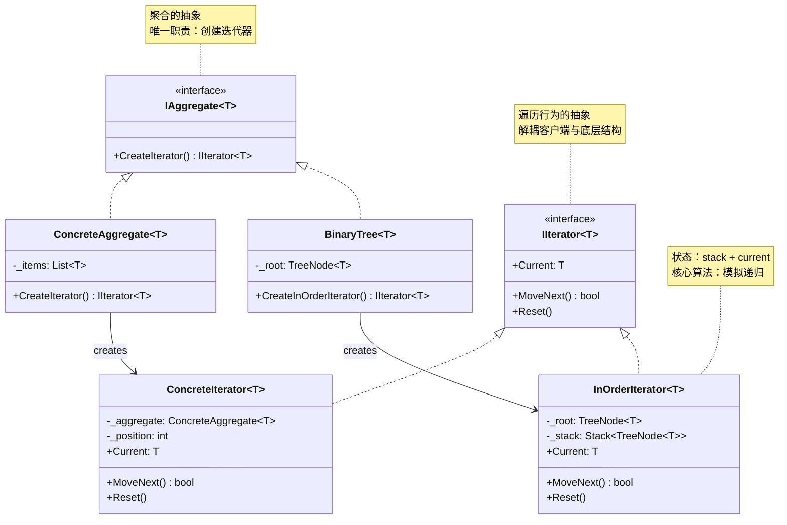
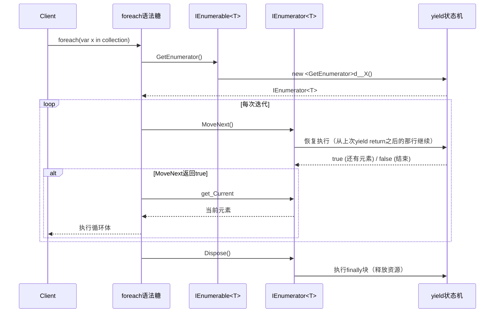

# 迭代器模式 Iterator

> 所属计划: [[design-patterns-csharp|设计模式 (C#)]]
> 预计耗时: 80 分钟
> 前置知识: [[16-behavioral-intro|行为型模式总览]], C# 泛型, `IEnumerable<T>` / `IEnumerator<T>` 基础

---

## 1. 概念讲解

### 为什么需要迭代器？

假设你实现了一个二叉搜索树（BST），现在需要让外部代码遍历树中所有节点。**暴露底层结构**的典型做法：

```csharp
// ❌ 客户端直接操作 TreeNode — 暴露了树内部结构
public class BinaryTree<T>
{
    public TreeNode<T> Root { get; set; }  // 暴露了内部结构！
}

// 客户端必须自己写遍历逻辑
void ClientCode(BinaryTree<int> tree)
{
    var stack = new Stack<TreeNode<int>>();
    var current = tree.Root;
    while (stack.Count > 0 || current != null)
    {
        while (current != null) { stack.Push(current); current = current.Left; }
        current = stack.Pop();
        Console.WriteLine(current.Value);
        current = current.Right;
    }
    // 这段代码 HALF the client must duplicate everywhere it needs to iterate
}
```

问题：
1. **封装被破坏** — TreeNode 类型的暴露使得你无法重构树的内部存储（比如换成数组）
2. **遍历代码重复** — 每个消费者都得自己实现中序遍历逻辑
3. **并发问题** — 客户端持有对内部 TreeNode 的引用，可能无意中修改树结构
4. **无法切换遍历策略** — 如果你想要前序/后序遍历，又得重写一遍

> [!note] GoF 定义
> 提供一种方法顺序访问一个聚合对象中的各个元素，而又不需要暴露该对象的内部表示。

### 核心思想

将**遍历**和**聚合**分离为两个职责：

1. **Aggregate（聚合）** — 持有数据集合，提供 `CreateIterator()` 工厂方法
2. **Iterator（迭代器）** — 持有当前遍历状态（游标），提供 `Next()` / `Current` / `IsDone()` 操作

客户端只依赖 Iterator 接口——**与底层数据结构（数组/链表/树）完全解耦**。



### C# 的答案：`IEnumerable<T>` 就是内置迭代器模式

C# 在语言层面内置了迭代器模式，比经典 GoF 更简洁：

| GoF 角色 | C# 等价 | 说明 |
|:----------|:--------|:-----|
| `IIterator<T>` | `IEnumerator<T>` | 持有遍历状态（`Current` + `MoveNext()`） |
| `IAggregate<T>` | `IEnumerable<T>` | 聚合对象（`GetEnumerator()` 工厂方法） |
| `ConcreteIterator` | 编译器生成的 `<GetEnumerator>d__X` 状态机 | `yield return` 自动生成，无需手写 |
| `ConcreteAggregate` | 你的集合类 | 实现 `IEnumerable<T>` 即可 |
| 手动创建迭代器 | `yield return` | 编译器将迭代器代码转换为状态机 |

**核心优势**：你几乎不需要手写 `IEnumerator` 类——`yield return` 让编译器替你生成。迭代器模式变成了一种只需要写几行 `yield return` 的**语言特性**。

### C# 迭代器执行模型



> [!tip] 关键认知
> `foreach` 是编译器糖，展开后就是标准的 GoF 迭代器调用流程。`IEnumerable<T>` 和 `yield return` 让 C# 开发者**每天都在使用迭代器模式**——只是大多数人没有意识到。

---

## 2. 代码示例

### 示例 1：二叉树的三种遍历 — 手写 `IEnumerable<T>`

这是最能体现迭代器价值的场景——二叉树内部结构复杂，但客户端只需要 `foreach`：

```csharp
// ============================================================
// 1. 二叉树节点（Leaf — 不对外暴露）
// ============================================================
public class TreeNode<T>
{
    public T Value { get; set; }
    public TreeNode<T>? Left { get; set; }
    public TreeNode<T>? Right { get; set; }

    public TreeNode(T value) => Value = value;
}

// ============================================================
// 2. 二叉树 — 聚合对象（Aggregate），实现 IEnumerable<T>
// ============================================================
public class BinaryTree<T> : IEnumerable<T>
{
    private TreeNode<T>? _root;

    public void Insert(T value) where T : IComparable<T>
    {
        _root = InsertRec(_root, value);
    }

    private static TreeNode<T> InsertRec(TreeNode<T>? node, T value) where T : IComparable<T>
    {
        if (node == null) return new TreeNode<T>(value);
        int cmp = value.CompareTo(node.Value);
        if (cmp < 0) node.Left = InsertRec(node.Left, value);
        else if (cmp > 0) node.Right = InsertRec(node.Right, value);
        return node;
    }

    // ============================================================
    // 默认遍历：中序（Sorted order for BST）
    // ============================================================
    public IEnumerator<T> GetEnumerator() => InOrderTraversal().GetEnumerator();
    System.Collections.IEnumerator System.Collections.IEnumerable.GetEnumerator()
        => GetEnumerator();

    // ============================================================
    // 中序遍历：左 → 根 → 右 — 二叉搜索树的自然顺序
    // ============================================================
    public IEnumerable<T> InOrderTraversal()
    {
        if (_root == null) yield break;
        var stack = new Stack<TreeNode<T>>();
        var current = _root;
        while (stack.Count > 0 || current != null)
        {
            while (current != null)
            {
                stack.Push(current);
                current = current.Left;
            }
            current = stack.Pop();
            yield return current.Value;
            current = current.Right;
        }
    }

    // ============================================================
    // 前序遍历：根 → 左 → 右
    // ============================================================
    public IEnumerable<T> PreOrderTraversal()
    {
        if (_root == null) yield break;
        var stack = new Stack<TreeNode<T>>();
        stack.Push(_root);
        while (stack.Count > 0)
        {
            var node = stack.Pop();
            yield return node.Value;
            // 先右后左压栈 = 弹出时左先右后
            if (node.Right != null) stack.Push(node.Right);
            if (node.Left != null) stack.Push(node.Left);
        }
    }

    // ============================================================
    // 后序遍历：左 → 右 → 根
    // ============================================================
    public IEnumerable<T> PostOrderTraversal()
    {
        if (_root == null) yield break;
        var stack1 = new Stack<TreeNode<T>>();
        var stack2 = new Stack<TreeNode<T>>();
        stack1.Push(_root);
        while (stack1.Count > 0)
        {
            var node = stack1.Pop();
            stack2.Push(node);
            if (node.Left != null) stack1.Push(node.Left);
            if (node.Right != null) stack1.Push(node.Right);
        }
        while (stack2.Count > 0)
            yield return stack2.Pop().Value;
    }
}

// ============================================================
// 运行入口
// ============================================================
static void Demo1()
{
    var tree = new BinaryTree<int>();
    int[] values = { 50, 30, 70, 20, 40, 60, 80 };
    // 构建BST：       50
    //               /    \
    //             30      70
    //            /  \    /  \
    //          20   40  60   80
    foreach (var v in values) tree.Insert(v);

    Console.WriteLine("=== 二叉树遍历（BST）===");

    // 默认迭代器 = 中序 → 升序输出
    Console.Write("默认（中序）: ");
    foreach (var v in tree) Console.Write($"{v} ");
    Console.WriteLine();

    Console.Write("前序遍历  : ");
    foreach (var v in tree.PreOrderTraversal())
        Console.Write($"{v} ");
    Console.WriteLine();

    Console.Write("后序遍历  : ");
    foreach (var v in tree.PostOrderTraversal())
        Console.Write($"{v} ");
    Console.WriteLine();

    // LINQ 可以直接使用 —— 因为实现了 IEnumerable<T>
    var greaterThan40 = tree.Where(x => x > 40);
    Console.Write("LINQ (>40)  : ");
    foreach (var v in greaterThan40) Console.Write($"{v} ");
    Console.WriteLine();
}
```

**运行方式：**
```bash
dotnet new console -n IteratorBinaryTree
# 将上述代码放入 Program.cs
dotnet run --project IteratorBinaryTree
```

**预期输出：**
```text
=== 二叉树遍历（BST）===
默认（中序）: 20 30 40 50 60 70 80
前序遍历  : 50 30 20 40 70 60 80
后序遍历  : 20 40 30 60 80 70 50
LINQ (>40)  : 50 60 70 80
```

### 示例 2：`yield return` 的懒加载本质

`yield return` 的核心价值：延迟执行（lazy evaluation）——只有在 `MoveNext()` 被调用时才执行代码。这意味着**不需要一次性把所有元素计算出来**。

```csharp
// ============================================================
// 演示 yield return 的懒加载特性
// ============================================================
using System.Diagnostics;

public class LazyGenerator
{
    // yield return：每调用一次 MoveNext()，执行到下一个 yield return
    public static IEnumerable<int> LazyRange(int start, int count)
    {
        Console.WriteLine("[LazyRange] 开始生成...");
        for (int i = 0; i < count; i++)
        {
            Console.WriteLine($"  [LazyRange] yield return {start + i}");
            yield return start + i; // ← 暂停点：状态机在此暂停
        }
        Console.WriteLine("[LazyRange] 生成完毕");
    }

    // 对比：立即计算 —— 全部算完才返回
    public static List<int> EagerRange(int start, int count)
    {
        Console.WriteLine("[EagerRange] 开始生成...");
        var result = new List<int>();
        for (int i = 0; i < count; i++)
        {
            Console.WriteLine($"  [EagerRange] 计算 {start + i}");
            result.Add(start + i);
        }
        Console.WriteLine("[EagerRange] 生成完毕");
        return result;
    }
}

// ============================================================
// 演示：过滤管道的懒加载链
// ============================================================
public static class LazyPipeline
{
    // 无限序列 —— 可以 yield return 无限序列！
    public static IEnumerable<int> Naturals()
    {
        int n = 0;
        while (true) yield return n++;
    }

    // 仅此一个方法 —— 但返回的是延迟执行管道
    public static IEnumerable<T> MyWhere<T>(
        this IEnumerable<T> source, Func<T, bool> predicate)
    {
        Console.WriteLine("[MyWhere] 开始迭代...");
        foreach (var item in source)
        {
            if (predicate(item))
            {
                Console.WriteLine($"  [MyWhere] yield return {item}");
                yield return item;
            }
        }
    }
}

// ============================================================
// 运行入口
// ============================================================
static void Demo2()
{
    // ---- 演示 1：懒加载 vs 立即计算 ----
    Console.WriteLine("=== 懒加载 vs 立即计算 ===");

    Console.WriteLine("--- LazyRange（懒加载）---");
    var lazy = LazyGenerator.LazyRange(0, 3);
    Console.WriteLine("获取了 IEnumerable（但还没生成任何元素）");
    Console.WriteLine("按任意键开始迭代...");
    Console.ReadKey(true);
    foreach (var x in lazy.Take(2)) // 只取前2个 —— 第3个永远不会生成！
        Console.WriteLine($"消费: {x}");
    // 注意：第3个元素（2）永远不会输出 "[LazyRange] yield return 2"

    Console.WriteLine("\n--- EagerRange（立即计算）---");
    var eager = LazyGenerator.EagerRange(0, 3);
    Console.WriteLine("获取 List 时已经全部算完");
    foreach (var x in eager.Take(2))
        Console.WriteLine($"消费: {x}");
    // 第3个元素(2)虽然未被消费，但已经计算并分配了内存

    // ---- 演示 2：无限序列 + 过滤管道 ----
    Console.WriteLine("\n=== 无限序列 + 懒加载过滤 ===");
    // 所有 n^2 且 < 100 的自然数
    var squares = LazyPipeline.Naturals()
        .Select(x => x * x)
        .TakeWhile(x => x < 100);

    Console.Write("平方数 < 100: ");
    foreach (var x in squares)
        Console.Write($"{x} ");
    Console.WriteLine();
    // 输出: 0 1 4 9 16 25 36 49 64 81

    // ---- 演示 3：管道中的每步都是懒加载 ----
    Console.WriteLine("\n=== 自定义 Where 的懒加载管道 ===");
    var pipeline = LazyPipeline.Naturals()
        .MyWhere(x => x % 2 == 0)
        .Select(x => x * 10);

    Console.WriteLine("管道已搭建（未执行任何操作）");
    foreach (var x in pipeline.Take(3))
        Console.WriteLine($"消费: {x}");
    // 输出: 0 20 40
}
```

**运行方式：**
```bash
dotnet new console -n IteratorLazyPipeline
# 放入 Program.cs
dotnet run --project IteratorLazyPipeline
```

**预期输出：**
```text
=== 懒加载 vs 立即计算 ===
--- LazyRange（懒加载）---
获取了 IEnumerable（但还没生成任何元素）
按任意键开始迭代...
[LazyRange] 开始生成...
  [LazyRange] yield return 0
消费: 0
  [LazyRange] yield return 1
消费: 1

--- EagerRange（立即计算）---
[EagerRange] 开始生成...
  [EagerRange] 计算 0
  [EagerRange] 计算 1
  [EagerRange] 计算 2
[EagerRange] 生成完毕
获取 List 时已经全部算完
消费: 0
消费: 1

=== 无限序列 + 懒加载过滤 ===
平方数 < 100: 0 1 4 9 16 25 36 49 64 81

=== 自定义 Where 的懒加载管道 ===
管道已搭建（未执行任何操作）
[MyWhere] 开始迭代...
  [MyWhere] yield return 0
消费: 0
  [MyWhere] yield return 2
消费: 20
  [MyWhere] yield return 4
消费: 40
```

> [!tip] 核心教训
> 在 `foreach(var x in pipeline.Take(3))` 中，`Naturals()` 只生成了 0 到 4（5个自然数），`MyWhere` 过滤了 3 个，`Select` 映射了 3 个。**没有任何一步创建了 List**——每个元素是"流式"穿透管道的。

### 示例 3：`IAsyncEnumerable<T>` — 异步迭代

当数据源是异步的（数据库查询、HTTP 分页、文件流），用 `IAsyncEnumerable<T>` + `await foreach`：

```csharp
// ============================================================
// 异步迭代器 — IAsyncEnumerable<T>
// ============================================================
using System.Runtime.CompilerServices;

// 模拟异步数据源：分页API
public class PagedApiClient
{
    private readonly int _totalPages;
    private readonly int _pageSize;
    private readonly int _delayMsPerPage;

    public PagedApiClient(int totalPages, int pageSize = 5, int delayMsPerPage = 200)
    {
        _totalPages = totalPages;
        _pageSize = pageSize;
        _delayMsPerPage = delayMsPerPage;
    }

    // IAsyncEnumerable<T> + yield return = 异步迭代器
    public async IAsyncEnumerable<string> GetAllItemsAsync(
        [EnumeratorCancellation] CancellationToken ct = default)
    {
        for (int page = 1; page <= _totalPages; page++)
        {
            ct.ThrowIfCancellationRequested();

            Console.WriteLine($"  [API] 请求第 {page} 页...");
            await Task.Delay(_delayMsPerPage, ct); // 模拟网络请求

            // 模拟一页数据
            for (int i = 0; i < _pageSize; i++)
            {
                int itemId = (page - 1) * _pageSize + i + 1;
                yield return $"Item_{itemId}";
            }
        }
        Console.WriteLine($"  [API] 所有 {_totalPages} 页加载完毕");
    }
}

// ============================================================
// 带有异步过滤的管道
// ============================================================
public static class AsyncExtensions
{
    public static async IAsyncEnumerable<T> MyAsyncWhere<T>(
        this IAsyncEnumerable<T> source,
        Func<T, bool> predicate,
        [EnumeratorCancellation] CancellationToken ct = default)
    {
        await foreach (var item in source.WithCancellation(ct))
        {
            if (predicate(item))
                yield return item;
        }
    }
}

// ============================================================
// 运行入口
// ============================================================
static async Task Demo3Async()
{
    Console.WriteLine("=== IAsyncEnumerable<T> 异步迭代 ===");

    var api = new PagedApiClient(totalPages: 3, pageSize: 5, delayMsPerPage: 50);
    var cts = new CancellationTokenSource(TimeSpan.FromSeconds(2));

    // await foreach：异步迭代
    Console.WriteLine("开始异步消费数据...");
    await foreach (var item in api.GetAllItemsAsync(cts.Token))
    {
        Console.WriteLine($"  消费: {item}");
    }

    // ---- 异步管道：只取 ID 含 "5" 的项 ----
    Console.WriteLine("\n--- 异步过滤管道 ---");
    var filtered = api.GetAllItemsAsync(cts.Token)
        .MyAsyncWhere(x => x.Contains('5'));

    await foreach (var item in filtered)
    {
        Console.WriteLine($"  过滤结果: {item}");
    }

    // ---- 转换为同步 List（注意：这会阻塞等待全部数据） ----
    Console.WriteLine("\n--- 收集到 List（全部消费）---");
    var allItems = new List<string>();
    await foreach (var item in api.GetAllItemsAsync())
        allItems.Add(item);
    Console.WriteLine($"收集到 {allItems.Count} 个元素");
}

// 在同步入口中调用异步代码
static void Demo3()
{
    Demo3Async().GetAwaiter().GetResult();
}
```

**运行方式：**
```bash
dotnet new console -n IteratorAsync
# 放入 Program.cs
dotnet run --project IteratorAsync
```

**预期输出：**
```text
=== IAsyncEnumerable<T> 异步迭代 ===
开始异步消费数据...
  [API] 请求第 1 页...
  消费: Item_1
  消费: Item_2
  消费: Item_3
  消费: Item_4
  消费: Item_5
  [API] 请求第 2 页...
  消费: Item_6
  ...（依此类推）

--- 异步过滤管道 ---
  [API] 请求第 1 页...
  过滤结果: Item_5
  [API] 请求第 2 页...
  [API] 请求第 3 页...
  过滤结果: Item_15
  [API] 所有 3 页加载完毕

--- 收集到 List（全部消费）---
  [API] 请求第 1 页...
  [API] 请求第 2 页...
  [API] 请求第 3 页...
  [API] 所有 3 页加载完毕
收集到 15 个元素
```

### 示例 4：经典 GoF 迭代器 vs C# 惯用 `IEnumerable<T>`

对比同一散列表（HashTable）的两种实现方式——左列是经典 GoF 手写迭代器，右列是 C# `yield return`：

```csharp
// ============================================================
// 散列表迭代器 — 经典 GoF vs C# 惯用写法
// ============================================================

public class SimpleHashTable<TKey, TValue>
{
    private readonly Entry?[] _buckets;
    private int _count;

    private class Entry
    {
        public TKey Key;
        public TValue Value;
        public Entry? Next; // 链表解决冲突
    }

    public SimpleHashTable(int capacity = 16) => _buckets = new Entry[capacity];

    public void Add(TKey key, TValue value) { /* 省略实现 */ _count++; }
    public int Count => _count;

    // ============================================================
    // 方案 A：经典 GoF 手写迭代器
    // ============================================================
    public IIterator GoF_Iterator()
    {
        return new HashTableIterator(this);
    }

    // 手写迭代器类 — 管理所有遍历状态
    private class HashTableIterator : IIterator
    {
        private readonly SimpleHashTable<TKey, TValue> _table;
        private int _bucket;       // 当前桶索引
        private Entry? _current;   // 链表中的当前节点

        public HashTableIterator(SimpleHashTable<TKey, TValue> table)
        {
            _table = table;
            _bucket = -1;
            _current = null;
        }

        public bool MoveNext()
        {
            // 先沿链表前进
            if (_current != null)
            {
                _current = _current.Next;
                if (_current != null) return true;
            }

            // 链表到头 → 找下一个非空桶
            while (++_bucket < _table._buckets.Length)
            {
                _current = _table._buckets[_bucket];
                if (_current != null) return true;
            }

            _current = null;
            return false;
        }

        public object Current => _current!;
        public void Reset() { _bucket = -1; _current = null; }
    }

    // ============================================================
    // 方案 B：C# 惯用 — yield return（18行 vs 上面的40+行）
    // ============================================================
    public IEnumerable<KeyValuePair<TKey, TValue>> CSharp_Iterator()
    {
        foreach (var bucket in _buckets)
        {
            var entry = bucket;
            while (entry != null)
            {
                yield return new KeyValuePair<TKey, TValue>(entry.Key, entry.Value);
                entry = entry.Next;
            }
        }
    }
}

// GoF 原生接口（给方案 A 用）
public interface IIterator
{
    object Current { get; }
    bool MoveNext();
    void Reset();
}

// ============================================================
// 使用对比
// ============================================================
static void Demo4()
{
    Console.WriteLine("=== 经典 GoF vs C# 惯用 ===");

    var hash = new SimpleHashTable<string, int>();

    // --- 经典 GoF 风格 ---
    Console.WriteLine("--- GoF 手写迭代器 ---");
    var gofIter = hash.GoF_Iterator();
    while (gofIter.MoveNext())
    {
        // var kv = (KeyValuePair<string, int>)gofIter.Current; // 需要强制转换
    }

    // --- C# 惯用风格 ---
    Console.WriteLine("--- C# IEnumerable<T> ---");
    foreach (var kv in hash.CSharp_Iterator())
    {
        // kv 是强类型的 KeyValuePair<string, int>
    }

    // LINQ（只有 C# 方案能用）
    var keys = hash.CSharp_Iterator()
        .Where(kv => kv.Key.StartsWith("A"))
        .Select(kv => kv.Key)
        .ToList();

    Console.WriteLine($"foreach 简洁度: GoF = 6行样板代码, C# = 1行");
    Console.WriteLine($"类型安全: GoF = object + 强制转换, C# = 泛型");
    Console.WriteLine($"LINQ支持: GoF = 不支持, C# = 原生支持");
    Console.WriteLine($"手写代码: GoF = 40+ 行状态机, C# = 8 行 yield return");
}
```

**对比总结：**

| 维度 | 经典 GoF Iterator | C# `IEnumerable<T>` |
|:------|:-------------------|:---------------------|
| 迭代器实现 | 手写 `IEnumerator` 类（管理所有状态） | `yield return` — 编译器生成状态机 |
| 代码量 | 40-100 行样板代码 | 5-15 行 |
| 类型安全 | `object Current` + 强制转换 | `T Current` — 泛型保证 |
| LINQ 兼容 | 不支持 | 原生支持（所有 `IEnumerable<T>` 扩展方法） |
| 嵌套/递归结构 | 需要手动管理 Stack/递归状态 | `yield return` 支持递归（C# 8+） |
| 异步迭代 | 不支持 | `IAsyncEnumerable<T>` + `await foreach` |
| 何时还用 GoF 风格 | 教育目的 / 理解原理 | **所有生产代码** |

---


## C++ 实现

C++ 经典 GoF 迭代器使用模板接口 `Iterator<T>` 解耦遍历与存储。现代 C++20 用 `std::ranges` 和 `std::views` 提供了声明式、延迟求值的替代方案 —— 无需手写迭代器类即可完成过滤、变换等操作。

### 经典 GoF 风格

```cpp
#include <iostream>
#include <vector>
#include <memory>
using namespace std;

// ============================================================
// 1. Iterator<T> 接口 — 遍历契约
// ============================================================
template <typename T>
class Iterator {
public:
    virtual ~Iterator() = default;
    virtual void first() = 0;
    virtual void next() = 0;
    virtual bool isDone() const = 0;
    virtual T  currentItem() const = 0;
};

// ============================================================
// 2. ConcreteAggregate — 持有数据的集合
// ============================================================
template <typename T>
class ConcreteAggregate {
    vector<T> items;
public:
    using value_type = T;

    void add(const T& item) { items.push_back(item); }
    size_t count() const { return items.size(); }

    T& operator[](size_t i) { return items[i]; }
    const T& operator[](size_t i) const { return items[i]; }

    // 创建对应的迭代器（作为嵌套类访问内部数据）
    class AggregateIterator : public Iterator<T> {
        const ConcreteAggregate<T>& aggregate;
        size_t index{0};
    public:
        explicit AggregateIterator(const ConcreteAggregate<T>& agg)
            : aggregate(agg) {}

        void first() override { index = 0; }
        void next() override { ++index; }
        bool isDone() const override { return index >= aggregate.count(); }
        T currentItem() const override { return aggregate[index]; }
    };

    auto createIterator() const {
        return make_unique<AggregateIterator>(*this);
    }
};

// === main / usage ===
int main() {
    ConcreteAggregate<string> names;
    names.add("Alice");
    names.add("Bob");
    names.add("Charlie");

    cout << "=== GoF 经典迭代器 ===" << endl;
    auto it = names.createIterator();
    for (it->first(); !it->isDone(); it->next()) {
        cout << "  " << it->currentItem() << endl;
    }
    return 0;
}
```

### 现代 C++20 替代：`std::ranges` + `std::views`

```cpp
#include <iostream>
#include <ranges>
#include <vector>
#include <string>
using namespace std;

int main() {
    vector<string> names = { "Alice", "Bob", "Charlie", "David", "Eve" };

    namespace rv = ranges::views; // C++20 views

    // 过滤 + 变换：只取名字长度 > 3 的大写形式
    auto longer = names | rv::filter([](const string& s) {
        return s.size() > 3;
    }) | rv::transform([](const string& s) -> string {
        auto upper = s;
        for (auto& c : upper) c = toupper(static_cast<unsigned char>(c));
        return upper;
    });

    cout << "=== C++20 ranges (filter + transform) ===" << endl;
    for (const auto& name : longer) {
        cout << "  " << name << endl;
    }

    // 取前 3 个
    cout << "\n=== 前 3 个元素 ===" << endl;
    for (const auto& name : names | rv::take(3)) {
        cout << "  " << name << endl;
    }

    return 0;
}
```

**编译运行：**
```bash
# 经典 GoF
g++ -std=c++17 -o prog main.cpp && ./prog

# C++20 ranges（需要支持 ranges 的编译器）
g++ -std=c++20 -o prog-ranges main.cpp && ./prog-ranges
```

**预期输出（GoF 风格）：**
```text
=== GoF 经典迭代器 ===
  Alice
  Bob
  Charlie
```

## 3. 练习

### 练习 1（基础）：实现环形缓冲区迭代器

**场景**：`CircularBuffer<T>` 是一个固定大小的环形缓冲区。当缓冲区满时，新元素覆盖最旧的元素。

```csharp
public class CircularBuffer<T> : IEnumerable<T>
{
    private readonly T[] _buffer;
    private int _head;  // 写入位置
    private int _tail;  // 读取位置
    private bool _full; // 是否已满

    public CircularBuffer(int capacity)
    {
        _buffer = new T[capacity];
        _head = _tail = 0;
    }

    public void Write(T item)
    {
        _buffer[_head] = item;
        _head = (_head + 1) % _buffer.Length;
        if (_full) _tail = (_tail + 1) % _buffer.Length;
        _full = _head == _tail;
    }

    public int Count => _full ? _buffer.Length
        : (_head - _tail + _buffer.Length) % _buffer.Length;
}
```

**要求：**
1. 实现 `GetEnumerator()` — 按照"从旧到新"的顺序迭代（从 `_tail` 开始，到 `_head` 为止）
2. 不要在迭代过程中分配额外的集合（直接遍历底层数组即可）
3. 额外加分：实现 `IEnumerable<T>.GetEnumerator()` 和显式接口实现

**预期行为：**
```csharp
var cb = new CircularBuffer<int>(5);
cb.Write(1); cb.Write(2); cb.Write(3);
// Count = 3, 迭代输出: 1 2 3
foreach (var x in cb) Console.Write($"{x} "); // → 1 2 3

cb.Write(4); cb.Write(5); cb.Write(6);
// Count = 5, 迭代输出: 2 3 4 5 6
foreach (var x in cb) Console.Write($"{x} "); // → 2 3 4 5 6
```

### 练习 2（高级）：实现过滤迭代器

**场景**：实现一个 `FilterIterator<T>`，它基于一个 `Func<T, bool>` 谓词，在迭代过程中**跳过**不满足条件的元素。

```csharp
public class FilterIterator<T> : IEnumerable<T>
{
    private readonly IEnumerable<T> _source;
    private readonly Func<T, bool> _predicate;

    public FilterIterator(IEnumerable<T> source, Func<T, bool> predicate)
    {
        _source = source;
        _predicate = predicate;
    }

    // 实现 GetEnumerator() — 使用 yield return
}
```

**要求：**
1. 实现 `GetEnumerator()` 返回过滤后的迭代器
2. 支持链式调用：`new FilterIterator<int>(source, x => x > 3)`
3. 对**复杂对象**进行过滤——给 `List<Student>` 写一个按成绩过滤的迭代器
4. 思考：如果源集合有 100 万元素，谓词只匹配前 5 个——你的实现是否会遍历全部 100 万？（应该是 No — 懒加载）

**预期行为：**
```csharp
var numbers = new List<int> { 1, 2, 3, 4, 5, 6 };
var filtered = new FilterIterator<int>(numbers, x => x % 2 == 0);
foreach (var x in filtered) Console.Write($"{x} "); // → 2 4 6
```

### 练习 3（挑战）：实现树的 BFS（广度优先）迭代器

**场景**：[[11-composite|组合模式]] 教程中的树结构只支持 DFS（深度优先）遍历。为 `TreeNode<T>` 实现 BFS（广度优先/层序遍历）。

```csharp
public class TreeNode<T>
{
    public T Value { get; set; }
    public List<TreeNode<T>> Children { get; set; } = new();

    public TreeNode(T value) => Value = value;

    // 已有：DFS 迭代器
    public IEnumerable<T> DfsTraversal()
    {
        yield return Value;
        foreach (var child in Children)
            foreach (var v in child.DfsTraversal())
                yield return v;
    }

    // TODO：实现 BFS 迭代器 — 使用 Queue<T>
    public IEnumerable<T> BfsTraversal()
    {
        // 提示：用 Queue<TreeNode<T>> 而不是递归
    }
}
```

**要求：**
1. 实现 `BfsTraversal()` — 使用 `Queue<T>`（FIFO）逐层输出
2. 正确输出树的层序——测试以下树结构：

   ```
          A
        / | \
       B  C  D
      / \    |
     E   F   G
   ```
3. BFS 输出应为：`A B C D E F G`
4. **额外挑战**：再加一个迭代器 `BfsLevelOrder()`，输出为 `[ [A], [B,C,D], [E,F,G] ]`

**提示：**
```csharp
public IEnumerable<T> BfsTraversal()
{
    var queue = new Queue<TreeNode<T>>();
    queue.Enqueue(this);
    while (queue.Count > 0)
    {
        var node = queue.Dequeue();
        yield return node.Value;
        foreach (var child in node.Children)
            queue.Enqueue(child);
    }
}
```

---

## 3.5 参考答案

> [!tip]- 练习 1 参考答案：环形缓冲区迭代器
>   
> ```csharp
> // ============================================
> // CircularBuffer<T> — 实现 IEnumerable<T>
> // ============================================
> public class CircularBuffer<T> : IEnumerable<T>
> {
>     private readonly T[] _buffer;
>     private int _head;  // 写入位置（下一个写入的索引）
>     private int _tail;  // 读取位置（最旧元素的索引）
>     private bool _full;
> 
>     public CircularBuffer(int capacity)
>     {
>         _buffer = new T[capacity];
>         _head = _tail = 0;
>         _full = false;
>     }
> 
>     public void Write(T item)
>     {
>         _buffer[_head] = item;
>         _head = (_head + 1) % _buffer.Length;
>         if (_full) _tail = (_tail + 1) % _buffer.Length;
>         _full = _head == _tail;
>     }
> 
>     public int Count => _full ? _buffer.Length
>         : (_head - _tail + _buffer.Length) % _buffer.Length;
> 
>     // 显式实现非泛型接口
>     System.Collections.IEnumerator System.Collections.IEnumerable.GetEnumerator()
>         => GetEnumerator();
> 
>     // 泛型版本：从旧到新迭代（_tail → _head），不分配额外集合
>     public IEnumerator<T> GetEnumerator()
>     {
>         if (Count == 0) yield break;
> 
>         var pos = _tail;
>         for (int i = 0; i < Count; i++)
>         {
>             yield return _buffer[pos];
>             pos = (pos + 1) % _buffer.Length;
>         }
>     }
> }
> 
> // ============================================
> // 验证代码
> // ============================================
> static void TestCircularBuffer()
> {
>     var cb = new CircularBuffer<int>(5);
>     cb.Write(1); cb.Write(2); cb.Write(3);
>     Console.Write("Count=3, 迭代: ");
>     foreach (var x in cb) Console.Write($"{x} "); // → 1 2 3
>     Console.WriteLine();
> 
>     cb.Write(4); cb.Write(5); cb.Write(6);  // 1,2 被覆盖
>     Console.Write("Count=5, 迭代: ");
>     foreach (var x in cb) Console.Write($"{x} "); // → 2 3 4 5 6
>     Console.WriteLine();
> 
>     // 验证 Edge case：迭代空缓冲区
>     var empty = new CircularBuffer<int>(3);
>     Console.WriteLine($"空缓冲区 Count={empty.Count}, 迭代: [{string.Join(", ", empty)}]");
> }
> ```
>
> **关键点说明：**
> - 迭代从 `_tail`（最旧元素）开始，沿环形移动 `Count` 步到达 `_head` 前一个位置
> - `yield return` 让编译器自动生成 `IEnumerator<T>` 状态机，无需手写 `MoveNext()`/`Current`
> - 空缓冲区通过 `if (Count == 0) yield break;` 提前退出
> - 显式实现 `System.Collections.IEnumerable.GetEnumerator()` 保持与非泛型 `foreach` 的兼容性

> [!tip]- 练习 2 参考答案：过滤迭代器
>   
> ```csharp
> // ============================================
> // FilterIterator<T> — 基于谓词的懒加载过滤器
> // ============================================
> public class FilterIterator<T> : IEnumerable<T>
> {
>     private readonly IEnumerable<T> _source;
>     private readonly Func<T, bool> _predicate;
> 
>     public FilterIterator(IEnumerable<T> source, Func<T, bool> predicate)
>     {
>         _source = source;
>         _predicate = predicate;
>     }
> 
>     public IEnumerator<T> GetEnumerator()
>     {
>         // 懒加载：只在遍历时才逐个检查元素
>         foreach (var item in _source)
>         {
>             if (_predicate(item))
>                 yield return item;
>         }
>     }
> 
>     System.Collections.IEnumerator System.Collections.IEnumerable.GetEnumerator()
>         => GetEnumerator();
> }
> 
> // ============================================
> // 复杂对象过滤示例：Student
> // ============================================
> public record Student(string Name, int Score);
> 
> static void TestFilterIterator()
> {
>     // 基础测试：整数过滤
>     var numbers = new List<int> { 1, 2, 3, 4, 5, 6 };
>     var filtered = new FilterIterator<int>(numbers, x => x % 2 == 0);
>     Console.Write("偶数过滤: ");
>     foreach (var x in filtered) Console.Write($"{x} "); // → 2 4 6
>     Console.WriteLine();
> 
>     // 复杂对象过滤：按成绩过滤
>     var students = new List<Student>
>     {
>         new Student("Alice", 85),
>         new Student("Bob", 72),
>         new Student("Charlie", 91),
>         new Student("Diana", 68),
>         new Student("Eve", 95)
>     };
> 
>     // 只保留成绩 ≥ 80 的学生
>     var highScorers = new FilterIterator<Student>(students, s => s.Score >= 80);
>     Console.WriteLine("高分学生 (≥80):");
>     foreach (var s in highScorers)
>         Console.WriteLine($"  {s.Name}: {s.Score}");
>     // 输出: Alice:85, Charlie:91, Eve:95
> 
>     // 链式调用
>     var excellent = new FilterIterator<Student>(
>         new FilterIterator<Student>(students, s => s.Score >= 80),
>         s => s.Name.StartsWith("A")
>     );
>     Console.Write("高分且名字A开头: ");
>     foreach (var s in excellent) Console.WriteLine($"{s.Name}"); // → Alice
> }
> ```
>
> **懒加载验证（关键点）：**
> - 如果源集合有 100 万元素且谓词只匹配前 5 个：遍历会在匹配 5 个后**继续**检查剩余元素（因为 `foreach` 遍历整个源），但元素是逐个 `yield` 的——不会一次性加载全部到内存
> - 消费者如果 `break` 提前终止（如 `Take(5)`），后续元素不会被检查——这就是真正的懒加载
> - `FilterIterator` 本质上是 LINQ `Where()` 的简化实现

> [!tip]- 练习 3 参考答案：树的 BFS（广度优先）迭代器
>   
> ```csharp
> // ============================================
> // TreeNode<T> — 支持 DFS 和 BFS 遍历
> // ============================================
> public class TreeNode<T>
> {
>     public T Value { get; set; }
>     public List<TreeNode<T>> Children { get; set; } = new();
> 
>     public TreeNode(T value) => Value = value;
> 
>     // 已有：DFS 迭代器（深度优先/先序）
>     public IEnumerable<T> DfsTraversal()
>     {
>         yield return Value;
>         foreach (var child in Children)
>             foreach (var v in child.DfsTraversal())
>                 yield return v;
>     }
> 
>     // BFS 迭代器：使用 Queue 逐层输出
>     public IEnumerable<T> BfsTraversal()
>     {
>         var queue = new Queue<TreeNode<T>>();
>         queue.Enqueue(this);
>         while (queue.Count > 0)
>         {
>             var node = queue.Dequeue();
>             yield return node.Value;
>             foreach (var child in node.Children)
>                 queue.Enqueue(child);
>         }
>     }
> 
>     // BFS 按层输出：每层作为一个独立集合
>     public IEnumerable<IReadOnlyList<T>> BfsLevelOrder()
>     {
>         var queue = new Queue<TreeNode<T>>();
>         queue.Enqueue(this);
>         while (queue.Count > 0)
>         {
>             var levelSize = queue.Count;
>             var level = new List<T>(levelSize);
>             for (int i = 0; i < levelSize; i++)
>             {
>                 var node = queue.Dequeue();
>                 level.Add(node.Value);
>                 foreach (var child in node.Children)
>                     queue.Enqueue(child);
>             }
>             yield return level;
>         }
>     }
> }
> 
> // ============================================
> // 构建测试树并验证
> // ============================================
> static void TestBfsTraversal()
> {
>     // 构建树：
>     //        A
>     //      / | \
>     //     B  C  D
>     //    / \    |
>     //   E   F   G
>     var root = new TreeNode<char>('A');
>     var b = new TreeNode<char>('B');
>     var c = new TreeNode<char>('C');
>     var d = new TreeNode<char>('D');
>     var e = new TreeNode<char>('E');
>     var f = new TreeNode<char>('F');
>     var g = new TreeNode<char>('G');
> 
>     b.Children.Add(e);
>     b.Children.Add(f);
>     d.Children.Add(g);
>     root.Children.Add(b);
>     root.Children.Add(c);
>     root.Children.Add(d);
> 
>     // 验证 DFS
>     Console.Write("DFS (深度优先): ");
>     foreach (var v in root.DfsTraversal()) Console.Write($"{v} ");
>     Console.WriteLine(); // → A B E F C D G
> 
>     // 验证 BFS
>     Console.Write("BFS (广度优先): ");
>     foreach (var v in root.BfsTraversal()) Console.Write($"{v} ");
>     Console.WriteLine(); // → A B C D E F G
> 
>     // 验证 BFS 按层
>     Console.WriteLine("BFS 按层输出:");
>     foreach (var level in root.BfsLevelOrder())
>         Console.WriteLine($"  [{string.Join(",", level)}]");
>     // 输出:
>     //   [A]
>     //   [B,C,D]
>     //   [E,F,G]
> }
> ```
>
> **关键点说明：**
> - `BfsTraversal()` 使用 FIFO 队列：出队一个节点 → `yield return` 其值 → 所有子节点入队
> - `BfsLevelOrder()` 的关键技巧：在处理每层之前记录 `levelSize = queue.Count`，精确控制内层循环次数
> - BFS 时间复杂度 O(n)，空间复杂度 O(w)（w = 树的最大宽度）
> - DFS 递归实现的空间复杂度 O(h)（h = 树高），对深层树可能栈溢出；BFS 用队列无此问题

> [!note] 答案使用方式
> 先独立完成练习，再展开查看参考答案。参考答案不是唯一解——如果你的实现通过了测试或达到了题目要求，就是正确的。

## 4. 扩展阅读

- [[11-composite|组合模式]] — 组合树 + 迭代器是天然搭配：迭代器提供统一的遍历接口，组合提供统一的节点结构
- [[16-behavioral-intro|行为型模式总览]] — 迭代器的行为型模式定位
- [Microsoft — Iterators (C# Programming Guide)](https://learn.microsoft.com/en-us/dotnet/csharp/iterators) — `yield return` 的官方文档
- [Microsoft — IAsyncEnumerable\<T\> Interface](https://learn.microsoft.com/en-us/dotnet/api/system.collections.generic.iasyncenumerable-1) — 异步迭代器的 API 参考
- [Microsoft — Iterators (C# reference)](https://learn.microsoft.com/en-us/dotnet/csharp/language-reference/statements/yield) — `yield` 语句的语言规范
- [Refactoring.Guru — Iterator](https://refactoring.guru/design-patterns/iterator) — 含多语言实现的详细讲解
- [.NET Source: `Enumerable.Where`](https://source.dot.net/#System.Linq/System/Linq/Where.cs) — LINQ `Where()` 的源码——它自己在内部就实现了一个 `WhereEnumerableIterator<T>`（迭代器模式）
- [Jon Skeet — C# In Depth: Iterator Blocks](https://csharpindepth.com/articles/IteratorBlockImplementation) — C# 编译器如何将 `yield return` 转换为状态机

---

## 常见陷阱

### 1. 修改集合导致迭代器失效

**问题**：在 `foreach` 循环中修改集合（添加/删除元素），迭代器状态失效：

```csharp
// ❌ 运行时抛出 InvalidOperationException
var list = new List<int> { 1, 2, 3 };
foreach (var x in list)
{
    if (x == 2) list.Remove(x); // 💥 Collection was modified
}
```

**原因**：`List<T>.Enumerator` 在 `MoveNext()` 时检查 `_version` 字段。每次 `Add`/`Remove` 会递增 `_version`，迭代器发现版本号不匹配就抛异常。

```csharp
// ✅ 正确做法1：收集要删除的元素，迭代后再删除
var toRemove = list.Where(x => x == 2).ToList();
foreach (var x in toRemove) list.Remove(x);

// ✅ 正确做法2：反向遍历索引（仅 List<T>）
for (int i = list.Count - 1; i >= 0; i--)
    if (list[i] == 2) list.RemoveAt(i);

// ✅ 正确做法3：使用 RemoveAll（内部优化了版本号）
list.RemoveAll(x => x == 2);
```

> [!warning] 自定义迭代器
> 你自己实现的 `IEnumerable<T>` 也可能存在此问题。如果你在自定义迭代器中没有做并发修改检测，**不会抛异常，但会静默产生错误数据**——这是最危险的。

### 2. 忘记 Dispose `IEnumerator<T>`

**问题**：`IEnumerator<T>` 实现了 `IDisposable`。直接使用 `IEnumerator<T>` 时必须在 `finally` 块中释放：

```csharp
// ❌ 手动迭代但忘记 Dispose
var enumerator = collection.GetEnumerator();
while (enumerator.MoveNext())
{
    Console.WriteLine(enumerator.Current);
}
// 如果迭代器持有文件句柄/网络连接/锁 —— 泄漏！

// ✅ 正确：foreach 自动调用 Dispose
foreach (var item in collection) { /* ... */ } // 编译器在 finally 中调用 Dispose

// ✅ 正确：手动使用必须 try-finally
var enumerator = collection.GetEnumerator();
try
{
    while (enumerator.MoveNext())
        Console.WriteLine(enumerator.Current);
}
finally
{
    enumerator?.Dispose();
}
```

**为什么 `yield return` 也需要 `Dispose`？** 编译器生成的状态机在 `finally` 块中放置清理代码（释放 `using` 的资源、执行 `finally` 逻辑）。如果消费者提前终止 `foreach`（如 `break` 或 `Take(3)`），只有 `Dispose` 才能触发这些清理代码。

### 3. 混淆 `IEnumerable` 与 `IQueryable`

**问题**：两者外表一致（都支持 `foreach` / `Where` / `Select`），但语义完全相反：

```csharp
// ❌ 隐式陷阱：IEnumerable 和 IQueryable 都叫 Where，但行为完全不同
IEnumerable<User> localUsers = _userList;                  // 内存过滤 — 全部加载
IQueryable<User> dbUsers    = _dbContext.Users;            // SQL翻译 — 只在数据库执行

// 表面看起来一样：
var result = localUsers.Where(u => u.Age > 18).Take(10);  // 全部加载到内存再过滤
var result = dbUsers.Where(u => u.Age > 18).Take(10);     // 翻译为 SELECT TOP(10) WHERE Age>18
```

| 维度 | `IEnumerable<T>` | `IQueryable<T>` |
|:------|:------------------|:----------------|
| 执行位置 | **客户端内存** | **数据源**（SQL 翻译） |
| 数据加载 | 全部加载到内存逐元素过滤 | 表达式树→SQL，只返回结果 |
| 性能（大数据） | ❌ 可能加载百万行到内存 | ✅ 在数据库执行，只返回10行 |
| 何时用它 | 内存集合、文件流、自定义生成器 | Entity Framework / LINQ to SQL |

**关键**：`IQueryable<T>` 继承自 `IEnumerable<T>`——所以一个 `IQueryable` 可以隐式赋值给 `IEnumerable`，一旦赋值，整个 LINQ 链就**退化**为客户端求值。变量类型决定行为。

### 4. 忘记 `MoveNext()` 返回 `bool` 的含义

**问题**：第一次调用 `Current` 前**必须**先调用 `MoveNext()`：

```csharp
// ❌ 直接访问 Current — 在 C# 标准枚举器中，第0个位置无效
var iter = collection.GetEnumerator();
Console.WriteLine(iter.Current); // 未定义行为！可能抛出异常或返回default(T)

// ✅ 正确：先 MoveNext
var iter = collection.GetEnumerator();
if (iter.MoveNext())
    Console.WriteLine(iter.Current);

// 而这个也错了 — 调用了两次 MoveNext 才用 Current
var iter = collection.GetEnumerator();
iter.MoveNext();
bool hasNext = iter.MoveNext(); // ← 跳过了第一个元素！
var first = iter.Current;        // ← 这是第二个元素
```

**正确模式：**
```csharp
// 标准模式 — 用 while 循环
using var iter = collection.GetEnumerator();
while (iter.MoveNext())
{
    var item = iter.Current;
    Process(item);
}

// 或者直接用 foreach（它为你处理好了一切）
foreach (var item in collection)
    Process(item);
```

### 5. 在多线程环境中共享迭代器

**问题**：`IEnumerator<T>` **不是线程安全的**。多个线程同时调用同一个枚举器的 `MoveNext()` 会导致竞态条件：

```csharp
// ❌ 两个线程共享同一个迭代器 — 数据错乱！
var enumerator = list.GetEnumerator();
Parallel.For(0, 2, _ =>
{
    while (enumerator.MoveNext())  // 竞态条件！
    {
        Console.WriteLine(enumerator.Current);
    }
});

// ✅ 正确：每个线程创建自己的迭代器
Parallel.ForEach(list, item =>
{
    Console.WriteLine(item); // PLINQ 为每个线程创建独立迭代器
});
```

`IEnumerable<T>` 本身可以被多次调用 `GetEnumerator()` 创建多个独立迭代器——但单个 `IEnumerator<T>` 实例是独占使用的。
