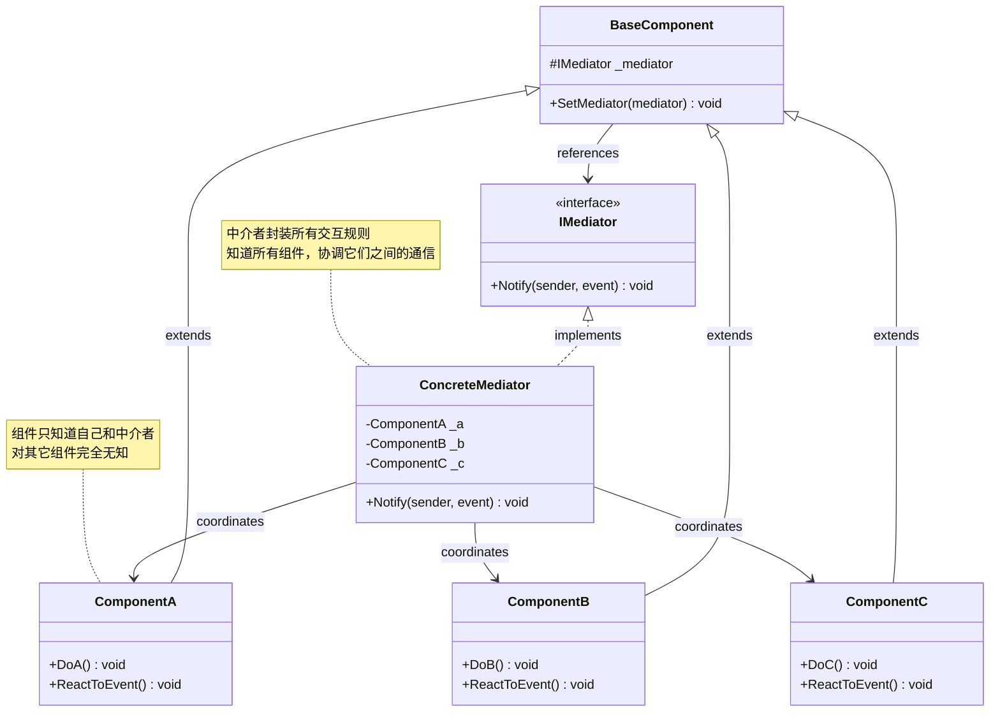

# 中介者模式 Mediator

> 所属计划: [[design-patterns-csharp|设计模式 (C#)]]
> 预计耗时: 70 分钟
> 前置知识: [[16-behavioral-intro|行为型模式总览]]

---

## 1. 概念讲解

### 为什么需要中介者？

假设你在写一个 GUI 对话框，里面有复选框、文本框、按钮三个控件：

```csharp
// ❌ 各控件直接互相引用 —— 形成混乱的网状依赖
public class CheckBox
{
    private TextBox _textBox;     // 知道文本框
    private Button _button;       // 知道按钮

    public void OnCheckChanged()
    {
        if (IsChecked)
        {
            _textBox.Enable();
            _button.SetText("提交");
        }
        else
        {
            _textBox.Disable();
            _button.SetText("取消");
        }
    }
}

public class TextBox
{
    private Button _button;       // 知道按钮

    public void OnTextChanged()
    {
        _button.SetEnabled(!string.IsNullOrEmpty(Text));
    }
}

public class Button
{
    private CheckBox _checkBox;   // 知道复选框
    private TextBox _textBox;     // 知道文本框

    public void OnClick()
    {
        if (_checkBox.IsChecked && !string.IsNullOrEmpty(_textBox.Text))
            Submit();
    }
}
```

**问题很明显**：3 个控件之间产生了 6 条依赖线。加第 4 个控件要改 3 个已有类。10 个控件的对话框就是灾难。

这就是中介者要解决的问题。

### 中介者模式的核心思想

> 用一个中介对象封装一组对象之间的交互。中介者通过避免对象之间显式地相互引用来促进松耦合，可以独立地改变它们之间的交互。

❌ **没有中介者**：每个同事（Colleague）都持有其他同事的引用，形成网状结构。
✅ **有中介者**：所有同事只引用中介者，通过中介者转发所有通信，形成星型结构。

```mermaid
flowchart LR
    subgraph 没有中介者 —— 网状通信
        A1[Button] --- B1[TextBox]
        A1 --- C1[CheckBox]
        B1 --- C1
        A1 --- D1[Label]
        B1 --- D1
        C1 --- D1
    end

    subgraph 有中介者 —— 星型通信
        M[Mediator] --- A2[Button]
        M --- B2[TextBox]
        M --- C2[CheckBox]
        M --- D2[Label]
    end
```

**关键洞察**：在网状结构中，每个节点需要 n-1 条边（O(n²) 依赖），在星型结构中，每个节点只需 1 条边（O(n) 依赖），但中介者承担了所有协调逻辑。

### 结构



- **`IMediator`**（中介者接口）：定义 `Notify(sender, event)` 方法，所有组件通过它向中介者发通知
- **`ConcreteMediator`**（具体中介者）：封装所有交互规则，持有所有组件的引用，在 `Notify` 中根据发送者和事件类型决定调用哪些组件
- **`BaseComponent`**（同事基类）：持有中介者引用，提供 `SetMediator()` 方法
- **`ComponentA/B/C`**（具体同事）：触发事件时调用 `_mediator.Notify(this, event)` 而非直接操作其他同事

### Mediator 与 Facade 的区别

| 维度 | Mediator | [[13-facade|Facade]] |
|------|----------|------|
| 通信方向 | **双向** — 组件 ↔ 中介者 ↔ 组件 | **单向** — 客户端 → 外观 → 子系统 |
| 解决的问题 | 组件之间的**多对多**引用 | 客户端对子系统复杂 API 的**一对多**依赖 |
| 组件是否知道彼此 | 完全不知道 | 子系统不知道 Facade，Facade 外组件也可直接访问子系统 |
| 中介者/外观的角色 | 主动协调——决定"谁响应谁" | 被动代理——只是封装调用序列 |
| 典型场景 | GUI 对话框、聊天室、空中交通管制 | 家庭影院、数据库连接池初始化 |

> [!tip] 直观判断
> Facade 封装的是"操作的序列"（先 A 再 B 再 C），Mediator 封装的是"对象间的交互规则"（当 A 变化时 B 和 C 应该怎么反应）。

---

## 2. 代码示例

### 示例 1：聊天室 —— 经典 Mediator

多个 `User` 通过 `ChatRoom` 中介者相互发送消息。用户只知道聊天室，不知道其他用户。

```csharp
using System;
using System.Collections.Generic;

#region 中介者接口和实现

/// <summary>中介者接口 —— 定义发送消息的契约</summary>
public interface IChatRoom
{
    void SendMessage(User sender, string message);
    void AddUser(User user);
}

/// <summary>具体中介者 —— 聊天室，持有所有用户并转发消息</summary>
public class ChatRoom : IChatRoom
{
    private readonly List<User> _users = new();

    public void AddUser(User user)
    {
        _users.Add(user);
        Console.WriteLine($"  [ChatRoom] {user.Name} 加入聊天室");
    }

    public void SendMessage(User sender, string message)
    {
        Console.WriteLine($"  [ChatRoom] 收到来自 {sender.Name} 的消息，转发给 {_users.Count - 1} 人");

        // 广播给所有用户（包括发送者自己可以选择排除）
        foreach (var user in _users)
        {
            if (user != sender) // 不转发给自己
            {
                user.Receive(sender.Name, message);
            }
        }
    }
}

#endregion

#region 同事类 —— User

/// <summary>同事类 —— 用户只认识 ChatRoom，不知道其他用户</summary>
public class User
{
    private readonly IChatRoom _chatRoom;

    public string Name { get; }

    public User(string name, IChatRoom chatRoom)
    {
        Name = name;
        _chatRoom = chatRoom;
    }

    /// <summary>发送消息 —— 委托给中介者</summary>
    public void Send(string message)
    {
        Console.WriteLine($"{Name}: 发送 \"{message}\"");
        _chatRoom.SendMessage(this, message);
    }

    /// <summary>接收消息 —— 中介者调用此方法投递消息</summary>
    public void Receive(string from, string message)
    {
        Console.WriteLine($"{Name}: 收到来自 {from} 的消息 → \"{message}\"");
    }
}

#endregion

#region 客户端代码

public static class Program
{
    public static void Main()
    {
        var chatRoom = new ChatRoom();

        var alice = new User("Alice", chatRoom);
        var bob = new User("Bob", chatRoom);
        var charlie = new User("Charlie", chatRoom);

        chatRoom.AddUser(alice);
        chatRoom.AddUser(bob);
        chatRoom.AddUser(charlie);

        Console.WriteLine("\n--- 开始聊天 ---\n");

        alice.Send("大家好！");
        Console.WriteLine();
        bob.Send("嗨 Alice，欢迎！");
        Console.WriteLine();
        charlie.Send("你好啊 Bob！");
    }
}

#endregion
```

**运行方式：**
```bash
dotnet new console -n MediatorChatRoom
# 将上述代码放入 Program.cs
dotnet run --project MediatorChatRoom
```

**预期输出：**
```text
  [ChatRoom] Alice 加入聊天室
  [ChatRoom] Bob 加入聊天室
  [ChatRoom] Charlie 加入聊天室

--- 开始聊天 ---

Alice: 发送 "大家好！"
  [ChatRoom] 收到来自 Alice 的消息，转发给 2 人
Bob: 收到来自 Alice 的消息 → "大家好！"
Charlie: 收到来自 Alice 的消息 → "大家好！"

Bob: 发送 "嗨 Alice，欢迎！"
  [ChatRoom] 收到来自 Bob 的消息，转发给 2 人
Alice: 收到来自 Bob 的消息 → "嗨 Alice，欢迎！"
Charlie: 收到来自 Bob 的消息 → "嗨 Alice，欢迎！"

Charlie: 发送 "你好啊 Bob！"
  [ChatRoom] 收到来自 Charlie 的消息，转发给 2 人
Alice: 收到来自 Charlie 的消息 → "你好啊 Bob！"
Bob: 收到来自 Charlie 的消息 → "你好啊 Bob！"
```

### 示例 2：空中交通管制 —— 事件驱动的 Mediator

多个 `Aircraft` 通过 `ControlTower` 中介者协调起降。塔台持有所有飞机的状态，决定谁可以降落。

```csharp
using System;
using System.Collections.Generic;

#region 事件/枚举定义

public enum AircraftEvent
{
    RequestLanding,
    Landed,
    TakeOff,
    Departed
}

#endregion

#region 中介者接口和实现

public interface IControlTower
{
    void Notify(Aircraft sender, AircraftEvent evt);
    void Register(Aircraft aircraft);
}

/// <summary>控制塔台 —— 持有所有飞机状态，根据跑道忙闲决定行动</summary>
public class ControlTower : IControlTower
{
    private readonly List<Aircraft> _aircrafts = new();
    private bool _runwayOccupied = false;

    public void Register(Aircraft aircraft)
    {
        _aircrafts.Add(aircraft);
        Console.WriteLine($"  [Tower] 雷达发现 {aircraft.CallSign}");
    }

    public void Notify(Aircraft sender, AircraftEvent evt)
    {
        switch (evt)
        {
            case AircraftEvent.RequestLanding:
                if (!_runwayOccupied)
                {
                    Console.WriteLine($"  [Tower] 跑道空闲，{sender.CallSign} 可以降落");
                    _runwayOccupied = true;
                    sender.ClearToLand();
                }
                else
                {
                    Console.WriteLine($"  [Tower] 跑道被占用，{sender.CallSign} 盘旋等待");
                    sender.HoldPattern();
                }
                break;

            case AircraftEvent.Landed:
                Console.WriteLine($"  [Tower] {sender.CallSign} 已着陆，跑道空闲");
                _runwayOccupied = false;

                // 通知等待中的飞机可以降落
                foreach (var aircraft in _aircrafts)
                {
                    if (aircraft.State == AircraftState.Holding)
                    {
                        Notify(aircraft, AircraftEvent.RequestLanding);
                        break; // 一次只放一架
                    }
                }
                break;

            case AircraftEvent.TakeOff:
                if (!_runwayOccupied)
                {
                    Console.WriteLine($"  [Tower] 跑道空闲，{sender.CallSign} 可以起飞");
                    _runwayOccupied = true;
                    sender.ClearForTakeOff();
                }
                else
                {
                    Console.WriteLine($"  [Tower] 跑道被占用，{sender.CallSign} 等待起飞");
                }
                break;

            case AircraftEvent.Departed:
                Console.WriteLine($"  [Tower] {sender.CallSign} 已离开空域");
                _runwayOccupied = false;
                _aircrafts.Remove(sender);
                break;
        }
    }
}

#endregion

#region 同事类 —— Aircraft

public enum AircraftState { Flying, Holding, Landing, Landed, TakingOff }

public class Aircraft
{
    private readonly IControlTower _tower;

    public string CallSign { get; }
    public AircraftState State { get; private set; } = AircraftState.Flying;

    public Aircraft(string callSign, IControlTower tower)
    {
        CallSign = callSign;
        _tower = tower;
    }

    public void RequestLanding()
    {
        Console.WriteLine($"{CallSign}: 请求降落");
        _tower.Notify(this, AircraftEvent.RequestLanding);
    }

    public void ClearToLand()
    {
        State = AircraftState.Landing;
        Console.WriteLine($"{CallSign}: 收到降落许可，开始进近");

        // 模拟降落完成后通知塔台
        Landed();
    }

    public void HoldPattern()
    {
        State = AircraftState.Holding;
        Console.WriteLine($"{CallSign}: 收到等待指令，进入盘旋等待航线");
    }

    private void Landed()
    {
        State = AircraftState.Landed;
        Console.WriteLine($"{CallSign}: 已着陆");
        _tower.Notify(this, AircraftEvent.Landed);
    }

    public void RequestTakeOff()
    {
        Console.WriteLine($"{CallSign}: 请求起飞");
        _tower.Notify(this, AircraftEvent.TakeOff);
    }

    public void ClearForTakeOff()
    {
        State = AircraftState.TakingOff;
        Console.WriteLine($"{CallSign}: 收到起飞许可，加速滑跑");

        // 模拟起飞完成后通知塔台
        Departed();
    }

    private void Departed()
    {
        State = AircraftState.Flying;
        Console.WriteLine($"{CallSign}: 已离开跑道");
        _tower.Notify(this, AircraftEvent.Departed);
    }
}

#endregion

#region 客户端代码

public static class Program
{
    public static void Main()
    {
        var tower = new ControlTower();

        var ca101 = new Aircraft("CA101", tower);
        var mu502 = new Aircraft("MU502", tower);
        var cz303 = new Aircraft("CZ303", tower);

        tower.Register(ca101);
        tower.Register(mu502);
        tower.Register(cz303);

        Console.WriteLine("\n--- 空中交通管制开始 ---\n");

        // CA101 率先请求降落
        ca101.RequestLanding();
        Console.WriteLine();

        // MU502 也请求降落，但跑道被 CA101 占用
        mu502.RequestLanding();
        Console.WriteLine();

        // CA101 着陆完成后，塔台自动通知 MU502 可以降落
        // （在 ControlTower.Notify 的 AircraftEvent.Landed 分支中自动触发）

        // MU502 着陆后请求起飞
        mu502.RequestTakeOff();
        Console.WriteLine();

        // CZ303 在 MU502 起飞后才请求降落
        cz303.RequestLanding();
    }
}

#endregion
```

**运行方式：**
```bash
dotnet new console -n MediatorAirTraffic
# 将上述代码放入 Program.cs
dotnet run --project MediatorAirTraffic
```

**预期输出：**
```text
  [Tower] 雷达发现 CA101
  [Tower] 雷达发现 MU502
  [Tower] 雷达发现 CZ303

--- 空中交通管制开始 ---

CA101: 请求降落
  [Tower] 跑道空闲，CA101 可以降落
CA101: 收到降落许可，开始进近
CA101: 已着陆
  [Tower] CA101 已着陆，跑道空闲
  [Tower] 跑道空闲，MU502 可以降落
MU502: 收到降落许可，开始进近
MU502: 已着陆

MU502: 请求降落
  [Tower] 跑道被占用，MU502 盘旋等待
MU502: 收到等待指令，进入盘旋等待航线

MU502: 请求起飞
  [Tower] 跑道空闲，MU502 可以起飞
MU502: 收到起飞许可，加速滑跑
MU502: 已离开跑道
  [Tower] MU502 已离开空域

CZ303: 请求降落
  [Tower] 跑道空闲，CZ303 可以降落
CZ303: 收到降落许可，开始进近
CZ303: 已着陆
  [Tower] CZ303 已着陆，跑道空闲
```

> [!tip] 事件驱动 vs 方法调用
> 机场塔台示例使用显式的事件枚举 + switch，而非方法调用。这是因为空中交通涉及**状态机**（跑道是否空闲、飞机处于什么状态）：同一个请求（降落）在不同状态下触发不同响应。当交互规则复杂时，事件 + 状态机比直接方法调用更清晰。

### 示例 3：C# 实战 —— ASP.NET Core 中的 MediatR 库

[MediatR](https://github.com/jbogard/MediatR) 是 .NET 生态中最流行的 Mediator 实现，广泛用于 ASP.NET Core 的 CQRS 架构。它将 **请求**（`IRequest<TResponse>`）和 **通知**（`INotification`）通过中介者管线分发，完全解耦 Controller 和业务逻辑。

```csharp
// ========================================
// 这个示例展示 MediatR 的核心抽象 —— 并非可独立编译运行
// 实际使用需要安装 NuGet: MediatR 和 MediatR.Extensions.Microsoft.DependencyInjection
// ========================================

using System;
using System.Collections.Generic;
using System.Threading;
using System.Threading.Tasks;

// ─── 请求 ─── 一条 Request 对应一个 Handler，期望返回响应 ───

/// <summary>请求 —— 命令或查询</summary>
public interface IRequest<TResponse> { }

/// <summary>请求处理器 —— 一个请求只对应一个 Handler</summary>
public interface IRequestHandler<TRequest, TResponse>
    where TRequest : IRequest<TResponse>
{
    Task<TResponse> Handle(TRequest request, CancellationToken cancellationToken);
}

// ─── 通知 ─── 一条 Notification 对应零到多个 Handler，不返回响应（fire-and-forget） ───

/// <summary>通知 —— 可以被多个 Handler 处理</summary>
public interface INotification { }

/// <summary>通知处理器 —— 可注册多个，全部异步执行</summary>
public interface INotificationHandler<TNotification>
    where TNotification : INotification
{
    Task Handle(TNotification notification, CancellationToken cancellationToken);
}

// ─── 中介者 ─── 核心接口 ───

/// <summary>中介者 —— 发送请求或发布通知</summary>
public interface IMediator
{
    Task<TResponse> Send<TResponse>(IRequest<TResponse> request,
        CancellationToken cancellationToken = default);

    Task Publish<TNotification>(TNotification notification,
        CancellationToken cancellationToken = default)
        where TNotification : INotification;
}

// ─── 具体中介者 —— 简化实现（真正的 MediatR 使用 DI + Pipeline Behaviors） ───

public class SimpleMediator : IMediator
{
    private readonly IServiceProvider _serviceProvider;

    public SimpleMediator(IServiceProvider serviceProvider)
    {
        _serviceProvider = serviceProvider;
    }

    public Task<TResponse> Send<TResponse>(IRequest<TResponse> request,
        CancellationToken cancellationToken = default)
    {
        // 动态构造 IRequestHandler<TRequest, TResponse> 类型
        var requestType = request.GetType();
        var responseType = typeof(TResponse);

        var handlerType = typeof(IRequestHandler<,>)
            .MakeGenericType(requestType, responseType);

        var handler = _serviceProvider.GetService(handlerType)
            ?? throw new InvalidOperationException(
                $"没有注册 {handlerType.Name} 的处理器");

        // 通过反射调用 Handle —— 真正的 MediatR 用编译的委托避免反射开销
        var handleMethod = handlerType.GetMethod("Handle")
            ?? throw new InvalidOperationException("Handle 方法未找到");

        return (Task<TResponse>)handleMethod.Invoke(handler,
            new object[] { request, cancellationToken })!;
    }

    public Task Publish<TNotification>(TNotification notification,
        CancellationToken cancellationToken = default)
        where TNotification : INotification
    {
        var handlerType = typeof(INotificationHandler<>)
            .MakeGenericType(typeof(TNotification));

        var handlers = (IEnumerable<object>)_serviceProvider
            .GetService(typeof(IEnumerable<>).MakeGenericType(handlerType))!;

        var tasks = new List<Task>();
        foreach (var handler in handlers)
        {
            var handleMethod = handlerType.GetMethod("Handle")!;
            var task = (Task)handleMethod.Invoke(handler,
                new object[] { notification, cancellationToken })!;
            tasks.Add(task);
        }

        return Task.WhenAll(tasks);
    }
}

// ─── 业务层 —— 具体的请求和处理器 ───

// === 命令：创建订单 ===

public class CreateOrderCommand : IRequest<Guid>
{
    public string CustomerName { get; init; } = string.Empty;
    public decimal Amount { get; init; }
}

public class CreateOrderHandler : IRequestHandler<CreateOrderCommand, Guid>
{
    public Task<Guid> Handle(CreateOrderCommand request,
        CancellationToken cancellationToken)
    {
        var orderId = Guid.NewGuid();
        Console.WriteLine($"[CreateOrder] 创建订单 {orderId}，" +
            $"客户: {request.CustomerName}，金额: {request.Amount:C}");
        return Task.FromResult(orderId);
    }
}

// === 查询：获取订单 ===

public class GetOrderQuery : IRequest<string>
{
    public Guid OrderId { get; init; }
}

public class GetOrderHandler : IRequestHandler<GetOrderQuery, string>
{
    public Task<string> Handle(GetOrderQuery request,
        CancellationToken cancellationToken)
    {
        return Task.FromResult($"订单 {request.OrderId}：已发货");
    }
}

// === 通知：订单已创建（多个 Handler 分别处理） ===

public class OrderCreatedNotification : INotification
{
    public Guid OrderId { get; init; }
    public string CustomerName { get; init; } = string.Empty;
}

public class SendEmailHandler : INotificationHandler<OrderCreatedNotification>
{
    public Task Handle(OrderCreatedNotification notification,
        CancellationToken cancellationToken)
    {
        Console.WriteLine($"[Email] 发送确认邮件给 {notification.CustomerName}，" +
            $"订单 {notification.OrderId}");
        return Task.CompletedTask;
    }
}

public class AuditLogHandler : INotificationHandler<OrderCreatedNotification>
{
    public Task Handle(OrderCreatedNotification notification,
        CancellationToken cancellationToken)
    {
        Console.WriteLine($"[Audit] 审计日志：订单 {notification.OrderId} 已创建");
        return Task.CompletedTask;
    }
}

// ─── ASP.NET Core Controller 使用示例 ───

// 在实际的 ASP.NET Core 中，IMediator 由 MediatR 库提供并通过 DI 注入
// 下面展示 Controller 如何使用中介者：

/*
[ApiController]
[Route("api/orders")]
public class OrdersController : ControllerBase
{
    private readonly IMediator _mediator;

    public OrdersController(IMediator mediator)
    {
        _mediator = mediator;
    }

    [HttpPost]
    public async Task<ActionResult<Guid>> CreateOrder(
        [FromBody] CreateOrderCommand command)
    {
        // 发送命令 —— 中介者找到唯一的 CreateOrderHandler
        var orderId = await _mediator.Send(command);

        // 发布通知 —— 中介者分发给所有 INotificationHandler<OrderCreatedNotification>
        await _mediator.Publish(new OrderCreatedNotification
        {
            OrderId = orderId,
            CustomerName = command.CustomerName
        });

        return Ok(orderId);
    }

    [HttpGet("{id}")]
    public async Task<ActionResult<string>> GetOrder(Guid id)
    {
        // 发送查询 —— 中介者找到唯一的 GetOrderHandler
        var result = await _mediator.Send(new GetOrderQuery { OrderId = id });
        return Ok(result);
    }
}
*/

// ─── 演示代码 —— 用简易容器模拟 DI 流程 ───

public static class Program
{
    public static async Task Main()
    {
        // 模拟简易 DI 注册
        var services = new Dictionary<Type, object>();

        services[typeof(IRequestHandler<CreateOrderCommand, Guid>)] =
            new CreateOrderHandler();
        services[typeof(IRequestHandler<GetOrderQuery, string>)] =
            new GetOrderHandler();

        var notificationHandlers = new List<INotificationHandler<OrderCreatedNotification>>
        {
            new SendEmailHandler(),
            new AuditLogHandler()
        };
        services[typeof(IEnumerable<INotificationHandler<OrderCreatedNotification>>)] =
            notificationHandlers;

        // 模拟 ServiceProvider
        var serviceProvider = new SimpleServiceProvider(services);
        var mediator = new SimpleMediator(serviceProvider);

        // ── 使用中介者 ──

        Console.WriteLine("=== CQRS 命令 + 通知 ===\n");

        // 1. 发送命令
        var command = new CreateOrderCommand
        {
            CustomerName = "张三",
            Amount = 299.99m
        };
        var orderId = await mediator.Send(command);
        Console.WriteLine($"客户端拿到 orderId: {orderId}\n");

        // 2. 发布通知
        await mediator.Publish(new OrderCreatedNotification
        {
            OrderId = orderId,
            CustomerName = command.CustomerName
        });
        Console.WriteLine();

        // 3. 发送查询
        var query = new GetOrderQuery { OrderId = orderId };
        var result = await mediator.Send(query);
        Console.WriteLine($"查询结果: {result}");
    }
}

// 简易 ServiceProvider（仅用于演示）
public class SimpleServiceProvider : IServiceProvider
{
    private readonly Dictionary<Type, object> _services;

    public SimpleServiceProvider(Dictionary<Type, object> services)
    {
        _services = services;
    }

    public object? GetService(Type serviceType)
    {
        _services.TryGetValue(serviceType, out var service);
        return service;
    }
}
```

**运行方式：**
```bash
dotnet new console -n MediatRDemo
# 将上述代码放入 Program.cs
dotnet run --project MediatRDemo
```

**预期输出：**
```text
=== CQRS 命令 + 通知 ===

[CreateOrder] 创建订单 a3f8b2c1-d4e5-4f67-890a-bcde12345678，客户: 张三，金额: ¥299.99
客户端拿到 orderId: a3f8b2c1-d4e5-4f67-890a-bcde12345678

[Email] 发送确认邮件给 张三，订单 a3f8b2c1-d4e5-4f67-890a-bcde12345678
[Audit] 审计日志：订单 a3f8b2c1-d4e5-4f67-890a-bcde12345678 已创建

查询结果: 订单 a3f8b2c1-d4e5-4f67-890a-bcde12345678：已发货
```

> [!tip] MediatR 的两种消息模式
> - **Request/Response**（`IRequest<T>` + `IRequestHandler<TReq, TResp>`）：一对一的命令/查询分发。一个请求只对应一个处理器，返回强类型响应。适用于 CQRS 的 Command 和 Query。
> - **Notification**（`INotification` + `INotificationHandler<T>`）：一对多的发布/订阅。一个通知可以触发多个处理器（发邮件 + 记日志 + 更新缓存），各自独立执行。适用于领域事件。

---


## C++ 实现

C++ 中中介者持有 `std::vector<User*>` 的裸指针列表，`User` 通过 `IMediator&` 引用与中介者通信。所有交互逻辑集中在 `ChatRoom::sendMessage()` 中，用户之间彼此透明。

```cpp
#include <iostream>
#include <string>
#include <vector>
using namespace std;

// ============================================================
// 1. IMediator 接口 — 定义通信契约
// ============================================================
class User;

class IMediator {
public:
    virtual ~IMediator() = default;
    virtual void addUser(User* user) = 0;
    virtual void sendMessage(User* sender, const string& message) = 0;
};

// ============================================================
// 2. User (Colleague) — 持有中介者引用，只认识中介者
// ============================================================
class User {
    string name;
    IMediator& mediator;
public:
    User(string n, IMediator& m) : name(move(n)), mediator(m) {}

    const string& getName() const { return name; }

    void send(const string& message) {
        cout << name << " 发送: \"" << message << "\"" << endl;
        mediator.sendMessage(this, message);
    }

    void receive(const string& from, const string& message) {
        cout << name << " 收到来自 " << from << " 的消息 → \""
             << message << "\"" << endl;
    }
};

// ============================================================
// 3. ChatRoom (ConcreteMediator) — 集中协调所有用户
// ============================================================
class ChatRoom : public IMediator {
    vector<User*> users;
public:
    void addUser(User* user) override {
        users.push_back(user);
        cout << "  [ChatRoom] " << user->getName() << " 加入聊天室" << endl;
    }

    void sendMessage(User* sender, const string& message) override {
        cout << "  [ChatRoom] 转发 " << sender->getName()
             << " 的消息给 " << (users.size() - 1) << " 人" << endl;
        for (auto* user : users) {
            if (user != sender) { // 不发给自己
                user->receive(sender->getName(), message);
            }
        }
    }
};

// === main / usage ===
int main() {
    ChatRoom room;

    User alice("Alice", room);
    User bob("Bob", room);
    User charlie("Charlie", room);

    room.addUser(&alice);
    room.addUser(&bob);
    room.addUser(&charlie);

    cout << "\n--- 开始聊天 ---\n" << endl;

    alice.send("大家好！");
    cout << endl;
    bob.send("嗨 Alice，欢迎！");
    cout << endl;
    charlie.send("你好啊 Bob！");

    return 0;
}
```

**编译运行：**
```bash
g++ -std=c++17 -o prog main.cpp && ./prog
```

**预期输出：**
```text
  [ChatRoom] Alice 加入聊天室
  [ChatRoom] Bob 加入聊天室
  [ChatRoom] Charlie 加入聊天室

--- 开始聊天 ---

Alice 发送: "大家好！"
  [ChatRoom] 转发 Alice 的消息给 2 人
Bob 收到来自 Alice 的消息 → "大家好！"
Charlie 收到来自 Alice 的消息 → "大家好！"

Bob 发送: "嗨 Alice，欢迎！"
  [ChatRoom] 转发 Bob 的消息给 2 人
Alice 收到来自 Bob 的消息 → "嗨 Alice，欢迎！"
Charlie 收到来自 Bob 的消息 → "嗨 Alice，欢迎！"

Charlie 发送: "你好啊 Bob！"
  [ChatRoom] 转发 Charlie 的消息给 2 人
Alice 收到来自 Charlie 的消息 → "你好啊 Bob！"
Bob 收到来自 Charlie 的消息 → "你好啊 Bob！"
```

## 3. 练习

### 练习 1：实现对话框中介者

设计并实现一个**设置对话框**的交互逻辑。对话框包含三个控件：

```csharp
// 框架：你需要实现这些类和它们之间的交互逻辑

// 控件 1：复选框 —— "启用高级模式"
public interface ICheckBox
{
    bool IsChecked { get; }
    void SetEnabled(bool enabled); // 控制复选框自身是否可用
    // 用户点击复选框 → 通知中介者
}

// 控件 2：文本框 —— "高级选项值"
public interface ITextBox
{
    string Text { get; }
    void SetVisible(bool visible);
    void SetEnabled(bool enabled);
    // 用户输入文本 → 通知中介者
}

// 控件 3：按钮 —— "保存设置"
public interface IButton
{
    void SetEnabled(bool enabled);
    void SetText(string text);
    // 用户点击按钮 → 通知中介者
}

// 中介者接口
public interface IDialogMediator
{
    void Notify(object sender, string evt);
}
```

**交互规则：**

1. **用户勾选"启用高级模式"**：
   - 显示"高级选项值"文本框
   - 按钮文本变为"确认"
2. **用户取消勾选"启用高级模式"**：
   - 隐藏"高级选项值"文本框
   - 按钮文本变为"保存设置"
3. **"高级选项值"为空时**：禁用按钮
4. **"高级选项值"非空时**：启用按钮
5. **用户点击按钮**：
   - 如果启用高级模式 → 保存复选框值 + 文本框值（打印即可）
   - 如果未启用 → 保存复选框值（打印即可）

**实现要求：**

- 三个控件**不能直接引用彼此**，只能引用 `IDialogMediator`
- `SettingsDialogMediator` 在构造函数中持有三个控件的引用
- 编写 `Main()` 模拟以下操作序列并输出预期结果：
  1. 初始状态（未勾选，按钮显示"保存设置"且可用）
  2. 勾选复选框（文本框出现，按钮显示"确认"且不可用——因为文本框为空）
  3. 输入"Admin"（按钮变为可用）
  4. 点击按钮（打印"保存: 高级模式=启用, 值=Admin"）
  5. 取消勾选（文本框消失，按钮显示"保存设置"且可用）

### 练习 2：实现 MediatR 风格的简易中介者

参考示例 3 中的 `SimpleMediator`，实现一个功能更完整的中介者。要求：

```csharp
// 你的任务：实现 SimpleMediatorV2 和以下功能

// 1. 请求管道 —— 在 Handle 前后可插入行为
public interface IPipelineBehavior<TRequest, TResponse>
    where TRequest : IRequest<TResponse>
{
    Task<TResponse> Handle(TRequest request,
        RequestHandlerDelegate<TResponse> next,
        CancellationToken cancellationToken);
}

public delegate Task<TResponse> RequestHandlerDelegate<TResponse>();

// 2. 请求验证 —— 如果 IValidator<TRequest> 注册了则自动验证
public interface IValidator<TRequest>
{
    ValidationResult Validate(TRequest request);
}

public record ValidationResult(bool IsValid, string[] Errors);

// 3. 实现中介者：
public class SimpleMediatorV2 : IMediator  // 复用示例 3 的 IMediator 接口
{
    // 你的实现……
    // 处理顺序应为：Pipeline[0] → Pipeline[1] → ... → Handler
}

// 4. 测试：创建一个带验证和日志管线的创建用户命令
// CreateUserCommand : IRequest<Guid> { string Name, string Email }
// CreateUserValidator : IValidator<CreateUserCommand> （Name/Email 非空）
// LoggingPipeline : IPipelineBehavior<TRequest, TResponse> （打印日志）
```

### 练习 3：在不修改同事类的前提下给中介者添加日志（可选挑战）

现有聊天室系统（示例 1），要求为所有消息传递添加时间戳日志，但**不能修改 `User` 类**。

**约束**：只能修改 `ChatRoom` 类或新增类，`User` 类保持原样。

**提示**：

```csharp
// 方案 A：在 ChatRoom.SendMessage 中添加日志（最简单）
// 方案 B：创建 LoggingChatRoomDecorator 包装 IChatRoom（Decorator + Mediator 组合）
// 方案 C：使用 C# event —— ChatRoom 暴露 OnMessageSent 事件，日志模块订阅
```

**你的任务**：
1. 用方案 B（Decorator）实现 `LoggingChatRoomDecorator`
2. 用方案 C（event）实现同样的功能
3. 比较两种方案的优缺点（何时用哪种？如果日志可能导致阻塞是用 event 还是 Decorator？）

---

## 4. 扩展阅读

- [[16-behavioral-intro|行为型模式总览]] — 十一种行为型模式的对比和选择指南
- [[13-facade|外观模式]] — Facade vs Mediator：单向简化 vs 双向解耦
- [MediatR — Simple mediator implementation in .NET](https://github.com/jbogard/MediatR) — .NET 生态最流行的中介者实现
- [MediatR Wiki — Pipeline Behaviors](https://github.com/jbogard/MediatR/wiki/Behaviors) — 用 Pipeline 实现横切关注点（日志、验证、事务）
- [Refactoring.Guru — Mediator Pattern](https://refactoring.guru/design-patterns/mediator) — 含多语言实现的伪代码，附带 GUI 对话框经典示例
- [Microsoft — ASP.NET Core Middleware](https://learn.microsoft.com/en-us/aspnet/core/fundamentals/middleware/) — 中间件管线本身就是 Mediator 模式的体现
- [Martin Fowler — Event Aggregator](https://martinfowler.com/eaaDev/EventAggregator.html) — 发布/订阅模式是中介者模式的变体
- [GoF Design Patterns — Mediator](https://www.amazon.com/Design-Patterns-Elements-Reusable-Object-Oriented/dp/0201633612) — 原书第 5 章，中介者的原始定义和动机

---

## 常见陷阱

### 陷阱 1：中介者变成 God Class

```csharp
// ❌ 中介者包揽一切 —— 50 个组件，3000 行 switch/case
public class ApplicationMediator : IMediator
{
    public void Notify(object sender, string evt)
    {
        switch (evt)
        {
            case "user.login":        /* 100 行 */ break;
            case "order.created":     /* 200 行 */ break;
            case "payment.received":  /* 150 行 */ break;
            // ... 50 个事件，每个都要处理
        }
    }
}

// ✅ 按领域拆分中介者
public class UserModuleMediator : IMediator { /* 只处理用户相关 */ }
public class OrderModuleMediator : IMediator { /* 只处理订单相关 */ }
public class PaymentModuleMediator : IMediator { /* 只处理支付相关 */ }
```

> [!warning] God Class 信号
> 当中介者超过 500 行、包含超过 10 个独立事件分支、或者 switch 里嵌套了 switch 时，就是拆分的时候了。记住：**中介者应该是交通指挥员，不是交通部。**

### 陷阱 2：中介者对同事了解过多

```csharp
// ❌ 中介者直接操作同事的内部字段
public class DialogMediator
{
    public void Notify(object sender, string evt)
    {
        if (evt == "textChanged")
        {
            // 直接访问 TextBox 的内部状态
            var tb = (MyTextBox)sender;
            if (tb._internalBuffer.Length > 0)  // ❌ 侵入同事内部
                _button.Enable();
        }
    }
}

// ✅ 中介者只通过同事的公共接口交互
public class DialogMediator
{
    public void Notify(object sender, string evt)
    {
        if (evt == "textChanged")
        {
            // 同事应该暴露必要的查询方法
            _button.SetEnabled(_textBox.HasText);
        }
    }
}
```

> [!tip] 原则
> 同事类暴露**查询方法**供中介者调用，暴露**变更方法**供中介者驱动。中间者不应该知道同事类的内部实现细节。

### 陷阱 3：中介者和同事之间的双向紧耦合

```csharp
// ❌ 同事持有具体中介者类型 —— 不可替换，不可测试
public class Button
{
    private readonly SettingsDialog _dialog; // 具体类型！

    public Button(SettingsDialog dialog)
    {
        _dialog = dialog;
    }

    public void Click()
    {
        _dialog.Notify(this, "click"); // 只能和这一个中介者合作
    }
}

// ✅ 同事持有中介者接口 —— 可替换，可 Mock
public class Button
{
    private readonly IDialogMediator _mediator; // 接口！

    public Button(IDialogMediator mediator)
    {
        _mediator = mediator;
    }

    public void Click()
    {
        _mediator.Notify(this, "click"); // 和任何实现了该接口的中介者合作
    }
}
```

> [!warning] 伪解耦
> 如果同事内部直接 `new ConcreteMediator()` 或者持有具体中介者类型，那么中介者模式没有带来任何好处——依赖图仍然是 O(n²)，只是换了个写法而已。**同事只能依赖 `IMediator` 接口**。

### 陷阱 4：滥用中介者替代直接调用

```csharp
// ❌ 两个紧密协作的类没必要加中介者
public class EmailValidator  // 只被 UserService 使用
{
    // 简单直接的调用就很好
}

// ✅ 中介者适用于"多对多"场景，而非"一对一"调用
// 判断标准：如果没有中介者，这两个类之间有没有直接引用关系？
// 如果答案是"本来就应该有"（如 UserService 使用 EmailValidator），
// 那就不要引入中介者。
```

> [!tip] 何时不用中介者
> 如果只有 2-3 个对象交互、且关系稳定，直接引用比中介者更简单。中介者的收益在 4+ 个对象产生网状依赖时才开始显现。

### 陷阱 5：MediatR 的 Notification 中执行阻塞操作

```csharp
// ❌ Notification Handler 中直接发 HTTP 请求（同步等待）
public class OrderCreatedHandler : INotificationHandler<OrderCreatedNotification>
{
    public async Task Handle(OrderCreatedNotification notification,
        CancellationToken ct)
    {
        // 发邮件是 I/O 密集操作，但同步等待会阻塞 Mediator.Publish 的返回
        await _emailService.SendAsync(...); // 还是 await，但……
    }
}
// 问题：MediatR 的 Publish 默认并行执行所有 Handler，
// 调用方可能在所有 Handler 完成前就返回了（取决于配置）。
// 关键业务（如"下单成功必须发邮件"）不应依赖 fire-and-forget 语义。

// ✅ 需要确保完成的操作应放在 Send/Command 中
// Notification 只用于"通知一下但不影响主流程"的场景：
// 审计日志、缓存失效、非关键的用户行为记录。
```

> [!warning] Notification ≠ 事务性消息
> MediatR 的 `Publish` 不保证投递，不保证顺序，不保证成功。如果某个副作用（如发邮件、扣库存）是业务流程的一部分，应当使用 `IRequest<T>` / `Send()`，在 CommandHandler 中直接执行，或使用消息队列（Outbox Pattern）。
