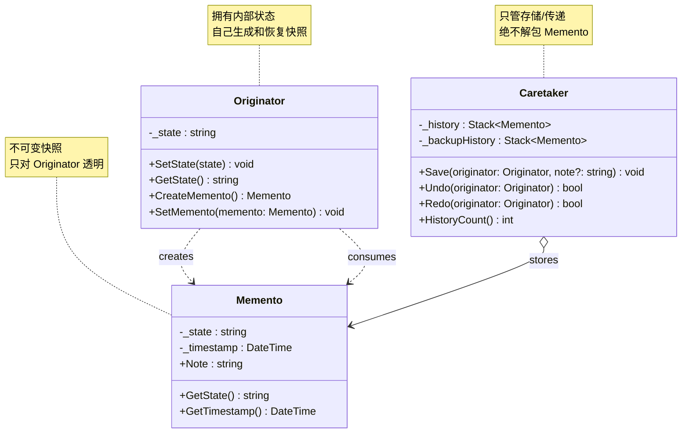
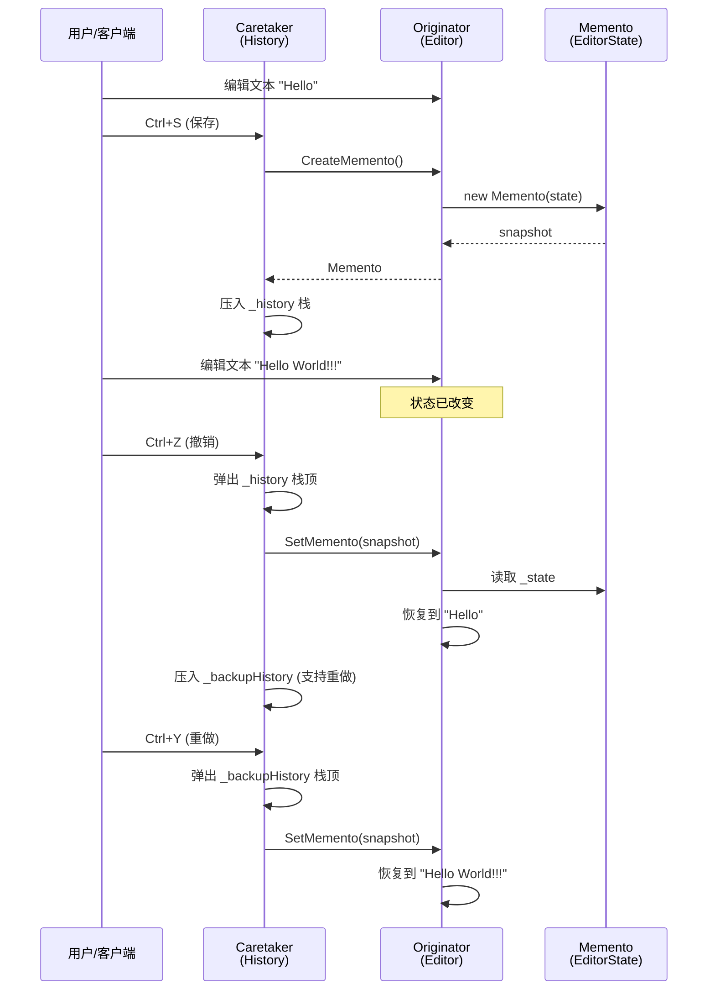
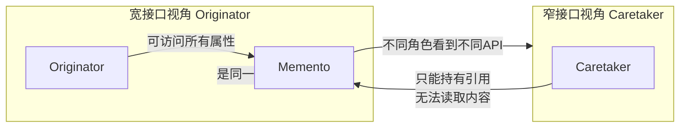

# 备忘录模式 (Memento Pattern)

> 所属计划: [[design-patterns-csharp|设计模式 (C#)]]
> 预计耗时: 50 分钟
> 前置知识: [[16-behavioral-intro|行为型模式总览]]、C# 深拷贝与浅拷贝、`record` 不可变性、`System.Text.Json` 基础

---

## 1. 概念讲解

### 备忘录模式解决什么问题？

几乎所有带"编辑"功能的软件都需要**撤销**：文本编辑器、图像软件、数据库 GUI。核心矛盾是：

- 你需要**保存对象在某个时刻的完整状态**（以便恢复）
- 但对象的内部状态是**封装的**——外部不应直接访问私有字段
- 如果把状态保存工作交给对象自己，又会让它**承担额外职责**（违反单一职责原则）

直接在外部操作内部状态就是破坏封装：

```csharp
// ❌ 反例：外部直接访问内部状态实现"保存"
public class Editor
{
    public string Text;        // 为了"保存"被迫公开
    public int CursorX;        // 为了"保存"被迫公开
    public int CursorY;        // 为了"保存"被迫公开
    public List<Style> Styles; // 为了"保存"被迫公开
}

// 外部"保存"代码——与 Editor 的封装深度耦合
var snapshot = (editor.Text, editor.CursorX, editor.CursorY,
    editor.Styles.Select(s => s.Clone()).ToList());
```

一旦 `Editor` 新增字段，所有保存/恢复代码都要改。这是**封装泄漏**。

**备忘录模式的核心思想**：由 Originator（原发器）自己创建并消费快照（Memento），外部 Caretaker（负责人）只负责存储和传递——它永不窥探 Memento 的内容。

```
┌─────────────────────────────────────────────────────────────┐
│  Originator              Memento              Caretaker     │
│  (拥有状态)              (状态快照)           (管理历史)      │
│                                                             │
│  CreateMemento() ──────► [封存状态] ──────► Push(snapshot)   │
│                                                             │
│  ... 用户修改状态 ...                                        │
│                                                             │
│  SetMemento(m) ◄──────── [封存状态] ◄─────── Pop()           │
│                                                             │
│  Caretaker 从不读取 Memento 内部 — 它只是一个"黑盒"传递者     │
└─────────────────────────────────────────────────────────────┘
```

### 备忘录模式结构



**关键角色：**

| 角色 | 职责 |
|------|------|
| `Originator` | 拥有内部状态的对象；创建 Memento 记录当前状态；从 Memento 恢复状态 |
| `Memento` | 不可变的值对象，持有 Originator 某一时刻的内部状态快照 |
| `Caretaker` | 持有 Memento 集合；触发保存/恢复；**永远不读取 Memento 内部** |

### 备忘录模式交互流程



> [!tip] 关键约束
> Caretaker 通过 Originator 间接与 Memento 交互。它持有 Memento 但从不调用 `GetState()`——那个方法只对 Originator 可见（或通过窄接口）。

### 备忘录模式的两个接口纬度

GoF 原版讨论了 Memento 的**宽/窄接口**问题——一个重要的封装权衡：

| 接口类型 | 可见范围 | 适用场景 | 实现方式 |
|----------|---------|---------|---------|
| **宽接口** | Originator 可见全部 | Originator 需要完整状态恢复 | Originator 和 Memento 在同一 assembly，用 `internal` |
| **窄接口** | Caretaker 只看到"黑盒" | 保护封装，Caretaker 无感知 | Memento 的 `GetState()` 标记 `internal`；Caretaker 在外部 |



在 C# 中，这通过 `internal` 访问修饰符自然实现：Memento 的属性标记 `internal`，Originator 在同一程序集中可以访问，而 Caretaker 如果在外部程序集中则只能持有引用。

---

## 2. 代码示例

### 2.1 文本编辑器撤销/重做

**场景**：一个简易文本编辑器，支持修改文本、光标位置、字体大小，并能撤销和重做所有操作。

```csharp
// ============================================
// Memento — 不可变快照
// ============================================
public class EditorState
{
    // internal: 只对此 assembly 内的 Originator 可见
    internal string Text { get; }
    internal int CursorPosition { get; }
    internal int FontSize { get; }
    public DateTime Timestamp { get; }
    public string? Note { get; }

    internal EditorState(string text, int cursorPosition, int fontSize,
        DateTime timestamp, string? note = null)
    {
        Text = text;
        CursorPosition = cursorPosition;
        FontSize = fontSize;
        Timestamp = timestamp;
        Note = note;
    }

    // 方便调试/日志（不暴露内部细节）
    public override string ToString()
        => $"[{Timestamp:HH:mm:ss}] {(Note ?? "snapshot")}";
}
```

```csharp
// ============================================
// Originator — 编辑器
// ============================================
public class Editor
{
    private string _text = string.Empty;
    private int _cursorPosition;
    private int _fontSize = 12;

    public void Type(string text)
    {
        _text += text;
        _cursorPosition = _text.Length;
    }

    public void Delete(int count)
    {
        if (count > _text.Length) count = _text.Length;
        _text = _text[..^count];
        _cursorPosition = _text.Length;
    }

    public void MoveCursor(int position)
    {
        _cursorPosition = Math.Clamp(position, 0, _text.Length);
    }

    public void SetFontSize(int size)
    {
        _fontSize = Math.Clamp(size, 8, 72);
    }

    public void Display()
    {
        Console.WriteLine($"文本: \"{_text}\"");
        Console.WriteLine($"光标位置: {_cursorPosition}, 字号: {_fontSize}");
        Console.WriteLine();
    }

    // 创建当前状态的快照
    public EditorState CreateMemento(string? note = null)
    {
        return new EditorState(_text, _cursorPosition, _fontSize,
            DateTime.Now, note);
    }

    // 从快照恢复
    public void SetMemento(EditorState memento)
    {
        _text = memento.Text;
        _cursorPosition = memento.CursorPosition;
        _fontSize = memento.FontSize;
    }
}
```

```csharp
// ============================================
// Caretaker — 历史管理器
// ============================================
public class History
{
    private readonly Stack<EditorState> _undoStack = new();
    private readonly Stack<EditorState> _redoStack = new();

    public void Save(Editor editor, string? note = null)
    {
        var memento = editor.CreateMemento(note);
        _undoStack.Push(memento);
        _redoStack.Clear(); // 新操作清空重做链
        Console.WriteLine($"  [History] 已保存: {memento}");
    }

    public bool Undo(Editor editor)
    {
        if (_undoStack.Count == 0)
        {
            Console.WriteLine("  [History] 无可撤销操作");
            return false;
        }

        // 当前状态先压入重做栈
        _redoStack.Push(editor.CreateMemento("before redo"));

        var memento = _undoStack.Pop();
        editor.SetMemento(memento);
        Console.WriteLine($"  [History] 撤销至: {memento}");
        return true;
    }

    public bool Redo(Editor editor)
    {
        if (_redoStack.Count == 0)
        {
            Console.WriteLine("  [History] 无可重做操作");
            return false;
        }

        _undoStack.Push(editor.CreateMemento("before undo"));

        var memento = _redoStack.Pop();
        editor.SetMemento(memento);
        Console.WriteLine($"  [History] 重做至: {memento}");
        return true;
    }

    public int UndoCount => _undoStack.Count;
    public int RedoCount => _redoStack.Count;
}
```

```csharp
// ============================================
// 运行演示
// ============================================
var editor = new Editor();
var history = new History();

Console.WriteLine("=== 备忘录模式 — 文本编辑器 Undo/Redo ===\n");

// 1. 初始状态
editor.Type("Hello");
history.Save(editor, "输入 Hello");
editor.Display();

// 2. 追加文本
editor.Type(" World");
history.Save(editor, "输入 World");
editor.Display();

// 3. 修改字号
editor.SetFontSize(16);
history.Save(editor, "改字号 16");
editor.Display();

// 4. 删除字符
editor.Delete(3);
history.Save(editor, "删除 3 字符");
editor.Display();

// 5. Undo 两次
Console.WriteLine("--- Undo x2 ---");
history.Undo(editor);
editor.Display();
history.Undo(editor);
editor.Display();

// 6. Redo 一次
Console.WriteLine("--- Redo x1 ---");
history.Redo(editor);
editor.Display();

/* 输出:
=== 备忘录模式 — 文本编辑器 Undo/Redo ===

  [History] 已保存: [12:00:01] 输入 Hello
文本: "Hello"
光标位置: 5, 字号: 12

  [History] 已保存: [12:00:02] 输入 World
文本: "Hello World"
光标位置: 11, 字号: 12

  [History] 已保存: [12:00:03] 改字号 16
文本: "Hello World"
光标位置: 11, 字号: 16

  [History] 已保存: [12:00:04] 删除 3 字符
文本: "Hello Wor"
光标位置: 9, 字号: 16

--- Undo x2 ---
  [History] 撤销至: [12:00:03] 改字号 16
文本: "Hello World"
光标位置: 11, 字号: 16
  [History] 撤销至: [12:00:02] 输入 World
文本: "Hello World"
光标位置: 11, 字号: 12

--- Redo x1 ---
  [History] 重做至: [12:00:03] 改字号 16
文本: "Hello World"
光标位置: 11, 字号: 16
*/
```

**运行方式:**
```bash
dotnet new console -n MementoTextEditor
# 将上述代码放入 Program.cs
dotnet run --project MementoTextEditor
```

### 2.2 游戏存档系统

**场景**：RPG 游戏中保存和加载玩家状态（位置、血量、背包）。支持多个存档槽位。

```csharp
// ============================================
// Memento — 游戏存档快照（不可变）
// ============================================
public class PlayerSnapshot
{
    internal int Level { get; }
    internal int Health { get; }
    internal int MaxHealth { get; }
    internal float PositionX { get; }
    internal float PositionY { get; }
    internal string[] Inventory { get; }
    internal string CurrentQuest { get; }
    public DateTime SavedAt { get; }
    public string SlotName { get; }

    internal PlayerSnapshot(int level, int health, int maxHealth,
        float posX, float posY, string[] inventory, string currentQuest,
        DateTime savedAt, string slotName)
    {
        Level = level;
        Health = health;
        MaxHealth = maxHealth;
        PositionX = posX;
        PositionY = posY;
        Inventory = inventory;
        CurrentQuest = currentQuest;
        SavedAt = savedAt;
        SlotName = slotName;
    }

    public override string ToString()
        => $"[{SlotName}] Lv.{Level} HP:{Health}/{MaxHealth} @({PositionX:F1},{PositionY:F1})";
}
```

```csharp
// ============================================
// Originator — 玩家
// ============================================
public class Player
{
    public int Level { get; private set; } = 1;
    public int Health { get; private set; } = 100;
    public int MaxHealth { get; private set; } = 100;
    public float PositionX { get; private set; }
    public float PositionY { get; private set; }
    public string CurrentQuest { get; private set; } = "序章：觉醒";
    private readonly List<string> _inventory = new() { "木剑", "布衣" };

    public void MoveTo(float x, float y)
    {
        PositionX = x;
        PositionY = y;
    }

    public void TakeDamage(int damage)
    {
        Health = Math.Max(0, Health - damage);
    }

    public void LevelUp()
    {
        Level++;
        MaxHealth += 20;
        Health = MaxHealth;
    }

    public void AddItem(string item) => _inventory.Add(item);

    public void SetQuest(string quest) => CurrentQuest = quest;

    public void Display()
    {
        Console.WriteLine($"  Lv.{Level} 勇者 | HP: {Health}/{MaxHealth}");
        Console.WriteLine($"  位置: ({PositionX:F1}, {PositionY:F1})");
        Console.WriteLine($"  任务: {CurrentQuest}");
        Console.WriteLine($"  背包: [{string.Join(", ", _inventory)}]");
        Console.WriteLine();
    }

    public PlayerSnapshot CreateSnapshot(string slotName)
    {
        // 深拷贝数组，防止外部修改
        return new PlayerSnapshot(
            Level, Health, MaxHealth, PositionX, PositionY,
            _inventory.ToArray(), CurrentQuest,
            DateTime.Now, slotName);
    }

    public void RestoreSnapshot(PlayerSnapshot snapshot)
    {
        Level = snapshot.Level;
        Health = snapshot.Health;
        MaxHealth = snapshot.MaxHealth;
        PositionX = snapshot.PositionX;
        PositionY = snapshot.PositionY;
        CurrentQuest = snapshot.CurrentQuest;

        _inventory.Clear();
        _inventory.AddRange(snapshot.Inventory);
    }
}
```

```csharp
// ============================================
// Caretaker — 存档管理器（多槽位）
// ============================================
public class SaveManager
{
    private readonly Dictionary<string, PlayerSnapshot> _slots = new();

    public bool Save(Player player, string slotName)
    {
        if (string.IsNullOrWhiteSpace(slotName))
        {
            Console.WriteLine("  [SaveManager] 槽位名不能为空");
            return false;
        }

        var snapshot = player.CreateSnapshot(slotName);
        _slots[slotName] = snapshot;
        Console.WriteLine($"  [SaveManager] 已保存至槽位 \"{slotName}\"");
        return true;
    }

    public bool Load(Player player, string slotName)
    {
        if (!_slots.TryGetValue(slotName, out var snapshot))
        {
            Console.WriteLine($"  [SaveManager] 槽位 \"{slotName}\" 不存在");
            return false;
        }

        player.RestoreSnapshot(snapshot);
        Console.WriteLine($"  [SaveManager] 已从槽位 \"{slotName}\" 加载");
        return true;
    }

    public void ListSlots()
    {
        Console.WriteLine("  存档列表:");
        if (_slots.Count == 0)
        {
            Console.WriteLine("    (空)");
            return;
        }
        foreach (var (name, snap) in _slots)
        {
            Console.WriteLine($"    {snap}");
        }
    }

    public bool DeleteSlot(string slotName) => _slots.Remove(slotName);
}
```

```csharp
// ============================================
// 运行演示
// ============================================
var player = new Player();
var saves = new SaveManager();

Console.WriteLine("=== 备忘录模式 — 游戏存档系统 ===\n");

// 初始状态
Console.WriteLine("1. 初始状态:");
player.Display();

// 存档
saves.Save(player, "自动存档");
Console.WriteLine();

// 游戏进程
Console.WriteLine("2. 玩家开始冒险...");
player.MoveTo(120.5f, -45.3f);
player.TakeDamage(30);
player.LevelUp();
player.AddItem("铁剑");
player.SetQuest("第一章：森林之影");
player.Display();

// 一个新存档
saves.Save(player, "Boss战前");
Console.WriteLine();

// 继续冒险
Console.WriteLine("3. 继续冒险（Boss 战）...");
player.MoveTo(200f, -100f);
player.TakeDamage(80);
player.AddItem("龙鳞盾");
player.SetQuest("第一章：击败巨龙");
player.Display();

// 加载 Boss 战前的存档
Console.WriteLine("4. 加载 \"Boss战前\" 存档...");
saves.Load(player, "Boss战前");
player.Display();

// 查看所有存档
Console.WriteLine("5. 全部存档:");
saves.ListSlots();

/* 输出:
=== 备忘录模式 — 游戏存档系统 ===

1. 初始状态:
  Lv.1 勇者 | HP: 100/100
  位置: (0.0, 0.0)
  任务: 序章：觉醒
  背包: [木剑, 布衣]

  [SaveManager] 已保存至槽位 "自动存档"

2. 玩家开始冒险...
  Lv.2 勇者 | HP: 90/120
  位置: (120.5, -45.3)
  任务: 第一章：森林之影
  背包: [木剑, 布衣, 铁剑]

  [SaveManager] 已保存至槽位 "Boss战前"

3. 继续冒险（Boss 战）...
  Lv.2 勇者 | HP: 10/120
  位置: (200.0, -100.0)
  任务: 第一章：击败巨龙
  背包: [木剑, 布衣, 铁剑, 龙鳞盾]

4. 加载 "Boss战前" 存档...
  [SaveManager] 已从槽位 "Boss战前" 加载
  Lv.2 勇者 | HP: 90/120
  位置: (120.5, -45.3)
  任务: 第一章：森林之影
  背包: [木剑, 布衣, 铁剑]

5. 全部存档:
  存档列表:
    [自动存档] Lv.1 HP:100/100 @(0.0,0.0)
    [Boss战前] Lv.2 HP:90/120 @(120.5,-45.3)
*/
```

### 2.3 C# 惯用写法：`record` + `with` 表达式

C# 9+ 的 `record` 类型天然不可变且自带值语义——用来做 Memento 非常合适。`with` 表达式可以在快照基础上创建增量修改。

```csharp
// ============================================
// Memento — 用 record 定义（天然不可变）
// ============================================
public sealed record DocumentMemento(
    string Title,
    string Content,
    DateTime LastModified,
    int Version,
    string? Author
);

// ============================================
// Originator — 文档
// ============================================
public class Document
{
    public string Title { get; private set; }
    public string Content { get; private set; }
    public DateTime LastModified { get; private set; }
    public int Version { get; private set; }
    public string? Author { get; set; }

    public Document(string title, string content = "")
    {
        Title = title;
        Content = content;
        LastModified = DateTime.Now;
        Version = 1;
    }

    public void Edit(string newContent)
    {
        Content = newContent;
        LastModified = DateTime.Now;
        Version++;
    }

    public void Rename(string newTitle)
    {
        Title = newTitle;
        LastModified = DateTime.Now;
    }

    public void Display()
    {
        Console.WriteLine($"  文档: \"{Title}\"");
        Console.WriteLine($"  版本: v{Version}");
        Console.WriteLine($"  内容: {Content[..Math.Min(Content.Length, 50)]}...");
        Console.WriteLine($"  修改: {LastModified:yyyy-MM-dd HH:mm:ss}");
        if (Author != null) Console.WriteLine($"  作者: {Author}");
        Console.WriteLine();
    }

    // 创建快照 — 一行搞定
    public DocumentMemento CreateMemento()
        => new(Title, Content, LastModified, Version, Author);

    // 恢复快照
    public void SetMemento(DocumentMemento m)
    {
        Title = m.Title;
        Content = m.Content;
        LastModified = m.LastModified;
        Version = m.Version;
        Author = m.Author;
    }
}
```

```csharp
// ============================================
// Caretaker — 版本历史
// ============================================
public class VersionHistory
{
    private readonly Stack<DocumentMemento> _versions = new();

    public void Save(Document doc)
    {
        _versions.Push(doc.CreateMemento());
        Console.WriteLine($"  [History] 已保存 v{doc.Version}");
    }

    public bool Undo(Document doc)
    {
        if (_versions.Count == 0)
        {
            Console.WriteLine("  [History] 无历史版本");
            return false;
        }
        var memento = _versions.Pop();
        doc.SetMemento(memento);
        Console.WriteLine($"  [History] 已回退至 v{doc.Version}");
        return true;
    }
}

// ============================================
// with 表达式：创建增量 Memento
// ============================================
public static class MementoExtensions
{
    // 基于旧 Memento 仅修改一个字段创建新 Memento
    public static DocumentMemento WithAuthor(
        this DocumentMemento memento, string author)
        => memento with { Author = author };

    public static DocumentMemento WithContent(
        this DocumentMemento memento, string content)
        => memento with { Content = content, LastModified = DateTime.Now };
}
```

```csharp
// ============================================
// 运行演示
// ============================================
var doc = new Document("设计模式笔记", "# 备忘录模式\n\n待补充...");
var history = new VersionHistory();

Console.WriteLine("=== record 作为 Memento + with 表达式 ===\n");

// 保存初始状态
history.Save(doc);
doc.Display();

// 编辑 + 保存
doc.Edit("# 备忘录模式\n\n捕获和恢复对象状态...");
history.Save(doc);
doc.Display();

// 重命名 + 保存
doc.Rename("设计模式笔记 v2");
doc.Author = "张三";
history.Save(doc);
doc.Display();

// Undo 两次
Console.WriteLine("--- Undo x2 ---");
history.Undo(doc);
doc.Display();
history.Undo(doc);
doc.Display();

// with 表达式演示：基于已有 Memento 创建修改版
var originalMemento = doc.CreateMemento();
var updatedMemento = originalMemento with { Author = "李四" };
Console.WriteLine($"原 Memento 作者: {originalMemento.Author}");
Console.WriteLine($"新 Memento 作者: {updatedMemento.Author}");
Console.WriteLine($"原 Memento 未被修改: {originalMemento.Author == null}");

/* 输出:
=== record 作为 Memento + with 表达式 ===

  [History] 已保存 v1
  文档: "设计模式笔记"
  版本: v1
  内容: # 备忘录模式

待补充......
  修改: 2026-06-08 10:00:00

  [History] 已保存 v2
  文档: "设计模式笔记"
  版本: v2
  内容: # 备忘录模式

捕获和恢复对象状态......
  修改: 2026-06-08 10:00:01

  [History] 已保存 v3
  文档: "设计模式笔记 v2"
  版本: v3
  内容: # 备忘录模式

捕获和恢复对象状态......
  修改: 2026-06-08 10:00:02
  作者: 张三

--- Undo x2 ---
  [History] 已回退至 v2
  文档: "设计模式笔记"
  版本: v2
  内容: # 备忘录模式

捕获和恢复对象状态......
  修改: 2026-06-08 10:00:01

  [History] 已回退至 v1
  文档: "设计模式笔记"
  版本: v1
  内容: # 备忘录模式

待补充......
  修改: 2026-06-08 10:00:00

原 Memento 作者:
新 Memento 作者: 李四
原 Memento 未被修改: True
*/
```

> [!tip] `record` 的三大优势
> 1. **天然不可变**：`record` 的 positional 构造生成的属性是 `{ get; init; }`，创建后无法修改
> 2. **值语义**：`Equals`/`GetHashCode` 自动比较所有属性——两个内容相同的快照自动相等
> 3. **`with` 表达式**：基于现有 Memento 创建修改版，零样板代码

### 2.4 进阶：序列化实现深度 Memento

当 Originator 包含多层嵌套的引用类型时，手动逐字段复制繁琐且容易出错（浅拷贝 Bug）。将整个对象图序列化为 JSON/二进制，实现通用深度快照。

```csharp
using System.Text.Json;

// ============================================
// 复杂对象图 — 包含嵌套引用类型
// ============================================
public class Project
{
    public string Name { get; set; } = "";
    public ProjectSettings Settings { get; set; } = new();
    public List<TaskItem> Tasks { get; set; } = new();
    public Dictionary<string, string> Metadata { get; set; } = new();

    public void Display()
    {
        Console.WriteLine($"项目: {Name}");
        Console.WriteLine($"  设置: Theme={Settings.Theme}, AutoSave={Settings.AutoSaveInterval}s");
        Console.WriteLine($"  任务数: {Tasks.Count}");
        foreach (var t in Tasks)
            Console.WriteLine($"    [{t.Status}] {t.Title} ({t.EstimatedHours}h)");
        Console.WriteLine($"  元数据: {Metadata.Count} 项");
        Console.WriteLine();
    }
}

public class ProjectSettings
{
    public string Theme { get; set; } = "Light";
    public int AutoSaveInterval { get; set; } = 300;
    public bool SpellCheck { get; set; } = true;
}

public class TaskItem
{
    public string Title { get; set; } = "";
    public string Status { get; set; } = "Todo";
    public int EstimatedHours { get; set; }
    public List<string> Tags { get; set; } = new();
}

// ============================================
// 通用 Memento — 用序列化实现深度快照
// ============================================
public class DeepMemento<T> where T : class
{
    private readonly string _json;
    public DateTime Timestamp { get; }
    public string? Note { get; }

    public DeepMemento(T source, string? note = null)
    {
        _json = JsonSerializer.Serialize(source,
            new JsonSerializerOptions { WriteIndented = false });
        Timestamp = DateTime.Now;
        Note = note;
    }

    public T Restore()
    {
        return JsonSerializer.Deserialize<T>(_json)
            ?? throw new InvalidOperationException("反序列化失败");
    }

    public override string ToString()
        => $"[{Timestamp:HH:mm:ss}] {(Note ?? "snapshot")} " +
           $"({_json.Length} bytes)";
}
```

```csharp
// ============================================
// Originator + Caretaker 合为一体的简化设计
// ============================================
public class ProjectManager
{
    private Project _project = new();
    private readonly Stack<DeepMemento<Project>> _undoStack = new();
    private readonly Stack<DeepMemento<Project>> _redoStack = new();

    public Project Current => _project;

    public void NewProject(string name)
    {
        _project = new Project { Name = name };
        _undoStack.Clear();
        _redoStack.Clear();
    }

    public void SaveCheckpoint(string? note = null)
    {
        _undoStack.Push(new DeepMemento<Project>(_project, note));
        _redoStack.Clear();
        Console.WriteLine($"  [Checkpoint] {_undoStack.Peek()}");
    }

    public bool Undo()
    {
        if (_undoStack.Count == 0) return false;
        _redoStack.Push(new DeepMemento<Project>(_project, "redo-checkpoint"));
        _project = _undoStack.Pop().Restore();
        Console.WriteLine($"  [Undo] 已恢复");
        return true;
    }

    public bool Redo()
    {
        if (_redoStack.Count == 0) return false;
        _undoStack.Push(new DeepMemento<Project>(_project, "undo-checkpoint"));
        _project = _redoStack.Pop().Restore();
        Console.WriteLine($"  [Redo] 已恢复");
        return true;
    }
}
```

```csharp
// ============================================
// 运行演示
// ============================================
var manager = new ProjectManager();

Console.WriteLine("=== 序列化 Memento — 深度对象图快照 ===\n");

// 创建项目
manager.NewProject("设计模式学习平台");
manager.Current.Settings = new ProjectSettings
{
    Theme = "Dark",
    AutoSaveInterval = 600
};
manager.Current.Tasks.AddRange(new[]
{
    new TaskItem
    {
        Title = "实现备忘录模式", Status = "InProgress",
        EstimatedHours = 4, Tags = new List<string> { "behavioral", "undo" }
    },
    new TaskItem
    {
        Title = "写单元测试", Status = "Todo",
        EstimatedHours = 2, Tags = new List<string> { "testing" }
    }
});
manager.Current.Metadata["Owner"] = "张三";
manager.Current.Metadata["Deadline"] = "2026-06-15";

Console.WriteLine("1. 初始状态:");
manager.Current.Display();

// 保存检查点
manager.SaveCheckpoint("初始版本");

// 修改项目
Console.WriteLine("2. 修改项目...");
manager.Current.Tasks[0].Status = "Done";
manager.Current.Tasks.Add(new TaskItem
{
    Title = "重构 Caretaker", Status = "Todo",
    EstimatedHours = 3, Tags = new List<string> { "refactor" }
});
manager.Current.Settings.SpellCheck = false;
manager.Current.Display();

// 保存检查点
manager.SaveCheckpoint("任务更新");

// 再次修改
Console.WriteLine("3. 删除一个任务...");
manager.Current.Tasks.RemoveAt(0);
manager.Current.Metadata["Reviewer"] = "李四";
manager.Current.Display();

// Undo 两步
Console.WriteLine("--- Undo x2 ---");
manager.Undo();
manager.Current.Display();
manager.Undo();
manager.Current.Display();

// Redo
Console.WriteLine("--- Redo x1 ---");
manager.Redo();
manager.Current.Display();

/* 输出:
=== 序列化 Memento — 深度对象图快照 ===

1. 初始状态:
项目: 设计模式学习平台
  设置: Theme=Dark, AutoSave=600s
  任务数: 2
    [InProgress] 实现备忘录模式 (4h)
    [Todo] 写单元测试 (2h)
  元数据: 2 项

  [Checkpoint] [10:00:01] 初始版本 (312 bytes)

2. 修改项目...
项目: 设计模式学习平台
  设置: Theme=Dark, AutoSave=600s
  任务数: 3
    [Done] 实现备忘录模式 (4h)
    [Todo] 写单元测试 (2h)
    [Todo] 重构 Caretaker (3h)
  元数据: 2 项

  [Checkpoint] [10:00:02] 任务更新 (387 bytes)

3. 删除一个任务...
项目: 设计模式学习平台
  设置: Theme=Dark, AutoSave=600s
  任务数: 2
    [Todo] 写单元测试 (2h)
    [Todo] 重构 Caretaker (3h)
  元数据: 3 项

--- Undo x2 ---
  [Undo] 已恢复
项目: 设计模式学习平台
  设置: Theme=Dark, AutoSave=600s
  任务数: 3
    [Done] 实现备忘录模式 (4h)
    [Todo] 写单元测试 (2h)
    [Todo] 重构 Caretaker (3h)
  元数据: 2 项

  [Undo] 已恢复
项目: 设计模式学习平台
  设置: Theme=Dark, AutoSave=600s
  任务数: 2
    [InProgress] 实现备忘录模式 (4h)
    [Todo] 写单元测试 (2h)
  元数据: 2 项

--- Redo x1 ---
  [Redo] 已恢复
项目: 设计模式学习平台
  设置: Theme=Dark, AutoSave=600s
  任务数: 3
    [Done] 实现备忘录模式 (4h)
    [Todo] 写单元测试 (2h)
    [Todo] 重构 Caretaker (3h)
  元数据: 2 项
*/
```

**运行方式:**
```bash
dotnet new console -n MementoSerialization
# 将上述代码放入 Program.cs
dotnet run --project MementoSerialization
```

> [!warning] 序列化 Memento 的适用条件
> 1. 对象图中的所有类型必须可序列化（`System.Text.Json` 要求公共属性、无参构造器或 `[JsonConstructor]`）
> 2. 循环引用会导致 `StackOverflowException`——设置 `ReferenceHandler.Preserve`
> 3. 大对象图的序列化成本不低——如果状态只改了一个字段，序列化全图是浪费（见 2.5 节差分存储与练习 3）

> [!tip] 序列化 vs 手动复制 vs `record with`
> | 方案 | 适用场景 | 优点 | 缺点 |
> |------|---------|------|------|
> | **手动逐字段复制** | 简单对象，字段少 | 最高性能，完全控制 | 极易遗漏新字段 |
> | **`record` + `with`** | 中等复杂度，不可变对象 | 编译期安全，简洁 | 仅适用于 `record` 类型 |
> | **序列化深度快照** | 复杂嵌套对象图 | 通用，不怕遗漏 | 有序列化成本，需可序列化约束 |


### 2.5 进阶：差分存储 Memento (Delta Storage)

2.4 的序列化方案每次保存都拷贝整个对象图。当状态很大（1000 个任务、10 MB 文档）而每次只改了一小部分时，全量快照会让历史栈以 **O(n × |S|)** 膨胀——n 是历史条目数，|S| 是单次状态大小。差分存储把内存压到 **O(|S| + n × |d|)**，其中 |d| ≪ |S| 是平均差异大小。

**类比：** 视频压缩用关键帧（I-frame）+ 差异帧（P-frame/B-frame）——关键帧是全量，差异帧只编码"相对前一帧的变化"。Git 的 pack 文件、数据库的 WAL + checkpoint、游戏的自动存档 + 增量都遵循同一原理。

但在动手写 Delta 之前，先问一个问题：**你真的需要差分吗？** 很多时候换成不可变数据结构就够了。下面按"从简单到复杂"的顺序介绍三种策略。

#### 全量快照的内存代价

以一个 100 任务的项目为例（单次全量快照 ≈ 8 KB），每次只改动一个任务：

| 保存次数 | 全量快照 | 差分存储 | 节省 |
|---------|---------|---------|------|
| 5 | ~40 KB | ~8.2 KB | 79% |
| 50 | ~400 KB | ~9.8 KB | 97.5% |
| 200 | ~1.6 MB | ~15 KB | 99% |

历史越长、单次改动越小，差分的优势越大。

#### 策略一：结构共享——可能根本不用写 Diff

如果能把状态模型改成**不可变**的（`record` + `ImmutableList` / `ImmutableDictionary`），那么"存一个完整快照"其实只新增被改动路径上的节点——`ImmutableList<T>` 是平衡树，`SetItem`/`Insert` 返回的新树**共享所有未改动的子树**。于是连续 N 个快照在内存里只占约 **|S| + n × log |S|**，而撤销只需 **O(1)**（直接返回存好的引用），**零 diff 代码、零回放**。

```csharp
using System.Collections.Immutable;

// 不可变状态模型：record + 不可变集合
public sealed record TaskItem(string Title, string Status, int Hours);

public sealed record ProjectState(
    string Name,
    ImmutableList<TaskItem> Tasks,
    ImmutableDictionary<string, string> Metadata
);

// ============================================
// 结构共享历史——直接存不可变快照，O(1) 撤销，零 diff
// ============================================
public class SharedSnapshotHistory
{
    private readonly List<ProjectState> _snapshots = new();
    private int _cursor = -1;

    public void Save(ProjectState state)
    {
        // 新分支：丢弃 cursor 之后的快照
        if (_cursor < _snapshots.Count - 1)
            _snapshots.RemoveRange(_cursor + 1, _snapshots.Count - _cursor - 1);
        _snapshots.Add(state);          // 不可变 → 直接存引用，共享未改动节点
        _cursor = _snapshots.Count - 1;
    }

    public ProjectState? Undo() => _cursor > 0 ? _snapshots[--_cursor] : null;
    public ProjectState? Redo() => _cursor < _snapshots.Count - 1 ? _snapshots[++_cursor] : null;
}
```

> [!tip] 先试无聊的方案
> 改一个任务的状态时，`state with { Tasks = state.Tasks.SetItem(i, ...) }` 只产生 ~log₂(100) ≈ 7 个新树节点，其余 93 个任务节点与旧快照共享。多数内存压力问题**仅靠结构共享就解决了**——撤销还是 O(1)。差分存储是"还不够"时的下一道防线。

**那什么时候结构共享不够？** 当快照要**离开内存**时——持久化到磁盘、同步到网络、跨进程传递。序列化一个不可变快照会把共享结构"摊平"成完整字节流，结构共享在序列化边界上**完全失效**。这时每个全量快照又变成 O(|S|) 字节，差分存储才能真正压缩字节数。所以判断标准是：

- **内存内撤销**（编辑器、IDE）→ 优先不可变模型 + 结构共享（最简单）
- **持久化/传输撤销**（存档文件、协作同步、Git pack）→ 差分存储压缩序列化字节

#### 策略二：差分存储——Baseline + 元素级 Delta

第一个快照保存全量（Baseline），后续只存"相对前一状态的差异"（Delta）。差异用**判别式联合**（`abstract record Change` + 一组 `sealed record`）表达，模式匹配分发，类型安全且穷尽。

```csharp
// ============================================
// Change — 相对前一状态的一个原子变更
// ============================================
public abstract record Change
{
    public sealed record SetName(string Value) : Change;
    // 元素级差分：只记录变化的那个任务，而非整个列表
    public sealed record ReplaceTask(int Index, TaskItem Value) : Change;
    public sealed record InsertTask(int Index, TaskItem Value) : Change;
    public sealed record RemoveTask(int Index, TaskItem OldValue) : Change;
    public sealed record MetaPut(string Key, string Value) : Change;
    public sealed record MetaDelete(string Key) : Change;
}
```

> [!warning] 列表差分的头号陷阱：别用"整表比较"
> 一个常见简化是把整个 `Tasks` 列表序列化成 JSON 再比较——一旦任何一个任务变了，就把**整个列表**当作 Delta 存下来（100 个任务全部存）。这等于丢掉了差分的全部收益。正确做法是**逐元素比较**（`record` 的值相等性是 O(1)），只对变化的索引生成 `ReplaceTask`/`InsertTask`/`RemoveTask`。本节下面的 `DiffTasks` 就是元素级实现；练习 3 的参考答案用了整表简化以便入门，可对照理解其代价。

`StateDiffer` 负责计算差异与应用差异。应用差异时同样借助 `ImmutableList` 的结构共享，让每次 `Apply` 只花 O(log n)：

```csharp
// ============================================
// StateDiffer — 元素级 Diff + 结构共享 Apply
// ============================================
public static class StateDiffer
{
    public static IReadOnlyList<Change> Diff(ProjectState prev, ProjectState next)
    {
        var changes = new List<Change>();
        if (prev.Name != next.Name)
            changes.Add(new Change.SetName(next.Name));
        DiffTasks(prev.Tasks, next.Tasks, changes);
        DiffMeta(prev.Metadata, next.Metadata, changes);
        return changes;
    }

    private static void DiffTasks(
        ImmutableList<TaskItem> prev, ImmutableList<TaskItem> next,
        List<Change> changes)
    {
        int n = Math.Min(prev.Count, next.Count);
        for (int i = 0; i < n; i++)            // 重叠区间：逐元素比较
            if (prev[i] != next[i])
                changes.Add(new Change.ReplaceTask(i, next[i]));
        for (int i = n; i < next.Count; i++)   // next 更长：尾部新增
            changes.Add(new Change.InsertTask(i, next[i]));
        for (int i = prev.Count - 1; i >= next.Count; i--)  // 逆序删除，索引稳定
            changes.Add(new Change.RemoveTask(i, prev[i]));
    }

    private static void DiffMeta(
        ImmutableDictionary<string, string> prev,
        ImmutableDictionary<string, string> next,
        List<Change> changes)
    {
        foreach (var (k, v) in next)
            if (!prev.TryGetValue(k, out var pv) || pv != v)
                changes.Add(new Change.MetaPut(k, v));
        foreach (var k in prev.Keys)
            if (!next.ContainsKey(k))
                changes.Add(new Change.MetaDelete(k));
    }

    public static ProjectState Apply(ProjectState state, Change c) => c switch
    {
        Change.SetName v      => state with { Name = v.Value },
        Change.ReplaceTask t  => state with { Tasks = state.Tasks.SetItem(t.Index, t.Value) },
        Change.InsertTask t   => state with { Tasks = state.Tasks.Insert(t.Index, t.Value) },
        Change.RemoveTask t   => state with { Tasks = state.Tasks.RemoveAt(t.Index) },
        Change.MetaPut m      => state with { Metadata = state.Metadata.SetItem(m.Key, m.Value) },
        Change.MetaDelete m   => state with { Metadata = state.Metadata.Remove(m.Key) },
        _ => state
    };

    public static ProjectState ApplyAll(ProjectState s, IEnumerable<Change> cs)
    { foreach (var c in cs) s = Apply(s, c); return s; }
}
```

#### 策略三：周期性检查点——限制回放成本

差分存储的代价：撤销时不能直接"读"一个快照，而要从最近的 Baseline 检查点**回放** Delta 链。若链条很长，回放成本会累积成 O(n)。解决方法是**周期性插入全量检查点**——每 N 个 Delta 后强制存一次 Full，把任意位置的恢复成本限制在 O(N)：

```
历史时间线 ──────────────────────────────────────────────────►

[Full]──►[Δ]──►[Δ]──►[Δ]──►[Δ]──►[Δ]──►[Full]──►[Δ]──►[Δ]
  #1      #2    #3    #4    #5    #6     #7         #8    #9
 baseline                              检查点

Materialize(#9)：向左找最近的 Full(#7)，只需回放 #8、#9 两步
Materialize(#5)：向左找最近的 Full(#1)，回放 #2..#5 四步
任意位置的回放步数 ≤ CheckpointInterval（本例 = 5）
```

> [!tip] 检查点 = 视频编码的 I 帧
> `Full` 快照就是关键帧（I-frame），可独立解码；`Delta` 是预测帧（P-frame），必须依赖前一帧。关键帧占空间大但能随机定位，预测帧小但需要从头解码。`CheckpointInterval` 越小，回放越快但内存越大——这是时间与空间的权衡旋钮。Git 的 GC 会把松散对象重打包成 pack（带 delta 压缩 + 周期性全量对象），正是同一思想。

#### 完整实现：DeltaHistory

`DeltaHistory` 把三者合一：不可变模型（结构共享的 Apply）、Baseline + 元素级 Delta（压缩字节）、周期性检查点（限制回放）：

```csharp
// ============================================
// ProjectOriginator — 拥有状态，对外暴露 GetState / Restore
// ============================================
public class ProjectOriginator
{
    private ProjectState _state;
    public ProjectOriginator(string name) => _state = new(
        name, ImmutableList<TaskItem>.Empty, ImmutableDictionary<string, string>.Empty);

    public string Name => _state.Name;
    public int TaskCount => _state.Tasks.Count;
    public TaskItem TaskAt(int i) => _state.Tasks[i];

    public void Rename(string n) => _state = _state with { Name = n };
    public void SetTaskStatus(int i, string s) =>
        _state = _state with { Tasks = _state.Tasks.SetItem(i, _state.Tasks[i] with { Status = s }) };
    public void AddTask(TaskItem t) => _state = _state with { Tasks = _state.Tasks.Add(t) };
    public void SetMeta(string k, string v) =>
        _state = _state with { Metadata = _state.Metadata.SetItem(k, v) };

    public ProjectState GetState() => _state;
    public void Restore(ProjectState s) => _state = s;
    public void Display() =>
        Console.WriteLine($"  项目: \"{Name}\", 任务数: {TaskCount}, 元数据: {_state.Metadata.Count} 项");
}
```

```csharp
// ============================================
// Snapshot — Full 或 Delta
// ============================================
public sealed class Snapshot
{
    public bool IsFull { get; }
    public ProjectState? FullState { get; }
    public IReadOnlyList<Change>? Deltas { get; }
    public DateTime Timestamp { get; }
    private Snapshot(bool isFull, ProjectState? full, IReadOnlyList<Change>? deltas)
    { IsFull = isFull; FullState = full; Deltas = deltas; Timestamp = DateTime.Now; }

    public static Snapshot OfFull(ProjectState s) => new(true, s, null);
    public static Snapshot OfDelta(IReadOnlyList<Change> d) => new(false, null, d);

    public int EstimatedBytes => IsFull
        ? FullState!.Tasks.Count * 80 + FullState.Metadata.Count * 40 + FullState.Name.Length * 2
        : Deltas!.Sum(EstimateChange);

    private static int EstimateChange(Change c) => c switch
    {
        Change.SetName v     => v.Value.Length * 2 + 8,
        Change.ReplaceTask t => 16 + t.Value.Title.Length * 2 + t.Value.Status.Length * 2,
        Change.InsertTask t  => 16 + t.Value.Title.Length * 2 + t.Value.Status.Length * 2,
        Change.RemoveTask    => 8,
        Change.MetaPut m     => m.Key.Length * 2 + m.Value.Length * 2 + 8,
        Change.MetaDelete m  => m.Key.Length * 2 + 4,
        _ => 8
    };

    public override string ToString() => IsFull
        ? $"[Full {Timestamp:HH:mm:ss}] {FullState!.Tasks.Count} tasks (~{EstimatedBytes}B)"
        : $"[Delta {Timestamp:HH:mm:ss}] {Deltas!.Count} changes (~{EstimatedBytes}B)";
}

// ============================================
// DeltaHistory — 全量+差分链 + 周期性检查点
// ============================================
public class DeltaHistory
{
    private readonly List<Snapshot> _snapshots = new();
    private int _cursor = -1;
    private const int CheckpointInterval = 5;  // 每 5 个 Delta 强制一次 Full

    public void Save(ProjectOriginator originator)
    {
        var current = originator.GetState();
        Snapshot snap;

        if (_snapshots.Count == 0 || NeedsCheckpoint())
            snap = Snapshot.OfFull(current);           // Baseline 或检查点
        else
        {
            var changes = StateDiffer.Diff(Materialize(_cursor), current);
            snap = changes.Count == 0
                ? Snapshot.OfFull(current)
                : Snapshot.OfDelta(changes);
        }

        if (_cursor < _snapshots.Count - 1)             // 分支裁剪
            _snapshots.RemoveRange(_cursor + 1, _snapshots.Count - _cursor - 1);
        _snapshots.Add(snap);
        _cursor = _snapshots.Count - 1;
        Console.WriteLine($"  [Delta] 保存: {snap}");
    }

    // 距上一个 Full 超过 CheckpointInterval 个 Delta 则触发检查点
    private bool NeedsCheckpoint()
    {
        int deltaRun = 0;
        for (int i = _cursor; i >= 0; i--)
        { if (_snapshots[i].IsFull) break; deltaRun++; }
        return deltaRun >= CheckpointInterval;
    }

    public bool Undo(ProjectOriginator o)
    {
        if (_cursor <= 0) { Console.WriteLine("  [Delta] 无可撤销操作"); return false; }
        _cursor--; o.Restore(Materialize(_cursor));
        Console.WriteLine($"  [Delta] 撤销至快照 #{_cursor + 1}"); return true;
    }

    public bool Redo(ProjectOriginator o)
    {
        if (_cursor >= _snapshots.Count - 1) { Console.WriteLine("  [Delta] 无可重做操作"); return false; }
        _cursor++; o.Restore(Materialize(_cursor));
        Console.WriteLine($"  [Delta] 重做至快照 #{_cursor + 1}"); return true;
    }

    // 物化：从左边最近的 Full 检查点向右回放 Delta
    private ProjectState Materialize(int index)
    {
        int fullIdx = index;
        while (fullIdx >= 0 && !_snapshots[fullIdx].IsFull) fullIdx--;
        if (fullIdx < 0) fullIdx = 0;
        var state = _snapshots[fullIdx].FullState!;
        for (int i = fullIdx + 1; i <= index; i++)
            state = StateDiffer.ApplyAll(state, _snapshots[i].Deltas!);
        return state;
    }

    public void PrintStats()
    {
        Console.WriteLine("\n  快照统计:");
        int total = 0;
        for (int i = 0; i < _snapshots.Count; i++)
        { total += _snapshots[i].EstimatedBytes; Console.WriteLine($"    #{i + 1}: {_snapshots[i]}"); }
        int fullCost = _snapshots.Count * (_snapshots[0].FullState!.Tasks.Count * 80);
        double pct = fullCost > 0 ? 100.0 * (fullCost - total) / fullCost : 0;
        Console.WriteLine($"  差分总计: ~{total}B | 若全量方案: ~{fullCost}B | 节省 {pct:F1}%");
    }
}
```

```csharp
// ============================================
// 运行演示（顶级语句）
// ============================================
Console.WriteLine("=== 差分存储 Memento（元素级 Delta + 检查点）===\n");

var project = new ProjectOriginator("企业ERP系统");
for (int i = 1; i <= 100; i++)
    project.AddTask(new TaskItem($"任务 #{i}", "Todo", i % 8 + 1));

Console.WriteLine("1. 初始状态（100 个任务）:");
project.Display();
var history = new DeltaHistory();
history.Save(project);                       // #1 Baseline = Full

Console.WriteLine("\n2. 仅修改任务 #50 的状态:");
project.SetTaskStatus(49, "InProgress");
history.Save(project);                       // #2 Delta: 1 个 ReplaceTask

Console.WriteLine("\n3. 重命名项目:");
project.Rename("企业ERP系统 v2.0");
history.Save(project);                       // #3 Delta: 1 个 SetName

Console.WriteLine("\n4. 新增 1 个任务:");
project.AddTask(new TaskItem("任务 #101（紧急）", "Todo", 2));
history.Save(project);                       // #4 Delta: 1 个 InsertTask

Console.WriteLine("\n5. 新增元数据:");
project.SetMeta("Owner", "张三");
project.Display();
history.Save(project);                       // #5 Delta: 1 个 MetaPut

history.PrintStats();

Console.WriteLine("\n--- Undo x3（验证回放正确性）---");
history.Undo(project);                       // #5 → #4
Console.WriteLine($"  任务 #50: [{project.TaskAt(49).Status}]");
history.Undo(project);                       // #4 → #3（名称回到 v2.0）
Console.WriteLine($"  任务 #50: [{project.TaskAt(49).Status}], 名称: {project.Name}");
history.Undo(project);                       // #3 → #2（名称回到原名，任务 #50 仍为 InProgress）
Console.WriteLine($"  任务 #50: [{project.TaskAt(49).Status}], 名称: {project.Name}");

Console.WriteLine("\n--- Redo x2（验证前向回放）---");
history.Redo(project);                       // 到 #3
history.Redo(project);                       // 到 #4: 101 tasks
Console.WriteLine($"  任务数: {project.TaskCount}, 任务 #101: [{project.TaskAt(100).Status}]");

/* 输出:
=== 差分存储 Memento（元素级 Delta + 检查点）===

1. 初始状态（100 个任务）:
  项目: "企业ERP系统", 任务数: 100, 元数据: 0 项
  [Delta] 保存: [Full 20:39:07] 100 tasks (~8014B)

2. 仅修改任务 #50 的状态:
  [Delta] 保存: [Delta 20:39:07] 1 changes (~48B)

3. 重命名项目:
  [Delta] 保存: [Delta 20:39:07] 1 changes (~32B)

4. 新增 1 个任务:
  [Delta] 保存: [Delta 20:39:07] 1 changes (~46B)

5. 新增元数据:
  项目: "企业ERP系统 v2.0", 任务数: 101, 元数据: 1 项
  [Delta] 保存: [Delta 20:39:07] 1 changes (~22B)

  快照统计:
    #1: [Full 20:39:07] 100 tasks (~8014B)
    #2: [Delta 20:39:07] 1 changes (~48B)
    #3: [Delta 20:39:07] 1 changes (~32B)
    #4: [Delta 20:39:07] 1 changes (~46B)
    #5: [Delta 20:39:07] 1 changes (~22B)
  差分总计: ~8162B | 若全量方案: ~40000B | 节省 79.6%

--- Undo x3（验证回放正确性）---
  [Delta] 撤销至快照 #4
  任务 #50: [InProgress]
  [Delta] 撤销至快照 #3
  任务 #50: [InProgress], 名称: 企业ERP系统 v2.0
  [Delta] 撤销至快照 #2
  任务 #50: [InProgress], 名称: 企业ERP系统

--- Redo x2（验证前向回放）---
  [Delta] 重做至快照 #3
  [Delta] 重做至快照 #4
  任务数: 101, 任务 #101: [Todo]
*/
```

> [!note] 单文件编译顺序
> C# 顶级语句必须出现在类型声明**之前**。若把本节所有代码放进一个 `Program.cs`，请将"运行演示"块放在文件顶部，类型声明（`record Change`、`Snapshot`、`StateDiffer` 等）放在其后；或在演示外层包一个 `static void Main()`。

**运行方式:**
```bash
dotnet new console -n MementoDelta
# 将上述代码放入 Program.cs（演示语句在前，类型声明在后）
dotnet run --project MementoDelta
```

#### 三种策略对比

| 策略 | 历史内存 | 撤销成本 | 实现复杂度 | 适用场景 |
|------|---------|---------|-----------|---------|
| 全量快照（可变模型） | O(n × \|S\|) 高 | O(1) | 低 | 状态小、历史短 |
| 结构共享（不可变模型） | O(\|S\| + n·log\|S\|) | O(1) | 低 | 内存内撤销、频繁小改 |
| 差分存储（本节） | O(\|S\| + n·\|d\|) 最低 | O(k)，k≤检查点间隔 | 中 | 持久化/传输、状态大 |

> [!tip] 结构共享 + 差分可以叠加
> 本节的 `DeltaHistory` 两者都用：`record` + `ImmutableList` 让 `Apply` 借结构共享（回放也便宜），Delta 让历史字节最小。结构共享解决"内存内复制贵"，差分解决"序列化字节多"，互不冲突。

**关键设计要点：**
- **Baseline + Delta 链**：首快照全量，后续只存元素级差异（`ReplaceTask`/`InsertTask`/`RemoveTask`），单个 Delta ≈ 30–50 B
- **回放而非快照**：撤销从最近检查点回放 Delta——O(k)，k 受 `CheckpointInterval` 限制
- **检查点=关键帧**：周期性 Full 把任意位置的恢复成本限制在常数级
- **分支裁剪**：新操作丢弃 cursor 之后的快照，避免状态树分叉（与 2.1 的 `_redoStack.Clear()` 同理）
- **深拷贝安全**：`ImmutableList` 天生不可变，`Delta` 里存的 `TaskItem`（record）也天生不可变——无需手动深拷贝，不存在 2.1 节"幽灵修改"陷阱

---


## C++ 实现

C++ 中使用 `friend class` 控制访问权限：`EditorMemento` 构造函数私有化，仅 `Editor` 可创建与读取，`History` 只负责存储 `unique_ptr<EditorMemento>`。这与 GoF 的"窄接口/宽接口"原则一致 —— Caretaker 看到的只是黑盒。

```cpp
#include <iostream>
#include <string>
#include <vector>
#include <memory>
using namespace std;

// ============================================================
// 1. EditorMemento (Memento) — 不可变快照，私有构造函数
// ============================================================
class EditorMemento {
    string text;
    int cursorPosition;

    // 只有 Editor 可以创建和读取 Memento
    friend class Editor;

    EditorMemento(string t, int pos)
        : text(move(t)), cursorPosition(pos) {}
public:
    // Caretaker 只看到描述信息，不接触内部状态
    void describe() const {
        cout << "  [Memento] 快照 (文本长度: "
             << text.size() << ", 光标: " << cursorPosition << ")" << endl;
    }
};

// ============================================================
// 2. Editor (Originator) — 拥有内部状态，创建和恢复快照
// ============================================================
class Editor {
    string text;
    int cursorPosition{0};
public:
    void type(const string& words) {
        text += words;
        cursorPosition = static_cast<int>(text.size());
    }

    void deleteLast(int count) {
        if (count > static_cast<int>(text.size()))
            count = static_cast<int>(text.size());
        text.erase(text.size() - count);
        cursorPosition = static_cast<int>(text.size());
    }

    void display() const {
        cout << "  文本: \"" << text << "\""
             << " | 光标: " << cursorPosition << endl;
    }

    // 创建当前状态快照
    auto createMemento() const {
        return make_unique<EditorMemento>(text, cursorPosition);
    }

    // 从快照恢复
    void restoreFrom(const EditorMemento& m) {
        text = m.text;
        cursorPosition = m.cursorPosition;
    }
};

// ============================================================
// 3. History (Caretaker) — 只存储和传递快照，不解包
// ============================================================
class History {
    vector<unique_ptr<EditorMemento>> snapshots;
public:
    void save(const Editor& editor) {
        auto m = editor.createMemento();
        m->describe();
        snapshots.push_back(move(m));
    }

    bool undo(Editor& editor) {
        if (snapshots.empty()) {
            cout << "  [History] 无可撤销操作" << endl;
            return false;
        }
        auto m = move(snapshots.back());
        snapshots.pop_back();
        cout << "  [History] 恢复到上一个快照" << endl;
        editor.restoreFrom(*m);
        return true;
    }
};

// === main / usage ===
int main() {
    Editor editor;
    History history;

    editor.type("Hello");
    editor.display();
    history.save(editor);       // 保存快照 1: "Hello"

    editor.type(", World!");
    editor.display();
    history.save(editor);       // 保存快照 2: "Hello, World!"

    editor.type(" How are you?");
    editor.display();
    // 此行不保存 — 稍后撤销会丢弃它

    cout << "\n=== 开始撤销 ===" << endl;
    history.undo(editor);       // 恢复到 "Hello, World!"
    editor.display();

    history.undo(editor);       // 恢复到 "Hello"
    editor.display();

    history.undo(editor);       // 无可撤销

    return 0;
}
```

**编译运行：**
```bash
g++ -std=c++17 -o prog main.cpp && ./prog
```

**预期输出：**
```text
  文本: "Hello" | 光标: 5
  [Memento] 快照 (文本长度: 5, 光标: 5)
  文本: "Hello, World!" | 光标: 13
  [Memento] 快照 (文本长度: 13, 光标: 13)
  文本: "Hello, World! How are you?" | 光标: 26

=== 开始撤销 ===
  [History] 恢复到上一个快照
  文本: "Hello, World!" | 光标: 13
  [History] 恢复到上一个快照
  文本: "Hello" | 光标: 5
  [History] 无可撤销操作
```

## 3. 练习

### 练习 1：Command + Memento 实现 Undo/Redo

结合 [[18-command|命令模式]] 和备忘录模式，实现一个支持完整 Undo/Redo 的文本编辑器。

**要求：**
- 每个编辑操作（插入、删除、替换）封装为 `ICommand` 接口的实现
- 每个 Command 在执行前自动保存当前状态的 Memento
- Undo 时恢复 Memento 并执行 Command 的逆操作
- 支持批量操作的 Macro Command（一组命令作为一个事务）

**接口提示：**
```csharp
public interface ICommand
{
    void Execute(Editor editor);
    void Undo(Editor editor);
    string Description { get; }
}

public class InsertCommand : ICommand { /* ... */ }
public class DeleteCommand : ICommand { /* ... */ }
public class MacroCommand : ICommand { /* ... */ }
```

**验证：** 执行 5 个操作后，连续 Undo 5 次，状态必须精确回到初始状态。

### 练习 2：多槽位游戏存档系统

扩展 2.2 的游戏存档系统：

**要求：**
- 支持 3 个存档槽位（Slot1/Slot2/Slot3），每个槽位可保存不同角色或不同进度
- 存档时显示预览信息（等级、位置、游戏时长）但不暴露全部内部状态
- 支持存档覆盖确认（"该槽位已有存档，是否覆盖？"）
- 支持删除指定槽位的存档
- 提供"快速存档/读档"（专用槽位，绑定热键 F5/F9）

**验证：** 在 3 个槽位分别保存不同进度的存档，依次加载每个槽位并打印状态。

### 练习 3：差分存储 Memento

当对象状态很大时，每次保存完整副本浪费内存。实现一个只存储**变化部分**的 Memento 系统。

**要求：**
- 第一个 Memento 保存完整状态（Baseline）
- 后续 Memento 只存储与前一个 Memento 的差异（Delta）
- Caretaker 在 Undo 时能正确"回放"差异链
- 实现两种差异算法任选其一：
  - **基于属性比较**：比较新旧 Memento 的每个属性，只记录不同的
  - **基于 JSON Patch**：序列化为 JSON，用 `System.Text.Json` 的 `JsonDocument` 计算差异

**接口提示：**
```csharp
public interface IMementoDelta
{
    // 应用此差异到给定的 Memento，返回新 Memento
    Memento Apply(Memento baseMemento);
    // 反此差异（用于 Undo）
    IMementoDelta Invert();
}
```

**验证：** 保存一个包含 100 个任务的项目 Memento 作为 baseline，然后只修改 1 个任务的状态，再保存——delta Memento 占用的内存应远小于全量快照。

---

## 3.5 参考答案

> [!tip]- 练习 1 参考答案：Command + Memento 实现 Undo/Redo
>   
> ```csharp
> using System;
> using System.Collections.Generic;
> 
> // ============================================
> // Editor（Originator）— 文本编辑器
> // ============================================
> public class Editor
> {
>     public string Text { get; private set; } = string.Empty;
> 
>     public void Insert(int position, string text)
>     {
>         Text = Text.Insert(position, text);
>     }
> 
>     public void Delete(int position, int length)
>     {
>         Text = Text.Remove(position, length);
>     }
> 
>     public void Replace(int position, int length, string newText)
>     {
>         Text = Text.Remove(position, length).Insert(position, newText);
>     }
> 
>     public void Display() => Console.WriteLine($"  文本: \"{Text}\"");
> 
>     // Memento 创建/恢复
>     public EditorMemento CreateMemento() => new(Text);
> 
>     public void SetMemento(EditorMemento m) => Text = m.Text;
> 
>     // Memento（不可变快照）
>     public record EditorMemento(string Text);
> }
> 
> // ============================================
> // ICommand 接口
> // ============================================
> public interface ICommand
> {
>     void Execute(Editor editor);
>     void Undo(Editor editor);
>     string Description { get; }
> }
> 
> // ============================================
> // 具体命令
> // ============================================
> public class InsertCommand : ICommand
> {
>     private readonly int _position;
>     private readonly string _text;
>     public string Description => $"插入 \"{_text}\" @位置{_position}";
> 
>     public InsertCommand(int position, string text)
>     {
>         _position = position;
>         _text = text;
>     }
> 
>     public void Execute(Editor editor)
>     {
>         editor.Insert(_position, _text);
>         Console.WriteLine($"  [执行] {Description}");
>     }
> 
>     public void Undo(Editor editor)
>     {
>         editor.Delete(_position, _text.Length);
>         Console.WriteLine($"  [撤销] {Description}");
>     }
> }
> 
> public class DeleteCommand : ICommand
> {
>     private readonly int _position;
>     private readonly int _length;
>     private string _deletedText = string.Empty; // 执行时保存，用于撤销
>     public string Description => $"删除 {_length} 字符 @位置{_position}";
> 
>     public DeleteCommand(int position, int length)
>     {
>         _position = position;
>         _length = length;
>     }
> 
>     public void Execute(Editor editor)
>     {
>         _deletedText = editor.Text.Substring(_position, _length);
>         editor.Delete(_position, _length);
>         Console.WriteLine($"  [执行] {Description} (删除内容: \"{_deletedText}\")");
>     }
> 
>     public void Undo(Editor editor)
>     {
>         editor.Insert(_position, _deletedText);
>         Console.WriteLine($"  [撤销] {Description} (恢复: \"{_deletedText}\")");
>     }
> }
> 
> public class ReplaceCommand : ICommand
> {
>     private readonly int _position;
>     private readonly int _length;
>     private readonly string _newText;
>     private string _oldText = string.Empty;
>     public string Description => $"替换 \"{_newText}\" @位置{_position}";
> 
>     public ReplaceCommand(int position, int length, string newText)
>     {
>         _position = position;
>         _length = length;
>         _newText = newText;
>     }
> 
>     public void Execute(Editor editor)
>     {
>         _oldText = editor.Text.Substring(_position, _length);
>         editor.Replace(_position, _length, _newText);
>         Console.WriteLine($"  [执行] {Description} (旧: \"{_oldText}\")");
>     }
> 
>     public void Undo(Editor editor)
>     {
>         editor.Replace(_position, _newText.Length, _oldText);
>         Console.WriteLine($"  [撤销] {Description} (恢复: \"{_oldText}\")");
>     }
> }
> 
> // ============================================
> // MacroCommand：将一组命令合并为一个事务
> // ============================================
> public class MacroCommand : ICommand
> {
>     private readonly List<ICommand> _commands;
>     public string Description { get; }
> 
>     public MacroCommand(string description, params ICommand[] commands)
>     {
>         Description = description;
>         _commands = new List<ICommand>(commands);
>     }
> 
>     public void Execute(Editor editor)
>     {
>         Console.WriteLine($"  [宏] 开始: {Description}");
>         foreach (var cmd in _commands)
>             cmd.Execute(editor);
>         Console.WriteLine($"  [宏] 完成: {Description}");
>     }
> 
>     public void Undo(Editor editor)
>     {
>         Console.WriteLine($"  [宏_撤销] 开始: {Description}");
>         // 逆序撤销
>         for (int i = _commands.Count - 1; i >= 0; i--)
>             _commands[i].Undo(editor);
>         Console.WriteLine($"  [宏_撤销] 完成: {Description}");
>     }
> }
> 
> // ============================================
> // CommandHistory（Caretaker）— 管理 undo/redo
> // ============================================
> public class CommandHistory
> {
>     private readonly Stack<(ICommand command, Editor.EditorMemento beforeState)> _undoStack = new();
>     private readonly Stack<ICommand> _redoStack = new();
> 
>     public void ExecuteCommand(ICommand command, Editor editor)
>     {
>         // 执行前保存状态快照
>         var beforeState = editor.CreateMemento();
>         command.Execute(editor);
>         _undoStack.Push((command, beforeState));
>         _redoStack.Clear();
>     }
> 
>     public bool Undo(Editor editor)
>     {
>         if (_undoStack.Count == 0)
>         {
>             Console.WriteLine("  无可撤销操作");
>             return false;
>         }
> 
>         var (command, beforeState) = _undoStack.Pop();
>         // 恢复执行前的状态 + 执行命令的逆操作
>         editor.SetMemento(beforeState);
>         // 注意：这里的策略是"快照恢复"——直接回到执行前的状态
>         // 另一种策略是"逆操作"——command.Undo(editor)
>         _redoStack.Push(command);
>         Console.WriteLine($"  [Undo] 撤销: {command.Description}");
>         return true;
>     }
> 
>     public bool Redo(Editor editor)
>     {
>         if (_redoStack.Count == 0)
>         {
>             Console.WriteLine("  无可重做操作");
>             return false;
>         }
> 
>         var command = _redoStack.Pop();
>         var beforeState = editor.CreateMemento();
>         command.Execute(editor);
>         _undoStack.Push((command, beforeState));
>         Console.WriteLine($"  [Redo] 重做: {command.Description}");
>         return true;
>     }
> }
> 
> // ============================================
> // 验证：5 个操作后 Undo 5 次回到初始状态
> // ============================================
> static void TestCommandMemento()
> {
>     Console.WriteLine("=== Command + Memento Undo/Redo ===\n");
> 
>     var editor = new Editor();
>     var history = new CommandHistory();
> 
>     // 初始文本
>     editor.Insert(0, "Hello");
>     Console.WriteLine("初始状态:");
>     editor.Display();
>     Console.WriteLine();
> 
>     // 操作 1：插入 " World"
>     history.ExecuteCommand(new InsertCommand(5, " World"), editor);
>     editor.Display();
>     Console.WriteLine();
> 
>     // 操作 2：替换 "World" → "C#"
>     history.ExecuteCommand(new ReplaceCommand(6, 5, "C#"), editor);
>     editor.Display();
>     Console.WriteLine();
> 
>     // 操作 3：插入 " Design"
>     history.ExecuteCommand(new InsertCommand(8, " Design"), editor);
>     editor.Display();
>     Console.WriteLine();
> 
>     // 操作 4：删除 " Design"
>     history.ExecuteCommand(new DeleteCommand(8, 7), editor);
>     editor.Display();
>     Console.WriteLine();
> 
>     // 操作 5：MacroCommand — 批量操作
>     history.ExecuteCommand(new MacroCommand("格式化文本",
>         new InsertCommand(0, "» "),
>         new InsertCommand(editor.Text.Length + 3, " «")
>     ), editor);
>     editor.Display();
>     Console.WriteLine();
> 
>     // Undo 5 次回到初始状态
>     Console.WriteLine("--- 连续 Undo 5 次 ---");
>     for (int i = 0; i < 5; i++)
>     {
>         history.Undo(editor);
>         editor.Display();
>     }
> 
>     // Redo 3 次
>     Console.WriteLine("\n--- Redo 3 次 ---");
>     for (int i = 0; i < 3; i++)
>     {
>         history.Redo(editor);
>         editor.Display();
>     }
> }
> ```
>
> **关键设计要点：**
> - 每个 Command 在执行前自动调用 `editor.CreateMemento()` 保存快照
> - Undo 时恢复快照（全量恢复策略，比逐条逆操作更简单可靠）
> - `MacroCommand` 将多个操作合并为一个事务——Undo 时逆序撤销子命令
> - `DeleteCommand` 在执行时保存被删除的文本，确保 Undo 能恢复
> - 新操作执行后清空 `_redoStack`——防止状态树分叉

> [!tip]- 练习 2 参考答案：多槽位游戏存档系统
>   
> ```csharp
> using System;
> using System.Collections.Generic;
> using System.Linq;
> 
> // 复用 2.2 节中的 Player 和 PlayerSnapshot 类（Originator + Memento）
> // 这里只展示扩展的 SaveManager（Caretaker）
> 
> // ============================================
> // 扩展：SaveManager — 多槽位 + 覆盖确认 + 快速存档
> // ============================================
> public class SaveManager
> {
>     private readonly Dictionary<string, PlayerSnapshot> _slots = new();
>     private const string QuickSaveSlot = "__QUICK_SAVE__";
> 
>     // 存档（带覆盖确认回调）
>     public bool Save(Player player, string slotName, Func<string, bool>? confirmOverwrite = null)
>     {
>         if (string.IsNullOrWhiteSpace(slotName))
>         {
>             Console.WriteLine("  [SaveManager] 槽位名不能为空");
>             return false;
>         }
> 
>         // 覆盖确认
>         if (_slots.ContainsKey(slotName))
>         {
>             if (confirmOverwrite != null && !confirmOverwrite(slotName))
>             {
>                 Console.WriteLine($"  [SaveManager] 取消覆盖槽位 \"{slotName}\"");
>                 return false;
>             }
>             Console.WriteLine($"  [SaveManager] 覆盖槽位 \"{slotName}\"");
>         }
> 
>         var snapshot = player.CreateSnapshot(slotName);
>         _slots[slotName] = snapshot;
>         Console.WriteLine($"  [SaveManager] 已保存至槽位 \"{slotName}\": {GetPreview(snapshot)}");
>         return true;
>     }
> 
>     // 加载
>     public bool Load(Player player, string slotName)
>     {
>         if (!_slots.TryGetValue(slotName, out var snapshot))
>         {
>             Console.WriteLine($"  [SaveManager] 槽位 \"{slotName}\" 不存在");
>             return false;
>         }
> 
>         player.RestoreSnapshot(snapshot);
>         Console.WriteLine($"  [SaveManager] 已从槽位 \"{slotName}\" 加载: {GetPreview(snapshot)}");
>         return true;
>     }
> 
>     // 删除槽位
>     public bool DeleteSlot(string slotName)
>     {
>         if (_slots.Remove(slotName))
>         {
>             Console.WriteLine($"  [SaveManager] 已删除槽位 \"{slotName}\"");
>             return true;
>         }
>         Console.WriteLine($"  [SaveManager] 槽位 \"{slotName}\" 不存在");
>         return false;
>     }
> 
>     // 快速存档（绑定 F5）
>     public void QuickSave(Player player)
>     {
>         Console.WriteLine("  [F5] 快速存档...");
>         // 快速存档不询问覆盖确认
>         Save(player, QuickSaveSlot);
>     }
> 
>     // 快速读档（绑定 F9）
>     public bool QuickLoad(Player player)
>     {
>         Console.WriteLine("  [F9] 快速读档...");
>         return Load(player, QuickSaveSlot);
>     }
> 
>     // 预览信息——不暴露全部内部状态
>     public void ListSlots()
>     {
>         Console.WriteLine("  存档列表:");
>         if (_slots.Count == 0)
>         {
>             Console.WriteLine("    (空)");
>             return;
>         }
>         foreach (var (name, snap) in _slots.OrderBy(kv => kv.Key))
>         {
>             Console.WriteLine($"    {GetPreview(snap)}");
>         }
>     }
> 
>     // 预览：只展示等级、血量、位置——不暴露背包和任务详情
>     private static string GetPreview(PlayerSnapshot snap)
>         => $"[{snap.SlotName}] Lv.{snap.Level} HP:{snap.Health}/{snap.MaxHealth} " +
>            $"@({snap.PositionX:F1},{snap.PositionY:F1}) " +
>            $"任务:{snap.CurrentQuest} " +
>            $"{snap.SavedAt:MM-dd HH:mm}";
> 
>     public bool HasSlot(string slotName) => _slots.ContainsKey(slotName);
> }
> 
> // ============================================
> // 验证：3 个槽位不同进度
> // ============================================
> static void TestMultiSlotSaves()
> {
>     Console.WriteLine("=== 多槽位游戏存档系统 ===\n");
> 
>     var saves = new SaveManager();
> 
>     // 存档 1：游戏初期
>     var p1 = new Player();
>     Console.WriteLine("--- 存档 1：游戏初期 ---");
>     p1.MoveTo(10, 20);
>     p1.AddItem("铁剑");
>     saves.Save(p1, "Slot1");
>     Console.WriteLine();
> 
>     // 存档 2：中期
>     var p2 = new Player();
>     p2.MoveTo(150, 300);
>     p2.TakeDamage(40);
>     p2.LevelUp();
>     p2.LevelUp();
>     p2.AddItem("龙鳞盾");
>     p2.SetQuest("第三章：深海之谜");
>     Console.WriteLine("--- 存档 2：中期进度 ---");
>     saves.Save(p2, "Slot2");
>     Console.WriteLine();
> 
>     // 存档 3：后期
>     var p3 = new Player();
>     p3.MoveTo(999, 888);
>     p3.LevelUp(); p3.LevelUp(); p3.LevelUp();
>     p3.AddItem("圣剑");
>     p3.AddItem("魔法披风");
>     p3.AddItem("传送戒指");
>     p3.SetQuest("终章：最终决战");
>     Console.WriteLine("--- 存档 3：后期进度 ---");
>     saves.Save(p3, "Slot3");
>     Console.WriteLine();
> 
>     // 列出所有存档
>     Console.WriteLine("=== 全部存档预览 ===");
>     saves.ListSlots();
>     Console.WriteLine();
> 
>     // 依次加载每个槽位并打印状态
>     var currentPlayer = new Player();
>     foreach (var slot in new[] { "Slot1", "Slot2", "Slot3" })
>     {
>         Console.WriteLine($"=== 加载 {slot} ===");
>         saves.Load(currentPlayer, slot);
>         currentPlayer.Display();
>     }
> 
>     // 覆盖确认测试
>     Console.WriteLine("--- 覆盖确认测试 ---");
>     saves.Save(currentPlayer, "Slot1", slotName =>
>     {
>         Console.Write($"  槽位 \"{slotName}\" 已有存档，是否覆盖？(y/n): ");
>         return true; // 模拟用户输入 y
>     });
>     Console.WriteLine();
> 
>     // 删除测试
>     Console.WriteLine("--- 删除槽位 Slot2 ---");
>     saves.DeleteSlot("Slot2");
>     saves.ListSlots();
>     Console.WriteLine();
> 
>     // 快速存档/读档
>     Console.WriteLine("--- 快速存档/读档 ---");
>     currentPlayer.MoveTo(42, 42);
>     saves.QuickSave(currentPlayer);
>     currentPlayer.TakeDamage(99); // 模拟死亡
>     Console.WriteLine("  (玩家遭受重创...)");
>     currentPlayer.Display();
>     saves.QuickLoad(currentPlayer); // F9 读档恢复
>     currentPlayer.Display();
> }
> ```
>
> **关键设计要点：**
> - 预览信息 `GetPreview()` 只展示等级/血量/位置——**不暴露**背包内容、完整任务日志等内部状态（窄接口原则）
> - 覆盖确认用 `Func<string, bool>` 回调模式——游戏 UI 可弹出确认对话框
> - 快速存档使用专用槽位 `__QUICK_SAVE__`，与三个手动槽位隔离
> - 删除槽位后 `Dictionary.Remove` 即可——简单直接

> [!tip]- 练习 3 参考答案：差分存储 Memento（属性比较方案）
>   
> ```csharp
> using System;
> using System.Collections.Generic;
> using System.Reflection;
> using System.Linq;
> 
> // ============================================
> // ProjectMemento — 项目快照（Baseline 用）
> // ============================================
> public class ProjectMemento
> {
>     internal string Name { get; }
>     internal List<TaskItem> Tasks { get; }
>     internal Dictionary<string, string> Metadata { get; }
>     public DateTime Timestamp { get; }
> 
>     internal ProjectMemento(string name, List<TaskItem> tasks,
>         Dictionary<string, string> metadata, DateTime timestamp)
>     {
>         Name = name;
>         // 深拷贝
>         Tasks = tasks.Select(t => t with { }).ToList();
>         Metadata = new Dictionary<string, string>(metadata);
>         Timestamp = timestamp;
>     }
> 
>     public override string ToString()
>         => $"[Memento {Timestamp:HH:mm:ss}] 项目:{Name}, 任务数:{Tasks.Count}";
> 
>     public int EstimatedSizeBytes()
>     {
>         int size = System.Text.Encoding.UTF8.GetByteCount(Name);
>         size += Tasks.Count * 200; // 粗略估计
>         size += Metadata.Count * 100;
>         return size;
>     }
> }
> 
> public record TaskItem(string Title, string Status, int EstimatedHours);
> 
> // ============================================
> // DeltaMemento — 只存储与前一个快照的差异
> // ============================================
> public class DeltaMemento
> {
>     public bool IsBaseline { get; }
>     public ProjectMemento? Baseline { get; } // 仅基线时非 null
>     public Dictionary<string, object?> Changes { get; } = new();
>     public DateTime Timestamp { get; }
> 
>     // 基线构造
>     public DeltaMemento(ProjectMemento baseline)
>     {
>         IsBaseline = true;
>         Baseline = baseline;
>         Timestamp = baseline.Timestamp;
>     }
> 
>     // 差分构造
>     public DeltaMemento(Dictionary<string, object?> changes, DateTime timestamp)
>     {
>         IsBaseline = false;
>         Changes = changes;
>         Timestamp = timestamp;
>     }
> 
>     public int EstimatedSizeBytes()
>     {
>         if (IsBaseline)
>             return Baseline!.EstimatedSizeBytes();
> 
>         return Changes.Sum(kv =>
>             System.Text.Encoding.UTF8.GetByteCount(kv.Key) +
>             (kv.Value?.ToString()?.Length * 2 ?? 0) + 16);
>     }
> 
>     public override string ToString()
>         => IsBaseline
>             ? $"[Delta-Baseline {Timestamp:HH:mm:ss}]"
>             : $"[Delta {Timestamp:HH:mm:ss}] 变更字段: {Changes.Count}";
> }
> 
> // ============================================
> // ProjectOriginator — 项目
> // ============================================
> public class Project
> {
>     public string Name { get; set; } = "";
>     public List<TaskItem> Tasks { get; set; } = new();
>     public Dictionary<string, string> Metadata { get; set; } = new();
> 
>     public void Display()
>     {
>         Console.WriteLine($"  项目: {Name}, 任务数: {Tasks.Count}, 元数据: {Metadata.Count} 项");
>         foreach (var t in Tasks.Take(5))
>             Console.WriteLine($"    [{t.Status}] {t.Title} ({t.EstimatedHours}h)");
>         if (Tasks.Count > 5)
>             Console.WriteLine($"    ... 还有 {Tasks.Count - 5} 个任务");
>     }
> 
>     // 创建基线 Memento
>     public ProjectMemento CreateBaseline()
>         => new(Name, Tasks, Metadata, DateTime.Now);
> 
>     // 计算与 reference 的差异
>     public DeltaMemento CreateDelta(ProjectMemento reference)
>     {
>         var changes = new Dictionary<string, object?>();
> 
>         if (Name != reference.Name)
>             changes["Name"] = Name;
> 
>         // 比较任务列表（简化：比较 JSON 序列化结果）
>         var tasksJson = System.Text.Json.JsonSerializer.Serialize(Tasks);
>         var refTasksJson = System.Text.Json.JsonSerializer.Serialize(reference.Tasks);
>         if (tasksJson != refTasksJson)
>             changes["Tasks"] = Tasks.Select(t => t with { }).ToList();
> 
>         // 比较元数据
>         foreach (var (key, value) in Metadata)
>         {
>             if (!reference.Metadata.TryGetValue(key, out var refValue) || refValue != value)
>                 changes[$"Meta.{key}"] = value;
>         }
>         foreach (var key in reference.Metadata.Keys)
>         {
>             if (!Metadata.ContainsKey(key))
>                 changes[$"Meta.{key}"] = null; // 标记为删除
>         }
> 
>         return new DeltaMemento(changes, DateTime.Now);
>     }
> 
>     // 从 Baseline 应用差分链恢复到最新状态
>     public void RestoreFromBaseline(ProjectMemento baseline)
>     {
>         Name = baseline.Name;
>         Tasks = baseline.Tasks.Select(t => t with { }).ToList();
>         Metadata = new Dictionary<string, string>(baseline.Metadata);
>     }
> 
>     // 应用单个 Delta
>     public void ApplyDelta(DeltaMemento delta)
>     {
>         foreach (var (key, value) in delta.Changes)
>         {
>             if (key == "Name")
>                 Name = (string)value!;
>             else if (key == "Tasks")
>                 Tasks = ((List<TaskItem>)value!).Select(t => t with { }).ToList();
>             else if (key.StartsWith("Meta."))
>             {
>                 var metaKey = key[5..];
>                 if (value == null)
>                     Metadata.Remove(metaKey);
>                 else
>                     Metadata[metaKey] = (string)value;
>             }
>         }
>     }
> }
> 
> // ============================================
> // DeltaHistory（Caretaker）— 管理差分链
> // ============================================
> public class DeltaHistory
> {
>     private readonly List<DeltaMemento> _history = new();
>     private int _currentIndex = -1;
> 
>     public void Save(Project project)
>     {
>         DeltaMemento delta;
>         if (_history.Count == 0)
>         {
>             // 第一个快照 = Baseline
>             delta = new DeltaMemento(project.CreateBaseline());
>             Console.WriteLine($"  [DeltaHistory] 创建基线: {delta}");
>         }
>         else
>         {
>             var lastBaseline = GetEffectiveBaseline();
>             delta = project.CreateDelta(lastBaseline);
>             Console.WriteLine($"  [DeltaHistory] 保存差分: {delta}");
>         }
> 
>         // 如果当前位置不在末尾，丢弃之后的快照（类似 redo 栈清空）
>         if (_currentIndex < _history.Count - 1)
>             _history.RemoveRange(_currentIndex + 1, _history.Count - _currentIndex - 1);
> 
>         _history.Add(delta);
>         _currentIndex = _history.Count - 1;
>     }
> 
>     public bool Undo(Project project)
>     {
>         if (_currentIndex <= 0)
>         {
>             Console.WriteLine("  [DeltaHistory] 无可撤销操作");
>             return false;
>         }
> 
>         _currentIndex--;
>         RestoreToCurrent(project);
>         Console.WriteLine($"  [DeltaHistory] 撤销至快照 #{_currentIndex + 1}");
>         return true;
>     }
> 
>     public bool Redo(Project project)
>     {
>         if (_currentIndex >= _history.Count - 1)
>         {
>             Console.WriteLine("  [DeltaHistory] 无可重做操作");
>             return false;
>         }
> 
>         _currentIndex++;
>         RestoreToCurrent(project);
>         Console.WriteLine($"  [DeltaHistory] 重做至快照 #{_currentIndex + 1}");
>         return true;
>     }
> 
>     private void RestoreToCurrent(Project project)
>     {
>         var baseline = _history[0].Baseline!;
>         project.RestoreFromBaseline(baseline);
> 
>         // 依次应用差分 1..currentIndex
>         for (int i = 1; i <= _currentIndex; i++)
>         {
>             project.ApplyDelta(_history[i]);
>         }
>     }
> 
>     private ProjectMemento GetEffectiveBaseline()
>     {
>         // 从 Baseline 开始，依次应用所有 Delta 得到当前有效状态
>         var tempProject = new Project();
>         tempProject.RestoreFromBaseline(_history[0].Baseline!);
>         for (int i = 1; i < _history.Count; i++)
>             tempProject.ApplyDelta(_history[i]);
>         return tempProject.CreateBaseline();
>     }
> 
>     public void PrintSizeStats()
>     {
>         int totalSize = 0;
>         Console.WriteLine("\n  差分存储统计:");
>         for (int i = 0; i < _history.Count; i++)
>         {
>             var delta = _history[i];
>             int size = delta.EstimatedSizeBytes();
>             totalSize += size;
>             Console.WriteLine($"    #{i + 1}: {delta} — ~{size} bytes");
>         }
>         int fullSize = _history.Count * (_history[0].Baseline?.EstimatedSizeBytes() ?? 0);
>         Console.WriteLine($"  总计: ~{totalSize} bytes (全量方案: ~{fullSize} bytes)");
>         Console.WriteLine($"  节省: ~{Math.Max(0, fullSize - totalSize)} bytes ({100.0 * (fullSize - totalSize) / Math.Max(1, fullSize):F1}%)");
>     }
> }
> 
> // ============================================
> // 验证：100 个任务的 Baseline + 修改 1 个任务的 Delta
> // ============================================
> static void TestDeltaMemento()
> {
>     Console.WriteLine("=== 差分存储 Memento ===\n");
> 
>     var project = new Project { Name = "大型企业ERP系统" };
> 
>     // 创建 100 个任务
>     for (int i = 1; i <= 100; i++)
>     {
>         project.Tasks.Add(new TaskItem($"任务 #{i}", "Todo", i % 8 + 1));
>     }
>     project.Metadata["Owner"] = "张三";
>     project.Metadata["Deadline"] = "2026-12-31";
> 
>     Console.WriteLine("初始状态:");
>     project.Display();
> 
>     var history = new DeltaHistory();
> 
>     // 保存 Baseline（100 个任务）
>     history.Save(project);
> 
>     // 只修改 1 个任务的状态
>     Console.WriteLine("\n修改任务 #50 的状态...");
>     project.Tasks[49] = project.Tasks[49] with { Status = "InProgress" };
>     history.Save(project); // Delta —— 只存差异
> 
>     // 再修改项目名
>     Console.WriteLine("\n修改项目名...");
>     project.Name = "大型企业ERP系统 v2.0";
>     history.Save(project); // Delta —— 只存差异
> 
>     // 统计
>     history.PrintSizeStats();
> 
>     // Undo 两次
>     Console.WriteLine("\n--- Undo x2 ---");
>     history.Undo(project);
>     project.Display();
>     history.Undo(project);
>     project.Display();
> 
>     // 验证：回到初始状态
>     Console.WriteLine("\n--- 验证：任务 #50 已恢复为 Todo ---");
>     var task50 = project.Tasks[49];
>     Console.WriteLine($"  任务 #50: [{task50.Status}] {task50.Title}");
>     Console.WriteLine($"  项目名: {project.Name}");
> }
> ```
>
> **关键设计要点：**
> - **Baseline + Delta 链**：第一个快照保存全量（Baseline），后续只存字段差异
> - **Undo 实现**：从 Baseline 开始依次应用 Delta 直到目标位置——O(n) 但 n 通常很小
> - **内存节省**：标量字段（Name、单个 Meta）的 Delta ≈ 50 bytes vs 全量 ≈ 8 KB，单步节省 >99%；累计节省率随历史变长逼近 99%。注意：本答案对 `Tasks` 用了整表 JSON 比较的简化——改 1 个任务会存下整个列表，集合字段的收益打折扣；2.5 节的元素级 `ReplaceTask`/`InsertTask` 才对集合字段也成立
> - **深拷贝注意**：Delta 中存储的引用类型（如 `List<TaskItem>`）必须在保存时深拷贝，防止后续被修改
> - **备选方案**：JSON Patch（RFC 6902）使用 `System.Text.Json.JsonSerializer` + `JsonDocument` 对比——更通用但计算成本更高

> [!note] 答案使用方式
> 先独立完成练习，再展开查看参考答案。参考答案不是唯一解——如果你的实现通过了测试或达到了题目要求，就是正确的。

## 4. 扩展阅读

### 相关模式

- [[16-behavioral-intro|行为型模式总览]] — 理解行为型模式的统一视角
- [[18-command|命令模式]] — Command + Memento 是 Undo/Redo 的经典组合：Command 执行操作，Memento 保存状态
- [[03-singleton|单例模式]] — Caretaker 通常设计为单例，因为整个应用只需一个历史管理器
- [[07-prototype|原型模式]] — 创建 Memento 的另一种方式：先用原型克隆自身，再存储克隆体

### 现实世界中的备忘录模式

| 应用 | 如何使用 Memento |
|------|-----------------|
| VS Code Undo | 编辑器维护一个 `TextBufferSnapshot` 栈；每次编辑前自动保存 |
| Git | Commit 就是 Memento（树快照）；working directory 是 Originator；`git stash`/`git reset` 是 Caretaker |
| 浏览器后退/前进 | 每个页面是一个 Memento；`history.pushState` 是 Save；`history.back()` 是 Undo |
| RPG 游戏存档 | 玩家状态序列化为存档文件；存档槽 = Caretaker 的存储策略 |
| React/Vue 的 Virtual DOM | 旧 VDOM 是 Memento；Diff 后 patch 到新的 Originator（真实 DOM） |
| `IEditableObject` (WPF) | `BeginEdit()` 保存 Memento；`CancelEdit()` 恢复；`EndEdit()` 提交 |

### 外部资源

- [Refactoring Guru: Memento Pattern](https://refactoring.guru/design-patterns/memento)
- [Microsoft Docs: System.Text.Json Serialization](https://learn.microsoft.com/en-us/dotnet/standard/serialization/system-text-json/overview)
- [C# `record` types](https://learn.microsoft.com/en-us/dotnet/csharp/language-reference/builtin-types/record)
- [Memento pattern in .NET — `IEditableObject` and `IRevertibleChangeTracking`](https://learn.microsoft.com/en-us/dotnet/api/system.componentmodel.ieditableobject)

---

## 常见陷阱

### 1. 内存爆炸——每次保存完整状态

```csharp
// ❌ 每个 Memento 存储整个文档的完整副本
public class DocumentMemento
{
    public string FullText { get; }      // 100KB
    public byte[] EmbeddedImages { get; } // 50MB × 每次保存！
    public List<Style> Styles { get; }    // 全部样式信息
}
```

**正确做法：**
- 对大数据使用**引用共享**（如不可变数据结构的结构共享）
- 大二进制数据（图片/视频）不放入 Memento，用引用/哈希替代
- 实现**差分存储**（见练习 3）
- 限制历史栈深度：`const int MaxHistory = 50;`

```csharp
// ✓ 限制历史深度，超过后丢弃最旧的
private const int MaxHistory = 50;
private readonly LinkedList<EditorState> _history = new();

public void Save(Editor editor)
{
    _history.AddLast(editor.CreateMemento());
    if (_history.Count > MaxHistory)
        _history.RemoveFirst(); // 丢弃最旧的快照
}
```

### 2. Memento 暴露内部状态

```csharp
// ❌ Memento 的全部属性都是 public — 任何 Caretaker 都能读取
public class BadMemento
{
    public string InternalState { get; init; }  // 信息泄漏
    public string PasswordHash { get; init; }   // 安全风险！
    public List<User> UserList { get; init; }   // 封装破坏
}
```

**正确做法：**
- Memento 的"有意义"状态用 `internal` 修饰，只对同 assembly 的 Originator 可见
- Caretaker 只持有 Memento 引用，不调用任何属性访问器
- 或使用**嵌套类 + private 构造器**模式：

```csharp
// ✓ 嵌套 Memento：CareTaker 只能用 IMemento 窄接口
public class Editor
{
    public interface IMemento { }  // 窄接口 — 空！Caretaker 只能持有

    private class MementoImpl : IMemento
    {
        internal string Text { get; init; }
        internal int CursorPos { get; init; }
    }

    public IMemento CreateMemento()
        => new MementoImpl { Text = _text, CursorPos = _cursorPos };

    public void SetMemento(IMemento m)
    {
        var impl = (MementoImpl)m;  // Originator 可以解包
        _text = impl.Text;
        _cursorPos = impl.CursorPos;
    }
}

// Caretaker 的视角：Stack<Editor.IMemento> — 完全无法访问内部
```

### 3. Caretaker 持有引用而非副本

```csharp
// ❌ Memento 持有可变对象的引用——快照会被意外修改
public class BadSnapshot
{
    public List<string> Items { get; init; } // 引用类型！

    public BadSnapshot(List<string> items)
    {
        Items = items; // 外部列表变了，快照也跟着变！
    }
}
```

**正确做法：** Memento 构造时必须**深拷贝**所有引用类型成员。

```csharp
// ✓ 构造时深拷贝
public class GoodSnapshot
{
    internal List<string> Items { get; }

    internal GoodSnapshot(List<string> items)
    {
        Items = new List<string>(items); // 深拷贝
    }
}
```

### 4. 浅拷贝导致的"幽灵修改"

当对象图中存在多层嵌套引用类型时，简单的 `MemberwiseClone()` 只复制引用，深层对象仍共享。

```csharp
// ❌ MemberwiseClone 只复制第一层引用
public class ProjectSnapshot
{
    public ProjectSettings Settings { get; init; } // 还是同一个引用！

    public ProjectSnapshot Clone()
    {
        return (ProjectSnapshot)MemberwiseClone();
        // Settings 指向与原始对象同一个实例！
        // 修改原始对象的 Settings.Theme → 快照中的也变了
    }
}
```

**正确做法：**
- 使用 `record` 类型（值语义 + 不可变）作为所有嵌套数据
- 使用序列化实现完整深拷贝（见 2.4）
- 或递归手动深拷贝每一层

```csharp
// ✓ 所有嵌套类型都使用 record（不可变 + 值语义）
public sealed record ProjectSettings(string Theme, int AutoSaveInterval);
public sealed record TaskItem(string Title, string Status, int EstHours);

// 现在整个对象图天然不可变——Copy 就是深拷贝
public sealed record ProjectMemento(
    string Name,
    ProjectSettings Settings,
    ImmutableList<TaskItem> Tasks
);
```

### 5. 忘记清空 Redo 栈

用户 Undo 后做了新操作——此时旧的 Redo 链应该作废，否则状态树会分叉导致不一致。

```csharp
// ✓ 每次 Save 新状态时清空 Redo 栈
public void Save(Editor editor)
{
    _undoStack.Push(editor.CreateMemento());
    _redoStack.Clear(); // ← 关键！新操作使旧重做链失效
}
```
