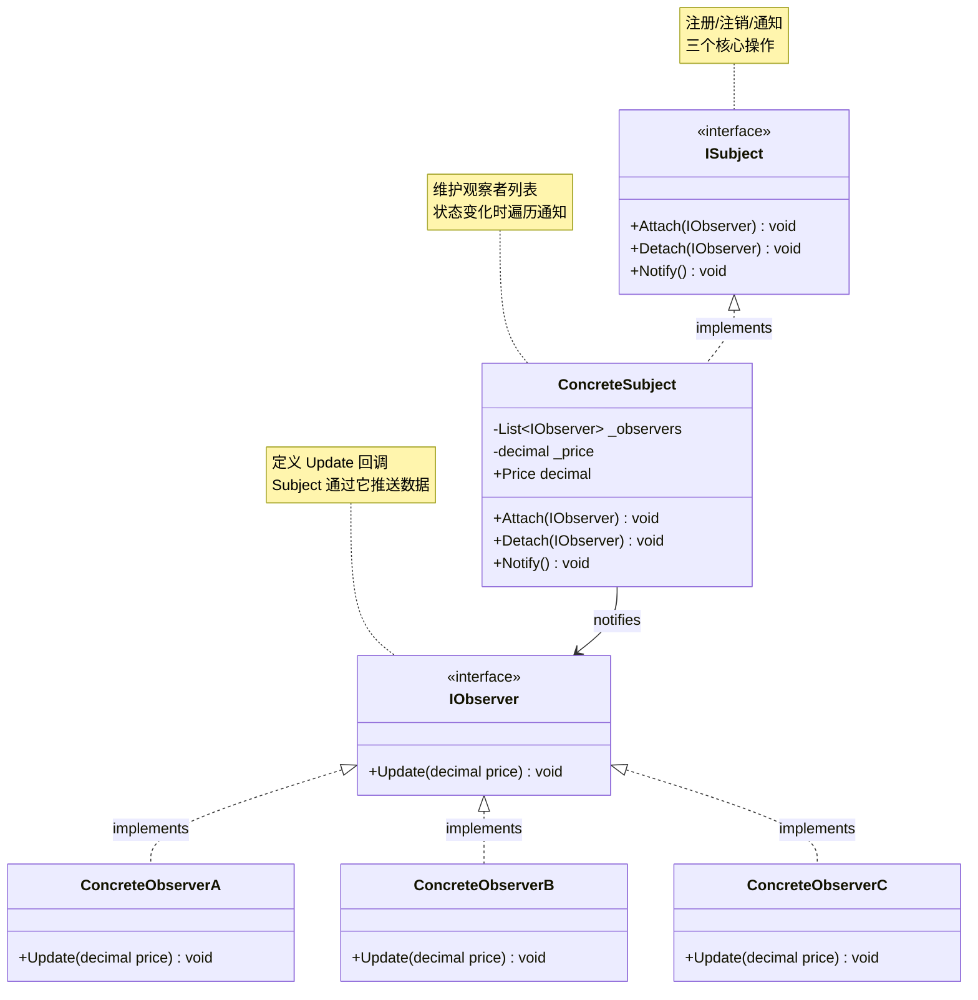
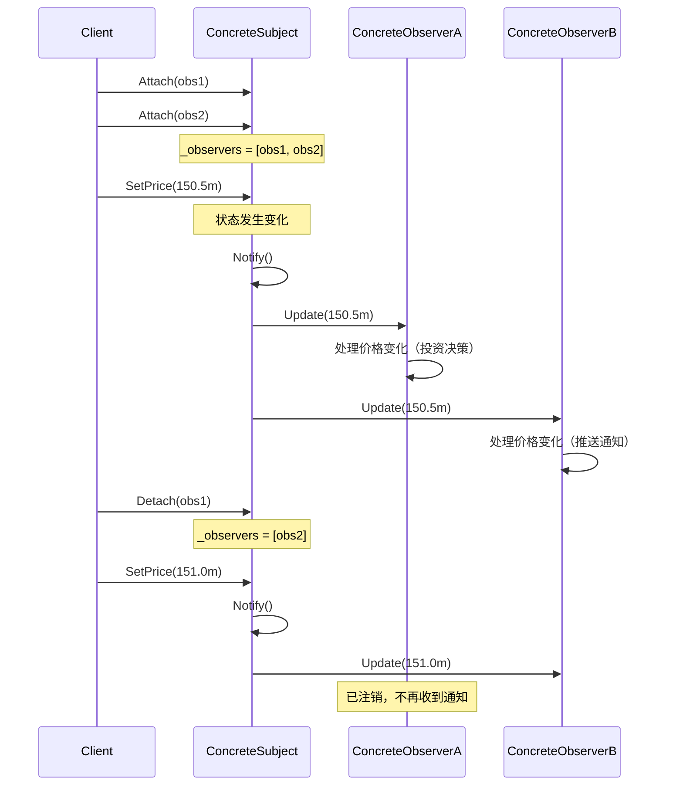

# 观察者模式 Observer

> 所属计划: [[design-patterns-csharp|设计模式 (C#)]]
> 预计耗时: 90 分钟
> 前置知识: [[16-behavioral-intro|行为型模式总览]]、C# 委托/事件、`event EventHandler<T>`、`IObservable<T>` 基础了解

---

## 1. 概念讲解

### 为什么需要观察者模式？

假设你在开发一个股票交易系统。当某只股票的价格变化时，多个组件需要被通知：投资者的交易策略、手机推送服务、UI 界面更新、风控系统。如果这样写：

```csharp
// ❌ Stock 直接依赖所有关心它的对象 —— 高度耦合
public class Stock
{
    private Investor _investor;
    private PhoneAlert _phone;
    private RiskControl _risk;
    private StockChart _chart;

    public decimal Price { get; private set; }

    public void SetPrice(decimal newPrice)
    {
        Price = newPrice;

        // 每加一个通知对象，就要改 Stock 类
        _investor.OnPriceChanged(Price);
        _phone.OnPriceChanged(Price);
        _risk.OnPriceChanged(Price);
        _chart.OnPriceChanged(Price);
    }
}
```

**问题**：
- Stock 必须知道所有"关心它的对象"的具体类型
- 新增一种通知方式（比如邮件提醒），必须修改 Stock 类
- 不同的通知者之间不能独立演化

**观察者模式的核心思想**：定义对象间的一种**一对多依赖**关系——当一个对象（Subject / Observable）的状态发生变化时，所有依赖它的对象（Observers）都会被自动通知。Subject 只知道观察者的抽象接口，不知道具体类型。

```
┌────────────────────────────────────────────────────────────┐
│  Stock (Subject)                                            │
│  只知道 IObserver 接口                                       │
│                                                             │
│  _observers = [IObserver, IObserver, IObserver, ...]        │
│                     │         │           │                 │
│                     ▼         ▼           ▼                 │
│              Investor   PhoneAlert   RiskControl           │
│              (Observer) (Observer)   (Observer)             │
└────────────────────────────────────────────────────────────┘
```

> [!tip] 定义
> **观察者模式** = Subject（主题/被观察者） + N × Observer（观察者）。Subject 改变时通知所有 Observer 调用 `Update()`。

### GoF 结构



**关键角色：**

| 角色 | 职责 |
|------|------|
| `ISubject` | 提供 `Attach` / `Detach` / `Notify` 三个方法 |
| `ConcreteSubject` | 维护观察者列表；状态变化时调用 `Notify()` 遍历通知 |
| `IObserver` | 声明 `Update()` 回调接口 |
| `ConcreteObserver` | 实现 `Update()`，定义收到通知后的具体行为 |

### 交互流程



### Observer 与 Mediator 的区别

| 维度 | Observer | [[20-mediator|Mediator]] |
|------|----------|------|
| **核心关系** | 一对多：1 Subject → N Observers | 多对多：N Colleagues ↔ Mediator ↔ N Colleagues |
| **通信方向** | 单向推送：Subject → Observers | 双向协调：Colleague ↔ Mediator ↔ Colleague |
| **Subject 知道 Observer 吗** | 知道 `IObserver` 接口，不知道具体类型 | 不直接知道；通过 Mediator 转发 |
| **Observer 知道彼此吗** | 不知道 | 不知道 |
| **通知触发者** | Subject 自身状态变化触发通知 | 任意 Colleague 触发 Mediator 协调 |
| **耦合度** | 低 — Subject 只依赖 IObserver 接口 | 更低 — Colleague 只依赖 Mediator，完全不接触其他 Colleague |

> [!tip] 直观判断
> 如果是一个对象的变化需要通知多个对象 → Observer。如果是多个对象之间的复杂交互需要解耦 → Mediator。

### Observer 与 Strategy 的区别

| 维度 | Observer | [[24-strategy|Strategy]] |
|------|---------|------|
| **核心关系** | 一对多：Subject 通知多个 Observer | 一对一：Context 使用一个 Strategy |
| **通信方向** | 推送：Subject → Observers | 调用：Context → Strategy |
| **角色知道彼此吗** | Subject 知道 IObserver 接口 | Context 知道 IStrategy 接口 |
| **生命周期** | 动态：运行时自由 Attach/Detach | 通常构造时注入，运行期间可替换 |
| **C# 惯用** | `event EventHandler<T>`、`IObservable<T>` | `Func<T, TResult>`、接口注入 |

> [!tip] 直观判断
> Observer 解决 **"通知谁"** 的问题（广播），Strategy 解决 **"怎么做"** 的问题（算法替换）。两者都依赖接口解耦，但意图完全不同：一个是发布-订阅，一个是算法族。

---

## 2. 代码示例

### 示例 1：经典 GoF 观察者 —— 股票价格监控

**场景**：`Stock` 作为 Subject，`Investor` 和 `PhoneAlert` 作为 Observers。股票价格变化时，投资者分析、手机弹通知。

```csharp
using System;
using System.Collections.Generic;

#region 接口定义

/// <summary>观察者接口 —— 所有关心股票价格的对象实现此接口</summary>
public interface IStockObserver
{
    void Update(string stockSymbol, decimal price);
}

/// <summary>主题接口 —— 被观察的股票</summary>
public interface IStockSubject
{
    void Attach(IStockObserver observer);
    void Detach(IStockObserver observer);
    void Notify();
}

#endregion

#region ConcreteSubject —— 股票

public class Stock : IStockSubject
{
    private readonly List<IStockObserver> _observers = new();
    private decimal _price;

    public string Symbol { get; }

    public decimal Price
    {
        get => _price;
        set
        {
            if (_price != value)
            {
                _price = value;
                Console.WriteLine($"\n[Stock] {Symbol} 价格变为 {_price:C}");
                Notify();
            }
        }
    }

    public Stock(string symbol, decimal initialPrice)
    {
        Symbol = symbol;
        _price = initialPrice;
    }

    public void Attach(IStockObserver observer)
    {
        _observers.Add(observer);
        Console.WriteLine($"  [+] {observer.GetType().Name} 订阅了 {Symbol}");
    }

    public void Detach(IStockObserver observer)
    {
        _observers.Remove(observer);
        Console.WriteLine($"  [-] {observer.GetType().Name} 取消了 {Symbol} 的订阅");
    }

    public void Notify()
    {
        // 遍历快照副本，防止通知过程中集合被修改
        foreach (var observer in _observers.ToArray())
        {
            observer.Update(Symbol, Price);
        }
    }
}

#endregion

#region ConcreteObservers

/// <summary>投资者 —— 根据价格变化做决策</summary>
public class Investor : IStockObserver
{
    public string Name { get; }

    public Investor(string name) => Name = name;

    public void Update(string symbol, decimal price)
    {
        var action = price switch
        {
            > 200 => "考虑卖出",
            < 50 => "考虑买入",
            _ => "持有观望"
        };
        Console.WriteLine($"    [{Name}] {symbol} @ {price:C} → {action}");
    }
}

/// <summary>手机推送 —— 当价格超出阈值时发送通知</summary>
public class PhoneAlert : IStockObserver
{
    private readonly decimal _upperThreshold;
    private readonly decimal _lowerThreshold;

    public PhoneAlert(decimal upper, decimal lower)
    {
        _upperThreshold = upper;
        _lowerThreshold = lower;
    }

    public void Update(string symbol, decimal price)
    {
        if (price >= _upperThreshold)
            Console.WriteLine($"    [PhoneAlert] 🔔 {symbol} 突破上限 {_upperThreshold:C}！当前 {price:C}");
        else if (price <= _lowerThreshold)
            Console.WriteLine($"    [PhoneAlert] ⚠ {symbol} 跌破下限 {_lowerThreshold:C}！当前 {price:C}");
        else
            Console.WriteLine($"    [PhoneAlert] {symbol} {price:C} — 在正常范围内");
    }
}

#endregion

#region 客户端

public static class Program
{
    public static void Main()
    {
        var aapl = new Stock("AAPL", 150m);

        var zhangsan = new Investor("张三");
        var lisi = new Investor("李四");
        var alert = new PhoneAlert(upper: 180, lower: 100);

        aapl.Attach(zhangsan);
        aapl.Attach(lisi);
        aapl.Attach(alert);

        aapl.Price = 165m;   // 所有人通知
        aapl.Price = 185m;   // 突破上限
        aapl.Price = 190m;   // 上限之上继续

        aapl.Detach(lisi);   // 李四取消订阅

        aapl.Price = 95m;    // 跌破下限，李四不再收到
        aapl.Price = 120m;   // 恢复正常
    }
}

#endregion
```

**运行方式：**
```bash
dotnet new console -n ObserverStock
# 将上述代码放入 Program.cs
dotnet run --project ObserverStock
```

**预期输出：**
```text
  [+] Investor 订阅了 AAPL
  [+] Investor 订阅了 AAPL
  [+] PhoneAlert 订阅了 AAPL

[Stock] AAPL 价格变为 ¥165.00
    [张三] AAPL @ ¥165.00 → 持有观望
    [李四] AAPL @ ¥165.00 → 持有观望
    [PhoneAlert] AAPL ¥165.00 — 在正常范围内

[Stock] AAPL 价格变为 ¥185.00
    [张三] AAPL @ ¥185.00 → 持有观望
    [李四] AAPL @ ¥185.00 → 持有观望
    [PhoneAlert] 🔔 AAPL 突破上限 ¥180.00！当前 ¥185.00

[Stock] AAPL 价格变为 ¥190.00
    [张三] AAPL @ ¥190.00 → 持有观望
    [李四] AAPL @ ¥190.00 → 持有观望
    [PhoneAlert] 🔔 AAPL 突破上限 ¥180.00！当前 ¥190.00

  [-] Investor 取消了 AAPL 的订阅

[Stock] AAPL 价格变为 ¥95.00
    [张三] AAPL @ ¥95.00 → 持有观望
    [PhoneAlert] ⚠ AAPL 跌破下限 ¥100.00！当前 ¥95.00

[Stock] AAPL 价格变为 ¥120.00
    [张三] AAPL @ ¥120.00 → 持有观望
    [PhoneAlert] AAPL ¥120.00 — 在正常范围内
```

---

### 示例 2：C# `event EventHandler<T>` —— 语言内置的观察者模式

C# 的 `event` 关键字就是观察者模式的语法糖。`event` 底层是一个基于 `MulticastDelegate` 的调用链。

```csharp
using System;

/// <summary>自定义事件参数</summary>
public class PriceChangedEventArgs : EventArgs
{
    public string Symbol { get; }
    public decimal OldPrice { get; }
    public decimal NewPrice { get; }

    public PriceChangedEventArgs(string symbol, decimal oldPrice, decimal newPrice)
    {
        Symbol = symbol;
        OldPrice = oldPrice;
        NewPrice = newPrice;
    }
}

/// <summary>Subject —— 使用 event 关键字替代手动维护观察者列表</summary>
public class StockWithEvent
{
    private decimal _price;

    // 声明事件 —— 编译器自动生成 add/remove 访问器
    public event EventHandler<PriceChangedEventArgs>? PriceChanged;

    public string Symbol { get; }

    public StockWithEvent(string symbol, decimal initialPrice)
    {
        Symbol = symbol;
        _price = initialPrice;
    }

    public decimal Price
    {
        get => _price;
        set
        {
            if (_price != value)
            {
                var oldPrice = _price;
                _price = value;
                // 触发事件 → 通知所有订阅者
                OnPriceChanged(oldPrice, _price);
            }
        }
    }

    /// <summary>受保护的虚方法 —— 允许子类覆盖通知行为</summary>
    protected virtual void OnPriceChanged(decimal oldPrice, decimal newPrice)
    {
        // 线程安全的调用方式：先复制到局部变量防止竞态
        PriceChanged?.Invoke(this, new PriceChangedEventArgs(Symbol, oldPrice, newPrice));
    }
}

#region 订阅者（不再需要实现 IObserver）

public class TradingBot
{
    public string Id { get; }

    public TradingBot(string id) => Id = id;

    public void OnPriceChanged(object? sender, PriceChangedEventArgs e)
    {
        var trend = e.NewPrice > e.OldPrice ? "📈 上涨" : "📉 下跌";
        Console.WriteLine($"  [Bot-{Id}] {e.Symbol} {e.OldPrice:C} → {e.NewPrice:C} ({trend})");
    }
}

public class Logger
{
    public void OnPriceChanged(object? sender, PriceChangedEventArgs e)
    {
        Console.WriteLine($"  [Logger] {DateTime.Now:T} — {e.Symbol}: {e.NewPrice:C}");
    }
}

#endregion

#region 客户端

public static class Program2
{
    public static void Main()
    {
        var tsla = new StockWithEvent("TSLA", 200m);

        var bot1 = new TradingBot("001");
        var bot2 = new TradingBot("002");
        var logger = new Logger();

        // 订阅事件 —— 用 += 操作符（等价于 Attach）
        tsla.PriceChanged += bot1.OnPriceChanged;
        tsla.PriceChanged += bot2.OnPriceChanged;
        tsla.PriceChanged += logger.OnPriceChanged;

        tsla.Price = 210m;
        tsla.Price = 205m;

        Console.WriteLine("\n--- bot2 取消订阅 ---");
        tsla.PriceChanged -= bot2.OnPriceChanged;

        tsla.Price = 200m;
    }
}

#endregion
```

**运行方式：**
```bash
dotnet new console -n ObserverEvent
# 将 Program.cs 替换为上述代码
dotnet run --project ObserverEvent
```

**预期输出：**
```text
  [Bot-001] TSLA ¥200.00 → ¥210.00 (📈 上涨)
  [Bot-002] TSLA ¥200.00 → ¥210.00 (📈 上涨)
  [Logger] 14:30:15 — TSLA: ¥210.00
  [Bot-001] TSLA ¥210.00 → ¥205.00 (📉 下跌)
  [Bot-002] TSLA ¥210.00 → ¥205.00 (📉 下跌)
  [Logger] 14:30:16 — TSLA: ¥205.00

--- bot2 取消订阅 ---
  [Bot-001] TSLA ¥205.00 → ¥200.00 (📉 下跌)
  [Logger] 14:30:17 — TSLA: ¥200.00
```

> [!tip] event vs 手动维护 List
> | 特性 | 手动 `List<IObserver>` | `event EventHandler<T>` |
> |------|------------------------|------------------------|
> | 线程安全 | 需自行加锁 | 编译器生成的 add/remove 是线程安全的 |
> | 空检查 | 手动检查 | `?.Invoke()` 编译为线程安全的空检查 |
> | 内存管理 | 手动 Detach | `-=` 即可取消订阅 |
> | 灵活性 | 可自定义通知顺序/过滤 | 调用顺序由订阅顺序决定 |
> | 异常处理 | 可包裹 try-catch | 单个订阅者异常会中断整个通知链 |

**关键**：C# 的 `event` 是最常用的"观察者模式实现"，绝大多数场景不需要手动写 `ISubject`/`IObserver` 接口。

---

### 示例 3：`IObserver<T>` + `IObservable<T>` —— Rx 风格的推模型

.NET 4.0 引入了 `System.IObservable<T>` 和 `System.IObserver<T>`，定义了推送式通知的标准化契约。这是 Reactive Extensions (Rx) 的基础。

**关键区别**：GoF Observer 的 `Update()` 通常只传通知消息；Rx 模型增加了 `OnCompleted`（序列结束）和 `OnError`（异常传播）。

```csharp
using System;
using System.Collections.Generic;

/// <summary>实现 IObservable<T> 的股票行情推送器</summary>
public class StockTicker : IObservable<decimal>
{
    private readonly List<IObserver<decimal>> _observers = new();
    private readonly string _symbol;

    public StockTicker(string symbol) => _symbol = symbol;

    public IDisposable Subscribe(IObserver<decimal> observer)
    {
        if (!_observers.Contains(observer))
            _observers.Add(observer);

        Console.WriteLine($"[Ticker] + {observer.GetType().Name} 订阅了 {_symbol}");

        // 返回一个 IDisposable，调用 Dispose 即取消订阅
        return new Unsubscriber(_observers, observer);
    }

    public void PushPrice(decimal price)
    {
        Console.WriteLine($"\n[Ticker] {_symbol} → {price:C}");

        // 通知所有观察者
        foreach (var observer in _observers.ToArray())
        {
            observer.OnNext(price);
        }
    }

    /// <summary>行情结束 —— 通知所有观察者序列完成</summary>
    public void EndOfStream()
    {
        foreach (var observer in _observers.ToArray())
        {
            observer.OnCompleted();
        }
        _observers.Clear();
    }

    /// <summary>行情服务出错了</summary>
    public void ReportError(Exception ex)
    {
        foreach (var observer in _observers.ToArray())
        {
            observer.OnError(ex);
        }
        _observers.Clear();
    }

    /// <summary>取消订阅的 IDisposable 实现</summary>
    private class Unsubscriber : IDisposable
    {
        private readonly List<IObserver<decimal>> _observers;
        private readonly IObserver<decimal> _observer;

        public Unsubscriber(List<IObserver<decimal>> observers, IObserver<decimal> observer)
        {
            _observers = observers;
            _observer = observer;
        }

        public void Dispose()
        {
            if (_observers.Contains(_observer))
                _observers.Remove(_observer);
        }
    }
}

/// <summary>图表显示器 —— 实现 IObserver<decimal></summary>
public class PriceChart : IObserver<decimal>
{
    private decimal _lastPrice;

    public void OnNext(decimal price)
    {
        var arrow = price > _lastPrice ? "▲" : price < _lastPrice ? "▼" : "─";
        Console.WriteLine($"  [Chart]  {arrow} {price:C}");
        _lastPrice = price;
    }

    public void OnCompleted()
    {
        Console.WriteLine("  [Chart] 行情数据流结束，显示最终图表");
    }

    public void OnError(Exception error)
    {
        Console.WriteLine($"  [Chart] 错误：{error.Message}");
    }
}

/// <summary>移动平均计算器 —— 实现 IObserver<decimal></summary>
public class MovingAverage : IObserver<decimal>
{
    private readonly Queue<decimal> _window = new();
    private readonly int _period;

    public MovingAverage(int period) => _period = period;

    public void OnNext(decimal price)
    {
        _window.Enqueue(price);
        if (_window.Count > _period)
            _window.Dequeue();

        if (_window.Count == _period)
        {
            var avg = _window.Average();
            Console.WriteLine($"  [MA{_period}]   均线: {avg:C}");
        }
    }

    public void OnCompleted()
    {
        Console.WriteLine($"  [MA{_period}]  数据流结束");
    }

    public void OnError(Exception error)
    {
        Console.WriteLine($"  [MA{_period}]  错误：{error.Message}");
    }
}

#region 客户端

public static class Program3
{
    public static void Main()
    {
        var ticker = new StockTicker("MSFT");

        var chart = new PriceChart();
        var ma3 = new MovingAverage(3);

        // Subscribe 返回 IDisposable，可以用于取消订阅
        var chartSub = ticker.Subscribe(chart);
        var maSub = ticker.Subscribe(ma3);

        ticker.PushPrice(100m);
        ticker.PushPrice(102m);
        ticker.PushPrice(105m);
        ticker.PushPrice(103m);
        ticker.PushPrice(108m);

        Console.WriteLine("\n--- chart 取消订阅 ---");
        chartSub.Dispose();

        ticker.PushPrice(110m);
        ticker.EndOfStream();
    }
}

#endregion
```

**运行方式：**
```bash
dotnet new console -n ObserverRx
# 将 Program.cs 替换为上述代码
dotnet run --project ObserverRx
```

**预期输出：**
```text
[Ticker] + PriceChart 订阅了 MSFT
[Ticker] + MovingAverage 订阅了 MSFT

[Ticker] MSFT → ¥100.00
  [Chart]  ─ ¥100.00
  [MA3]   均线: ¥100.00

[Ticker] MSFT → ¥102.00
  [Chart]  ▲ ¥102.00
  [MA3]   均线: ¥102.00

[Ticker] MSFT → ¥105.00
  [Chart]  ▲ ¥105.00
  [MA3]   均线: ¥102.33

[Ticker] MSFT → ¥103.00
  [Chart]  ▼ ¥103.00
  [MA3]   均线: ¥103.33

[Ticker] MSFT → ¥108.00
  [Chart]  ▲ ¥108.00
  [MA3]   均线: ¥105.33

--- chart 取消订阅 ---

[Ticker] MSFT → ¥110.00
  [MA3]   均线: ¥107.00
  [Chart] 行情数据流结束，显示最终图表
  [MA3]  数据流结束
```

> [!tip] `IObservable<T>` vs GoF Observer
> | 维度 | GoF Observer | `IObservable<T>` |
> |------|------------|------------------|
> | 通知结束 | 不支持 | `OnCompleted()` 告知序列结束 |
> | 错误传播 | 无标准方式 | `OnError()` 标准异常通道 |
> | 取消订阅 | 手动 `Detach` | 返回 `IDisposable` |
> | 组合/过滤 | 需自行实现 | 配合 Rx.NET（`Where`/`Select`/`Throttle`） |
> | 适用场景 | 简单通知 | 事件流处理、异步推送、传感器数据 |

---

### 示例 4：`INotifyPropertyChanged` —— WPF / MAUI 数据绑定基石

`INotifyPropertyChanged` 是观察者模式在 C# UI 框架中的核心应用。当 ViewModel 的属性变化时，View 自动刷新。

```csharp
using System;
using System.ComponentModel;
using System.Runtime.CompilerServices;

/// <summary>ViewModel 基类 —— 实现 INotifyPropertyChanged</summary>
public class ObservableObject : INotifyPropertyChanged
{
    public event PropertyChangedEventHandler? PropertyChanged;

    /// <summary>受保护的虚方法 —— 派生类调用此方法触发属性变化通知</summary>
    protected virtual void OnPropertyChanged([CallerMemberName] string? propertyName = null)
    {
        PropertyChanged?.Invoke(this, new PropertyChangedEventArgs(propertyName));
    }

    /// <summary>便捷方法：设置字段值并自动触发通知</summary>
    protected bool SetProperty<T>(ref T field, T value, [CallerMemberName] string? propertyName = null)
    {
        if (EqualityComparer<T>.Default.Equals(field, value))
            return false;

        field = value;
        OnPropertyChanged(propertyName);
        return true;
    }
}

/// <summary>具体的 ViewModel —— 股票价格视图模型</summary>
public class StockViewModel : ObservableObject
{
    private string _symbol = "";
    private decimal _price;
    private decimal _change;
    private decimal _changePercent;
    private bool _isAlertEnabled;

    public string Symbol
    {
        get => _symbol;
        set => SetProperty(ref _symbol, value);
    }

    public decimal Price
    {
        get => _price;
        set
        {
            if (SetProperty(ref _price, value))
            {
                // 价格变化 → 联动更新 Change 和 ChangePercent
                OnPropertyChanged(nameof(DisplayText));
            }
        }
    }

    public decimal Change
    {
        get => _change;
        set => SetProperty(ref _change, value);
    }

    public decimal ChangePercent
    {
        get => _changePercent;
        set => SetProperty(ref _changePercent, value);
    }

    public bool IsAlertEnabled
    {
        get => _isAlertEnabled;
        set => SetProperty(ref _isAlertEnabled, value);
    }

    /// <summary>计算属性 —— UI 绑定时使用</summary>
    public string DisplayText => $"{Symbol}  {Price:C}  ({(Change >= 0 ? "+" : "")}{ChangePercent:F2}%)";

    public void UpdatePrice(decimal newPrice)
    {
        var oldPrice = Price;
        Price = newPrice;
        Change = newPrice - oldPrice;
        ChangePercent = oldPrice != 0 ? (Change / oldPrice) * 100 : 0;
    }
}

/// <summary>模拟 View 层的监听器（WPF/MAUI 中由绑定框架自动完成）</summary>
public class ViewBinder
{
    private readonly StockViewModel _vm;
    private readonly string _label;

    public ViewBinder(StockViewModel vm, string label)
    {
        _vm = vm;
        _label = label;

        // 订阅 PropertyChanged 事件 —— 这就是观察者模式的体现
        _vm.PropertyChanged += OnViewModelPropertyChanged;
    }

    private void OnViewModelPropertyChanged(object? sender, PropertyChangedEventArgs e)
    {
        Console.WriteLine($"  [{_label}] 属性 {e.PropertyName} 已变化 → 刷新 UI");
    }
}

#region 客户端

public static class Program4
{
    public static void Main()
    {
        var vm = new StockViewModel
        {
            Symbol = "GOOGL",
            Price = 140m,
            IsAlertEnabled = true
        };

        // View 层订阅 ViewModel 的变化（框架自动完成，这里手动演示）
        var binder1 = new ViewBinder(vm, "主界面");
        var binder2 = new ViewBinder(vm, "迷你图表");

        Console.WriteLine($"当前显示: {vm.DisplayText}\n");

        vm.UpdatePrice(145m);
        Console.WriteLine($"  新显示: {vm.DisplayText}\n");

        vm.IsAlertEnabled = false;

        vm.UpdatePrice(138m);
        Console.WriteLine($"  新显示: {vm.DisplayText}");
    }
}

#endregion
```

**运行方式：**
```bash
dotnet new console -n ObserverNotify
# 将 Program.cs 替换为上述代码
dotnet run --project ObserverNotify
```

**预期输出：**
```text
当前显示: GOOGL  ¥140.00  (0.00%)

  [主界面] 属性 Price 已变化 → 刷新 UI
  [迷你图表] 属性 Price 已变化 → 刷新 UI
  [主界面] 属性 DisplayText 已变化 → 刷新 UI
  [迷你图表] 属性 DisplayText 已变化 → 刷新 UI
  [主界面] 属性 Change 已变化 → 刷新 UI
  [迷你图表] 属性 Change 已变化 → 刷新 UI
  [主界面] 属性 ChangePercent 已变化 → 刷新 UI
  [迷你图表] 属性 ChangePercent 已变化 → 刷新 UI
  新显示: GOOGL  ¥145.00  (+3.57%)

  [主界面] 属性 IsAlertEnabled 已变化 → 刷新 UI
  [迷你图表] 属性 IsAlertEnabled 已变化 → 刷新 UI

  [主界面] 属性 Price 已变化 → 刷新 UI
  [迷你图表] 属性 Price 已变化 → 刷新 UI
  [主界面] 属性 DisplayText 已变化 → 刷新 UI
  [迷你图表] 属性 DisplayText 已变化 → 刷新 UI
  [主界面] 属性 Change 已变化 → 刷新 UI
  [迷你图表] 属性 Change 已变化 → 刷新 UI
  [主界面] 属性 ChangePercent 已变化 → 刷新 UI
  [迷你图表] 属性 ChangePercent 已变化 → 刷新 UI
  新显示: GOOGL  ¥138.00  (-4.83%)
```

> [!tip] INotifyPropertyChanged 的本质
> 它就是观察者模式在数据绑定场景中的标准实现：
> - **Subject** = ViewModel（`INotifyPropertyChanged` 实现者）
> - **Observer** = View / Binding（订阅 `PropertyChanged` 事件）
> - 当 ViewModel 属性变化 → `PropertyChanged` 事件触发 → WPF/MAUI 绑定引擎收到通知 → 自动更新 UI 控件

---


## C++ 实现

C++ 使用纯虚接口 `IObserver` + `ISubject` 定义一对多依赖。`WeatherStation` 维护 `std::vector<IObserver*>` 的观察者列表，状态变化时遍历通知。裸指针列表外加 `Attach`/`Detach` 让运行时订阅/退订变得自然。

```cpp
#include <iostream>
#include <string>
#include <vector>
#include <algorithm>
using namespace std;

// ============================================================
// 1. IObserver 接口 — 所有观察者实现此接口
// ============================================================
class IObserver {
public:
    virtual ~IObserver() = default;
    virtual void update(float temperature, float humidity, float pressure) = 0;
};

// ============================================================
// 2. ISubject 接口 — 被观察的 WeatherStation
// ============================================================
class ISubject {
public:
    virtual ~ISubject() = default;
    virtual void attach(IObserver* obs) = 0;
    virtual void detach(IObserver* obs) = 0;
    virtual void notify() = 0;
};

// ============================================================
// 3. WeatherStation (ConcreteSubject)
// ============================================================
class WeatherStation : public ISubject {
    vector<IObserver*> observers;
    float temp{0.0f};
    float humidity{0.0f};
    float pressure{0.0f};
public:
    void attach(IObserver* obs) override {
        observers.push_back(obs);
    }

    void detach(IObserver* obs) override {
        observers.erase(
            remove(observers.begin(), observers.end(), obs),
            observers.end());
    }

    void notify() override {
        for (auto* obs : observers) {
            obs->update(temp, humidity, pressure);
        }
    }

    // 设置新数据，自动通知
    void setMeasurements(float t, float h, float p) {
        temp = t; humidity = h; pressure = p;
        cout << "\n[WeatherStation] 新数据: "
             << temp << "°C, " << humidity << "%, " << pressure << "hPa" << endl;
        notify();
    }
};

// ============================================================
// 4. 具体观察者
// ============================================================
class PhoneDisplay : public IObserver {
    string deviceName;
public:
    explicit PhoneDisplay(string name) : deviceName(move(name)) {}

    void update(float temp, float humidity, float pressure) override {
        cout << "  [" << deviceName << "] 推送通知: "
             << temp << "°C / " << humidity << "% / " << pressure << "hPa"
             << (temp > 30 ? " ☀ 高温预警!" : "") << endl;
    }
};

class WindowDisplay : public IObserver {
public:
    void update(float temp, float humidity, float pressure) override {
        cout << "  [大屏幕] 实时显示 → "
             << temp << "°C | " << humidity << "% | " << pressure << " hPa"
             << endl;
    }
};

// === main / usage ===
int main() {
    WeatherStation station;

    PhoneDisplay phone("iPhone");
    WindowDisplay bigScreen;

    station.attach(&phone);
    station.attach(&bigScreen);

    station.setMeasurements(25.2f, 60.0f, 1013.0f);
    station.setMeasurements(30.8f, 55.0f, 1012.1f);

    // 退订 PhoneDisplay
    cout << "\n--- 退订 PhoneDisplay ---" << endl;
    station.detach(&phone);
    station.setMeasurements(32.5f, 48.0f, 1011.5f);

    return 0;
}
```

**编译运行：**
```bash
g++ -std=c++17 -o prog main.cpp && ./prog
```

**预期输出：**
```text
[WeatherStation] 新数据: 25.2°C, 60%, 1013hPa
  [iPhone] 推送通知: 25.2°C / 60% / 1013hPa
  [大屏幕] 实时显示 → 25.2°C | 60% | 1013 hPa

[WeatherStation] 新数据: 30.8°C, 55%, 1012.1hPa
  [iPhone] 推送通知: 30.8°C / 55% / 1012.1hPa ☀ 高温预警!
  [大屏幕] 实时显示 → 30.8°C | 55% | 1012.1 hPa

--- 退订 PhoneDisplay ---

[WeatherStation] 新数据: 32.5°C, 48%, 1011.5hPa
  [大屏幕] 实时显示 → 32.5°C | 48% | 1011.5 hPa
```

## 3. 练习

### 练习 1：事件式温度传感器系统（基础）

**目标**：使用 C# 的 `event EventHandler<T>` 实现一个温度监控系统。

要求：
- `TemperatureSensor`：有 `Temperature` 属性和 `TemperatureChanged` 事件
- `Display`：显示当前温度（`Console.WriteLine`）
- `Alarm`：温度超过 40°C 时打印 `"⚠ 高温警报！"`
- 客户端创建 sensor、display、alarm，改变温度值 3 次，验证 display 和 alarm 都能收到通知

```csharp
// 框架代码（补充完整）
public class TemperatureChangedEventArgs : EventArgs
{
    public double Temperature { get; }
    public DateTime Timestamp { get; }
    // ...
}

public class TemperatureSensor
{
    private double _temperature;
    // 声明事件
    // 实现 OnTemperatureChanged
    // ...
}
```

---

### 练习 2：弱事件模式防止内存泄漏（进阶）

**目标**：实现 `WeakEvent<T>` 类，解决 observer 未取消订阅导致的内存泄漏。

背景：普通 `event +=` 会使 Subject 持有 Observer 的强引用，Observer 在不再需要后仍无法被 GC 回收。

要求：
- 实现 `WeakEvent` 类，内部使用 `WeakReference` 存储委托
- Subject 通过 `WeakEvent.Invoke()` 触发通知
- 编写测试代码：创建 Subject 和 Observer，让 Observer 超出作用域，强制 GC，验证 Observer 不再收到通知

```csharp
public class WeakEvent
{
    private readonly List<WeakReference<Delegate>> _handlers = new();

    public void AddHandler(Delegate handler)
    {
        _handlers.Add(new WeakReference<Delegate>(handler));
    }

    public void RemoveHandler(Delegate handler)
    {
        // 移除匹配的 WeakReference
    }

    public void Invoke(params object[] args)
    {
        // 遍历 _handlers，跳过已回收的引用
        // 对存活的 handler 进行 DynamicInvoke
    }
}
```

验证标准：

```csharp
// 期望输出：
// [创建] Subject 和 Observer
// [触发] Subject.Fire() → Observer.OnEvent 被调用
// [GC]   Observer 超出作用域，强制 GC
// [再触发] Subject.Fire() → Observer 不再收到通知
```

---

### 练习 3：`IObservable<T>` 股票行情推送（挑战）

**目标**：使用 `IObservable<T>` / `IObserver<T>` 实现一个带过滤和限流的股票行情推送器。

要求：
- `StockTick` 类型：包含 `Symbol`、`Price`、`Volume`、`Timestamp`
- `StockTicker : IObservable<StockTick>`：可以 `PushTick(StockTick tick)`
- `PriceFilterObserver`：只关心特定 `Symbol` 的 tick（用构造函数传入）
- `ThrottleObserver`：对于同一个 Symbol，至少间隔 2 秒才输出一条通知
- 客户端演示：推送多个 Symbol 混合的数据，验证过滤和限流生效

```csharp
// StockTick 类型
public record StockTick(string Symbol, decimal Price, long Volume, DateTime Timestamp);
```

提示：`ThrottleObserver` 可以用 `Dictionary<string, DateTime>` 记录每个 Symbol 的最后通知时间。

---

## 3.5 参考答案

> [!tip]- 练习 1 参考答案：事件式温度传感器系统
>   
> ```csharp
> using System;
> 
> // ============================================
> // TemperatureChangedEventArgs
> // ============================================
> public class TemperatureChangedEventArgs : EventArgs
> {
>     public double Temperature { get; }
>     public DateTime Timestamp { get; }
> 
>     public TemperatureChangedEventArgs(double temperature, DateTime timestamp)
>     {
>         Temperature = temperature;
>         Timestamp = timestamp;
>     }
> }
> 
> // ============================================
> // TemperatureSensor（Subject）
> // ============================================
> public class TemperatureSensor
> {
>     private double _temperature;
> 
>     // 声明事件
>     public event EventHandler<TemperatureChangedEventArgs>? TemperatureChanged;
> 
>     public double Temperature
>     {
>         get => _temperature;
>         set
>         {
>             if (Math.Abs(_temperature - value) > 0.01)
>             {
>                 _temperature = value;
>                 OnTemperatureChanged(value);
>             }
>         }
>     }
> 
>     // 触发事件的受保护虚方法（派生类可重写）
>     protected virtual void OnTemperatureChanged(double newTemp)
>     {
>         Console.WriteLine($"[Sensor] 温度变化: {newTemp:F1}°C @ {DateTime.Now:HH:mm:ss}");
>         TemperatureChanged?.Invoke(this,
>             new TemperatureChangedEventArgs(newTemp, DateTime.Now));
>     }
> 
>     // 便捷方法：直接更新温度并触发通知
>     public void UpdateTemperature(double newTemp)
>     {
>         Temperature = newTemp;
>     }
> }
> 
> // ============================================
> // Display（Observer）— 显示当前温度
> // ============================================
> public class Display
> {
>     private readonly string _name;
> 
>     public Display(string name) => _name = name;
> 
>     // 事件处理方法
>     public void OnTemperatureChanged(object? sender, TemperatureChangedEventArgs e)
>     {
>         Console.WriteLine($"  [{_name}] 当前温度: {e.Temperature:F1}°C ({e.Timestamp:HH:mm:ss})");
>     }
> }
> 
> // ============================================
> // Alarm（Observer）— 高温警报
> // ============================================
> public class Alarm
> {
>     private readonly double _threshold;
>     private readonly string _label;
> 
>     public Alarm(double threshold, string label = "警报")
>     {
>         _threshold = threshold;
>         _label = label;
>     }
> 
>     public void OnTemperatureChanged(object? sender, TemperatureChangedEventArgs e)
>     {
>         if (e.Temperature >= _threshold)
>         {
>             Console.WriteLine($"  [{_label}] ⚠ 高温警报！当前 {e.Temperature:F1}°C，超过阈值 {_threshold}°C！");
>         }
>         else
>         {
>             Console.WriteLine($"  [{_label}] 温度正常 ({e.Temperature:F1}°C < {_threshold}°C)");
>         }
>     }
> }
> 
> // ============================================
> // 客户端代码——验证 3 次温度变化
> // ============================================
> Console.WriteLine("=== 温度监控系统（event 实现）===\n");
> 
> var sensor = new TemperatureSensor();
> 
> // 创建观察者
> var mainDisplay = new Display("主屏幕");
> var alarm = new Alarm(40, "高温");
> 
> // 订阅事件
> sensor.TemperatureChanged += mainDisplay.OnTemperatureChanged;
> sensor.TemperatureChanged += alarm.OnTemperatureChanged;
> 
> // 改变温度 3 次
> Console.WriteLine("--- 温度变化 1 ---");
> sensor.UpdateTemperature(25.0);
> 
> Console.WriteLine("\n--- 温度变化 2 ---");
> sensor.UpdateTemperature(38.5);
> 
> Console.WriteLine("\n--- 温度变化 3 ---");
> sensor.UpdateTemperature(42.8);
> 
> // 测试取消订阅
> Console.WriteLine("\n--- 取消 Alarm 订阅后 ---");
> sensor.TemperatureChanged -= alarm.OnTemperatureChanged;
> sensor.UpdateTemperature(45.0); // Alarm 不再收到通知
> 
> /* 预期输出:
> === 温度监控系统（event 实现）===
> 
> --- 温度变化 1 ---
> [Sensor] 温度变化: 25.0°C @ 15:30:01
>   [主屏幕] 当前温度: 25.0°C (15:30:01)
>   [高温] 温度正常 (25.0°C < 40°C)
> 
> --- 温度变化 2 ---
> [Sensor] 温度变化: 38.5°C @ 15:30:02
>   [主屏幕] 当前温度: 38.5°C (15:30:02)
>   [高温] 温度正常 (38.5°C < 40°C)
> 
> --- 温度变化 3 ---
> [Sensor] 温度变化: 42.8°C @ 15:30:03
>   [主屏幕] 当前温度: 42.8°C (15:30:03)
>   [高温] ⚠ 高温警报！当前 42.8°C，超过阈值 40°C！
> 
> --- 取消 Alarm 订阅后 ---
> [Sensor] 温度变化: 45.0°C @ 15:30:04
>   [主屏幕] 当前温度: 45.0°C (15:30:04)
> */
> ```
>
> **关键点：**
> - `event EventHandler<T>` 是 C# 观察者模式的一等公民——编译器自动生成 `add`/`remove` 访问器，线程安全
> - `OnTemperatureChanged` 作为 `protected virtual` 方法——遵循 .NET 事件模式，派生类可扩展
> - `Temperature` setter 中检测值变化后才触发事件——避免不必要的通知
> - 取消订阅用 `-=`——忘记取消是观察者模式最常见的 bug（内存泄漏）

> [!tip]- 练习 2 参考答案：弱事件模式防止内存泄漏
>   
> ```csharp
> using System;
> using System.Collections.Generic;
> using System.Linq;
> 
> // ============================================
> // WeakEvent — 基于 WeakReference 的事件系统
> // ============================================
> public class WeakEvent
> {
>     private readonly List<WeakReference<Delegate>> _handlers = new();
> 
>     public void AddHandler(Delegate handler)
>     {
>         // 防止重复添加同一个目标的方法
>         RemoveCollectedHandlers();
>         // 检查是否已存在（比较目标和方法）
>         foreach (var wr in _handlers)
>         {
>             if (wr.TryGetTarget(out var existing) && existing == handler)
>                 return;
>         }
>         _handlers.Add(new WeakReference<Delegate>(handler));
>     }
> 
>     public void RemoveHandler(Delegate handler)
>     {
>         for (int i = _handlers.Count - 1; i >= 0; i--)
>         {
>             if (_handlers[i].TryGetTarget(out var existing) && existing == handler)
>             {
>                 _handlers.RemoveAt(i);
>                 return;
>             }
>         }
>     }
> 
>     public void Invoke(params object[] args)
>     {
>         var deadRefs = new List<int>();
> 
>         for (int i = 0; i < _handlers.Count; i++)
>         {
>             if (_handlers[i].TryGetTarget(out var handler))
>             {
>                 try
>                 {
>                     handler.DynamicInvoke(args);
>                 }
>                 catch (Exception ex)
>                 {
>                     Console.WriteLine($"  [WeakEvent] Handler 执行异常: {ex.Message}");
>                 }
>             }
>             else
>             {
>                 deadRefs.Add(i);
>             }
>         }
> 
>         // 清理已回收的引用（从后往前删除）
>         for (int i = deadRefs.Count - 1; i >= 0; i--)
>         {
>             _handlers.RemoveAt(deadRefs[i]);
>         }
>     }
> 
>     private void RemoveCollectedHandlers()
>     {
>         _handlers.RemoveAll(wr => !wr.TryGetTarget(out _));
>     }
> 
>     public int AliveHandlerCount
>     {
>         get
>         {
>             int count = 0;
>             foreach (var wr in _handlers)
>                 if (wr.TryGetTarget(out _)) count++;
>             return count;
>         }
>     }
> }
> 
> // ============================================
> // Subject — 使用 WeakEvent 替代普通 event
> // ============================================
> public class WeakEventSubject
> {
>     private readonly WeakEvent _onDataChanged = new();
> 
>     // 提供 AddHandler/RemoveHandler 而非 event
>     public void AddDataChangedHandler(Delegate handler)
>         => _onDataChanged.AddHandler(handler);
> 
>     public void RemoveDataChangedHandler(Delegate handler)
>         => _onDataChanged.RemoveHandler(handler);
> 
>     public void Fire(string data)
>     {
>         Console.WriteLine($"[Subject] Fire: {data}, 存活 Handler: {_onDataChanged.AliveHandlerCount}");
>         _onDataChanged.Invoke(this, data);
>     }
> }
> 
> // ============================================
> // Observer — 短生命周期对象
> // ============================================
> public class WeakEventObserver
> {
>     public static int InstanceCount;
>     private readonly int _id;
> 
>     public WeakEventObserver()
>     {
>         _id = ++InstanceCount;
>         Console.WriteLine($"  [Observer #{_id}] 创建");
>     }
> 
>     ~WeakEventObserver()
>     {
>         Console.WriteLine($"  [Observer #{_id}] 被 GC 回收");
>     }
> 
>     public void OnDataChanged(object? sender, string data)
>     {
>         Console.WriteLine($"  [Observer #{_id}] 收到数据: {data}");
>     }
> }
> 
> // ============================================
> // 测试代码：验证 GC 后 Observer 不再收到通知
> // ============================================
> static void TestWeakEvent()
> {
>     Console.WriteLine("=== 弱事件模式（WeakEvent）===\n");
> 
>     var subject = new WeakEventSubject();
> 
>     // 创建 Observer 并订阅
>     Console.WriteLine("[创建] Subject 和 Observer");
>     var observer = new WeakEventObserver();
>     subject.AddDataChangedHandler(
>         new Action<object?, string>(observer.OnDataChanged));
> 
>     // 触发事件——Observer 能收到
>     Console.WriteLine("[触发] Subject.Fire() → Observer.OnEvent 被调用");
>     subject.Fire("Hello");
> 
>     // 让 Observer 超出作用域 + 强制 GC
>     Console.WriteLine("\n[GC] Observer 超出作用域，强制 GC");
>     observer = null!;
>     GC.Collect(GC.MaxGeneration, GCCollectionMode.Forced, blocking: true);
>     GC.WaitForPendingFinalizers();
>     // 再触发一次确保清理
>     GC.Collect(GC.MaxGeneration, GCCollectionMode.Forced, blocking: true);
> 
>     // 再次触发——Observer 不应收到通知
>     Console.WriteLine("\n[再触发] Subject.Fire() → Observer 不再收到通知");
>     subject.Fire("World");
> 
>     Console.WriteLine($"\n存活 Handler 数: {subject.AliveHandlerCount} (期望: 0)");
> }
> ```
>
> **关键点：**
> - `WeakReference<Delegate>` 允许 GC 在 Observer 没有其他强引用时回收它
> - `Invoke` 时跳过已回收的引用并清理空槽——防止 `_handlers` 列表膨胀
> - 注意：`GC.Collect()` 在生产代码中不推荐手动调用，此处仅用于测试验证
> - 局限性：匿名 lambda 闭包可能捕获外部变量（被隐式持有引用），导致 `WeakReference` 无法按预期工作
> - 生产级方案：WPF 的 `WeakEventManager` 或 `System.WeakReference<T>` + `ConditionalWeakTable`

> [!tip]- 练习 3 参考答案：`IObservable<T>` 股票行情推送
>   
> ```csharp
> using System;
> using System.Collections.Generic;
> 
> // ============================================
> // StockTick — 不可变数据记录
> // ============================================
> public record StockTick(string Symbol, decimal Price, long Volume, DateTime Timestamp);
> 
> // ============================================
> // StockTicker — IObservable<StockTick> 实现
> // ============================================
> public class StockTicker : IObservable<StockTick>
> {
>     private readonly List<IObserver<StockTick>> _observers = new();
> 
>     public IDisposable Subscribe(IObserver<StockTick> observer)
>     {
>         if (!_observers.Contains(observer))
>             _observers.Add(observer);
> 
>         Console.WriteLine($"  [Ticker] + {observer.GetType().Name} 订阅了行情");
> 
>         // 返回 Unsubscriber（调用 Dispose 取消订阅）
>         return new Unsubscriber(_observers, observer);
>     }
> 
>     // 推送一条 tick
>     public void PushTick(StockTick tick)
>     {
>         Console.WriteLine($"\n[Ticker] {tick.Symbol} → {tick.Price:C} ({tick.Timestamp:HH:mm:ss})");
> 
>         foreach (var observer in _observers.ToArray())
>         {
>             observer.OnNext(tick);
>         }
>     }
> 
>     // 通知所有观察者：数据流结束
>     public void EndStream()
>     {
>         foreach (var observer in _observers.ToArray())
>         {
>             observer.OnCompleted();
>         }
>         _observers.Clear();
>     }
> 
>     // 通知所有观察者：发生错误
>     public void NotifyError(Exception error)
>     {
>         foreach (var observer in _observers.ToArray())
>         {
>             observer.OnError(error);
>         }
>     }
> 
>     private class Unsubscriber : IDisposable
>     {
>         private readonly List<IObserver<StockTick>> _observers;
>         private readonly IObserver<StockTick> _observer;
> 
>         public Unsubscriber(List<IObserver<StockTick>> observers, IObserver<StockTick> observer)
>         {
>             _observers = observers;
>             _observer = observer;
>         }
> 
>         public void Dispose()
>         {
>             if (_observers.Contains(_observer))
>             {
>                 _observers.Remove(_observer);
>                 Console.WriteLine($"  [Ticker] - {_observer.GetType().Name} 取消订阅");
>             }
>         }
>     }
> }
> 
> // ============================================
> // PriceFilterObserver — 只关心特定 Symbol
> // ============================================
> public class PriceFilterObserver : IObserver<StockTick>
> {
>     private readonly string _targetSymbol;
>     private readonly string _label;
> 
>     public PriceFilterObserver(string targetSymbol, string label)
>     {
>         _targetSymbol = targetSymbol;
>         _label = label;
>     }
> 
>     public void OnNext(StockTick tick)
>     {
>         if (tick.Symbol != _targetSymbol) return; // 过滤无关 Symbol
>         Console.WriteLine($"  [{_label}] {tick.Symbol} → {tick.Price:C}");
>     }
> 
>     public void OnCompleted()
>         => Console.WriteLine($"  [{_label}] 数据流结束");
> 
>     public void OnError(Exception error)
>         => Console.WriteLine($"  [{_label}] 错误: {error.Message}");
> }
> 
> // ============================================
> // ThrottleObserver — 同一 Symbol 至少间隔 2 秒
> // ============================================
> public class ThrottleObserver : IObserver<StockTick>
> {
>     private readonly Dictionary<string, DateTime> _lastNotification = new();
>     private readonly TimeSpan _minInterval;
>     private readonly string _label;
> 
>     public ThrottleObserver(TimeSpan minInterval, string label)
>     {
>         _minInterval = minInterval;
>         _label = label;
>     }
> 
>     public void OnNext(StockTick tick)
>     {
>         var now = DateTime.Now;
>         if (_lastNotification.TryGetValue(tick.Symbol, out var lastTime) &&
>             (now - lastTime) < _minInterval)
>         {
>             Console.WriteLine($"  [{_label}] {tick.Symbol} → (限流中，距上次 {Math.Round((now - lastTime).TotalSeconds, 1)}s)");
>             return; // 跳过——间隔不足
>         }
> 
>         _lastNotification[tick.Symbol] = now;
>         Console.WriteLine($"  [{_label}] {tick.Symbol} → {tick.Price:C} (放行)");
>     }
> 
>     public void OnCompleted()
>         => Console.WriteLine($"  [{_label}] 数据流结束");
> 
>     public void OnError(Exception error)
>         => Console.WriteLine($"  [{_label}] 错误: {error.Message}");
> }
> 
> // ============================================
> // 客户端演示：混合 Symbol + 过滤 + 限流
> // ============================================
> static async Task TestStockTicker()
> {
>     Console.WriteLine("=== IObservable<T> 股票行情推送 ===\n");
> 
>     var ticker = new StockTicker();
> 
>     // 创建观察者
>     var msftFilter = new PriceFilterObserver("MSFT", "MSFT过滤器");
>     var throttle = new ThrottleObserver(TimeSpan.FromSeconds(2), "限流器");
> 
>     // 订阅
>     var sub1 = ticker.Subscribe(msftFilter);
>     var sub2 = ticker.Subscribe(throttle);
> 
>     // 推送混合数据
>     var now = DateTime.Now;
> 
>     // MSFT 快速推送 3 次（限流器只放行第 1 次）
>     ticker.PushTick(new StockTick("MSFT", 100m, 1000, now));
>     ticker.PushTick(new StockTick("MSFT", 101m, 2000, now.AddMilliseconds(500)));
>     ticker.PushTick(new StockTick("MSFT", 102m, 1500, now.AddMilliseconds(1200)));
> 
>     // AAPL 推送 2 次
>     ticker.PushTick(new StockTick("AAPL", 180m, 5000, now.AddMilliseconds(1500)));
>     ticker.PushTick(new StockTick("AAPL", 181m, 3000, now.AddMilliseconds(2500)));
> 
>     // MSFT 再次推送（距上次超过 2 秒）
>     ticker.PushTick(new StockTick("MSFT", 105m, 3000, now.AddSeconds(3)));
> 
>     // 结束数据流
>     Console.WriteLine("\n--- 结束数据流 ---");
>     ticker.EndStream();
> 
>     /* 关键验证点:
>      * - MSFT过滤器 收到所有 MSFT 的 tick（4条）
>      * - 限流器 对 MSFT 只放行第 1 次（900ms 间隔不足）、放行最后 1 次（>2s）
>      * - 限流器 对 AAPL 只放行第 1 次（1s 间隔不足）
>      */
> }
> ```
>
> **关键设计要点：**
> - `IObserver<T>` 的三个方法：`OnNext`（数据推送）、`OnCompleted`（序列结束）、`OnError`（异常）
> - `Subscribe()` 返回 `IDisposable` —— 调用 `Dispose()` 取消订阅，这是 Rx 风格的标准做法
> - `PriceFilterObserver` 在 `OnNext` 中做符号过滤——只有匹配的 Symbol 才输出
> - `ThrottleObserver` 用 `Dictionary<string, DateTime>` 记录每个 Symbol 的最后通知时间，实现每 Symbol 独立限流
> - 遍历 `_observers.ToArray()` 快照——防止通知过程中集合被修改

> [!note] 答案使用方式
> 先独立完成练习，再展开查看参考答案。参考答案不是唯一解——如果你的实现通过了测试或达到了题目要求，就是正确的。

## 4. 扩展阅读

### 必读

- **《设计模式》GoF** — 第 5 章 Observer 模式原始讨论
- **MSDN: [observer design pattern](https://learn.microsoft.com/en-us/dotnet/standard/events/observer-design-pattern)** — .NET 中 `IObserver<T>` 和 `IObservable<T>` 的官方文档
- **MSDN: [Handling and Raising Events](https://learn.microsoft.com/en-us/dotnet/standard/events/)** — C# 事件的标准模式指南

### 推荐

- **[[16-behavioral-intro|行为型模式总览]]** — 回顾所有 11 种行为型设计模式的全局视角
- **[[20-mediator|中介者模式]]** — Observer vs Mediator：何时用一对多推送，何时用星型协调
- **Reactive Extensions (Rx.NET)** — `System.Reactive` 在 `IObservable<T>` 之上的高阶操作（`Where`/`Throttle`/`Merge`/`Buffer`）
- **[Rx.NET GitHub](https://github.com/dotnet/reactive)** — Rx.NET 源码和学习资源
- **WPF Data Binding Overview** — `INotifyPropertyChanged` 是 WPF/MAUI MVVM 的基础

### 拓展

- **事件聚合器 (Event Aggregator)** — 观察者模式的进一步发展：Prism 框架的 `IEventAggregator` 解耦发布者和订阅者
- **SignalR** — 观察者模式的分布式版本：服务器推送通知到所有连接的客户端
- **[Weak Event Patterns](https://learn.microsoft.com/en-us/dotnet/desktop/wpf/events/weak-event-patterns)** — WPF 的 `IWeakEventListener` 和 `WeakEventManager`

---

## 5. 常见陷阱

### 陷阱 1：内存泄漏 —— Observer 忘了取消订阅

```csharp
// ❌ 经典泄漏：短生命周期对象订阅长生命周期对象的事件
public class MainWindow
{
    private readonly StockService _stockService; // 全局单例，长生命周期

    public void ShowDialog()
    {
        // dialog 会一直活在 _stockService.PriceChanged 的调用链中
        var dialog = new PriceDialog();
        _stockService.PriceChanged += dialog.OnPriceChanged;

        dialog.Show(); // 关闭后 dialog 仍然可达 → 内存泄漏！
    }
}

// ✅ 正确做法：在不再需要时取消订阅
public void ShowDialog()
{
    var dialog = new PriceDialog();
    EventHandler<PriceChangedEventArgs> handler = (_, e) => dialog.OnPriceChanged(e);
    _stockService.PriceChanged += handler;

    dialog.Closed += (_, _) =>
    {
        _stockService.PriceChanged -= handler; // 关闭时取消订阅
    };

    dialog.Show();
}
```

> [!warning] 黄金法则
> 任何订阅了**长生命周期对象**（静态对象、单例、Application-wide service）事件的**短生命周期对象**（Window、UserControl、Page），必须在销毁时调用 `-=` 取消订阅。

### 陷阱 2：事件调用顺序依赖

```csharp
// ❌ 依赖观察者调用顺序 —— 脆弱的设计
public class Subject
{
    public event EventHandler? DataChanged;

    public void Notify()
    {
        DataChanged?.Invoke(this, EventArgs.Empty);
        // 假设 ObserverA 先于 ObserverB 被调用——
        // 但这不被保证！MulticastDelegate 顺序是实现细节。
    }
}

// ✅ 如果确实需要顺序，使用有序集合 + 显式调用
public class OrderedSubject
{
    private readonly SortedDictionary<int, IObserver> _ordered = new();

    public void Notify()
    {
        foreach (var observer in _ordered.Values) // 顺序由 key 决定
        {
            observer.Update();
        }
    }
}
```

### 陷阱 3：重入通知 —— Observer 修改 Subject 导致递归

```csharp
// ❌ 观察者的响应修改了 Subject，触发新的通知 → 无限递归
public class StockMonitor : IObserver
{
    public void Update(decimal price)
    {
        if (price > 200)
        {
            _stock.Price = 180; // 修改 Subject → 触发 Notify() → 再次调用 Update → 死循环！
        }
    }
}

// ✅ 方案 1：Subject 检测重入并返回
public class Stock
{
    private bool _isNotifying;

    public void Notify()
    {
        if (_isNotifying) return; // 重入保护
        _isNotifying = true;
        foreach (var o in _observers.ToArray())
            o.Update(Price);
        _isNotifying = false;
    }
}

// ✅ 方案 2：延迟修改 —— 收集操作，通知结束后批量执行
private readonly Queue<Action> _pendingActions = new();

public void Update(decimal price)
{
    if (price > 200)
    {
        _pendingActions.Enqueue(() => _stock.Price = 180);
    }
}

// 通知链结束后统一执行
foreach (var action in _pendingActions)
    action();
```

### 陷阱 4：线程安全

```csharp
// ❌ 非线程安全 —— Notify 过程中另一个线程 Detach
public class Stock
{
    private readonly List<IObserver> _observers = new();

    public void Notify()
    {
        foreach (var o in _observers) // 遍历过程中列表被修改 → InvalidOperationException
        {
            o.Update(Price);
        }
    }
}

// ✅ 方案 1：遍历快照
public void Notify()
{
    IObserver[] snapshot;
    lock (_observers)
    {
        snapshot = _observers.ToArray();
    }
    foreach (var o in snapshot)
    {
        o.Update(Price);
    }
}

// ✅ 方案 2：使用 event（编译器生成的 add/remove 天然线程安全）
public event EventHandler? PriceChanged;

protected virtual void OnPriceChanged()
{
    PriceChanged?.Invoke(this, EventArgs.Empty); // 线程安全的调用
}

// ✅ 方案 3：使用 ConcurrentBag 或 ImmutableList
private ImmutableList<IObserver> _observers = ImmutableList<IObserver>.Empty;

public void Attach(IObserver o)
{
    ImmutableInterlocked.Update(ref _observers, list => list.Add(o));
}

public void Notify()
{
    var snapshot = _observers; // 不可变快照，线程安全
    foreach (var o in snapshot)
        o.Update(Price);
}
```
