# 状态模式 (State Pattern)

> 所属计划: [[design-patterns-csharp|设计模式 (C#)]]
> 预计耗时: 60 分钟
> 前置知识: [[16-behavioral-intro|行为型模式总览]]、C# 接口与多态、`enum` 与 `switch` 的局限性

---

## 1. 概念讲解

### 状态模式解决什么问题？

考虑一个自动售货机。它的行为取决于当前状态：

- **无币状态**：投入硬币 → 进入有币状态；按下按钮 → 没反应
- **有币状态**：投入硬币 → 弹出多余硬币；按下按钮 → 出货进入售罄检查
- **售罄状态**：投入硬币 → 弹出退回；按下按钮 → 没货提示

用 `enum` + `switch` 实现时，每个操作都需要一个巨大的分支结构：

```csharp
// ❌ 反例：enum + switch — 每个方法都是一个庞大的分支
public enum VendingState { NoCoin, HasCoin, Sold, SoldOut }

public class VendingMachine
{
    private VendingState _state = VendingState.NoCoin;

    public void InsertCoin()
    {
        switch (_state)
        {
            case VendingState.NoCoin:
                Console.WriteLine("硬币已接收");
                _state = VendingState.HasCoin;
                break;
            case VendingState.HasCoin:
                Console.WriteLine("已投过币，请直接选择商品");
                break;
            case VendingState.Sold:
                Console.WriteLine("请稍等，正在出货...");
                break;
            case VendingState.SoldOut:
                Console.WriteLine("已售罄，退回硬币");
                break;
        }
    }

    public void PressButton()
    {
        switch (_state)
        {
            case VendingState.NoCoin:
                Console.WriteLine("请先投币");
                break;
            // ... 又是四路分支
        }
    }
    // 每新增一个状态，所有 switch 都要加一个 case — 违反开闭原则
}
```

添加新状态（如"维护模式"）时，你必须在**每一个** `switch` 语句中添加新分支。类越来越大，改一处漏一处是常态。

**状态模式的核心思想**：将每个状态封装为独立类，让上下文对象把行为委托给当前状态对象。状态转移由状态类自己决定——上下文只负责切换引用。

```
┌────────────────────────────────────────────────────────────────┐
│  enum + switch                                                 │
│  InsertCoin ─→ switch(state) { case NoCoin:... case HasCoin }  │
│  PressButton → switch(state) { case NoCoin:... case HasCoin }  │
│  Dispense  ──→ switch(state) { case NoCoin:... case HasCoin }  │
│  问题：状态逻辑分散在多个 switch 中；新增状态需要改所有方法        │
└────────────────────────────────────────────────────────────────┘
                              ↓ 重构
┌────────────────────────────────────────────────────────────────┐
│  State Pattern                                                 │
│  Context ─→ IState                                              │
│                ├── NoCoinState  (InsertCoin → 切到 HasCoin)      │
│                ├── HasCoinState (PressButton → 切到 Sold)        │
│                └── SoldState    (Dispense → 切到 NoCoin)         │
│  每个状态是一个类，状态转移发生在状态类内部，上下文只管切换引用     │
└────────────────────────────────────────────────────────────────┘
```

### 状态模式 GoF 结构

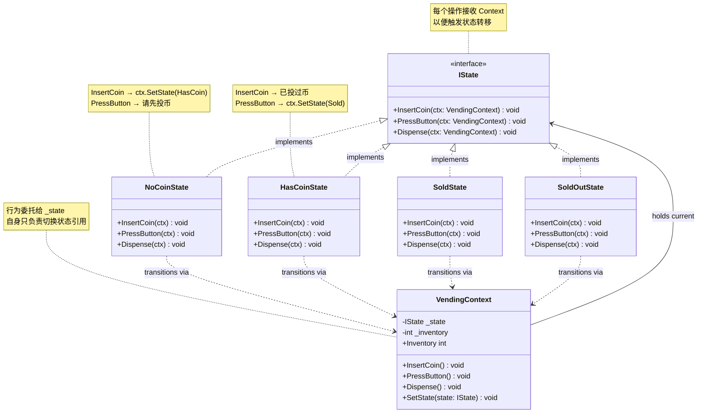

**关键角色：**

| 角色 | 职责 |
|------|------|
| `IState` | 声明所有状态下的行为接口；每个方法接收 `Context` 参数以触发状态转移 |
| `ConcreteState` | 实现特定状态下的行为；在方法内部决定何时切换到哪个状态 |
| `Context` | 持有当前状态引用；将客户端请求委托给当前状态对象；提供 `SetState()` 供状态类调用 |

### 状态转移图

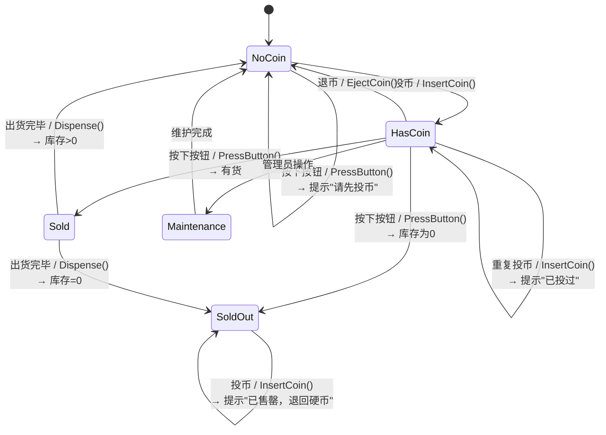

> [!tip] 状态模式的核心洞察
> **"对象看起来换了类"** — 同一个 `VendingContext` 实例，同一个 `InsertCoin()` 调用，但在不同状态下执行的是不同类的方法。这就是多态替代分支的本质：将变化隔离在状态类内部，上下文类保持简单。

### State 模式 vs `enum` + `switch`

| 维度 | State 模式 | `enum` + `switch` |
|------|-----------|-------------------|
| **状态逻辑位置** | 分散在各个 `ConcreteState` 类中，每个类自包含 | 集中在每个方法的 `switch` 分支中 |
| **新增状态** | 新增一个 `ConcreteState` 类，实现接口即可（开闭原则 ✓） | 修改每一个 `switch` 分支，添加新 `case`（开闭原则 ✗） |
| **状态转移** | 由状态类显式调用 `ctx.SetState(nextState)` | 直接在 `case` 里改 `_state` 字段 |
| **行为与状态耦合** | 低 — 每个状态类只关心自己的行为 | 高 — 所有状态的行为混在一起 |
| **代码量** | 类多（每个状态一个类），但每个类简单 | 文件少，但方法体膨胀 |
| **适用场景** | 状态 ≥ 3 且行为差异大、状态经常增减 | 状态 ≤ 2 或行为差异极小 |
| **C# 惯用** | 接口 + 多态 | `enum` + `switch` 表达式 |

> [!warning] 判断标准
> 如果你在同一个项目里写了第 3 个带 `switch(state)` 的方法 → 立刻重构为状态模式。两个还 OK（如 Toggle 的 On/Off），三个是临界点。

### State vs Strategy — 相似但意图不同

| 维度             | State 模式                                       | [[24-strategy\|策略模式]]              |
| -------------- | ---------------------------------------------- | ---------------------------------- |
| **谁决定切换**      | Context 内部 — 状态对象自己决定下一个状态                     | Context 外部 — 客户端选择策略               |
| **Context 感知** | Context 知道自己有状态，每个操作都委托给当前状态                   | Context 持有策略但不关心有几个策略              |
| **切换频率**       | 频繁 — 每次操作都可能触发状态转移                             | 低频 — 通常在 Context 初始化时设置            |
| **典型操作**       | `InsertCoin()` / `PressButton()` — 这些操作的结果随状态变 | `Calculate()` / `Execute()` — 算法替换 |
| **类比**         | 自动售货机 — 同一个按钮在不同状态下的结果完全不同                     | 导航 App — 同一起点终点，换算法（最快/最短/躲避拥堵）    |
| **C# 惯用**      | 状态接口 + `SetState()`                            | 策略接口 + 构造函数注入                      |

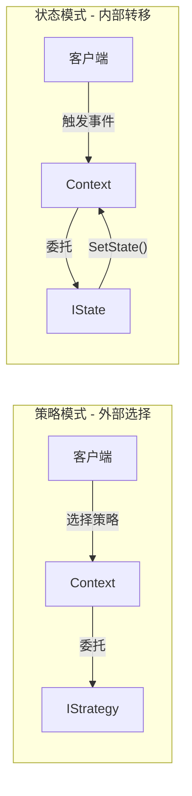

---

## 2. 代码示例

### 2.1 自动售货机：HasCoin / NoCoin / Sold / SoldOut

**场景**：经典自动售货机 — 投币、选择商品、出货的完整状态流转。

```csharp
// ============================================
// 1. IState 接口 — 所有状态行为的契约
// ============================================
public interface IVendingState
{
    void InsertCoin(VendingContext ctx);
    void PressButton(VendingContext ctx);
    void Dispense(VendingContext ctx);
    string Name { get; }
}

// ============================================
// 2. Context — 售货机上下文
// ============================================
public class VendingContext
{
    private IVendingState _state;
    public int Inventory { get; private set; }
    public decimal Balance { get; private set; }

    public VendingContext(int initialInventory = 10)
    {
        Inventory = initialInventory;
        _state = initialInventory > 0
            ? new NoCoinState()
            : new SoldOutState();
    }

    public void SetState(IVendingState state)
    {
        Console.WriteLine($"  [状态转移] {_state.Name} → {state.Name}");
        _state = state;
    }

    public void InsertCoin()
    {
        Balance += 1.0m;
        _state.InsertCoin(this);
    }

    public void PressButton()
    {
        _state.PressButton(this);
    }

    public void Dispense()
    {
        _state.Dispense(this);
    }

    public void DecrementInventory()
    {
        Inventory--;
    }
}
```

```csharp
// ============================================
// 3. Concrete States
// ============================================

public class NoCoinState : IVendingState
{
    public string Name => "等待投币";

    public void InsertCoin(VendingContext ctx)
    {
        Console.WriteLine("  硬币已接收，请选择商品");
        ctx.SetState(new HasCoinState());
    }

    public void PressButton(VendingContext ctx)
    {
        Console.WriteLine("  请先投币");
    }

    public void Dispense(VendingContext ctx)
    {
        Console.WriteLine("  请先投币再选择商品");
    }
}

public class HasCoinState : IVendingState
{
    public string Name => "已投币";

    public void InsertCoin(VendingContext ctx)
    {
        Console.WriteLine("  已投过币，请直接选择商品（多余的硬币请按退币键）");
    }

    public void PressButton(VendingContext ctx)
    {
        if (ctx.Inventory > 0)
        {
            Console.WriteLine("  商品已选择，正在出货...");
            ctx.SetState(new SoldState());
            ctx.Dispense(); // 自动触发出货
        }
        else
        {
            Console.WriteLine("  抱歉，商品已售罄");
            ctx.SetState(new SoldOutState());
        }
    }

    public void Dispense(VendingContext ctx)
    {
        Console.WriteLine("  请先按下选择按钮");
    }
}

public class SoldState : IVendingState
{
    public string Name => "出货中";

    public void InsertCoin(VendingContext ctx)
    {
        Console.WriteLine("  请稍等，正在出货中...");
    }

    public void PressButton(VendingContext ctx)
    {
        Console.WriteLine("  正在出货中，请勿重复按下按钮");
    }

    public void Dispense(VendingContext ctx)
    {
        ctx.DecrementInventory();
        Console.WriteLine("  🎉 商品已掉落，请取走");
        ctx.Balance = 0;

        if (ctx.Inventory > 0)
            ctx.SetState(new NoCoinState());
        else
            ctx.SetState(new SoldOutState());
    }
}

public class SoldOutState : IVendingState
{
    public string Name => "已售罄";

    public void InsertCoin(VendingContext ctx)
    {
        Console.WriteLine("  已售罄，退回硬币");
        ctx.Balance = 0;
    }

    public void PressButton(VendingContext ctx)
    {
        Console.WriteLine("  已售罄，无法选择商品");
    }

    public void Dispense(VendingContext ctx)
    {
        Console.WriteLine("  无商品可出货");
    }
}
```

```csharp
// ============================================
// 4. 使用演示
// ============================================
Console.WriteLine("=== 自动售货机状态模式演示 ===\n");

var machine = new VendingContext(initialInventory: 2);

Console.WriteLine("【用户 1】投币 → 选择 → 取货");
machine.InsertCoin();
machine.PressButton();

Console.WriteLine("\n【用户 2】直接按按钮（忘投币）");
machine.PressButton();

Console.WriteLine("\n【用户 3】投币 → 选择 → 取货（最后一件）");
machine.InsertCoin();
machine.PressButton();

Console.WriteLine("\n【用户 4】投币（此时已售罄）");
machine.InsertCoin();

Console.WriteLine($"\n最终库存: {machine.Inventory}, 余额: {machine.Balance:C}");

/* 输出:
=== 自动售货机状态模式演示 ===

【用户 1】投币 → 选择 → 取货
  [状态转移] 等待投币 → 已投币
  硬币已接收，请选择商品
  [状态转移] 已投币 → 出货中
  商品已选择，正在出货...
  🎉 商品已掉落，请取走
  [状态转移] 出货中 → 等待投币

【用户 2】直接按按钮（忘投币）
  请先投币

【用户 3】投币 → 选择 → 取货（最后一件）
  [状态转移] 等待投币 → 已投币
  硬币已接收，请选择商品
  [状态转移] 已投币 → 出货中
  商品已选择，正在出货...
  🎉 商品已掉落，请取走
  [状态转移] 出货中 → 已售罄

【用户 4】投币（此时已售罄）
  已售罄，退回硬币

最终库存: 0, 余额: ¥0.00
*/
```

> [!tip] 状态自行触发后续操作
> 注意 `HasCoinState.PressButton()` 在设置了 `SoldState` 后立即调用了 `ctx.Dispense()`。状态模式允许状态类根据业务逻辑**自动衔接**下一步——不需要客户端知道"按了按钮之后要取货"这个时序。

---

### 2.2 订单状态机：Created → Paid → Shipped → Delivered / Cancelled

**场景**：电商订单的完整生命周期。部分状态有分支（Created 可支付或取消；Shipped 必须签收才能完成）。

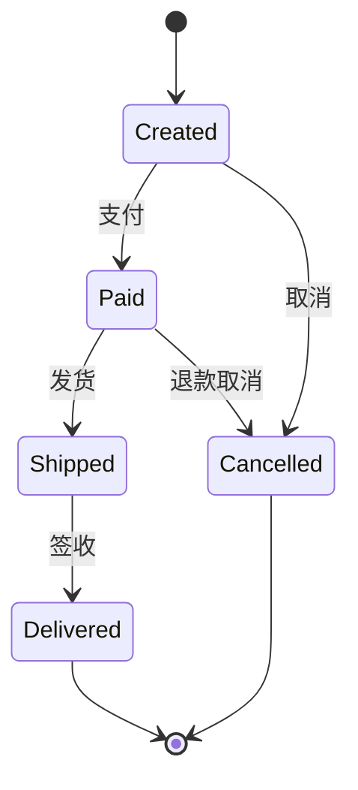

```csharp
// ============================================
// IOrderState 接口
// ============================================
public interface IOrderState
{
    void Pay(OrderContext ctx);
    void Ship(OrderContext ctx);
    void Deliver(OrderContext ctx);
    void Cancel(OrderContext ctx);
    string Name { get; }
}

// ============================================
// OrderContext
// ============================================
public class OrderContext
{
    private IOrderState _state = new CreatedState();
    public string OrderId { get; }
    public decimal Amount { get; }
    public DateTime CreatedAt { get; }
    public List<string> History { get; } = new();

    public OrderContext(string orderId, decimal amount)
    {
        OrderId = orderId;
        Amount = amount;
        CreatedAt = DateTime.Now;
        History.Add($"{DateTime.Now:HH:mm:ss} — 订单创建");
    }

    public void SetState(IOrderState state)
    {
        History.Add($"{DateTime.Now:HH:mm:ss} — {_state.Name} → {state.Name}");
        _state = state;
    }

    public void Pay() => _state.Pay(this);
    public void Ship() => _state.Ship(this);
    public void Deliver() => _state.Deliver(this);
    public void Cancel() => _state.Cancel(this);

    public string CurrentState => _state.Name;
}
```

```csharp
// ============================================
// Concrete Order States
// ============================================

public class CreatedState : IOrderState
{
    public string Name => "已创建";

    public void Pay(OrderContext ctx)
    {
        Console.WriteLine($"订单 {ctx.OrderId}：支付 ¥{ctx.Amount:F2} 成功");
        ctx.SetState(new PaidState());
    }

    public void Ship(OrderContext ctx)
        => Console.WriteLine("订单尚未支付，无法发货");

    public void Deliver(OrderContext ctx)
        => Console.WriteLine("订单尚未支付");

    public void Cancel(OrderContext ctx)
    {
        Console.WriteLine($"订单 {ctx.OrderId}：已取消");
        ctx.SetState(new CancelledState());
    }
}

public class PaidState : IOrderState
{
    public string Name => "已支付";

    public void Pay(OrderContext ctx)
        => Console.WriteLine("订单已支付，无需重复支付");

    public void Ship(OrderContext ctx)
    {
        Console.WriteLine($"订单 {ctx.OrderId}：已发货");
        ctx.SetState(new ShippedState());
    }

    public void Deliver(OrderContext ctx)
        => Console.WriteLine("订单尚未发货，无法签收");

    public void Cancel(OrderContext ctx)
    {
        Console.WriteLine($"订单 {ctx.OrderId}：已退款 ¥{ctx.Amount:F2}，订单取消");
        ctx.SetState(new CancelledState());
    }
}

public class ShippedState : IOrderState
{
    public string Name => "运输中";

    public void Pay(OrderContext ctx)
        => Console.WriteLine("订单已在运输中");

    public void Ship(OrderContext ctx)
        => Console.WriteLine("订单已发货，无需重复操作");

    public void Deliver(OrderContext ctx)
    {
        Console.WriteLine($"订单 {ctx.OrderId}：已签收，交易完成 ✅");
        ctx.SetState(new DeliveredState());
    }

    public void Cancel(OrderContext ctx)
        => Console.WriteLine("运输中的订单无法直接取消，请先拒收后申请退款");
}

public class DeliveredState : IOrderState
{
    public string Name => "已交付";

    public void Pay(OrderContext ctx) => Console.WriteLine("订单已完成");
    public void Ship(OrderContext ctx) => Console.WriteLine("订单已完成");
    public void Deliver(OrderContext ctx) => Console.WriteLine("订单已完成");
    public void Cancel(OrderContext ctx) => Console.WriteLine("已完成的订单无法取消");
}

public class CancelledState : IOrderState
{
    public string Name => "已取消";

    public void Pay(OrderContext ctx) => Console.WriteLine("已取消的订单无法支付");
    public void Ship(OrderContext ctx) => Console.WriteLine("已取消的订单无法发货");
    public void Deliver(OrderContext ctx) => Console.WriteLine("已取消的订单无法签收");
    public void Cancel(OrderContext ctx) => Console.WriteLine("订单已取消");
}
```

```csharp
// ============================================
// 使用演示
// ============================================
Console.WriteLine("=== 订单状态机演示 ===\n");

var order = new OrderContext("ORD-2024001", 299.99m);

Console.WriteLine($"当前状态: {order.CurrentState}\n");

Console.WriteLine("→ 支付");
order.Pay();

Console.WriteLine("\n→ 发货");
order.Ship();

Console.WriteLine("\n→ 签收");
order.Deliver();

Console.WriteLine("\n→ 尝试取消（已完成订单）");
order.Cancel();

Console.WriteLine($"\n最终状态: {order.CurrentState}");
Console.WriteLine("\n状态变更历史:");
foreach (var entry in order.History)
    Console.WriteLine($"  {entry}");

/* 输出:
=== 订单状态机演示 ===

当前状态: 已创建

→ 支付
订单 ORD-2024001：支付 ¥299.99 成功

→ 发货
订单 ORD-2024001：已发货

→ 签收
订单 ORD-2024001：已签收，交易完成 ✅

→ 尝试取消（已完成订单）
已完成的订单无法取消

最终状态: 已交付

状态变更历史:
  15:30:01 — 订单创建
  15:30:01 — 已创建 → 已支付
  15:30:01 — 已支付 → 运输中
  15:30:01 — 运输中 → 已交付
*/
```

```csharp
// ============================================
// 另开一个订单：中途取消
// ============================================
Console.WriteLine("\n=== 取消订单演示 ===\n");

var order2 = new OrderContext("ORD-2024002", 59.00m);
Console.WriteLine($"当前状态: {order2.CurrentState}\n");

Console.WriteLine("→ 支付");
order2.Pay();

Console.WriteLine("\n→ 取消（退款）");
order2.Cancel();

Console.WriteLine("\n→ 尝试发货（状态已是已取消）");
order2.Ship();

Console.WriteLine($"\n最终状态: {order2.CurrentState}");
foreach (var entry in order2.History)
    Console.WriteLine($"  {entry}");

/* 输出:
=== 取消订单演示 ===

当前状态: 已创建

→ 支付
订单 ORD-2024002：支付 ¥59.00 成功

→ 取消（退款）
订单 ORD-2024002：已退款 ¥59.00，订单取消

→ 尝试发货（状态已是已取消）
已取消的订单无法发货

最终状态: 已取消
状态变更历史:
  15:30:01 — 订单创建
  15:30:01 — 已创建 → 已支付
  15:30:01 — 已支付 → 已取消
*/
```

---

### 2.3 C# 进阶：`record` 类型实现不可变状态转移

**场景**：在函数式风格中，状态不原地修改，而是每次返回一个新的上下文副本。`record` 的 `with` 表达式让这变得自然。

```csharp
// ============================================
// 不可变状态 — 用 record 表示
// ============================================
public abstract record ConnectionState
{
    public abstract ConnectionState Connect();
    public abstract ConnectionState Disconnect();
    public abstract ConnectionState SendData(string data);
    public abstract string Name { get; }
}

public record ClosedState : ConnectionState
{
    public override string Name => "CLOSED";

    public override ConnectionState Connect()
    {
        Console.WriteLine("  建立 TCP 连接...");
        return new EstablishedState();
    }

    public override ConnectionState Disconnect()
    {
        Console.WriteLine("  连接已关闭，无需重复操作");
        return this;
    }

    public override ConnectionState SendData(string data)
    {
        Console.WriteLine("  连接尚未建立，无法发送数据");
        return this;
    }
}

public record EstablishedState : ConnectionState
{
    public override string Name => "ESTABLISHED";

    public override ConnectionState Connect()
    {
        Console.WriteLine("  连接已建立");
        return this;
    }

    public override ConnectionState Disconnect()
    {
        Console.WriteLine("  断开 TCP 连接");
        return new ClosedState();
    }

    public override ConnectionState SendData(string data)
    {
        Console.WriteLine($"  发送数据: {data}");
        return this;
    }
}

public record ListeningState : ConnectionState
{
    public override string Name => "LISTEN";

    public override ConnectionState Connect()
    {
        Console.WriteLine("  接受连接请求...");
        return new EstablishedState();
    }

    public override ConnectionState Disconnect()
    {
        Console.WriteLine("  停止监听");
        return new ClosedState();
    }

    public override ConnectionState SendData(string data)
    {
        Console.WriteLine("  监听状态下无法发送");
        return this;
    }
}
```

```csharp
// ============================================
// 不可变 Context — 每次状态转移返回新的 Context
// ============================================
public record ConnectionContext
{
    public ConnectionState State { get; init; }
    public int PacketsSent { get; init; }
    public DateTime LastActivity { get; init; }

    public ConnectionContext()
    {
        State = new ClosedState();
        LastActivity = DateTime.Now;
    }

    public ConnectionContext Connect()
    {
        Console.WriteLine($"[{State.Name}] Connect()");
        return this with
        {
            State = State.Connect(),
            LastActivity = DateTime.Now
        };
    }

    public ConnectionContext Disconnect()
    {
        Console.WriteLine($"[{State.Name}] Disconnect()");
        return this with
        {
            State = State.Disconnect(),
            LastActivity = DateTime.Now
        };
    }

    public ConnectionContext SendData(string data)
    {
        Console.WriteLine($"[{State.Name}] SendData(\"{data}\")");
        return this with
        {
            State = State.SendData(data),
            PacketsSent = PacketsSent + 1,
            LastActivity = DateTime.Now
        };
    }

    public void PrintStatus()
        => Console.WriteLine($"  状态={State.Name}, 发送包数={PacketsSent}");
}
```

```csharp
// ============================================
// 使用演示
// ============================================
Console.WriteLine("=== 不可变状态转移（record 实现）===\n");

// 初始化
var conn = new ConnectionContext();
conn.PrintStatus();

// 每次操作返回新副本
Console.WriteLine();
conn = conn.Connect();
conn.PrintStatus();

Console.WriteLine();
conn = conn.SendData("Hello, TCP!");
conn = conn.SendData("Packet #2");
conn.PrintStatus();

Console.WriteLine();
conn = conn.Disconnect();
conn.PrintStatus();

Console.WriteLine();
conn = conn.Connect();  // 重新连接
conn.PrintStatus();

/* 输出:
=== 不可变状态转移（record 实现）===

  状态=CLOSED, 发送包数=0

[CLOSED] Connect()
  建立 TCP 连接...
  状态=ESTABLISHED, 发送包数=0

[ESTABLISHED] SendData("Hello, TCP!")
  发送数据: Hello, TCP!
[ESTABLISHED] SendData("Packet #2")
  发送数据: Packet #2
  状态=ESTABLISHED, 发送包数=2

[ESTABLISHED] Disconnect()
  断开 TCP 连接
  状态=CLOSED, 发送包数=2

[CLOSED] Connect()
  建立 TCP 连接...
  状态=ESTABLISHED, 发送包数=2
*/
```

> [!tip] `record` + 不可变状态的优势
> - **天然线程安全**：没有可变字段，不需要锁
> - **可审计**：每个历史快照都是独立的对象，你可以记录完整的 `List<ConnectionContext>` 作为审计日志
> - **`with` 表达式**：只改变需要改变的字段，其余自动复制 — 比手动写构造函数简洁得多
> - **值相等语义**：两个相同状态的 `record` 自动 `Equals`，便于断言和缓存

> [!warning] 不可变状态机的代价
> - 每次操作都 `new` 一个上下文副本，高频场景（如游戏帧循环）有内存压力
> - 状态图复杂时，状态类需要返回所有可能的下一状态类型 — 需要仔细设计返回类型
> - 权衡：低频业务状态机（订单、审批流）→ 首选不可变记录；高频性能敏感的（游戏、物理）→ 可变 `class`

---
### 2.4 状态与子状态：分层降低复杂度

**动机**：随着状态增多，扁平的状态机会出现"共性行为重复"。考虑一个音乐播放器：

- `On`（开机）状态：响应 `Power` 关机；响应 `Lock` 锁屏
- `On` 内部又分 `Playing` / `Paused` / `Buffering` 三个子阶段
- `Off`（关机）状态：响应 `Power` 开机

如果用扁平状态机，`On` 内部的三个状态都要重复实现"响应 Power 关机"和"响应 Lock 锁屏"——这就是 [[#陷阱 1：状态爆炸（State Explosion）|状态爆炸]] 的典型成因。

**子状态 (Substate)** 的核心思想：一个状态可以嵌套子状态机。子状态**继承**父状态的行为，只覆盖自己关心的部分——这正是继承在状态维度上的体现。Miro Samek 在《Practical UML Statecharts》中把这种关系称为**行为继承 (Behavioral Inheritance)**。

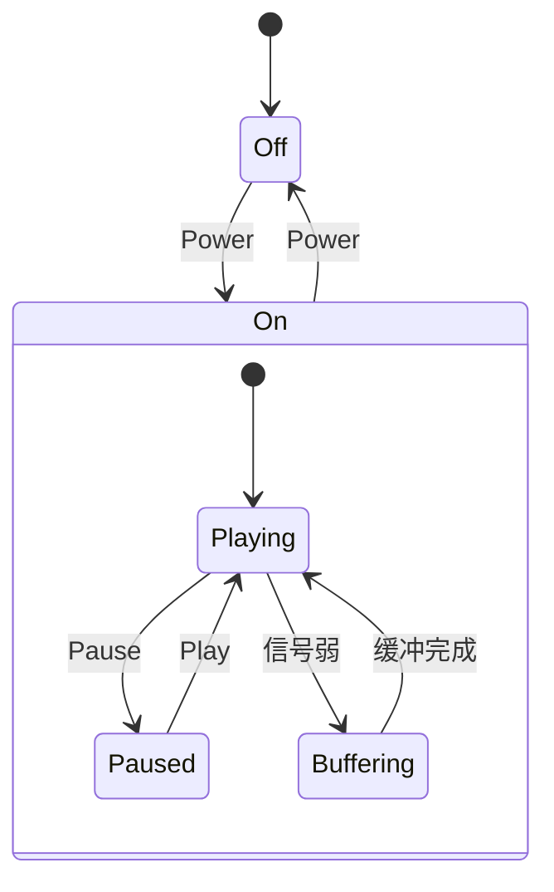

**朴素实现：复合状态类**——父状态对象内部持有一个子状态机，对外是一个状态，对内是完整状态机：

```csharp
// ============================================
// 父状态：On 持有自己的子状态机
// ============================================
public class OnState : IPlayerState
{
    public IPlayerSubState SubState { get; private set; } = new PlayingSubState();

    public string Name => $"开机（{SubState.Name}）";

    public void HandleEvent(PlayerContext ctx, PlayerEvent ev)
    {
        switch (ev)
        {
            case PlayerEvent.Power:
                Console.WriteLine("  → 关机");
                ctx.SetState(new OffState());
                return;
            case PlayerEvent.Lock:
                Console.WriteLine("  → 已锁屏（不影响播放）");
                return;
            default:
                // 父状态不处理的事件，交给子状态（事件冒泡）
                var next = SubState.HandleEvent(ev);
                if (next is not null) SubState = next;
                return;
        }
    }
}

// ============================================
// 子状态接口：只关心自己内部的事件
// ============================================
public interface IPlayerSubState
{
    string Name { get; }
    IPlayerSubState? HandleEvent(PlayerEvent ev); // null 表示子状态不处理
}

public class PlayingSubState : IPlayerSubState
{
    public string Name => "播放中";
    public IPlayerSubState? HandleEvent(PlayerEvent ev) => ev switch
    {
        PlayerEvent.Pause => new PausedSubState(),
        PlayerEvent.SignalLost => new BufferingSubState(),
        _ => null, // 不处理 → 让父状态接管
    };
}

public class PausedSubState : IPlayerSubState
{
    public string Name => "已暂停";
    public IPlayerSubState? HandleEvent(PlayerEvent ev) => ev switch
    {
        PlayerEvent.Play => new PlayingSubState(),
        _ => null,
    };
}

public class BufferingSubState : IPlayerSubState
{
    public string Name => "缓冲中";
    public IPlayerSubState? HandleEvent(PlayerEvent ev) => ev switch
    {
        PlayerEvent.BufferComplete => new PlayingSubState(),
        _ => null,
    };
}
```

> [!tip] 子状态的本质 = 行为继承
> 子状态继承父状态所有的事件处理，只覆盖自己关心的那部分。这与 OOP 继承本质相同——只是被继承的不是"类"，而是"状态"。子状态的行为必须与父状态一致（满足里氏替换原则）：如果父状态 `On` 对 `Lock` 事件的响应是"锁屏"，那么 `Playing`、`Paused` 等子状态也不能让 `Lock` 变成别的语义。

> [!warning] 朴素实现的局限
> 上面的 `OnState.HandleEvent` 用 `switch` 手动分流——这只实现了事件冒泡，**没有** entry/exit 动作顺序、LCA 路径计算、初始子状态级联。真正的 HSM 语义既可以**手写**（见 [[#手写完整 HSM：看清引擎机制]]），也可以用现成库封装（见 [[#2.7 实战：用 Stateless 库实现完整状态机]] 与 [[#2.8 嵌套状态机（HSM）：层次化降复杂度]]）。

---

### 2.5 状态转移表：把"何时→到哪"集中化

**动机**：在 [[#2.1 自动售货机：HasCoin / NoCoin / Sold / SoldOut|2.1]] 与 [[#2.2 订单状态机：Created → Paid → Shipped → Delivered / Cancelled|2.2]] 中，转移逻辑散落在每个 `ConcreteState` 的方法里——阅读时无法一眼看清全局流转图。当状态机达到 6+ 状态时，这种"隐式转移"成为维护噩梦。

**状态转移表 (State Transition Table)** 是数据驱动的方案：把所有 `(当前状态, 触发事件) → (下一状态, 动作, 守卫)` 显式记录在一张表中，状态类不再硬编码转移，而是查询表。

```csharp
// ============================================
// 1. 表项：当前状态 + 触发器 + 守卫 → 下一状态 + 动作
// ============================================
public enum OrderState { Created, Paid, Shipped, Delivered, Cancelled }
public enum OrderTrigger { Pay, Ship, Deliver, Cancel }

public readonly record struct Transition(
    OrderState Source,
    OrderTrigger Trigger,
    Func<bool>? Guard,            // 守卫条件（可空）
    OrderState Destination,
    Action<OrderContext>? Action); // 转移时执行的副作用

// ============================================
// 2. 转移表：所有规则集中在一处，一眼看清全局
// ============================================
public static class OrderTransitionTable
{
    private static readonly List<Transition> _rules = new()
    {
        new(OrderState.Created, OrderTrigger.Pay,    null, OrderState.Paid,
            ctx => Console.WriteLine($"  → 支付 ¥{ctx.Amount}")),

        new(OrderState.Created, OrderTrigger.Cancel, null, OrderState.Cancelled,
            ctx => Console.WriteLine("  → 直接取消")),

        new(OrderState.Paid, OrderTrigger.Ship,      null, OrderState.Shipped,
            ctx => Console.WriteLine("  → 已发货")),

        // Paid 状态下取消：两个互补守卫，永远有匹配
        new(OrderState.Paid, OrderTrigger.Cancel,
            () => DateTime.Now.Hour < 22, // 守卫 A：工作时间内允许退款
            OrderState.Cancelled,
            ctx => Console.WriteLine("  → 已退款")),
        new(OrderState.Paid, OrderTrigger.Cancel,
            () => DateTime.Now.Hour >= 22, // 守卫 B：非工作时间
            OrderState.Paid,                 // 保持原状态
            ctx => Console.WriteLine("  → 非工作时间，退款已记录，次日处理")),

        new(OrderState.Shipped, OrderTrigger.Deliver, null, OrderState.Delivered,
            ctx => Console.WriteLine("  → 已签收 ✅")),
        // 注意：Shipped × Cancel 未定义——Fire 时会触发"非法操作"分支
        // 这是转移表的特性：未显式声明的组合被拒绝（FSM 的完备性约束）
    };

    // 查询：找到第一个满足 (Source, Trigger, Guard) 的规则
    public static bool TryFind(
        OrderState source, OrderTrigger trigger,
        out Transition matched)
    {
        matched = default;
        foreach (var rule in _rules)
        {
            if (rule.Source != source || rule.Trigger != trigger) continue;
            if (rule.Guard is not null && !rule.Guard()) continue;
            matched = rule;
            return true;
        }
        return false;
    }
}

// ============================================
// 3. Context：纯数据 + 委托给转移表
// ============================================
public class OrderContext
{
    public OrderState State { get; set; } = OrderState.Created;
    public string OrderId { get; }
    public decimal Amount { get; }
    public List<string> History { get; } = new();

    public OrderContext(string id, decimal amount) { OrderId = id; Amount = amount; }

    public void Fire(OrderTrigger trigger)
    {
        if (!OrderTransitionTable.TryFind(State, trigger, out var rule))
        {
            Console.WriteLine($"  ✗ 非法操作：{State} × {trigger}");
            return;
        }
        var prev = State;
        rule.Action?.Invoke(this);
        State = rule.Destination;
        if (prev != State)
            History.Add($"{prev} --{trigger}--> {State}");
    }
}
```

使用演示：

```csharp
Console.WriteLine("--- 订单 1：完整流程 ---");
var order = new OrderContext("ORD-001", 299.99m);
order.Fire(OrderTrigger.Pay);     // Created → Paid
order.Fire(OrderTrigger.Ship);    // Paid → Shipped
order.Fire(OrderTrigger.Deliver); // Shipped → Delivered

Console.WriteLine("\n--- 订单 2：Paid 状态取消（互补守卫） ---");
var order2 = new OrderContext("ORD-002", 59m);
order2.Fire(OrderTrigger.Pay);
order2.Fire(OrderTrigger.Cancel);  // 工作时间 → Cancelled / 非工作时间 → 保持 Paid

Console.WriteLine("\n--- 订单 3：Shipped 状态取消（未定义组合） ---");
var order3 = new OrderContext("ORD-003", 19m);
order3.Fire(OrderTrigger.Pay);
order3.Fire(OrderTrigger.Ship);
order3.Fire(OrderTrigger.Cancel);  // → 非法操作（转移表完备性约束）

Console.WriteLine($"\n最终状态：order1={order.State}, order2={order2.State}, order3={order3.State}");
Console.WriteLine("订单 1 转移历史:");
foreach (var h in order.History) Console.WriteLine($"  {h}");
```

**转移表 vs 状态模式 vs 嵌套 switch 的对比**：

| 维度 | 嵌套 switch | 状态模式 | 转移表 |
|------|------------|---------|-------|
| **转移逻辑位置** | 散落在每个方法 | 散落在每个状态类 | **集中在一处** ✓ |
| **新增状态成本** | 改所有 switch | 新增一个类 | 表中加几行 |
| **新增触发器成本** | 改所有 switch | 改接口 + 所有类 | 表中加几行 |
| **守卫条件** | `if` 嵌套 | 状态类内 `if` | **一等公民** ✓ |
| **可视化** | ❌ | 类图 + 状态图 | **直接渲染为表格** ✓ |
| **类型安全** | ⚠️ 漏 case 编译器警告 | ✓ 强制实现接口 | ⚠️ 运行时查表 |
| **行为复杂度** | 适合简单分支 | 适合复杂业务逻辑 | 适合状态多但行为简单 |

> [!tip] 何时用转移表
> 当你的状态机满足以下特征时，转移表是最佳选择：
>
> - **状态 ≥ 6** 且行为简单（多为"切换到下一状态"+ 几行业务）
> - **守卫条件多**（同一触发器在不同条件下转移到不同状态）
> - **需要审计/可视化**（转移表本身就是文档）
>
> 反之，当状态行为复杂（每个状态有大量独有逻辑）时，**状态模式**更合适——把行为封装在状态类中，比一张巨大的表更易维护。

> [!example] Stateless 库 = 转移表 + 状态模式的合体
> 下一节的 Stateless 库本质上就是**带 fluent API 的转移表**：用 `Configure(State).Permit(Trigger, Next)` 声明规则，用 `OnEntry/OnExit` 表达状态行为，用 `PermitIf` 表达守卫——融合了两者的优点。

---

### 2.6 有限状态机（FSM）：状态模式的"父概念"

**有限状态机 (Finite State Machine, FSM)** 是一个数学模型：一个系统在任意时刻处于**有限个状态**中的一个，通过接收**事件 (event/trigger)** 触发**转移 (transition)** 进入下一状态。状态模式只是 FSM 的一种 OOP 实现方式。

形式化定义：

$$\text{FSM} = (S,\ \Sigma,\ \delta,\ s_0,\ F)$$

其中 $S$ 是有限状态集，$\Sigma$ 是事件字母表，$\delta: S \times \Sigma \to S$ 是转移函数，$s_0 \in S$ 是初始状态，$F \subseteq S$ 是终态集。

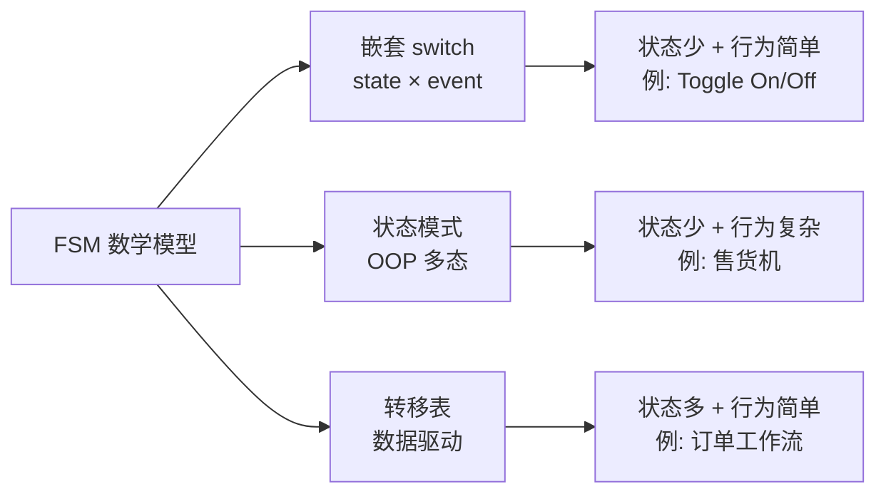

**三种实现 FSM 的方式对比**：

| 实现方式 | 代表 | 转移逻辑位置 | 类型安全 | 适用规模 |
|---------|------|------------|---------|---------|
| **嵌套 switch** | 经典教材 FSM | 集中（每个方法一个 switch） | ⚠️ 漏 case 有警告 | ≤ 3 状态 |
| **状态模式** | 本教程 2.1 / 2.2 | 分散（每个状态类内） | ✓ 接口强制 | 3–8 状态，行为复杂 |
| **转移表** | Stateless 库 | **集中**（一张表） | ⚠️ 运行时查表 | ≥ 6 状态，行为简单 |

**FSM 形式化的关键约束**：

1. **确定性 (Deterministic)**：同一 `(state, event)` 在同一守卫条件下只能转移到唯一的下一状态。状态模式中由"一个方法只能调一次 `SetState`"隐式保证；转移表中由"返回第一个匹配规则"保证。
2. **完备性 (Complete)**：每个 `(state, event)` 组合都有定义的行为（或显式忽略）。`enum + switch` 用 `_ => throw` 保证；状态模式用"每个状态都要实现接口"半保证（允许空实现）；转移表用"未匹配 → 抛异常或忽略"显式表达。
3. **可达性 (Reachable)**：所有状态都能从初始状态到达。这是**设计期**要验证的——画出状态图，检查是否有孤立节点。

> [!info] 状态模式 ≠ FSM
> 状态模式是 **OOP 实现 FSM 的一种方式**，不是 FSM 本身。FSM 是数学/工程概念，状态模式是 GoF 设计模式。理解这一区别后你会发现：
>
> - 不是所有 FSM 都需要状态模式（如简单的 Toggle 用 `bool` 即可）
> - 状态模式也可以实现非 FSM 的东西（如多态委托，不涉及"状态转移"）
> - 转移表与状态模式**可以共存**：状态类查询转移表来决定下一状态（见 [[#2.5 状态转移表：把"何时→到哪"集中化|2.5]] 的混合写法）

> [!warning] FSM 的"有限"二字
> "有限"指**状态数量有限**——这是 FSM 的核心约束。如果你的"状态"实际上是连续值（如温度、进度），FSM 不适用，应改用：
>
> - **连续状态系统**：PID 控制器、状态空间模型
> - **无限离散状态**：图灵机、下推自动机 (PDA)
>
> 实际工程中，"无限"的状态往往可以通过**状态 + 数据字段**化归为有限 FSM：如登录失败次数，用 `LoginFailedState` + `AttemptsLeft: int`，而不是 `LoginFailed1State`...`LoginFailed99State`——见 [[#陷阱 1：状态爆炸（State Explosion）]]。

---

### 2.7 实战：用 Stateless 库实现完整状态机

[Stateless](https://github.com/dotnet-state-machine/stateless) 是 .NET 生态最流行的状态机库（6k+ ⭐）。它**不是**状态模式的实现，而是**带 fluent API 的转移表 + 状态行为**——融合了 [[#2.5 状态转移表：把"何时→到哪"集中化|2.5]] 和 [[#2.6 有限状态机（FSM）：状态模式的"父概念"|2.6]] 的优点。

**安装**：

```bash
dotnet add package Stateless
```

**用 Stateless 重写订单状态机**：

```csharp
using Stateless;

// ============================================
// 1. 定义状态和触发器（用 enum 即可）
// ============================================
public enum OrderState { Created, Paid, Shipped, Delivered, Cancelled }
public enum OrderTrigger { Pay, Ship, Deliver, Cancel }

// ============================================
// 2. 用 fluent API 声明状态机
// ============================================
public class OrderWorkflow
{
    private readonly StateMachine<OrderState, OrderTrigger> _sm;

    public decimal Amount { get; }
    public List<string> History { get; } = new();

    public OrderWorkflow(decimal amount)
    {
        Amount = amount;
        _sm = new StateMachine<OrderState, OrderTrigger>(OrderState.Created);

        // —— Created ——
        _sm.Configure(OrderState.Created)
            .OnEntry(() => Log("订单已创建"))
            .Permit(OrderTrigger.Pay, OrderState.Paid)
            .Permit(OrderTrigger.Cancel, OrderState.Cancelled)
            .Ignore(OrderTrigger.Ship)     // 显式忽略，不抛异常
            .Ignore(OrderTrigger.Deliver);

        // —— Paid ——
        _sm.Configure(OrderState.Paid)
            .OnEntry(() => Log($"支付 ¥{Amount}"))
            .OnExit(() => Log("离开已支付状态"))
            .Permit(OrderTrigger.Ship, OrderState.Shipped)
            // 守卫条件 A：工作时间内允许退款 → Cancelled
            .PermitIf(OrderTrigger.Cancel, OrderState.Cancelled,
                () => DateTime.Now.Hour < 22, "工作时间退款")
            // 守卫条件 B：夜间忽略 Cancel（不切换状态，也不抛异常）
            .IgnoreIf(OrderTrigger.Cancel, () => DateTime.Now.Hour >= 22);

        // —— Shipped ——
        _sm.Configure(OrderState.Shipped)
            .Permit(OrderTrigger.Deliver, OrderState.Delivered)
            .Ignore(OrderTrigger.Cancel);

        // —— 终态 ——
        _sm.Configure(OrderState.Delivered)
            .OnEntry(() => Log("✅ 交易完成"));
        _sm.Configure(OrderState.Cancelled)
            .OnEntry(() => Log("❌ 订单已取消"));

        // 监听所有转移
        _sm.OnTransitioned(t =>
            History.Add($"{t.Source} --{t.Trigger}--> {t.Destination}"));
    }

    public OrderState State => _sm.State;

    public void Pay()     => _sm.Fire(OrderTrigger.Pay);
    public void Ship()    => _sm.Fire(OrderTrigger.Ship);
    public void Deliver() => _sm.Fire(OrderTrigger.Deliver);
    public void Cancel()  => _sm.Fire(OrderTrigger.Cancel);

    // 当前状态下允许的触发器（自省）
    public IEnumerable<OrderTrigger> PermittedTriggers => _sm.PermittedTriggers;

    private void Log(string msg) => Console.WriteLine($"  [{State}] {msg}");
}
```

使用演示：

```csharp
var order = new OrderWorkflow(299.99m);
Console.WriteLine($"当前状态: {order.State}");
Console.WriteLine($"允许的操作: {string.Join(", ", order.PermittedTriggers)}\n");

order.Pay();
order.Ship();
order.Deliver();

Console.WriteLine($"\n最终状态: {order.State}");
Console.WriteLine("转移历史:");
foreach (var h in order.History) Console.WriteLine($"  {h}");
```

**Stateless 的杀手锏特性**：

| 特性 | API | 价值 |
|------|-----|------|
| **守卫条件** | `PermitIf(trigger, dest, guard)` | 同一触发器根据条件转移到不同状态——见 [[#2.5 状态转移表：把"何时→到哪"集中化|2.5]] 的"夜间退款" |
| **入口/出口动作** | `OnEntry(action)` / `OnExit(action)` | 不需要把行为写在状态类里，集中配置 |
| **内部转移** | `InternalTransition(trigger, action)` | 处理事件但不切换状态（如记录日志） |
| **忽略** | `Ignore(trigger)` | 显式声明"此状态不响应此事件"，避免抛异常 |
| **可重入** | `PermitReentry(trigger)` | 自循环，重新执行 OnEntry |
| **子状态** | `SubstateOf(parent)` | 真正的 HSM 语义，见 [[#2.8 嵌套状态机（HSM）：层次化降复杂度|2.8]] |
| **初始子状态** | `InitialTransition(substate)` | 进入父状态时自动进入指定子状态 |
| **动态转移** | `PermitDynamic(trigger, () => ...)` | 运行时决定下一状态 |
| **参数化触发器** | `SetTriggerParameters<T>(trigger)` | 触发器携带强类型参数（如 `Fire(Pay, 100m)`） |
| **外部状态存储** | `new SM(() => state, s => state = s)` | 状态机不持有状态，配合 ORM 持久化 |
| **可视化导出** | `UmlDotGraph.Format(sm)` / `MermaidGraph.Format(sm)` | 直接生成 Graphviz/Mermaid 图（5.x 起） |

> [!tip] Stateless vs 手写状态模式
> - **小项目 / 学习**：手写状态模式，理解机制
> - **生产业务系统**：用 Stateless，少写 50% 样板代码，且有完整的 OnEntry/OnExit/Guard/Substate 支持
> - **极致性能 / 嵌入式**：手写转移表（`Dictionary<(State,Trigger),State>`），比反射 + 委托的 Stateless 快约 10 倍
>
> Stateless 的代价：每次 `Fire` 内部做字典查找 + 委托调用，比手写的直接方法调用慢。对于每秒数百万次转移的场景（如网络协议栈），考虑 [Akka.NET](https://getakka.net/) 的 `FSM<TState,TData>` 或自写转移表。

---
### 2.8 嵌套状态机（HSM）：层次化降复杂度

**层次状态机 (Hierarchical State Machine, HSM)** 由 David Harel 在 1987 年的论文《Statecharts: A Visual Formalism for Complex Systems》中提出，被 UML 1.4 标准化。它解决的就是 [[#2.4 状态与子状态：分层降低复杂度|2.4]] 中提到的"朴素实现"做不到的事情：

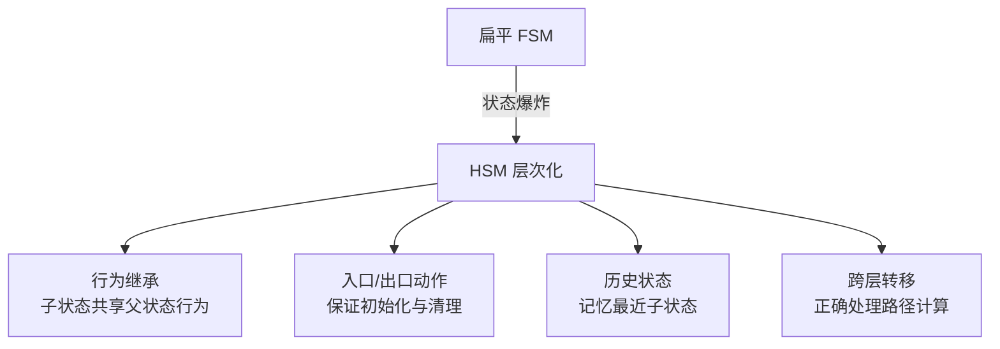

**HSM 的三个核心语义**（来自 Harel/UML 标准）：

#### 语义 1：行为继承与事件冒泡

如果系统处于子状态 `s11`，它**隐式地也处于**父状态 `s1`。子状态需要处理的事件，先在子状态处理；子状态**不处理**的事件，自动**冒泡**到父状态处理。

```
       s1 (superstate)
       ├── entry / lock()      ← 所有子状态共享
       ├── exit  / unlock()
       │
       └── s11 (substate)
           ├── entry / play()
           └── PAUSE → s12
```

- 收到 `PAUSE`：`s11` 处理 → 切换到 `s12`
- 收到 `POWER`（`s11` 不处理）：冒泡到 `s1` → 触发关机
- 这就是"子状态继承父状态行为"

#### 语义 2：入口/出口动作的执行顺序

进入嵌套状态时，**入口动作从外到内**执行；退出时，**出口动作从内到外**执行——就像构造函数与析构函数。

```
进入 s1.s11：  s1.entry → s11.entry
退出  s1.s11：  s11.exit  → s1.exit
```

这保证了**确定性初始化与清理**——不管从哪里转移进来，`s1` 的初始化代码总是先执行；不管转移到哪里，`s11` 的清理代码总是先执行。这正是 [[raii-complete-analysis|RAII]] 在状态机维度的对应物。

#### 语义 3：跨层转移的路径计算（LCA 算法）

从 `s1.s11` 转移到 `s2.s21` 时，HSM 自动计算需要 exit 哪些状态、entry 哪些状态——称为**最近公共祖先 (LCA = Lowest Common Ancestor)** 算法：

```
s1.s11 → s2.s21:
  s11 祖先链：s11 → s1 → top
  s21 祖先链：s21 → s2 → top
  LCA(s11, s21) = top
  exit 顺序：s11.exit → s1.exit   （从内到 LCA 的下一层）
  entry 顺序：s2.entry → s21.entry（从 LCA 的下一层到内）
```

#### 手写完整 HSM：看清引擎机制

上面三个语义听起来抽象，但手写实现的核心引擎不到 100 行，且**不依赖任何库**。设计思路来自 Miro Samek 的 QEP 框架（论文 [State-Oriented Programming, Samek 2008](https://www.state-machine.com/doc/Samek0008.pdf)），Zephyr RTOS 的 [SMF 框架](https://docs.zephyrproject.org/3.7.0/services/smf/index.html)是同源结构。

**关键设计**：每个状态对象"知道自己的父状态"（`Parent` 指针）。状态本身不持有任何 per-context 数据，所以全局用单例即可——这与 [[#2.1 自动售货机：HasCoin / NoCoin / Sold / SoldOut|2.1]] 中"每次 `new` 一个状态对象"不同，但更贴近 UML 状态机的数学本质（状态是图里的节点，不是实例）。

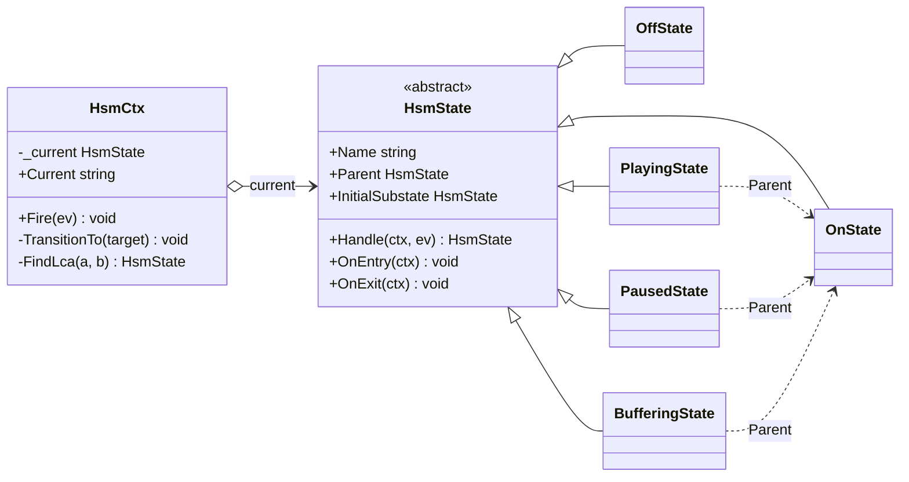

注意类图里有**两层关系**：实线三角 `├──` 是 C# 类继承（所有具体状态都继承 `HsmState`），虚线箭头是运行时 `Parent` 指针（HSM 的层次结构存在数据里）。这是 HSM 设计的关键洞察——**层次关系是组合，不是类继承**。

`Handle` 的返回值三态约定是整个设计的核心（Samek 风格）：

| `Handle` 返回 | 含义 |
|---|---|
| `null` | 不处理 → 引擎继续向 `Parent` 冒泡 |
| `this` | 内部转移：已处理但不换状态（不触发 entry/exit） |
| 其它 state | 外部转移：切到目标状态 |

引擎和基类（HSM 全部语义都在这两个类型里）：

**`HsmState` 基类的继承契约**：成员分三类——abstract 必须实现，virtual 可选覆盖，只读成员直接继承用。子类（如 `PlayingState`）只覆盖自己需要的部分：

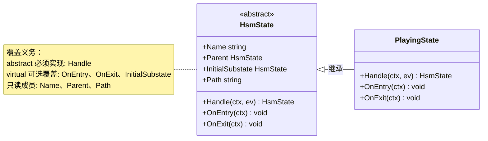

```csharp
// ============================================
// 1. HsmState 抽象基类 —— 层次结构的核心
// ============================================
public abstract class HsmState
{
    public string Name { get; }
    public HsmState? Parent { get; }        // null = 顶层

    protected HsmState(string name, HsmState? parent)
    { Name = name; Parent = parent; }

    // 三态返回：null=冒泡 / this=内部转移 / 其它=外部转移
    public abstract HsmState? Handle(HsmCtx ctx, PlayerEv ev);

    protected internal virtual void OnEntry(HsmCtx ctx) { }
    protected internal virtual void OnExit(HsmCtx ctx) { }

    // 初始子状态：null=叶子；非 null=进入时自动级联到它
    protected internal virtual HsmState? InitialSubstate => null;

    // 全路径名，如 "On/Playing" —— 可视化层次
    public string Path => Parent is null ? Name : $"{Parent.Path}/{Name}";
}

// ============================================
// 2. HsmCtx —— 引擎 + 上下文
// ============================================
public class HsmCtx
{
    private HsmState _current;  // 永远指向"叶子"状态

    public HsmCtx(HsmState topInitial)
    {
        _current = topInitial;
        EnterChain(topInitial);  // 启动：从 top 级联 entry 到叶子
    }

    public string Current => _current.Path;

    // —— 事件分发：从叶子向上冒泡，找第一个处理者 ——
    public void Fire(PlayerEv ev)
    {
        HsmState? s = _current;
        while (s is not null)
        {
            var result = s.Handle(this, ev);
            if (result is not null)
            {
                if (!ReferenceEquals(result, s))
                    TransitionTo(result);   // 外部转移
                return;                      // this → 内部转移，啥也不做
            }
            s = s.Parent;                    // 冒泡
        }
    }

    // —— 转移核心：LCA + exit/entry 顺序 + 初始子状态级联 ——
    private void TransitionTo(HsmState target)
    {
        var lca = FindLca(_current, target);

        // (a) exit：从叶子"由内向外"到 LCA（不含）—— 语义 2
        for (var s = _current; s is not null && s != lca; s = s.Parent)
            s.OnExit(this);

        // (b) entry：从 LCA 下方"由外向内"到 target
        var path = new Stack<HsmState>();
        for (var s = target; s is not null && s != lca; s = s.Parent)
            path.Push(s);
        foreach (var s in path) s.OnEntry(this);

        _current = target;

        // (c) target 是复合状态 → 级联进入初始子状态
        while (_current.InitialSubstate is { } init)
        {
            _current = init;
            _current.OnEntry(this);
        }
    }

    private void EnterChain(HsmState start)
    {
        start.OnEntry(this);
        while (_current.InitialSubstate is { } init)
        {
            _current = init;
            _current.OnEntry(this);
        }
    }

    // 最近公共祖先：两条祖先链的第一个交点 —— 语义 3
    private static HsmState? FindLca(HsmState a, HsmState b)
    {
        var ancestors = new HashSet<HsmState>();
        for (var s = a; s is not null; s = s.Parent) ancestors.Add(s);
        for (var s = b; s is not null; s = s.Parent)
            if (ancestors.Contains(s)) return s;
        return null; // 无公共祖先 = top
    }
}
```

具体状态——注意 `PlayingState` 故意不处理 `Power`/`Lock`，它们会自动冒泡给 `On`（[[#语义 1：行为继承与事件冒泡|语义 1]]）：

```csharp
// ---- On（复合状态）：所有子状态共享 Power 和 Lock ----
public sealed class OnState : HsmState
{
    public static OnState Instance { get; } = new OnState();
    private OnState() : base("On", null) { }

    // 进入 On 自动落到 Playing —— 这就是"初始伪状态"
    protected internal override HsmState? InitialSubstate => PlayingState.Instance;

    public override HsmState? Handle(HsmCtx ctx, PlayerEv ev) => ev switch
    {
        PlayerEv.Power => OffState.Instance,  // ← 子状态共享这一条
        PlayerEv.Lock  => this,               // ← 内部转移：锁屏不换状态
        _ => null,
    };

    protected internal override void OnEntry(HsmCtx ctx)
        => Console.WriteLine("    [entry] On —— 加载播放列表");
    protected internal override void OnExit(HsmCtx ctx)
        => Console.WriteLine("    [exit]  On —— 保存播放位置");
}

// ---- Playing（On 的初始子状态）----
public sealed class PlayingState : HsmState
{
    public static PlayingState Instance { get; } = new PlayingState();
    private PlayingState() : base("Playing", OnState.Instance) { }  // ← Parent

    public override HsmState? Handle(HsmCtx ctx, PlayerEv ev) => ev switch
    {
        PlayerEv.Pause      => PausedState.Instance,
        PlayerEv.SignalLost => BufferingState.Instance,
        _ => null,   // ← Power/Lock 冒泡给 On
    };

    protected internal override void OnEntry(HsmCtx ctx)
        => Console.WriteLine("    [entry] Playing —— 开始解码");
    protected internal override void OnExit(HsmCtx ctx)
        => Console.WriteLine("    [exit]  Playing —— 停止解码");
}
// OffState / PausedState / BufferingState 同构，省略
```

运行验证（.NET 10 实测），三大语义逐条命中：

```text
─── (1) 开机：Off → On，级联初始到 Playing ───
    [exit]  Off —— 准备启动
    [entry] On —— 加载播放列表
    [entry] Playing —— 开始解码          ← entry 外→内 + 级联初始
当前: On/Playing

─── (2) 暂停：Playing → Paused（LCA=On，只动子层）───
    [exit]  Playing —— 停止解码
    [entry] Paused —— 画面冻结            ← LCA=On，On 不参与
当前: On/Paused

─── (3) 行为继承：在 Paused 按 Lock ───
    （Paused 不处理 → 冒泡到 On → this 返回 → 不换状态）
当前: On/Paused                           ← 状态未变

─── (4) 跨层关机：Paused 按 Power（LCA=top）───
    [exit]  Paused —— 解除冻结
    [exit]  On —— 保存播放位置            ← exit 内→外
    [entry] Off —— 屏幕熄灭               ← 冒泡到 On 找到处理者
当前: Off
```

- **(2)** `LCA(Playing, Paused)=On`：只 exit/entry 子层，`On` 完全不动
- **(3)** `Lock` 在 `On` 返回 `this` → 内部转移，`Paused` 状态不变（锁屏不影响播放）
- **(4)** `LCA(Paused, Off)=top`：`Paused` 和 `On` 都 exit（内→外），`Off` entry

> [!tip] 状态为什么用单例？
> 状态对象不持有任何 per-context 数据（音量、进度等都在 `HsmCtx` 里）。所以一个状态全局一份就够——这正是 Samek QEP 用静态状态处理器、UML 把状态画成图节点的根本原因。`Instance` 单例 + 私有构造函数表达了"状态是唯一的"这一约束。

#### 实战：游戏角色控制器（Locomotion HSM）

> [!info] 这是游戏开发中 HSM 最典型的场景
> 角色的 Locomotion（运动）状态机天然是层次化的：地面动作共享"移动输入"，所有存活状态共享"死亡检测"。Unity Animator、UE5 AnimBlueprint、Godot 的 AnimationTree 背后都是这个结构（见 [mocaponline 的 locomotion 指南](https://mocaponline.com/blogs/mocap-news/animation-state-machine)）。[Game Programming Patterns](https://gameprogrammingpatterns.com/state.html) 也专门论述了用继承共享状态代码——正是 HSM 的行为继承。

**为什么扁平 FSM 会爆炸**？如果把 `Idle`/`Walking`/`Sprinting`/`Jumping`/`Falling`/`Dead` 全部平级：

- `Idle`/`Walking`/`Sprinting` 三个状态都要重复"读取 WASD + 应用地面摩擦"
- **每个**状态都要重复"检测 HP 归零 → 切 `Dead`"——5 处同样的代码
- 新增一个"受伤硬直"状态，又要在所有状态里加一条"受伤打断"转移

HSM 把共性上提到父状态：

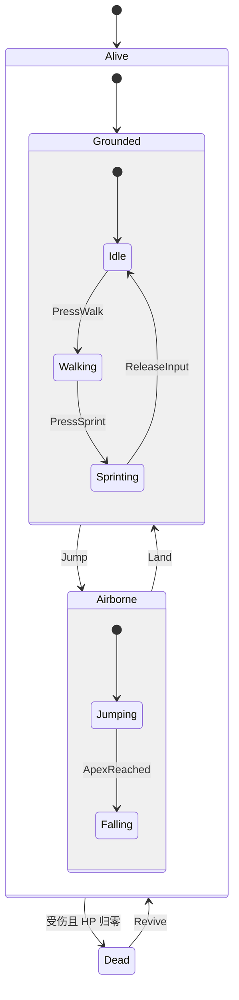

三层嵌套，每层分一类共性：

- `Alive`（顶层）—— 统一处理 `TakeDamage` 死亡检测（**所有子状态共享**）
  - `Grounded` —— 统一处理移动输入 + `Jump`（地面专属）
    - `Idle` / `Walking` / `Sprinting`（只覆盖动画，输入全继承）
  - `Airborne` —— 统一处理 `Land`（落地检测）
    - `Jumping` / `Falling`
- `Dead`（终态）

**关键代码**——只需看两个父状态，就理解了整个角色控制器。引擎 [[#手写完整 HSM：看清引擎机制|上文]] 已实现，这里复用同一套 `HsmState`/`HsmCtx`，只把事件换成游戏相关的 `CharEv`，并给 `HsmCtx` 加一个 `Hp` 字段：

```csharp
public enum CharEv { PressWalk, PressSprint, ReleaseInput, Jump, ApexReached, Land, TakeDamage, Revive }

public class HsmCtx
{
    private HsmState _current;
    public int Hp { get; set; } = 100;   // per-context 数据：生命值
    // ... 其余与上文的 HsmCtx 完全一致
}

// ---- Alive：死亡检测集中在一处 —— 行为继承的核心 ----
public sealed class AliveState : HsmState
{
    public static AliveState Instance { get; } = new();
    private AliveState() : base("Alive", null) { }
    protected internal override HsmState? InitialSubstate => GroundedState.Instance;

    public override HsmState? Handle(HsmCtx ctx, CharEv ev)
    {
        if (ev == CharEv.TakeDamage)
        {
            ctx.Hp -= 30;
            Console.WriteLine($"    [Alive] 受伤，扣 30，剩 HP={ctx.Hp}");
            return ctx.Hp <= 0 ? DeadState.Instance : this;  // 死→Dead；没死→内部转移
        }
        return null;
    }

    protected internal override void OnEntry(HsmCtx ctx)
    { ctx.Hp = 100; Console.WriteLine($"    [entry] Alive —— 角色激活"); }
}

// ---- Grounded：移动输入集中在一处 —— Idle/Walk/Sprint 共享 ----
public sealed class GroundedState : HsmState
{
    public static GroundedState Instance { get; } = new();
    private GroundedState() : base("Grounded", AliveState.Instance) { }
    protected internal override HsmState? InitialSubstate => IdleState.Instance;

    public override HsmState? Handle(HsmCtx ctx, CharEv ev) => ev switch
    {
        CharEv.PressWalk    => WalkingState.Instance,
        CharEv.PressSprint  => SprintingState.Instance,
        CharEv.ReleaseInput => IdleState.Instance,
        CharEv.Jump         => JumpingState.Instance,  // 只有地面能跳
        _ => null,   // TakeDamage 冒泡给 Alive
    };
}

// IdleState / WalkingState / SprintingState 只覆盖 OnEntry 播动画，
// Handle 返回 null —— 移动输入完全继承自 Grounded
// AirborneState 同理：统一处理 Land，Jumping/Falling 只管动画
```

**完整运行流程**（.NET 10 实测），每个事件如何穿越层次：

![[fig_2_8_game_character_hsm_ai.png]]

```text
=== 出生：级联初始（3 层 entry 外→内）===
    [entry] Alive —— 角色激活
    [entry] Grounded —— 启用地面摩擦，读取 WASD
    [entry] Idle —— 待机动画
当前: Alive/Grounded/Idle, HP=100

─── 移动 Idle → Walking（LCA=Grounded，只动子层）───
    [entry] Walking —— 步行动画        ← Grounded 不参与（行为继承）

─── 跳跃 Sprinting → Airborne.Jumping（跨层，LCA=Alive）───
    [exit]  Grounded —— 关闭地面摩擦   ← exit 内→外
    [entry] Airborne —— 启用重力
    [entry] Jumping —— 跳跃动画        ← entry 外→内

─── 空中受伤（行为继承：冒泡到 Alive）───
    [Alive] 受伤，扣 30，剩 HP=70       ← Jumping 不处理→Airborne 不处理→Alive 处理
当前: Alive/Airborne/Jumping           ← 返回 this，状态不变

─── 连击致死（最深跨层，LCA=top）───
    [Alive] 受伤，剩 HP=10
    [Alive] 受伤，剩 HP=-20 → Dead
    [exit]  Airborne —— 关闭重力        ← exit 内→外：Falling→Airborne→Alive
    [exit]  Alive —— 角色失活
    [entry] Dead —— 死亡动画

─── 复活（级联初始重新进入）───
    [exit]  Dead —— 复活动画
    [entry] Alive —— 角色激活，HP 重置   ← 重新级联到 Grounded.Idle
    [entry] Grounded —— 启用地面摩擦
    [entry] Idle —— 待机动画
当前: Alive/Grounded/Idle, HP=100
```

逐条对照三大语义：

- **行为继承**：`TakeDamage` 在 `Jumping` 里没写 → 冒泡到 `Alive` 统一扣血。换成扁平 FSM，`Jumping`/`Falling`/`Idle`... 每个状态都要复制这段扣血 + 死亡判断
- **entry/exit 顺序**：跳跃时 `Grounded.exit` → `Airborne.entry` → `Jumping.entry`（外→内）；死亡时 `Airborne.exit` → `Alive.exit`（内→外）
- **LCA 路径计算**：`Idle→Walking` 的 LCA 是 `Grounded`（只动子层）；`Sprinting→Jumping` 的 LCA 是 `Alive`（跨 Grounded/Airborne）；`Falling→Dead` 的 LCA 是 top（跨 Alive/Dead 两棵子树）

> [!tip] 这个场景里 HSM 省了什么
> 扁平 FSM 版本：6 个状态各写 `TakeDamage` 死亡检测 = 6 处重复；3 个地面状态各写移动输入 = 3 处重复。HSM 版本：死亡检测 1 处（`Alive`），移动输入 1 处（`Grounded`）。新增"受伤硬直"状态只需挂在 `Alive` 下，自动获得死亡检测——**零改动**复用。

> [!example] 真实项目里的扩展
> - `Grounded` 下加 `Crouching`（蹲伏）：自动继承移动输入和跳跃逻辑
> - `Airborne` 下加 `WallSliding`（滑墙）：自动继承落地检测
> - `Alive` 下加 `Stunned`（硬直）：自动继承死亡检测
> - 顶层加 `Paused`（暂停）作为 `Alive`/`Dead` 的兄弟：游戏暂停时整个角色行为冻结
>
> 新增状态只覆盖自己关心的部分，共性自动继承——这就是行为继承的工程价值。

> [!warning] 这个手写实现省略了什么
> 为了教学清晰，这里**没有**实现：历史伪状态（`H`/`H*`，记忆最近子状态）、深层历史、转移的守卫条件、外部转移 vs 本地转移（local transition）的区别。生产场景这些语义用 [[#2.7 实战：用 Stateless 库实现完整状态机|Stateless]] 或 QP/SMF 等框架更稳妥（链接见下方"业界 HSM 实现"）。但理解了这个引擎，库的行为就不再是黑盒。

**用 Stateless 库重新实现**（同一套语义，库封装了 LCA 与 entry/exit 顺序，无需手写引擎）：

```csharp
using Stateless;

public enum PlayerState { Off, On, Playing, Paused, Buffering }
public enum PlayerEvent { Power, Play, Pause, SignalLost, BufferComplete }

public class HierarchicalPlayer
{
    private readonly StateMachine<PlayerState, PlayerEvent> _sm;

    public HierarchicalPlayer()
    {
        _sm = new StateMachine<PlayerState, PlayerEvent>(PlayerState.Off);

        // —— Off ——
        _sm.Configure(PlayerState.Off)
            .OnEntry(() => Console.WriteLine("  → 关机"))
            .Permit(PlayerEvent.Power, PlayerState.On);

        // —— On（父状态）——
        _sm.Configure(PlayerState.On)
            .OnEntry(() => Console.WriteLine("  → 开机（On.entry）"))
            .OnExit(() => Console.WriteLine("  → 关机前清理（On.exit）"))
            .InitialTransition(PlayerState.Playing) // 进入 On 自动到 Playing
            .Permit(PlayerEvent.Power, PlayerState.Off); // 所有子状态共享 Power

        // —— Playing（On 的子状态）——
        _sm.Configure(PlayerState.Playing)
            .SubstateOf(PlayerState.On)
            .OnEntry(() => Console.WriteLine("    → 开始播放"))
            .OnExit(() => Console.WriteLine("    → 停止播放"))
            .Permit(PlayerEvent.Pause, PlayerState.Paused)
            .Permit(PlayerEvent.SignalLost, PlayerState.Buffering);

        // —— Paused ——
        _sm.Configure(PlayerState.Paused)
            .SubstateOf(PlayerState.On)
            .OnEntry(() => Console.WriteLine("    → 已暂停"))
            .Permit(PlayerEvent.Play, PlayerState.Playing);

        // —— Buffering ——
        _sm.Configure(PlayerState.Buffering)
            .SubstateOf(PlayerState.On)
            .OnEntry(() => Console.WriteLine("    → 缓冲中..."))
            .Permit(PlayerEvent.BufferComplete, PlayerState.Playing);
    }

    public PlayerState State => _sm.State;
    public bool IsIn(PlayerState s) => _sm.IsInState(s); // 考虑层次关系
    public void Fire(PlayerEvent ev) => _sm.Fire(ev);
}
```

使用演示：

```csharp
var player = new HierarchicalPlayer();

Console.WriteLine("--- 开机 ---");
player.Fire(PlayerEvent.Power);
// 输出：
//   → 开机（On.entry）
//     → 开始播放（Playing.entry，由 InitialTransition 触发）

Console.WriteLine("\n--- 暂停 ---");
player.Fire(PlayerEvent.Pause);
//     → 停止播放（Playing.exit）
//     → 已暂停（Paused.entry）

Console.WriteLine($"\n此时 state={player.State}, IsIn(On)={player.IsIn(PlayerState.On)}");
// state=Paused, IsIn(On)=True —— Paused 是 On 的子状态，IsIn 考虑层次关系

Console.WriteLine("\n--- 直接关机（从 Paused）---");
player.Fire(PlayerEvent.Power);
//   → 关机前清理（On.exit）
//   → 关机（Off.entry）
// 注意：Power 在 Paused 中没定义，自动冒泡到 On，触发 On → Off

Console.WriteLine($"\n关机后 state={player.State}, IsIn(On)={player.IsIn(PlayerState.On)}");
// state=Off, IsIn(On)=False —— Off 不是 On 的子状态
```

> [!tip] `IsInState` vs `State`
> Stateless 中：
>
> - `State` 返回**精确的当前状态**（如 `Playing`）
> - `IsInState(On)` 考虑层次关系，当 State 是 `Playing`/`Paused`/`Buffering` 时都返回 `true`
>
> 这正是行为继承的体现：`Playing` **是一种** `On`。

> [!info] 业界 HSM 实现
> - **C/C++**：[QP Framework](https://www.state-machine.com/)（Miro Samek 的官方实现，嵌入式首选）、[qf4net](https://github.com/zdomokos/qf4net)（QP 的 .NET 移植）
> - **C#**：[Stateless](https://github.com/dotnet-state-machine/stateless) 的 `SubstateOf`（功能子集，足够多数业务场景）
> - **Python**：[transitions](https://github.com/pytransitions/transitions) 的 `HierarchicalMachine`
> - **C++ / 游戏**：Unreal Engine 的 GameplayAbilitySystem 内置 HSM

**HSM 的工程价值**：Miro Samek 在《Practical UML Statecharts in C/C++》第 2 章通过案例证明，引入层次化后，**状态数量随复杂度的增长从指数降为线性**。扁平 FSM 中 5 个互相组合的状态可能产生 25+ 转移；HSM 中通过子状态共享父行为，转移数可降到 10 以内。这就是为什么 Harel 把 statecharts 称为"对传统 FSM 的根本性扩展"。

---

### 2.9 行为树（Behavior Tree）：超越状态机的另一选择

**行为树 (Behavior Tree, BT)** 起源于 2000 年代的游戏行业（如《Halo 2》《Spore》），用于建模 NPC（非玩家角色）行为，后来被机器人领域（ROS 2 的 BehaviorTree.CPP）广泛采用。它解决了 FSM 在**复杂反应式系统**中的两大痛点：

1. **状态爆炸**：FSM 中，"N 个状态 × M 个可能的打断事件"导致转移数 $\approx N \times M$
2. **反应性 vs 模块性的权衡**：要反应快，就要加很多打断转移；要模块化，就要少加转移——FSM 鱼与熊掌不可兼得

#### BT 的核心：每帧"tick"，从根开始深度优先遍历

BT 是一棵有向树，**每帧（或每个决策周期）从根节点开始，深度优先、前序遍历**整棵树。每个节点被 tick 后返回三种状态之一：

- `Success`：任务完成
- `Failure`：任务失败或条件不满足
- `Running`：任务进行中（异步、长时间）

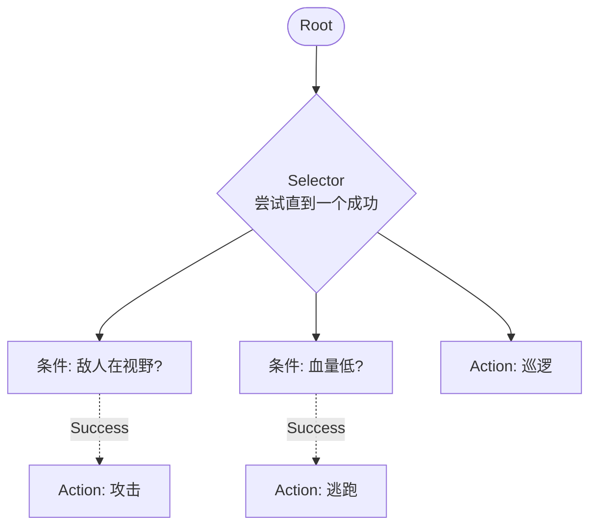

#### 节点类型

| 节点                            | 行为                                        | 类比       |
| ----------------------------- | ----------------------------------------- | -------- |
| **Action**（动作叶节点）             | 执行一个动作，返回 `Success`/`Failure`/`Running`   | 函数调用     |
| **Condition**（条件叶节点）          | 检查条件，立即返回 `Success`/`Failure`             | `if` 表达式 |
| **Sequence**（顺序组合）            | 依次 tick 子节点，**任一失败即返回失败**，全成功才成功          | 逻辑 `AND` |
| **Selector / Fallback**（选择组合） | 依次 tick 子节点，**任一成功即返回成功**，全失败才失败          | 逻辑 `OR`  |
| **Decorator**（装饰器）            | 单子节点的修饰，如 `Inverter`（取反）、`Repeat`（重试 N 次） | 一元运算符    |
| **Parallel**（并行）              | 同时 tick 所有子节点，按预设策略返回                     | 并发原语     |

#### 用 C# 实现一个最小行为树

```csharp
// ============================================
// 1. 节点基类与返回状态
// ============================================
public enum NodeStatus { Success, Failure, Running }

public abstract class BTNode
{
    public abstract NodeStatus Tick();
}

// ============================================
// 2. 叶节点：Action / Condition
// ============================================
public class ActionNode : BTNode
{
    private readonly Func<NodeStatus> _action;
    public string Name { get; }
    public ActionNode(string name, Func<NodeStatus> action)
    { Name = name; _action = action; }
    public override NodeStatus Tick() => _action();
}

public class ConditionNode : BTNode
{
    private readonly Func<bool> _condition;
    public ConditionNode(Func<bool> condition) => _condition = condition;
    public override NodeStatus Tick()
        => _condition() ? NodeStatus.Success : NodeStatus.Failure;
}

// ============================================
// 3. 组合节点：Sequence / Selector
// ============================================
public class Sequence : BTNode  // AND：全成功才成功
{
    private readonly List<BTNode> _children;
    public Sequence(params BTNode[] children) => _children = new(children);

    public override NodeStatus Tick()
    {
        foreach (var child in _children)
        {
            var status = child.Tick();
            if (status != NodeStatus.Success) return status; // 失败或运行中即返回
        }
        return NodeStatus.Success;
    }
}

public class Selector : BTNode   // OR：任一成功即成功
{
    private readonly List<BTNode> _children;
    public Selector(params BTNode[] children) => _children = new(children);

    public override NodeStatus Tick()
    {
        foreach (var child in _children)
        {
            var status = child.Tick();
            if (status != NodeStatus.Failure) return status; // 成功或运行中即返回
        }
        return NodeStatus.Failure;
    }
}

// ============================================
// 4. 装饰器：Inverter
// ============================================
public class Inverter : BTNode
{
    private readonly BTNode _child;
    public Inverter(BTNode child) => _child = child;
    public override NodeStatus Tick() => _child.Tick() switch
    {
        NodeStatus.Success => NodeStatus.Failure,
        NodeStatus.Failure => NodeStatus.Success,
        _ => NodeStatus.Running,
    };
}
```

**组合一个"守卫 AI"**：

```csharp
// 共享上下文（Blackboard）
bool enemyInSight = false;
bool lowHealth = false;
bool heardNoise = false;

// 构建行为树
BTNode guardAI = new Selector(
    // 优先级 1：看到敌人 → 攻击或逃跑
    new Sequence(
        new ConditionNode(() => enemyInSight),
        new Selector(
            new Sequence(
                new ConditionNode(() => !lowHealth),
                new ActionNode("攻击", () => {
                    Console.WriteLine("  [攻击] 向敌人开火");
                    return NodeStatus.Success;
                })),
            new ActionNode("逃跑", () => {
                Console.WriteLine("  [逃跑] 寻找掩体");
                return NodeStatus.Running;
            })
        )
    ),
    // 优先级 2：听到声音 → 调查
    new Sequence(
        new ConditionNode(() => heardNoise),
        new ActionNode("调查", () => {
            Console.WriteLine("  [调查] 前往声源");
            return NodeStatus.Running;
        })
    ),
    // 优先级 3：默认 → 巡逻
    new ActionNode("巡逻", () => {
        Console.WriteLine("  [巡逻] 沿路线移动");
        return NodeStatus.Success;
    })
);

// 模拟若干 tick
Console.WriteLine("=== Tick 1：什么都没发生 ===");
guardAI.Tick();   // → 巡逻

Console.WriteLine("\n=== Tick 2：听到声音 ===");
heardNoise = true;
guardAI.Tick();   // → 调查

Console.WriteLine("\n=== Tick 3：发现敌人，血量满 ===");
heardNoise = false;
enemyInSight = true;
guardAI.Tick();   // → 攻击

Console.WriteLine("\n=== Tick 4：血量降低 ===");
lowHealth = true;
guardAI.Tick();   // → 逃跑

/* 输出:
=== Tick 1：什么都没发生 ===
  [巡逻] 沿路线移动

=== Tick 2：听到声音 ===
  [调查] 前往声源

=== Tick 3：发现敌人，血量满 ===
  [攻击] 向敌人开火

=== Tick 4：血量降低 ===
  [逃跑] 寻找掩体
*/
```

**注意**：每个 tick 都**从根重新评估**。这正是 BT 的**反应性**——血量从满变低时，无需显式写"攻击 → 逃跑"的转移，自动切换。

#### FSM vs BT 对比

下表综合 Iovino 等 2024 年论文《Comparison between Behavior Trees and Finite State Machines》（[arXiv:2405.16137](https://arxiv.org/abs/2405.16137)）的实验结论：

| 维度        | FSM / HSM                     | 行为树 (BT)                 |
| --------- | ----------------------------- | ------------------------ |
| **执行模型**  | 状态驱动：停留在某状态，等待事件              | **决策驱动**：每帧从根重新评估        |
| **反应性**   | 需要为每个打断显式加转移（$N \times M$ 问题） | **天然反应**：每 tick 重新检查所有条件 |
| **模块性**   | 较差：增加状态需修改转移图                 | **优秀**：子树可独立复用、组合        |
| **复杂度增长** | 转移数 $\mathcal{O}(N^2)$ 或更差    | 节点数 $\mathcal{O}(N)$（线性） |
| **可读性**   | 状态图直观（≤ 10 状态）                | 树状结构清晰，但大树难一眼看完          |
| **"记忆"**  | 天然有（当前状态即记忆）                  | 默认无，需显式 Blackboard       |
| **典型场景**  | 协议、订单、UI 流程、设备控制              | 游戏 AI、机器人决策、动画状态         |
| **类比**    | "状态驱动开发"——像有线电路               | "决策驱动开发"——像无状态函数         |

> [!info] 行为树的"无记忆"
> BT 每帧从根重新评估，**理论上是无状态的**——这给了它极强的反应性。但实际任务需要记忆（如"我在前往哪个位置？"），所以引入了 **Blackboard**（共享数据黑板）存储上下文。无记忆 + Blackboard 让 BT 既有反应性又能保持任务进度。

> [!tip] 何时选 BT，何时选 FSM
> **选 FSM/HSM**：
>
> - 行为本质是**状态转换**（协议、订单、UI、设备控制）
> - 系统对**确定性**要求高（每个状态的合法操作固定）
> - 行为主要响应**外部事件**而非持续决策
>
> **选 BT**：
>
> - 行为本质是**优先级决策**（敌人来了打不打？打不过跑不跑？）
> - 需要**持续监控多个条件**并动态切换
> - 子任务需要**复用**（如"开门"动作在多个 AI 中共享）
>
> **混合**：很多系统用 **HSM 管宏观模式**（如机器人"待机/任务/急停"），**BT 管模式内的具体决策**（"任务"模式内用 BT 选具体动作）。

> [!example] 业界 BT 实现
> - **C# / Unity**：[Behavior Designer](https://opsive.com/support/documentation/behavior-designer-pro/)、[NodeCanvas](https://nodecanvas.paradoxnotion.com/)
> - **C++ / ROS 2**：[BehaviorTree.CPP](https://github.com/BehaviorTree/BehaviorTree.CPP)（带 GUI 编辑器 Groot2）
> - **Python**：[py_trees](https://py-trees.readthedocs.io/)（ROS 官方推荐）
> - **通用 .NET**：[BehaviorTree.Net](https://github.com/loshar/BehaviorTree.Net)

---


## C++ 实现

C++ 中状态模式的核心差异在于所有权管理：使用 `std::unique_ptr<State>` 表达 Context 独占当前状态，状态转移时通过 `std::move` 移交所有权，旧状态自动析构 —— 无 GC 语言中 RAII 确保无泄漏。

```cpp
#include <iostream>
#include <memory>
#include <string>

using namespace std;

// ============================================
// 1. State 接口
// ============================================
class VendingContext; // 前向声明

class IVendingState {
public:
    virtual ~IVendingState() = default;
    virtual void InsertCoin(VendingContext& ctx) = 0;
    virtual void PressButton(VendingContext& ctx) = 0;
    virtual void Dispense(VendingContext& ctx) = 0;
    virtual string Name() const = 0;
};

// ============================================
// 2. Context — 持有 unique_ptr<IVendingState>
// ============================================
class VendingContext {
    unique_ptr<IVendingState> state_;
    int inventory_;
    int balance_ = 0;

public:
    explicit VendingContext(int initialInventory = 10)
        : inventory_(initialInventory) {
        if (inventory_ > 0)
            state_ = make_unique<class NoCoinState>();
        else
            state_ = make_unique<class SoldOutState>();
    }

    void SetState(unique_ptr<IVendingState> newState) {
        cout << "  [状态转移] " << state_->Name()
             << " → " << newState->Name() << endl;
        state_ = move(newState); // 旧状态自动析构
    }

    void InsertCoin() {
        balance_++;
        state_->InsertCoin(*this);
    }

    void PressButton() {
        state_->PressButton(*this);
    }

    void Dispense() {
        state_->Dispense(*this);
    }

    void DecrementInventory() { inventory_--; }
    int Inventory() const { return inventory_; }
    int Balance() const { return balance_; }
    void ResetBalance() { balance_ = 0; }
};

// ============================================
// 3. Concrete State 实现
// ============================================

class NoCoinState : public IVendingState {
public:
    string Name() const override { return "NoCoin"; }

    void InsertCoin(VendingContext& ctx) override {
        cout << "  硬币已接收" << endl;
        ctx.SetState(make_unique<class HasCoinState>());
    }

    void PressButton(VendingContext& ctx) override {
        cout << "  请先投币" << endl;
    }

    void Dispense(VendingContext& ctx) override {
        cout << "  请先投币" << endl;
    }
};

class HasCoinState : public IVendingState {
public:
    string Name() const override { return "HasCoin"; }

    void InsertCoin(VendingContext& ctx) override {
        cout << "  已投过币，请直接选择商品" << endl;
    }

    void PressButton(VendingContext& ctx) override {
        cout << "  正在出货..." << endl;
        ctx.SetState(make_unique<class SoldState>());
        ctx.Dispense(); // 自动进入 dispense 流程
    }

    void Dispense(VendingContext& ctx) override {
        cout << "  请先按下按钮选择商品" << endl;
    }
};

class SoldState : public IVendingState {
public:
    string Name() const override { return "Sold"; }

    void InsertCoin(VendingContext& ctx) override {
        cout << "  请稍等，正在出货..." << endl;
    }

    void PressButton(VendingContext& ctx) override {
        cout << "  正在处理中，请稍候" << endl;
    }

    void Dispense(VendingContext& ctx) override {
        ctx.DecrementInventory();
        cout << "  商品已出货！余额: " << ctx.Balance() << endl;
        ctx.ResetBalance();

        if (ctx.Inventory() > 0)
            ctx.SetState(make_unique<NoCoinState>());
        else
            ctx.SetState(make_unique<SoldOutState>());
    }
};

class SoldOutState : public IVendingState {
public:
    string Name() const override { return "SoldOut"; }

    void InsertCoin(VendingContext& ctx) override {
        cout << "  已售罄，退回硬币" << endl;
    }

    void PressButton(VendingContext& ctx) override {
        cout << "  已售罄" << endl;
    }

    void Dispense(VendingContext& ctx) override {
        cout << "  无货可出" << endl;
    }
};

// ============================================
// 4. 使用示例
// ============================================
int main() {
    VendingContext machine(2); // 初始库存 2

    cout << "=== 第一次购买 ===" << endl;
    machine.InsertCoin();
    machine.PressButton(); // Dispense 自动调用

    cout << "\n=== 第二次购买 ===" << endl;
    machine.InsertCoin();
    machine.PressButton();

    cout << "\n=== 售罄后尝试购买 ===" << endl;
    machine.InsertCoin(); // SoldOut → 退回硬币

    return 0;
}
```

```bash
# 编译运行
g++ -std=c++17 -o state_demo main.cpp && ./state_demo
```

> **C++ 核心要点**：
> - **`unique_ptr<IVendingState>`**：独占所有权，状态转移用 `move()`，旧状态自动析构 — 无需手动 `delete`
> - **前向声明**：`VendingContext` 前向声明打破循环依赖（State 需要 Context 引用）
> - **`make_unique<T>()`**：C++14 起推荐，强异常安全保证
> - **`virtual ~IVendingState() = default`**：多态析构的必须配置，`unique_ptr` 通过基类指针正确调用子类析构

---
## 3. 练习

### 练习 1：文档审批工作流

**难度**：⭐⭐ 中等

实现一个文档审批工作流：`Draft` → `Review` → `Approved` → `Published`。

**要求**：
- 实现 `IDocumentState` 接口，包含 `Submit()` / `Approve()` / `Reject()` / `Publish()` 方法
- 实现 `DocumentContext`，持有标题、内容、审批意见列表
- `Draft` 只能 `Submit`（→ Review），不能直接 `Approve` 或 `Publish`
- `Review` 可以 `Approve`（→ Approved）或 `Reject`（→ Draft）
- `Approved` 只能 `Publish`（→ Published）
- `Published` 是终态，所有操作返回提示
- 打印状态变更历史

**提示**：
```csharp
public interface IDocumentState
{
    void Submit(DocumentContext ctx);
    void Approve(DocumentContext ctx, string comment);
    void Reject(DocumentContext ctx, string reason);
    void Publish(DocumentContext ctx);
    string Name { get; }
}
```

### 练习 2：TCP 连接状态机

**难度**：⭐⭐⭐ 困难

实现 RFC 793 简化版 TCP 连接状态机（至少包含：CLOSED、LISTEN、SYN_SENT、ESTABLISHED、CLOSE_WAIT、LAST_ACK）。

**要求**：
- 实现 `ITcpState` 接口，包含 `Open()` / `Close()` / `Send()` / `Receive()` 方法
- 实现 `TcpConnection` 上下文，维护序列号和确认号
- 正确处理三次握手：CLOSED → (被动打开) LISTEN → (收到 SYN) SYN_RCVD → (收到 ACK) ESTABLISHED
- 正确处理四次挥手：ESTABLISHED → (主动关闭) FIN_WAIT_1 → (收到 ACK) FIN_WAIT_2 → (收到 FIN) TIME_WAIT → CLOSED
- 每个状态下非法操作返回友好提示而非抛异常
- 用 `History` 列表记录完整的状态转移轨迹

**参考状态图**：
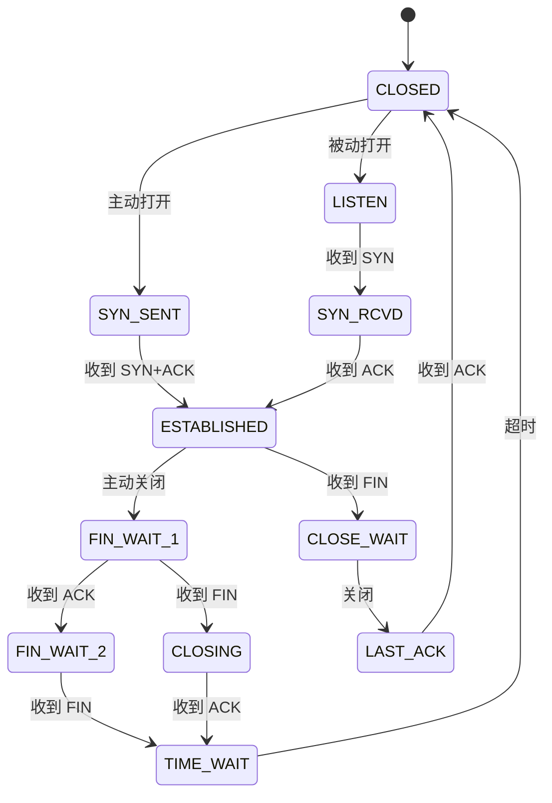

### 练习 3：`enum` + `switch` vs State 模式 — 对比实现

**难度**：⭐⭐⭐ 困难

用两种方式实现**同一个场景**（停车场闸机：空闲 → 车辆到达 → 已缴费 → 通过 → 空闲），并对比优劣。

**要求**：

**Part A — `enum` + `switch` 实现**：
- 使用 `enum GateState { Idle, VehicleArrived, Paid }` 
- 所有方法用 `switch` 分支
- 在代码中故意遗留一个 bug（例如添加新状态时漏改某个 `switch`）

**Part B — State 模式实现**：
- 使用 `IGateState` 接口 + `IdleState` / `VehicleArrivedState` / `PaidState`
- 演示新增 `MaintenanceState`（维护中，禁止所有操作）需要改动哪些代码
- 对比两种实现下新增状态需要的修改量

**Part C — 分析报告**（写在代码注释中）：
- 哪个实现更容易引入 bug？为什么？
- 哪个实现更容易测试？为什么？
- 哪个实现更符合开闭原则？
- 对于只有 2–3 个状态且行为差异很小的场景，你会选哪个？为什么？

---

## 3.5 参考答案

> [!tip]- 练习 1 参考答案：文档审批工作流
>   
> ```csharp
> using System;
> using System.Collections.Generic;
> 
> // ============================================
> // IDocumentState 接口
> // ============================================
> public interface IDocumentState
> {
>     void Submit(DocumentContext ctx);
>     void Approve(DocumentContext ctx, string comment);
>     void Reject(DocumentContext ctx, string reason);
>     void Publish(DocumentContext ctx);
>     string Name { get; }
> }
> 
> // ============================================
> // DocumentContext
> // ============================================
> public class DocumentContext
> {
>     private IDocumentState _state;
>     public string Title { get; }
>     public string Content { get; private set; }
>     public List<string> ApprovalComments { get; } = new();
>     public List<string> History { get; } = new();
> 
>     public DocumentContext(string title, string content)
>     {
>         Title = title;
>         Content = content;
>         _state = new DraftState();
>         History.Add($"{DateTime.Now:HH:mm:ss} — 文档创建（草稿）");
>     }
> 
>     public void SetState(IDocumentState state)
>     {
>         var oldName = _state.Name;
>         _state = state;
>         Console.WriteLine($"  [状态转移] {oldName} → {state.Name}");
>         History.Add($"{DateTime.Now:HH:mm:ss} — {oldName} → {state.Name}");
>     }
> 
>     public void Submit() => _state.Submit(this);
>     public void Approve(string comment) => _state.Approve(this, comment);
>     public void Reject(string reason) => _state.Reject(this, reason);
>     public void Publish() => _state.Publish(this);
> 
>     public void UpdateContent(string newContent) => Content = newContent;
> 
>     public void Display()
>     {
>         Console.WriteLine($"  文档: \"{Title}\"");
>         Console.WriteLine($"  状态: {_state.Name}");
>         Console.WriteLine($"  内容: {Content[..Math.Min(Content.Length, 60)]}...");
>         Console.WriteLine($"  审批意见: {(ApprovalComments.Count > 0 ? string.Join("; ", ApprovalComments) : "无")}");
>     }
> 
>     public void DisplayHistory()
>     {
>         Console.WriteLine("  状态变更历史:");
>         foreach (var entry in History)
>             Console.WriteLine($"    {entry}");
>     }
> }
> 
> // ============================================
> // DraftState — 草稿
> // ============================================
> public class DraftState : IDocumentState
> {
>     public string Name => "草稿";
> 
>     public void Submit(DocumentContext ctx)
>     {
>         Console.WriteLine("  已提交审核");
>         ctx.SetState(new ReviewState());
>     }
> 
>     public void Approve(DocumentContext ctx, string comment)
>         => Console.WriteLine("  草稿状态不能直接批准，请先提交审核");
> 
>     public void Reject(DocumentContext ctx, string reason)
>         => Console.WriteLine("  草稿状态不能拒绝，请先提交审核");
> 
>     public void Publish(DocumentContext ctx)
>         => Console.WriteLine("  草稿状态不能直接发布，请先提交审核");
> }
> 
> // ============================================
> // ReviewState — 审核中
> // ============================================
> public class ReviewState : IDocumentState
> {
>     public string Name => "审核中";
> 
>     public void Submit(DocumentContext ctx)
>         => Console.WriteLine("  文档已在审核中");
> 
>     public void Approve(DocumentContext ctx, string comment)
>     {
>         Console.WriteLine($"  审核通过: {comment}");
>         ctx.ApprovalComments.Add($"[批准] {comment}");
>         ctx.SetState(new ApprovedState());
>     }
> 
>     public void Reject(DocumentContext ctx, string reason)
>     {
>         Console.WriteLine($"  审核驳回: {reason}");
>         ctx.ApprovalComments.Add($"[驳回] {reason}");
>         ctx.SetState(new DraftState());
>     }
> 
>     public void Publish(DocumentContext ctx)
>         => Console.WriteLine("  审核中的文档不能直接发布，请先批准");
> }
> 
> // ============================================
> // ApprovedState — 已批准
> // ============================================
> public class ApprovedState : IDocumentState
> {
>     public string Name => "已批准";
> 
>     public void Submit(DocumentContext ctx)
>         => Console.WriteLine("  文档已批准，无需重复提交");
> 
>     public void Approve(DocumentContext ctx, string comment)
>         => Console.WriteLine("  文档已批准，无需重复批准");
> 
>     public void Reject(DocumentContext ctx, string reason)
>         => Console.WriteLine("  已批准的文档不能驳回，请先发布后创建新版本");
> 
>     public void Publish(DocumentContext ctx)
>     {
>         Console.WriteLine("  文档已发布！");
>         ctx.SetState(new PublishedState());
>     }
> }
> 
> // ============================================
> // PublishedState — 已发布（终态）
> // ============================================
> public class PublishedState : IDocumentState
> {
>     public string Name => "已发布";
> 
>     public void Submit(DocumentContext ctx)
>         => Console.WriteLine("  文档已发布，无法再次提交。请创建新版本。");
> 
>     public void Approve(DocumentContext ctx, string comment)
>         => Console.WriteLine("  文档已发布，无法再次批准。");
> 
>     public void Reject(DocumentContext ctx, string reason)
>         => Console.WriteLine("  文档已发布，无法驳回。");
> 
>     public void Publish(DocumentContext ctx)
>         => Console.WriteLine("  文档已发布，无需重复发布。");
> }
> 
> // ============================================
> // 验证：完整工作流 + 非法操作 + 状态变更历史
> // ============================================
> Console.WriteLine("=== 文档审批工作流 ===\n");
> 
> var doc = new DocumentContext("年度财务报告", "本年度营收增长 20%，利润率提升 5 个百分点...");
> doc.Display();
> 
> // 尝试非法操作：草稿直接发布
> Console.WriteLine("\n--- 尝试草稿直接发布 ---");
> doc.Publish(); // → 草稿状态不能直接发布
> 
> // 提交审核
> Console.WriteLine("\n--- 提交审核 ---");
> doc.Submit(); // Draft → Review
> doc.Display();
> 
> // 驳回
> Console.WriteLine("\n--- 审核驳回 ---");
> doc.Reject("缺少 Q3 数据对比"); // Review → Draft
> doc.Display();
> 
> // 修改后重新提交
> Console.WriteLine("\n--- 修改后重新提交 ---");
> doc.UpdateContent("本年度营收增长 20%（Q3 +12%），利润率提升 5 个百分点...");
> doc.Submit(); // Draft → Review
> 
> // 批准
> Console.WriteLine("\n--- 审核批准 ---");
> doc.Approve("数据完整，同意发布"); // Review → Approved
> doc.Display();
> 
> // 发布
> Console.WriteLine("\n--- 发布文档 ---");
> doc.Publish(); // Approved → Published
> doc.Display();
> 
> // 尝试终态操作
> Console.WriteLine("\n--- 尝试对已发布文档操作 ---");
> doc.Submit();
> doc.Approve("再次批准");
> 
> // 打印状态变更历史
> Console.WriteLine("\n=== 状态变更历史 ===");
> doc.DisplayHistory();
> 
> /* 预期输出:
> === 文档审批工作流 ===
> 
>   文档: "年度财务报告"
>   状态: 草稿
>   内容: 本年度营收增长 20%，利润率提升 5 个百分点......
> 
> --- 尝试草稿直接发布 ---
>   草稿状态不能直接发布，请先提交审核
> 
> --- 提交审核 ---
>   已提交审核
>   [状态转移] 草稿 → 审核中
>   文档: "年度财务报告"
>   状态: 审核中
> 
> --- 审核驳回 ---
>   审核驳回: 缺少 Q3 数据对比
>   [状态转移] 审核中 → 草稿
> 
> --- 修改后重新提交 ---
>   已提交审核
>   [状态转移] 草稿 → 审核中
> 
> --- 审核批准 ---
>   审核通过: 数据完整，同意发布
>   [状态转移] 审核中 → 已批准
> 
> --- 发布文档 ---
>   文档已发布！
>   [状态转移] 已批准 → 已发布
> 
> --- 尝试对已发布文档操作 ---
>   文档已发布，无法再次提交。请创建新版本。
>   文档已发布，无法再次批准。
> 
> === 状态变更历史 ===
>   状态变更历史:
>     15:30:01 — 文档创建（草稿）
>     15:30:02 — 草稿 → 审核中
>     15:30:03 — 审核中 → 草稿
>     15:30:04 — 草稿 → 审核中
>     15:30:05 — 审核中 → 已批准
>     15:30:06 — 已批准 → 已发布
> */
> ```
>
> **关键设计要点：**
> - `DraftState` 只有 `Submit()` 能成功——其他三个操作返回友好提示而非抛异常
> - `ReviewState` 可以 `Approve()` 或 `Reject()`——分别转移到 Approved 和 Draft
> - `PublishedState` 是终态——所有操作都返回提示
> - `DocumentContext.History` 记录完整的状态变更轨迹——审计友好
> - 每个状态类的非法操作都返回有意义的消息，不抛异常——符合"友好提示"要求

> [!tip]- 练习 2 参考答案：TCP 连接状态机
>   
> ```csharp
> using System;
> using System.Collections.Generic;
> 
> // ============================================
> // ITcpState 接口
> // ============================================
> public interface ITcpState
> {
>     void Open(TcpConnection ctx);          // 主动打开连接
>     void PassiveOpen(TcpConnection ctx);   // 被动打开（进入 LISTEN）
>     void Close(TcpConnection ctx);         // 主动关闭
>     void Send(TcpConnection ctx, string data);
>     void Receive(TcpConnection ctx);       // 接收数据
>     void OnSyn(TcpConnection ctx);         // 收到 SYN
>     void OnAck(TcpConnection ctx);         // 收到 ACK
>     void OnFin(TcpConnection ctx);         // 收到 FIN
>     void OnTimeout(TcpConnection ctx);     // 超时
>     string Name { get; }
> }
> 
> // ============================================
> // TcpConnection（Context）
> // ============================================
> public class TcpConnection
> {
>     private ITcpState _state;
>     public uint SequenceNumber { get; private set; }
>     public uint AcknowledgmentNumber { get; private set; }
>     public List<string> History { get; } = new();
> 
>     public TcpConnection()
>     {
>         _state = new ClosedState();
>         History.Add($"初始状态: {_state.Name}");
>     }
> 
>     public void SetState(ITcpState state)
>     {
>         Console.WriteLine($"  [状态转移] {_state.Name} → {state.Name}");
>         History.Add($"{_state.Name} → {state.Name}");
>         _state = state;
>     }
> 
>     public void IncrementSeqNum(uint delta = 1) { SequenceNumber += delta; }
>     public void SetAckNum(uint ack) { AcknowledgmentNumber = ack; }
> 
>     // 委托给当前状态
>     public void Open() => _state.Open(this);
>     public void PassiveOpen() => _state.PassiveOpen(this);
>     public void Close() => _state.Close(this);
>     public void Send(string data) => _state.Send(this, data);
>     public void Receive() => _state.Receive(this);
>     public void OnSyn() => _state.OnSyn(this);
>     public void OnAck() => _state.OnAck(this);
>     public void OnFin() => _state.OnFin(this);
>     public void OnTimeout() => _state.OnTimeout(this);
> 
>     public string CurrentState => _state.Name;
> 
>     public void Display()
>     {
>         Console.WriteLine($"  状态: {_state.Name} | Seq={SequenceNumber} | Ack={AcknowledgmentNumber}");
>     }
> 
>     public void DisplayHistory()
>     {
>         Console.WriteLine("  状态转移轨迹:");
>         foreach (var entry in History)
>             Console.WriteLine($"    {entry}");
>     }
> }
> 
> // ============================================
> // Concrete States
> // ============================================
> 
> // --- 辅助基类：默认非法操作 + 友好提示 ---
> public abstract class TcpStateBase : ITcpState
> {
>     public abstract string Name { get; }
> 
>     public virtual void Open(TcpConnection ctx)
>         => Console.WriteLine($"  {Name} 状态下无法主动打开连接");
> 
>     public virtual void PassiveOpen(TcpConnection ctx)
>         => Console.WriteLine($"  {Name} 状态下无法被动打开");
> 
>     public virtual void Close(TcpConnection ctx)
>         => Console.WriteLine($"  {Name} 状态下关闭操作无效");
> 
>     public virtual void Send(TcpConnection ctx, string data)
>         => Console.WriteLine($"  {Name} 状态下无法发送数据");
> 
>     public virtual void Receive(TcpConnection ctx)
>         => Console.WriteLine($"  {Name} 状态下无法接收数据");
> 
>     public virtual void OnSyn(TcpConnection ctx)
>         => Console.WriteLine($"  {Name} 状态下收到 SYN — 忽略");
> 
>     public virtual void OnAck(TcpConnection ctx)
>         => Console.WriteLine($"  {Name} 状态下收到 ACK — 忽略");
> 
>     public virtual void OnFin(TcpConnection ctx)
>         => Console.WriteLine($"  {Name} 状态下收到 FIN — 忽略");
> 
>     public virtual void OnTimeout(TcpConnection ctx)
>         => Console.WriteLine($"  {Name} 状态下超时 — 忽略");
> }
> 
> // --- CLOSED ---
> public class ClosedState : TcpStateBase
> {
>     public override string Name => "CLOSED";
> 
>     public override void Open(TcpConnection ctx)
>     {
>         Console.WriteLine("  主动打开连接 → 发送 SYN");
>         ctx.IncrementSeqNum();
>         ctx.SetState(new SynSentState());
>     }
> 
>     public override void PassiveOpen(TcpConnection ctx)
>     {
>         Console.WriteLine("  被动打开 → 进入 LISTEN");
>         ctx.SetState(new ListenState());
>     }
> }
> 
> // --- LISTEN ---
> public class ListenState : TcpStateBase
> {
>     public override string Name => "LISTEN";
> 
>     public override void Close(TcpConnection ctx)
>     {
>         Console.WriteLine("  停止监听 → CLOSED");
>         ctx.SetState(new ClosedState());
>     }
> 
>     public override void OnSyn(TcpConnection ctx)
>     {
>         Console.WriteLine("  收到 SYN → 发送 SYN+ACK → SYN_RCVD");
>         ctx.SetAckNum(ctx.SequenceNumber + 1);
>         ctx.SetState(new SynRcvdState());
>     }
> }
> 
> // --- SYN_SENT ---
> public class SynSentState : TcpStateBase
> {
>     public override string Name => "SYN_SENT";
> 
>     public override void Close(TcpConnection ctx)
>     {
>         Console.WriteLine("  连接建立中关闭 → CLOSED");
>         ctx.SetState(new ClosedState());
>     }
> 
>     public override void OnSyn(TcpConnection ctx)
>     {
>         Console.WriteLine("  收到 SYN+ACK → 发送 ACK → ESTABLISHED（同时打开）");
>         ctx.SetAckNum(ctx.SequenceNumber + 1);
>         ctx.SetState(new EstablishedState());
>     }
> 
>     public override void OnAck(TcpConnection ctx)
>     {
>         Console.WriteLine("  收到 SYN+ACK → 发送 ACK → ESTABLISHED（三次握手完成）");
>         ctx.IncrementSeqNum();
>         ctx.SetState(new EstablishedState());
>     }
> }
> 
> // --- SYN_RCVD ---
> public class SynRcvdState : TcpStateBase
> {
>     public override string Name => "SYN_RCVD";
> 
>     public override void Close(TcpConnection ctx)
>     {
>         Console.WriteLine("  握手期间关闭 → 发送 FIN → FIN_WAIT_1");
>         ctx.SetState(new FinWait1State());
>     }
> 
>     public override void OnAck(TcpConnection ctx)
>     {
>         Console.WriteLine("  收到 ACK → 三次握手完成 → ESTABLISHED");
>         ctx.SetState(new EstablishedState());
>     }
> }
> 
> // --- ESTABLISHED ---
> public class EstablishedState : TcpStateBase
> {
>     public override string Name => "ESTABLISHED";
> 
>     public override void Close(TcpConnection ctx)
>     {
>         Console.WriteLine("  主动关闭 → 发送 FIN → FIN_WAIT_1");
>         ctx.IncrementSeqNum();
>         ctx.SetState(new FinWait1State());
>     }
> 
>     public override void Send(TcpConnection ctx, string data)
>     {
>         Console.WriteLine($"  发送数据: \"{data}\"");
>         ctx.IncrementSeqNum((uint)data.Length);
>     }
> 
>     public override void Receive(TcpConnection ctx)
>     {
>         Console.WriteLine("  接收数据 → 发送 ACK");
>         ctx.SetAckNum(ctx.SequenceNumber + 1);
>     }
> 
>     public override void OnFin(TcpConnection ctx)
>     {
>         Console.WriteLine("  收到 FIN → 发送 ACK → CLOSE_WAIT");
>         ctx.SetAckNum(ctx.SequenceNumber + 1);
>         ctx.SetState(new CloseWaitState());
>     }
> }
> 
> // --- FIN_WAIT_1 ---
> public class FinWait1State : TcpStateBase
> {
>     public override string Name => "FIN_WAIT_1";
> 
>     public override void OnAck(TcpConnection ctx)
>     {
>         Console.WriteLine("  收到 ACK → FIN_WAIT_2");
>         ctx.SetState(new FinWait2State());
>     }
> 
>     public override void OnFin(TcpConnection ctx)
>     {
>         Console.WriteLine("  同时关闭 → 收到 FIN → 发送 ACK → CLOSING");
>         ctx.SetState(new ClosingState());
>     }
> }
> 
> // --- FIN_WAIT_2 ---
> public class FinWait2State : TcpStateBase
> {
>     public override string Name => "FIN_WAIT_2";
> 
>     public override void OnFin(TcpConnection ctx)
>     {
>         Console.WriteLine("  收到 FIN → 发送 ACK → TIME_WAIT");
>         ctx.SetState(new TimeWaitState());
>     }
> }
> 
> // --- CLOSING ---
> public class ClosingState : TcpStateBase
> {
>     public override string Name => "CLOSING";
> 
>     public override void OnAck(TcpConnection ctx)
>     {
>         Console.WriteLine("  收到 ACK → TIME_WAIT");
>         ctx.SetState(new TimeWaitState());
>     }
> }
> 
> // --- TIME_WAIT ---
> public class TimeWaitState : TcpStateBase
> {
>     public override string Name => "TIME_WAIT";
> 
>     public override void OnTimeout(TcpConnection ctx)
>     {
>         Console.WriteLine("  2MSL 超时 → CLOSED");
>         ctx.SetState(new ClosedState());
>     }
> }
> 
> // --- CLOSE_WAIT ---
> public class CloseWaitState : TcpStateBase
> {
>     public override string Name => "CLOSE_WAIT";
> 
>     public override void Close(TcpConnection ctx)
>     {
>         Console.WriteLine("  关闭连接 → 发送 FIN → LAST_ACK");
>         ctx.IncrementSeqNum();
>         ctx.SetState(new LastAckState());
>     }
> }
> 
> // --- LAST_ACK ---
> public class LastAckState : TcpStateBase
> {
>     public override string Name => "LAST_ACK";
> 
>     public override void OnAck(TcpConnection ctx)
>     {
>         Console.WriteLine("  收到 ACK → CLOSED");
>         ctx.SetState(new ClosedState());
>     }
> }
> 
> // ============================================
> // 验证：三次握手 → 数据传输 → 四次挥手
> // ============================================
> Console.WriteLine("=== TCP 连接状态机 ===\n");
> 
> // 服务端
> var server = new TcpConnection();
> Console.WriteLine("--- 服务端：被动打开 ---");
> server.PassiveOpen();                      // CLOSED → LISTEN
> server.Display();
> 
> Console.WriteLine("\n--- 服务端：收到 SYN ---");
> server.OnSyn();                            // LISTEN → SYN_RCVD
> server.Display();
> 
> Console.WriteLine("\n--- 服务端：收到 ACK（三次握手完成）---");
> server.OnAck();                            // SYN_RCVD → ESTABLISHED
> server.Display();
> 
> // 数据传输
> Console.WriteLine("\n--- 数据传输 ---");
> server.Send("HTTP/1.1 200 OK");
> server.Receive();
> server.Display();
> 
> // 客户端主动关闭
> Console.WriteLine("\n--- 收到客户端的 FIN ---");
> server.OnFin();                            // ESTABLISHED → CLOSE_WAIT
> server.Display();
> 
> Console.WriteLine("\n--- 服务端关闭连接 ---");
> server.Close();                            // CLOSE_WAIT → LAST_ACK
> server.Display();
> 
> Console.WriteLine("\n--- 收到 ACK ---");
> server.OnAck();                            // LAST_ACK → CLOSED
> server.Display();
> 
> // 非法操作测试
> Console.WriteLine("\n--- 处于 CLOSED 时各操作 ---");
> server.Send("data"); // 非法
> server.Close();       // 非法
> 
> // 打印状态转移轨迹
> Console.WriteLine("\n=== 状态转移轨迹 ===");
> server.DisplayHistory();
> ```
>
> **关键设计要点：**
> - `TcpStateBase` 基类为所有非法操作提供默认友好提示——子类只需重写合法的操作
> - 状态转移严格按照 RFC 793 简化版状态图：CLOSED→LISTEN→SYN_RCVD→ESTABLISHED→FIN_WAIT_1→FIN_WAIT_2→TIME_WAIT→CLOSED
> - 同时关闭路径：FIN_WAIT_1→(收到FIN)→CLOSING→TIME_WAIT→CLOSED
> - 被动关闭路径：ESTABLISHED→(收到FIN)→CLOSE_WAIT→LAST_ACK→CLOSED
> - 序列号/确认号在状态转移时递增——模拟真实 TCP 行为
> - 终态（CLOSED）的所有操作返回友好提示，不抛异常

> [!tip]- 练习 3 参考答案：`enum` + `switch` vs State 模式对比
>   
> **Part A — `enum` + `switch` 实现（含故意遗留的 bug）**
>   
> ```csharp
> // ============================================
> // Part A: enum + switch 实现 — 停车场闸机
> // ============================================
> public enum GateState { Idle, VehicleArrived, Paid }
> 
> public class GateControllerSwitch
> {
>     private GateState _state = GateState.Idle;
> 
>     public void VehicleArrives()
>     {
>         switch (_state)
>         {
>             case GateState.Idle:
>                 Console.WriteLine("车辆到达，请取票");
>                 _state = GateState.VehicleArrived;
>                 break;
>             case GateState.VehicleArrived:
>                 Console.WriteLine("已有车辆在等待");
>                 break;
>             case GateState.Paid:
>                 Console.WriteLine("前车已缴费，请先通过");
>                 break;
>             // BUG: 如果未来新增 MaintenanceState，此 switch 漏改 → 直接 fall through！
>         }
>     }
> 
>     public void Pay()
>     {
>         switch (_state)
>         {
>             case GateState.VehicleArrived:
>                 Console.WriteLine("缴费成功，请通行");
>                 _state = GateState.Paid;
>                 break;
>             case GateState.Idle:
>                 Console.WriteLine("没有车辆，无需缴费");
>                 break;
>             case GateState.Paid:
>                 Console.WriteLine("已缴费，请通行");
>                 break;
>             // BUG: 同上——新增状态时漏改
>         }
>     }
> 
>     public void Pass()
>     {
>         switch (_state)
>         {
>             case GateState.Paid:
>                 Console.WriteLine("栏杆抬起，车辆通过");
>                 _state = GateState.Idle;
>                 break;
>             case GateState.Idle:
>                 Console.WriteLine("没有车辆");
>                 break;
>             case GateState.VehicleArrived:
>                 Console.WriteLine("请先缴费");
>                 break;
>             // BUG: 同上
>         }
>     }
> }
> ```
> 
> **Part B — State 模式实现 + 新增 MaintenanceState**
>   
> ```csharp
> // ============================================
> // Part B: State 模式实现 — 停车场闸机
> // ============================================
> public interface IGateState
> {
>     void VehicleArrives(GateContext ctx);
>     void Pay(GateContext ctx);
>     void Pass(GateContext ctx);
>     string Name { get; }
> }
> 
> public class GateContext
> {
>     private IGateState _state;
>     public List<string> History { get; } = new();
> 
>     public GateContext()
>     {
>         _state = new GateIdleState();
>         History.Add($"初始: {_state.Name}");
>     }
> 
>     public void SetState(IGateState state)
>     {
>         Console.WriteLine($"  [{_state.Name} → {state.Name}]");
>         History.Add($"{_state.Name} → {state.Name}");
>         _state = state;
>     }
> 
>     public void VehicleArrives() => _state.VehicleArrives(this);
>     public void Pay() => _state.Pay(this);
>     public void Pass() => _state.Pass(this);
>     public string Current => _state.Name;
> 
>     public void Display() => Console.WriteLine($"  当前状态: {_state.Name}");
> }
> 
> // 具体状态类
> public class GateIdleState : IGateState
> {
>     public string Name => "空闲";
> 
>     public void VehicleArrives(GateContext ctx)
>     {
>         Console.WriteLine("车辆到达，请取票");
>         ctx.SetState(new GateVehicleArrivedState());
>     }
> 
>     public void Pay(GateContext ctx)
>         => Console.WriteLine("没有车辆，无需缴费");
> 
>     public void Pass(GateContext ctx)
>         => Console.WriteLine("没有车辆");
> }
> 
> public class GateVehicleArrivedState : IGateState
> {
>     public string Name => "车辆到达";
> 
>     public void VehicleArrives(GateContext ctx)
>         => Console.WriteLine("已有车辆在等待");
> 
>     public void Pay(GateContext ctx)
>     {
>         Console.WriteLine("缴费成功，请通行");
>         ctx.SetState(new GatePaidState());
>     }
> 
>     public void Pass(GateContext ctx)
>         => Console.WriteLine("请先缴费");
> }
> 
> public class GatePaidState : IGateState
> {
>     public string Name => "已缴费";
> 
>     public void VehicleArrives(GateContext ctx)
>         => Console.WriteLine("前车已缴费，请先通过");
> 
>     public void Pay(GateContext ctx)
>         => Console.WriteLine("已缴费，请通行");
> 
>     public void Pass(GateContext ctx)
>     {
>         Console.WriteLine("栏杆抬起，车辆通过");
>         ctx.SetState(new GateIdleState());
>     }
> }
> 
> // === 新增 MaintenanceState — 只需新增一个类！ ===
> public class MaintenanceState : IGateState
> {
>     public string Name => "维护中";
> 
>     public void VehicleArrives(GateContext ctx)
>         => Console.WriteLine("设备维护中，禁止进入");
> 
>     public void Pay(GateContext ctx)
>         => Console.WriteLine("设备维护中，无法缴费");
> 
>     public void Pass(GateContext ctx)
>         => Console.WriteLine("设备维护中，禁止通行");
> }
> 
> // ============================================
> // 验证 State 模式
> // ============================================
> Console.WriteLine("=== State 模式 — 停车场闸机 ===\n");
> var gate = new GateContext();
> 
> gate.VehicleArrives();  // 空闲 → 车辆到达
> gate.Pay();             // 车辆到达 → 已缴费
> gate.Pass();            // 已缴费 → 空闲
> 
> // 设置维护模式
> Console.WriteLine("\n--- 进入维护模式 ---");
> gate.SetState(new MaintenanceState());
> gate.VehicleArrives();  // → 设备维护中
> gate.Pay();             // → 设备维护中
> gate.Pass();            // → 设备维护中
> ```
> 
> **Part C — 分析报告**
> 
> ```csharp
> // ============================================
> // Part C: 分析报告（写在注释中）
> // ============================================
> ```
>
> **1. 哪个实现更容易引入 bug？为什么？**
>
> `enum` + `switch` 更容易引入 bug。因为新增状态（如 `MaintenanceState`）时需要修改**每一个** `switch` 分支——编译器不会警告你"漏了某个 switch"。如在 Part A 中演示的，三个 `switch` 都缺少 `MaintenanceState` 的 case，运行时要么 fall through 到 default（未定义行为），要么静默跳过（逻辑错误）。State 模式中，新增状态只需新建一个实现了 `IGateState` 的类——编译器强制你实现所有方法，**遗漏是不可能的**。
>
> **2. 哪个实现更容易测试？为什么？**
>
> State 模式更容易测试。每个 `ConcreteState` 是一个独立的类，可以**单独实例化并测试**：`new MaintenanceState().VehicleArrives(mockCtx)` 返回值/行为是可预测的。`enum` + `switch` 方案中，所有状态逻辑耦合在同一个 `GateControllerSwitch` 类中——要测试"MaintenanceState 下 Pay() 的行为"，你必须先构造 `GateControllerSwitch` 并设置其内部 `_state = Maintenance`，间接测试。单元测试的隔离性更差。
>
> **3. 哪个实现更符合开闭原则？**
>
> State 模式完全符合开闭原则——**对扩展开放（新增 ConcreteState 类），对修改关闭（Context 和已有状态类无需修改）**。`enum` + `switch` 方案违反了开闭原则——新增一个枚举值必须修改所有 switch 分支（修改已有代码）。即使有 `default` 分支，也只是把"未处理新状态"变成了隐式 fall-through，并未解决根本问题。
>
> **4. 对于只有 2–3 个状态且行为差异很小的场景，你会选哪个？为什么？**
>
> 选 `enum` + `switch`。原因：
> - **简单性胜出**：2–3 个状态的 switch 分支数 = 2–3 个，每个方法 5–10 行，一眼看完
> - **代码量**：State 模式需要 1 个接口 + N 个类 + N×3 个方法模板 → 约 50+ 行。`enum` + `switch` 只需 1 个枚举 + 1 个类 → 约 20 行
> - **认知负荷**：2–3 个状态的 switch 分支不会产生"改一处漏一处"的问题——分支数太少，很难漏
> - **临界点**：当状态 ≥ 3 且**行为差异显著**时，立即切换到 State 模式。三个带 `switch(state)` 的方法是临界信号（见教程正文的警告）

> [!note] 答案使用方式
> 先独立完成练习，再展开查看参考答案。参考答案不是唯一解——如果你的实现通过了测试或达到了题目要求，就是正确的。

## 4. 扩展阅读

### 相关模式

- [[16-behavioral-intro|行为型模式总览]] — 理解行为型模式的整体分类，State 属于"状态与行为"子类
- [[24-strategy|策略模式]] — State 与 Strategy 的姐妹模式：谁决定切换是核心区别
- [[17-chain-of-responsibility|责任链模式]] — 有时可以和 State 结合：状态之间的转移形成隐式链
- [[21-memento|备忘录模式]] — 保存状态快照以支持恢复；State 管理当前状态，Memento 管理历史状态
- [[25-template-method|模板方法模式]] — State 接口的方法可以部分用 Template Method 实现通用逻辑

### C# 实战资源

- [Stateless — GitHub](https://github.com/dotnet-state-machine/stateless) — C# 最流行的轻量级状态机库，用 fluent API 定义状态转移
- [Microsoft — Workflow Foundation (WF)](https://learn.microsoft.com/dotnet/framework/windows-workflow-foundation/) — .NET 内置的工作流/状态机引擎
- [Refactoring.Guru — State Pattern](https://refactoring.guru/design-patterns/state) — 状态模式的多语言图解与实现
- [GoF 原书 — Design Patterns](https://en.wikipedia.org/wiki/Design_Patterns) — Gamma, Helm, Johnson, Vlissides (1994)，第 5 章 State 模式
- [C# 9 Records 文档](https://learn.microsoft.com/dotnet/csharp/language-reference/builtin-types/record) — 不可变状态机的核心语言特性
- [Nerding.I/O — State Machines in C#](https://www.youtube.com/watch?v=Itm8gI1Zm3o) — Scott Hanselman 关于在 C# 中实现状态机的演讲
- [Stateless Docs — Hierarchical States](https://github.com/dotnet-state-machine/stateless#hierarchical-states) — 子状态、初始转移、入口/出口动作的官方文档
- [Stateless Docs — Guard Clauses & Dynamic Transitions](https://github.com/dotnet-state-machine/stateless#guard-clauses) — `PermitIf` / `PermitDynamic` / 参数化触发器

### 状态机理论（FSM / HSM / Statecharts）

- [Miro Samek — Practical UML Statebooks](https://www.state-machine.com/doc/Heinzmann04.pdf) — *Yet Another Hierarchical State Machine*，HSM 实现的经典论文
- [QP Framework 官网](https://www.state-machine.com/) — Samek 的开源 HSM 框架，含 [免费在线书](https://www.state-machine.com/psicc2) 《Practical UML Statecharts in C/C++》第 2 版
- [UPenn CSE 480 — Hierarchical State Machines](https://www.cis.upenn.edu/~lee/06cse480/lec-HSM.pdf) — Samek 的 HSM 入门讲义（基于行为继承）
- [David Harel — Statecharts 原始论文 (1987)](https://www.sciencedirect.com/science/article/pii/0167642387900359) — *Statecharts: A Visual Formalism for Complex Systems*，HSM 的奠基性论文
- [Wikipedia — UML state machine](https://en.wikipedia.org/wiki/UML_state_machine) — UML 标准化后的 HSM 形式化定义
- [qf4net — QP 的 .NET 移植](https://github.com/zdomokos/qf4net) — C# 版 HSM 框架（`QHsm` / `QFsm` / `QActive`）
- [transitions (Python)](https://github.com/pytransitions/transitions) — Python 生态最流行的状态机库，含 `HierarchicalMachine`

### 行为树（Behavior Tree）

- [Behavior Trees vs State Machines — Polymath Robotics](https://www.polymathrobotics.com/blog/state-machines-vs-behavior-trees) — 机器人工业界从 FSM 迁移到 BT 的实战反思
- [Iovino et al. (2024) — Comparison between BTs and FSMs](https://arxiv.org/abs/2405.16137) — 系统对比论文，含模块性/反应性/可读性指标
- [BehaviorTree.CPP — GitHub](https://github.com/BehaviorTree/BehaviorTree.CPP) — ROS 2 生态最流行的 C++ 行为树库，配 GUI 编辑器 Groot2
- [py_trees — Docs](https://py-trees.readthedocs.io/) — Python 行为树库，ROS 官方推荐
- [Behavior Designer (Unity)](https://opsive.com/support/documentation/behavior-designer-pro/) — Unity 资产商店最流行的 BT 实现
- [Colledanchise & Ögren — Behavior Trees in Robotics and AI](https://arxiv.org/abs/1709.00084) — BT 在机器人领域的系统性介绍（开放访问 PDF）


---

## 5. 常见陷阱

### 陷阱 1：状态爆炸（State Explosion）

**问题**：为每个微小的状态差异创建一个状态类，导致类数量失控。

```csharp
// ❌ 错误：过度细化状态
// 登录页面有 10 个不同状态类：
// LoggedOutState, LoggingInState, LoginFailedWrongPasswordState,
// LoginFailedAccountLockedState, LoginFailedTooManyAttemptsState,
// LoginSucceededState, TwoFactorState, TwoFactorFailedState... 
// 每个类只有一个方法有实质行为，其余都是空操作

// ✅ 正确：用状态 + 子状态数据驱动
public class LoginFailedState : ILoginState
{
    public LoginFailureReason Reason { get; init; } // ← 数据区分，而不是类区分

    public void HandleInput(LoginContext ctx, string input)
    {
        switch (Reason)
        {
            case LoginFailureReason.WrongPassword:
                Console.WriteLine($"密码错误，还可尝试 {_attemptsLeft} 次");
                break;
            case LoginFailureReason.AccountLocked:
                Console.WriteLine("账户已锁定，请联系客服");
                break;
        }
    }
}
```

> [!tip] 状态爆炸的边界线
> 如果一个状态类的**所有公共方法都是空操作**（像 `SoldOutState` 中大半方法只打印提示），这是正常的——终态节点天然如此。但如果一个类**只有一个方法有实质行为，其余全是 `throw new InvalidOperationException()`**，你就该审视是否过度拆分了。

### 陷阱 2：状态转移逻辑分散

**问题**：状态转移的"何时"和"到哪"散落在各个状态类中，修改流程时需要全局搜索。

```csharp
// ❌ 错误：转移逻辑硬编码在各状态类内部，难以看到全局流转图
public class PaidState : IOrderState
{
    public void Ship(OrderContext ctx)
    {
        // 这里的"下一步是 ShippedState"散落在代码深处
        ctx.SetState(new ShippedState());
    }
}

// ✅ 正确：集中定义转移表，状态类查询转移表
public enum OrderState { Created, Paid, Shipped, Delivered, Cancelled }
public enum OrderTrigger { Pay, Ship, Deliver, Cancel }

public static class OrderTransitionTable
{
    private static readonly Dictionary<(OrderState, OrderTrigger), OrderState> _transitions = new()
    {
        [(OrderState.Created, OrderTrigger.Pay)] = OrderState.Paid,
        [(OrderState.Created, OrderTrigger.Cancel)] = OrderState.Cancelled,
        [(OrderState.Paid, OrderTrigger.Ship)] = OrderState.Shipped,
        [(OrderState.Paid, OrderTrigger.Cancel)] = OrderState.Cancelled,
        [(OrderState.Shipped, OrderTrigger.Deliver)] = OrderState.Delivered,
    };

    public static bool TryTransition(OrderState current, OrderTrigger trigger, out OrderState next)
        => _transitions.TryGetValue((current, trigger), out next);
}
```

**折中方案**：对于简单状态机（≤5 个状态），状态类直接硬编码转移是可接受的——代码自文档化且易于调试。对于复杂状态机（≥6 个状态或频繁变化），使用转移表。

### 陷阱 3：忘记设置下一个状态

**问题**：状态类的方法执行了业务逻辑，但忘记调用 `ctx.SetState()`，导致状态机卡住。

```csharp
// ❌ 错误：忘记 SetState，状态机永远停在当前状态
public class PaidState : IOrderState
{
    public void Ship(OrderContext ctx)
    {
        Console.WriteLine("订单已发货");
        // BUG: 忘记 ctx.SetState(new ShippedState());
    }
}

// ✅ 正确：封装转移，减少遗忘风险
public abstract class OrderStateBase : IOrderState
{
    public abstract string Name { get; }

    // 子类调用 Transition 而非直接 SetState
    protected void Transition(OrderContext ctx, IOrderState next)
    {
        // 可以在这里加日志、验证、事件发布
        ctx.SetState(next);
    }
}

public class PaidState : OrderStateBase
{
    public override string Name => "已支付";

    public void Ship(OrderContext ctx)
    {
        Console.WriteLine("订单已发货");
        Transition(ctx, new ShippedState()); // ← 必须显式调用，编译器无法强制
    }
}
```

> [!warning] C# 类型系统不能强制状态转移
> 编译器无法检查"你是否在每个分支都设了下一个状态"。缓解方法：
> - 所有状态方法返回 `IOrderState` 而非 `void`，由 Context 负责 `SetState(returned)`
> - 使用不可变 `record` 上下文（如 2.3），每次操作**必须**返回新状态才有 Semantic 意义

### 陷阱 4：Context 持有过多状态信息

**问题**：把所有业务数据都塞进 Context，导致 Context 变成"上帝对象"。

```csharp
// ❌ 错误：Context 承载了所有业务逻辑需要的字段
public class OrderContext
{
    public string CustomerName { get; set; }
    public string CustomerEmail { get; set; }
    public Address ShippingAddress { get; set; }
    public PaymentInfo Payment { get; set; }
    public IReadOnlyList<OrderItem> Items { get; set; }
    public INotificationService Notifier { get; set; }
    public IShippingService Shipper { get; set; }
    public IPaymentGateway Gateway { get; set; }
    // ... 20+ 字段
}

// ✅ 正确：Context 只持有状态机核心数据，业务数据由外部传入
public class LeanOrderContext
{
    private IOrderState _state = new CreatedState();
    public string OrderId { get; }
    public decimal Amount { get; }              // 状态转移需要的数据
    public List<string> History { get; } = new(); // 审计需要的数据

    // 业务数据不存这里，通过方法参数传入
    public void Pay(IPaymentGateway gateway) => _state.Pay(this, gateway);
    public void Ship(IShippingService shipper) => _state.Ship(this, shipper);
}
```

> [!tip] Context 的职责边界
> Context 只应该持有**状态机自身运转所需的数据**：当前状态引用、状态转移历史、转移条件所用到的核心字段。支付网关、物流服务、通知系统是**依赖**，不是状态数据——通过方法参数或接口注入传入，不要让 Context 持有它们的引用。
