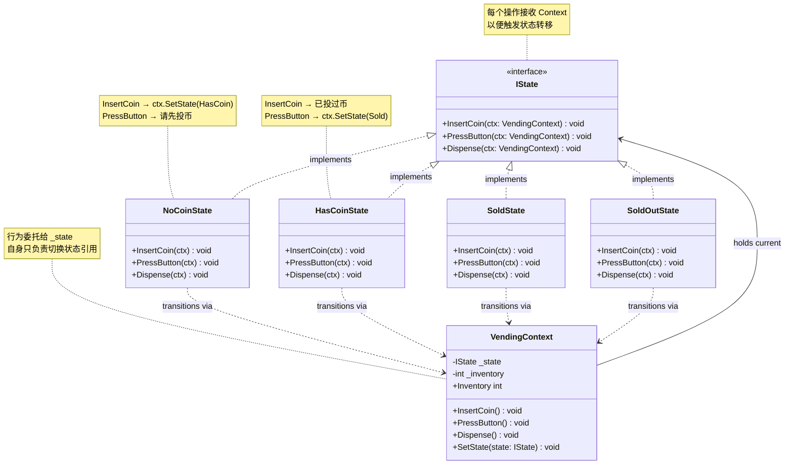
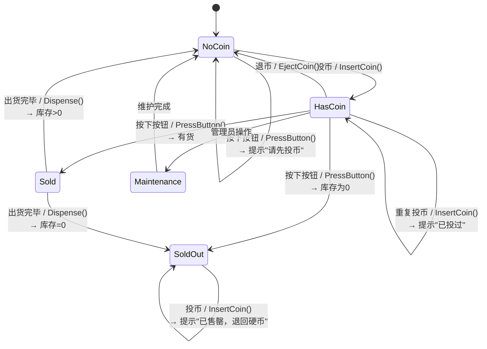
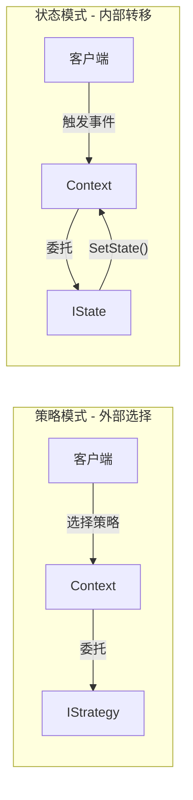
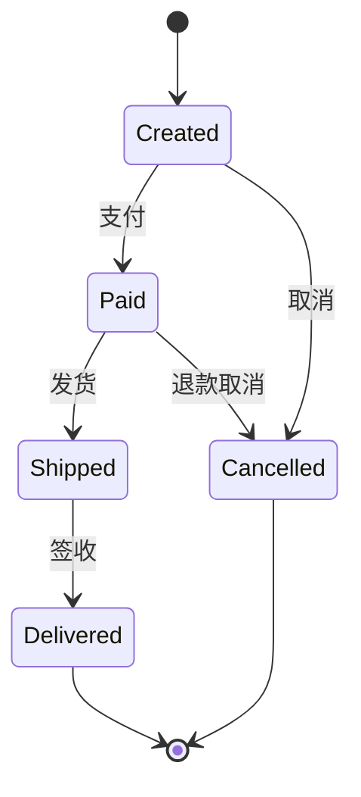
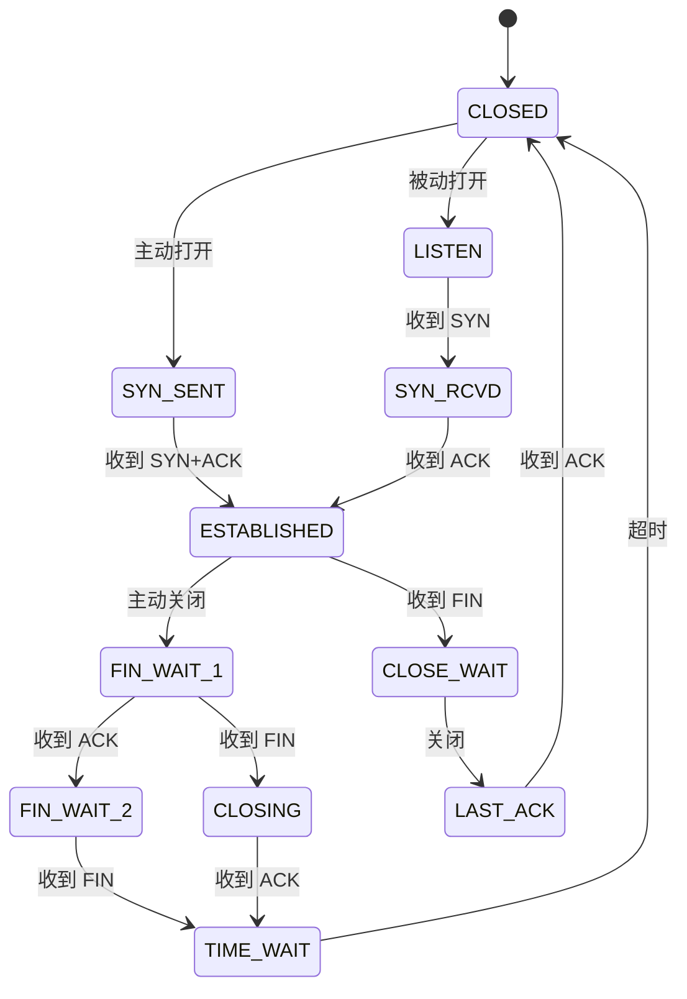

# 状态模式 (State Pattern)

> 所属计划: [[design-patterns-csharp|设计模式 (C#)]]
> 预计耗时: 60 分钟
> 前置知识: [[16-behavioral-intro|行为型模式总览]]、C# 接口与多态、`enum` 与 `switch` 的局限性

---

## 1. 概念讲解

### 状态模式解决什么问题？

考虑一个自动售货机。它的行为取决于当前状态：

- **无币状态**：投入硬币 → 进入有币状态；按下按钮 → 没反应
- **有币状态**：投入硬币 → 弹出多余硬币；按下按钮 → 出货进入售罄检查
- **售罄状态**：投入硬币 → 弹出退回；按下按钮 → 没货提示

用 `enum` + `switch` 实现时，每个操作都需要一个巨大的分支结构：

```csharp
// ❌ 反例：enum + switch — 每个方法都是一个庞大的分支
public enum VendingState { NoCoin, HasCoin, Sold, SoldOut }

public class VendingMachine
{
    private VendingState _state = VendingState.NoCoin;

    public void InsertCoin()
    {
        switch (_state)
        {
            case VendingState.NoCoin:
                Console.WriteLine("硬币已接收");
                _state = VendingState.HasCoin;
                break;
            case VendingState.HasCoin:
                Console.WriteLine("已投过币，请直接选择商品");
                break;
            case VendingState.Sold:
                Console.WriteLine("请稍等，正在出货...");
                break;
            case VendingState.SoldOut:
                Console.WriteLine("已售罄，退回硬币");
                break;
        }
    }

    public void PressButton()
    {
        switch (_state)
        {
            case VendingState.NoCoin:
                Console.WriteLine("请先投币");
                break;
            // ... 又是四路分支
        }
    }
    // 每新增一个状态，所有 switch 都要加一个 case — 违反开闭原则
}
```

添加新状态（如"维护模式"）时，你必须在**每一个** `switch` 语句中添加新分支。类越来越大，改一处漏一处是常态。

**状态模式的核心思想**：将每个状态封装为独立类，让上下文对象把行为委托给当前状态对象。状态转移由状态类自己决定——上下文只负责切换引用。

```
┌────────────────────────────────────────────────────────────────┐
│  enum + switch                                                 │
│  InsertCoin ─→ switch(state) { case NoCoin:... case HasCoin }  │
│  PressButton → switch(state) { case NoCoin:... case HasCoin }  │
│  Dispense  ──→ switch(state) { case NoCoin:... case HasCoin }  │
│  问题：状态逻辑分散在多个 switch 中；新增状态需要改所有方法        │
└────────────────────────────────────────────────────────────────┘
                              ↓ 重构
┌────────────────────────────────────────────────────────────────┐
│  State Pattern                                                 │
│  Context ─→ IState                                              │
│                ├── NoCoinState  (InsertCoin → 切到 HasCoin)      │
│                ├── HasCoinState (PressButton → 切到 Sold)        │
│                └── SoldState    (Dispense → 切到 NoCoin)         │
│  每个状态是一个类，状态转移发生在状态类内部，上下文只管切换引用     │
└────────────────────────────────────────────────────────────────┘
```

### 状态模式 GoF 结构



**关键角色：**

| 角色 | 职责 |
|------|------|
| `IState` | 声明所有状态下的行为接口；每个方法接收 `Context` 参数以触发状态转移 |
| `ConcreteState` | 实现特定状态下的行为；在方法内部决定何时切换到哪个状态 |
| `Context` | 持有当前状态引用；将客户端请求委托给当前状态对象；提供 `SetState()` 供状态类调用 |

### 状态转移图



> [!tip] 状态模式的核心洞察
> **"对象看起来换了类"** — 同一个 `VendingContext` 实例，同一个 `InsertCoin()` 调用，但在不同状态下执行的是不同类的方法。这就是多态替代分支的本质：将变化隔离在状态类内部，上下文类保持简单。

### State 模式 vs `enum` + `switch`

| 维度 | State 模式 | `enum` + `switch` |
|------|-----------|-------------------|
| **状态逻辑位置** | 分散在各个 `ConcreteState` 类中，每个类自包含 | 集中在每个方法的 `switch` 分支中 |
| **新增状态** | 新增一个 `ConcreteState` 类，实现接口即可（开闭原则 ✓） | 修改每一个 `switch` 分支，添加新 `case`（开闭原则 ✗） |
| **状态转移** | 由状态类显式调用 `ctx.SetState(nextState)` | 直接在 `case` 里改 `_state` 字段 |
| **行为与状态耦合** | 低 — 每个状态类只关心自己的行为 | 高 — 所有状态的行为混在一起 |
| **代码量** | 类多（每个状态一个类），但每个类简单 | 文件少，但方法体膨胀 |
| **适用场景** | 状态 ≥ 3 且行为差异大、状态经常增减 | 状态 ≤ 2 或行为差异极小 |
| **C# 惯用** | 接口 + 多态 | `enum` + `switch` 表达式 |

> [!warning] 判断标准
> 如果你在同一个项目里写了第 3 个带 `switch(state)` 的方法 → 立刻重构为状态模式。两个还 OK（如 Toggle 的 On/Off），三个是临界点。

### State vs Strategy — 相似但意图不同

| 维度 | State 模式 | [[24-strategy|策略模式]] |
|------|-----------|------|
| **谁决定切换** | Context 内部 — 状态对象自己决定下一个状态 | Context 外部 — 客户端选择策略 |
| **Context 感知** | Context 知道自己有状态，每个操作都委托给当前状态 | Context 持有策略但不关心有几个策略 |
| **切换频率** | 频繁 — 每次操作都可能触发状态转移 | 低频 — 通常在 Context 初始化时设置 |
| **典型操作** | `InsertCoin()` / `PressButton()` — 这些操作的结果随状态变 | `Calculate()` / `Execute()` — 算法替换 |
| **类比** | 自动售货机 — 同一个按钮在不同状态下的结果完全不同 | 导航 App — 同一起点终点，换算法（最快/最短/躲避拥堵） |
| **C# 惯用** | 状态接口 + `SetState()` | 策略接口 + 构造函数注入 |



---

## 2. 代码示例

### 2.1 自动售货机：HasCoin / NoCoin / Sold / SoldOut

**场景**：经典自动售货机 — 投币、选择商品、出货的完整状态流转。

```csharp
// ============================================
// 1. IState 接口 — 所有状态行为的契约
// ============================================
public interface IVendingState
{
    void InsertCoin(VendingContext ctx);
    void PressButton(VendingContext ctx);
    void Dispense(VendingContext ctx);
    string Name { get; }
}

// ============================================
// 2. Context — 售货机上下文
// ============================================
public class VendingContext
{
    private IVendingState _state;
    public int Inventory { get; private set; }
    public decimal Balance { get; private set; }

    public VendingContext(int initialInventory = 10)
    {
        Inventory = initialInventory;
        _state = initialInventory > 0
            ? new NoCoinState()
            : new SoldOutState();
    }

    public void SetState(IVendingState state)
    {
        Console.WriteLine($"  [状态转移] {_state.Name} → {state.Name}");
        _state = state;
    }

    public void InsertCoin()
    {
        Balance += 1.0m;
        _state.InsertCoin(this);
    }

    public void PressButton()
    {
        _state.PressButton(this);
    }

    public void Dispense()
    {
        _state.Dispense(this);
    }

    public void DecrementInventory()
    {
        Inventory--;
    }
}
```

```csharp
// ============================================
// 3. Concrete States
// ============================================

public class NoCoinState : IVendingState
{
    public string Name => "等待投币";

    public void InsertCoin(VendingContext ctx)
    {
        Console.WriteLine("  硬币已接收，请选择商品");
        ctx.SetState(new HasCoinState());
    }

    public void PressButton(VendingContext ctx)
    {
        Console.WriteLine("  请先投币");
    }

    public void Dispense(VendingContext ctx)
    {
        Console.WriteLine("  请先投币再选择商品");
    }
}

public class HasCoinState : IVendingState
{
    public string Name => "已投币";

    public void InsertCoin(VendingContext ctx)
    {
        Console.WriteLine("  已投过币，请直接选择商品（多余的硬币请按退币键）");
    }

    public void PressButton(VendingContext ctx)
    {
        if (ctx.Inventory > 0)
        {
            Console.WriteLine("  商品已选择，正在出货...");
            ctx.SetState(new SoldState());
            ctx.Dispense(); // 自动触发出货
        }
        else
        {
            Console.WriteLine("  抱歉，商品已售罄");
            ctx.SetState(new SoldOutState());
        }
    }

    public void Dispense(VendingContext ctx)
    {
        Console.WriteLine("  请先按下选择按钮");
    }
}

public class SoldState : IVendingState
{
    public string Name => "出货中";

    public void InsertCoin(VendingContext ctx)
    {
        Console.WriteLine("  请稍等，正在出货中...");
    }

    public void PressButton(VendingContext ctx)
    {
        Console.WriteLine("  正在出货中，请勿重复按下按钮");
    }

    public void Dispense(VendingContext ctx)
    {
        ctx.DecrementInventory();
        Console.WriteLine("  🎉 商品已掉落，请取走");
        ctx.Balance = 0;

        if (ctx.Inventory > 0)
            ctx.SetState(new NoCoinState());
        else
            ctx.SetState(new SoldOutState());
    }
}

public class SoldOutState : IVendingState
{
    public string Name => "已售罄";

    public void InsertCoin(VendingContext ctx)
    {
        Console.WriteLine("  已售罄，退回硬币");
        ctx.Balance = 0;
    }

    public void PressButton(VendingContext ctx)
    {
        Console.WriteLine("  已售罄，无法选择商品");
    }

    public void Dispense(VendingContext ctx)
    {
        Console.WriteLine("  无商品可出货");
    }
}
```

```csharp
// ============================================
// 4. 使用演示
// ============================================
Console.WriteLine("=== 自动售货机状态模式演示 ===\n");

var machine = new VendingContext(initialInventory: 2);

Console.WriteLine("【用户 1】投币 → 选择 → 取货");
machine.InsertCoin();
machine.PressButton();

Console.WriteLine("\n【用户 2】直接按按钮（忘投币）");
machine.PressButton();

Console.WriteLine("\n【用户 3】投币 → 选择 → 取货（最后一件）");
machine.InsertCoin();
machine.PressButton();

Console.WriteLine("\n【用户 4】投币（此时已售罄）");
machine.InsertCoin();

Console.WriteLine($"\n最终库存: {machine.Inventory}, 余额: {machine.Balance:C}");

/* 输出:
=== 自动售货机状态模式演示 ===

【用户 1】投币 → 选择 → 取货
  [状态转移] 等待投币 → 已投币
  硬币已接收，请选择商品
  [状态转移] 已投币 → 出货中
  商品已选择，正在出货...
  🎉 商品已掉落，请取走
  [状态转移] 出货中 → 等待投币

【用户 2】直接按按钮（忘投币）
  请先投币

【用户 3】投币 → 选择 → 取货（最后一件）
  [状态转移] 等待投币 → 已投币
  硬币已接收，请选择商品
  [状态转移] 已投币 → 出货中
  商品已选择，正在出货...
  🎉 商品已掉落，请取走
  [状态转移] 出货中 → 已售罄

【用户 4】投币（此时已售罄）
  已售罄，退回硬币

最终库存: 0, 余额: ¥0.00
*/
```

> [!tip] 状态自行触发后续操作
> 注意 `HasCoinState.PressButton()` 在设置了 `SoldState` 后立即调用了 `ctx.Dispense()`。状态模式允许状态类根据业务逻辑**自动衔接**下一步——不需要客户端知道"按了按钮之后要取货"这个时序。

---

### 2.2 订单状态机：Created → Paid → Shipped → Delivered / Cancelled

**场景**：电商订单的完整生命周期。部分状态有分支（Created 可支付或取消；Shipped 必须签收才能完成）。



```csharp
// ============================================
// IOrderState 接口
// ============================================
public interface IOrderState
{
    void Pay(OrderContext ctx);
    void Ship(OrderContext ctx);
    void Deliver(OrderContext ctx);
    void Cancel(OrderContext ctx);
    string Name { get; }
}

// ============================================
// OrderContext
// ============================================
public class OrderContext
{
    private IOrderState _state = new CreatedState();
    public string OrderId { get; }
    public decimal Amount { get; }
    public DateTime CreatedAt { get; }
    public List<string> History { get; } = new();

    public OrderContext(string orderId, decimal amount)
    {
        OrderId = orderId;
        Amount = amount;
        CreatedAt = DateTime.Now;
        History.Add($"{DateTime.Now:HH:mm:ss} — 订单创建");
    }

    public void SetState(IOrderState state)
    {
        History.Add($"{DateTime.Now:HH:mm:ss} — {_state.Name} → {state.Name}");
        _state = state;
    }

    public void Pay() => _state.Pay(this);
    public void Ship() => _state.Ship(this);
    public void Deliver() => _state.Deliver(this);
    public void Cancel() => _state.Cancel(this);

    public string CurrentState => _state.Name;
}
```

```csharp
// ============================================
// Concrete Order States
// ============================================

public class CreatedState : IOrderState
{
    public string Name => "已创建";

    public void Pay(OrderContext ctx)
    {
        Console.WriteLine($"订单 {ctx.OrderId}：支付 ¥{ctx.Amount:F2} 成功");
        ctx.SetState(new PaidState());
    }

    public void Ship(OrderContext ctx)
        => Console.WriteLine("订单尚未支付，无法发货");

    public void Deliver(OrderContext ctx)
        => Console.WriteLine("订单尚未支付");

    public void Cancel(OrderContext ctx)
    {
        Console.WriteLine($"订单 {ctx.OrderId}：已取消");
        ctx.SetState(new CancelledState());
    }
}

public class PaidState : IOrderState
{
    public string Name => "已支付";

    public void Pay(OrderContext ctx)
        => Console.WriteLine("订单已支付，无需重复支付");

    public void Ship(OrderContext ctx)
    {
        Console.WriteLine($"订单 {ctx.OrderId}：已发货");
        ctx.SetState(new ShippedState());
    }

    public void Deliver(OrderContext ctx)
        => Console.WriteLine("订单尚未发货，无法签收");

    public void Cancel(OrderContext ctx)
    {
        Console.WriteLine($"订单 {ctx.OrderId}：已退款 ¥{ctx.Amount:F2}，订单取消");
        ctx.SetState(new CancelledState());
    }
}

public class ShippedState : IOrderState
{
    public string Name => "运输中";

    public void Pay(OrderContext ctx)
        => Console.WriteLine("订单已在运输中");

    public void Ship(OrderContext ctx)
        => Console.WriteLine("订单已发货，无需重复操作");

    public void Deliver(OrderContext ctx)
    {
        Console.WriteLine($"订单 {ctx.OrderId}：已签收，交易完成 ✅");
        ctx.SetState(new DeliveredState());
    }

    public void Cancel(OrderContext ctx)
        => Console.WriteLine("运输中的订单无法直接取消，请先拒收后申请退款");
}

public class DeliveredState : IOrderState
{
    public string Name => "已交付";

    public void Pay(OrderContext ctx) => Console.WriteLine("订单已完成");
    public void Ship(OrderContext ctx) => Console.WriteLine("订单已完成");
    public void Deliver(OrderContext ctx) => Console.WriteLine("订单已完成");
    public void Cancel(OrderContext ctx) => Console.WriteLine("已完成的订单无法取消");
}

public class CancelledState : IOrderState
{
    public string Name => "已取消";

    public void Pay(OrderContext ctx) => Console.WriteLine("已取消的订单无法支付");
    public void Ship(OrderContext ctx) => Console.WriteLine("已取消的订单无法发货");
    public void Deliver(OrderContext ctx) => Console.WriteLine("已取消的订单无法签收");
    public void Cancel(OrderContext ctx) => Console.WriteLine("订单已取消");
}
```

```csharp
// ============================================
// 使用演示
// ============================================
Console.WriteLine("=== 订单状态机演示 ===\n");

var order = new OrderContext("ORD-2024001", 299.99m);

Console.WriteLine($"当前状态: {order.CurrentState}\n");

Console.WriteLine("→ 支付");
order.Pay();

Console.WriteLine("\n→ 发货");
order.Ship();

Console.WriteLine("\n→ 签收");
order.Deliver();

Console.WriteLine("\n→ 尝试取消（已完成订单）");
order.Cancel();

Console.WriteLine($"\n最终状态: {order.CurrentState}");
Console.WriteLine("\n状态变更历史:");
foreach (var entry in order.History)
    Console.WriteLine($"  {entry}");

/* 输出:
=== 订单状态机演示 ===

当前状态: 已创建

→ 支付
订单 ORD-2024001：支付 ¥299.99 成功

→ 发货
订单 ORD-2024001：已发货

→ 签收
订单 ORD-2024001：已签收，交易完成 ✅

→ 尝试取消（已完成订单）
已完成的订单无法取消

最终状态: 已交付

状态变更历史:
  15:30:01 — 订单创建
  15:30:01 — 已创建 → 已支付
  15:30:01 — 已支付 → 运输中
  15:30:01 — 运输中 → 已交付
*/
```

```csharp
// ============================================
// 另开一个订单：中途取消
// ============================================
Console.WriteLine("\n=== 取消订单演示 ===\n");

var order2 = new OrderContext("ORD-2024002", 59.00m);
Console.WriteLine($"当前状态: {order2.CurrentState}\n");

Console.WriteLine("→ 支付");
order2.Pay();

Console.WriteLine("\n→ 取消（退款）");
order2.Cancel();

Console.WriteLine("\n→ 尝试发货（状态已是已取消）");
order2.Ship();

Console.WriteLine($"\n最终状态: {order2.CurrentState}");
foreach (var entry in order2.History)
    Console.WriteLine($"  {entry}");

/* 输出:
=== 取消订单演示 ===

当前状态: 已创建

→ 支付
订单 ORD-2024002：支付 ¥59.00 成功

→ 取消（退款）
订单 ORD-2024002：已退款 ¥59.00，订单取消

→ 尝试发货（状态已是已取消）
已取消的订单无法发货

最终状态: 已取消
状态变更历史:
  15:30:01 — 订单创建
  15:30:01 — 已创建 → 已支付
  15:30:01 — 已支付 → 已取消
*/
```

---

### 2.3 C# 进阶：`record` 类型实现不可变状态转移

**场景**：在函数式风格中，状态不原地修改，而是每次返回一个新的上下文副本。`record` 的 `with` 表达式让这变得自然。

```csharp
// ============================================
// 不可变状态 — 用 record 表示
// ============================================
public abstract record ConnectionState
{
    public abstract ConnectionState Connect();
    public abstract ConnectionState Disconnect();
    public abstract ConnectionState SendData(string data);
    public abstract string Name { get; }
}

public record ClosedState : ConnectionState
{
    public override string Name => "CLOSED";

    public override ConnectionState Connect()
    {
        Console.WriteLine("  建立 TCP 连接...");
        return new EstablishedState();
    }

    public override ConnectionState Disconnect()
    {
        Console.WriteLine("  连接已关闭，无需重复操作");
        return this;
    }

    public override ConnectionState SendData(string data)
    {
        Console.WriteLine("  连接尚未建立，无法发送数据");
        return this;
    }
}

public record EstablishedState : ConnectionState
{
    public override string Name => "ESTABLISHED";

    public override ConnectionState Connect()
    {
        Console.WriteLine("  连接已建立");
        return this;
    }

    public override ConnectionState Disconnect()
    {
        Console.WriteLine("  断开 TCP 连接");
        return new ClosedState();
    }

    public override ConnectionState SendData(string data)
    {
        Console.WriteLine($"  发送数据: {data}");
        return this;
    }
}

public record ListeningState : ConnectionState
{
    public override string Name => "LISTEN";

    public override ConnectionState Connect()
    {
        Console.WriteLine("  接受连接请求...");
        return new EstablishedState();
    }

    public override ConnectionState Disconnect()
    {
        Console.WriteLine("  停止监听");
        return new ClosedState();
    }

    public override ConnectionState SendData(string data)
    {
        Console.WriteLine("  监听状态下无法发送");
        return this;
    }
}
```

```csharp
// ============================================
// 不可变 Context — 每次状态转移返回新的 Context
// ============================================
public record ConnectionContext
{
    public ConnectionState State { get; init; }
    public int PacketsSent { get; init; }
    public DateTime LastActivity { get; init; }

    public ConnectionContext()
    {
        State = new ClosedState();
        LastActivity = DateTime.Now;
    }

    public ConnectionContext Connect()
    {
        Console.WriteLine($"[{State.Name}] Connect()");
        return this with
        {
            State = State.Connect(),
            LastActivity = DateTime.Now
        };
    }

    public ConnectionContext Disconnect()
    {
        Console.WriteLine($"[{State.Name}] Disconnect()");
        return this with
        {
            State = State.Disconnect(),
            LastActivity = DateTime.Now
        };
    }

    public ConnectionContext SendData(string data)
    {
        Console.WriteLine($"[{State.Name}] SendData(\"{data}\")");
        return this with
        {
            State = State.SendData(data),
            PacketsSent = PacketsSent + 1,
            LastActivity = DateTime.Now
        };
    }

    public void PrintStatus()
        => Console.WriteLine($"  状态={State.Name}, 发送包数={PacketsSent}");
}
```

```csharp
// ============================================
// 使用演示
// ============================================
Console.WriteLine("=== 不可变状态转移（record 实现）===\n");

// 初始化
var conn = new ConnectionContext();
conn.PrintStatus();

// 每次操作返回新副本
Console.WriteLine();
conn = conn.Connect();
conn.PrintStatus();

Console.WriteLine();
conn = conn.SendData("Hello, TCP!");
conn = conn.SendData("Packet #2");
conn.PrintStatus();

Console.WriteLine();
conn = conn.Disconnect();
conn.PrintStatus();

Console.WriteLine();
conn = conn.Connect();  // 重新连接
conn.PrintStatus();

/* 输出:
=== 不可变状态转移（record 实现）===

  状态=CLOSED, 发送包数=0

[CLOSED] Connect()
  建立 TCP 连接...
  状态=ESTABLISHED, 发送包数=0

[ESTABLISHED] SendData("Hello, TCP!")
  发送数据: Hello, TCP!
[ESTABLISHED] SendData("Packet #2")
  发送数据: Packet #2
  状态=ESTABLISHED, 发送包数=2

[ESTABLISHED] Disconnect()
  断开 TCP 连接
  状态=CLOSED, 发送包数=2

[CLOSED] Connect()
  建立 TCP 连接...
  状态=ESTABLISHED, 发送包数=2
*/
```

> [!tip] `record` + 不可变状态的优势
> - **天然线程安全**：没有可变字段，不需要锁
> - **可审计**：每个历史快照都是独立的对象，你可以记录完整的 `List<ConnectionContext>` 作为审计日志
> - **`with` 表达式**：只改变需要改变的字段，其余自动复制 — 比手动写构造函数简洁得多
> - **值相等语义**：两个相同状态的 `record` 自动 `Equals`，便于断言和缓存

> [!warning] 不可变状态机的代价
> - 每次操作都 `new` 一个上下文副本，高频场景（如游戏帧循环）有内存压力
> - 状态图复杂时，状态类需要返回所有可能的下一状态类型 — 需要仔细设计返回类型
> - 权衡：低频业务状态机（订单、审批流）→ 首选不可变记录；高频性能敏感的（游戏、物理）→ 可变 `class`

---


## C++ 实现

C++ 中状态模式的核心差异在于所有权管理：使用 `std::unique_ptr<State>` 表达 Context 独占当前状态，状态转移时通过 `std::move` 移交所有权，旧状态自动析构 —— 无 GC 语言中 RAII 确保无泄漏。

```cpp
#include <iostream>
#include <memory>
#include <string>

using namespace std;

// ============================================
// 1. State 接口
// ============================================
class VendingContext; // 前向声明

class IVendingState {
public:
    virtual ~IVendingState() = default;
    virtual void InsertCoin(VendingContext& ctx) = 0;
    virtual void PressButton(VendingContext& ctx) = 0;
    virtual void Dispense(VendingContext& ctx) = 0;
    virtual string Name() const = 0;
};

// ============================================
// 2. Context — 持有 unique_ptr<IVendingState>
// ============================================
class VendingContext {
    unique_ptr<IVendingState> state_;
    int inventory_;
    int balance_ = 0;

public:
    explicit VendingContext(int initialInventory = 10)
        : inventory_(initialInventory) {
        if (inventory_ > 0)
            state_ = make_unique<class NoCoinState>();
        else
            state_ = make_unique<class SoldOutState>();
    }

    void SetState(unique_ptr<IVendingState> newState) {
        cout << "  [状态转移] " << state_->Name()
             << " → " << newState->Name() << endl;
        state_ = move(newState); // 旧状态自动析构
    }

    void InsertCoin() {
        balance_++;
        state_->InsertCoin(*this);
    }

    void PressButton() {
        state_->PressButton(*this);
    }

    void Dispense() {
        state_->Dispense(*this);
    }

    void DecrementInventory() { inventory_--; }
    int Inventory() const { return inventory_; }
    int Balance() const { return balance_; }
    void ResetBalance() { balance_ = 0; }
};

// ============================================
// 3. Concrete State 实现
// ============================================

class NoCoinState : public IVendingState {
public:
    string Name() const override { return "NoCoin"; }

    void InsertCoin(VendingContext& ctx) override {
        cout << "  硬币已接收" << endl;
        ctx.SetState(make_unique<class HasCoinState>());
    }

    void PressButton(VendingContext& ctx) override {
        cout << "  请先投币" << endl;
    }

    void Dispense(VendingContext& ctx) override {
        cout << "  请先投币" << endl;
    }
};

class HasCoinState : public IVendingState {
public:
    string Name() const override { return "HasCoin"; }

    void InsertCoin(VendingContext& ctx) override {
        cout << "  已投过币，请直接选择商品" << endl;
    }

    void PressButton(VendingContext& ctx) override {
        cout << "  正在出货..." << endl;
        ctx.SetState(make_unique<class SoldState>());
        ctx.Dispense(); // 自动进入 dispense 流程
    }

    void Dispense(VendingContext& ctx) override {
        cout << "  请先按下按钮选择商品" << endl;
    }
};

class SoldState : public IVendingState {
public:
    string Name() const override { return "Sold"; }

    void InsertCoin(VendingContext& ctx) override {
        cout << "  请稍等，正在出货..." << endl;
    }

    void PressButton(VendingContext& ctx) override {
        cout << "  正在处理中，请稍候" << endl;
    }

    void Dispense(VendingContext& ctx) override {
        ctx.DecrementInventory();
        cout << "  商品已出货！余额: " << ctx.Balance() << endl;
        ctx.ResetBalance();

        if (ctx.Inventory() > 0)
            ctx.SetState(make_unique<NoCoinState>());
        else
            ctx.SetState(make_unique<SoldOutState>());
    }
};

class SoldOutState : public IVendingState {
public:
    string Name() const override { return "SoldOut"; }

    void InsertCoin(VendingContext& ctx) override {
        cout << "  已售罄，退回硬币" << endl;
    }

    void PressButton(VendingContext& ctx) override {
        cout << "  已售罄" << endl;
    }

    void Dispense(VendingContext& ctx) override {
        cout << "  无货可出" << endl;
    }
};

// ============================================
// 4. 使用示例
// ============================================
int main() {
    VendingContext machine(2); // 初始库存 2

    cout << "=== 第一次购买 ===" << endl;
    machine.InsertCoin();
    machine.PressButton(); // Dispense 自动调用

    cout << "\n=== 第二次购买 ===" << endl;
    machine.InsertCoin();
    machine.PressButton();

    cout << "\n=== 售罄后尝试购买 ===" << endl;
    machine.InsertCoin(); // SoldOut → 退回硬币

    return 0;
}
```

```bash
# 编译运行
g++ -std=c++17 -o state_demo main.cpp && ./state_demo
```

> **C++ 核心要点**：
> - **`unique_ptr<IVendingState>`**：独占所有权，状态转移用 `move()`，旧状态自动析构 — 无需手动 `delete`
> - **前向声明**：`VendingContext` 前向声明打破循环依赖（State 需要 Context 引用）
> - **`make_unique<T>()`**：C++14 起推荐，强异常安全保证
> - **`virtual ~IVendingState() = default`**：多态析构的必须配置，`unique_ptr` 通过基类指针正确调用子类析构

---
## 3. 练习

### 练习 1：文档审批工作流

**难度**：⭐⭐ 中等

实现一个文档审批工作流：`Draft` → `Review` → `Approved` → `Published`。

**要求**：
- 实现 `IDocumentState` 接口，包含 `Submit()` / `Approve()` / `Reject()` / `Publish()` 方法
- 实现 `DocumentContext`，持有标题、内容、审批意见列表
- `Draft` 只能 `Submit`（→ Review），不能直接 `Approve` 或 `Publish`
- `Review` 可以 `Approve`（→ Approved）或 `Reject`（→ Draft）
- `Approved` 只能 `Publish`（→ Published）
- `Published` 是终态，所有操作返回提示
- 打印状态变更历史

**提示**：
```csharp
public interface IDocumentState
{
    void Submit(DocumentContext ctx);
    void Approve(DocumentContext ctx, string comment);
    void Reject(DocumentContext ctx, string reason);
    void Publish(DocumentContext ctx);
    string Name { get; }
}
```

### 练习 2：TCP 连接状态机

**难度**：⭐⭐⭐ 困难

实现 RFC 793 简化版 TCP 连接状态机（至少包含：CLOSED、LISTEN、SYN_SENT、ESTABLISHED、CLOSE_WAIT、LAST_ACK）。

**要求**：
- 实现 `ITcpState` 接口，包含 `Open()` / `Close()` / `Send()` / `Receive()` 方法
- 实现 `TcpConnection` 上下文，维护序列号和确认号
- 正确处理三次握手：CLOSED → (被动打开) LISTEN → (收到 SYN) SYN_RCVD → (收到 ACK) ESTABLISHED
- 正确处理四次挥手：ESTABLISHED → (主动关闭) FIN_WAIT_1 → (收到 ACK) FIN_WAIT_2 → (收到 FIN) TIME_WAIT → CLOSED
- 每个状态下非法操作返回友好提示而非抛异常
- 用 `History` 列表记录完整的状态转移轨迹

**参考状态图**：


### 练习 3：`enum` + `switch` vs State 模式 — 对比实现

**难度**：⭐⭐⭐ 困难

用两种方式实现**同一个场景**（停车场闸机：空闲 → 车辆到达 → 已缴费 → 通过 → 空闲），并对比优劣。

**要求**：

**Part A — `enum` + `switch` 实现**：
- 使用 `enum GateState { Idle, VehicleArrived, Paid }` 
- 所有方法用 `switch` 分支
- 在代码中故意遗留一个 bug（例如添加新状态时漏改某个 `switch`）

**Part B — State 模式实现**：
- 使用 `IGateState` 接口 + `IdleState` / `VehicleArrivedState` / `PaidState`
- 演示新增 `MaintenanceState`（维护中，禁止所有操作）需要改动哪些代码
- 对比两种实现下新增状态需要的修改量

**Part C — 分析报告**（写在代码注释中）：
- 哪个实现更容易引入 bug？为什么？
- 哪个实现更容易测试？为什么？
- 哪个实现更符合开闭原则？
- 对于只有 2–3 个状态且行为差异很小的场景，你会选哪个？为什么？

---

## 3.5 参考答案

> [!tip]- 练习 1 参考答案：文档审批工作流
>   
> ```csharp
> using System;
> using System.Collections.Generic;
> 
> // ============================================
> // IDocumentState 接口
> // ============================================
> public interface IDocumentState
> {
>     void Submit(DocumentContext ctx);
>     void Approve(DocumentContext ctx, string comment);
>     void Reject(DocumentContext ctx, string reason);
>     void Publish(DocumentContext ctx);
>     string Name { get; }
> }
> 
> // ============================================
> // DocumentContext
> // ============================================
> public class DocumentContext
> {
>     private IDocumentState _state;
>     public string Title { get; }
>     public string Content { get; private set; }
>     public List<string> ApprovalComments { get; } = new();
>     public List<string> History { get; } = new();
> 
>     public DocumentContext(string title, string content)
>     {
>         Title = title;
>         Content = content;
>         _state = new DraftState();
>         History.Add($"{DateTime.Now:HH:mm:ss} — 文档创建（草稿）");
>     }
> 
>     public void SetState(IDocumentState state)
>     {
>         var oldName = _state.Name;
>         _state = state;
>         Console.WriteLine($"  [状态转移] {oldName} → {state.Name}");
>         History.Add($"{DateTime.Now:HH:mm:ss} — {oldName} → {state.Name}");
>     }
> 
>     public void Submit() => _state.Submit(this);
>     public void Approve(string comment) => _state.Approve(this, comment);
>     public void Reject(string reason) => _state.Reject(this, reason);
>     public void Publish() => _state.Publish(this);
> 
>     public void UpdateContent(string newContent) => Content = newContent;
> 
>     public void Display()
>     {
>         Console.WriteLine($"  文档: \"{Title}\"");
>         Console.WriteLine($"  状态: {_state.Name}");
>         Console.WriteLine($"  内容: {Content[..Math.Min(Content.Length, 60)]}...");
>         Console.WriteLine($"  审批意见: {(ApprovalComments.Count > 0 ? string.Join("; ", ApprovalComments) : "无")}");
>     }
> 
>     public void DisplayHistory()
>     {
>         Console.WriteLine("  状态变更历史:");
>         foreach (var entry in History)
>             Console.WriteLine($"    {entry}");
>     }
> }
> 
> // ============================================
> // DraftState — 草稿
> // ============================================
> public class DraftState : IDocumentState
> {
>     public string Name => "草稿";
> 
>     public void Submit(DocumentContext ctx)
>     {
>         Console.WriteLine("  已提交审核");
>         ctx.SetState(new ReviewState());
>     }
> 
>     public void Approve(DocumentContext ctx, string comment)
>         => Console.WriteLine("  草稿状态不能直接批准，请先提交审核");
> 
>     public void Reject(DocumentContext ctx, string reason)
>         => Console.WriteLine("  草稿状态不能拒绝，请先提交审核");
> 
>     public void Publish(DocumentContext ctx)
>         => Console.WriteLine("  草稿状态不能直接发布，请先提交审核");
> }
> 
> // ============================================
> // ReviewState — 审核中
> // ============================================
> public class ReviewState : IDocumentState
> {
>     public string Name => "审核中";
> 
>     public void Submit(DocumentContext ctx)
>         => Console.WriteLine("  文档已在审核中");
> 
>     public void Approve(DocumentContext ctx, string comment)
>     {
>         Console.WriteLine($"  审核通过: {comment}");
>         ctx.ApprovalComments.Add($"[批准] {comment}");
>         ctx.SetState(new ApprovedState());
>     }
> 
>     public void Reject(DocumentContext ctx, string reason)
>     {
>         Console.WriteLine($"  审核驳回: {reason}");
>         ctx.ApprovalComments.Add($"[驳回] {reason}");
>         ctx.SetState(new DraftState());
>     }
> 
>     public void Publish(DocumentContext ctx)
>         => Console.WriteLine("  审核中的文档不能直接发布，请先批准");
> }
> 
> // ============================================
> // ApprovedState — 已批准
> // ============================================
> public class ApprovedState : IDocumentState
> {
>     public string Name => "已批准";
> 
>     public void Submit(DocumentContext ctx)
>         => Console.WriteLine("  文档已批准，无需重复提交");
> 
>     public void Approve(DocumentContext ctx, string comment)
>         => Console.WriteLine("  文档已批准，无需重复批准");
> 
>     public void Reject(DocumentContext ctx, string reason)
>         => Console.WriteLine("  已批准的文档不能驳回，请先发布后创建新版本");
> 
>     public void Publish(DocumentContext ctx)
>     {
>         Console.WriteLine("  文档已发布！");
>         ctx.SetState(new PublishedState());
>     }
> }
> 
> // ============================================
> // PublishedState — 已发布（终态）
> // ============================================
> public class PublishedState : IDocumentState
> {
>     public string Name => "已发布";
> 
>     public void Submit(DocumentContext ctx)
>         => Console.WriteLine("  文档已发布，无法再次提交。请创建新版本。");
> 
>     public void Approve(DocumentContext ctx, string comment)
>         => Console.WriteLine("  文档已发布，无法再次批准。");
> 
>     public void Reject(DocumentContext ctx, string reason)
>         => Console.WriteLine("  文档已发布，无法驳回。");
> 
>     public void Publish(DocumentContext ctx)
>         => Console.WriteLine("  文档已发布，无需重复发布。");
> }
> 
> // ============================================
> // 验证：完整工作流 + 非法操作 + 状态变更历史
> // ============================================
> Console.WriteLine("=== 文档审批工作流 ===\n");
> 
> var doc = new DocumentContext("年度财务报告", "本年度营收增长 20%，利润率提升 5 个百分点...");
> doc.Display();
> 
> // 尝试非法操作：草稿直接发布
> Console.WriteLine("\n--- 尝试草稿直接发布 ---");
> doc.Publish(); // → 草稿状态不能直接发布
> 
> // 提交审核
> Console.WriteLine("\n--- 提交审核 ---");
> doc.Submit(); // Draft → Review
> doc.Display();
> 
> // 驳回
> Console.WriteLine("\n--- 审核驳回 ---");
> doc.Reject("缺少 Q3 数据对比"); // Review → Draft
> doc.Display();
> 
> // 修改后重新提交
> Console.WriteLine("\n--- 修改后重新提交 ---");
> doc.UpdateContent("本年度营收增长 20%（Q3 +12%），利润率提升 5 个百分点...");
> doc.Submit(); // Draft → Review
> 
> // 批准
> Console.WriteLine("\n--- 审核批准 ---");
> doc.Approve("数据完整，同意发布"); // Review → Approved
> doc.Display();
> 
> // 发布
> Console.WriteLine("\n--- 发布文档 ---");
> doc.Publish(); // Approved → Published
> doc.Display();
> 
> // 尝试终态操作
> Console.WriteLine("\n--- 尝试对已发布文档操作 ---");
> doc.Submit();
> doc.Approve("再次批准");
> 
> // 打印状态变更历史
> Console.WriteLine("\n=== 状态变更历史 ===");
> doc.DisplayHistory();
> 
> /* 预期输出:
> === 文档审批工作流 ===
> 
>   文档: "年度财务报告"
>   状态: 草稿
>   内容: 本年度营收增长 20%，利润率提升 5 个百分点......
> 
> --- 尝试草稿直接发布 ---
>   草稿状态不能直接发布，请先提交审核
> 
> --- 提交审核 ---
>   已提交审核
>   [状态转移] 草稿 → 审核中
>   文档: "年度财务报告"
>   状态: 审核中
> 
> --- 审核驳回 ---
>   审核驳回: 缺少 Q3 数据对比
>   [状态转移] 审核中 → 草稿
> 
> --- 修改后重新提交 ---
>   已提交审核
>   [状态转移] 草稿 → 审核中
> 
> --- 审核批准 ---
>   审核通过: 数据完整，同意发布
>   [状态转移] 审核中 → 已批准
> 
> --- 发布文档 ---
>   文档已发布！
>   [状态转移] 已批准 → 已发布
> 
> --- 尝试对已发布文档操作 ---
>   文档已发布，无法再次提交。请创建新版本。
>   文档已发布，无法再次批准。
> 
> === 状态变更历史 ===
>   状态变更历史:
>     15:30:01 — 文档创建（草稿）
>     15:30:02 — 草稿 → 审核中
>     15:30:03 — 审核中 → 草稿
>     15:30:04 — 草稿 → 审核中
>     15:30:05 — 审核中 → 已批准
>     15:30:06 — 已批准 → 已发布
> */
> ```
>
> **关键设计要点：**
> - `DraftState` 只有 `Submit()` 能成功——其他三个操作返回友好提示而非抛异常
> - `ReviewState` 可以 `Approve()` 或 `Reject()`——分别转移到 Approved 和 Draft
> - `PublishedState` 是终态——所有操作都返回提示
> - `DocumentContext.History` 记录完整的状态变更轨迹——审计友好
> - 每个状态类的非法操作都返回有意义的消息，不抛异常——符合"友好提示"要求

> [!tip]- 练习 2 参考答案：TCP 连接状态机
>   
> ```csharp
> using System;
> using System.Collections.Generic;
> 
> // ============================================
> // ITcpState 接口
> // ============================================
> public interface ITcpState
> {
>     void Open(TcpConnection ctx);          // 主动打开连接
>     void PassiveOpen(TcpConnection ctx);   // 被动打开（进入 LISTEN）
>     void Close(TcpConnection ctx);         // 主动关闭
>     void Send(TcpConnection ctx, string data);
>     void Receive(TcpConnection ctx);       // 接收数据
>     void OnSyn(TcpConnection ctx);         // 收到 SYN
>     void OnAck(TcpConnection ctx);         // 收到 ACK
>     void OnFin(TcpConnection ctx);         // 收到 FIN
>     void OnTimeout(TcpConnection ctx);     // 超时
>     string Name { get; }
> }
> 
> // ============================================
> // TcpConnection（Context）
> // ============================================
> public class TcpConnection
> {
>     private ITcpState _state;
>     public uint SequenceNumber { get; private set; }
>     public uint AcknowledgmentNumber { get; private set; }
>     public List<string> History { get; } = new();
> 
>     public TcpConnection()
>     {
>         _state = new ClosedState();
>         History.Add($"初始状态: {_state.Name}");
>     }
> 
>     public void SetState(ITcpState state)
>     {
>         Console.WriteLine($"  [状态转移] {_state.Name} → {state.Name}");
>         History.Add($"{_state.Name} → {state.Name}");
>         _state = state;
>     }
> 
>     public void IncrementSeqNum(uint delta = 1) { SequenceNumber += delta; }
>     public void SetAckNum(uint ack) { AcknowledgmentNumber = ack; }
> 
>     // 委托给当前状态
>     public void Open() => _state.Open(this);
>     public void PassiveOpen() => _state.PassiveOpen(this);
>     public void Close() => _state.Close(this);
>     public void Send(string data) => _state.Send(this, data);
>     public void Receive() => _state.Receive(this);
>     public void OnSyn() => _state.OnSyn(this);
>     public void OnAck() => _state.OnAck(this);
>     public void OnFin() => _state.OnFin(this);
>     public void OnTimeout() => _state.OnTimeout(this);
> 
>     public string CurrentState => _state.Name;
> 
>     public void Display()
>     {
>         Console.WriteLine($"  状态: {_state.Name} | Seq={SequenceNumber} | Ack={AcknowledgmentNumber}");
>     }
> 
>     public void DisplayHistory()
>     {
>         Console.WriteLine("  状态转移轨迹:");
>         foreach (var entry in History)
>             Console.WriteLine($"    {entry}");
>     }
> }
> 
> // ============================================
> // Concrete States
> // ============================================
> 
> // --- 辅助基类：默认非法操作 + 友好提示 ---
> public abstract class TcpStateBase : ITcpState
> {
>     public abstract string Name { get; }
> 
>     public virtual void Open(TcpConnection ctx)
>         => Console.WriteLine($"  {Name} 状态下无法主动打开连接");
> 
>     public virtual void PassiveOpen(TcpConnection ctx)
>         => Console.WriteLine($"  {Name} 状态下无法被动打开");
> 
>     public virtual void Close(TcpConnection ctx)
>         => Console.WriteLine($"  {Name} 状态下关闭操作无效");
> 
>     public virtual void Send(TcpConnection ctx, string data)
>         => Console.WriteLine($"  {Name} 状态下无法发送数据");
> 
>     public virtual void Receive(TcpConnection ctx)
>         => Console.WriteLine($"  {Name} 状态下无法接收数据");
> 
>     public virtual void OnSyn(TcpConnection ctx)
>         => Console.WriteLine($"  {Name} 状态下收到 SYN — 忽略");
> 
>     public virtual void OnAck(TcpConnection ctx)
>         => Console.WriteLine($"  {Name} 状态下收到 ACK — 忽略");
> 
>     public virtual void OnFin(TcpConnection ctx)
>         => Console.WriteLine($"  {Name} 状态下收到 FIN — 忽略");
> 
>     public virtual void OnTimeout(TcpConnection ctx)
>         => Console.WriteLine($"  {Name} 状态下超时 — 忽略");
> }
> 
> // --- CLOSED ---
> public class ClosedState : TcpStateBase
> {
>     public override string Name => "CLOSED";
> 
>     public override void Open(TcpConnection ctx)
>     {
>         Console.WriteLine("  主动打开连接 → 发送 SYN");
>         ctx.IncrementSeqNum();
>         ctx.SetState(new SynSentState());
>     }
> 
>     public override void PassiveOpen(TcpConnection ctx)
>     {
>         Console.WriteLine("  被动打开 → 进入 LISTEN");
>         ctx.SetState(new ListenState());
>     }
> }
> 
> // --- LISTEN ---
> public class ListenState : TcpStateBase
> {
>     public override string Name => "LISTEN";
> 
>     public override void Close(TcpConnection ctx)
>     {
>         Console.WriteLine("  停止监听 → CLOSED");
>         ctx.SetState(new ClosedState());
>     }
> 
>     public override void OnSyn(TcpConnection ctx)
>     {
>         Console.WriteLine("  收到 SYN → 发送 SYN+ACK → SYN_RCVD");
>         ctx.SetAckNum(ctx.SequenceNumber + 1);
>         ctx.SetState(new SynRcvdState());
>     }
> }
> 
> // --- SYN_SENT ---
> public class SynSentState : TcpStateBase
> {
>     public override string Name => "SYN_SENT";
> 
>     public override void Close(TcpConnection ctx)
>     {
>         Console.WriteLine("  连接建立中关闭 → CLOSED");
>         ctx.SetState(new ClosedState());
>     }
> 
>     public override void OnSyn(TcpConnection ctx)
>     {
>         Console.WriteLine("  收到 SYN+ACK → 发送 ACK → ESTABLISHED（同时打开）");
>         ctx.SetAckNum(ctx.SequenceNumber + 1);
>         ctx.SetState(new EstablishedState());
>     }
> 
>     public override void OnAck(TcpConnection ctx)
>     {
>         Console.WriteLine("  收到 SYN+ACK → 发送 ACK → ESTABLISHED（三次握手完成）");
>         ctx.IncrementSeqNum();
>         ctx.SetState(new EstablishedState());
>     }
> }
> 
> // --- SYN_RCVD ---
> public class SynRcvdState : TcpStateBase
> {
>     public override string Name => "SYN_RCVD";
> 
>     public override void Close(TcpConnection ctx)
>     {
>         Console.WriteLine("  握手期间关闭 → 发送 FIN → FIN_WAIT_1");
>         ctx.SetState(new FinWait1State());
>     }
> 
>     public override void OnAck(TcpConnection ctx)
>     {
>         Console.WriteLine("  收到 ACK → 三次握手完成 → ESTABLISHED");
>         ctx.SetState(new EstablishedState());
>     }
> }
> 
> // --- ESTABLISHED ---
> public class EstablishedState : TcpStateBase
> {
>     public override string Name => "ESTABLISHED";
> 
>     public override void Close(TcpConnection ctx)
>     {
>         Console.WriteLine("  主动关闭 → 发送 FIN → FIN_WAIT_1");
>         ctx.IncrementSeqNum();
>         ctx.SetState(new FinWait1State());
>     }
> 
>     public override void Send(TcpConnection ctx, string data)
>     {
>         Console.WriteLine($"  发送数据: \"{data}\"");
>         ctx.IncrementSeqNum((uint)data.Length);
>     }
> 
>     public override void Receive(TcpConnection ctx)
>     {
>         Console.WriteLine("  接收数据 → 发送 ACK");
>         ctx.SetAckNum(ctx.SequenceNumber + 1);
>     }
> 
>     public override void OnFin(TcpConnection ctx)
>     {
>         Console.WriteLine("  收到 FIN → 发送 ACK → CLOSE_WAIT");
>         ctx.SetAckNum(ctx.SequenceNumber + 1);
>         ctx.SetState(new CloseWaitState());
>     }
> }
> 
> // --- FIN_WAIT_1 ---
> public class FinWait1State : TcpStateBase
> {
>     public override string Name => "FIN_WAIT_1";
> 
>     public override void OnAck(TcpConnection ctx)
>     {
>         Console.WriteLine("  收到 ACK → FIN_WAIT_2");
>         ctx.SetState(new FinWait2State());
>     }
> 
>     public override void OnFin(TcpConnection ctx)
>     {
>         Console.WriteLine("  同时关闭 → 收到 FIN → 发送 ACK → CLOSING");
>         ctx.SetState(new ClosingState());
>     }
> }
> 
> // --- FIN_WAIT_2 ---
> public class FinWait2State : TcpStateBase
> {
>     public override string Name => "FIN_WAIT_2";
> 
>     public override void OnFin(TcpConnection ctx)
>     {
>         Console.WriteLine("  收到 FIN → 发送 ACK → TIME_WAIT");
>         ctx.SetState(new TimeWaitState());
>     }
> }
> 
> // --- CLOSING ---
> public class ClosingState : TcpStateBase
> {
>     public override string Name => "CLOSING";
> 
>     public override void OnAck(TcpConnection ctx)
>     {
>         Console.WriteLine("  收到 ACK → TIME_WAIT");
>         ctx.SetState(new TimeWaitState());
>     }
> }
> 
> // --- TIME_WAIT ---
> public class TimeWaitState : TcpStateBase
> {
>     public override string Name => "TIME_WAIT";
> 
>     public override void OnTimeout(TcpConnection ctx)
>     {
>         Console.WriteLine("  2MSL 超时 → CLOSED");
>         ctx.SetState(new ClosedState());
>     }
> }
> 
> // --- CLOSE_WAIT ---
> public class CloseWaitState : TcpStateBase
> {
>     public override string Name => "CLOSE_WAIT";
> 
>     public override void Close(TcpConnection ctx)
>     {
>         Console.WriteLine("  关闭连接 → 发送 FIN → LAST_ACK");
>         ctx.IncrementSeqNum();
>         ctx.SetState(new LastAckState());
>     }
> }
> 
> // --- LAST_ACK ---
> public class LastAckState : TcpStateBase
> {
>     public override string Name => "LAST_ACK";
> 
>     public override void OnAck(TcpConnection ctx)
>     {
>         Console.WriteLine("  收到 ACK → CLOSED");
>         ctx.SetState(new ClosedState());
>     }
> }
> 
> // ============================================
> // 验证：三次握手 → 数据传输 → 四次挥手
> // ============================================
> Console.WriteLine("=== TCP 连接状态机 ===\n");
> 
> // 服务端
> var server = new TcpConnection();
> Console.WriteLine("--- 服务端：被动打开 ---");
> server.PassiveOpen();                      // CLOSED → LISTEN
> server.Display();
> 
> Console.WriteLine("\n--- 服务端：收到 SYN ---");
> server.OnSyn();                            // LISTEN → SYN_RCVD
> server.Display();
> 
> Console.WriteLine("\n--- 服务端：收到 ACK（三次握手完成）---");
> server.OnAck();                            // SYN_RCVD → ESTABLISHED
> server.Display();
> 
> // 数据传输
> Console.WriteLine("\n--- 数据传输 ---");
> server.Send("HTTP/1.1 200 OK");
> server.Receive();
> server.Display();
> 
> // 客户端主动关闭
> Console.WriteLine("\n--- 收到客户端的 FIN ---");
> server.OnFin();                            // ESTABLISHED → CLOSE_WAIT
> server.Display();
> 
> Console.WriteLine("\n--- 服务端关闭连接 ---");
> server.Close();                            // CLOSE_WAIT → LAST_ACK
> server.Display();
> 
> Console.WriteLine("\n--- 收到 ACK ---");
> server.OnAck();                            // LAST_ACK → CLOSED
> server.Display();
> 
> // 非法操作测试
> Console.WriteLine("\n--- 处于 CLOSED 时各操作 ---");
> server.Send("data"); // 非法
> server.Close();       // 非法
> 
> // 打印状态转移轨迹
> Console.WriteLine("\n=== 状态转移轨迹 ===");
> server.DisplayHistory();
> ```
>
> **关键设计要点：**
> - `TcpStateBase` 基类为所有非法操作提供默认友好提示——子类只需重写合法的操作
> - 状态转移严格按照 RFC 793 简化版状态图：CLOSED→LISTEN→SYN_RCVD→ESTABLISHED→FIN_WAIT_1→FIN_WAIT_2→TIME_WAIT→CLOSED
> - 同时关闭路径：FIN_WAIT_1→(收到FIN)→CLOSING→TIME_WAIT→CLOSED
> - 被动关闭路径：ESTABLISHED→(收到FIN)→CLOSE_WAIT→LAST_ACK→CLOSED
> - 序列号/确认号在状态转移时递增——模拟真实 TCP 行为
> - 终态（CLOSED）的所有操作返回友好提示，不抛异常

> [!tip]- 练习 3 参考答案：`enum` + `switch` vs State 模式对比
>   
> **Part A — `enum` + `switch` 实现（含故意遗留的 bug）**
>   
> ```csharp
> // ============================================
> // Part A: enum + switch 实现 — 停车场闸机
> // ============================================
> public enum GateState { Idle, VehicleArrived, Paid }
> 
> public class GateControllerSwitch
> {
>     private GateState _state = GateState.Idle;
> 
>     public void VehicleArrives()
>     {
>         switch (_state)
>         {
>             case GateState.Idle:
>                 Console.WriteLine("车辆到达，请取票");
>                 _state = GateState.VehicleArrived;
>                 break;
>             case GateState.VehicleArrived:
>                 Console.WriteLine("已有车辆在等待");
>                 break;
>             case GateState.Paid:
>                 Console.WriteLine("前车已缴费，请先通过");
>                 break;
>             // BUG: 如果未来新增 MaintenanceState，此 switch 漏改 → 直接 fall through！
>         }
>     }
> 
>     public void Pay()
>     {
>         switch (_state)
>         {
>             case GateState.VehicleArrived:
>                 Console.WriteLine("缴费成功，请通行");
>                 _state = GateState.Paid;
>                 break;
>             case GateState.Idle:
>                 Console.WriteLine("没有车辆，无需缴费");
>                 break;
>             case GateState.Paid:
>                 Console.WriteLine("已缴费，请通行");
>                 break;
>             // BUG: 同上——新增状态时漏改
>         }
>     }
> 
>     public void Pass()
>     {
>         switch (_state)
>         {
>             case GateState.Paid:
>                 Console.WriteLine("栏杆抬起，车辆通过");
>                 _state = GateState.Idle;
>                 break;
>             case GateState.Idle:
>                 Console.WriteLine("没有车辆");
>                 break;
>             case GateState.VehicleArrived:
>                 Console.WriteLine("请先缴费");
>                 break;
>             // BUG: 同上
>         }
>     }
> }
> ```
> 
> **Part B — State 模式实现 + 新增 MaintenanceState**
>   
> ```csharp
> // ============================================
> // Part B: State 模式实现 — 停车场闸机
> // ============================================
> public interface IGateState
> {
>     void VehicleArrives(GateContext ctx);
>     void Pay(GateContext ctx);
>     void Pass(GateContext ctx);
>     string Name { get; }
> }
> 
> public class GateContext
> {
>     private IGateState _state;
>     public List<string> History { get; } = new();
> 
>     public GateContext()
>     {
>         _state = new GateIdleState();
>         History.Add($"初始: {_state.Name}");
>     }
> 
>     public void SetState(IGateState state)
>     {
>         Console.WriteLine($"  [{_state.Name} → {state.Name}]");
>         History.Add($"{_state.Name} → {state.Name}");
>         _state = state;
>     }
> 
>     public void VehicleArrives() => _state.VehicleArrives(this);
>     public void Pay() => _state.Pay(this);
>     public void Pass() => _state.Pass(this);
>     public string Current => _state.Name;
> 
>     public void Display() => Console.WriteLine($"  当前状态: {_state.Name}");
> }
> 
> // 具体状态类
> public class GateIdleState : IGateState
> {
>     public string Name => "空闲";
> 
>     public void VehicleArrives(GateContext ctx)
>     {
>         Console.WriteLine("车辆到达，请取票");
>         ctx.SetState(new GateVehicleArrivedState());
>     }
> 
>     public void Pay(GateContext ctx)
>         => Console.WriteLine("没有车辆，无需缴费");
> 
>     public void Pass(GateContext ctx)
>         => Console.WriteLine("没有车辆");
> }
> 
> public class GateVehicleArrivedState : IGateState
> {
>     public string Name => "车辆到达";
> 
>     public void VehicleArrives(GateContext ctx)
>         => Console.WriteLine("已有车辆在等待");
> 
>     public void Pay(GateContext ctx)
>     {
>         Console.WriteLine("缴费成功，请通行");
>         ctx.SetState(new GatePaidState());
>     }
> 
>     public void Pass(GateContext ctx)
>         => Console.WriteLine("请先缴费");
> }
> 
> public class GatePaidState : IGateState
> {
>     public string Name => "已缴费";
> 
>     public void VehicleArrives(GateContext ctx)
>         => Console.WriteLine("前车已缴费，请先通过");
> 
>     public void Pay(GateContext ctx)
>         => Console.WriteLine("已缴费，请通行");
> 
>     public void Pass(GateContext ctx)
>     {
>         Console.WriteLine("栏杆抬起，车辆通过");
>         ctx.SetState(new GateIdleState());
>     }
> }
> 
> // === 新增 MaintenanceState — 只需新增一个类！ ===
> public class MaintenanceState : IGateState
> {
>     public string Name => "维护中";
> 
>     public void VehicleArrives(GateContext ctx)
>         => Console.WriteLine("设备维护中，禁止进入");
> 
>     public void Pay(GateContext ctx)
>         => Console.WriteLine("设备维护中，无法缴费");
> 
>     public void Pass(GateContext ctx)
>         => Console.WriteLine("设备维护中，禁止通行");
> }
> 
> // ============================================
> // 验证 State 模式
> // ============================================
> Console.WriteLine("=== State 模式 — 停车场闸机 ===\n");
> var gate = new GateContext();
> 
> gate.VehicleArrives();  // 空闲 → 车辆到达
> gate.Pay();             // 车辆到达 → 已缴费
> gate.Pass();            // 已缴费 → 空闲
> 
> // 设置维护模式
> Console.WriteLine("\n--- 进入维护模式 ---");
> gate.SetState(new MaintenanceState());
> gate.VehicleArrives();  // → 设备维护中
> gate.Pay();             // → 设备维护中
> gate.Pass();            // → 设备维护中
> ```
> 
> **Part C — 分析报告**
> 
> ```csharp
> // ============================================
> // Part C: 分析报告（写在注释中）
> // ============================================
> ```
>
> **1. 哪个实现更容易引入 bug？为什么？**
>
> `enum` + `switch` 更容易引入 bug。因为新增状态（如 `MaintenanceState`）时需要修改**每一个** `switch` 分支——编译器不会警告你"漏了某个 switch"。如在 Part A 中演示的，三个 `switch` 都缺少 `MaintenanceState` 的 case，运行时要么 fall through 到 default（未定义行为），要么静默跳过（逻辑错误）。State 模式中，新增状态只需新建一个实现了 `IGateState` 的类——编译器强制你实现所有方法，**遗漏是不可能的**。
>
> **2. 哪个实现更容易测试？为什么？**
>
> State 模式更容易测试。每个 `ConcreteState` 是一个独立的类，可以**单独实例化并测试**：`new MaintenanceState().VehicleArrives(mockCtx)` 返回值/行为是可预测的。`enum` + `switch` 方案中，所有状态逻辑耦合在同一个 `GateControllerSwitch` 类中——要测试"MaintenanceState 下 Pay() 的行为"，你必须先构造 `GateControllerSwitch` 并设置其内部 `_state = Maintenance`，间接测试。单元测试的隔离性更差。
>
> **3. 哪个实现更符合开闭原则？**
>
> State 模式完全符合开闭原则——**对扩展开放（新增 ConcreteState 类），对修改关闭（Context 和已有状态类无需修改）**。`enum` + `switch` 方案违反了开闭原则——新增一个枚举值必须修改所有 switch 分支（修改已有代码）。即使有 `default` 分支，也只是把"未处理新状态"变成了隐式 fall-through，并未解决根本问题。
>
> **4. 对于只有 2–3 个状态且行为差异很小的场景，你会选哪个？为什么？**
>
> 选 `enum` + `switch`。原因：
> - **简单性胜出**：2–3 个状态的 switch 分支数 = 2–3 个，每个方法 5–10 行，一眼看完
> - **代码量**：State 模式需要 1 个接口 + N 个类 + N×3 个方法模板 → 约 50+ 行。`enum` + `switch` 只需 1 个枚举 + 1 个类 → 约 20 行
> - **认知负荷**：2–3 个状态的 switch 分支不会产生"改一处漏一处"的问题——分支数太少，很难漏
> - **临界点**：当状态 ≥ 3 且**行为差异显著**时，立即切换到 State 模式。三个带 `switch(state)` 的方法是临界信号（见教程正文的警告）

> [!note] 答案使用方式
> 先独立完成练习，再展开查看参考答案。参考答案不是唯一解——如果你的实现通过了测试或达到了题目要求，就是正确的。

## 4. 扩展阅读

### 相关模式

- [[16-behavioral-intro|行为型模式总览]] — 理解行为型模式的整体分类，State 属于"状态与行为"子类
- [[24-strategy|策略模式]] — State 与 Strategy 的姐妹模式：谁决定切换是核心区别
- [[17-chain-of-responsibility|责任链模式]] — 有时可以和 State 结合：状态之间的转移形成隐式链
- [[21-memento|备忘录模式]] — 保存状态快照以支持恢复；State 管理当前状态，Memento 管理历史状态
- [[25-template-method|模板方法模式]] — State 接口的方法可以部分用 Template Method 实现通用逻辑

### C# 实战资源

- [Stateless — GitHub](https://github.com/dotnet-state-machine/stateless) — C# 最流行的轻量级状态机库，用 fluent API 定义状态转移
- [Microsoft — Workflow Foundation (WF)](https://learn.microsoft.com/dotnet/framework/windows-workflow-foundation/) — .NET 内置的工作流/状态机引擎
- [Refactoring.Guru — State Pattern](https://refactoring.guru/design-patterns/state) — 状态模式的多语言图解与实现
- [GoF 原书 — Design Patterns](https://en.wikipedia.org/wiki/Design_Patterns) — Gamma, Helm, Johnson, Vlissides (1994)，第 5 章 State 模式
- [C# 9 Records 文档](https://learn.microsoft.com/dotnet/csharp/language-reference/builtin-types/record) — 不可变状态机的核心语言特性
- [Nerding.I/O — State Machines in C#](https://www.youtube.com/watch?v=Itm8gI1Zm3o) — Scott Hanselman 关于在 C# 中实现状态机的演讲

---

## 5. 常见陷阱

### 陷阱 1：状态爆炸（State Explosion）

**问题**：为每个微小的状态差异创建一个状态类，导致类数量失控。

```csharp
// ❌ 错误：过度细化状态
// 登录页面有 10 个不同状态类：
// LoggedOutState, LoggingInState, LoginFailedWrongPasswordState,
// LoginFailedAccountLockedState, LoginFailedTooManyAttemptsState,
// LoginSucceededState, TwoFactorState, TwoFactorFailedState... 
// 每个类只有一个方法有实质行为，其余都是空操作

// ✅ 正确：用状态 + 子状态数据驱动
public class LoginFailedState : ILoginState
{
    public LoginFailureReason Reason { get; init; } // ← 数据区分，而不是类区分

    public void HandleInput(LoginContext ctx, string input)
    {
        switch (Reason)
        {
            case LoginFailureReason.WrongPassword:
                Console.WriteLine($"密码错误，还可尝试 {_attemptsLeft} 次");
                break;
            case LoginFailureReason.AccountLocked:
                Console.WriteLine("账户已锁定，请联系客服");
                break;
        }
    }
}
```

> [!tip] 状态爆炸的边界线
> 如果一个状态类的**所有公共方法都是空操作**（像 `SoldOutState` 中大半方法只打印提示），这是正常的——终态节点天然如此。但如果一个类**只有一个方法有实质行为，其余全是 `throw new InvalidOperationException()`**，你就该审视是否过度拆分了。

### 陷阱 2：状态转移逻辑分散

**问题**：状态转移的"何时"和"到哪"散落在各个状态类中，修改流程时需要全局搜索。

```csharp
// ❌ 错误：转移逻辑硬编码在各状态类内部，难以看到全局流转图
public class PaidState : IOrderState
{
    public void Ship(OrderContext ctx)
    {
        // 这里的"下一步是 ShippedState"散落在代码深处
        ctx.SetState(new ShippedState());
    }
}

// ✅ 正确：集中定义转移表，状态类查询转移表
public enum OrderState { Created, Paid, Shipped, Delivered, Cancelled }
public enum OrderTrigger { Pay, Ship, Deliver, Cancel }

public static class OrderTransitionTable
{
    private static readonly Dictionary<(OrderState, OrderTrigger), OrderState> _transitions = new()
    {
        [(OrderState.Created, OrderTrigger.Pay)] = OrderState.Paid,
        [(OrderState.Created, OrderTrigger.Cancel)] = OrderState.Cancelled,
        [(OrderState.Paid, OrderTrigger.Ship)] = OrderState.Shipped,
        [(OrderState.Paid, OrderTrigger.Cancel)] = OrderState.Cancelled,
        [(OrderState.Shipped, OrderTrigger.Deliver)] = OrderState.Delivered,
    };

    public static bool TryTransition(OrderState current, OrderTrigger trigger, out OrderState next)
        => _transitions.TryGetValue((current, trigger), out next);
}
```

**折中方案**：对于简单状态机（≤5 个状态），状态类直接硬编码转移是可接受的——代码自文档化且易于调试。对于复杂状态机（≥6 个状态或频繁变化），使用转移表。

### 陷阱 3：忘记设置下一个状态

**问题**：状态类的方法执行了业务逻辑，但忘记调用 `ctx.SetState()`，导致状态机卡住。

```csharp
// ❌ 错误：忘记 SetState，状态机永远停在当前状态
public class PaidState : IOrderState
{
    public void Ship(OrderContext ctx)
    {
        Console.WriteLine("订单已发货");
        // BUG: 忘记 ctx.SetState(new ShippedState());
    }
}

// ✅ 正确：封装转移，减少遗忘风险
public abstract class OrderStateBase : IOrderState
{
    public abstract string Name { get; }

    // 子类调用 Transition 而非直接 SetState
    protected void Transition(OrderContext ctx, IOrderState next)
    {
        // 可以在这里加日志、验证、事件发布
        ctx.SetState(next);
    }
}

public class PaidState : OrderStateBase
{
    public override string Name => "已支付";

    public void Ship(OrderContext ctx)
    {
        Console.WriteLine("订单已发货");
        Transition(ctx, new ShippedState()); // ← 必须显式调用，编译器无法强制
    }
}
```

> [!warning] C# 类型系统不能强制状态转移
> 编译器无法检查"你是否在每个分支都设了下一个状态"。缓解方法：
> - 所有状态方法返回 `IOrderState` 而非 `void`，由 Context 负责 `SetState(returned)`
> - 使用不可变 `record` 上下文（如 2.3），每次操作**必须**返回新状态才有 Semantic 意义

### 陷阱 4：Context 持有过多状态信息

**问题**：把所有业务数据都塞进 Context，导致 Context 变成"上帝对象"。

```csharp
// ❌ 错误：Context 承载了所有业务逻辑需要的字段
public class OrderContext
{
    public string CustomerName { get; set; }
    public string CustomerEmail { get; set; }
    public Address ShippingAddress { get; set; }
    public PaymentInfo Payment { get; set; }
    public IReadOnlyList<OrderItem> Items { get; set; }
    public INotificationService Notifier { get; set; }
    public IShippingService Shipper { get; set; }
    public IPaymentGateway Gateway { get; set; }
    // ... 20+ 字段
}

// ✅ 正确：Context 只持有状态机核心数据，业务数据由外部传入
public class LeanOrderContext
{
    private IOrderState _state = new CreatedState();
    public string OrderId { get; }
    public decimal Amount { get; }              // 状态转移需要的数据
    public List<string> History { get; } = new(); // 审计需要的数据

    // 业务数据不存这里，通过方法参数传入
    public void Pay(IPaymentGateway gateway) => _state.Pay(this, gateway);
    public void Ship(IShippingService shipper) => _state.Ship(this, shipper);
}
```

> [!tip] Context 的职责边界
> Context 只应该持有**状态机自身运转所需的数据**：当前状态引用、状态转移历史、转移条件所用到的核心字段。支付网关、物流服务、通知系统是**依赖**，不是状态数据——通过方法参数或接口注入传入，不要让 Context 持有它们的引用。
