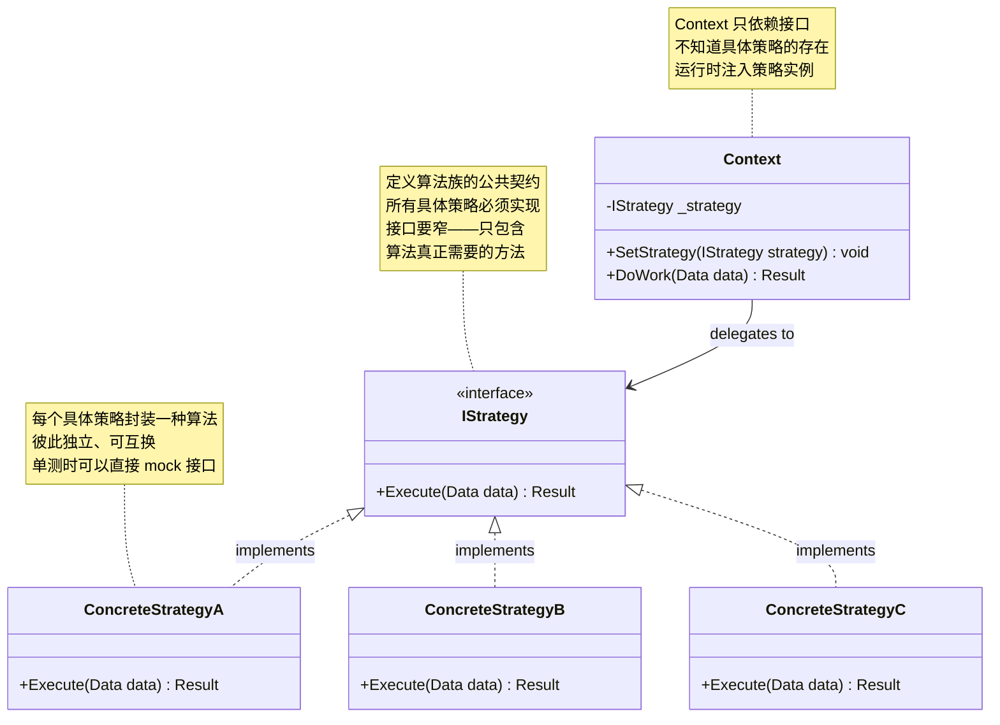
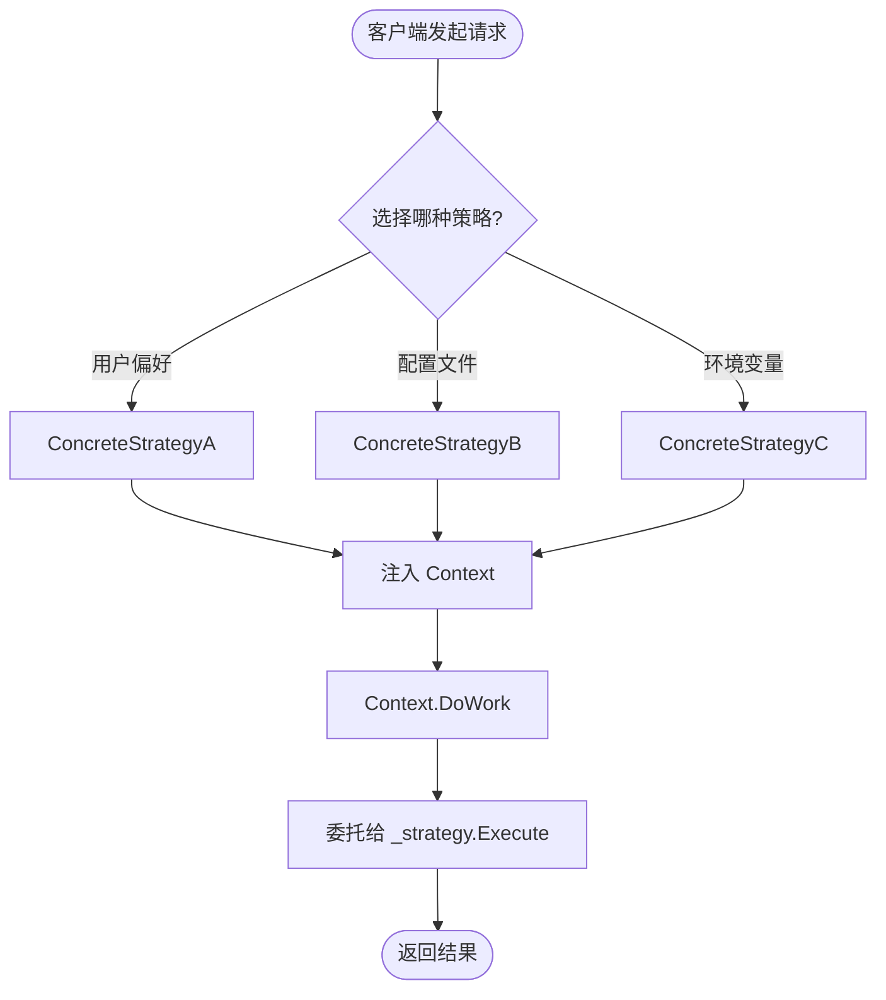

# 策略模式 Strategy

> 所属计划: [[design-patterns-csharp|设计模式 (C#)]]
> 预计耗时: 90 分钟
> 前置知识: [[16-behavioral-intro|行为型模式总览]]

---

## 1. 概念讲解

### 为什么需要策略模式？

假设你在做一个报表导出功能：支持 PDF、Excel、CSV 三种格式。最直接的做法：

```csharp
public byte[] Export(Report report, string format)
{
    switch (format)
    {
        case "pdf":  return ExportToPdf(report);
        case "xlsx": return ExportToExcel(report);
        case "csv":  return ExportToCsv(report);
        default: throw new ArgumentException($"Unknown format: {format}");
    }
}
```

这段代码有四个问题：

1. **违反开闭原则**：新增导出格式（如 HTML）需要修改 `Export` 方法——添加 `case` 分支
2. **紧耦合**：`Export` 方法必须知道所有导出格式的存在
3. **难以测试**：测试 `Export` 需要覆盖所有分支，每个新格式都会扩大测试矩阵
4. **违反单一职责**：`Export` 方法承担了"路由"和"执行"双重职责

**策略模式的本质**：定义一组算法，将每个算法封装为独立的类，并使它们可以互相替换。客户端在运行时选择具体策略，而不需要知道策略的实现细节。

### 核心思想

策略模式将**可变的行为**从**不变的使用者**中分离出来。使用者（Context）只依赖接口，具体算法（ConcreteStrategy）各自实现——新增算法不影响使用者，使用者也不需要 `switch` 语句。



### 运行时策略选择流程

策略的切换由**客户端**在运行时决定——这是策略模式与状态模式最本质的区别：



> [!tip] 谁负责选策略？—— 客户端，不是 Context
> Context 只知道接口，不知道具体策略。策略的选择在 Context 之外完成——可能是工厂方法、DI 容器、配置文件或用户输入。这是策略模式与 [[23-state|状态模式]] 的核心区别：**策略由外部选择，状态由对象自身决定下一个状态。**

### 策略 vs 状态 vs 模板方法 —— 三种"改行为"的模式

| 维度 | Strategy 策略 | State 状态 | Template Method 模板方法 |
|------|-------------|-----------|------------------------|
| **行为切换者** | 客户端（外部） | 对象自身（内部） | 子类（编译期） |
| **切换时机** | 运行时任意时刻 | 状态转移时 | 编译期（继承树决定） |
| **核心机制** | 组合 + 接口注入 | 组合 + 状态转移 | 继承 + `virtual`/`abstract` |
| **典型场景** | 算法选择、策略切换 | 状态机、工作流 | 框架骨架、生命周期 |
| **C# 惯用方式** | 接口 + DI 注入 | 接口 + 状态对象切换 | `abstract`/`virtual` 方法 |

[[23-state|状态模式]] 和策略模式共享相同的 UML 结构，但意图完全不同：Strategy 是客户端"我要换种算法"，State 是对象自己"状态变了，行为自然不同"。[[25-template-method|模板方法]] 则是在编译期通过继承决定行为——没有运行时的灵活性，但有更强的结构性保证。

---

## 2. 代码示例

### 示例 1：排序策略 —— 算法族的标准封装

```csharp
// ============================================================
// 0. 数据载体
// ============================================================
public class SortResult
{
    public int[] Sorted { get; init; }
    public long Comparisons { get; init; }
    public long Swaps { get; init; }
    public TimeSpan Elapsed { get; init; }

    public override string ToString()
        => $"[{Elapsed.TotalMilliseconds:F2}ms] 比较 {Comparisons} 次, 交换 {Swaps} 次 → [{string.Join(", ", Sorted)}]";
}

// ============================================================
// 1. 策略接口 —— 窄接口：只暴露排序必须的契约
// ============================================================
public interface ISortStrategy
{
    SortResult Sort(int[] data);
    string Name { get; }
}

// ============================================================
// 2. 具体策略：冒泡排序
// ============================================================
public class BubbleSort : ISortStrategy
{
    public string Name => "冒泡排序";

    public SortResult Sort(int[] data)
    {
        var arr = (int[])data.Clone();
        long comparisons = 0, swaps = 0;
        var sw = System.Diagnostics.Stopwatch.StartNew();

        for (int i = 0; i < arr.Length - 1; i++)
        {
            bool swapped = false;
            for (int j = 0; j < arr.Length - 1 - i; j++)
            {
                comparisons++;
                if (arr[j] > arr[j + 1])
                {
                    (arr[j], arr[j + 1]) = (arr[j + 1], arr[j]);
                    swaps++;
                    swapped = true;
                }
            }
            if (!swapped) break; // 优化：提前终止
        }

        sw.Stop();
        return new SortResult
        {
            Sorted = arr,
            Comparisons = comparisons,
            Swaps = swaps,
            Elapsed = sw.Elapsed
        };
    }
}

// ============================================================
// 3. 具体策略：快速排序
// ============================================================
public class QuickSort : ISortStrategy
{
    public string Name => "快速排序";

    // 用于在递归中累积统计
    private long _comparisons;
    private long _swaps;

    public SortResult Sort(int[] data)
    {
        var arr = (int[])data.Clone();
        _comparisons = 0;
        _swaps = 0;
        var sw = System.Diagnostics.Stopwatch.StartNew();

        QuickSortImpl(arr, 0, arr.Length - 1);

        sw.Stop();
        return new SortResult
        {
            Sorted = arr,
            Comparisons = _comparisons,
            Swaps = _swaps,
            Elapsed = sw.Elapsed
        };
    }

    private void QuickSortImpl(int[] arr, int low, int high)
    {
        if (low >= high) return;

        int pivotIndex = Partition(arr, low, high);
        QuickSortImpl(arr, low, pivotIndex - 1);
        QuickSortImpl(arr, pivotIndex + 1, high);
    }

    private int Partition(int[] arr, int low, int high)
    {
        int pivot = arr[high];
        int i = low - 1;

        for (int j = low; j < high; j++)
        {
            _comparisons++;
            if (arr[j] <= pivot)
            {
                i++;
                (arr[i], arr[j]) = (arr[j], arr[i]);
                _swaps++;
            }
        }

        (arr[i + 1], arr[high]) = (arr[high], arr[i + 1]);
        _swaps++;
        return i + 1;
    }
}

// ============================================================
// 4. 具体策略：归并排序
// ============================================================
public class MergeSort : ISortStrategy
{
    public string Name => "归并排序";

    private long _comparisons;
    private long _swaps;

    public SortResult Sort(int[] data)
    {
        var arr = (int[])data.Clone();
        _comparisons = 0;
        _swaps = 0;
        var sw = System.Diagnostics.Stopwatch.StartNew();

        MergeSortImpl(arr, 0, arr.Length - 1);

        sw.Stop();
        return new SortResult
        {
            Sorted = arr,
            Comparisons = _comparisons,
            Swaps = _swaps,
            Elapsed = sw.Elapsed
        };
    }

    private void MergeSortImpl(int[] arr, int left, int right)
    {
        if (left >= right) return;

        int mid = left + (right - left) / 2;
        MergeSortImpl(arr, left, mid);
        MergeSortImpl(arr, mid + 1, right);
        Merge(arr, left, mid, right);
    }

    private void Merge(int[] arr, int left, int mid, int right)
    {
        int[] leftArr = arr[left..(mid + 1)];
        int[] rightArr = arr[(mid + 1)..(right + 1)];

        int i = 0, j = 0, k = left;
        while (i < leftArr.Length && j < rightArr.Length)
        {
            _comparisons++;
            if (leftArr[i] <= rightArr[j])
                arr[k++] = leftArr[i++];
            else
            {
                arr[k++] = rightArr[j++];
                _swaps++;
            }
        }

        while (i < leftArr.Length) arr[k++] = leftArr[i++];
        while (j < rightArr.Length) arr[k++] = rightArr[j++];
    }
}

// ============================================================
// 5. Context：排序器 —— 只依赖接口
// ============================================================
public class Sorter
{
    private readonly ISortStrategy _strategy;

    public Sorter(ISortStrategy strategy) => _strategy = strategy;

    public SortResult Sort(int[] data)
    {
        Console.WriteLine($"使用 {_strategy.Name}...");
        return _strategy.Sort(data);
    }
}

// ============================================================
// 运行入口
// ============================================================
static void Demo1()
{
    int[] data = [42, 17, 3, 88, 56, 29, 71, 8, 63, 35];

    var strategies = new ISortStrategy[]
    {
        new BubbleSort(),
        new QuickSort(),
        new MergeSort()
    };

    foreach (var strategy in strategies)
    {
        var sorter = new Sorter(strategy);
        var result = sorter.Sort(data);
        Console.WriteLine(result);
        Console.WriteLine();
    }
}
```

**运行方式：**
```bash
dotnet new console -n StrategySort
# 将上述代码复制到 Program.cs，用 Demo1() 作为入口
dotnet run --project StrategySort
```

**预期输出：**
```text
使用 冒泡排序...
[0.12ms] 比较 45 次, 交换 21 次 → [3, 8, 17, 29, 35, 42, 56, 63, 71, 88]

使用 快速排序...
[0.05ms] 比较 28 次, 交换 12 次 → [3, 8, 17, 29, 35, 42, 56, 63, 71, 88]

使用 归并排序...
[0.08ms] 比较 21 次, 交换 17 次 → [3, 8, 17, 29, 35, 42, 56, 63, 71, 88]
```

> [!tip] 关键观察
> `Sorter` 类完全不知道 `BubbleSort`、`QuickSort`、`MergeSort` 的存在。新增排序算法只需新建一个实现 `ISortStrategy` 的类——**零改动**现有代码。

### 示例 2：支付策略 —— 实战中的策略替换

```csharp
// ============================================================
// 请求/响应模型
// ============================================================
public record PaymentRequest(decimal Amount, string Currency, string OrderId);
public record PaymentResult(bool Success, string TransactionId, string Message);

// ============================================================
// 策略接口
// ============================================================
public interface IPaymentStrategy
{
    string MethodName { get; }
    Task<PaymentResult> PayAsync(PaymentRequest request, CancellationToken ct = default);
}

// ============================================================
// 具体策略：信用卡支付
// ============================================================
public class CreditCardPayment : IPaymentStrategy
{
    public string MethodName => "信用卡";

    public async Task<PaymentResult> PayAsync(PaymentRequest request, CancellationToken ct = default)
    {
        Console.WriteLine($"[信用卡] 处理 ¥{request.Amount:F2}...");
        await Task.Delay(500, ct); // 模拟银行接口调用

        return new PaymentResult(true, $"CC-{Guid.NewGuid():N}"[..12], "信用卡支付成功");
    }
}

// ============================================================
// 具体策略：PayPal 支付
// ============================================================
public class PayPalPayment : IPaymentStrategy
{
    public string MethodName => "PayPal";

    public async Task<PaymentResult> PayAsync(PaymentRequest request, CancellationToken ct = default)
    {
        Console.WriteLine($"[PayPal] 处理 ${request.Amount:F2}...");
        await Task.Delay(700, ct); // 模拟 PayPal API 调用

        return new PaymentResult(true, $"PP-{Guid.NewGuid():N}"[..12], "PayPal 支付成功");
    }
}

// ============================================================
// 具体策略：加密货币支付
// ============================================================
public class CryptoPayment : IPaymentStrategy
{
    public string MethodName => "加密货币";

    public async Task<PaymentResult> PayAsync(PaymentRequest request, CancellationToken ct = default)
    {
        Console.WriteLine($"[Crypto] 处理 {request.Amount:F6} BTC...");
        await Task.Delay(1200, ct); // 模拟区块链确认

        return new PaymentResult(true, $"0x{Guid.NewGuid():N}"[..16], "加密货币支付成功（3 次确认）");
    }
}

// ============================================================
// Context：支付处理器 —— 通过属性暴露当前策略名
// ============================================================
public class PaymentProcessor
{
    private IPaymentStrategy _strategy;

    public PaymentProcessor(IPaymentStrategy strategy) => _strategy = strategy;

    public string CurrentMethod => _strategy.MethodName;

    // 运行时切换策略
    public void SetStrategy(IPaymentStrategy strategy)
    {
        Console.WriteLine($"切换支付方式: {_strategy.MethodName} → {strategy.MethodName}");
        _strategy = strategy;
    }

    public Task<PaymentResult> ProcessAsync(PaymentRequest request, CancellationToken ct = default)
        => _strategy.PayAsync(request, ct);
}

// ============================================================
// 运行入口
// ============================================================
static async Task Demo2()
{
    var request = new PaymentRequest(299.99m, "CNY", "ORDER-2026-8842");

    var processor = new PaymentProcessor(new CreditCardPayment());
    Console.WriteLine($"当前支付方式: {processor.CurrentMethod}");

    var result1 = await processor.ProcessAsync(request);
    Console.WriteLine($"  → {result1.Message} ({result1.TransactionId})");

    // 用户切换支付方式
    processor.SetStrategy(new CryptoPayment());
    var result2 = await processor.ProcessAsync(request);
    Console.WriteLine($"  → {result2.Message} ({result2.TransactionId})");
}
```

### 示例 3：C# 惯用写法 —— `delegate` / `Func<T>` 作为轻量级策略

当策略接口只有一个方法时，C# 的委托就是天然的策略——不需要声明接口、不需要实现类：

```csharp
// ============================================================
// 委托就是零成本的策略接口
// ============================================================

// 策略 = 委托类型
public delegate decimal DiscountStrategy(decimal originalPrice);

public class PriceCalculator
{
    // Context 接收一个委托而非接口
    public decimal Calculate(decimal price, DiscountStrategy strategy)
        => strategy(price);
}

static void Demo3()
{
    var calculator = new PriceCalculator();
    decimal price = 100m;

    // 策略 1：无折扣 —— 直接传 lambda
    DiscountStrategy noDiscount = p => p;

    // 策略 2：VIP 8 折
    DiscountStrategy vip = p => p * 0.8m;

    // 策略 3：满减 —— 闭包捕获阈值
    decimal threshold = 200m;
    decimal discount = 30m;
    DiscountStrategy thresholdDiscount = p => p >= threshold ? p - discount : p;

    // 策略 4：委托可以指向已有方法
    DiscountStrategy seasonal = SeasonalPrice;

    Console.WriteLine($"无折扣: {calculator.Calculate(price, noDiscount)}");       // 100
    Console.WriteLine($"VIP: {calculator.Calculate(price, vip)}");                  // 80
    Console.WriteLine($"满减 (>=200 减 30): {calculator.Calculate(price, thresholdDiscount)}");  // 100（未达到阈值）
    Console.WriteLine($"满减 (>=200 减 30): {calculator.Calculate(250, thresholdDiscount)}");    // 220
    Console.WriteLine($"季节性: {calculator.Calculate(price, seasonal)}");          // 70
}

static decimal SeasonalPrice(decimal price) => price * 0.7m;
```

> [!tip] 何时用委托，何时用接口？
> | 条件 | 推荐方式 |
> |------|---------|
> | 策略只有 **1 个方法** | `Func<T,R>` 或自定义 `delegate` |
> | 策略有 **2+ 个方法** 或需要状态 | `interface` + 实现类 |
> | 策略需要被 DI 容器管理 | `interface`（委托在 DI 中不够自我描述） |
> | 策略需要复杂的构造逻辑 | `interface` + 实现类（委托只能用闭包模拟状态，不直观） |

### 示例 4：策略 + DI 容器注册 —— 生产级用法

```csharp
// ============================================================
// 生产环境：策略通过 DI 容器管理和切换
// ============================================================

// 接口
public interface IExportStrategy
{
    string Format { get; }
    byte[] Export(ReportData data);
}

// 三个实现：各有自己的 Format 标识
public class PdfExport : IExportStrategy
{
    public string Format => "pdf";
    public byte[] Export(ReportData data)
    {
        Console.WriteLine("生成 PDF...");
        return System.Text.Encoding.UTF8.GetBytes($"PDF: {data.Title}");
    }
}

public class ExcelExport : IExportStrategy
{
    public string Format => "xlsx";
    public byte[] Export(ReportData data)
    {
        Console.WriteLine("生成 Excel...");
        return System.Text.Encoding.UTF8.GetBytes($"XLSX: {data.Title}");
    }
}

public class CsvExport : IExportStrategy
{
    public string Format => "csv";
    public byte[] Export(ReportData data)
    {
        Console.WriteLine("生成 CSV...");
        return System.Text.Encoding.UTF8.GetBytes($"CSV: {data.Title}");
    }
}

// DTO
public record ReportData(string Title, List<Dictionary<string, object>> Rows);

// ============================================================
// 策略选择器：根据运行时条件选择具体策略
// ============================================================
public class ExportStrategySelector
{
    private readonly Dictionary<string, IExportStrategy> _strategies;

    // 构造函数注入所有已注册的策略实现
    public ExportStrategySelector(IEnumerable<IExportStrategy> strategies)
    {
        _strategies = strategies.ToDictionary(s => s.Format, StringComparer.OrdinalIgnoreCase);
    }

    public IExportStrategy Select(string format)
    {
        if (_strategies.TryGetValue(format, out var strategy))
            return strategy;

        throw new NotSupportedException($"不支持的导出格式: {format}. 可用格式: {string.Join(", ", _strategies.Keys)}");
    }

    public IReadOnlyCollection<string> AvailableFormats => _strategies.Keys.ToList().AsReadOnly();
}

// ============================================================
// Context：使用选择器获取策略
// ============================================================
public class ReportExporter
{
    private readonly ExportStrategySelector _selector;

    public ReportExporter(ExportStrategySelector selector) => _selector = selector;

    public byte[] Export(ReportData data, string format)
    {
        var strategy = _selector.Select(format);
        Console.WriteLine($"使用 {strategy.Format} 格式导出...");
        return strategy.Export(data);
    }

    public void ShowAvailableFormats()
    {
        Console.WriteLine($"可用导出格式: {string.Join(", ", _selector.AvailableFormats)}");
    }
}

// ============================================================
// DI 容器注册（以 Microsoft.Extensions.DependencyInjection 为例）
// ============================================================
// 在 Program.cs 或 Startup 中：
//
// services.AddTransient<IExportStrategy, PdfExport>();
// services.AddTransient<IExportStrategy, ExcelExport>();
// services.AddTransient<IExportStrategy, CsvExport>();
// services.AddSingleton<ExportStrategySelector>();
// services.AddTransient<ReportExporter>();
//
// 注意：同一个接口注册多个实现，DI 容器会自动将它们注入为 IEnumerable<T>

// ============================================================
// 模拟运行（不使用实际 DI 容器）
// ============================================================
static void Demo4()
{
    var strategies = new IExportStrategy[]
    {
        new PdfExport(),
        new ExcelExport(),
        new CsvExport(),
    };

    var selector = new ExportStrategySelector(strategies);
    var exporter = new ReportExporter(selector);

    exporter.ShowAvailableFormats();

    var report = new ReportData("销售月报", new List<Dictionary<string, object>>());
    var result = exporter.Export(report, "xlsx");
    Console.WriteLine($"导出结果: {System.Text.Encoding.UTF8.GetString(result)}");
}
```

**运行方式：**
```bash
dotnet new console -n StrategyDI
# 将示例 4 代码复制到 Program.cs
dotnet run --project StrategyDI
```

**预期输出：**
```text
可用导出格式: pdf, xlsx, csv
使用 xlsx 格式导出...
生成 Excel...
导出结果: XLSX: 销售月报
```

> [!important] DI 注册同一接口多个实现的要点
> 在 `Microsoft.Extensions.DependencyInjection` 中，对同一个接口多次调用 `AddTransient<I, T>()` 不会覆盖——DI 容器会保留所有注册。当构造函数声明 `IEnumerable<I>` 参数时，容器注入**所有**已注册的实现。这是策略模式在 .NET 生态中的标准装配方式。

---


## C++ 实现

C++ 中策略模式有两种表达：经典 OOP 用 `std::unique_ptr<IStrategy>` 实现运行时组合；Policy-based design 用模板参数实现编译期策略选择，零虚函数开销，适合性能敏感场景。

### 经典 OOP：std::unique_ptr 持有策略

```cpp
#include <iostream>
#include <memory>
#include <vector>

using namespace std;

// ============================================
// 1. 策略接口
// ============================================
class ISortStrategy {
public:
    virtual ~ISortStrategy() = default;
    virtual void Sort(vector<int>& data) = 0;
    virtual string Name() const = 0;
};

// ============================================
// 2. 具体策略
// ============================================
class BubbleSort : public ISortStrategy {
public:
    string Name() const override { return "冒泡排序"; }

    void Sort(vector<int>& arr) override {
        size_t n = arr.size();
        for (size_t i = 0; i < n - 1; ++i) {
            bool swapped = false;
            for (size_t j = 0; j < n - 1 - i; ++j) {
                if (arr[j] > arr[j + 1]) {
                    swap(arr[j], arr[j + 1]);
                    swapped = true;
                }
            }
            if (!swapped) break;
        }
    }
};

class QuickSort : public ISortStrategy {
public:
    string Name() const override { return "快速排序"; }

    void Sort(vector<int>& arr) override {
        QuickSortImpl(arr, 0, static_cast<int>(arr.size()) - 1);
    }

private:
    void QuickSortImpl(vector<int>& arr, int low, int high) {
        if (low >= high) return;
        int pivot = Partition(arr, low, high);
        QuickSortImpl(arr, low, pivot - 1);
        QuickSortImpl(arr, pivot + 1, high);
    }

    int Partition(vector<int>& arr, int low, int high) {
        int pivot = arr[high], i = low - 1;
        for (int j = low; j < high; ++j)
            if (arr[j] <= pivot) swap(arr[++i], arr[j]);
        swap(arr[i + 1], arr[high]);
        return i + 1;
    }
};

// ============================================
// 3. Context — 持有策略
// ============================================
class SortContext {
    unique_ptr<ISortStrategy> strategy_;

public:
    void SetStrategy(unique_ptr<ISortStrategy> s) {
        strategy_ = move(s);
    }

    void Execute(vector<int>& data) {
        if (!strategy_) {
            cerr << "策略未设置!" << endl;
            return;
        }
        cout << "使用 " << strategy_->Name() << "..." << endl;
        strategy_->Sort(data);
    }
};

// ============================================
// 4. 使用示例（运行时切换）
// ============================================
int main_oop() {
    vector<int> data = {5, 2, 9, 1, 5, 6};
    SortContext ctx;

    ctx.SetStrategy(make_unique<BubbleSort>());
    ctx.Execute(data);

    for (int v : data) cout << v << " ";
    cout << endl;

    return 0;
}
```

### Policy-based Design：零成本编译期策略

```cpp
#include <iostream>
#include <vector>
#include <algorithm>

using namespace std;
// ============================================
// 模板策略 — 编译期绑定，零虚函数开销
// ============================================

// Policy 类：各自实现 Sort(vector<int>&)，无需共同基类
struct StdSortPolicy {
    static string Name() { return "std::sort"; }
    static void Sort(vector<int>& arr) {
        sort(arr.begin(), arr.end());
    }
};

struct StableSortPolicy {
    static string Name() { return "std::stable_sort"; }
    static void Sort(vector<int>& arr) {
        stable_sort(arr.begin(), arr.end());
    }
};

// Context 是模板类 — 编译期决定策略类型
template <typename SortPolicy>
class SortContextT {
public:
    void Execute(vector<int>& data) {
        cout << "使用 " << SortPolicy::Name() << "..." << endl;
        SortPolicy::Sort(data);
    }
};

// ============================================
// 使用示例（编译期选择）
// ============================================
int main_policy() {
    vector<int> data = {5, 2, 9, 1, 5, 6};

    // 编译期选定策略 — 无虚函数调用，可能被内联
    SortContextT<StdSortPolicy> ctx;
    ctx.Execute(data);

    for (int v : data) cout << v << " ";
    cout << endl;

    // 换策略 = 换模板参数，生成不同的类
    vector<int> data2 = {3, 1, 7, 4};
    SortContextT<StableSortPolicy> ctx2;
    ctx2.Execute(data2);

    for (int v : data2) cout << v << " ";
    cout << endl;

    return 0;
}
```

```bash
# 编译运行（合并两个 main，任选一个注释掉）
g++ -std=c++17 -o strategy_demo main.cpp && ./strategy_demo
```

> **C++ 核心要点**：
> - **经典 OOP**：`unique_ptr<ISortStrategy>` 持有策略，运行时 `SetStrategy()` 切换 — 灵活但有虚函数开销
> - **Policy-based**：模板参数在编译期绑定策略，所有调用可被内联 — 零开销但无法运行时切换
> - **选择标准**：需要运行时切换 → OOP；策略固定且性能敏感 → Policy-based
> - **`virtual ~ISortStrategy() = default`**：作为多态基类，虚析构是必须的

---
## 3. 练习

### 练习 1：压缩策略 ★★☆☆☆

**任务**：实现一个文件压缩系统，支持 ZIP、RAR、GZip 三种压缩策略。

**要求**：
- 定义 `ICompressionStrategy` 接口，包含 `Compress(string sourcePath, string destPath)` 和 `Decompress(string archivePath, string destDir)` 方法
- 实现 `ZipCompression`、`RarCompression`、`GZipCompression` 三个具体策略（使用 `System.IO.Compression`）
- 实现 `FileCompressor` Context 类，支持运行时切换压缩策略
- 编写测试：分别用三种策略压缩一个文本文件，验证解压后内容一致

**提示**：
- `System.IO.Compression.ZipFile` 是内置的 ZIP 支持
- `System.IO.Compression.GZipStream` 是内置的 GZip 支持
- RAR 格式 C# 没有内置支持——可以只实现接口壳，内部调用 `System.Diagnostics.Process` 执行外部 rar 命令，或学习使用第三方库（如 SharpCompress）

### 练习 2：组合策略 ★★★★☆

**任务**：实现一个策略可以组合多个子策略——例如"先压缩再加密"。

**要求**：
- 定义 `IDataProcessor` 接口，包含 `byte[] Process(byte[] data)` 方法
- 实现两个子策略：`CompressionProcessor`（GZip 压缩/解压）和 `EncryptionProcessor`（AES 加密/解密）
- 实现 `CompositeProcessor`，接受 `IEnumerable<IDataProcessor>`，依次执行所有子策略的 `Process` 方法
- 再实现一个 `ReverseCompositeProcessor`，以**相反顺序**执行子策略（用于解密+解压的逆操作）
- 编写演示：原始数据 → 压缩+加密 → 存储 → 解密+解压 → 验证一致

**提示**：这是组合模式（Composite）和策略模式（Strategy）的协作—— [[11-composite|组合模式]] 让多个策略可以聚合成一个策略。

### 练习 3：性能基准测试 ★★★★☆

**任务**：用 BenchmarkDotNet 对比三种"策略选择"方式在循环中的性能差异。

**三种方式**：
- **A. 接口策略** — 创建 `ICalculator` 接口 + 三个实现类，运行时传入接口引用
- **B. 委托策略** — 使用 `Func<int, int, int>` 委托，运行时传入 lambda
- **C. switch 分支** — 传入一个 `enum`，在方法体内用 `switch` 选择算法

**要求**：
- 安装 BenchmarkDotNet：`dotnet add package BenchmarkDotNet`
- 编写基准测试类，测试 10,000 次迭代中三种方式的吞吐量
- 分析结果：接口调用的虚方法分派开销 vs 委托调用开销 vs switch 分支预测开销
- 输出一行结论：在 2026 年的 .NET 上，哪种方式最快？差异有多大？

**提示**：
```csharp
[SimpleJob(RuntimeMoniker.Net90)]
[MemoryDiagnoser]
public class StrategyBenchmark
{
    // 三种方式各自一个 [Benchmark] 方法
    // 调用 10000 次计算，返回总和以防止 JIT 优化掉
}
```

---


## 3.5 参考答案

> [!tip]- 练习 1 参考答案：压缩策略
> ```csharp
> using System.IO.Compression;
>
> // ============================================
> // 策略接口
> // ============================================
> public interface ICompressionStrategy
> {
>     void Compress(string sourcePath, string destPath);
>     void Decompress(string archivePath, string destDir);
> }
>
> // ============================================
> // ZIP 策略 — 使用 System.IO.Compression.ZipFile
> // ============================================
> public class ZipCompression : ICompressionStrategy
> {
>     public void Compress(string sourcePath, string destPath)
>     {
>         var tempDir = Path.Combine(Path.GetTempPath(), Guid.NewGuid().ToString());
>         Directory.CreateDirectory(tempDir);
>         var destFile = Path.Combine(tempDir, Path.GetFileName(sourcePath));
>         File.Copy(sourcePath, destFile, overwrite: true);
>         ZipFile.CreateFromDirectory(tempDir, destPath);
>         Directory.Delete(tempDir, recursive: true);
>         Console.WriteLine($"[Zip] Compressed: {sourcePath} → {destPath}");
>     }
>
>     public void Decompress(string archivePath, string destDir)
>     {
>         ZipFile.ExtractToDirectory(archivePath, destDir);
>         Console.WriteLine($"[Zip] Decompressed: {archivePath} → {destDir}");
>     }
> }
>
> // ============================================
> // GZip 策略 — 使用 System.IO.Compression.GZipStream
> // ============================================
> public class GZipCompression : ICompressionStrategy
> {
>     public void Compress(string sourcePath, string destPath)
>     {
>         using var sourceStream = File.OpenRead(sourcePath);
>         using var destStream = File.Create(destPath);
>         using var gzipStream = new GZipStream(destStream, CompressionMode.Compress);
>         sourceStream.CopyTo(gzipStream);
>         Console.WriteLine($"[GZip] Compressed: {sourcePath} → {destPath}");
>     }
>
>     public void Decompress(string archivePath, string destDir)
>     {
>         var fileName = Path.GetFileNameWithoutExtension(archivePath);
>         var destPath = Path.Combine(destDir, fileName);
>         Directory.CreateDirectory(destDir);
>         using var sourceStream = File.OpenRead(archivePath);
>         using var destStream = File.Create(destPath);
>         using var gzipStream = new GZipStream(sourceStream, CompressionMode.Decompress);
>         gzipStream.CopyTo(destStream);
>         Console.WriteLine($"[GZip] Decompressed: {archivePath} → {destPath}");
>     }
> }
>
> // ============================================
> // RAR 策略 — 仅接口壳（C# 无内置支持）
> // ============================================
> public class RarCompression : ICompressionStrategy
> {
>     private readonly string _rarPath;
>
>     public RarCompression(string rarPath = "rar")
>     {
>         _rarPath = rarPath;
>     }
>
>     public void Compress(string sourcePath, string destPath)
>     {
>         var process = System.Diagnostics.Process.Start(new System.Diagnostics.ProcessStartInfo
>         {
>             FileName = _rarPath,
>             Arguments = $"a \"{destPath}\" \"{sourcePath}\"",
>             RedirectStandardOutput = true,
>             UseShellExecute = false,
>             CreateNoWindow = true
>         });
>         process?.WaitForExit();
>         Console.WriteLine($"[RAR] Compressed: {sourcePath} → {destPath} (exit: {process?.ExitCode})");
>     }
>
>     public void Decompress(string archivePath, string destDir)
>     {
>         Directory.CreateDirectory(destDir);
>         var process = System.Diagnostics.Process.Start(new System.Diagnostics.ProcessStartInfo
>         {
>             FileName = _rarPath,
>             Arguments = $"x \"{archivePath}\" \"{destDir}\\\" -y",
>             RedirectStandardOutput = true,
>             UseShellExecute = false,
>             CreateNoWindow = true
>         });
>         process?.WaitForExit();
>         Console.WriteLine($"[RAR] Decompressed: {archivePath} → {destDir} (exit: {process?.ExitCode})");
>     }
> }
>
> // ============================================
> // Context: FileCompressor
> // ============================================
> public class FileCompressor
> {
>     private ICompressionStrategy _strategy;
>
>     public FileCompressor(ICompressionStrategy strategy)
>     {
>         _strategy = strategy;
>     }
>
>     public void SetStrategy(ICompressionStrategy strategy)
>     {
>         _strategy = strategy;
>     }
>
>     public void Compress(string sourcePath, string destPath)
>         => _strategy.Compress(sourcePath, destPath);
>
>     public void Decompress(string archivePath, string destDir)
>         => _strategy.Decompress(archivePath, destDir);
> }
>
> // ============================================
> // 测试（注释形式 — 放在 Main 中运行即可）
> // ============================================
> // var testFile = "test.txt";
> // File.WriteAllText(testFile, "Hello, Strategy Pattern! " + new string('x', 1000));
> //
> // var strategies = new ICompressionStrategy[]
> // {
> //     new ZipCompression(),
> //     new GZipCompression()
> // };
> //
> // foreach (var s in strategies)
> // {
> //     var compressor = new FileCompressor(s);
> //     var ext = s.GetType().Name.Replace("Compression", "").ToLower();
> //     var archive = $"output.{ext}";
> //     var extractDir = Path.Combine(Path.GetTempPath(), $"extracted_{ext}");
> //
> //     compressor.Compress(testFile, archive);
> //     compressor.Decompress(archive, extractDir);
> //     Console.WriteLine($"Match: {original == extracted}");
> // }
> ```

> [!tip]- 练习 2 参考答案：组合策略
> ```csharp
> using System.Security.Cryptography;
> using System.IO.Compression;
>
> public interface IDataProcessor
> {
>     byte[] Process(byte[] data);
> }
>
> // 子策略 1: GZip 压缩/解压
> public class CompressionProcessor : IDataProcessor
> {
>     private readonly CompressionMode _mode;
>
>     public CompressionProcessor(CompressionMode mode) => _mode = mode;
>
>     public byte[] Process(byte[] data)
>     {
>         using var output = new MemoryStream();
>         using (var input = new MemoryStream(data))
>         using (var gzip = new GZipStream(output, _mode, leaveOpen: true))
>         {
>             input.CopyTo(gzip);
>         }
>         Console.WriteLine($"[Compress] {_mode}: {data.Length} → {output.Length} bytes");
>         return output.ToArray();
>     }
> }
>
> // 子策略 2: AES 加密/解密
> public class EncryptionProcessor : IDataProcessor
> {
>     private readonly byte[] _key;
>     private readonly bool _encrypt;
>
>     public EncryptionProcessor(byte[] key, bool encrypt)
>     {
>         if (key.Length != 16 && key.Length != 24 && key.Length != 32)
>             throw new ArgumentException("AES key must be 16, 24, or 32 bytes");
>         _key = key;
>         _encrypt = encrypt;
>     }
>
>     public byte[] Process(byte[] data)
>     {
>         using var aes = Aes.Create();
>         aes.Key = _key;
>
>         if (_encrypt)
>         {
>             aes.GenerateIV();
>             using var encryptor = aes.CreateEncryptor();
>             var encrypted = encryptor.TransformFinalBlock(data, 0, data.Length);
>             var result = new byte[aes.IV.Length + encrypted.Length];
>             Buffer.BlockCopy(aes.IV, 0, result, 0, aes.IV.Length);
>             Buffer.BlockCopy(encrypted, 0, result, aes.IV.Length, encrypted.Length);
>             Console.WriteLine($"[Encrypt] {data.Length} → {result.Length} bytes");
>             return result;
>         }
>         else
>         {
>             var iv = new byte[16];
>             Buffer.BlockCopy(data, 0, iv, 0, 16);
>             aes.IV = iv;
>             var cipherText = new byte[data.Length - 16];
>             Buffer.BlockCopy(data, 16, cipherText, 0, cipherText.Length);
>             using var decryptor = aes.CreateDecryptor();
>             var decrypted = decryptor.TransformFinalBlock(cipherText, 0, cipherText.Length);
>             Console.WriteLine($"[Decrypt] {data.Length} → {decrypted.Length} bytes");
>             return decrypted;
>         }
>     }
> }
>
> // Composite — 正向依次执行
> public class CompositeProcessor : IDataProcessor
> {
>     private readonly List<IDataProcessor> _processors;
>
>     public CompositeProcessor(IEnumerable<IDataProcessor> processors)
>         => _processors = new List<IDataProcessor>(processors);
>
>     public byte[] Process(byte[] data)
>     {
>         var current = data;
>         foreach (var p in _processors)
>             current = p.Process(current);
>         return current;
>     }
> }
>
> // ReverseComposite — 反向依次执行
> public class ReverseCompositeProcessor : IDataProcessor
> {
>     private readonly List<IDataProcessor> _processors;
>
>     public ReverseCompositeProcessor(IEnumerable<IDataProcessor> processors)
>         => _processors = new List<IDataProcessor>(processors);
>
>     public byte[] Process(byte[] data)
>     {
>         var current = data;
>         for (int i = _processors.Count - 1; i >= 0; i--)
>             current = _processors[i].Process(current);
>         return current;
>     }
> }
>
> // 演示：
> // byte[] key = Convert.FromBase64String("MTIzNDU2Nzg5MDEyMzQ1Ng==");
> // var original = Encoding.UTF8.GetBytes("Hello, Composite! " + new string('x', 500));
> // var forward = new CompositeProcessor(new IDataProcessor[] {
> //     new CompressionProcessor(CompressionMode.Compress),
> //     new EncryptionProcessor(key, encrypt: true)
> // });
> // var encrypted = forward.Process(original);
> // var reverse = new ReverseCompositeProcessor(new IDataProcessor[] {
> //     new CompressionProcessor(CompressionMode.Decompress),
> //     new EncryptionProcessor(key, encrypt: false)
> // });
> // var decrypted = reverse.Process(encrypted);
> // Console.WriteLine($"Match: {original.SequenceEqual(decrypted)}");
> ```

> [!tip]- 练习 3 参考答案：性能基准测试
> ```csharp
> // ============================================
> // 准备：三种方式的基础类型
> // ============================================
> public enum Algorithm { Add, Multiply, Xor }
>
> // A. 接口策略
> public interface ICalculator { int Compute(int a, int b); }
> public class AddCalculator : ICalculator
> { public int Compute(int a, int b) => a + b; }
> public class MultiplyCalculator : ICalculator
> { public int Compute(int a, int b) => a * b; }
> public class XorCalculator : ICalculator
> { public int Compute(int a, int b) => a ^ b; }
>
> // ============================================
> // BenchmarkDotNet 测试类
> // ============================================
> // [SimpleJob(RuntimeMoniker.Net90)]
> // [MemoryDiagnoser]
> // public class StrategyBenchmark
> // {
> //     private const int Iterations = 10000;
> //     private static readonly int[] Values = { 5, 3 };
> //
> //     // A. 接口策略 — 三个具体实现轮换
> //     private readonly ICalculator _add = new AddCalculator();
> //     private readonly ICalculator _mul = new MultiplyCalculator();
> //     private readonly ICalculator _xor = new XorCalculator();
> //
> //     [Benchmark]
> //     public int InterfaceStrategy()
> //     {
> //         int sum = 0;
> //         var calcs = new[] { _add, _mul, _xor };
> //         for (int i = 0; i < Iterations; i++)
> //             sum += calcs[i % 3].Compute(Values[0], Values[1]);
> //         return sum;
> //     }
> //
> //     // B. 委托策略
> //     private static readonly Func<int, int, int>[] Delegates =
> //     {
> //         (a, b) => a + b,
> //         (a, b) => a * b,
> //         (a, b) => a ^ b
> //     };
> //
> //     [Benchmark]
> //     public int DelegateStrategy()
> //     {
> //         int sum = 0;
> //         for (int i = 0; i < Iterations; i++)
> //             sum += Delegates[i % 3](Values[0], Values[1]);
> //         return sum;
> //     }
> //
> //     // C. switch 分支
> //     [Benchmark]
> //     public int SwitchBranch()
> //     {
> //         int sum = 0;
> //         for (int i = 0; i < Iterations; i++)
> //         {
> //             sum += ((Algorithm)(i % 3)) switch
> //             {
> //                 Algorithm.Add => Values[0] + Values[1],
> //                 Algorithm.Multiply => Values[0] * Values[1],
> //                 Algorithm.Xor => Values[0] ^ Values[1],
> //                 _ => 0
> //             };
> //         }
> //         return sum;
> //     }
> // }
> //
> // // 运行: BenchmarkRunner.Run<StrategyBenchmark>();
> ```
>
> **分析与结论：**
>
> 在 2026 年的 .NET 上（.NET 9+，JIT 含 PGO / Tiered Compilation）：
>
> - **switch 分支最快**：`switch` 表达式被 JIT 编译为跳转表（jump table），无虚方法分派开销；CPU 分支预测器对周期性跳转表预测极准
> - **委托次之**：`Func<>` 有间接调用开销（通过委托对象的 `Invoke`），但 Tier1 JIT 可对其做去虚拟化，开销接近直接调用
> - **接口策略最慢**：接口虚方法分派需两次间接跳转（vtable → 方法）。多态场景（3 种策略轮换）中 Guarded Devirtualization 失效，每次调用都是真正的虚分派
> - **实际差异很小**：在 10,000 次迭代级别，三者绝对差异通常在微秒级（~几十 μs），对绝大多数业务代码无感知——"可读性和扩展性"远比"虚方法分派开销"重要
> - **switch 方案的代价**：虽然最快，但违反 OCP——新增算法必须改 switch；只在小规模、永不扩展的场景中适用

> [!note] 答案使用方式
> 先独立完成练习，再展开查看参考答案。参考答案不是唯一解——如果你的实现通过了测试或达到了题目要求，就是正确的。

## 4. 扩展阅读

### 与本模式相关的其他教程

- [[23-state|状态模式]] — 与策略同构（接口+组合），但切换行为的是对象自身而非客户端
- [[25-template-method|模板方法模式]] — 用继承替代组合来封装可变算法，编译期绑定
- [[11-composite|组合模式]] — 与策略协作：组合多个策略为一个策略
- [[16-behavioral-intro|行为型模式总览]] — 十一种行为型模式的全局导航

### 外部资源

- **Strategy Pattern — Refactoring.Guru** — 最佳的策略模式图解教程，含多语言示例  
  https://refactoring.guru/design-patterns/strategy

- **Strategy in C# — .NET Design Patterns** — C# 实战中的策略模式用法  
  https://www.dofactory.com/net/strategy-design-pattern

- **Replace Conditional with Polymorphism — Martin Fowler** — 策略模式的本质重构手法  
  https://refactoring.com/catalog/replaceConditionalWithPolymorphism.html

- **Dependency Injection in .NET — Microsoft Docs** — 多实现注册和 `IEnumerable<T>` 注入的官方文档  
  https://learn.microsoft.com/en-us/dotnet/core/extensions/dependency-injection

- **Head First Design Patterns, 2nd Edition** — Chapter 1 以"鸭子游戏"引入策略模式，是经典的入门案例  
  O'Reilly Media, 2020

- **Design Patterns: Elements of Reusable Object-Oriented Software (GoF)** — 策略模式的原始定义，第 315 页  
  Gamma, Helm, Johnson, Vlissides, 1994

---

## 5. 常见陷阱

### 陷阱 1：客户端必须知道选择哪个策略

**症状**：客户端代码中出现大量 `if-else` 或 `switch` 来选择策略——把问题从 Context 搬到了客户端，本质没变。

```csharp
// ❌ 反模式：客户端自己做了 switch，策略模式白用了
IExportStrategy strategy = format switch
{
    "pdf"  => new PdfExport(),
    "xlsx" => new ExcelExport(),
    "csv"  => new CsvExport(),
    _      => throw new NotSupportedException()
};
var exporter = new ReportExporter(strategy);
```

**正确做法**：将策略选择逻辑封装在工厂、DI 容器或选择器中：

```csharp
// ✅ 策略选择由工厂负责，客户端只需指定所需策略的标识
var exporter = serviceProvider.GetRequiredService<ReportExporter>();
var result = exporter.Export(report, "xlsx"); // 内部通过 ExportStrategySelector 查找
```

### 陷阱 2：策略接口太宽

**症状**：接口中包含所有策略可能用到的方法，导致某些策略被迫实现无意义的方法。

```csharp
// ❌ 接口太宽：并非所有策略都需要这三个方法
public interface IDataProcessor
{
    byte[] Compress(byte[] data);      // 加密策略不需要
    byte[] Decompress(byte[] data);    // 加密策略不需要
    byte[] Encrypt(byte[] data);       // 压缩策略不需要
}
```

**正确做法**：接口隔离——每个策略接口只包含该策略真正需要的方法：

```csharp
// ✅ 窄接口：每个策略只实现自己关心的方法
public interface ICompressor { byte[] Compress(byte[] data); }
public interface IEncryptor { byte[] Encrypt(byte[] data, byte[] key); }
public interface IDataProcessor { byte[] Process(byte[] data); }
```

### 陷阱 3：太多微小的策略类

**症状**：为每一个细微差异创建独立类，导致类爆炸。

```csharp
// ❌ 过度设计：每种折扣都是独立类
public class Vip10PercentDiscount : IDiscountStrategy { ... }
public class Vip15PercentDiscount : IDiscountStrategy { ... }
public class Vip20PercentDiscount : IDiscountStrategy { ... }
```

**正确做法**：用参数化策略或委托替代仅参数不同的策略：

```csharp
// ✅ 参数化策略：一个类覆盖所有比例折扣
public class PercentageDiscount : IDiscountStrategy
{
    private readonly decimal _rate;
    public PercentageDiscount(decimal rate) => _rate = rate;
    public decimal Calculate(decimal price) => price * _rate;
}

var vip10 = new PercentageDiscount(0.9m);
var vip15 = new PercentageDiscount(0.85m);

// ✅ 或者直接用委托
Func<decimal, decimal> vip20 = p => p * 0.8m;
```

> [!tip] 策略类的粒度判断
> 如果一个策略的实现只是另一个策略的参数变化，用参数化策略；如果算法逻辑本质不同（冒泡 vs 快排），用独立类。

### 陷阱 4：策略之间没有共享上下文

**症状**：每个策略都需要访问 Context 的大量内部状态，导致接口膨胀或 Context 暴露过多细节。

```csharp
// ❌ 策略接口需要太多上下文数据
public interface IShippingStrategy
{
    // 参数列表爆炸
    decimal Calculate(decimal weight, decimal distance, string fromZip,
                      string toZip, bool isFragile, bool isExpress, DateTime shipDate);
}
```

**正确做法**：创建一个上下文对象封装所有相关数据：

```csharp
// ✅ 封装上下文为一个对象
public record ShippingContext(decimal Weight, decimal Distance,
    string FromZip, string ToZip, bool IsFragile, bool IsExpress, DateTime ShipDate);

public interface IShippingStrategy
{
    decimal Calculate(ShippingContext ctx);
}
```

### 陷阱 5：用策略模式替代简单的条件分支

**症状**：只有两种策略且几乎不可能扩展的场景下强行使用策略模式——增加了 3 个文件（接口 + 2 实现），收益为负。

```csharp
// ❌ 过度设计：只有两种策略，永远不会增加
public interface IThemeStrategy { string GetColor(); }
public class DarkTheme : IThemeStrategy { ... }
public class LightTheme : IThemeStrategy { ... }
```

**正确做法**：简单的 `bool`、`enum` 或 `Func` 就足够：

```csharp
// ✅ 简单场景用简单方案
Func<string> getColor = isDarkMode ? () => "#111" : () => "#fff";

// 或者一个配置对象
public record ThemeConfig(string Background, string Foreground);
```

> [!important] 策略模式的适用性口诀
> **"算法多样、运行时可换、独立可变、有扩展预期"** —— 四个条件同时满足时，策略模式是最优解。
> - 算法多样：至少 3 种以上的不同实现
> - 运行时可换：用户在程序运行中可以切换行为
> - 独立可变：算法变化独立于使用算法的 Context
> - 有扩展预期：将来可能增加新的算法实现
