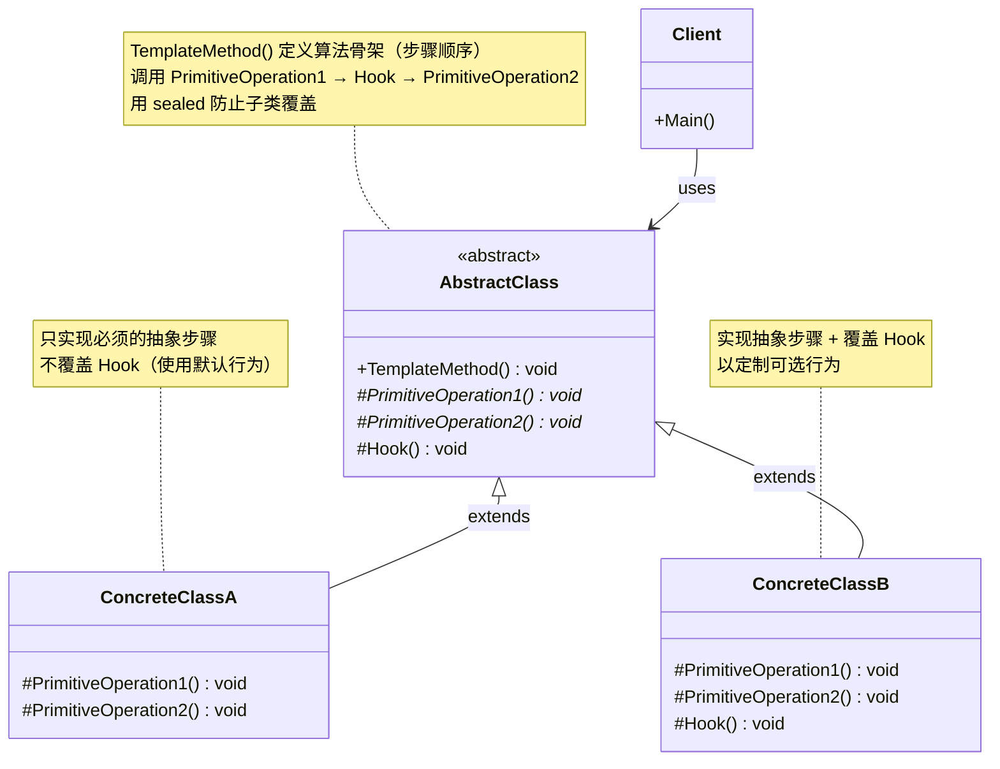
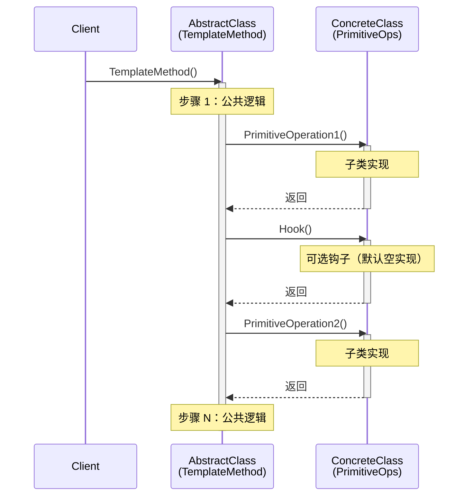

# 模板方法模式 Template Method

> 所属计划: [[design-patterns-csharp|设计模式 (C#)]]
> 预计耗时: 75 分钟
> 前置知识: [[16-behavioral-intro|行为型模式总览]]

---

## 1. 概念讲解

### 为什么需要模板方法？

假设你写一个数据导入系统，支持 CSV、JSON、XML 三种格式。每种格式的处理步骤高度相似：

```csharp
// ❌ 每种格式都拷贝粘贴整个流程
public void ImportCsv(string filePath)
{
    var raw = File.ReadAllText(filePath);         // 读文件
    var data = CsvParser.Parse(raw);              // 解析
    Validate(data);                               // 验证
    foreach (var row in data) SaveToDb(row);      // 保存
    Log($"Imported {data.Length} rows");          // 记录日志
}

public void ImportJson(string filePath)
{
    var raw = File.ReadAllText(filePath);         // 读文件（相同）
    var data = JsonParser.Parse(raw);             // 解析（不同）
    Validate(data);                               // 验证（相同）
    foreach (var row in data) SaveToDb(row);      // 保存（相同）
    Log($"Imported {data.Length} rows");          // 记录日志（相同）
}
```

三个问题：

1. **代码重复**：读文件、验证、保存、日志——四步完全重复
2. **流程不明确**：新人接手后，可能在 JSON 版本里忘了调 `Validate()`，导致数据污染
3. **修改流程时要改 N 处**：在保存前加"去重"步骤 → 三个方法都要改

**模板方法的核心思想**：在基类中定义算法的**骨架**（步骤顺序），把**可变步骤**推迟到子类实现。子类只能填充细节，不能改变骨架。

### 核心结构



**四个关键角色：**

- **`TemplateMethod()`**（模板方法）：定义算法骨架，按**固定顺序**调用各个步骤。在 C# 中用 `sealed` 修饰以防止子类篡改流程。
- **`PrimitiveOperation()`**（原语操作）：抽象方法（`abstract`）——子类**必须**实现。这些是实现点，也是变化点。
- **`Hook()`**（钩子方法）：虚方法（`virtual`）——子类**可选**覆盖。提供默认（通常是空）实现，让子类在特定时机插入逻辑，但不强制。
- **`ConcreteClass`**：实现抽象方法，可选覆盖钩子。不知道骨架的存在——只关注自己的那个步骤。

### 执行流程



**关键洞察**：调用方向是从基类到子类（基类调用子类的方法），而继承方向是从子类到基类。这是**好莱坞原则**（Hollywood Principle）的体现——"Don't call us, we'll call you." 框架/基类掌握控制权，在合适时机回调子类的实现。

### Template Method vs Strategy

两者都封装算法，但封装方式完全不同：

| 维度 | Template Method | [[24-strategy|Strategy]] |
|------|-----------------|----------|
| 复用方式 | **继承** — 子类重写部分步骤 | **组合** — 委托给策略接口 |
| 骨架控制 | 在基类中，子类**不能改**步骤顺序 | 在 Context 中，更换策略即可换整个算法 |
| 代码粒度 | 控制**步骤级别** — 子类决定某个步骤怎么做 | 控制**算法级别** — 客户端切换整个算法族 |
| 运行时切换 | **不能** — 编译时绑定（继承关系固定） | **可以** — 运行时替换策略对象 |
| 耦合度 | 子类继承基类，知道基类的 `protected` 成员 | Context 只依赖策略接口，完全解耦 |
| C# 特性 | `abstract` / `virtual` / `sealed` / `protected` | `interface` / DI 注入 |

> [!tip] 什么时候用哪个？
> **Template Method**：骨架稳定，只有少数步骤变化（如数据导入框架、游戏主循环）。
> **Strategy**：整个算法族需要独立替换（如排序算法、压缩算法）。
> 两者可以组合：Template Method 的某个步骤内部使用 Strategy 来选择具体行为。

### Template Method 与好莱坞原则

好莱坞原则是框架设计的基石：

- **普通调用**：你的代码调用库代码（`Console.WriteLine()`、`File.ReadAllText()`）
- **好莱坞原则**：库/框架在适当时机回调你的代码（`override PrimitiveOperation1()`）

ASP.NET Core 的 `Configure` 方法、XUnit 的 `[Fact]` 标记方法、`BackgroundService.ExecuteAsync`——都是模板方法的变体。框架定义了"何时调用你"，你只负责"被调用时做什么"。

### Template Method 与 Builder 的组合

[[06-builder|Builder 模式]] 的 `Build()` 方法有时也用 Template Method：

```csharp
// Builder 的 Build() 就是模板方法 —— 定义构建骨架
public sealed override Product Build()
{
    BuildPartA();      // → 子类实现
    if (HasOptionalPart) BuildPartB();  // → 钩子控制是否执行
    BuildPartC();      // → 子类实现
    return GetResult();
}
```

---

## 2. 代码示例

### 示例 1：数据加工管道 — ReadData → ProcessData → WriteData

最经典的模板方法场景：ETL 管道（Extract-Transform-Load）。骨架固定为三步，子类决定每步的具体实现。

```csharp
using System;
using System.Collections.Generic;
using System.Linq;

#region 抽象基类 —— 定义骨架

/// <summary>数据加工管道基类：骨架 = 读取 → 加工 → 写入</summary>
public abstract class DataPipeline
{
    // ============================================================
    // Template Method —— sealed 防止子类覆盖骨架
    // ============================================================
    public sealed void Execute()
    {
        Console.WriteLine($"=== [{GetType().Name}] Pipeline Start ===");

        var rawData = ReadData();           // 步骤 1：读取
        var processed = ProcessData(rawData); // 步骤 2：加工
        WriteData(processed);               // 步骤 3：写入

        Console.WriteLine($"=== [{GetType().Name}] Pipeline End ===\n");
    }

    // ---- 原语操作（子类必须实现） ----

    /// <summary>步骤 1：从数据源读取原始数据</summary>
    protected abstract IEnumerable<string> ReadData();

    /// <summary>步骤 2：对数据进行转换/过滤/聚合</summary>
    protected abstract IEnumerable<string> ProcessData(IEnumerable<string> raw);

    /// <summary>步骤 3：将处理后的数据写入目标</summary>
    protected abstract void WriteData(IEnumerable<string> data);

    // ---- 钩子方法（子类可选覆盖） ----

    /// <summary>在读取之前调用 —— 默认空实现</summary>
    protected virtual void OnBeforeRead() { }

    /// <summary>在写入之后调用 —— 默认打印统计信息</summary>
    protected virtual void OnAfterWrite(int itemCount)
    {
        Console.WriteLine($"  [Hook] Processed {itemCount} items total.");
    }
}

#endregion

#region 具体实现：CSV 管道 —— 从字符串数组读取

public class CsvPipeline : DataPipeline
{
    private readonly string[] _source = { " Alice , 100 ", " Bob , 200 ", "Charlie,300" };

    protected override void OnBeforeRead()
    {
        Console.WriteLine("  [Hook] Opening CSV source...");
    }

    protected override IEnumerable<string> ReadData()
    {
        Console.WriteLine("  [Read] Reading from in-memory CSV array...");
        return _source;
    }

    protected override IEnumerable<string> ProcessData(IEnumerable<string> raw)
    {
        Console.WriteLine("  [Process] Trimming whitespace and uppercasing names...");
        return raw.Select(line =>
        {
            var parts = line.Split(',');
            return $"{parts[0].Trim().ToUpper()},{parts[1].Trim()}";
        });
    }

    protected override void WriteData(IEnumerable<string> data)
    {
        Console.WriteLine("  [Write] Outputting to Console:");
        foreach (var item in data)
            Console.WriteLine($"    → {item}");
    }
}

#endregion

#region 具体实现：过滤管道 —— 只保留偶数

public class FilterPipeline : DataPipeline
{
    private readonly int[] _numbers = { 1, 2, 3, 4, 5, 6, 7, 8, 9, 10 };

    protected override IEnumerable<string> ReadData()
    {
        Console.WriteLine("  [Read] Loading number array...");
        return _numbers.Select(n => n.ToString());
    }

    protected override IEnumerable<string> ProcessData(IEnumerable<string> raw)
    {
        Console.WriteLine("  [Process] Filtering: keep only even numbers...");
        return raw.Where(s => int.Parse(s) % 2 == 0);
    }

    protected override void WriteData(IEnumerable<string> data)
    {
        Console.WriteLine("  [Write] Result:");
        Console.WriteLine($"    → [{string.Join(", ", data)}]");
    }

    protected override void OnAfterWrite(int itemCount)
    {
        // 覆盖钩子 —— 添加自定义统计
        Console.WriteLine($"  [Hook] Even numbers found: {itemCount}");
    }
}

#endregion

#region 客户端代码

public static class Program
{
    public static void Main()
    {
        DataPipeline csv = new CsvPipeline();
        csv.Execute();

        DataPipeline filter = new FilterPipeline();
        filter.Execute();
    }
}

#endregion
```

**运行方式：**
```bash
dotnet new console -n TemplateMethodPipeline
# 将上述代码复制到 Program.cs
dotnet run --project TemplateMethodPipeline
```

**预期输出：**
```text
=== [CsvPipeline] Pipeline Start ===
  [Hook] Opening CSV source...
  [Read] Reading from in-memory CSV array...
  [Process] Trimming whitespace and uppercasing names...
  [Write] Outputting to Console:
    → ALICE,100
    → BOB,200
    → CHARLIE,300
  [Hook] Processed 3 items total.
=== [CsvPipeline] Pipeline End ===

=== [FilterPipeline] Pipeline Start ===
  [Read] Loading number array...
  [Process] Filtering: keep only even numbers...
  [Write] Result:
    → [2, 4, 6, 8, 10]
  [Hook] Even numbers found: 5
=== [FilterPipeline] Pipeline End ===
```

> [!tip] 为什么 `Execute()` 用 `sealed`？
> `sealed` 阻止子类重写模板方法。这确保**步骤顺序永远不会被子类篡改**——子类只能重写 `protected` 的原语操作和钩子，不能跳过验证、倒转顺序或插入额外步骤。

### 示例 2：饮料制作 —— BoilWater → Brew → Pour → AddCondiments

GoF 原书中的经典案例，展示钩子方法的威力：咖啡和茶的制作流程几乎相同，只有"冲泡什么"和"加什么调料"不同。

```csharp
using System;

#region 抽象基类

public abstract class Beverage
{
    // Template Method —— 冲泡流程骨架
    public sealed void PrepareRecipe()
    {
        BoilWater();
        Brew();               // ← 抽象：子类决定泡什么
        PourInCup();
        if (CustomerWantsCondiments())  // ← 钩子！控制是否加调料
            AddCondiments();  // ← 抽象：子类决定加什么
    }

    // ---- 公共步骤（基类实现，所有子类共享） ----
    private void BoilWater() => Console.WriteLine("  烧开水");
    private void PourInCup() => Console.WriteLine("  倒入杯中");

    // ---- 原语操作（子类必须实现） ----
    protected abstract void Brew();
    protected abstract void AddCondiments();

    // ---- 钩子方法（子类可选覆盖，默认返回 true） ----
    protected virtual bool CustomerWantsCondiments() => true;
}

#endregion

#region 具体饮料

public class Coffee : Beverage
{
    protected override void Brew() => Console.WriteLine("  用沸水冲泡咖啡粉");
    protected override void AddCondiments() => Console.WriteLine("  加糖和牛奶");
    // 不覆盖钩子 = 默认加调料
}

public class Tea : Beverage
{
    protected override void Brew() => Console.WriteLine("  用沸水浸泡茶叶");
    protected override void AddCondiments() => Console.WriteLine("  加柠檬");

    // 覆盖钩子 —— 询问用户是否要调料
    protected override bool CustomerWantsCondiments()
    {
        Console.Write("  要加柠檬吗？(y/n): ");
        var input = Console.ReadLine();
        return input?.Trim().ToLower() == "y";
    }
}

public class BlackCoffee : Beverage
{
    protected override void Brew() => Console.WriteLine("  用沸水冲泡深度烘焙咖啡粉");
    protected override void AddCondiments() { /* 永远不会被调用 */ }

    // 覆盖钩子 —— 永远不加调料
    protected override bool CustomerWantsCondiments() => false;
}

#endregion

#region 客户端

public static class Program
{
    public static void Main()
    {
        Console.WriteLine("--- 制作咖啡 ---");
        new Coffee().PrepareRecipe();

        Console.WriteLine("\n--- 制作红茶 ---");
        new Tea().PrepareRecipe();

        Console.WriteLine("\n--- 制作黑咖啡 ---");
        new BlackCoffee().PrepareRecipe();
    }
}

#endregion
```

**运行方式：**
```bash
dotnet new console -n TemplateMethodBeverage
# 将上述代码复制到 Program.cs
dotnet run --project TemplateMethodBeverage
```

**预期输出（假设用户对 Tea 输入 "n"）：**
```text
--- 制作咖啡 ---
  烧开水
  用沸水冲泡咖啡粉
  倒入杯中
  加糖和牛奶

--- 制作红茶 ---
  烧开水
  用沸水浸泡茶叶
  倒入杯中
  要加柠檬吗？(y/n): n

--- 制作黑咖啡 ---
  烧开水
  用沸水冲泡深度烘焙咖啡粉
  倒入杯中
```

钩子的威力：`BlackCoffee` 只需覆盖 `CustomerWantsCondiments` 返回 `false`，就能跳过 `AddCondiments`——无需修改基类的模板方法，无需修改 `Coffee` 或 `Tea`。这是**开闭原则**的体现：对扩展开放（新饮料只需继承），对修改关闭（基类骨架不变）。

### 示例 3：.NET 框架中的模板方法

.NET 自身大量使用模板方法。以下是三个真实案例的精简模拟：

```csharp
using System;
using System.Threading;
using System.Threading.Tasks;

#region 案例 A：Stream —— 只需要重写 Read/Write，基类处理所有组合操作

/// <summary>模拟 Stream 的模板方法设计</summary>
public abstract class MyStream
{
    // Template Method —— 所有组合操作都调用原语 Read/Write
    public int ReadByte()
    {
        var buffer = new byte[1];
        var read = Read(buffer, 0, 1);
        return read == 0 ? -1 : buffer[0];
    }

    public void CopyTo(MyStream destination)
    {
        var buffer = new byte[4096];
        int bytesRead;
        while ((bytesRead = Read(buffer, 0, buffer.Length)) > 0)
            destination.Write(buffer, 0, bytesRead);
    }

    // 原语操作 —— 子类只需实现这两个
    protected abstract int Read(byte[] buffer, int offset, int count);
    protected abstract void Write(byte[] buffer, int offset, int count);
}

// 子类实现（如 MemoryStream）只需重写 Read/Write
public class MyMemoryStream : MyStream
{
    private readonly byte[] _data;
    private int _position;

    public MyMemoryStream(byte[] data) => _data = data;

    protected override int Read(byte[] buffer, int offset, int count)
    {
        var remaining = _data.Length - _position;
        var toRead = Math.Min(remaining, count);
        Array.Copy(_data, _position, buffer, offset, toRead);
        _position += toRead;
        return toRead;
    }

    protected override void Write(byte[] buffer, int offset, int count)
        => throw new NotSupportedException("Read-only stream");
}

#endregion

#region 案例 B：BackgroundService —— ExecuteAsync 就是模板方法

/// <summary>模拟 Microsoft.Extensions.Hosting.BackgroundService</summary>
public abstract class MyBackgroundService
{
    private readonly CancellationTokenSource _cts = new();

    // Template Method —— 框架控制生命周期
    public async Task StartAsync(CancellationToken cancellationToken = default)
    {
        Console.WriteLine($"[{GetType().Name}] Starting...");
        try
        {
            await ExecuteAsync(_cts.Token);
        }
        catch (OperationCanceledException)
        {
            Console.WriteLine($"[{GetType().Name}] Stopped gracefully.");
        }
    }

    public void Stop() => _cts.Cancel();

    // 原语操作 —— 你只需实现这个
    protected abstract Task ExecuteAsync(CancellationToken stoppingToken);
}

public class TimerService : MyBackgroundService
{
    protected override async Task ExecuteAsync(CancellationToken stoppingToken)
    {
        while (!stoppingToken.IsCancellationRequested)
        {
            Console.WriteLine($"[TimerService] Tick at {DateTime.Now:HH:mm:ss}");
            await Task.Delay(1000, stoppingToken);
        }
    }
}

#endregion

#region 案例 C：自定义测试基类 —— Setup / Teardown 模板

/// <summary>模拟测试框架的 TestCase 基类</summary>
public abstract class TestCase
{
    // Template Method —— 固定测试生命周期
    public sealed void Run()
    {
        var name = GetType().Name;
        Console.WriteLine($"\n--- [{name}] ---");
        SetUp();
        try
        {
            RunTest();
            Console.WriteLine($"  ✅ PASSED");
        }
        catch (Exception ex)
        {
            Console.WriteLine($"  ❌ FAILED: {ex.Message}");
        }
        finally
        {
            TearDown();
        }
    }

    // 钩子 —— 默认空实现
    protected virtual void SetUp() { }
    protected virtual void TearDown() { }

    // 原语操作
    protected abstract void RunTest();
}

public class DatabaseTest : TestCase
{
    protected override void SetUp()
        => Console.WriteLine("  [SetUp] Opening DB connection...");

    protected override void RunTest()
        => Console.WriteLine("  [Test] Running query...");

    protected override void TearDown()
        => Console.WriteLine("  [TearDown] Closing DB connection...");
}

public class SimpleCalculationTest : TestCase
{
    // 不需要 SetUp/TearDown —— 钩子默认空实现即可
    protected override void RunTest()
    {
        var result = 2 + 2;
        if (result != 4) throw new Exception($"Expected 4, got {result}");
        Console.WriteLine("  [Test] 2 + 2 = 4");
    }
}

#endregion

#region 运行入口

public static class Program
{
    public static async Task Main()
    {
        // Stream 案例
        var source = new MyMemoryStream(new byte[] { 0x48, 0x65, 0x6C, 0x6C, 0x6F });
        var dest = new MyMemoryStream(new byte[5]);
        source.CopyTo(dest);
        Console.WriteLine("Stream.CopyTo executed successfully.");

        // BackgroundService 案例
        var timer = new TimerService();
        var timerTask = timer.StartAsync();
        await Task.Delay(2500);  // 让它 tick 2 次
        timer.Stop();
        await timerTask;

        // TestCase 案例
        new DatabaseTest().Run();
        new SimpleCalculationTest().Run();
    }
}

#endregion
```

**运行方式：**
```bash
dotnet new console -n TemplateMethodDotNet
# 将上述代码复制到 Program.cs
dotnet run --project TemplateMethodDotNet
```

**预期输出（TimerService 的输出时间取决于实际运行时刻）：**
```text
Stream.CopyTo executed successfully.
[TimerService] Starting...
[TimerService] Tick at 14:30:01
[TimerService] Tick at 14:30:02
[TimerService] Stopped gracefully.

--- [DatabaseTest] ---
  [SetUp] Opening DB connection...
  [Test] Running query...
  ✅ PASSED
  [TearDown] Closing DB connection...

--- [SimpleCalculationTest] ---
  [Test] 2 + 2 = 4
  ✅ PASSED
```

### 示例 4：Strategy + Builder 替代继承式 Template Method

继承式 Template Method 的最大缺陷是**编译时绑定**——一旦 `Coffee : Beverage`，就永远只能是 Coffee。如果需要运行时动态组合步骤，用 **Strategy + Builder** 更好：

```csharp
using System;
using System.Collections.Generic;

#region Strategy 接口 —— 每个步骤一个策略

public interface IStep
{
    string Name { get; }
    void Execute();
}

#endregion

#region 具体步骤实现

public class BoilWaterStep : IStep
{
    public string Name => "烧开水";
    public void Execute() => Console.WriteLine("  烧开水");
}

public class BrewCoffeeStep : IStep
{
    public string Name => "冲泡咖啡";
    public void Execute() => Console.WriteLine("  用沸水冲泡咖啡粉");
}

public class BrewTeaStep : IStep
{
    public string Name => "浸泡茶叶";
    public void Execute() => Console.WriteLine("  用沸水浸泡茶叶");
}

public class PourInCupStep : IStep
{
    public string Name => "倒入杯中";
    public void Execute() => Console.WriteLine("  倒入杯中");
}

public class AddSugarMilkStep : IStep
{
    public string Name => "加糖和牛奶";
    public void Execute() => Console.WriteLine("  加糖和牛奶");
}

public class AddLemonStep : IStep
{
    public string Name => "加柠檬";
    public void Execute() => Console.WriteLine("  加柠檬");
}

#endregion

#region Builder —— 用 Fluent API 组装步骤

public class BeverageBuilder
{
    private readonly List<IStep> _steps = new();

    public BeverageBuilder AddStep(IStep step)
    {
        _steps.Add(step);
        return this;
    }

    /// <summary>添加条件步骤：只在 condition 为 true 时执行</summary>
    public BeverageBuilder AddStepIf(bool condition, IStep step)
    {
        if (condition) _steps.Add(step);
        return this;
    }

    public BeverageRecipe Build() => new(_steps);
}

#endregion

#region Recipe —— 不可变的饮料配方

public class BeverageRecipe
{
    private readonly List<IStep> _steps;

    public BeverageRecipe(List<IStep> steps) => _steps = steps;

    public void Prepare()
    {
        Console.WriteLine($"--- 制作饮料 ({_steps.Count} 步) ---");
        foreach (var step in _steps)
        {
            step.Execute();
        }
    }
}

#endregion

#region 工厂方法 —— 预定义常见配方

public static class BeverageRecipes
{
    public static BeverageRecipe Coffee(bool withCondiments = true)
        => new BeverageBuilder()
            .AddStep(new BoilWaterStep())
            .AddStep(new BrewCoffeeStep())
            .AddStep(new PourInCupStep())
            .AddStepIf(withCondiments, new AddSugarMilkStep())
            .Build();

    public static BeverageRecipe Tea(bool withCondiments = true)
        => new BeverageBuilder()
            .AddStep(new BoilWaterStep())
            .AddStep(new BrewTeaStep())
            .AddStep(new PourInCupStep())
            .AddStepIf(withCondiments, new AddLemonStep())
            .Build();

    // 运行时动态组合 —— Template Method 做不到！
    public static BeverageRecipe CustomBeverage(params IStep[] steps)
        => new BeverageBuilder
        {
            // 用集合初始化器逐个添加
        }
        .Build(); // 实际使用中在 builder 里逐次 AddStep
}

#endregion

#region 客户端

public static class Program
{
    public static void Main()
    {
        // 预定义配方
        BeverageRecipes.Coffee(withCondiments: true).Prepare();
        Console.WriteLine();

        // 运行时动态组合：混合咖啡 + 柠檬？！Template Method 做不到
        var weird = new BeverageBuilder()
            .AddStep(new BoilWaterStep())
            .AddStep(new BrewCoffeeStep())
            .AddStep(new PourInCupStep())
            .AddStep(new AddLemonStep())  // 咖啡加柠檬 —— 只有 Builder 能做到
            .Build();
        weird.Prepare();
    }
}

#endregion
```

**运行方式：**
```bash
dotnet new console -n TemplateMethodStrategy
# 将上述代码复制到 Program.cs
dotnet run --project TemplateMethodStrategy
```

**预期输出：**
```text
--- 制作饮料 (4 步) ---
  烧开水
  用沸水冲泡咖啡粉
  倒入杯中
  加糖和牛奶

--- 制作饮料 (4 步) ---
  烧开水
  用沸水冲泡咖啡粉
  倒入杯中
  加柠檬
```

> [!tip] Template Method vs Strategy+Builder：取舍指南
> **Template Method** 适用：骨架极度稳定（5 年不改），变体少且固定（2-3 种子类），需要 `protected` 成员共享状态。
> **Strategy+Builder** 适用：步骤需要运行时动态组合，步骤族需要独立单元测试，需要跨类共享步骤逻辑（组合优于继承）。

---


## C++ 实现

C++ 中模板方法模式自然映射到虚函数：用 `virtual` 声明原语操作，`final` 修饰模板方法防止子类覆盖骨架。NVI (Non-Virtual Interface) 是 C++ 惯用法 — 公开的非虚接口调用私有虚函数，分离"做什么"与"怎么做"。

```cpp
#include <iostream>
#include <vector>
#include <string>
#include <algorithm>

using namespace std;
// ============================================
// 1. 抽象基类 — 定义骨架（NVI 惯用法）
// ============================================
class DataPipeline {
public:
    virtual ~DataPipeline() = default;

    // 模板方法 — final 禁止子类覆盖骨架
    void Execute() /* final */ {   // C++11 final
        cout << "=== [" << ClassName() << "] Pipeline Start ===" << endl;

        OnBeforeRead();                  // 钩子：可选的预处理
        auto rawData = ReadData();       // 原语 1：读取
        auto processed = ProcessData(rawData); // 原语 2：加工
        WriteData(processed);            // 原语 3：写入
        OnAfterWrite(static_cast<int>(processed.size())); // 钩子：可选的收尾

        cout << "=== [" << ClassName() << "] Pipeline End ===" << endl << endl;
    }

protected:
    // ---- 原语操作（子类必须实现） ----
    virtual vector<string> ReadData() = 0;
    virtual vector<string> ProcessData(const vector<string>& raw) = 0;
    virtual void WriteData(const vector<string>& data) = 0;

    // ---- 钩子方法（子类可选覆盖） ----
    virtual void OnBeforeRead() {}  // 默认空实现
    virtual void OnAfterWrite(int itemCount) {
        cout << "  [Hook] Processed " << itemCount << " items total." << endl;
    }

    // 辅助：子类返回自己的类名
    virtual string ClassName() const = 0;
};
// ============================================
// 2. 具体实现：CSV 数据处理
// ============================================
class CsvPipeline : public DataPipeline {
    const vector<string> source_ = {" Alice , 100 ", " Bob , 200 ", "Charlie,300"};

    string ClassName() const override { return "CsvPipeline"; }

    void OnBeforeRead() override {
        cout << "  [Hook] Opening CSV source..." << endl;
    }

    vector<string> ReadData() override {
        cout << "  [Read] Reading from in-memory CSV array..." << endl;
        return source_;
    }

    vector<string> ProcessData(const vector<string>& raw) override {
        cout << "  [Process] Trimming and uppercasing..." << endl;
        vector<string> result;
        for (const auto& line : raw) {
            auto comma = line.find(',');
            auto name = line.substr(0, comma);
            auto value = line.substr(comma + 1);
            // trim whitespace
            name.erase(0, name.find_first_not_of(" \t"));
            name.erase(name.find_last_not_of(" \t") + 1);
            value.erase(0, value.find_first_not_of(" \t"));
            value.erase(value.find_last_not_of(" \t") + 1);
            // uppercase name
            transform(name.begin(), name.end(), name.begin(), ::toupper);
            result.push_back(name + "," + value);
        }
        return result;
    }

    void WriteData(const vector<string>& data) override {
        cout << "  [Write] Outputting to Console:" << endl;
        for (const auto& item : data)
            cout << "    -> " << item << endl;
    }
};
// ============================================
// 3. 具体实现：过滤管道 — 只保留偶数
// ============================================
class FilterPipeline : public DataPipeline {
    const vector<int> numbers_ = {1, 2, 3, 4, 5, 6, 7, 8, 9, 10};
    string ClassName() const override { return "FilterPipeline"; }
    vector<string> ReadData() override {
        cout << "  [Read] Loading number array..." << endl;
        vector<string> result;
        for (int n : numbers_) result.push_back(to_string(n));
        return result;
    }

    vector<string> ProcessData(const vector<string>& raw) override {
        cout << "  [Process] Filtering: keep only even numbers..." << endl;
        vector<string> result;
        for (const auto& s : raw)
            if (stoi(s) % 2 == 0) result.push_back(s);
        return result;
    }

    void WriteData(const vector<string>& data) override {
        cout << "  [Write] Result: [" << flush;
        for (size_t i = 0; i < data.size(); ++i) {
            if (i > 0) cout << ", ";
            cout << data[i];
        }
        cout << "]" << endl;
    }

    void OnAfterWrite(int itemCount) override {
        cout << "  [Hook] Even numbers found: " << itemCount << endl;
    }
};
// ============================================
// 4. 使用示例
// ============================================
int main() {
    CsvPipeline csv;
    csv.Execute();

    FilterPipeline filter;
    filter.Execute();

    return 0;
}
```

```bash
# 编译运行
g++ -std=c++17 -o template_demo main.cpp && ./template_demo
```

> **C++ 核心要点**：
> - **NVI (Non-Virtual Interface)**：`Execute()` 是公开的非虚函数，调用 `protected` 的虚函数 — 这正是 C++ 社区推荐的惯用法：公开接口不变，内部实现可定制
> - **`/* final */`**：C++11 起支持，标记模板方法防止子类恶意覆盖骨架。如果所有子类都需要 sealed 行为，使用 `final`
> - **`= 0` (pure virtual)**：强制子类实现，等价于 C# 的 `abstract`
> - **`override`**：C++11 关键字，编译器验证确实覆盖了基类虚函数 — 避免签名错误导致的意外隐藏
> - **默认钩子**：`virtual void OnBeforeRead() {}` 提供空实现，子类可选覆盖 — 比 C# 更灵活（C# 需要用 `virtual` + 空 body）

---
## 3. 练习

### 练习 1：实现多格式报表生成器

设计一个报表生成框架，使用 Template Method 模式。基类 `ReportGenerator` 定义生成骨架：

```
GatherData → FormatHeader → FormatBody → FormatFooter → Output
```

**要求：**

1. 实现三个子类：
   - `PdfReportGenerator`：输出 `[PDF]` 标记的内容（模拟，实际不生成 PDF 文件）
   - `HtmlReportGenerator`：输出带 `<html>`/`<table>` 标签的 HTML 内容
   - `CsvReportGenerator`：输出逗号分隔值，标题行 + 数据行

2. `FormatHeader` 和 `FormatFooter` 是**钩子方法**（`virtual`）——PDF 和 HTML 需要页眉页脚，CSV 不需要（默认空实现即可）

3. `GatherData` 返回以下数据（所有子类共享）：
   ```
   Name: Alice, Score: 95
   Name: Bob, Score: 87
   Name: Charlie, Score: 92
   ```

4. `Output` 方法将格式化后的内容打印到控制台

**参考实现框架：**

```csharp
public abstract class ReportGenerator
{
    // Template Method
    public sealed void Generate()
    {
        var data = GatherData();
        var output = new System.Text.StringBuilder();

        var header = FormatHeader();
        if (header != null) output.AppendLine(header);

        output.AppendLine(FormatBody(data));

        var footer = FormatFooter();
        if (footer != null) output.AppendLine(footer);

        Output(output.ToString());
    }

    // 原语操作
    protected abstract List<(string Name, int Score)> GatherData();
    protected abstract string FormatBody(List<(string Name, int Score)> data);

    // 钩子
    protected virtual string? FormatHeader() => null;
    protected virtual string? FormatFooter() => null;

    // 公共方法
    protected virtual void Output(string content) => Console.WriteLine(content);
}
```

### 练习 2：添加钩子方法（可选步骤）

在练习 1 的报表系统中添加以下钩子方法：

1. **`ShouldIncludeSummary()`**：钩子，默认返回 `true`。如果为 `true`，在页脚前插入统计摘要行（平均分、最高分、最低分）。CSV 格式覆盖此钩子返回 `false`（CSV 通常不含摘要）。

2. **`ShouldSortData()`**：钩子，默认返回 `true`。如果为 `true`，在格式化之前按分数降序排列数据。PDF 和 HTML 覆盖返回 `true`，CSV 返回 `false`（保持原始顺序）。

3. **`OnBeforeOutput(string content)`**：钩子，默认空实现。HTML 格式覆盖它来添加 `<!DOCTYPE html>` 前缀。

**验证方式**：运行三次 `Generate()`，确认 PDF/HTML/CSV 输出分别符合预期格式、排序和摘要规则。

### 练习 3：将练习 1 重构为 Strategy + Builder 模式

将练习 1 中基于继承的报表系统重构为**组合式**设计：

**要求：**

1. 将每个步骤定义为 `IReportStep` 接口：

```csharp
public interface IReportStep
{
    string Name { get; }
    object? Execute(object? context);
}
```

2. 用 `ReportPipelineBuilder`（Fluent API）组装步骤：

```csharp
var pdfReport = new ReportPipelineBuilder()
    .AddStep(new GatherDataStep(/* ... */))
    .AddStep(new SortDataStep())
    .AddStep(new PdfHeaderStep())
    .AddStep(new PdfBodyStep())
    .AddStep(new SummaryStep())
    .AddStep(new PdfFooterStep())
    .AddStep(new OutputStep())
    .Build();
```

3. 实现 `ReportPipeline` 类（替代原来的抽象基类），它持有一个 `List<IReportStep>` 并按顺序执行

4. 实现三种报表的工厂方法：

```csharp
public static class ReportFactory
{
    public static ReportPipeline Pdf() => /* ... */;
    public static ReportPipeline Html() => /* ... */;
    public static ReportPipeline Csv() => /* ... */;
}
```

**思考题**：重构后，模板方法骨架的控制反转（IoC）特性是否丢失了？如果丢失了，如何补救？（提示：`ReportPipeline` 本身仍然控制执行顺序——只是步骤变成了可注入的对象而非写死在基类中。）

---


## 3.5 参考答案

> [!tip]- 练习 1 参考答案：多格式报表生成器
> ```csharp
> using System.Text;
>
> public abstract class ReportGenerator
> {
>     public sealed void Generate()
>     {
>         var data = GatherData();
>         var output = new StringBuilder();
>
>         var header = FormatHeader();
>         if (header != null) output.AppendLine(header);
>
>         output.AppendLine(FormatBody(data));
>
>         var footer = FormatFooter();
>         if (footer != null) output.AppendLine(footer);
>
>         Output(output.ToString());
>     }
>
>     protected abstract List<(string Name, int Score)> GatherData();
>     protected abstract string FormatBody(List<(string Name, int Score)> data);
>     protected virtual string? FormatHeader() => null;
>     protected virtual string? FormatFooter() => null;
>     protected virtual void Output(string content) => Console.WriteLine(content);
> }
>
> public class PdfReportGenerator : ReportGenerator
> {
>     protected override List<(string Name, int Score)> GatherData()
>         => new() { ("Alice", 95), ("Bob", 87), ("Charlie", 92) };
>
>     protected override string? FormatHeader() => "[PDF] ===== Report Header =====";
>
>     protected override string FormatBody(List<(string Name, int Score)> data)
>     {
>         var sb = new StringBuilder();
>         sb.AppendLine("[PDF] Name\tScore");
>         sb.AppendLine("[PDF] ----\t-----");
>         foreach (var (name, score) in data)
>             sb.AppendLine($"[PDF] {name}\t{score}");
>         return sb.ToString();
>     }
>
>     protected override string? FormatFooter() => "[PDF] ===== Report Footer =====";
> }
>
> public class HtmlReportGenerator : ReportGenerator
> {
>     protected override List<(string Name, int Score)> GatherData()
>         => new() { ("Alice", 95), ("Bob", 87), ("Charlie", 92) };
>
>     protected override string? FormatHeader()
>         => "<html><head><title>Score Report</title></head><body>";
>
>     protected override string FormatBody(List<(string Name, int Score)> data)
>     {
>         var sb = new StringBuilder();
>         sb.AppendLine("<table border=\"1\">");
>         sb.AppendLine("  <tr><th>Name</th><th>Score</th></tr>");
>         foreach (var (name, score) in data)
>             sb.AppendLine($"  <tr><td>{name}</td><td>{score}</td></tr>");
>         sb.AppendLine("</table>");
>         return sb.ToString();
>     }
>
>     protected override string? FormatFooter() => "</body></html>";
> }
>
> public class CsvReportGenerator : ReportGenerator
> {
>     protected override List<(string Name, int Score)> GatherData()
>         => new() { ("Alice", 95), ("Bob", 87), ("Charlie", 92) };
>
>     protected override string FormatBody(List<(string Name, int Score)> data)
>     {
>         var sb = new StringBuilder();
>         sb.AppendLine("Name,Score");
>         foreach (var (name, score) in data)
>             sb.AppendLine($"{name},{score}");
>         return sb.ToString();
>     }
> }
>
> // 测试：
> // new PdfReportGenerator().Generate();
> // new HtmlReportGenerator().Generate();
> // new CsvReportGenerator().Generate();
> ```

> [!tip]- 练习 2 参考答案：添加钩子方法
> ```csharp
> // 在基类 ReportGenerator 中添加三个钩子，并修改 Generate() 使用它们：
>
> public abstract class ReportGenerator
> {
>     public sealed void Generate()
>     {
>         var data = GatherData();
>
>         // 钩子 2：排序
>         if (ShouldSortData())
>             data = data.OrderByDescending(d => d.Score).ToList();
>
>         var output = new StringBuilder();
>
>         var header = FormatHeader();
>         if (header != null) output.AppendLine(header);
>
>         output.AppendLine(FormatBody(data));
>
>         // 钩子 1：统计摘要
>         if (ShouldIncludeSummary() && data.Count > 0)
>         {
>             var avg = data.Average(d => (double)d.Score);
>             var max = data.Max(d => d.Score);
>             var min = data.Min(d => d.Score);
>             output.AppendLine($"--- Summary: Avg={avg:F1}, Max={max}, Min={min} ---");
>         }
>
>         var footer = FormatFooter();
>         if (footer != null) output.AppendLine(footer);
>
>         // 钩子 3：输出前处理
>         var finalContent = OnBeforeOutput(output.ToString());
>         Output(finalContent);
>     }
>
>     // ... 原有 abstract/virtual 方法不变 ...
>
>     // 新增钩子
>     protected virtual bool ShouldIncludeSummary() => true;
>     protected virtual bool ShouldSortData() => true;
>     protected virtual string OnBeforeOutput(string content) => content;
> }
>
> // CSV 覆盖：不排序、不含摘要
> public class CsvReportGeneratorV2 : ReportGenerator
> {
>     // GatherData / FormatBody 同练习 1 ...
>     protected override bool ShouldSortData() => false;
>     protected override bool ShouldIncludeSummary() => false;
>
>     protected override List<(string Name, int Score)> GatherData()
>         => new() { ("Alice", 95), ("Bob", 87), ("Charlie", 92) };
>
>     protected override string FormatBody(List<(string Name, int Score)> data)
>     {
>         var sb = new StringBuilder();
>         sb.AppendLine("Name,Score");
>         foreach (var (name, score) in data)
>             sb.AppendLine($"{name},{score}");
>         return sb.ToString();
>     }
> }
>
> // HTML 覆盖 OnBeforeOutput：添加 DOCTYPE
> public class HtmlReportGeneratorV2 : HtmlReportGenerator
> {
>     protected override string OnBeforeOutput(string content)
>         => "<!DOCTYPE html>\n" + content;
> }
>
> // PDF 使用默认钩子行为（排序 + 摘要 + 无 DOCTYPE）
> ```

> [!tip]- 练习 3 参考答案：重构为 Strategy + Builder
> ```csharp
> // ============================================
> // IReportStep 接口
> // ============================================
> public interface IReportStep
> {
>     string Name { get; }
>     object? Execute(object? context);
> }
>
> // ============================================
> // ReportContext — 在步骤之间传递状态
> // ============================================
> public class ReportContext
> {
>     public List<(string Name, int Score)> RawData { get; set; } = new();
>     public List<(string Name, int Score)> ProcessedData { get; set; } = new();
>     public StringBuilder Output { get; set; } = new();
> }
>
> // ============================================
> // 具体步骤
> // ============================================
> public class GatherDataStep : IReportStep
> {
>     private readonly List<(string Name, int Score)> _data;
>     public string Name => "GatherData";
>     public GatherDataStep(List<(string Name, int Score)> data) => _data = data;
>     public object? Execute(object? context)
>     {
>         var ctx = (ReportContext)context!;
>         ctx.RawData = new List<(string, int)>(_data);
>         ctx.ProcessedData = ctx.RawData;
>         return ctx;
>     }
> }
>
> public class SortDataStep : IReportStep
> {
>     public string Name => "SortData";
>     public object? Execute(object? context)
>     {
>         var ctx = (ReportContext)context!;
>         ctx.ProcessedData = ctx.ProcessedData
>             .OrderByDescending(d => d.Score).ToList();
>         return ctx;
>     }
> }
>
> public class PdfHeaderStep : IReportStep
> {
>     public string Name => "PdfHeader";
>     public object? Execute(object? context)
>     {
>         var ctx = (ReportContext)context!;
>         ctx.Output.AppendLine("[PDF] ===== Report Header =====");
>         return ctx;
>     }
> }
>
> public class HtmlHeaderStep : IReportStep
> {
>     public string Name => "HtmlHeader";
>     public object? Execute(object? context)
>     {
>         var ctx = (ReportContext)context!;
>         ctx.Output.AppendLine("<html><head><title>Score Report</title></head><body>");
>         return ctx;
>     }
> }
>
> public class PdfBodyStep : IReportStep
> {
>     public string Name => "PdfBody";
>     public object? Execute(object? context)
>     {
>         var ctx = (ReportContext)context!;
>         ctx.Output.AppendLine("[PDF] Name\tScore");
>         ctx.Output.AppendLine("[PDF] ----\t-----");
>         foreach (var (name, score) in ctx.ProcessedData)
>             ctx.Output.AppendLine($"[PDF] {name}\t{score}");
>         return ctx;
>     }
> }
>
> public class HtmlBodyStep : IReportStep
> {
>     public string Name => "HtmlBody";
>     public object? Execute(object? context)
>     {
>         var ctx = (ReportContext)context!;
>         ctx.Output.AppendLine("<table border=\"1\">");
>         ctx.Output.AppendLine("  <tr><th>Name</th><th>Score</th></tr>");
>         foreach (var (name, score) in ctx.ProcessedData)
>             ctx.Output.AppendLine($"  <tr><td>{name}</td><td>{score}</td></tr>");
>         ctx.Output.AppendLine("</table>");
>         return ctx;
>     }
> }
>
> public class CsvBodyStep : IReportStep
> {
>     public string Name => "CsvBody";
>     public object? Execute(object? context)
>     {
>         var ctx = (ReportContext)context!;
>         ctx.Output.AppendLine("Name,Score");
>         foreach (var (name, score) in ctx.ProcessedData)
>             ctx.Output.AppendLine($"{name},{score}");
>         return ctx;
>     }
> }
>
> public class SummaryStep : IReportStep
> {
>     public string Name => "Summary";
>     public object? Execute(object? context)
>     {
>         var ctx = (ReportContext)context!;
>         var data = ctx.ProcessedData;
>         if (data.Count == 0) return ctx;
>         var avg = data.Average(d => (double)d.Score);
>         var max = data.Max(d => d.Score);
>         var min = data.Min(d => d.Score);
>         ctx.Output.AppendLine($"--- Summary: Avg={avg:F1}, Max={max}, Min={min} ---");
>         return ctx;
>     }
> }
>
> public class PdfFooterStep : IReportStep
> {
>     public string Name => "PdfFooter";
>     public object? Execute(object? context)
>     {
>         var ctx = (ReportContext)context!;
>         ctx.Output.AppendLine("[PDF] ===== Report Footer =====");
>         return ctx;
>     }
> }
>
> public class HtmlFooterStep : IReportStep
> {
>     public string Name => "HtmlFooter";
>     public object? Execute(object? context)
>     {
>         var ctx = (ReportContext)context!;
>         ctx.Output.AppendLine("</body></html>");
>         return ctx;
>     }
> }
>
> public class HtmlDoctypeStep : IReportStep
> {
>     public string Name => "HtmlDoctype";
>     public object? Execute(object? context)
>     {
>         var ctx = (ReportContext)context!;
>         ctx.Output.Insert(0, "<!DOCTYPE html>\n");
>         return ctx;
>     }
> }
>
> public class OutputStep : IReportStep
> {
>     public string Name => "Output";
>     public object? Execute(object? context)
>     {
>         var ctx = (ReportContext)context!;
>         Console.WriteLine(ctx.Output.ToString());
>         return ctx;
>     }
> }
>
> // ============================================
> // ReportPipeline + Builder
> // ============================================
> public class ReportPipeline
> {
>     private readonly List<IReportStep> _steps;
>     public ReportPipeline(List<IReportStep> steps) => _steps = steps;
>
>     public void Execute()
>     {
>         object? context = new ReportContext();
>         foreach (var step in _steps)
>         {
>             Console.WriteLine($"  [Step] {step.Name}");
>             context = step.Execute(context);
>         }
>     }
> }
>
> public class ReportPipelineBuilder
> {
>     private readonly List<IReportStep> _steps = new();
>     public ReportPipelineBuilder AddStep(IReportStep step)
>     {
>         _steps.Add(step);
>         return this;
>     }
>     public ReportPipeline Build() => new(_steps);
> }
>
> // ============================================
> // ReportFactory
> // ============================================
> public static class ReportFactory
> {
>     private static readonly List<(string, int)> DefaultData
>         = new() { ("Alice", 95), ("Bob", 87), ("Charlie", 92) };
>
>     public static ReportPipeline Pdf(List<(string, int)>? data = null)
>         => new ReportPipelineBuilder()
>             .AddStep(new GatherDataStep(data ?? DefaultData))
>             .AddStep(new SortDataStep())
>             .AddStep(new PdfHeaderStep())
>             .AddStep(new PdfBodyStep())
>             .AddStep(new SummaryStep())
>             .AddStep(new PdfFooterStep())
>             .AddStep(new OutputStep())
>             .Build();
>
>     public static ReportPipeline Html(List<(string, int)>? data = null)
>         => new ReportPipelineBuilder()
>             .AddStep(new GatherDataStep(data ?? DefaultData))
>             .AddStep(new SortDataStep())
>             .AddStep(new HtmlHeaderStep())
>             .AddStep(new HtmlBodyStep())
>             .AddStep(new SummaryStep())
>             .AddStep(new HtmlFooterStep())
>             .AddStep(new HtmlDoctypeStep())
>             .AddStep(new OutputStep())
>             .Build();
>
>     public static ReportPipeline Csv(List<(string, int)>? data = null)
>         => new ReportPipelineBuilder()
>             .AddStep(new GatherDataStep(data ?? DefaultData))
>             .AddStep(new CsvBodyStep())
>             .AddStep(new OutputStep())
>             .Build();
> }
> ```
>
> **思考题回答：**
>
> 重构后，Template Method 的控制反转（IoC）特性**形式上丢失了**——原来基类通过 `sealed Generate()` 强制所有子类走同一个骨架；现在 `ReportPipeline` 的步骤列表可变，没有编译期约束。
>
> **补救方法：**
> 1. `ReportPipeline.Execute()` 本身仍控制执行顺序 —— 通过工厂方法（`ReportFactory.Pdf()`）而非自由拼装来创建 Pipeline，执行顺序就是受控的
> 2. 可在 `Build()` 中验证步骤完整性（必须有 Gather → Format → Output 等关键步骤），提供运行期保证
> 3. 二者不冲突：Template Method 和 Strategy/Builder 可组合 —— Template Method 保证骨架，Builder 负责装配步骤 —— 见 ASP.NET Core Middleware Pipeline

> [!note] 答案使用方式
> 先独立完成练习，再展开查看参考答案。参考答案不是唯一解——如果你的实现通过了测试或达到了题目要求，就是正确的。

## 4. 扩展阅读

### 相关模式

- [[16-behavioral-intro|行为型模式总览]] — 十一种行为型模式的对比和选择指南
- [[24-strategy|Strategy 策略模式]] — Template Method 用继承封装算法骨架，Strategy 用组合封装整个算法族。详见本文 1.4 节对比
- [[06-builder|Builder 建造者模式]] — Builder 的 `Build()` 方法经常就是模板方法；Builder 本身也可以替代继承式 Template Method（见示例 4）
- [[04-factory-method|Factory Method 工厂方法]] — 工厂方法是模板方法的一个特例：骨架 = 创建对象的流程，原语 = 具体创建哪种对象

### .NET 中的模板方法实例

- **`System.IO.Stream`**：`ReadAsync`/`WriteAsync`/`CopyTo` 都是模板方法，子类只需重写 `Read`/`Write`。源码见 [Stream.cs](https://github.com/dotnet/runtime/blob/main/src/libraries/System.Private.CoreLib/src/System/IO/Stream.cs)
- **`Microsoft.Extensions.Hosting.BackgroundService`**：`StartAsync`/`StopAsync` 控制生命周期，子类只需实现 `ExecuteAsync`
- **`Xunit` / `NUnit` 测试框架**：`[SetUp]`/`[TearDown]`/`[Test]` 本质是模板方法的特化
- **ASP.NET Core `IApplicationBuilder`**：`Configure` 方法由框架在适当时机调用——好莱坞原则
- **`System.Threading.Tasks.Task`**：`ContinueWith`、`WhenAll`、`WhenAny` 将回调注册模式提升为模板

### 经典文献

- GoF《Design Patterns》第 5.10 章 — 模板方法的原始定义，含 `Application`/`Document` 框架的完整案例
- *Head First Design Patterns* 第 8 章 — 饮料案例的完整讲解（Coffee/Tea），深入钩子方法的设计
- [Refactoring.Guru — Template Method](https://refactoring.guru/design-patterns/template-method) — 多语言伪代码实现
- [Microsoft — BackgroundService](https://learn.microsoft.com/en-us/dotnet/api/microsoft.extensions.hosting.backgroundservice) — .NET 中模板方法的官方实现

---

## 常见陷阱

### 陷阱 1：子类跳过必需的步骤（违反里氏替换原则 LSP）

```csharp
// ❌ 子类覆盖钩子返回 false，但遗漏了关键初始化
public class UnsafeReportGenerator : ReportGenerator
{
    protected override bool ShouldValidate() => false; // "跳过验证更快"

    // 但 GatherData 依赖 _connection，而连接在 Validate 中建立！
    protected override object GatherData()
    {
        return _connection.Query(); // NullReferenceException!
    }
}
```

**根本问题**：模板方法假设所有步骤要么是必需的（`abstract`），要么是真正可选的（`virtual` + 有意义的默认实现）。如果某个步骤"看起来可选但实际依赖其他步骤"，说明设计有缺陷。

**正确做法**：

```csharp
// ✅ 将初始化与验证分离——初始化永远执行，验证是可选的钩子
public sealed override void Execute()
{
    Initialize();        // ← 永远执行（private，子类看不见）
    if (ShouldValidate()) // ← 真正可选的钩子
        Validate();
    Process();
}
```

### 陷阱 2：抽象方法太多——子类难以实现

```csharp
// ❌ 10 个抽象方法 —— 子类必须全部实现，即使只需要一个
public abstract class OverEngineeredPipeline
{
    protected abstract void Step1();
    protected abstract void Step2();
    protected abstract void Step3();
    protected abstract void Step4();
    protected abstract void Step5();
    protected abstract void Step6();
    protected abstract void Step7();
    protected abstract void Step8();
    protected abstract void Step9();
    protected abstract void Step10();
}

// 子类实现者：我只想改 Step3，但要写 9 个空方法！
```

**正确做法**——用 `virtual` 提供默认实现，只把真正变化的步骤标记为 `abstract`：

```csharp
// ✅ 大部分步骤有默认实现，只有必变的设为 abstract
public abstract class SensiblePipeline
{
    // 原语操作：真正需要子类决定的步骤
    protected abstract IEnumerable<string> ReadData();
    protected abstract IEnumerable<string> ProcessData(IEnumerable<string> raw);

    // 钩子：有合理的默认值
    protected virtual bool ShouldValidate() => true;
    protected virtual void Validate(IEnumerable<string> data) { /* 默认不验证 */ }
    protected virtual void OnSuccess() { }
    protected virtual void OnError(Exception ex) { Console.WriteLine(ex.Message); }

    public sealed void Execute()
    {
        try
        {
            var raw = ReadData();
            var processed = ProcessData(raw);
            if (ShouldValidate()) Validate(processed);
            WriteData(processed);
            OnSuccess();
        }
        catch (Exception ex) { OnError(ex); }
    }
}
```

> [!tip] 最少抽象原则
> 一个基类中抽象方法超过 3 个时，重新审视：是否应该拆分为多个接口？是否应该用 Strategy 代替继承？

### 陷阱 3：模板方法过于刚性——加一个步骤要改所有子类

```csharp
// ❌ 基类新增一个 abstract 方法 → 所有现有子类编译失败
public abstract class ReportGenerator
{
    public sealed void Generate()
    {
        GatherData();
        Validate();        // 新增步骤 → 所有子类必须实现
        Format();
        Encrypt();         // 新增步骤 → 又全部编译失败
        Output();
    }
    protected abstract void Validate();
    protected abstract void Encrypt();
}
```

**正确做法**——新增步骤时优先使用 `virtual` 钩子：

```csharp
// ✅ 新增步骤用 virtual 钩子 → 现有子类不受影响
public abstract class ReportGenerator
{
    public sealed void Generate()
    {
        GatherData();
        if (ShouldValidate()) Validate();
        Format();
        if (ShouldEncrypt()) Encrypt();
        Output();
    }

    // 用钩子控制是否启用新特性，默认关闭
    protected virtual bool ShouldEncrypt() => false;
    protected virtual void Encrypt() { }
}
```

> [!warning] 默认关闭原则
> 新增钩子/步骤时，默认行为应为**不启用**（`=> false` 或空实现），确保现有子类行为不变。这是开闭原则的关键实践。

### 陷阱 4：滥用继承——能用组合就不用继承

```csharp
// ❌ 为"一行代码的差异"创建整个子类
public class XmlDataPipeline : DataPipeline
{
    // 5 个方法的 boilerplate + 1 行真正不同的代码
    protected override IEnumerable<string> ReadData() => File.ReadLines(_path);
    protected override IEnumerable<string> ProcessData(IEnumerable<string> raw)
        => raw.Select(XElement.Parse).Select(e => e.Value);
    protected override void WriteData(IEnumerable<string> data)
        => File.WriteAllLines(_outputPath, data);
    // 只想改 Parse 逻辑，却必须实现整个子类
}
```

**正确做法**——如果只有一步变化，用 Strategy 注入而不是继承：

```csharp
// ✅ 只注入变化的 Parser 策略
public class DataPipeline
{
    private readonly Func<string, string> _parser;

    public DataPipeline(Func<string, string> parser) => _parser = parser;

    public void Execute(string inputPath, string outputPath)
    {
        var lines = File.ReadLines(inputPath);
        var processed = lines.Select(_parser);  // ← 只有这步变化
        File.WriteAllLines(outputPath, processed);
    }
}

// 使用时注入不同的解析器
var xmlPipeline = new DataPipeline(line => XElement.Parse(line).Value);
var csvPipeline = new DataPipeline(line => line.Split(',')[0]);
```

### 陷阱 5：模板方法中调用虚方法，但子类在构造时覆盖了钩子

```csharp
// ❌ 在构造函数中调用模板方法 → 此时子类构造器尚未执行！
public abstract class BasePipeline
{
    protected string _connectionString;

    protected BasePipeline()
    {
        Initialize();  // ← virtual 方法调用在构造函数中！危险
    }

    protected virtual void Initialize()
    {
        _connectionString = "default";
    }
}

public class SqlPipeline : BasePipeline
{
    private readonly string _dbName;

    public SqlPipeline(string dbName)
    {
        _dbName = dbName; // 这行还没执行时 Initialize() 已经被调用了！
    }

    protected override void Initialize()
    {
        _connectionString = $"Server=.;Database={_dbName}"; // _dbName == null!
    }
}
```

**正确做法**——构造函数中不调用虚方法，用两阶段初始化或工厂方法：

```csharp
// ✅ 方案 A：工厂方法延迟初始化
public abstract class BasePipeline
{
    protected string _connectionString;
    private bool _initialized;

    public sealed void Execute()
    {
        if (!_initialized) { Initialize(); _initialized = true; }
        RunPipeline();
    }

    protected virtual void Initialize() { _connectionString = "default"; }
    protected abstract void RunPipeline();
}

// ✅ 方案 B：用 Template Method 的 Initialize 调用点而非构造函数
// 让初始化发生在 Execute() 的第一步，此时子类构造已完毕
```

> [!warning] 虚方法调用规则
> **永远不要在构造函数中调用 `virtual`/`abstract` 方法**。C# 运行时先执行基类构造函数，再执行子类构造函数——基类构造期间调用的虚方法会执行子类覆盖的版本，但子类的字段此时还未初始化（为 `null`/`0`）。详见 [CA2214: Do not call overridable methods in constructors](https://learn.microsoft.com/en-us/dotnet/fundamentals/code-analysis/quality-rules/ca2214)。

### 陷阱 6：用 Template Method 替代简单的 `if` / 委托

```csharp
// ❌ 为极其简单的行为差异引入整个继承体系
public abstract class NumberPrinter
{
    public sealed void Print(int n)
    {
        var text = Format(n);  // 唯一的变化点
        Console.WriteLine(text);
    }
    protected abstract string Format(int n);
}

public class HexPrinter : NumberPrinter
{
    protected override string Format(int n) => n.ToString("X");
}
public class DecPrinter : NumberPrinter
{
    protected override string Format(int n) => n.ToString();
}

// ✅ 一个 Func 委托就够了
public class NumberPrinter
{
    private readonly Func<int, string> _format;

    public NumberPrinter(Func<int, string> format) => _format = format;

    public void Print(int n) => Console.WriteLine(_format(n));
}

// 使用
var hex = new NumberPrinter(n => n.ToString("X"));
var dec = new NumberPrinter(n => n.ToString());
```

> [!tip] 简单判断
> 如果变化点只有**一个**，且不需要访问基类的 `protected` 状态——用委托/Strategy 接口注入，不要用继承。
> 如果变化点多于 **两个**，且步骤之间存在执行顺序约束——Template Method 更合适。
