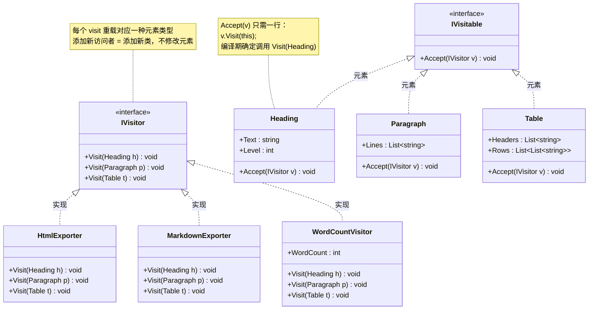
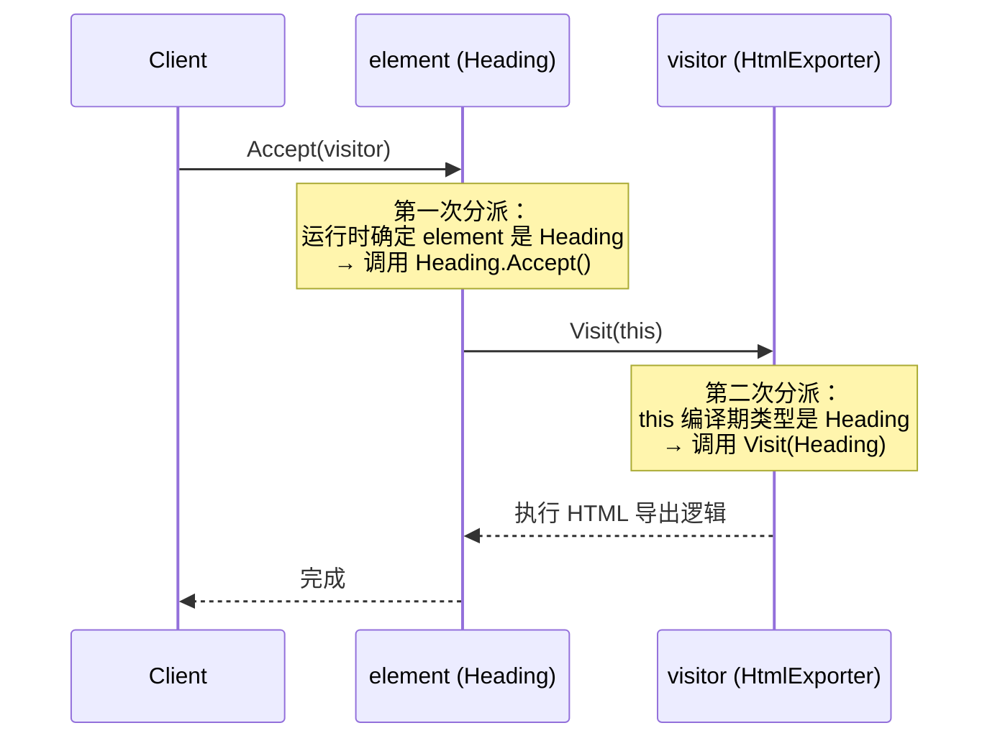

# 访问者模式 Visitor

> 所属计划: [[design-patterns-csharp|设计模式 (C#)]]
> 预计耗时: 80 分钟
> 前置知识: [[16-behavioral-intro|行为型模式总览]], C# 继承/多态, [[11-composite|组合模式]]（Visitor 常与 Composite 配合使用）

---

## 1. 概念讲解

### 为什么需要访问者模式？

考虑一个文档处理系统。你有一个稳定的文档对象结构——`Heading`、`Paragraph`、`Table`——每个元素类都不能轻易修改（可能来自第三方库，或者修改会影响大量已有代码）。但你需要不断地添加新操作：

- 导出为 HTML
- 导出为 Markdown
- 统计字数
- 检查拼写
- 生成目录
- 导出为 PDF

**没有 Visitor 时的做法**——在每个元素类中添加方法：

```csharp
// ❌ 每加一个操作就要修改所有元素类
public class Heading
{
    public string ToHtml() { /* ... */ }
    public string ToMarkdown() { /* ... */ }
    public int WordCount() { /* ... */ }
    public bool SpellCheck() { /* ... */ }
    // 每增加一个操作 → 修改 Heading、Paragraph、Table...
}
```

这种做法违反**开闭原则 (OCP)**——对扩展开放，对修改封闭。对象结构稳定时，操作应该可以无限扩展，而不应该每加一个操作就动所有类。

反过来，如果你用 `if (element is Heading h) ... else if (element is Paragraph p) ...` 把操作写在外部，每新增一个元素类型（如 `Image`、`CodeBlock`），所有外部操作都要更新，编译期无法发现遗漏。

**Visitor 解决这个拉锯**：当**元素类型体系稳定，但需要在上面定义新的操作**时，Visitor 让你在不修改元素类的前提下添加操作。

> [!note] GoF 定义
> 表示一个作用于某对象结构中的各元素的操作。它使你可以在不改变各元素的类的前提下定义作用于这些元素的新操作。

### 核心思想：双分派（Double Dispatch）

Visitor 的核心机制是**双分派**——一次方法调用分派两次：

1. **第一次分派**：客户端调用 `element.Accept(visitor)` ——根据 element 的**运行时类型**，调用对应的 `Accept` 实现
2. **第二次分派**：`Accept` 内部调用 `visitor.Visit(this)` ——根据 visitor 的**运行时类型**，调用对应的 `Visit` 重载

普通多态（单分派）只根据**一个**对象（方法的接收者）的运行时类型决定调用哪个方法。双分派根据**两个**对象（element 和 visitor）的运行时类型共同决定。



### 双分派运行时流程



> [!tip] 为什么需要双分派？
> C# 的 `virtual` 方法只支持单分派——方法重载在编译期根据**参数的声明类型**决定调用哪个重载。如果只依赖单分派，在 Visitor 遍历循环中写 `visitor.Visit(element)`，`element` 的声明类型是 `IVisitable`（或基类），编译器永远调用同一个重载。双分派通过 `Accept` 方法让元素"主动告诉"visitor 自己的真实类型。

### 双分派的类型流转

```csharp
// 假如没有 Accept 方法，只靠单分派：
IVisitable element = new Heading("Title", 1);
visitor.Visit(element);  // ❌ 编译期只知道 element 是 IVisitable
                          // → 如果只有一个 Visit(IVisitable) 重载，丢失具体类型
                          // → 如果有 Visit(Heading)/Visit(Paragraph) 重载，编译器根据声明类型 IVisitable 选 → 编译失败或行为错误

// 用 Accept 实现双分派：
element.Accept(visitor);  // ① Accept 是 virtual → 运行时调用 Heading.Accept()
                           // ② Heading.Accept 内部：visitor.Visit(this)
                           //    this 在 Heading 内部的编译期类型是 Heading
                           //    → 编译器选择 Visit(Heading) 重载 ✅
```

---

## 2. 代码示例

### 示例 1：文档结构 — 经典 Visitor（Heading / Paragraph / Table）

这是 Visitor 模式的经典实现，展示完整的双分派机制。

```csharp
// ============================================
// 1. 文档元素体系 — 经典 Visitor 实现
// ============================================

// --- 元素接口：被访问者 ---
public interface IDocumentElement
{
    void Accept(IDocumentVisitor visitor);
}

// --- 访问者接口 ---
public interface IDocumentVisitor
{
    void Visit(Heading heading);
    void Visit(Paragraph paragraph);
    void Visit(Table table);
}

// --- 具体元素 ---
public class Heading : IDocumentElement
{
    public string Text { get; }
    public int Level { get; }  // 1 = H1, 2 = H2, ...

    public Heading(string text, int level)
    {
        Text = text;
        Level = level;
    }

    public void Accept(IDocumentVisitor visitor) => visitor.Visit(this);
}

public class Paragraph : IDocumentElement
{
    public List<string> Lines { get; }

    public Paragraph(params string[] lines)
    {
        Lines = new List<string>(lines);
    }

    public void Accept(IDocumentVisitor visitor) => visitor.Visit(this);
}

public class Table : IDocumentElement
{
    public List<string> Headers { get; }
    public List<List<string>> Rows { get; }

    public Table(List<string> headers, List<List<string>> rows)
    {
        Headers = headers;
        Rows = rows;
    }

    public void Accept(IDocumentVisitor visitor) => visitor.Visit(this);
}

// --- 具体 Visitor 1：HTML 导出器 ---
public class HtmlExporter : IDocumentVisitor
{
    private readonly StringBuilder _sb = new();

    public string GetHtml() => _sb.ToString();

    public void Visit(Heading heading)
    {
        _sb.AppendLine($"<h{heading.Level}>{EscapeHtml(heading.Text)}</h{heading.Level}>");
    }

    public void Visit(Paragraph paragraph)
    {
        _sb.Append("<p>");
        _sb.Append(string.Join("<br/>", paragraph.Lines.Select(EscapeHtml)));
        _sb.AppendLine("</p>");
    }

    public void Visit(Table table)
    {
        _sb.AppendLine("<table>");
        _sb.AppendLine("  <thead><tr>" +
            string.Join("", table.Headers.Select(h => $"<th>{EscapeHtml(h)}</th>")) +
            "</tr></thead>");
        _sb.AppendLine("  <tbody>");
        foreach (var row in table.Rows)
        {
            _sb.AppendLine("    <tr>" +
                string.Join("", row.Select(c => $"<td>{EscapeHtml(c)}</td>")) +
                "</tr>");
        }
        _sb.AppendLine("  </tbody>");
        _sb.AppendLine("</table>");
    }

    private static string EscapeHtml(string s)
        => s.Replace("&", "&amp;").Replace("<", "&lt;").Replace(">", "&gt;");
}

// --- 具体 Visitor 2：Markdown 导出器 ---
public class MarkdownExporter : IDocumentVisitor
{
    private readonly StringBuilder _sb = new();

    public string GetMarkdown() => _sb.ToString();

    public void Visit(Heading heading)
    {
        _sb.AppendLine($"{new string('#', heading.Level)} {heading.Text}");
        _sb.AppendLine();
    }

    public void Visit(Paragraph paragraph)
    {
        foreach (var line in paragraph.Lines)
            _sb.AppendLine(line);
        _sb.AppendLine();
    }

    public void Visit(Table table)
    {
        // Header row
        _sb.AppendLine("| " + string.Join(" | ", table.Headers) + " |");
        // Separator
        _sb.AppendLine("| " + string.Join(" | ", table.Headers.Select(_ => "---")) + " |");
        // Data rows
        foreach (var row in table.Rows)
            _sb.AppendLine("| " + string.Join(" | ", row) + " |");
        _sb.AppendLine();
    }
}

// --- 具体 Visitor 3：字数统计 ---
public class WordCountVisitor : IDocumentVisitor
{
    public int WordCount { get; private set; }

    public void Visit(Heading heading)
    {
        WordCount += CountWords(heading.Text);
    }

    public void Visit(Paragraph paragraph)
    {
        foreach (var line in paragraph.Lines)
            WordCount += CountWords(line);
    }

    public void Visit(Table table)
    {
        foreach (var header in table.Headers)
            WordCount += CountWords(header);
        foreach (var row in table.Rows)
            foreach (var cell in row)
                WordCount += CountWords(cell);
    }

    private static int CountWords(string text)
    {
        if (string.IsNullOrWhiteSpace(text)) return 0;
        return text.Split(' ', StringSplitOptions.RemoveEmptyEntries).Length;
    }
}

// --- 文档结构（持有元素列表）---
public class Document
{
    private readonly List<IDocumentElement> _elements = new();

    public void Add(IDocumentElement element) => _elements.Add(element);

    public void Accept(IDocumentVisitor visitor)
    {
        foreach (var element in _elements)
            element.Accept(visitor);
    }
}

// === 使用 ===
var doc = new Document();
doc.Add(new Heading("访问者模式", 1));
doc.Add(new Paragraph(
    "访问者模式让你在不修改元素类的前提下定义新的操作。",
    "其核心机制是双分派（Double Dispatch）。"
));
doc.Add(new Heading("适用场景", 2));
doc.Add(new Paragraph(
    "- 对象结构稳定，但需要频繁添加新操作",
    "- 需要对结构中的对象进行多种无关操作"
));
doc.Add(new Table(
    new List<string> { "模式", "特点", "变化维度" },
    new List<List<string>>
    {
        new() { "Visitor", "操作与结构分离", "操作可变，结构稳定" },
        new() { "Strategy", "算法族互换", "算法可变" },
        new() { "Observer", "一对多通知", "观察者可变" }
    }
));

// 导出 HTML
var htmlExporter = new HtmlExporter();
doc.Accept(htmlExporter);
Console.WriteLine("=== HTML ===");
Console.WriteLine(htmlExporter.GetHtml());

// 导出 Markdown
var mdExporter = new MarkdownExporter();
doc.Accept(mdExporter);
Console.WriteLine("=== Markdown ===");
Console.WriteLine(mdExporter.GetMarkdown());

// 统计字数
var wordCounter = new WordCountVisitor();
doc.Accept(wordCounter);
Console.WriteLine($"=== 字数统计: {wordCounter.WordCount} ===");
```

**运行方式:**

```bash
dotnet new console -n VisitorDocument
# 将上述代码放入 Program.cs（需要 using System.Text; using System.Linq;）
dotnet run --project VisitorDocument
```

**预期输出:**

```text
=== HTML ===
<h1>访问者模式</h1>
<p>访问者模式让你在不修改元素类的前提下定义新的操作。<br/>其核心机制是双分派（Double Dispatch）。</p>
<h2>适用场景</h2>
<p>- 对象结构稳定，但需要频繁添加新操作<br/>- 需要对结构中的对象进行多种无关操作</p>
<table>
  <thead><tr><th>模式</th><th>特点</th><th>变化维度</th></tr></thead>
  <tbody>
    <tr><td>Visitor</td><td>操作与结构分离</td><td>操作可变，结构稳定</td></tr>
    <tr><td>Strategy</td><td>算法族互换</td><td>算法可变</td></tr>
    <tr><td>Observer</td><td>一对多通知</td><td>观察者可变</td></tr>
  </tbody>
</table>

=== Markdown ===
# 访问者模式

访问者模式让你在不修改元素类的前提下定义新的操作。
其核心机制是双分派（Double Dispatch）。

## 适用场景

- 对象结构稳定，但需要频繁添加新操作
- 需要对结构中的对象进行多种无关操作

| 模式 | 特点 | 变化维度 |
| --- | --- | --- |
| Visitor | 操作与结构分离 | 操作可变，结构稳定 |
| Strategy | 算法族互换 | 算法可变 |
| Observer | 一对多通知 | 观察者可变 |

=== 字数统计: 42 ===
```

### 示例 2：用 `dynamic` 关键字简化 Visitor

当你有很多元素类型时，在每个元素中重复写 `Accept` 方法很繁琐。C# 的 `dynamic` 关键字可以在运行时解决重载分派，消除样板代码。

```csharp
// ============================================
// 2. dynamic 简化 — 消除 Accept 重复代码
// ============================================

// --- 元素基类（提供默认 Accept 实现）---
public abstract class DocumentElement
{
    // 所有子类共享同一个 Accept 实现——dynamic 自动分派
    public void Accept(IDocumentVisitor visitor)
    {
        // dynamic 在运行时根据 this 的真实类型选择 Visit 重载
        visitor.Visit((dynamic)this);
    }
}

// --- 具体元素：不再需要重复 Accept ---
public class Heading : DocumentElement
{
    public string Text { get; }
    public int Level { get; }

    public Heading(string text, int level)
    {
        Text = text;
        Level = level;
    }
}

public class Paragraph : DocumentElement
{
    public List<string> Lines { get; }

    public Paragraph(params string[] lines)
    {
        Lines = new List<string>(lines);
    }
}

public class Table : DocumentElement
{
    public List<string> Headers { get; }
    public List<List<string>> Rows { get; }

    public Table(List<string> headers, List<List<string>> rows)
    {
        Headers = headers;
        Rows = rows;
    }
}

// --- Visitor 接口和实现完全相同，无需修改 ---
public interface IDocumentVisitor
{
    void Visit(Heading heading);
    void Visit(Paragraph paragraph);
    void Visit(Table table);
}

public class HtmlExporter : IDocumentVisitor
{
    private readonly StringBuilder _sb = new();

    public string GetHtml() => _sb.ToString();

    public void Visit(Heading heading)
    {
        _sb.AppendLine($"<h{heading.Level}>{heading.Text}</h{heading.Level}>");
    }

    public void Visit(Paragraph paragraph)
    {
        _sb.Append("<p>");
        _sb.Append(string.Join("<br/>", paragraph.Lines));
        _sb.AppendLine("</p>");
    }

    public void Visit(Table table)
    {
        _sb.AppendLine("<table>");
        _sb.AppendLine("  <thead><tr>" +
            string.Join("", table.Headers.Select(h => $"<th>{h}</th>")) +
            "</tr></thead>");
        _sb.AppendLine("  <tbody>");
        foreach (var row in table.Rows)
            _sb.AppendLine("    <tr>" +
                string.Join("", row.Select(c => $"<td>{c}</td>")) +
                "</tr>");
        _sb.AppendLine("  </tbody>");
        _sb.AppendLine("</table>");
    }
}

// === 使用（与示例 1 完全相同） ===
var doc = new List<DocumentElement>
{
    new Heading("dynamic 简化 Visitor", 1),
    new Paragraph("使用 dynamic 关键字后，"),
    new Paragraph("所有元素类只需继承基类，无需重复实现 Accept。"),
};

var exporter = new HtmlExporter();
foreach (var element in doc)
    element.Accept(exporter);

Console.WriteLine(exporter.GetHtml());
```

**dynamic 的代价：**

- 运行时类型 检查 → 没有编译期安全保障 → 如果 Visitor 缺少某个元素的 `Visit` 重载，会在运行时抛出 `RuntimeBinderException`
- 轻微性能开销（DLR 缓存后会减少，但仍高于虚方法调用）
- 无法在 AOT 编译环境（如 NativeAOT）中使用

> [!tip] dynamic 适用场景
> 当元素类型很多（10 种以上），减少样板代码的价值大于微小的运行时开销时，`dynamic` 是合理的折中。对于元素类型少的场景（3-5 种），手写 `Accept` 更安全。

### 示例 3：C# 模式匹配作为 Visitor 的替代方案

C# 7+ 的模式匹配（`switch` 表达式 + 类型模式）在很多场景下可以替代 Visitor，代码更简洁、不需要定义 Visitor 接口。

```csharp
// ============================================
// 3. 模式匹配替代 Visitor — 更简单的展开方式
// ============================================

// --- 元素类型：不需要 IVisitable 接口，不需要 Accept 方法 ---
public record Heading(string Text, int Level);
public record Paragraph(List<string> Lines);
public record Table(List<string> Headers, List<List<string>> Rows);

// --- "Visitor" 变成纯函数式方法 ---
public static class DocumentProcessors
{
    public static string ToHtml(object element) => element switch
    {
        Heading h => $"<h{h.Level}>{h.Text}</h{h.Level}>",
        Paragraph p => "<p>" + string.Join("<br/>", p.Lines) + "</p>",
        Table t => """
            <table>
              <thead><tr>""" +
            string.Join("", t.Headers.Select(h => $"<th>{h}</th>")) +
            @"</tr></thead>
              <tbody>" +
            string.Join("\n",
                t.Rows.Select(row =>
                    "    <tr>" +
                    string.Join("", row.Select(c => $"<td>{c}</td>")) +
                    "</tr>"
                )) + @"
              </tbody>
            </table>",
        _ => throw new ArgumentException($"Unknown element: {element.GetType()}")
    };

    public static int WordCount(object element) => element switch
    {
        Heading h => CountWords(h.Text),
        Paragraph p => p.Lines.Sum(CountWords),
        Table t => t.Headers.Sum(CountWords)
                   + t.Rows.Sum(row => row.Sum(CountWords)),
        _ => throw new ArgumentException($"Unknown element: {element.GetType()}")
    };

    private static int CountWords(string text)
        => string.IsNullOrWhiteSpace(text) ? 0
           : text.Split(' ', StringSplitOptions.RemoveEmptyEntries).Length;
}

// --- 遍历文档：不需要 Document 类持有 Accept，直接 foreach ---
// === 使用 ===
var elements = new object[]
{
    new Heading("模式匹配替代 Visitor", 1),
    new Paragraph(new List<string> {
        "C# 7+ 的模式匹配提供了一种轻量级替代方案。",
        "不需要 IVisitable 接口，不需要 Accept 方法。"
    }),
    new Table(
        new List<string> { "方案", "优点", "缺点" },
        new List<List<string>>
        {
            new() { "经典 Visitor", "编译期安全，适合大规模系统", "样板代码多" },
            new() { "dynamic", "减少样板，灵活性高", "无编译期检查，不支持 AOT" },
            new() { "模式匹配", "零样板，C# 原生特性", "穷举检查需手动维护" },
        }
    ),
};

Console.WriteLine("=== HTML ===");
foreach (var e in elements)
    Console.WriteLine(DocumentProcessors.ToHtml(e));

Console.WriteLine($"\n=== 总字数: {elements.Sum(DocumentProcessors.WordCount)} ===");
```

**运行方式:**

```bash
dotnet new console -n VisitorPatternMatch
# 将上述代码放入 Program.cs（需要 using System.Linq;）
dotnet run --project VisitorPatternMatch
```

**Visitor vs 模式匹配 对比：**

| 维度 | 经典 Visitor | 模式匹配 |
|------|-------------|---------|
| **接口/基类** | 需要 `IVisitable` + `Accept` | 不需要 |
| **添加新操作** | 添加 Visitor 类 | 添加新方法 |
| **添加新元素** | 修改 Visitor 接口 + 所有实现 | 修改所有 switch 表达式 |
| **编译期穷举检查** | ✅ Visitor 接口强制实现所有 `Visit` | ❌ switch 默认不强制穷举 |
| **操作封装** | ✅ 每个 Visitor 是独立类，可携带状态 | ⚠️ 需要手动组织方法 |
| **适合场景** | 元素类型稳定，操作多变 | 操作少，或快速迭代 |

> [!tip] 现代 C# 建议
> 如果元素类型数量 ≤ 5 且操作数量 ≤ 3，优先使用模式匹配——代码少、易理解。如果元素类型稳定且操作会持续增加（如编译器 AST 有 50+ 节点类型），Visitor 仍然是更好的选择。

---


## C++ 实现

C++ 中 Visitor 模式的核心是双分派（double dispatch）：`element.Accept(visitor)` 通过两次虚函数调用，在运行时同时确定元素和访问者的具体类型。与 C# 不同，C++ 使用引用而非接口 — `Visitor&` 传递访问者，避免不必要的拷贝。

```cpp
#include <iostream>
#include <vector>
#include <string>
#include <sstream>

using namespace std;
// ============================================
// 1. 前向声明 + Visitor 接口
// ============================================
class Heading;
class Paragraph;
class Table;
class IDocumentVisitor {
public:
    virtual ~IDocumentVisitor() = default;
    virtual void Visit(Heading& elem) = 0;
    virtual void Visit(Paragraph& elem) = 0;
    virtual void Visit(Table& elem) = 0;
};
// ============================================
// 2. 元素接口 + 具体元素
// ============================================
class IDocumentElement {
public:
    virtual ~IDocumentElement() = default;
    virtual void Accept(IDocumentVisitor& visitor) = 0;
};
class Heading : public IDocumentElement {
    string text_;
    int level_;
public:
    Heading(string text, int level) : text_(move(text)), level_(level) {}
    const string& Text() const { return text_; }
    int Level() const { return level_; }
    void Accept(IDocumentVisitor& visitor) override { visitor.Visit(*this); }
};
class Paragraph : public IDocumentElement {
    vector<string> lines_;
public:
    Paragraph(initializer_list<string> lines) : lines_(lines) {}
    const vector<string>& Lines() const { return lines_; }
    void Accept(IDocumentVisitor& visitor) override { visitor.Visit(*this); }
};
class Table : public IDocumentElement {
    vector<string> headers_;
    vector<vector<string>> rows_;
public:
    Table(vector<string> headers, vector<vector<string>> rows)
        : headers_(move(headers)), rows_(move(rows)) {}
    const vector<string>& Headers() const { return headers_; }
    const vector<vector<string>>& Rows() const { return rows_; }
    void Accept(IDocumentVisitor& visitor) override { visitor.Visit(*this); }
};
// ============================================
// 3. 具体 Visitor：HTML 导出器
// ============================================
class HtmlExporter : public IDocumentVisitor {
    ostringstream os_;

    static string EscapeHtml(const string& s) {
        string r = s;
        for (size_t pos = 0; (pos = r.find('&', pos)) != string::npos; ++pos)
            r.replace(pos, 1, "&amp;"), pos += 4;
        for (size_t pos = 0; (pos = r.find('<', pos)) != string::npos; ++pos)
            r.replace(pos, 1, "&lt;"), pos += 3;
        for (size_t pos = 0; (pos = r.find('>', pos)) != string::npos; ++pos)
            r.replace(pos, 1, "&gt;"), pos += 3;
        return r;
    }

public:
    string GetHtml() const { return os_.str(); }

    void Visit(Heading& h) override {
        os_ << "<h" << h.Level() << ">"
            << EscapeHtml(h.Text())
            << "</h" << h.Level() << ">\n";
    }

    void Visit(Paragraph& p) override {
        os_ << "<p>";
        for (size_t i = 0; i < p.Lines().size(); ++i) {
            if (i > 0) os_ << "<br/>";
            os_ << EscapeHtml(p.Lines()[i]);
        }
        os_ << "</p>\n";
    }

    void Visit(Table& t) override {
        os_ << "<table>\n  <thead><tr>";
        for (const auto& h : t.Headers())
            os_ << "<th>" << EscapeHtml(h) << "</th>";
        os_ << "</tr></thead>\n  <tbody>\n";
        for (const auto& row : t.Rows()) {
            os_ << "    <tr>";
            for (const auto& cell : row)
                os_ << "<td>" << EscapeHtml(cell) << "</td>";
            os_ << "</tr>\n";
        }
        os_ << "  </tbody>\n</table>\n";
    }
};
// ============================================
// 4. 具体 Visitor：字数统计
// ============================================
class WordCountVisitor : public IDocumentVisitor {
    int count_ = 0;

    static int CountWords(const string& text) {
        istringstream iss(text);
        int w = 0;
        string word;
        while (iss >> word) ++w;
        return w;
    }

public:
    int TotalWords() const { return count_; }

    void Visit(Heading& h) override   { count_ += CountWords(h.Text()); }

    void Visit(Paragraph& p) override {
        for (const auto& line : p.Lines())
            count_ += CountWords(line);
    }

    void Visit(Table& t) override {
        for (const auto& h : t.Headers()) count_ += CountWords(h);
        for (const auto& row : t.Rows())
            for (const auto& cell : row) count_ += CountWords(cell);
    }
};
// ============================================
// 5. 使用示例 — 双分派在行动
// ============================================
int main() {
    // 构建文档结构
    Heading h1("欢迎来到 Visitor 模式", 1);
    Paragraph p1({"这是一段文本。", "第二行。"});
    Table t1(
        {"姓名", "年龄"},
        {{"Alice", "30"}, {"Bob", "25"}}
    );
    vector<IDocumentElement*> doc = {&h1, &p1, &t1};
    // 操作 1：导出 HTML
    HtmlExporter htmlExp;
    for (auto* elem : doc)
        elem->Accept(htmlExp);  // 双分派：① elem 类型 → Accept ② visitor 类型 → Visit
    cout << "=== HTML ===\n" << htmlExp.GetHtml() << endl;
    // 操作 2：统计字数 — 无需修改任何元素类
    WordCountVisitor wc;
    for (auto* elem : doc)
        elem->Accept(wc);
    cout << "=== 字数统计 ===\n" << "总字数: " << wc.TotalWords() << endl;
    return 0;
}
```

```bash
# 编译运行
g++ -std=c++17 -o visitor_demo main.cpp && ./visitor_demo
```

> **C++ 核心要点**：
> - **双分派机制**：`elem->Accept(visitor)` — 第一次分派确定元素类型（虚函数），`Accept` 内部调用 `visitor.Visit(*this)` — 第二次分派确定访问者类型（重载解析）。`*this` 在元素类内部具有精确的静态类型（`Heading&`），编译器选择 `Visit(Heading&)` 重载
> - **引用传参**：`IDocumentVisitor&` 而非指针 — C++ 惯用引用表达"必须存在"的语义，且避免空指针检查
> - **`virtual ~IDocumentVisitor() = default`**：多态基类的虚析构是必须的
> - **`override`**：C++11 关键字，编译器验证确实覆盖了基类虚函数
> - **`ostringstream`**：C++ 的字符串构建器，等价于 C# 的 `StringBuilder`

---
## 3. 练习

### 练习 1（基础）：为薪资计算系统添加 TaxVisitor

给定以下员工薪资系统代码：

```csharp
public interface IEmployee
{
    void Accept(IEmployeeVisitor visitor);
}

public class FullTimeEmployee : IEmployee
{
    public string Name { get; set; }
    public decimal MonthlySalary { get; set; }   // 月薪

    public void Accept(IEmployeeVisitor visitor) => visitor.Visit(this);
}

public class Contractor : IEmployee
{
    public string Name { get; set; }
    public decimal HourlyRate { get; set; }      // 时薪
    public int HoursWorked { get; set; }         // 当月工时

    public void Accept(IEmployeeVisitor visitor) => visitor.Visit(this);
}

public class Intern : IEmployee
{
    public string Name { get; set; }
    public decimal Stipend { get; set; }         // 固定补贴

    public void Accept(IEmployeeVisitor visitor) => visitor.Visit(this);
}

// 已有一个 Visitor：薪资汇总
public class SalaryReportVisitor : IEmployeeVisitor
{
    public decimal TotalPayout { get; private set; }

    public void Visit(FullTimeEmployee e) => TotalPayout += e.MonthlySalary;
    public void Visit(Contractor e) => TotalPayout += e.HourlyRate * e.HoursWorked;
    public void Visit(Intern e) => TotalPayout += e.Stipend;
}
```

**任务：**

1. 补全 `IEmployeeVisitor` 接口定义
2. 实现 `TaxVisitor`：
   - `FullTimeEmployee`：税率 25%（`MonthlySalary * 0.25m`）
   - `Contractor`：税率 15%（`HourlyRate * HoursWorked * 0.15m`）
   - `Intern`：免税（收入低于 5000）
3. 实现 `TakeHomePayVisitor`：扣除税款后的实际到手工资
4. 编写测试代码：创建 2 个全职员工、1 个外包、1 个实习生，分别用三个 Visitor 处理，打印结果

> [!tip]- 提示
> ```csharp
> public interface IEmployeeVisitor
> {
>     void Visit(FullTimeEmployee employee);
>     void Visit(Contractor contractor);
>     void Visit(Intern intern);
> }
>
> // TaxVisitor
> public class TaxVisitor : IEmployeeVisitor
> {
>     public decimal TotalTax { get; private set; }
>
>     public void Visit(FullTimeEmployee e)
>         => TotalTax += e.MonthlySalary * 0.25m;
>
>     public void Visit(Contractor e)
>         => TotalTax += e.HourlyRate * e.HoursWorked * 0.15m;
>
>     public void Visit(Intern e)
>     {
>         // 补贴低于 5000 免税
>         if (e.Stipend >= 5000)
>             TotalTax += e.Stipend * 0.10m;
>     }
> }
> ```

### 练习 2（进阶）：用 `dynamic` 改写练习 1 的员工系统

将练习 1 中的 `IEmployee`/`Accept` 体系改写为使用 `dynamic` 分派的版本：

1. 创建抽象基类 `Employee`，包含 `Accept` 的 `dynamic` 实现
2. 让 `FullTimeEmployee`、`Contractor`、`Intern` 继承 `Employee`
3. 确认已有的 Visitor 实现**无需修改**即可正常工作
4. 添加一个新的元素类型 `Consultant`（按项目计费，`ProjectFee`），并确认：
   - 现有 Visitor 编译通过但不处理 `Consultant` → 调用时会抛出 `RuntimeBinderException`
   - 追加一个 `Visit(Consultant)` 方法即可修复

**要点：** 体会 `dynamic` 带来的便利（新元素不需要接口修改）和风险（遗漏无编译期提示）。

> [!tip]- 提示
> ```csharp
> public abstract class Employee
> {
>     public string Name { get; set; } = "";
>
>     public void Accept(IEmployeeVisitor visitor)
>     {
>         visitor.Visit((dynamic)this);
>     }
> }
>
> // 注意：基类的 Visit((dynamic)this) 是关键
> // 调用的 Visit 重载由运行时 this 的真实类型决定
> ```

### 练习 3（挑战）：模式匹配替代 Visitor — 比较两种方案

用模式匹配完整实现练习 1 的薪资计算系统（不需要 `IEmployeeVisitor` 和 `Accept`）：

1. 定义 `record` 类型：`FullTimeEmployee`、`Contractor`、`Intern`（不需要接口）
2. 实现以下静态方法（每种操作一个方法）：
   - `CalculateGrossPay(object employee)`
   - `CalculateTax(object employee)`
   - `CalculateTakeHomePay(object employee)`
3. 实现一个 `ProcessPayroll(List<object> employees)` 方法，对所有员工执行三种计算并打印结果
4. 然后回答：

   - 当需要添加第 4 种操作（如"社保扣款"），两种方案各需要改多少代码？
   - 当需要添加第 4 种员工类型，两种方案各需要改多少代码？
   - 在 C# 中，如果你确定员工类型会频繁新增但操作数量稳定，应该选 Visitor 还是模式匹配？

> [!tip]- 提示
> ```csharp
> public static class PayrollCalculator
> {
>     public static decimal CalculateGross(object emp) => emp switch
>     {
>         FullTimeEmployee f => f.MonthlySalary,
>         Contractor c => c.HourlyRate * c.HoursWorked,
>         Intern i => i.Stipend,
>         _ => throw new ArgumentException($"Unknown type: {emp.GetType()}")
>     };
>
>     // 用 switch 表达式，C# 编译器在开启警告时会提示未覆盖的类型
>     // 但不会像 Visitor 接口那样强制穷举
> }
> ```

---


## 3.5 参考答案

> [!tip]- 练习 1 参考答案：薪资计算系统 TaxVisitor
> ```csharp
> // ============================================
> // 1. IEmployeeVisitor 接口（补全）
> // ============================================
> public interface IEmployeeVisitor
> {
>     void Visit(FullTimeEmployee employee);
>     void Visit(Contractor contractor);
>     void Visit(Intern intern);
> }
>
> // ============================================
> // 2. TaxVisitor — 税款计算
> // ============================================
> public class TaxVisitor : IEmployeeVisitor
> {
>     public decimal TotalTax { get; private set; }
>
>     public void Visit(FullTimeEmployee e)
>         => TotalTax += e.MonthlySalary * 0.25m;
>
>     public void Visit(Contractor e)
>         => TotalTax += e.HourlyRate * e.HoursWorked * 0.15m;
>
>     public void Visit(Intern e)
>     {
>         // 补贴低于 5000 免税；>= 5000 按 10% 计税
>         if (e.Stipend >= 5000)
>             TotalTax += e.Stipend * 0.10m;
>     }
> }
>
> // ============================================
> // 3. TakeHomePayVisitor — 实际到手工资
> // ============================================
> public class TakeHomePayVisitor : IEmployeeVisitor
> {
>     public decimal TotalTakeHome { get; private set; }
>
>     public void Visit(FullTimeEmployee e)
>     {
>         var gross = e.MonthlySalary;
>         var tax = gross * 0.25m;
>         TotalTakeHome += gross - tax;
>         Console.WriteLine($"  {e.Name} (FullTime): Gross={gross:C}, Tax={tax:C}, TakeHome={gross - tax:C}");
>     }
>
>     public void Visit(Contractor e)
>     {
>         var gross = e.HourlyRate * e.HoursWorked;
>         var tax = gross * 0.15m;
>         TotalTakeHome += gross - tax;
>         Console.WriteLine($"  {e.Name} (Contractor): Gross={gross:C}, Tax={tax:C}, TakeHome={gross - tax:C}");
>     }
>
>     public void Visit(Intern e)
>     {
>         var gross = e.Stipend;
>         var tax = gross >= 5000 ? gross * 0.10m : 0;
>         TotalTakeHome += gross - tax;
>         Console.WriteLine($"  {e.Name} (Intern): Gross={gross:C}, Tax={tax:C}, TakeHome={gross - tax:C}");
>     }
> }
>
> // ============================================
> // 4. 测试代码
> // ============================================
> // var employees = new List<IEmployee>
> // {
> //     new FullTimeEmployee { Name = "Alice", MonthlySalary = 10000m },
> //     new FullTimeEmployee { Name = "Bob", MonthlySalary = 12000m },
> //     new Contractor { Name = "Charlie", HourlyRate = 200m, HoursWorked = 80 },
> //     new Intern { Name = "Diana", Stipend = 3000m }
> // };
> //
> // var salaryReport = new SalaryReportVisitor();
> // var taxReport = new TaxVisitor();
> // var takeHomeReport = new TakeHomePayVisitor();
> //
> // foreach (var emp in employees) emp.Accept(salaryReport);
> // Console.WriteLine($"\n=== Total Payout: {salaryReport.TotalPayout:C} ===");
> //
> // foreach (var emp in employees) emp.Accept(taxReport);
> // Console.WriteLine($"=== Total Tax: {taxReport.TotalTax:C} ===");
> //
> // Console.WriteLine($"\n--- Take-Home Details ---");
> // foreach (var emp in employees) emp.Accept(takeHomeReport);
> // Console.WriteLine($"=== Total Take-Home Pay: {takeHomeReport.TotalTakeHome:C} ===");
> ```

> [!tip]- 练习 2 参考答案：`dynamic` 改写员工系统
> ```csharp
> // ============================================
> // 抽象基类 — Accept 使用 dynamic 分派
> // ============================================
> public abstract class Employee
> {
>     public string Name { get; set; } = "";
>
>     // dynamic 分派：运行时根据 this 的真实类型选择 Visit 重载
>     public void Accept(IEmployeeVisitor visitor)
>     {
>         visitor.Visit((dynamic)this);
>     }
> }
>
> // 具体员工类 — 继承 Employee，去掉 IEmployee 接口
> public class FullTimeEmployee : Employee
> {
>     public decimal MonthlySalary { get; set; }
> }
>
> public class Contractor : Employee
> {
>     public decimal HourlyRate { get; set; }
>     public int HoursWorked { get; set; }
> }
>
> public class Intern : Employee
> {
>     public decimal Stipend { get; set; }
> }
>
> // 新增员工类型 — 无需修改 IEmployeeVisitor
> public class Consultant : Employee
> {
>     public decimal ProjectFee { get; set; }
> }
>
> // ============================================
> // 已有 Visitor 无需修改即可编译
> // 但调用 Consultant.Accept(taxVisitor) 会抛 RuntimeBinderException
> // 修复：在 IEmployeeVisitor 中添加 Visit(Consultant) + 各 Visitor 实现对应方法
> // ============================================
>
> // 测试：
> // var employees = new List<Employee>
> // {
> //     new FullTimeEmployee { Name = "Alice", MonthlySalary = 10000m },
> //     new Contractor { Name = "Charlie", HourlyRate = 200m, HoursWorked = 80 },
> //     new Consultant { Name = "Eve", ProjectFee = 50000m }
> // };
> //
> // var taxVisitor = new TaxVisitor();
> // foreach (var emp in employees)
> // {
> //     try { emp.Accept(taxVisitor); }
> //     catch (Microsoft.CSharp.RuntimeBinder.RuntimeBinderException ex)
> //     {
> //         Console.WriteLine($"Warning: No Visit method for {emp.GetType().Name}");
> //     }
> // }
> ```
>
> **要点总结：**
>
> - **便利性**：`dynamic` 免除接口修改——新元素类型无需改动 `IEmployeeVisitor` 就能编译；所有元素继承同一个 `Employee` 基类，`Accept` 只写一次
> - **风险**：遗漏新元素类型不会产生编译错误，编译期安全完全丧失——只能在运行时发现 `RuntimeBinderException`，且 `dynamic` 破坏 IntelliSense 和重构工具的支持
> - **性能代价**：`dynamic` 调用涉及 DLR（Dynamic Language Runtime）缓存和运行时绑定，比虚方法分派慢数十倍——在循环遍历大量元素时可能成为瓶颈
> - **决策**：元素类型真的频繁变化（如插件系统）且编译期安全不关键 → `dynamic` 可行；否则经典 Visitor 的编译期保证更有价值

> [!tip]- 练习 3 参考答案：模式匹配替代 Visitor（可选挑战）
> ```csharp
> // ============================================
> // 1. 用 record 定义员工类型（不需要接口和 Accept）
> // ============================================
> public record FullTimeEmployeeRecord(string Name, decimal MonthlySalary);
> public record ContractorRecord(string Name, decimal HourlyRate, int HoursWorked);
> public record InternRecord(string Name, decimal Stipend);
>
> // ============================================
> // 2. 静态方法 — 每种操作一个方法
> // ============================================
> public static class PayrollCalculator
> {
>     public static decimal CalculateGrossPay(object emp) => emp switch
>     {
>         FullTimeEmployeeRecord f => f.MonthlySalary,
>         ContractorRecord c => c.HourlyRate * c.HoursWorked,
>         InternRecord i => i.Stipend,
>         _ => throw new ArgumentException($"Unknown type: {emp.GetType()}")
>     };
>
>     public static decimal CalculateTax(object emp) => emp switch
>     {
>         FullTimeEmployeeRecord f => f.MonthlySalary * 0.25m,
>         ContractorRecord c => c.HourlyRate * c.HoursWorked * 0.15m,
>         InternRecord i => i.Stipend >= 5000 ? i.Stipend * 0.10m : 0,
>         _ => throw new ArgumentException($"Unknown type: {emp.GetType()}")
>     };
>
>     public static decimal CalculateTakeHomePay(object emp)
>         => CalculateGrossPay(emp) - CalculateTax(emp);
>
>     // 3. 批量处理
>     public static void ProcessPayroll(List<object> employees)
>     {
>         decimal totalGross = 0, totalTax = 0, totalTakeHome = 0;
>         foreach (var emp in employees)
>         {
>             var gross = CalculateGrossPay(emp);
>             var tax = CalculateTax(emp);
>             var takeHome = gross - tax;
>             totalGross += gross; totalTax += tax; totalTakeHome += takeHome;
>
>             var name = emp switch
>             {
>                 FullTimeEmployeeRecord f => f.Name,
>                 ContractorRecord c => c.Name,
>                 InternRecord i => i.Name,
>                 _ => "Unknown"
>             };
>             Console.WriteLine($"  {name}: Gross={gross:C}, Tax={tax:C}, TakeHome={takeHome:C}");
>         }
>         Console.WriteLine($"\nTotals: Gross={totalGross:C}, Tax={totalTax:C}, TakeHome={totalTakeHome:C}");
>     }
> }
> ```
>
> **分析报告：**
>
> | 场景 | Visitor 模式 | 模式匹配 |
> |:-----|:------------|:--------|
> | **添加第 4 种操作（如社保扣款）** | 新建 `SocialSecurityVisitor` 类，实现 `IEmployeeVisitor`，所有员工类型的方法必须一一实现。不改任何现有代码。**改动量：+1 新文件** | 在 `PayrollCalculator` 中新增一个 `CalculateSocialSecurity(object emp)` 静态方法，必须覆盖所有员工类型的 `switch` 分支。不改现有方法。**改动量：+1 方法** |
> | **添加第 4 种员工类型** | 在 `IEmployeeVisitor` 接口中添加 `Visit(NewType)` → **所有现有 Visitor 实现编译失败**，必须逐个添加新方法。**改动量：改 N 个 Visitor** | 在每个 `Calculate*` 的 `switch` 表达式中添加新分支。编译器可提示遗漏（开启警告），但不强制。**改动量：改 M 个方法** |
>
> **在 C# 中，如果员工类型会频繁新增但操作数量稳定 → 应选模式匹配**，理由：
>
> 1. **开闭方向匹配**：Visitor 对"新增操作"友好（开），对"新增类型"封闭（闭）。类型频繁变化时，Visitor 的封闭方向刚好是你要扩展的方向——最糟糕的匹配
> 2. **C# 模式匹配的遗漏检测**：开启 `<WarningsAsErrors>CS8509</WarningsAsErrors>` 后，`switch` 表达式未穷举所有类型时会产生编译警告（可升级为错误），部分弥补编译期检查
> 3. **更少的代码量**：不需要 `IVisitor` / `IElement` 接口和双分派样板，`record` 类型 + 模式匹配的总代码量显著更少
>
> 反过来，如果**操作数量频繁变化但员工类型稳定**（如文档处理系统——Heading/Paragraph/Table 几十年不变，但不断需要新导出格式），Visitor 更优。

> [!note] 答案使用方式
> 先独立完成练习，再展开查看参考答案。参考答案不是唯一解——如果你的实现通过了测试或达到了题目要求，就是正确的。

## 4. 扩展阅读

- [[16-behavioral-intro|行为型模式总览]] — Visitor 在行为型模式谱系中的位置
- [[11-composite|组合模式]] — Visitor 最常与 Composite 配合：组合树提供统一遍历，Visitor 提供操作
- [[24-strategy|策略模式]] — 与 Visitor 对比：Strategy 替换的是单个算法，Visitor 是对一整套元素的操作分发
- **GoF 原书 (Design Patterns)**：第 5 章 "Visitor"（pp. 331-344）— 详细讨论双分派和遍历策略
- [Microsoft Docs: dynamic (C# Reference)](https://learn.microsoft.com/en-us/dotnet/csharp/language-reference/builtin-types/reference-types#the-dynamic-type) — `dynamic` 关键字的运行时行为
- [Microsoft Docs: Pattern Matching (C#)](https://learn.microsoft.com/en-us/dotnet/csharp/language-reference/operators/patterns) — 类型模式、属性模式、switch 表达式
- [Refactoring Guru: Visitor](https://refactoring.guru/design-patterns/visitor) — 含精美图解和多语言实现
- **.NET BCL 中的 Visitor 模式**：
  - `System.Linq.Expressions.ExpressionVisitor` — LINQ 表达式树的访问者，Roslyn 编译器也用 Visitor 遍历语法树
  - Roslyn 的 `CSharpSyntaxVisitor<T>` — 覆盖 100+ 语法节点类型，是 Visitor 模式的工业级实现
  - `System.Xml.Schema.XmlSchemaSet` — 验证遍历 XML Schema 结构
- **相关模式**：
  - [[19-iterator|迭代器模式]] — Iterator 负责**怎么遍历**，Visitor 负责**遍历时做什么**
  - [[18-command|命令模式]] — Command 封装单个操作，Visitor 封装对多种对象的操作族
  - **Interpreter 解释器** — 解释器常用 Visitor 遍历 AST 执行求值

---

## 常见陷阱

### 陷阱 1：新增元素类型时必须修改所有 Visitor

这是 Visitor 模式最著名的权衡——Visitor 接口中的每个 `Visit` 方法对应一种元素类型。当添加新元素类型时，必须在 Visitor 接口中添加新的 `Visit` 方法，导致**所有现有 Visitor 实现编译失败**。

```csharp
// ❌ 添加 Image 元素后，所有 Visitor 都必须修改
public interface IDocumentVisitor
{
    void Visit(Heading heading);
    void Visit(Paragraph paragraph);
    void Visit(Table table);
    void Visit(Image image);   // ← 新增 → 所有现有 Visitor 编译失败！
}
```

**缓解方案：**

```csharp
// 方案 A：提供默认实现（C# 8.0+ 接口默认方法）
public interface IDocumentVisitor
{
    void Visit(Heading heading);
    void Visit(Paragraph paragraph);
    void Visit(Table table);
    // 默认实现：新元素不会导致现有代码编译失败
    void Visit(Image image) { /* no-op by default */ }  // ← C# 8.0+
}

// 方案 B：抽象基类 + virtual（兼容旧版 C#）
public abstract class DocumentVisitorBase : IDocumentVisitor
{
    public abstract void Visit(Heading heading);
    public abstract void Visit(Paragraph paragraph);
    public abstract void Visit(Table table);
    public virtual void Visit(Image image) { }  // 默认 no-op
}
// 所有 Visitor 继承 DocumentVisitorBase，而不是直接实现接口
```

> [!warning] 选择 Visitor 的前提
> Visitor 假设**元素类型层次是稳定的**。如果你的元素类型频繁变化，不要使用 Visitor——用模式匹配或 Strategy 更合适。

### 陷阱 2：双分派理解错误

双分派的核心是用**两次虚方法调用代替一次条件判断**。常见错误写法：

```csharp
// ❌ 错误：在 Visitor 中手动做类型判断——这不是双分派
public class BadVisitor : IDocumentVisitor
{
    public void Visit(IDocumentElement element)  // 参数是接口类型
    {
        if (element is Heading h)
            ProcessHeading(h);
        else if (element is Paragraph p)
            ProcessParagraph(p);
        // ... 这本质上是单分派 + if/else，不是 Visitor 模式
    }
}

// ✅ 正确：每个元素类型有独立的 Visit 重载
//           由 Accept → Visit(this) 的两次虚方法调用自动选择正确重载
public interface IDocumentVisitor
{
    void Visit(Heading heading);   // 编译期类型确定 → 正确的重载
    void Visit(Paragraph paragraph);
}
```

> [!tip] 如何验证双分派正确
> 在每个 `Visit` 重载中加一行 `Console.WriteLine(GetType().Name + " visits " + element.GetType().Name)`，运行时观察输出是否一一对应。

### 陷阱 3：循环依赖 — Visitor 引用元素，元素引用 Visitor

Visitor 接口依赖所有具体元素类型（作为 `Visit` 参数），而元素通过 `Accept` 依赖 Visitor 接口：

```csharp
// 正确的依赖方向：
//   IVisitor → Heading, Paragraph, Table  （Visitor 知道元素）
//   IDocumentElement → IVisitor            （元素知道 Visitor 接口）
//
//                          ┌─────────────┐
//                          │  IVisitable  │
//                          │ (Visit 接口) │
//                          └──────┬───────┘
//                                 │ implements
//                   ┌─────────────┼─────────────┐
//                   ▼             ▼             ▼
//             ┌─────────┐  ┌───────────┐  ┌───────┐
//             │ Heading │  │ Paragraph │  │ Table │
//             └─────────┘  └───────────┘  └───────┘
//                   │             │             │
//                   └─────────────┼─────────────┘
//                                 │ Accept(IVisitor)
//                                 ▼
//                          ┌─────────────┐
//                          │  IVisitor   │
//                          │ (Visit 接口)│
//                          └─────────────┘

// ❌ 错误：让元素引用具体 Visitor（不是接口）
public class Heading
{
    public void Accept(HtmlExporter exporter) // 依赖具体类 → 循环
    {
        exporter.Visit(this);
    }
}
```

这本身不是循环依赖——元素依赖的是 `IVisitor` 接口，而 `IVisitor` 不依赖元素（它只作为方法参数类型出现）。但如果**把 Visitor 接口和元素放在同一个命名空间/程序集中**，新增 Visitor 实现时需要同时引用元素和 Visitor 接口所在的程序集，形成事实上的紧耦合。

**组织建议：**

```text
DocumentModel 程序集
  ├── IDocumentElement.cs         (元素接口)
  ├── Heading.cs / Paragraph.cs  (元素类)
  └── IDocumentVisitor.cs        (Visitor 接口 — 也放在这里)

DocumentProcessors 程序集
  ├── HtmlExporter.cs
  ├── MarkdownExporter.cs
  └── WordCountVisitor.cs
```

### 陷阱 4：Visitor 访问私有字段导致高耦合

Visitor 需要对元素内部数据做操作，但元素字段通常是 `private` 的：

```csharp
// ❌ 坏：暴露内部细节给 Visitor
public class Employee
{
    private decimal _baseSalary;
    private decimal _bonus;

    // 为 Visitor 专门暴露 public 属性 — 破坏封装
    public decimal BaseSalary => _baseSalary;
    public decimal Bonus => _bonus;
}

// ✅ 好 A：Visitor 只通过已有公共接口操作
//         如果已有接口足够，不需要额外暴露

// ✅ 好 B：将 Visitor 需要的数据建模为公共属性（本就是领域概念）
public class Employee
{
    public decimal BaseSalary { get; }  // 这些本来就是合理的公开属性
    public decimal Bonus { get; }
    public decimal TotalPay => BaseSalary + Bonus;
}
```

> [!tip] 原则
> 如果 Visitor 需要的字段确实应该是内部细节，考虑是否该操作本就应该在元素类内部（如 `CalculateBonus()`），而不是通过 Visitor 外部化。Visitor 适合**对象结构稳定、操作与对象本质无关**的场景。

### 陷阱 5：忘记在 Composite 结构中递归 Accept

当 Visitor 与 [[11-composite|组合模式]] 配合时，Composite 节点的 `Accept` 必须递归传递：

```csharp
// ❌ 坏：Department 只处理自己，不递归到子节点
public class Department : IOrganizationUnit
{
    public void Accept(IOrgVisitor visitor)
    {
        visitor.Visit(this);  // 只访问自己 → 子树元素完全被跳过！
    }
}

// ✅ 好：先访问自己，再递归到子节点
public class Department : IOrganizationUnit
{
    private readonly List<IOrganizationUnit> _children = new();

    public void Accept(IOrgVisitor visitor)
    {
        visitor.Visit(this);           // 先访问自身
        foreach (var child in _children)
            child.Accept(visitor);     // 再递归到子节点
    }
}
```

遍历策略的选择（先自身后子节点 vs 先子节点后自身）应该有意识地决定，并在 XML doc 中明确标注。
