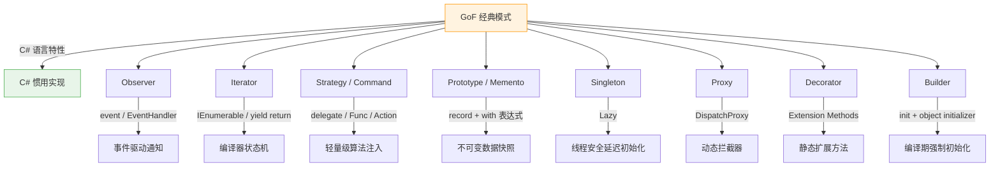

# C# 与 C++ 惯用模式实现 — 语言特性替代经典 GoF

> 所属计划: [[design-patterns-csharp|设计模式 (C#)]]
> 预计耗时: 120 分钟
> 前置知识: [[03-singleton|单例模式]], [[07-prototype|原型模式]], [[12-decorator|装饰器模式]], [[15-proxy|代理模式]], [[18-command|命令模式]], [[19-iterator|迭代器模式]], [[21-memento|备忘录模式]], [[22-observer|观察者模式]], [[24-strategy|策略模式]]

---

## 1. 概念讲解

### 为什么需要"语言惯用模式"？

GoF 的《设计模式》写于 1994 年，目标语言是 C++ 和 Smalltalk。二十多年过去，现代语言已经内建了许多当初需要手写整套类体系才能实现的能力。**继续照搬 GoF 的 C++ 风格实现到 C# 中，就像用汇编思维写 Python——语法上可行，但浪费了语言为你做的事情。**

```mermaid
flowchart LR
    subgraph GoF["经典 GoF 方法（1994）"]
        direction TB
        G1["Observer: ISubject + IObserver + Attach + Detach + Notify<br/>~80 行样板代码"]
        G2["Iterator: IIterator + IAggregate + ConcreteIterator 类<br/>每个集合手写状态机"]
        G3["Strategy: IStrategy 接口 + 每个算法一个类<br/>3 个算法 = 4 个类型"]
        G4["Singleton: 双重检查锁定 + volatile + lock<br/>手动处理线程安全"]
        G5["Prototype: ICloneable + 手写深拷贝<br/>每个字段手动赋值"]
    end

    subgraph CSharp["C# 惯用方法（现代）"]
        direction TB
        C1["event EventHandler<T>: 1 行声明<br/>编译器生成 add/remove"]
        C2["yield return: 1 个方法<br/>编译器生成状态机类"]
        C3["Func<T, TResult>: 1 行 lambda<br/>零额外类型"]
        C4["Lazy<T>: 1 行声明<br/>CLR 保证线程安全"]
        C5["record + with: 1 行声明<br/>编译器生成值相等 + 浅拷贝"]
    end

    GoF -->|"C# 语言特性消除样板代码"| CSharp

    style GoF fill:#f5f5f5,stroke:#999
    style CSharp fill:#e8f5e9,stroke:#4caf50
```



核心洞见：**设计模式的"意图"永不过时，但"实现"应该用语言的最新能力重写。** 解耦、组合优于继承、单向依赖——这些原则不变；但表达这些原则的代码量可以大幅缩减。

### 映射总览



### 使用建议：什么时候用惯用方式，什么时候保留经典方式

| 经典 GoF 模式 | C# 惯用方式 | 使用惯用方式的场景 | 仍然使用经典方式的场景 |
|:-------------|:-----------|:-----------------|:---------------------|
| Observer | `event` / `EventHandler<T>` | UI 事件、属性变更通知、简单的一对多推送 | 需要 `IObserver<T>` 的 `OnCompleted`/`OnError` 语义、需要弱事件/过滤/限流 |
| Iterator | `yield return` | 遍历自定义集合、生成序列、惰性求值 | 需要 `Reset()` 功能、需要包装外部迭代器而非生成、多种遍历策略 |
| Strategy | `Func<T, TResult>` | 单一方法策略（排序比较器、过滤条件）、lambda 即策略 | 多方法策略（加密/解密/验证三件套）、有状态的策略对象 |
| Command | `Action<T>` / `Func<T>` | 简单回调、UI 命令绑定、无状态的单一操作 | 需要 Undo/Redo、需要序列化命令、命令队列持久化 |
| Prototype | `record` + `with` | 不可变 DTO、配置快照、值对象 | 深拷贝复杂对象图、需要自定义克隆逻辑（循环引用） |
| Memento | `record` | 不可变状态快照、撤销栈 | 大对象增量快照、需要加密/压缩的快照 |
| Singleton | `Lazy<T>` | 重量级资源的延迟初始化、配置管理器 | 需要在 DI 容器中显式管理生命周期 |
| Proxy | `DispatchProxy` | 日志/性能监控/重试横切关注点、接口代理 | 远程代理（需自定义协议）、虚拟代理（需自定义加载逻辑） |
| Decorator | Extension Methods | 为密封类/第三方类型添加功能、简单增强 | 多方法装饰、需要装饰器链、运行时动态组合 |
| Builder | `init` + object initializer | 不可变对象构建（编译期强制属性初始化） | 多步骤构建流程、需要验证中间状态、流式 API |

> [!tip] 核心原则
> **能用语言特性解决的问题，不要引入新的类型。** 但如果语言特性不足以表达意图（如多方法策略、需序列化的命令、复杂装饰器链），经典模式仍然是最佳答案。

---

## 2. 代码示例

### 2.1 `event` / `EventHandler<T>` 替代经典 Observer

**经典 GoF Observer**（~80 行样板代码）：

```csharp
// ============================================================
// 经典 GoF：手写 ISubject + IObserver + Attach + Detach + Notify
// ============================================================
public interface IStockObserver
{
    void Update(string symbol, decimal price);
}

public interface IStockSubject
{
    void Attach(IStockObserver observer);
    void Detach(IStockObserver observer);
    void Notify();
}

public class Stock : IStockSubject
{
    private readonly List<IStockObserver> _observers = new();
    private decimal _price;

    public string Symbol { get; }
    public decimal Price
    {
        get => _price;
        set
        {
            if (_price != value) { _price = value; Notify(); }
        }
    }

    public Stock(string symbol, decimal initialPrice)
        => (Symbol, _price) = (symbol, initialPrice);

    public void Attach(IStockObserver observer) => _observers.Add(observer);
    public void Detach(IStockObserver observer) => _observers.Remove(observer);

    public void Notify()
    {
        foreach (var o in _observers.ToArray())
            o.Update(Symbol, Price);
    }
}

public class Investor : IStockObserver
{
    public string Name { get; }
    public Investor(string name) => Name = name;
    public void Update(string symbol, decimal price)
        => Console.WriteLine($"[{Name}] {symbol} @ {price:C}");
}

// 使用:
var stock = new Stock("APPL", 150m);
stock.Attach(new Investor("Alice"));
stock.Attach(new Investor("Bob"));
stock.Price = 155m; // 手动触发 Notify
```

**C# 惯用方式**（~15 行，编译器生成 add/remove 和调用链）：

```csharp
// ============================================================
// C# 惯用：event + EventHandler&lt;T&gt; — 编译器处理一切
// ============================================================
public class PriceChangedEventArgs : EventArgs
{
    public string Symbol { get; }
    public decimal OldPrice { get; }
    public decimal NewPrice { get; }

    public PriceChangedEventArgs(string symbol, decimal oldPrice, decimal newPrice)
        => (Symbol, OldPrice, NewPrice) = (symbol, oldPrice, newPrice);
}

public class Stock
{
    private decimal _price;

    public string Symbol { get; }

    // 一行声明替代 ISubject + Attach + Detach + Notify 全部样板
    public event EventHandler<PriceChangedEventArgs>? PriceChanged;

    public decimal Price
    {
        get => _price;
        set
        {
            if (_price == value) return;
            var oldPrice = _price;
            _price = value;
            OnPriceChanged(new PriceChangedEventArgs(Symbol, oldPrice, _price));
        }
    }

    public Stock(string symbol, decimal initialPrice)
        => (Symbol, _price) = (symbol, initialPrice);

    // 标准触发模式：virtual + 非空检查
    protected virtual void OnPriceChanged(PriceChangedEventArgs e)
        => PriceChanged?.Invoke(this, e);
}

// 使用 — 不需要实现接口，直接 += lambda 即可订阅
var stock = new Stock("APPL", 150m);
stock.PriceChanged += (_, e) =>
    Console.WriteLine($"Alice: {e.Symbol} {e.OldPrice:C} → {e.NewPrice:C}");
stock.PriceChanged += (_, e) =>
    Console.WriteLine($"Bob:   {e.Symbol} {e.OldPrice:C} → {e.NewPrice:C}");

stock.Price = 155m; // 自动触发所有订阅者
```

**对比**：

| 维度 | GoF Observer | C# `event` |
|:-----|:-------------|:-----------|
| 代码量 | ~80 行 | ~20 行 |
| 接口定义 | `ISubject` + `IObserver` 两个接口 | 无 — `EventHandler<T>` 是 BCL 类型 |
| 订阅方式 | `Attach(IObserver)` — 必须实现接口 | `+= lambda` — 任意方法均可 |
| 线程安全 | 需手动处理（`ToArray()` 快照） | 编译器生成的 `add`/`remove` 天然线程安全 |
| 取消订阅 | `Detach(IObserver)` — 必须持有引用 | `-= handler` — 保存委托实例即可 |
| 异常处理 | 一个 Observer 抛异常 → 后续 Observer 收不到通知 | 同 — 但可用 `GetInvocationList()` 逐个 try-catch |
| 内存泄漏 | Observer 容易忘取消订阅 → 泄漏 | 同 — event 不解决泄漏，需要 **弱事件模式** |

> [!warning] `event` 不是银弹
> 当你需要 `OnCompleted`/`OnError` 语义、需要过滤/限流/合并等操作、或需要跨线程调度时，请使用 [[22-observer|观察者模式]] 中介绍的 `IObservable<T>` / Reactive Extensions。

---

### 2.2 `IEnumerable<T>` / `yield return` 替代经典 Iterator

**经典 GoF Iterator**（手写状态机类）：

```csharp
// ============================================================
// 经典 GoF：手写 IEnumerator 状态机
// ============================================================
public class InOrderEnumerator<T> : IEnumerator<T>
{
    private readonly TreeNode<T>? _root;
    private readonly Stack<TreeNode<T>> _stack = new();
    private TreeNode<T>? _current;

    public InOrderEnumerator(TreeNode<T>? root)
    {
        _root = root;
        Reset();
    }

    public T Current => _current!.Value;
    object? System.Collections.IEnumerator.Current => Current;

    public bool MoveNext()
    {
        if (_stack.Count == 0) return false;
        _current = _stack.Pop();
        // 右子树入栈...
        PushLeft(_current.Right);
        return true;
    }

    public void Reset()
    {
        _stack.Clear();
        PushLeft(_root);
    }

    private void PushLeft(TreeNode<T>? node)
    {
        while (node != null) { _stack.Push(node); node = node.Left; }
    }

    public void Dispose() { }
}

// Aggregate 类还需要 CreateIterator()...
```

**C# 惯用方式**（编译器自动生成状态机）：

```csharp
// ============================================================
// C# 惯用：yield return — 编译器生成整个 IEnumerator 状态机
// ============================================================
public class TreeNode<T>
{
    public T Value { get; }
    public TreeNode<T>? Left { get; set; }
    public TreeNode<T>? Right { get; set; }
    public TreeNode(T value) => Value = value;
}

public class BinaryTree<T> : IEnumerable<T>
{
    private TreeNode<T>? _root;

    // 中序遍历 — 递归版本（最简单！）
    public IEnumerable<T> InOrder() => InOrderRec(_root);

    private IEnumerable<T> InOrderRec(TreeNode<T>? node)
    {
        if (node == null) yield break;
        foreach (var v in InOrderRec(node.Left)) yield return v;
        yield return node.Value;
        foreach (var v in InOrderRec(node.Right)) yield return v;
    }

    // 也可以写迭代版本（避免递归栈溢出）
    public IEnumerable<T> InOrderIterative()
    {
        if (_root == null) yield break;
        var stack = new Stack<TreeNode<T>>();
        var current = _root;
        while (stack.Count > 0 || current != null)
        {
            while (current != null) { stack.Push(current); current = current.Left; }
            current = stack.Pop();
            yield return current.Value;
            current = current.Right;
        }
    }

    // IEnumerable<T> 实现 — 默认遍历
    public IEnumerator<T> GetEnumerator() => InOrder().GetEnumerator();
    System.Collections.IEnumerator System.Collections.IEnumerable.GetEnumerator()
        => GetEnumerator();
}

// 使用 — foreach 直接可用
var tree = new BinaryTree<int>();
foreach (var v in tree) Console.WriteLine(v);
```

**编译器生成的等价代码（简化示意）**：

```csharp
// yield return 展开后，编译器生成类似这样的类：
private sealed class <InOrderRec>d__X : IEnumerable<T>, IEnumerator<T>
{
    private int _state;          // 状态机当前状态 (-2: 初始, -1: 结束, 0..n: 各 yield return 位置)
    private T _current;          // 当前元素
    private TreeNode<T> _node;   // 每个 local 变量成为一个字段
    private IEnumerator<T> _enumerator; // foreach 展开为嵌套状态机
    // ... 更多字段保存中间状态

    bool MoveNext() { /* 巨大的 switch(_state) 状态转移代码 */ }
}
```

> [!tip] 你写的 5 行 yield return，编译器生成了 200 行状态机代码 —— 这就是语言的力量。

**对比**：

| 维度 | GoF Iterator | C# `yield return` |
|:-----|:-------------|:-------------------|
| 代码量 | ~80 行（状态机 + 聚合 + 接口） | ~10 行方法 |
| 需要手动管理状态 | 是 — `_position`、`_stack`、`_current` | 否 — 编译器自动生成字段 |
| 支持多个遍历策略 | 是 — 为每种策略写一个类 | 是 — 为每种策略写一个方法 |
| 惰性求值 | 需手动实现 | 自动 — `MoveNext()` 逐元素计算 |
| `Reset()` | 可以实现 | 不支持 — `yield return` 的 `IEnumerator.Reset()` 抛 `NotSupportedException` |
| 调试 | 可以单步进入状态机内部 | 编译器生成的状态机名晦涩（`<InOrder>d__X`），但调试器会优化展示 |

> [!warning] `yield return` 的局限
> 如果迭代器需要 `Reset()` 功能（如某些 COM 互操作场景），必须回退到手动实现 `IEnumerator<T>`。

---

### 2.3 `delegate` / `Func<T,TResult>` / `Action<T>` 替代轻量级 Strategy/Command

**经典 GoF Strategy**（接口 + 多类）：

```csharp
// ============================================================
// 经典 GoF：Strategy — 每个算法一个类
// ============================================================
public interface ISortStrategy
{
    int[] Sort(int[] data);
}

public class BubbleSort : ISortStrategy
{
    public int[] Sort(int[] data) { /* 30 行冒泡排序 */ }
}

public class QuickSort : ISortStrategy
{
    public int[] Sort(int[] data) { /* 40 行快速排序 */ }
}

public class Sorter
{
    private ISortStrategy _strategy;
    public Sorter(ISortStrategy strategy) => _strategy = strategy;
    public void SetStrategy(ISortStrategy strategy) => _strategy = strategy;
    public int[] DoSort(int[] data) => _strategy.Sort(data);
}

// 使用
var sorter = new Sorter(new QuickSort());
var result = sorter.DoSort(new[] { 3, 1, 2 });
```

**经典 GoF Command**（接口 + 类）：

```csharp
// ============================================================
// 经典 GoF：Command — 每个操作一个类
// ============================================================
public interface ICommand { void Execute(); }
public class SaveCommand : ICommand
{
    private readonly Document _doc;
    public SaveCommand(Document doc) => _doc = doc;
    public void Execute() => _doc.Save();
}
public class PrintCommand : ICommand
{
    private readonly Document _doc;
    public PrintCommand(Document doc) => _doc = doc;
    public void Execute() => _doc.Print();
}
// 还需要 Invoker、CommandHistory...
```

**C# 惯用方式**：

```csharp
// ============================================================
// C# 惯用：Strategy → Func&lt;T, TResult&gt; / Comparison&lt;T&gt;
// ============================================================

// 场景 1：排序策略 — Func 替代 ISortStrategy
public class Sorter
{
    // Comparison&lt;T&gt; 就是 delegate int Comparison&lt;T&gt;(T x, T y);
    public static void Sort<T>(T[] data, Comparison<T> comparer)
    {
        Array.Sort(data, comparer);
    }
}

// 使用 — 策略即 lambda
int[] data = { 3, 1, 4, 1, 5, 9 };
Sorter.Sort(data, (a, b) => a.CompareTo(b));      // 升序
Sorter.Sort(data, (a, b) => b.CompareTo(a));      // 降序
Sorter.Sort(data, (a, b) => Math.Abs(a).CompareTo(Math.Abs(b))); // 按绝对值

// LINQ 的整个设计就是 Func 驱动的策略模式：
var result = data
    .Where(x => x > 2)           // Func&lt;int, bool&gt; 作为过滤策略
    .OrderBy(x => x)             // Func&lt;int, TKey&gt; 作为排序策略
    .Select(x => x * 2);         // Func&lt;int, int&gt; 作为映射策略


// ============================================================
// C# 惯用：Command → Action / Action&lt;T&gt; / Func&lt;T&gt;
// ============================================================

// 场景 2：简单命令 — Action 替代 ICommand
public class Toolbar
{
    private readonly List<(string Label, Action Action)> _buttons = new();

    public void AddButton(string label, Action action)
        => _buttons.Add((label, action));

    public void Click(string label)
    {
        var btn = _buttons.FirstOrDefault(b => b.Label == label);
        btn.Action?.Invoke();
    }
}

// 使用 — 命令即 lambda
var toolbar = new Toolbar();
var doc = new Document();
toolbar.AddButton("保存", () => doc.Save());
toolbar.AddButton("打印", () => doc.Print());
toolbar.AddButton("撤销", () => Console.WriteLine("Undo"));

toolbar.Click("保存");  // 执行 SaveCommand


// ============================================================
// 场景 3：需要 Undo 的命令 — 仍然用接口
// ============================================================
// 当命令需要 Undo/Redo 或序列化时，接口仍然是最佳选择：
public interface IUndoableCommand
{
    void Execute();
    void Undo();
}

public class DeleteTextCommand : IUndoableCommand
{
    private readonly TextEditor _editor;
    private readonly int _position;
    private readonly int _length;
    private string _deletedText = "";

    public DeleteTextCommand(TextEditor editor, int position, int length)
        => (_editor, _position, _length) = (editor, position, length);

    public void Execute()
    {
        _deletedText = _editor.Delete(_position, _length);
    }

    public void Undo()
    {
        _editor.Insert(_position, _deletedText);
    }
}
```

**对比 — Strategy**：

| 维度 | GoF Strategy | `Func<T, TResult>` |
|:-----|:-------------|:-------------------|
| 类型定义 | 1 接口 + N 类 | 0 — `Func<T, TResult>` 是 BCL 类型 |
| 策略实例 | `new ConcreteStrategy()` | lambda 表达式 |
| 多方法策略 | 天然支持（接口可包含多个方法） | 不支持 — 一个 `Func` 只对应一个方法 |
| DI 注入 | 接口注入（通过 IoC 容器） | 委托工厂注入（`Func<T>` 可作为依赖） |
| 策略元数据 | 可通过接口扩展（如 `string Name { get; }`） | 无法带元数据 — 委托不包含描述 |

**对比 — Command**：

| 维度 | GoF Command | `Action` / `Func` |
|:-----|:------------|:------------------|
| 类型定义 | 1 接口 + N 类 | 0 |
| 简单回调 | 过度设计 — 为 2 行逻辑写一个类 | `() => DoSomething()` — 恰到好处 |
| Undo/Redo | 天然支持 | 不支持 — 需要保留旧状态 |
| 命令队列/日志 | 接口可以加 `GetDescription()` | 无法内省 |
| 序列化 | 可以 serializable | 不可序列化 |

> [!tip] 判断标准
> **单一方法 + 无状态 + 不需要元数据** → `Func`/`Action`。**多方法 / 需要 Undo / 需要序列化 / 有状态** → 接口。

---

### 2.4 `record` + `with` 表达式替代 Prototype / Memento

**经典 GoF Prototype**（手写克隆）：

```csharp
// ============================================================
// 经典 GoF：ICloneable + 手动逐字段复制
// ============================================================
public class Employee : ICloneable
{
    public string Name { get; set; }
    public string Department { get; set; }
    public Address Address { get; set; } // 引用类型 — 需要深拷贝吗？

    public object Clone()
    {
        // 手动逐字段复制 — 容易遗漏新增字段
        return new Employee
        {
            Name = this.Name,
            Department = this.Department,
            Address = new Address  // 深拷贝 Address？浅拷贝 Address？
            {
                Street = this.Address.Street,
                City = this.Address.City
            }
        };
    }
}
```

**经典 GoF Memento**（手写快照管理）：

```csharp
// ============================================================
// 经典 GoF：Memento — 手写快照类 + Caretaker
// ============================================================
public class EditorMemento
{
    public string Content { get; }
    public int CursorPosition { get; }
    public EditorMemento(string content, int cursorPosition)
        => (Content, CursorPosition) = (content, cursorPosition);
}

public class TextEditor
{
    private string _content = "";
    private int _cursorPosition;

    public EditorMemento Save() => new(_content, _cursorPosition);
    public void Restore(EditorMemento memento)
        => (_content, _cursorPosition) = (memento.Content, memento.CursorPosition);
}

public class History
{
    private readonly Stack<EditorMemento> _history = new();
    public void Push(EditorMemento m) => _history.Push(m);
    public EditorMemento? Pop() => _history.TryPop(out var m) ? m : null;
}
```

**C# 惯用方式**：

```csharp
// ============================================================
// C# 惯用：record — 编译器生成值相等 + Clone + 解构 + ToString
// ============================================================

// ---- Prototype 替代：用 record + with ----

// record 自动生成：
//   - 基于值的 Equals / GetHashCode / == / !=
//   - 编译器生成的 Clone() 方法
//   - with 表达式（创建修改了特定字段的副本）
//   - Deconstruct 解构方法
//   - 有意义的 ToString()
public record Address(string Street, string City, string ZipCode);

public record Employee(string Name, string Department, Address Address, decimal Salary);

// 使用 — with 表达式创建"修改了某些字段的副本"
var alice = new Employee("Alice", "Engineering",
    new Address("123 Main St", "Seattle", "98101"), 120000m);

// with 表达式 = 浅拷贝 + 修改指定字段
var promotedAlice = alice with { Department = "Management", Salary = 150000m };
var relocatedAlice = alice with
{
    Address = alice.Address with { City = "Redmond" } // 嵌套 with
};

Console.WriteLine(alice);            // Employee { Name = Alice, Department = Engineering, ... }
Console.WriteLine(promotedAlice);    // Employee { Name = Alice, Department = Management, Salary = 150000, ... }
Console.WriteLine(alice == promotedAlice); // False — Salary 不同


// ---- Memento 替代：用 record 作为不可变快照 ----

public record EditorState(string Content, int CursorPosition, DateTime Timestamp);

public class TextEditor
{
    private string _content = "";
    private int _cursorPosition;

    public void Type(string text)
        => _content = _content.Insert(_cursorPosition, text);

    public EditorState Save()
        => new(_content, _cursorPosition, DateTime.UtcNow);

    public void Restore(EditorState state)
        => (_content, _cursorPosition) = (state.Content, state.CursorPosition);

    public override string ToString() => _content;
}

// 撤销栈
var editor = new TextEditor();
var history = new Stack<EditorState>();

editor.Type("Hello");
history.Push(editor.Save());

editor.Type(" World");
history.Push(editor.Save());

// 撤销 2 次
editor.Restore(history.Pop()); // 回到 "Hello"
editor.Restore(history.Pop()); // 回到 ""
```

**对比**：

| 维度 | GoF Prototype | `record` + `with` |
|:-----|:--------------|:------------------|
| 代码量 | ~30 行 Clone 方法 | 0 — 编译器生成 |
| 逐字段复制 | 手动 — 易遗漏新增字段 | 编译器自动生成 |
| 深拷贝 vs 浅拷贝 | 由 Clone 方法决定 | `with` 始终是**浅拷贝** — 引用成员共享 |
| 值相等 | 需要手动 override `Equals` | 编译器自动生成 |
| 不可变性 | 需要手动设计 `{ get; init; }` | `record` 默认 `{ get; init; }`（位置记录） |
| 格式化输出 | 手动写 `ToString()` | 编译器自动生成 |
| 适用场景 | 需要深拷贝、需要自定义克隆逻辑 | 不可变 DTO、配置快照、值对象 |

> [!warning] `with` 是浅拷贝
> `record` 的 `with` 表达式**只复制 record 自身的字段**，引用类型成员在副本和原对象之间**共享引用**。如需深拷贝，仍需手动实现或使用序列化（如 `System.Text.Json` 序列化再反序列化）。

```csharp
var alice = new Employee("Alice", "Eng", new Address("1st", "NYC", "10001"), 100m);
var alice2 = alice with { }; // 浅拷贝

// alice 和 alice2 共享同一个 Address 实例！
alice.Address.Street = "Changed";
Console.WriteLine(alice2.Address.Street); // "Changed" — 意料之外！
```

---

### 2.5 `Lazy<T>` 替代经典 Singleton

**经典 GoF Singleton**（手写双重检查锁定）：

```csharp
// ============================================================
// 经典 GoF：双重检查锁定 + volatile
// ============================================================
public sealed class DatabaseConnectionPool
{
    private static volatile DatabaseConnectionPool? _instance;
    private static readonly object _lock = new();

    private DatabaseConnectionPool()
    {
        // 初始化连接池...
        Console.WriteLine("Pool initialized.");
    }

    public static DatabaseConnectionPool Instance
    {
        get
        {
            if (_instance is not null)
                return _instance;

            lock (_lock)
            {
                if (_instance is null)
                    _instance = new DatabaseConnectionPool();
                return _instance;
            }
        }
    }

    public string GetConnection() => "connection";
}
```

**C# 惯用方式**：

```csharp
// ============================================================
// C# 惯用：Lazy&lt;T&gt; — BCL 全权处理线程安全
// ============================================================

// 方式 A：Lazy&lt;T&gt; 延迟初始化（推荐）
public sealed class DatabaseConnectionPool
{
    private static readonly Lazy<DatabaseConnectionPool> _lazy =
        new(() => new DatabaseConnectionPool());

    private DatabaseConnectionPool()
    {
        Console.WriteLine("Pool initialized.");
    }

    public static DatabaseConnectionPool Instance => _lazy.Value;

    public string GetConnection() => "connection";
}


// 方式 B：静态构造器 — C# 语言级保证（更简洁，但失去延迟初始化）
public sealed class ConfigManager
{
    public static ConfigManager Instance { get; } = new();

    private ConfigManager()
    {
        Console.WriteLine("Config loaded at type-first-access.");
    }
}
// CLR 保证：静态构造器在 AppDomain 中最多执行一次，且是线程安全的。
// 代价：首次访问 ConfigManager 的任何成员（包括 Instance）都会触发初始化。
// 对于轻量配置——OK。对于重量资源——用 Lazy&lt;T&gt;。
```

**对比**：

| 维度 | 手写双重检查锁定 | `Lazy<T>` |
|:-----|:-----------------|:----------|
| 代码量 | ~30 行 | ~10 行 |
| 线程安全 | 手动保证（容易出错） | `ExecutionAndPublication` 模式默认线程安全 |
| 指令重排 | 需要 `volatile` | 内部处理 |
| 异常处理 | 无特殊处理 | 默认缓存异常（可配置） |
| 延迟初始化 | 是 | 是（可选：`LazyThreadSafetyMode` 控制时机） |
| 测试友好 | 否 — 全局静态状态 | 同 — `Lazy<T>` 不解决全局状态问题 |
| 性能 | 首次后零开销 | 首次后零开销（`_lazy.Value` 是直接字段读） |

> [!tip] `Lazy<T>` 不是 Singleton 模式
> `Lazy<T>` 解决的是"如何安全地延迟初始化一个值"，而不是"如何保证全局只有一个实例"。真正的 Singleton 替代方案是 **DI 容器的 Singleton 生命周期管理**——`Lazy<T>` 仅是实现细节之一。

---

### 2.6 `DispatchProxy` 替代手动 Proxy

**经典 GoF Proxy**（手写接口代理）：

```csharp
// ============================================================
// 经典 GoF：手写 Proxy — 每个方法逐一拦截
// ============================================================
public interface IUserService
{
    User? GetById(int id);
    void Save(User user);
    void Delete(int id);
}

public class UserService : IUserService
{
    public User? GetById(int id) { /* 数据库查询 */ }
    public void Save(User user) { /* 数据库保存 */ }
    public void Delete(int id) { /* 数据库删除 */ }
}

// ❌ 每个方法都要手写日志代码 — 样板爆炸
public class LoggingUserServiceProxy : IUserService
{
    private readonly IUserService _inner;

    public LoggingUserServiceProxy(IUserService inner) => _inner = inner;

    public User? GetById(int id)
    {
        Console.WriteLine($"[LOG] GetById({id})");
        var sw = Stopwatch.StartNew();
        var result = _inner.GetById(id);
        Console.WriteLine($"[LOG] GetById({id}) completed in {sw.ElapsedMilliseconds}ms");
        return result;
    }

    public void Save(User user)
    {
        Console.WriteLine($"[LOG] Save({user.Id})");
        var sw = Stopwatch.StartNew();
        _inner.Save(user);
        Console.WriteLine($"[LOG] Save({user.Id}) completed in {sw.ElapsedMilliseconds}ms");
    }

    public void Delete(int id)
    {
        Console.WriteLine($"[LOG] Delete({id})");
        var sw = Stopwatch.StartNew();
        _inner.Delete(id);
        Console.WriteLine($"[LOG] Delete({id}) completed in {sw.ElapsedMilliseconds}ms");
    }
}
```

**C# 惯用方式**：

```csharp
// ============================================================
// C# 惯用：DispatchProxy — 动态生成代理类
// ============================================================
using System.Reflection;

public class LoggingProxy<T> : DispatchProxy where T : class
{
    private T? _inner;

    public static T Create(T inner)
    {
        // DispatchProxy.Create 在运行时动态生成一个实现了 T 接口的代理类
        var proxy = Create<T, LoggingProxy<T>>();
        ((LoggingProxy<T>)(object)proxy)._inner = inner;
        return proxy;
    }

    protected override object? Invoke(MethodInfo? targetMethod, object?[]? args)
    {
        if (targetMethod == null) return null;

        var methodName = targetMethod.Name;
        Console.WriteLine($"[LOG] {methodName} called with args: {string.Join(", ", args ?? [])}");

        var sw = Stopwatch.StartNew();
        try
        {
            var result = targetMethod.Invoke(_inner, args);
            Console.WriteLine($"[LOG] {methodName} completed in {sw.ElapsedMilliseconds}ms");
            return result;
        }
        catch (TargetInvocationException ex)
        {
            Console.WriteLine($"[LOG] {methodName} FAILED: {ex.InnerException?.Message}");
            throw ex.InnerException!;
        }
    }
}

// 使用 — 一行代码创建日志代理
IUserService service = LoggingProxy<IUserService>.Create(new UserService());
service.GetById(42);
service.Save(new User { Id = 1, Name = "Alice" });

// 输出:
// [LOG] GetById called with args: 42
// [LOG] GetById completed in 12ms
// [LOG] Save called with args: User { Id = 1, Name = Alice }
// [LOG] Save completed in 5ms
```

**对比**：

| 维度 | 手写 Proxy | `DispatchProxy` |
|:-----|:-----------|:----------------|
| 代码量 | O(N × M) — N 个代理 × M 个方法 | O(1) — 一个 `Invoke` 方法 |
| 新增接口方法 | 需更新每个代理 | 自动拦截 — 零修改 |
| 类型安全 | 编译期检查 | 运行时反射 — 无编译期检查 |
| 性能 | 直接调用 → 快 | 反射调用 → 慢 ~10-50x |
| 调试 | 直接堆栈跟踪 | 反射层使堆栈更深 |
| 泛型方法 | 天然支持 | 天然支持 |
| `out`/`ref` 参数 | 支持 | 有限支持 — 需要特殊处理 |
| .NET Framework | 需要 `System.Reflection.DispatchProxy` NuGet 包 | .NET Core / .NET 5+ 内置 |

> [!tip] `DispatchProxy` 的性能警告
> 反射调用比直接调用慢 1-2 个数量级。如果代理在热路径上，考虑：
> - **Source Generators**（编译期生成代理代码，零反射开销）
> - **Castle DynamicProxy**（通过 IL Emit 生成，比纯反射快但不如 Source Generator）
> - 手写代理（热路径上仍然是最快的）

---

### 2.7 Extension Methods 替代简单 Decorator

**经典 GoF Decorator**（需要相同接口 + 包装类）：

```csharp
// ============================================================
// 经典 GoF：Decorator — 需要接口 + 包装类
// ============================================================
public interface ILogger
{
    void Log(string message);
}

public class ConsoleLogger : ILogger
{
    public void Log(string message) => Console.WriteLine(message);
}

public class TimestampDecorator : ILogger
{
    private readonly ILogger _inner;
    public TimestampDecorator(ILogger inner) => _inner = inner;

    public void Log(string message)
    {
        _inner.Log($"[{DateTime.Now:HH:mm:ss}] {message}");
    }
}

// 使用
ILogger logger = new TimestampDecorator(new ConsoleLogger());
logger.Log("Hello");
```

**C# 惯用方式 — Extension Methods**：

```csharp
// ============================================================
// C# 惯用：Extension Methods — 在静态类中扩展已有类型
// ============================================================

// 场景 1：为密封类 / 第三方类型添加功能
public static class StringExtensions
{
    // 为 string 添加扩展方法 — string 是 sealed，无法继承
    public static string Truncate(this string value, int maxLength)
        => value.Length <= maxLength ? value : value[..maxLength] + "...";

    public static bool IsValidEmail(this string value)
        => value.Contains('@') && value.Contains('.');
}

// 使用 — 扩展方法看起来像实例方法
var title = "This is a very long title that needs truncation".Truncate(20);
Console.WriteLine(title); // "This is a very long..."


// 场景 2：为接口添加"装饰器风格"的扩展方法
public interface ILogger
{
    void Log(string message);
}

public class ConsoleLogger : ILogger
{
    public void Log(string message) => Console.WriteLine(message);
}

public static class LoggerExtensions
{
    public static void LogWithTimestamp(this ILogger logger, string message)
        => logger.Log($"[{DateTime.Now:HH:mm:ss}] {message}");

    public static void LogError(this ILogger logger, string message)
        => logger.Log($"[ERROR] {message}");

    public static void LogWarning(this ILogger logger, string message)
        => logger.Log($"[WARN] {message}");

    // 扩展方法还可以带条件
    public static void LogIf(this ILogger logger, bool condition, string message)
    {
        if (condition) logger.Log(message);
    }
}

// 使用 — 无需装饰器类！
ILogger logger = new ConsoleLogger();
logger.LogWithTimestamp("Hello");          // [14:30:22] Hello
logger.LogError("Something went wrong");   // [ERROR] Something went wrong
logger.LogIf(true, "Conditional log");    // Conditional log


// 场景 3：组合多个扩展方法 — 管道风格
string result = "  Hello World  "
    .Trim()
    .ToUpperInvariant()
    .Truncate(10);
Console.WriteLine(result); // "HELLO WO..."
```

**对比**：

| 维度 | 经典 Decorator | Extension Methods |
|:-----|:---------------|:------------------|
| 依赖接口 | 是 — `IComponent` 必须存在 | 是 — 但可以为**已有类型/密封类**添加方法 |
| 类型层次 | 需要新类继承 `Decorator` 基类 | 不需要新类型 — 静态方法即可 |
| 运行时组合 | 是 — `new A(new B(new C()))` 装饰器链 | 不支持 — 扩展方法编译期绑定 |
| 状态管理 | 每个装饰器可持有自己的状态 | 扩展方法不应带状态（违反预期） |
| 多方法装饰 | 天然支持 | 需为每个方法写一个扩展方法 |
| 可发现性 | 只在代码中可见 | IDE 智能提示自动显示（`using` 指令控制可见性） |
| LINQ 风格管线 | 需要包装器 | `list.Where().Select().OrderBy()` — 自然链式调用 |

> [!warning] Extension Methods 的局限
> 1. **不能 override 已有方法** — 如果类型已有同名方法，扩展方法永远不会被调用
> 2. **不能访问私有成员** — 只能通过公共 API 工作
> 3. **不能动态组合** — 扩展方法是编译期解析的，没有运行时的装饰器链灵活性
> 4. **不适合有状态的增强** — 带状态的扩展方法会让调用者困惑

```csharp
// ❌ 扩展方法的常见误用 — 带外部状态的"装饰器"
public static class BadExtensions
{
    private static int _callCount = 0; // 静态可变状态！

    public static void LogAndCount(this ILogger logger, string message)
    {
        _callCount++;
        logger.Log($"[#{_callCount}] {message}"); // 全局计数，测试噩梦
    }
}
```

---

### 2.8 `init` 属性 + Object Initializer 替代部分 Builder 用法

**经典 GoF Builder**（复杂构建流程）：

```csharp
// ============================================================
// 经典 GoF：Builder — 多步骤 + 流式 API
// ============================================================
public class Pizza
{
    public string Size { get; set; } = "";
    public bool Cheese { get; set; }
    public bool Pepperoni { get; set; }
    public bool Mushrooms { get; set; }
    public string Crust { get; set; } = "";

    public override string ToString()
        => $"{Size} pizza: Cheese={Cheese}, Pepperoni={Pepperoni}, "
         + $"Mushrooms={Mushrooms}, Crust={Crust}";
}

public class PizzaBuilder
{
    private readonly Pizza _pizza = new();

    public PizzaBuilder SetSize(string size) { _pizza.Size = size; return this; }
    public PizzaBuilder AddCheese() { _pizza.Cheese = true; return this; }
    public PizzaBuilder AddPepperoni() { _pizza.Pepperoni = true; return this; }
    public PizzaBuilder AddMushrooms() { _pizza.Mushrooms = true; return this; }
    public PizzaBuilder SetCrust(string crust) { _pizza.Crust = crust; return this; }

    public Pizza Build()
    {
        // 可在此验证：Size 不能为空
        if (string.IsNullOrEmpty(_pizza.Size))
            throw new InvalidOperationException("Size is required");
        return _pizza;
    }
}

// 使用
var pizza = new PizzaBuilder()
    .SetSize("Large")
    .AddCheese()
    .AddPepperoni()
    .SetCrust("Thin")
    .Build();
```

**C# 惯用方式 — `init` + Object Initializer**：

```csharp
// ============================================================
// C# 惯用：init 属性 + object initializer
// ============================================================

// init 属性：只能在构造函数或 object initializer 中赋值
// 之后变为"只读" — 编译期保证不可变性
public class PizzaConfig
{
    public string Size { get; init; } = "";
    public bool Cheese { get; init; }
    public bool Pepperoni { get; init; }
    public bool Mushrooms { get; init; }
    public string Crust { get; init; } = "";

    public override string ToString()
        => $"{Size} pizza: Cheese={Cheese}, Pepperoni={Pepperoni}, "
         + $"Mushrooms={Mushrooms}, Crust={Crust}";
}

// 使用 — object initializer 替代 Builder
var pizza = new PizzaConfig
{
    Size = "Large",
    Cheese = true,
    Pepperoni = true,
    Crust = "Thin"
};

// ❌ 编译错误 — init 属性在初始化后不可写
// pizza.Size = "Small";  // CS8852: Init-only property can only be assigned in
//                          // an object initializer or constructor

Console.WriteLine(pizza);


// ============================================================
// record 版本 — 更简洁（位置参数 + init 自动生成）
// ============================================================
public record PizzaRecord(string Size, bool Cheese, bool Pepperoni, bool Mushrooms, string Crust);

// 使用 — 命名参数 + with
var pizza1 = new PizzaRecord(Size: "Large", Cheese: true, Pepperoni: true,
                              Mushrooms: false, Crust: "Thin");
var pizza2 = pizza1 with { Mushrooms = true };
```

**使用 `required` 关键字（C# 11+）强制编译期初始化**：

```csharp
// C# 11+: required 关键字 — 编译期强制赋值
public class DatabaseConfig
{
    public required string ConnectionString { get; init; }
    public required int MaxPoolSize { get; init; }
    public int TimeoutSeconds { get; init; } = 30; // 有默认值 → 可选
}

// ❌ 编译错误 — required 属性未赋值
// var config = new DatabaseConfig { TimeoutSeconds = 60 };
// CS9035: Required member 'DatabaseConfig.ConnectionString' must be set

// ✅ 必须赋值所有 required 属性
var config = new DatabaseConfig
{
    ConnectionString = "Server=...",
    MaxPoolSize = 100,
    TimeoutSeconds = 60  // 可选
};
```

**对比**：

| 维度 | Builder 模式 | `init` + Object Initializer |
|:-----|:-------------|:---------------------------|
| 代码量 | Builder 类（~30 行） + Product 类 | 仅 Product 类（~10 行） |
| 编译期强制 | 否 — Builder 在运行时验证 | `required` 关键字在**编译期**强制 |
| 不可变性 | Build() 后可返回不可变对象 | `init` 在构造后自动变为只读 |
| 多步骤构建 | 支持 — Builder 可持有中间状态 | 不支持 — object initializer 一次性完成 |
| 构建逻辑 | 可在 `Build()` 中执行复杂验证/转换 | 有限 — 可在构造函数中验证 |
| 流式 API | 支持 — `return this` 链式调用 | 使用 C# 语法糖（`{}` 块）而非链式 |
| 需要 Builder 的场景 | 1) 多步骤构建 2) 中间状态验证 3) Director 控制流程 | 简单的属性组合 |

> [!tip] 判断标准
> **简单属性组合**（Pizza 例子） → `init` + object initializer。**多步骤构建流程**（如解析配置文件、构造 SQL 查询、组装复杂对象图） → Builder 模式。Builder 在多步骤流程中仍不可替代。

```csharp
// 仍然需要 Builder 的场景 — 多步骤 SQL 查询构建
var query = new SqlQueryBuilder()
    .Select("Id", "Name", "Email")
    .From("Users")
    .Where("Age > @minAge", new { minAge = 18 })
    .OrderBy("Name", ascending: true)
    .Limit(50)
    .Build();
// 这种复杂的逐步构建，init + object initializer 无法表达
```

---


## C++ 实现

C++ 同样拥有强大的语言级替代方案：`std::function` + lambda 替代策略/命令模式，CRTP 实现静态多态替代 Visitor/Template Method，Policy-based design 零成本编译期策略选择，RAII 天然替代 Dispose 模式。

### 2.9 `std::function` / lambda 替代 Strategy / Command

```cpp
#include <iostream>
#include <functional>
#include <vector>
#include <algorithm>

using namespace std;
// ============================================================
// Strategy：std::function<void(vector<int>&)> 替代 ISortStrategy
// ============================================================
class SortContext {
    function<void(vector<int>&)> strategy_;

public:
    void SetStrategy(function<void(vector<int>&)> s) {
        strategy_ = move(s);
    }

    void Execute(vector<int>& data) {
        if (strategy_) strategy_(data);
    }
};
int main_strategy() {
    vector<int> data = {5, 2, 9, 1, 5, 6};
    SortContext ctx;
    // Lambda 即策略 — 无需定义 BubbleSort 类
    ctx.SetStrategy([](vector<int>& arr) {
        size_t n = arr.size();
        for (size_t i = 0; i < n - 1; ++i) {
            bool swapped = false;
            for (size_t j = 0; j < n - 1 - i; ++j)
                if (arr[j] > arr[j + 1])
                    swap(arr[j], arr[j + 1]), swapped = true;
            if (!swapped) break;
        }
    });
    ctx.Execute(data);
    for (int v : data) cout << v << " ";
    cout << "\n  动态切换策略: ";
    // 运行时切换 — 换一个 lambda 即可
    vector<int> data2 = {5, 2, 9, 1, 5, 6};
    ctx.SetStrategy([](vector<int>& arr) {
        sort(arr.begin(), arr.end());  // std::sort
    });
    ctx.Execute(data2);
    for (int v : data2) cout << v << " ";
    cout << endl;
    // Command 模式：std::function<void()> 替代 ICommand
    vector<function<void()>> commands;
    commands.push_back([] { cout << "命令 1: 打印日志" << endl; });
    commands.push_back([] { cout << "命令 2: 发送通知" << endl; });
    for (auto& cmd : commands) cmd();  // 执行所有命令
    return 0;
}
```
### 2.10 CRTP — 编译期多态替代 Visitor / Template Method
```cpp
#include <iostream>
#include <string>
using namespace std;
// ============================================================
// CRTP (Curiously Recurring Template Pattern)
// 基类是模板，参数是子类自身 → 编译期多态
// ============================================================
// --- 替代 Template Method ---
template <typename Derived>
class DataPipelineCRTP {
public:
    // 模板方法 — 编译期绑定，零虚函数开销
    void Execute() {
        cout << "=== Pipeline Start ===" << endl;
        static_cast<Derived*>(this)->ReadData();     // 编译期分发到子类
        static_cast<Derived*>(this)->ProcessData();
        static_cast<Derived*>(this)->WriteData();
        cout << "=== Pipeline End ===" << endl;
    }
};
class CsvPipelineCRTP : public DataPipelineCRTP<CsvPipelineCRTP> {
public:
    void ReadData()    { cout << "  [CSV] Reading..." << endl; }
    void ProcessData() { cout << "  [CSV] Processing..." << endl; }
    void WriteData()   { cout << "  [CSV] Writing..." << endl; }
};
// --- 替代 Visitor（静态多态版本）---
template <typename Derived>
class AnimalCRTP {
public:
    string Name() const {
        return static_cast<const Derived*>(this)->NameImpl();
    }
};

class Dog : public AnimalCRTP<Dog> {
public:
    string NameImpl() const { return "Dog"; }
};

class Cat : public AnimalCRTP<Cat> {
public:
    string NameImpl() const { return "Cat"; }
};
// 泛型"访问者" — 不依赖虚函数
template <typename T>
void PrintAnimal(const AnimalCRTP<T>& animal) {
    cout << "Animal: " << animal.Name() << endl;
}
int main_crtp() {
    CsvPipelineCRTP csv;
    csv.Execute();
    Dog dog;
    Cat cat;
    PrintAnimal(dog);
    PrintAnimal(cat);
    return 0;
}
```
### 2.11 Policy-based Design — 零成本编译期策略选择
```cpp
#include <iostream>
#include <vector>
#include <algorithm>
using namespace std;
// ============================================================
// Policy-based Design: 策略作为模板参数，编译期绑定
// 参考：Andrei Alexandrescu "Modern C++ Design"
// ============================================================
// Policy 类 — 无需共同基类，只需符合隐式接口
struct StdSortPolicy {
    static string Name() { return "std::sort"; }
    static void Sort(vector<int>& arr) { sort(arr.begin(), arr.end()); }
};
struct BubbleSortPolicy {
    static string Name() { return "BubbleSort"; }
    static void Sort(vector<int>& arr) {
        size_t n = arr.size();
        for (size_t i = 0; i < n - 1; ++i) {
            bool swapped = false;
            for (size_t j = 0; j < n - 1 - i; ++j)
                if (arr[j] > arr[j + 1])
                    swap(arr[j], arr[j + 1]), swapped = true;
            if (!swapped) break;
        }
    }
};
// Context — 模板类，策略编译期注入
template <typename SortPolicy = StdSortPolicy>  // 默认策略
class SortProcessor {
public:
    void Process(vector<int>& data) {
        cout << "Using: " << SortPolicy::Name() << endl;
        SortPolicy::Sort(data);
    }
};
int main_policy() {
    vector<int> d1 = {5, 2, 9, 1};
    SortProcessor<StdSortPolicy> sp1;
    sp1.Process(d1);

    vector<int> d2 = {5, 2, 9, 1};
    SortProcessor<BubbleSortPolicy> sp2;
    sp2.Process(d2);
    // 默认策略（StdSortPolicy）
    vector<int> d3 = {8, 3, 6, 2};
    SortProcessor<> sp3;  // 使用默认模板参数
    sp3.Process(d3);
    return 0;
}
```
### 2.12 RAII 替代 Dispose / IDisposable
```cpp
#include <iostream>
#include <fstream>
#include <memory>
#include <mutex>
using namespace std;
// ============================================================
// C++ RAII: 资源获取即初始化 — 析构函数自动释放
// C# IDisposable + using 的手动模式 → C++ 的确定性自动析构
// ============================================================
// --- 文件资源：fstream 自动关闭 ---
void WriteFile(const string& path, const string& content) {
    ofstream file(path);   // 构造 → 打开文件
    file << content;       // 使用
    // file 析构 → 自动 fclose()，即使抛异常也会执行
}
// --- 自定义 RAII 包装器 ---
class FileLogger {
    ofstream file_;
public:
    explicit FileLogger(const string& path) : file_(path) {
        if (!file_)
            throw runtime_error("Cannot open: " + path);
    }
    void Log(const string& msg) {
        file_ << msg << endl;
    }
    // 无需显式 Dispose() — 析构函数自动关闭
    ~FileLogger() {
        file_.close();
        cout << "[RAII] Logger closed automatically" << endl;
    }
    // 禁止拷贝（文件资源独占）
    FileLogger(const FileLogger&) = delete;
    FileLogger& operator=(const FileLogger&) = delete;
};
// --- Lock Guard: std::lock_guard 替代 lock()/unlock() ---
mutex mtx;
void ThreadSafeOperation() {
    lock_guard<mutex> lock(mtx); // 构造 → 加锁
    cout << "Thread-safe work..." << endl;
    // lock 析构 → 自动解锁，即使抛异常
}
// --- unique_ptr: 自动 delete ---
void UseResource() {
    auto ptr = make_unique<int>(42); // 构造 → 分配内存
    cout << "*ptr = " << *ptr << endl;
    // ptr 析构 → 自动 delete，即使抛异常
}
int main_raii() {
    WriteFile("test.txt", "Hello RAII!");
    {
        FileLogger logger("log.txt");
        logger.Log("第一条日志");
        logger.Log("第二条日志");
    } // logger 在此析构，自动关闭文件
    UseResource();

    cout << "所有资源均已自动释放" << endl;
    return 0;
}
```
```bash
# 编译运行（合并所有 main 函数，选择运行其中一个）
g++ -std=c++17 -o idiomatic_demo main.cpp && ./idiomatic_demo
```
> **C++ 核心要点**：
> - **`std::function<void(vector<int>&)>`**：可持有任意可调用对象（lambda、函数指针、bind 结果），是 Strategy/Command 的零类实现 — 无需定义接口和实现类
> - **CRTP**：`class Dog : public AnimalCRTP<Dog>` — 基类通过 `static_cast<Derived*>(this)` 在编译期绑定子类方法。无虚函数表、无运行时开销。适合 Template Method 和 Visitor 的静态替代
> - **Policy-based Design**：模板参数定义策略，编译期生成特化代码。C++ 标准库的 `std::allocator`、`std::char_traits` 均用此技术。核心原则：策略是类型，不是对象
> - **RAII vs Dispose**：C++ 析构函数是**确定性的** — 对象离开作用域立即调用，编译器保证。无须 `using` / `try-finally` / `Dispose()`。这是 C++ 最大的语言优势之一
> - **`lock_guard<mutex>`**：等价于 C# 的 `lock` 语句，但更通用 — 可与任何锁类型（`shared_mutex`、`recursive_mutex`）配合

---
## 3. 练习

### 练习 1：将经典 Observer 重构为事件驱动（基础）

**目标**：把以下经典 GoF Observer 实现改写为 `event EventHandler<T>` 风格。

**原始代码**（有问题的实现）—— 一个温度传感器，当温度超过阈值时通知多个监控器：

```csharp
public interface ITemperatureObserver
{
    void OnTemperatureChanged(string sensorId, double temperature);
}

public interface ITemperatureSensor
{
    void Attach(ITemperatureObserver observer);
    void Detach(ITemperatureObserver observer);
}

public class TemperatureSensor : ITemperatureSensor
{
    private readonly List<ITemperatureObserver> _observers = new();
    private double _temperature;

    public string SensorId { get; }
    public double Temperature
    {
        get => _temperature;
        set
        {
            if (Math.Abs(_temperature - value) > 0.1)
            {
                _temperature = value;
                Notify();
            }
        }
    }

    public TemperatureSensor(string sensorId) => SensorId = sensorId;

    public void Attach(ITemperatureObserver observer) => _observers.Add(observer);
    public void Detach(ITemperatureObserver observer) => _observers.Remove(observer);

    private void Notify()
    {
        foreach (var o in _observers) o.OnTemperatureChanged(SensorId, Temperature);
    }
}

// 两个观察者
public class AlertMonitor : ITemperatureObserver
{
    private readonly double _threshold;
    public AlertMonitor(double threshold) => _threshold = threshold;
    public void OnTemperatureChanged(string id, double temp)
    {
        if (temp > _threshold)
            Console.WriteLine($"ALERT: {id} temperature {temp}°C exceeds {_threshold}°C!");
    }
}

public class LoggingMonitor : ITemperatureObserver
{
    public void OnTemperatureChanged(string id, double temp)
        => Console.WriteLine($"[{DateTime.Now:HH:mm:ss}] {id}: {temp}°C");
}
```

**任务**：
1. 定义 `TemperatureChangedEventArgs : EventArgs` 类（包含 `SensorId`、`OldTemperature`、`NewTemperature`）
2. 将 `TemperatureSensor` 改写为使用 `event EventHandler<TemperatureChangedEventArgs>`
3. 修改 `AlertMonitor` 和 `LoggingMonitor` 为使用 `+=` 订阅（不再实现接口）
4. 在 `Main` 中创建 Sensor 和两个 Monitor，模拟温度变化，验证通知

**验证标准**：
```csharp
// 期望输出类似：
// [12:00:01] SENSOR-001: 25.0°C
// ALERT: SENSOR-001 temperature 30.5°C exceeds 28°C!
// [12:00:02] SENSOR-001: 30.5°C
```

---

### 练习 2：将经典 Iterator 重构为 `yield return`（进阶）

**目标**：手写一个迭代器实现有序链表的双向遍历，然后用 `yield return` 重写为惰性生成器。

**原始代码** — 有序链表 + 手写 `IEnumerator<T>`：

```csharp
public class Node<T>
{
    public T Value { get; set; }
    public Node<T>? Next { get; set; }
    public Node<T>? Prev { get; set; }
    public Node(T value) => Value = value;
}

public class SortedLinkedList<T> : IEnumerable<T> where T : IComparable<T>
{
    private Node<T>? _head;
    private Node<T>? _tail;

    public void Insert(T value)
    {
        var node = new Node<T>(value);
        if (_head == null) { _head = _tail = node; return; }

        var current = _head;
        while (current != null && current.Value.CompareTo(value) < 0)
            current = current.Next;

        if (current == null) { _tail!.Next = node; node.Prev = _tail; _tail = node; }
        else if (current == _head) { node.Next = _head; _head.Prev = node; _head = node; }
        else
        {
            node.Prev = current.Prev;
            node.Next = current;
            current.Prev!.Next = node;
            current.Prev = node;
        }
    }

    // ❌ 手写 IEnumerator — 用 yield return 替代
    public IEnumerator<T> GetEnumerator()
    {
        // TODO: 用 yield return 实现正序遍历
    }
    System.Collections.IEnumerator System.Collections.IEnumerable.GetEnumerator()
        => GetEnumerator();
}
```

**任务**：
1. 实现 `GetEnumerator()` — 使用 `yield return` 从 `_head` 遍历到 `_tail`
2. 添加 `Reverse()` 方法 — 返回 `IEnumerable<T>`，使用 `yield return` 从 `_tail` 遍历到 `_head`
3. 添加 `GreaterThan(T threshold)` 方法 — 使用 `yield return` 返回所有大于阈值的数据（利用链表已排序的特性提前终止）
4. 编写 `Main` 插入 10 个随机数，分别用三种遍历方式输出

**验证标准**：
```csharp
// 期望输出类似：
// 正序: 3, 7, 12, 18, 25, 31, 44, 58, 67, 82
// 倒序: 82, 67, 58, 44, 31, 25, 18, 12, 7, 3
// >50:  58, 67, 82
```

---

### 练习 3：`record` + `with` vs Builder 的场景选择（挑战）

**目标**：对于同一个需求，分别用 `record` + `with` 和 Builder 模式实现，并判断哪种更适合。

**场景**：设计一个"API 请求配置"对象的构建方式。

需求：
- 必填字段：`Url`（string）、`Method`（enum: GET/POST/PUT/DELETE）
- 可选字段：`Headers`（`Dictionary<string, string>`）、`TimeoutSeconds`（int，默认 30）、`RetryCount`（int，默认 0）、`Body`（string?）
- 约束：`Method` 为 GET/DELETE 时不应设置 `Body`

**任务**：
1. 实现 **方案 A**：用 `record` + `with`（使用 `required` 关键字或构造函数保证 Url + Method 必填）
2. 实现 **方案 B**：用 Builder 模式（`RequestBuilder` 流式 API，在 `Build()` 中验证约束）
3. 两套实现都通过以下测试用例：

```csharp
// 用例 1：最小配置
var req = new RequestConfig { Url = "https://api.example.com", Method = HttpMethod.Get };

// 用例 2：完整配置
var req = new RequestConfig
{
    Url = "https://api.example.com/users",
    Method = HttpMethod.Post,
    Body = """{"name": "Alice"}""",
    Headers = new() { ["Authorization"] = "Bearer xxx" },
    RetryCount = 3
};

// 用例 3：从已有配置派生（添加 Header）
var baseConfig = new RequestConfig { Url = "...", Method = HttpMethod.Get };
var withAuth = baseConfig with { Headers = new() { ["Authorization"] = "Bearer yyy" } };

// 用例 4（应被 Builder 拦截）：GET 请求带了 Body
var bad = new RequestBuilder()
    .SetUrl("https://api.example.com")
    .SetMethod(HttpMethod.Get)
    .SetBody("should not be here") // Builder 应在 Build() 时抛异常
    .Build();
```

4. **分析报告**（写在注释中）：对于本场景，哪种方案更合适？为什么？具体指出 3 个判断依据。

---

## 4. 扩展阅读

### 必读

- **MSDN: [Events (C# Programming Guide)](https://learn.microsoft.com/en-us/dotnet/csharp/programming-guide/events/)** — C# `event` 关键字的完整文档
- **MSDN: [Iterators (C#)](https://learn.microsoft.com/en-us/dotnet/csharp/iterators)** — `yield return` 和迭代器模式的官方指南
- **MSDN: [Records (C#)](https://learn.microsoft.com/en-us/dotnet/csharp/language-reference/builtin-types/record)** — `record` 类型和 `with` 表达式的完整参考
- **MSDN: [Lazy<T> Class](https://learn.microsoft.com/en-us/dotnet/api/system.lazy-1)** — `Lazy<T>` 线程安全模式详解
- **MSDN: [DispatchProxy Class](https://learn.microsoft.com/en-us/dotnet/api/system.reflection.dispatchproxy)** — 动态代理的运行时生成机制

### 推荐

- [[03-singleton|单例模式]] — `Lazy<T>` vs 静态构造器 vs DI 容器：三种 Singleton 策略的深度对比
- [[07-prototype|原型模式]] — `record` 浅拷贝 vs `ICloneable` 深拷贝：什么时候该用什么
- [[12-decorator|装饰器模式]] — Extension Methods vs 经典 Decorator：静态扩展 vs 运行时组合
- [[15-proxy|代理模式]] — `DispatchProxy` vs 手写 Proxy vs Source Generators：三种代理的性能对比
- [[18-command|命令模式]] — `Action` vs `ICommand` 接口：简单回调 vs 可撤销命令
- [[19-iterator|迭代器模式]] — `yield return` 状态机的内部工作原理
- [[21-memento|备忘录模式]] — `record` 不可变快照 + 撤销栈的惯用实现
- [[22-observer|观察者模式]] — `event` vs `IObservable<T>` vs Reactive Extensions：从简单到复杂
- [[24-strategy|策略模式]] — `Func<T, TResult>` vs `IStrategy` 接口：单方法 vs 多方法策略

### 拓展

- **Source Generators** — 编译期代码生成替代 `DispatchProxy`：零反射开销的动态代理（见 [MSDN: Source Generators](https://learn.microsoft.com/en-us/dotnet/csharp/roslyn-sdk/source-generators-overview)）
- **Castle DynamicProxy** — 功能更丰富的运行时代理库（支持 class proxy、interceptor pipeline、mixin）
- **Scrutor** — `IServiceCollection` 的装饰器/拦截器扩展（DI 容器中注册装饰器链）
- **[C# Language Design: Required Members](https://learn.microsoft.com/en-us/dotnet/csharp/language-reference/keywords/required)** — `required` 关键字的设计讨论和规范

---

## 常见陷阱

> [!danger] `#1` — 误以为每种 GoF 模式都有 C# 语言级替代
> 语言特性只覆盖了部分模式。以下模式**没有**语言级替代，仍需要经典的接口/类体系：
>
> | 仍需经典实现的模式 | 原因 |
> |:-------------------|:-----|
> | [[11-composite|Composite]] | 树形结构需要统一的 `Add`/`Remove`/`GetChild` 接口 |
> | [[13-facade|Facade]] | 本质是"简化接口"，不是语言特性能替代的 |
> | [[09-adapter|Adapter]] | 类型不兼容的转换—必须有适配器类 |
> | [[10-bridge|Bridge]] | 抽象与实现分离—这是架构决策，不是语言糖 |
> | [[17-chain-of-responsibility|Chain of Responsibility]] | 需要链表结构 + 动态顺序，不是单个委托能表达的 |
> | [[20-mediator|Mediator]] | 多对多协调— `event` 只能表达一对多 |
> | [[23-state|State]] | 状态转移逻辑需要状态对象持有上下文，`Func` 不够 |
> | [[26-visitor|Visitor]] | 双重分派需要语言级别的 multiple dispatch（C# 不支持） |
>
> ```csharp
> // ❌ 错误：试图用 event 替代 Mediator
> // 10 个组件之间互相发 event → 混乱的网状依赖
> // ✅ Mediator 引入星型拓扑，集中协调
> ```

> [!danger] `#2` — 过度使用语言特性导致可读性崩溃
> 语言特性让代码更短，但**不总是更清晰**。当简化后的代码需要注释来解释意图时，说明简化过头了：
>
> ```csharp
> // ❌ 过度简化 — 意图不明确
> var result = items
>     .Select(x => new { x, t = factory(() => handler(x)) })
>     .Where(a => a.t.Match(s => s > 0, _ => false))
>     .Aggregate((a, b) => new { a.x, t = a.t + b.t });
>
> // ✅ 保留经典模式 — 意图清晰
> var strategy = new ThresholdStrategy(handler, factory);
> var filter = new PositiveResultFilter();
> var results = new ResultAccumulator();
> foreach (var item in items)
> {
>     var result = strategy.Evaluate(item);
>     if (filter.ShouldInclude(result))
>         results.Accumulate(result);
> }
> ```
>
> **判断标准**：如果你的同行需要 2 分钟才能理解你的单行 lambda，那就该拆成命名方法或类。

> [!danger] `#3` — 在同个代码库中混用不同风格
> 最糟糕的设计是"类 A 用 `event`，类 B 用经典 Observer 接口"—团队的认知负担翻倍。
>
> ```csharp
> // ❌ 同一代码库中的风格不一致
> public class StockService
> {
>     // 用 event — C# 风格
>     public event EventHandler<PriceChangedEventArgs>? PriceChanged;
> }
>
> public class WeatherService
> {
>     // 用经典 Observer 接口 — GoF 风格
>     private readonly List<IWeatherObserver> _observers = new();
>     public void Attach(IWeatherObserver o) => _observers.Add(o);
>     public void Detach(IWeatherObserver o) => _observers.Remove(o);
> }
> ```
>
> **决策流程**：
>
> ```mermaid
> flowchart TD
>     Start([新功能需要设计模式]) --> Check{语言特性<br/>能表达吗?}
>     Check -->|"是 — 且足够清晰"| UseIdiom[使用 C# 惯用方式]
>     Check -->|"否 — 或过度简化"| CheckExisting{项目中已有<br/>相同模式的实现?}
>     CheckExisting -->|是| Follow[遵循现有风格]
>     CheckExisting -->|否| Choose[团队讨论决定风格<br/>并写入 .editorconfig]
>
>     UseIdiom --> Doc[更新团队编码规范]
>     Follow --> Doc
>     Choose --> Doc
>
>     style UseIdiom fill:#c8e6c9
>     style Follow fill:#fff9c4
>     style Choose fill:#ffe0b2
> ```
>
> **团队规范建议**：在 `.editorconfig` 或团队 Wiki 中明确约定：
> - Observer 场景 → 统一用 `event`（除非需要 `OnCompleted`/`OnError` → `IObservable<T>`）
> - Iterator 场景 → 统一用 `yield return`
> - 单方法策略 → 统一用 `Func<T, TResult>`
> - 多方法策略 → 统一用接口（而非混用 `Func` 和接口）

> [!warning] `#4` — `record` 的 `with` 是浅拷贝——嵌套对象共享引用
> 见 [[#2.4 `record` `with` 表达式替代 Prototype / Memento|2.4 节]] 的警告。`with` 只复制 record 顶层字段，嵌套引用类型在副本间共享。如果需要深拷贝，考虑：
> - 将所有嵌套类型也声明为 `record`，使用嵌套 `with`
> - 或使用 `System.Text.Json` 序列化反序列化（简单但慢）

> [!warning] `#5` — 扩展方法无法被 override
> 如果类型自身定义了同名方法，扩展方法**永远不会被调用**——编译器总是优先选择实例方法：
>
> ```csharp
> public class MyLogger : ILogger
> {
>     public void Log(string message) => Console.WriteLine(message);
>
>     // 如果 MyLogger 自己定义了 LogError，扩展方法永远不会被调用
>     public void LogError(string message) => Console.WriteLine($"INTERNAL: {message}");
> }
>
> // 即使 using 了 LoggerExtensions，调用的仍是 MyLogger.LogError
> new MyLogger().LogError("test"); // → "INTERNAL: test"
> ```
