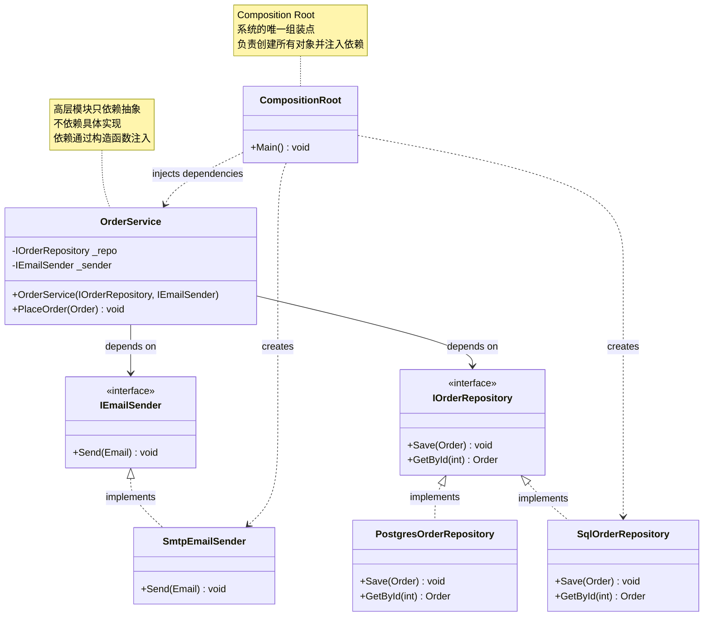
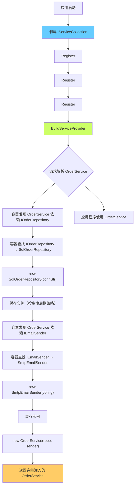
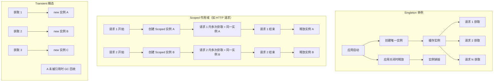

# 依赖注入 + DI 容器

> 所属计划: [[design-patterns-csharp|设计模式 (C#)]]
> 预计耗时: 120 分钟
> 前置知识: [[01-design-patterns-overview|设计模式概述 + SOLID 原则]]、[[03-singleton|单例模式]]、[[04-factory-method|工厂方法模式]]、[[24-strategy|策略模式]]

---

## 1. 概念讲解

### 为什么需要依赖注入？

[[01-design-patterns-overview|SOLID 原则]]中的 D — Dependency Inversion Principle（依赖倒置原则）告诉我们：**高层模块不应依赖低层模块，两者都应依赖抽象**。依赖注入（Dependency Injection, DI）是实现 DIP 的具体技术手段。

看一个违反 DIP 的典型例子：

```csharp
// ❌ 违反 DIP：OrderService 直接依赖 SqlOrderRepository 和 SmtpEmailSender
public class OrderService
{
    private readonly SqlOrderRepository _repository = new SqlOrderRepository("connStr");
    private readonly SmtpEmailSender _emailSender = new SmtpEmailSender("smtp.server.com");

    public void PlaceOrder(Order order)
    {
        _repository.Save(order);
        _emailSender.Send(new OrderConfirmation(order));
    }
}
```

这段代码有五个硬伤：

1. **紧耦合**：`OrderService` 编译期绑定到 `SqlOrderRepository` 和 `SmtpEmailSender`——换数据库或换邮件服务必须改 `OrderService` 代码
2. **无法单元测试**：测试 `PlaceOrder` 被迫连接真实数据库和邮件服务器——这不是单元测试，是集成测试
3. **违反 OCP**：想支持 Postgres 存储或第三方邮件 API？只能修改 `OrderService`
4. **违反 SRP**：`OrderService` 不该关心"如何创建依赖"——它只应关心"业务编排"
5. **生命周期失控**：每个 `OrderService` 都独立创建自己的 `SqlOrderRepository`——连接池无法共享，资源泄露风险

**依赖注入的本质**：对象不自行创建依赖，而是从外部**接收**（注入）依赖。依赖的创建、组装、生命周期管理由外部控制。

### 核心思想



三大注入方式：

| 方式 | 何时用 | C# 实现 | 适用场景 |
|------|--------|---------|---------|
| **构造函数注入**（首选） | 依赖在对象整个生命周期中必需 | `public MyService(IDep d) { _d = d; }` | 99% 的场景，编译期强制依赖不缺失 |
| **属性注入**（可选依赖） | 依赖有合理默认值或可选的 | `public IDep? Dep { get; set; }` | 插件、日志器、可选策略 |
| **方法注入**（临时依赖） | 依赖仅在某次调用中需要 | `void DoWork(IDep d) { d.Help(); }` | 数据 token、上下文对象、调用级特定配置 |

```csharp
// ✅ 构造函数注入：编译期保证依赖不为 null，不可变
public class OrderService
{
    private readonly IOrderRepository _repository;
    private readonly IEmailSender _emailSender;

    public OrderService(IOrderRepository repository, IEmailSender emailSender)
    {
        _repository = repository ?? throw new ArgumentNullException(nameof(repository));
        _emailSender = emailSender ?? throw new ArgumentNullException(nameof(emailSender));
    }

    public void PlaceOrder(Order order)
    {
        _repository.Save(order);
        _emailSender.Send(new OrderConfirmation(order));
    }
}
```

### 依赖注入容器 (DI Container / IoC Container)

手动注入在小项目可行，但当一个系统有数百个类、复杂的依赖图时，手动组装变得脆弱且无聊。**DI 容器**是一个对象工厂 + 生命周期管理器——它自动解析依赖关系、创建对象树、管理对象生命周期。



主流的 .NET DI 容器：

| 容器 | NuGet 包 | 特点 |
|------|---------|------|
| **Microsoft.Extensions.DependencyInjection** | 内置 | ASP.NET Core 默认、轻量、够用 90% 场景 |
| **Autofac** | `Autofac` | 成熟、支持属性注入、模块化注册、装饰器、拦截器 |
| **Lamar** | `Lamar` | 快速、编译期代码生成、原名 StructureMap |
| **Simple Injector** | `SimpleInjector` | 诊断详尽、性能优秀、违规时编译期警告 |
| **Unity** | `Unity.Container` | 老牌、类属性注入友好、不推荐新项目 |
| **Castle Windsor** | `Castle.Windsor` | 拦截器一流、配置灵活、学习曲线陡 |

本文重点讲 **Microsoft.Extensions.DependencyInjection**——它是 .NET 生态的"标准版"，ASP.NET Core、Host Builder 都基于它构建。

### DI 容器与设计模式的关系

DI 容器不是一种"新模式"——它是多种设计模式的**基础设施**，让这些模式更容易实施：

| 模式 | 没有 DI 容器时 | 有 DI 容器时 |
|------|-------------|-----------|
| **单例** [[03-singleton\|Singleton]] | 手写 `Lazy<T>` + `sealed` + `private ctor` | `services.AddSingleton<ILogger, Logger>()` |
| **工厂方法** [[04-factory-method\|Factory Method]] | 每个产品一个工厂类 | `services.AddTransient<T>(sp => { ... })` 或 `Func<T>` 工厂委托 |
| **策略** [[24-strategy\|Strategy]] | 手动 `switch` + `new` | `services.AddKeyedSingleton("algoA", typeof(AlgoA))` 或 `IEnumerable<IStrategy>` 注入 |
| **装饰器** [[12-decorator\|Decorator]] | 手写层层 `new Decorator(new Inner())` | `services.Decorate<IService, LoggingDecorator>()`（Scrutor 库） |

---

## 2. 代码示例

### 示例 1：手动 DI（composition root 模式）

完整可运行示例——无容器、纯手动组装：

```csharp
using System;
using System.Collections.Generic;

#region 领域模型与抽象

public class Order
{
    public int Id { get; set; }
    public string Product { get; set; } = string.Empty;
    public decimal Amount { get; set; }
    public DateTime CreatedAt { get; set; } = DateTime.UtcNow;

    public override string ToString()
        => $"Order #{Id}: {Product} × {Amount:C} at {CreatedAt:HH:mm:ss}";
}

public class Email
{
    public string To { get; init; } = string.Empty;
    public string Subject { get; init; } = string.Empty;
    public string Body { get; init; } = string.Empty;
}

public interface IOrderRepository
{
    void Save(Order order);
    Order? GetById(int id);
}

public interface IEmailSender
{
    void Send(Email email);
}

public interface IOrderValidator
{
    bool Validate(Order order);
}

#endregion

#region 具体实现

public class InMemoryOrderRepository : IOrderRepository
{
    private readonly Dictionary<int, Order> _store = new();

    public void Save(Order order)
    {
        _store[order.Id] = order;
        Console.WriteLine($"[Repository] 保存订单: {order}");
    }

    public Order? GetById(int id)
        => _store.GetValueOrDefault(id);
}

public class ConsoleEmailSender : IEmailSender
{
    public void Send(Email email)
        => Console.WriteLine($"[Email] 发送 → {email.To}: {email.Subject} — {email.Body}");
}

public class SimpleOrderValidator : IOrderValidator
{
    public bool Validate(Order order)
    {
        if (string.IsNullOrWhiteSpace(order.Product))
        {
            Console.WriteLine($"[Validator] 拒绝: 产品名为空");
            return false;
        }
        if (order.Amount <= 0)
        {
            Console.WriteLine($"[Validator] 拒绝: 金额必须大于 0");
            return false;
        }
        Console.WriteLine($"[Validator] 通过: {order.Product}");
        return true;
    }
}

public class OrderService
{
    private readonly IOrderRepository _repository;
    private readonly IEmailSender _emailSender;
    private readonly IOrderValidator _validator;

    public OrderService(
        IOrderRepository repository,
        IEmailSender emailSender,
        IOrderValidator validator)
    {
        _repository = repository;
        _emailSender = emailSender;
        _validator = validator;
    }

    public bool PlaceOrder(Order order)
    {
        if (!_validator.Validate(order))
            return false;

        _repository.Save(order);
        _emailSender.Send(new Email
        {
            To = "customer@example.com",
            Subject = $"订单确认 #{order.Id}",
            Body = $"您的订单 {order.Product} (¥{order.Amount}) 已确认"
        });
        return true;
    }
}

#endregion

#region Composition Root — 系统的唯一组装点

public static class Program
{
    public static void Main()
    {
        // ═══════════════════════════════════════════
        // COMPOSITION ROOT: 所有依赖在这里组装
        // 这是整个系统中唯一使用 new 的地方
        // ═══════════════════════════════════════════
        IOrderRepository repository = new InMemoryOrderRepository();
        IEmailSender emailSender = new ConsoleEmailSender();
        IOrderValidator validator = new SimpleOrderValidator();

        var orderService = new OrderService(repository, emailSender, validator);

        // ═══════════════════════════════════════════
        // 应用程序逻辑：只使用已注入的对象
        // ═══════════════════════════════════════════
        var orders = new[]
        {
            new Order { Id = 1, Product = "C# 设计模式书籍", Amount = 99.00m },
            new Order { Id = 2, Product = "", Amount = 50.00m },          // 验证失败
            new Order { Id = 3, Product = "机械键盘", Amount = -20.00m }, // 验证失败
        };

        foreach (var order in orders)
        {
            Console.WriteLine($"\n处理: {order}");
            bool success = orderService.PlaceOrder(order);
            Console.WriteLine($"结果: {(success ? "成功" : "失败")}");
        }
    }
}

#endregion
```

**运行方式：**
```bash
dotnet new console -n ManualDI
# 将上述代码放入 Program.cs（替换默认内容）
dotnet run --project ManualDI
```

**预期输出：**
```text
处理: Order #1: C# 设计模式书籍 × ¥99.00 at 12:34:56
[Validator] 通过: C# 设计模式书籍
[Repository] 保存订单: Order #1: C# 设计模式书籍 × ¥99.00 at 12:34:56
[Email] 发送 → customer@example.com: 订单确认 #1 — 您的订单 C# 设计模式书籍 (¥99.00) 已确认
结果: 成功

处理: Order #2:  × ¥50.00 at 12:34:56
[Validator] 拒绝: 产品名为空
结果: 失败

处理: Order #3: 机械键盘 × -¥20.00 at 12:34:56
[Validator] 拒绝: 金额必须大于 0
结果: 失败
```

> [!tip] Composition Root 是唯一使用 `new` 的地方
> 应用程序代码（`OrderService`、验证器、仓储）只通过构造函数接收依赖——它们不知道具体实现类型，也不关心对象是如何创建的。这是 DI 和 DIP 的核心实践。

---

### 示例 2：Microsoft.Extensions.DependencyInjection（构造函数注入）

```csharp
using Microsoft.Extensions.DependencyInjection;
using System;

#region 领域接口与实现（与示例 1 相同的接口，新增更多实现）

public interface IOrderRepository { void Save(Order order); Order? GetById(int id); }
public interface IEmailSender { void Send(Email email); }
public interface IOrderValidator { bool Validate(Order order); }
public interface IPaymentProcessor { void Process(Order order); }

public class SqlOrderRepository : IOrderRepository
{
    private readonly string _connStr;
    public SqlOrderRepository(string connStr) { _connStr = connStr; }
    public void Save(Order order)
        => Console.WriteLine($"[SQL Repository] 写入 {order.Product} → {_connStr}");
    public Order? GetById(int id) { return null; }
}

public class SmtpEmailSender : IEmailSender
{
    private readonly string _smtpServer;
    public SmtpEmailSender(string smtpServer) { _smtpServer = smtpServer; }
    public void Send(Email email)
        => Console.WriteLine($"[SMTP → {_smtpServer}] 发送邮件: {email.Subject}");
}

public class OrderValidator : IOrderValidator
{
    public bool Validate(Order order)
    {
        if (string.IsNullOrWhiteSpace(order.Product) || order.Amount <= 0)
        {
            Console.WriteLine($"[Validator] 订单 #{order.Id} 验证失败");
            return false;
        }
        return true;
    }
}

public class StripePaymentProcessor : IPaymentProcessor
{
    private readonly string _apiKey;
    public StripePaymentProcessor(string apiKey) { _apiKey = apiKey; }
    public void Process(Order order)
        => Console.WriteLine($"[Stripe: {_apiKey[..4]}...] 处理支付 ¥{order.Amount}");
}

public record Order(int Id, string Product, decimal Amount);
public record Email(string To, string Subject, string Body);

#endregion

#region 使用 DI 的业务服务

public class OrderService
{
    private readonly IOrderRepository _repository;
    private readonly IEmailSender _emailSender;
    private readonly IOrderValidator _validator;
    private readonly IPaymentProcessor _paymentProcessor;

    // 构造函数注入 — 容器自动解析所有参数
    public OrderService(
        IOrderRepository repository,
        IEmailSender emailSender,
        IOrderValidator validator,
        IPaymentProcessor paymentProcessor)
    {
        _repository = repository;
        _emailSender = emailSender;
        _validator = validator;
        _paymentProcessor = paymentProcessor;
    }

    public bool PlaceOrder(Order order)
    {
        if (!_validator.Validate(order)) return false;

        _paymentProcessor.Process(order);
        _repository.Save(order);
        _emailSender.Send(new Email(
            "user@example.com",
            $"Order #{order.Id} Confirmed",
            $"Thank you for purchasing {order.Product}"));

        return true;
    }
}

#endregion

#region Composition Root — 使用 DI 容器

public static class Program
{
    public static void Main()
    {
        // ═══════════════════════════════════════════════╗
        // 1. 创建 DI 容器并注册服务                        ║
        // ═══════════════════════════════════════════════╝
        var services = new ServiceCollection();

        // 注册接口 → 实现的映射
        services.AddSingleton<IOrderRepository>(_ =>
            new SqlOrderRepository("Server=localhost;Database=Orders;"));
        services.AddSingleton<IEmailSender>(_ =>
            new SmtpEmailSender("smtp.example.com"));
        services.AddTransient<IOrderValidator, OrderValidator>();
        services.AddSingleton<IPaymentProcessor>(_ =>
            new StripePaymentProcessor("sk_live_abc123xyz"));

        // 注册 OrderService 自身（它也需要被容器管理）
        services.AddTransient<OrderService>();

        // 构建容器
        IServiceProvider provider = services.BuildServiceProvider();

        // ═══════════════════════════════════════════════╗
        // 2. 从容器解析并使用服务                           ║
        // ═══════════════════════════════════════════════╝
        var orderService = provider.GetRequiredService<OrderService>();

        orderService.PlaceOrder(new Order(1, "C# 设计模式", 99.00m));

        // 再次解析 — 验证 Singleton 行为
        var service2 = provider.GetRequiredService<OrderService>();
        Console.WriteLine($"\n两次解析的 OrderService 是同一实例? {ReferenceEquals(orderService, service2)}");
        // Transient → False
    }
}

#endregion
```

**运行方式：**
```bash
dotnet new console -n MsDiDemo
cd MsDiDemo
dotnet add package Microsoft.Extensions.DependencyInjection
# 将上述代码放入 Program.cs
dotnet run
```

**预期输出：**
```text
[Stripe: sk_l...] 处理支付 ¥99.00
[SQL Repository] 写入 C# 设计模式 → Server=localhost;Database=Orders;
[SMTP → smtp.example.com] 发送邮件: Order #1 Confirmed

两次解析的 OrderService 是同一实例? False
```

> [!tip] 容器做了什么？
> 当调用 `GetRequiredService<OrderService>()` 时，容器自动检测 `OrderService` 构造函数的所有参数（`IOrderRepository`、`IEmailSender`、`IOrderValidator`、`IPaymentProcessor`），递归解析每个依赖，逐级创建对象树，最终返回一个完全注入的 `OrderService`。这一切发生在运行时。

---

### 示例 3：生命周期管理 — Singleton、Scoped、Transient

DI 容器不只是一个工厂——它管理对象的**生命周期**。Microsoft DI 提供三种生命周期：



```csharp
using Microsoft.Extensions.DependencyInjection;
using System;

#region 生命周期演示服务

public interface ILifetimeDemo
{
    Guid Id { get; }
    string Type { get; }
}

public class LifetimeDemo : ILifetimeDemo
{
    public Guid Id { get; } = Guid.NewGuid();
    public string Type { get; init; } = string.Empty;
}

public class Consumer
{
    // 注入三个不同生命周期的依赖，观察 ID 变化
    public ILifetimeDemo Singleton { get; }
    public ILifetimeDemo Scoped { get; }
    public ILifetimeDemo Transient { get; }

    public Consumer(ILifetimeDemo singleton, ILifetimeDemo scoped, ILifetimeDemo transient)
    {
        Singleton = singleton;
        Scoped = scoped;
        Transient = transient;
    }

    public void Report(string label)
    {
        Console.WriteLine($"\n━━━ {label} ━━━");
        Console.WriteLine($"  Singleton  ID: {Singleton.Id.ToString()[..8]}...");
        Console.WriteLine($"  Scoped     ID: {Scoped.Id.ToString()[..8]}...");
        Console.WriteLine($"  Transient  ID: {Transient.Id.ToString()[..8]}...");
    }
}

#endregion

public static class Program
{
    public static void Main()
    {
        var services = new ServiceCollection();

        // 注册同一个实现类到三个不同生命周期
        services.AddSingleton<ILifetimeDemo>(_ =>
            new LifetimeDemo { Type = "Singleton" });
        services.AddScoped<ILifetimeDemo>(_ =>
            new LifetimeDemo { Type = "Scoped" });
        services.AddTransient<ILifetimeDemo>(_ =>
            new LifetimeDemo { Type = "Transient" });

        services.AddTransient<Consumer>();

        IServiceProvider root = services.BuildServiceProvider();

        // ═══ 场景 1：同一作用域内多次解析 ═══
        Console.WriteLine("═══ 场景 1：同一作用域内多次解析 ═══");
        using (var scope = root.CreateScope())
        {
            var consumer1 = scope.ServiceProvider.GetRequiredService<Consumer>();
            consumer1.Report("Scope A — 第一次解析");

            var consumer2 = scope.ServiceProvider.GetRequiredService<Consumer>();
            consumer2.Report("Scope A — 第二次解析");
        }

        // ═══ 场景 2：不同作用域之间 ═══
        Console.WriteLine("\n═══ 场景 2：不同作用域之间 ═══");
        using (var scopeA = root.CreateScope())
        {
            var a = scopeA.ServiceProvider.GetRequiredService<Consumer>();
            a.Report("Scope A");
        }

        using (var scopeB = root.CreateScope())
        {
            var b = scopeB.ServiceProvider.GetRequiredService<Consumer>();
            b.Report("Scope B");
        }

        // ═══ 场景 3：Singleton 在跨作用域时一致 ═══
        Console.WriteLine("\n═══ 场景 3：Singleton 在所有作用域共享 ═══");
        Guid? singletonId = null;
        using (var scope1 = root.CreateScope())
        {
            var c1 = scope1.ServiceProvider.GetRequiredService<Consumer>();
            singletonId = c1.Singleton.Id;
            Console.WriteLine($"  Scope1 中 Singleton ID: {singletonId.ToString()![..8]}...");
        }
        using (var scope2 = root.CreateScope())
        {
            var c2 = scope2.ServiceProvider.GetRequiredService<Consumer>();
            bool same = c2.Singleton.Id == singletonId;
            Console.WriteLine($"  Scope2 中 Singleton ID: {c2.Singleton.Id.ToString()[..8]}...");
            Console.WriteLine($"  两次相同? {same}");
        }
    }
}

#endregion
```

**运行方式：**
```bash
dotnet new console -n LifetimeDemo
cd LifetimeDemo
dotnet add package Microsoft.Extensions.DependencyInjection
# 将上述代码放入 Program.cs
dotnet run
```

**预期输出：**（具体 GUID 每次不同）
```text
═══ 场景 1：同一作用域内多次解析 ═══

━━━ Scope A — 第一次解析 ━━━
  Singleton  ID: a1b2c3d4...    ← 全应用唯一
  Scoped     ID: e5f6a7b8...    ← 同一 Scope 内相同
  Transient  ID: 9c0d1e2f...    ← 每次不同

━━━ Scope A — 第二次解析 ━━━
  Singleton  ID: a1b2c3d4...    ← 与上次相同
  Scoped     ID: e5f6a7b8...    ← 同一 Scope 内相同
  Transient  ID: 3a4b5c6d...    ← 每次不同

═══ 场景 2：不同作用域之间 ═══

━━━ Scope A ━━━
  Scoped     ID: 7e8f9a0b...    ← Scope A 的实例

━━━ Scope B ━━━
  Scoped     ID: 1c2d3e4f...    ← Scope B 的不同实例

═══ 场景 3：Singleton 在所有作用域共享 ═══
  Scope1 中 Singleton ID: a1b2c3d4...
  Scope2 中 Singleton ID: a1b2c3d4...
  两次相同? True
```

**生命周期速查表：**

| 生命周期 | 注册方法 | 实例化 | ASP.NET Core 典型用法 |
|----------|---------|--------|----------------------|
| **Singleton** | `AddSingleton<T>` | 首次解析时创建，之后复用同一实例 | 配置读取器、缓存、日志工厂 |
| **Scoped** | `AddScoped<T>` | 每个 Scope 一个实例 | DbContext、UnitOfWork |
| **Transient** | `AddTransient<T>` | 每次解析创建新实例 | 轻量级无状态服务、Validator |

---

### 示例 4：DI 容器如何替代 Factory、管理 Singleton、装配 Strategy

DI 容器让多个设计模式的开销降到几乎为零：

```csharp
using Microsoft.Extensions.DependencyInjection;
using System;
using System.Collections.Generic;
using System.Linq;

#region 1. DI 替代工厂方法模式

public interface IReportGenerator
{
    string Format { get; }
    string Generate(string data);
}

public class PdfReportGenerator : IReportGenerator
{
    public string Format => "PDF";
    public string Generate(string data) => $"[PDF] {data} (with headers & footers)";
}

public class ExcelReportGenerator : IReportGenerator
{
    public string Format => "Excel";
    public string Generate(string data) => $"[XLSX] {data} (with charts)";
}

public class CsvReportGenerator : IReportGenerator
{
    public string Format => "CSV";
    public string Generate(string data) => $"[CSV] {data} (comma-separated)";
}

/// <summary>
/// 不再需要 switch/case 工厂！DI 容器本身就是工厂。
/// 注入 IEnumerable&lt;IReportGenerator&gt; 即可获取所有实现。
/// </summary>
public class ReportService
{
    private readonly IEnumerable<IReportGenerator> _generators;

    public ReportService(IEnumerable<IReportGenerator> generators)
    {
        _generators = generators;
    }

    public void ExportAll(string data)
    {
        foreach (var gen in _generators)
        {
            Console.WriteLine($"[{gen.Format} Generator] → {gen.Generate(data)}");
        }
    }

    public string Export(string data, string format)
    {
        var generator = _generators.FirstOrDefault(g =>
            g.Format.Equals(format, StringComparison.OrdinalIgnoreCase));
        if (generator is null)
            throw new ArgumentException($"Unsupported format: {format}");
        return generator.Generate(data);
    }
}

#endregion

#region 2. DI 管理 Singleton（替代手写 Lazy&lt;T&gt;）

public interface IAppMetrics
{
    int RequestCount { get; }
    void Increment();
}

/// <summary>
/// 不需要 sealed class / private ctor / Lazy&lt;T&gt;！
/// services.AddSingleton&lt;IAppMetrics, AppMetrics&gt;() 就搞定了。
/// </summary>
public class AppMetrics : IAppMetrics
{
    public int RequestCount { get; private set; }
    public void Increment() => RequestCount++;
}

public class DashboardService
{
    private readonly IAppMetrics _metrics;
    public DashboardService(IAppMetrics metrics) => _metrics = metrics;
    public void Show() => Console.WriteLine($"Total requests: {_metrics.RequestCount}");
}

#endregion

#region 3. DI 装配策略模式

public interface IShippingStrategy
{
    string Name { get; }
    decimal Calculate(Order order);
}

public record Order(int Id, decimal Amount, string Destination);

public class StandardShipping : IShippingStrategy
{
    public string Name => "Standard";
    public decimal Calculate(Order order) => order.Amount >= 100 ? 0 : 9.99m;
}

public class ExpressShipping : IShippingStrategy
{
    public string Name => "Express";
    public decimal Calculate(Order order) => 24.99m;
}

public class InternationalShipping : IShippingStrategy
{
    public string Name => "International";
    public decimal Calculate(Order order) => 49.99m + order.Amount * 0.05m;
}

/// <summary>
/// 所有策略通过 IEnumerable&lt;IShippingStrategy&gt; 注入。
/// 新增策略只需添加实现类并注册——不需要修改 ShippingService。
/// </summary>
public class ShippingService
{
    private readonly Dictionary<string, IShippingStrategy> _strategies;

    public ShippingService(IEnumerable<IShippingStrategy> strategies)
    {
        _strategies = strategies.ToDictionary(s => s.Name, StringComparer.OrdinalIgnoreCase);
    }

    public void ListStrategies()
    {
        Console.WriteLine("Available shipping methods:");
        foreach (var kvp in _strategies)
            Console.WriteLine($"  - {kvp.Key}");
    }

    public decimal CalculateShipping(Order order, string method)
    {
        if (!_strategies.TryGetValue(method, out var strategy))
            throw new ArgumentException($"Unknown shipping method: {method}");
        return strategy.Calculate(order);
    }
}

#endregion

#region Composition Root

public static class Program
{
    public static void Main()
    {
        var services = new ServiceCollection();

        // ═══════════════════════════════════════════
        // 替代工厂方法: 注册所有 IReportGenerator 实现
        // ═══════════════════════════════════════════
        services.AddTransient<IReportGenerator, PdfReportGenerator>();
        services.AddTransient<IReportGenerator, ExcelReportGenerator>();
        services.AddTransient<IReportGenerator, CsvReportGenerator>();
        services.AddTransient<ReportService>();

        // ═══════════════════════════════════════════
        // 替代手写 Singleton: 一行代码
        // ═══════════════════════════════════════════
        services.AddSingleton<IAppMetrics, AppMetrics>();
        services.AddTransient<DashboardService>();

        // ═══════════════════════════════════════════
        // 装配策略模式: 注册所有 IShippingStrategy
        // ═══════════════════════════════════════════
        services.AddTransient<IShippingStrategy, StandardShipping>();
        services.AddTransient<IShippingStrategy, ExpressShipping>();
        services.AddTransient<IShippingStrategy, InternationalShipping>();
        services.AddTransient<ShippingService>();

        IServiceProvider provider = services.BuildServiceProvider();

        Console.WriteLine("═══ DI 替代工厂方法 ═══");
        var reportService = provider.GetRequiredService<ReportService>();
        reportService.ExportAll("Monthly Sales Data");
        Console.WriteLine($"PDF export: {reportService.Export("Q1 Report", "PDF")}");

        Console.WriteLine("\n═══ DI 管理 Singleton ═══");
        var metrics1 = provider.GetRequiredService<IAppMetrics>();
        metrics1.Increment();
        metrics1.Increment();
        var metrics2 = provider.GetRequiredService<IAppMetrics>();
        Console.WriteLine($"metrics1 == metrics2? {ReferenceEquals(metrics1, metrics2)}");
        Console.WriteLine($"Request count: {metrics2.RequestCount}"); // 2
        provider.GetRequiredService<DashboardService>().Show();

        Console.WriteLine("\n═══ DI 装配策略 ═══");
        var shipping = provider.GetRequiredService<ShippingService>();
        shipping.ListStrategies();
        var order = new Order(1, 150.00m, "Tokyo");
        Console.WriteLine($"Standard shipping: ¥{shipping.CalculateShipping(order, "Standard")}");
        Console.WriteLine($"Express shipping:  ¥{shipping.CalculateShipping(order, "Express")}");
        Console.WriteLine($"Int'l shipping:    ¥{shipping.CalculateShipping(order, "International")}");
    }
}

#endregion
```

**运行方式：**
```bash
dotnet new console -n DiPatternsDemo
cd DiPatternsDemo
dotnet add package Microsoft.Extensions.DependencyInjection
# 将上述代码放入 Program.cs
dotnet run
```

**预期输出：**
```text
═══ DI 替代工厂方法 ═══
[PDF Generator] → [PDF] Monthly Sales Data (with headers & footers)
[XLSX Generator] → [XLSX] Monthly Sales Data (with charts)
[CSV Generator] → [CSV] Monthly Sales Data (comma-separated)
PDF export: [PDF] Q1 Report (with headers & footers)

═══ DI 管理 Singleton ═══
metrics1 == metrics2? True
Request count: 2
Total requests: 2

═══ DI 装配策略 ═══
Available shipping methods:
  - Standard
  - Express
  - International
Standard shipping: ¥0
Express shipping:  ¥24.99
Int'l shipping:    ¥57.49
```

> [!tip] `IEnumerable<T>` 注入 — DI 容器的"自动策略模式"
> 当你多次注册同一接口的不同实现，然后注入 `IEnumerable<T>`，容器会自动注入**所有**实现。这是 DI 容器对策略模式的原生支持——不需要工厂类，不需要 `switch`，新增策略只需新增注册。

---

### 示例 5：Service Locator 反模式 vs 正确的 DI

Service Locator（服务定位器）和 DI 都实现了控制反转，但 Service Locator 是**反模式**：

```csharp
using Microsoft.Extensions.DependencyInjection;
using System;

#region 抽象与实现

public interface ILogger { void Log(string msg); }
public class ConsoleLogger : ILogger
{
    public void Log(string msg) => Console.WriteLine($"[LOG] {msg}");
}

public interface IDataService { void FetchData(); }
public class ApiDataService : IDataService
{
    private readonly ILogger _logger;
    public ApiDataService(ILogger logger) { _logger = logger; }
    public void FetchData()
    {
        _logger.Log("Fetching data from API...");
        Console.WriteLine("  → Data: { users: 42, orders: 128 }");
    }
}

#endregion

#region ❌ 反模式：Service Locator

public class ServiceLocatorBadExample
{
    private readonly IServiceProvider _serviceProvider;

    public ServiceLocatorBadExample(IServiceProvider serviceProvider)
    {
        _serviceProvider = serviceProvider;
    }

    public void DoWork()
    {
        // ❌ 运行时才知道依赖存在 — 编译期没有提示
        var logger = _serviceProvider.GetRequiredService<ILogger>();
        logger.Log("Starting work...");

        // ❌ 运行时才知道依赖缺失 — 抛异常才发现
        var dataService = _serviceProvider.GetService<IDataService>();
        // 如果 IDataService 没有注册，dataService is null → NRE

        dataService?.FetchData(); // 防御性 ?. 掩盖了真正的依赖缺失
    }
}

#endregion

#region ✅ 正确：Constructor Injection

public class DiGoodExample
{
    private readonly ILogger _logger;
    private readonly IDataService _dataService;

    // ✅ 编译期就知道所有依赖 — 构造函数签名就是契约
    public DiGoodExample(ILogger logger, IDataService dataService)
    {
        _logger = logger ?? throw new ArgumentNullException(nameof(logger));
        _dataService = dataService ?? throw new ArgumentNullException(nameof(dataService));
    }

    public void DoWork()
    {
        _logger.Log("Starting work...");
        _dataService.FetchData();
    }
}

#endregion

public static class Program
{
    public static void Main()
    {
        var services = new ServiceCollection();
        services.AddSingleton<ILogger, ConsoleLogger>();
        services.AddTransient<IDataService, ApiDataService>();

        // 两个消费者
        services.AddTransient<ServiceLocatorBadExample>();
        services.AddTransient<DiGoodExample>();

        var provider = services.BuildServiceProvider();

        Console.WriteLine("═══ 错误方式：Service Locator ═══");
        var bad = provider.GetRequiredService<ServiceLocatorBadExample>();
        bad.DoWork();

        Console.WriteLine("\n═══ 正确方式：Constructor Injection ═══");
        var good = provider.GetRequiredService<DiGoodExample>();
        good.DoWork();
    }
}
```

**Service Locator 为什么是反模式？**

| 问题 | Service Locator | 真正的 Dependency Injection |
|------|----------------|---------------------------|
| **依赖可见性** | 依赖隐藏在方法体内——读代码不得不看完整方法才知道依赖什么 | 依赖在构造函数签名单中——一眼可见 |
| **编译期检查** | 运行时抛异常才发现缺少注册 | 构造函数签名强制声明依赖；`required` 关键字更进一步 |
| **测试难度** | 测试必须创建/模拟 `IServiceProvider`，再加模拟依赖进去 | 测试只需 `new MyClass(mockA, mockB)` |
| **代码异味** | 促成"传递 ServiceProvider"——变成全局变量 | 每个类声明它真正需要的依赖 |
| **重构风险** | 新增/移除依赖不改变构造函数签名——代码审查难以发现 | 构造函数签名变化 → 编译器报错 → 必须处理 |

```mermaid
flowchart LR
    subgraph SL["❌ Service Locator"]
        SL_Client[Client] --> SL_SP[IServiceProvider]
        SL_SP --> SL_A[Dep A]
        SL_SP --> SL_B[Dep B]
        SL_SP --> SL_C[Dep C]
    end

    subgraph DI["✅ Dependency Injection"]
        DI_Client[Client] --> DI_A[Dep A]
        DI_Client --> DI_B[Dep B]
        DI_Client --> DI_C[Dep C]
    end

    note for SL_SP "Client 依赖整个容器
        破坏了封装
        隐藏了真实的依赖关系"
    note for DI_Client "Client 只依赖它需要的
        每个依赖显式声明
        编译期保证不缺失"
```

> [!warning] 唯一的例外：框架级解析
> `IServiceProvider` 只能在 **Composition Root** 或 **框架层** 中使用（如 ASP.NET Core 的 Middleware 工厂、`IHostedService` 启动）。应用程序代码（业务逻辑）**绝不** 应持有 `IServiceProvider`。

---


## C++ 实现

C++ 中依赖注入的核心是构造函数注入 + 智能指针所有权管理。没有内建反射，DI 容器需依赖模板元编程或代码生成。Boost.DI 是编译期 DI 框架，零运行时开销；也可手动组合（Composition Root）实现无框架 DI。

### 手动 DI：Composition Root 模式

```cpp
#include <iostream>
#include <memory>
#include <string>
#include <map>

using namespace std;
// ============================================
// 1. 领域模型与抽象
// ============================================
class Order {
public:
    int Id;
    string Product;
    double Amount;

    string ToString() const {
        return "Order #" + to_string(Id) + ": " + Product
            + " x $" + to_string(Amount);
    }
};
class Email {
public:
    string To;
    string Subject;
    string Body;
};
// 抽象接口
class IOrderRepository {
public:
    virtual ~IOrderRepository() = default;
    virtual void Save(const Order& order) = 0;
};
class IEmailSender {
public:
    virtual ~IEmailSender() = default;
    virtual void Send(const Email& email) = 0;
};
class IOrderValidator {
public:
    virtual ~IOrderValidator() = default;
    virtual bool Validate(const Order& order) = 0;
};
// ============================================
// 2. 具体实现
// ============================================
class InMemoryOrderRepository : public IOrderRepository {
    map<int, Order> store_;
public:
    void Save(const Order& order) override {
        store_[order.Id] = order;
        cout << "[Repository] 保存订单: " << order.ToString() << endl;
    }
};
class ConsoleEmailSender : public IEmailSender {
public:
    void Send(const Email& email) override {
        cout << "[Email] 发送 -> " << email.To << ": "
             << email.Subject << endl;
    }
};
class SimpleOrderValidator : public IOrderValidator {
public:
    bool Validate(const Order& order) override {
        if (order.Product.empty()) {
            cout << "[Validator] 拒绝: 产品名为空" << endl;
            return false;
        }
        if (order.Amount <= 0) {
            cout << "[Validator] 拒绝: 金额必须大于 0" << endl;
            return false;
        }
        cout << "[Validator] 通过: " << order.Product << endl;
        return true;
    }
};
// ============================================
// 3. Service — 构造函数注入（shared_ptr 共享所有权）
// ============================================
class OrderService {
    shared_ptr<IOrderRepository> repository_;
    shared_ptr<IEmailSender> emailSender_;
    shared_ptr<IOrderValidator> validator_;
public:
    // 构造函数注入 — 所有依赖从外部接收
    OrderService(
        shared_ptr<IOrderRepository> repo,
        shared_ptr<IEmailSender> sender,
        shared_ptr<IOrderValidator> validator)
        : repository_(move(repo))
        , emailSender_(move(sender))
        , validator_(move(validator)) {}
    bool PlaceOrder(const Order& order) {
        if (!validator_->Validate(order)) return false;
        repository_->Save(order);
        Email email{"user@example.com",
                     "订单确认 #" + to_string(order.Id),
                     order.ToString()};
        emailSender_->Send(email);
        return true;
    }
};
// ============================================
// 4. Composition Root — 唯一组装点
// ============================================
int main_manual() {
    // 创建具体实现
    auto repo      = make_shared<InMemoryOrderRepository>();
    auto sender    = make_shared<ConsoleEmailSender>();
    auto validator = make_shared<SimpleOrderValidator>();
    // 注入到 Service
    OrderService service(repo, sender, validator);
    // 使用
    Order order{1, "机械键盘", 299.99};
    service.PlaceOrder(order);
    return 0;
}
```
### Boost.DI — 编译期 DI 容器

Boost.DI 使用模板元编程在编译期解析依赖图，运行时零开销。无需注册（自动推导），无虚函数（基于概念）。

```cpp
#include <boost/di.hpp>  // 需安装 Boost.DI
#include <iostream>
#include <memory>
namespace di = boost::di;
// 使用前面的接口和实现（IOrderRepository, IEmailSender 等）
int main_boost_di() {
    // 绑定：接口 → 实现，生命周期
    auto injector = di::make_injector(
        di::bind<IOrderRepository>.to<InMemoryOrderRepository>().in(di::singleton),
        di::bind<IEmailSender>.to<ConsoleEmailSender>().in(di::singleton),
        di::bind<IOrderValidator>.to<SimpleOrderValidator>().in(di::singleton)
    );
    // 容器自动解析 OrderService 的依赖并创建
    auto service = injector.create<OrderService>();
    Order order{1, "机械键盘", 299.99};
    service.PlaceOrder(order);
    return 0;
}
```
> **Boost.DI 安装**：
> ```bash
> # header-only 库，复制即可
> git clone https://github.com/boost-ext/di.git
> g++ -std=c++17 -I di/include -o di_demo main.cpp && ./di_demo
> ```
```bash
# 手写 DI 编译
g++ -std=c++17 -o di_manual main.cpp && ./di_manual
```
> **C++ 核心要点**：
> - **`shared_ptr<IService>`**：构造函数注入用 `shared_ptr` 表达共享所有权 — 多个 Service 可共享同一个 Repository 实例。对于独占依赖（Service 拥有依赖），用 `unique_ptr<IService>`
> - **Composition Root**：手动 DI 在小到中型项目中完全可行 — 只有一个地方创建对象和组装依赖图。无需框架
> - **Boost.DI**：编译期 DI 容器，模板元编程推导依赖关系。优势：错误在编译期捕获（不是运行时 DI 容器常见的 `NullReferenceException`），零虚函数开销
> - **Google Fruit**：运行时 DI 容器，类似 Spring/Guice 的设计 — 适合需要运行时动态绑定的场景
> - **C++ 没有内建反射**：无法像 .NET 那样基于 `typeof(T)` 自动注册。所有注册都需显式 — 这是限制，但也使依赖关系更透明

---
## 3. 练习

### 练习 1：搭建 ASP.NET Core Minimal API 使用 DI

创建一个 ASP.NET Core Minimal API 项目，实现一个简单的图书管理系统：

**要求：**
1. 定义 `IBookRepository` 接口（方法：`GetAll()`, `GetById(int id)`, `Add(Book)`, `Delete(int id)`）
2. 实现 `InMemoryBookRepository`（用 `ConcurrentDictionary<int, Book>` 存储）
3. 在 `Program.cs` 中注册 `IBookRepository` 为 Singleton
4. 创建以下 API 端点：
   - `GET /books` — 返回所有图书
   - `GET /books/{id}` — 返回单本图书
   - `POST /books` — 添加图书
   - `DELETE /books/{id}` — 删除图书
5. 所有端点的处理逻辑通过构造函数注入获取 `IBookRepository`
6. 使用 `dotnet run` 启动，用浏览器或 `curl` 测试

> [!tip] 提示
> 使用 `dotnet new web -n BookApi` 创建项目。Minimal API 的路由处理函数可以直接作为 lambda 写在 `Program.cs` 中。也可以通过 `app.MapGet("/books", (IBookRepository repo) => ...)` 直接在参数中注入。

### 练习 2：实现泛型仓储注册

为练习 1 的图书管理系统扩展，实现泛型仓储模式：

**要求：**
1. 定义泛型接口 `IRepository<T>`（方法：`GetAll()`, `GetById(int)`, `Add(T)`, `Delete(int)`)
2. 实现泛型类 `InMemoryRepository<T>`（用 `ConcurrentDictionary<int, T>` 存储，T 需要有 `Id` 属性）
3. 在 DI 容器中使用 **开放泛型注册**：
   ```csharp
   services.AddSingleton(typeof(IRepository<>), typeof(InMemoryRepository<>));
   ```
4. 验证：注入 `IRepository<Book>` 到端点处理函数，确认容器自动解析了正确的封闭泛型
5. 新增 `Author` 实体，验证 `services.AddSingleton(typeof(IRepository<>), …)` 一行代码就能让 `IRepository<Author>` 也工作

> [!tip] 开放泛型注册
> `typeof(IRepository<>)`（不加类型参数）表示"这个接口的任意封闭构造"。当容器遇到 `IRepository<Book>` 请求时，会自动构造 `InMemoryRepository<Book>`。这是 DI 容器超越手写工厂的另一大优势。

### 练习 3：实现装饰器注册（包装 IRepository 添加日志）

不使用第三方库，手动实现装饰器注册：

**要求：**
1. 创建一个 `LoggingRepository<T>` 装饰器类，它包装 `IRepository<T>`：
   ```csharp
   public class LoggingRepository<T> : IRepository<T>
   {
       private readonly IRepository<T> _inner;
       private readonly ILogger<LoggingRepository<T>> _logger;
       // 构造函数注入 inner + logger
       // 每个方法：先 _logger.LogInformation，再调用 _inner 的对应方法
   }
   ```
2. 使用 Scrutor 库（`dotnet add package Scrutor`）的一行装饰器注册：
   ```csharp
   services.AddSingleton(typeof(IRepository<>), typeof(InMemoryRepository<>));
   services.Decorate(typeof(IRepository<>), typeof(LoggingRepository<>));
   ```
3. 验证：调用 `IRepository<Book>.Add(book)` 时，控制台输出日志（证明请求经过了 `LoggingRepository` 层）
4. **挑战（不使用 Scrutor）**：手动用工厂委托实现装饰器包装，提示：
   ```csharp
   services.AddSingleton(typeof(IRepository<>), sp =>
   {
       var innerType = typeof(InMemoryRepository<>).MakeGenericType(/* T */);
       // 如何让工厂委托知道 T？考察你对 DI 容器解析流程的理解
   });
   ```

---

## 4. 扩展阅读

### 设计模式关系

- [[01-design-patterns-overview|设计模式概述 + SOLID 原则]] — DI 是 DIP 的具体实现，理解 DIP 才能理解 DI
- [[03-singleton|单例模式]] — DI 容器让 Singleton 从"语言模式"降级为"容器配置"；用 `AddSingleton<T>()` 替代手写 `Lazy<T>` + `sealed`
- [[04-factory-method|工厂方法模式]] — DI 容器就是"通用工厂"；当注入 `Func<T>` 或 `IEnumerable<T>` 时，容器就是你的工厂
- [[24-strategy|策略模式]] — `IEnumerable<T>` + DI 容器 = 策略模式的终极实现，新增策略只需新增注册
- [[12-decorator|装饰器模式]] — `services.Decorate()` (Scrutor) 让装饰器注册像搭积木一样简单

### 外部资源

- [Microsoft — .NET 依赖注入指南](https://learn.microsoft.com/en-us/dotnet/core/extensions/dependency-injection) — 官方文档，涵盖 MS DI 容器所有用法
- [Microsoft — ASP.NET Core 依赖注入](https://learn.microsoft.com/en-us/aspnet/core/fundamentals/dependency-injection) — ASP.NET Core 中 DI 的具体实践
- [Autofac 官方文档](https://autofac.readthedocs.io/) — 功能最丰富的 DI 容器之一
- [Scrutor GitHub](https://github.com/khellang/Scrutor) — MS DI 容器的扩展库，提供装饰器、程序集扫描等
- [Mark Seemann — Dependency Injection in .NET](https://www.manning.com/books/dependency-injection-in-dot-net) — DI 领域的经典书籍（第二版）
- [Martin Fowler — Inversion of Control Containers and the Dependency Injection pattern](https://martinfowler.com/articles/injection.html) — DI 概念的奠基文章

---

## 常见陷阱

> [!danger] `#1` — Service Locator 反模式
> 把 `IServiceProvider` 注入业务类，然后 `provider.GetService<T>()`。这破坏 DI 的一切好处——依赖隐藏、无法编译期检查、测试必须模拟容器。
>
> **正确做法**：只通过构造函数声明你真正需要的依赖。
>
> ```csharp
> // ❌ 反模式：Service Locator
> public class MyService
> {
>     private readonly IServiceProvider _sp;
>     public MyService(IServiceProvider sp) { _sp = sp; }
>     public void DoWork() { var logger = _sp.GetRequiredService<ILogger>(); }
> }
>
> // ✅ 正确：显式注入需要的依赖
> public class MyService
> {
>     private readonly ILogger _logger;
>     public MyService(ILogger logger) { _logger = logger; }
>     public void DoWork() { _logger.Log("..."); }
> }
> ```

> [!danger] `#2` — 过度注入（Constructor Over-Injection）= SRP 违反信号
> 构造函数有 5 个、6 个甚至更多参数——这不是"DI 的锅"，这是**单一职责原则被违反了**。你试图用一个类做太多事。
>
> **诊断和修复**：
> - 3-4 个参数：通常合理
> - 5-6 个参数：考虑引入 Facade 服务（将一组内聚的依赖合并为一个聚合服务）
> - 7+ 个参数：几乎必定违反 SRP——分解为多个更小的类
>
> ```csharp
> // ❌ 7 个依赖 → SRP 违反
> public class OrderProcessor(
>     IOrderRepository repo, IEmailSender email, IPaymentProcessor pay,
>     IInventoryChecker inv, ITaxCalculator tax, IAuditLogger audit,
>     INotificationService notify) { }
>
> // ✅ 引入 Facade 聚合
> public interface IOrderDependencies
> {
>     IOrderRepository Repository { get; }
>     IEmailSender EmailSender { get; }
>     IPaymentProcessor Payment { get; }
> }
> // 现在 OrderProcessor 只有 4 个依赖
> public class OrderProcessor(
>     IOrderDependencies deps, IInventoryChecker inv,
>     ITaxCalculator tax, IAuditLogger audit) { }
> ```

> [!danger] `#3` — 囚禁依赖（Captive Dependency）：Singleton 持有 Scoped
> 一个 Singleton 服务注入了 Scoped 服务。由于 Singleton 永远存活，它持有的 Scoped 实例也永远不会释放——导致内存泄漏，且跨请求共享了本应隔离的状态。
>
> ```csharp
> // ❌ Singleton 注入了 Scoped DbContext
> services.AddDbContext<AppDbContext>(o => o.UseSqlServer(...), ServiceLifetime.Scoped);
> services.AddSingleton<IMyService, MyService>(); // MyService 构造函数注入 DbContext
> // → 运行时警告 / 异常：Cannot consume scoped service from singleton
>
> // ✅ Singleton 应该注入 IServiceScopeFactory，在方法内创建 Scope
> public class MyService : IMyService
> {
>     private readonly IServiceScopeFactory _scopeFactory;
>     public MyService(IServiceScopeFactory scopeFactory) { _scopeFactory = scopeFactory; }
>
>     public void DoWork()
>     {
>         using var scope = _scopeFactory.CreateScope();
>         var db = scope.ServiceProvider.GetRequiredService<AppDbContext>();
>         // ... db 操作 ...
>     }
> }
> ```
>
> **ASP.NET Core 默认启用了作用域验证**（`ValidateScopes = true` in Development），会直接抛出 `InvalidOperationException`。

> [!warning] `#4` — 注册顺序在无 keyed service 时影响解析结果
> 当同一接口注册了多个实现时，**最后注册的那个是"默认"实现**——通过 `GetService<T>()` 获取单个实例时返回最后一个。这与直觉相反（直觉上"第一个应该是默认"）。
>
> ```csharp
> services.AddSingleton<INotifier, EmailNotifier>();  // 不是默认
> services.AddSingleton<INotifier, SmsNotifier>();     // ← 这才是默认（最后注册的）
>
> var notifier = provider.GetRequiredService<INotifier>(); // 返回 SmsNotifier
> var all = provider.GetRequiredService<IEnumerable<INotifier>>(); // 返回 [Email, Sms]
> ```
>
> **正确做法**：使用 `IEnumerable<T>` 或 keyed services (`.NET 8+`) 明确获取意图。

> [!warning] `#5` — 忘记释放 Scoped Service
> 在 Singleton 中手动创建 Scope 后，必须 `Dispose`。如果忘记 `using`，Scoped 实例（如 DbContext）永远不会释放，数据库连接泄漏。
>
> ```csharp
> // ❌ 每次调用 CreateScope() 但不释放 → 连接池耗尽
> public void BadMethod()
> {
>     var scope = _scopeFactory.CreateScope();
>     var db = scope.ServiceProvider.GetRequiredService<AppDbContext>();
>     db.DoSomething(); // scope 从未 Dispose！
> }
>
> // ✅ using 确保释放
> public void GoodMethod()
> {
>     using var scope = _scopeFactory.CreateScope();
>     var db = scope.ServiceProvider.GetRequiredService<AppDbContext>();
>     db.DoSomething();
> } // scope.Dispose() → db.Dispose() 自动调用
> ```

> [!warning] `#6` — 在 Composition Root 之外使用 `new`
> 业务代码中出现 `new ConcreteDependency()` 就是控制反转的"泄露"。所有对象创建应集中在 Composition Root。
>
> ```csharp
> // ❌ 业务代码中 new 依赖 → 不可替换、不可测试
> public class ReportGenerator
> {
>     public void Generate()
>     {
>         var pdf = new PdfRenderer(); // ← 泄露！
>         pdf.Render();
>     }
> }
>
> // ✅ 依赖通过构造函数注入
> public class ReportGenerator
> {
>     private readonly IRenderer _renderer;
>     public ReportGenerator(IRenderer renderer) => _renderer = renderer;
>     public void Generate() => _renderer.Render();
> }
> ```
