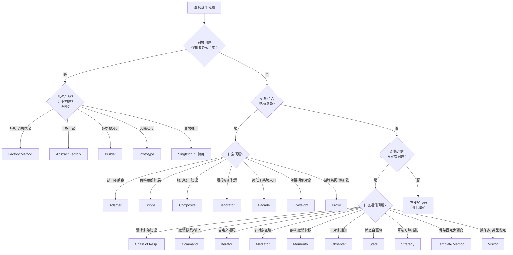
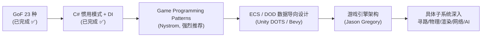

# 总结与游戏开发实战指南

> 所属计划: [[design-patterns-csharp|设计模式 (C# + C++)]]
> 预计耗时: 90 分钟（精读）/ 30 分钟（速查）
> 前置知识: [[01-design-patterns-overview|第 1–28 节全部内容]]
> 面向读者: 游戏开发工程师（Unity / Unreal / 自研引擎，C# 与 C++）

---

## 1. 这份总结的目标

你已学完 23 种 GoF 模式 + C# 惯用模式 + DI 容器。这一节不重复定义，而是回答三个工程问题：

1. **何时用** — 每种模式的触发信号是什么
2. **何时不用** — 哪些信号会把你引向更简单的方案（或另一个模式）
3. **游戏里长什么样** — 同一个模式在角色系统、AI、渲染、UI、网络里各扮演什么角色

> [!important] 阅读姿势
> 本节不含完整代码，只有**场景骨架与决策逻辑**。具体实现回到对应章节 `[[03-singleton]]` … `[[28-dependency-injection]]` 查阅。
>
> 游戏开发的核心张力是 **性能 / 可读性 / 迭代速度** 的三角权衡。模式不是越多越好——Nystrom 在 *Game Programming Patterns* 里反复强调："**先用最笨的方案让游戏跑起来，等真的痛了再上模式**"。

---

## 2. 23 种 GoF 模式知识地图

### 2.1 三大分类一句话

| 分类           | 关心什么       | 口诀            |
| ------------ | ---------- | ------------- |
| **创建型** (5)  | 如何 new 出对象 | "把 `new` 关起来" |
| **结构型** (7)  | 如何把对象拼起来   | "组合优于继承"      |
| **行为型** (11) | 对象之间如何通信   | "谁该知道什么"      |

### 2.2 创建型 — 5 种

| 模式 | 一句话 | 详见 |
|------|--------|------|
| Singleton | 全局唯一实例 | [[03-singleton]] |
| Factory Method | 子类决定 new 哪个 | [[04-factory-method]] |
| Abstract Factory | new 一整套产品族 | [[05-abstract-factory]] |
| Builder | 分步骤拼复杂对象 | [[06-builder]] |
| Prototype | 克隆已有的 | [[07-prototype]] |

### 2.3 结构型 — 7 种

| 模式 | 一句话 | 详见 |
|------|--------|------|
| Adapter | 接口转换器 | [[09-adapter]] |
| Bridge | 抽象与实现分家 | [[10-bridge]] |
| Composite | 树形一视同仁 | [[11-composite]] |
| Decorator | 动态套壳加职责 | [[12-decorator]] |
| Facade | 给复杂子系统一个简单门面 | [[13-facade]] |
| Flyweight | 共享细粒度对象 | [[14-flyweight]] |
| Proxy | 替身控制访问 | [[15-proxy]] |

### 2.4 行为型 — 11 种

| 模式 | 一句话 | 详见 |
|------|--------|------|
| Chain of Responsibility | 请求沿链传递 | [[17-chain-of-responsibility]] |
| Command | 把请求变成对象 | [[18-command]] |
| Iterator | 统一遍历姿势 | [[19-iterator]] |
| Mediator | 集中通信枢纽 | [[20-mediator]] |
| Memento | 存档/读档 | [[21-memento]] |
| Observer | 状态变了通知大家 | [[22-observer]] |
| State | 状态驱动行为 | [[23-state]] |
| Strategy | 算法可热插拔 | [[24-strategy]] |
| Template Method | 骨架固定，步骤可变 | [[25-template-method]] |
| Visitor | 操作与数据结构分离 | [[26-visitor]] |

---

## 3. 何时使用每种模式 — 决策指南

> [!tip] 黄金法则
> **先用最简单的方案**。模式是止痛药，不是维生素——只有当你能指出"具体痛在哪里"时才上模式。
>
> 每个模式下面给出 **✅ 用**（触发信号）和 **❌ 不用**（反信号）。

### 3.1 创建型决策

#### Singleton

- ✅ **用**：整个游戏只需要一个实例，且这个实例需要被到处访问（`AudioManager`、`InputManager`、`GameManager`、`SaveSystem`）
- ✅ **用**：跨场景/跨系统共享的全局服务
- ❌ **不用**：仅仅是为了"方便访问"（这会制造隐藏耦合，单测无法替换）
- ❌ **不用**：需要多个实例（即使是"暂时"的）——考虑 [[28-dependency-injection|DI 容器]]
- ❌ **不用**：在 ECS 架构里——ECS 用 System 单例 + 全局 World，不需要 Singleton

> [!warning] 游戏开发 Singleton 陷阱
> Unity 的 `MonoBehaviour` 单例常被滥用。Nystrom 在 *Game Programming Patterns* 中明确警告：**Singleton 是全局变量**，它会带来隐式依赖、初始化顺序噩梦、多场景重启残留状态三大坑。
>
> **更优替代**：[[service-locator|Service Locator 模式]]（按需查询、可替换、可测试）或 DI 容器（`VContainer` / `Zenject`）。

#### Factory Method

- ✅ **用**：创建逻辑会随类型变化，且你希望把"创建哪种"的决定推迟到子类
- ✅ **用**：未来可能新增产品类型（新敌人、新子弹、新道具）
- ❌ **不用**：产品类型固定且很少（直接 `new` 更清楚）
- ❌ **不用**：需要创建**一整套配套产品**——那是 Abstract Factory

#### Abstract Factory

- ✅ **用**：需要创建**一整套风格统一的产品族**（暗黑风敌人 + 暗黑风 UI + 暗黑风道具；科幻风一套）
- ✅ **用**：跨平台游戏（PC 套件 / 主机套件 / 移动套件，每套一套输入、渲染、音频配置）
- ❌ **不用**：只创建一种产品——退化成 Factory Method
- ❌ **不用**：产品族不会扩展——简单工厂 + 枚举就够

#### Builder

- ✅ **用**：对象有很多可选参数（角色创建：种族、职业、属性点、起始装备、技能……）
- ✅ **用**：构造过程需要**分步骤**，且步骤顺序有意义（关卡生成：先生成地形 → 再放怪物 → 再放宝箱）
- ✅ **用**：同一构造过程要产出不同表示（JSON / 二进制 / 编辑器可视化）
- ❌ **不用**：参数少且固定——用构造函数或 `record` 的 `with` 表达式
- ❌ **不用**：内部数据结构会频繁变化（Builder 接口稳定是前提）

#### Prototype

- ✅ **用**：创建新对象的成本高（要加载资源、跑初始化），而已有对象可以**深拷贝**
- ✅ **用**：运行时才知道要克隆什么（编辑器里玩家拖拽复制对象）
- ✅ **用**：Unity 的 `Instantiate(Prefab)` 本质就是 Prototype
- ❌ **不用**：对象引用图复杂且有循环引用——深拷贝会爆炸
- ❌ **不用**：对象间不应共享可变状态——克隆会让两份状态悄悄分叉

---

### 3.2 结构型决策

#### Adapter

- ✅ **用**：第三方库/旧代码接口和你期望的不一样，但你**不能改它**（接旧存档格式、第三方 IAP SDK、旧版物理引擎）
- ✅ **用**：统一多个输入设备的接口（键盘 / 手柄 / 触屏 / 体感 → 同一个 `IInputSource`）
- ❌ **不用**：你能直接改原类——直接改更干净
- ❌ **不用**：只是包一层方法调用——那是 Facade 的轻量版

#### Bridge

- ✅ **用**：抽象和实现两个维度都独立扩展（角色控制器 × 输入设备 × 平台渲染）
- ✅ **用**：C++ 里做**编译防火墙**（Pimpl 惯用法，隐藏私有成员减少重编译）
- ❌ **不用**：只有一个实现维度——直接继承即可
- ❌ **不用**：抽象和实现强绑定不会变——Bridge 的间接层是负担

#### Composite

- ✅ **用**：树形结构，叶子和组合节点要**统一处理**（场景图 Scene Graph、UI 层级、技能/Buff 叠加树、背包里"容器装容器"）
- ✅ **用**：伤害/Buff 计算需要递归（一个 BuffGroup 里有多个 Buff，整体生效）
- ❌ **不用**：结构是扁平的——直接 `List<T>`
- ❌ **不用**：树深度极深且每次都要遍历全树——考虑 Flyweight 或数据导向设计

#### Decorator

- ✅ **用**：需要**运行时动态叠加**职责（武器附魔：基础剑 + 火焰 + 吸血 + 暴击；角色 Buff：中毒 + 燃烧 + 加速）
- ✅ **用**：职责组合数远大于职责种类（3 种修饰 × N 种武器 = 3N 种附魔武器，装饰器只需 3 + N 个类）
- ❌ **不用**：组合在编译期就固定——用继承或组合更直接
- ❌ **不用**：装饰链太长——调试会变成"剥洋葱"，C# 里用扩展方法或 Strategy 更清晰

#### Facade

- ✅ **用**：复杂子系统需要给上层一个简单入口（`GameBootstrap` 一行启动音频 + 物理 + 网络 + 存档 + UI）
- ✅ **用**：封装第三方 SDK 的复杂初始化
- ❌ **不用**：子系统本来就不复杂——多此一举
- ❌ **不用**：Facade 变成了"上帝对象"——它在做 Mediator 的活，考虑拆分

#### Flyweight

- ✅ **用**：**海量相似对象**共享不可变部分（一万棵树共享同一个网格+纹理，只各自存位置/缩放；棋盘 64 格的棋子；粒子系统）
- ✅ **用**：内存/GC 压力是实测瓶颈
- ❌ **不用**：对象数量少（几百个以内）——优化收益小于代码复杂度
- ❌ **不用**：对象状态大部分是可变的——共享没意义
- ⚠️ **游戏特例**：Unity 的 `Material`、`Mesh` 默认就是共享的 Flyweight；ECS 的 archetype 设计本身就是 Flyweight 思想

#### Proxy

- ✅ **用**：**延迟加载**昂贵资源（巨大纹理懒加载到显存；场景分块按需加载）
- ✅ **用**：**访问控制**（多人游戏里远程玩家对象只读，本地玩家可写）
- ✅ **用**：**缓存/池化**（资源池代理）
- ✅ **用**：**网络透明**（本地调用伪装成对远程服务的调用）
- ❌ **不用**：直接访问没成本——多一层间接毫无收益

---

### 3.3 行为型决策

#### Chain of Responsibility

- ✅ **用**：一个请求可能被**多个处理者**处理，且处理顺序有意义（伤害结算链：护盾 → 护甲 → 闪避 → 生命；UI 事件冒泡：子控件 → 父控件 → 根）
- ✅ **用**：处理者集合在运行时变化（动态增减伤害减免来源）
- ❌ **不用**：处理者固定且只有一个——直接调用
- ❌ **不用**：请求必须保证被处理——CoR 允许请求"掉到地上"，需要兜底

#### Command

- ✅ **用**：需要**撤销/重做**（关卡编辑器、回合制游戏、建造系统）
- ✅ **用**：输入绑定（按键 → 命令对象，支持重映射、录制、AI 重放）
- ✅ **用**：操作排队/调度（AI 行为队列、技能施放队列）
- ✅ **用**：宏录制（玩家操作回放、自动测试脚本）
- ❌ **不用**：操作不可逆且无排队需求——直接调方法
- ❌ **不用**：命令对象创建成本高于执行成本——热路径上避免堆分配（用 struct + 接口或对象池）

#### Iterator

- ✅ **用**：自定义集合需要统一的遍历方式（四叉树/八叉树空间分区遍历、网格邻居遍历、技能树遍历）
- ✅ **用**：C# `IEnumerable<T>` + `yield return` 让遍历代码极简
- ❌ **不用**：标准 `List<T>` / 数组——直接 `foreach`
- ❌ **不用**：性能敏感热路径——`yield` 会产生状态机分配，用手写迭代器或 `Span<T>`

#### Mediator

- ✅ **用**：多个对象之间**多对多通信**导致网状耦合（UI 各组件互相通知、多个系统互相调用）
- ✅ **用**：大厅/房间系统协调玩家、匹配、聊天
- ❌ **不用**：通信关系简单且固定——Observer 就够
- ❌ **不用**：Mediator 自己变成了上帝对象——它在做所有事，违背初衷

> [!tip] Mediator vs Observer
> **Observer** = 一对多广播（一个 Subject，N 个 Observer）
> **Mediator** = 多对多中枢（N 个 Colleague，1 个 Mediator 协调）
>
> 游戏里常见混淆：成就系统（玩家触发事件 → 多个成就监听）= Observer；UI 面板间联动（按钮 A 点击影响面板 B 和列表 C）= Mediator。

#### Memento

- ✅ **用**：**存档/读档**（角色完整状态快照写入磁盘）
- ✅ **用**：**撤销系统**（编辑器、回合制战棋的"回到上一步"）
- ✅ **用**：**回放系统**（每帧记录状态快照或输入序列）
- ✅ **用**：Checkpoint 系统
- ❌ **不用**：状态很大且频繁快照——内存爆炸，考虑增量快照或 Command 的反向操作
- ❌ **不用**：只需要存少量字段——直接序列化那几个字段

#### Observer

- ✅ **用**：一个对象状态变化要通知**多个不相关的订阅者**（角色死亡 → 成就系统 + UI + 音效 + 任务系统）
- ✅ **用**：UI 数据绑定（MVVM、`INotifyPropertyChanged`）
- ✅ **用**：解耦事件源和响应者
- ❌ **不用**：订阅者只有一个且固定——直接回调或方法调用
- ❌ **不用**：事件链引发级联更新（A 通知 B，B 通知 C，C 又通知 A）——会陷入循环，用 Mediator 或显式事件队列

#### State

- ✅ **用**：对象行为**随内部状态切换**且状态多（角色：Idle / Run / Jump / Attack / Hurt / Dead；AI：Patrol / Chase / Attack / Flee / Stunned）
- ✅ **用**：游戏流程（Menu / Loading / Playing / Paused / GameOver）
- ✅ **用**：网络连接状态（Connecting / Connected / Reconnecting / Disconnected）
- ❌ **不用**：状态只有两三个且行为差异小——`enum` + `switch` 更直接
- ❌ **不用**：需要记住状态历史（撤销、回到上一状态）——用 Pushdown Automaton（栈式状态机）

> [!important] State vs Strategy（最高频混淆）
> **结构几乎一样，意图完全不同：**
>
> - **Strategy** = 客户端**主动选择**算法，状态由外部决定，对象本身不变
> - **State** = 对象**自己**根据内部状态切换行为，状态是对象的一部分
>
> 口诀：**Strategy 是"我选工具"，State 是"我变了一个人"**。
> 游戏里：武器切换（玩家选哪把武器）= Strategy；角色动画状态机 = State。

#### Strategy

- ✅ **用**：同一问题有多种算法，**运行时可切换**（寻路：A* / Dijkstra / JPS；AI 攻击：近战 / 远程 / 范围；排序：按等级 / 按时间 / 按稀有度）
- ✅ **用**：消除大量 `if-else` / `switch`（每个分支变成一个 Strategy 类）
- ❌ **不用**：算法固定不变——直接写
- ❌ **不用**：切换频率极低——配置或继承即可

#### Template Method

- ✅ **用**：算法**骨架固定**，部分步骤由子类定制（游戏主循环：`Init → LoadLevel → GameLoop → Save → Cleanup`，每个子类填细节；角色 `Update`：`Think → Move → Animate`）
- ✅ **用**：框架定义流程，使用者填空
- ❌ **不用**：步骤之间没有固定顺序——Strategy + 组合更灵活
- ❌ **不用**：子类太多且每个只改一点点——考虑 Strategy 或回调注入

#### Visitor

- ✅ **用**：**对象结构稳定**（很少加新类型），但要**频繁加新操作**（场景图节点类型固定，但要加导出 JSON / 导出二进制 / 统计 / 校验等多种操作）
- ✅ **用**：碰撞检测的双分派（圆 × 圆、圆 × 方块、方块 × 方块……每种组合不同算法）
- ❌ **不用**：对象结构经常加新类型——每加一个类型要改所有 Visitor，违背初衷
- ❌ **不用**：操作很少——直接在类里写方法
- ⚠️ **C# 现代写法**：`switch` 表达式 + 模式匹配往往比经典 Visitor 更简洁，除非你需要它跨多个外部类分布

---

## 4. 游戏开发场景实战

> 这是本节的核心。每个模式给出 **3–6 个真实游戏场景**，只描述结构与决策依据，不给代码。

### 4.1 创建型在游戏里

#### Singleton 的游戏场景

1. **`AudioManager`** — 全局唯一，跨场景存活，所有系统都要播声音。注意：音乐、音效、语音分通道管理。
2. **`GameManager` / `GameInstance`**（Unreal）— 持有游戏全局状态、关卡切换、玩家数据。
3. **`InputManager`** — 统一捕获键盘/手柄/触屏输入，分发给系统。
4. **`SaveSystem`** — 序列化/反序列化存档，确保读写一致。
5. **`LocalizationManager`** — 多语言文本缓存，运行时切换语言。
6. **`AssetBundle` / `Addressables` 加载器** — 资源加载唯一入口，避免重复加载。

> [!warning] Unity 单例的三个坑
> 1. `DontDestroyOnLoad` + 场景切换会**复制**单例 → 用 `Awake` 里检测重复并 `Destroy` 自身
> 2. 多线程访问单例（如音频解码线程）→ 用 `Lazy<T>` 或 `call_once` 保证线程安全
> 3. 退出 Play 模式时静态字段不重置 → 静态单例在编辑器测试里会"带状态复活"

#### Factory Method 的游戏场景

1. **敌人生成器** — `EnemyFactory.Spawn(EnemyType.Goblin)`，子类 `BossFactory` 重写产生 Boss。
2. **子弹/投射物工厂** — 不同武器产生不同子弹类型，统一通过工厂创建并自动入对象池。
3. **道具掉落** — 击杀敌人后 `LootFactory.Create(rarity)` 决定掉什么。
4. **关卡陷阱** — `TrapFactory` 根据关卡配置生成尖刺、火焰、毒气等。
5. **多人游戏网络对象** — `NetworkObjectFactory` 在客户端按 prefab id 创建同步对象。

#### Abstract Factory 的游戏场景

1. **主题/风格套件** — `DarkFantasyFactory` / `SciFiFactory` 各自生产同风格的敌人、UI 皮肤、场景道具、音效包。换皮游戏核心架构。
2. **跨平台套件** — `PCPlatformFactory`（键鼠输入 + 高画质渲染）/ `ConsoleFactory`（手柄 + 主机优化）/ `MobileFactory`（触屏 + 降画质）。
3. **角色种族套件** — `ElfFactory` 造精灵战士、精灵法师、精灵弓箭手；`OrcFactory` 造对应的兽人版本。
4. **季节性活动** — 春节/万圣节/圣诞节工厂，各自生产主题装饰、限定敌人、限定道具。

#### Builder 的游戏场景

1. **角色创建器（RPG）** — `CharacterBuilder.Race().Class().AllocateStats().EquipStartingGear().LearnSkills().Build()`。Fluent API，每步可校验。
2. **关卡生成器** — `LevelBuilder.Terrain().PlaceSpawnPoints().SpawnEnemies().PlaceTreasures().SetExit().Build()`，程序化生成的骨架。
3. **武器配置** — `WeaponBuilder.Base(baseId).Enchant().Upgrade().SetRarity().Build()`。
4. **任务/剧情节点** — `QuestBuilder.Title().Objective().Rewards().Prerequisites().Build()`。
5. **存档数据** — 分步序列化玩家、世界、设置三块，避免一次构造巨型对象。
6. **网络数据包** — 分步写入 header / payload / checksum。

#### Prototype 的游戏场景

1. **Unity `Instantiate(Prefab)`** — 这就是 Prototype。Prefab 是原型，运行时克隆。
2. **敌人克隆** — 同一种敌人大量出现，克隆已有配置好的实例比重新 new 快。
3. **粒子/特效复制** — 同一特效多次播放，克隆原型特效对象。
4. **编辑器复制粘贴** — 玩家选中对象 Ctrl+D 复制，需要深拷贝（含子物体、组件状态）。
5. **存档恢复** — 读档时克隆默认状态再覆盖存档数据，避免直接构造。

> [!tip] Prototype 的深拷贝陷阱
> 游戏对象引用图很深（角色 → 装备 → 特效 → 粒子……）。浅拷贝会导致两个角色共享同一把武器。C# 用 `ICloneable` + 递归克隆，或序列化/反序列化做深拷贝（性能差但简单）。Unity 里 `Instantiate` 默认深拷贝整个 prefab 层级。

---

### 4.2 结构型在游戏里

#### Adapter 的游戏场景

1. **输入设备适配** — `KeyboardAdapter` / `GamepadAdapter` / `TouchAdapter` 都实现 `IInputSource`，游戏逻辑只依赖抽象接口。支持热插拔、重映射。
2. **旧存档兼容** — 新版本改了存档结构，`SaveFileAdapterV1` 把旧格式转成新格式。
3. **第三方 SDK** — 接入 IAP（苹果/谷歌/Steam）、广告、分析、登录，每家用 Adapter 统一成 `IStoreService` 接口。
4. **多物理引擎** — 从 PhysX 切到自研物理，`PhysicsAdapter` 屏蔽差异。
5. **AI 库适配** — 接入第三方行为树库，Adapter 把它的接口转成你引擎的 `IAgent`。

#### Bridge 的游戏场景

1. **角色控制器 × 输入设备** — `CharacterController`（抽象）跨 `KeyboardInput` / `GamepadInput` / `AIInput`（实现）两个维度独立扩展。
2. **渲染抽象 × 平台 API** — `IRenderer`（抽象）跨 `DirectXRenderer` / `VulkanRenderer` / `MetalRenderer`（实现）。引擎跨平台核心。
3. **音频系统 × 后端** — `AudioMixer`（抽象）跨 `FMOD` / `Wwise` / `OpenAL`（实现）。
4. **网络层 × 协议** — `NetworkTransport`（抽象）跨 `TCP` / `UDP` / `WebSocket` / `SteamP2P`。
5. **C++ Pimpl** — 隐藏私有成员，改私有头不触发全量重编译（大型引擎编译时间救命）。

#### Composite 的游戏场景

1. **场景图 Scene Graph** — 节点可以包含子节点，整体做变换、剔除、渲染。Unity 的 `Transform` 父子层级就是 Composite。
2. **UI 层级** — Panel 包含 Button、Text、Image，统一处理布局、事件、显示/隐藏。
3. **Buff/技能树** — 一个 `BuffGroup` 可以包含多个 Buff 或子 Group，递归计算总效果。
4. **背包/容器** — 背包里可以放"袋子"，袋子里还能放袋子（俄罗斯套娃）。
5. **伤害计算链** — 一组减免来源（护盾组 + 护甲组 + 天赋组）递归汇总。
6. **任务树** — 主任务包含子任务，子任务完成才算主任务完成。

#### Decorator 的游戏场景

1. **武器附魔** — `EnchantedWeapon : IWeapon` 包装基础武器，叠加 `FireEnchantment`、`LifestealEnchantment`、`CritEnchantment`。N 种附魔 × M 种武器 = N+M 个类，不是 N×M。
2. **角色 Buff** — `Poisoned`、`Burning`、`Hasted`、`Strengthened` 装饰器叠加在角色上，运行时增减。
3. **技能修饰** — 基础火球 + 穿透 + 弹射 + 范围扩大（如《流放之路》技能链）。
4. **日志/调试装饰** — 给任何对象包一层日志装饰器，记录调用，不改原类。
5. **UI 元素装饰** — 给 Button 加边框、阴影、动画装饰器。

> [!tip] Decorator vs Composite
> - **Composite**：组合**同类型**成树（一个 Panel 含多个 Panel）
> - **Decorator**：包装**单个**对象加职责（一个武器外面套多层附魔）
> 两者常一起用：附魔链用 Decorator，附魔组合成树用 Composite。

#### Facade 的游戏场景

1. **`GameBootstrap` / `GameLauncher`** — 一行 `Bootstrap()` 启动资源加载 → 配置 → 场景 → UI → 音频 → 网络 → 存档子系统。
2. **`AudioFacade`** — 封装 FMOD/Wwise 复杂 API，对外只暴露 `PlaySfx(name)`、`PlayMusic(track)`、`SetVolume(channel)`。
3. **`SaveFacade`** — 封装序列化、压缩、加密、云同步，对外 `Save()` / `Load()`。
4. **`MatchmakingFacade`** — 封装房间创建、匹配、网络连接、状态同步，对外简单 API。
5. **`AssetFacade` / `Addressables`** — 封装异步加载、依赖、卸载、内存管理，对外 `Load<T>(key)`。

#### Flyweight 的游戏场景

1. **海量树木/植被** — 一万棵树共享同一套网格+纹理，各自只存 transform（位置/旋转/缩放）。GPU Instancing 就是用 Flyweight 思想在显卡端实现。
2. **粒子系统** — 十万个粒子共享同一个材质和网格，各自只存位置/速度/生命周期。
3. **棋类游戏** — 64 格棋盘，棋子类型只有几种，每格存"棋子类型 + 颜色"而非完整对象。
4. **弹幕游戏** — 满屏子弹，共享几种精灵图，各自存位置/方向。
5. **文字渲染** — 字符 glyph 共享纹理图集（`string.Intern` 思想的图形版）。
6. **ECS archetype** — Unity DOTS 里相同组件组合的实体共享内存布局，本质是 Flyweight。

> [!important] Flyweight 的"内蕴/外蕴"分离
> 游戏里的核心操作：**把不变的（内蕴 intrinsic）抽出来共享，可变的（外蕴 extrinsic）各自存储**。
> 树的例子：网格+纹理 = 内蕴（共享）；位置+缩放+生命值 = 外蕴（各自存）。

#### Proxy 的游戏场景

1. **资源懒加载** — `LazyTextureProxy` 持有引用但真正读图按需触发，节省显存。
2. **远程玩家代理** — 多人游戏里，本地只看到远程玩家的 Proxy，真实状态在服务器。Proxy 转发输入、接收状态同步。
3. **缓存代理** — 频繁访问的资源走缓存，未命中再加载。
4. **保护代理** — 编辑器只读模式，禁止修改；权限控制。
5. **虚拟代理** — 大场景分块加载，远处物体用低精度代理，靠近才换高精度（LOD 的逻辑版）。
6. **智能引用代理** — C++ 的 `std::shared_ptr` / `std::weak_ptr` 就是引用计数代理，自动管理生命周期。

---

### 4.3 行为型在游戏里

#### Chain of Responsibility 的游戏场景

1. **伤害结算链** — 攻击 → 闪避判定 → 护盾吸收 → 护甲减免 → 抗性 → 暴击 → 最终扣血。每一环可决定"终止"或"继续"。
2. **UI 事件冒泡** — 点击子控件 → 子控件处理 → 不处理则冒泡到父控件 → 直到根。
3. **输入预处理链** — 原始输入 → 死区过滤 → 灵敏度调整 → 重映射 → 最终派发。
4. **作弊/权限检查链** — 命令执行前过一系列校验器（防外挂、限频、权限）。
5. **日志/审计链** — 日志经过格式化 → 过滤 → 压缩 → 上报多个处理者。

#### Command 的游戏场景

1. **输入绑定 + 重映射** — 按键映射到 `ICommand` 对象，玩家可在设置里重映射。`JumpCommand`、`AttackCommand`、`InteractCommand`。
2. **撤销/重做** — 关卡编辑器（放置/删除物体可撤销）、回合制战棋（撤销上一步）、建造游戏（拆了能建回来）。
3. **AI 行为队列** — AI 角色排队执行 `MoveToCommand` → `AttackCommand` → `FleeCommand`。
4. **技能施放队列** — 玩家连招输入进队列，按节奏依次施放。
5. **回放系统** — 录制每帧的 Command 序列，回放时按序执行（比录状态省空间）。
6. **宏/快捷键** — 一个快捷键触发一串 Command（"喝药 + 切武器 + 放技能"）。
7. **网络同步** — 客户端把操作封装成 Command 发给服务器，服务器广播执行（命令式同步）。

> [!tip] Command + Memento 选哪个做撤销？
> - **Command 反向操作**：每个 Command 自带 `Undo()`，省内存，适合"放置方块/删除方块"这种可逆操作
> - **Memento 快照**：存整个状态，省脑子但费内存，适合复杂状态（如 RTS 全局）
> 编辑器常用 Command；回合制常用 Memento；大型存档两者结合。

#### Iterator 的游戏场景

1. **空间分区遍历** — 四叉树/八叉树/BVH 的范围查询迭代器："给我某点半径 10 米内所有敌人"。
2. **网格邻居遍历** — 六边形/四边形地图的邻居迭代（用于寻路、范围攻击）。
3. **技能树遍历** — 深度/广度优先解锁顺序。
4. **背包分页迭代** — 按类型、按稀有度过滤遍历。
5. **场景对象遍历** — 按层、按标签、按距离排序遍历。
6. **C# 习惯** — `IEnumerable<T>` + `yield return` 让上述全部用 `foreach`，但**热路径避免** `yield` 分配。

#### Mediator 的游戏场景

1. **UI 系统** — 各 UI 面板不互相直接引用，通过 `UIMediator` 协调（打开背包时关闭商店、点击物品时更新详情面板）。
2. **大厅系统** — `LobbyMediator` 协调玩家列表、房间列表、聊天、匹配状态。
3. **战斗系统协调** — `BattleMediator` 协调伤害、特效、音效、UI、掉落，避免这些系统互相直接引用。
4. **事件总线 EventBus** — 广义 Mediator，所有系统通过它收发事件（`MediatR` 是其具体实现）。
5. **Mod/插件系统** — 各 Mod 不直接通信，通过引擎提供的 Mediator 接口交互。

#### Memento 的游戏场景

1. **存档/读档** — 角色完整状态（位置、血量、装备、任务进度、世界状态）打成快照写入磁盘。
2. **Checkpoint 系统** — 到达存档点自动快照，死亡后回滚。
3. **回合制撤销** — 战棋每回合存快照，可回退多步。
4. **编辑器撤销** — 虽然常用 Command，但复杂状态（如地形高度图）用 Memento 快照更简单。
5. **回放/录像** — 每帧或每关键事件存快照（或存输入，配合 Command）。
6. **状态机回退** — Pushdown Automaton 用栈存历史状态，本质是 Memento 思想。

> [!warning] Memento 内存陷阱
> 角色状态含大量引用（背包几百件物品、世界几千个实体）。直接快照会爆内存。对策：
> - 只快照**变化的部分**（增量快照）
> - 用 Command 的反向操作代替全量快照
> - 快照压缩 + 分块（只存附近 N 个 checkpoint）

#### Observer 的游戏场景

1. **事件系统核心** — `OnPlayerDied`、`OnEnemyKilled`、`OnScoreChanged`、`OnLevelUp`。成就、任务、UI、音效各自订阅，互不知道对方。
2. **成就系统** — 监听各种游戏事件（击杀数、距离、收集），触发解锁。
3. **UI 数据绑定** — 角色血量变化 → 血条自动更新（MVVM / `INotifyPropertyChanged`）。
4. **任务系统** — 监听"杀敌"、"拾取"、"到达地点"事件推进任务。
5. **音效触发** — 监听攻击、受击、死亡事件播放对应音效。
6. **C# `event` / Unity `UnityEvent`** — 语言/引擎级 Observer 支持。

> [!important] Observer 的"倒置依赖"
> Observer 让**被观察者不需要知道观察者是谁**——这是解耦的关键。成就系统不需要角色类知道它的存在，反之亦然。游戏大型化后，Observer（或事件总线）几乎是必备的解耦手段。

#### State 的游戏场景

1. **角色状态机（最经典）** — Idle / Run / Jump / Fall / Attack / Hurt / Dead / Dash / Climb。每状态独立类，含 `Enter` / `Update` / `Exit` / `HandleInput`。
2. **AI 状态机（FSM）** — Patrol（巡逻）/ Chase（追击）/ Attack（攻击）/ Flee（逃跑）/ Stunned（眩晕）/ Dead。简单 AI 的标准方案。
3. **游戏流程** — Bootstrapping / MainMenu / Loading / Playing / Paused / GameOver / Credits。
4. **网络连接** — Disconnected / Connecting / Connected / Reconnecting / Error。
5. **UI 状态** — 按钮的 Normal / Hover / Pressed / Disabled。
6. **物品状态** — 地面 / 背包 / 装备 / 丢弃。
7. **更复杂：HFSM / Behavior Tree** — 状态多了用分层状态机（HFSM）或行为树（BT），但底层仍是 State 思想。

> [!tip] 何时从 enum+switch 升级到 State 模式？
> - 状态超过 5 个
> - 每个状态的逻辑超过 10 行
> - 状态间共享代码（用 HFSM）
> - 状态切换条件散落各处、难追踪
> 满足任一条，从 `switch` 升级到 State 类。Unity 可用 `Animator` 状态机或第三方库（如 `Stateless`）。

#### Strategy 的游戏场景

1. **寻路算法** — `IPathfinding` 接口，A* / Dijkstra / JPS / 流场寻路各为实现，按场景切换（小地图 A*，大地图流场）。
2. **AI 行为策略** — `ICombatStrategy`：`AggressiveStrategy` / `DefensiveStrategy` / `RangedStrategy` / `SupportStrategy`，同一 AI 换策略改变打法。
3. **武器系统** — `IWeapon`：剑 / 弓 / 法杖 / 枪械，角色装备切换 = 换策略。
4. **难度调节** — `IDifficulty`：Easy / Normal / Hard / Nightmare，影响敌人血量、AI 智力、掉落率。
5. **排序/筛选** — 背包按等级/稀有度/类型/时间排序，UI 下拉切换策略。
6. **渲染策略** — 低画质 / 中画质 / 高画质 / 极致，按设备性能切换。
7. **消除 switch 地狱** — 任何"一个大 switch 分 N 种处理"的地方，几乎都能用 Strategy 重构。

#### Template Method 的游戏场景

1. **游戏主循环** — `Game.Run()` 骨架：`Initialize() → LoadContent() → while(running){ Update(dt); Render(); } → Unload()`。子类（具体游戏）填细节。
2. **角色 Update** — 基类 `Update(dt)`：`Think() → Move(dt) → Animate(dt) → LateUpdate()`，子类重写 `Think` 实现不同 AI。
3. **关卡加载流程** — `LoadLevel(name)`：`UnloadCurrent() → LoadAssets(name) → InstantiateObjects() → OnLoadComplete()`，不同关卡类型定制各步。
4. **技能施放** — `Cast(target)`：`CanCast() → PayCost() → PlayAnimation() → ApplyEffect() → StartCooldown()`，具体技能重写 `ApplyEffect`。
5. **存档流程** — `Save()`：`SerializePlayer() → SerializeWorld() → SerializeSettings() → WriteToDisk()`，不同平台重写 `WriteToDisk`。
6. **NVI（Non-Virtual Interface）** — C++ 习惯：`public` 非虚函数定义骨架，`private` 虚函数是可变步骤，保证调用入口固定。

#### Visitor 的游戏场景

1. **场景导出** — 场景图节点类型固定（Mesh / Light / Camera / Trigger / Spawner），但要支持导出 JSON / 二进制 / XML / 编辑器预览。每加一种导出 = 加一个 Visitor，不改节点类。
2. **碰撞检测双分派** — 圆 × 圆、圆 × AABB、AABB × AABB、AABB × OBB……每种组合不同算法。`colliderA.Accept(colliderB)` 双分派到正确的 `Collide` 重载。
3. **伤害类型分派** — 物理 / 火焰 / 冰霜 / 闪电 / 毒，对不同护甲类型（轻甲 / 重甲 / 法袍）效果不同。双分派选对算法。
4. **统计/分析** — 遍历场景所有对象，分别统计三角形数、绘制调用数、内存占用。每加一种统计 = 加一个 Visitor。
5. **资源打包** — AssetBundle 打包时遍历依赖图，不同资源类型用不同打包策略。
6. **AI 决策** — 遍历感知到的实体（敌人/友军/物品/陷阱），每种实体触发不同行为。

> [!warning] Visitor 的代价
> Visitor 牺牲了"加新元素类型"的便利，换取"加新操作"的便利。**只有元素类型真的稳定时才用**。游戏里场景节点类型加得很快，慎用——很多时候 `switch` 表达式 + 模式匹配更实际。

---

## 5. 容易混淆的模式对比

游戏开发里最高频的四组混淆：

| 对比 | 区别 | 游戏判断法 |
|------|------|-----------|
| **State vs Strategy** | State 内部状态自驱动；Strategy 外部选择算法 | "我变了" = State；"我选工具" = Strategy |
| **Observer vs Mediator** | Observer 一对多广播；Mediator 多对多中枢 | 一个事件源多监听 = Observer；多个对象互聊 = Mediator |
| **Factory Method vs Abstract Factory** | Factory 造一种；Abstract Factory 造一族 | 单产品 = Factory；产品族 = Abstract Factory |
| **Decorator vs Composite** | Decorator 包单个加职责；Composite 组同类型成树 | 套娃加 buff = Decorator；树形结构 = Composite |
| **Command vs Memento（撤销）** | Command 反向操作省内存；Memento 快照省脑子 | 可逆操作 = Command；复杂状态 = Memento |
| **Facade vs Mediator** | Facade 单向简化入口；Mediator 双向协调 | 给上层简单 API = Facade；协调多个对等方 = Mediator |
| **Proxy vs Decorator** | Proxy 控制访问（不改行为）；Decorator 加职责（改行为） | 懒加载/远程 = Proxy；加 buff = Decorator |
| **Bridge vs Strategy** | Bridge 分离两个独立维度（长期架构）；Strategy 切换算法（短期行为） | 跨平台/跨后端 = Bridge；运行时换算法 = Strategy |

---

## 6. 模式选择决策流程

面对一个设计问题，按这个顺序自问：



> [!important] 决策的元规则
> 1. **先问"不痛不痒吗"** — 不痛就别上模式
> 2. **再问"未来会变吗"** — 不会变就用最直接的写法
> 3. **最后问"变的是哪个维度"** — 模式封装的是变化点，选对封装维度才是选对模式

---

## 7. 游戏开发中的经典模式组合

真实游戏里模式很少单独出现，常见组合：

### 7.1 角色 + AI 系统

```text
State（角色状态机）
  + Strategy（每状态的 AI 行为可换）
  + Observer（状态变化通知动画/UI/音效）
  + Command（输入产生命令驱动状态切换）
```

### 7.2 关卡编辑器

```text
Command（每次操作可撤销）
  + Memento（复杂状态用快照撤销）
  + Composite（场景图）
  + Visitor（导出/统计）
  + Prototype（复制粘贴）
```

### 7.3 多人游戏网络

```text
Command（操作序列化同步）
  + Proxy（远程玩家代理）
  + Observer（网络事件通知）
  + State（连接状态机）
  + Prototype（网络对象克隆）
```

### 7.4 UI 系统

```text
Composite（UI 层级）
  + Mediator（面板间协调）
  + Observer（数据绑定 + 事件）
  + Strategy（不同布局/排序策略）
  + Facade（对外简单 API）
```

### 7.5 资源管理

```text
Flyweight（共享资源）
  + Proxy（懒加载）
  + Singleton/Facade（资源管理器入口）
  + Observer（加载完成通知）
  + Builder（复杂资源构建）
```

### 7.6 Buff/技能系统（《流放之路》《暗黑》类）

```text
Decorator（buff 叠加）
  + Composite（buff 组合树）
  + Strategy（不同伤害算法）
  + State（buff 自身状态：生效/过期/驱散）
  + Factory Method（buff 创建）
```

---

## 8. 超越 GoF：游戏开发专属模式

GoF 23 种是通用模式。Robert Nystrom 的 *Game Programming Patterns* 补充了游戏特有的模式，与 GoF 互补。强烈建议补充学习：

### 8.1 顺序模式（Sequencing）

| 模式 | 作用 | 游戏场景 |
|------|------|---------|
| **Game Loop** | 主循环驱动更新与渲染 | 所有游戏的心脏：`while(running){ processInput(); update(); render(); }` |
| **Update Method** | 每帧更新所有对象 | 每个实体 `Update(dt)`，统一调度 |
| **Double Buffer** | 双缓冲避免视觉撕裂 | 渲染缓冲、粒子模拟、状态平滑过渡 |

### 8.2 行为模式（Behavioral）

| 模式 | 作用 | 游戏场景 |
|------|------|---------|
| **Bytecode** | 字节码解释器 | Mod 系统、脚本引擎、技能 DSL、剧情脚本 |
| **Subclass Sandbox** | 子类沙箱方法 | 基类提供受保护 API，子类只重写一个 `sandbox()` 方法实现具体行为 |
| **Type Object** | 类型对象 | 物品/怪物类型用数据对象而非子类表达，支持数据驱动设计（Excel 配表驱动） |

### 8.3 解耦模式（Decoupling）

| 模式 | 作用 | 游戏场景 |
|------|------|---------|
| **Component** | 组件化 | Unity `MonoBehaviour`、ECS 的前身：实体 = 一组组件 |
| **Event Queue** | 事件队列 | 异步事件处理、音频播放队列、网络消息队列（Observer 的解耦升级版） |
| **Service Locator** | 服务定位器 | Singleton 的可测试替代：按需查询全局服务，可替换 |

### 8.4 优化模式（Optimization）

| 模式 | 作用 | 游戏场景 |
|------|------|---------|
| **Object Pool** | 对象池 | 子弹/粒子/敌人复用，避免 GC 抖动 |
| **Data Locality** | 数据局部性 | CPU 缓存友好布局（SoA vs AoS），ECS 核心思想 |
| **Dirty Flag** | 脏标记 | 只在变化时重算（变换矩阵、光照、AABB） |
| **Spatial Partition** | 空间分区 | 四叉树/八叉树/BVH/网格加速碰撞与查询 |

> [!tip] GoF 模式 vs 游戏模式的关系
> - **Component** 是 Composite + Strategy 的演化（解决继承爆炸）
> - **Service Locator** 是 Singleton 的可测试版
> - **Event Queue** 是 Observer + Mediator 的解耦升级
> - **Object Pool** 是 Prototype + Flyweight 的性能版
> - **Type Object** 是 Factory + Strategy 的数据驱动版
>
> 学完 GoF 23 种，下一步就该读 *Game Programming Patterns* 把这些补上。

---

## 9. 游戏开发反模式与陷阱

### 9.1 Singleton 滥用

- **症状**：到处 `GameManager.Instance.xxx`
- **后果**：隐式依赖、无法单测、初始化顺序地狱、场景重启残留
- **对策**：Service Locator 或 DI 容器（`VContainer` / `Zenject` / `Extenject`）

### 9.2 上帝对象（God Object）

- **症状**：一个 `Player` 类有 5000 行，管移动、战斗、背包、UI、存档
- **后果**：改一处崩全部、无法并行开发
- **对策**：Component 模式 / ECS 拆分；每个组件单一职责

### 9.3 深继承塔（继承超过 3 层）

- **症状**：`Enemy → FlyingEnemy → FlyingBoss → FinalBoss → SecretFinalBoss`
- **后果**：改基类影响所有子类、组合需求爆炸
- **对策**：组合优于继承（Component / Strategy / Decorator）

### 9.4 模式强迫症

- **症状**：看见任何问题都想套模式
- **后果**：过度设计、代码更难读
- **对策**：先用最笨方案，痛了再重构上模式

### 9.5 事件循环 / Observer 级联

- **症状**：A 通知 B，B 通知 C，C 又通知 A
- **后果**：无限循环、性能崩溃、调试地狱
- **对策**：用 Mediator 集中协调，或事件队列 + 帧延迟打破同步链

### 9.6 热路径上的对象分配

- **症状**：每帧 `new` Command、Iterator、lambda 闭包
- **后果**：GC 抖动、帧率不稳
- **对策**：对象池、struct + 接口、`Span<T>`、避免 `yield`、预分配

### 9.7 同步阻塞

- **症状**：主线程等网络、等加载、等 IO
- **后果**：卡顿
- **对策**：异步/协程/Job System，配 Event Queue 解耦

---

## 10. 给游戏工程师的实战建议

### 10.1 心态

1. **模式是词汇，不是处方** — 知道这些词，能让你和团队沟通更精确（"这里用 State 还是 Strategy？"），但不强制每处都用。
2. **YAGNI 原则** — You Aren't Gonna Need It。三五种状态先用 `switch`，等真的多了再重构。
3. **重构而非预先设计** — 让代码先工作，等重复出现三次再抽象。
4. **性能在前，架构随后** — 游戏首要目标是 60FPS 流畅，架构服务于可维护性，但可维护性服务于持续交付。

### 10.2 选型优先级（游戏特化）

| 场景 | 首选 | 备选 |
|------|------|------|
| 全局服务 | DI 容器 | Service Locator |
| 状态/AI | State（少）/ HFSM（多）/ BT（复杂） | enum+switch（极简） |
| 事件通信 | Observer / EventBus | Mediator（多方协调） |
| 资源加载 | Facade + Proxy + 对象池 | — |
| 输入系统 | Command + Adapter | — |
| 撤销系统 | Command（可逆）/ Memento（复杂） | — |
| 大量同类对象 | Flyweight + 对象池 | ECS |
| 跨平台 | Bridge + Abstract Factory | — |
| 数据驱动 | Type Object + Builder | — |
| 寻路/AI 算法 | Strategy | — |

### 10.3 学习路径建议



- **下一步必读**：Robert Nystrom《Game Programming Patterns》（[gameprogrammingpatterns.com](https://gameprogrammingpatterns.com/)，免费在线）
- **架构进阶**：Jason Gregory《Game Engine Architecture》
- **数据导向**：Unity DOTS / ECS 文档，理解 Component 模式的现代演化
- **C++ 性能**：了解 Data Locality、Cache 友好布局、SoA 设计

---

## 扩展阅读

- **Game Programming Patterns**（Robert Nystrom）— [免费在线版](https://gameprogrammingpatterns.com/contents.html)，游戏开发模式圣经，GoF 23 种的游戏化补充
- **Refactoring Guru — Design Patterns**（[refactoring.guru](https://refactoring.guru/design-patterns)）— 图文并茂的模式速查，含 State vs Strategy 等对比
- **Unity Design Patterns**（[github.com/QianMo/Unity-Design-Pattern](https://github.com/QianMo/Unity-Design-Pattern)）— 23 种 GoF 的 Unity C# 实现
- **Game Engine Architecture**（Jason Gregory，3rd ed.）— 引擎架构全景，含模式在大引擎中的应用
- **Head First Design Patterns**（Freeman 等）— 入门友好的模式书，适合回顾
- **Data-Oriented Design**（Richard Fabian）— 理解 Component/ECS 背后的数据导向思想
- **Source Making — Design Patterns**（[sourcemaking.com/design_patterns](https://sourcemaking.com/design_patterns)）— 模式 + 反模式 + 重构，含权衡分析

---

## 常见陷阱

- **看见问题就想套模式** — 模式是止痛药，先确认"痛在哪里"再选药。一个 `switch` 没什么不好。
- **混淆 State 和 Strategy** — 记口诀："我变了 = State，我选工具 = Strategy"。
- **Singleton 当全局变量用** — 短期方便，长期耦合。优先 DI 或 Service Locator。
- **Visitor 用在类型频繁变化的体系** — 每加一个类型要改所有 Visitor，违背开闭原则。场景节点类型稳定才用。
- **Observer 链引发级联** — A→B→C→A 死循环。用事件队列或 Mediator 打破同步链。
- **热路径堆分配** — 每帧 `new` Command/Iterator/闭包导致 GC 抖动。用对象池、struct、预分配。
- **Decorator 套太深** — 调试变成剥洋葱，性能也差。超过 3 层考虑重新设计。
- **为"未来扩展"预先抽象** — YAGNI。等扩展需求真的出现三次再抽象。
- **Flyweight 共享了可变状态** — 内蕴必须不可变，否则多对象互相污染。
- **C# 里还硬写经典 Visitor** — `switch` 表达式 + 模式匹配往往更简洁，除非需要跨类分布操作。
