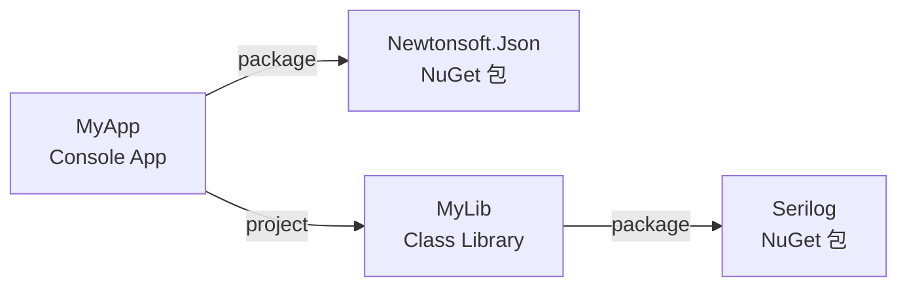
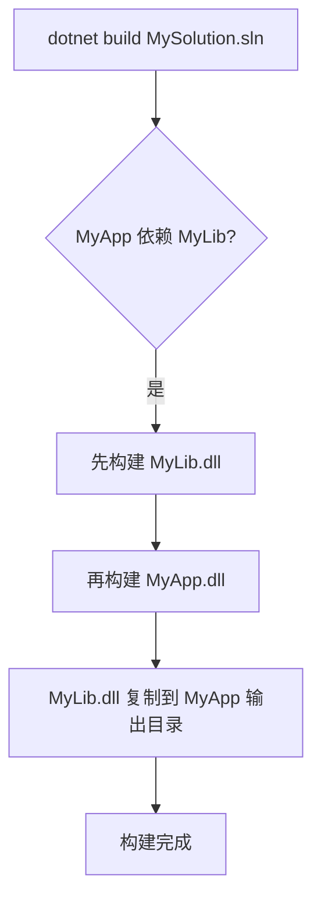

# `dotnet add` / `remove` — 管理包引用与项目引用

> 学习计划: [[../INDEX|dotnet CLI 与 C# 工程构建]]
> 预计耗时: 60min
> 前置: [[03-dotnet-build-run-clean]]

---

## 1. 概念讲解

### 1.1 为什么需要包引用和项目引用？

C# 项目几乎不可能从零开始写所有代码。你需要：

- **NuGet 包** — 第三方库（Newtonsoft.Json、Serilog、EF Core）或微软官方库
- **项目引用** — 同一个 solution 内其他项目的代码

`dotnet add` 和 `dotnet remove` 是管理这些引用的 CLI 命令。它们的核心作用：**编辑 `.csproj` 文件**，让你不需要手动写 XML。

> [!tip] 等价操作
> `dotnet add package Newtonsoft.Json` 等价于在 `.csproj` 的 `<ItemGroup>` 中添加 `<PackageReference Include="Newtonsoft.Json" />`。命令行只是更安全、更快的工具——它自动解析版本冲突、验证包是否存在。

### 1.2 包引用 vs 项目引用



| 维度 | 包引用 (`PackageReference`) | 项目引用 (`ProjectReference`) |
|------|---------------------------|-----------------------------|
| 来源 | NuGet.org / 私有源 | 本地 solution 内其他项目 |
| 引用对象 | 已编译的 `.nupkg` / DLL | 另一个 `.csproj` |
| 版本管理 | 可以指定版本号 | 无版本——始终引用源码 |
| 构建依赖 | 不触发对方构建 | 触发对方先构建（构建顺序） |
| cli 命令 | `dotnet add package` | `dotnet add reference` |
| csproj 写法 | `<PackageReference Include="X" Version="1.0"/>` | `<ProjectReference Include="../Lib/Lib.csproj"/>` |

### 1.3 核心思想

- `add` = 往 csproj 里**插入**引用条目 + 触发 restore（NuGet 包）
- `remove` = 从 csproj 里**删除**引用条目
- `list` = **查看**当前所有引用及其状态

三个命令都是**只改 csproj**，不碰源码文件中的 `using` 语句。记住：**安装包 ≠ 导入命名空间**。

---

## 2. 代码示例

### 2.1 `dotnet add package` — 添加 NuGet 包引用

#### 基本语法

```bash
dotnet add <PROJECT> package <PACKAGE_NAME> [选项]
```

常用选项：

| 选项 | 缩写 | 说明 |
|------|------|------|
| `--version <VERSION>` | `-v` | 指定版本号 |
| `--framework <FRAMEWORK>` | `-f` | 多目标项目时，只给特定框架加包 |
| `--prerelease` | | 允许安装预览版（含 alpha/beta/rc） |
| `--no-restore` | | 只改 csproj，不自动 restore |
| `--source <SOURCE>` | `-s` | 指定 NuGet 源 |
| `--package-directory <DIR>` | | 指定包下载目录 |

#### 示例 1: 安装 Newtonsoft.Json

```bash
# 创建项目
dotnet new console -n JsonDemo
cd JsonDemo

# 安装最新稳定版
dotnet add package Newtonsoft.Json
```

执行后的输出：

```
正在确定要还原的项目…
已将包 "Newtonsoft.Json" 的 PackageReference 添加到项目 "JsonDemo"。
```

此时 `.csproj` 中新增：

```xml
<ItemGroup>
  <PackageReference Include="Newtonsoft.Json" Version="13.0.3" />
</ItemGroup>
```

验证安装——写代码：

```csharp
// Program.cs
using Newtonsoft.Json;

var obj = new { Name = "Alice", Age = 25 };
string json = JsonConvert.SerializeObject(obj, Formatting.Indented);
Console.WriteLine(json);
```

```bash
dotnet run
```

预期输出：

```json
{
  "Name": "Alice",
  "Age": 25
}
```

#### 示例 2: 指定版本号

```bash
dotnet add package Newtonsoft.Json --version 12.0.3
```

csproj 中：

```xml
<PackageReference Include="Newtonsoft.Json" Version="12.0.3" />
```

#### 示例 3: 安装预览版

```bash
# 不指定 --prerelease → 只安装最新的稳定版
dotnet add package Microsoft.Extensions.AI --prerelease
```

> [!warning] `--prerelease` 的行为
> 加上 `--prerelease` 后，CLI 会找到**最新的版本**（含预览版）。如果最新预览版不稳定，你可能想要一个特定版本。可以用 `--version` 精确控制。

#### 示例 4: 多目标项目中的框架限定

```bash
# 假设 csproj 中有 <TargetFrameworks>net8.0;net9.0</TargetFrameworks>
dotnet add package Microsoft.Extensions.Logging --framework net8.0
```

csproj 中将出现条件引用：

```xml
<ItemGroup Condition="'$(TargetFramework)' == 'net8.0'">
  <PackageReference Include="Microsoft.Extensions.Logging" Version="8.0.0" />
</ItemGroup>
```

#### 示例 5: 向 solution 中特定项目加包

```bash
# 不进入子目录，从根目录直接操作
dotnet add src/MyApp/MyApp.csproj package Serilog
```

### 2.2 `dotnet add reference` — 添加项目引用

#### 语法

```bash
dotnet add <PROJECT> reference <PROJECT_PATH>
```

#### 完整示例: 创建 solution + 项目引用

```bash
# 1. 创建 solution
dotnet new sln -n MySolution
mkdir src

# 2. 创建控制台项目
dotnet new console -n MyApp -o src/MyApp

# 3. 创建类库项目
dotnet new classlib -n MyLib -o src/MyLib

# 4. 把两个项目加入 solution
dotnet sln add src/MyApp/MyApp.csproj
dotnet sln add src/MyLib/MyLib.csproj

# 5. 添加项目引用：MyApp → MyLib
dotnet add src/MyApp/MyApp.csproj reference src/MyLib/MyLib.csproj
```

第 5 步执行后，`src/MyApp/MyApp.csproj` 中新增：

```xml
<ItemGroup>
  <ProjectReference Include="..\MyLib\MyLib.csproj" />
</ItemGroup>
```

#### 验证项目引用是否生效

在 `src/MyLib/Class1.cs` 中写一个方法：

```csharp
namespace MyLib;

public class Calculator
{
    public static int Add(int a, int b) => a + b;
}
```

在 `src/MyApp/Program.cs` 中使用：

```csharp
using MyLib;

int result = Calculator.Add(3, 4);
Console.WriteLine($"3 + 4 = {result}");
```

```bash
dotnet run --project src/MyApp
```

预期输出：

```
3 + 4 = 7
```

#### 项目引用如何工作



关键规则：

1. **构建顺序**: 有引用关系的项目，被引用者先构建
2. **传递性**: 如果 MyApp → MyLib → Serilog，MyApp 能直接使用 Serilog 的 API（无需重复引用）
3. **输出目录**: 被引用项目的 DLL 自动复制到主项目的输出目录
4. **无版本概念**: 项目引用始终引用源码，自动获取最新改动

> [!tip] 传递依赖
> 项目引用**不传递** NuGet 包。如果 MyLib 引用了 Newtonsoft.Json，MyApp 引用 MyLib 后，MyApp 能直接使用 `Newtonsoft.Json` 的类型，但这依赖于 MyLib。如果 MyLib 移除了 Newtonsoft.Json，MyApp 就编译不过。显式给 MyApp 加上它直接使用的包引用更好。

### 2.3 `dotnet remove package` — 移除 NuGet 引用

#### 语法

```bash
dotnet remove <PROJECT> package <PACKAGE_NAME>
```

#### 示例

```bash
dotnet remove src/MyApp/MyApp.csproj package Newtonsoft.Json
```

csproj 中对应的 `<PackageReference ... />` 行被删除。

> [!note] remove 不会自动清理 `using` 语句
> 移除包引用后，代码中如果有 `using Newtonsoft.Json;`，下次 `build` 会报 CS0246（找不到类型或命名空间）。你需要手动删除或修改相关代码。

### 2.4 `dotnet remove reference` — 移除项目引用

#### 语法

```bash
dotnet remove <PROJECT> reference <PROJECT_PATH>
```

#### 示例

```bash
dotnet remove src/MyApp/MyApp.csproj reference src/MyLib/MyLib.csproj
```

csproj 中对应的 `<ProjectReference ... />` 行被删除。

### 2.5 `dotnet list package` — 列出所有包引用

#### 语法

```bash
dotnet list <PROJECT> package [选项]
```

| 选项 | 说明 |
|------|------|
| `--outdated` | 显示哪些包有更新版本 |
| `--deprecated` | 显示已弃用的包 |
| `--vulnerable` | 显示有已知安全漏洞的包 |
| `--include-transitive` | 同时显示传递依赖的包 |

#### 示例: 基本列表

```bash
dotnet list src/MyApp/MyApp.csproj package
```

输出：

```
Project 'MyApp' has the following package references
   [net8.0]:
   Top-level Package      Requested   Resolved
   > Newtonsoft.Json      12.0.3      12.0.3
   > Serilog              4.0.0       4.0.0
```

#### 示例: 检查过期包

```bash
dotnet list package --outdated
```

输出：

```
Project 'MyApp' has the following package references
   [net8.0]:
   Top-level Package      Requested   Resolved   Latest
   > Newtonsoft.Json      12.0.3      12.0.3     13.0.3
   > Serilog              3.1.1       3.1.1      4.0.0
```

- **Requested**: csproj 里写的版本（可能用了通配符或范围）
- **Resolved**: restore 后实际解析到的版本
- **Latest**: NuGet 源上的最新稳定版

#### 示例: 检查漏洞

```bash
dotnet list package --vulnerable
```

输出（如果存在漏洞包）：

```
The following vulnerable packages were found:
   [net8.0]:
   Transitive Package                 Resolved   Severity   Advisory URL
   > System.Text.RegularExpressions   4.3.0      High       https://github.com/advisories/...
```

### 2.6 `dotnet list reference` — 列出项目引用

#### 示例

```bash
dotnet list src/MyApp/MyApp.csproj reference
```

输出：

```
Project reference(s)
--------------------
..\MyLib\MyLib.csproj
```

### 2.7 理解 csproj 的变化

以 `dotnet add package Serilog --version 4.0.0` 为例：

**添加前**：

```xml
<Project Sdk="Microsoft.NET.Sdk">
  <PropertyGroup>
    <OutputType>Exe</OutputType>
    <TargetFramework>net8.0</TargetFramework>
  </PropertyGroup>
</Project>
```

**添加后**：

```xml
<Project Sdk="Microsoft.NET.Sdk">
  <PropertyGroup>
    <OutputType>Exe</OutputType>
    <TargetFramework>net8.0</TargetFramework>
  </PropertyGroup>

  <ItemGroup>
    <PackageReference Include="Serilog" Version="4.0.0" />
  </ItemGroup>
</Project>
```

> [!note] 版本范围语法
> csproj 中 Version 支持 NuGet 版本范围语法：
> - `Version="1.0"` — 恰好 1.0
> - `Version="1.*"` — 1.x 的最新版
> - `Version="[1.0,2.0)"` — 1.0 ≤ v < 2.0
> - `Version="1.*"` — 通配符，等同于 `[1.0,2.0)`
>
> 但 **CLI 默认写死版本号**（如 `4.0.0`），避免意外升级。如果需要浮动版本，手动改 csproj。

---

## 3. 完整实战：构建一个多层项目

本节构建一个完整示例，涵盖项目引用 + NuGet 包引用的所有场景。

### 3.1 项目结构

```
MySolution/
├── MySolution.sln
└── src/
    ├── MyApp/              ← 控制台应用（入口）
    │   ├── MyApp.csproj
    │   └── Program.cs
    ├── MyLib/              ← 类库（业务逻辑）
    │   ├── MyLib.csproj
    │   └── Calculator.cs
    └── MyUtils/            ← 类库（工具函数）
        ├── MyUtils.csproj
        └── Logger.cs
```

依赖关系: **MyApp → MyLib → MyUtils + Newtonsoft.Json**

### 3.2 创建与配置

```bash
# 1. 创建 solution
dotnet new sln -n MySolution
mkdir src

# 2. 创建三个项目
dotnet new console -n MyApp   -o src/MyApp
dotnet new classlib -n MyLib  -o src/MyLib
dotnet new classlib -n MyUtils -o src/MyUtils

# 3. 加入 solution
dotnet sln add src/MyApp/MyApp.csproj
dotnet sln add src/MyLib/MyLib.csproj
dotnet sln add src/MyUtils/MyUtils.csproj

# 4. 添加项目引用
dotnet add src/MyApp/MyApp.csproj  reference src/MyLib/MyLib.csproj
dotnet add src/MyLib/MyLib.csproj  reference src/MyUtils/MyUtils.csproj

# 5. 给 MyLib 添加 NuGet 包
dotnet add src/MyLib/MyLib.csproj  package Newtonsoft.Json
```

### 3.3 编写代码

`src/MyUtils/Logger.cs`：

```csharp
namespace MyUtils;

public class Logger
{
    public void Log(string message)
    {
        Console.WriteLine($"[LOG] {DateTime.Now:HH:mm:ss} {message}");
    }
}
```

`src/MyLib/Calculator.cs`：

```csharp
using MyUtils;
using Newtonsoft.Json;

namespace MyLib;

public class Calculator
{
    private readonly Logger _logger = new();

    public int Add(int a, int b)
    {
        int result = a + b;
        _logger.Log($"Add({a}, {b}) = {result}");
        return result;
    }

    public string ToJson<T>(T obj)
    {
        return JsonConvert.SerializeObject(obj, Formatting.Indented);
    }
}
```

`src/MyApp/Program.cs`：

```csharp
using MyLib;

var calc = new Calculator();

int sum = calc.Add(10, 20);

var data = new { Operation = "Add", A = 10, B = 20, Result = sum };
string json = calc.ToJson(data);
Console.WriteLine(json);
```

### 3.4 构建与运行

```bash
dotnet build MySolution.sln
dotnet run --project src/MyApp
```

预期输出：

```
[LOG] 15:23:42 Add(10, 20) = 30
{
  "Operation": "Add",
  "A": 10,
  "B": 20,
  "Result": 30
}
```

### 3.5 验证引用列表

```bash
# 查看 MyLib 的包引用
dotnet list src/MyLib/MyLib.csproj package

# 查看 MyApp 的项目引用
dotnet list src/MyApp/MyApp.csproj reference

# 检查过期包
dotnet list src/MyLib/MyLib.csproj package --outdated

# 检查漏洞
dotnet list package --vulnerable
```

### 3.6 清理

```bash
# 移除 MyLib 中的 Newtonsoft.Json
dotnet remove src/MyLib/MyLib.csproj package Newtonsoft.Json

# 移除 MyApp → MyLib 的引用（如果需要解耦）
dotnet remove src/MyApp/MyApp.csproj reference src/MyLib/MyLib.csproj
```

---

## 4. 练习

### 练习 1: 基础操作（20min）

**目标**: 掌握 `add` / `remove` / `list` 基本命令。

1. 创建 solution `PackagesDemo` 和一个 console 项目 `App`
2. 安装以下 NuGet 包: `Newtonsoft.Json`, `Serilog`, `Spectre.Console`
3. 用 `dotnet list package` 查看已安装的包
4. 用 `dotnet list package --outdated` 检查哪些包有更新
5. 移除 `Serilog`，确认 csproj 中引用消失
6. （可选）用 `dotnet list package --vulnerable` 检查安全漏洞

> [!tip]- 练习 1 参考答案
> ```bash
> dotnet new sln -n PackagesDemo
> dotnet new console -n App -o App
> dotnet sln add App/App.csproj
>
> dotnet add App/App.csproj package Newtonsoft.Json
> dotnet add App/App.csproj package Serilog
> dotnet add App/App.csproj package Spectre.Console
>
> dotnet list App/App.csproj package
> dotnet list App/App.csproj package --outdated
>
> dotnet remove App/App.csproj package Serilog
> dotnet list App/App.csproj package  # Serilog 已消失
> ```

### 练习 2: 项目引用 + 依赖链（25min）

**目标**: 理解项目引用之间的依赖传递和构建顺序。

1. 创建 solution `RefChain`
2. 创建三个项目:
   - `Engine` (classlib) — 最底层，无依赖
   - `Services` (classlib) — 引用 `Engine`
   - `Server` (console) — 引用 `Services`
3. 在 `Engine` 中添加一个类 `IdGenerator`，方法 `GenerateId()` 返回 `Guid.NewGuid().ToString()`
4. 在 `Services` 中引用 `Engine` 并使用 `IdGenerator.GenerateId()`
5. 在 `Server` 中引用 `Services` 并输出 ID
6. 验证构建后，`Server` 的输出目录自动包含 `Engine.dll` 和 `Services.dll`
7. 用 `dotnet list reference` 验证引用链

> [!tip]- 练习 2 参考答案
> ```bash
> dotnet new sln -n RefChain
> dotnet new classlib -n Engine   -o src/Engine
> dotnet new classlib -n Services -o src/Services
> dotnet new console  -n Server   -o src/Server
> dotnet sln add src/Engine/Engine.csproj
> dotnet sln add src/Services/Services.csproj
> dotnet sln add src/Server/Server.csproj
>
> dotnet add src/Services/Services.csproj reference src/Engine/Engine.csproj
> dotnet add src/Server/Server.csproj   reference src/Services/Services.csproj
>
> # 验证引用
> dotnet list src/Services/Services.csproj reference
> # 输出: ..\Engine\Engine.csproj
>
> dotnet list src/Server/Server.csproj reference
> # 输出: ..\Services\Services.csproj
>
> dotnet build
> # 构建顺序自动为：Engine → Services → Server
> ```
**目标**: 学会排查引用相关错误。

1. 创建 console 项目 `BrokenRef`
2. 安装 `Newtonsoft.Json`，在 Program.cs 中使用 `JsonConvert.SerializeObject()`
3. 运行确认 OK
4. 用 `dotnet remove package` 移除 Newtonsoft.Json
5. 再次 `dotnet build` — 应该报错 CS0246
6. 移除 Program.cs 中的 `using Newtonsoft.Json;` 和 JSON 相关代码
7. 再次构建 — 应该成功

**思考题**（不需要实际执行）:
- 如果你把 `Engine` 项目目录移走，`dotnet build` 整个 solution 会报什么错？
- `dotnet remove reference` 删的是 csproj 中的引用还是 cs 文件中的 `using`？

---

## 4.5 参考答案

> [!tip]- 练习 1 参考答案
> 参考上方练习 1 的「练习 1 参考答案」callout。核心要点：
> - `dotnet add package` 自动选择最新稳定版，写入 csproj
> - `dotnet list package --outdated` 检查可更新包
> - `dotnet remove package` 只删除 csproj 引用，不删除代码中的 `using`

> [!tip]- 练习 2 参考答案
> 参考上方练习 2 的「练习 2 参考答案」callout。核心要点：
> - 项目引用顺序决定构建顺序（被引用者先构建）
> - `dotnet list reference` 查看当前项目的项目引用
> - 被引用项目的 DLL 自动复制到主项目输出目录

> [!tip]- 练习 3 参考答案（诊断与修复）
> 参考答案思路：
> - 移除包 → `dotnet build` 报 CS0246（找不到类型/命名空间）
> - 需手动删除 `using` 语句和依赖代码
> - 思考题答案：移走 `Engine` 目录后 build 报错（找不到项目引用）；`dotnet remove reference` 只删 csproj 中的 `<ProjectReference>`，不碰 `.cs` 中的 `using`

> [!note] 答案使用方式
> 先独立完成练习，再展开查看参考答案。参考答案不是唯一解——如果你的实现通过了测试或达到了题目要求，就是正确的。

## 5. 扩展阅读

| 资源 | 说明 |
|------|------|
| [dotnet add package 官方文档](https://learn.microsoft.com/en-us/dotnet/core/tools/dotnet-add-package) | 完整参数说明和示例 |
| [dotnet add reference 官方文档](https://learn.microsoft.com/en-us/dotnet/core/tools/dotnet-add-reference) | 项目引用的官方参考 |
| [dotnet remove package 官方文档](https://learn.microsoft.com/en-us/dotnet/core/tools/dotnet-remove-package) | |
| [dotnet remove reference 官方文档](https://learn.microsoft.com/en-us/dotnet/core/tools/dotnet-remove-reference) | |
| [dotnet list package 官方文档](https://learn.microsoft.com/en-us/dotnet/core/tools/dotnet-list-package) | 包含 `--outdated` / `--vulnerable` / `--deprecated` |
| [NuGet 版本范围语法](https://learn.microsoft.com/en-us/nuget/concepts/package-versioning#version-ranges) | 通配符 `*`、区间 `[1.0,2.0)` 等高级写法 |
| [依赖关系中的传递性](https://learn.microsoft.com/en-us/nuget/concepts/dependency-resolution) | NuGet 解析依赖的过程 |
| [集中包管理 (CPM)](https://learn.microsoft.com/en-us/nuget/consume-packages/central-package-management) | 统一在 `Directory.Packages.props` 中管理版本，避免版本漂移 |
| [.csproj 中的 ItemGroup & PackageReference](https://learn.microsoft.com/en-us/nuget/consume-packages/package-references-in-project-files) | 手写 csproj 时的引用格式 |

---

## 6. 常见陷阱

### 陷阱 1: 把包加到了错误的项目

```bash
# 错误：想给 MyApp 加包，却敲了 MyLib 的项目路径
dotnet add src/MyLib/MyLib.csproj package Newtonsoft.Json

# 实际需要
dotnet add src/MyApp/MyApp.csproj package Newtonsoft.Json
```

**症状**: 代码里用了 `Newtonsoft.Json` 但编译报 CS0246。

**排查**: `dotnet list package` 确认包在哪个项目里。

### 陷阱 2: 忘记 restore 直接 build

`dotnet add package` 默认自动 restore，但如果你用了 `--no-restore`，或从别人那里拿到代码：

```bash
# 症状：NU1101 / NU1102 错误 → 找不到包
dotnet restore  # 手动恢复
dotnet build    # 现在 OK
```

### 陷阱 3: 版本冲突

```bash
# 项目 A 引用 Newtonsoft.Json 13.0.3
# 项目 B 引用 Newtonsoft.Json 12.0.3
# 当 A 引用 B，且 A 用了 13.x 的新 API 时：
```

**症状**: NU1605（检测到包降级）警告，或运行时 `MissingMethodException`。

**解决**: 
- 统一版本到最高版本
- 使用 `dotnet list package --outdated` 检查差异
- 考虑集中包管理（CPM）

### 陷阱 4: 移除包后代码还有残留引用

```bash
dotnet remove package Newtonsoft.Json
dotnet build  # CS0246: 找不到 "Newtonsoft.Json"
```

**原因**: `dotnet remove` 只改 csproj，不分析源码。CS 文件中的 `using Newtonsoft.Json;` 仍然存在。

**解决**: 手动删除或搜索所有 `using Newtonsoft.Json` 行。

### 陷阱 5: 项目引用的路径错误

```bash
# 错误：用绝对路径或错误的相对路径
dotnet add src/MyApp/MyApp.csproj reference C:\Projects\MyLib\MyLib.csproj
```

**问题**: 绝对路径导致项目不可移植，换机器就坏。

**正确做法**: 始终用**相对于当前 csproj 的相对路径**，CLI 会自动处理。

### 陷阱 6: 传递依赖的假象

```bash
# MyApp → MyLib → Newtonsoft.Json
# MyApp 能用 Newtonsoft.Json，因为传递依赖让 DLL 出现在输出目录
# 但如果 MyLib 移除 Newtonsoft.Json，MyApp 立刻编译失败
```

**正确做法**: 如果 MyApp 直接使用 Newtonsoft.Json 的类型，就给 MyApp 显式引用它。依赖显式化。

### 陷阱 7: 向 solution 加包

```bash
# 错误：以为可以给 solution 加包
dotnet add MySolution.sln package Newtonsoft.Json
# 报错：.sln 文件不是有效的项目文件
```

NuGet 包必须加到**具体项目**上。Solution 只是组织项目的容器。

---

## 7. 命令速查表

| 命令 | 用途 |
|------|------|
| `dotnet add <proj> package <pkg>` | 添加 NuGet 包 |
| `dotnet add <proj> package <pkg> -v <ver>` | 添加特定版本的包 |
| `dotnet add <proj> package <pkg> --prerelease` | 添加预览版包 |
| `dotnet add <proj> reference <ref>` | 添加项目引用 |
| `dotnet remove <proj> package <pkg>` | 移除 NuGet 包 |
| `dotnet remove <proj> reference <ref>` | 移除项目引用 |
| `dotnet list <proj> package` | 列出所有包及其版本 |
| `dotnet list <proj> package --outdated` | 检查过期包 |
| `dotnet list <proj> package --vulnerable` | 检查有漏洞的包 |
| `dotnet list <proj> package --deprecated` | 检查已弃用的包 |
| `dotnet list <proj> package --include-transitive` | 含传递依赖 |
| `dotnet list <proj> reference` | 列出所有项目引用 |
| `dotnet list <sln> package` | 列出 solution 中所有项目的包 |
