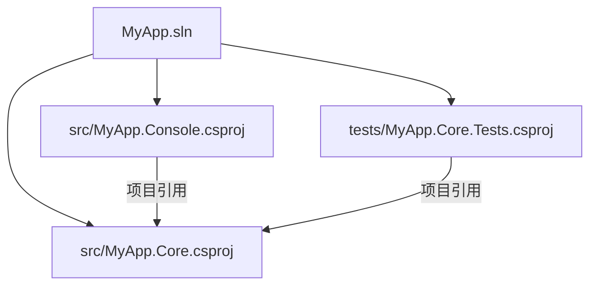

> 所属计划: [[../plan|dotnet CLI 与 C# 工程构建]]
> 预计耗时: 50 分钟
> 前置知识: [[04-dotnet-add-remove|dotnet add / remove — 包引用与项目引用]]

---

## 1. 概念讲解

### 什么是 .sln 文件？

`.sln`（Solution）文件是 .NET 生态中**组织多个项目**的顶层容器。单个 `.csproj` 文件管理一个项目的编译、依赖和输出；当你需要让多个项目协同工作——比如一个控制台应用引用一个类库，再加一个单元测试项目——`.sln` 把它们绑在一起。

一句话：**`.sln` = 多项目工作区的清单文件。**



### 什么时候需要 .sln？

| 场景 | 需要 .sln？ |
|------|-------------|
| 单个控制台/类库项目 | 不需要（但 IDE 可能自动生成一个） |
| 控制台 + 类库 | 需要 |
| 多个类库 + 测试项目 | 需要 |
| 微服务，每个服务独立开发 | 通常每个服务一个 .sln |

> [!tip] 类比
> `.sln` 就像 Cargo workspace 的 `Cargo.toml`（Rust）、CMake 的顶层 `CMakeLists.txt`（C++），或者 Node.js 的 `npm workspaces`。它是"项目组"的声明文件。

### .sln 里存了什么？

- 解决方案中包含的**项目列表**（每个项目有一个 GUID）
- 项目的**相对路径**
- **构建配置**（Debug/Release）和**平台映射**（x64/AnyCPU）
- **解决方案文件夹**（虚拟分组，不映射到文件系统目录）

> [!note] GUID 是什么？
> GUID（Globally Unique Identifier）是一个 128 位的唯一标识符，形如 `{FAE04EC0-301F-11D3-BF4B-00C04F79EFBC}`。每个项目在 .sln 中都有一个 GUID，用于在解决方案内部唯一标识项目。不同的 GUID 前缀还代表项目类型（C#、VB.NET、C++ 等）。

---

## 2. 代码示例

### 2.1 创建解决方案

有两种等价方式：

```bash
# 方式一：dotnet new sln（推荐 — 和其他 dotnet new 模板一致）
dotnet new sln -n MyApp

# 方式二：dotnet sln create（功能完全一致）
dotnet sln create -n MyApp
```

两种命令都会在当前目录下生成 `MyApp.sln`：

```text
MyApp/
└── MyApp.sln
```

> [!tip] `-n` 参数
> `-n MyApp` 指定解决方案名称和文件名。省略时，默认使用当前目录名。

**常用选项：**

| 选项 | 说明 |
|------|------|
| `-n, --name` | 解决方案名称 |
| `-o, --output` | 输出目录（不指定则为当前目录） |
| `--force` | 强制覆盖已有文件 |

### 2.2 添加项目到解决方案

语法：

```bash
dotnet sln <SLN_FILE> add <PROJECT_PATH> [--solution-folder <FOLDER>]
```

#### 基本用法：添加单个项目

```bash
# 先创建项目和解决方案
dotnet new sln -n MyApp
dotnet new console -n MyApp.Console -o src/MyApp.Console
dotnet new classlib -n MyApp.Core -o src/MyApp.Core

# 把项目添加到解决方案
dotnet sln MyApp.sln add src/MyApp.Console/MyApp.Console.csproj
dotnet sln MyApp.sln add src/MyApp.Core/MyApp.Core.csproj
```

> [!tip] 命令可以简写
> 如果你的 shell 支持 glob 展开，也可以写成 `dotnet sln MyApp.sln add src/**/*.csproj`。但注意：在 Windows CMD 中 glob 不会自动展开，需要用下面的方式。

#### 使用 Glob 模式批量添加

```bash
# dotnet sln add 本身支持通配符（由 dotnet CLI 解释，不依赖 shell）
dotnet sln MyApp.sln add **/*.csproj
```

这会递归查找当前目录下所有 `.csproj` 文件并添加到解决方案。

> [!warning] Glob 的陷阱
> `**/*.csproj` 会匹配 `bin/` 和 `obj/` 目录下的临时项目文件吗？**不会**——dotnet CLI 的 glob 实现会自动忽略 `.git`、`bin`、`obj` 等目录。但如果在解决方案外有同名项目，它也会被匹配到。

#### 精确匹配（推荐做法）

```bash
# 明确指定路径，避免意外包含
dotnet sln MyApp.sln add src/MyApp.Console/MyApp.Console.csproj
dotnet sln MyApp.sln add src/MyApp.Core/MyApp.Core.csproj
dotnet sln MyApp.sln add tests/MyApp.Core.Tests/MyApp.Core.Tests.csproj
```

### 2.3 解决方案文件夹（Solution Folders）

解决方案文件夹是 `.sln` 内部的**虚拟分组**，用于在 IDE（Visual Studio / Rider）中组织项目，**不对应文件系统目录**。

```bash
# 创建项目时放在文件系统的 src/ 目录下
dotnet new console -n MyApp.Console -o src/MyApp.Console
dotnet new classlib -n MyApp.Core -o src/MyApp.Core
dotnet new xunit -n MyApp.Core.Tests -o tests/MyApp.Core.Tests

# 添加时指定解决方案文件夹
dotnet sln MyApp.sln add src/MyApp.Console/MyApp.Console.csproj --solution-folder src
dotnet sln MyApp.sln add src/MyApp.Core/MyApp.Core.csproj --solution-folder src
dotnet sln MyApp.sln add tests/MyApp.Core.Tests/MyApp.Core.Tests.csproj --solution-folder tests
```

在 Visual Studio 的解决方案资源管理器中，项目会显示为：

```text
Solution 'MyApp' (3 projects)
├── src/
│   ├── MyApp.Console
│   └── MyApp.Core
└── tests/
    └── MyApp.Core.Tests
```

> [!note] 解决方案文件夹 vs 文件系统目录
> 解决方案文件夹的名称**可以和文件系统目录不同**。比如你可以把 `src/MyApp.Core` 放在解决方案文件夹 `Core Libraries` 下面。但通常保持一致更直观。
>
> 解决方案文件夹本质上是 .sln 文件中的"虚拟文件夹"条目，不会在文件系统中创建任何目录。

### 2.4 列出解决方案中的项目

```bash
dotnet sln MyApp.sln list
```

**输出示例：**

```text
Project(s)
----------
src/MyApp.Console/MyApp.Console.csproj
src/MyApp.Core/MyApp.Core.csproj
tests/MyApp.Core.Tests/MyApp.Core.Tests.csproj
```

### 2.5 从解决方案中移除项目

```bash
dotnet sln MyApp.sln remove <PROJECT_PATH>
```

```bash
# 移除单个项目
dotnet sln MyApp.sln remove src/MyApp.Core/MyApp.Core.csproj

# 也可以用 glob 批量移除
dotnet sln MyApp.sln remove **/*.Tests.csproj
```

> [!warning] remove 只改 .sln，不删除文件
> `dotnet sln remove` 只是把项目从解决方案的列表中移除，**不会删除硬盘上的项目文件或源码**。要完全删除项目，还需要手动 `rm -rf` 对应的目录。

### 2.6 理解 .sln 文件格式

让我们看看 `MyApp.sln` 的实际内容：

```bash
cat MyApp.sln
```

```text
Microsoft Visual Studio Solution File, Format Version 12.00
# Visual Studio Version 17
VisualStudioVersion = 17.0.31903.59
MinimumVisualStudioVersion = 10.0.40219.1
Project("{FAE04EC0-301F-11D3-BF4B-00C04F79EFBC}") = "MyApp.Console",
"src\MyApp.Console\MyApp.Console.csproj",
"{A1B2C3D4-E5F6-7890-ABCD-EF1234567890}"
EndProject
Project("{FAE04EC0-301F-11D3-BF4B-00C04F79EFBC}") = "MyApp.Core",
"src\MyApp.Core\MyApp.Core.csproj",
"{B2C3D4E5-F6A7-8901-BCDE-F12345678901}"
EndProject
Global
    GlobalSection(SolutionConfigurationPlatforms) = preSolution
        Debug|Any CPU = Debug|Any CPU
        Release|Any CPU = Release|Any CPU
    EndGlobalSection
    GlobalSection(ProjectConfigurationPlatforms) = postSolution
        {A1B2C3D4-E5F6-7890-ABCD-EF1234567890}.Debug|Any CPU.ActiveCfg = Debug|Any CPU
        {A1B2C3D4-E5F6-7890-ABCD-EF1234567890}.Debug|Any CPU.Build.0 = Debug|Any CPU
        {A1B2C3D4-E5F6-7890-ABCD-EF1234567890}.Release|Any CPU.ActiveCfg = Release|Any CPU
        {A1B2C3D4-E5F6-7890-ABCD-EF1234567890}.Release|Any CPU.Build.0 = Release|Any CPU
        {B2C3D4E5-F6A7-8901-BCDE-F12345678901}.Debug|Any CPU.ActiveCfg = Debug|Any CPU
        {B2C3D4E5-F6A7-8901-BCDE-F12345678901}.Debug|Any CPU.Build.0 = Debug|Any CPU
        {B2C3D4E5-F6A7-8901-BCDE-F12345678901}.Release|Any CPU.ActiveCfg = Release|Any CPU
        {B2C3D4E5-F6A7-8901-BCDE-F12345678901}.Release|Any CPU.Build.0 = Release|Any CPU
    EndGlobalSection
EndGlobal
```

**关键字段解读：**

| 行/段 | 含义 |
|--------|------|
| `Format Version 12.00` | .sln 格式版本（VS 2022 使用 12.00） |
| `Project("{GUID}")` | 项目条目。`{FAE04EC0-...}` = C# 项目类型 GUID |
| `= "MyApp.Console"` | 项目在解决方案中的显示名称 |
| `"src\MyApp.Console\..."` | 项目文件的**相对路径**（相对于 .sln） |
| `"{A1B2C3D4-...}"` | **项目实例 GUID**（解决方案内唯一） |
| `GlobalSection(SolutionConfigurationPlatforms)` | 可用的构建配置（Debug/Release × Any CPU/x64） |
| `GlobalSection(ProjectConfigurationPlatforms)` | 每个项目在每个配置下是否编译（Build） |

> [!tip] 项目类型 GUID 一览
> | GUID | 项目类型 |
> |------|---------|
> | `{FAE04EC0-301F-11D3-BF4B-00C04F79EFBC}` | C# |
> | `{F184B08F-C81C-45F6-A57F-5ABD9991F28F}` | VB.NET |
> | `{8BC9CEB8-8B4A-11D0-8D11-00A0C91BC942}` | C++ |
> | `{9A19103F-16F7-4668-BE54-9A1E7A4F7556}` | C# (SDK-style, 新版) |
> | `{2150E333-8FDC-42A3-9474-1A3956D46DE8}` | 解决方案文件夹 |

### 2.7 解决方案文件夹在 .sln 中的表示

使用 `--solution-folder` 后，.sln 中会产生 `Project("{2150E333-...}")` 类型的条目：

```text
Project("{2150E333-8FDC-42A3-9474-1A3956D46DE8}") = "src", "src", "{SOME-GUID}"
EndProject
Project("{2150E333-8FDC-42A3-9474-1A3956D46DE8}") = "tests", "tests", "{ANOTHER-GUID}"
EndProject
```

以及 `GlobalSection(NestedProjects)` 来声明嵌套关系：

```text
GlobalSection(NestedProjects) = preSolution
    {A1B2C3D4-...} = {SOME-GUID}       # MyApp.Console 嵌套在 src 下
    {B2C3D4E5-...} = {SOME-GUID}       # MyApp.Core 嵌套在 src 下
    {C3D4E5F6-...} = {ANOTHER-GUID}     # MyApp.Core.Tests 嵌套在 tests 下
EndGlobalSection
```

### 2.8 最佳实践：解决方案目录结构

推荐的目录布局：

```text
MyApp/
├── MyApp.sln                    # 解决方案文件在根目录
├── src/                         # 源码项目
│   ├── MyApp.Console/           # 控制台应用（启动项目）
│   ├── MyApp.Core/              # 核心类库（业务逻辑）
│   └── MyApp.Data/              # 数据访问层
├── tests/                       # 测试项目
│   ├── MyApp.Core.Tests/        # Core 的单元测试
│   └── MyApp.Data.Tests/        # Data 的单元测试
├── docs/                        # 文档
└── README.md                    # 项目说明
```

**为什么这样设计？**

1. `.sln` 在根目录：`dotnet build`、`dotnet test` 在解决方案根目录运行，自动包含所有项目。
2. `src/` 和 `tests/` 分离：清晰区分产品代码和测试代码，CI/CD 中方便区分处理。
3. 解决方案文件夹名与文件系统目录名一致：减少认知负担。
4. 项目目录以命名空间命名：`MyApp.Core` 既是目录名也是项目名，也是命名空间。

> [!tip] `Directory.Build.props`
> 如果多个项目共享相同的配置（如 `ImplicitUsings`、`Nullable`），可以在解决方案根目录放一个 `Directory.Build.props` 文件，所有子项目会自动继承。详见 [[06-csproj-and-sln-deep-dive|第 6 节]]。

### 2.9 完整实战示例

从头创建一个多项目解决方案：

```bash
# 步骤 1: 创建解决方案
mkdir MyApp && cd MyApp
dotnet new sln -n MyApp

# 步骤 2: 创建源码目录和项目
mkdir -p src tests

dotnet new console -n MyApp.Console -o src/MyApp.Console --use-program-main
dotnet new classlib -n MyApp.Core -o src/MyApp.Core
dotnet new classlib -n MyApp.Data -o src/MyApp.Data

# 步骤 3: 创建测试项目
dotnet new xunit -n MyApp.Core.Tests -o tests/MyApp.Core.Tests
dotnet new xunit -n MyApp.Data.Tests -o tests/MyApp.Data.Tests

# 步骤 4: 添加项目到解决方案（带解决方案文件夹）
dotnet sln MyApp.sln add src/MyApp.Console/MyApp.Console.csproj --solution-folder src
dotnet sln MyApp.sln add src/MyApp.Core/MyApp.Core.csproj --solution-folder src
dotnet sln MyApp.sln add src/MyApp.Data/MyApp.Data.csproj --solution-folder src
dotnet sln MyApp.sln add tests/MyApp.Core.Tests/MyApp.Core.Tests.csproj --solution-folder tests
dotnet sln MyApp.sln add tests/MyApp.Data.Tests/MyApp.Data.Tests.csproj --solution-folder tests

# 步骤 5: 建立项目引用
dotnet add src/MyApp.Console/MyApp.Console.csproj reference src/MyApp.Core/MyApp.Core.csproj
dotnet add src/MyApp.Data/MyApp.Data.csproj reference src/MyApp.Core/MyApp.Core.csproj
dotnet add tests/MyApp.Core.Tests/MyApp.Core.Tests.csproj reference src/MyApp.Core/MyApp.Core.csproj
dotnet add tests/MyApp.Data.Tests/MyApp.Data.Tests.csproj reference src/MyApp.Data/MyApp.Data.csproj

# 步骤 6: 验证解决方案
dotnet sln MyApp.sln list
```

**输出：**

```text
Project(s)
----------
src/MyApp.Console/MyApp.Console.csproj
src/MyApp.Core/MyApp.Core.csproj
src/MyApp.Data/MyApp.Data.csproj
tests/MyApp.Core.Tests/MyApp.Core.Tests.csproj
tests/MyApp.Data.Tests/MyApp.Data.Tests.csproj
```

```bash
# 步骤 7: 构建整个解决方案
dotnet build

# 步骤 8: 运行测试
dotnet test
```

**预期输出：**

```text
MSBuild version 17.x...
  Determining projects to restore...
  All projects are up-to-date for restore.
  MyApp.Core -> src/MyApp.Core/bin/Debug/net9.0/MyApp.Core.dll
  MyApp.Data -> src/MyApp.Data/bin/Debug/net9.0/MyApp.Data.dll
  MyApp.Console -> src/MyApp.Console/bin/Debug/net9.0/MyApp.Console.dll
  MyApp.Core.Tests -> tests/MyApp.Core.Tests/bin/Debug/net9.0/MyApp.Core.Tests.dll
  MyApp.Data.Tests -> tests/MyApp.Data.Tests/bin/Debug/net9.0/MyApp.Data.Tests.dll

Build succeeded.
    0 Warning(s)
    0 Error(s)
```

---

## 3. 练习

### 练习 1: 动手搭建

创建一个名为 `BookStore` 的解决方案，包含：

- `src/BookStore.App` — 控制台应用
- `src/BookStore.Domain` — 类库（领域模型）
- `src/BookStore.Infrastructure` — 类库（数据访问）
- `tests/BookStore.Domain.Tests` — xUnit 测试项目

要求：
1. 使用 `--solution-folder` 将项目分组为 `src` 和 `tests`
2. `BookStore.App` 引用 `BookStore.Domain` 和 `BookStore.Infrastructure`
3. `BookStore.Infrastructure` 引用 `BookStore.Domain`
4. `BookStore.Domain.Tests` 引用 `BookStore.Domain`
5. 最终 `dotnet build` 全部通过

> [!tip] 提示
> 参考 [[04-dotnet-add-remove|第 4 节]] 中的 `dotnet add reference` 命令。

### 练习 2: .sln 侦查

使用上面的 `BookStore.sln`，完成以下任务：

1. 用文本编辑器打开 `BookStore.sln`，找到每个项目的 GUID
2. 确认每个 `Project()` 条目中的项目类型 GUID 是什么
3. 找到 `NestedProjects` 段，验证项目到解决方案文件夹的映射
4. 手动向 .sln 添加一个注释行（以 `#` 开头），观察 `dotnet build` 是否仍然正常

### 练习 3: 修复错误的 .sln

某同事给你一个解决方案 `BrokenApp.sln`，但 `dotnet build` 报错：

```text
error MSB4057: The target "Build" does not exist in the project.
```

排查步骤提示：
1. 用 `dotnet sln list` 查看项目列表
2. 检查每个 `.csproj` 文件的路径是否有效——可能有人移动了项目目录但没有更新 .sln 中的路径
3. 用 `dotnet sln remove` 移除无效项目，再 `dotnet sln add` 重新加入正确路径
4. 模拟这个场景：创建一个项目，把它加入 .sln，然后手动把项目目录改名，观察错误并修复

---


## 3.5 参考答案

> [!tip]- 练习 1 参考答案
> **搭建 BookStore 多项目解决方案**：
>
> ```bash
> # 1. 创建根目录和解决方案
> mkdir BookStore && cd BookStore
> dotnet new sln -n BookStore
>
> # 2. 创建项目
> dotnet new console -n BookStore.App -o src/BookStore.App
> dotnet new classlib -n BookStore.Domain -o src/BookStore.Domain
> dotnet new classlib -n BookStore.Infrastructure -o src/BookStore.Infrastructure
> dotnet new xunit -n BookStore.Domain.Tests -o tests/BookStore.Domain.Tests
> ```
>
> ```bash
> # 3. 添加项目到解决方案（带解决方案文件夹分组）
> dotnet sln BookStore.sln add src/BookStore.App/BookStore.App.csproj --solution-folder src
> dotnet sln BookStore.sln add src/BookStore.Domain/BookStore.Domain.csproj --solution-folder src
> dotnet sln BookStore.sln add src/BookStore.Infrastructure/BookStore.Infrastructure.csproj --solution-folder src
> dotnet sln BookStore.sln add tests/BookStore.Domain.Tests/BookStore.Domain.Tests.csproj --solution-folder tests
> ```
>
> ```bash
> # 4. 建立项目引用链
> # Infrastructure → Domain
> dotnet add src/BookStore.Infrastructure/BookStore.Infrastructure.csproj reference src/BookStore.Domain/BookStore.Domain.csproj
>
> # App → Domain
> dotnet add src/BookStore.App/BookStore.App.csproj reference src/BookStore.Domain/BookStore.Domain.csproj
>
> # App → Infrastructure
> dotnet add src/BookStore.App/BookStore.App.csproj reference src/BookStore.Infrastructure/BookStore.Infrastructure.csproj
>
> # Domain.Tests → Domain
> dotnet add tests/BookStore.Domain.Tests/BookStore.Domain.Tests.csproj reference src/BookStore.Domain/BookStore.Domain.csproj
> ```
>
> ```bash
> # 5. 验证
> dotnet build
> # 预期：全部编译通过，0 Error(s)
>
> dotnet sln list
> # 预期输出：
> #   src/BookStore.App/BookStore.App.csproj
> #   src/BookStore.Domain/BookStore.Domain.csproj
> #   src/BookStore.Infrastructure/BookStore.Infrastructure.csproj
> #   tests/BookStore.Domain.Tests/BookStore.Domain.Tests.csproj
> ```
>
> **最终目录结构**：
>
> ```text
> BookStore/
> ├── BookStore.sln
> ├── src/
> │   ├── BookStore.App/
> │   │   ├── BookStore.App.csproj
> │   │   └── Program.cs
> │   ├── BookStore.Domain/
> │   │   ├── BookStore.Domain.csproj
> │   │   └── Class1.cs
> │   └── BookStore.Infrastructure/
> │       ├── BookStore.Infrastructure.csproj
> │       └── Class1.cs
> └── tests/
>     └── BookStore.Domain.Tests/
>         ├── BookStore.Domain.Tests.csproj
>         └── UnitTest1.cs
> ```
>
> **依赖关系图**（`.sln` 中的解决方案文件夹分组在 IDE 中显示为 `src/` 和 `tests/` 两个虚拟文件夹）：
>
> ```
> BookStore.App ──→ BookStore.Infrastructure ──→ BookStore.Domain
>        │                                                    ↑
>        └────────────────────────────────────────────────────┘
>                                           BookStore.Domain.Tests
> ```

> [!tip]- 练习 2 参考答案
> **.sln 文件侦查**：
>
> 用文本编辑器打开 `BookStore.sln`，关键字段识别：
>
> ```text
> # 1. 每个项目的 Project() 条目包含三个 GUID：
> Project("{FAE04EC0-301F-11D3-BF4B-00C04F79EFBC}") = "BookStore.App",
> "src\BookStore.App\BookStore.App.csproj",
> "{A1B2C3D4-E5F6-7890-ABCD-EF1234567890}"
> EndProject
> # 解析：
> #   GUID 1: {FAE04EC0-...} = 项目类型 GUID（C# 项目）
> #   GUID 2: {A1B2C3D4-...} = 项目实例 GUID（解决方案内唯一标识）
> #   注意：你看到的实际 GUID 与示例不同——每个项目创建时生成新的 GUID
>
> # 2. 所有 C# 项目的类型 GUID 都是 {FAE04EC0-...}（旧格式）
> #    或 {9A19103F-...}（SDK 格式），取决于 .NET 版本
> #    你可以通过这个 GUID 区分项目类型
>
> # 3. NestedProjects 段验证解决方案文件夹映射
> GlobalSection(NestedProjects) = preSolution
>     {A1B2C3D4-...} = {SRC-FOLDER-GUID}    # App 嵌套在 src 下
>     {B2C3D4E5-...} = {SRC-FOLDER-GUID}    # Domain 嵌套在 src 下
>     {C3D4E5F6-...} = {SRC-FOLDER-GUID}    # Infrastructure 嵌套在 src 下
>     {D4E5F6A7-...} = {TEST-FOLDER-GUID}    # Tests 嵌套在 tests 下
> EndGlobalSection
> # 注意：解决方案文件夹（如 src、tests）本身也是 Project 条目
> #       它们的类型 GUID 是 {2150E333-8FDC-42A3-9474-1A3956D46DE8}
> ```
>
> ```bash
> # 4. 测试 .sln 中添加注释行
> # 在 BookStore.sln 第一行添加注释（以 # 开头）：
> # # This is a test comment
> # 然后运行：
> dotnet build
> # 结论：dotnet build 忽略以 # 开头的注释行，构建正常
> # .sln 格式支持 # 单行注释，不会有任何影响
> ```

> [!tip]- 练习 3 参考答案
> **修复错误 .sln 的模拟与排查**：
>
> ```bash
> # 模拟场景：创建项目 → 加入 .sln → 移动项目目录 → 触发错误
>
> # 1. 创建正常的解决方案
> mkdir BrokenDemo && cd BrokenDemo
> dotnet new sln -n BrokenApp
> dotnet new classlib -n GoodLib -o src/GoodLib
> dotnet sln BrokenApp.sln add src/GoodLib/GoodLib.csproj
>
> # 2. 模拟"移动了项目目录"——改名模拟路径变化
> mv src/GoodLib src/RenamedLib
>
> # 3. 尝试构建 — 报错
> dotnet build
> # 错误信息类似于：
> #   error MSB3202: The project file "src\GoodLib\GoodLib.csproj" was not found.
> #   原因：.sln 中存储的是旧路径 src/GoodLib/GoodLib.csproj
> #         实际文件已经在 src/RenamedLib/GoodLib.csproj
> ```
>
> ```bash
> # 4. 排查步骤
> # 步骤 A: 列出 .sln 中的项目
> dotnet sln BrokenApp.sln list
> # 输出：src/GoodLib/GoodLib.csproj（这个路径已不存在）
>
> # 步骤 B: 确认文件实际位置
> ls src/RenamedLib/GoodLib.csproj  # 存在
> ls src/GoodLib/GoodLib.csproj     # 不存在！
>
> # 步骤 C: 从 .sln 中移除旧路径
> dotnet sln BrokenApp.sln remove src/GoodLib/GoodLib.csproj
>
> # 步骤 D: 添加正确路径
> dotnet sln BrokenApp.sln add src/RenamedLib/GoodLib.csproj
>
> # 5. 验证修复
> dotnet build
> # 预期：构建成功
> ```
>
> **关键教训**：
> - `.sln` 中的项目路径是**相对路径**（相对于 .sln 文件所在目录）
> - 移动/重命名项目目录后必须更新 .sln 中的引用
> - `dotnet sln remove` + `dotnet sln add` 是最安全的修复方式
> - 不要手动编辑 .sln 中的路径——格式复杂且容易搞乱 GUID 和配置段

> [!note] 答案使用方式
> 先独立完成练习，再展开查看参考答案。参考答案不是唯一解——如果你的实现通过了测试或达到了题目要求，就是正确的。
## 4. 扩展阅读

- [Microsoft Learn: dotnet sln command](https://learn.microsoft.com/en-us/dotnet/core/tools/dotnet-sln) — 官方命令参考
- [Microsoft Learn: Solution (.sln) file format](https://learn.microsoft.com/en-us/visualstudio/extensibility/internals/solution-dot-sln-file) — .sln 文件格式详解
- [Microsoft Learn: .NET project SDK overview](https://learn.microsoft.com/en-us/dotnet/core/project-sdk/overview) — SDK-style 项目系统
- [Microsoft Learn: dotnet CLI overview](https://learn.microsoft.com/en-us/dotnet/core/tools/) — dotnet CLI 工具全景
- [Repository: dotnet/samples](https://github.com/dotnet/samples) — 官方 .NET 示例，包含多项目解决方案
- [[06-csproj-and-sln-deep-dive|第 6 节：项目文件结构深入]] — 深入 `.csproj` 和 `.sln` 的内部结构

---

## 常见陷阱

- **陷阱 1: .sln 中的相对路径问题。** .sln 文件中存储的项目路径是**相对于 .sln 文件所在目录**的。如果你移动了 .sln 文件但没有移动项目目录，路径就会失效。同理，移动项目目录后必须更新 .sln。

  **修复方法：**
  ```bash
  # 先移除旧的（失效的）路径
  dotnet sln MyApp.sln remove old/path/Project.csproj
  # 再添加新的（正确的）路径
  dotnet sln MyApp.sln add new/path/Project.csproj
  ```

- **陷阱 2: 重复的项目 GUID。** 如果你手动复制 .sln 中的 `Project()` 条目、拷贝整个 .sln 文件，或者通过脚本生成 .sln，可能产生重复的 GUID。这会导致 Visual Studio 行为异常（项目加载失败、配置混乱）。

  **检查方法：** 用文本编辑器搜索每个 GUID，确认只出现一次。如果重复，手动修改其中一个 GUID（改成一个新的 GUID — 可以在终端用 `uuidgen` 或在线 GUID 生成器生成）。

- **陷阱 3: 项目文件不存在。** 当你 `dotnet sln add` 一个项目后，又手动删除或重命名了 `.csproj` 文件，.sln 中仍然保留着旧路径的引用。`dotnet build` 或 `dotnet sln list` 会报错或显示警告。

  **预防：** 删除项目时，先 `dotnet sln remove`，再 `rm -rf` 项目目录。

- **陷阱 4: 解决方案文件夹名称歧义。** `--solution-folder` 的参数只是解决方案内部的虚拟名称，**不会自动创建同名的文件系统目录**。常见错误是写了 `--solution-folder src/MyApp`（以为能嵌套），但解决方案文件夹不支持层级路径分隔符。

  **正确做法：** `--solution-folder` 只能指定**一级**文件夹名（如 `src`、`tests`）。在 Visual Studio 中可以手动创建嵌套文件夹。

- **陷阱 5: `dotnet sln add` 对大项目的性能。** 当解决方案包含几十个或上百个项目时，`dotnet sln add` 每次都会重写整个 .sln 文件。频繁添加/移除项目可能变慢。

  **缓解：** 批量添加时使用 glob 模式（`dotnet sln add **/*.csproj`），一次操作完成所有添加。
