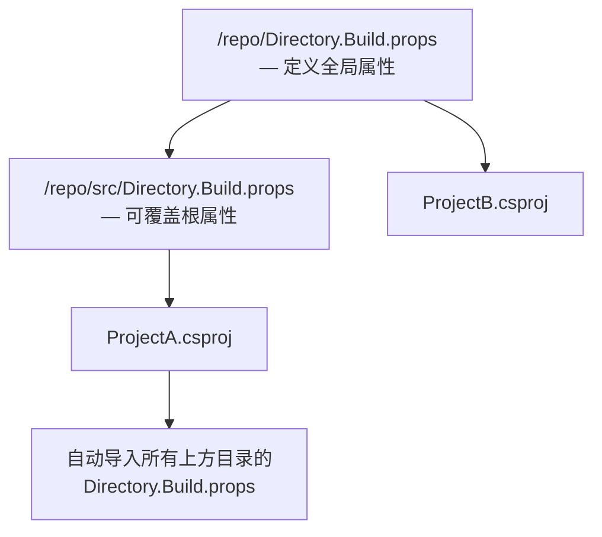

# 项目文件结构深入 — `.csproj` 与 `.sln`

> 前置教程: [[05-dotnet-sln|05-dotnet-sln]]
> 预计耗时: 60min
> 本节目标：能独立阅读、修改 `.csproj` 和 `.sln` 文件，理解每个 XML 节点和配置段的作用，遇到错误能定位。

---

## 一、概念讲解

### 为什么需要深入 `.csproj` 和 `.sln`？

在前面的教程中，你通过 `dotnet new`、`dotnet add`、`dotnet sln` 等命令操作项目，命令行工具帮你完成了文件修改。但当你需要：

- 配置 NuGet 包的条件引用（Debug 用 A 包，Release 用 B 包）
- 为整个仓库统一设置 `Nullable`、`ImplicitUsings`、`LangVersion`
- 锁定 SDK 版本确保团队一致性
- 排查构建错误时理解错误来源
- CI/CD 管道中自定义编译行为

……你就**必须**能看懂和修改这些文件。

> [!note] 两种项目文件
> .NET 生态有两个核心配置文件：
> - **`.csproj`** — 描述**一个**项目的编译规则（目标框架、依赖、源文件、编译选项）
> - **`.sln`** — 描述**多个**项目之间的关系（哪些项目在一起、配置映射）

---

## 二、`.csproj` 文件深入

### 2.1 SDK 属性 (`<Project Sdk="...">`)

每个 SDK-style `.csproj` 的第一行：

```xml
<Project Sdk="Microsoft.NET.Sdk">
```

`Sdk` 属性告诉 MSBuild："加载这个 SDK 提供的默认构建规则"。不同 SDK 决定了项目的"身份"和默认行为。

| SDK | 用途 | 默认输出 |
|-----|------|---------|
| `Microsoft.NET.Sdk` | 控制台应用、类库、测试项目 | `.exe` 或 `.dll` |
| `Microsoft.NET.Sdk.Web` | ASP.NET Core Web 应用 | `.dll`（配合 Web 服务器） |
| `Microsoft.NET.Sdk.Razor` | Razor 类库（含 `.razor` / `.cshtml` 组件） | `.dll` |
| `Microsoft.NET.Sdk.Worker` | 后台服务（Worker Service） | `.dll` |
| `Microsoft.NET.Sdk.BlazorWebAssembly` | Blazor WASM 应用 | `.dll`（浏览器端） |

```xml
<!-- 控制台应用 -->
<Project Sdk="Microsoft.NET.Sdk">

<!-- Web API -->
<Project Sdk="Microsoft.NET.Sdk.Web">

<!-- Razor 组件库 -->
<Project Sdk="Microsoft.NET.Sdk.Razor">
```

> [!tip] SDK 决定了"默认包含哪些文件"
> `Microsoft.NET.Sdk.Web` 内置了静态文件处理、wwwroot 发布等逻辑。如果你用错 SDK，构建可能缺失关键步骤。

### 2.2 `<PropertyGroup>` — 项目属性

`<PropertyGroup>` 是 `.csproj` 的核心配置区，定义 MSBuild **属性**（键值对）。

#### 最常用的属性

```xml
<Project Sdk="Microsoft.NET.Sdk">

  <PropertyGroup>
    <!-- 目标框架：支持 net8.0, net7.0, net6.0, netstandard2.0 等 -->
    <TargetFramework>net8.0</TargetFramework>

    <!-- 输出类型：Exe(控制台/Win) / Library(类库) / WinExe(WinForms/WPF) -->
    <OutputType>Exe</OutputType>

    <!-- 程序集版本号 -->
    <AssemblyVersion>1.0.0.0</AssemblyVersion>

    <!-- NuGet 包版本号 -->
    <Version>1.2.3</Version>

    <!-- 启用可空引用类型检查（C# 8+） -->
    <Nullable>enable</Nullable>

    <!-- 隐式全局 using（C# 10+） -->
    <ImplicitUsings>enable</ImplicitUsings>

    <!-- C# 语言版本：latest, preview, 12, 11, 10, ... -->
    <LangVersion>latest</LangVersion>

    <!-- 生成 XML 文档文件（用于 NuGet 包 / IDE 智能提示） -->
    <GenerateDocumentationFile>true</GenerateDocumentationFile>

    <!-- 警告即错误 -->
    <TreatWarningsAsErrors>true</TreatWarningsAsErrors>

    <!-- 根命名空间（默认 = 项目名） -->
    <RootNamespace>MyApp.Core</RootNamespace>

    <!-- 程序集名（默认 = 项目名） -->
    <AssemblyName>MyAppCore</AssemblyName>
  </PropertyGroup>

</Project>
```

> [!warning] `Nullable` 默认值因模板而异
> .NET 6+ 的控制台/类库模板默认 `Nullable=enable`，但旧模板可能 `disable`。始终显式设置它是好习惯。

#### 条件属性组 (Condition)

可以为不同环境定义不同的属性值：

```xml
<!-- Debug 构建专属属性 -->
<PropertyGroup Condition="'$(Configuration)' == 'Debug'">
  <DefineConstants>DEBUG;TRACE</DefineConstants>
  <Optimize>false</Optimize>
</PropertyGroup>

<!-- Release 构建专属属性 -->
<PropertyGroup Condition="'$(Configuration)' == 'Release'">
  <Optimize>true</Optimize>
</PropertyGroup>

<!-- Windows 平台专属 -->
<PropertyGroup Condition="$([MSBuild]::IsOSPlatform('Windows'))">
  <DefineConstants>$(DefineConstants);WINDOWS</DefineConstants>
</PropertyGroup>
```

### 2.3 `<ItemGroup>` — 项目项

`<ItemGroup>` 定义 MSBuild **项**（Item）——文件引用、包引用、项目引用等。

#### PackageReference — NuGet 包引用

```xml
<ItemGroup>
  <!-- 普通包引用 -->
  <PackageReference Include="Newtonsoft.Json" Version="13.0.3" />

  <!-- 开发期依赖（不打入发布包） -->
  <PackageReference Include="Microsoft.CodeAnalysis.Analyzers" Version="4.0.0">
    <PrivateAssets>all</PrivateAssets>
    <IncludeAssets>runtime; build; native; contentfiles; analyzers</IncludeAssets>
  </PackageReference>

  <!-- 仅特定框架使用 -->
  <PackageReference Include="System.Text.Json" Version="8.0.0"
                    Condition="'$(TargetFramework)' == 'net8.0'" />
</ItemGroup>
```

#### ProjectReference — 项目引用

```xml
<ItemGroup>
  <!-- 引用同解决方案下的另一个项目 -->
  <ProjectReference Include="..\MyLibrary\MyLibrary.csproj" />

  <!-- 条件引用 -->
  <ProjectReference Include="..\DebugHelpers\DebugHelpers.csproj"
                    Condition="'$(Configuration)' == 'Debug'" />
</ItemGroup>
```

#### 显式文件包含

SDK-style 项目**自动包含** `*.cs`、`*.resx` 等常见文件类型，但你也可以显式控制：

```xml
<ItemGroup>
  <!-- 编译 WPF 页面（通常 SDK 自动包含） -->
  <Compile Include="**/*.cs" Exclude="obj/**/*.cs;bin/**/*.cs" />

  <!-- 嵌入资源文件（二进制/文本嵌入到程序集） -->
  <EmbeddedResource Include="Resources\help.json" />

  <!-- 复制到输出目录但不编译的文件 -->
  <None Include="appsettings.json">
    <CopyToOutputDirectory>PreserveNewest</CopyToOutputDirectory>
  </None>

  <!-- 始终复制到输出目录的内容文件 -->
  <Content Include="wwwroot\**\*">
    <CopyToOutputDirectory>PreserveNewest</CopyToOutputDirectory>
  </Content>
</ItemGroup>
```

#### 条件项组

```xml
<!-- 仅在 Debug 构建时包含调试资源 -->
<ItemGroup Condition="'$(Configuration)' == 'Debug'">
  <EmbeddedResource Include="DebugResources\debug-resources.json" />
</ItemGroup>
```

### 2.4 SDK-style vs 旧式 `.csproj`

> [!important] 核心区别
> 旧式项目文件（.NET Framework 时代，2017 以前）冗长、需显式列出每个源文件、格式与 Visual Studio 版本紧密绑定。SDK-style（.NET Core / .NET 5+）大幅精简，依赖「自动包含」和 SDK 默认规则。

| 特性 | SDK-style（现代） | 旧式（Legacy） |
|------|-------------------|----------------|
| 文件大小 | ~10–30 行 | ~数百行 |
| 源文件 | 自动包含 `*.cs` | 必须逐个列出 |
| 包引用 | `<PackageReference>` | `packages.config` 或 `<Reference>` |
| 可手编辑性 | ✅ 极易手写 | ⚠️ 繁琐（VS 通常管理） |
| 多目标框架 | `<TargetFrameworks>` 一行搞定 | 需要大量配置 |
| `dotnet` CLI | ✅ 一流支持 | ⚠️ 有限支持 |

**旧式 `.csproj` 片段（对比）：**

```xml
<!-- 旧式：每个 .cs 文件都要列出来 -->
<ItemGroup>
  <Compile Include="Program.cs" />
  <Compile Include="Models\User.cs" />
  <Compile Include="Models\Order.cs" />
  <Compile Include="Services\AuthService.cs" />
  <Compile Include="Services\PaymentService.cs" />
  <!-- ... 还有 50 行 ... -->
</ItemGroup>
```

**SDK-style 等价写法：**

```xml
<!-- 什么都不写！SDK 自动包含所有 *.cs -->
```

> [!tip] 默认包含列表
> SDK-style 默认自动包含的文件扩展名（基于语言和 SDK）：
> - C#: `*.cs`, `*.resx`, `*.cshtml`, `*.razor`（根据 SDK 不同）
> - 资源: `*.resx`
> - 嵌入资源: `*.resx`
>
> 你可以用 `<EnableDefaultCompileItems>false</EnableDefaultCompileItems>` 禁用自动包含。

### 2.5 `Directory.Build.props` 和 `Directory.Build.targets`

这是 MSBuild 的**树状继承机制**——父目录中的这两个文件会自动被所有子目录的项目继承。



- **`Directory.Build.props`** — 在项目文件**之前**导入，用于设置共享属性
- **`Directory.Build.targets`** — 在项目文件**之后**导入，用于覆盖/追加构建目标

```xml
<!-- /repo/Directory.Build.props — 整个仓库共享 -->
<Project>
  <PropertyGroup>
    <Nullable>enable</Nullable>
    <ImplicitUsings>enable</ImplicitUsings>
    <LangVersion>latest</LangVersion>
    <TreatWarningsAsErrors>true</TreatWarningsAsErrors>
    <GenerateDocumentationFile>true</GenerateDocumentationFile>
  </PropertyGroup>
</Project>
```

> [!warning] 不要放 `<TargetFramework>` 等每个项目不同的属性
> `Directory.Build.props` 对所有子项目生效。如果把 `<TargetFramework>net8.0</TargetFramework>` 放进去，所有项目（包括测试项目）都会用 `net8.0`，可能导致多目标项目失败。

---

## 三、`.sln` 文件深入

### 3.1 整体结构

`.sln` 是纯文本文件，由**节（Section）**组成。每个节以 `Project(...)` 或 `GlobalSection(...)` 开始。

```text
Microsoft Visual Studio Solution File, Format Version 12.00
# Visual Studio Version 17
VisualStudioVersion = 17.0.31903.59
MinimumVisualStudioVersion = 10.0.40219.1

# --- 项目定义区 ---
Project("{FAE04EC0-301F-11D3-BF4B-00C04F79EFBC}") = "MyApp", "src\MyApp\MyApp.csproj", "{A1B2C3D4-E5F6-7890-ABCD-EF1234567890}"
EndProject

Project("{FAE04EC0-301F-11D3-BF4B-00C04F79EFBC}") = "MyLib", "src\MyLib\MyLib.csproj", "{B2C3D4E5-F6A7-8901-BCDE-F12345678901}"
EndProject

# --- 全局配置区 ---
Global
    GlobalSection(SolutionConfigurationPlatforms) = preSolution
        Debug|Any CPU = Debug|Any CPU
        Release|Any CPU = Release|Any CPU
    EndGlobalSection
    GlobalSection(ProjectConfigurationPlatforms) = postSolution
        {A1B2C3D4...}.Debug|Any CPU.ActiveCfg = Debug|Any CPU
        {A1B2C3D4...}.Debug|Any CPU.Build.0 = Debug|Any CPU
        {A1B2C3D4...}.Release|Any CPU.ActiveCfg = Release|Any CPU
        {A1B2C3D4...}.Release|Any CPU.Build.0 = Release|Any CPU
        {B2C3D4E5...}.Debug|Any CPU.ActiveCfg = Debug|Any CPU
        {B2C3D4E5...}.Debug|Any CPU.Build.0 = Debug|Any CPU
        ...
    EndGlobalSection
EndGlobal
```

### 3.2 项目节 (`Project(...)`)

```text
Project("{项目类型GUID}") = "显示名称", "相对路径.csproj", "{项目GUID}"
EndProject
```

三个 GUID：

| GUID | 含义 |
|------|------|
| 项目类型 GUID | 标识项目是 C#（`FAE04EC0-...`）、F#、VB、文件夹、网站等 |
| 项目 GUID | 此项目在整个解决方案中的唯一标识符 |
| NestedProjects 中的父文件夹 GUID | 若项目被嵌套在解决方案文件夹下，该项存在 |

**常见项目类型 GUID：**

| GUID | 项目类型 |
|------|---------|
| `FAE04EC0-301F-11D3-BF4B-00C04F79EFBC` | C# 项目 |
| `F184B08F-C81C-45F6-A57F-5ABD9991F28F` | VB.NET 项目 |
| `2150E333-8FDC-42A3-9474-1A3956D46DE8` | 解决方案文件夹 |
| `9A19103F-16F7-4668-BE54-9A1E7A4F7556` | 旧版 C# 项目（某些模板） |

### 3.3 全局配置区 (`Global`)

#### `SolutionConfigurationPlatforms`

定义解决方案级别的构建配置：

```text
GlobalSection(SolutionConfigurationPlatforms) = preSolution
    Debug|Any CPU = Debug|Any CPU
    Debug|x64     = Debug|x64
    Release|Any CPU = Release|Any CPU
    Release|x64     = Release|x64
EndGlobalSection
```

#### `ProjectConfigurationPlatforms`

将解决方案配置**映射**到每个项目的配置：

```text
GlobalSection(ProjectConfigurationPlatforms) = postSolution
    {GUID}.Debug|Any CPU.ActiveCfg   = Debug|Any CPU
    {GUID}.Debug|Any CPU.Build.0     = Debug|Any CPU
    {GUID}.Release|Any CPU.ActiveCfg = Release|Any CPU
    {GUID}.Release|Any CPU.Build.0   = Release|Any CPU
EndGlobalSection
```

- `ActiveCfg` — 该配置下激活哪个项目配置
- `Build.0` — 该配置下是否参与构建（有则构建，无则跳过）

> [!note] 配置平台 vs CPU 架构
> 这里的 `Any CPU` / `x64` / `x86` 等是**平台名称**，不一定对应实际 CPU 指令集。由具体项目的 `<PlatformTarget>` 决定。

### 3.4 `dotnet sln` 如何修改 `.sln`

```bash
# 添加项目 → 在文件末尾插入一个 Project 节 + 更新 Global 区的配置映射
dotnet sln add src/NewProject/NewProject.csproj

# 移除项目 → 删除对应的 Project 节 + 清理 Global 区的配置映射
dotnet sln remove src/OldProject/OldProject.csproj

# 列出所有项目 → 解析 Project 节，读取显示名称和路径
dotnet sln list
```

当你运行 `dotnet sln add`，CLI：
1. 生成一个新的项目 GUID
2. 在 `.sln` 文件末尾（`Global` 之前）插入新的 `Project(...)` 节
3. 在 `ProjectConfigurationPlatforms` 中为每个已有配置插入对应的 ActiveCfg 和 Build.0 行

---

## 四、`NuGet.config` — 包源配置

`NuGet.config` 控制 NuGet 包的**来源**（从哪里下载）和**凭证**。

```xml
<?xml version="1.0" encoding="utf-8"?>
<configuration>
  <packageSources>
    <!-- 清除继承的源（可选） -->
    <clear />

    <!-- 官方 NuGet 源 -->
    <add key="nuget.org" value="https://api.nuget.org/v3/index.json"
         protocolVersion="3" />

    <!-- 企业内部私有源 -->
    <add key="MyCompanyFeed" value="https://pkgs.dev.azure.com/myorg/_packaging/feed/nuget/v3/index.json"
         protocolVersion="3" />

    <!-- 本地文件夹作为包源（调试/离线场景） -->
    <add key="LocalPackages" value="C:\packages\" />
  </packageSources>

  <!-- 包源凭证（按源名称匹配） -->
  <packageSourceCredentials>
    <MyCompanyFeed>
      <add key="Username" value="user@company.com" />
      <add key="ClearTextPassword" value="your-pat-token" />
    </MyCompanyFeed>
  </packageSourceCredentials>

  <!-- 全局包缓存位置 -->
  <config>
    <add key="globalPackagesFolder" value="D:\nuget-cache" />
  </config>
</configuration>
```

**加载顺序**（最近优先）：

1. 项目目录下的 `NuGet.config`（项目级）
2. 向上逐级遍历父目录（仓库级）
3. `%APPDATA%\NuGet\NuGet.config`（用户级）
4. `%ProgramFiles(x86)%\NuGet\Config\*.config`（机器级）

> [!tip] 用 `dotnet nuget` 命令管理
> ```bash
> dotnet nuget list source                    # 列出当前生效的源
> dotnet nuget add source <URL> --name <key>   # 添加源
> dotnet nuget remove source <key>             # 移除源
> dotnet nuget disable source <key>            # 禁用源
> dotnet nuget enable source <key>             # 启用源
> ```

---

## 五、`global.json` — SDK 版本固定

`global.json` 位于仓库根目录，**固定整个仓库使用的 .NET SDK 版本**。

```json
{
  "sdk": {
    "version": "8.0.300",
    "allowPrerelease": false,
    "rollForward": "latestFeature"
  },
  "msbuild-sdks": {
    "Microsoft.Build.Traversal": "3.2.0"
  }
}
```

**`rollForward` 策略：**

| 值 | 含义 | 示例 |
|----|------|------|
| `disable` | 严格匹配，无则报错 | 要求 `8.0.300`，找不到就失败 |
| `patch`（默认） | 允许补丁版本更新 | `8.0.100` → 可用 `8.0.300` |
| `feature` | 允许 feature band 内回退 | `8.0.300` → 可用 `8.0.100` |
| `minor` | 允许次版本更新 | `8.0.x` → 可用 `8.1.x`，不可 `9.0.x` |
| `major` | 允许主版本更新 | `8.0.x` → 可用 `9.0.x` |
| `latestPatch` | 总是选择最新补丁 | `8.0.100` → 可用 `8.0.300` |
| `latestFeature` | 总是选择最新 feature band | `8.0.100` → 可用 `8.0.300` |
| `latestMinor` | 总是选择最新次版本 | `8.0.100` → 可用 `8.1.x`，不可 `9.0.x` |
| `latestMajor` | 总是选择最新主版本 | `8.0.100` → 可用 `9.0.x` |

> [!warning] 团队协作必须使用 `global.json`
> 不同开发者可能安装了不同的 SDK 版本。如果没有 `global.json`，每个开发者用各自安装的最新 SDK 构建，可能导致 "在我机器上能编译" 的问题。推荐策略：`rollForward: "latestFeature"`（允许补丁和 feature band 更新，但禁止跨主/次版本）。

---

## 六、代码示例

### 示例 1：创建一个带有完整自定义配置的多项目仓库

**目标：** 搭建一个解决方案，包含控制台应用、类库、测试项目，使用 `Directory.Build.props` 共享设置，使用 `global.json` 锁定 SDK。

```bash
# 第一步：创建仓库根目录
mkdir DeepDiveDemo
cd DeepDiveDemo

# 第二步：创建 global.json
dotnet new globaljson --sdk-version 8.0.300

# 第三步：创建解决方案
dotnet new sln -n DeepDiveApp

# 第四步：创建项目
dotnet new console  -n App -o src/App
dotnet new classlib -n Core -o src/Core
dotnet new xunit    -n Core.Tests -o tests/Core.Tests

# 第五步：添加项目引用
dotnet add tests/Core.Tests/Core.Tests.csproj reference src/Core/Core.csproj
dotnet add src/App/App.csproj reference src/Core/Core.csproj

# 第六步：添加到解决方案
dotnet sln add src/App/App.csproj
dotnet sln add src/Core/Core.csproj
dotnet sln add tests/Core.Tests/Core.Tests.csproj
```

现在创建 `Directory.Build.props`：

```xml
<!-- /DeepDiveDemo/Directory.Build.props -->
<Project>
  <PropertyGroup>
    <Nullable>enable</Nullable>
    <ImplicitUsings>enable</ImplicitUsings>
    <LangVersion>latest</LangVersion>
    <TreatWarningsAsErrors>true</TreatWarningsAsErrors>
  </PropertyGroup>
</Project>
```

然后手动编辑 `src/Core/Core.csproj`，添加自定义属性和包引用：

```xml
<!-- /DeepDiveDemo/src/Core/Core.csproj -->
<Project Sdk="Microsoft.NET.Sdk">

  <PropertyGroup>
    <TargetFramework>net8.0</TargetFramework>

    <!-- 自定义版本信息 -->
    <AssemblyVersion>1.0.0.0</AssemblyVersion>
    <FileVersion>1.0.0.0</FileVersion>
    <Version>1.0.0</Version>

    <!-- 生成 XML 文档 -->
    <GenerateDocumentationFile>true</GenerateDocumentationFile>

    <!-- 指定根命名空间（不同于项目名） -->
    <RootNamespace>DeepDiveCore</RootNamespace>

    <!-- 自定义常量（所有配置生效） -->
    <DefineConstants>$(DefineConstants);FEATURE_A;FEATURE_B</DefineConstants>
  </PropertyGroup>

  <!-- 调试配置专属 -->
  <PropertyGroup Condition="'$(Configuration)' == 'Debug'">
    <DefineConstants>$(DefineConstants);DEBUG_EXTRA</DefineConstants>
    <Optimize>false</Optimize>
  </PropertyGroup>

  <!-- 发布配置专属 -->
  <PropertyGroup Condition="'$(Configuration)' == 'Release'">
    <Optimize>true</Optimize>
  </PropertyGroup>

  <ItemGroup>
    <!-- JSON 序列化（所有目标） -->
    <PackageReference Include="System.Text.Json" Version="8.0.4" />

    <!-- 仅 Debug 引入的 NuGet 包 -->
    <PackageReference Include="Microsoft.Extensions.Logging.Console"
                      Version="8.0.0"
                      Condition="'$(Configuration)' == 'Debug'" />
  </ItemGroup>

  <!-- 嵌入自定义资源 -->
  <ItemGroup>
    <EmbeddedResource Include="Resources\default-config.json" />
  </ItemGroup>

  <!-- 将额外内容复制到输出目录 -->
  <ItemGroup>
    <None Update="appsettings.json">
      <CopyToOutputDirectory>PreserveNewest</CopyToOutputDirectory>
    </None>
  </ItemGroup>

</Project>
```

验证构建：

```bash
dotnet build
# 应该成功编译所有项目
# 输出: Build succeeded.
```

查看生成的程序集元数据：

```bash
# Windows
dotnet build -c Release
# 然后用 ILSpy / dnSpy 或 dotnet-ildasm 查看版本信息

# 快速验证 DefineConstants 是否生效：
dotnet build -c Debug -v n | grep "FEATURE_A"
```

### 示例 2：读取 `.csproj` 属性

你也可以通过 MSBuild 命令行直接读取任意 `.csproj` 属性：

```bash
# 读取 TargetFramework
dotnet msbuild src/Core/Core.csproj -getProperty:TargetFramework
# 输出: net8.0

# 读取 NuGet 包版本（注意 Version 是派生属性）
dotnet msbuild src/Core/Core.csproj -getProperty:Version
# 输出: 1.0.0

# 读取所有定义常量
dotnet msbuild src/Core/Core.csproj -getProperty:DefineConstants
# 输出: FEATURE_A;FEATURE_B;DEBUG_EXTRA（Debug 模式下）
```

### 示例 3：查看 `.sln` 被 `dotnet sln` 修改后的效果

```bash
# 查看修改前的 .sln
cat DeepDiveApp.sln

# 移除一个项目
dotnet sln remove src/App/App.csproj

# 对比修改后的 .sln
cat DeepDiveApp.sln
# 观察：App 的 Project 节被移除，Global 区中 App 的配置映射被清理

# 重新加入
dotnet sln add src/App/App.csproj
cat DeepDiveApp.sln
# 观察：新的 Project 节插入在 EndGlobal 之前，包含新的 GUID
```

### 示例 4：多目标框架

手动编辑 `.csproj` 实现多目标：

```xml
<Project Sdk="Microsoft.NET.Sdk">

  <PropertyGroup>
    <!-- 多目标：注意是 TargetFrameworks（复数） -->
    <TargetFrameworks>net8.0;netstandard2.0</TargetFrameworks>
  </PropertyGroup>

  <!-- 仅 net8.0 需要的包 -->
  <ItemGroup Condition="'$(TargetFramework)' == 'net8.0'">
    <PackageReference Include="System.Text.Json" Version="8.0.4" />
  </ItemGroup>

  <!-- netstandard2.0 用兼容包 -->
  <ItemGroup Condition="'$(TargetFramework)' == 'netstandard2.0'">
    <PackageReference Include="System.Text.Json" Version="6.0.10" />
  </ItemGroup>

</Project>
```

---

## 七、练习

### 练习 1：手工创建 `.csproj` 文件（15min）

**任务：** 不依赖 `dotnet new`，完全手写一个 `.csproj` 文件，并用 `dotnet build` 验证。

1. 创建一个新目录 `HandCrafted\`
2. 在目录中创建 `HandCrafted.csproj`，内容包含：
   - `TargetFramework`: `net8.0`
   - `OutputType`: `Exe`
   - `Nullable`: `enable`
   - `ImplicitUsings`: `enable`
   - 一个 `PackageReference`（如 `Newtonsoft.Json`）
   - 一个 SDK 默认不包含的文件（如 `.dat`），用 `<None>` 复制到输出目录
3. 创建 `Program.cs`，写一个简单的 `Hello World` 程序
4. 运行 `dotnet build` 和 `dotnet run`
5. 验证输出目录中 `.dat` 文件是否被复制

> [!tip] 验收标准
> `dotnet run` 成功输出 "Hello World"，输出目录中存在你的 `.dat` 文件。

### 练习 2：构建多项目仓库并配置 `Directory.Build.props`（20min）

**任务：** 搭建一个三层项目结构，配置仓库级别的共享属性。

```
DataTransform/
├── global.json            ← SDK 版本固定
├── Directory.Build.props  ← 共享 MSBuild 属性
├── NuGet.config           ← 配置私有 NuGet 源（可指向本地文件夹）
├── DataTransform.sln
├── src/
│   ├── Console/
│   │   └── Console.csproj       ← 控制台应用，引用 Lib
│   └── Lib/
│       └── Lib.csproj            ← 类库
└── tests/
    └── Lib.Tests/
        └── Lib.Tests.csproj      ← xunit 测试，引用 Lib
```

**要求：**

1. 使用 `global.json` 锁定 SDK 版本
2. `Directory.Build.props` 中设置：`Nullable=enable`、`ImplicitUsings=enable`、`LangVersion=latest`、`TreatWarningsAsErrors=true`
3. `NuGet.config` 中配置官方源 + 一个本地文件夹源（不需要实际有包）
4. `src/Lib/Lib.csproj` 中包含一个仅 Release 启用的常量 `PRODUCTION`
5. 运行 `dotnet build` 验证所有项目编译通过

### 练习 3：分析并修复一个有问题 `.csproj`（25min）

**任务：** 以下 `.csproj` 有多个问题，找出并修复。

```xml
<Project Sdk="Microsoft.NET.Sdk">

  <PropertyGroup>
    <TargetFramework>net8.0</TargetFramework>
    <Nullable>disabled</Nullable>
  </PropertyGroup>

  <ItemGroup>
    <PackageReference Include="Newtonsoft.Json" Version="*" />
  </ItemGroup>

  <ItemGroup>
    <None Include="data.json">
      <CopyToOutputDirectory>Always</CopyToOutputDirectory>
    </None>
  </ItemGroup>

  <PropertyGroup Condition="'$(Configuration)' == 'Relase'">
    <Optimize>true</Optimize>
  </PropertyGroup>

  <ItemGroup Condition="'$(Configuration)' = 'Debug'">
    <PackageReference Include="BenchmarkDotNet" Version="0.13.12" />
  </ItemGroup>

</Project>
```

**问题清单（先自己找，再对照答案）：**

| `#` | 问题 | 严重度 |
|-----|------|--------|
| `#1` | `Version="*"` — 通配符版本号不受支持（NuGet 要求固定版本或浮点范围如 `13.*`） | 错误 |
| `#2` | `Configuration == 'Relase'` — 拼写错误，应为 `Release` | 错误 |
| `#3` | `Condition="... = 'Debug'"` — 是赋值 `=` 而非比较 `==` | 错误 |
| `#4` | `CopyToOutputDirectory` 值 `Always` — SDK-style 中应使用 `PreserveNewest` 或 `Always`（`Always` 有效但语义上 `PreserveNewest` 通常才是想要的） | 警告 |

> [!tip] 验收标准
> 修复后运行 `dotnet build` 和 `dotnet build -c Release` 都能成功。

---

## 八、扩展阅读

### 官方文档

- [MSBuild reference for .NET SDK projects](https://learn.microsoft.com/en-us/dotnet/core/project-sdk/msbuild-props) — `Microsoft.NET.Sdk` 提供的所有 MSBuild 属性完整参考
- [Additions to the csproj format for .NET Core](https://learn.microsoft.com/en-us/dotnet/core/tools/csproj) — SDK-style `.csproj` 的语法说明
- [global.json overview](https://learn.microsoft.com/en-us/dotnet/core/tools/global-json) — `global.json` 完整参考和 `rollForward` 策略详解
- [NuGet.Config reference](https://learn.microsoft.com/en-us/nuget/reference/nuget-config-file) — `NuGet.config` 所有配置项
- [Common MSBuild project properties](https://learn.microsoft.com/en-us/visualstudio/msbuild/common-msbuild-project-properties) — 所有标准 MSBuild 属性列表
- [Solution (.sln) file format](https://learn.microsoft.com/en-us/visualstudio/extensibility/internals/solution-dot-sln-file) — `.sln` 格式的官方文档

### 社区与博客

- [Andrew Lock — Understanding the .NET SDK, MSBuild, and project files](https://andrewlock.net/understanding-the-net-sdk-and-project-files/) — 深入理解 MSBuild 构建流程
- [MSBuild Structured Log Viewer](https://msbuildlog.com/) — 可视化分析构建日志的图形工具；排查构建错误的神器
- [Nate McMaster — Understanding .NET project files](https://natemcmaster.com/blog/2017/03/09/vs2015-to-vs2017-upgrade/) — .NET Core csproj 格式的转变历史
- [Directory.Build.props 最佳实践](https://learn.microsoft.com/en-us/visualstudio/msbuild/customize-by-directory) — 微软官方目录级构建自定义文档

### 工具

- **MSBuild Structured Log Viewer**（`https://msbuildlog.com/`）— GUI 工具，将 `.binlog` 文件可视化，可以看到每个属性如何被计算、每个项如何被包含
- **`dotnet-ildasm`** — `dotnet tool install -g dotnet-ildasm`，浏览编译后的 IL 代码和元数据
- **ILSpy**（`https://github.com/icsharpcode/ILSpy`）— 开源 .NET 反编译器，查看程序集元数据

---

## 九、常见陷阱

### 陷阱 1：混淆 SDK-style 和旧式 `.csproj` 语法

```xml
<!-- ❌ 旧式语法在 SDK-style 中无效 -->
<Reference Include="System.Data" />
<Compile Include="*.cs" />

<!-- ✅ SDK-style 中，包引用统一用 PackageReference -->
<PackageReference Include="System.Data.SqlClient" Version="4.8.6" />

<!-- ✅ 源文件由 SDK 自动包含，无需显式 Compile -->
```

> [!danger] 混合两种语法
> 手动迁移旧项目时，可能残留旧式 `<Reference>` 和 `packages.config`。这导致 NuGet 还原行为不一致：部分包走 `PackageReference`，部分走 `packages.config`。

### 陷阱 2：重写默认包含后丢失源文件

```xml
<!-- ❌ 显式设置了 Compile Include，但没有继承默认通配符 -->
<ItemGroup>
  <Compile Include="Generated\*.cs" />
  <!-- 所有其他 .cs 文件都被排除！编译失败 -->
</ItemGroup>

<!-- ✅ 使用 Update 而非重置 Include -->
<ItemGroup>
  <Compile Update="Generated\*.cs">
    <!-- 仅修改元数据，不改 Include -->
  </Compile>
</ItemGroup>
```

原因：MSBuild 中 `Include` 的语义是**替换**现有的。如果你在 `<ItemGroup>` 中写了 `<Compile Include="...">`，它会**覆盖** SDK 的默认通配符包含。

### 陷阱 3：`Condition` 语法错误

```xml
<!-- ❌ 单等号是赋值，MSBuild 不报错也不匹配 -->
<ItemGroup Condition="'$(Configuration)' = 'Release'">

<!-- ❌ 缺少引号，空白字符导致匹配失败 -->
<ItemGroup Condition="$(Configuration) == Release">

<!-- ✅ 正确写法 -->
<ItemGroup Condition="'$(Configuration)' == 'Release'">
```

> [!warning] MSBuild 不会对 Condition 语法错误报错
> 错误的 Condition 语法会被**静默评估**为 `false`，导致属性/项不生效但构建继续。这是最隐蔽的错误来源之一。

### 陷阱 4：`Directory.Build.props` 中放置项目级属性

```xml
<!-- ❌ 在 Directory.Build.props 中放置每个项目不同的值 -->
<Project>
  <PropertyGroup>
    <TargetFramework>net8.0</TargetFramework>   <!-- 所有项目都变成 net8.0 -->
    <AssemblyName>MyApp</AssemblyName>           <!-- 所有项目同名 -->
    <OutputType>Exe</OutputType>                 <!-- 类库项目也变成 Exe -->
  </PropertyGroup>
</Project>
```

`Directory.Build.props` 被仓库中的**每个**项目导入。只放**跨项目一致**的属性（`Nullable`、`ImplicitUsings`、`LangVersion`、警告配置等）。

### 陷阱 5：`global.json` 的 `rollForward` 策略过于宽松或严格

```json
// ❌ 过于严格 — 团队其他成员安装了 8.0.301（补丁版本），构建失败
{
  "sdk": {
    "version": "8.0.300",
    "rollForward": "disable"
  }
}

// ❌ 过于宽松 — 有人安装了 .NET 9 preview，自动回退到 9.0，行为可能不一致
{
  "sdk": {
    "version": "8.0.300",
    "rollForward": "latestMajor"
  }
}

// ✅ 推荐 — 允许补丁更新，但不跨主/次版本
{
  "sdk": {
    "version": "8.0.300",
    "rollForward": "latestFeature"
  }
}
```

### 陷阱 6：手动编辑 `.sln` 时 GUID 冲突

`.sln` 中的项目 GUID 必须**全局唯一**。手动复制粘贴 `Project(...)` 节来"添加项目"时，容易忘记生成新 GUID：

```text
# ❌ 两个项目用了同一个 GUID —— 令人困惑的构建行为
Project("{FAE04EC0-...}") = "App", "src\App\App.csproj", "{A1B2C3D4-...}"
EndProject
Project("{FAE04EC0-...}") = "Lib", "src\Lib\Lib.csproj", "{A1B2C3D4-...}"
# 两个 GUID 相同！
```

始终使用 `dotnet sln add` 添加项目，或至少用 `uuidgen` / `[Guid]::NewGuid()` 生成新 GUID。

### 陷阱 7：NuGet 源优先级导致包解析失败

```xml
<!-- 如果公司私有源在前面但不可用，dotnet restore 可能超时 -->
<packageSources>
  <add key="CompanyFeed" value="https://private-feed.company.com/v3/index.json" />
  <add key="nuget.org" value="https://api.nuget.org/v3/index.json" />
</packageSources>
```

源的顺序就是解析顺序。如果你有不可靠的私有源，它放在前面会阻塞所有包还原。考虑：
- 把 `nuget.org` 放在前面（前提是你的私有包名不会与公共包冲突）
- 或在 CI 中使用 `dotnet restore --source` 明确指定源

---

## 十、本节小结

你现在应该能够：

- 阅读并修改 SDK-style `.csproj` 文件——添加属性、条件、包引用、文件包含
- 区分 `PropertyGroup` 和 `ItemGroup`，理解 `Condition` 的作用范围
- 识别 SDK-style 和旧式 `.csproj`，并理解为什么前者更好
- 阅读 `.sln` 文件结构，解释 `Project` 节和 `Global` 区的含义
- 使用 `Directory.Build.props` 为整个仓库统一设置属性
- 配置 `NuGet.config` 管理包源
- 使用 `global.json` 固定 SDK 版本

> [!info] 下一步
> 掌握项目文件结构后，下一节 [[07-dotnet-test|07-dotnet-test]] 将学习如何使用 `dotnet test` 编写和运行单元测试。
