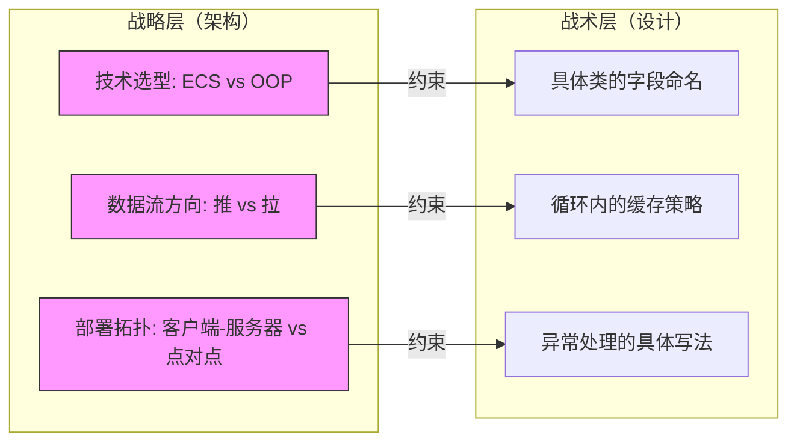
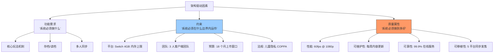
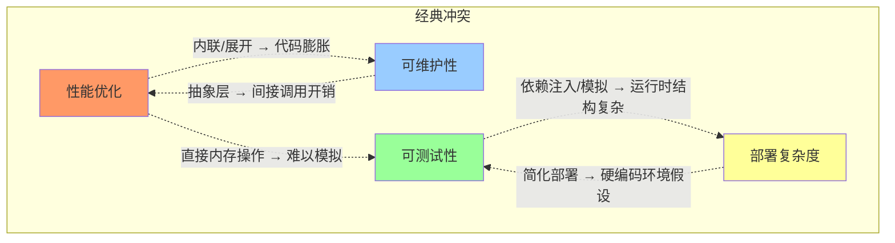

# 软件架构概述与质量属性

> 所属计划: 游戏架构设计
> 预计耗时: 60min
> 前置知识: 无

---

## 1. 概念讲解

### 为什么需要这个？

想象你正在建造一座城市。你可以先随意盖楼，等道路拥堵了再拆房修路，等水电不足了再挖地重铺——代价是天文数字。软件项目同样如此：前期看似"高效"的随意决策，会在后期以指数级成本反噬。游戏开发尤为残酷——16.6ms 的帧预算不会因为你的代码债务而放宽，多平台适配不会因为架构混乱而自动消失，LiveOps 的持续交付节奏不会因为技术债积累而减慢。

架构思维的本质是**在约束条件下做难以逆转的决策**，并让这些决策为后续所有战术选择创造空间。没有这种思维，团队会陷入"不断救火却无法前进"的泥潭。

### 核心思想

#### 软件架构的正式定义：ISO/IEC/IEEE 42010 视角

国际标准 ISO/IEC/IEEE 42010:2022 将软件架构定义为系统的**基本组织**，体现在：

| 维度     | 含义                    | 游戏开发映射              |
| ------ | --------------------- | ------------------- |
| 组件     | 系统的构成元素               | 渲染器、物理引擎、状态机、存档系统   |
| 组件关系   | 元素之间的交互与约束            | 事件总线、直接调用、数据流依赖     |
| 与环境的关系 | 系统与外部上下文（硬件、团队、法规）的交互 | 主机认证要求、平台 SDK、团队技能栈 |
| 演化原则   | 指导系统随时间发展的规则          | 模块化边界、接口稳定性承诺、重构策略  |

这一定义的关键在于：**架构不是静态蓝图，而是演化中的决策框架**。它回答的不是"系统现在长什么样"，而是"系统被允许以什么方式变化"。

#### 架构 vs 设计：战略层 vs 战术层

这是一个光谱而非二元对立：



**架构决策的特征**：
- **难以逆转**：从 ECS 回退到深度继承体系，通常意味着数月重写
- **广泛影响**：选择事件驱动架构，会改变数百个类的协作方式
- **机会成本**：选定某条路，意味着放弃其他路的潜在收益

**设计决策的特征**：
- **局部可逆**：重构一个类的内部结构，IDE 自动化工具可在小时内完成
- **有限影响**：修改通常被限制在单个模块或若干文件内
- **快速迭代**：可在单次代码审查周期内评估和调整

> 关键洞察：架构师的核心能力不是"做出正确选择"，而是**识别哪些选择正在成为难以逆转的，并为其建立显式决策记录**。

#### 架构驱动因素：什么在真正塑造你的系统？



质量属性（Quality Attributes）是架构设计的**首要驱动力**。功能需求可以通过增加模块实现，但质量属性需要**贯穿系统的结构性设计**——你无法通过局部优化获得全局的可测试性，就像你无法通过单独加固每块砖来建造抗震建筑。

#### 关键质量属性：游戏开发的翻译

| 质量属性 | 通用定义 | 游戏开发具体含义 | 典型量化指标 |
| --- | --- | --- | --- |
| **性能** | 系统响应速度与资源效率 | 帧时间稳定性、加载时间、内存峰值 | 95% 帧 < 16.6ms; 关卡加载 < 3s |
| **可维护性** | 修改成本与引入缺陷的概率 | 新机制接入成本、Bug 修复周期 | 功能点修改 < 2 人日; 回归缺陷率 < 5% |
| **可测试性** | 可验证系统行为的难易程度 | 核心逻辑能否脱离渲染/物理单测 | 核心逻辑覆盖率 > 80%; 集成测试构建 < 10min |
| **可扩展性** | 功能增长与规模增长的承载能力 | 新关卡类型、新角色技能、玩家数增长 | 新玩法原型 < 1 周; 服务器线性扩展 |
| **可靠性** | 持续正确运行的概率 | 存档不损坏、网络断线恢复、物理确定性 | 存档损坏率 < 0.01%; 断线重连 < 5s |
| **安全性** | 抵御恶意攻击的能力 | 存档篡改检测、网络包验证、反作弊 | 客户端信任度 = 0; 关键校验服务端执行 |
| **可移植性** | 迁移到新环境的成本 | 多平台构建、不同输入设备、云存档 | 新平台适配 < 4 周; 平台相关代码 < 15% |

#### 质量属性的冲突：Trade-off 是架构师的日常



**游戏开发的具体冲突场景**：

- **性能 vs 可维护性**：将渲染逻辑硬编码到游戏对象中消除虚函数调用，获得 2ms 帧时间收益，但导致无法单元测试、修改渲染管线时需改动 200+ 文件
- **可测试性 vs 部署复杂度**：为 `IInputDevice` 引入抽象使输入可模拟，但主机平台需要额外处理工厂注册与反射加载
- **可扩展性 vs 可靠性**：插件式 Mod 架构允许社区创作，但引入沙箱逃逸、存档兼容性、版本碎片化风险

> 架构决策不是寻找"最优解"，而是**在约束条件下选择可接受的牺牲，并建立监控机制确保牺牲不越界**。

#### 架构决策的代价：四种隐性成本

| 成本类型 | 描述 | 游戏开发案例 |
| --- | --- | --- |
| **机会成本** | 选择 A 意味着放弃 B 的潜在收益 | 选择 Unity 意味着放弃 Unreal 的 Nanite 技术路线 |
| **可逆性成本** | 回退决策所需的工作量 | 从 MonoBehaviour 全面迁移到 DOTS 的 6 个月重构 |
| **技术债复利** | 未偿还债务的指数级增长 | 快速上线的硬编码数值系统，3 年后 40% 开发时间用于修复数据不一致 |
| **认知负荷** | 团队理解系统所需的心智资源 | 过度灵活的反射/配置驱动架构，新人 3 个月才能安全提交代码 |

#### 与游戏开发的深度关联

游戏架构的特殊约束将抽象概念转化为日常切肤之痛：

**帧预算的物理刚性**

60fps = 16.6ms/frame；30fps = 33.3ms/frame。这不是"目标"，是**硬实时约束**。超出意味着掉帧、玩家眩晕、评测差评。架构必须让性能预算**可度量、可监控、可报警**——这正是本章代码示例的核心动机。

**热路径的迭代压力**

每帧执行的代码（游戏循环、渲染提交、物理步进）是架构的"心跳"。架构决策若使热路径增加一次虚函数调用、一次缓存未命中、一次堆分配，影响会被 60 次/秒的频率放大。

**多平台约束的乘法效应**

| 平台 | 典型约束 | 架构影响 |
| --- | --- | --- |
| Nintendo Switch | 4GB 共享内存，ARM 四核 | 内存预算严格分区，Job 系统需适配非对称核心 |
| PlayStation 5 | 高速 SSD，专用解压缩芯片 | 流式加载架构可激进设计，但需抽象底层 API |
| Mobile | 热节流，碎片化 GPU | 动态画质缩放系统，渲染管线需多后端 |
| PC | 开放硬件，作弊风险 | 关键逻辑服务端验证，客户端零信任 |

**LiveOps 的持续交付节奏**

现代游戏是"服务"而非"产品"。每周内容更新、赛季活动、平衡补丁要求架构支持：
- 数据驱动配置（无需客户端更新改数值）
- 灰度发布与回滚能力
- 服务端逻辑的热更新

这些不是后期添加的功能，是**架构初期就必须预留的演化通道**。

---

## 2. 代码示例

实现目标：一个控制台"帧预算监控器"，模拟游戏循环并统计帧时间，演示"性能"作为一等质量属性需要被**度量**和**显式预算**。

关键设计意图：
- `FrameMetrics`：将原始数据转化为**可行动的指标**（平均、极值），避免"感觉帧率还行"的模糊判断
- `BudgetPolicy`：将隐性约束（"我们要 60fps"）转化为**可编程的契约**（16.6ms 阈值）
- `GameLoop`：模拟真实场景的**抖动**（非均匀帧时间），展示监控的价值

```csharp
using System;
using System.Collections.Generic;

/// <summary>
/// 记录帧时间序列，提供统计指标。
/// 架构意图：将性能数据从"日志噪音"提升为"结构化度量"。
/// </summary>
public class FrameMetrics
{
    private readonly List<double> _samples = new();
    
    public void Record(double ms)
    {
        _samples.Add(ms);
        Total += ms;
        Count++;
        
        if (Count == 1)
        {
            Max = Min = ms;
        }
        else
        {
            if (ms > Max) Max = ms;
            if (ms < Min) Min = ms;
        }
    }
    
    public double Average => Count == 0 ? 0 : Total / Count;
    public double Max { get; private set; }
    public double Min { get; private set; }
    public int Count { get; private set; }
    private double Total { get; set; }
    
    /// <summary>
    /// 获取已排序的样本副本，供百分位计算使用。
    /// </summary>
    public IReadOnlyList<double> GetSortedSamples()
    {
        var copy = new List<double>(_samples);
        copy.Sort();
        return copy;
    }
}

/// <summary>
/// 定义帧预算契约，判断单帧是否越界。
/// 架构意图：将"60fps"业务目标转化为可测试、可配置的代码契约。
/// </summary>
public class BudgetPolicy
{
    public double BudgetMs { get; }
    
    public BudgetPolicy(double budgetMs)
    {
        if (budgetMs <= 0)
            throw new ArgumentException("Budget must be positive", nameof(budgetMs));
        BudgetMs = budgetMs;
    }
    
    public bool IsOverBudget(double frameMs) => frameMs > BudgetMs;
}

/// <summary>
/// 模拟游戏循环，集成监控与报警。
/// 架构意图：展示质量属性（性能）如何被"编织"进核心流程，而非事后外挂。
/// </summary>
public class GameLoop
{
    private readonly FrameMetrics _metrics = new();
    private readonly BudgetPolicy _policy;
    private readonly Random _rng = new();
    
    // 模拟场景复杂度变化：基础负载 + 随机抖动 + 偶发尖峰
    private const double BaseLoadMs = 12.0;
    private const double JitterRangeMs = 6.0;
    private const double SpikeProbability = 0.05;  // 5% 概率出现性能尖峰
    private const double SpikeMagnitudeMs = 8.0;
    
    public GameLoop(BudgetPolicy policy) => _policy = policy;
    
    public void Tick()
    {
        // 模拟帧耗时：非均匀分布，更接近真实游戏场景
        var elapsedMs = BaseLoadMs + _rng.NextDouble() * JitterRangeMs;
        if (_rng.NextDouble() < SpikeProbability)
            elapsedMs += SpikeMagnitudeMs;
        
        _metrics.Record(elapsedMs);
        
        if (_policy.IsOverBudget(elapsedMs))
        {
            Console.ForegroundColor = ConsoleColor.Red;
            Console.WriteLine($"[BUDGET VIOLATION] Frame {_metrics.Count}: {elapsedMs:F2}ms > budget {_policy.BudgetMs:F2}ms");
            Console.ResetColor();
        }
        else if (elapsedMs > _policy.BudgetMs * 0.9)
        {
            // 预警：接近预算，架构上可扩展为更复杂的分级响应
            Console.ForegroundColor = ConsoleColor.Yellow;
            Console.WriteLine($"[BUDGET WARNING] Frame {_metrics.Count}: {elapsedMs:F2}ms (90%+ of budget)");
            Console.ResetColor();
        }
    }
    
    public FrameMetrics Metrics => _metrics;
}

public class Program
{
    public static void Main()
    {
        // 60fps = 16.6ms 帧预算
        var policy = new BudgetPolicy(budgetMs: 16.6);
        var loop = new GameLoop(policy);
        
        Console.WriteLine($"=== Frame Budget Monitor ===");
        Console.WriteLine($"Target: {policy.BudgetMs:F1}ms ({1000.0 / policy.BudgetMs:F0} fps)");
        Console.WriteLine($"Running 120 frames with simulated workload...\n");
        
        for (int i = 0; i < 120; i++)
        {
            loop.Tick();
        }
        
        var m = loop.Metrics;
        Console.WriteLine("\n=== Summary ===");
        Console.WriteLine($"Total frames: {m.Count}");
        Console.WriteLine($"Average:      {m.Average:F2}ms ({1000.0 / m.Average:F0} fps avg)");
        Console.WriteLine($"Min:          {m.Min:F2}ms");
        Console.WriteLine($"Max:          {m.Max:F2}ms (worst case: {1000.0 / m.Max:F0} fps)");
        
        // 计算并显示 P99：架构决策需要基于统计分布，而非单点极值
        var sorted = m.GetSortedSamples();
        var p99Index = (int)Math.Ceiling(sorted.Count * 0.99) - 1;
        var p99 = sorted[Math.Max(0, p99Index)];
        Console.WriteLine($"P99:          {p99:F2}ms (99% of frames below this)");
        
        // 越界统计
        int violations = 0;
        foreach (var s in sorted)
            if (policy.IsOverBudget(s)) violations++;
        Console.WriteLine($"Violations:   {violations}/{m.Count} ({100.0 * violations / m.Count:F1}%)");
        
        // 架构判断：基于数据而非直觉
        Console.WriteLine("\n=== Architecture Assessment ===");
        if (p99 > policy.BudgetMs)
            Console.WriteLine("CRITICAL: P99 exceeds budget. Architecture must optimize hot path or relax target.");
        else if (m.Average > policy.BudgetMs * 0.8)
            Console.WriteLine("WARNING: Average near budget. Headroom insufficient for content growth.");
        else
            Console.WriteLine("OK: Healthy headroom. Budget can absorb new features.");
    }
}
```

**运行方式:**

```bash
dotnet new console -n FrameBudgetMonitor
cd FrameBudgetMonitor
# 将上述代码写入 Program.cs
dotnet run
```

**预期输出:**

```text
=== Frame Budget Monitor ===
Target: 16.6ms (60 fps)
Running 120 frames with simulated workload...

[BUDGET WARNING] Frame 3: 15.12ms (90%+ of budget)
[BUDGET VIOLATION] Frame 7: 19.45ms > budget 16.60ms
[BUDGET WARNING] Frame 12: 16.21ms (90%+ of budget)
[BUDGET VIOLATION] Frame 23: 22.78ms > budget 16.60ms
...

=== Summary ===
Total frames: 120
Average:      14.85ms (67 fps avg)
Min:          12.03ms
Max:          24.56ms (worst case: 41 fps)
P99:          19.82ms (99% of frames below this)
Violations:   8/120 (6.7%)

=== Architecture Assessment ===
WARNING: Average near budget. Headroom insufficient for content growth.
```

代码的架构教学点：
1. **度量优先**：没有 `FrameMetrics` 的量化，"性能优化"是盲人摸象
2. **契约显式化**：`BudgetPolicy` 将业务目标转化为可测试代码，避免目标漂移
3. **统计思维**：P99 比 Max 更能指导架构决策——极值可能是异常，百分位揭示系统性风险
4. **扩展接口**：`GetSortedSamples()` 为后续练习的 P99 计算预留能力，展示"为演化设计"

---

## 3. 练习

### 练习 1: 基础

在 `FrameMetrics` 中增加 **P99 帧时间计算**（无需暴露内部 `List`），并在 `GameLoop` 结束时输出。要求：
- 不破坏现有公共接口的封装性
- 新增 `P99` 属性或方法
- 在 `Program.Main` 的 Summary 区域使用新指标替代手动计算

### 练习 2: 进阶

实现"**连续 3 帧越界才触发警报**"的策略，并允许通过构造函数配置阈值。要求：
- 新增 `AlertPolicy` 类（或扩展 `BudgetPolicy`），支持 `consecutiveFrames` 参数
- 避免误报：单帧抖动不应触发警报，真正的持续性能退化才需要架构关注
- 在警报触发时输出 `[ALERT]` 标记，区别于单帧 `[BUDGET VIOLATION]`

### 练习 3: 挑战（可选）

给出同一 `HealthSystem` 的两种组织方式，并分析在**可测试性、可维护性、性能**上的优劣：

**方案 a) 全能类**
```csharp
public class HealthSystem {
    public void TakeDamage(int dmg) { /* 扣血 + 死亡判定 + 更新UI + 写存档 */ }
}
```

**方案 b) 职责分离**
```csharp
public class Health { /* 纯数据: 当前HP/最大HP */ }
public class DeathHandler { /* 监听HP变化，触发死亡逻辑 */ }
public class HealthView { /* 更新血条UI */ }
public class HealthSaver { /* 序列化到存档 */ }
```

分析要求：
- 可测试性：能否在不启动完整游戏的情况下验证"扣血致死"逻辑？
- 可维护性：修改"死亡时播放音效"会影响多少文件？
- 性能：对象数量增加是否带来缓存不友好？结合后续 [[28-data-oriented-design]] 讨论。

---

## 3.5 参考答案

> [!tip]- 练习 1 参考答案
> 核心思路：在 `FrameMetrics` 内部维护有序性，或按需排序计算。
> 
> ```csharp
> public class FrameMetrics
> {
>     // ... 原有字段 ...
>     private readonly List<double> _samples = new();
>     
>     // 新增：缓存的排序样本，脏标记模式避免重复排序
>     private List<double>? _sortedCache;
>     private bool _dirty = true;
>     
>     public void Record(double ms)
>     {
>         _samples.Add(ms);
>         _dirty = true;
>         // ... 原有统计更新 ...
>     }
>     
>     public double P99
>     {
>         get
>         {
>             if (Count == 0) return 0;
>             if (_dirty)
>             {
>                 _sortedCache = new List<double>(_samples);
>                 _sortedCache.Sort();
>                 _dirty = false;
>             }
>             var index = (int)Math.Ceiling(Count * 0.99) - 1;
>             return _sortedCache![Math.Max(0, Math.Min(index, Count - 1))];
>         }
>     }
> }
> ```
> 
> 使用方式：在 `Program.Main` 中直接 `Console.WriteLine($"P99: {m.P99:F2}ms");`
> 
> 架构考量：脏标记模式在"频繁写入、偶尔读取"场景下高效；若需频繁读取 P99，可考虑增量维护有序结构（如跳表）或近似算法（如 T-Digest）。

> [!tip]- 练习 2 参考答案
> 
> ```csharp
> /// <summary>
> /// 警报策略：将"瞬时越界"与"持续退化"分离，避免噪音干扰架构判断。
> /// </summary>
> public class AlertPolicy
> {
>     private readonly BudgetPolicy _budget;
>     private readonly int _threshold;
>     private int _consecutiveViolations;
>     
>     public AlertPolicy(BudgetPolicy budget, int consecutiveThreshold = 3)
>     {
>         _budget = budget ?? throw new ArgumentNullException(nameof(budget));
>         _threshold = consecutiveThreshold > 0 ? consecutiveThreshold 
>             : throw new ArgumentException("Threshold must be positive", nameof(consecutiveThreshold));
>     }
>     
>     /// <summary>
>     /// 处理单帧结果，返回是否触发警报。
>     /// 架构模式：状态机（Idle -> Watching -> Alerting）
>     /// </summary>
>     public bool ProcessFrame(double frameMs, int frameNumber, out string? alertMessage)
>     {
>         alertMessage = null;
>         
>         if (_budget.IsOverBudget(frameMs))
>         {
>             _consecutiveViolations++;
>             if (_consecutiveViolations >= _threshold)
>             {
>                 alertMessage = $"[ALERT] Frame {frameNumber}: {_consecutiveViolations} consecutive frames over budget (latest: {frameMs:F2}ms)";
>                 // 可选：触发后重置，或继续累积直到恢复
>                 _consecutiveViolations = 0; // 避免重复报警
>                 return true;
>             }
>         }
>         else
>         {
>             _consecutiveViolations = 0; // 中断连续性
>         }
>         
>         return false;
>     }
> }
> ```
> 
> `GameLoop` 修改：
> ```csharp
> public class GameLoop
> {
>     private readonly AlertPolicy? _alert; // 可选注入
>     
>     public GameLoop(BudgetPolicy policy, AlertPolicy? alert = null)
>     {
>         _policy = policy;
>         _alert = alert;
>     }
>     
>     public void Tick()
>     {
>         // ... 生成 elapsedMs ...
>         
>         if (_alert?.ProcessFrame(elapsedMs, _metrics.Count, out var msg) == true)
>         {
>             Console.BackgroundColor = ConsoleColor.DarkRed;
>             Console.WriteLine(msg);
>             Console.ResetColor();
>         }
>         else if (_policy.IsOverBudget(elapsedMs))
>         {
>             // 单帧越界但未到警报阈值
>             Console.ForegroundColor = ConsoleColor.Red;
>             Console.WriteLine($"[BUDGET VIOLATION] Frame {_metrics.Count}: ...");
>             Console.ResetColor();
>         }
>     }
> }
> ```
> 
> 使用：
> ```csharp
> var alert = new AlertPolicy(policy, consecutiveThreshold: 3);
> var loop = new GameLoop(policy, alert);
> ```

> [!tip]- 练习 3 参考答案
> 
> **可测试性分析**
> 
> | 方案 | 测试方式 | 难度 |
> | --- | --- | --- |
> | a) 全能类 | 必须 Mock UI 系统和存档系统，或接受副作用 | 高：测试慢、不稳定 |
> | b) 职责分离 | `Health` 和 `DeathHandler` 可纯内存测试；`HealthView`/`HealthSaver` 单独 Mock | 低：核心逻辑无依赖 |
> 
> 关键差异：方案 b 的 `DeathHandler` 可接收 `IHealthEvents` 接口，测试时注入 `MockEventRecorder`，断言"死亡事件已发布"即可，无需关心 UI 是否更新。
> 
> **可维护性分析**
> 
> | 修改需求 | 方案 a 影响范围 | 方案 b 影响范围 |
> | --- | --- | --- |
>  | "死亡时播放音效" | 修改 `HealthSystem.TakeDamage`，可能引入 Bug 到存档逻辑 | 新增 `DeathAudioHandler`，仅订阅死亡事件 |
> | "添加无敌帧" | 同一方法内增加状态判断，复杂度累积 | `Health` 增加 `IsInvulnerable` 属性，`DeathHandler` 检查 |
> | "支持多存档槽" | 存档逻辑与血条逻辑纠缠 | 仅修改 `HealthSaver` |
> 
> **性能分析**
> 
> 方案 b 的潜在风险：
> - 对象数量 ×4：每个角色从 1 个 `HealthSystem` 实例变为 4 个对象实例
> - 缓存不友好：分散的对象增加指针追踪，可能触发更多缓存未命中
> - 事件分发开销：`DeathHandler` 订阅事件 vs 直接方法调用
> 
> 缓解策略（衔接 [[28-data-oriented-design]]）：
> - 使用结构体（`struct Health`）避免堆分配
> - 批量处理：帧结束时统一更新所有 `HealthView`，而非每个角色独立回调
> - 考虑 ECS 模式：`Health` 作为纯数据组件，`DeathHandler` 作为 System 遍历查询
> 
> **结论**：方案 b 在可测试性和可维护性上显著优于方案 a，性能代价可通过数据导向设计缓解。这是"先正确，再快速"的架构原则——未经测试验证的"优化"往往是过早优化。

> [!note] 答案使用方式
> 如果你的实现通过了测试或达到了题目要求，就是正确的。参考答案展示的是**一种**可行路径，而非唯一标准。重点关注：练习 1 的封装与算法效率、练习 2 的状态机设计意图、练习 3 的 trade-off 分析框架。建议将练习 3 的分析思路应用到实际代码审查中。
>
> ---

## 4. 扩展阅读

- Robert C. Martin, "A Little Architecture"：https://blog.cleancoder.com/uncle-bob/2016/01/04/ALittleArchitecture.html —— 解释架构决策的核心是让后续设计选择更简单，而非展示技术复杂性
- Robert Nystrom, *Game Programming Patterns* 引言：http://gameprogrammingpatterns.com/introduction.html —— 从游戏性能与代码组织张力切入架构思考，强调"模式是工具而非教条"
- ISO/IEC/IEEE 42010:2022 架构描述标准（概述页）：https://www.iso.org/standard/74296.html —— 软件架构的正式定义来源，适合需要引用标准文档的场景
- Martin Fowler, "Software Architecture Guide"：https://martinfowler.com/architecture/ —— 将架构定义为"重要决策（无论是什么）"的务实视角
- Casey Muratori, "Handmade Hero" 性能讨论：https://handmadehero.org/ —— 极端性能敏感场景下的架构取舍实录

---

## 常见陷阱

- **把所有设计选择都当成"架构决策"**，导致讨论过度发散、决策瘫痪。正确做法：建立"架构决策记录"（ADR）模板，仅当选择满足"难以逆转、广泛影响、高机会成本"至少两项时才升级为架构议题，其余交给团队自治
- **在没有可量化预算的情况下过早优化热路径**，牺牲可维护性。正确做法：先建立 [[30-performance-budgets]] 中的度量基准（如本章的 `FrameMetrics`），证明瓶颈确实存在且影响用户体验，再针对性优化；优化后保留"非优化版本"作为回归测试基线
- **忽视可维护性直到技术债拖慢迭代**，那时再改架构成本呈指数级上升。正确做法：将"修改成本"纳入迭代回顾度量（如"本次需求涉及文件数"、"回归测试失败数"），当趋势恶化时触发重构窗口；参考 [[32-architecture-evolution]] 的演进策略