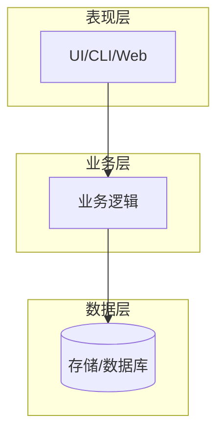
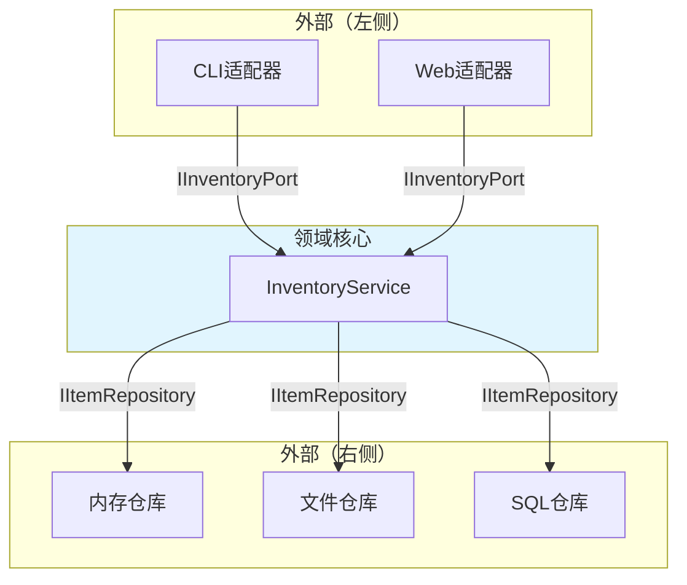
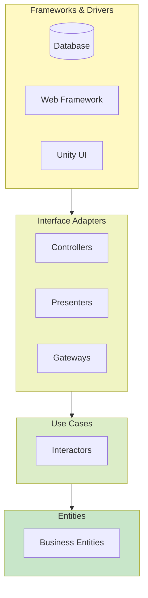
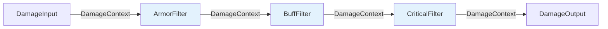
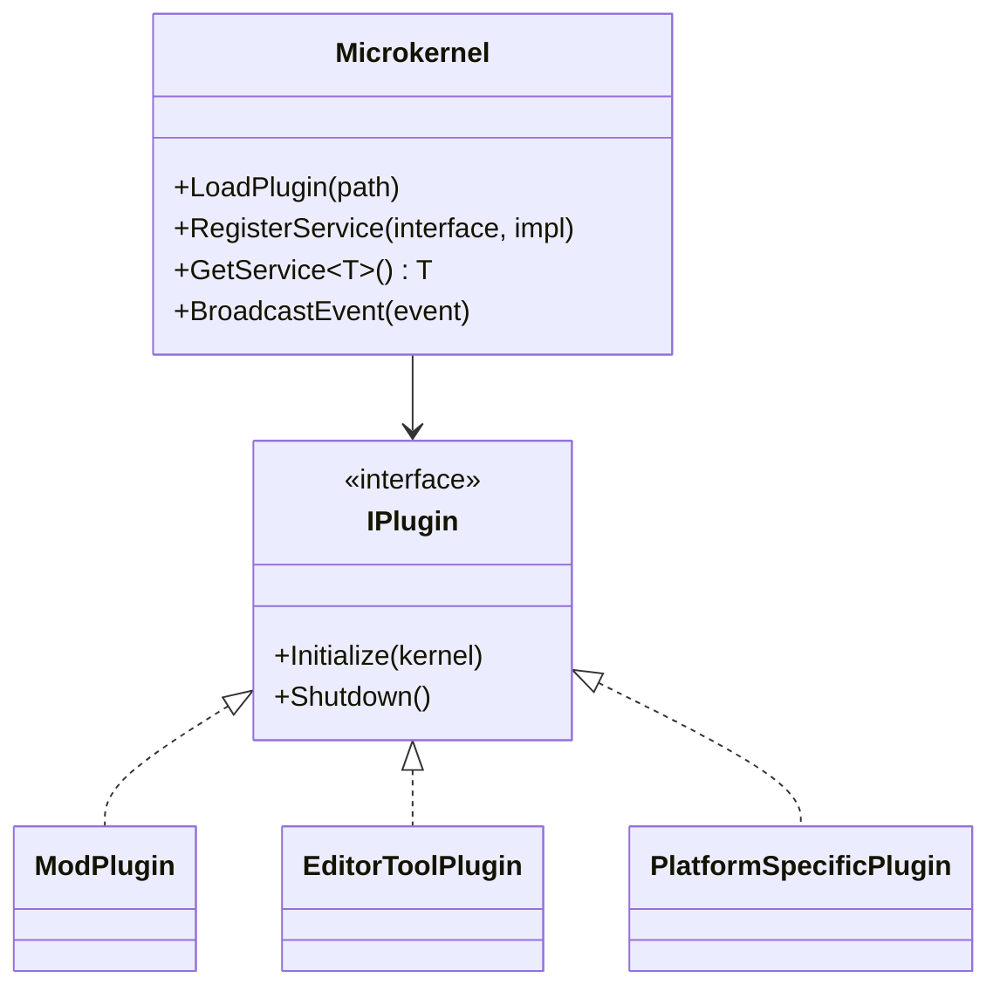
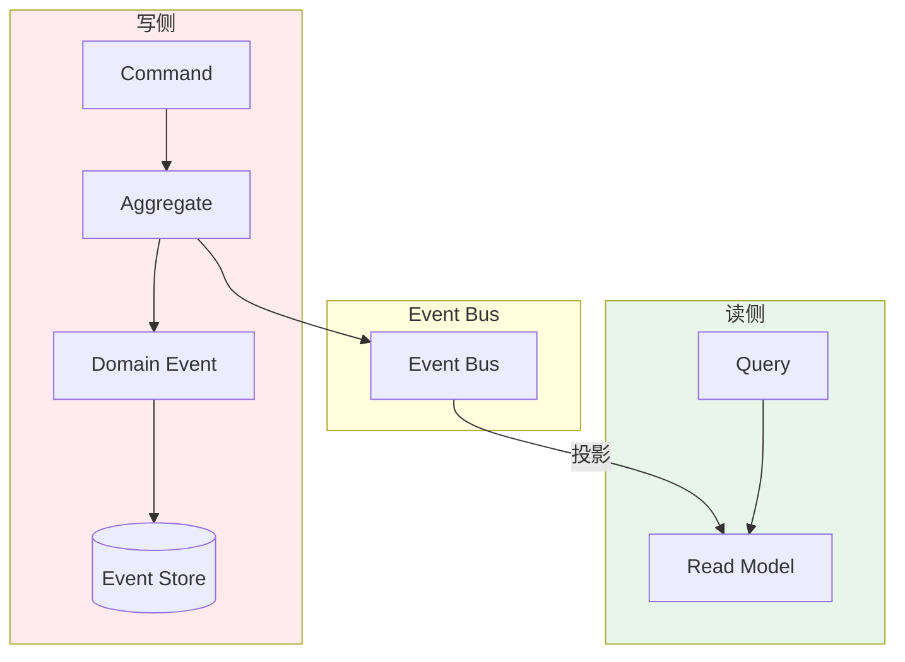

# 架构风格与范式

> 所属计划: 游戏架构设计
> 预计耗时: 75min
> 前置知识: [[01-architecture-overview|第1章 软件架构概述与质量属性]]

---

## 1. 概念讲解

### 为什么需要这个？

游戏软件是**异构性极强**的系统：同一款游戏可能同时包含实时渲染管线、物理模拟、网络同步、Mod 加载、后端服务、编辑器工具链、数据分析管道。没有任何一种架构风格能通吃所有子系统。架构风格（Architectural Style）是**对特定问题域的结构性约束**，它规定了组件的组织方式、交互协议和依赖方向。选择错误的风格，会导致热路径性能崩塌、测试难以编写、团队沟通成本飙升。

理解多种架构风格的核心目的，是建立**"场景-风格"映射能力**：当面对"需要稳定规则的核心玩法"时，知道用哪种风格保护领域不变量；当面对"需要替换技术细节的外围系统"时，知道用哪种风格隔离变化；当面对"高吞吐数据流水线"时，知道用哪种风格消除分支预测失败。

### 核心思想

#### 分层架构（Layered Architecture）

最经典的风格：表现层（Presentation）→ 业务层（Business Logic）→ 数据层（Data Access）。依赖方向严格向下，上层调用下层，下层对上层无感知。



**游戏场景映射**：适合**后端服务**（匹配服务器、排行榜、账号系统）和**工具链**（构建管线、资源检查工具）。但**游戏主循环通常跨层**：一帧内可能同时读取输入（表现层）、更新物理（业务层）、写入渲染命令（数据层），直接套用分层会导致热路径穿透多层，虚函数调用和缓存不友好。

#### 六边形架构 / Ports & Adapters（Alistair Cockburn, 2005）

核心洞察：**业务领域位于中心**，外部世界（UI、数据库、测试框架、第三方服务）通过**端口（Port）**和**适配器（Adapter）**与领域交互。端口是接口，定义了"领域需要什么"和"领域提供什么"；适配器是具体实现，将外部技术细节翻译为领域能理解的语言。

依赖方向**向内**：`InventoryService` 依赖 `IItemRepository`（接口），但 `InMemoryItemRepository` 和 `FileItemRepository` 也依赖同一接口——源代码依赖从外向内指向稳定的领域核心。



**游戏场景映射**：适合**需要稳定规则的核心玩法系统**（经济系统、技能系统、任务系统）。这些系统的业务规则变化慢，但存储技术（内存/Redis/数据库）和交互方式（UI/网络/AI调用）变化快。六边形保护领域不被技术细节污染。

#### 干净架构（Clean Architecture, Robert C. Martin, 2012）

六边形的系统化演进，用**同心圆**显式表达稳定性层级：

| 层级 | 内容 | 稳定性 |
|:---|:---|:---|
| Entities | 企业级业务规则（跨应用复用） | 最高 |
| Use Cases | 应用特定业务规则 | 高 |
| Interface Adapters | 控制器、展示器、网关 | 中 |
| Frameworks & Drivers | 数据库、Web框架、UI框架 | 最低 |

**依赖规则**：源代码依赖只能**向内**指向更稳定的策略。外层可以依赖内层，内层对外层一无所知。



**游戏场景映射**：与六边形类似，但更强调**企业级复用**（跨游戏共享的账号系统、支付系统）。对于纯游戏项目，四层可能过度设计；但对于游戏公司的**平台级服务**（Launcher、社交后端、反作弊），干净架构的价值显著。

#### 管道-过滤器（Pipe-Filter）

数据流经过一系列**独立变换组件**，每个组件从输入管道读取、处理、写入输出管道。组件无共享状态，只通过数据包通信。



**游戏场景映射**：天然适合**高吞吐数据流水线**：
- **资源管线**：FBX → 法线生成 → LOD 生成 → 纹理压缩 → 打包
- **音频效果链**：源音频 → 低通 → 混响 → 压缩 → 输出
- **后处理 pass 链**：颜色 → Bloom → Tone Mapping → FXAA → 屏幕
- **着色器图**：节点即 Filter，边即 Pipe

关键优势：**Filter 可独立测试、可重组、可并行**（若数据依赖允许）。

#### 微内核 / 插件架构（Microkernel / Plugin）

最小核心只提供**生命周期管理、服务注册、模块通信**的基础设施；所有功能以**插件**形式动态加载。核心对插件无编译时依赖，通过反射或接口契约发现插件。



**游戏场景映射**：适合**需要扩展性的边界系统**：
- **Mod 系统**：核心游戏 + 社区插件（如《上古卷轴》的 SKSE、《我的世界》的 Forge）
- **编辑器扩展**：Unity Editor 的 `EditorWindow`、Unreal 的插件系统
- **平台抽象**：渲染后端（Vulkan/D3D12/Metal）作为插件动态加载

#### 事件驱动 / CQRS

**事件驱动**：组件通过**事件总线**解耦，生产者发布事件，消费者订阅处理。消除直接调用链，但引入**隐式依赖**和**时序不确定性**。

**CQRS（Command Query Responsibility Segregation）**：将**命令**（写操作，改变状态）与**查询**（读操作，返回数据）分离。命令走事件溯源路径，查询走优化过的读模型。



**游戏场景映射**：
- **UI 系统**：按钮点击 → 事件 → 业务处理，避免 UI 直接引用业务逻辑
- **分析系统**：玩家行为事件 → 异步管道 → 数据仓库，不阻塞主线程
- **多人状态同步**：本地输入 → 命令事件 → 服务器验证 → 状态广播 → 客户端投影
- **回放系统**：事件存储 → 确定性重放，比快照回放更省空间

**关键权衡**：事件驱动增加**认知负荷**（调试时难以追踪调用链），CQRS 增加**数据一致性延迟**（读模型最终一致）。在实时战斗中慎用，在异步系统中大放异彩。

#### 游戏场景映射总结

| 场景特征 | 推荐风格 | 规避风格 |
|:---|:---|:---|
| 稳定规则、多技术替换点 | 六边形 / 干净架构 | 直接内联技术代码 |
| 高吞吐数据变换、可重组流程 | 管道-过滤器 | 硬编码顺序的深层调用链 |
| 需要社区/第三方扩展 | 微内核 / 插件 | 静态链接所有功能 |
| 异步解耦、多消费者 | 事件驱动 / CQRS | 同步直接调用 |
| 实时 60 FPS 热循环 | 数据导向 / ECS [[28-data-oriented-design]] | 纯六边形（对象+接口虚调用） |
| 后端服务、工具链 | 分层架构 | 过度抽象的同心圆 |

---

## 2. 代码示例

实现目标：一个"库存服务"的**六边形架构最小可运行示例**，展示领域逻辑不依赖具体存储和 UI 技术。关键结构：提供端口 `IInventoryPort`、需求端口 `IItemRepository`、领域核心 `InventoryService`、两个适配器（内存仓库、控制台 UI）。

```csharp
// 领域核心：端口定义（与具体技术无关）
public interface IInventoryPort
{
    bool AddItem(string itemId, int qty);
    bool RemoveItem(string itemId, int qty);
    int GetQuantity(string itemId);
}

public interface IItemRepository
{
    void Save(string itemId, int qty);
    int Load(string itemId);
}

// 领域核心：业务规则（纯 C#，无外部依赖）
public class InventoryService : IInventoryPort
{
    private readonly IItemRepository _repo;

    public InventoryService(IItemRepository repo)
    {
        _repo = repo ?? throw new ArgumentNullException(nameof(repo));
    }

    public bool AddItem(string itemId, int qty)
    {
        if (string.IsNullOrWhiteSpace(itemId) || qty <= 0)
            return false;

        var current = _repo.Load(itemId);
        _repo.Save(itemId, current + qty);
        return true;
    }

    public bool RemoveItem(string itemId, int qty)
    {
        if (string.IsNullOrWhiteSpace(itemId) || qty <= 0)
            return false;

        var current = _repo.Load(itemId);
        if (current < qty)
            return false; // 业务规则：不允许负库存

        _repo.Save(itemId, current - qty);
        return true;
    }

    public int GetQuantity(string itemId)
    {
        if (string.IsNullOrWhiteSpace(itemId))
            return 0;
        return _repo.Load(itemId);
    }
}

// 右侧适配器：需求端口的实现（技术细节：内存存储）
public class InMemoryItemRepository : IItemRepository
{
    private readonly Dictionary<string, int> _db = new();

    public void Save(string itemId, int qty) => _db[itemId] = qty;

    public int Load(string itemId) => _db.GetValueOrDefault(itemId);
}

// 左侧适配器：提供端口的调用者（技术细节：控制台 UI）
public class ConsoleInventoryAdapter
{
    private readonly IInventoryPort _port;

    public ConsoleInventoryAdapter(IInventoryPort port)
    {
        _port = port ?? throw new ArgumentNullException(nameof(port));
    }

    public void Run()
    {
        Console.WriteLine("=== 库存系统演示 ===");
        
        var addResult = _port.AddItem("sword_001", 1);
        Console.WriteLine($"AddItem(sword_001, 1): {addResult}");
        
        var qty = _port.GetQuantity("sword_001");
        Console.WriteLine($"GetQuantity(sword_001): {qty}");
        
        var removeResult = _port.RemoveItem("sword_001", 1);
        Console.WriteLine($"RemoveItem(sword_001, 1): {removeResult}");
        
        var finalQty = _port.GetQuantity("sword_001");
        Console.WriteLine($"Final quantity: {finalQty}");
        
        // 测试边界规则
        var invalidAdd = _port.AddItem("sword_001", -5);
        Console.WriteLine($"AddItem with negative qty: {invalidAdd}");
        
        var overRemove = _port.RemoveItem("sword_001", 999);
        Console.WriteLine($"Over-remove: {overRemove}");
    }
}

// 程序入口：组装（Composition Root）
public class Program
{
    public static void Main()
    {
        // 纯内存配置：适合单元测试、快速原型
        IItemRepository repo = new InMemoryItemRepository();
        IInventoryPort service = new InventoryService(repo);
        var adapter = new ConsoleInventoryAdapter(service);
        
        adapter.Run();
        
        // 关键演示：不修改任何领域代码，仅替换这一行即可切换存储技术
        // IItemRepository repo = new FileItemRepository("save.json");
    }
}
```

**运行方式:**

```bash
# 创建 .NET 8 控制台项目
dotnet new console -n HexagonalInventory -o .
# 将上述代码保存为 Program.cs，然后：
dotnet run --framework net8.0
```

**预期输出:**

```text
=== 库存系统演示 ===
AddItem(sword_001, 1): True
GetQuantity(sword_001): 1
RemoveItem(sword_001, 1): True
Final quantity: 0
AddItem with negative qty: False
Over-remove: False
```

---

## 3. 练习

### 练习 1: 基础

在不修改 `InventoryService` 的前提下，新增一个 `FileItemRepository` 适配器，用 JSON 文件持久化库存数据。要求：
- 实现 `IItemRepository` 接口
- 使用 `System.Text.Json` 进行序列化/反序列化
- 在 `Program` 中演示切换存储技术（从 `InMemoryItemRepository` 切换到 `FileItemRepository`）后，数据能跨进程保留

### 练习 2: 进阶

把**管道-过滤器**风格用于伤害计算：实现 `DamageInput → ArmorFilter → BuffFilter → DamageOutput` 的链式调用。要求：
- 定义 `IDamageFilter` 接口与 `DamageContext` 数据包（包含基础伤害、护甲值、增益倍率、最终伤害等字段）
- 每个 Filter 只读取/写入 `DamageContext`，无其他副作用
- 实现 `DamagePipeline` 顺序执行所有 Filter
- 每个 Filter 可独立单元测试（不依赖其他 Filter 或 Pipeline）

### 练习 3: 挑战（可选）

对于 60 FPS 的实时战斗循环，讨论"纯六边形/Clean Architecture"直接使用会面临什么问题？应如何与 ECS/数据导向设计（[[11-ecs-deep-dive|第11章]]、[[28-data-oriented-design|第28章]]）配合？请从以下角度分析：
- 缓存局部性与虚函数开销
- 数据批处理 vs 对象消息传递
- 策略层（规则判定）与热循环（位置/碰撞/渲染）的职责划分

---

## 3.5 参考答案

> [!tip]- 练习 1 参考答案
> ```csharp
> using System.Text.Json;
> 
> public class FileItemRepository : IItemRepository
> {
>     private readonly string _filePath;
>     private readonly Dictionary<string, int> _cache;
>     private readonly JsonSerializerOptions _options = new() { WriteIndented = true };
> 
>     public FileItemRepository(string filePath)
>     {
>         _filePath = filePath;
>         _cache = LoadFromDisk();
>     }
> 
>     private Dictionary<string, int> LoadFromDisk()
>     {
>         if (!File.Exists(_filePath))
>             return new Dictionary<string, int>();
>         
>         var json = File.ReadAllText(_filePath);
>         // 处理空文件或无效 JSON
>         if (string.IsNullOrWhiteSpace(json))
>             return new Dictionary<string, int>();
>         
>         try
>         {
>             return JsonSerializer.Deserialize<Dictionary<string, int>>(json, _options) 
>                 ?? new Dictionary<string, int>();
>         }
>         catch (JsonException)
>         {
>             return new Dictionary<string, int>();
>         }
>     }
> 
>     private void SaveToDisk()
>     {
>         var json = JsonSerializer.Serialize(_cache, _options);
>         File.WriteAllText(_filePath, json);
>     }
> 
>     public void Save(string itemId, int qty)
>     {
>         _cache[itemId] = qty;
>         SaveToDisk(); // 同步写盘；生产环境应改为异步或批量
>     }
> 
>     public int Load(string itemId) => _cache.GetValueOrDefault(itemId);
> }
> 
> // Program 中的切换演示：
> // IItemRepository repo = new FileItemRepository("inventory.json");
> // 首次运行后关闭程序，再次运行可看到数据保留
> ```
> 关键设计点：适配器将文件 I/O 细节完全封装，领域核心 `InventoryService` 无感知。`System.Text.Json` 是 .NET 内置库，无需额外 NuGet 包。生产环境应考虑写盘性能（如改为异步、批量或 WAL 日志）。

> [!tip]- 练习 2 参考答案
> ```csharp
> // 数据包：纯数据，无行为
> public record DamageContext(
>     float BaseDamage,
>     float ArmorValue,
>     float DamageMultiplier,
>     float FinalDamage,
>     bool IsCritical
> )
> {
>     // 便利构造：从基础伤害开始
>     public DamageContext(float baseDamage) 
>         : this(baseDamage, 0f, 1.0f, baseDamage, false) { }
> }
> 
> // 过滤器接口：单一职责，无副作用
> public interface IDamageFilter
> {
>     DamageContext Apply(DamageContext input);
> }
> 
> // 护甲过滤器：伤害减免
> public class ArmorFilter : IDamageFilter
> {
>     private readonly float _armorEfficiency; // 每点护甲减免的伤害比例
> 
>     public ArmorFilter(float armorEfficiency = 0.5f)
>     {
>         _armorEfficiency = Math.Clamp(armorEfficiency, 0f, 1f);
>     }
> 
>     public DamageContext Apply(DamageContext input)
>     {
>         var reduction = input.ArmorValue * _armorEfficiency;
>         var reducedDamage = Math.Max(0f, input.BaseDamage - reduction);
>         
>         return input with 
>         { 
>             FinalDamage = reducedDamage 
>         };
>     }
> }
> 
> // 增益过滤器：倍率放大
> public class BuffFilter : IDamageFilter
> {
>     public DamageContext Apply(DamageContext input)
>     {
>         var multiplied = input.FinalDamage * input.DamageMultiplier;
>         
>         return input with 
>         { 
>             FinalDamage = multiplied 
>         };
>     }
> }
> 
> // 暴击过滤器：独立判定，不修改其他字段
> public class CriticalFilter : IDamageFilter
> {
>     private readonly float _criticalChance;
>     private readonly float _criticalMultiplier;
>     private readonly Random _rng; // 测试时可注入固定种子
> 
>     public CriticalFilter(float chance, float multiplier, int? seed = null)
>     {
>         _criticalChance = Math.Clamp(chance, 0f, 1f);
>         _criticalMultiplier = multiplier;
>         _rng = seed.HasValue ? new Random(seed.Value) : new Random();
>     }
> 
>     public DamageContext Apply(DamageContext input)
>     {
>         var isCrit = _rng.NextDouble() < _criticalChance;
>         var finalDamage = isCrit 
>             ? input.FinalDamage * _criticalMultiplier 
>             : input.FinalDamage;
>         
>         return input with 
>         { 
>             FinalDamage = finalDamage,
>             IsCritical = isCrit 
>         };
>     }
> }
> 
> // 管道：编排过滤器，本身无业务逻辑
> public class DamagePipeline
> {
>     private readonly List<IDamageFilter> _filters = new();
> 
>     public DamagePipeline AddFilter(IDamageFilter filter)
>     {
>         _filters.Add(filter);
>         return this; // 流畅 API
>     }
> 
>     public DamageContext Execute(DamageContext initial)
>     {
>         return _filters.Aggregate(initial, (ctx, filter) => filter.Apply(ctx));
>     }
> }
> 
> // 单元测试示例（使用 xUnit 风格断言逻辑）
> public static class DamagePipelineTests
> {
>     public static void Run()
>     {
>         // ArmorFilter 独立测试
>         var armorFilter = new ArmorFilter(armorEfficiency: 1.0f);
>         var armorResult = armorFilter.Apply(new DamageContext(baseDamage: 100f) with { ArmorValue = 30f });
>         Console.WriteLine($"Armor test: {armorResult.FinalDamage == 70f}"); // True
> 
>         // BuffFilter 独立测试
>         var buffFilter = new BuffFilter();
>         var buffResult = buffFilter.Apply(new DamageContext(baseDamage: 50f) with { DamageMultiplier = 2.0f });
>         Console.WriteLine($"Buff test: {buffResult.FinalDamage == 100f}"); // True
> 
>         // 管道集成测试
>         var pipeline = new DamagePipeline()
>             .AddFilter(new ArmorFilter(0.5f))
>             .AddFilter(new BuffFilter())
>             .AddFilter(new CriticalFilter(chance: 0.0f, multiplier: 2.0f)); // 确定性：不暴击
> 
>         var result = pipeline.Execute(new DamageContext(baseDamage: 100f) with 
>         { 
>             ArmorValue = 20f, 
>             DamageMultiplier = 1.5f 
>         });
>         // 计算: 100 - 20*0.5 = 90; 90 * 1.5 = 135; 不暴击 = 135
>         Console.WriteLine($"Pipeline test: {result.FinalDamage == 135f}"); // True
>     }
> }
> ```
> 关键设计点：`DamageContext` 用 `record` 实现不可变数据流，每个 Filter 返回新实例，消除共享状态风险。`CriticalFilter` 的 `Random` 可注入种子，使测试确定性。管道顺序即策略，可通过配置重组。

> [!tip]- 练习 3 参考答案
> 纯六边形/Clean Architecture 在 60 FPS 实时战斗循环中的核心问题：
> 
> **1. 缓存局部性与虚函数开销**
> 
> 六边形以**对象和接口**为中心：`InventoryService` 依赖 `IItemRepository`，编译后产生虚方法表（vtable）间接调用。每次调用需两次内存访问（vtable 指针 + 函数指针），且对象分散在堆上，破坏 CPU 缓存行。60 FPS 下 16.67ms 的帧预算中，若每帧处理 10,000 个实体，虚调用开销可达毫秒级。
> 
> ECS（[[11-ecs-deep-dive|第11章]]）采用**结构体数组（SoA）**：`Position[]`、`Velocity[]` 连续内存，SIMD 批处理，无虚调用。同一缓存行加载 16 个 `Position`，CPU 预取器高效工作。
> 
> **2. 数据批处理 vs 对象消息传递**
> 
> 六边形的 `AddItem("sword_001", 1)` 是**标量消息**：一次处理一个物品，函数调用栈深，分支预测频繁失败。ECS 的 `System` 处理**组件查询结果集**：`Query<Position, Velocity>()` 返回所有匹配实体，循环内联，编译器优化为向量化代码。
> 
> **3. 策略层与热循环的职责划分**
> 
> 正确的配合方式不是"二选一"，而是**分层治理**：
> 
> | 层级 | 风格 | 职责 |
> |:---|:---|:---|
> | 策略层（每帧 1-10 次） | 六边形/Clean | 规则判定：伤害公式合法性、技能冷却检查、经济交易授权 |
> | 热循环（每帧 10,000+ 次） | ECS/DoD [[28-data-oriented-design]] | 位置更新、碰撞检测、动画采样、渲染剔除 |
> | 流水线（离线或每帧末尾） | 管道-过滤器 | 后处理、音频混合、网络序列化打包 |
> 
> 具体实践：战斗系统中，"能否释放技能"（业务规则，变化慢）用六边形的 `SkillService` 判定；判定通过后，生成 `CastSkillEvent` 注入 ECS 世界。ECS `SkillExecutionSystem` 读取事件组件，批量执行伤害计算（可用练习 2 的 Pipe-Filter 结构，但数据驱动）。最终伤害结果通过事件总线回传，六边形的 `CombatLogService` 记录（异步，不阻塞热循环）。
> 
> 核心原则：**把稳定决策放在中心（六边形），把高速数据变换放在外侧流水线（ECS/SoA）**。两者通过**显式事件边界**通信，而非直接调用渗透。

> [!note] 答案使用方式
> 如果你的实现通过了测试或达到了题目要求，就是正确的。参考答案展示的是一种符合风格约束的写法，不是唯一标准答案。练习 1 重点观察"不修改领域代码即可替换技术"是否成立；练习 2 重点验证 Filter 的独立可测试性；练习 3 重点在于理解"不同架构风格服务于不同性能与稳定性需求"，而非否定任何一种风格。
>
> ---

## 4. 扩展阅读

- Robert C. Martin, "The Clean Architecture"：`https://blog.cleancoder.com/uncle-bob/2012/08/13/the-clean-architecture.html` —— 依赖规则与同心圆分层的原始论述，包含著名的"外层依赖内层"示意图。
- Alistair Cockburn, Hexagonal Architecture 介绍：`https://softengbook.org/articles/hexagonal-architecture` —— 六边形/端口/适配器概念的系统化整理，引用 Cockburn 2005 年命名来源。
- Alistair Cockburn C2 Wiki 原文：`http://wiki.c2.com/?HexagonalArchitecture` —— 原始 WikiWikiWeb 文章，保留早期社区讨论语境（需浏览器 JS 支持查看）。
- Martin Fowler, "Event Sourcing"：`https://martinfowler.com/eaaDev/EventSourcing.html` —— CQRS 配套的持久化模式，游戏回放系统的理论基础。
- Mike Acton, "Data-Oriented Design and C++"（CppCon 2014）：`https://www.youtube.com/watch?v=rX0ItVEVjHc` —— 游戏行业 DoD 的奠基演讲，理解为何 ECS 击败 OOP 热循环。

---

## 常见陷阱

- **把企业后端分层架构直接套用到游戏主循环，导致每帧多次跨层虚函数调用**。分层架构的严格向下依赖在服务端是优势，在实时渲染循环中是性能陷阱。正确做法：识别热路径（每帧高频调用），将其扁平化为数据导向的批处理系统，仅在初始化或低频事件（如技能释放请求）走分层或六边形路径。

- **把"干净"等同于"无限抽象层"，忽视运行时开销与团队认知负荷**。Clean Architecture 的四层同心圆是**源代码组织原则**，不是运行时强制结构。在游戏客户端中，若每个子弹碰撞都经过 Entities → Use Cases → Interface Adapters → Frameworks 四层，帧率将崩溃。正确做法：将四层映射为**编译时边界**（不同程序集/命名空间），运行时允许热路径短路，用 `#if DEBUG` 断言依赖方向而非运行时检查。

- **用事件总线制造隐式全局依赖，调试时难以追踪调用链与时序**。事件驱动消除了编译时耦合，但引入了**运行时耦合**——订阅者的执行顺序、异常处理、内存泄漏（忘记取消订阅）都成为隐式契约。正确做法：为事件总线增加**结构化日志**（记录发布/订阅/处理全链路），在关键路径（如战斗伤害结算）使用**显式命令模式** [[17-command-ability-system|第17章]] 替代隐式事件，保留事件总线用于真正的异步边界（UI 更新、分析上报、网络广播）。