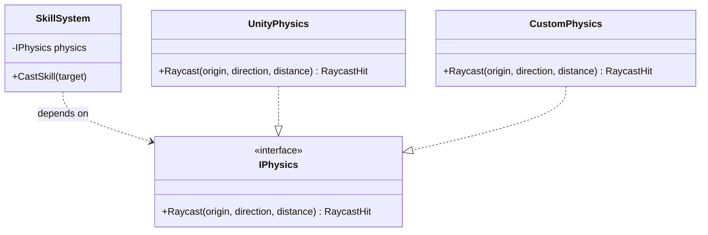
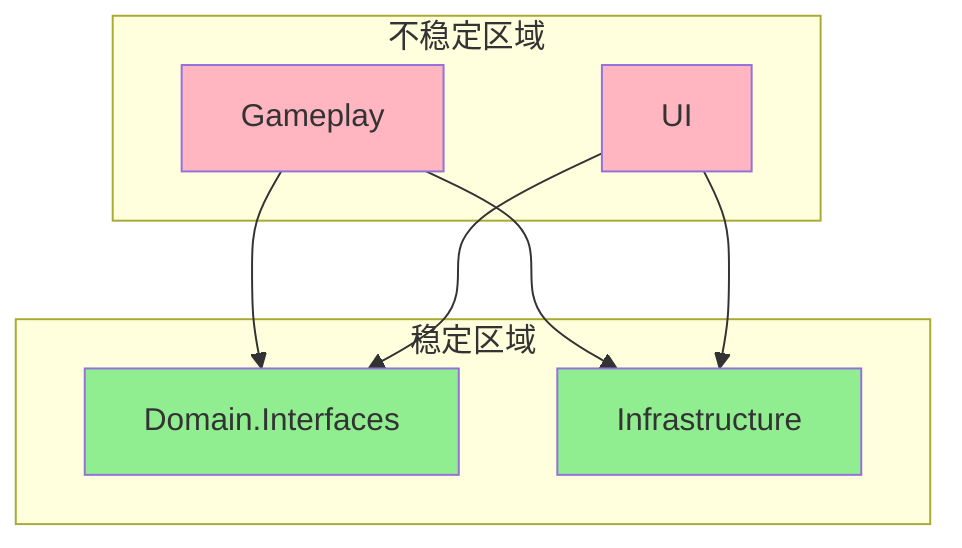

# 耦合、内聚与依赖管理（IoC/DI）

> 所属计划: 游戏架构设计
> 预计耗时: 75min
> 前置知识: [[01-architecture-overview|第1章 软件架构概述与质量属性]]

---

## 1. 概念讲解

### 为什么需要这个？

想象你在维护一个战斗系统：伤害计算直接 `new DamageCalculator()`，日志输出硬编码为 `Console.WriteLine`，角色死亡时直接调用 `GameManager.Instance.Restart()`。三个月后，策划要求伤害加入暴击率、日志要写入文件、死亡要弹出 UI——你发现每个改动都像扯毛衣线头，牵一发而动全身。

这就是**耦合**过高与**内聚**不足的代价。游戏开发中，战斗、UI、存档、网络等模块天然容易纠缠：MonoBehaviour 的拖拽引用、静态单例的全局访问、`FindObjectOfType` 的隐式依赖，让代码逐渐变成"意大利面条"。理解耦合与内聚的度量、掌握依赖倒置与注入技术，是将系统从"能跑"推向"可维护"的关键分水岭。

### 核心思想

#### 耦合的六种类型：从坏到好

耦合描述模块间相互依赖的紧密程度。Stevens、Myers 与 Constantine 在经典结构化设计中定义了六种耦合，至今仍是判断设计质量的重要标尺：

| 耦合类型     | 描述                       | 典型游戏场景                                               |
| -------- | ------------------------ | ---------------------------------------------------- |
| **内容耦合** | 一个模块直接修改另一个模块的内部数据或控制流   | A 脚本直接 `other.health = 0`                            |
| **公共耦合** | 多个模块共享全局数据区              | 全局 `static Dictionary<string, object> GameData`      |
| **外部耦合** | 模块共享外部定义的通信协议/数据格式       | 多个系统直接解析同一 JSON 配置的字典结构                              |
| **控制耦合** | 一个模块通过传递控制信号影响另一个模块的内部逻辑 | `TakeDamage(bool shouldLog, bool shouldShake)`       |
| **印记耦合** | 传递整个数据结构但只使用其中一部分        | `TakeDamage(PlayerStats stats)` 却只读取 `stats.defense` |
| **数据耦合** | 仅通过参数传递基本数据类型            | `TakeDamage(float amount, DamageType type)`          |

**原则**：追求数据耦合，消除内容耦合。控制耦合和印记耦合在业务复杂度上升时往往难以避免，但应有意识地通过接口抽象来降级。

#### 内聚的七种类型：从高到低

内聚衡量模块内部元素彼此关联的紧密程度。功能内聚是理想状态——"一个模块只做一件事，且把它做好"。

| 内聚类型 | 描述 | 判别标准 |
|---------|------|---------|
| **偶然内聚** | 元素无实质关联，硬凑在一起 | "工具类"大杂烩 |
| **逻辑内聚** | 元素执行逻辑相似的操作，由参数选择 | `HandleInput(InputType type)` 内部分支处理移动/攻击/菜单 |
| **时间内聚** | 元素因时间因素被组织在一起 | `Start()` 里初始化渲染、音频、网络 |
| **过程内聚** | 元素按特定执行顺序组合 | 按"加载→解压→解析→实例化"顺序组织的加载器 |
| **通信内聚** | 元素操作同一数据集 | 对同一 `PlayerData` 的读写校验 |
| **顺序内聚** | 一个元素的输出是另一个的输入 | 伤害计算 → 伤害应用 → 死亡判定 |
| **功能内聚** | 所有元素共同完成单一功能 | `DamageCalculator.Calculate(critical, defense)` |

**高内聚的判别标准**：模块的公开接口方法数 ≤ 3-5 个，每个方法都直接服务于模块的单一职责；修改一个功能只需改动一个模块。

#### 依赖倒置原则（DIP）

> 高层模块不应依赖低层模块，二者都应依赖抽象。抽象不应依赖细节，细节应依赖抽象。

在 [[02-architecture-styles|第2章]] 中，我们讨论了分层架构。DIP 是分层架构的"防腐剂"：如果没有抽象隔离，业务逻辑（高层）将直接依赖 Unity 的物理系统（低层），导致：

- 单元测试必须启动引擎
- 切换物理方案时重写业务逻辑
- 编译时耦合导致增量构建失效



#### 依赖关系图与稳定性

Robert C. Martin 提出两个量化原则：

- **稳定依赖原则（SDP）**：依赖应指向更稳定的包。稳定性 = 出向依赖 / (入向依赖 + 出向依赖)。纯接口包稳定性为 1，应被大量依赖。
- **稳定抽象原则（SAP）**：包越稳定，应越抽象。稳定包应包含接口与抽象类；不稳定包包含具体实现。

通过依赖图分析，可以发现：
- **循环依赖**：A → B → C → A，导致无法独立测试、编译顺序死锁
- **不稳定包**：被大量依赖却依赖大量他人，是架构中的"火药桶"



#### 模块/包边界

游戏项目的物理边界选择：

| 边界策略  | 实现方式                                              | 适用场景           |
| ----- | ------------------------------------------------- | -------------- |
| 按特性分包 | `Combat/`、`Inventory/`、`Quest/`                   | 业务模块清晰，团队按特性分工 |
| 按层分包  | `Domain/`、`Application/`、`Infrastructure/`        | 需要严格分层防御，大型项目  |
| 混合策略  | 特性包内再分层 `Combat/Domain/`、`Combat/Infrastructure/` | 多数游戏项目的务实选择    |

**关键决策**：接口与实现是否分离到不同 Assembly？
- 分离：编译隔离最强，但增加项目复杂度
- 不分离：通过 `internal` + `InternalsVisibleTo` 控制可见性，适合中小型团队

#### IoC 与 DI：控制反转的实现

**控制反转（IoC）** 是一种设计原则：将组件获取依赖的控制权从组件自身反转到外部容器。两种常见实现：

| 方式 | 机制 | 风险 |
|-----|------|------|
| **依赖注入（DI）** | 构造函数/属性/方法参数传入依赖 | 构造函数参数膨胀（可通过 Facade 聚合缓解） |
| **服务定位器** | 运行时向全局注册表查询 | 隐藏依赖、全局状态、测试困难（[[15-service-locator-singletons|第15章]]详述） |

DI 的三种注入方式：
- **构造函数注入**：必填依赖，对象创建即完整，推荐首选
- **属性注入**：可选依赖，有默认值时使用
- **方法注入**：调用时才需要的依赖，如 `TakeDamage(float, IDamageModifier[])`

#### DI 容器基础

容器三要素：
- **注册（Register）**：`AddSingleton<ILogger, FileLogger>()` —— 建立抽象到实现的映射
- **解析（Resolve）**：`GetService<IPlayerHealth>()` —— 递归构造对象图
- **生命周期**：
  - `Singleton`：全局唯一，适合无状态服务、配置
  - `Scoped`：同一作用域内共享，适合请求/帧级别上下文
  - `Transient`：每次解析新建，适合轻量状态对象

#### 游戏中的 DI：特殊考量

Unity 的 MonoBehaviour 与 DI 存在天然张力：

| 问题          | 原因                                  | 解决方案                                            |
| ----------- | ----------------------------------- | ----------------------------------------------- |
| 构造函数注入不可行   | MonoBehaviour 由引擎 `AddComponent` 构造 | Zenject/Extenject 的 `Inject` 属性；VContainer 的源生成 |
| 场景对象需要注入    | 非代码创建的对象                            | SceneInstaller / 预制体绑定                          |
| 热路径性能敏感     | 反射解析在 `Update` 中不可接受                | 预生成代码（VContainer）、编译时注入（Extenject）              |
| 生命周期与引擎事件耦合 | `Awake`/`Start`/`OnDestroy` 顺序      | Composition Root 统一控制，Installer 显式配置            |

**Composition Root** 模式：游戏启动时唯一一处调用容器注册，之后不再新增。避免运行时随意解析，防止容器沦为全局 Service Locator。

主要 Unity DI 方案对比：
- **Zenject/Extenject**：成熟，反射为主，支持场景绑定、信号系统
- **VContainer**：轻量，源生成（Source Generator）消除反射，性能更优
- **Unity 原生**：2022.3+ 的 `AddComponent<T>(T dep)` 有限支持，但无完整生命周期管理

---

## 2. 代码示例

实现目标：从零构建一个最小 DI 容器，支持构造函数注入、`Singleton` / `Transient` 生命周期，并组装游戏角色的受伤处理流程。运行环境：.NET 8+ CLI 控制台，零外部依赖。

```csharp
using System;
using System.Collections.Generic;
using System.Linq;
using System.Reflection;

// ========== 容器核心 ==========

public enum ServiceLifetime { Singleton, Transient }

public class ServiceDescriptor
{
    public Type ServiceType { get; }
    public Type ImplementationType { get; }
    public ServiceLifetime Lifetime { get; }
    public object? Instance { get; set; }

    public ServiceDescriptor(Type service, Type impl, ServiceLifetime life)
    {
        ServiceType = service;
        ImplementationType = impl;
        Lifetime = life;
    }
}

public class ServiceCollection : List<ServiceDescriptor>
{
    public ServiceCollection AddTransient<TService, TImpl>() where TImpl : TService
    {
        Add(new ServiceDescriptor(typeof(TService), typeof(TImpl), ServiceLifetime.Transient));
        return this;
    }

    public ServiceCollection AddSingleton<TService, TImpl>() where TImpl : TService
    {
        Add(new ServiceDescriptor(typeof(TService), typeof(TImpl), ServiceLifetime.Singleton));
        return this;
    }

    public ServiceProvider Build() => new(this);
}

public class ServiceProvider
{
    private readonly IReadOnlyList<ServiceDescriptor> _descriptors;
    // 缓存 Singleton 实例
    private readonly Dictionary<Type, object> _singletonCache = new();

    public ServiceProvider(IReadOnlyList<ServiceDescriptor> descriptors)
    {
        _descriptors = descriptors;
    }

    public T GetService<T>() => (T)GetService(typeof(T));

    private object GetService(Type type)
    {
        // 1. 查找注册信息
        var descriptor = _descriptors.FirstOrDefault(d => d.ServiceType == type);
        if (descriptor == null)
            throw new InvalidOperationException($"服务未注册: {type.FullName}");

        // 2. Singleton 命中缓存
        if (descriptor.Lifetime == ServiceLifetime.Singleton)
        {
            if (_singletonCache.TryGetValue(type, out var cached))
                return cached;
        }

        // 3. 递归构造：找到实现类型的构造函数，解析参数
        var implType = descriptor.ImplementationType;
        var ctor = implType.GetConstructors()
            .OrderByDescending(c => c.GetParameters().Length)
            .First(); // 取参数最多的构造函数

        var parameters = ctor.GetParameters();
        var args = new object[parameters.Length];
        for (int i = 0; i < parameters.Length; i++)
        {
            // 递归解析依赖
            args[i] = GetService(parameters[i].ParameterType);
        }

        var instance = Activator.CreateInstance(implType, args)!;

        // 4. 缓存 Singleton
        if (descriptor.Lifetime == ServiceLifetime.Singleton)
        {
            _singletonCache[type] = instance;
        }

        return instance;
    }
}

// ========== 游戏业务接口与实现 ==========

public interface IDamageCalculator
{
    float Calculate(float baseDamage, float defense);
}

public class DamageCalculator : IDamageCalculator
{
    public float Calculate(float baseDamage, float defense)
    {
        // 防御减伤公式：防御越高收益递减
        float mitigation = defense / (defense + 100f);
        return baseDamage * (1f - mitigation);
    }
}

public interface ILogger
{
    void Log(string message);
}

public class ConsoleLogger : ILogger
{
    public void Log(string message) => Console.WriteLine($"[LOG] {DateTime.Now:HH:mm:ss} {message}");
}

public class PlayerHealth
{
    private readonly IDamageCalculator _damageCalculator;
    private readonly ILogger _logger;
    
    public float CurrentHealth { get; private set; } = 100f;
    public float Defense { get; set; } = 50f;

    // 构造函数注入：容器自动解析 IDamageCalculator 和 ILogger
    public PlayerHealth(IDamageCalculator damageCalculator, ILogger logger)
    {
        _damageCalculator = damageCalculator;
        _logger = logger;
        _logger.Log("PlayerHealth 初始化完成");
    }

    public void TakeDamage(float baseDamage)
    {
        float actualDamage = _damageCalculator.Calculate(baseDamage, Defense);
        CurrentHealth -= actualDamage;
        
        _logger.Log($"受到 {baseDamage:F1} 点基础伤害，实际伤害 {actualDamage:F1}，剩余生命 {CurrentHealth:F1}");
        
        if (CurrentHealth <= 0)
        {
            CurrentHealth = 0;
            _logger.Log("玩家死亡");
        }
    }
}

// ========== 入口 ==========

class Program
{
    static void Main(string[] args)
    {
        // Composition Root：唯一注册点
        var services = new ServiceCollection()
            .AddSingleton<ILogger, ConsoleLogger>()      // 日志全局单例
            .AddTransient<IDamageCalculator, DamageCalculator>() // 每次新建计算器
            .AddTransient<PlayerHealth, PlayerHealth>(); // 玩家生命每局新建

        var provider = services.Build();

        // 解析并运行
        var player = provider.GetService<PlayerHealth>();
        
        Console.WriteLine("=== 战斗开始 ===");
        player.TakeDamage(30f);  // 低伤害
        player.TakeDamage(50f);  // 中等伤害
        player.TakeDamage(100f); // 致命伤害

        // 验证 Singleton：再次解析 ILogger 应为同一实例
        var logger1 = provider.GetService<ILogger>();
        var logger2 = provider.GetService<ILogger>();
        Console.WriteLine($"\nSingleton 验证: ReferenceEquals = {ReferenceEquals(logger1, logger2)}");

        // 验证 Transient：再次解析 PlayerHealth 应为新实例
        var player2 = provider.GetService<PlayerHealth>();
        Console.WriteLine($"Transient 验证: ReferenceEquals = {ReferenceEquals(player, player2)}");
    }
}
```

**运行方式:**

```bash
# 创建 .NET 8 控制台项目
dotnet new console -n MiniDiDemo
cd MiniDiDemo

# 将上述代码写入 Program.cs，然后运行
dotnet run
```

**预期输出:**

```text
[LOG] 15:42:33 PlayerHealth 初始化完成
=== 战斗开始 ===
[LOG] 15:42:33 受到 30.0 点基础伤害，实际伤害 20.0，剩余生命 80.0
[LOG] 15:42:33 受到 50.0 点基础伤害，实际伤害 33.3，剩余生命 46.7
[LOG] 15:42:33 受到 100.0 点基础伤害，实际伤害 66.7，剩余生命 -20.0
[LOG] 15:42:33 玩家死亡

Singleton 验证: ReferenceEquals = True
Transient 验证: ReferenceEquals = False
```

---

## 3. 练习

### 练习 1: 基础

为容器添加 `Scoped` 生命周期支持。要求：
- 新增 `ServiceLifetime.Scoped` 枚举值
- `ServiceProvider` 支持 `CreateScope()` 返回 `IServiceScope`（含 `ServiceProvider` 属性）
- 同一 Scope 内解析 `Scoped` 服务得到同一实例
- 不同 Scope 解析得到不同实例
- 编写验证代码（无需正式单元测试框架，控制台输出验证即可）

### 练习 2: 进阶

在 `GetService` 中检测循环依赖并抛出清晰异常。测试场景：
- `A` 的构造函数依赖 `B`
- `B` 的构造函数依赖 `A`
- 解析 `A` 时应抛出 `InvalidOperationException`，消息包含完整的依赖链如 `"A -> B -> A"`

### 练习 3: 挑战（可选）

对比 Unity 中三种依赖获取方式的差异，从以下维度分析：

| 维度 | 构造函数 DI | MonoBehaviour 字段注入 | Service Locator |
|-----|-----------|----------------------|----------------|
| 测试友好性 | | | |
| 编译时耦合 | | | |
| 运行时性能 | | | |
| 多人协作/代码可读性 | | | |

结合具体场景（如技能系统、UI 系统、存档系统）说明何时选用哪种。

---

## 3.5 参考答案

> [!tip]- 练习 1 参考答案
> 
> 核心思路：Scope 本质是独立的实例缓存层，介于全局 Singleton 与每次新建之间。
> 
> ```csharp
> // 新增枚举值
> public enum ServiceLifetime { Singleton, Transient, Scoped }
> 
> // Scope 接口
> public interface IServiceScope : IDisposable
> {
>     IServiceProvider ServiceProvider { get; }
> }
> 
> // 修改后的 ServiceProvider
> public class ServiceProvider : IServiceProvider
> {
>     private readonly IReadOnlyList<ServiceDescriptor> _descriptors;
>     private readonly Dictionary<Type, object> _singletonCache;
>     private readonly Dictionary<Type, object>? _scopedCache; // null 表示根容器
> 
>     // 根容器
>     public ServiceProvider(IReadOnlyList<ServiceDescriptor> descriptors)
>     {
>         _descriptors = descriptors;
>         _singletonCache = new();
>         _scopedCache = null; // 根容器不解析 Scoped
>     }
> 
>     // 子 Scope 容器
>     private ServiceProvider(IReadOnlyList<ServiceDescriptor> descriptors,
>         Dictionary<Type, object> singletonCache,
>         Dictionary<Type, object> scopedCache)
>     {
>         _descriptors = descriptors;
>         _singletonCache = singletonCache;
>         _scopedCache = scopedCache;
>     }
> 
>     public IServiceScope CreateScope()
>     {
>         var scopeCache = new Dictionary<Type, object>();
>         var scopeProvider = new ServiceProvider(_descriptors, _singletonCache, scopeCache);
>         return new ServiceScope(scopeProvider);
>     }
> 
>     private class ServiceScope : IServiceScope
>     {
>         public IServiceProvider ServiceProvider { get; }
>         public ServiceScope(IServiceProvider provider) => ServiceProvider = provider;
>         public void Dispose() { /* 可释放 Scoped 实例 */ }
>     }
> 
>     public T GetService<T>() => (T)GetService(typeof(T));
> 
>     private object GetService(Type type)
>     {
>         var descriptor = _descriptors.FirstOrDefault(d => d.ServiceType == type);
>         if (descriptor == null)
>             throw new InvalidOperationException($"服务未注册: {type.FullName}");
> 
>         // 生命周期路由
>         switch (descriptor.Lifetime)
>         {
>             case ServiceLifetime.Singleton:
>                 return GetOrCreate(_singletonCache, descriptor, type);
>             case ServiceLifetime.Scoped:
>                 if (_scopedCache == null)
>                     throw new InvalidOperationException($"不能从根容器解析 Scoped 服务: {type.FullName}");
>                 return GetOrCreate(_scopedCache, descriptor, type);
>             case ServiceLifetime.Transient:
>                 return CreateInstance(descriptor);
>             default:
>                 throw new NotSupportedException();
>         }
>     }
> 
>     private object GetOrCreate(Dictionary<Type, object> cache, ServiceDescriptor descriptor, Type type)
>     {
>         if (cache.TryGetValue(type, out var cached))
>             return cached;
>         var instance = CreateInstance(descriptor);
>         cache[type] = instance;
>         return instance;
>     }
> 
>     private object CreateInstance(ServiceDescriptor descriptor)
>     {
>         var ctor = descriptor.ImplementationType.GetConstructors()
>             .OrderByDescending(c => c.GetParameters().Length)
>             .First();
>         var args = ctor.GetParameters()
>             .Select(p => GetService(p.ParameterType))
>             .ToArray();
>         return Activator.CreateInstance(descriptor.ImplementationType, args)!;
>     }
> }
> 
> // 验证代码
> var services = new ServiceCollection()
>     .AddScoped<IRequestContext, RequestContext>()  // 新增扩展方法
>     .AddSingleton<ILogger, ConsoleLogger>();
> 
> var root = services.Build();
> 
> using (var scope1 = root.CreateScope())
> {
>     var ctx1a = scope1.ServiceProvider.GetService<IRequestContext>();
>     var ctx1b = scope1.ServiceProvider.GetService<IRequestContext>();
>     Console.WriteLine($"Scope1 内相同: {ReferenceEquals(ctx1a, ctx1b)}"); // True
> }
> 
> using (var scope2 = root.CreateScope())
> {
>     var ctx2 = scope2.ServiceProvider.GetService<IRequestContext>();
>     // 与 scope1 的实例比较
> }
> ```
> 
> 关键设计决策：根容器禁止直接解析 Scoped，强制用户通过 `CreateScope()` 创建作用域，与 ASP.NET Core 的 `HttpContext` 生命周期一致。Singleton 缓存跨 Scope 共享，Scoped 缓存隔离。

> [!tip]- 练习 2 参考答案
> 
> 核心思路：维护"解析中"集合，递归前加入、成功后移除，异常时保留上下文。
> 
> ```csharp
> public class ServiceProvider
> {
>     // ... 原有字段 ...
>     private readonly HashSet<Type> _resolvingChain = new(); // 线程不安全，同一线程递归用
> 
>     private object GetService(Type type)
>     {
>         // 循环依赖检测
>         if (!_resolvingChain.Add(type))
>         {
>             var chain = string.Join(" -> ", _resolvingChain) + " -> " + type.Name;
>             throw new InvalidOperationException($"检测到循环依赖: {chain}");
>         }
> 
>         try
>         {
>             var descriptor = _descriptors.FirstOrDefault(d => d.ServiceType == type);
>             if (descriptor == null)
>                 throw new InvalidOperationException($"服务未注册: {type.FullName}");
> 
>             // ... 缓存检查 ...
> 
>             var instance = CreateInstance(descriptor);
>             
>             // ... 缓存写入 ...
>             
>             return instance;
>         }
>         finally
>         {
>             _resolvingChain.Remove(type);
>         }
>     }
> 
>     private object CreateInstance(ServiceDescriptor descriptor)
>     {
>         var ctor = descriptor.ImplementationType.GetConstructors()
>             .OrderByDescending(c => c.GetParameters().Length)
>             .First();
>         
>         var parameters = ctor.GetParameters();
>         var args = new object[parameters.Length];
>         for (int i = 0; i < parameters.Length; i++)
>         {
>             args[i] = GetService(parameters[i].ParameterType); // 递归
>         }
> 
>         return Activator.CreateInstance(descriptor.ImplementationType, args)!;
>     }
> }
> 
> // 测试循环依赖
> public class ServiceA { public ServiceA(ServiceB b) { } }
> public class ServiceB { public ServiceB(ServiceA a) { } }
> 
> var services = new ServiceCollection()
>     .AddTransient<ServiceA, ServiceA>()
>     .AddTransient<ServiceB, ServiceB>();
> 
> try
> {
>     var provider = services.Build();
>     provider.GetService<ServiceA>();
> }
> catch (InvalidOperationException ex)
> {
>     Console.WriteLine(ex.Message); // "检测到循环依赖: ServiceA -> ServiceB -> ServiceA"
> }
> ```
> 
> 注意事项：
> - `HashSet<Type>` 非线程安全，生产环境需用 `AsyncLocal` 或锁
> - 异常时集合清理放在 `finally` 确保状态不泄漏
> - 属性注入的循环依赖更难检测，建议禁用或显式标记

> [!tip]- 练习 3 参考答案
> 
> 对比分析：
> 
> | 维度 | 构造函数 DI | MonoBehaviour 字段注入 | Service Locator |
> |-----|-----------|----------------------|----------------|
> | **测试友好性** | ⭐⭐⭐ 直接 `new` 传入 Mock | ⭐⭐ 需模拟 MonoBehaviour 生命周期或容器 | ⭐ 全局状态需手动重置，易遗漏 |
> | **编译时耦合** | ⭐⭐ 签名变更导致级联编译 | ⭐⭐⭐ 字段类型可变更不影响调用方 | ⭐⭐⭐ 运行时解析，编译无耦合 |
> | **运行时性能** | ⭐⭐⭐ 纯构造，零开销 | ⭐⭐ 反射注入或源生成开销 | ⭐⭐ 字典查找，缓存后尚可 |
> | **多人协作** | ⭐⭐⭐ 依赖显式，代码即文档 | ⭐⭐ 拖拽关系在场景中不可见 | ⭐ 隐藏依赖，"魔法"获取 |
> 
> **场景建议**：
> 
> - **技能系统**：构造函数 DI。技能逻辑复杂，需大量单元测试；技能组合变化多，显式依赖便于理解。
> - **UI 系统**：MonoBehaviour 字段注入（有限度）。UI 与场景绑定紧密，Zenject 的 `Inject` 配合预制体较自然；但核心 UI 逻辑（如 MVVM 的 ViewModel）仍应通过接口抽象。
> - **存档系统**：构造函数 DI + 接口。存档需跨平台替换（本地文件/云存档/Steam Cloud），DIP 保证可切换；避免 Service Locator 导致测试时全局存档状态污染。
> 
> **Unity 务实策略**：
> 1. Composition Root 统一配置，禁止运行时 `GetService`
> 2. 热路径（`Update` 中频繁调用）预解析依赖到字段，避免每帧查询
> 3. 优先 VContainer 源生成方案，消除反射开销
> 4. 对 MonoBehaviour 的"必须依赖"用 `[Inject]` 必填，"可选依赖"用属性或 `TryGetService`

> [!note] 答案使用方式
> 如果你的实现通过了测试或达到了题目要求，就是正确的。参考答案提供的是"一种可行路径"，而非唯一标准答案。重点关注：练习1的 Scope 缓存分层设计、练习2的异常安全清理、练习3的具体场景论证深度。
>
> ---

## 4. 扩展阅读

- Martin Fowler, "Inversion of Control Containers and the Dependency Injection pattern"：https://martinfowler.com/articles/injection.html —— IoC/DI 经典解释，区分依赖查找与依赖注入的本质差异。
- Robert C. Martin, "A Little Architecture"：https://blog.cleancoder.com/uncle-bob/2016/01/04/ALittleArchitecture.html —— 依赖倒置与架构边界，以"查询引擎"为例展示如何保护业务规则。
- Microsoft.Extensions.DependencyInjection 官方文档：https://learn.microsoft.com/en-us/dotnet/core/extensions/dependency-injection —— 生命周期与容器行为参考，Scoped 在 Web 请求中的典型应用模式。
- VContainer 文档（Unity 源生成 DI）：https://vcontainer.hadashikick.jp/ —— 游戏项目中性能最优的 DI 方案，了解 `IContainerBuilder` 与代码生成机制。

---

## 常见陷阱

- **DI 容器被当作全局 Service Locator 使用**：在业务代码中到处 `ServiceProvider.GetService<T>()`，隐藏依赖关系，使静态分析失效。**正确做法**：仅允许在 Composition Root 和 Factory 中使用容器，业务组件通过构造函数接收依赖；需要延迟解析的场景用 `Func<T>` 或 `Lazy<T>` 注入。

- **过深的构造函数注入链导致编译时耦合爆炸**：`A` 依赖 `B` 依赖 `C` 依赖 `D`... 修改 `D` 的签名导致 `A` 重编译。**正确做法**：引入聚合服务（Facade）模式，如 `IGameplayServices` 打包相关依赖；或按用例垂直切片，减少跨层穿透。

- **生命周期错配**：`Singleton` 依赖 `Transient` 导致状态泄漏（Singleton 持有 Transient 的引用，实际变成 Singleton 行为）；`Transient` 被误当作 `Singleton` 复用导致状态污染。**正确做法**：建立生命周期约束检查——容器应拒绝 `Singleton` → `Scoped`/`Transient` 的直接依赖，或至少发出警告；Unity 中注意 MonoBehaviour 的 `DontDestroyOnLoad` 对象与场景对象的生存期差异。