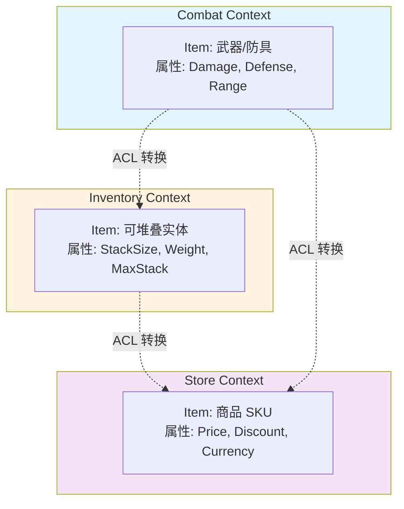

# 领域建模与战略设计

> 所属计划: 游戏架构设计
> 预计耗时: 75min
> 前置知识: [[01-architecture-overview|第1章 软件架构概述与质量属性]]、[[03-coupling-cohesion-di|第3章 耦合、内聚与依赖管理（IoC/DI）]]

---

## 1. 概念讲解

### 为什么需要这个？

游戏开发是软件工程中最复杂的领域之一。一个现代 RPG 或 MMO 同时包含：实时战斗判定、背包容量管理、任务状态机、经济平衡公式、社交关系图、匹配算法、商城支付链路——这些子系统彼此交织，却由策划、程序、美术、运营、测试等多角色协作完成。

如果没有清晰的领域边界，团队会陷入典型的"大泥球"（Big Ball of Mud）困境：

- **术语混乱**：策划说的"物品"指掉落表里的配置行，程序说的"物品"是运行时实体，运营说的"物品"可能是 SKU。同一场会议里三个人用同一个词，指的却是三个不同的概念。
- **模型污染**：战斗系统需要武器的 `Damage` 字段，背包系统需要 `StackSize` 字段。如果强行统一成一个"万能 Item 类"，两个上下文都会被不相关的字段耦合，修改时互相踩脚。
- **演进锁死**：经济系统想改版，却发现 Shop、Trade、Auction 三个模块都直接依赖 `Money` 类的内部结构，一处改动引发连锁重构。

[[02-architecture-styles|第2章]]讨论了分层与六边形等架构风格，但风格解决的是"代码怎么放"，战略设计解决的是"模型怎么切"——**先正确划分边界，再决定内部结构**。这是 DDD（Domain-Driven Design）战略设计的核心命题。

### 核心思想

#### 领域（Domain）与问题空间

领域是"知识、影响或活动的范围"。游戏的领域包含所有规则、状态、玩家目标与商业约束。问题空间（Problem Space）是我们需要解决的现实世界问题；解决方案空间（Solution Space）是我们构建的软件模型。

关键认知：**模型不是现实的复制，而是为特定目的对现实的简化**。同一个现实概念（如"剑"），在不同目的下需要不同的简化。

#### 子域分类：资源倾斜的艺术

Eric Evans 将子域分为三类，直接指导团队资源分配：

| 类型 | 定义 | 游戏示例 | 资源策略 |
|------|------|----------|----------|
| **核心域**（Core Domain） | 竞争优势所在，差异化价值 | 某 ARPG 的"极限闪避-反击"战斗系统 | 投入顶尖人才，持续打磨 |
| **支撑子域**（Supporting Subdomain） | 必要但非差异化，可定制 | 任务日志、成就系统 | 内部实现，但避免过度投资 |
| **通用子域**（Generic Subdomain） | 行业通用，可购买/外包 | 账号认证、支付网关、客服工单 | 采购 SaaS 或开源方案 |

> 警惕"核心域漂移"：很多工作室把 80% 精力花在通用子域的自研上（如自己写网络同步层），却用外包战斗手感——这是战略倒置。

#### 限界上下文（Bounded Context）

限界上下文是**模型一致性的显式边界**。在同一个边界内，术语有唯一含义，模型遵循统一规则；跨边界时，概念可能同名异义、同义异名。



上图展示：三个上下文都有 `Item`，但：
- `Combat.Item` 关心能否造成伤害
- `Inventory.Item` 关心能否堆叠、是否超重
- `Store.Item` 关心定价策略和促销规则

**强行统一是灾难**。限界上下文允许"一把剑"在三个地方以三种形态存在，通过显式转换层（ACL）桥接。

#### 统一语言（Ubiquitous Language）

统一语言不是"公司级术语表"，而是**限界上下文内部的共享语言**。它必须：
- 出现在代码（类名、方法名、变量名）
- 出现在文档（Wiki、API 文档）
- 出现在任务单（Jira 标题、验收标准）
- 出现在会议对话（"这个聚合根的状态不一致"）

反模式：程序员用 `UserDAO`、`UserDTO`、`UserEntity`，策划说"玩家"，运营说"账户"，测试说"角色"。

#### 上下文映射（Context Map）

当多个限界上下文需要协作时，它们之间的关系模式称为上下文映射：

| 模式 | 含义 | 游戏场景 |
|------|------|----------|
| **Partnership** | 双向依赖，共同演进 | 战斗与动画团队紧密协作 |
| **Shared Kernel** | 共享一小部分模型，变化需同步 | `Money` 值对象被经济与商店共享 |
| **Customer-Supplier** | 上游优先满足下游需求 | 任务系统（下游）需要战斗系统（上游）提供事件 |
| **Conformist** | 下游无条件接受上游模型 | 第三方 SDK 的账号系统 |
| **Anti-Corruption Layer** | 下游用适配器隔离上游模型 | 老经济系统对接新商城 |
| **Open Host Service** | 上游提供开放协议供多方接入 | 成就系统暴露事件总线 |
| **Published Language** | 显式定义的交换格式 | 跨服交易的 JSON Schema |
| **Separate Ways** | 完全独立，不集成 | 单机模式与在线模式的存档系统 |

选择模式的核心标准：**团队结构、变化速率、控制权**。同一组织内、同节奏迭代的上下文可用 Shared Kernel；跨组织、变化不同步时必须 ACL。

#### 桥接到第二阶段：从 DDD 到游戏引擎架构

限界上下文不是纸上谈兵，它直接指导技术实现：

- 每个上下文可映射为一个或多个 **ECS 的 `EcsWorld`**（[[11-ecs-deep-dive|第11章]]）
- 上下文边界帮助决定 **Component 的归属**（[[10-component-based|第10章]]）
- ACL 的实现常对应 **事件总线或命令模式**（[[14-event-driven-architecture|第14章]]、[[17-command-ability-system|第17章]]）
- 上下文间的同步需求驱动 **游戏循环的 Phase 划分**（[[07-game-loop|第7章]]）

```mermaid
classDiagram
    class CombatContext {
        +WeaponComponent
        +DamageSystem
        +RangeSystem
    }
    
    class InventoryContext {
        +ItemComponent
        +StackSystem
        +WeightSystem
    }
    
    class QuestContext {
        +RewardComponent
        +ObjectiveSystem
    }
    
    class "ACL Layer" as ACL {
        <<adapter>>
        +CombatToInventoryAdapter
        +QuestToCombatAdapter
    }
    
    CombatContext --> ACL : 事件/查询
    InventoryContext --> ACL : 事件/查询
    QuestContext --> ACL : 事件/查询
    
    note for CombatContext "对应 EcsWorld 或 System Group"
    note for ACL "保护内部模型，提供转换"
```

---

## 2. 代码示例

实现目标：演示"战斗上下文"与"背包上下文"中同名 `Item` 概念的不同模型，以及 Anti-Corruption Layer（ACL）如何桥接二者。

关键结构：
- `Combat.Item`：包含 `Damage`、`Range`
- `Inventory.Item`：包含 `StackSize`、`Weight`
- `CombatToInventoryAdapter`：把战斗武器的持久 ID 映射为背包系统的物品引用
- `Program`：创建战斗武器，通过 ACL 查询背包中的对应条目

```csharp
// ============================================
// 运行环境: .NET 8+ CLI 控制台
// 创建: dotnet new console -n DomainModelingDemo
// 运行: dotnet run
// ============================================

using System;
using System.Collections.Generic;

// ============================================
// 限界上下文: Combat
// 关注点: 武器在战斗中的效用
// ============================================
namespace Combat
{
    /// <summary>
    /// 战斗上下文中的物品：关心伤害能力
    /// 统一语言: "武器"（Weapon）、"伤害"（Damage）、"射程"（Range）
    /// </summary>
    public class Item
    {
        /// <summary>全局唯一持久标识，跨上下文关联的关键</summary>
        public string Id { get; set; } = string.Empty;
        
        /// <summary>每次攻击造成的伤害值</summary>
        public int Damage { get; set; }
        
        /// <summary>有效攻击距离（米）</summary>
        public double Range { get; set; }
        
        /// <summary>耐久度，0 时武器损坏</summary>
        public int Durability { get; set; }

        public override string ToString() =>
            $"Combat.Item[{Id}] Damage={Damage}, Range={Range}, Durability={Durability}";
    }

    /// <summary>战斗上下文专用的武器库服务</summary>
    public class Arsenal
    {
        private readonly Dictionary<string, Item> _weapons = new();

        public void Register(Item weapon) => _weapons[weapon.Id] = weapon;

        public Item? FindById(string id) => _weapons.GetValueOrDefault(id);
    }
}

// ============================================
// 限界上下文: Inventory
// 关注点: 物品在背包中的存储与流转
// 统一语言: "堆叠"（Stack）、"负重"（Weight）、"稀有度"（Rarity）
// ============================================
namespace Inventory
{
    /// <summary>
    /// 背包上下文中的物品：关心存储与交易属性
    /// 注意：与 Combat.Item 同名但完全不同的概念！
    /// </summary>
    public class Item
    {
        public string Id { get; set; } = string.Empty;
        
        /// <summary>当前堆叠数量</summary>
        public int StackSize { get; set; }
        
        /// <summary>单个物品重量（千克）</summary>
        public double Weight { get; set; }
        
        /// <summary>最大堆叠上限</summary>
        public int MaxStack { get; set; }
        
        /// <summary>稀有度: Common, Rare, Epic, Legendary</summary>
        public Rarity Rarity { get; set; }

        public double TotalWeight => StackSize * Weight;

        public override string ToString() =>
            $"Inventory.Item[{Id}] Stack={StackSize}/{MaxStack}, Weight={Weight:F2}kg, Rarity={Rarity}";
    }

    public enum Rarity { Common, Rare, Epic, Legendary }

    /// <summary>背包仓储服务</summary>
    public class Warehouse
    {
        private readonly Dictionary<string, Item> _index = new();

        public void Stock(Item item) => _index[item.Id] = item;

        public Item? FindById(string id) => _index.GetValueOrDefault(id);
        
        public IReadOnlyDictionary<string, Item> GetIndex() => _index;
    }
}

// ============================================
// Anti-Corruption Layer: 战斗 ↔ 背包 适配器
// 这是战略设计的核心落地：不直接引用对方模型，
// 通过 ID 映射 + 显式转换，保护各自上下文的完整性
// ============================================
public class CombatToInventoryAdapter
{
    private readonly IReadOnlyDictionary<string, Inventory.Item> _inventoryIndex;

    /// <summary>
    /// 注入背包索引的只读视图。
    /// 关键设计：Combat 上下文不持有 Inventory.Item 的引用，
    /// 只通过 ID 查询，保持单向依赖。
    /// </summary>
    public CombatToInventoryAdapter(
        IReadOnlyDictionary<string, Inventory.Item> inventoryIndex)
    {
        _inventoryIndex = inventoryIndex 
            ?? throw new ArgumentNullException(nameof(inventoryIndex));
    }

    /// <summary>
    /// 将战斗武器转换为背包物品查询。
    /// 返回 null 表示"该武器在背包中无对应条目"（如临时召唤物）。
    /// </summary>
    public Inventory.Item? FindInventoryItem(Combat.Item weapon)
    {
        if (weapon == null) throw new ArgumentNullException(nameof(weapon));
        
        // 核心转换：仅通过持久 ID 关联，不暴露内部结构
        return _inventoryIndex.GetValueOrDefault(weapon.Id);
    }

    /// <summary>
    /// 检查武器是否超重（战斗系统关心：过重影响攻速）</summary>
    public bool IsOverweight(Combat.Item weapon, double threshold)
    {
        var invItem = FindInventoryItem(weapon);
        return invItem != null && invItem.TotalWeight > threshold;
    }
}

// ============================================
// 演示程序
// ============================================
class Program
{
    static void Main()
    {
        Console.WriteLine("=== DDD 战略设计: 限界上下文与 ACL 演示 ===\n");

        // --- 初始化战斗上下文 ---
        var arsenal = new Combat.Arsenal();
        var sword = new Combat.Item 
        { 
            Id = "wep-001",           // 持久 ID，跨上下文的关键
            Damage = 45, 
            Range = 2.5, 
            Durability = 100 
        };
        arsenal.Register(sword);
        Console.WriteLine($"[Combat] 注册武器: {sword}");

        // --- 初始化背包上下文 ---
        var warehouse = new Inventory.Warehouse();
        var swordEntry = new Inventory.Item 
        { 
            Id = "wep-001",             // 相同持久 ID，不同模型
            StackSize = 1,
            Weight = 3.5,
            MaxStack = 1,
            Rarity = Inventory.Rarity.Rare
        };
        warehouse.Stock(swordEntry);
        Console.WriteLine($"[Inventory] 入库物品: {swordEntry}\n");

        // --- 通过 ACL 桥接 ---
        var adapter = new CombatToInventoryAdapter(warehouse.GetIndex());
        
        var found = adapter.FindInventoryItem(sword);
        Console.WriteLine($"[ACL] 查询结果: {found ?? (object)"null"}");
        
        var overweight = adapter.IsOverweight(sword, threshold: 3.0);
        Console.WriteLine($"[ACL] 是否超重(>3.0kg): {overweight}");

        // --- 验证边界保护: 战斗上下文无法直接修改背包属性 ---
        Console.WriteLine("\n=== 边界验证 ===");
        Console.WriteLine("Combat.Item 无 StackSize 属性: ✓ 模型隔离");
        Console.WriteLine("Combat 通过 ID 查询而非直接引用 Inventory.Item: ✓ 依赖解耦");
    }
}
```

**运行方式:**

```bash
# 创建并运行项目
dotnet new console -n DomainModelingDemo -o DomainModelingDemo
cd DomainModelingDemo
# 将上述代码粘贴到 Program.cs，替换默认内容
dotnet run
```

**预期输出:**

```text
=== DDD 战略设计: 限界上下文与 ACL 演示 ===

[Combat] 注册武器: Combat.Item[wep-001] Damage=45, Range=2.5, Durability=100
[Inventory] 入库物品: Inventory.Item[wep-001] Stack=1/1, Weight=3.50kg, Rarity=Rare

[ACL] 查询结果: Inventory.Item[wep-001] Stack=1/1, Weight=3.50kg, Rarity=Rare
[ACL] 是否超重(>3.0kg): True

=== 边界验证 ===
Combat.Item 无 StackSize 属性: ✓ 模型隔离
Combat 通过 ID 查询而非直接引用 Inventory.Item: ✓ 依赖解耦
```

**关键设计决策说明：**

| 决策 | 理由 |
|------|------|
| 同名类 `Item` 分属不同命名空间 | 强制编译期隔离，避免意外混用 |
| 持久 `Id` 作为跨上下文关联键 | 解耦模型结构，仅依赖标识约定 |
| `IReadOnlyDictionary` 注入 | 防止适配器反向修改背包数据 |
| 返回 `Inventory.Item?` 而非投影 | 简单场景直接暴露；复杂场景可改为 DTO |

---

## 3. 练习

### 练习 1: 基础

新增 `QuestContext`，任务奖励为"一把剑"；通过 ACL 把 Quest 的奖励项转换为 Combat 武器与 Inventory 物品。

要求：
- 定义 `Quest.Reward`（含 `ItemId`、`Quantity`）
- 编写 `QuestToInventoryAdapter` 与 `QuestToCombatAdapter`
- 用 ID 查表映射，Quest 不直接引用 Combat/Inventory 的内部模型
- 演示：创建任务奖励，通过两个适配器分别查询对应战斗武器和背包物品

### 练习 2: 进阶

讨论并实现：在 `EconomyContext` 与 `ShopContext` 之间共享 `Money` 值对象，应该选择哪种上下文映射模式？

- 若选 **Shared Kernel**：给出共享模型的代码，说明同步变更的协作流程
- 若选 **ACL 转换**：给出各自独立的 `Money` 定义及显式转换器
- 分析两种选择的权衡：团队结构、变化速率、部署独立性

### 练习 3: 挑战（可选）

为一类 MMORPG 的经济/交易/拍卖系统绘制上下文映射图（用 Mermaid），并标注每个上下文间的关系类型：

- Economy（核心域，货币发行、通胀控制）
- Shop（系统商店，固定价格）
- Trade（玩家直接交易）
- Auction（拍卖行，竞价机制）
- 可选：CrossServerTrade（跨服交易）

标注说明：
- 哪对是 Customer-Supplier？
- 哪里需要 Conformist？
- 哪里用 ACL？
- 哪里适合 Open Host Service + Published Language？

---

## 3.5 参考答案

> [!tip]- 练习 1 参考答案
> ```csharp
> using System;
> using System.Collections.Generic;
>
> // ============================================
> // 限界上下文: Quest
> // 关注点: 任务目标与奖励发放
> // ============================================
> namespace Quest
> {
>     /// <summary>任务奖励：仅含标识与数量，无具体模型细节</summary>
>     public class Reward
>     {
>         /// <summary>奖励物品持久 ID</summary>
>         public string ItemId { get; set; } = string.Empty;
>
>         /// <summary>奖励数量（经验值时可能为 0）</summary>
>         public int Quantity { get; set; }
>
>         /// <summary>奖励类型：物品、经验、货币</summary>
>         public RewardType Type { get; set; }
>
>         public override string ToString() => 
>             $"Reward[{ItemId}] x{Quantity}, Type={Type}";
>     }
>
>     public enum RewardType { Item, Experience, Currency }
>
>     /// <summary>任务定义</summary>
>     public class QuestDef
>     {
>         public string Id { get; set; } = string.Empty;
>         public string Title { get; set; } = string.Empty;
>         public List<Reward> Rewards { get; set; } = new();
>     }
> }
>
> // ============================================
> // ACL: Quest → Inventory
> // ============================================
> public class QuestToInventoryAdapter
> {
>     private readonly IReadOnlyDictionary<string, Inventory.Item> _inventoryIndex;
>
>     public QuestToInventoryAdapter(
>         IReadOnlyDictionary<string, Inventory.Item> inventoryIndex)
>     {
>         _inventoryIndex = inventoryIndex 
>             ?? throw new ArgumentNullException(nameof(inventoryIndex));
>     }
>
>     /// <summary>
>     /// 将任务奖励解析为背包物品。
>     /// 关键：Quest 不知道 Inventory.Item 的存在，只通过 ID 关联。
>     /// </summary>
>     public Inventory.Item? ResolveReward(Quest.Reward reward)
>     {
>         if (reward.Type != Quest.RewardType.Item) return null;
>         return _inventoryIndex.GetValueOrDefault(reward.ItemId);
>     }
>
>     /// <summary>检查奖励是否可发放（背包中是否存在）</summary>
>     public bool CanGrant(Quest.Reward reward) => 
>         reward.Type != Quest.RewardType.Item || 
>         _inventoryIndex.ContainsKey(reward.ItemId);
> }
>
> // ============================================
> // ACL: Quest → Combat
> // ============================================
> public class QuestToCombatAdapter
> {
>     private readonly IReadOnlyDictionary<string, Combat.Item> _combatIndex;
>
>     public QuestToCombatAdapter(
>         IReadOnlyDictionary<string, Combat.Item> combatIndex)
>     {
>         _combatIndex = combatIndex 
>             ?? throw new ArgumentNullException(nameof(combatIndex));
>     }
>
>     /// <summary>
>     /// 将任务奖励解析为战斗武器。
>     /// 注意：并非所有奖励都是武器（可能是防具、消耗品），返回 nullable。
>     /// </summary>
>     public Combat.Item? ResolveAsWeapon(Quest.Reward reward)
>     {
>         if (reward.Type != Quest.RewardType.Item) return null;
>         return _combatIndex.GetValueOrDefault(reward.ItemId);
>     }
> }
>
> // ============================================
> // 扩展后的演示程序
> // ============================================
> class Program_Exercise1
> {
>     static void Main()
>     {
>         Console.WriteLine("=== 练习 1: Quest ACL 演示 ===\n");
>
>         // 初始化各上下文（复用 Combat/Inventory 定义）
>         var arsenal = new Combat.Arsenal();
>         var warehouse = new Inventory.Warehouse();
>
>         var sword = new Combat.Item 
>         { 
>             Id = "wep-001", 
>             Damage = 45, 
>             Range = 2.5, 
>             Durability = 100 
>         };
>         arsenal.Register(sword);
>
>         var swordEntry = new Inventory.Item 
>         { 
>             Id = "wep-001", 
>             StackSize = 1, 
>             Weight = 3.5, 
>             MaxStack = 1, 
>             Rarity = Inventory.Rarity.Rare 
>         };
>         warehouse.Stock(swordEntry);
>
>         // 创建任务奖励
>         var questReward = new Quest.Reward 
>         { 
>             ItemId = "wep-001", 
>             Quantity = 1, 
>             Type = Quest.RewardType.Item 
>         };
>         Console.WriteLine($"[Quest] 创建奖励: {questReward}\n");
>
>         // 通过 ACL 查询
>         var questToInv = new QuestToInventoryAdapter(warehouse.GetIndex());
>         var questToCombat = new QuestToCombatAdapter(
>             new Dictionary<string, Combat.Item> { ["wep-001"] = sword });
>
>         var invItem = questToInv.ResolveReward(questReward);
>         var weapon = questToCombat.ResolveAsWeapon(questReward);
>
>         Console.WriteLine($"[ACL Quest→Inventory] {invItem}");
>         Console.WriteLine($"[ACL Quest→Combat] {weapon}");
>         Console.WriteLine($"[ACL] 可发放检查: {questToInv.CanGrant(questReward)}");
>     }
> }
> ```
>
> **设计要点：**
> - `Quest.Reward` 是极简的"奖励意图"，不包含任何下游上下文的模型知识
> - 两个适配器独立演化：Quest→Inventory 关心库存存在性，Quest→Combat 关心武器可用性
> - 若未来新增 `EquipmentContext`（装备强化），只需新增 `QuestToEquipmentAdapter`，Quest 本身无需修改

> [!tip]- 练习 2 参考答案
> **模式选择分析：**
>
> | 维度 | Shared Kernel | ACL 转换 |
> |------|-------------|----------|
> | **团队结构** | 同一团队维护经济与商店 | 不同团队，商店团队可能外包 |
> | **变化速率** | 货币规则与定价策略同步迭代 | 商店常做 A/B 测试，变化更快 |
> | **部署独立性** | 必须同时部署 | 可独立部署 |
> | **模型复杂度** | `Money` 简单且稳定（金额+币种） | 各自可扩展（Economy.Money 含通胀系数，Shop.Money 含显示精度） |
>
> **实现 A：Shared Kernel（适合同一团队、紧耦合场景）**
>
> ```csharp
> // ============================================
> // Shared Kernel: 被 Economy 与 Shop 共同引用
> // 变化需双方同步确认
> // ============================================
> namespace SharedKernel
> {
>     /// <summary>不可变的值对象</summary>
>     public readonly record struct Money(decimal Amount, string Currency)
>     {
>         public static Money Zero(string currency) => new(0, currency);
>
>         public Money Add(Money other)
>         {
>             if (Currency != other.Currency)
>                 throw new InvalidOperationException("币种不匹配");
>             return new Money(Amount + other.Amount, Currency);
>         }
>
>         public override string ToString() => $"{Amount:F2} {Currency}";
>     }
> }
>
> // Economy 上下文直接使用
> namespace Economy
> {
>     public class Treasury
>     {
>         public SharedKernel.Money Reserve { get; set; }
>         public void Issue(SharedKernel.Money amount) => Reserve = Reserve.Add(amount);
>     }
> }
>
> // Shop 上下文直接使用
> namespace Shop
> {
>     public class PriceTag
>     {
>         public SharedKernel.Money BasePrice { get; set; }
>         public SharedKernel.Money GetFinalPrice(DateTime now) => BasePrice; // 可扩展折扣
>     }
> }
> ```
>
> **实现 B：ACL 转换（推荐：独立演化、防腐蚀）**
>
> ```csharp
> // ============================================
> // 各自独立定义：完全解耦，通过显式转换
> // ============================================
> namespace Economy
> {
>     /// <summary>经济上下文：关心精度、通胀、宏观调控</summary>
>     public readonly record struct Money(long Cents, string Currency)
>     {
>         // 内部用分为单位，避免浮点误差
>         public decimal ToDecimal() => Cents / 100m;
>     }
> }
>
> namespace Shop
> {
>     /// <summary>商店上下文：关心显示、本地化、促销</summary>
>     public readonly record struct Money(decimal Amount, string Currency, int DisplayPrecision)
>     {
>         public string ToDisplayString() => 
>             Amount.ToString($"F{DisplayPrecision}") + " " + Currency;
>     }
> }
>
> // ============================================
> // ACL: Economy ↔ Shop
> // ============================================
> public class MoneyAdapter
> {
>     /// <summary>经济系统发布货币时，转换为商店可显示格式</summary>
>     public static Shop.Money FromEconomy(Economy.Money money, int precision = 2) =>
>         new(money.ToDecimal(), money.Currency, precision);
>
>     /// <summary>商店成交后，转换回经济系统记账</summary>
>     public static Economy.Money ToEconomy(Shop.Money money) =>
>         new((long)(money.Amount * 100), money.Currency);
> }
>
> // 使用演示
> class Program_Exercise2
> {
>     static void Main()
>     {
>         var economyMoney = new Economy.Money(12345, "USD"); // $123.45
>         var shopMoney = MoneyAdapter.FromEconomy(economyMoney, precision: 2);
>
>         Console.WriteLine($"Economy: {economyMoney.ToDecimal()} {economyMoney.Currency}");
>         Console.WriteLine($"Shop: {shopMoney.ToDisplayString()}");
>
>         // 交易后回流
>         var backToEconomy = MoneyAdapter.ToEconomy(shopMoney);
>         Console.WriteLine($"回流: {backToEconomy.ToDecimal()} (分: {backToEconomy.Cents})");
>     }
> }
> ```
>
> **推荐选择：** 游戏项目通常采用 **ACL 转换**（实现 B），因为：
> - 商店系统常由策划频繁调整（折扣、捆绑、限时），而经济系统涉及数值平衡，变更审批更严格
> - 未来可能接入第三方商城（Conformist 模式），ACL 已为隔离做好准备

> [!tip]- 练习 3 参考答案
> ```mermaid
> flowchart TD
>     subgraph Core["核心域"]
>         ECO["Economy Context<br/>货币发行 / 通胀控制 / 交易税"]
>     end
>
>     subgraph Supporting["支撑子域"]
>         SHOP["Shop Context<br/>系统商店 / 固定定价"]
>         TRADE["Trade Context<br/>玩家直接交易 / 安全校验"]
>         AUCT["Auction Context<br/>拍卖行 / 竞价 / 结算"]
>     end
>
>     subgraph Generic["通用子域（可选）"]
>         CROSS["CrossServerTrade<br/>跨服网关 / 数据同步"]
>     end
>
>     %% 关系标注
>     ECO ==>|"Customer-Supplier<br/>Economy 定义汇率规则<br/>下游需适配"| SHOP
>     ECO ==>|"Customer-Supplier"| TRADE
>     ECO ==>|"Customer-Supplier"| AUCT
>
>     TRADE -->|"Conformist<br/>直接接受 Economy 的税率模型"| ECO
>     AUCT -->|"Anti-Corruption Layer<br/>隔离竞价模型与经济结算模型"| ECO
>
>     AUCT -->|"Open Host Service<br/>+ Published Language<br/>暴露 REST API + JSON Schema"| TRADE
>     TRADE -->|"Published Language<br/>跨服交易协议"| CROSS
>
>     CROSS -->|"Anti-Corruption Layer<br/>隔离跨服数据格式"| ECO
>
>     SHOP -.->|"Separate Ways<br/>可选：离线商店不依赖实时经济"| ECO
>
>     style ECO fill:#ffccbc,stroke:#e64a19,stroke-width:3px
>     style AUCT fill:#c8e6c9,stroke:#388e3c
>     style CROSS fill:#e1bee7,stroke:#7b1fa2
> ```
>
> **关系详解：**
>
> | 关系对 | 模式 | 理由 |
> |--------|------|------|
> | Economy → Shop | Customer-Supplier | 商店必须响应经济系统的全局调价（如通胀事件），但 Economy 团队优先保障自身稳定性 |
> | Trade → Economy | Conformist | 玩家交易的安全校验规则由 Economy 制定，Trade 团队直接复用模型，减少转换损耗 |
> | Auction → Economy | ACL | 拍卖的竞价状态机（出价、保留价、流拍）与经济结算的账簿模型差异大，需隔离 |
> | Auction ↔ Trade | Open Host Service + Published Language | 拍卖行允许玩家"一口价"直接购买，需向 Trade 暴露稳定接口；JSON Schema 作为 Published Language |
> | CrossServerTrade → Economy | ACL | 跨服数据格式（如其他服务器的序列化方式）是外部依赖，必须防腐 |
> | Shop → Economy | Separate Ways（可选） | 离线单机商店的定价可静态配置，不依赖实时经济服务 |

> [!note] 答案使用方式
> 如果你的实现通过了测试或达到了题目要求，就是正确的。参考答案提供的是**一种可行路径**，而非唯一标准。练习 1 的 ACL 可以有不同的接口设计（如返回 DTO 而非直接返回 `Inventory.Item`）；练习 2 的模式选择取决于你的团队上下文——Shared Kernel 在小型团队中是合理选择；练习 3 的上下文映射可根据具体游戏调整（如加入 Guild 银行作为新上下文）。关键是**能论证自己的选择**，而非照搬答案。
>
> ---

## 4. 扩展阅读

- Eric Evans, *Domain-Driven Design Reference*（PDF，含 Bounded Context、Ubiquitous Language、Context Map）：https://www.domainlanguage.com/wp-content/uploads/2016/05/DDD_Reference_2015-03.pdf —— DDD 战略设计模式官方速查，建议打印放在手边。
- Martin Fowler, "Bounded Context"：https://martinfowler.com/bliki/BoundedContext.html —— 限界上下文的核心解释，含与"模块"概念的辨析。
- InfoQ, "Defining Bounded Contexts — Eric Evans at DDD Europe"：https://www.infoq.com/news/2019/06/bounded-context-eric-evans/ —— Eric Evans 对限界上下文的现场阐述，强调"边界由社会技术因素决定"。
- Vaughn Vernon, *Implementing Domain-Driven Design*（Addison-Wesley, 2013）—— 第 4-6 章详细展开上下文映射的实现模式，含代码示例。
- Nick Tune, *Architecture Modernization*（Manning, 2023）—— 将 DDD 战略设计与团队拓扑（Team Topologies）结合，适合游戏工作室组织架构调整参考。

---

## 常见陷阱

- **把限界上下文切得过细，导致集成成本超过模块化收益**。正确做法：上下文边界应与团队边界、部署边界、模型一致性边界对齐；若两个上下文始终由同一团队同步变更、共享数据库，可能是过早拆分。验证标准：上下文间的集成测试成本 < 合并后的认知负荷成本。

- **强行在全公司使用一套"统一语言"，忽视不同子域的术语差异**。正确做法：统一语言的作用范围是**限界上下文内部**；跨上下文时允许"同义异名"（如 Combat 的 `Weapon` 与 Inventory 的 `Item` 指向同一物理实体），通过显式映射文档（如 ACL 的代码注释）记录关联，而非强制改名。

- **把 DDD 战术模式（聚合、实体、值对象）当作战略设计，先画类图而不是先划边界**。正确做法：战略设计先于战术设计；先用事件风暴（Event Storming）或上下文映射识别边界，再决定每个上下文内部是否用聚合、是否用事件溯源。跳过边界分析直接设计 `AggregateRoot` 是常见反模式，会导致"战术正确、战略错误"的精致泥球。