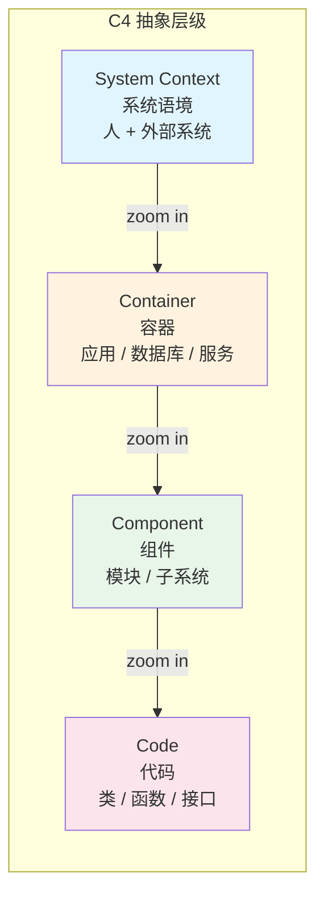
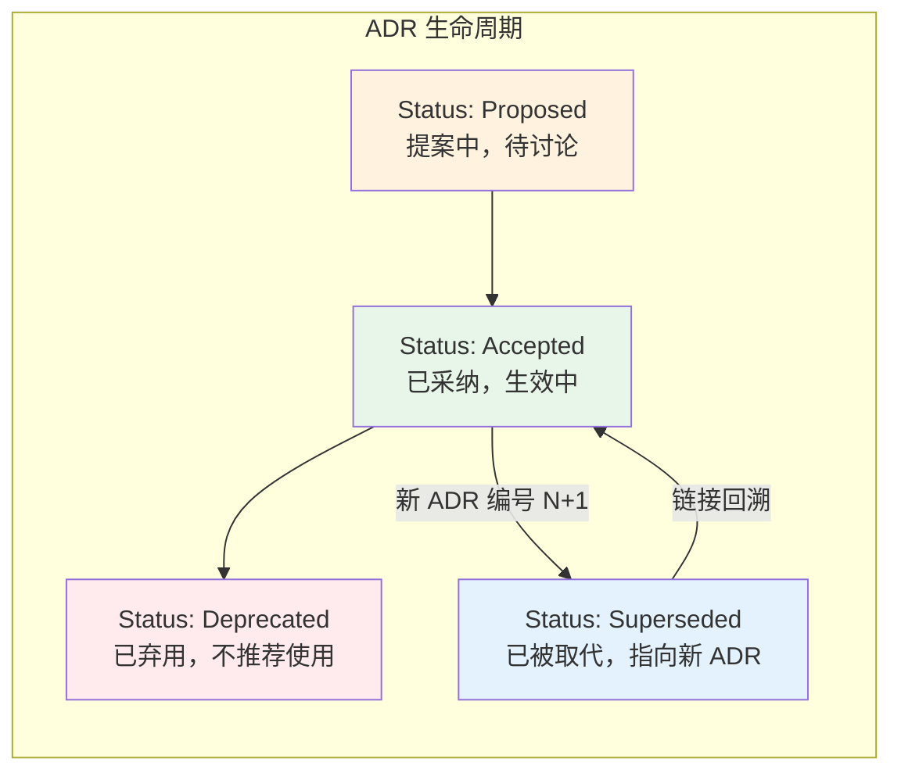

# 架构落地（C4 / ADR / 评审）

> 所属计划: 游戏架构设计
> 预计耗时: 75min
> 前置知识: [[01-architecture-overview|01 软件架构概述与质量属性]], [[02-architecture-styles|02 架构风格与范式]], [[03-coupling-cohesion-di|03 耦合、内聚与依赖管理]], [[04-solid-grasp-pragmatic|04 SOLID、GRASP 与务实原则]], [[05-domain-modeling|05 领域建模与战略设计]]

---

## 1. 概念讲解

### 为什么需要这个？

前五章我们学习了架构原则、设计模式、领域建模——但知识停留在脑海中时，团队无法对齐，三个月后自己也会遗忘。游戏项目尤其典型：引擎组、Gameplay 组、网络组、工具组各自演进，如果没有**可视化的架构图**、**可追踪的决策记录**和**可度量的健康指标**，系统会逐渐腐化为"大泥球"（Big Ball of Mud）。

更具体地说，游戏开发面临三类沟通断裂：

| 断裂场景 | 后果 | 本章解药 |
|---------|------|---------|
| 新成员问"我们的网络层怎么设计的？" | 口头解释 30 分钟，版本各异 | C4 图：一张 System Context 图 5 秒建立全局认知 |
| "为什么当初不用 Unity Netcode for Entities？" | 无人记得，重复争论 | ADR：决策上下文、权衡、后果永久存档 |
| "Gameplay 代码越来越慢，能重构吗？" | 拍脑袋决定，引入回归 | 架构评审 + 适应度函数：量化风险后再动手 |

---

### 核心思想

#### 一、C4 模型：四级抽象，一图一层级

Simon Brown 提出的 C4 模型将软件架构图分为四个抽象层级，每一级对应不同受众和不同细节密度：



| 层级 | 受众 | 内容 | 游戏引擎示例 |
|-----|------|------|-----------|
| **System Context** | 非技术人员、产品经理、投资人 | 系统与外部用户/系统的关系 | 玩家 → 游戏客户端 → 匹配服务 → 数据库 |
| **Container** | 技术负责人、架构师 | 可独立部署/运行的单元及其交互 | 渲染引擎、物理引擎、网络层、Gameplay 框架、资源管理器 |
| **Component** | 开发团队内部 | 容器内的模块划分 | 渲染容器内的：Command Buffer、Shader Compiler、Render Graph |
| **Code** | 具体实现者 | 类、接口、函数 | `RenderGraph::AddPass<T>()` 的 UML 类图 |

**关键原则：一图一抽象层级**。把数据库（Container 级）和某个 `MeshRenderer` 类（Code 级）画在同一张图里，会让读者认知过载——他们无法判断该关注全局结构还是实现细节。

**图即代码**（Diagrams as Code）是 C4 的现代实践。用文本描述图，版本控制、Diff 审查、自动化生成全部打通：

- **Structurizr**：Simon Brown 官方工具，DSL 描述 + 云端渲染
- **C4-PlantUML**：PlantUML 扩展，用 `System()`、`Container()`、`Rel()` 等宏绘制
- **Mermaid**：原生支持 `C4Context`/`C4Container` 等语法，GitHub/GitLab 直接渲染

---

#### 二、ADR：让架构决策可追踪、可审计

架构决策（Architecture Decision）是"改变成本高、影响范围广的技术选择"。游戏项目中典型 ADR 主题：

- 为何选择 ECS 而非传统 OOP 继承树（[[11-ecs-deep-dive]]）
- 网络同步用状态同步还是帧同步（[[27-networking-netcode]]）
- 资源加载用同步阻塞、异步回调还是 Job 系统（[[23-asset-management]], [[29-multithreading-job-system]]）

Michael Nygard 提出的 ADR 格式（后被 Martin Fowler 推广）包含五个核心部分：



| 字段 | 作用 | 示例 |
|-----|------|------|
| **Title** | 决策一句话描述 | "采用 ECS 作为核心运行时对象模型" |
| **Status** | 当前生命周期状态 | `Accepted` → 后被 `Superseded by ADR 0012` |
| **Context** | 必须做此决策的背景、约束、问题 | "OOP 继承树导致深度层级，缓存不友好；需要支持 10k+ 动态实体" |
| **Decision** | 明确的选择 | "使用 Unity DOTS/Entities 0.51+" |
| **Consequences** | 正面与负面后果，权衡清单 | "+ 缓存友好、并行化容易 / - 学习曲线陡峭、工具链不成熟" |
| **Alternatives** *(可选)* | 明确拒绝的选项及原因 | "拒绝传统继承树：缓存不友好；拒绝纯数据驱动 JSON：运行时开销大" |
| **Decision Drivers** *(可选)* | 影响决策的关键 forces | "性能 > 开发速度 > 团队熟悉度" |

**Superseded 机制是 ADR 的灵魂**。决策变更时，不写"修改旧 ADR"，而是新建 ADR 编号 N+1，将旧 ADR 状态改为 `Superseded by ADR N+1`。这样历史完整可追溯，避免"到底现在用哪个方案"的混乱。

文件命名规范：`NNNN-title-in-kebab-case.md`，如 `0001-adopt-ecs-for-runtime-object-model.md`。编号递增，永不复用（即使删除），保证引用稳定性。

---

#### 三、架构评审：从 ATAM 到轻量 Checklist

ATAM（Architecture Tradeoff Analysis Method）是 SEI 提出的系统化评审方法，核心关注三类点：

| 类型 | 定义 | 游戏示例 |
|-----|------|---------|
| **风险（Risk）** | 可能引发质量属性问题的决策 | "网络层直接调用渲染 API，未来跨平台移植困难" |
| **敏感点（Sensitivity Point）** | 对质量属性高度敏感的架构元素 | "ECS 的 Archetype Chunk 大小——影响缓存命中和内存碎片" |
| **权衡点（Tradeoff Point）** | 多个质量属性冲突的决策 | "GC 间隔 vs. 帧率稳定性：更长的 GC 间隔减少总开销，但增加单次卡顿" |

完整 ATAM 需要 2-3 天，游戏项目通常采用**轻量 checklist 评审**（30-60 分钟）：

```
□ 依赖方向是否符合架构约定？（如 Domain 不依赖 UnityEngine）
□ 是否存在跨层调用？（如 UI 直接操作数据库）
□ 新模块的入口/出口耦合数是否在阈值内？
□ 是否引入新的循环依赖？
□ 关键路径是否有适应度函数保护？
□ 性能敏感点是否有基准测试？
□ 文档：C4 图是否更新？ADR 是否补充？
```

---

#### 四、架构健康度量：从 vanity metrics 到 fitness functions

"代码行数增加了 20%"是虚荣指标（vanity metric），与架构健康无关。真正需要追踪的是：

| 指标 | 计算方式 | 健康阈值 | 工具 |
|-----|---------|---------|------|
| **依赖循环数** | 强连通分量检测 | 0（理想）或 < 3 | NetArchTest, NDepend |
| **入口/出口耦合（Afferent/Efferent Coupling）** | 依赖本模块的模块数 / 本模块依赖的外部模块数 | 依 Robert C. Martin 的不稳定性公式 I = Ce / (Ca + Ce) | 自定义脚本 |
| **抽象度与不稳定性** | A = 抽象类数 / 总类数；应落在主序列附近 | 距离主序列距离 D' < 0.5 | NetArchTest |
| **Cyclomatic Complexity** | 圈复杂度，决策路径数 | 方法级 < 10，类级 < 50 | SonarQube, IDE |
| **测试覆盖率** | 被测试覆盖的分支比例 | 核心业务逻辑 > 80% | Coverlet, ReportGenerator |
| **代码 Churn** | 某文件近期修改频率 | 稳定模块应低 Churn | git log 分析 |
| **架构适应度函数（Fitness Functions）** | 自动化验证架构约束的测试 | 全部通过 | NetArchTest, ArchUnit, 自定义 CI |

**架构适应度函数**是 Rebecca Parsons 和 Neal Ford 在《Building Evolutionary Architectures》中提出的核心概念：将架构约束编码为可自动执行的测试，放入 CI 流水线。例如：

- "任何 `Gameplay` 命名空间下的类，不得引用 `UnityEngine.Rendering`"
- "所有 `Domain` 项目中的类型，必须位于 `MyGame.Domain` 命名空间"
- "接口的抽象度必须 ≥ 0.5"

这些不是"建议"，而是**会阻断构建的硬约束**。架构从"靠人记"变成"靠机器守"。

---

## 2. 代码示例

### ADR 生成器：将决策记录落地为文件

以下 C# 控制台程序实现 Michael Nygard 格式的 ADR 自动生成。它扫描 `doc/adr/` 目录，自动分配递增编号，生成标准 Markdown 文件。

```csharp
using System;
using System.IO;
using System.Linq;
using System.Text.RegularExpressions;

// ============================================
// ADR 数据模型：承载一条架构决策记录的全部内容
// ============================================
public class AdrEntry(
    string title,
    string context,
    string decision,
    string consequences,
    string? alternatives = null,
    string? decisionDrivers = null)
{
    public string Title { get; } = title;
    public string Context { get; } = context;
    public string Decision { get; } = decision;
    public string Consequences { get; } = consequences;
    public string? Alternatives { get; } = alternatives;
    public string? DecisionDrivers { get; } = decisionDrivers;
}

// ============================================
// ADR 写入器：自动编号、Slug 生成、文件写入
// ============================================
public static class AdrWriter
{
    private const string AdrDir = "doc/adr";

    public static string Write(AdrEntry entry, string? baseDir = null)
    {
        var dir = baseDir ?? AdrDir;
        Directory.CreateDirectory(dir);

        // 自动分配递增编号：基于现有 .md 文件数量
        var existingFiles = Directory.GetFiles(dir, "*.md");
        var nextNumber = existingFiles.Length + 1;

        // 生成 kebab-case slug，去除特殊字符
        var slug = Slug(entry.Title);
        var fileName = $"{nextNumber:D4}-{slug}.md";
        var filePath = Path.Combine(dir, fileName);

        // 按 Nygard 模板组装 Markdown
        var content = $"""
            # {nextNumber:D4}. {entry.Title}

            ## Status

            Accepted

            ## Context

            {entry.Context}

            {FormatOptionalSection("Decision Drivers", entry.DecisionDrivers)}
            {FormatOptionalSection("Alternatives Considered", entry.Alternatives)}

            ## Decision

            {entry.Decision}

            ## Consequences

            {entry.Consequences}
            """;

        File.WriteAllText(filePath, content.Trim() + Environment.NewLine);
        Console.WriteLine($"[ADR] Generated: {filePath}");
        return filePath;
    }

    // 可选字段格式化：存在则输出章节，否则跳过
    private static string FormatOptionalSection(string heading, string? content)
    {
        if (string.IsNullOrWhiteSpace(content))
            return string.Empty;

        return $"""

            ## {heading}

            {content}
            """;
    }

    // 将标题转换为 URL 安全的 kebab-case slug
    private static string Slug(string input)
    {
        var lower = input.ToLowerInvariant();
        // 保留字母、数字、空格、连字符；其余替换为空格
        var cleaned = Regex.Replace(lower, @"[^a-z0-9\s-]", " ");
        // 合并多个空格/连字符为单个连字符
        var normalized = Regex.Replace(cleaned, @"[\s-]+", "-").Trim('-');
        return normalized;
    }
}

// ============================================
// 交互式控制台入口
// ============================================
class Program
{
    static void Main(string[] args)
    {
        Console.WriteLine("=== ADR Generator (Nygard Format) ===");
        Console.WriteLine();

        var title = Prompt("Title");
        var context = Prompt("Context (problem/background)");
        var decision = Prompt("Decision (what we will do)");
        var consequences = Prompt("Consequences (positive + negative)");

        // 可选字段：直接回车可跳过
        var alternatives = PromptOptional("Alternatives Considered (optional)");
        var drivers = PromptOptional("Decision Drivers (optional)");

        var entry = new AdrEntry(title, context, decision, consequences, alternatives, drivers);
        var path = AdrWriter.Write(entry);

        Console.WriteLine();
        Console.WriteLine($"Done. Open: {Path.GetFullPath(path)}");
    }

    static string Prompt(string label)
    {
        Console.Write($"{label}: ");
        var input = Console.ReadLine();
        return string.IsNullOrWhiteSpace(input) ? "(未填写)" : input.Trim();
    }

    static string? PromptOptional(string label)
    {
        Console.Write($"{label} [Enter to skip]: ");
        var input = Console.ReadLine();
        return string.IsNullOrWhiteSpace(input) ? null : input.Trim();
    }
}
```

**运行方式:**

```bash
# 创建 .NET 8 控制台项目
dotnet new console -n AdrGenerator -o AdrGenerator
cd AdrGenerator

# 将上述代码写入 Program.cs（替换默认内容）
# 然后运行
dotnet run
```

**预期输出:**

```text
=== ADR Generator (Nygard Format) ===

Title: Adopt ECS for Core Gameplay Runtime
Context: OOP inheritance hierarchy causes cache misses at 5k+ entities; need data-oriented layout for parallel processing
Decision: Use Unity DOTS Entities 1.0+ with Burst compiler and Job System
Consequences: + Cache-friendly memory layout, trivial parallelization / - Steep learning curve, immature tooling, longer compile times
Alternatives Considered (optional) [Enter to skip]: Traditional OOP with object pooling; rejected due to cache fragmentation
Decision Drivers (optional) [Enter to skip]: Performance > Development Velocity > Team Familiarity

[ADR] Generated: doc/adr/0001-adopt-ecs-for-core-gameplay-runtime.md
Done. Open: /path/to/project/AdrGenerator/doc/adr/0001-adopt-ecs-for-core-gameplay-runtime.md
```

生成的 `doc/adr/0001-adopt-ecs-for-core-gameplay-runtime.md` 内容：

```markdown
# 0001. Adopt ECS for Core Gameplay Runtime

## Status

Accepted

## Context

OOP inheritance hierarchy causes cache misses at 5k+ entities; need data-oriented layout for parallel processing

## Decision Drivers

Performance > Development Velocity > Team Familiarity

## Alternatives Considered

Traditional OOP with object pooling; rejected due to cache fragmentation

## Decision

Use Unity DOTS Entities 1.0+ with Burst compiler and Job System

## Consequences

+ Cache-friendly memory layout, trivial parallelization / - Steep learning curve, immature tooling, longer compile times
```

---

## 3. 练习

### 练习 1: 基础

在 ADR 生成器中添加 `Status` 枚举支持（`Proposed`, `Accepted`, `Deprecated`, `Superseded`），并允许在生成时选择。若状态为 `Superseded`，额外提示输入被取代的 ADR 编号，在正文中自动添加 `Superseded by ADR NNNN` 链接。

### 练习 2: 进阶

用 Mermaid 的 `C4Context` 语法或标准 `flowchart` 语法，绘制一个"多人在线游戏后端"的 System Context 图。必须包含：`Player`（人）、`Game Client`（外部系统）、`Game Server`（系统）、`Matchmaking Service`（系统）、`Database`（外部系统）、`Analytics Pipeline`（外部系统）。标注关系与数据流向。

### 练习 3: 挑战（可选）

使用 NetArchTest（NuGet: `NetArchTest.Rules`）或手写反射检查，验证以下架构规则并输出违规类型列表：

- `MyGame.Gameplay` 命名空间下的类型，不得引用 `MyGame.Rendering`
- `MyGame.Domain` 命名空间下的类型，不得引用 `UnityEngine` 任何子命名空间

---

## 3.5 参考答案

> [!tip]- 练习 1 参考答案
> 
> 扩展 `AdrEntry` 添加 `Status` 属性（枚举或字符串），并在 `AdrWriter.Write` 中处理：
> 
> ```csharp
> public enum AdrStatus { Proposed, Accepted, Deprecated, Superseded }
> 
> public class AdrEntry(
>     string title, string context, string decision, string consequences,
>     AdrStatus status = AdrStatus.Accepted,
>     int? supersededBy = null,
>     string? alternatives = null,
>     string? decisionDrivers = null)
> {
>     // ... 其他属性 ...
>     public AdrStatus Status { get; } = status;
>     public int? SupersededBy { get; } = supersededBy;
> }
> ```
> 
> 在 Markdown 模板中动态生成 Status 行：
> 
> ```csharp
> private static string FormatStatus(AdrEntry entry) => entry.Status switch
> {
>     AdrStatus.Superseded when entry.SupersededBy.HasValue
>         => $"Superseded by ADR {entry.SupersededBy.Value:D4}",
>     _ => entry.Status.ToString()
> };
> ```
> 
> 交互提示中，若用户选择 `Superseded`（如输入 4），则强制要求输入被取代的 ADR 编号，验证为有效整数后传入。`Status` 章节输出示例：
> 
> ```markdown
> ## Status
> 
> Superseded by ADR 0005
> ```
> 
> 完整实现需更新 `Program.Prompt` 为状态选择菜单，并添加 `SupersededBy` 的条件输入。

> [!tip]- 练习 2 参考答案
> 
> Mermaid `C4Context` 语法（部分平台支持）：
> 
> ````mermaid
> C4Context
>     title System Context for Multiplayer Online Game Backend
>     
>     Person(player, "Player", "游戏玩家")
>     System_Ext(client, "Game Client", "玩家设备上的游戏客户端")
>     System(gameServer, "Game Server", "处理实时游戏逻辑、状态同步")
>     System(matchmaking, "Matchmaking Service", "玩家匹配、房间管理、ELO 计算")
>     System_Ext(database, "Database", "玩家数据、持久化游戏状态")
>     System_Ext(analytics, "Analytics Pipeline", "实时/离线数据分析、BI 报表")
>     
>     Rel(player, client, "操作输入、接收画面")
>     Rel(client, gameServer, "游戏状态同步", "UDP + 可靠性层")
>     Rel(client, matchmaking, "请求匹配、加入房间", "HTTPS/WebSocket")
>     Rel(gameServer, database, "读写玩家进度、存档", "SQL/TCP")
>     Rel(gameServer, analytics, "上报游戏事件", "Kafka/gRPC")
>     Rel(matchmaking, database, "查询玩家等级、历史", "SQL")
>     Rel(matchmaking, gameServer, "分配房间、通知就绪", "gRPC")
> ````
> 
> 若平台不支持 `C4Context`，使用标准 `flowchart`：
> 
> ````mermaid
> flowchart TD
>     Player([Player<br/>游戏玩家])
>     Client[Game Client<br/>玩家设备]
>     Server[Game Server<br/>实时逻辑 + 同步]
>     Matchmaking[Matchmaking Service<br/>匹配 + 房间]
>     DB[(Database<br/>持久化数据)]
>     Analytics[Analytics Pipeline<br/>数据仓库]
>     
>     Player -->|"操作输入"| Client
>     Client -->|"状态同步<br/>UDP+可靠层"| Server
>     Client -->|"请求匹配<br/>HTTPS/WS"| Matchmaking
>     Server -->|"读写存档"| DB
>     Server -->|"游戏事件"| Analytics
>     Matchmaking -->|"查询等级"| DB
>     Matchmaking -->|"分配房间"| Server
>     
>     style Player fill:#e1f5fe
>     style Client fill:#ffebee
>     style DB fill:#e8f5e9
>     style Analytics fill:#e8f5e9
> ````
> 
> 关键检查点：只画系统级方块，不暴露 Game Server 内部的 ECS、网络层、物理模块等（那些属于 Container 图）。

> [!tip]- 练习 3 参考答案
> 
> **方案 A：手写反射检查（无外部依赖）**
> 
> ```csharp
> using System;
> using System.Linq;
> using System.Reflection;
> 
> class ArchitectureRules
> {
>     static void Main()
>     {
>         var assembly = Assembly.Load("MyGame"); // 或 Assembly.GetExecutingAssembly()
>         var allTypes = assembly.GetTypes();
>         
>         // 规则 1: Gameplay 不引用 Rendering
>         var gameplayTypes = allTypes.Where(t => t.Namespace?.StartsWith("MyGame.Gameplay") == true);
>         var gameplayViolations = gameplayTypes.Where(t => 
>             t.GetReferencedNamespaces().Any(ns => ns.StartsWith("MyGame.Rendering"))
>         );
>         
>         // 规则 2: Domain 不引用 UnityEngine
>         var domainTypes = allTypes.Where(t => t.Namespace?.StartsWith("MyGame.Domain") == true);
>         var domainViolations = domainTypes.Where(t =>
>             t.GetReferencedNamespaces().Any(ns => ns.StartsWith("UnityEngine"))
>         );
>         
>         Report("Gameplay → Rendering", gameplayViolations);
>         Report("Domain → UnityEngine", domainViolations);
>     }
>     
>     static void Report(string rule, IEnumerable<Type> violations)
>     {
>         Console.WriteLine($"\n=== Rule: {rule} ===");
>         var list = violations.ToList();
>         if (!list.Any()) { Console.WriteLine("PASS"); return; }
>         foreach (var v in list) Console.WriteLine($"VIOLATION: {v.FullName}");
>     }
> }
> 
> static class TypeExtensions
> {
>     public static IEnumerable<string> GetReferencedNamespaces(this Type type)
>     {
>         // 检查字段类型、方法参数、基类、接口、属性等
>         var refs = new HashSet<string>();
>         
>         foreach (var f in type.GetFields(BindingFlags.Public | BindingFlags.NonPublic | BindingFlags.Instance | BindingFlags.Static))
>             if (f.FieldType.Namespace != null) refs.Add(f.FieldType.Namespace);
>         
>         foreach (var m in type.GetMethods(BindingFlags.Public | BindingFlags.NonPublic | BindingFlags.Instance | BindingFlags.Static))
>         {
>             if (m.ReturnType.Namespace != null) refs.Add(m.ReturnType.Namespace);
>             foreach (var p in m.GetParameters())
>                 if (p.ParameterType.Namespace != null) refs.Add(p.ParameterType.Namespace);
>         }
>         
>         if (type.BaseType?.Namespace != null) refs.Add(type.BaseType.Namespace);
>         foreach (var i in type.GetInterfaces()) if (i.Namespace != null) refs.Add(i.Namespace);
>         
>         return refs;
>     }
> }
> ```
> 
> **方案 B：NetArchTest（推荐，更精确）**
> 
> ```csharp
> using NetArchTest.Rules;
> using System;
> using System.Linq;
> 
> class NetArchTestRules
> {
>     static void Main()
>     {
>         // 规则 1: Gameplay 命名空间不得依赖 Rendering
>         var result1 = Types.InCurrentDomain()
>             .That().ResideInNamespace("MyGame.Gameplay.*")
>             .Should().NotDependOnAny(Types.InCurrentDomain()
>                 .That().ResideInNamespace("MyGame.Rendering.*"))
>             .GetResult();
>         
>         // 规则 2: Domain 不得依赖 UnityEngine
>         var result2 = Types.InCurrentDomain()
>             .That().ResideInNamespace("MyGame.Domain.*")
>             .Should().NotDependOnAny(Types.InCurrentDomain()
>                 .That().ResideInNamespace("UnityEngine.*"))
>             .GetResult();
>         
>         Report("Gameplay → Rendering", result1);
>         Report("Domain → UnityEngine", result2);
>     }
>     
>     static void Report(string rule, TestResult result)
>     {
>         Console.WriteLine($"\n=== Rule: {rule} ===");
>         if (result.IsSuccessful) { Console.WriteLine("PASS"); return; }
>         
>         var failingTypes = result.FailingTypes;
>         foreach (var t in failingTypes ?? Enumerable.Empty<Type>())
>             Console.WriteLine($"VIOLATION: {t.FullName}");
>     }
> }
> ```
> 
> NetArchTest 的优势：自动处理间接依赖（通过参数、泛型约束、属性类型等），支持 fluent 组合复杂规则，可直接集成到 xUnit/NUnit 测试框架作为适应度函数。

> [!note] 答案使用方式
> 如果你的实现通过了测试或达到了题目要求，就是正确的。参考答案展示的是完整实现路径，但你的解法可能有不同的设计选择——重点验证：练习 1 的 Status 枚举和 Superseded 链接是否正确生成；练习 2 的图是否只包含 System Context 层级元素；练习 3 是否能准确捕获违规类型并输出诊断信息。
>
> ---

## 4. 扩展阅读

- Simon Brown, C4 model 官方网站：https://c4model.com/ —— System Context / Container / Component / Code 四级抽象与图示方法，含 Structurizr DSL 文档和示例库。
- Martin Fowler, "Architecture Decision Record"：https://martinfowler.com/bliki/ArchitectureDecisionRecord.html —— ADR 格式、状态流转、存放位置与团队使用实践。
- Michael Nygard, "Documenting Architecture Decisions"（原始 ADR 文章）：https://cognitect.com/blog/2011/11/15/documenting-architecture-decisions —— ADR 起源、Nygard 模板与"决策即文档"理念。
- C4-PlantUML GitHub：https://github.com/plantuml-stdlib/C4-PlantUML —— 用 PlantUML 宏绘制 C4 图的官方库，支持所有层级和布局变体。
- Neal Ford et al., *Building Evolutionary Architectures* —— 架构适应度函数（Fitness Functions）的系统性阐述，O'Reilly 出版。
- NetArchTest GitHub：https://github.com/BenMorris/NetArchTest —— .NET 架构规则测试库，支持命名空间、继承、依赖方向等 fluent 规则组合。

---

## 常见陷阱

- **一张图里混用多个 C4 层级**。例如把"数据库"（Container 级）、"`RenderPass` 类"（Code 级）、"玩家"（System Context 级）堆在同一幅图。正确做法：严格分层，每幅图标题明确标注层级，用颜色或图例区分元素类型；需要跨层级关联时，使用"导航链接"（如 Container 图中的某个方块标注"详见 Component 图 #3"）。

- **ADR 写完即弃，不随决策变更而更新**。团队采纳 ADR 后，当技术选型变化（如从帧同步改为状态同步），直接在旧文件上修改，导致历史决策不可追溯。正确做法：新建 ADR 编号 N+1 记录新决策，将旧 ADR 状态改为 `Superseded by ADR N+1`，并在新 ADR 的 Context 中引用旧 ADR 说明变更背景。

- **度量指标沦为 vanity metrics**。团队追踪"代码行数""类文件数量"等易于获取但与架构健康无关的数字，产生虚假安全感。正确做法：聚焦可行动的架构指标——依赖循环数必须为零、入口耦合过高的模块需立即重构、适应度函数失败阻断 CI；将 NetArchTest 或 ArchUnit 集成到每日构建，让架构约束可自动验证。