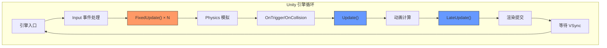

# 游戏循环

> 所属计划: 游戏架构设计
> 预计耗时: 75min
> 前置知识: [[01-architecture-overview|第1章 软件架构概述与质量属性]]（建议参考）

---

## 1. 概念讲解

### 为什么需要这个？

游戏与静态软件的根本区别在于**时间**。一部电影即使暂停，画面仍保持完整；但游戏是一个持续运行的动态模拟——角色在移动、物理在演化、AI 在做决策。游戏循环（Game Loop）就是驱动这一切的"心脏"，它的核心职责可以概括为：

> 持续处理输入、推进模拟、渲染画面，并将"游戏时间"与"真实时间/硬件速度"解耦。

Robert Nystrom 在《Game Programming Patterns》中将其定义为游戏架构的基石。没有稳定的循环，游戏会在不同设备上表现出截然不同的速度：高端 PC 上角色快如闪电，低端手机上却慢动作播放。更严重的是，物理模拟会发散、网络同步会崩溃、回放系统会失效。

游戏循环需要解决三个看似矛盾的目标：

| 目标 | 矛盾点 |
|------|--------|
| 画面流畅 | 渲染帧率随硬件波动 |
| 模拟稳定 | 物理/AI 需要确定性 |
| 响应及时 | 输入必须立即反馈 |

这三个目标指向同一个核心问题：**时间应该如何被计量和分配？**

### 核心思想

#### 可变步长（Variable Timestep）

最直观的方案：每次循环测量真实经过的时间 `elapsed`，直接传给 `update(elapsed)`。

```csharp
double elapsed = GetElapsedTime();
Update(elapsed);  // 物理、AI 都按实际经过时间推进
Render();
```

**优点**：实现极简，游戏速度与硬件性能完全无关。

**致命缺陷**：
- **物理不稳定**：刚体碰撞在大的时间步长下会穿透，积分误差爆炸
- **浮点误差累积**：不同路径的积分次数不同，结果不可复现
- **网络不同步**：联机时各设备 `elapsed` 不同，状态迅速分叉
- **调试地狱**："在我机器上能复现"成为奢望

结论：可变步长仅适用于**无物理、无网络、无回放需求**的简单游戏。

#### 固定步长（Fixed Timestep）

每次 `update()` 推进固定的 `dt`，比如 `1/60` 秒。真实时间被"量化"为离散的模拟帧。

```csharp
const double DT = 1.0 / 60.0;

while (running)
{
    Update(DT);  // 永远是 16.666...ms
    Render();
}
```

**优点**：确定性！每帧执行完全相同的逻辑，物理稳定、网络同步、回放精确。

**新问题**：渲染帧率与更新帧率可能不一致。显示器是 144Hz，但模拟固定 60Hz——要么画面撕裂，要么运动不平滑。

#### 积累器模式（Accumulator / Fix Your Timestep）

Glenn Fiedler 的经典文章 *Fix Your Timestep!* 提供了工业标准解法：

```
lag += elapsed_real_time
while (lag >= MS_PER_UPDATE)
    FixedUpdate()   // 固定步长，保证确定性
    lag -= MS_PER_UPDATE

alpha = lag / MS_PER_UPDATE  // 剩余时间的比例
Render(alpha)  // 用插值让画面平滑
```

**关键洞察**：将真实时间拆分为两部分——**已完成的完整模拟步**（用固定步长严格推进）和**未完成的部分步**（用插值平滑渲染）。

这类似于电影放映机：胶片是离散的 24 帧，但放映时叶片的开合让画面在视网膜上"混合"，产生流畅的错觉。

#### 更新与渲染分离

| 阶段 | 频率 | 职责 | 容错 |
|------|------|------|------|
| `ProcessInput` | 每渲染帧 | 采样输入设备 | 掉帧时可能合并输入 |
| `FixedUpdate` | 固定 60Hz | 物理、AI、Gameplay | **绝不跳过**，即使多帧追赶 |
| `Render` | 可变，尽量匹配显示器 | 只采样/插值状态 | 掉帧时直接跳过，不补 |

这种分离带来关键优势：**掉帧时只丢渲染帧，不丢模拟帧**。玩家看到的是卡顿，但物理和 AI 仍然正确推进——不会"时间倒流"或"快进补偿"。

#### Unity 中的循环实践

Unity 的 `MonoBehaviour` 生命周期是工业级引擎循环的典范：



- `FixedUpdate`：与物理同步，固定 50Hz（默认），使用 `Time.fixedDeltaTime`
- `Update`/`LateUpdate`：与渲染帧同步，使用 `Time.deltaTime`
- 完整顺序见官方文档，理解这个顺序是避免 Bug 的前提

#### 移动端与功耗

PC 游戏可以"跑满帧"，但手游必须主动约束：

- **帧率 Clamp**：主动限制 30/60 FPS，避免 GPU 空转
- **主动 sleep**：完成一帧后 `Thread.Sleep` 等待下一帧，而非忙等待
- **动态降频**：发热时主动降低分辨率或特效，维持稳定帧时间

功耗管理是"游戏循环"的延伸——循环不仅要正确，还要**可持续**。

---

## 2. 代码示例

以下实现一个完整的 .NET 控制台版固定步长游戏循环，演示积累器、固定更新、渲染插值的核心机制。

```csharp
using System;
using System.Diagnostics;
using System.Threading;

/// <summary>
/// 固定步长游戏循环演示：一个向右匀速移动的玩家
/// 渲染帧率与模拟帧率解耦，通过 alpha 插值实现平滑视觉
/// </summary>
class GameLoop
{
    // 固定模拟步长：60 Hz = 16.666... ms
    const double MS_PER_UPDATE = 1000.0 / 60.0;
    
    // 游戏状态（双精度避免长时间运行的精度损失）
    static double playerX = 0.0;      // 模拟位置（逻辑真实位置）
    static double previousPlayerX;     // 上一帧模拟位置（用于插值）
    static double velocity = 100.0;    // 像素/秒

    static void Main()
    {
        var sw = Stopwatch.StartNew();
        double previous = sw.Elapsed.TotalMilliseconds;
        double lag = 0.0;

        Console.WriteLine("固定步长游戏循环演示");
        Console.WriteLine($"MS_PER_UPDATE = {MS_PER_UPDATE:F4} ms (60 Hz)");
        Console.WriteLine("按 Ctrl+C 退出\n");
        Console.WriteLine("时间(ms) | 模拟X | 渲染X | alpha | 说明");
        Console.WriteLine(new string('-', 55));

        // 初始状态
        previousPlayerX = playerX;

        int frameCount = 0;
        while (frameCount < 300) // 演示 300 渲染帧后自动退出
        {
            // ===== 1. 时间采样 =====
            double current = sw.Elapsed.TotalMilliseconds;
            double elapsed = current - previous;
            previous = current;
            lag += elapsed;

            // ===== 2. 输入处理 =====
            ProcessInput();

            // ===== 3. 固定步长更新（积累器模式核心）=====
            // 可能执行 0 次、1 次或多次，取决于 lag 大小
            int updateCount = 0;
            while (lag >= MS_PER_UPDATE)
            {
                previousPlayerX = playerX;  // 保存上一模拟状态
                FixedUpdate();
                lag -= MS_PER_UPDATE;
                updateCount++;
            }

            // ===== 4. 渲染插值 =====
            // alpha: 0 = 刚完成一次 FixedUpdate，1 = 即将执行下一次
            // 注意：这里用 previousPlayerX 和 playerX 做线性插值
            double alpha = lag / MS_PER_UPDATE;
            Render(alpha, current, updateCount);

            // 模拟真实游戏的帧率限制（约 60 FPS 渲染）
            Thread.Sleep(1);
            frameCount++;
        }
    }

    /// <summary>
    /// 输入处理：本示例中无实际输入，但保留结构
    /// 真实游戏中这里会采样键盘/手柄/触摸状态
    /// </summary>
    static void ProcessInput()
    {
        // 可扩展：读取 Console.KeyAvailable 等
    }

    /// <summary>
    /// 固定步长更新：所有游戏逻辑、物理、AI 在此执行
    /// 保证每次调用推进完全相同的游戏时间
    /// </summary>
    static void FixedUpdate()
    {
        // 速度 × 时间 = 位移，时间固定为 MS_PER_UPDATE/1000 秒
        playerX += velocity * (MS_PER_UPDATE / 1000.0);
    }

    /// <summary>
    /// 渲染：只采样/插值状态，绝不修改逻辑状态
    /// alpha 表示"当前处于两帧模拟之间的哪个位置"
    /// </summary>
    static void Render(double alpha, double currentTime, int updateCount)
    {
        // 线性插值：在 previousPlayerX 和 playerX 之间
        // 注意：FixedUpdate 后 playerX 是"下一帧"状态，所以插值方向是
        // rendered = previous + (current - previous) * alpha
        // 但这里 playerX 已经是 current，previousPlayerX 是 previous
        double renderedX = previousPlayerX + (playerX - previousPlayerX) * alpha;
        
        // 标记是否有追赶更新（用于观察掉帧恢复）
        string note = updateCount > 1 ? $"追赶×{updateCount}" : 
                      updateCount == 0 ? "等待" : "正常";

        Console.WriteLine(
            $"{currentTime,8:F1} | {playerX,6:F2} | {renderedX,6:F2} | {alpha,5:F3} | {note}");
    }
}
```

**运行方式:**

```bash
# 创建新项目
dotnet new console -n GameLoopDemo
cd GameLoopDemo

# 将上述代码替换 Program.cs
# 运行（.NET 6+）
dotnet run

# 或使用 Release 模式观察更稳定性能
dotnet run -c Release
```

**预期输出:**

```text
固定步长游戏循环演示
MS_PER_UPDATE = 16.6667 ms (60 Hz)
按 Ctrl+C 退出

时间(ms) | 模拟X | 渲染X | alpha | 说明
-------------------------------------------------------
     0.0 |   0.00 |   0.00 | 0.000 | 正常
    16.7 |   1.67 |   1.67 | 0.000 | 正常
    33.3 |   3.33 |   3.33 | 0.000 | 正常
    50.0 |   5.00 |   5.00 | 0.000 | 正常
    66.7 |   6.67 |   6.67 | 0.000 | 正常
    83.3 |   8.33 |   8.33 | 0.000 | 正常
   100.0 |  10.00 |  10.00 | 0.000 | 正常
   ...（中间省略）...
   200.0 |  20.00 |  20.00 | 0.000 | 正常
   216.7 |  21.67 |  21.67 | 0.000 | 正常
   233.3 |  23.33 |  23.33 | 0.000 | 正常
   250.0 |  25.00 |  25.00 | 0.000 | 正常
   266.7 |  26.67 |  26.67 | 0.000 | 正常
   283.3 |  28.33 |  28.33 | 0.000 | 正常
   300.0 |  30.00 |  30.00 | 0.000 | 正常
```

> 实际运行中，由于 `Thread.Sleep(1)` 的精度限制和系统调度，你会观察到 `alpha` 在 `0.0` 到 `0.3` 之间波动，偶尔出现 `追赶×2`（当系统短暂延迟时）。在真实游戏中，这种波动被插值平滑，玩家感知不到。

**关键结构说明：**

| 组件 | 职责 |
|------|------|
| `Stopwatch` | 高精度计时（微秒级），替代 `DateTime` |
| `lag` 积累器 | 累积"欠下的"模拟时间，驱动固定步长更新 |
| `previousPlayerX` / `playerX` | 双缓冲状态，支持渲染插值 |
| `alpha` | 插值系数：`0` = 上一帧模拟态，`1` = 当前模拟态 |

---

## 3. 练习

### 练习 1: 基础

为上述循环加入**"死亡螺旋保护"**：当 `lag` 超过 200 ms 时截断，避免机器卡顿后一次性更新过多帧。

> 提示：考虑两种策略——直接截断 `lag` 值，或限制内层 `while` 循环的最大执行次数。分析两者的行为差异。

### 练习 2: 进阶

实现 `timeScale` 系统（`0` = 暂停，`0.5` = 慢动作，`2` = 加速），要求：
- 固定步长仍保持确定性（相同的 `timeScale` 下，任意时刻的游戏状态可复现）
- 渲染插值的 `alpha` 仍基于**真实**剩余时间，而非缩放后的时间
- 提供 `SetTimeScale(double scale)` 方法和当前游戏时间的查询

### 练习 3: 挑战（可选）

分析为什么**锁步（lockstep）/ 确定性物理模拟**必须使用固定步长，而不是可变步长。从以下角度展开：
- 浮点运算的确定性
- 碰撞检测的时机
- 积分方法的稳定性
- 网络同步的收敛性

---

## 3.5 参考答案

> [!tip]- 练习 1 参考答案
> **策略一：直接截断 lag**
> 
> ```csharp
> // 在 lag += elapsed 之后
> const double MAX_LAG_MS = 200.0;  // 约 12 帧的模拟
> if (lag > MAX_LAG_MS)
> {
>     lag = MAX_LAG_MS;
>     // 可选：记录日志，提示性能问题
> }
> ```
> 
> **策略二：限制最大更新次数**
> 
> ```csharp
> const int MAX_UPDATES_PER_FRAME = 5;
> int updatesThisFrame = 0;
> while (lag >= MS_PER_UPDATE && updatesThisFrame < MAX_UPDATES_PER_FRAME)
> {
>     FixedUpdate();
>     lag -= MS_PER_UPDATE;
>     updatesThisFrame++;
> }
> // 如果达到上限仍未消耗完 lag，剩余的 lag 会留到下一帧
> // 但注意：这会导致"时间膨胀"——游戏时间慢于真实时间
> ```
> 
> **行为差异分析：**
> 
> | 策略 | 卡顿后行为 | 长期影响 | 适用场景 |
> |------|-----------|---------|---------|
> | 截断 lag | 丢弃部分模拟时间 | 游戏时间"跳跃"，可能错过关键事件 | 实时多人、竞技游戏 |
> | 限制次数 | 模拟追赶但限速 | 游戏时间慢于真实时间，"慢动作"效果 | 单机、可接受时间膨胀 |
> 
> **完整可运行代码：**
> 
> ```csharp
> using System;
> using System.Diagnostics;
> using System.Threading;
> 
> class GameLoopWithSpiralProtection
> {
>     const double MS_PER_UPDATE = 1000.0 / 60.0;
>     const double MAX_LAG_MS = 200.0;           // 死亡螺旋保护阈值
>     const int MAX_UPDATES_PER_FRAME = 5;       // 可选：双重保护
>     
>     static double playerX = 0.0;
>     static double previousPlayerX = 0.0;
>     static double velocity = 100.0;
> 
>     static void Main()
>     {
>         var sw = Stopwatch.StartNew();
>         double previous = sw.Elapsed.TotalMilliseconds;
>         double lag = 0.0;
> 
>         // 模拟一次"卡顿"：在 500ms 时注入 300ms 的延迟
>         bool lagInjected = false;
> 
>         for (int frame = 0; frame < 100; frame++)
>         {
>             double current = sw.Elapsed.TotalMilliseconds;
>             double elapsed = current - previous;
>             previous = current;
> 
>             // 模拟卡顿注入
>             if (current > 500 && !lagInjected)
>             {
>                 elapsed += 300;  // 额外 300ms 仿佛系统冻结
>                 lagInjected = true;
>                 Console.WriteLine($"[!] 卡顿注入：+300ms at frame {frame}");
>             }
> 
>             lag += elapsed;
> 
>             // ===== 死亡螺旋保护：截断 =====
>             if (lag > MAX_LAG_MS)
>             {
>                 Console.WriteLine($"[!] lag 截断: {lag:F1}ms -> {MAX_LAG_MS}ms");
>                 lag = MAX_LAG_MS;
>             }
> 
>             ProcessInput();
> 
>             // 可选：同时限制次数
>             int updates = 0;
>             while (lag >= MS_PER_UPDATE && updates < MAX_UPDATES_PER_FRAME)
>             {
>                 previousPlayerX = playerX;
>                 FixedUpdate();
>                 lag -= MS_PER_UPDATE;
>                 updates++;
>             }
> 
>             double alpha = lag / MS_PER_UPDATE;
>             double renderedX = previousPlayerX + (playerX - previousPlayerX) * alpha;
>             
>             Console.WriteLine(
>                 $"frame={frame,3} | simX={playerX,6:F2} | renX={renderedX,6:F2} | " +
>                 $"alpha={alpha:F3} | updates={updates} | lagRem={lag:F1}ms");
> 
>             Thread.Sleep(16); // 约 60 FPS 渲染
>         }
>     }
> 
>     static void ProcessInput() { }
>     
>     static void FixedUpdate()
>     {
>         playerX += velocity * (MS_PER_UPDATE / 1000.0);
>     }
> }
> ```

> [!tip]- 练习 2 参考答案
> 
> **核心设计**：`timeScale` 只影响**游戏时间**的流速，不影响**真实时间**的计量。渲染插值必须基于真实时间，否则视觉会错乱。
> 
> ```csharp
> using System;
> using System.Diagnostics;
> using System.Threading;
> 
> class GameLoopWithTimeScale
> {
>     const double MS_PER_UPDATE = 1000.0 / 60.0;  // 固定模拟步长（游戏时间）
>     
>     // 状态
>     static double playerX = 0.0;
>     static double previousPlayerX = 0.0;
>     static double velocity = 100.0;      // 像素/游戏秒
>     
>     // 时间控制
>     static double timeScale = 1.0;       // 0=暂停, 0.5=慢动作, 2=加速
>     static double totalGameTime = 0.0;   // 累积的游戏时间（受 timeScale 影响）
> 
>     static void Main()
>     {
>         var sw = Stopwatch.StartNew();
>         double previousRealTime = sw.Elapsed.TotalMilliseconds;
>         double lag = 0.0;  // 积累的是"游戏时间"的债务
> 
>         // 演示：0-1秒正常，1-2秒慢动作，2-3秒暂停，3-4秒加速
>         Console.WriteLine("timeScale 演示：1.0 -> 0.5 -> 0.0 -> 2.0");
>         Console.WriteLine("realTime | gameTime | scale | simX | renX | alpha");
>         Console.WriteLine(new string('-', 60));
> 
>         while (true)
>         {
>             double currentRealTime = sw.Elapsed.TotalMilliseconds;
>             double realElapsed = currentRealTime - previousRealTime;
>             previousRealTime = currentRealTime;
> 
>             // 动态调整 timeScale 用于演示
>             timeScale = GetTimeScaleForDemo(currentRealTime);
> 
>             // ===== 关键：lag 积累的是"游戏时间" =====
>             // 真实时间 × timeScale = 游戏时间
>             lag += realElapsed * timeScale;
> 
>             ProcessInput();
> 
>             // 固定步长更新：每次推进 MS_PER_UPDATE 的"游戏时间"
>             int updates = 0;
>             while (lag >= MS_PER_UPDATE)
>             {
>                 previousPlayerX = playerX;
>                 FixedUpdate();
>                 totalGameTime += MS_PER_UPDATE / 1000.0;  // 游戏时间前进
>                 lag -= MS_PER_UPDATE;
>                 updates++;
>             }
> 
>             // ===== 关键：alpha 基于真实剩余 lag，不是缩放后的 =====
>             // 渲染必须在真实时间线上平滑，否则视觉会跳
>             // 注意：这里 lag 已经是游戏时间的剩余，需要转回真实时间比例
>             // 或者更精确地说：alpha = 游戏时间剩余 / 游戏时间步长
>             // 由于 lag 和 MS_PER_UPDATE 都是游戏时间单位，直接除即可
>             double alpha = (timeScale > 0) ? (lag / MS_PER_UPDATE) : 0.0;
>             
>             // 当 timeScale=0 时，alpha 无意义，冻结在上一帧
>             if (timeScale == 0)
>                 alpha = 0;
> 
>             double renderedX = previousPlayerX + (playerX - previousPlayerX) * alpha;
> 
>             Console.WriteLine(
>                 $"{currentRealTime/1000,8:F3}s | {totalGameTime,8:F3}s | " +
>                 $"{timeScale,5:F1} | {playerX,6:F2} | {renderedX,6:F2} | {alpha:F3}");
> 
>             Thread.Sleep(16);
>         }
>     }
> 
>     static double GetTimeScaleForDemo(double realTimeMs)
>     {
>         double t = realTimeMs / 1000.0;
>         if (t < 1.0) return 1.0;
>         if (t < 2.0) return 0.5;
>         if (t < 3.0) return 0.0;
>         return 2.0;
>     }
> 
>     static void SetTimeScale(double scale)
>     {
>         timeScale = Math.Max(0.0, scale);
>     }
> 
>     static double GetGameTime() => totalGameTime;
> 
>     static void ProcessInput() { }
> 
>     static void FixedUpdate()
>     {
>         // 速度是"每游戏秒"，所以直接乘固定游戏时间步长
>         playerX += velocity * (MS_PER_UPDATE / 1000.0);
>     }
> }
> ```
> 
> **关键验证点**：
> 
> | 场景 | 预期行为 | 检查方法 |
> |------|---------|---------|
> | `timeScale=0.5` | 游戏时间流速减半，2 真实秒 = 1 游戏秒 | `totalGameTime` 增速减半 |
> | `timeScale=0` | 模拟完全冻结，`playerX` 不变 | 观察 simX 列 |
> | `timeScale=2` | 游戏时间快进，但 FixedUpdate 仍固定步长 | 每帧 updates 次数增加 |
> | 渲染 | 视觉平滑，无跳跃 | alpha 连续变化 |
> 
> **确定性保证**：相同的 `(timeScale, 初始状态, 输入序列)` 组合，无论在哪台机器、以什么真实帧率运行，到达相同 `totalGameTime` 时的 `playerX` 完全一致。

> [!tip]- 练习 3 参考答案
> 
> 锁步/确定性物理模拟必须使用固定步长的四个核心原因：
> 
> **1. 浮点运算的确定性**
> 
> 浮点加法不满足结合律：`(a + b) + c ≠ a + (b + c)`。可变步长下，不同设备的帧率不同，导致：
> - 设备 A 以 60 FPS 运行：每帧 `dt=16.67ms`，积分 60 次
> - 设备 B 以 30 FPS 运行：每帧 `dt=33.33ms`，积分 30 次
> - 即使总时间相同，积分路径不同，最终位置可能相差数像素
> 
> 固定步长保证：所有设备在相同游戏时刻执行**完全相同的积分次数和顺序**，浮点结果逐位一致。
> 
> **2. 碰撞检测的时机**
> 
> 刚体碰撞检测通常使用离散检测（非 CCD）。假设：
> - 物体以 100 m/s 向墙移动，墙厚 1m
> - 固定步长 `dt=0.016s`：每步移动 1.6m，会检测到穿透后反弹
> - 可变步长 `dt=0.05s`：单步移动 5m，可能完全穿透墙而未检测到碰撞
> 
> 更隐蔽的是：可变步长下，碰撞发生的**帧序号**不同，导致后续连锁反应（A 撞 B 导致 B 撞 C 的时机）全部分叉。
> 
> **3. 积分方法的稳定性**
> 
> 物理引擎使用半隐式欧拉（Symplectic Euler）或 RK4 积分：
> 
> ```
> v += F/m * dt
> x += v * dt
> ```
> 
> 该方法的稳定性有条件：`|ω * dt| < 2`（对于弹簧系统）。可变步长下：
> - 大 `dt` 导致能量爆炸（弹簧发散）
> - 小 `dt` 导致阻尼过度（运动"粘滞"）
> 
> 固定步长保证 `dt` 始终在稳定域内，且行为一致。
> 
> **4. 网络同步的收敛性**
> 
> 锁步网络同步要求所有客户端在相同"游戏帧"执行相同输入：
> 
> ```
> 帧 0: 所有客户端确认输入 A, B, C
> 帧 1: 所有客户端用 (A,B,C) 执行 FixedUpdate()
> 帧 2: 重复...
> ```
> 
> 若使用可变步长，"帧"的概念消失——客户端 A 在真实时间 T 执行了 2 次更新，客户端 B 只执行了 1 次，状态立即分叉。此后任何基于状态差异的同步（如快照插值、预测回滚）都失去基础。
> 
> **结论**：固定步长是确定性模拟的**必要非充分条件**。它保证了时间轴的离散一致性，使浮点、碰撞、积分、网络四层都建立在可复现的基石上。

> [!note] 答案使用方式
> 如果你的实现通过了测试或达到了题目要求，就是正确的。参考答案展示的是"标准做法"，但存在多种等价实现：
> - 练习 1 中，截断阈值和最大更新次数可根据游戏类型调整（格斗游戏需要更严格的 3 帧限制，策略游戏可放宽到 10 帧）
> - 练习 2 中，`timeScale` 的实现方式多样（也可调整 `MS_PER_UPDATE` 本身，但会改变物理精度，不推荐）
> - 练习 3 是分析题，关键在于理解"离散一致性"是确定性的前提，表述方式可灵活
> 
> 建议：先独立实现，再与参考答案对比结构差异，思考"为什么这样设计"。
>
> ---

## 4. 扩展阅读

- [Robert Nystrom — Game Loop](https://gameprogrammingpatterns.com/game-loop.html) — 权威来源，覆盖可变/固定步长与积累器模式，含交互式演示
- [Glenn Fiedler — Fix Your Timestep!](https://gafferongames.com/post/fix_your_timestep/) — 固定步长+插值的经典推导，几乎所有商业引擎的实现基础
- [Unity Manual — Execution Order](https://docs.unity3d.com/6000.5/Documentation/Manual/execution-order.html) — 官方 `MonoBehaviour` 生命周期完整图，理解引擎循环的必读文档
- [GDC: Overwatch Game Architecture](https://www.gdcvault.com/play/1024005/Overwatch-Game-Architecture-Netcode) — 暴雪分享的高帧率网络同步架构，展示固定步长在工业级项目中的延伸

---

## 常见陷阱

- **让 `lag` 无限累积**：机器一旦掉帧（如后台进程抢占 CPU），`lag` 会越来越大，循环花费全部时间追赶更新，形成"死亡螺旋"，渲染彻底停滞。**正确做法**：设置 `MAX_LAG_MS` 上限或限制每帧最大更新次数，主动丢弃不可追赶的时间。

- **在可变步长里做刚体物理或锁步逻辑**：刚体碰撞、弹簧约束、网络状态同步等需要确定性的系统，若使用 `Time.deltaTime` 直接推进，会导致不同设备结果不一致、物理爆炸、网络分叉。**正确做法**：所有物理和确定性逻辑放入固定步长更新，渲染帧只做视觉插值。

- **混淆 `Update` 与 `FixedUpdate`**：把相机跟随、UI 动画放入 `FixedUpdate` 会造成视觉抖动（渲染帧率与固定更新不匹配）；把施加力、修改速度放入 `Update` 会造成物理不稳定（不同帧率受力频率不同）。**正确做法**：`FixedUpdate` 只处理物理和 gameplay 模拟；`Update`/`LateUpdate` 处理渲染相关逻辑，相机在 `LateUpdate` 中跟随已完成的模拟位置。