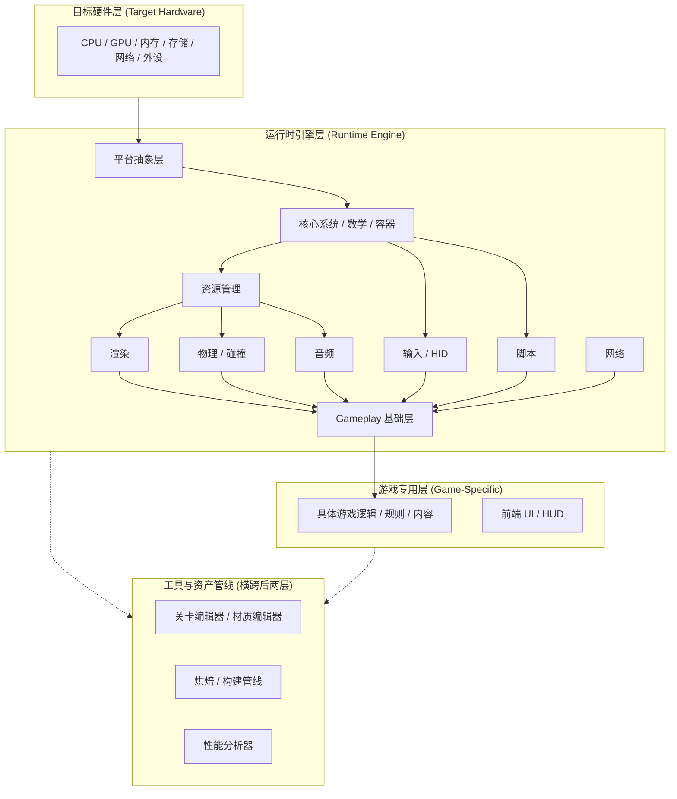

> 所属计划: 游戏架构设计
> 预计耗时: 70min
> 前置知识: [[07-game-loop|第7章 游戏循环]]

---

## 1. 概念讲解

### 为什么需要这个？

游戏开发并非从零开始编写每一行代码。从《超级马里奥》到《艾尔登法环》，所有游戏都共享大量底层能力：将三角形绘制到屏幕、处理手柄输入、模拟物理碰撞、播放音效、加载模型与纹理。若每个项目都重复造轮子，团队将耗尽精力在"让画面出现"而非"让玩法有趣"上。

**游戏引擎的本质是可复用的实时模拟中间件**。Jason Gregory 在《Game Engine Architecture》中将其定义为：介于目标硬件与具体游戏之间的软件层，提供跨平台的通用基础设施，使开发者专注于游戏专属内容。理解引擎架构，就是理解如何划分这些基础设施、如何组织它们的生命周期、如何在"通用"与"专用"之间划定边界。

引擎架构的决策直接影响团队的协作效率、技术债务累积速度、以及产品能否跨平台发布。一个 5 人独立团队与 300 人 AAA 团队面对的约束截然不同，但底层问题一致：**哪些代码属于引擎？哪些属于游戏？子系统如何启动？工具与运行时如何分离？**

### 核心思想

#### 典型子系统全景

现代游戏引擎通常包含十余个核心子系统，按功能域可粗分为四层：

| 层级 | 子系统 | 核心职责 |
|------|--------|----------|
| 硬件抽象 | 平台抽象层（Platform Abstraction） | 封装 OS、窗口系统、线程、文件 I/O、内存分配的差异 |
| 基础设施 | 核心/工具层（Core/Utilities） | 容器、数学库、日志、断言、性能分析器、内存追踪 |
|  | 资源管理（Resource Manager） | 加载、缓存、引用计数、异步流式、热重载 |
| 模拟层 | 渲染（Renderer） | 场景提交、绘制调用、着色器、后处理、多线程渲染 |
|  | 物理/碰撞（Physics/Collision） | 刚体动力学、碰撞检测、射线检测、约束求解 |
|  | 音频（Audio） | 3D 空间音频、混音、流式播放、DSP 效果 |
|  | 输入/HID（Input） | 设备枚举、事件映射、动作抽象、震动反馈 |
|  | 脚本（Scripting） | 游戏逻辑宿主语言（Lua/C#/Python）、绑定层 |
| 玩法层 | Gameplay 基础层 | 游戏对象模型、组件系统、事件系统、存档 |
|  | 前端/UI（Frontend/UI） | HUD、菜单、对话框、本地化、字体渲染 |
| 支撑 | 工具/编辑器（Tools/Editor） | 关卡编辑、材质编辑器、烘焙、性能分析、调试可视化 |
|  | 在线/网络（Networking） | 多人同步、匹配、反作弊、内容下载 |

这些子系统并非孤立运作。渲染需要资源管理提供纹理与网格，物理需要场景中的碰撞体数据，音频需要跟随游戏对象的位置更新。这种**交叉依赖**是引擎架构设计的核心挑战。

#### 运行时 vs 工具侧：一条关键分界线

引擎代码按执行环境分为两大阵营：

**运行时（Runtime）**：玩家机器上实际运行的代码与数据。追求极致性能、最小内存占用、确定性行为。不包含任何编辑器 UI、调试可视化、或未烘焙的原始资产。

**工具侧（Tools）**：开发者工作站上运行的资产管线与编辑器。负责：
- 资产导入（FBX → 引擎内部格式、纹理压缩、音频转码）
- 关卡编辑（WYSIWYG 场景构建、属性检视、Prefab 变体）
- 烘焙（将编辑器友好的中间格式转换为运行时高效格式）
- 调试与性能分析（帧时间分析、内存快照、GPU 捕获）

工具与资产管线**横跨运行时引擎层与游戏专用层**。例如，材质编辑器需要链接渲染系统的着色器编译器，但编辑器本身不应随游戏发布。这种"代码共享、部署分离"的模式要求架构上明确区分 `Runtime` 与 `Editor` 编译条件或程序集。

#### Gregory 三层模型

Jason Gregory 提出的经典分层模型为架构讨论提供了共同语言：



**关键洞察**：上层可依赖下层，下层绝不应反向依赖上层。游戏专用层可以调用渲染 API，但渲染系统不应包含任何"这是玩家血量条"的假设。

#### 子系统生命周期与依赖 DAG

引擎启动不是简单的 `new Subsystem()` 列表。子系统存在**启动依赖**：日志系统必须先于所有系统（以便它们能输出错误），资源管理必须先于渲染（渲染需要加载着色器），渲染必须先于 Gameplay（Gameplay 初始化时可能创建视觉对象）。

这种依赖关系构成**有向无环图（DAG）**。启动顺序必须满足拓扑序；关闭顺序通常取逆拓扑序（先启动的后关闭，避免使用已销毁的依赖）。若出现循环依赖——如渲染依赖资源，资源又回调渲染——则架构已腐化，必须重构。

#### Monolithic vs Modular：架构风格的权衡

| 维度 | 单体引擎（Monolithic） | 模块化/插件引擎（Modular） |
|------|------------------------|---------------------------|
| 典型代表 | 早期 Unity、GameMaker | Unreal（插件架构）、Bevy、自定义引擎 |
| API 一致性 | 统一风格，学习成本低 | 各模块接口风格可能差异大 |
| 迭代速度 | 修改一处，全局即时生效 | 接口变更需协调多模块 |
| 团队并行 | 易冲突，需集中式代码管控 | 模块边界清晰，可独立演进 |
| 中间件替换 | 困难（深度耦合） | 通过接口抽象，可替换 PhysX → Jolt |
| 测试 | 全量回归成本高 | 模块可独立单元测试 |
| 构建时间 | 单次全量编译 | 增量编译，但链接可能复杂 |

**没有银弹**。5 人团队使用单体引擎能快速验证玩法；300 人 AAA 团队若不用模块化，编译耦合将导致每日集成灾难。许多引擎采用**混合策略**：核心层单体（平台、核心、资源），功能层模块化（物理、音频、网络可作为插件加载）。

#### 用 C4 模型表达引擎架构

架构文档需要分层抽象。C4 模型（由 Simon Brown 提出）提供了四个层级，引擎架构通常用到前两级：

**容器图（Container Diagram）**：展示引擎作为一组可独立部署/运行的"容器"（进程或运行时）。例如：
- 游戏运行时进程（Player Runtime）
- 编辑器进程（Editor）
- 命令行烘焙工具（Asset Baker CLI）
- 资产数据库（Asset Database，文件系统或数据库）

**组件图（Component Diagram）**：展示单个容器内部的子系统模块及其关系。例如运行时进程内的渲染组件、物理组件、Gameplay 组件如何交互。

C4 的优势在于**明确受众**：与制作人讨论容器图，与程序员讨论组件图，避免在一张图中混杂过多细节。

---

## 2. 代码示例

以下实现一个轻量级 `Engine` 类，演示子系统接口、注册机制、基于依赖计数的简化启动顺序，以及循环调用。这是理解引擎启动逻辑的最小可运行模型。

```csharp
using System;
using System.Collections.Generic;
using System.Linq;

// ============================================
// 子系统契约：所有引擎子系统必须实现此接口
// ============================================
public interface ISubsystem
{
    /// <summary>子系统名称，用于日志与调试</summary>
    string Name { get; }
    
    /// <summary>此子系统启动前必须已启动的依赖名称列表</summary>
    IEnumerable<string> Dependencies { get; }
    
    /// <summary>初始化：分配资源、建立与其他系统的连接</summary>
    void Startup();
    
    /// <summary>每帧更新：dt 为上一帧耗时（秒）</summary>
    void Update(double dt);
    
    /// <summary>清理：释放资源、断开连接</summary>
    void Shutdown();
}

// ============================================
// 具体子系统示例：日志系统（最底层，无依赖）
// ============================================
public class LogSystem : ISubsystem
{
    public string Name => "LogSystem";
    public IEnumerable<string> Dependencies => Array.Empty<string>();
    
    public void Startup() => Console.WriteLine("[LOG] 日志系统初始化，日志级别: Info");
    public void Update(double dt) { /* 日志系统通常无需每帧更新 */ }
    public void Shutdown() => Console.WriteLine("[LOG] 日志系统关闭，刷新缓冲区");
}

// ============================================
// 资源系统：依赖日志系统（需要输出加载错误）
// ============================================
public class ResourceSystem : ISubsystem
{
    public string Name => "ResourceSystem";
    public IEnumerable<string> Dependencies => new[] { "LogSystem" };
    
    public void Startup() => Console.WriteLine("[RES] 资源管理器初始化，注册 3 种加载器");
    public void Update(double dt) => Console.WriteLine("[RES] 处理异步加载队列");
    public void Shutdown() => Console.WriteLine("[RES] 资源管理器关闭，释放所有缓存");
}

// ============================================
// 渲染系统：依赖日志系统与资源系统
// ============================================
public class RenderSystem : ISubsystem
{
    public string Name => "RenderSystem";
    public IEnumerable<string> Dependencies => new[] { "LogSystem", "ResourceSystem" };
    
    public void Startup() => Console.WriteLine("[RENDER] 渲染器初始化，创建交换链");
    public void Update(double dt) => Console.WriteLine($"[RENDER] 提交帧，dt={dt:F4}");
    public void Shutdown() => Console.WriteLine("[RENDER] 渲染器关闭，销毁 GPU 资源");
}

// ============================================
// 物理系统：依赖日志系统
// ============================================
public class PhysicsSystem : ISubsystem
{
    public string Name => "PhysicsSystem";
    public IEnumerable<string> Dependencies => new[] { "LogSystem" };
    
    public void Startup() => Console.WriteLine("[PHYS] 物理世界初始化，重力=-9.81");
    public void Update(double dt) => Console.WriteLine($"[PHYS] 模拟步进，dt={dt:F4}");
    public void Shutdown() => Console.WriteLine("[PHYS] 物理世界关闭，销毁刚体");
}

// ============================================
// Gameplay 层：依赖渲染、物理、资源
// ============================================
public class GameplaySystem : ISubsystem
{
    public string Name => "GameplaySystem";
    public IEnumerable<string> Dependencies => new[] { "RenderSystem", "PhysicsSystem", "ResourceSystem" };
    
    public void Startup() => Console.WriteLine("[GAME] Gameplay 层初始化，加载关卡数据");
    public void Update(double dt) => Console.WriteLine($"[GAME] 更新游戏逻辑，dt={dt:F4}");
    public void Shutdown() => Console.WriteLine("[GAME] Gameplay 层关闭，保存进度");
}

// ============================================
// 引擎核心：注册、排序、生命周期管理
// ============================================
public class Engine
{
    private readonly List<ISubsystem> systems = new();
    private readonly List<ISubsystem> startupOrder = new();

    public void Register(ISubsystem s) => systems.Add(s);

    /// <summary>
    /// 启动所有子系统。简化实现：按依赖数量升序排列。
    /// 真实引擎应使用 Kahn 拓扑排序（见练习1）。
    /// </summary>
    public void Startup()
    {
        Console.WriteLine("=== 引擎启动：计算子系统启动顺序 ===");
        
        // 简化排序：依赖少的先启动。假设输入无环且依赖已注册。
        startupOrder.Clear();
        startupOrder.AddRange(systems.OrderBy(sys => sys.Dependencies.Count()));
        
        foreach (var sys in startupOrder)
        {
            Console.WriteLine($"Starting {sys.Name} (deps: {string.Join(", ", sys.Dependencies)})");
            sys.Startup();
        }
        Console.WriteLine("=== 引擎启动完成 ===\n");
    }

    public void Update(double dt)
    {
        foreach (var sys in startupOrder)
            sys.Update(dt);
    }

    /// <summary>按启动逆序关闭，避免依赖已销毁的系统</summary>
    public void Shutdown()
    {
        Console.WriteLine("\n=== 引擎关闭 ===");
        for (int i = startupOrder.Count - 1; i >= 0; i--)
        {
            var sys = startupOrder[i];
            Console.WriteLine($"Shutting down {sys.Name}");
            sys.Shutdown();
        }
        Console.WriteLine("=== 引擎关闭完成 ===");
    }
}

// ============================================
// 入口：演示完整生命周期
// ============================================
class Program
{
    static void Main(string[] args)
    {
        var engine = new Engine();
        
        // 注册顺序任意——启动时会按依赖重新排序
        engine.Register(new GameplaySystem());
        engine.Register(new LogSystem());
        engine.Register(new RenderSystem());
        engine.Register(new PhysicsSystem());
        engine.Register(new ResourceSystem());
        
        engine.Startup();
        
        // 模拟 3 帧
        for (int frame = 0; frame < 3; frame++)
        {
            Console.WriteLine($"\n--- Frame {frame} ---");
            engine.Update(0.016); // 假设 60fps，dt≈16.6ms
        }
        
        engine.Shutdown();
    }
}
```

**运行方式:**

```bash
# 需要 .NET 6+ 运行时
dotnet new console -n EngineArchitectureDemo
# 将上述代码覆盖 Program.cs
dotnet run
```

**预期输出:**

```text
=== 引擎启动：计算子系统启动顺序 ===
Starting LogSystem (deps: )
[LOG] 日志系统初始化，日志级别: Info
Starting ResourceSystem (deps: LogSystem)
[RES] 资源管理器初始化，注册 3 种加载器
Starting PhysicsSystem (deps: LogSystem)
[PHYS] 物理世界初始化，重力=-9.81
Starting RenderSystem (deps: LogSystem, ResourceSystem)
[RENDER] 渲染器初始化，创建交换链
Starting GameplaySystem (deps: RenderSystem, PhysicsSystem, ResourceSystem)
[GAME] Gameplay 层初始化，加载关卡数据
=== 引擎启动完成 ===

--- Frame 0 ---
[LOG] 
[RES] 处理异步加载队列
[PHYS] 模拟步进，dt=0.0160
[RENDER] 提交帧，dt=0.0160
[GAME] 更新游戏逻辑，dt=0.0160

--- Frame 1 ---
[LOG] 
[RES] 处理异步加载队列
[PHYS] 模拟步进，dt=0.0160
[RENDER] 提交帧，dt=0.0160
[GAME] 更新游戏逻辑，dt=0.0160

--- Frame 2 ---
[LOG] 
[RES] 处理异步加载队列
[PHYS] 模拟步进，dt=0.0160
[RENDER] 提交帧，dt=0.0160
[GAME] 更新游戏逻辑，dt=0.0160

=== 引擎关闭 ===
Shutting down GameplaySystem
[GAME] Gameplay 层关闭，保存进度
Shutting down RenderSystem
[RENDER] 渲染器关闭，销毁 GPU 资源
Shutting down PhysicsSystem
[PHYS] 物理世界关闭，销毁刚体
Shutting down ResourceSystem
[RES] 资源管理器关闭，释放所有缓存
Shutting down LogSystem
[LOG] 日志系统关闭，刷新缓冲区
=== 引擎关闭完成 ===
```

> **关键结构说明**：`Engine` 类通过 `ISubsystem` 接口解耦具体子系统，启动顺序由依赖元数据驱动而非硬编码。`Startup`/`Shutdown` 的对称设计确保资源生命周期可控。当前排序是简化版（按依赖计数），真实场景需要完整拓扑排序——这正是练习 1 的目标。

---

## 3. 练习

### 练习 1: 基础
实现 `KahnTopologicalSort(List<ISubsystem> systems)`，按依赖关系输出正确的启动顺序；若出现循环依赖则抛出 `InvalidOperationException` 并说明环中包含哪些子系统。

要求：
- 使用经典的 Kahn 算法（入度表 + 队列 + 邻接表）
- 时间复杂度 `O(V + E)`，`V` 为子系统数，`E` 为依赖边数
- 错误信息需包含环中涉及的子系统名称

### 练习 2: 进阶
设计一个插件加载器 `PluginLoader`，从指定 DLL/Assembly 路径中自动发现并注册实现了 `ISubsystem` 的类型。

要求：
- 使用 `Assembly.LoadFrom` 加载外部程序集
- 过滤条件：`typeof(ISubsystem).IsAssignableFrom(t)` 且 `!t.IsAbstract` 且 `!t.IsInterface`
- 通过 `Activator.CreateInstance` 创建实例并注册到 `Engine`
- 处理加载失败（文件不存在、缺少依赖、类型无法实例化）并给出清晰错误信息

### 练习 3: 挑战（可选）
对比"单体引擎"与"模块化插件引擎"对以下两种团队的影响，从至少四个维度分析（构建时间、迭代速度、团队组织、技术债务、中间件替换、测试策略任选）：
- 5 人独立游戏团队，开发周期 2 年，目标 PC 单平台
- 300 人 AAA 团队，开发周期 5 年，目标 PC/主机/移动端多平台

---

## 3.5 参考答案

> [!tip]- 练习 1 参考答案
> ```csharp
> using System;
> using System.Collections.Generic;
> using System.Linq;
> using System.Text;
> 
> public static class TopologicalSort
> {
>     /// <summary>
>     /// Kahn 拓扑排序：返回满足依赖关系的启动顺序。
>     /// 若存在环，抛出 InvalidOperationException 并指明环中节点。
>     /// </summary>
>     public static List<ISubsystem> KahnTopologicalSort(List<ISubsystem> systems)
>     {
>         // 建立名称到子系统的映射，用于快速查找
>         var nameToSystem = systems.ToDictionary(s => s.Name, s => s);
>         
>         // 邻接表：依赖名 -> 被哪些子系统依赖（即出边指向谁）
>         var adjacency = new Dictionary<string, List<string>>();
>         // 入度表：子系统名称 -> 还有多少依赖未满足
>         var inDegree = new Dictionary<string, int>();
>         
>         foreach (var sys in systems)
>         {
>             adjacency[sys.Name] = new List<string>();
>             inDegree[sys.Name] = 0;
>         }
>         
>         foreach (var sys in systems)
>         {
>             foreach (var dep in sys.Dependencies)
>             {
>                 if (!nameToSystem.ContainsKey(dep))
>                     throw new InvalidOperationException(
>                         $"子系统 '{sys.Name}' 依赖未注册的子系统 '{dep}'");
>                 
>                 // sys 依赖 dep，意味着 dep 必须在 sys 之前启动
>                 // 所以 dep 的邻接表加入 sys，sys 的入度 +1
>                 adjacency[dep].Add(sys.Name);
>                 inDegree[sys.Name]++;
>             }
>         }
>         
>         // Kahn 算法核心：从入度为 0 的节点开始
>         var queue = new Queue<string>();
>         foreach (var kvp in inDegree)
>             if (kvp.Value == 0)
>                 queue.Enqueue(kvp.Key);
>         
>         var result = new List<ISubsystem>();
>         
>         while (queue.Count > 0)
>         {
>             var currentName = queue.Dequeue();
>             result.Add(nameToSystem[currentName]);
>             
>             foreach (var neighbor in adjacency[currentName])
>             {
>                 inDegree[neighbor]--;
>                 if (inDegree[neighbor] == 0)
>                     queue.Enqueue(neighbor);
>             }
>         }
>         
>         // 若结果数小于总节点数，说明存在环
>         if (result.Count != systems.Count)
>         {
>             var remaining = inDegree.Where(kvp => kvp.Value > 0).Select(kvp => kvp.Key);
>             var sb = new StringBuilder();
>             sb.AppendLine("检测到循环依赖，涉及子系统：");
>             foreach (var name in remaining)
>                 sb.AppendLine($"  - {name} (剩余入度: {inDegree[name]})");
>             throw new InvalidOperationException(sb.ToString());
>         }
>         
>         return result;
>     }
> }
> ```
> 
> 关键要点：
> 1. **邻接表方向**：`dep → sys` 表示"dep 完成后 sys 才能开始"，这是 Kahn 算法的标准建图方式
> 2. **未注册依赖检测**：比环检测更基础的错误，应优先检查
> 3. **环定位**：剩余入度 > 0 的节点必在环中（或依赖环），帮助开发者快速定位问题

> [!tip]- 练习 2 参考答案
> ```csharp
> using System;
> using System.Collections.Generic;
> using System.IO;
> using System.Linq;
> using System.Reflection;
> 
> public class PluginLoader
> {
>     private readonly Engine engine;
>     private readonly List<string> loadedPaths = new();
> 
>     public PluginLoader(Engine engine)
>     {
>         this.engine = engine ?? throw new ArgumentNullException(nameof(engine));
>     }
> 
>     /// <summary>
>     /// 从指定路径加载插件 DLL，发现并注册所有 ISubsystem 实现。
>     /// </summary>
>     /// <param name="dllPath">DLL 的绝对或相对路径</param>
>     /// <returns>成功注册的子系统数量</returns>
>     public int LoadAndRegister(string dllPath)
>     {
>         if (!File.Exists(dllPath))
>             throw new FileNotFoundException($"插件文件不存在: {Path.GetFullPath(dllPath)}");
> 
>         // 避免重复加载同一程序集（可能导致类型身份冲突）
>         var fullPath = Path.GetFullPath(dllPath);
>         if (loadedPaths.Contains(fullPath))
>         {
>             Console.WriteLine($"[PluginLoader] 已加载过 {dllPath}，跳过");
>             return 0;
>         }
> 
>         Assembly assembly;
>         try
>         {
>             // LoadFrom 加载到默认上下文，解析依赖时会搜索同一目录
>             assembly = Assembly.LoadFrom(fullPath);
>             loadedPaths.Add(fullPath);
>         }
>         catch (FileLoadException ex)
>         {
>             throw new InvalidOperationException(
>                 $"无法加载插件程序集 '{dllPath}'：{ex.Message}", ex);
>         }
>         catch (BadImageFormatException ex)
>         {
>             throw new InvalidOperationException(
>                 $"插件文件格式无效（可能架构不匹配）'{dllPath}'：{ex.Message}", ex);
>         }
> 
>         // 获取所有非抽象、非接口、实现 ISubsystem 的类型
>         var subsystemTypes = assembly.GetTypes()
>             .Where(t => typeof(ISubsystem).IsAssignableFrom(t)
>                      && !t.IsAbstract
>                      && !t.IsInterface);
> 
>         int registeredCount = 0;
>         foreach (var type in subsystemTypes)
>         {
>             try
>             {
>                 // 优先尝试无参构造，若失败则尝试注入 Engine 的构造
>                 object instance;
>                 var ctorWithEngine = type.GetConstructor(new[] { typeof(Engine) });
>                 var ctorDefault = type.GetConstructor(Type.EmptyTypes);
> 
>                 if (ctorWithEngine != null)
>                     instance = ctorWithEngine.Invoke(new object[] { engine });
>                 else if (ctorDefault != null)
>                     instance = ctorDefault.Invoke(null);
>                 else
>                     throw new MissingMethodException($"类型 {type.Name} 缺少无参或 Engine 注入构造");
> 
>                 var subsystem = (ISubsystem)instance;
>                 engine.Register(subsystem);
>                 Console.WriteLine($"[PluginLoader] 注册子系统: {subsystem.Name} ({type.FullName})");
>                 registeredCount++;
>             }
>             catch (TargetInvocationException ex) when (ex.InnerException != null)
>             {
>                 Console.WriteLine($"[PluginLoader] 实例化失败 {type.Name}: {ex.InnerException.Message}");
>             }
>             catch (Exception ex)
>             {
>                 Console.WriteLine($"[PluginLoader] 注册失败 {type.Name}: {ex.Message}");
>             }
>         }
> 
>         return registeredCount;
>     }
> 
>     /// <summary>批量加载目录下所有 DLL</summary>
>     public int LoadDirectory(string directoryPath)
>     {
>         if (!Directory.Exists(directoryPath))
>             throw new DirectoryNotFoundException(directoryPath);
> 
>         int total = 0;
>         foreach (var dll in Directory.GetFiles(directoryPath, "*.dll"))
>         {
>             try
>             {
>                 total += LoadAndRegister(dll);
>             }
>             catch (Exception ex)
>             {
>                 Console.WriteLine($"[PluginLoader] 加载 {Path.GetFileName(dll)} 失败: {ex.Message}");
>             }
>         }
>         return total;
>     }
> }
> ```
> 
> 关键要点：
> 1. **Assembly.LoadFrom vs LoadFile**：`LoadFrom` 会解析同一目录的依赖，更适合插件场景；`LoadFile` 仅加载指定文件，依赖解析困难
> 2. **类型身份问题**：同一程序集被不同加载上下文加载会导致 `typeof(ISubsystem).IsAssignableFrom` 返回 false，需避免重复加载
> 3. **构造策略**：插件可能需要 Engine 引用（如需要注册事件），提供注入构造是良好的扩展性设计
> 4. **容错设计**：单个类型失败不应阻断整个插件加载，记录并继续

> [!tip]- 练习 3 参考答案
> 
> **分析框架：从四个维度对比**
> 
> | 维度 | 5 人独立团队（单体引擎） | 5 人独立团队（模块化） | 300 人 AAA（单体） | 300 人 AAA（模块化） |
> |------|------------------------|----------------------|------------------|-------------------|
> | **构建时间** | 全量编译 2-5 分钟可接受，无显著瓶颈 | 模块化带来增量编译收益有限（项目小） | 全量编译 30-60 分钟，严重阻塞迭代 | 增量编译 5-10 分钟，模块可并行构建 |
> | **迭代速度** | 一体化编辑器，改玩法即时预览，**最优** | 接口治理消耗精力，模块边界阻碍快速 hack | 任何核心修改触发全量回归，迭代缓慢 | 模块独立演进，团队可并行开发 |
> | **团队组织** | 全员理解全代码库，无需严格边界 | 过早模块化导致"一人维护多模块"负担 | 必须强代码管控，冲突频繁 | 模块所有权清晰，符合康威定律 |
> | **中间件替换** | 通常不需要，锁定单一套方案 | 过度设计：独立游戏极少替换物理/音频 | 平台方要求、授权费用变化驱动替换需求 | 接口抽象层允许 PhysX→Jolt、Wwise→FMOD 平滑迁移 |
> | **技术债务** | 耦合在可控范围，重构成本低 | 抽象层过早引入成为"无用层" | 单体累积大量隐式依赖，重构需数月 | 模块边界成为"硬化层"，但内部可独立重构 |
> 
> **核心结论**：
> 
> - **5 人团队**：单体引擎是理性选择。Unity 的崛起正因其将编辑器、渲染、物理、音频打包为"开箱即用"的整体，让小型团队专注于内容。模块化在此是**过早优化**——维护接口的成本超过解耦收益。
> 
> - **300 人 AAA 团队**：模块化是生存必需。Unreal 的插件架构（`.uplugin` 文件定义模块依赖）允许：
>   - 渲染团队独立开发 Lumen/Nanite 而不破坏 Gameplay 编译
>   - 多平台团队为 PS5/Xbox/Switch 维护独立的 RHI（Render Hardware Interface）插件
>   - 外部中间件（SpeedTree、Houdini Engine）以插件形式接入，不污染核心
>   - CI 系统可仅编译变更模块及其依赖下游，而非全引擎
> 
> **混合策略的现实**：即使大型团队，核心层（平台抽象、内存管理、容器）通常保持相对单体，因其变更频率低、稳定性要求高；上层功能（AI、网络、UI 框架）则强烈模块化。这种"稳固核心 + 灵活外围"的结构在 [[03-coupling-cohesion-di|第3章]] 的内聚原则中有更深层讨论。

> [!note] 答案使用方式
> 如果你的实现通过了测试或达到了题目要求，就是正确的。参考答案展示的是一种**工程上成熟**的做法，但非唯一正解。例如练习 1 也可用 DFS 检测环+记录后序遍历；练习 2 可用 `AssemblyLoadContext` 实现插件卸载（.NET Core 3.0+）。建议对比自己的实现与参考的差异，思考"为什么这样设计"而非"抄答案"。
>
> ---

## 4. 扩展阅读

- [Jason Gregory — Game Engine Architecture, Table of Contents](https://www.gameenginebook.com/toc.html) — 第 1 章 Runtime Engine Architecture 与 Tools and Asset Pipeline 是本章核心来源
- [Gregory 第三版预览 PDF（Runtime/Asset Pipeline 等章节）](https://api.pageplace.de/preview/DT0400.9781351974288_A36190729/preview-9781351974288_A36190729.pdf) — 可直接阅读第 1.5 节"Runtime Engine Architecture"与第 1.6 节"Tools and Asset Pipeline"
- [An Approach to Understand Game Engine Architecture (arXiv)](https://arxiv.org/html/2406.05487v2) — 学术论文，系统梳理引擎子系统分类与架构模式
- [Bevy Engine — Modular Plugin System](https://bevyengine.org/learn/book/getting-started/plugins/) — 现代 Rust 引擎的模块化设计实践，对比传统 C++ 引擎的插件机制
- [Unreal Engine Architecture Reference](https://docs.unrealengine.com/5.0/en-US/unreal-engine-architecture/) — 官方文档，展示模块（Module）、插件（Plugin）与目标平台（Target Platform）的层级关系

---

## 常见陷阱

- **子系统之间出现循环依赖**：如渲染系统依赖资源管理加载纹理，资源管理又在加载完成时回调渲染系统刷新预览。正确做法：引入事件总线或消息队列打破直接回调，或将回调改为渲染系统的轮询机制；根本解决是重新划分职责，让资源管理"通知"而不"调用"渲染。

- **把具体游戏逻辑塞进引擎核心层**：在 `RenderSystem` 中硬编码"玩家血量低于 20% 时屏幕变红"，导致引擎与项目强耦合、无法复用于其他游戏。正确做法：引擎提供"后处理参数覆盖"接口，游戏层通过 `GameplaySystem` 驱动；遵循 Gregory 三层模型的边界，核心层只保留"能做什么"，不假设"为谁做"。

- **启动顺序写死为 Magic Number 列表**：如 `StartupOrder = new[] { 0, 1, 5, 2, 3 }` 或按枚举值隐式排序。新增子系统时频繁破坏原有顺序，调试困难。正确做法：所有子系统显式声明 `Dependencies`，由引擎自动拓扑排序；排序算法可单元测试，变更时只需修改依赖声明而非全局列表。