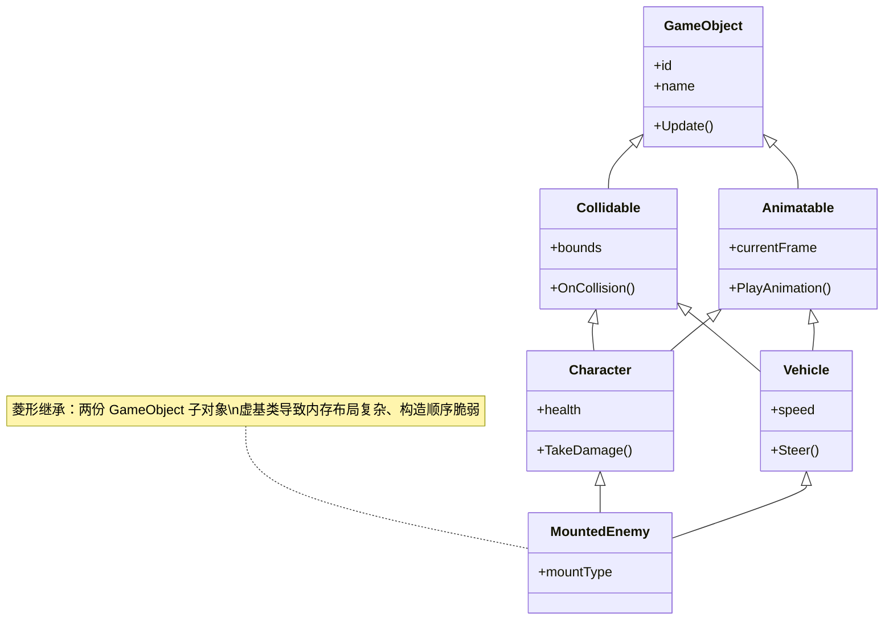
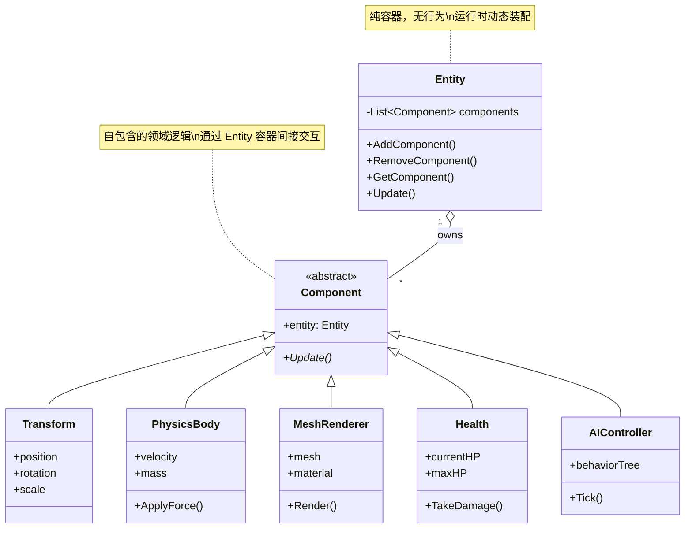

> 所属计划: 游戏架构设计
> 预计耗时: 60min
> 前置知识: [[08-game-engine-architecture|第8章 游戏引擎架构总览]]

---

## 1. 概念讲解

### 为什么需要这个？

想象你在设计一款 RPG 游戏。最初，你的类层级看起来清晰而优雅：

```
GameObject
└── DynamicObject
    └── AnimatedObject
        ├── Character
        │   ├── Player
        │   ├── NPC
        │   └── Enemy
        └── Vehicle
            ├── Horse
            └── Boat
```

每个层级都是一次"is-a"分类：`Player` is a `Character`，`Character` is an `AnimatedObject`。这符合教科书上的面向对象设计，团队里的新成员也能快速理解"这是什么"。

然而，游戏开发的残酷现实很快会击碎这幅美好图景：

- 你的设计师想让**树木**也能被风吹动摇摆——但 `Tree` 继承自 `StaticObject`，不是 `AnimatedObject`
- 某个 `Enemy` 需要同时具有**物理刚体**和**可驾驶**的特性——该继承自 `Character` 还是 `Vehicle`？
- 一个**宝箱**需要碰撞检测、发光渲染、触发音效，但不需要 AI——它的基类该携带多少无用字段？

这些问题并非理论虚构。在《帝国时代2》的开发中，开发团队曾被迫给**树木**添加视线检测（Line of Sight）字段，因为基类 `GameObject` 统一承载了该功能，导致数百万棵树木各自携带了从未使用的布尔标记和浮点数组。这是典型的**非预期副作用**：基类的"通用"设计变成了所有派生类的负担。

更深层的危机在于，这种继承模型假设**游戏实体的分类是静态的、层次化的、不交叉的**。但游戏实体的能力组合本质上是**集合的笛卡尔积**：物理{有/无} × 渲染{3D/2D/无} × AI{简单/复杂/无} × 输入{玩家/脚本/无} × 网络{同步/本地}... 静态树状结构无法表达这种指数级膨胀的组合空间。

### 核心思想

**核心命题：游戏对象的行为组合，应当用"has-a"（组合）替代"is-a"（继承）来建模。**

这一原则并非游戏行业独创，但游戏开发将其推向了极致——因为游戏实体是**运行时动态变化**的（升级获得新能力、Buff 临时附加、形态切换），而传统继承的类层级在编译期就已固化。

让我们解剖传统继承模型的系统性缺陷：

**1. 菱形继承（Deadly Diamond of Death）**



当 `MountedEnemy` 同时需要 `Character`（能战斗）和 `Vehicle`（能骑乘）的特性时，两条继承路径在 `GameObject` 处汇合。C++ 的虚基类（`virtual inheritance`）虽能消除重复子对象，却引入了**指针间接层**、**构造顺序依赖**和**布局非确定性**——对缓存友好的游戏引擎而言，这是性能与复杂度的双重灾难。

**2. 接口膨胀（Interface Bloat）**

基类为了"预见未来"，不断累积虚函数：
- `GameObject` 最初只有 `Update()`
- 加入渲染后多了 `Render()`
- 加入网络后多了 `Serialize()` / `Deserialize()`
- 加入编辑器支持后多了 `OnInspectorGUI()`
- 加入脚本绑定后多了 `GetScriptTable()`

最终，`GameObject` 可能有 30+ 虚函数，而具体的 `Particle` 实体只使用其中 2 个，却背负了全部虚表指针和接口语义负担。这是[[04-solid-grasp-pragmatic|第4章 SOLID 原则]]中**接口隔离原则（ISP）**的严重违背。

**3. 透传调用遗漏（Pass-Thru Enforcement）**

当深层级需要"透传"新功能时，每层基类都必须添加虚函数——否则中间层会截断调用链。例如给 `AnimatedObject` 添加 `BlendTree` 支持，需要修改 `AnimatedObject` 本身，以及所有派生类决定是否/如何重写。漏改一层，行为就静默错误。

**4. God Object / Blob 反模式**

这是继承困境的终极形态：既然无法决定功能该放哪层，就全部塞进根基类。结果是一个数千行的 `GameObject.h`，包含：

```cpp
class GameObject {  // 典型的 God Object
    // 物理
    Vector3 position, velocity, acceleration;
    float mass, drag, angularVelocity;
    bool isKinematic, useGravity;
    Collider* collider;  Rigidbody* rigidbody;
    
    // 渲染
    Mesh* mesh;  Material* material;
    bool castShadows, receiveShadows;
    int renderQueue;  LayerMask layers;
    
    // AI
    BehaviorTree* behaviorTree;
    NavMeshAgent* agent;
    List~Waypoint~* path;
    
    // 音频
    AudioSource* audioSource;
    List~AudioClip~* clips;
    
    // 输入
    InputActionMap* actions;
    bool isPlayerControlled;
    
    // 网络
    NetworkIdentity* netId;
    bool isServer, isClient, hasAuthority;
    
    // ... 还有更多
};
```

God Object 成为**团队瓶颈**——任何功能修改都需要触碰这个核心文件，引发合并冲突、编译依赖链爆炸、回归测试噩梦。它同时也是**bug 磁铁**：修改"网络同步"时不慎影响"物理模拟"，因为字段共享同一内存布局，指针生命周期纠缠不清。

**5. 行业历史教训：从继承到组件的范式迁移**

| 项目 | 转变 | 关键人物/来源 |
|:---|:---|:---|
| Dungeon Siege (2002) | 从静态 C++ 类层级转向组件容器 | Scott Bilas, GDC 2002 |
| Cyan/Plasma 引擎 (Myst 系列) | 重构为组件驱动，支持运行时实体装配 | Kyle Wilson 记录 |
| Munch's Oddysee | 早期尝试组件化，摆脱深继承 | GameArchitect.net 分析 |
| Unity (2005+) | 彻底组件化：`GameObject` 纯容器，`MonoBehaviour` 组件 | 现代引擎标杆 |

Kyle Wilson 在 [GameArchitect.net](http://gamearchitect.net) 上的系列文章系统总结了这一行业转型：2000 年代初，当游戏实体复杂度突破某个阈值后，继承模型的**理解成本**和**修改成本**呈指数增长，迫使团队重构。

**组合替代方案的本质：**



`Entity` 退化为**组件容器**（有时叫 `Actor`、`GameObject`），本身几乎无行为。每个 `Component` 封装一个**正交领域**（物理、渲染、AI、音频...）。实体能力通过**添加/移除组件**动态组合：

```cpp
// 一个玩家：有位置、能渲染、有血量、受物理影响、受玩家控制
Entity* player = world.CreateEntity();
player->Add<Transform>({0, 0, 0});
player->Add<MeshRenderer>(playerMesh, playerMaterial);
player->Add<Health>(100);
player->Add<PhysicsBody>(mass: 70);
player->Add<PlayerInput>();

// 一个静态装饰：只有位置和渲染
Entity* statue = world.CreateEntity();
statue->Add<Transform>({10, 0, 5});
statue->Add<MeshRenderer>(statueMesh, marbleMaterial);

// 一个临时 Buff 实体：无渲染，只有逻辑计时器
Entity* buff = world.CreateEntity();
buff->Add<DurationEffect>(5.0f, EffectType::SpeedBoost);
buff->Add<TargetEntity>(player);  // 指向玩家
```

**继承仍有适用场景**——但不在"游戏对象行为组合"领域：

| 适用继承的场景 | 原因 |
|:---|:---|
| 资源文件类型层级（`Texture` ← `Texture2D`/`TextureCube`） | 类型稳定，领域封闭，"is-a"语义明确 |
| 渲染 API 抽象（`GraphicsDevice` ← `D3D12Device`/`VulkanDevice`） | 平台差异大，但接口契约稳定 |
| 数学/几何类型（`Shape` ← `Sphere`/`AABB`/`OBB`） | 经典多态，无行为交叉 |
| 异常层级 | 标准实践，与运行时实体无关 |

关键判别标准：**类型层次是否稳定、封闭、无交叉组合需求？** 若是，继承合理；若实体能力需要运行时动态装配、交叉组合、频繁扩展，则组合必胜。

---

## 2. 代码示例

以下 C++17 代码**对比展示**两种模型：先演示深继承的菱形问题，再重构为基于组件的容器。

```cpp
#include <iostream>
#include <memory>
#include <vector>
#include <string>

// ============================================
// 方案 A：反模式 —— 深继承 + 隐含的 God Object 倾向
// ============================================

// 顶层基类，已开始累积"通用"功能
class LegacyGameObject {
public:
    virtual ~LegacyGameObject() = default;
    virtual void Update() { std::cout << "[LegacyGameObject::Update]\n"; }
    
    // 随着时间推移，这些字段会膨胀为 God Object
    float posX = 0, posY = 0;
    std::string name = "unnamed";
    bool active = true;
    // 未来会加入：碰撞、渲染、AI、网络...
};

// 可更新动画的分支
class LegacyAnimated : virtual public LegacyGameObject {
public:
    void Update() override {
        LegacyGameObject::Update();  // 必须显式调用，易遗漏
        std::cout << "[LegacyAnimated::Update] frame++\n";
    }
    int currentFrame = 0;
    int totalFrames = 60;
};

// 可物理模拟的分支
class LegacyPhysics : virtual public LegacyGameObject {
public:
    void Update() override {
        LegacyGameObject::Update();  // 再次显式调用
        std::cout << "[LegacyPhysics::Update] velocity integration\n";
    }
    float velX = 0, velY = 0;
    float mass = 1.0f;
};

// 菱形继承点：一个既动画又物理的实体
// 没有 virtual inheritance：两份 LegacyGameObject 子对象，歧义灾难
// 使用 virtual inheritance：构造顺序脆弱，内存布局含指针间接层
class LegacyCharacter : public LegacyAnimated, public LegacyPhysics {
public:
    void Update() override {
        // 灾难：该调用哪个路径的 Update？需要显式消歧义
        LegacyAnimated::Update();   // 会调用 LegacyGameObject::Update
        // LegacyPhysics::Update(); // 若也调用，LegacyGameObject::Update 执行两次！
        std::cout << "[LegacyCharacter::Update] AI logic\n";
    }
    int health = 100;
};

// 另一个菱形：载具也动画+物理
class LegacyVehicle : public LegacyAnimated, public LegacyPhysics {
public:
    void Update() override {
        LegacyAnimated::Update();
        std::cout << "[LegacyVehicle::Update] steering\n";
    }
    float maxSpeed = 50.0f;
};

// 终极噩梦：骑乘角色 = 角色 + 载具？不可能干净实现
// 只能复制代码，或引入更复杂的 Mixin 模板，团队理解成本爆炸


// ============================================
// 方案 B：组合方案 —— 实体为组件容器
// ============================================

class Component {
public:
    virtual ~Component() = default;
    virtual void Update() = 0;
    virtual const char* Name() const = 0;
};

// 位置组件：纯数据，可独立存在
class Transform : public Component {
public:
    float x = 0, y = 0, z = 0;
    float rotX = 0, rotY = 0, rotZ = 0;
    float scaleX = 1, scaleY = 1, scaleZ = 1;
    
    void Update() override {}  // 数据组件通常无每帧逻辑
    const char* Name() const override { return "Transform"; }
};

// 物理组件：封装物理模拟领域
class PhysicsComponent : public Component {
public:
    float vx = 0, vy = 0, vz = 0;
    float mass = 1.0f;
    bool useGravity = true;
    
    void Update() override {
        // 简化的欧拉积分
        if (useGravity) vy -= 9.8f * 0.016f;  // 假设 60fps
        std::cout << "  [Physics] integrate: vy=" << vy << "\n";
    }
    const char* Name() const override { return "PhysicsComponent"; }
};

// 渲染组件：封装渲染领域
class RenderComponent : public Component {
public:
    std::string meshName = "default_cube";
    bool visible = true;
    
    void Update() override {
        if (visible) std::cout << "  [Render] draw: " << meshName << "\n";
    }
    const char* Name() const override { return "RenderComponent"; }
};

// 动画组件：封装动画领域
class AnimationComponent : public Component {
public:
    std::string currentAnim = "idle";
    float playbackSpeed = 1.0f;
    float normalizedTime = 0.0f;
    
    void Update() override {
        normalizedTime += 0.016f * playbackSpeed;
        if (normalizedTime > 1.0f) normalizedTime -= 1.0f;
        std::cout << "  [Animation] " << currentAnim 
                  << " t=" << normalizedTime << "\n";
    }
    const char* Name() const override { return "AnimationComponent"; }
};

// 生命值组件：游戏逻辑领域
class HealthComponent : public Component {
public:
    int current = 100;
    int maximum = 100;
    
    void TakeDamage(int amount) {
        current = std::max(0, current - amount);
        std::cout << "  [Health] took " << amount 
                  << " damage, now " << current << "/" << maximum << "\n";
    }
    
    void Update() override {
        if (current <= 0) std::cout << "  [Health] DEAD, should destroy entity\n";
    }
    const char* Name() const override { return "HealthComponent"; }
};

// 玩家输入组件：输入领域
class PlayerInputComponent : public Component {
public:
    void Update() override {
        std::cout << "  [PlayerInput] read WASD + mouse\n";
    }
    const char* Name() const override { return "PlayerInputComponent"; }
};

// 实体：纯容器，无领域知识，只负责组件生命周期和消息分发
class Entity {
    std::vector<std::unique_ptr<Component>> components;
    std::string name;
    
public:
    explicit Entity(std::string n = "entity") : name(std::move(n)) {}
    
    // 类型安全的组件添加
    template<typename T, typename... Args>
    T* Add(Args&&... args) {
        auto comp = std::make_unique<T>(std::forward<Args>(args)...);
        T* raw = comp.get();
        components.push_back(std::move(comp));
        return raw;
    }
    
    // 运行时类型查询（生产代码可用 type_index 优化）
    template<typename T>
    T* Get() {
        for (auto& c : components) {
            if (auto* p = dynamic_cast<T*>(c.get())) return p;
        }
        return nullptr;
    }
    
    void Update() {
        std::cout << "[" << name << "] Update:\n";
        for (auto& c : components) {
            c->Update();
        }
    }
    
    void ListComponents() const {
        std::cout << "  Components: ";
        for (auto& c : components) {
            std::cout << c->Name() << " ";
        }
        std::cout << "\n";
    }
    
    size_t ComponentCount() const { return components.size(); }
};

// 演示：动态组合不同"种类"的实体
int main() {
    std::cout << "========== 方案 A：深继承（问题演示）==========\n";
    {
        LegacyCharacter hero;
        std::cout << "LegacyCharacter Update:\n";
        hero.Update();
        std::cout << "\n";
        
        // 问题：LegacyVehicle 和 LegacyCharacter 的代码大量重复
        // 问题：无法让树木同时有动画和物理，除非再造一个菱形
        // 问题：新增"风动"能力需要修改所有相关分支
    }
    
    std::cout << "========== 方案 B：组件组合（解决方案）==========\n\n";
    
    // 玩家实体：完整功能组合
    Entity player("Player");
    player.Add<Transform>();
    player.Add<PhysicsComponent>();
    player.Add<RenderComponent>()->meshName = "hero_mesh";
    player.Add<AnimationComponent>()->currentAnim = "run";
    player.Add<HealthComponent>();
    player.Add<PlayerInputComponent>();
    
    std::cout << "Created: "; player.ListComponents();
    
    // 静态装饰：最小功能组合
    Entity statue("Statue");
    statue.Add<Transform>()->x = 10;
    statue.Add<RenderComponent>()->meshName = "marble_statue";
    // 无物理、无动画、无血量、无输入
    
    std::cout << "Created: "; statue.ListComponents();
    
    // 临时特效实体：无渲染，纯逻辑
    Entity windZone("WindZone");
    windZone.Add<Transform>();
    auto* windPhysics = windZone.Add<PhysicsComponent>();
    windPhysics->useGravity = false;  // 风区不受重力
    // 可添加自定义 WindAffector 组件...
    
    std::cout << "Created: "; windZone.ListComponents();
    
    std::cout << "\n---------- 帧更新 ----------\n";
    player.Update();
    std::cout << "\n";
    statue.Update();
    std::cout << "\n";
    windZone.Update();
    
    std::cout << "\n---------- 动态修改能力 ----------\n";
    // 玩家中毒：临时添加持续伤害组件（演示运行时动态性）
    // 生产代码会有更复杂的 DurationEffect 组件
    std::cout << "Player takes damage via HealthComponent:\n";
    if (auto* h = player.Get<HealthComponent>()) {
        h->TakeDamage(25);
    }
    
    std::cout << "\n---------- 内存与耦合对比 ----------\n";
    std::cout << "Player components: " << player.ComponentCount() << "\n";
    std::cout << "Statue components: " << statue.ComponentCount() 
              << " (无浪费字段)\n";
    std::cout << "WindZone components: " << windZone.ComponentCount() << "\n";
    std::cout << "Each only pays for what they use.\n";
    
    return 0;
}
```

**运行方式:**

```bash
# 任何 C++17 编译器
g++ -std=c++17 -o ownership_demo ownership_demo.cpp
./ownership_demo
```

**预期输出:**

```text
========== 方案 A：深继承（问题演示）==========
LegacyCharacter Update:
[LegacyGameObject::Update]
[LegacyAnimated::Update] frame++
[LegacyCharacter::Update] AI logic

========== 方案 B：组件组合（解决方案）==========

Created: Components: Transform PhysicsComponent RenderComponent AnimationComponent HealthComponent PlayerInputComponent 
Created: Components: Transform RenderComponent 
Created: Components: Transform PhysicsComponent 

---------- 帧更新 ----------
[Player] Update:
  [Physics] integrate: vy=-0.1568
  [Render] draw: hero_mesh
  [Animation] run t=0.016
  [Health] DEAD, should destroy entity
  [PlayerInput] read WASD + mouse

[Statue] Update:
  [Render] draw: marble_statue

[WindZone] Update:
  [Physics] integrate: vy=0

---------- 动态修改能力 ----------
Player takes damage via HealthComponent:
  [Health] took 25 damage, now 75/100

---------- 内存与耦合对比 ----------
Player components: 6
Statue components: 2 (无浪费字段)
WindZone components: 2
Each only pays for what they use.
```

> 关键观察：方案 A 中 `LegacyCharacter::Update` 的消歧义调用是**手工维护的契约**，任何重构都可能破坏它；方案 B 中 `Entity::Update` 是**机械的分发**，新增组件类型零修改容器代码。

---

## 3. 练习

### 练习 1: 基础

在一个深继承层级中，给 `Enemy`（继承链：`GameObject -> DynamicObject -> AnimatedObject -> Character -> Enemy`）和 `Decoration`（继承链：`GameObject -> StaticObject -> Decoration`）同时加入"可被风吹动"的行为。展示继承导致的代码重复或菱形冲突，然后给出组合方案。

要求：
- 用代码展示两种继承尝试方案（复制代码 vs. 引入 `WindAffectable` 基类导致菱形）
- 给出组合方案：定义 `WindComponent`，演示给任意实体添加

---

### 练习 2: 进阶

将以下 3 层继承代码拆分为组件系统，保持原有行为：

```cpp
class AnimatedObject {
public:
    virtual void Update() {
        // 更新动画帧
        frame = (frame + 1) % 60;
    }
    int frame = 0;
};

class Character : public AnimatedObject {
public:
    void Update() override {
        AnimatedObject::Update();
        // 应用重力
        y += vy; vy -= 0.5f;
        // 地面碰撞
        if (y < 0) { y = 0; vy = 0; }
    }
    float x = 0, y = 0, vy = 0;
    int health = 100;
};

class Player : public Character {
public:
    void Update() override {
        Character::Update();
        // 读取输入
        if (inputJump && y == 0) vy = 10;
        // 渲染
        std::cout << "Player at (" << x << "," << y << ") frame=" << frame << "\n";
    }
    bool inputJump = false;
};
```

要求：
- 定义 `Transform`、`Health`、`Movement`、`Renderer` 组件
- `MovementComponent` 读取 `Transform` 和输入状态
- `RendererComponent` 读取 `Transform` 和动画帧进行绘制
- 提供可运行的 `main()` 展示等价行为

---

### 练习 3: 挑战（可选）

分析"组合优于继承"原则在 ECS（Entity-Component-System）架构中的极限：组件之间**仍有依赖**时该怎么办？

例如：`MovementSystem` 需要同时读取 `Position` 和 `Velocity` 组件——这算不算组件间耦合？如果 `CombatSystem` 需要知道 `Health` 和 `Armor` 才能计算伤害，如何避免组件直接相互引用？

要求：
- 区分"数据依赖"与"行为耦合"两个层次
- 讨论三种解耦策略：事件总线、消息队列、System 显式查询
- 解释为什么 ECS 把逻辑也抽离到 System，而不仅是组件

---

## 3.5 参考答案

> [!tip]- 练习 1 参考答案
> 
> **继承方案 A：代码复制（DRY 原则违反）**
> 
> ```cpp
> class Enemy : public Character {
>     // 复制 WindAffectable 代码
>     float windResistance = 1.0f;
>     void ApplyWind(float wx, float wy) {
>         x += wx * windResistance;
>         y += wy * windResistance;
>     }
> };
> 
> class Decoration : public StaticObject {
>     // 完全相同的代码再次复制
>     float windResistance = 0.3f;  // 甚至参数不同，无法复用
>     void ApplyWind(float wx, float wy) {
>         x += wx * windResistance;
>         y += wy * windResistance;
>     }
> };
> ```
> 
> **继承方案 B：引入 WindAffectable 基类（菱形继承）**
> 
> ```cpp
> class WindAffectable : virtual public GameObject {  // 需要 virtual
> public:
>     float windResistance = 1.0f;
>     virtual void ApplyWind(float wx, float wy) {
>         // 需要访问 position... 但 GameObject 的 position 在哪？
>     }
> };
> 
> class Enemy : public Character, public WindAffectable {
>     // 菱形：Character -> AnimatedObject -> GameObject
>     //              WindAffectable -> GameObject
>     // 两份 GameObject 子对象，或虚基类的指针间接层
> };
> 
> class Decoration : public StaticObject, public WindAffectable {
>     // 同样菱形，但继承路径不同，虚基类初始化顺序更复杂
> };
> ```
> 
> **组合方案：WindComponent**
> 
> ```cpp
> class WindComponent : public Component {
> public:
>     float resistance = 1.0f;
>     void ApplyWind(float wx, float wy, Transform& t) {
>         t.x += wx * resistance;
>         t.y += wy * resistance;
>     }
>     void Update() override {
>         // 从环境或事件获取风力
>     }
> };
> 
> // 使用：任意实体，任意时刻
> Entity enemy("Enemy");
> enemy.Add<Transform>();
> enemy.Add<WindComponent>()->resistance = 1.0f;
> 
> Entity tree("Tree");
> tree.Add<Transform>();
> tree.Add<RenderComponent>();
> tree.Add<WindComponent>()->resistance = 0.5f;  // 树更易摆动
> 
> Entity rock("Rock");
> rock.Add<Transform>();
> rock.Add<RenderComponent>();
> // 无 WindComponent = 不受风影响，零成本
> ```

> [!tip]- 练习 2 参考答案
> 
> ```cpp
> #include <iostream>
> #include <memory>
> #include <vector>
> 
> class Component {
> public:
>     virtual ~Component() = default;
>     virtual void Update() = 0;
> };
> 
> class Transform : public Component {
> public:
>     float x = 0, y = 0;
>     void Update() override {}
> };
> 
> class Health : public Component {
> public:
>     int current = 100;
>     int maximum = 100;
>     void TakeDamage(int dmg) { current = std::max(0, current - dmg); }
>     void Update() override {}
> };
> 
> class Animation : public Component {
> public:
>     int frame = 0;
>     void Update() override { frame = (frame + 1) % 60; }
> };
> 
> class Movement : public Component {
>     Transform* transform = nullptr;
>     float vy = 0;
>     bool* inputJump = nullptr;  // 指向外部输入状态
> public:
>     void Bind(Transform* t, bool* jump) { transform = t; inputJump = jump; }
>     
>     void Update() override {
>         if (!transform) return;
>         // 重力
>         transform->y += vy;
>         vy -= 0.5f;
>         // 地面
>         if (transform->y < 0) { transform->y = 0; vy = 0; }
>         // 跳跃输入
>         if (inputJump && *inputJump && transform->y == 0) {
>             vy = 10;
>             *inputJump = false;  // 消费输入
>         }
>     }
> };
> 
> class Renderer : public Component {
>     Transform* transform = nullptr;
>     Animation* animation = nullptr;
> public:
>     void Bind(Transform* t, Animation* a) { transform = t; animation = a; }
>     
>     void Update() override {
>         if (!transform || !animation) return;
>         std::cout << "Player at (" << transform->x << "," 
>                   << transform->y << ") frame=" << animation->frame << "\n";
>     }
> };
> 
> class Entity {
>     std::vector<std::unique_ptr<Component>> comps;
> public:
>     template<typename T, typename... Args>
>     T* Add(Args&&... args) {
>         auto p = std::make_unique<T>(std::forward<Args>(args)...);
>         T* raw = p.get();
>         comps.push_back(std::move(p));
>         return raw;
>     }
>     void Update() { for (auto& c : comps) c->Update(); }
> };
> 
> int main() {
>     bool jumpPressed = false;
>     
>     Entity player;
>     auto* t = player.Add<Transform>();
>     auto* h = player.Add<Health>();
>     auto* a = player.Add<Animation>();
>     auto* m = player.Add<Movement>();
>     m->Bind(t, &jumpPressed);
>     auto* r = player.Add<Renderer>();
>     r->Bind(t, a);
>     
>     // 模拟几帧
>     for (int frame = 0; frame < 5; ++frame) {
>         if (frame == 2) jumpPressed = true;  // 第2帧按跳跃
>         player.Update();
>     }
>     
>     return 0;
> }
> ```
> 
> **关键重构点：**
> - 继承链的"纵向"调用（`Player::Update` → `Character::Update` → `AnimatedObject::Update`）变成"横向"的 System 式迭代
> - `Movement` 和 `Renderer` 的依赖通过**指针绑定**显式声明，而非隐式的 `this->` 继承
> - 输入状态外置，支持 AI、回放、网络同步等替代输入源

> [!tip]- 练习 3 参考答案
> 
> **"数据依赖" vs. "行为耦合"的区分**
> 
> | 层次 | 特征 | 是否可接受 |
> |:---|:---|:---|
> | 数据依赖 | System 需要读取多个 Component 的数据进行计算 | ✅ 核心设计，不可避免 |
> | 行为耦合 | Component A 直接调用 `entity.GetComponent<B>()->Method()` | ❌ 回到隐式依赖，应避免 |
> 
> ECS 的极限在于：组件是纯数据，但**逻辑需要关联数据**。完全消除数据依赖等于消除所有有意义的行为，因此 ECS 的解耦策略是**把逻辑也抽离**。
> 
> **三种解耦策略：**
> 
> 1. **事件总线（Event Bus）**
>    ```cpp
>    // 而非 HealthComponent 直接调用 DeathComponent
>    eventBus.Publish(Event::DamageTaken{entityId, 25, sourceId});
>    // DeathSystem 订阅该事件，决定是否创建尸体、播放音效、更新任务
>    ```
>    优点：完全解耦发布者与订阅者；缺点：调试困难，时序隐式
> 
> 2. **消息队列 / 命令模式**
>    ```cpp
>    // 组件只产生"意图"，不执行副作用
>    commandBuffer.Push(ApplyDamage{target: eid, amount: 25});
>    // System 在固定阶段批量处理，保证确定性
>    ```
>    优点：支持预测-回滚网络同步；缺点：延迟一帧，需要缓冲设计
> 
> 3. **System 显式查询（ECS 标准做法）**
>    ```cpp
>    // Bevy (Rust), Flecs (C), Unity DOTS 均采用此模式
>    class MovementSystem : public System {
>        Query<Transform, Velocity> query;  // 声明式：我需要这些
>        void Update(World& world) {
>            for (auto [t, v] : world.Query<Transform, Velocity>()) {
>                t.position += v.value * dt;
>            }
>        }
>    };
>    ```
>    优点：依赖完全显式，可静态分析，缓存友好遍历；缺点：需要 World/Query 基础设施
> 
> **为什么 ECS 把逻辑抽离到 System？**
> 
> 传统组件模式（如 Unity 经典 `MonoBehaviour`）的问题是：**组件既有数据又有行为**。当 `MovementComponent` 需要 `Transform` 数据时，它要么：
> - 持有 `Transform` 指针（耦合）
> - 通过 `GetComponent<Transform>()` 查询（运行时开销、隐式依赖）
> - 通过消息传递（异步复杂）
> 
> ECS 的激进解耦是**将行为也外置**：组件退化为**纯数据结构（POD）**，System 成为**无状态的纯函数**，World/Registry 提供**数据关联的基础设施**。这实现了：
> - 编译期可知的内存布局（SoA 优化）
> - 运行时无动态分发（缓存友好）
> - 依赖完全显式（Query 声明）
> 
> 这正是 [[11-ecs-deep-dive|第11章 ECS 深入]] 的核心主题：组件间依赖的终极解决方案，不是更好的组件通信机制，而是**消除组件拥有行为的可能性**。

> [!note] 答案使用方式
> 参考答案提供的是**技术实现路径与关键决策点**，而非唯一正确代码。如果你的实现通过了以下检验，就是正确的：
> - 练习1：展示了继承的结构性问题（复制或菱形），且组合方案能让任意实体零成本地获得/移除风力行为
> - 练习2：删除了所有 `class X : public Y` 继承，组件通过显式绑定或查询协作，输出与原继承代码等价
> - 练习3：区分了"数据依赖不可避免"与"行为耦合可避免"，并理解 ECS 抽离 System 的动机是**消除组件拥有行为**，而非仅仅改进组件通信
>
> ---

## 4. 扩展阅读

- [Kyle Wilson — Game Object Structure: Inheritance vs. Aggregation](http://gamearchitect.net/Articles/GameObjects1.html) — 行业历史与问题总结，Dungeon Siege、Cyan/Plasma、Munch's Oddysee 等项目的重构经验
- [Robert Nystrom — Component Pattern](https://gameprogrammingpatterns.com/component.html) — "组合优于继承"的动机、实现变体（类型对象模式、指针组件、POD 组件）与权衡分析
- [Scott Bilas — Dungeon Siege Architecture (GDC 2002)](https://www.gamedevs.org/uploads/dungeon-siege-architecture.pdf) — 早期组件化实践的技术细节，包括序列化、工具链、动态类型系统的实现
- [Unity Blog — Entity Component System FAQ](https://unity.com/dots/ecs) — 商业引擎从经典组件向 ECS 迁移的官方解释
- [Bobby Anguelov — Entity Component System (ECS) — A Data Oriented Design](https://www.bobbyangelov.com/post/entity-component-system-ecs-a-data-oriented-design/) — ECS 与数据导向设计的结合，缓存友好的内存布局分析

---

## 常见陷阱

- **为了复用一段代码而强制建立"is-a"关系，导致语义错误**。例如让 `Stack<T>` 继承 `List<T>` 因为"栈可以用列表实现"——但栈不是列表，暴露 `Insert(0, item)` 会破坏栈的不变性。正确做法：用**组合**（`Stack` has a `List` 作为私有实现）或**委托**。

- **使用多重继承/虚基类解决菱形问题，使对象模型与内存布局复杂化**。C++ 的 `virtual inheritance` 引入 vbptr 间接层，破坏缓存友好性；构造顺序由最派生类控制，维护困难。正确做法：**避免菱形产生的根源**——不用继承表达交叉能力，改用组件或接口组合。

- **在基类里堆积所有可能用到的字段，造成大量派生类内存浪费与接口污染**。Unity 早期 `GameObject` 的 1000+ 字节空实体开销是典型案例。正确做法：**零成本抽象原则**——实体不使用的功能不占用内存、不加载代码、不增加认知负担；通过**空基类优化（EBO）**或**组件稀疏存储**实现。